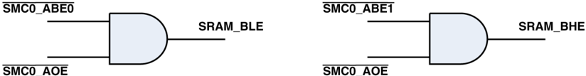

Silicon Anomaly List

## SHARC+ Dual Core

## DSP with ARM Cortex-A5

ADSP-SC582/583/584/587/589/ADSP-21583/584/587

## ABOUT ADSP-SC582/583/584/587/589/ADSP-21583/584/587 SILICON ANOMALIES

These anomalies represent the currently known differences between revisions of the SHARC+®ADSP-SC582/583/584/587/589/ADSP21583/584/587 product(s) and the functionality specified in the ADSP-SC582/583/584/587/589/ADSP-21583/584/587 data sheet(s) and the Hardware Reference book(s).

## SILICON REVISIONS

A silicon revision number with the form "-x.x" is branded on all parts. The REVID bits &lt;31:28&gt; of the TAPC0\_IDCODE register can be used to differentiate the revisions as shown below.

|   Silicon REVISION | TAPC0_IDCODE.REVID   |
|--------------------|----------------------|
|                1.2 | b#0100               |
|                1.0 | b#0010               |
|                0.1 | b#0001               |

## APPLICABILITY

Peripheral- and core-specific anomalies may not apply to all processors. See the table below for details. An "x" indicates that anomalies related to this peripheral/core apply only to the model indicated, and the list of specific anomalies for that peripheral/core appear in the rightmost column.

## Non-Automotive:

| Feature        | SC582   | SC583   | SC584   | SC587   | SC589   | 21583   | 21584   | 21587   | Anomalies          |
|----------------|---------|---------|---------|---------|---------|---------|---------|---------|--------------------|
| PCIe           |         |         |         |         | x       |         |         |         | 20000070           |
| ARMCortex-A5   | x       | x       | x       | x       | x       |         |         |         | 20000038, 20000082 |
| SHARC+ BootROM |         |         |         |         |         | x       | x       | x       | 20000089           |

## Automotive:

| Feature         | SC583W   | SC584W   | SC587W   | SC589W   | 21583W   | 21584W   | Anomalies          |
|-----------------|----------|----------|----------|----------|----------|----------|--------------------|
| MLB 3-pin/6-pin | x        | x        | x        | x        | x        | x        | 20000079           |
| ARMCortex-A5    | x        | x        | x        | x        |          |          | 20000038, 20000082 |
| SHARC+ BootROM  |          |          |          |          | x        | x        | 20000089           |

## ANOMALY LIST REVISION HISTORY

The following revision history lists the anomaly list revisions and major changes for each anomaly list revision.

| Date       | Anomaly List Revision   | Data Sheet Revision   | Additions and Changes                                                                                                           |
|------------|-------------------------|-----------------------|---------------------------------------------------------------------------------------------------------------------------------|
| 04/14/2023 | F                       | B                     | Added Anomaly 20000108, 20000123 Revised Anomalies 20000096, 20000031 for Clarity Fixed Anomaly 20000067 Workaround Description |
| 05/09/2019 | E                       | B                     | Added Anomaly 20000101                                                                                                          |
| 10/23/2018 | D                       | A                     | Added Silicon Revision 1.2 Added Anomalies 20000090, 20000091, 20000093, 20000094, 20000096                                     |

SHARC+ and SHARC are registered trademarks of Analog Devices, Inc.

## NR004444F

## [Document Feedback](https://form.analog.com/Form_Pages/feedback/documentfeedback.aspx?doc=ADSP-SC582_583_584_587_589_ADSP-21583_584_587_anomaly_list.pdf&product=ADSP-SC582%20ADSP-SC583%20ADSP-SC584%20ADSP-SC587%20ADSP-SC589%20ADSP-21583%20ADSP-21584%20ADSP-21587&rev=F)

Information  furnished  by  Analog  Devices  is  believed  to  be  accurate  and  reliable. However,  no  responsibility  is  assumed  by  Analog  Devices  for  its  use,  nor  for  any infringements of  patents  or  other  rights  of  third  parties  that  may  result  from  its  use. Specifications subject to change without notice. No license is granted by implication or otherwise  under  any  patent  or  patent  rights  of  Analog  Devices.  Trademarks  and registered trademarks are the property of their respective owners.

## ADSP-SC582/583/584/587/589/ADSP-21583/584/587

## SUMMARY OF SILICON ANOMALIES

The following table provides a summary of ADSP-SC582/583/584/587/589/ADSP-21583/584/587 anomalies and the applicable silicon revision(s) for each anomaly.

|   No. |       ID | Description                                                                                | Rev 0.1   | Rev 1.0   | Rev 1.2   |
|-------|----------|--------------------------------------------------------------------------------------------|-----------|-----------|-----------|
|     1 | 20000002 | Data Forwarding from Rn/Sn to DAG Register May Fail in Presence of Stalls                  | x         | x         | x         |
|     2 | 20000003 | Transactions on SPU and SMPU MMRRegions May Cause Errors                                   | x         | x         | x         |
|     3 | 20000005 | I12 Register Restrictions when BTB Is Enabled with Software Return Optimization            | x         | .         | .         |
|     4 | 20000006 | Consecutive Type1 Instructions with DM/PM Accesses to the Same Non-L1 Address Can Fail     | x         | .         | .         |
|     5 | 20000007 | Specific Cache Operations Must Be Performed from Critical Code Region to Complete Properly | x         | .         | .         |
|     6 | 20000009 | IDLE Instruction Cannot Follow within Five Instructions of a Data Cache Access             | x         | .         | .         |
|     7 | 20000010 | DMAAccess Conflicts with Data Cache Accesses Cause DMAFailure                              | x         | .         | .         |
|     8 | 20000013 | When Data Cache Is Disabled, External Reads Can Cause Instruction Cache Failures           | x         | .         | .         |
|     9 | 20000016 | In SIMD Mode, Loads of ASTATy for Use in Conditional Code Have 5-Cycle Effect Latency      | x         | .         | .         |
|    10 | 20000017 | Parity Error Status Gets Stuck when Parity Error Handler Code Is Not in L1 Memory          | x         | .         | .         |
|    11 | 20000018 | Speculative Read Accesses May Lead to System Hang                                          | x         | .         | .         |
|    12 | 20000019 | DMCMemory Regions Are Not Fully Accessible As VISA Instruction Memory                      | x         | .         | .         |
|    13 | 20000020 | Byte Modifiers in Specific DM/PM Data Load Sequence May Fail when Cache Is Enabled         | x         | .         | .         |
|    14 | 20000021 | L1 Cache Fast Interrupt Mode Feature Not Available                                         | x         | .         | .         |
|    15 | 20000022 | ASTAT.AZ Cannot Be Used to Determine the Success of an Exclusive Access Instruction        | x         | .         | .         |
|    16 | 20000023 | Short Word SIMD Data Must Be Short Word Aligned in L2 and External Memories                | x         | .         | .         |
|    17 | 20000024 | Consecutive Dual External Memory Accesses May Cause Read Data Corruption                   | x         | .         | .         |
|    18 | 20000028 | Full Data Cache Write-Back Does Not Complete Properly                                      | x         | .         | .         |
|    19 | 20000029 | L1 Cache Performance Degradation when Range-Based Non-Cacheability Feature Is Enabled      | x         | .         | .         |
|    20 | 20000030 | VISA Mode Type3C Read Instructions Following Conditional Writes May Fail                   | x         | .         | .         |
|    21 | 20000031 | GP Timer Generates First Interrupt/Trigger One Edge Late in EXTCLK Mode                    | x         | x         | x         |
|    22 | 20000032 | System MMRAccesses from L2/External Memory May Fail when Instruction Cache Is Enabled      | x         | .         | .         |
|    23 | 20000033 | EMDMABurst Mode Cannot Cross 4KB Boundaries in SHARC+ L1 Memory                            | x         | .         | .         |
|    24 | 20000034 | IIR Accelerator Save State Operation May Fail                                              | x         | .         | .         |
|    25 | 20000035 | Instruction Sequences with F0 Register As Compute Destination Cause Pipeline Stalls        | x         | .         | .         |
|    26 | 20000036 | Data Cache Line Fill May Fail if Preceded by Misaligned Data Cache Writethrough Operation  | x         | .         | .         |
|    27 | 20000037 | DMCRead State Machine May Not Be in a Correct State after DMCInitialization                | x         | x         | x         |
|    28 | 20000038 | ADI_ROM_BOOT_CONFIG::errorReturn Field Is Incorrect for ARM-Hosted Boot                    | x         | x         | x         |
|    29 | 20000039 | OTP API Does Not Report OTP Errors                                                         | x         | x         | x         |
|    30 | 20000040 | DMCIs Not Reset After PLL Frequency Changes Are Effected via BootROM                       | x         | .         | .         |
|    31 | 20000041 | Indirect Boot Blocks Not Supported                                                         | x         | .         | .         |
|    32 | 20000042 | ROMCode Does Not Update CGU0_CLKOUTSEL from OTP Memory Values                              | x         | .         | .         |
|    33 | 20000043 | Key Unwrapping on the SHARC+ Core Fails when Using ROMAPI                                  | x         | x         | x         |
|    34 | 20000044 | Ignore Blocks Are Not Supported in Page Mode for Non-Secure Slave Boot Modes               | x         | x         | x         |
|    35 | 20000045 | SHARC+ Cores Cannot Be Reset Via the RCU by Another Master Core                            | x         | .         | .         |
|    36 | 20000046 | TMUFault and Alert Status Bits Cannot Be Cleared Individually                              | x         | .         | .         |
|    37 | 20000047 | MMRSpace Protection via SPU Compromised by Reserved Memory Space Aliasing                  | x         | .         | .         |
|    38 | 20000048 | CGU0 Lock Write Error Bit Can Be Erroneously Set                                           | x         | x         | x         |
|    39 | 20000049 | SPI Transmit Collision Error May Be Missed                                                 | x         | .         | .         |
|    40 | 20000050 | SPORT May Erroneously Drive Data Pins During Inactive Channels in Multichannel Mode        | x         | x         | x         |
|    41 | 20000051 | Secure SPI Master Boot Only Supported from Memory-Mapped SPI Devices on SPI2               | x         | x         | x         |

## Silicon Anomaly List

## ADSP-SC582/583/584/587/589/ADSP-21583/584/587

|   No. |       ID | Description                                                                             | Rev 0.1   | Rev 1.0   | Rev 1.2   |
|-------|----------|-----------------------------------------------------------------------------------------|-----------|-----------|-----------|
|    42 | 20000052 | SPI Master Boot Fails When Block Payload Size Exceeds 65,532 Bytes                      | x         | x         | x         |
|    43 | 20000053 | Reading Certain PKTE Registers May Return Incorrect Data During Packet Processing       | x         | x         | x         |
|    44 | 20000054 | SPDIF_RX_TDMCLK_O Signal Cannot Be Routed in the SRU                                    | x         | .         | .         |
|    45 | 20000055 | ADI_ROM_BOOT_BUFFER Is Not Passed to User Callback Routines                             | x         | .         | .         |
|    46 | 20000061 | SPI Data Pins Are Driven High in Open-Drain Mode                                        | x         | .         | .         |
|    47 | 20000062 | Writes to the SPI_SLVSEL Register Do Not Take Effect                                    | x         | x         | x         |
|    48 | 20000063 | Reads of SPU_SECCHK by Non-Secure Masters Result in an Erroneous Violation Interrupt    | x         | .         | .         |
|    49 | 20000064 | Misaligned Data Cache Accesses May Affect L1 Parity Functionality                       | x         | .         | .         |
|    50 | 20000065 | L1 Cache Range-Based Functions Are Supported by Subset of Range Register Pairs          | x         | .         | .         |
|    51 | 20000066 | SMC Byte Enable Signals Tri-State During SMC Read Operations                            | x         | .         | .         |
|    52 | 20000067 | DMCClock Signal May Violate JEDEC Timing Specification in Self-Refresh Mode             | x         | x         | x         |
|    53 | 20000069 | PCSTK and MODE1STK Loads Do Not Occur If Next Instruction Is L2 or L3 Access            | x         | x         | x         |
|    54 | 20000070 | Special Programming Sequence for PCIE_PHY_TXDEEMPH/PCIE_PHY_TXSWING Registers           | x         | .         | .         |
|    55 | 20000072 | Floating-Point Computes Targeting F0 Register Can Cause Pipeline Stalls                 | x         | x         | x         |
|    56 | 20000073 | DDR Frequency Is Limited to 300 MHz When Using OTP for DMCProgramming                   | .         | x         | x         |
|    57 | 20000074 | Peripheral Interrupt Request for Link Port DMAIs Not Supported                          | x         | x         | x         |
|    58 | 20000075 | Link Port Cannot Trigger TRU Slaves when Deriving Its Clock from CGU1 Sources           | x         | x         | x         |
|    59 | 20000076 | SPI Slave Transmit DMAPeripheral Interrupt Is Generated Prematurely                     | x         | x         | x         |
|    60 | 20000077 | Bit Clear Instructions Affecting IRPTL Register Can Cause Core Hang when Single-Stepped | x         | x         | x         |
|    61 | 20000078 | Bit-Reversed Addressing Mode May Fail for Non-L1 Addresses                              | x         | x         | x         |
|    62 | 20000079 | MLB Operation at 3072x Fs and 4096x Fs Is Not Functional                                | x         | x         | x         |
|    63 | 20000080 | Quad-SPI Master Boot Modes Are Not Functional                                           | x         | x         | x         |
|    64 | 20000081 | SEC Interrupts Do Not Latch when Aligned with an Explicit Core Write to IRPTL Register  | x         | x         | x         |
|    65 | 20000082 | Unaligned Half-Word Reads of Non-Cacheable Memory Locations Return Incomplete Data      | x         | x         | x         |
|    66 | 20000083 | Speculatively Executed Pre-Modify DMReads Can Cause Processor Malfunction               | x         | x         | x         |
|    67 | 20000084 | Simultaneous OTP Accesses by Multiple Cores Can Cause Core Hang                         | x         | x         | x         |
|    68 | 20000087 | Computes Targeting F0 Register Can Cause Pipeline Stalls                                | x         | x         | x         |
|    69 | 20000089 | ADI_ROM_BOOT_CONFIG::errorReturn Field Is Incorrect for SHARC+-Hosted Boot              | x         | .         | .         |
|    70 | 20000090 | Single-Ended Clock/DQS Measurements May Violate JESD79-3E/-2E Vix and VSWING Specs      | x         | x         | x         |
|    71 | 20000091 | Accesses to DMC_CPHY_CTL Register Do Not Function As Expected                           | x         | x         | x         |
|    72 | 20000093 | Power-Up Sequencing May Cause Pins to Be Unexpectedly Driven                            | x         | x         | .         |
|    73 | 20000094 | SPDIF Receiver Output Clock Is Unreliable                                               | .         | x         | x         |
|    74 | 20000096 | Type 18a USTAT Instructions Fail When Following Specific Code Sequence                  | x         | x         | x         |
|    75 | 20000101 | SMPU Hang when Exclusive Read Arrives While Non-Exclusive Write Is Pending              | x         | x         | x         |
|    76 | 20000108 | Factory Serial Number Cannot Be Read When Device Is Locked                              | x         | x         | x         |
|    77 | 20000123 | Boot failure with Ignore Block in Page Mode                                             | x         | x         | x         |

Key: x = anomaly exists in revision

. = Not applicable

## ADSP-SC582/583/584/587/589/ADSP-21583/584/587

## DETAILED LIST OF SILICON ANOMALIES

The following list details all known silicon anomalies for the ADSP-SC582/583/584/587/589/ADSP-21583/584/587 including a description, workaround, and identification of applicable silicon revisions.

## 1.  20000002 - Data Forwarding from Rn/Sn to DAG Register May Fail in Presence of Stalls:

## DESCRIPTION:

An instruction involving a DAG operation such as address generation or modify following a type5a instruction may fail under the following conditions:

1. The type5a instruction updates the source register of the subsequent DAG operation.
2. The type5a instruction uses the same source register to both load to the DAG register and store the result of the compute operation.
3. The DAG operation follows within six instructions of the type5a instruction.
4. The pipeline is stalled due to a data/control dependency or an L1 memory bank conflict.

When these conditions are met, the type5a instruction produces the expected result and updates the DAG register correctly; however, the data forwarded to the DAG is incorrect, and the DAG register used as the destination in the subsequent DAG operation is incorrectly updated.

Consider the following type5a instruction sequence:

```
1: r2 = r2 - r13, i4 = r2; // r2 is destination of compute AND source of DAG load 2: if eq jump target1;     // Dependency on previous instruction stalls the pipe 3: nop; 4: nop; 5: nop; 6: nop; 7: i5 = b2w (i4);          // Uses source register (i4) stored to by type5a instruction
```

In the above case, i5 (line 7) is updated with an incorrect value, even though i4 (line 1) contains the correct value. The same would be true if the instruction on line 7 appeared anywhere in lines 3 through 6.

## WORKAROUND:

There are two potential workarounds for this issue:

1. Split the type5a instruction which conforms to the use case into two separate instructions.
2. Avoid using the relevant DAG register in a DAG operation within six instructions of the type5a instruction.

This workaround may be built into the development tool chain and/or into the operating system source code. For tool chains and operating systems supported by Analog Devices, please consult the "Silicon Anomaly Tools Support" help page in the applicable documentation and release notes for details.

For all other tool chains and operating systems, see the appropriate supporting documentation for details.

## APPLIES TO REVISION(S):

0.1,  1.0,  1.2

## 2.  20000003 - Transactions on SPU and SMPU MMR Regions May Cause Errors:

## DESCRIPTION:

Non-secure reads or writes to the upper half of each SPU and SMPU instance's MMR space will be erroneously blocked and cause a bus error when configured as a non-secure slave.

For each instance of the SPU and SMPU, the affected MMR address range can be calculated as follows:

- Lower bound = Instance Address Offset + 0x800
- Upper bound = Instance Address Offset + 0xFFF

## WORKAROUND:

Do not access the documented system MMR ranges from a non-secure slave.

## APPLIES TO REVISION(S):

0.1,  1.0,  1.2

## Silicon Anomaly List

## ADSP-SC582/583/584/587/589/ADSP-21583/584/587

## 3.  20000005 - I12 Register Restrictions when BTB Is Enabled with Software Return Optimization:

## DESCRIPTION:

When the BTB is enabled with software return optimization, the branch target address is predicted by reading the value of the I12 register instead of the branch target buffer itself. Hence, loading the I12 register with an invalid instruction address will result in unpredictable core behavior.

## WORKAROUND:

If software return optimization is enabled in the BTB, use the I12 register for instruction addressing purposes only.

This workaround may be built into the development tool chain and/or into the operating system source code. For tool chains and operating systems supported by Analog Devices, please consult the "Silicon Anomaly Tools Support" help page in the applicable documentation and release notes for details.

For all other tool chains and operating systems, see the appropriate supporting documentation for details.

## APPLIES TO REVISION(S):

0.1

## 4.  20000006 - Consecutive Type1 Instructions with DM/PM Accesses to the Same Non-L1 Address Can Fail:

## DESCRIPTION:

When type1 instructions make parallel (PM and DM) data accesses, the processor performs the DM access first. However, this DM-PM priority may be violated when two consecutive type1 instructions occur, where:

1. the DM access is a write and the PM access is a read, and
2. both the read and write accesses are to the same L2 or external memory address.

For example:

```
dm(addrA) = r0, r1 = pm(addrA);  // addrA points to non-L1 memory dm(addrB) = r2, r3 = pm(addrB);  // addrB points to non-L1 memory
```

In this sequence, the second instruction may load r3 with the previous value at the addrB location rather than the value that should have been written from r2 in the DM write portion to addrB of the same instruction.

## WORKAROUND:

Avoid issuing consecutive type1 instructions having DM-PM sequence dependencies when the DM write access and PM read access are to the same non-L1 memory address. Any instruction that is not of the same form can be inserted between the two instructions to avoid the issue.

## APPLIES TO REVISION(S):

0.1

## ADSP-SC582/583/584/587/589/ADSP-21583/584/587

## 5.  20000007 - Specific Cache Operations Must Be Performed from Critical Code Region to Complete Properly:

## DESCRIPTION:

The type20a instructions used for cache flush ( FLUSH PM\_CACHE; and FLUSH DM\_CACHE; ), invalidate ( INVALIDATE PM\_CACHE; , INVALIDATE DM\_CACHE; , and INVALIDATE I\_CACHE; ), and write-back ( WRITEBACK PM\_CACHE; and WRITEBACK

DM\_CACHE;

) operations will not complete properly when either:

1. an interrupt occurs while an L1 cache range-based write-back invalidation is in progress, or
2. an instruction affecting the cache state is executed within five instructions of the cache instruction.

When either of the above criteria is met, some cache lines may be written back improperly even though the cache status bits are properly updated, which will result in subsequent accesses to these locations in either DM or PM memory retrieving incorrect information, leading to potential data corruption and/or invalid code execution.

## WORKAROUND:

Each of the identified cache operations must be executed from a critical region of code and followed by five instructions that make no cache memory accesses nor cache configuration changes (i.e., NOP; or compute instructions only). As these operations are typically performed as multiple instructions within a loop, each affected cache instruction must be followed by the five unrelated instructions. The critical region where interrupts must be disabled is from immediately before setting the range registers to the end of the flush loop. To minimize the time where interrupts are disabled, it is recommended to split the entire range into smaller ranges.

This workaround may be built into the development tool chain and/or into the operating system source code. For tool chains and operating systems supported by Analog Devices, please consult the "Silicon Anomaly Tools Support" help page in the applicable documentation and release notes for details.

For all other tool chains and operating systems, see the appropriate supporting documentation for details.

## APPLIES TO REVISION(S):

0.1

## 6.  20000009 - IDLE Instruction Cannot Follow within Five Instructions of a Data Cache Access:

## DESCRIPTION:

When L1 data cache is enabled, an IDLE instruction following within five instructions of a data cache access can cause the access to incorrectly abort, thus leading to unpredictable program behavior.

## WORKAROUND:

IDLE instructions must be preceded by five instructions that do not contain data cache accesses.

This workaround may be built into the development tool chain and/or into the operating system source code. For tool chains and operating systems supported by Analog Devices, please consult the "Silicon Anomaly Tools Support" help page in the applicable documentation and release notes for details.

For all other tool chains and operating systems, see the appropriate supporting documentation for details.

## APPLIES TO REVISION(S):

0.1

## 7.  20000010 - DMA Access Conflicts with Data Cache Accesses Cause DMA Failure:

## DESCRIPTION:

DM and PM data cache accesses utilize block 1 and block 2 of L1 memory, respectively. When L1 data cache is enabled, DMA accesses to these blocks may not work as expected when there is a conflict between the DMA access and the data cache access. Multiple application failures may result from this scenario, including DMA malfunction, core hangs, and data corruption in the DMA buffer.

## WORKAROUND:

When L1 cache is enabled, do not use DMA to access the memory regions associated with the cache memory.

## APPLIES TO REVISION(S):

0.1

## Silicon Anomaly List

## ADSP-SC582/583/584/587/589/ADSP-21583/584/587

## 8.  20000013 - When Data Cache Is Disabled, External Reads Can Cause Instruction Cache Failures:

## DESCRIPTION:

When instruction cache is enabled with data cache disabled, external data reads may cause the instruction cache to malfunction. When an instruction cache hit occurs during the instruction fetch portion of the pipeline, the stall required for an executing external data fetch to complete properly may get disregarded. This can result in an appropriately fetched cached instruction being replaced by either a valid unexpected instruction or an illegal instruction, which can lead to erroneous program execution or a core malfunction, respectively. The same scenario is possible when an instruction cache miss associated with L2 source memory results in an instruction cache line fill that completes faster than the external access, which may be the case when the data read is from L3 memory.

## WORKAROUND:

Enable data cache memory. This enables handshaking between the instruction and data cache controllers, which rectifies this issue. If data cache cannot be enabled, then external data reads must be avoided.

## APPLIES TO REVISION(S):

0.1

## 9.  20000016 - In SIMD Mode, Loads of ASTATy for Use in Conditional Code Have 5-Cycle Effect Latency:

## DESCRIPTION:

When SIMD mode is enabled, loads to the ASTATy register require five cycles of effect latency instead of the expected one cycle of effect latency. This is true for both implicit and explicit loads from both the register file and from memory. For example:

```
bit set mode1 PEYEN;          // SIMD mode enabled Case 1: ASTATx = r0;          // implicit load to ASTATy from register file Case 2: ASTATy = dm(1, I7);   // explicit load to ASTATy from memory if eq jump condition;         // conditional code
```

The expected behavior is for the effect latency to be one cycle, meaning the conditional code should be able to immediately follow the load for both cases above; however, because of the anomaly, the effect latency can be up to five cycles before the conditional code behaves properly.

## WORKAROUND:

If SIMD mode is enabled, ensure that the ASTATy load instruction is separated from the conditional code that relies on the new content by five unrelated instructions. For the example given above:

```
bit set mode1 PEYEN;          // SIMD mode enabled Case 1: ASTATx = r0;          // implicit load to ASTATy from register file Case 2: ASTATy = dm(1, I7);   // explicit load to ASTATy from memory nop; nop; nop; nop; nop;      // can be any 5 non-ALU instructions if eq jump condition;         // conditional code
```

This workaround may be built into the development tool chain and/or into the operating system source code. For tool chains and operating systems supported by Analog Devices, please consult the "Silicon Anomaly Tools Support" help page in the applicable documentation and release notes for details.

For all other tool chains and operating systems, see the appropriate supporting documentation for details.

## APPLIES TO REVISION(S):

0.1

## ADSP-SC582/583/584/587/589/ADSP-21583/584/587

## 10.  20000017 - Parity Error Status Gets Stuck when Parity Error Handler Code Is Not in L1 Memory:

## DESCRIPTION:

When an instruction parity error occurs and causes a vector to a non-L1 memory location (e.g., the interrupt service routine is in L2/L3 memory), the parity error will not get cleared even if the GPERR\_STAT register is explicitly cleared to zero. This results in the parity error interrupt request being continuously raised, and program execution will loop infinitely in the parity error handler routine.

## WORKAROUND:

As parity error handlers are recommended to be in non-cached non-L1 memory, the criteria required for the anomaly to manifest is inherently met. To work around the issue, implement the parity handler routine in L2/L3 memory as follows:

1. Clear the condition which caused the parity error.
2. Re-initialize the memory to a known state to reset the parity bits.
3. Add a dummy branch to L1 to clear the parity error status bits.
4. Complete the ISR and return to application.

## APPLIES TO REVISION(S):

0.1

## 11.  20000018 - Speculative Read Accesses May Lead to System Hang:

## DESCRIPTION:

Speculative read accesses can occur when the pipeline flushes as a result of an unexpected change in program flow (e.g., interrupts, conditional code, etc.). When this occurs, any non-MMR read access instruction that is not yet to the execute stage gets properly aborted; however, pre-fetching of data to support the pipelined instructions is occurring ahead of the execution stage. If any of these speculative read accesses target inaccessible or uninitialized memory, it can cause a core hang.

The memory regions that are sensitive to this anomaly include all external memory accessed via the two DDR controllers (DMC0 and DMC1) and the SMC, as well as multiprocessor L1 space, PCIe data space, and memory-mapped SPI2 memory space.

## WORKAROUND:

All of the following guidance must be adhered to in order to avoid this issue:

1. For DMC0, DMC1, SMC, and PCIe data memory regions, it is sufficient to ensure that the associated controllers are properly initialized such that read responses are always generated in the hardware, thus avoiding the hang condition. If any of these memory spaces is not in use, configure the appropriate System Memory Protection Unit (SMPU) to block core accesses to each unused region.
2. There is no SMPU associated with multiprocessor L1 memory space, so the only means of ensuring that the hang is not possible is to ensure that neither core is held in reset.
3. Similarly, the SPI2 memory space cannot be blocked via the SMPU. If the SPI2 memory region is not in use, the SPI2 controller must still be initialized in memory-mapped mode to support potential speculative reads to this space, per the following code:

```
*pREG_SPI2_TXCTL = (BITM_SPI_TXCTL_TEN | BITM_SPI_TXCTL_TTI); *pREG_SPI2_RXCTL = (BITM_SPI_RXCTL_REN | BITM_SPI_RXCTL_RTI); *pREG_SPI2_CTL   = (BITM_SPI_CTL_EN|BITM_SPI_CTL_MSTR| BITM_SPI_CTL_MMSE);
```

This workaround may be built into the development tool chain and/or into the operating system source code. For tool chains and operating systems supported by Analog Devices, please consult the "Silicon Anomaly Tools Support" help page in the applicable documentation and release notes for details.

For all other tool chains and operating systems, see the appropriate supporting documentation for details.

## APPLIES TO REVISION(S):

0.1

## Silicon Anomaly List

## ADSP-SC582/583/584/587/589/ADSP-21583/584/587

## 12.  20000019 - DMC Memory Regions Are Not Fully Accessible As VISA Instruction Memory:

## DESCRIPTION:

One-third of the address space associated with each of the DMC controllers is inaccessible as VISA instruction memory, specifically:

```
DMC0 VISA Space: 0x00900000 to 0x009FFFFF DMC1 VISA Space: 0x00D00000 to 0x00DFFFFF
```

## WORKAROUND:

Ensure that these memory regions are not populated as VISA instruction memory space by making the appropriate modifications to the project's linker description file (LDF).

This workaround may be built into the development tool chain and/or into the operating system source code. For tool chains and operating systems supported by Analog Devices, please consult the "Silicon Anomaly Tools Support" help page in the applicable documentation and release notes for details.

For all other tool chains and operating systems, see the appropriate supporting documentation for details.

## APPLIES TO REVISION(S):

0.1

## 13.  20000020 - Byte Modifiers in Specific DM/PM Data Load Sequence May Fail when Cache Is Enabled:

## DESCRIPTION:

When data cache is enabled, an L1 data cache write back access can fail when the DM data access to external memory is followed by a PM access with a byte modifier, as in the following sequence:

```
dm(i0,m0) = r0;      // DM write, where I0 points to external memory pm(i8,m8) = r1 (BW); // PM access with byte modifier
```

When this occurs, one of the bytes in the implicit write of the cache access will be incorrect.

## WORKAROUND:

One unrelated instruction must be inserted between the DM access to external memory and the PM access with the byte modifier. For example:

```
dm(i0,m0) = r0;       // DM write, where I0 points to external memory NOP;                  // One unrelated instruction pm(i8,m8) = r1 (BW);  // PM access with byte modifier
```

This workaround may be built into the development tool chain and/or into the operating system source code. For tool chains and operating systems supported by Analog Devices, please consult the "Silicon Anomaly Tools Support" help page in the applicable documentation and release notes for details.

For all other tool chains and operating systems, see the appropriate supporting documentation for details.

## APPLIES TO REVISION(S):

0.1

## 14.  20000021 - L1 Cache Fast Interrupt Mode Feature Not Available:

## DESCRIPTION:

The fast interrupt servicing mode feature, enabled by the FISREN bit in the L1 cache configuration register ( SHL1C\_CFG ), is not implemented.

## WORKAROUND:

Do not set the SHL1C\_CFG.FISREN bit.

## APPLIES TO REVISION(S):

0.1

## ADSP-SC582/583/584/587/589/ADSP-21583/584/587

## 15.  20000022 - ASTAT.AZ Cannot Be Used to Determine the Success of an Exclusive Access Instruction:

## DESCRIPTION:

When exclusive load and store accesses are used, the ASTATx.AZ flag (and the ASTATy.AZ flag, when SIMD is enabled) should reflect whether the access was successful (set) or not (cleared). This functionality is not reliable, whether cache memory is enabled or disabled.

## WORKAROUND:

For exclusive read accesses, do not check for status following the access. Ensure that the access is targeted to one of the following spaces:

1. L2 memory
2. DMC0 or DMC1 memory (after DMC initialization is completed)
3. SMC

For exclusive write operations, check the SMPU\_EXACSTATx.VALID bit after the access to determine whether or not it was successful (success = 1, failure = 0).

This workaround may be built into the development tool chain and/or into the operating system source code. For tool chains and operating systems supported by Analog Devices, please consult the "Silicon Anomaly Tools Support" help page in the applicable documentation and release notes for details.

For all other tool chains and operating systems, see the appropriate supporting documentation for details.

## APPLIES TO REVISION(S):

0.1

## 16.  20000023 - Short Word SIMD Data Must Be Short Word Aligned in L2 and External Memories:

## DESCRIPTION:

When SIMD is enabled, all short word data accesses to L2 and external memory locations must be short word aligned.

## WORKAROUND:

Ensure that short word L2 and external memory accesses (e.g., of the form DM/PM(Ix,My)(sw) ) are short word aligned ( Ix points to a short word aligned memory location).

This workaround may be built into the development tool chain and/or into the operating system source code. For tool chains and operating systems supported by Analog Devices, please consult the "Silicon Anomaly Tools Support" help page in the applicable documentation and release notes for details.

For all other tool chains and operating systems, see the appropriate supporting documentation for details.

## APPLIES TO REVISION(S):

0.1

## Silicon Anomaly List

## ADSP-SC582/583/584/587/589/ADSP-21583/584/587

## 17.  20000024 - Consecutive Dual External Memory Accesses May Cause Read Data Corruption:

## DESCRIPTION:

If there are more than two external memory reads and more than two external memory writes in a four-instruction sequence, the second set of read accesses can be corrupted.

Consider the following sequence of instructions, where I0 , I8 , I1 , and I9 point to external memory addresses:

```
1: R0 = dm(I0, M0), R1 = pm(I8,M8); 2: dm(I1, M0) = R0, pm(I9,M8) = R1; 3: R0 = dm(I0, M0), R1 = pm(I8,M8); 4: dm(I1, M0) = R0, pm(I9,M8) = R1;
```

In the above sequence, the read data ( R0 and R1 on line 3) may get corrupted, thus causing the writes in line 4 to also be corrupted.

## WORKAROUND:

Avoid having more than two external memory reads and greater than two external memory writes within a four-instruction sequence.

This workaround may be built into the development tool chain and/or into the operating system source code. For tool chains and operating systems supported by Analog Devices, please consult the "Silicon Anomaly Tools Support" help page in the applicable documentation and release notes for details.

For all other tool chains and operating systems, see the appropriate supporting documentation for details.

## APPLIES TO REVISION(S):

0.1

## 18.  20000028 - Full Data Cache Write-Back Does Not Complete Properly:

## DESCRIPTION:

When the full data cache write-back feature is enabled ( SHL1C\_CFG.DMCAWB and/or SHL1C\_CFG.PMCAWB is set), the last line of way1 is not written back, even if the line is dirty and should be written back.

## WORKAROUND:

Before performing a full data cache write back, execute 12 dummy read accesses (six DM and six PM ) to external memory addresses that would fall on the last line of the cache but are in non-cacheable memory, per the following pseudo-code:

```
A = dm(0x2008FFC0) A = dm(0x2009FFC0) A = dm(0x200AFFC0) A = dm(0x200BFFC0) A = dm(0x2018FFC0) A = dm(0x2019FFC0) A = pm(0x2008FFC0) A = pm(0x2009FFC0) A = pm(0x200AFFC0) A = pm(0x200BFFC0) A = pm(0x2018FFC0) A = pm(0x2019FFC0)
```

If the example addresses above are in cacheable memory in the application, select similar addresses that are in non-cacheable memory space such that the Tag field of the addresses is different for each of the six accesses applying to both the DM and PM sequences.

This workaround may be built into the development tool chain and/or into the operating system source code. For tool chains and operating systems supported by Analog Devices, please consult the "Silicon Anomaly Tools Support" help page in the applicable documentation and release notes for details.

For all other tool chains and operating systems, see the appropriate supporting documentation for details.

## APPLIES TO REVISION(S):

0.1

## ADSP-SC582/583/584/587/589/ADSP-21583/584/587

## 19.  20000029 - L1 Cache Performance Degradation when Range-Based Non-Cacheability Feature Is Enabled:

## DESCRIPTION:

If the range-based non-cacheability feature is enabled, additional addresses in cacheable memory regions which satisfy the following conditions will also be made non-cacheable:

1. External memory VISA addresses overlapping with the lower 24 bits of the addresses in the range register pair.
2. External memory non-VISA addresses (multiplied by 3) overlapping with the lower 25 bits of the addresses in the range register pair.

As a result, accesses to these affected ranges will not utilize the cache and will require more cycles to execute, despite cache functionality being enabled.

## WORKAROUND:

Ensure that cacheable VISA and non-VISA instruction memory ranges do not overlap with the non-cacheable region defined by the range register pair, as described above.

This workaround may be built into the development tool chain and/or into the operating system source code. For tool chains and operating systems supported by Analog Devices, please consult the "Silicon Anomaly Tools Support" help page in the applicable documentation and release notes for details.

For all other tool chains and operating systems, see the appropriate supporting documentation for details.

## APPLIES TO REVISION(S):

0.1

## 20.  20000030 - VISA Mode Type3C Read Instructions Following Conditional Writes May Fail:

## DESCRIPTION:

In VISA mode, an aborted conditional write instruction will erroneously forward the write data to an immediately following type3C read instruction that accesses the same address. Consider the following code sequence:

```
if eq dm(i0,m0) = r5;   // Conditional write r0 = dm(i4,m4);          // Type3C read
```

In this sequence, the conditional write gets aborted if ASTAT.AZ = 0. When this occurs, the subsequent type3C read instruction will forward the data from r5 to r0 if i4 points to the same address as i0 . Even though the conditional write does not take place, the read behaves as though it did when the subsequent read access is to the same address.

## WORKAROUND:

If using Visa mode is a requirement, type3C read instructions from a specific address must not immediately follow a conditional write instruction to that same address. There are two possible workarounds:

1. Use assembler directives to force the type3C read instruction to be an uncompressed (non-VISA) 48-bit instruction:
2. Insert a NOP; instruction between the conditional write and the type3C read instruction:

```
if eq dm(i0,m0) = r5; .NOCOMPRESS; R0 = dm(i4,m4);   // Type3C read .FORCECOMPRESS;
```

```
if eq dm(i0,m0) = r5; NOP; R0 = dm(i4,m4);   // Type3C read
```

This workaround may be built into the development tool chain and/or into the operating system source code. For tool chains and operating systems supported by Analog Devices, please consult the "Silicon Anomaly Tools Support" help page in the applicable documentation and release notes for details.

For all other tool chains and operating systems, see the appropriate supporting documentation for details.

## APPLIES TO REVISION(S):

0.1

## Silicon Anomaly List

## ADSP-SC582/583/584/587/589/ADSP-21583/584/587

## 21.  20000031 - GP Timer Generates First Interrupt/Trigger One Edge Late in EXTCLK Mode:

## DESCRIPTION:

When any GP Timer is configured in External Clock mode, the first interrupt/trigger should occur when the corresponding TIMER\_DATA\_ILAT bit sets after the TIMER\_TMRn\_CNT register reaches the value programmed in the TIMER\_TMRn\_PER register. Instead, the interrupt/trigger and the setting of the TIMER\_DATA\_ILAT bit occur one signal edge later. At this point, the TIMER\_TMRn\_CNT register will have rolled over to 1. Subsequent interrupts/triggers occur after the correct number of edges.

For example, if TIMER\_TMRn\_PER =7, the first interrupt/trigger will occur after the timer pin samples eight edges. From that point forward, interrupts/triggers will correctly occur every seven signal edges.

## WORKAROUND:

For interrupts/triggers to occur every n edges detected on the timer pin, the TIMER\_TMRn\_PER register must be configured to n-1 for the initial event and then reprogrammed to n for subsequent events, as shown in the following pseudocode:

```
TIMER_TMRn_PER = n-1;   // Configure PERIOD register with n-1 TIMER_RUN_SET = 1;      // Enable the timer TIMER_TMRn_PER = n;     // Configure PERIOD register with n
```

The second write to the TIMER\_TMRn\_PER register does not take effect until the 2nd period; therefore, this sequence can be performed when the timer is first enabled.

## APPLIES TO REVISION(S):

0.1,  1.0,  1.2

## 22.  20000032 - System MMR Accesses from L2/External Memory May Fail when Instruction Cache Is Enabled:

## DESCRIPTION:

When instruction cache memory is enabled, system MMR accesses from L2 or external memory may fail.

## WORKAROUND:

If instruction cache is enabled, all system MMR accesses must be performed from L1 memory.

This workaround may be built into the development tool chain and/or into the operating system source code. For tool chains and operating systems supported by Analog Devices, please consult the "Silicon Anomaly Tools Support" help page in the applicable documentation and release notes for details.

For all other tool chains and operating systems, see the appropriate supporting documentation for details.

## APPLIES TO REVISION(S):

0.1

## 23.  20000033 - EMDMA Burst Mode Cannot Cross 4KB Boundaries in SHARC+ L1 Memory:

## DESCRIPTION:

AXI protocol forbids burst accesses from crossing 4KB boundaries in memory. For EMDMA operation, burst mode is enabled when the EMDMA modifier ( EMDMA\_MOD0/EMDMA\_MOD1 ) is set to 1. When this is the case, EMDMA operation may fail if the associated DMA address range ( EMDMA\_INDX0/1 to EMDMA\_INDX0/1 + EMDMA\_CNT0/1 ) crosses a SHARC+ L1 memory 4KB boundary.

For example, suppose an EMDMA is configured to transfer 1024 bytes from L2 memory to SHARC+ core1 L1 memory such that EMDMA\_INDX0 =0x2C1FEC and EMDMA\_CNT0 =1024. In this case, the EMDMA write will span the 4KB boundary at address 0x2C2000 , and some of the words might not get transferred correctly from L2 to L1.

## WORKAROUND:

The anomaly does not apply when the EMDMA channel is not in burst mode, so setting the modify value to anything other than one avoids it.

If the EMDMA modifier must be one, ensure that:

1. the start address in SHARC+ L1 memory ( EMDMA\_INDX0/1 ) is aligned to a 32-byte (i.e., eight 32-bit words) boundary, AND
2. the count associated with the SHARC+ L1 memory side of the transfer ( EMDMA\_CNT0/1 ) is a multiple of eight.

## APPLIES TO REVISION(S):

0.1

## 24.  20000034 - IIR Accelerator Save State Operation May Fail:

## DESCRIPTION:

The Save State Operation feature enabled by the IIR\_CTL1.SS bit is used to write back the biquad state DK1 and DK2 values to the coefficient buffer such that they can be used in later iterations using the IIR Accelerator. Due to this anomaly, the IIR Accelerator may write back incorrect or duplicate DK1 and/or DK2 values to the coefficient buffer.

## WORKAROUND:

Use the IIR Accelerator in Debug mode to explicitly read the DK1 and DK2 values, and store them to the coefficient buffer manually using core accesses. For more details regarding the use of Debug mode to access the biquad state variables, please refer to the "Reading from Local Memory" and the "Writing to Local Memory" sections of the Programming Model in the IIR Accelerator chapter of the hardware reference manual.

## APPLIES TO REVISION(S):

0.1

## 25.  20000035 - Instruction Sequences with F0 Register As Compute Destination Cause Pipeline Stalls:

## DESCRIPTION:

Pipeline stalls can occur if a compute instruction updating the F0 register is followed immediately by:

1. an instruction that has a null compute field: F0 = F1 * F2; DM(I0,M0)=R4, R5=PM(I8,M8);     // Type1 instruction with null compute field 2. (when in VISA space) a compressed instruction: F0 = F2 COPYSIGN F4; NOP;                            // 16-bit instruction R1 = DM(I2,M4), R0 = PM(I8,M9);

## WORKAROUND:

There are two workarounds:

1. Avoid using F0 as the compute destination register in the above instruction sequences.
2. Ensure that the instruction that immediately follows the compute instruction is neither of the two types identified above.

## APPLIES TO REVISION(S):

0.1

## Silicon Anomaly List

## ADSP-SC582/583/584/587/589/ADSP-21583/584/587

## 26.  20000036 - Data Cache Line Fill May Fail if Preceded by Misaligned Data Cache Writethrough Operation:

## DESCRIPTION:

A misaligned write access spans two cache lines in memory. In write-through mode, writes to cached data immediately get forwarded to the source memory as part of a full cache line write. When both cache lines associated with the misaligned write access are cache hits or both are cache misses, there is no issue; however, if only one of these two neighboring cache lines is in the cache when the write occurs, then a "partial cache hit" occurs, where a full cache line write-through operation is initiated for the piece of data that is in the cache, which is followed by an external write to update the piece of data that is not in the cache. This combined external write operation can fail if a subsequent read access initiates a cache line fill to the same adjacent cache line containing the data that was a "partial cache miss" in the previous write. Consider the following code sequence:

```
1: dm(i0, m3) = r7, r8 = pm(i11, m13);  // i0 = 0x2008D4BE, m3 = 0x3 2: r1 = dm(i0, m0), pm(i11, m11) = r9;
```

In this sequence, when the DM write on line 1 is a cache hit for the cache line containing the first location being accessed (0x2008D4BE) and a cache miss for the line beginning at the 0x2008D4C0 location, then the DM read in line 2 will result in a cache miss when attempting to read address 0x2008D4CA after the m3 post-modify is applied to i0 . This results in a cache line fill operation that gets launched before the external write access required to update the uncached portion of the DM write in line 1 completes. As such, the DM read in line 2 returns the previous content rather than that written in line 1, which will lead to unpredictable application behavior. Even though the external write operation from line 1 does properly complete after the cache line fill from the line 2 DM read, the cached memory is no longer coherent, and the written data will eventually be overwritten when the corresponding cache line is updated, evicted, or flushed.

If the above sequence were inverted such that line 2 executed first, then the same anomaly would apply to the consecutive PM data write and read accesses, provided that the same criteria is met:

1. the PM write to the i11 address is a misaligned access,
2. only one of the two cache lines straddled by the PM write access is a PM data cache hit, and
3. the m11 post-modify to the write operation results in the subsequent read targeting the uncached neighboring cache line.

## WORKAROUND:

When using either the PM or DM data cache in write-through mode, misaligned accesses must be avoided, which is accomplished by adhering to the following data alignment restrictions:

1. All byte word data is short word aligned in the cacheable source memory.
2. All short word data is normal word aligned in the cacheable source memory.
3. All normal/long word data is long word aligned in the cacheable source memory.

## APPLIES TO REVISION(S):

0.1

## ADSP-SC582/583/584/587/589/ADSP-21583/584/587

## 27.  20000037 - DMC Read State Machine May Not Be in a Correct State after DMC Initialization:

## DESCRIPTION:

DMC read accesses require that the DMC read state machine be in the correct state. Due to this anomaly, the DMC read state machine may not be in a correct state after initialization, which may result in DMC read failures.

## WORKAROUND:

After DMC initialization, the data capture logic must be reset to place the DMC read state machine into a valid state. For example, the following C code can be used for DMC0:

```
#include <sys/platform.h>  /* defines REG and BITM macros used below */ uint32_t uiDMC_Data; uiDMC_Data = (void)(*((volatile uint32_t *)0x80000000uL)); /* Dummy DMC memory read */ *pREG_DMC0_PHY_CTL0 |= BITM_DMC_PHY_CTL0_RESETDAT;         /* Set DMCx_PHY_CTL0.RESETDAT */ *pREG_DMC0_PHY_CTL0 &= ~BITM_DMC_PHY_CTL0_RESETDAT;        /* Clear DMCx_PHY_CTL0.RESETDAT */
```

This workaround may be built into the development tool chain and/or into the operating system source code. For tool chains and operating systems supported by Analog Devices, please consult the "Silicon Anomaly Tools Support" help page in the applicable documentation and release notes for details.

For all other tool chains and operating systems, see the appropriate supporting documentation for details.

## APPLIES TO REVISION(S):

0.1,  1.0,  1.2

## 28.  20000038 - ADI\_ROM\_BOOT\_CONFIG::errorReturn Field Is Incorrect for ARM-Hosted Boot:

## DESCRIPTION:

On ADSP-SC58x processors, the ARM core hosts the boot process for the device. If the boot process results in entry to the bootrom\_error\_handler function, the value in the ADI\_ROM\_BOOT\_CONFIG::errorReturn field of the structure cannot be used to determine the instruction that resulted in the call to the error handler.

## WORKAROUND:

Halt the ARM core to find the address of the instruction that called the error handler. Execution should be in the idle loop of the error handler routine.

1. Read the current stack pointer from the LR register.
2. Add 12 (0xC) to the read value.

The 32-bit address at this resulting value's location is the Thumb address of the instruction following the call to the error handler function.

## APPLIES TO REVISION(S):

0.1,  1.0,  1.2

## 29.  20000039 - OTP API Does Not Report OTP Errors:

## DESCRIPTION:

The errors in the OTP controller are masked when using the OTP API.

## WORKAROUND:

If desired, application code can check the OTP status register manually for errors.

## APPLIES TO REVISION(S):

0.1,  1.0,  1.2

## Silicon Anomaly List

## ADSP-SC582/583/584/587/589/ADSP-21583/584/587

## 30.  20000040 - DMC Is Not Reset After PLL Frequency Changes Are Effected via Boot ROM:

## DESCRIPTION:

The ROM code that utilizes OTP memory settings to initialize the DMC controller does not reset the DLL after a change is made to the PLL frequency. As a result, the internal DLL fails to lock to the new frequency and the DMC initialization fails.

## WORKAROUND:

Do not use the ROM API to perform this task.

## APPLIES TO REVISION(S):

0.1

## 31.  20000041 - Indirect Boot Blocks Not Supported:

## DESCRIPTION:

Indirect blocks allows the booting of data via intermediate internal buffers. The boot ROM does not detect when the BFLAG\_INDIRECT flag is set in the block header in the boot stream, therefore this function is unavailable.

## WORKAROUND:

Do not use indirect blocks in the boot stream.

## APPLIES TO REVISION(S):

0.1

## 32.  20000042 - ROM Code Does Not Update CGU0\_CLKOUTSEL from OTP Memory Values:

## DESCRIPTION:

The CGU0\_CLKOUTSEL register is not updated by the ROM code, even though it is enabled and configured in the OTP memory to do so.

## WORKAROUND:

None

## APPLIES TO REVISION(S):

0.1

## 33.  20000043 - Key Unwrapping on the SHARC+ Core Fails when Using ROM API:

## DESCRIPTION:

If the stack is mapped to L1 memory, the SHARC+ ROM API call for BLw (key unwrapping) secure boot fails. Key unwrap operation uses the PKTE DMA engine, which is configured to work only with L2 space in the boot ROM.

## WORKAROUND:

The ROM API application must resolve the stack to either L2 or L3 memory.

## APPLIES TO REVISION(S):

0.1,  1.0,  1.2

## 34.  20000044 - Ignore Blocks Are Not Supported in Page Mode for Non-Secure Slave Boot Modes:

## DESCRIPTION:

Page mode allows for boot transfers of larger blocks of data via an intermediate buffer. When Ignore blocks are processed in Slave Boot modes with Page mode enabled, they should be transferred to the intermediate buffer. Instead, the data is discarded, thus resulting in the boot kernel failing to process data from the intermediate buffer correctly.

## WORKAROUND:

When using Slave Boot modes, do not enable Page mode. Page mode is disabled by default and can only be enabled using the boot API or via initialization code.

## APPLIES TO REVISION(S):

0.1,  1.0,  1.2

## ADSP-SC582/583/584/587/589/ADSP-21583/584/587

## 35.  20000045 - SHARC+ Cores Cannot Be Reset Via the RCU by Another Master Core:

## DESCRIPTION:

When a SHARC+ core is executing an IDLE; instruction, the ARM core or the other SHARC+ core should be able to issue a reset via the RCU as follows:

1. Clear the previous core reset status bits in RCU\_CRSTAT .
2. Set the appropriate RCU\_SIDIS.SI[n] bit for the SHARC+ core.
3. Wait for the acknowledgement from the SHARC+ core by polling the appropriate RCU\_SISTAT.SI[n] bit.

However, the SHARC+ core does not send the acknowledge when it is executing an IDLE; instruction, hence the RCU\_SISTAT.SI[n] bit being polled in step 3 above never gets set. This consequently breaks the handshaking required for the master core to know when it is safe to apply the reset to the slave core, so a safe reset is not possible.

## WORKAROUND:

None

## APPLIES TO REVISION(S):

0.1

## 36.  20000046 - TMU Fault and Alert Status Bits Cannot Be Cleared Individually:

## DESCRIPTION:

The TMU module's TMU\_STAT.FLTHI and TMU\_STAT.ALRTHI status bits are set when the temperature goes beyond a certain value. These bits are normally Write-1-to-Clear (W1C); however, due to this anomaly, performing the W1C operation to either bit individually will not clear the status.

## WORKAROUND:

When either of the TMU\_STAT.FLTHI or TMU\_STAT.ALRTHI status bits is set, the W1C operation must be performed to both bits to clear the status, as in the following code:

- *pREG\_TMU0\_STAT = BITM\_TMU\_STAT\_FLTHI|BITM\_TMU\_STAT\_ALRTHI; // W1C both status bits

This workaround may be built into the development tool chain and/or into the operating system source code. For tool chains and operating systems supported by Analog Devices, please consult the "Silicon Anomaly Tools Support" help page in the applicable documentation and release notes for details.

For all other tool chains and operating systems, see the appropriate supporting documentation for details.

## APPLIES TO REVISION(S):

0.1

## Silicon Anomaly List

## ADSP-SC582/583/584/587/589/ADSP-21583/584/587

## 37.  20000047 - MMR Space Protection via SPU Compromised by Reserved Memory Space Aliasing:

## DESCRIPTION:

There are many reserved regions within the system MMR address space that are outside the protection available via the SPU. Accesses made to these reserved regions can get aliased to valid MMR space, thus bypassing SPU protection.

For example, a write to the reserved location 0x31008800 (cannot be protected by the SPU) gets aliased to address 0x31008000 (address of the WDOG0\_CTL MMR). The following is a list of all the blocks containing MMRs that can erroneously be aliased via accesses to reserved regions within the system MMR space:

1. Link Ports (LP0/LP1 DDE)
2. Watchdogs (WDOG0/WDOG1)
3. SCLK0 DMA peripherals (SPORT/UART/MDMA/HAE)
4. SCLK1 DMA peripherals (SPI/PPI)
5. USB0/USB1
6. DAI0/DAI1
7. EMDMA0

When the range protection is enabled via the SPU, write accesses to the actual MMR regions correctly do not occur; however; if the write access is to the reserved space that aliases to an MMR address that is protected by the SPU, the write will update the actual MMR region even though the protection is enabled.

## WORKAROUND:

Applications should never make accesses to reserved memory space. If this anomaly is suspected due to SPU protection being enabled and apparently violated, the application should be checked for rogue pointer accesses and rectified.

## APPLIES TO REVISION(S):

0.1

## 38.  20000048 - CGU0 Lock Write Error Bit Can Be Erroneously Set:

## DESCRIPTION:

The CGU0\_STAT.LWERR bit will erroneously set under the following conditions:

1. The SPU Global Lock bit is set ( SPU\_CTL.GLCK = 1).
2. Any register within the CGU0 block that can be locked has its lock bit set ( CGU0\_XXX.LOCK =1).
3. A write is made to a system MMR address having the same 12 LSBs as the locked CGU0 register's MMR address.

Although the CGU0\_STAT.LWERR bit is erroneously set under these circumstances, a bus error does not occur as a result.

This anomaly does not apply to CGU1.

## WORKAROUND:

If any of the above conditions is not met, the anomaly is avoided.

In order to prevent incorrectly identifying CGU0 as the source of any detected bus errors in the application, be sure to interrogate the CGU0\_STAT.LWERR status bit after all the other potential sources have been checked.

## APPLIES TO REVISION(S):

0.1,  1.0,  1.2

## 39.  20000049 - SPI Transmit Collision Error May Be Missed:

## DESCRIPTION:

The SPI Transmit Collision Error ( SPI\_STAT.TC ) is signaled in slave mode when the loading of data to the transmit shift register happens near the first transmitting edge of SPI\_CLK . Due to incorrect timing of the first drive edge signal, Transmit Collision Errors can occasionally go unreported.

## WORKAROUND:

None

## APPLIES TO REVISION(S):

0.1

## ADSP-SC582/583/584/587/589/ADSP-21583/584/587

## 40.  20000050 - SPORT May Erroneously Drive Data Pins During Inactive Channels in Multichannel Mode:

## DESCRIPTION:

When a SPORT is operating in multichannel mode, the transmitter tri-states the output data pins during inactive channels. When SPMUX functionality is enabled to make internal clock and frame sync connections between two half SPORTs, one SPORT half may continue to drive on the inactive channels when it is configured as follows ("x" in the register names can be A or B):

1. It is the transmitter ( SPORT\_CTL\_x.SPTRAN = 1).
2. It takes the frame sync internally from the paired half SPORT ( SPORT\_CTL2\_x.FSMUXSEL = 1).
3. The multichannel frame delay is zero ( SPORT\_MCTL\_x.MFD = 0).
4. The window offset is zero ( SPORT\_MCTL\_x.OFFSET = 0).
5. Channel 0 of the multichannel frame is enabled for transmission ( SPORT\_CS0\_x.CH0 = 1).
6. The frame sync is active low ( SPORT\_xCTL.LFS = 1).
7. The frame sync is level-sensitive ( SPORT\_CTL\_x.FSED = 0).

When this exact configuration is used, the SPORT half transmitter will drive the first bit of the next word to be transmitted once the number of channels specified in the window size ( SPORT\_MCTL\_x.WSIZE ) expires. Therefore, the SPORT half may drive on inactive channels until the next frame sync, which can cause contention when other transmitters are configured to drive on these inactive channels.

## WORKAROUND:

If any of the above conditions is not met, the anomaly is avoided. For example:

1. Make the frame sync edge-sensitive ( SPORT\_CTL\_x.FSED = 1).
2. Insert a window offset ( SPORT\_MCTL\_x.OFFSET &gt; 0).
3. Insert a frame delay ( SPORT\_MCTL\_x.MFD &gt; 0).
4. Make the frame sync active high ( SPORT\_xCTL.LFS = 0).
5. Do not use channel 0 as a transmit channel ( SPORT\_CS0\_x.CH0 = 0).

## APPLIES TO REVISION(S):

0.1,  1.0,  1.2

## 41.  20000051 - Secure SPI Master Boot Only Supported from Memory-Mapped SPI Devices on SPI2:

## DESCRIPTION:

Secure SPI master boot can only be done in memory-mapped mode from SPI2. SPI0 and SPI1 do not support memory-mapped mode; therefore, they cannot support secure SPI master boot. The same restriction applies when calling the ROM API to boot.

## WORKAROUND:

If Secure SPI boot is needed, configure the dBootCommand to use SPI2 in Memory-Mapped mode. When calling the ROM API, ensure that the lowest nibble (boot source device) of the boot command parameter is 0x7. The memory-mapped address from which the boot needs to be started from must be passed as the start address parameter.

The following is an example where the  ROM API is called to boot from the SPI flash mapped to 0x60000000 in Memory-Mapped mode using SPI2:

adi\_rom\_Boot(0x60000000,0,0,0,0x207);

## APPLIES TO REVISION(S):

0.1,  1.0,  1.2

## Silicon Anomaly List

## ADSP-SC582/583/584/587/589/ADSP-21583/584/587

## 42.  20000052 - SPI Master Boot Fails When Block Payload Size Exceeds 65,532 Bytes:

## DESCRIPTION:

When booting in SPI Master Peripheral DMA Mode, the boot ROM configures the SPI in 8-bit mode and uses the SPI Receive Counter register ( SPI\_RWC ) to store the payload byte count. By definition, this 16-bit register can only accommodate payload sizes up to 64KB.

When the boot code transfers a payload greater than this, it is supposed to break the data into blocks of 64KB each by writing the SPI\_RWC register to 64K, but it erroneously sets the count to 0 instead. When this occurs, the SPI port halts and the boot process stops.

This anomaly does not apply when booting via SPI in Memory-Mapped Mode.

## WORKAROUND:

Use the -MaxBlockSize switch to limit the block size to a value less than 64KB. As boot code needs to be aligned on a 32-bit boundary, the maximum size of any individual block is 65,532 (0xFFFC); therefore, use -MaxBlockSize 0xFFFC in the additional options while creating the loader file.

## APPLIES TO REVISION(S):

0.1,  1.0,  1.2

## 43.  20000053 - Reading Certain PKTE Registers May Return Incorrect Data During Packet Processing:

## DESCRIPTION:

Reading out the PKTE\_BUF\_THRESH , PKTE\_INBUF\_CNT , or PKTE\_OUTBUF\_CNT registers within one SCLK1 cycle of the Packet Engine starting to process a packet results in an incorrect value being read. This situation can happen when working in Direct Host Mode and starting to poll for the amount of data that can be transferred (input or output) shortly after starting packet processing by writing to the PKTE\_SA\_RDY register. For Autonomous Ring Mode, there is no need to read the affected registers because the data will be automatically transferred out to specified host memory buffers.

## WORKAROUND:

In all modes, the anomaly can by avoided by not reading any of the affected registers after starting packet processing using the PKTE\_SA\_RDY register.

Additionally, since Direct Host Mode is a manual sequential operation, the Data Output Buffer can be emptied before configuring and starting a new job to process another packet. It can then be assumed that the Data Input Buffer is empty when starting with a new packet. By skipping the first poll, this anomaly can be avoided. Also, the maximum amount of data to transfer can be assumed to be equal to the Input Data Buffer size of 256 bytes, so there is no need to check the threshold register to gauge this. For the output side, it suffices not begin polling for the availability of data before input data has been transferred.

## APPLIES TO REVISION(S):

0.1,  1.0,  1.2

## 44.  20000054 - SPDIF\_RX\_TDMCLK\_O Signal Cannot Be Routed in the SRU:

## DESCRIPTION:

The SPDIF\_RX\_TDMCLK\_O signal is not internally connected to the SRU; therefore, it cannot be routed to other peripheral inputs or to DAI pins via the SRU.

## WORKAROUND:

None

## APPLIES TO REVISION(S):

0.1

## ADSP-SC582/583/584/587/589/ADSP-21583/584/587

## 45.  20000055 - ADI\_ROM\_BOOT\_BUFFER Is Not Passed to User Callback Routines:

## DESCRIPTION:

The ADI\_ROM\_BOOT\_BUFFER item contains both the address and the size of the buffer that has just been processed. Rather than passing this item as the second argument to user callback routines, the boot kernel incorrectly passes the address of the buffer as the second argument.

## WORKAROUND:

If user callbacks are required to be enabled and used, the size of the payload currently processed can be retrieved by analyzing contents of the boot structure for which the pointer is passed as the first parameter to the user callback.

## APPLIES TO REVISION(S):

0.1

## 46.  20000061 - SPI Data Pins Are Driven High in Open-Drain Mode:

## DESCRIPTION:

When the SPI is in open-drain mode ( SPI\_CTL.ODM = 1), it is supposed to tri-state the output data pins when the data being driven is logic high; however, the output data pins will erroneously drive logic high for a very short time before tri-stating.

## WORKAROUND:

None

## APPLIES TO REVISION(S):

0.1

## 47.  20000062 - Writes to the SPI\_SLVSEL Register Do Not Take Effect:

## DESCRIPTION:

A single write to the SPI\_SLVSEL register should change the state of the register and cause the modified software-controlled SPI slave selects to assert or de-assert. Instead, a single write to SPI\_SLVSEL has no effect.

## WORKAROUND:

Any write to SPI\_SLVSEL should be done twice (back-to-back) with the same value in order for the change to take effect.

## APPLIES TO REVISION(S):

0.1,  1.0,  1.2

## 48.  20000063 - Reads of SPU\_SECCHK by Non-Secure Masters Result in an Erroneous Violation Interrupt:

## DESCRIPTION:

Reads of SPU\_SECCHK by non-secure masters result in an erroneous SPU violation interrupt. The erroneous interrupt will only be observed if the SPU violation interrupt is enabled.

## WORKAROUND:

There are two possible workarounds:

1. Do not use the SPU\_SECCHK register.
2. Ignore the erroneous SPU interrupt after SPU\_SECCHK is read.

## APPLIES TO REVISION(S):

0.1

## Silicon Anomaly List

## ADSP-SC582/583/584/587/589/ADSP-21583/584/587

## 49.  20000064 - Misaligned Data Cache Accesses May Affect L1 Parity Functionality:

## DESCRIPTION:

When both L1 cache memory and L1 parity checking are enabled, a false parity error interrupt may be generated when a misaligned data cache access occurs.

## WORKAROUND:

Avoid the misaligned data cache access required to trigger this anomaly by respecting the following data alignment restrictions:

1. All byte word data is short-word-aligned in the cacheable source memory.
2. All short word data is normal-word-aligned in the cacheable source memory.
3. All normal/long word data is long-word-aligned in the cacheable source memory.

## APPLIES TO REVISION(S):

0.1

## 50.  20000065 - L1 Cache Range-Based Functions Are Supported by Subset of Range Register Pairs:

## DESCRIPTION:

None of the six range register pairs available for use with the L1 cache range-based functions supports all of the range-based functions.

## WORKAROUND:

For each range-based function listed below, use only the identified range register pairs:

| Range-Based Function                           | Valid Range Register Pairs   |
|------------------------------------------------|------------------------------|
| Write Back Invalidation Range                  | 0 only                       |
| Locking Range for Data (DM and PM) Cache       | 1, 2, or 3                   |
| Non-Cacheable Range for Data (DM and PM) Cache | 2, 3, 4, or 5                |
| Write Through Range                            | 4 or 5                       |

## APPLIES TO REVISION(S):

0.1

## 51.  20000066 - SMC Byte Enable Signals Tri-State During SMC Read Operations:

## DESCRIPTION:

During SMC read operations, the byte enable signals ( SMC0\_ABE0 and SMC0\_ABE1 ) are tri-stated instead of being driven low. Therefore, when an 8-bit SMC write access is followed by a 16-bit or 32-bit read access, the read access may fail if the device requires active low byte enable signals during read operations.

## WORKAROUND:

While interfacing with the external SRAM, the SRAM byte enable signals can be driven low during read operations using external logic as shown in the figure.



For SMC read operations, the SMC0\_AOE signal is low. This drives the SRAM\_BHE and SRAM\_BLE signals low. This external logic does not affect the SMC write operations, as the SMC0\_AOE signal is high during write operations.

## APPLIES TO REVISION(S):

0.1

## ADSP-SC582/583/584/587/589/ADSP-21583/584/587

## 52.  20000067 - DMC Clock Signal May Violate JEDEC Timing Specification in Self-Refresh Mode:

## DESCRIPTION:

The differential DMC clock signals ( DMC\_CK and DMC\_CK ) may violate the JEDEC timing specification when the device enters Self-Refresh mode. This anomaly applies to all three DDR modes (DDR3/DDR2/LPDDR).

## WORKAROUND:

Bit 18 of the DMC\_PHY\_CTL1 register must be set if the DDR device (DDR3/DDR2/LPDDR) must be placed into Self-Refresh mode, per the following code for DMC0:

```
*pREG_DMC0_PHY_CTL1|=0x40000;
```

This bit need not be set each time the device is put in Self-Refresh mode.

## APPLIES TO REVISION(S):

0.1,  1.0,  1.2

## 53.  20000069 - PCSTK and MODE1STK Loads Do Not Occur If Next Instruction Is L2 or L3 Access:

## DESCRIPTION:

Writes to the PCSTK and MODE1STK registers may not happen correctly if the next instruction is an access to a non-L1 memory location, as in the following code sequence:

```
1: MODE1STK = r0; 2: PCSTK    = dm(0,i6);  // i6 points to L2 or L3 memory space 3: px2      = dm(0,i6);
```

Because i6 points to non-L1 memory in this sequence, the MODE1STK write on line 1 fails due to the use of i6 on line 2, and the write to PCSTK on line 2 also fails because of the same use of i6 on line 3.

## WORKAROUND:

Insert a NOP; instruction between the write to the PCSTK / MODE1STK register and the next memory access instruction.

This workaround may be built into the development tool chain and/or into the operating system source code. For tool chains and operating systems supported by Analog Devices, please consult the "Silicon Anomaly Tools Support" help page in the applicable documentation and release notes for details.

For all other tool chains and operating systems, see the appropriate supporting documentation for details.

## APPLIES TO REVISION(S):

0.1,  1.0,  1.2

## Silicon Anomaly List

## ADSP-SC582/583/584/587/589/ADSP-21583/584/587

## 54.  20000070 - Special Programming Sequence for PCIE\_PHY\_TXDEEMPH/PCIE\_PHY\_TXSWING Registers:

## DESCRIPTION:

The PCIE\_PHY\_TXDEEMPH and PCIE\_PHY\_TXSWING PCIe RSCKPHY registers were originally not in the public domain for user access. As such, accesses to these registers on silicon where they were in the private domain cause read and write error responses. While this is typically not an issue for individual accesses, certain sequences such as read-modify-writes to these registers can cause an internal PCIe block bus lock that may result in a subsequent access to a related RSCKPHY register generating a false error.

## WORKAROUND:

Use the following wrap code around accesses to the RSCKPHY PCIE\_PHY\_TXDEEMPH and PCIE\_PHY\_TXSWING registers to avoid generating read and write error responses in the PCIe block:

```
#define pINTERNAL_REGISTER1   (volatile int*)0x3108C010 #define pINTERNAL_REGISTER2   (volatile int*)0x310BB010 *pREG_SPU0_SECUREP151 = 0x3;              // Make PCIE0 a secure master *pINTERNAL_REGISTER1  = 0x1e7b1c96;       // Address: 0x3108C010 *pINTERNAL_REGISTER1  = 0xdff0c3b2; *pINTERNAL_REGISTER2  = 0x2;              // Address: 0x310BB010 <Access the PCIe RSCKPHY register here>  // write or read *pINTERNAL_REGISTER1  = 0x1e7b1c96; *pINTERNAL_REGISTER1  = 0xdff0c3b2;
```

Note: The INTERNAL\_REGISTER1 and INTERNAL\_REGISTER2 locations must only be used as described in this workaround code. Application code must otherwise never write to these locations nor write any values other than those indicated.

## APPLIES TO REVISION(S):

0.1

## 55.  20000072 - Floating-Point Computes Targeting F0 Register Can Cause Pipeline Stalls:

## DESCRIPTION:

Any floating-point compute instruction with F0 as the destination register will cause pipeline stalls when followed immediately by a nooperand or single-operand compute instruction with Rx as the unused source register, as in the following code sequence:

```
F0 = PASS F4; R10 = PASS R11; // Y operand is not used. Flushed to 0 in opcode by assembler.
```

## WORKAROUND:

There are two possible workarounds:

1. Do not use the F0 register as the destination in the above code sequence.
2. Ensure that the instruction that immediately follows the compute operation is not of the form described in the code example above.

## APPLIES TO REVISION(S):

0.1,  1.0,  1.2

## ADSP-SC582/583/584/587/589/ADSP-21583/584/587

## 56.  20000073 - DDR Frequency Is Limited to 300 MHz When Using OTP for DMC Programming:

## DESCRIPTION:

For DDR2 and DDR3 modes of operation, the DMC parameters programmed to the DMC space in OTP memory must not result in a DCLK frequency above 300 MHz.

## WORKAROUND:

For Non-Secure boot, use initialization code if the DMC needs to operate at a DCLK frequency greater than 300 MHz. This workaround is not valid for Secure boot, as initialization code is not supported.

For Secure boot, ensure the DMC space in OTP memory is configured to not exceed a frequency of 300 MHz. After booting, DCLK can be changed to the desired frequency.

## APPLIES TO REVISION(S):

1.0,  1.2

## 57.  20000074 - Peripheral Interrupt Request for Link Port DMA Is Not Supported:

## DESCRIPTION:

Setting DMA\_CFG.INT =0x3 enables the DMA interrupt to come from the peripheral after it performs the last grant to the peripheral. This setting is not functional for Link Port DMA.

## WORKAROUND:

For Link Port DMA, do not use the DMA\_CFG.INT =0x3 setting. Instead, set DMA\_CFG.INT such that the DMA channel asserts the interrupt when either the X count ( DMA\_CFG.INT =0x1) or Y count ( DMA\_CFG.INT =0x2) expires.

## APPLIES TO REVISION(S):

0.1,  1.0,  1.2

## 58.  20000075 - Link Port Cannot Trigger TRU Slaves when Deriving Its Clock from CGU1 Sources:

## DESCRIPTION:

The link ports can take their clock via the CDU from any of the SCLK0\_0, SCLK0\_1, CCLK1\_1, or DCLK1 clocks; however, if the clock is configured to come from any of the sources associated with the CGU1 block (SCLK0\_1, CCLK1\_1, and DCLK1), the link port cannot act as a TRU master to trigger TRU slaves.

## WORKAROUND:

If the link port is to serve as a trigger master, CGU1 clock sources cannot be used. The link port clock source must be SCLK0\_0 from the CGU0 block.

## APPLIES TO REVISION(S):

0.1,  1.0,  1.2

## 59.  20000076 - SPI Slave Transmit DMA Peripheral Interrupt Is Generated Prematurely:

## DESCRIPTION:

When the SPI port is configured as a slave, the peripheral interrupt (PIRQ) associated with the DMA\_CFG.INT =0x3 setting for a transmit DMA is asserted by the SPI when the last data word is loaded into the SPI shift register, not after the data has fully shifted out. As such, any interrupt code associated with the event may be executed before the final word has actually reached its destination, which may cause application timing issues such as premature disabling of the SPI port, etc.

## WORKAROUND:

If interrupt handling code must execute after the data has fully transferred to the master device, insert a polling loop awaiting the SPI\_STAT.SPIF bit to set at the beginning of the SPI DMA handler code, per the following pseudo-code:

```
while(!(*pREG_SPI_STAT & SPIF)); // Wait for SPIF = 1 ...                              // Now data is fully shifted out to the master
```

## APPLIES TO REVISION(S):

0.1,  1.0,  1.2

## Silicon Anomaly List

## ADSP-SC582/583/584/587/589/ADSP-21583/584/587

## 60.  20000077 - Bit Clear Instructions Affecting IRPTL Register Can Cause Core Hang when Single-Stepped:

## DESCRIPTION:

Any BIT CLR IRPTL &lt;data32&gt;; instruction, regardless of the value of the argument, will clear any pending emulation interrupt in the IRPTL register when executed in an uninterruptible region of code, such as in the delay slots of a delayed branch. In such scenarios, the emulation interrupt for single-stepping will be pending in IRPTL to be serviced and should be cleared by a subsequent BIT CLR IRPTL &lt;data32&gt;; instruction. Hence, single-stepping over this instruction leads to the emulator losing control over the core, thus causing the core to hang. For example, consider the sequence:

```
jump (m14,i12) (db); bit clr irptl 0x000000; nop; nop; nop;
```

Single-stepping the BIT CLR IRPTL &lt;data32&gt;; instruction in other places in the code works as expected, as the emulator interrupt gets serviced before it gets cleared as a result of this anomaly.

## WORKAROUND:

When debugging, do not single-step through BIT CLR IRPTL &lt;data32&gt;; instructions that occur in non-interruptible regions of code.

## APPLIES TO REVISION(S):

0.1,  1.0,  1.2

## 61.  20000078 - Bit-Reversed Addressing Mode May Fail for Non-L1 Addresses:

## DESCRIPTION:

Bit-reversed addressing mode for non-L1 addresses can fail if:

1. normal word aliases of the byte word addresses are used, OR
2. the byte word address is a multiple of 0 or 8.

## WORKAROUND:

Use only L1 locations for bit-reversed addressing.

If using non-L1 locations, do not use normal word aliasing, and take the following precautions:

1. If in SISD mode, pack the data such that it starts at an address which is not a multiple of 0 or 8 (assumes the accesses are not byte accesses).
2. If in SIMD mode and making 32-bit accesses, add an offset of 1 to the address only when the data can still be packed starting at 0.

## APPLIES TO REVISION(S):

0.1,  1.0,  1.2

## 62.  20000079 - MLB Operation at 3072x Fs and 4096x Fs Is Not Functional:

## DESCRIPTION:

The MLB supports up to 4096x Fs in 6-pin mode; however, the 3072x Fs and 4096x Fs modes are not functional.

## WORKAROUND:

Do not use the 3072x Fs or 4096x Fs modes.

## APPLIES TO REVISION(S):

0.1,  1.0,  1.2

## ADSP-SC582/583/584/587/589/ADSP-21583/584/587

## 63.  20000080 - Quad-SPI Master Boot Modes Are Not Functional:

## DESCRIPTION:

When the processor is configured to boot as a SPI Master, the boot ROM fails to configure the flash devices for quad-SPI operation for the modes associated with the SPI Master BCODE settings of 0xA (QOR READ using Quad Mode Method 1) and 0xB (QIOR READ using Quad Mode Method 1). Due to this anomaly, the boot fails for these cases.

## WORKAROUND:

Use any of the single-bit or dual-bit modes ( BCODE =0x1-0x9) associated with SPI Master booting.

## If quad-SPI booting is desired:

1. For non-secure booting, use an initialization code block booted in using one of the single/dual-bit modes above, where the code contained in the block manually changes the SPI configuration to quad-SPI mode. Once that initialization code executes, the rest of the boot stream will be in QOR/QIOR mode.
2. For secure booting, initialization blocks cannot be used. The SPI Master boot mode dbootcommand parameter in OTP memory can be programmed with the correct SPI I/O protocol to boot in QOR/QIOR mode, as well as the number of dummy bytes, address bytes, etc. This requires that the NOAUTO bit in dbootcommand is set so that the boot ROM uses the settings provided in the rest of its fields.

## APPLIES TO REVISION(S):

0.1,  1.0,  1.2

## 64.  20000081 - SEC Interrupts Do Not Latch when Aligned with an Explicit Core Write to IRPTL Register:

## DESCRIPTION:

The BIT SET IRPTL &lt;data32&gt;; and BIT CLR IRPTL &lt;data32&gt;; instructions block internal interrupt signals during the instruction's execution. If an internal interrupt signal is pulsed (asserted for one cycle rather than asserted and held) during this time, then it will not be latched in IRPTL , and the interrupt will be missed.

The sources with pulsed interrupt request signals that are sensitive to this issue are the illegal opcode, core timer, emulation, and illegal address detection core interrupts, as well as the SEC system interrupt (SECI).

## WORKAROUND:

The core timer interrupt is predictable, thus the core write to the IRPTL register can be sufficiently padded by NOP; instructions in the application code to prevent the precise timing alignment required for the anomaly to manifest. However, the SEC interrupt sources are either unpredictable or asynchronous in nature, where this workaround is not applicable. For those interrupt sources, the workarounds are:

1. Do not use the BIT SET IRPTL &lt;data32&gt;; and BIT CLR IRPTL &lt;data32&gt;; instructions to generate or ignore interrupts.
2. If core software interrupts are required in the application, instead use one of the eight System Software interrupts (SOFTx\_INT), as follows:
- a. If the desired software interrupt behavior is asynchronous (i.e., the ISR associated with the raised software interrupt does not have to execute before the application code that immediately follows where the software interrupt is raised), raise the interrupt by writing the source ID for the chosen SOFTx\_INT system interrupt to the SEC0\_RAISE register.
- b. If the desired software interrupt behavior is synchronous (i.e., the ISR associated with the raised software interrupt must execute before the application code continues beyond where the software interrupt is raised), a software semaphore must also be used. For example, the ISR associated with the SOFTx\_INT interrupt sets a dedicated flag in memory. This flag must be cleared in the application code immediately before the software interrupt is raised (by writing the desired SOFTx\_INT interrupt source ID to the SEC0\_RAISE register). Once the software interrupt is raised, the application must then poll for the flag to be set again by the ISR code before proceeding to the instructions that must follow the ISR.

## APPLIES TO REVISION(S):

0.1,  1.0,  1.2

## Silicon Anomaly List

## ADSP-SC582/583/584/587/589/ADSP-21583/584/587

## 65.  20000082 - Unaligned Half-Word Reads of Non-Cacheable Memory Locations Return Incomplete Data:

## DESCRIPTION:

When the MMU is enabled without alignment fault checking ( SCTLR[1:0] = b#01), unaligned half-word read accesses may return only half the data if the memory region being accessed is defined as Normal Non-Cacheable memory.

This issue can occur when the virtual address (VA) of the location being accessed by the following instructions is unaligned, specifically:

1. (in all ARM/Thumb addressing modes) when an LDRH , LDRHT , LDRSH , or LDRSHT load register instruction reads a location whose VA[1:0] = b#01,
2. (for ARM/Thumb with NEON SIMD enabled) when a VLD1.16 single n-element structure to one or all lanes vector load instruction with the {align} field omitted reads a location whose VA[1:0] = b#01, OR
3. (for ARM/Thumb with NEON SIMD enabled) when a VLD2.16 , VLD3.16 , or VLD4.16 single n-element structure to one or all lanes vector load instruction with the {align} field omitted reads a location whose VA[0] = 1.

## WORKAROUND:

This issue only occurs when accessing non-cacheable memory. If all data memory that can be accessed by the ARM core is made cacheable, the issue is avoided.

If any portion of data memory that is accessible by the ARM core cannot be cached, then the half-word access instructions defined above must not exist in the application unless unaligned accesses are not possible (e.g., if the GNU compiler -mno-unaligned-access switch is used to build the application).

## APPLIES TO REVISION(S):

0.1,  1.0,  1.2

## ADSP-SC582/583/584/587/589/ADSP-21583/584/587

## 66.  20000083 - Speculatively Executed Pre-Modify DM Reads Can Cause Processor Malfunction:

## DESCRIPTION:

When performing a DAG operation with modify, it is expected behavior for the processor to potentially malfunction (e.g., cause a core hang, etc.) if the DAG index register points to different memory regions before and after the modify value is applied; however, speculatively-executed pre-modify DM

read accesses may violate this policy when a specific code sequence gets flushed from the pipeline as a result of a change in program flow (e.g., a branch, loop, or interrupt), specifically:

1. a UREG register is updated via a compute or load operation,
2. the same UREG register is used to load a DAG register, and
3. a pre-modify DM read instruction uses this DAG register (or a related DAG register; e.g., I0 and B0 are related).

When this occurs, a stale value in the UREG register gets forwarded to the speculatively-executed pre-modify read operation, which may cause the index plus modifier operation to violate the memory boundary policy. Consider the following sequences with r4 = 0x37070000: 1. A compute instruction stores to a UREG register that is then moved to the DAG register used in a pre-modify read instruction:

```
1: r4 = r1 + r2;                     // Computation updating UREG register r4 2: m0 = r4;                          // r4 transferred to DAG register m0 3: r4 = r4 + 1, f0 = dm(m0,i0);      // DM pre-modify read uses m0
```

If an interrupt occurs just before this sequence, instruction 1 does not execute due to the pipeline flush; however, instructions 2 and 3 are already staged in the pipeline, and instruction 2 updates m0 with the stale r4 value (0x37070000) rather than the computation result from instruction 1. As 0x37070000 is a very large modify value, the DAG policy is violated and a malfunction occurs even though instruction 3 is never actually executed. The same would be true if instruction 2 stored to either i0 or b0 .

2. The same as above, except in the context of a branch instruction:

```
1: jump Here (db); 2: r4 = r1 + r2;                      // Computation updating UREG register r4 3: m0 = r4;                           // r4 transferred to DAG register m0 ...                                   // Any number of instructions 4: Here: r4 = r4 + 1, f0 = dm(m0,i0); // DM pre-modify read uses m0
```

When the BTB predicts the instruction 1 branch as taken, instructions 2, 3, and 4 are placed in the pipeline sequentially. If an interrupt occurs just before this sequence, the same speculative read behavior as described in case #1 above occurs (i.e., instruction 4 uses an m0 value that violates the DAG policy). This behavior holds true if the jump Here (db); instruction is placed between or after instructions 2 and 3, and the anomaly would also manifest if instruction 3 stored to either i0 or b0 .

## WORKAROUND:

The anomaly does not occur with data reads via the PM bus, so instead use PM reads in such sequences. If DM reads are required, ensure separation of at least four unrelated instructions between the transfer from the UREG register to the DAG register and either the preceding or subsequent instructions in the sequence. Using the example code sequences above to show both implementations:

1. Ensure that four instructions that do not use the affected registers are between the DAG register load and the DM read instruction:
2. Ensure that four instructions that do not use the affected registers are between the UREG register update and the DAG register load:

```
r4 = r1 + r2;                       // Computation updating UREG register r4 m0 = r4;                            // DAG register load nop; nop; nop; nop;                 // ANY 4 instructions that do not use m0 r4 = r4 + 1, f0 = dm(m0,i0);        // DM read instruction
```

```
r4 = r1 + r2;                       // UREG register update nop; nop;                           // ANY 2 instructions that do not use r4 jump Here (db); nop;                                // Instruction that does not use r4 m0 = r4;                            // DAG register load ...                                 // Any number of instructions Here: r4 = r4 + 1, f0 = dm(m0,i0);  // DM pre-modify read uses m0
```

This workaround may be built into the development tool chain and/or into the operating system source code. For tool chains and operating systems supported by Analog Devices, please consult the "Silicon Anomaly Tools Support" help page in the applicable documentation and release notes for details.

For all other tool chains and operating systems, see the appropriate supporting documentation for details.

## APPLIES TO REVISION(S):

0.1,  1.0,  1.2

## Silicon Anomaly List

## ADSP-SC582/583/584/587/589/ADSP-21583/584/587

## 67.  20000084 - Simultaneous OTP Accesses by Multiple Cores Can Cause Core Hang:

## DESCRIPTION:

When multiple cores simultaneously access OTP memory, one of the cores may hang.

## WORKAROUND:

There are two possible workarounds:

1. Dedicate a single core to make all OTP accesses.
2. If multiple cores require access to OTP memory, place such accesses in a critical region of code using a software solution such as Peterson's algorithm to guarantee mutual exclusion without deadlock. For example, if two cores require OTP access, declare a twoelement Boolean array to track individual core requests to enter a critical region of code and an arbitration indicator between the two:

```
bool flag[2] = {false, false};  // Requests for two cores having OTP privileges int turn;                       // Core priority indicator (0 = 1st core, 1 = 2nd core) The first core with OTP privileges must then execute the following code to perform an OTP access: flag[0] = true;                 // Set flag to request OTP access on 1st core turn = 1;                       // Grant priority to 2nd core while (flag[1] && turn == 1)    // If 2nd core has priority and is accessing OTP { // Wait for 2nd core to complete OTP access } // Now, the 1st core is in the critical section <Perform OTP access here>      // Read or write // End of critical section flag[0] = false;                // Clear request for OTP access for 1st core A second core requiring OTP access must then run complementary code to monitor and modify the shared variables governing the exclusivity of the OTP access: flag[1] = true;                 // Set flag to request OTP access for 2nd core turn = 0;                       // Grant priority to 1st core while (flag[0] && turn == 0)    // If 1st core has priority and is accessing OTP { // Wait for 1st core to complete OTP access } // Now, the 2nd core is in the critical section <Perform OTP access here>      // Read or write // End of critical section flag[1] = false;                // Clear request for OTP access for 2nd core
```

## APPLIES TO REVISION(S):

0.1,  1.0,  1.2

## ADSP-SC582/583/584/587/589/ADSP-21583/584/587

## 68.  20000087 - Computes Targeting F0 Register Can Cause Pipeline Stalls:

## DESCRIPTION:

Any compute instruction that updates the F0 register can cause pipeline stalls when followed immediately by an instruction with an immediate field (data or address) in op-code bits 22:16, as in the following code sequence:

F0  = F1 * F2; M11 = 0x82404fff;

## WORKAROUND:

There are two workarounds:

1. Do not use F0 as the target register in the compute instruction in the above code sequence.
2. Ensure that the instruction that immediately follows the compute instruction is not of the form described in the code sequence above.

## APPLIES TO REVISION(S):

0.1,  1.0,  1.2

## 69.  20000089 - ADI\_ROM\_BOOT\_CONFIG::errorReturn Field Is Incorrect for SHARC+-Hosted Boot:

## DESCRIPTION:

On ADSP-2158x processors, a SHARC+ core hosts the boot process for the device. If the boot process results in entry to the bootrom\_error\_handler function, the value in the ADI\_ROM\_BOOT\_CONFIG::errorReturn field of the structure cannot be used to determine the instruction that resulted in the call to the error handler.

## WORKAROUND:

To find the address of the instruction after the call to the error handler function, halt the SHARC+ core that governs the boot process. Execution should be in the idle loop of the bootrom\_error\_handler routine.

1. Read the contents of the I7 register (current stack pointer).
2. Add 24 (0x18) to the read value.

The 32-bit address at this resulting value's location is the address of the byte following the instruction that made the call to the error handler.

## APPLIES TO REVISION(S):

0.1

## 70.  20000090 - Single-Ended Clock/DQS Measurements May Violate JESD79-3E/-2E Vix and VSWING Specs:

## DESCRIPTION:

The Dynamic Memory Controller may fail to meet the JESD79-3E standard Vix(ac) specification for clock and DQS measurements in DDR3 mode. In DDR2 mode, it may fail to meet the JESD79-2E standard Vix(ac) specification for clock measurements and both the Vix(ac) and VSWING(Max) specifications for DQS measurements.

The Vix(ac) and VSWING(Max) specifications define single-ended requirements for differential signals. Since DDR2/DDR3 SDRAMs have true differential receivers and the processor meets all the differential requirements, failure to meet these single-ended specifications is negligible.

## WORKAROUND:

None

## APPLIES TO REVISION(S):

0.1,  1.0,  1.2

## Silicon Anomaly List

## ADSP-SC582/583/584/587/589/ADSP-21583/584/587

## 71.  20000091 - Accesses to DMC\_CPHY\_CTL Register Do Not Function As Expected:

## DESCRIPTION:

Configuring the DMC\_CPHY\_CTL register is required when initializing the DMC interface; however, no accesses to this register occur as expected:

1. Reads do not return the correct value and generate false data read errors. When initiated by a SHARC+ core, the respective core's data read interrupt (C1\_IRQ0 or C2\_IRQ0) is raised. When initiated by the ARM core, the synchronous data abort exception occurs.
2. Writes work as expected; however, a false data write error occurs. When initiated by a SHARC+ core, the respective core's data write interrupt (C1\_IRQ1 or C2\_IRQ1) is raised. When initiated by the ARM core, the synchronous data abort exception occurs.

## WORKAROUND:

There is no workaround for read accesses. Do not read the DMC\_CPHY\_CTL register from any core.

When writing the DMC\_CPHY\_CTL register from a SHARC+ core, the application must await the subsequent false data write error interrupt and clear it. For example, the following code shows how to clear the false interrupt after writing to the DMC\_CPHY\_CTL register from SHARC+ core 1:

// Wait for false data write error interrupt to latch while((*pREG\_SEC0\_SSTAT15 &amp; BITM\_SEC\_SSTAT\_PND) != BITM\_SEC\_SSTAT\_PND);

```
*pREG_DMC_CPHY_CTL = 0x1234;     // Write to register // Write SEC_SSTAT.PND bit to clear the false interrupt *pREG_SEC0_SSTAT15 = (uint32_t)BITM_SEC_SSTAT_PND; // Wait for the false interrupt to clear while(*pREG_SEC0_SSTAT15 & BITM_SEC_SSTAT_PND);
```

When writing the DMC\_CPHY\_CTL register from the ARM core, do not enable the asynchronous abort exception. If the asynchronous abort exception must be enabled for other purposes, write the DMC\_CPHY\_CTL register from one of the SHARC+ cores instead and employ the described workaround to then clear the false error.

## APPLIES TO REVISION(S):

0.1,  1.0,  1.2

## 72.  20000093 - Power-Up Sequencing May Cause Pins to Be Unexpectedly Driven:

## DESCRIPTION:

If VDD\_EXT ramps before VDD\_INT during power-on reset sequencing, some processor pins may be unexpectedly driven until the VDD\_INT supply is within specification. The affected processor pins are:

1. SYS\_HWRST
2. All JTAG pins (including JTG\_TRST)
3. All GPIO pins
4. All DAI, MLB, TWI, and USB pins

If VDD\_EXT is ramped before VDD\_INT, dedicated input pins (e.g., SYS\_HWRST and JTG\_TRST) can be unexpectedly driven as outputs, and I/O pins may be driven low or high rather than being tri-stated (as expected). When driven high, the voltage level seen on these pins will be that of the VDD\_EXT supply. Regardless of whether the pin is being driven high or low, any affected pin will be tri-stated (as documented) once VDD\_INT has ramped to within specification.

## WORKAROUND:

1. Utilize weak pull-down resistors (&lt;22 kOhm) on both the SYS\_HWRST and JTG\_TRST pins. Since the SYS\_HWRST signal needs to go high to take the processor out of reset, a push-pull reset supervisory IC is needed to drive the SYS\_HWRST reset pin.
2. Ensure that the VDD\_INT supply is within specification prior to ramping up the VDD\_EXT supply.

## APPLIES TO REVISION(S):

0.1,  1.0

## ADSP-SC582/583/584/587/589/ADSP-21583/584/587

## 73.  20000094 - SPDIF Receiver Output Clock Is Unreliable:

## DESCRIPTION:

When operating properly, the SPDIF receiver output clock (SPDIF\_RX\_TDMCLK\_O) frequency is 256 times the sampling rate. The SPDIF receiver, however, fails to maintain this relationship; thus, the SPDIF\_RX\_TDMCLK\_O output clock is unreliable.

## WORKAROUND:

Do not use the SPDIF\_RX\_TDMCLK\_O output clock.

## APPLIES TO REVISION(S):

1.0,  1.2

## 74.  20000096 - Type 18a USTAT Instructions Fail When Following Specific Code Sequence:

## DESCRIPTION:

Type 18a ISA/VISA register bit manipulation instructions ( BIT SET , BIT CLR , BIT TGL , BIT TST , and BIT XOR ) using either USTAT register can fail when immediately following an external memory (EXT\_MEM) or system MMR (SMMR) read-write sequence and a read of a core memory-mapped register (CMMR) involving the same USTAT register. Consider the following pseudo-code sequence:

```
1: USTAT# = dm(EXT_MEM|SMMR);  // EXT_MEM or SMMR read to USTAT1 or USTAT2 2: dm(EXT_MEM|SMMR) = USTAT#;  // EXT_MEM or SMMR write from the same USTAT register 3: USTAT# = dm(CMMR);          // CMMR read to the same USTAT register 4: bit <op> USTAT# <data32>;   // <op> = SET|CLR|TGL|TST|XOR, using the same USTAT register
```

In this code sequence, the type 18a instruction in line 4 erroneously performs the bit operation on the value loaded to the USTAT register in instruction 1 rather than performing the operation on the expected value loaded in instruction 3.

## WORKAROUND:

Insert a NOP; instruction before the type 18a instruction in the above code sequence to avoid the issue.

## APPLIES TO REVISION(S):

0.1,  1.0,  1.2

## 75.  20000101 - SMPU Hang when Exclusive Read Arrives While Non-Exclusive Write Is Pending:

## DESCRIPTION:

The System Memory Protection Unit (SMPU) holds exclusive reads of the associated memory space until all pending writes to that memory space complete. When an individual SMPU instance handles an exclusive read request from one core concurrently with a nonexclusive write request from a different master (core or DMA), that SMPU instance erroneously clears the pending write request while also correctly waiting for that write to complete.

Due to this anomaly, the write request being erroneously cleared leads to the non-exclusive write not taking place. In addition to the write not occurring to the target memory, the SMPU never receives the write complete required to initiate the pending exclusive read access. Because the exclusive read access to the memory is never launched, the SMPU deadlocks and causes a system hang due to the reading core indefinitely awaiting a read response for a read request that is still pending in the SMPU.

## WORKAROUND:

This anomaly does not apply when:

1. the exclusive read access and non-exclusive write access are originated by an individual core, OR
2. when the exclusive access is a write access.

When two unique cores initiate the accesses that lead to the anomaly, mutual exclusion must be managed in software.

## APPLIES TO REVISION(S):

0.1,  1.0,  1.2

## Silicon Anomaly List

## ADSP-SC582/583/584/587/589/ADSP-21583/584/587

## 76.  20000108 - Factory Serial Number Cannot Be Read When Device Is Locked:

## DESCRIPTION:

The Factory Serial Number (FSN) in the One-Time Programmable (OTP) memory space cannot be read when the device is locked.

## WORKAROUND:

Prior to locking the device, application software must first read the FSN from OTP space and store it to OTP memory that can be accessed on a locked device, such as the General Purpose region described in the following table:

| Name              | Byte Address      |   Size (Bits) |
|-------------------|-------------------|---------------|
| General Purpose 1 | 0x300 + 0 - 0x33C |           512 |

## APPLIES TO REVISION(S):

0.1,  1.0,  1.2

## 77.  20000123 - Boot failure with Ignore Block in Page Mode:

## DESCRIPTION:

When page mode (ROM\_BFLAG\_PAGEMODE) is enabled in device boot, boot process will fail in the presence of ignore (BFLAG\_IGNORE) block, when byte count from the target address of the payload, crosses the 1024 bytes page boundary due to loss of synchronization between source pointer and internal temp buffer. Also in non-secure host boot modes, when page mode is enabled, ignore block payload is processed from internal temp buffer instead of discarding it. This makes the boot rom fail to process ignore block as it is intended for. Therefore, the issue is applicable for the following cases:

1. Non Secure device and host boot modes with page mode enabled i.e. ROM\_BFLAG\_PAGEMODE is set in Global Flags in adi\_rom\_Boot().
2. Secure device boot.

## WORKAROUND:

1. Do not use ignore blocks in the boot-stream for the above-mentioned cases.

## APPLIES TO REVISION(S):

0.1,  1.0,  1.2


[w w w . a n a l o g . c o m](http://www.analog.com/)