## SHARC+ Dual-Core DSP with Arm Cortex-A5

## ADSP-SC582/SC583/SC584/SC587/SC589/ADSP-21583/21584/21587

## SYSTEM FEATURES

Dual enhanced SHARC+ high performance floating-point cores

Up to 500 MHz per SHARC+ core

Up to 5 Mb (640 kB) Level 1 (L1) SRAM memory per core with parity (optional ability to configure as cache)

32-bit, 40-bit, and 64-bit floating-point support

32-bit fixed point

Byte, short-word, word, long-word addressed Arm Cortex-A5 core

500 MHz/800 DMIPS with NEON/VFPv4-D16/Jazelle 32 kB L1 instruction cache/32 kB L1 data cache 256 kB Level 2 (L2) cache with parity

Powerful DMA system

On-chip memory protection

Integrated safety features

19 mm × 19 mm 349/529 BGA (0.8 pitch), RoHS compliant Low system power across automotive temperature range

## MEMORY

Large on-chip L2 SRAM with ECC protection, up to 256 kB On-chip L2 ROM (512 kB)

Two Level 3 (L3) interfaces optimized for low system power, providing a 16-bit interface to DDR3 (supporting 1.5 V capable DDR3L devices), DDR2, or LPDDR1 SDRAM devices

## ADDITIONAL FEATURES

Security and Protection

Cryptographic hardware accelerators

Fast secure boot with IP protection

Support for Arm TrustZone

## Accelerators

High performance pipelined FFT/IFFT engine FIR, IIR, HAE, SINC offload engines

AEC-Q100 qualified for automotive applications

Figure 1. Processor Block Diagram

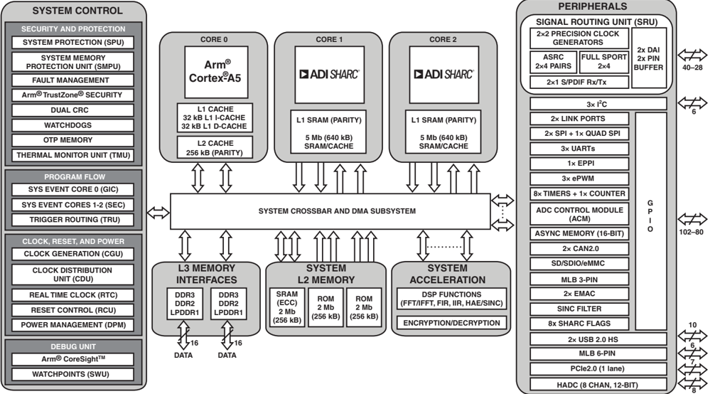

SHARC, SHARC+, and the SHARC logo are registered trademarks of Analog Devices, Inc.

## [Document Feedback](https://form.analog.com/Form_Pages/feedback/documentfeedback.aspx?doc=ADSP-SC582_583_584_587_589_ADSP-21583_584_587.pdf&product=ADSP-SC582%20ADSP-SC583%20ADSP-SC584%20ADSP-SC587%20ADSP-SC589%20ADSP-21583%20ADSP-21584%20ADSP-21587&rev=C)

Information  furnished  by  Analog  Devices  is  believed  to  be  accurate  and  reliable. However,  no  responsibility  is  assumed  by  Analog  Devices  for  its  use,  nor  for  any infringements of patents or other rights of third parties that may result from its use. Specifications subject to change without notice. No license is granted by implication or otherwise under any patent or patent rights of Analog Devices. Trademarks and registered trademarks are the property of their respective owners.

## ADSP-SC582/SC583/SC584/SC587/SC589/ADSP-21583/21584/21587

## TABLE OF CONTENTS

| System Features . . . . . . . . . . . . . . . . . . . . . . . . . . . . . . . . . . . . . . . . . . . . . . . . . . . . . .                                                                 | . 1   |
|---------------------------------------------------------------------------------------------------------------------------------------------------------------------------------------------|-------|
| Memory . . . . . . . . . . . . . . . . . . . . . . . . . . . . . . . . . . . . . . . . . . . . . . . . . . . . . . . . . . . . . . .                                                        | . 1   |
| Additional Features . . . . . . . . . . . . . . . . . . . . . . . . . . . . . . . . . . . . . . . . . . . . . . . . .                                                                       | . 1   |
| Table of Contents . . . . . . . . . . . . . . . . . . . . . . . . . . . . . . . . . . . . . . . . . . . . . . . . . . . .                                                                   | . 2   |
| Revision History . . . . . . . . . . . . . . . . . . . . . . . . . . . . . . . . . . . . . . . . . . . . . . . . . . . . .                                                                  | . 2   |
| General Description . . . . . . . . . . . . . . . . . . . . . . . . . . . . . . . . . . . . . . . . . . . . . . . .                                                                         | . 3   |
| Arm Cortex-A5 Processor . . . . . . . . . . . . . . . . . . . . . . . . . . . . . . . . . . . . . .                                                                                         | . 5   |
| SHARC Processor . . . . . . . . . . . . . . . . . . . . . . . . . . . . . . . . . . . . . . . . . . . . . . . .                                                                             | . 6   |
| SHARC+ Core Architecture . . . . . . . . . . . . . . . . . . . . . . . . . . . . . . . . . . .                                                                                              | . 8   |
| System Infrastructure . . . . . . . . . . . . . . . . . . . . . . . . . . . . . . . . . . . . . . . . . . .                                                                                 | 10    |
| System Memory Map . . . . . . . . . . . . . . . . . . . . . . . . . . . . . . . . . . . . . . . . . . .                                                                                     | 11    |
| Security Features . . . . . . . . . . . . . . . . . . . . . . . . . . . . . . . . . . . . . . . . . . . . . . . .                                                                           | 14    |
| Security Features Disclaimer . . . . . . . . . . . . . . . . . . . . . . . . . . . . . . . . . .                                                                                            | 15    |
| Safety Features . . . . . . . . . . . . . . . . . . . . . . . . . . . . . . . . . . . . . . . . . . . . . . . . . . .                                                                       | 15    |
| Processor Peripherals . . . . . . . . . . . . . . . . . . . . . . . . . . . . . . . . . . . . . . . . . . .                                                                                 | 15    |
| System Acceleration . . . . . . . . . . . . . . . . . . . . . . . . . . . . . . . . . . . . . . . . . . . .                                                                                 | 20    |
| System Design . . . . . . . . . . . . . . . . . . . . . . . . . . . . . . . . . . . . . . . . . . . . . . . . . . . .                                                                       | 21    |
| System Debug . . . . . . . . . . . . . . . . . . . . . . . . . . . . . . . . . . . . . . . . . . . . . . . . . . . .                                                                        | 23    |
| Development Tools . . . . . . . . . . . . . . . . . . . . . . . . . . . . . . . . . . . . . . . . . . . . .                                                                                 | 24    |
| Additional Information . . . . . . . . . . . . . . . . . . . . . . . . . . . . . . . . . . . . . . . .                                                                                      | 25    |
| Related Signal Chains . . . . . . . . . . . . . . . . . . . . . . . . . . . . . . . . . . . . . . . . . .                                                                                   | 25    |
| ADSP-SC58x/ADSP-2158x Detailed Signal Descriptions . . . . . . . . . . . . . . . . . . . . . . . . . . . . . . . . . . . . . . . . . . . . . . . . . . . . . .                              | 26    |
| 349-Ball CSP_BGA Signal Descriptions . . . . . . . . . . . . . . . . . . . . . . .                                                                                                          | 31    |
| GPIO Multiplexing for the 349-Ball CSP_BGA Package . .                                                                                                                                      | 40    |
| 529-Ball CSP_BGA Signal Descriptions . . . . . . . . . . . . . . . . . . . . . . .                                                                                                          | 43    |
| REVISION HISTORY                                                                                                                                                                            |       |
| 6/2023-Rev. B to Rev.C                                                                                                                                                                      |       |
| Analog Devices is in the process of updating documentation provide terminology and language that is culturally appropriate.                                                                 |       |
| Changes to Comparison of ADSP-SC58x/ADSP-2158x Proces- sor Features . . . . . . . . . . . . . . . . . . . . . . . . . . . . . . . . . . . . . . . . . . . . . . . . . . . . . . . . . . . . | 4     |
| Changes to L2 Memory Addressing Map . . . . . . . . . . . . . . . . . . . . .                                                                                                               | 11    |
| Changes to Security Features Disclaimer . . . . . . . . . . . . . . . . . . . . . .                                                                                                         | 15    |
| Clarification to ETH_CRS signal description in ADSP- SC58x/ADSP-2158x Detailed Signal Descriptions . . . . . . . . . .                                                                      | 26    |
| Changes to JTG_TRST Notes in ADSP-SC58x/ADSP-2158x Designer Quick Reference . . . . . . . . . . . . . . . . . . . . . . . . . . . . . . . . . . . . . . . .                                 | 58    |
| Changes to Operating Conditions . . . . . . . . . . . . . . . . . . . . . . . . . . . . . .                                                                                                 | 79    |

|

GPIO Multiplexing for the 529-Ball CSP\_BGA Package ... 55

ADSP-SC58x/ADSP-2158x Designer Quick Reference  .... 58

Specifications  ........................................................  79

Operating Conditions ...........................................  79

Electrical Characteristics  .......................................  83

HADC ..............................................................  87

TMU ................................................................  87

Absolute Maximum Ratings ...................................  88

ESD Caution  ......................................................  88

Timing Specifications ...........................................  89

Output Drive Currents  .......................................  153

Test Conditions  ................................................  155

Environmental Conditions  ..................................  157

ADSP-SC58x/ADSP-2158x 349-Ball BGA Ball

Assignments  ....................................................  158

Numerical by Ball Number  ..................................  158

Alphabetical by Pin Name  ...................................  160

Configuration of the 349-Ball CSP\_BGA .................  162

ADSP-SC58x/ADSP-2158x 529-Ball BGA Ball

Assignments  ....................................................  163

Numerical by Ball Number  ..................................  163

Alphabetical by Pin Name....................................  166

Configuration of the 529-Ball CSP\_BGA .................  169

Outline Dimensions ..............................................  170

Surface-Mount Design ........................................  171

Automotive Products  ............................................  172

Ordering Guide  ...................................................  173

Changes to Electrical Characteristics  ...........................  83

Changes to Footnote 2 and Footnote 3 in

Link Ports-Receive ..............................................  112

Changes to Environmental Conditions  ......................  157

Changes to Automotive Products  .............................  172

Changes to Ordering Guide  ....................................  173

|

## ADSP-SC582/SC583/SC584/SC587/SC589/ADSP-21583/21584/21587

## GENERAL DESCRIPTION

The ADSP-SC58x/ADSP-2158x processors are members of the SHARC ® family of products. The ADSP-SC58x processor is based on the SHARC+ dual core and the Arm ® Cortex ® -A5 core. The ADSP-SC58x/ADSP-2158x SHARC processors are members of the SIMD SHARC family of digital signal processors (DSPs) that feature Analog Devices, Inc., Super Harvard Architecture ® . These 32-bit/40-bit/64-bit floating-point processors are optimized for high performance audio/floating-point applications with large, on-chip, static random-access memory (SRAM), multiple internal buses that eliminate input/output (I/O) bottlenecks, and innovative digital audio interfaces (DAI). New additions to the SHARC+ core include cache enhancements and branch prediction, while maintaining instruction set compatibility to previous SHARC products.

By integrating a set of industry leading system peripherals and memory (see Table 1, Table 2, and Table 3), the Arm Cortex-A5 and SHARC processor is the platform of choice for applications that require programmability similar to reduced instruction set computing (RISC), multimedia support, and leading edge signal processing in one integrated package. These applications span a wide array of markets, including automotive, professional audio, and industrial-based applications that require high floating-point performance.

Table 2 provides comparison information for features that vary across the standard processors. (N/A in the table means not applicable.)

Table 3 provides comparison information for features that vary across the automotive processors. (N/A in the table means not applicable.)

Table 1. Common Product Features

| Product Features                                                              | ADSP-SC58x/ADSP-2158x                      |
|-------------------------------------------------------------------------------|--------------------------------------------|
| DAI (includes SRU) Full SPORTs S/PDIF receive/transmit ASRCs PCGs I 2 C (TWI) | 2 4 per DAI per DAI pair per DAI 2 per DAI |
| GP timer                                                                      | 1                                          |
| Enhanced PPI 1 GP counter                                                     | 8 1                                        |
|                                                                               | 4                                          |
|                                                                               | 3                                          |
| Quad-data bit SPI                                                             | 1                                          |
| Dual-data bit SPI                                                             | 2                                          |
| CAN2.0                                                                        | 2                                          |
| UARTs                                                                         | 3                                          |
| Link ports                                                                    | 2                                          |
|                                                                               | 1                                          |
| EnhancedPWMs 2                                                                | 3                                          |
| Watchdog timers                                                               | 2                                          |
| ADCcontrol module                                                             | Yes                                        |
| Static memory controller                                                      | Yes                                        |
| Hardware accelerators High performance FFT/IFFT                               | Yes                                        |
| FIR/IIR Harmonic analysis engine                                              | Yes Yes                                    |
| SINC filter                                                                   | Yes                                        |
| Security cryptographic engine                                                 | Yes                                        |
| Multichannel 12-bit ADC                                                       | 8-channel                                  |

## ADSP-SC582/SC583/SC584/SC587/SC589/ADSP-21583/21584/21587

Table 2. Comparison of ADSP-SC58x/ADSP-2158x Processor Features

| Processor Feature                                                                            | ADSP- SC582   | ADSP- SC583   | ADSP- SC584   | ADSP- SC587   | ADSP- SC589   | ADSP- 21583   | ADSP- 21584   | ADSP- 21587   |
|----------------------------------------------------------------------------------------------|---------------|---------------|---------------|---------------|---------------|---------------|---------------|---------------|
| Arm Cortex-A5 (MHz, Max)                                                                     | 450           | 450           | 500           | 500           | 500           | N/A           | N/A           | N/A           |
| Arm Core L1 Cache (I, DkB)                                                                   | 32, 32        | 32, 32        | 32, 32        | 32, 32        | 32, 32        | N/A           | N/A           | N/A           |
| Arm Core L2 Cache (kB)                                                                       | 256           | 256           | 256           | 256           | 256           | N/A           | N/A           | N/A           |
| SHARC+ Core1 (MHz, Max)                                                                      | 450           | 450           | 500           | 500           | 500           | 450           | 500           | 500           |
| SHARC+ Core2 (MHz, Max)                                                                      | N/A           | 450           | 500           | 500           | 500           | 450           | 500           | 500           |
| SHARC L1 SRAM (kB)                                                                           | 640           | 384           | 640           | 640           | 640           | 384           | 640           | 640           |
| System Memory L2 SRAM (Shared) (kB) L2 ROM(Shared) (kB) DDR3/DDR2/LPDDR1 Controller (16-bit) | 256           | 256           | 256           | 256           | 256           | 256           | 256           | 256           |
|                                                                                              | 512           | 512           | 512           | 512           | 512           | 512           | 512           | 512           |
|                                                                                              | 1             | 1             | 1             | 2             | 2             | 1             | 1             | 2             |
| USB 2.0 HS + PHY (Host/Device/OTG)                                                           | 1             | 1             | 1             | 1             | 1             | N/A           | N/A           | N/A           |
| USB 2.0 HS + PHY (Host/Device)                                                               | N/A           | N/A           | N/A           | 1             | 1             | N/A           | N/A           | N/A           |
| 10/100 Std EMAC                                                                              | N/A           | N/A           | N/A           | 1             | 1             | N/A           | N/A           | N/A           |
| 10/100/1000 /AVB EMAC + Timer IEEE 1588                                                      | 1             | 1             | 1             | 1             | 1             | N/A           | N/A           | N/A           |
| SDIO/eMMC                                                                                    | N/A           | N/A           | N/A           | 1             | 1             | N/A           | N/A           | N/A           |
| PCIe 2.0 (1 Lane)                                                                            | N/A           | N/A           | N/A           | N/A           | 1             | N/A           | N/A           | N/A           |
| RTC                                                                                          | N/A           | N/A           | N/A           | 1             | 1             | N/A           | N/A           | 1             |
| GPIO Ports                                                                                   | Port A to E   | Port A to E   | Port A to E   | Port A toG    | Port A toG    | Port A to E   | Port A to E   | Port A toG    |
| GPIO + DAI Pins                                                                              | 80 + 28       | 80 + 28       | 80 + 28       | 102 + 40      | 102 + 40      | 80 + 28       | 80 + 28       | 102 + 40      |
| 19 mm×19mmPackageOptions                                                                     | 349-BGA       | 349-BGA       | 349-BGA       | 529-BGA       | 529-BGA       | 349-BGA       | 349-BGA       | 529-BGA       |

Table 3. Comparison of ADSP-SC58x/ADSP-2158x Processor Features for Automotive

| Processor Feature                      | ADSP-SC582W   | ADSP-SC583W   | ADSP-SC584W   | ADSP-SC587W   | ADSP-21583W   | ADSP-21584W   |
|----------------------------------------|---------------|---------------|---------------|---------------|---------------|---------------|
| Arm Cortex-A5 (MHz, Max)               | 450           | 450 32, 256   | 500 32, 32    | 500 32, 256   | N/A N/A       | N/A N/A N/A   |
| Arm Core L1 Cache (I, DkB)             | 32, 32        | 32            |               | 32            |               |               |
| Arm Core L2 Cache (kB)                 | 256           |               | 256           |               | N/A           |               |
| SHARC+ Core1 (MHz, Max)                | 450           | 450           | 500           | 500           | 450           | 500           |
| SHARC+ Core2 (MHz, Max)                | N/A           | 450           | 500           | 500           | 450           | 500           |
| SHARC L1 SRAM (kB)                     | 640           | 384           | 640           | 640           | 384           | 640           |
| L2 SRAM (Shared) (kB)                  | 256           | 256           | 256           | 256           | 256           | 256           |
| System Memory L2 ROM(Shared) (kB)      | 512           | 512           | 512           | 512           | 512           | 512           |
| DDR3/DDR2/LPDDR1 Controller (16-bit)   | 1             | 1             | 1             | 2             | 1             | 1             |
| USB 2.0 HS + PHY (Host/Device/OTG)     | 1             | 1             | 1             | 1             | N/A           | N/A           |
| USB 2.0 HS + PHY (Host/Device)         | N/A           | N/A           | N/A           | 1             | N/A           | N/A           |
| 10/100 Std EMAC                        | N/A           | N/A           | N/A           | 1             | N/A           | N/A           |
| 10/100/1000/AVB EMAC + Timer IEEE 1588 | 1             | 1             | 1             | 1             | N/A           | N/A           |
| SDIO/eMMC                              | N/A           | N/A           | N/A           | 1             | N/A           | N/A           |
| PCIe 2.0 (1 Lane)                      | N/A           | N/A           | N/A           | N/A           | N/A           | N/A           |
| MLB 3-Pin/6-Pin                        | 1             | 1             | 1             | 1             | 1             | 1             |
| RTC                                    | N/A           | N/A           | N/A           | 1             | N/A           | N/A           |
| GPIO Ports                             | Port A to E   | Port A to E   | Port A to E   | Port A toG    | Port A to E   | Port A to E   |
| GPIO + DAI Pins                        | 80 + 28       | 80 + 28       | 80 + 28       | 102 + 40      | 80 + 28       | 80 + 28       |
| 19 mm×19mmPackageOptions               | 349-BGA       | 349-BGA       | 349-BGA       | 529-BGA       | 349-BGA       | 349-BGA       |

## ADSP-SC582/SC583/SC584/SC587/SC589/ADSP-21583/21584/21587

## ARM CORTEX-A5 PROCESSOR

The Arm Cortex-A5 processor (see Figure 2) is a high performance processor with the following features:

- Instruction cache unit (32 kB) and data L1 cache unit (32 Kb)
- In order pipeline with dynamic branch prediction
- Arm, Thumb ® , and ThumbEE instruction set support
- Arm TrustZone ® security extensions
- Harvard L1 memory system with a memory management unit (MMU)
- Arm7 TM debug architecture
- Trace support through an embedded trace macrocell (ETM) interface
- Extension-vector floating-point unit (IEEE 754) with trapless execution
- Extension-media processing engine (MPE) with NEON TM technology
- Extension-Jazelle ® hardware acceleration

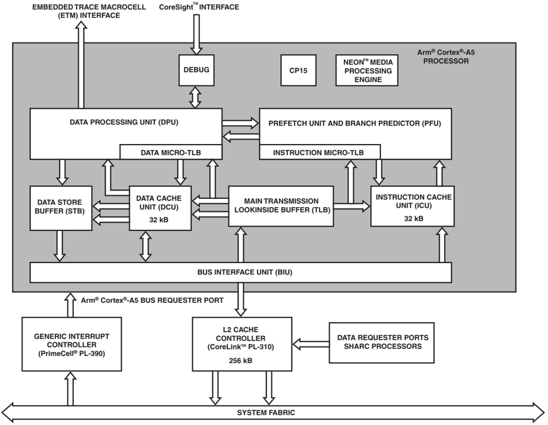

TO OTHER CORES

Figure 2. Arm Cortex-A5 Processor Block Diagram

## ADSP-SC582/SC583/SC584/SC587/SC589/ADSP-21583/21584/21587

## Generic Interrupt Controller (GIC), PL390 (ADSP-SC58x Only)

The generic interrupt controller (GIC) is a centralized resource for supporting and managing interrupts. The GIC splits into the distributor block (GICPORT0) and the CPU interface block (GICPORT1).

## Generic Interrupt Controller Port0 (GICPORT0)

The GICPORT0 distributor block performs interrupt prioritization and distribution to the GICPORT1 blocks that connect to the processors in the system. It centralizes all interrupt sources, determines the priority of each interrupt, and forwards the interrupt with the highest priority to the interface, for priority masking and preemption handling.

## Generic Interrupt Controller Port1 (GICPORT1)

The GICPORT1 CPU interface block performs priority masking and preemption handling for a connected processor in the system. GICPORT1 supports 8 software generated interrupts (SGIs) and 254 shared peripheral interrupts (SPIs).

## L2 Cache Controller, PL310 (ADSP-SC58x Only)

The L2 cache controller, PL310 (see Figure 2), works efficiently with the Arm Cortex-A5 processors that implement system fabric. The cache controller directly interfaces on the data and instruction interface. The internal pipelining of the cache controller is optimized to enable the processors to operate at the same clock frequency. The cache controller supports the following:

- Two read/write 64-bit completer ports, one connected to the Arm Cortex-A5 instruction and data interfaces, and one connecting the Arm Cortex-A5 and SHARC+ cores for data coherency.
- Two read/write 64-bit requester ports for interfacing with the system fabric.

## SHARC PROCESSOR

Figure 3 shows the SHARC processor integrates a SHARC+ SIMD core, L1 memory crossbar, I/D cache controller, L1 memory blocks, and the requester/completer ports. Figure 4 shows the SHARC+ SIMD core block diagram.

The SHARC processor supports a modified Harvard architecture in combination with a hierarchical memory structure. L1 memories typically operate at the full processor speed with little or no latency.

Figure 3. SHARC Processor Block Diagram

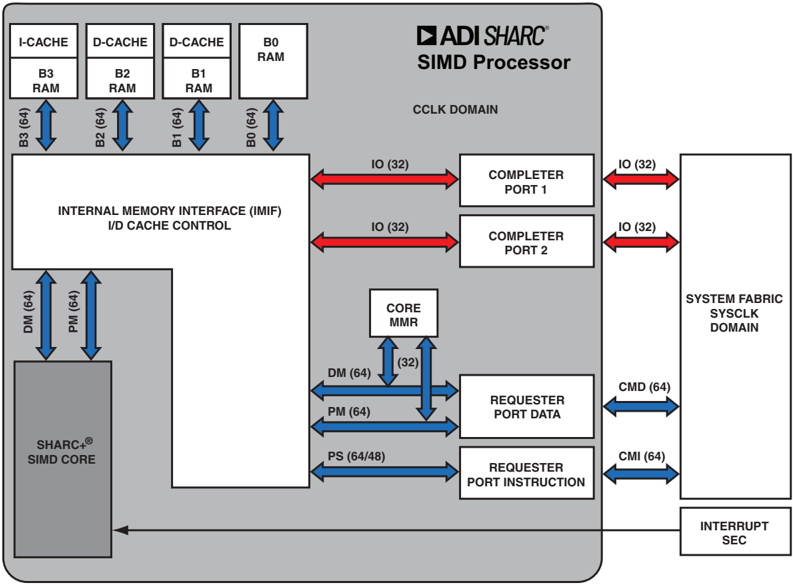

## L1 Memory

Figure 5 shows the ADSP-SC58x/ADSP-2158x memory map. Each SHARC+ core has a tightly coupled L1 SRAM of up to 5 Mb. Each SHARC+ core can access code and data in a single cycle from this memory space. The Arm Cortex-A5 core can also access this memory space with multicycle accesses.

In the SHARC+ core private address space, both cores have L1 memory.

SHARC+ core memory-mapped register (CMMR) address space is 0x 0000 0000 through 0x 0003 FFFF in normal word (32-bit). Each block can be configured for different combinations of code and data storage. Of the 5 Mb SRAM, up to 1024 Kb can be configured for data memory (DM), program memory (PM), and instruction cache. Each memory block supports single-cycle, independent accesses by the core processor and I/O processor. The memory architecture, in combination with its separate on-chip buses, allows two data transfers from the core and one from the DMA engine in a single cycle. The SRAM of the processor can be configured as a maximum of 160k words of 32-bit data, 320k words of 16-bit data,

## ADSP-SC582/SC583/SC584/SC587/SC589/ADSP-21583/21584/21587

Figure 4. SHARC+ SIMD Core Block Diagram

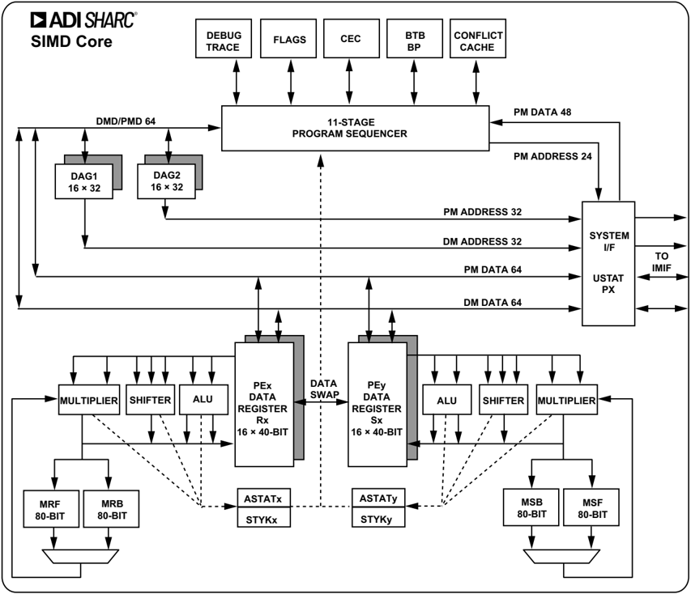

106.7k words of 48-bit instructions (or 40-bit data), or combinations of different word sizes up to 5 Mb. All of the memory can be accessed as 8-bit, 16-bit, 32-bit, 48-bit, or 64-bit words. Support of a 16-bit floating-point storage format doubles the amount of data that can be stored on chip.

Conversion between the 32-bit floating-point and 16-bit floating-point formats is performed in a single instruction. While each memory block can store combinations of code and data, accesses are most efficient when one block stores data using the DM bus for transfers, and the other block stores instructions and data using the PM bus for transfers.

Using the DM and PM buses, with each bus dedicated to a memory block, assures single-cycle execution with two data transfers. In this case, the instruction must be available in the cache. The system configuration is flexible, but a typical configuration is 512 Kb DM, 128 Kb PM, and 128 Kb of instruction cache, with the remaining L1 memory configured as SRAM. Each addressable memory space outside the L1 memory can be accessed either directly or via cache.

## ADSP-SC582/SC583/SC584/SC587/SC589/ADSP-21583/21584/21587

The memory map in Table 4 gives the L1 memory address space and shows multiple L1 memory blocks offering a configurable mix of SRAM and cache.

## L1 Requester and Completer Ports

Each SHARC+ core has two requester and two completer ports to and from the system fabric. One requester port fetches instructions. The second requester port drives data to the system world. Both completer ports allow conflict free core/direct memory access (DMA) streams to the individual memory blocks. For completer port addresses, refer to the L1 memory address map in Table 4.

## L1 On-Chip Memory Bandwidth

The internal memory architecture allows programs to have four accesses at the same time to any of the four blocks, assuming no block conflicts. The total bandwidth is realized using both the DMD and PMD buses.

## Instruction and Data Cache

The ADSP-SC58x/ADSP-2158x processors also include a traditional instruction cache (I-cache) and two data caches (D-cache) (PM and DM caches). These caches support one instruction access and two data accesses over the DM and PM buses, per CCLK cycle. The cache controllers automatically manage the configured L1 memory. The system can configure part of the L1 memory for automatic management by the cache controllers. The sizes of these caches are independently configurable from 0 kB to a maximum of 128 kB each. The memory not managed by the cache controllers is directly addressable by the processors. The controllers ensure the data coherence between the two data caches. The caches provide user-controllable features such as full and partial locking, range-bound invalidation, and flushing.

## System Event Controller (SEC) Input

The output of the system event controller (SEC) controller is forwarded to the core event controller (CEC) to respond directly to all unmasked system-based interrupts. The SEC also supports nesting including various SEC interrupt channel arbitration options. For all SEC channels, the processor automatically stacks the arithmetic status (ASTATx and ASTATy) registers and mode (MODE1) register in parallel with the interrupt servicing.

## Core Memory-Mapped Registers (CMMR)

The core memory-mapped registers control the L1 instruction and data cache, BTB, L2 cache, parity error, system control, debug, and monitor functions.

## SHARC+ CORE ARCHITECTURE

The ADSP-SC58x/ADSP-2158x processors are code compatible at the assembly level with the ADSP-2148x, ADSP-2147x, ADSP-2146x, ADSP-2137x, ADSP-2136x, ADSP-2126x, ADSP-2116x, and with the first-generation ADSP-2106x SHARC processors.

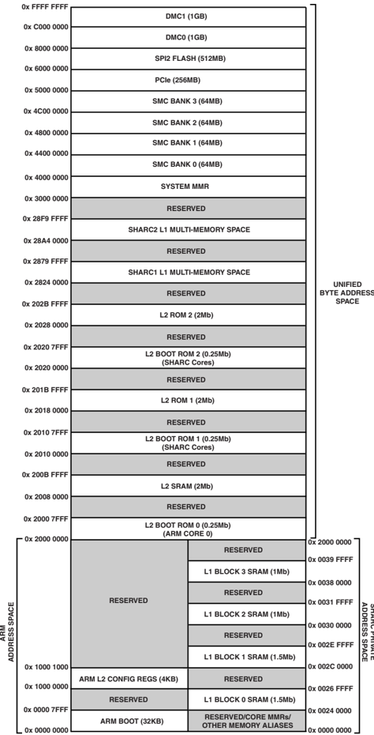

| 0x FFFF FFFF   | DMC1 (1GB)                           | DMC1 (1GB)                               |
|----------------|--------------------------------------|------------------------------------------|
| 0x C000 0000   | DMC0 (1GB)                           | DMC0 (1GB)                               |
| 0x 8000 0000   | SPI2 FLASH (512MB)                   | SPI2 FLASH (512MB)                       |
| 0x 6000 0000   | PCIe (256MB)                         | PCIe (256MB)                             |
| 0x 5000 0000   | SMC BANK 3 (64MB)                    | SMC BANK 3 (64MB)                        |
|                | SMC BANK 2 (64MB)                    | SMC BANK 2 (64MB)                        |
| 0x 4800 0000   | SMC BANK 1 (64MB)                    | SMC BANK 1 (64MB)                        |
| 0x 4400 0000   | SMC BANK 0 (64MB)                    | SMC BANK 0 (64MB)                        |
| 0x 4000 0000   | SYSTEM MMR                           | SYSTEM MMR                               |
| 0x 3000 0000   |                                      |                                          |
| 0x 28F9 FFFF   | RESERVED                             | RESERVED                                 |
| 0x 28A4 0000   | SHARC2 L1 MULTI-MEMORY SPACE         | SHARC2 L1 MULTI-MEMORY SPACE             |
| 0x 2879 FFFF   | RESERVED                             | RESERVED                                 |
| 0x 2824 0000   | SHARC1 L1 MULTI-MEMORY SPACE         | SHARC1 L1 MULTI-MEMORY SPACE             |
| 0x 202B FFFF   | RESERVED                             | RESERVED                                 |
| 0x 2028 0000   |                                      |                                          |
| 0x 2020 7FFF   | RESERVED                             | RESERVED                                 |
| 0x 2020 0000   | (SHARC                               | Cores)                                   |
|                | RESERVED                             | RESERVED                                 |
|                | L2 ROM 1 (2Mb)                       | L2 ROM 1 (2Mb)                           |
|                | RESERVED                             | RESERVED                                 |
| 0x 2010 7FFF   | L2 BOOT ROM 1 (0.25Mb) (SHARC Cores) | L2 BOOT ROM 1 (0.25Mb) (SHARC Cores)     |
| 0x 200B FFFF   | RESERVED                             | RESERVED                                 |
| 0x 2008 0000   | L2 SRAM (2Mb)                        | L2 SRAM (2Mb)                            |
|                | RESERVED                             | RESERVED                                 |
| 0x 2000 7FFF   | ROM 0 (0.25Mb)                       | ROM 0 (0.25Mb)                           |
| 0x 2000 0000   | L2 BOOT (ARM CORE 0)                 | L2 BOOT (ARM CORE 0)                     |
|                |                                      | RESERVED                                 |
|                |                                      | L1 BLOCK 3 SRAM (1Mb)                    |
|                | RESERVED                             | RESERVED                                 |
|                |                                      | L1 BLOCK 2 SRAM (1Mb)                    |
|                |                                      | RESERVED                                 |
|                |                                      | L1 BLOCK 1 SRAM (1.5Mb)                  |
| 0x 1000 1000   | ARM L2 CONFIG REGS (4KB)             | RESERVED                                 |
|                | RESERVED                             | L1 BLOCK 0 SRAM (1.5Mb)                  |
| 0x 0000 0000   | ARM BOOT (32KB)                      | RESERVED/CORE MMRs/ OTHER MEMORY ALIASES |

SHARC PRIVATE

Figure 5. ADSP-SC58x/ADSP-2158x Memory Map

The ADSP-SC58x/ADSP-2158x processors share architectural features with the ADSP-2126x, ADSP-2136x, ADSP-2137x, ADSP-214xx, and ADSP-2116x SIMD SHARC processors, shown in Figure 4 and detailed in the following sections.

## SIMD Computational Engine

The SHARC+ core contains two computational processing elements that operate as a single-instruction, multiple data (SIMD) engine.

## ADSP-SC582/SC583/SC584/SC587/SC589/ADSP-21583/21584/21587

The processing elements are referred to as PEx and PEy data registers and each contain an arithmetic logic unit (ALU), multiplier, shifter, and register file. PEx is always active and PEy is enabled by setting the PEYEN mode bit in the mode control register (MODE1).

Single instruction multiple data (SIMD) mode allows the processors to execute the same instruction in both processing elements, but each processing element operates on different data. This architecture efficiently executes math intensive DSP algorithms. In addition to all the features of previous generation SHARC cores, the SHARC+ core also provides a new and simpler way to execute an instruction only on the PEy data register.

SIMD mode also affects the way data transfers between memory and processing elements because to sustain computational operation in the processing elements requires twice the data bandwidth. Therefore, entering SIMD mode doubles the bandwidth between memory and the processing elements. When using the DAGs to transfer data in SIMD mode, two data values transfer with each memory or register file access.

## Independent, Parallel Computation Units

Within each processing element is a set of pipelined computational units. The computational units consist of a multiplier, arithmetic/logic unit (ALU), and shifter. These units are arranged in parallel, maximizing computational throughput. These computational units support IEEE 32-bit single-precision floating-point, 40-bit extended-precision floating-point, IEEE 64-bit double-precision floating-point, and 32-bit fixed-point data formats.

A multifunction instruction set supports parallel execution of ALU and multiplier operations. In SIMD mode, the parallel ALU and multiplier operations occur in both processing elements per core.

All processing operations take one cycle to complete. For all floating-point operations, the processor takes two cycles to complete in case of data dependency. Double-precision floating-point data take two to six cycles to complete. The processor stalls for the appropriate number of cycles for an interlocked pipeline plus data dependency check.

## Core Timer

Each SHARC+ processor core also has a timer. This extra timer is clocked by the internal processor clock and is typically used as a system tick clock for generating periodic operating system interrupts.

## Data Register File

Each processing element contains a general-purpose data register file. The register files transfer data between the computation units and the data buses, and store intermediate results. These 10-port, 32-register register files (16 primary, 16 secondary), combined with the enhanced Harvard architecture of the processor, allow unconstrained data flow between computation units and internal memory. The registers in the PEx data register file are referred to as R0-R15 and in the PEy data register file as S0-S15.

## Context Switch

Many of the registers of the processor have secondary registers that can activate during interrupt servicing for a fast context switch. The data, DAG, and multiplier result registers have secondary registers. The primary registers are active at reset, while control bits in MODE1 activate the secondary registers.

## Universal Registers (USTAT)

General-purpose tasks use the universal registers. The four USTAT registers allow easy bit manipulations (set, clear, toggle, test, XOR) for all control and status peripheral registers.

The data bus exchange register (PX) permits data to pass between the 64-bit PM data bus and the 64-bit DM data bus or between the 40-bit register file and the PM or DM data bus. These registers contain hardware to handle the data width difference.

## Data Address Generators With Zero-Overhead Hardware Circular Buffer Support

For indirect addressing and implementing circular data buffers in hardware, the ADSP-SC58x/ADSP-2158x processor uses the two data address generators (DAGs). Circular buffers allow efficient programming of delay lines and other data structures required in digital signal processing, and are commonly used in digital filters and Fourier transforms. The two DAGs of the processors contain sufficient registers to allow the creation of up to 32 circular buffers (16 primary register sets and 16 secondary sets). The DAGs automatically handle address pointer wraparound, reduce overhead, increase performance, and simplify implementation. Circular buffers can start and end at any memory location.

## Flexible Instruction Set Architecture (ISA)

The ISA, a 48-bit instruction word, accommodates various parallel operations for concise programming. For example, the processors can conditionally execute a multiply, an add, and a subtract in both processing elements while branching and fetching up to four 32-bit values from memory-all in a single instruction. Additionally, the double-precision floating-point instruction set is an addition to the SHARC+ core.

## Variable Instruction Set Architecture (VISA)

In addition to supporting the standard 48-bit instructions from previous SHARC processors, the SHARC+ core processors support 16-bit and 32-bit opcodes for many instructions, formerly 48-bit in the ISA. This feature, called variable instruction set architecture (VISA), drops redundant or unused bits within the 48-bit instruction to create more efficient and compact code. The program sequencer supports fetching these 16-bit and 32bit instructions from both internal and external memories. VISA is not an operating mode; it is only address dependent (refer to memory map ISA/VISA address spaces in Table 7). Furthermore, it allows jumps between ISA and VISA instruction fetches.

## ADSP-SC582/SC583/SC584/SC587/SC589/ADSP-21583/21584/21587

## Single-Cycle Fetch of Instructional Four Operands

The ADSP-SC58x/ADSP-2158x processors feature an enhanced Harvard architecture in which the DM bus transfers data and PM bus transfers both instructions and data.

With the separate program memory bus, data memory buses, and on-chip instruction conflict-cache, the processor can simultaneously fetch four operands (two over each data bus) and one instruction from the conflict cache, in a single cycle.

## Core Event Controller (CEC)

The SHARC+ core generates various core interrupts (including arithmetic and circular buffer instruction flow exceptions) and SEC events (debug/monitor and software). The core only responds to unmasked interrupts (enabled in the IMASK register).

## Instruction Conflict-Cache

The processors include a 32-entry instruction cache that enables three-bus operation for fetching an instruction and four data values. The cache is selective-only the instructions that require fetches conflict with the PM bus data accesses cache. This cache allows full speed execution of core, looped operations, such as digital filter multiply accumulates, and fast Fourier transforms (FFT) butterfly processing. The conflict cache serves for on-chip bus conflicts only.

## Branch Target Buffer/Branch Predictor

Implementation of a hardware-based branch predictor (BP) and branch target buffer (BTB) reduce branch delay. The program sequencer supports efficient branching using the BTB for conditional and unconditional instructions.

## Addressing Spaces

In addition to traditionally supported long word, normal word, extended precision word and short word addressing aliases, the processors support byte addressing for the data and instruction accesses. The enhanced ISA/VISA provides new instructions for accessing all sizes of data from byte space as well as converting word addresses to byte and byte to word addresses.

## Additional Features

The enhanced ISA/VISA of the ADSP-SC58x/ADSP-2158x processors also provides a memory barrier instruction for data synchronization, exclusive data access support for multicore data sharing, and exclusive data access to enable multiprocessor programming. To enhance the reliability of the application, L1 data RAMs support parity error detection logic for every byte. Additionally, the processors detect illegal opcodes. Core interrupts flag both errors. Requester ports of the core also detect for failed external accesses.

## SYSTEM INFRASTRUCTURE

The following sections describe the system infrastructure of the ADSP-SC58x/ADSP-2158x processors.

## System L2 Memory

A system L2 SRAM memory of 2 Mb (256 kB) and two ROM memories, each 2 Mb (256 kB), are available to both SHARC+ cores, the Arm Cortex-A5 core, and the system DMA channels (see Table 5). All L2 SRAM/ROM blocks are subdivided into eight banks to support concurrent access to the L2 memory ports. Memory accesses to the L2 memory space are multicycle accesses by both the Arm Cortex-A5 and SHARC+ cores.

The memory space is used for various cases including

- Arm Cortex-A5 to SHARC+ core data sharing and intercore communications
- Accelerator and peripheral sources and destination memory to avoid accessing data in the external memory
- A location for DMA descriptors
- Storage for additional data for either the Arm Cortex-A5 or SHARC+ cores to avoid external memory latencies and reduce external memory bandwidth
- Storage for incoming Ethernet traffic to improve performance
- Storage for data coefficient tables cached by the SHARC+ core

See the System Memory Protection Unit (SMPU) section for options in limiting access by specific cores and DMA requesters.

The Arm Cortex-A5 core has an L1 instruction and data cache, each of which is 32 kB in size. The core also has an L2 cache controller of 256 kB. When enabling the caches, accesses to all other memory spaces (internal and external) go through the cache.

## SHARC+ Core L1 Memory in Multiprocessor Space

The Arm Cortex-A5 core can access the L1 memory of the SHARC+ core. See Table 6 for the L1 memory address in multiprocessor space. The SHARC+ core can access the L1 memory of the other SHARC+ core in the multiprocessor space.

## One Time Programmable Memory (OTP)

The processors feature 7 kB of one time programmable (OTP) memory which is memory-map accessible. This memory contains space for programmable unique keys and supports secure boot and secure operation.

## I/O Memory Space

The static memory controller (SMC) is programmed to control up to two blocks of external memories or memory-mapped devices, with flexible timing parameters. Each block occupies an 8 Kb segment regardless of the size of the device used. Mapped I/Os also include PCIe data and SPI2 memory address space (see Table 7).

## ADSP-SC582/SC583/SC584/SC587/SC589/ADSP-21583/21584/21587

## SYSTEM MEMORY MAP

Table 4. L1 Block 0, Block 1, Block 2, and Block 3 SHARC+ Addressing Memory Map (Private Address Space)

| Memory                   | Long Word (64 Bits)    | Extended Precision/ ISA Code (48 Bits)   | Normal Word(32 Bits)   | Short Word/ VISA Code (16 Bits)   | Byte Access (8 Bits)   |
|--------------------------|------------------------|------------------------------------------|------------------------|-----------------------------------|------------------------|
| L1 Block 0 SRAM (1.5 Mb) | 0x00048000- 0x0004DFFF | 0x00090000- 0x00097FFF                   | 0x00090000- 0x0009BFFF | 0x00120000- 0x00137FFF            | 0x00240000- 0x0026FFFF |
| L1 Block 1 SRAM (1.5 Mb) | 0x00058000- 0x0005DFFF | 0x000B0000- 0x000B7FFF                   | 0x000B0000- 0x000BBFFF | 0x00160000- 0x00177FFF            | 0x002C0000- 0x002EFFFF |
| L1 Block 2 SRAM (1 Mb)   | 0x00060000- 0x00063FFF | 0x000C0000- 0x000C5554                   | 0x000C0000- 0x000C7FFF | 0x00180000- 0x0018FFFF            | 0x00300000- 0x0031FFFF |
| L1 Block 3 SRAM (1 Mb)   | 0x00070000- 0x00073FFF | 0x000E0000- 0x000E5554                   | 0x000E0000- 0x000E7FFF | 0x001C0000- 0x001CFFFF            | 0x00380000- 0x0039FFFF |

## Table 5. L2 Memory Addressing Map

| Memory 1      | Byte Address Space ArmCortex-A5: Data Access and Instruction Fetch; SHARC+: Data Access   | NormalWord Address Space for Data Access SHARC+   | Instruction Fetch VISA Address Space SHARC+   | Instruction Fetch ISA Address SpaceSHARC+   |
|---------------|-------------------------------------------------------------------------------------------|---------------------------------------------------|-----------------------------------------------|---------------------------------------------|
| L2 BootROM0 2 | Arm: 0x00000000-0x00007FFF SHARC+/DMA: 0x20000000-0x20007FFF                              | 0x08000000-0x08001FFF                             | 0x00B80000-0x00B83FFF                         | 0x00580000-0x00581555                       |
| L2 RAM(2 Mb)  | 0x20080000-0x200BFFFF                                                                     | 0x08020000-0x0802FFFF                             | 0x00BA0000-0x00BBFFFF                         | 0x005A0000-0x005AAAA9                       |
| L2 BootROM1   | 0x20100000-0x20107FFF                                                                     | 0x08040000-0x08041FFF                             | 0x00B00000-0x00B03FFF                         | 0x00500000-0x00501555                       |
| L2 ROM1       | 0x20180000-0x201BFFFF                                                                     | 0x08060000-0x0806FFFF                             | 0x00B20000-0x00B3FFFF                         | 0x00520000-0x0052AAA9                       |
| L2 BootROM2 3 | 0x20200000-0x20207FFF                                                                     | 0x08080000-0x08081FFF                             | 0x00B40000-0x00B43FFF                         | 0x00540000-0x00541555                       |
| L2 ROM2       | 0x20280000-0x202BFFFF                                                                     | 0x080A0000-0x080AFFFF                             | 0x00B60000-0x00B7FFFF                         | 0x00560000-0x0056AAA9                       |

Table 6. SHARC+ L1 Memory in Multiprocessor Space

|                                             |                              | Memory Block   | Byte Address Space for ArmCortex-A5 and SHARC+   | NormalWord Address Space forSHARC+   |
|---------------------------------------------|------------------------------|----------------|--------------------------------------------------|--------------------------------------|
| L1 memory of SHARC1 in multiprocessor space | Address via Completer 1 Port | Block 0        | 0x28240000-0x2826FFFF                            | 0x0A090000-0xA09BFFF                 |
| L1 memory of SHARC1 in multiprocessor space | Address via Completer 1 Port | Block 1        | 0x282C0000-0x282EFFFF                            | 0x0A0B0000-0xA0BBFFF                 |
| L1 memory of SHARC1 in multiprocessor space | Address via Completer 1 Port | Block 2        | 0x28300000-0x2831FFFF                            | 0x0A0C0000-0x0A0C7FFF                |
| L1 memory of SHARC1 in multiprocessor space | Address via Completer 1 Port | Block 3        | 0x28380000-0x2839FFFF                            | 0x0A0E0000-0x0A0E7FFF                |
| L1 memory of SHARC1 in multiprocessor space | Address via Completer 2 Port | Block 0        | 0x28640000-0x2866FFFF                            | 0x0A190000-0x0A19BFFF                |
| L1 memory of SHARC1 in multiprocessor space | Address via Completer 2 Port | Block 1        | 0x286C0000-0x286EFFFF                            | 0x0A1B0000-0x0A1BBFFF                |
| L1 memory of SHARC1 in multiprocessor space | Address via Completer 2 Port | Block 2        | 0x28700000-0x2871FFFF                            | 0x0A1C0000-0x0A1C7FFF                |
| L1 memory of SHARC1 in multiprocessor space | Address via Completer 2 Port | Block 3        | 0x28780000-0x2879FFFF                            | 0x0A1E0000-0x0A1E7FFF                |
| L1 memory of SHARC2 in multiprocessor space | Address via Completer 1 Port | Block 0        | 0x28A40000-0x28A6FFFF                            | 0x0A290000-0x0A29BFFF                |
| L1 memory of SHARC2 in multiprocessor space | Address via Completer 1 Port | Block 1        | 0x28AC0000-0x28AEFFFF                            | 0x0A2B0000-0x0A2BBFFF                |
| L1 memory of SHARC2 in multiprocessor space | Address via Completer 1 Port | Block 2        | 0x28B00000-0x28B1FFFF                            | 0x0A2C0000-0x0A2C7FFF                |
| L1 memory of SHARC2 in multiprocessor space | Address via Completer 1 Port | Block 3        | 0x28B80000-0x28B9FFFF                            | 0x0A2E0000-0x0A2E7FFF                |
| L1 memory of SHARC2 in multiprocessor space | Address via Completer 2 Port | Block 0        | 0x28E40000-0x28E6FFFF                            | 0x0A390000-0x0A39BFFF                |
| L1 memory of SHARC2 in multiprocessor space | Address via Completer 2 Port | Block 1        | 0x28EC0000-0x28EEFFFF                            | 0x0A3B0000-0x0A3BBFFF                |
| L1 memory of SHARC2 in multiprocessor space | Address via Completer 2 Port | Block 2        | 0x28F00000-0x28F1FFFF                            | 0x0A3C0000-0x0A3C7FFF                |
| L1 memory of SHARC2 in multiprocessor space | Address via Completer 2 Port | Block 3        | 0x28F80000-0x28F9FFFF                            | 0x0A3E0000-0x0A3E7FFF                |

## ADSP-SC582/SC583/SC584/SC587/SC589/ADSP-21583/21584/21587

Table 7. Memory Map of Mapped I/Os 1

|                      | Byte Address Space ArmCortex-A5: Data Access and Instruction Fetch; SHARC+: Data Access   | NormalWord Address Space SHARC+ Data Access   | VISA Address Space SHARC+ Instruction Fetch   | ISA Address Space SHARC+Instruction Fetch   |
|----------------------|-------------------------------------------------------------------------------------------|-----------------------------------------------|-----------------------------------------------|---------------------------------------------|
| SMCBank 0 (64 MB)    | 0x40000000-0x43FFFFFF                                                                     | 0x01000000-0x01FFFFFF                         | 0x00F00000-0x00F3FFFF                         | 0x00700000-0x0073FFFF                       |
| SMCBank 1 (64 MB)    | 0x44000000-0x47FFFFFF                                                                     | Not applicable                                | Not applicable                                | Not applicable                              |
| SMCBank 2 (64 MB)    | 0x48000000-0x4BFFFFFF                                                                     | Not applicable                                | Not applicable                                | Not applicable                              |
| SMCBank 3 (64 MB)    | 0x4C000000-0x4FFFFFFF                                                                     | Not applicable                                | Not applicable                                | Not applicable                              |
| PCIe Data (256 MB)   | 0x50000000-0x5007FFFF                                                                     | 0x02000000-0x03FFFFFF                         | 0x00F40000-0x00F7FFFF                         | 0x00740000-0x0077FFFF                       |
| PCIe Data (256 MB)   | 0x50080000-0x5017FFFF                                                                     | 0x02000000-0x03FFFFFF                         | Not applicable                                | 0x00740000-0x0077FFFF                       |
| PCIe Data (256 MB)   | 0x50180000-0x57FFFFFF                                                                     | 0x02000000-0x03FFFFFF                         | Not applicable                                | Not applicable                              |
| PCIe Data (256 MB)   | 0x58000000-0x5FFFFFFF                                                                     | Not applicable                                | Not applicable                                | Not applicable                              |
| SPI2 Memory (512 MB) | 0x60000000-0x600FFFFF                                                                     | 0x04000000-0x07FFFFFF                         | 0x00F80000-0x00FFFFFF                         | 0x00780000-0x007FFFFF                       |
| SPI2 Memory (512 MB) | 0x60100000-0x602FFFFF                                                                     | 0x04000000-0x07FFFFFF                         | Not applicable                                | 0x00780000-0x007FFFFF                       |
| SPI2 Memory (512 MB) | 0x60300000-0x6FFFFFFF                                                                     | 0x04000000-0x07FFFFFF                         | Not applicable                                | Not applicable                              |
| SPI2 Memory (512 MB) | 0x70000000-0x7FFFFFFF                                                                     | Not applicable                                | Not applicable                                | Not applicable                              |

## Table 8. DMC Memory Map 1

|             | Byte Address Space ArmCortex-A5: Data Access and Instruction Fetch; SHARC+: Data Access   | Normal WordAddress Space SHARC+Data Access   | VISA Address Space SHARC+ Instruction Fetch   | ISA Address Space SHARC+InstructionFetch   |
|-------------|-------------------------------------------------------------------------------------------|----------------------------------------------|-----------------------------------------------|--------------------------------------------|
| DMC0 (1 GB) | 0x80000000-0x805FFFFF                                                                     | 0x10000000-0x17FFFFFF                        | Not applicable                                | 0x00400000-0x004FFFFF                      |
| DMC0 (1 GB) | 0x80600000-0x809FFFFF                                                                     | 0x10000000-0x17FFFFFF                        | Not applicable                                | Not applicable                             |
| DMC0 (1 GB) | 0x80A00000-0x80FFFFFF                                                                     | 0x10000000-0x17FFFFFF                        | 0x00800000-0x00AFFFFF                         | Not applicable                             |
| DMC0 (1 GB) | 0x81000000-0x9FFFFFFF                                                                     | 0x10000000-0x17FFFFFF                        | Not applicable                                | Not applicable                             |
| DMC0 (1 GB) | 0xA0000000-0xBFFFFFFF                                                                     | Not applicable                               | Not applicable                                | Not applicable                             |
| DMC1 (1 GB) | 0xC0000000-0xC05FFFFF                                                                     | 0x18000000-0x1FFFFFFF                        | Not applicable                                | 0x00600000-0x006FFFFF                      |
| DMC1 (1 GB) | 0xC0600000-0xC09FFFFF                                                                     | 0x18000000-0x1FFFFFFF                        | Not applicable                                | Not applicable                             |
| DMC1 (1 GB) | 0xC0A00000-0xC0FFFFFF                                                                     | 0x18000000-0x1FFFFFFF                        | 0x00C00000-0x00EFFFFF                         | Not applicable                             |
| DMC1 (1 GB) | 0xC1000000-0xDFFFFFFF                                                                     | 0x18000000-0x1FFFFFFF                        | Not applicable                                | Not applicable                             |
| DMC1 (1 GB) | 0xE0000000-0xFFFFFFFF                                                                     | Not applicable                               | Not applicable                                | Not applicable                             |

## System Crossbars (SCBs)

The system crossbars (SCBs) are the fundamental building blocks of a switch-fabric style for on-chip system bus interconnection. The SCBs connect system bus requesters to system bus completers, providing concurrent data transfer between multiple bus requesters and multiple bus completers. A hierarchical model-built from multiple SCBs-provides a power and area efficient system interconnection.

The SCBs provide the following features:

- Highly efficient, pipelined bus transfer protocol for sustained throughput
- Full-duplex bus operation for flexibility and reduced latency
- Concurrent bus transfer support to allow multiple bus requesters to access bus completers simultaneously
- Protection model (privileged/secure) support for selective bus interconnect protection

## ADSP-SC582/SC583/SC584/SC587/SC589/ADSP-21583/21584/21587

## Direct Memory Access (DMA)

The processors use direct memory access (DMA) to transfer data within memory spaces or between a memory space and a peripheral. The processors can specify data transfer operations and return to normal processing while the fully integrated DMA controller carries out the data transfers independent of processor activity.

DMA transfers can occur between memory and a peripheral or between one memory and another memory. Each memory to memory DMA stream uses two channels: one channel is the source channel and the second is the destination channel.

All DMA channels can transport data to and from all on-chip and off-chip memories. Programs can use two types of DMA transfers: descriptor-based or register-based.

Register-based DMA allows the processors to program DMA control registers directly to initiate a DMA transfer. On completion, the DMA control registers automatically update with original setup values for continuous transfer. Descriptor-based DMA transfers require a set of parameters stored within memory to initiate a DMA sequence. Descriptor-based DMA transfers allow multiple DMA sequences to be chained together. Program a DMA channel to set up and start another DMA transfer automatically after the current sequence completes.

The DMA engine supports the following DMA operations:

- A single linear buffer that stops on completion
- A linear buffer with negative, positive, or zero stride length
- A circular autorefreshing buffer that interrupts when each buffer becomes full
- A similar circular buffer that interrupts on fractional buffers, such as at the halfway point
- The 1D DMA uses a set of identical ping pong buffers defined by a linked ring of two-word descriptor sets, each containing a link pointer and an address
- The 1D DMA uses a linked list of four-word descriptor sets containing a link pointer, an address, a length, and a configuration
- The 2D DMA uses an array of one-word descriptor sets, specifying only the base DMA address
- The 2D DMA uses a linked list of multiword descriptor sets, specifying all configurable parameters

## Memory Direct Memory Access (MDMA)

The processor supports various MDMA operations, including,

- Standard bandwidth MDMA channels with CRC protection (32-bit bus width, run on SCLK0)
- Enhanced bandwidth MDMA channel (32-bit bus width, runs on SYSCLK)
- Maximum bandwidth MDMA channels (64-bit bus width, run on SYCLK, one channel can be assigned to the FFT accelerator)

## Extended Memory DMA

Extended memory DMA supports various operating modes such as delay line (which allows processor reads and writes to external delay line buffers and to the external memory) with limited core interaction and scatter/gather DMA (writes to and from noncontiguous memory blocks).

## Cyclic Redundancy Check (CRC) Protection

The cyclic redundancy check (CRC) protection modules allow system software to calculate the signature of code, data, or both in memory, the content of memory-mapped registers, or periodic communication message objects. Dedicated hardware circuitry compares the signature with precalculated values and triggers appropriate fault events.

For example, every 100 ms the system software initiates the signature calculation of the entire memory contents and compares these contents with expected, precalculated values. If a mismatch occurs, a fault condition is generated through the processor core or the trigger routing unit.

The CRC is a hardware module based on a CRC32 engine that computes the CRC value of the 32-bit data-words presented to it. The source channel of the memory to memory DMA (in memory scan mode) provides data. The data can be optionally forwarded to the destination channel (memory transfer mode). The main features of the CRC peripheral are as follows:

- Memory scan mode
- Memory transfer mode
- Data verify mode
- Data fill mode
- User-programmable CRC32 polynomial
- Bit/byte mirroring option (endianness)
- Fault/error interrupt mechanisms
- 1D and 2D fill block to initialize an array with constants
- 32-bit CRC signature of a block of a memory or an MMR block

## Event Handling

The processors provide event handling that supports both nesting and prioritization. Nesting allows multiple event service routines to be active simultaneously. Prioritization ensures that servicing a higher priority event takes precedence over servicing a lower priority event.

The processors provide support for five different types of events:

- An emulation event causes the processors to enter emulation mode, allowing command and control of the processors through the JTAG interface.
- A reset event resets the processors.
- An exceptions event occur synchronously to program flow (in other words, the exception is taken before the instruction is allowed to complete). Conditions triggered on the one side by the SHARC+ core, such as data alignment (SIMD/long word) or compute violations (fixed or floating

## ADSP-SC582/SC583/SC584/SC587/SC589/ADSP-21583/21584/21587

point), and illegal instructions cause core exceptions. Conditions triggered on the other side by the SEC, such as error correcting codes (ECC)/parity/watchdog/system clock, cause system exceptions.

- An interrupts event occurs asynchronously to program flow. They are caused by input signals, timers, and other peripherals, as well as by an explicit software instruction.

## System Event Controller (SEC)

Both SHARC+ cores feature a system event controller. The SEC features include the following:

- Comprehensive system event source management including interrupt enable, fault enable, priority, core mapping, and source grouping
- A distributed programming model where each system event source control and all status fields are independent of each other
- Determinism where all system events have the same propagation delay and provide unique identification of a specific system event source
- A completer control port that provides access to all SEC registers for configuration, status, and interrupt/fault services
- Global locking that supports a register level protection model to prevent writes to locked registers
- Fault management including fault action configuration, time out, external indication, and system reset

## Trigger Routing Unit (TRU)

The trigger routing unit (TRU) provides system-level sequence control without core intervention. The TRU maps trigger generators to trigger receivers. Trigger receivers can be configured to respond to triggers in various ways. Common applications enabled by the TRU include,

- Automatically triggering the start of a DMA sequence after a sequence from another DMA channel completes
- Software triggering
- Synchronization of concurrent activities

## SECURITY FEATURES

The following sections describe the security features of the ADSP-SC58x/ADSP-2158x processors.

## Arm TrustZone

The ADSP-SC58x processors provide TrustZone technology that is integrated into the Arm Cortex-A5 processors. The TrustZone technology enables a secure state that is extended throughout the system fabric.

## Cryptographic Hardware Accelerators

The ADSP-SC58x/ADSP-2158x processors support standardsbased hardware accelerated encryption, decryption, authentication, and true random number generation.

Support for the hardware-accelerated cryptographic ciphers includes the following:

- AES in ECB, CBC, ICM, and CTR modes with 128-bit, 192-bit, and 256-bit keys
- DES in ECB and CBC mode with 56-bit key
- 3DES in ECB and CBC mode with 3x 56-bit key
- ARC4 in stateful, stateless mode, up to 128-bit key

Support for the hardware accelerated hash functions includes the following:

- SHA-1
- SHA-2 with 224-bit and 256-bit digests
- HMAC transforms for SHA-1 and SHA-2
- MD5

Public key accelerator (PKA) is available to offload computation intensive public key cryptography operations.

Both a hardware-based nondeterministic random number generator and pseudorandom number generator are available.

Secure boot is also available with 224-bit elliptic curve digital signatures ensuring integrity and authenticity of the boot stream. Optionally, ensuring confidentiality through AES-128 encryption is available.

Employ secure debug to allow only trusted users to access the system with debug tools.

## CAUTION

This product includes security features that can be used  to  protect  embedded  nonvolatile  memory contents  and  prevent  execution  of  unauthorized code.  When  security  is  enabled  on  this  device (either  by  the  ordering  party  or  the  subsequent receiving parties), the ability of Analog Devices to conduct  failure  analysis  on  returned  devices  is limited. Contact Analog Devices for details on the failure analysis limitations for this device.

## System Protection Unit (SPU)

The system protection unit (SPU) guards against accidental or unwanted access to an MMR space of the peripheral by providing a write protection mechanism. The user can choose and configure the protected peripherals as well as configure which of the four system MMR requesters (two SHARC+ cores, memory DMA, and CoreSight debug) the peripherals are guarded against.

The SPU is also part of the security infrastructure. Along with providing write protection functionality, the SPU is employed to define which resources in the system are secure or nonsecure and to block access to secure resources from nonsecure requesters.

## ADSP-SC582/SC583/SC584/SC587/SC589/ADSP-21583/21584/21587

## System Memory Protection Unit (SMPU)

Synonymously, the system memory protection unit (SMPU) provides memory protection against read and/or write transactions to defined regions of memory. There are SMPU units in the ADSP-SC58x/ADSP-2158x processors for each memory space, except for SHARC L1 and SPI direct memory slave.

The SMPU is also part of the security infrastructure. It allows the user to protect against arbitrary read and/or write transactions and allows regions of memory to be defined as secure and prevent nonsecure requesters from accessing those memory regions.

## SECURITY FEATURES DISCLAIMER

Analog Devices does not guarantee that the Security Features described herein provide absolute security. ACCORDINGLY, ANALOG DEVICES HEREBY DISCLAIMS ANY AND ALL EXPRESS AND IMPLIED WARRANTIES THAT THE SECURITY FEATURES CANNOT BE BREACHED, COMPROMISED, OR OTHERWISE CIRCUMVENTED AND IN NO EVENT SHALL ANALOG DEVICES BE LIABLE FOR ANY LOSS, DAMAGE, DESTRUCTION, OR RELEASE OF DATA, INFORMATION, PHYSICAL PROPERTY, OR INTELLECTUAL PROPERTY.

## SAFETY FEATURES

The ADSP-SC58x/ADSP-2158x processors are designed to support functional safety applications. While the level of safety is mainly dominated by the system concept, the following primitives are provided by the processors to build a robust safety concept.

## Multiparity Bit Protected SHARC+ Core L1 Memories

In the SHARC+ core L1 memory space, whether SRAM or cache, multiple parity bits protect each word to detect the single event upsets that occur in all RAMs. Parity does not protect the cache tags.

## Error Correcting Codes (ECC) Protected L2 Memories

Error correcting codes (ECC) correct single event upsets. A single error correct-double error detect (SEC-DED) code protects the L2 memory. By default, ECC is enabled, but it can be disabled on a per bank basis. Single-bit errors correct transparently. If enabled, dual-bit errors can issue a system event or fault. ECC protection is fully transparent to the user, even if L2 memory is read or written by 8-bit or 16-bit entities.

## Cyclic Redundancy Check (CRC) Protected Memories

While parity bit and ECC protection mainly protect against random soft errors in L1 and L2 memory cells, the CRC engines can protect against systematic errors (pointer errors) and static content (instruction code) of L1, L2, and even L3 memories (DDR2, LPDDR). The processors feature two CRC engines that are embedded in the memory to memory DMA controllers.

CRC checksums can be calculated or compared automatically during memory transfers, or one or multiple memory regions can be continuously scrubbed by a single DMA work unit as per DMA descriptor chain instructions. The CRC engine also protects data loaded during the boot process.

## Signal Watchdogs

The eight general-purpose timers feature modes to monitor offchip signals. The watchdog period mode monitors whether external signals toggle with a period within an expected range. The watchdog width mode monitors whether the pulse widths of external signals are within an expected range. Both modes help to detect undesired toggling or lack of toggling of system level signals.

## System Event Controller (SEC)

Besides system events, the system event controller (SEC) further supports fault management including fault action configuration as timeout, internal indication by system interrupt, or external indication through the SYS\_FAULT pin and system reset.

## PROCESSOR PERIPHERALS

The following sections describe the peripherals of the ADSPSC58x/ADSP-2158x processors.

## Dynamic Memory Controller (DMC)

The 16-bit dynamic memory controller (DMC) interfaces to:

- LPDDR1 (JESD209A) maximum frequency 200 MHz, DDRCLK (64 Mb to 2 Gb)
- DDR2 (JESD79-2E) maximum frequency 400 MHz, DDRCLK (256 Mb to 4 Gb)
- DDR3 (JESD79-3E) maximum frequency 450 MHz, DDRCLK (512 Mb to 8 Gb)
- DDR3L (1.5 V compatible only) maximum frequency 450 MHz, DDRCLK (512 Mb to 8 Gb)

See Table 8 for the DMC memory map.

## Digital Audio Interface (DAI)

The processors support two mirrored digital audio interface (DAI) units. Each DAI can connect various peripherals to any of the DAI pins (DAI\_PIN20-DAI\_PIN01).

The application code makes these connections using the signal routing unit (SRU), shown in Figure 1.

The SRU is a matrix routing unit (or group of multiplexers) that enables the peripherals provided by the DAI to interconnect under software control. This functionality allows easy use of the DAI associated peripherals for a wider variety of applications by using a larger set of algorithms than is possible with nonconfigurable signal paths.

The DAI includes the peripherals described in the following sections (SPORTs, ASRC, S/PDIF, and PCG). DAI Pin Buffers 20 and 19 can change the polarity of the input signals. Most signals of the peripherals belonging to different DAIs cannot be interconnected, with few exceptions.

## ADSP-SC582/SC583/SC584/SC587/SC589/ADSP-21583/21584/21587

The DAI\_PINx pin buffers may also be used as GPIO pins. DAI input signals allow the triggering of interrupts on the rising edge, the falling edge, or both edges.

See the 'Digital Audio Interface (DAI)' chapter of the ADSPSC58x/ADSP-2158x SHARC+ Processor Hardware Reference for complete information on the use of the DAIs and SRUs.

## Serial Ports (SPORTs)

The processors feature eight synchronous full serial ports. These ports provide an inexpensive interface to a wide variety of digital and mixed-signal peripheral devices. These devices include Analog Devices AD19xx and ADAU19xx family of audio codecs, analog-to-digital converters (ADCs) and digital-to-analog converters (DACs). Two data lines, a clock, and frame sync make up the serial ports. The data lines can be programmed to either transmit or receive data and each data line has a dedicated DMA channel.

An individual full SPORT module consists of two independently configurable SPORT halves with identical functionality. Two bidirectional data lines-primary (0) and secondary (1)-are available per SPORT half and are configurable as either transmitters or receivers. Therefore, each SPORT half permits two unidirectional streams into or out of the same SPORT. This bidirectional functionality provides greater flexibility for serial communications. For full-duplex configuration, one half SPORT provides two transmit signals, while the other half SPORT provides the two receive signals. The frame sync and clock are shared.

Serial ports operate in the following six modes:

- Standard DSP serial mode
- Multichannel time division multiplexing (TDM) mode
- I 2 S mode
- Packed I 2 S mode
- Left justified mode
- Right justified mode

## Asynchronous Sample Rate Converter (ASRC)

The asynchronous sample rate converter (ASRC) contains eight ASRC blocks. It is the same core in the AD1896 192 kHz stereo asynchronous sample rate converter. The ASRC provides up to 140 dB signal-to-noise ratio (SNR). The ASRC block performs synchronous or asynchronous sample rate conversion across independent stereo channels, without using internal processor resources. The ASRC blocks can also be configured to operate together to convert multichannel audio data without phase mismatches. Finally, the ASRC can clean up audio data from jittery clock sources such as the S/PDIF receiver.

## S/PDIF-Compatible Digital Audio Receiver/Transmitter

The Sony/Philips Digital Interface Format (S/PDIF) is a standard audio data transfer format that allows the transfer of digital audio signals from one device to another without converting them to an analog signal. There are two S/PDIF transmit/receive blocks on the processor. The digital audio interface carries three types of information: audio data, nonaudio data (compressed data), and timing information.

The S/PDIF interface supports one stereo channel or compressed audio streams. The S/PDIF transmitter and receiver are AES3 compliant and support the sample rate from 24 KHz to 192 KHz. The S/PDIF receiver supports professional jitter standards.

The S/PDIF receiver/transmitter has no separate DMA channels. It receives audio data in serial format and converts it into a biphase encoded signal. The serial data input to the receiver/transmitter can be formatted as left justified, I 2 S, or right justified with word widths of 16, 18, 20, or 24 bits. The serial data, clock, and frame sync inputs to the S/PDIF receiver/transmitter are routed through the signal routing unit (SRU). They can come from various sources, such as the SPORTs, external pins, and the precision clock generators (PCGs), and are controlled by the SRU control registers.

## Precision Clock Generators (PCG)

The precision clock generators (PCG) consist of four units: units A/B located in the DAI0 block, and units C/D located in the DAI1 block. The PCG can generate a pair of signals (clock and frame sync) derived from a clock input signal (CLKIN1-0, SCLK0, or DAI pin buffer). Each unit can also access the opposite DAI unit. All units are identical in functionality and operate independently of each other. The two signals generated by each unit are normally used as a serial bit clock/frame sync pair.

## Enhanced Parallel Peripheral Interface (EPPI)

The processors provide an enhanced parallel peripheral interface (EPPI) that supports data widths up to 24 bits. The EPPI supports direct connection to TFT LCD panels, parallel ADCs and DACs, video encoders and decoders, image sensor modules, and other general-purpose peripherals.

The features supported in the EPPI module include the following:

- Programmable data length of 8 bits, 10 bits, 12 bits, 14 bits, 16 bits, 18 bits, and 24 bits per clock.
- Various framed, nonframed, and general-purpose operating modes. Frame syncs can be generated internally or can be supplied by an external device.
- ITU-656 status word error detection and correction for ITU-656 receive modes and ITU-656 preamble and status word decoding.
- Optional packing and unpacking of data to/from 32 bits from/to 8 bits, 16 bits, and 24 bits. If packing/unpacking is enabled, configure endianness to change the order of packing/unpacking of the bytes/words.
- RGB888 can be converted to RGB666 or RGB565 for transmit modes.
- Various deinterleaving/interleaving modes for receiving/transmitting 4:2:2 YCrCb data.
- Configurable LCD data enable output available on Frame Sync 3.

## ADSP-SC582/SC583/SC584/SC587/SC589/ADSP-21583/21584/21587

## Universal Asynchronous Receiver/Transmitter (UART) Ports

The processors provide three full-duplex universal asynchronous receiver/transmitter (UART) ports, fully compatible with PC standard UARTs. Each UART port provides a simplified UART interface to other peripherals or hosts, supporting fullduplex, DMA supported, asynchronous transfers of serial data. A UART port includes support for five to eight data bits as well as no parity, even parity, or odd parity.

Optionally, an additional address bit can be transferred to interrupt only addressed nodes in multidrop bus (MDB) systems. A frame is terminated by a configurable number of stop bits.

The UART ports support automatic hardware flow control through the clear to send (CTS) input and request to send (RTS) output with programmable assertion first in, first out (FIFO) levels.

To help support the Local Interconnect Network (LIN) protocols, a special command causes the transmitter to queue a break command of programmable bit length into the transmit buffer. Similarly, the number of stop bits can be extended by a programmable interframe space.

## Serial Peripheral Interface (SPI) Ports

The processors have three industry-standard SPI-compatible ports that allow the processors to communicate with multiple SPI-compatible devices.

The baseline SPI peripheral is a synchronous, four-wire interface consisting of two data pins, one device select pin, and a gated clock pin. The two data pins allow full-duplex operation to other SPI-compatible devices. An extra two (optional) data pins are provided to support quad SPI operation. Enhanced modes of operation, such as flow control, fast mode, and dual I/O mode (DIOM), are also supported. A direct memory access (DMA) mode allows for transferring several words with minimal central processing unit (CPU) interaction.

With a range of configurable options, the SPI ports provide a glueless hardware interface with other SPI-compatible devices in master mode, slave mode, and multimaster environments. The SPI peripheral includes programmable baud rates, clock phase, and clock polarity. The peripheral can operate in a multimaster environment by interfacing with several other devices, acting as either a master device or a slave device. In a multimaster environment, the SPI peripheral uses open-drain outputs to avoid data bus contention. The flow control features enable slow slave devices to interface with fast master devices by providing an SPI ready pin (SPI\_RDY) which flexibly controls the transfers.

The baud rate and clock phase/polarities of the SPI port are programmable. The port has integrated DMA channels for both transmit and receive data streams.

## Link Ports (LP)

Two 8-bit wide link ports (LP) can connect to the link ports of other DSPs or peripherals. LP are bidirectional ports that have eight data lines, an acknowledge line, and a clock line.

## ADC Control Module (ACM) Interface

The ADC control module (ACM) provides an interface that synchronizes the controls between the processors and an ADC. The analog-to-digital conversions are initiated by the processors, based on external or internal events.

The ACM allows for flexible scheduling of sampling instants and provides precise sampling signals to the ADC.

The ACM synchronizes the ADC conversion process, generating the ADC controls, the ADC conversion start signal, and other signals. The actual data acquisition from the ADC is done by an internal DAI routing of the ACM with the SPORT0 block.

The processors interface directly to many ADCs without any glue logic required.

## 3-Phase Pulse Width Modulator (PWM) Units

The pulse width modulator (PWM) module is a flexible and programmable waveform generator. With minimal CPU intervention, the PWM generates complex waveforms for motor control, pulse coded modulation (PCM), DAC conversions, power switching, and power conversion. The PWM module has four PWM pairs capable of 3-phase PWM generation for source inverters for ac induction and dc brushless motors.

Each of the three 3-phase PWM generation units features the following:

- 16-bit center-based PWM generation unit
- Programmable PWM pulse width
- Single update mode with an option for asymmetric duty
- Programmable dead time and switching frequency
- Programmable dead time per channel
- Twos complement implementation which permits smooth transition to full on and full off states
- Dedicated asynchronous PWM shutdown signal

## Ethernet Media Access Controller (EMAC)

The processor features two ethernet media access controllers (EMACs): 10/100 Ethernet and 10/100/1000/AVB Ethernet with precision time protocol IEEE 1588.

The processors can directly connect to a network through embedded fast EMAC that supports 10-BaseT (10 Mb/sec), 100-BaseT (100 Mb/sec) and 1000-BaseT (1 Gb/sec) operations. The 10/100 EMAC peripheral on the processors is fully compliant to the IEEE 802.3-2002 standard. The peripheral provides programmable features designed to minimize supervision, bus use, or message processing by the rest of the processor system.

Some standard features of the EMAC are as follows:

- Support and RMII/RGMII protocols for external PHYs
- Full-duplex and half-duplex modes
- Media access management (in half-duplex operation)
- Flow control
- Station management, including the generation of MDC/MDIO frames for read/write access to PHY registers

## ADSP-SC582/SC583/SC584/SC587/SC589/ADSP-21583/21584/21587

Some advanced features of the EMAC are as follows:

- Automatic checksum computation of IP header and IP payload fields of receive frames
- Independent 32-bit descriptor driven receive and transmit DMA channels
- Frame status delivery to memory through DMA, including frame completion semaphores for efficient buffer queue management in software
- Transmit DMA support for separate descriptors for MAC header and payload fields to eliminate buffer copy operations
- Convenient frame alignment modes
- 47 MAC management statistics counters with selectable clear on read behavior and programmable interrupts on half maximum value
- Advanced power management
- Magic packet detection and wakeup frame filtering
- Support for 802.3Q tagged VLAN frames
- Programmable MDC clock rate and preamble suppression

## Audio Video Bridging (AVB) Support (10/100/1000 EMAC Only)

The 10/100/1000 EMAC supports the following audio video (AVB) features:

- Separate channels or queues for AV data transfer in 100 Mbps and 1000 Mbps modes
- IEEE 802.1-Qav specified credit-based shaper (CBS) algorithm for the additional transmit channels
- Configuring up to two additional channels (Channel 1 and Channel 2) on the transmit and receive paths for AV traffic. Channel 0 is available by default and carries the legacy best effort Ethernet traffic on the transmit side.
- Separate DMA, transmit and receive FIFO for AVB latency class
- Programmable control to route received VLAN tagged non AV packets to channels or queues

## Precision Time Protocol (PTP) IEEE 1588 Support

The IEEE 1588 standard is a precision clock synchronization protocol for networked measurement and control systems. The processors include hardware support for IEEE 1588 with an integrated precision time protocol synchronization engine (PTP\_TSYNC).

This engine provides hardware assisted time stamping to improve the accuracy of clock synchronization between PTP nodes. The main features of the engine are as follows:

- Support for both IEEE 1588-2002 and IEEE 1588-2008 protocol standards
- Hardware assisted time stamping capable of up to 12.5 ns resolution
- Lock adjustment
- Automatic detection of IPv4 and IPv6 packets, as well as PTP messages
- Multiple input clock sources (SCLK0, RGMII, RMII, RMII clock, and external clock)
- Programmable pulse per second (PPS) output
- Auxiliary snapshot to time stamp external events

## Controller Area Network (CAN)

There are two controller area network (CAN) modules. A CAN controller implements the CAN 2.0B (active) protocol. This protocol is an asynchronous communications protocol used in both industrial and automotive control systems. The CAN protocol is well suited for control applications due to the capability to communicate reliably over a network. This is because the protocol incorporates CRC checking, message error tracking, and fault node confinement.

The CAN controller offers the following features:

- 32 mailboxes (8 receive only, 8 transmit only, 16 configurable for receive or transmit)
- Dedicated acceptance masks for each mailbox
- Additional data filtering on the first two bytes
- Support for both the standard (11-bit) and extended (29bit) identifier (ID) message formats
- Support for remote frames
- Active or passive network support
- Interrupts, including transmit and receive complete, error, and global

An additional crystal is not required to supply the CAN clock because it is derived from a system clock through a programmable divider.

## Timers

The processors include several timers that are described in the following sections.

## General-Purpose (GP) Timers (TIMER)

There is one general-purpose (GP) timer unit, providing eight general-purpose programmable timers. Each timer has an external pin that can be configured either as PWM or timer output, as an input to clock the timer, or as a mechanism for measuring pulse widths and periods of external events. These timers can be synchronized to an external clock input on the TM\_TMR[n] pins, an external TM\_CLK input pin, or to the internal SCLK0.

These timer units can be used in conjunction with the UARTs and the CAN controller to measure the width of the pulses in the data stream to provide a software autobaud detect function for the respective serial channels.

The GP timers can generate interrupts to the processor core, providing periodic events for synchronization to either the system clock or to external signals. Timer events can also trigger other peripherals via the TRU (for instance, to signal a fault). Each timer can also be started and/or stopped by any trigger generator without core intervention.

## ADSP-SC582/SC583/SC584/SC587/SC589/ADSP-21583/21584/21587

## Watchdog Timer (WDT)

Two on-chip software watchdog timers (WDT) can be used by the Arm Cortex-A5 and/or SHARC+ cores. A software watchdog can improve system availability by forcing the processors to a known state, via a general-purpose interrupt, or a fault, if the timer expires before being reset by software.

The programmer initializes the count value of the timer, enables the appropriate interrupt, then enables the timer. Thereafter, the software must reload the counter before it counts down to zero from the programmed value, protecting the system from remaining in an unknown state where software that normally resets the timer stops running due to an external noise condition or software error.

## General-Purpose Counters (CNT)

A 32-bit counter (CNT) is provided that can operate in generalpurpose up/down count modes and can sense 2-bit quadrature or binary codes as typically emitted by industrial drives or manual thumbwheels. Count direction is either controlled by a levelsensitive input pin or by two edge detectors.

A third counter input can provide flexible zero marker support and can input the push button signal of thumbwheel devices. All three CNT0 pins have a programmable debouncing circuit.

Internal signals forwarded to a GP timer enable this timer to measure the intervals between count events. Boundary registers enable auto-zero operation or simple system warning by interrupts when programmed count values are exceeded.

## PCI Express (PCIe)

A PCI express interface (PCIe) is available on some product variants (see Table 2 and Table 3). This single, bidirectional lane can be configured to be either a root complex (RC) or end point (EP) system. The PCIe interface has the following features:

- Designed to be compliant with the PCI Express Base Specification 3.0
- Support for transfers at either 2.5 Gbps (Gen 1) or 5.0 Gbps (Gen 2) in each direction
- Support for 8b/10b encode and decode
- Lane reversal and lane polarity inversion
- Flow control of data in both the transmit and receive directions
- Support for removal of corrupted packets for error detection and recovery
- Maximum transaction payload of 256 bytes

## Housekeeping Analog-to-Digital Converter (HADC)

The housekeeping analog-to-digital converter (HADC) provides a general-purpose, multichannel successive approximation ADC. It supports the following set of features:

- 12-bit ADC core with built in sample-and-hold.
- 8 single-ended input channels that can be extended to 15 channels by adding an external channel multiplexer.
- Throughput rates up to 1 MSPS.
- Single external reference with analog inputs between 0 V and 3.3 V.
- Selectable ADC clock frequency including the ability to program a prescaler.
- Adaptable conversion type; allows single or continuous conversion with option of autoscan.
- Autosequencing capability with up to 15 autoconversions in a single session. Each conversion can be programmed to select 1 to 15 input channels.
- 16 data registers (individually addressable) to store conversion values.

## USB 2.0 On the Go (OTG) Dual-Role Device Controller

There are two USB modules + PHY. USB0 supports HS/FS/LS USB 2.0 on the go (OTG) and USB1 supports HS/FS USB 2.0 only and can be programmed to be a host or device.

The USB 2.0 OTG dual-role device controller provides a low cost connectivity solution in industrial applications, as well as consumer mobile devices such as cell phones, digital still cameras, and MP3 players. The USB 2.0 controller allows these devices to transfer data using a point to point USB connection without the need for a PC host. The module can operate in a traditional USB peripheral only mode as well as the host mode presented in the OTG supplement to the USB 2.0 specification.

The USB clock is provided through a dedicated external crystal or crystal oscillator.

The USB OTG dual-role device controller includes a PLL with programmable multipliers to generate the necessary internal clocking frequency for the USB.

## Media Local Bus (Media LB)

The automotive model has a Media LB (MLB) device interface that allows the processors to function as a media local bus device. It includes support for both 3-pin and 6-pin media local bus protocols. The MLB 3-pin configuration supports speeds up to 1024 × FS. The MLB 6-pin configuration supports a speed of 2048 × FS. The MLB also supports up to 64 logical channels with up to 468 bytes of data per MLB frame.

The MLB interface supports MOST25, MOST50, and MOST150 data rates and operates in device mode only.

## 2-Wire Controller Interface (TWI)

The processors include three 2-wire interface (TWI) modules that provide a simple exchange method of control data between multiple devices. The TWI module is compatible with the widely used I 2 C bus standard. The TWI module offers the capabilities of simultaneous controller and target operation and support for both 7-bit addressing and multimedia data arbitration. The TWI interface utilizes two pins for transferring clock (TWI\_SCL) and data (TWI\_SDA) and supports the protocol at speeds up to 400 kb/sec. The TWI interface pins are compatible with 5 V logic levels.

Additionally, the TWI module is fully compatible with serial camera control bus (SCCB) functionality for easier control of various CMOS camera sensor devices.

## ADSP-SC582/SC583/SC584/SC587/SC589/ADSP-21583/21584/21587

## General-Purpose I/O (GPIO)

Each general-purpose port pin can be individually controlled by manipulating the port control, status, and interrupt registers:

- GPIO direction control register specifies the direction of each individual GPIO pin as input or output.
- GPIO control and status registers have a write one to modify mechanism that allows any combination of individual GPIO pins to be modified in a single instruction, without affecting the level of any other GPIO pins.
- GPIO interrupt mask registers allow each individual GPIO pin to function as an interrupt to the processors. GPIO pins defined as inputs can be configured to generate hardware interrupts, while output pins can be triggered by software interrupts.
- GPIO interrupt sensitivity registers specify whether individual pins are level or edge sensitive and specify, if edge sensitive, whether the rising edge or both the rising and falling edges of the signal are significant.

## Pin Interrupts

Every port pin on the processors can request interrupts in either an edge sensitive or a level sensitive manner with programmable polarity. Interrupt functionality is decoupled from GPIO operation. Six system-level interrupt channels (PINT0-PINT5) are reserved for this purpose. Each of these interrupt channels can manage up to 32 interrupt pins. The assignment from pin to interrupt is not performed on a pin by pin basis. Rather, groups of eight pins (half ports) can be flexibly assigned to interrupt channels.

Every pin interrupt channel features a special set of 32-bit memory-mapped registers that enable half-port assignment and interrupt management. This includes masking, identification, and clearing of requests. These registers also enable access to the respective pin states and use of the interrupt latches, regardless of whether the interrupt is masked or not. Most control registers feature multiple MMR address entries to write-one-to-set or write-one-to-clear them individually.

## Mobile Storage Interface (MSI)

The mobile storage interface (MSI) controller acts as the host interface for multimedia cards (MMC), secure digital memory cards (SD), and secure digital input/output cards (SDIO). The MSI controller has the following features:

- Support for a single MMC, SD memory, and SDIO card
- Support for 1-bit and 4-bit SD modes
- Support for 1-bit, 4-bit, and 8-bit MMC modes
- Support for eMMC 4.3 embedded NAND flash devices
- An eleven-signal external interface with clock, command, optional interrupt, and up to eight data lines
- Integrated DMA controller
- Card interface clock generation in the clock distribution unit (CDU)
- SDIO interrupt and read wait features

## SYSTEM ACCELERATION

The following sections describe the system acceleration blocks of the ADSP-SC58x/ADSP-2158x processors.

## FFT/IFFT Accelerator

A high performance FFT/IFFT accelerator is available to improve the overall floating-point computation power of the ADSP-SC58x/ADSP-2158x processors.

The following features are available to improve the overall performance of the FFT/IFFT accelerator:

- Support for the IEEE-754/854 single-precision floatingpoint data format.
- Automatic twiddle factor generation to reduce system bandwidth.
- Support for a vector complex multiply for windowing and frequency domain filtering.
- Ability to pipeline the data flow. This allows the accelerator to bring in a new data set while the current data set is processed and the previous data set is sent out to memory. This can provide a significant system level performance improvement.
- Ability to output the result as the magnitude squared of the complex samples.
- Dedicated, high speed DMA controller with 64-bit buses that can read and write data from any memory space.

The FFT/IFFT accelerator can run concurrently with the other accelerators on the processor.

## Finite Impulse Response (FIR) Accelerator

The finite impulse response (FIR) accelerator consists of a 1024 word coefficient memory, a 1024 word deep delay line for the data, and four MAC units. A controller manages the accelerator. The FIR accelerator runs at the peripheral clock frequency. The FIR accelerator can access all memory spaces and can run concurrently with the other accelerators on the processor.

## Infinite Impulse Response (IIR) Accelerator

The infinite impulse response (IIR) accelerator consists of a 1440 word coefficient memory for storage of biquad coefficients, a data memory for storing the intermediate data, and one MAC unit. A controller manages the accelerator. The IIR accelerator runs at the peripheral clock frequency. The IIR accelerator can access all memory spaces and run concurrently with the other accelerators on the processor.

## Harmonic Analysis Engine (HAE)

The harmonic analysis engine (HAE) block receives 8 kHz input samples from two source signals whose frequencies are between 45 Hz and 65 Hz. The HAE processes the input samples and produces output results. The output results consist of power quality measurements of the fundamental and up to 12 additional harmonics.

## ADSP-SC582/SC583/SC584/SC587/SC589/ADSP-21583/21584/21587

## Sinus Cardinalis (SINC) Filter

The sinus cardinalis (SINC) filter module processes four bit streams using a pair of configurable SINC filters for each bit stream. The purpose of the primary SINC filter of each pair is to produce the filtered and decimated output for the pair. The output can decimate any integer rate between 8 and 256 times lower than the input rate. Greater decimation allows greater removal of noise, and, therefore, greater effective number of bits (ENOB).

Optional additional filtering outside the SINC module can further increase ENOB. The primary SINC filter output is accessible through transfer to processor memory, or to another peripheral, via DMA.

Each of the four channels is also provided with a low latency secondary filter with programmable positive and negative overrange detection comparators. These limit detection events can interrupt the core, generate a trigger, or signal a system fault.

## Digital Transmission Content Protection (DTCP)

Contact Analog Devices for more information on DTCP.

## SYSTEM DESIGN

The following sections provide an introduction to system design features and power supply issues.

## Clock Management

The processors provide three operating modes, each with a different performance and power profile. Control of clocking to each of the processor peripherals reduces power consumption. The processors do not support any low power operation modes. Control of clocking to each of the processor peripherals can reduce the power consumption.

## Reset Control Unit (RCU)

Reset is the initial state of the whole processor, or the core, and is the result of a hardware or software triggered event. In this state, all control registers are set to default values and functional units are idle. Exiting a full system reset starts with the core ready to boot.

The reset control unit (RCU) controls how all the functional units enter and exit reset. Differences in functional requirements and clocking constraints define how reset signals are generated. Programs must guarantee that none of the reset functions put the system into an undefined state or causes resources to stall. This is particularly important when the core resets (programs must ensure that there is no pending system activity involving the core when it is reset).

From a system perspective, reset is defined by both the reset target and the reset source.

The reset target is defined as the following:

- System reset-all functional units except the RCU are set to default states.
- Hardware reset-all functional units are set to default states without exception. History is lost.
- Core only reset- affects the core only. When in reset state, the core is not accessed by any bus requester.

The reset source is defined as the following:

- System reset-can be triggered by software (writing to the RCU\_CTL register) or by another functional unit such as the dynamic power management (DPM) unit or any of the SEC, TRU, or emulator inputs.
- Hardware reset-the SYS\_HWRST input signal asserts active (pulled down).
- Core only reset-affects only the core. The core is not accessed by any bus requester when in reset state.
- Trigger request (peripheral).

## Real-Time Clock (RTC)

The real-time clock (RTC) provides a robust set of digital watch features, including current time, stopwatch, and alarm. The RTC is clocked by a 32.768 kHz crystal external to the processor. Connect the RTC0\_CLKIN and RTC0\_XTAL pins with external components as shown in Figure 6.

The RTC peripheral has dedicated power supply pins so it can remain powered up and clocked even when the remainder of the processor is in a low power state. The RTC provides several programmable interrupt options, including interrupt per second, minute, hour, or day clock ticks; interrupt on programmable stopwatch countdown; or interrupt at a programmed alarm time.

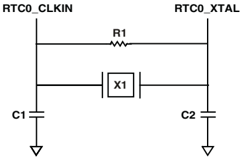

NOTE: C1 AND C2 ARE SPECIFIC TO CRYSTAL SPECIFIED FOR X1. CONTACT CRYSTAL MANUFACTURER FOR DETAILS.

Figure 6. External Components for RTC

The 32.768 kHz input clock frequency is divided down to a 1 Hz signal by a prescaler. The counter function of the timer consists of four counters: a 60 second counter, a 60 minute counter, a 24 hour counter, and a 32,768 day counter. When the alarm interrupt is enabled, the alarm function generates an interrupt when the output of the timer matches the programmed value in the alarm control register (RTC\_ALARM). There are two alarms: a time of day and a day and time of that day.

## ADSP-SC582/SC583/SC584/SC587/SC589/ADSP-21583/21584/21587

The stopwatch function counts down from a programmed value, with 1 sec resolution. When the stopwatch interrupt is enabled and the counter underflows, an interrupt is generated.

## Clock Generation Unit (CGU)

The ADSP-SC58x/ADSP-2158x processors support two independent PLLs. Each PLL is part of a clock generation unit (CGU); see Figure 8. Each CGU can be either driven externally by the same clock source or each can be driven by separate sources. This provides flexibility in determining the internal clocking frequencies for each clock domain.

Frequencies generated by each CGU are derived from a common multiplier with different divider values available for each output.

The CGU generates all on-chip clocks and synchronization signals. Multiplication factors are programmed to define the PLLCLK frequency.

Programmable values divide the PLLCLK frequency to generate the core clock (CCLK), the system clocks, the DDR1/DDR2/ DDR3 clock (DCLK), and the output clock (OCLK). For more information on clocking, see the ADSP-SC58x/ADSP-2158x SHARC+ Processor Hardware Reference.

Writing to the CGU control registers does not affect the behavior of the PLL immediately. Registers are first programmed with a new value and the PLL logic executes the changes so it transitions smoothly from the current conditions to the new conditions.

## System Crystal Oscillator and USB Crystal Oscillator

The processor can be clocked by an external crystal (see Figure 7), a sine wave input, or a buffered, shaped clock derived from an external clock oscillator. If using an external clock, it should be a TTL-compatible signal and must not be halted, changed, or operated below the specified frequency during normal operation. This signal is connected to the SYS\_CLKINx pin and the USB\_CLKIN pin of the processor. When using an external clock, the SYS\_XTALx pin and the USB\_XTAL pin must be left unconnected. Alternatively, because the processor includes an on-chip oscillator circuit, an external crystal can be used.

For fundamental frequency operation, use the circuit shown in Figure 7. A parallel resonant, fundamental frequency, microprocessor grade crystal is connected across the SYS\_CLKINx pin and the SYS\_XTALx pin. The on-chip resistance between the SYS\_CLKINx pin and the SYS\_XTALx pin is in the 500 kΩ range. Further parallel resistors are typically not recommended.

The two capacitors and the series resistor, shown in Figure 7, fine tune phase and amplitude of the sine frequency. The capacitor and resistor values shown in Figure 7 are typical values only. The capacitor values are dependent upon the load capacitance recommendations of the crystal manufacturer and the physical layout of the printed circuit board (PCB). The resistor value depends on the drive level specified by the crystal manufacturer. The user must verify the customized values based on careful investigations on multiple devices over the required temperature range.

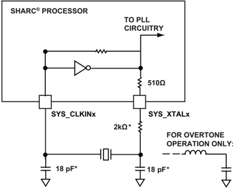

NOTE: VALUES MARKED WITH * MUST BE CUSTOMIZED, DEPENDING ON THE CRYSTAL AND LAYOUT. ANALYZE CAREFULLY. FOR FREQUENCIES ABOVE 33 MHz, THE SUGGESTED CAPACITOR VALUE OF 18 pF MUST BE TREATED AS A MAXIMUM.

Figure 7. External Crystal Connection

A third overtone crystal can be used for frequencies above 25 MHz. The circuit is then modified to ensure crystal operation only at the third overtone by adding a tuned inductor circuit, shown in Figure 7. A design procedure for the third overtone operation is discussed in detail in Using Third Overtone Crystals with the ADSP-218x DSP (EE-168). The same recommendations can be used for the USB crystal oscillator.

## Clock Distribution Unit (CDU)

The two CGUs each provide outputs which feed a clock distribution unit (CDU). The clock outputs CLKO0-CLKO9 are connected to various targets. For more information, refer to the ADSP-SC58x/ADSP-2158x SHARC+ Processor Hardware Reference.

## Power-Up

SYS\_XTALx oscillations (SYS\_CLKINx) start when power is applied to the VDD\_EXT pins. The rising edge of SYS\_HWRST starts on-chip PLL locking (PLL lock counter). The deassertion must apply only if all voltage supplies and SYS\_CLKINx oscillations are valid (refer to the Power-Up Reset Timing section).

## Clock Out/External Clock

The SYS\_CLKOUT output pin has programmable options to output divided-down versions of the on-chip clocks. By default, the SYS\_CLKOUT pin drives a buffered version of the SYS\_ CLKIN0 input. Refer to the ADSP-SC58x/ADSP-2158x SHARC+ Processor Hardware Reference to change the default mapping of clocks.

## Booting

The processors have several mechanisms for automatically loading internal and external memory after a reset. The boot mode is defined by the SYS\_BMODE[n] input pins. There are two

## ADSP-SC582/SC583/SC584/SC587/SC589/ADSP-21583/21584/21587

categories of boot modes. In flash boot modes, the processors actively load data from serial memories. In external host boot modes, the processors receive data from external host devices.

The boot modes are shown in Table 9. These modes are implemented by the SYS\_BMODE[n] bits of the reset configuration register and are sampled during power-on resets and software initiated resets.

In the ADSP-SC58x processors, the Arm Cortex-A5 (Core 0) controls the boot process, including loading all internal and external memory. Likewise, in the ADSP-2158x processors, the SHARC+ (Core 1) controls the boot function. The option for secure boot is available on all models.

## Table 9. Boot Modes

|   SYS_BMODE[n] Setting | BootMode   |
|------------------------|------------|
|                    000 | No boot    |
|                    001 | SPI2 flash |
|                    010 | SPI2 host  |
|                    011 | Reserved   |
|                    100 | Reserved   |
|                    101 | Reserved   |
|                    110 | Link0 host |
|                    111 | UART0 host |

## Thermal Monitoring Unit (TMU)

The thermal monitoring unit (TMU) provides on-chip temperature measurement which is important in applications that require substantial power consumption. The TMU is integrated into the processor die and digital infrastructure using an MMRbased system access to measure the die temperature variations in real-time.

TMU features include the following:

- On-chip temperature sensing
- Programmable over temperature and under temperature limits
- Programmable conversion rate
- Averaging feature available

## Power Supplies

The processors have separate power supply connections for:

- Internal (VDD\_INT)
- External (VDD\_EXT)
- USB (VDD\_USB)
- HADC/TMU (VDD\_HADC)
- RTC (VDD\_RTC)
- DMC (VDD\_DMC)
- PCIe (VDD\_PCIE, VDD\_PCIE\_TX and VDD\_PCIE\_RX)

All power supplies must meet the specifications provided in the Operating Conditions section. All external supply pins must be connected to the same power supply.

## Power Management

As shown in Table 10, the processors support four different power domains, which maximizes flexibility while maintaining compliance with industry standards and conventions. There are no sequencing requirements for the various power domains, but all domains must be powered according to the appropriate specifications (see the Specifications section for processor operating conditions). If the feature or the peripheral is not used, refer to Table 27.)

## Table 10. Power Domains

| Power Domain                                                                                                | V DD Range                                                                                 |
|-------------------------------------------------------------------------------------------------------------|--------------------------------------------------------------------------------------------|
| All internal logic DDR3/DDR2/LPDDR USB HADC/TMU RTC PCIe_TX PCIe_RX PCIe All other I/O (includes port pins) | V DD_INT V DD_DMC V DD_USB V DD_HADC V DD_RTC V DD_PCIE_TX V DD_PCIE_RX V DD_PCIE V DD_EXT |

The power dissipated by the processors is largely a function of the clock frequency and the square of the operating voltage. For example, reducing the clock frequency by 25% results in a 25% reduction in dynamic power dissipation.

## Target Board JTAG Emulator Connector

The Analog Devices DSP tools product line of JTAG emulators uses the IEEE 1149.1 JTAG test access port of the processors to monitor and control the target board processor during emulation. The Analog Devices DSP tools product line of JTAG emulators provides emulation at full processor speed, allowing inspection and modification of memory, registers, and processor stacks. The processor JTAG interface ensures the emulator does not affect target system loading or timing.

For information on JTAG emulator operation, see the appropriate emulator hardware user's guide at SHARC Processors Software and Tools.

## SYSTEM DEBUG

The processors include various features that allow easy system debug. These are described in the following sections.

## System Watchpoint Unit (SWU)

The system watchpoint unit (SWU) is a single module that connects to a single system bus and provides transaction monitoring. One SWU is attached to the bus going to each system completer. The SWU provides ports for all system bus address channel signals. Each SWU contains four match groups of registers with associated hardware. These four SWU match groups operate independently but share common event (for example, interrupt and trigger) outputs.

## ADSP-SC582/SC583/SC584/SC587/SC589/ADSP-21583/21584/21587

## Debug Access Port (DAP)

Debug access port (DAP) provides IEEE 1149.1 JTAG interface support through the JTAG debug. The DAP provides an optional instrumentation trace for both the core and system. It provides a trace stream that conforms to MIPI System Trace Protocol version 2 (STPv2) .

## DEVELOPMENT TOOLS

Analog Devices supports its processors with a complete line of software and hardware development tools, including an integrated development environment (CrossCore ® Embedded Studio), evaluation products, emulators, and a variety of software add-ins.

## Integrated Development Environments (IDEs)

For C/C++ software writing and editing, code generation, and debug support, Analog Devices offers the CrossCore Embedded Studio integrated development environment (IDE).

CrossCore Embedded Studio is based on the Eclipse framework. Supporting most Analog Devices processor families, it is the IDE of choice for processors, including multicore devices. CrossCore Embedded Studio seamlessly integrates available software add-ins to support real-time operating systems, file systems, TCP/IP stacks, USB stacks, algorithmic software modules, and evaluation hardware board support packages. For more information, visit www.analog.com/cces.

## EZ-KIT Lite Evaluation Board

For processor evaluation, Analog Devices provides a wide range of EZ-KIT Lite ® evaluation boards. Including the processor and key peripherals, the evaluation board also supports on-chip emulation capabilities and other evaluation and development features. Various EZ-Extenders ® are also available, which are daughter cards that deliver additional specialized functionality, including audio and video processing. For more information visit www.analog.com.

## EZ-KIT Lite Evaluation Kits

For a cost-effective way to learn more about developing with Analog Devices processors, Analog Devices offer a range of EZKIT Lite evaluation kits. Each evaluation kit includes an EZ-KIT Lite evaluation board, directions for downloading an evaluation version of the available IDE(s), a USB cable, and a power supply. The USB controller on the EZ-KIT Lite board connects to the USB port of the user PC, enabling the chosen IDE evaluation suite to emulate the on-board processor in-circuit.

This permits users to download, execute, and debug programs for the EZ-KIT Lite system. It also supports in circuit programming of the on-board Flash device to store user specific boot code, enabling standalone operation. With the full version of CrossCore Embedded Studio installed (sold separately), engineers can develop software for supported EZ-KITs or any custom system utilizing supported Analog Devices processors.

## Software Add-Ins for CrossCore Embedded Studio

Analog Devices offers software add-ins which seamlessly integrate with CrossCore Embedded Studio to extend the capabilities and reduce development time. Add-ins include board support packages for evaluation hardware, various middleware packages, and algorithmic modules. Documentation, help, configuration dialogs, and coding examples present in these add-ins are viewable through the CrossCore Embedded Studio IDE once the add-in is installed.

## Board Support Packages for Evaluation Hardware

Software support for the EZ-KIT Lite evaluation boards and EZExtender daughter cards is provided by software add-ins called board support packages (BSPs). The BSPs contain the required drivers, pertinent release notes, and select example code for the given evaluation hardware. A download link for a specific BSP is located on the web page for the associated EZ-KIT or EZExtender product.

## Middleware Packages

Analog Devices offers middleware add-ins such as real-time operating systems, file systems, USB stacks, and TCP/IP stacks. For more information, see the following web pages:

- [www.analog.com/ucos2](https://www.analog.com/ucos2)
- [www.analog.com/ucos3](https://www.analog.com/ucos3)
- [www.analog.com/ucfs](https://www.analog.com/ucfs)
- [www.analog.com/ucusbd](https://www.analog.com/ucusbd)
- [www.analog.com/ucusbh](https://www.analog.com/ucusbh)
- [www.analog.com/lwip](https://www.analog.com/lwip)

## Algorithmic Modules

To speed development, Analog Devices offers add-ins that perform popular audio and video processing algorithms. These are available for use with CrossCore Embedded Studio. For more information visit www.analog.com.

## Designing an Emulator-Compatible DSP Board (Target)

For embedded system test and debug, Analog Devices provides a family of emulators. On each JTAG DSP, Analog Devices supplies an IEEE 1149.1 JTAG test access port (TAP). In-circuit emulation is facilitated by use of this JTAG interface. The emulator accesses the internal features of the processor via the TAP, allowing the developer to load code, set breakpoints, and view variables, memory, and registers.

The processor must be halted to send data and commands, but once an operation is completed by the emulator, the DSP system is set to run at full speed with no impact on system timing. The emulators require the target board to include a header that supports connection of the JTAG port of the DSP to the emulator.

For details on target board design issues including mechanical layout, single processor connections, signal buffering, signal termination, and emulator pod logic, see Analog Devices JTAG Emulation Technical Reference (EE-68).

## ADSP-SC582/SC583/SC584/SC587/SC589/ADSP-21583/21584/21587

## ADDITIONAL INFORMATION

This data sheet provides a general overview of the ADSPSC58x/ADSP-2158x architecture and functionality. For detailed information on the core architecture and instruction set, refer to the SHARC+ Core Programming Reference.

## RELATED SIGNAL CHAINS

A signal chain is a series of signal-conditioning electronic components that receive input (data acquired from sampling either real-time phenomena or from stored data) in tandem, with the output of one portion of the chain supplying input to the next. Signal chains are often used in signal processing applications to gather and process data or to apply system controls based on analysis of real-time phenomena.

Analog Devices eases signal processing system development by providing signal processing components that are designed to work together well. A tool for viewing relationships between specific applications and related components is available on the www.analog.com website.

The application signal chains page in the Circuits from the Lab ® site (www.analog.com\circuits) provides the following:

- Graphical circuit block diagram presentation of signal chains for a variety of circuit types and applications
- Drill down links for components in each chain to selection guides and application information
- Reference designs applying best practice design techniques

## ADSP-SC582/SC583/SC584/SC587/SC589/ADSP-21583/21584/21587

## ADSP-SC58x/ADSP-2158x DETAILED SIGNAL DESCRIPTIONS

Table 11 provides a detailed description of each pin.

Table 11. ADSP-SC58x/ADSP-2158x Detailed Signal Descriptions

| SignalName   | Direction   | Description                                                                                                                                                                                                                                                                                                              |
|--------------|-------------|--------------------------------------------------------------------------------------------------------------------------------------------------------------------------------------------------------------------------------------------------------------------------------------------------------------------------|
| ACM_A[n]     | Output      | ADCControl Signals. Function varies by mode.                                                                                                                                                                                                                                                                             |
| ACM_T[n]     | Input       | External Trigger n. Input for external trigger events.                                                                                                                                                                                                                                                                   |
| C1_FLG[n]    | InOut       | SHARC+ Core 1 Flag Pin.                                                                                                                                                                                                                                                                                                  |
| C2_FLG[n]    | InOut       | SHARC+ Core 2 Flag Pin.                                                                                                                                                                                                                                                                                                  |
| CAN_RX       | Input       | Receive. Typically an external CAN transceiver RX output.                                                                                                                                                                                                                                                                |
| CAN_TX       | Output      | Transmit. Typically an external CAN transceiver TX input.                                                                                                                                                                                                                                                                |
| CNT_DG       | Input       | CountDownandGate. Depending onthe modeofoperation, this input acts either asacountdown signal or a gate signal. Count down-this input causes the GP counter to decrement.                                                                                                                                                |
| CNT_UD       | Input       | Count UpandDirection. Depending on the mode of operation, this input acts either as a count up signal or a direction signal. Count up-this input causes the GP counter to increment. Direction-selects whether the GP counter is incrementing or decrementing.                                                           |
| CNT_ZM       | Input       | Count Zero Marker. Input that connects to the zero marker output of a rotary device or detects the pressing of a pushbutton.                                                                                                                                                                                             |
| DAI_PIN[nn]  | InOut       | Pin n. The digital applications interfaces (DAI0 and DAI1) connect various peripherals to any of the DAI0_PINnn and DAI1_PINnn pins. Programs make these connections using the signal routing unit (SRU). Both DAI units are symmetric. The shared DAIx__PIN03 and DAIx_PIN04 pins allow routing between both DAI units. |
| DMC_A[nn]    | Output      | Address n. Address bus.                                                                                                                                                                                                                                                                                                  |
| DMC_BA[n]    | Output      | Bank Address n. Defines which internal bank an activate, read, write, or precharge command is applied to on the dynamic memory. Bank Address n also defines which mode registers (MR, EMR, EMR2, and/or EMR3) load during the load mode register command.                                                                |
| DMC_CAS      | Output      | Column Address Strobe. Defines the operation for external dynamic memory to perform in conjunction with other DMCcommandsignals. Connect to the CAS input of dynamic memory.                                                                                                                                             |
| DMC_CK       | Output      | Clock. Outputs DCLK to external dynamic memory.                                                                                                                                                                                                                                                                          |
| DMC_CKE      | Output      | Clock Enable. Active high clock enables. Connects to the dynamic memory's CKE input.                                                                                                                                                                                                                                     |
| DMC_CK       | Output      | Clock (Complement). Complement of DMC_CK.                                                                                                                                                                                                                                                                                |
| DMC_CS[n]    | Output      | Chip Select n. Commands are recognized by the memory only when this signal is asserted.                                                                                                                                                                                                                                  |
| DMC_DQ[nn]   | InOut       | Data n. Bidirectional data bus.                                                                                                                                                                                                                                                                                          |
| DMC_LDM      | Output      | Data MaskforLowerByte. Mask for DMC_DQ07:DMC_DQ00writedata whendriven high. Sampled on both edges of the data strobe by the dynamic memory.                                                                                                                                                                              |
| DMC_LDQS     | InOut       | DataStrobeforLowerByte. DMC_DQ07:DMC_DQ00datastrobe.Outputwithwritedata.Inputwith read data. Can be single-ended or differential depending on register settings.                                                                                                                                                         |
| DMC_LDQS     | InOut       | DataStrobe forLowerByte(Complement). ComplementofLDQS.Notusedinsingle-ended mode.                                                                                                                                                                                                                                        |
| DMC_ODT      | Output      | On-DieTermination. Enablesdynamicmemoryterminationresistanceswhendrivenhigh(assuming the memory is properly configured).                                                                                                                                                                                                 |
| DMC_RAS      | Output      | RowAddressStrobe. Definestheoperationforexternaldynamicmemorytoperforminconjunction with other DMCcommandsignals. Connect to the RAS input of dynamic memory.                                                                                                                                                            |
| DMC_RESET    | Output      | Reset (DDR3 Only).                                                                                                                                                                                                                                                                                                       |
| DMC_RZQ      | InOut       | External Calibration Resistor Connection.                                                                                                                                                                                                                                                                                |
| DMC_UDM      | Output      | DataMaskforUpperByte. MaskforDMC_DQ15:DMC_DQ08writedatawhendrivenhigh.Sampled on both edges of the data strobe by the dynamic memory.                                                                                                                                                                                    |
| DMC_UDQS     | InOut       | DataStrobeforUpperByte. DMC_DQ15:DMC_DQ08datastrobe.Outputwithwritedata.Inputwith read data. Not used in single-ended mode.                                                                                                                                                                                              |

## ADSP-SC582/SC583/SC584/SC587/SC589/ADSP-21583/21584/21587

Table 11. ADSP-SC58x/ADSP-2158x Detailed Signal Descriptions (Continued)

| SignalName       | Direction   | Description                                                                                                                                                                                                                                                                                                                                                                                            |
|------------------|-------------|--------------------------------------------------------------------------------------------------------------------------------------------------------------------------------------------------------------------------------------------------------------------------------------------------------------------------------------------------------------------------------------------------------|
| DMC_UDQS         | InOut       | DataStrobeforUpperByte(Complement). ComplementofUDQS.Notusedinsingle-endedmode.                                                                                                                                                                                                                                                                                                                        |
| DMC_VREF         | Input       | Voltage Reference. Externally driven to VDD_DMC/2. Applies to DMC0_VREF and DMC1_VREF pins.                                                                                                                                                                                                                                                                                                            |
| DMC_WE           | Output      | Write Enable. Defines the operation for external dynamic memory to perform in conjunction with other DMCcommandsignals. Connect to the WEinput of dynamic memory.                                                                                                                                                                                                                                      |
| ETH_CRS          | Input       | EMAC0: MII Carrier Sense. Asserted by the PHY when either the transmit or receive medium is not idle. Deasserted when both are idle. This signal is not used in RMII/RGMII modes. EMAC1: RMII Carrier Sense (CRS) and Receive Data Valid (RXDV). Multiplexed on alternate clock cycles. CRS-asserted by the PHY when either the transmit or receive medium is not idle. Deasserted when both are idle. |
| ETH_MDC          | Output      | Management Channel Clock. Clocks the MDCinput of the PHY for RMII/RGMII.                                                                                                                                                                                                                                                                                                                               |
| ETH_MDIO         | InOut       | Management Channel Serial Data. Bidirectional data bus for PHY control for RMII/RGMII.                                                                                                                                                                                                                                                                                                                 |
| ETH_PTPAUXIN[n]  | Input       | PTP Auxiliary Trigger Input. Assert this signal to take an auxiliary snapshot of the time and store it in the auxiliary time stamp FIFO.                                                                                                                                                                                                                                                               |
| ETH_PTPCLKIN[n]  | Input       | PTP Clock Input. Optional external PTP clock input.                                                                                                                                                                                                                                                                                                                                                    |
| ETH_PTPPPS[n]    | Output      | PTPPulsePerSecondOutput. Whentheadvancedtimestampfeatureenables,thissignalisasserted based on the PPS mode selected. Otherwise, PTPPPS is asserted every time the seconds counter is incremented.                                                                                                                                                                                                      |
| ETH_REFCLK       | Input       | Reference Clock. Externally supplied Ethernet clock.                                                                                                                                                                                                                                                                                                                                                   |
| ETH_RXCLK_REFCLK | Input       | RXCLK (10/100/1000) or REFCLK (10/100).                                                                                                                                                                                                                                                                                                                                                                |
| ETH_RXCTL_CRS    | Input       | RXCTL (10/100/1000) or CRS (10/100).                                                                                                                                                                                                                                                                                                                                                                   |
| ETH_RXD[n]       | Input       | Receive Data n. Receive data bus.                                                                                                                                                                                                                                                                                                                                                                      |
| ETH_TXCLK        | Output      | Transmit Clock.                                                                                                                                                                                                                                                                                                                                                                                        |
| ETH_TXCTL_TXEN   | Output      | TXCTL (10/100/1000) or TXEN(10/100).                                                                                                                                                                                                                                                                                                                                                                   |
| ETH_TXD[n]       | Output      | Transmit Data n. Transmits data bus.                                                                                                                                                                                                                                                                                                                                                                   |
| ETH_TXEN         | Output      | Transmit Enable. When asserted, signal indicates the data on TXDn is valid.                                                                                                                                                                                                                                                                                                                            |
| HADC_EOC_DOUT    | Output      | EndofConversion/Serial Data Out. Transitions high for one cycle of the HADCinternal clock at the end of every conversion. Alternatively, HADC serial data out can be seen by setting the appropriate bit in HADC_CTL.                                                                                                                                                                                  |
| HADC_MUX[n]      | Input       | Controls to External Multiplexer. Allows additional input channels whenconnected to an external multiplexer.                                                                                                                                                                                                                                                                                           |
| HADC_VIN[n]      | Input       | Analog Input at Channel n. Analog voltage inputs for digital conversion.                                                                                                                                                                                                                                                                                                                               |
| HADC_VREFN       | Input       | Ground Reference for ADC. Connect to an external voltage reference that meets data sheet specifications.                                                                                                                                                                                                                                                                                               |
| HADC_VREFP       | Input       | External Reference for ADC. Connect to an external voltage reference that meets data sheet specifications.                                                                                                                                                                                                                                                                                             |
| JTG_TCK          | Input       | JTAG Clock. JTAG test access port clock.                                                                                                                                                                                                                                                                                                                                                               |
| JTG_TDI          | Input       | JTAG Serial Data In. JTAG test access port data input.                                                                                                                                                                                                                                                                                                                                                 |
| JTG_TDO          | Output      | JTAG Serial Data Out. JTAG test access port data output.                                                                                                                                                                                                                                                                                                                                               |
| JTG_TMS          | Input       | JTAG ModeSelect. JTAG test access port mode select.                                                                                                                                                                                                                                                                                                                                                    |
| JTG_TRST         | Input       | JTAG Reset. JTAG test access port reset.                                                                                                                                                                                                                                                                                                                                                               |
| LP_ACK           | InOut       | Acknowledge. Provideshandshaking.Whenthelinkportisconfiguredasareceiver,ACKisanoutput. When the link port is configured as a transmitter, ACK is an input.                                                                                                                                                                                                                                             |
| LP_CLK           | InOut       | Clock. Whenthelinkport is configured as a receiver,CLK isan input. Whenthelinkport is configured as a transmitter, CLK is an output.                                                                                                                                                                                                                                                                   |
| LP_D[n]          | InOut       | Data n. Data bus. Input when receiving, output when transmitting.                                                                                                                                                                                                                                                                                                                                      |
| MLB_CLKP         |             | Differential Clock (+).                                                                                                                                                                                                                                                                                                                                                                                |
|                  | Input       |                                                                                                                                                                                                                                                                                                                                                                                                        |

## ADSP-SC582/SC583/SC584/SC587/SC589/ADSP-21583/21584/21587

Table 11. ADSP-SC58x/ADSP-2158x Detailed Signal Descriptions (Continued)

| SignalName   | Direction   | Description                                                                                                                                                     |
|--------------|-------------|-----------------------------------------------------------------------------------------------------------------------------------------------------------------|
| MLB_DATN     | InOut       | Differential Data (-).                                                                                                                                          |
| MLB_DATP     | InOut       | Differential Data (+).                                                                                                                                          |
| MLB_SIGN     | InOut       | Differential Signal (-).                                                                                                                                        |
| MLB_SIGP     | InOut       | Differential Signal (+).                                                                                                                                        |
| MLB_CLK      | Input       | Single-Ended Clock.                                                                                                                                             |
| MLB_DAT      | InOut       | Single-Ended Data.                                                                                                                                              |
| MLB_SIG      | InOut       | Single-Ended Signal.                                                                                                                                            |
| MLB_CLKOUT   | Output      | Single-Ended Clock Out.                                                                                                                                         |
| MSI_CD       | Input       | Card Detect. Connects to a pull-up resistor and to the card detect output of an SD socket.                                                                      |
| MSI_CLK      | Output      | Clock. The clock signal applied to the connected device from the MSI.                                                                                           |
| MSI_CMD      | InOut       | Command. Sends commands to and receives responses from the connected device.                                                                                    |
| MSI_D[n]     | InOut       | Data n. Bidirectional data bus.                                                                                                                                 |
| MSI_INT      | Input       | eSDIOInterruptInput. UsedonlyforeSDIO.ConnectstoaneSDIOcardinterruptoutput.Aninterrupt may be sampled even when the MSI clock to the card is switched off.      |
| PCIE_CLKM    | Input       | CLK -.                                                                                                                                                          |
| PCIE_CLKP    | Input       | CLK +.                                                                                                                                                          |
| PCIE_REF     | InOut       | Reference Resistor. Attach a 200 Ω, 1%, 100 ppm/C precision resistor to ground on the board.                                                                    |
| PCIE_RXM     | Input       | RX-.                                                                                                                                                            |
| PCIE_RXP     | Input       | RX+.                                                                                                                                                            |
| PCIE_TXM     | Output      | TX -.                                                                                                                                                           |
| PCIE_TXP     | Output      | TX +.                                                                                                                                                           |
| PPI_CLK      | InOut       | Clock. Input in external clock mode, output in internal clock mode.                                                                                             |
| PPI_D[nn]    | InOut       | Data n. Bidirectional data bus.                                                                                                                                 |
| PPI_FS1      | InOut       | Frame Sync 1 (HSYNC). Behavior depends on EPPI mode. See the 'EPPI' chapter of the ADSP- SC58x/ADSP-2158x SHARC+ Processor Hardware Reference for more details. |
| PPI_FS2      | InOut       | Frame Sync 2 (VSYNC). Behavior depends on EPPI mode. See the 'EPPI' chapter of the ADSP- SC58x/ADSP-2158x SHARC+ Processor Hardware Reference for more details. |
| PPI_FS3      | InOut       | Frame Sync 3 (FIELD). Behavior depends on EPPI mode. See the 'EPPI' chapter of the ADSP- SC58x/ADSP-2158x SHARC+ Processor Hardware Reference for more details. |
| PWM_AH       | Output      | Channel AHighSide. High-side drive signal.                                                                                                                      |
| PWM_AL       | Output      | Channel ALowSide. Low-side drive signal.                                                                                                                        |
| PWM_BH       | Output      | ChannelB High Side. High-side drive signal.                                                                                                                     |
| PWM_BL       | Output      | Channel BLowSide. Low-side drive signal.                                                                                                                        |
| PWM_CH       | Output      | Channel C High Side. High-side drive signal.                                                                                                                    |
| PWM_CL       | Output      | Channel C LowSide. Low-side drive signal.                                                                                                                       |
| PWM_DH       | Output      | Channel DHighSide. High-side drive signal.                                                                                                                      |
| PWM_DL       | Output      | Channel DLowSide. Low-side drive signal.                                                                                                                        |
| PWM_SYNC     | Input       | PWMTMRGrouped. Thisinputisforanexternallygeneratedsyncsignal.Ifthesyncsignalisinternally generated, no connection is necessary.                                 |
| PWM_TRIP[n]  | Input       | Shutdown Input n. When asserted, the selected PWMchannel outputs are shut down immediately.                                                                     |
| P_[nn]       | InOut       | Position n. General-purpose input/output. See the 'GP Ports' chapter of the ADSP-SC58x/ADSP- 2158x SHARC+ Processor Hardware Reference for more details.        |
| RTC_CLKIN    | Input       | Crystal Input/External Oscillator Connection. Connect to an external clock source or crystal.                                                                   |
| RTC_XTAL     | Output      | Crystal Output. Drives an external crystal. Must be left unconnected if an external clock is driving RTC_CLKIN.                                                 |
| SINC_CLK0    | Output      | Clock 0.                                                                                                                                                        |
| SINC_D0      | Input       | Data 0.                                                                                                                                                         |

## ADSP-SC582/SC583/SC584/SC587/SC589/ADSP-21583/21584/21587

Table 11. ADSP-SC58x/ADSP-2158x Detailed Signal Descriptions (Continued)

| SignalName   | Direction   | Description                                                                                                                                                                                                                                                                                             |
|--------------|-------------|---------------------------------------------------------------------------------------------------------------------------------------------------------------------------------------------------------------------------------------------------------------------------------------------------------|
| SINC_D1      | Input       | Data 1.                                                                                                                                                                                                                                                                                                 |
| SINC_D2      | Input       | Data 2.                                                                                                                                                                                                                                                                                                 |
| SINC_D3      | Input       | Data 3.                                                                                                                                                                                                                                                                                                 |
| SMC_ABE[n]   | Output      | Byte Enable n. Indicates whether the lower or upper byte of a memory is being accessed. When an asynchronous write is made to the upper byte of a 16-bit memory, SMC_ABE1 = 0 and SMC_ABE0 = 1. When an asynchronous write is made to the lower byte of a 16-bit memory, SMC_ABE1 = 1 and SMC_ABE0 = 0. |
| SMC_AMS[n]   | Output      | MemorySelect n. Typically connects to the chip select of a memory device.                                                                                                                                                                                                                               |
| SMC_AOE      | Output      | Output Enable. Asserts at the beginning of the setup period of a read access.                                                                                                                                                                                                                           |
| SMC_ARDY     | Input       | Asynchronous Ready. Flow control signal used by memory devices to indicate to the SMC when further transactions may proceed.                                                                                                                                                                            |
| SMC_ARE      | Output      | Read Enable. Asserts at the beginning of a read access.                                                                                                                                                                                                                                                 |
| SMC_AWE      | Output      | Write Enable. Asserts for the duration of a write access period.                                                                                                                                                                                                                                        |
| SMC_A[nn]    | Output      | Address n. Address bus.                                                                                                                                                                                                                                                                                 |
| SMC_D[nn]    | InOut       | Data n. Bidirectional data bus.                                                                                                                                                                                                                                                                         |
| SPI_CLK      | InOut       | Clock. Input in slave mode, output in master mode.                                                                                                                                                                                                                                                      |
| SPI_D2       | InOut       | Data 2. Transfers serial data in quad mode. Open-drain when ODMmodeis enabled.                                                                                                                                                                                                                          |
| SPI_D3       | InOut       | Data 3. Transfers serial data in quad mode. Open-drain when ODMmodeis enabled.                                                                                                                                                                                                                          |
| SPI_MISO     | InOut       | Master In, Slave Out. Transfers serial data. Operates in the same direction as SPI_MOSI in dual and quad modes. Open-drain when ODMmodeis enabled.                                                                                                                                                      |
| SPI_MOSI     | InOut       | Master Out, Slave In. Transfers serial data. Operates in the same direction as SPI_MISO in dual and quad modes. Open-drain when ODMmodeis enabled.                                                                                                                                                      |
| SPI_RDY      | InOut       | Ready. Optional flow signal. Output in slave mode, input in master mode.                                                                                                                                                                                                                                |
| SPI_SEL[n]   | Output      | Slave Select Output n. Used in master mode to enable the desired slave.                                                                                                                                                                                                                                 |
| SPI_SS       | Input       | Slave Select Input. Slave mode-acts as the slave select input. Master mode-optionally serves as an error detection input for the SPI when there are multiple masters.                                                                                                                                   |
| SPT_ACLK     | InOut       | Channel AClock. Data and frame sync are driven/sampled with respect to this clock. This signal can be either internally or externally generated.                                                                                                                                                        |
| SPT_AD0      | InOut       | Channel AData 0. Primary bidirectional data I/O. This signal can be configured as an output to transmit serial data or as an input to receive serial data.                                                                                                                                              |
| SPT_AD1      | InOut       | Channel AData 1. Secondary bidirectional data I/O. This signal can be configured as an output to transmit serial data or as an input to receive serial data.                                                                                                                                            |
| SPT_AFS      | InOut       | Channel AFrameSync. The frame sync pulse initiates shifting of the serial data. This signal is either generated internally or externally.                                                                                                                                                               |
| SPT_ATDV     | Output      | Channel ATransmit Data Valid. This signal is optional and only active whenSPORTis configured in multichannel transmit mode. It is asserted during enabled slots.                                                                                                                                        |
| SPT_BCLK     | InOut       | Channel BClock. Data and frame sync are driven/sampled with respect to this clock. This signal can be either internally or externally generated.                                                                                                                                                        |
| SPT_BD0      | InOut       | ChannelB Data 0. Primary bidirectional data I/O. This signal can be configured as an output to transmit serial data or as an input to receive serial data.                                                                                                                                              |
| SPT_BD1      | InOut       | ChannelB Data 1. Secondary bidirectional data I/O. This signal can be configured as an output to transmit serial data or as an input to receive serial data.                                                                                                                                            |
| SPT_BFS      | InOut       | ChannelB Frame Sync. The frame sync pulse initiates shifting of serial data. This signal is either generated internally or externally.                                                                                                                                                                  |
| SPT_BTDV     | Output      | Channel BTransmit Data Valid. This signal is optional and only active when SPORT is configured in multichannel transmit mode. It is asserted during enabled slots.                                                                                                                                      |
| SYS_BMODE[n] | Input       | Boot ModeControl n. Selects the boot mode of the processor.                                                                                                                                                                                                                                             |

## ADSP-SC582/SC583/SC584/SC587/SC589/ADSP-21583/21584/21587

Table 11. ADSP-SC58x/ADSP-2158x Detailed Signal Descriptions (Continued)

| SignalName   | Direction   | Description                                                                                                                                                                                                                                                     |
|--------------|-------------|-----------------------------------------------------------------------------------------------------------------------------------------------------------------------------------------------------------------------------------------------------------------|
| SYS_CLKIN0   | Input       | Clock/Crystal Input.                                                                                                                                                                                                                                            |
| SYS_CLKIN1   | Input       | Clock/Crystal Input.                                                                                                                                                                                                                                            |
| SYS_CLKOUT   | Output      | ProcessorClockOutput. Outputsinternalclocks.Clocksmaybedivideddown.Seethe'CGU'chapter of the ADSP-SC58x/ADSP-2158x SHARC+ Processor Hardware Reference for more details.                                                                                        |
| SYS_FAULT    | InOut       | Active High Fault Output. Indicates internal faults or senses external faults, depending on the operating mode.                                                                                                                                                 |
| SYS_FAULT    | InOut       | Active LowFault Output. Indicates internal faults or senses external faults, depending on the operating mode.                                                                                                                                                   |
| SYS_HWRST    | Input       | Processor Hardware Reset Control. Resets the device when asserted.                                                                                                                                                                                              |
| SYS_RESOUT   | Output      | Reset Output. Indicates the device is in the reset state.                                                                                                                                                                                                       |
| SYS_XTAL0    | Output      | Crystal Output.                                                                                                                                                                                                                                                 |
| SYS_XTAL1    | Output      | Crystal Output.                                                                                                                                                                                                                                                 |
| TM_ACI[n]    | Input       | AlternateCaptureInputn. ProvidesanadditionalinputforWIDCAP,WATCHDOG,andPININTmodes.                                                                                                                                                                             |
| TM_ACLK[n]   | Input       | Alternate Clock n. Provides an additional time base for an individual timer.                                                                                                                                                                                    |
| TM_CLK       | Input       | Clock. Provides an additional global time base for all GP timers.                                                                                                                                                                                               |
| TM_TMR[n]    | InOut       | Timer n. The main input/output signal for each timer.                                                                                                                                                                                                           |
| TRACE_CLK    | Output      | Trace Clock. Clock output.                                                                                                                                                                                                                                      |
| TRACE_D[nn]  | Output      | Trace Data n. Unidirectional data bus.                                                                                                                                                                                                                          |
| TWI_SCL      | InOut       | Serial Clock. Clock output when controller, clock input when target.                                                                                                                                                                                            |
| TWI_SDA      | InOut       | Serial Data. Receives or transmits data.                                                                                                                                                                                                                        |
| UART_CTS     | Input       | Clear to Send. Flow control signal.                                                                                                                                                                                                                             |
| UART_RTS     | Output      | Request to Send. Flow control signal.                                                                                                                                                                                                                           |
| UART_RX      | Input       | Receive. Receives input. Typically connects to a transceiver that meets the electrical requirements of the device being communicated with.                                                                                                                      |
| UART_TX      | Output      | Transmit. Transmitsoutput.Typicallyconnectstoatransceiverthatmeetstheelectricalrequirements of the device being communicated with.                                                                                                                              |
| USB_CLKIN    | Input       | Clock/Crystal Input. This clock input is multiplied by a PLL to form the USB clock. See data sheet specifications for frequency/tolerance information.                                                                                                          |
| USB_DM       | InOut       | Data -. Bidirectional differential data line.                                                                                                                                                                                                                   |
| USB_DP       | InOut       | Data +. Bidirectional differential data line.                                                                                                                                                                                                                   |
| USB_ID       | Input       | OTGID. Senses whether the controller is a host or device. This signal is pulled low when an A-type plug is sensed (signifying that the USBcontrolleristheAdevice).TheinputishighwhenaB-typeplug is sensed (signifying that the USB controller is the B device). |
| USB_VBC      | Output      | VBUSControl. Controls an external voltage source to supply VBUS when in host mode. Can be configured as open drain. Polarity is configurable as well.                                                                                                           |
| USB_VBUS     | InOut       | Bus Voltage. Connects to bus voltage in host and device modes.                                                                                                                                                                                                  |
| USB_XTAL     | Output      | Crystal. Drives anexternal crystal.Mustbeleft unconnectedif anexternal clock is drivingUSB_CLKIN.                                                                                                                                                               |

## ADSP-SC582/SC583/SC584/SC587/SC589/ADSP-21583/21584/21587

## 349-BALL CSP\_BGA SIGNAL DESCRIPTIONS

The processor pin definitions are shown in Table 12 for the 349-ball CSP\_BGA package. The columns in this table provide the following information:

- The Signal Name column includes the signal name for every pin and the GPIO multiplexed pin function, where applicable.
- The Description column provides a descriptive name for each signal.
- The Port column shows whether or not a signal is multiplexed with other signals on a general-purpose I/O port pin.
- The Pin Name column identifies the name of the package pin (at power on reset) on which the signal is located (if a single function pin) or is multiplexed (if a general-purpose I/O pin).
- The DAI pins and their associated signal routing units (SRUs) connect inputs and outputs of the DAI peripherals (SPORT, ASRC, S/PDIF, and PCG). See the 'Digital Audio Interface (DAI)' chapter of the ADSP-SC58x/ADSP-2158x SHARC+ Processor Hardware Reference for complete information on the use of the DAI and SRUs.

Table 12. ADSP-SC58x/ADSP-2158x 349-Ball CSP\_BGA Signal Descriptions

| SignalName   | Description                 | Port      | PinName    |
|--------------|-----------------------------|-----------|------------|
| ACM0_A0      | ACM0 ADC Control Signals    | C         | PC_13      |
| ACM0_A1      | ACM0 ADC Control Signals    | C         | PC_14      |
| ACM0_A2      | ACM0 ADC Control Signals    | C         | PC_15      |
| ACM0_A3      | ACM0 ADC Control Signals    | D         | PD_00      |
| ACM0_A4      | ACM0 ADC Control Signals    | D         | PD_01      |
| ACM0_T0      | ACM0External Trigger n      | C         | PC_12      |
| C1_FLG0      | SHARC Core 1 Flag Pin       | E         | PE_01      |
| C1_FLG1      | SHARC Core 1 Flag Pin       | E         | PE_03      |
| C1_FLG2      | SHARC Core 1 Flag Pin       | E         | PE_05      |
| C1_FLG3      | SHARC Core 1 Flag Pin       | E         | PE_07      |
| C2_FLG0      | SHARC Core 2 Flag Pin       | E         | PE_02      |
| C2_FLG1      | SHARC Core 2 Flag Pin       | E         | PE_04      |
| C2_FLG2      | SHARC Core 2 Flag Pin       | E         | PE_06      |
| C2_FLG3      | SHARC Core 2 Flag Pin       | E         | PE_08      |
| CAN0_RX      | CAN0 Receive                | C         | PC_07      |
| CAN0_TX      | CAN0 Transmit               | C         | PC_08      |
| CAN1_RX      | CAN1 Receive                | B         | PB_10      |
| CAN1_TX      | CAN1 Transmit               | B         | PB_09      |
| CNT0_DG      | CNT0 Count Down and Gate    | B         | PB_14      |
| CNT0_UD      | CNT0 Count Up and Direction | B         | PB_12      |
| CNT0_ZM      | CNT0 Count Zero Marker      | B         | PB_11      |
| DAI0_PIN01   | DAI0 Pin 1                  | Not Muxed | DAI0_PIN01 |
| DAI0_PIN02   | DAI0 Pin 2                  | Not Muxed | DAI0_PIN02 |
| DAI0_PIN03   | DAI0 Pin 3                  | Not Muxed | DAI0_PIN03 |
| DAI0_PIN04   | DAI0 Pin 4                  | Not Muxed | DAI0_PIN04 |
| DAI0_PIN05   | DAI0 Pin 5                  | Not Muxed | DAI0_PIN05 |
| DAI0_PIN06   | DAI0 Pin 6                  | Not Muxed | DAI0_PIN06 |
| DAI0_PIN07   | DAI0 Pin 7                  | Not Muxed | DAI0_PIN07 |
| DAI0_PIN08   | DAI0 Pin 8                  | Not Muxed | DAI0_PIN08 |
| DAI0_PIN09   | DAI0 Pin 9                  | Not Muxed | DAI0_PIN09 |
| DAI0_PIN10   | DAI0 Pin 10                 | Not Muxed | DAI0_PIN10 |
| DAI0_PIN11   | DAI0 Pin 11                 | Not Muxed | DAI0_PIN11 |
| DAI0_PIN12   | DAI0 Pin 12                 | Not Muxed | DAI0_PIN12 |
| DAI0_PIN19   | DAI0 Pin 19                 | Not Muxed | DAI0_PIN19 |
| DAI0_PIN20   | DAI0 Pin 20                 | Not Muxed | DAI0_PIN20 |

## ADSP-SC582/SC583/SC584/SC587/SC589/ADSP-21583/21584/21587

Table 12. ADSP-SC58x/ADSP-2158x 349-Ball CSP\_BGA Signal Descriptions (Continued)

| SignalName          | Description               | Port                | PinName             |
|---------------------|---------------------------|---------------------|---------------------|
| DAI1_PIN01          | DAI1 Pin 1                | Not Muxed           | DAI1_PIN01          |
| DAI1_PIN02          | DAI1 Pin 2                | Not Muxed           | DAI1_PIN02          |
| DAI1_PIN03          | DAI1 Pin 3                | Not Muxed           | DAI1_PIN03          |
| DAI1_PIN04          | DAI1 Pin 4                | Not Muxed           | DAI1_PIN04          |
| DAI1_PIN05          | DAI1 Pin 5                | Not Muxed           | DAI1_PIN05          |
| DAI1_PIN06          | DAI1 Pin 6                | Not Muxed           | DAI1_PIN06          |
| DAI1_PIN07          | DAI1 Pin 7                | Not Muxed           | DAI1_PIN07          |
| DAI1_PIN08          | DAI1 Pin 8                | Not Muxed           | DAI1_PIN08          |
| DAI1_PIN09          | DAI1 Pin 9                | Not Muxed           | DAI1_PIN09          |
| DAI1_PIN10          | DAI1 Pin 10               | Not Muxed           | DAI1_PIN10          |
| DAI1_PIN11          | DAI1 Pin 11               | Not Muxed           | DAI1_PIN11          |
| DAI1_PIN12          | DAI1 Pin 12               | Not Muxed           | DAI1_PIN12          |
| DAI1_PIN19          | DAI1 Pin 19               | Not Muxed           | DAI1_PIN19          |
| DAI1_PIN20          | DAI1 Pin 20               | Not Muxed           | DAI1_PIN20          |
| DMC0_A00            | DMC0 Address 0            | Not Muxed           | DMC0_A00            |
| DMC0_A01            | DMC0 Address 1            | Not Muxed           | DMC0_A01            |
| DMC0_A02            | DMC0 Address 2            | Not Muxed           | DMC0_A02            |
| DMC0_A03            | DMC0 Address 3            | Not Muxed           | DMC0_A03            |
| DMC0_A04            | DMC0 Address 4            | Not Muxed           | DMC0_A04            |
| DMC0_A05            | DMC0 Address 5            | Not Muxed           | DMC0_A05            |
| DMC0_A06            | DMC0 Address 6            | Not Muxed           | DMC0_A06            |
| DMC0_A07            | DMC0 Address 7            | Not Muxed           | DMC0_A07            |
| DMC0_A08            | DMC0 Address 8            | Not Muxed           | DMC0_A08            |
| DMC0_A09            | DMC0 Address 9            | Not Muxed           | DMC0_A09            |
| DMC0_A10            | DMC0 Address 10           | Not Muxed           | DMC0_A10            |
| DMC0_A11            | DMC0 Address 11           | Not Muxed           | DMC0_A11            |
| DMC0_A12            | DMC0 Address 12           | Not Muxed           | DMC0_A12            |
| DMC0_A13            | DMC0 Address 13           | Not Muxed           | DMC0_A13            |
| DMC0_A14            | DMC0 Address 14           | Not Muxed           | DMC0_A14            |
| DMC0_A15            | DMC0 Address 15           | Not Muxed           | DMC0_A15            |
| DMC0_BA0            | DMC0Bank Address 0        | Not Muxed           | DMC0_BA0            |
| DMC0_BA1            | DMC0Bank Address 1        | Not Muxed           | DMC0_BA1            |
| DMC0_BA2            | DMC0Bank Address 2        | Not Muxed           | DMC0_BA2            |
| DMC0_CAS            | DMC0Column Address Strobe | Not Muxed           | DMC0_CAS            |
| DMC0_CK             | DMC0 Clock                | Not Muxed           | DMC0_CK             |
| DMC0_CKE            | DMC0Clock Enable          | Not Muxed           | DMC0_CKE            |
| DMC0_CK             | DMC0Clock (Complement)    | Not Muxed           | DMC0_CK             |
| DMC0_CS0            | DMC0 Chip Select 0        | Not Muxed           | DMC0_CS0            |
| DMC0_DQ00           | DMC0 Data 0               | Not Muxed           | DMC0_DQ00           |
| DMC0_DQ01           | DMC0 Data 1               | Not Muxed           | DMC0_DQ01           |
| DMC0_DQ02           | DMC0 Data 2               | Not Muxed           | DMC0_DQ02           |
| DMC0_DQ03           | DMC0 Data 3               | Not Muxed           | DMC0_DQ03           |
| DMC0_DQ04           | DMC0 Data 4               | Not Muxed           | DMC0_DQ04           |
| DMC0_DQ05           | DMC0 Data 5               | Not Muxed           | DMC0_DQ05           |
| DMC0_DQ06           | DMC0 Data 6               | Not Muxed           | DMC0_DQ06           |
| DMC0_DQ07           | DMC0 Data 7               | Not Muxed Not Muxed | DMC0_DQ07 DMC0_DQ08 |
| DMC0_DQ08 DMC0_DQ09 | DMC0 Data 8 DMC0 Data 9   | Not Muxed           | DMC0_DQ09           |

## ADSP-SC582/SC583/SC584/SC587/SC589/ADSP-21583/21584/21587

Table 12. ADSP-SC58x/ADSP-2158x 349-Ball CSP\_BGA Signal Descriptions (Continued)

| SignalName        | Description                                   | Port      | PinName    |
|-------------------|-----------------------------------------------|-----------|------------|
| DMC0_DQ10         | DMC0 Data 10                                  | Not Muxed | DMC0_DQ10  |
| DMC0_DQ11         | DMC0 Data 11                                  | Not Muxed | DMC0_DQ11  |
| DMC0_DQ12         | DMC0 Data 12                                  | Not Muxed | DMC0_DQ12  |
| DMC0_DQ13         | DMC0 Data 13                                  | Not Muxed | DMC0_DQ13  |
| DMC0_DQ14         | DMC0 Data 14                                  | Not Muxed | DMC0_DQ14  |
| DMC0_DQ15         | DMC0 Data 15                                  | Not Muxed | DMC0_DQ15  |
| DMC0_LDM          | DMC0 Data Mask for Lower Byte                 | Not Muxed | DMC0_LDM   |
| DMC0_LDQS         | DMC0 Data Strobe for Lower Byte               | Not Muxed | DMC0_LDQS  |
| DMC0_LDQS         | DMC0Data Strobe for Lower Byte (Complement)   | Not Muxed | DMC0_LDQS  |
| DMC0_ODT          | DMC0 On-Die Termination                       | Not Muxed | DMC0_ODT   |
| DMC0_RAS          | DMC0RowAddress Strobe                         | Not Muxed | DMC0_RAS   |
| DMC0_RESET        | DMC0Reset (DDR3 Only)                         | Not Muxed | DMC0_RESET |
| DMC0_RZQ          | DMC0 External Calibration Resistor Connection | Not Muxed | DMC0_RZQ   |
| DMC0_UDM          | DMC0 Data Mask for Upper Byte                 | Not Muxed | DMC0_UDM   |
| DMC0_UDQS         | DMC0Data Strobe for Upper Byte                | Not Muxed | DMC0_UDQS  |
| DMC0_UDQS         | DMC0Data Strobe for Upper Byte (Complement)   | Not Muxed | DMC0_UDQS  |
| DMC0_VREF         | DMC0Voltage Reference                         | Not Muxed | DMC0_VREF  |
| DMC0_WE           | DMC0 Write Enable                             | Not Muxed | DMC0_WE    |
| ETH0_CRS          | ETH0 Carrier Sense/RMII Receive Data Valid    | A         | PA_07      |
| ETH0_MDC          | ETH0 Management Channel Clock                 | A         | PA_02      |
| ETH0_MDIO         | ETH0 Management Channel Serial Data           | A         | PA_03      |
| ETH0_PTPAUXIN0    | ETH0 PTP Auxiliary Trigger Input 0            | B         | PB_03      |
| ETH0_PTPAUXIN1    | ETH0 PTP Auxiliary Trigger Input 1            | B         | PB_04      |
| ETH0_PTPAUXIN2    | ETH0 PTP Auxiliary Trigger Input 2            | B         | PB_05      |
| ETH0_PTPAUXIN3    | ETH0 PTP Auxiliary Trigger Input 3            | B         | PB_06      |
| ETH0_PTPCLKIN0    | ETH0 PTP Clock Input 0                        | B         | PB_02      |
| ETH0_PTPPPS0      | ETH0 PTP Pulse Per Second Output 0            | B         | PB_01      |
| ETH0_PTPPPS1      | ETH0 PTP Pulse Per Second Output 1            | B         | PB_00      |
| ETH0_PTPPPS2      | ETH0 PTP Pulse Per Second Output 2            | A         | PA_15      |
| ETH0_PTPPPS3      | ETH0 PTP Pulse Per Second Output 3            | A         | PA_14      |
| ETH0_RXCLK_REFCLK | ETH0 RXCLK (10/100/1000) or REFCLK (10/100)   | A         | PA_06      |
| ETH0_RXCTL_CRS    | ETH0 RXCTL (10/100/1000) or CRS (10/100)      | A         | PA_07      |
| ETH0_RXD0         | ETH0 Receive Data 0                           | A         | PA_04      |
| ETH0_RXD1         | ETH0 Receive Data 1                           | A         | PA_05      |
| ETH0_RXD2         | ETH0 Receive Data 2                           | A         | PA_08      |
| ETH0_RXD3         | ETH0 Receive Data 3                           | A         | PA_09      |
| ETH0_TXCLK        | ETH0 Transmit Clock                           | A         | PA_11      |
| ETH0_TXCTL_TXEN   | ETH0 TXCTL (10/100/1000) or TXEN (10/100)     | A         | PA_10      |
| ETH0_TXD0         | ETH0 Transmit Data 0                          | A         | PA_00      |
| ETH0_TXD1         | ETH0 Transmit Data 1                          | A         | PA_01      |
| ETH0_TXD2         | ETH0 Transmit Data 2                          | A         | PA_12      |
| ETH0_TXD3         | ETH0 Transmit Data 3                          | A         | PA_13      |
| ETH0_TXEN         | ETH0 Transmit Enable                          | A         | PA_10      |
| HADC0_VIN0        | HADC0 Analog Input at Channel 0               | Not Muxed | HADC0_VIN0 |
| HADC0_VIN2        | HADC0 Analog Input at Channel 2               | Not Muxed | HADC0_VIN2 |
| HADC0_VIN3        | HADC0 Analog Input at Channel 3               | Not Muxed | HADC0_VIN3 |
| HADC0_VIN4        | HADC0 Analog Input at Channel 4               | Not Muxed | HADC0_VIN4 |

## ADSP-SC582/SC583/SC584/SC587/SC589/ADSP-21583/21584/21587

Table 12. ADSP-SC58x/ADSP-2158x 349-Ball CSP\_BGA Signal Descriptions (Continued)

| SignalName        | Description                           | Port      | PinName     |
|-------------------|---------------------------------------|-----------|-------------|
| HADC0_VIN5        | HADC0 Analog Input at Channel 5       | Not Muxed | HADC0_VIN5  |
| HADC0_VIN6        | HADC0 Analog Input at Channel 6       | Not Muxed | HADC0_VIN6  |
| HADC0_VIN7        | HADC0 Analog Input at Channel 7       | Not Muxed | HADC0_VIN7  |
| HADC0_VREFN       | HADC0 Ground Reference for ADC        | Not Muxed | HADC0_VREFN |
| HADC0_VREFP       | HADC0 External Reference for ADC      | Not Muxed | HADC0_VREFP |
| JTG_TCK           | TAPC JTAG Clock                       | Not Muxed | JTG_TCK     |
| JTG_TDI           | TAPC JTAG Serial Data In              | Not Muxed | JTG_TDI     |
| JTG_TDO           | TAPC JTAG Serial Data Out             | Not Muxed | JTG_TDO     |
| JTG_TMS           | TAPC JTAG Mode Select                 | Not Muxed | JTG_TMS     |
| JTG_TRST          | TAPC JTAG Reset                       | Not Muxed | JTG_TRST    |
| LP0_ACK           | LP0 Acknowledge                       | D         | PD_11       |
| LP0_CLK           | LP0 Clock                             | D         | PD_10       |
| LP0_D0            | LP0 Data 0                            | D         | PD_02       |
| LP0_D1            | LP0 Data 1                            | D         | PD_03       |
| LP0_D2            | LP0 Data 2                            | D         | PD_04       |
| LP0_D3            | LP0 Data 3                            | D         | PD_05       |
| LP0_D4            | LP0 Data 4                            | D         | PD_06       |
| LP0_D5            | LP0 Data 5                            | D         | PD_07       |
| LP0_D6            | LP0 Data 6                            | D         | PD_08       |
| LP0_D7            | LP0 Data 7                            | D         | PD_09       |
| LP1_ACK           | LP1 Acknowledge                       | B         | PB_15       |
| LP1_CLK           | LP1 Clock                             | C         | PC_00       |
| LP1_D0            | LP1 Data 0                            | B         | PB_07       |
| LP1_D1            | LP1 Data 1                            | B         | PB_08       |
| LP1_D2            | LP1 Data 2                            | B         | PB_09       |
| LP1_D3            | LP1 Data 3                            | B         | PB_10       |
| LP1_D4            | LP1 Data 4                            | B         | PB_11       |
| LP1_D5            | LP1 Data 5                            | B         | PB_12       |
| LP1_D6            | LP1 Data 6                            | B         | PB_13       |
| LP1_D7            | LP1 Data 7                            | B         | PB_14       |
| MLB0_CLKN         | MLB0 Negative Differential Clock (-)  | Not Muxed | MLB0_CLKN   |
| MLB0_CLKP         | MLB0 Positive Differential Clock (+)  | Not Muxed | MLB0_CLKP   |
| MLB0_DATN         | MLB0 Negative Differential Data (-)   | Not Muxed | MLB0_DATN   |
| MLB0_DATP         | MLB0 Positive Differential Data (+)   | Not Muxed | MLB0_DATP   |
| MLB0_SIGN         | MLB0 Negative Differential Signal (-) | Not Muxed | MLB0_SIGN   |
| MLB0_SIGP         | MLB0 Positive Differential Signal (+) | Not Muxed | MLB0_SIGP   |
| MLB0_CLK          | MLB0 Single-Ended Clock               | B         | PB_04       |
| MLB0_DAT          | MLB0 Single-Ended Data                | B         | PB_06       |
| MLB0_SIG          | MLB0 Single-Ended Signal              | B         | PB_05       |
| MLB0_CLKOUT       | MLB0 Single-Ended Clock Out           | D         | PD_14       |
| PA_00-15          | PORTA Position 00 Through Position 15 | A         | PA_00-15    |
| PB_00-15          | PORTB Position 00 Through Position 15 | B         | PB_00-15    |
| PC_00-15          | PORTC Position 00 Through Position 15 | C         | PC_00-15    |
| PD_00-15          | PORTD Position 00 Through Position 15 | D         | PD_00-15    |
| PE_00-15          | PORTE Position 00 Through Position 15 | E         | PE_00-15    |
| PPI0_CLK PPI0_D00 | EPPI0 Clock EPPI0 Data 0              | E E       | PE_03 PE_12 |
| PPI0_D01          | EPPI0 Data                            | E         |             |
|                   | 1                                     |           | PE_11       |

## ADSP-SC582/SC583/SC584/SC587/SC589/ADSP-21583/21584/21587

Table 12. ADSP-SC58x/ADSP-2158x 349-Ball CSP\_BGA Signal Descriptions (Continued)

| SignalName      | Description                                    | Port   | PinName     |
|-----------------|------------------------------------------------|--------|-------------|
| PPI0_D02        | EPPI0 Data 2                                   | E      | PE_10       |
| PPI0_D03        | EPPI0 Data 3                                   | E      | PE_09       |
| PPI0_D04        | EPPI0 Data 4                                   | E      | PE_08       |
| PPI0_D05        | EPPI0 Data 5                                   | E      | PE_07       |
| PPI0_D06        | EPPI0 Data 6                                   | E      | PE_06       |
| PPI0_D07        | EPPI0 Data 7                                   | E      | PE_05       |
| PPI0_D08        | EPPI0 Data 8                                   | E      | PE_04       |
| PPI0_D09        | EPPI0 Data 9                                   | E      | PE_00       |
| PPI0_D10        | EPPI0 Data 10                                  | D      | PD_15       |
| PPI0_D11        | EPPI0 Data 11                                  | D      | PD_14       |
| PPI0_D12        | EPPI0 Data 12                                  | B      | PB_04       |
| PPI0_D13        | EPPI0 Data 13                                  | B      | PB_05       |
| PPI0_D14        | EPPI0 Data 14                                  | B      | PB_00       |
| PPI0_D15        | EPPI0 Data 15                                  | B      | PB_01       |
| PPI0_D16        | EPPI0 Data 16                                  | B      | PB_02       |
| PPI0_D17        | EPPI0 Data 17                                  | B      | PB_03       |
| PPI0_D18        | EPPI0 Data 18                                  | D      | PD_13       |
| PPI0_D19        | EPPI0 Data 19                                  | D      | PD_12       |
| PPI0_D20        | EPPI0 Data 20                                  | E      | PE_13       |
| PPI0_D21        | EPPI0 Data 21                                  | E      | PE_14       |
| PPI0_D22        | EPPI0 Data 22                                  | E      | PE_15       |
| PPI0_D23        | EPPI0 Data 23                                  | D      | PD_00       |
| PPI0_FS1        | EPPI0 Frame Sync 1 (HSYNC)                     | E      | PE_02       |
| PPI0_FS2        | EPPI0 Frame Sync 2 (VSYNC)                     | E      | PE_01       |
| PPI0_FS3        | EPPI0 Frame Sync 3 (FIELD)                     | C      | PC_15       |
| PWM0_AH         | PWM0Channel A High Side                        | B      | PB_07       |
| PWM0_AL         | PWM0Channel A Low Side                         | B      | PB_08       |
| PWM0_BH         | PWM0Channel B High Side                        | B      | PB_06       |
| PWM0_BL         | PWM0Channel B Low Side                         | C      | PC_00       |
| PWM0_CH         | PWM0Channel C High Side                        | B      | PB_13       |
| PWM0_CL         | PWM0Channel C Low Side                         | B      | PB_14       |
| PWM0_DH         | PWM0Channel DHigh Side                         | B      | PB_11       |
| PWM0_DL         | PWM0Channel DLowSide                           | B      | PB_12       |
| PWM0_SYNC       | PWM0PWMTMRGrouped                              | E      | PE_09       |
| PWM0_TRIP0      | PWM0Shutdown Input 0                           | B      | PB_15       |
| PWM1_AH         | PWM1Channel A High Side                        | D      | PD_03       |
| PWM1_AL         | PWM1Channel A Low Side                         | D      | PD_04       |
| PWM1_BH         | PWM1Channel B High Side                        | D      | PD_05       |
| PWM1_BL         | PWM1Channel B Low Side                         | D      | PD_06       |
| PWM1_CH         | PWM1Channel C High Side                        | D      | PD_07       |
| PWM1_CL         | PWM1Channel C Low Side                         | D      | PD_08       |
| PWM1_DH         | PWM1Channel DHigh Side                         | D      | PD_09       |
| PWM1_DL         | PWM1Channel DLowSide                           | D      | PD_10       |
| PWM1_SYNC       | PWM1PWMTMRGrouped                              | D      | PD_11       |
| PWM1_TRIP0      | PWM1Shutdown Input 0                           | D      | PD_02       |
| PWM2_CH PWM2_CL | PWM2Channel C High Side PWM2Channel C Low Side | D E    | PD_15 PE_00 |
| PWM2_DH         | PWM2Channel DHigh Side                         | E      | PE_04       |

## ADSP-SC582/SC583/SC584/SC587/SC589/ADSP-21583/21584/21587

Table 12. ADSP-SC58x/ADSP-2158x 349-Ball CSP\_BGA Signal Descriptions (Continued)

| SignalName        | Description                   | Port      | PinName     |
|-------------------|-------------------------------|-----------|-------------|
| PWM2_DL           | PWM2Channel DLowSide          | E         | PE_10       |
| PWM2_SYNC         | PWM2PWMTMRGrouped             | E         | PE_05       |
| PWM2_TRIP0        | PWM2Shutdown Input 0          | D         | PD_14       |
| GND               | Ground                        | Not Muxed | GND         |
| VDD_EXT           | External Voltage Domain       | Not Muxed | VDD_EXT     |
| VDD_INT           | Internal Voltage Domain       | Not Muxed | VDD_INT     |
| SINC0_CLK0        | SINC0 Clock 0                 | B         | PB_01       |
| SINC0_D0          | SINC0 Data 0                  | A         | PA_14       |
| SINC0_D1          | SINC0 Data 1                  | A         | PA_15       |
| SINC0_D2          | SINC0 Data 2                  | B         | PB_00       |
| SINC0_D3          | SINC0 Data 3                  | B         | PB_04       |
| SMC0_A01          | SMC0 Address 1                | B         | PB_05       |
| SMC0_A02          | SMC0 Address 2                | B         | PB_06       |
| SMC0_A03          | SMC0 Address 3                | B         | PB_03       |
| SMC0_A04          | SMC0 Address 4                | B         | PB_02       |
| SMC0_A05          | SMC0 Address 5                | D         | PD_13       |
| SMC0_A06          | SMC0 Address 6                | D         | PD_12       |
| SMC0_A07          | SMC0 Address 7                | B         | PB_01       |
| SMC0_A08          | SMC0 Address 8                | B         | PB_00       |
| SMC0_A09          | SMC0 Address 9                | A         | PA_15       |
| SMC0_A10          | SMC0 Address 10               | A         | PA_14       |
| SMC0_A11          | SMC0 Address 11               | A         | PA_09       |
| SMC0_A12          | SMC0 Address 12               | A         | PA_08       |
| SMC0_A13          | SMC0 Address 13               | A         | PA_13       |
| SMC0_A14          | SMC0 Address 14               | A         | PA_12       |
| SMC0_A15          | SMC0 Address 15               | A         | PA_11       |
| SMC0_A16          | SMC0 Address 16               | A         | PA_07       |
| SMC0_A17          | SMC0 Address 17               | A         | PA_06       |
| SMC0_A18          | SMC0 Address 18               | A         | PA_05       |
| SMC0_A19          | SMC0 Address 19               | A         | PA_04       |
| SMC0_A20          | SMC0 Address 20               | A         | PA_01       |
| SMC0_A21          | SMC0 Address 21               | A         | PA_00       |
| SMC0_A22          | SMC0 Address 22               | A         | PA_10       |
| SMC0_A23          | SMC0 Address 23               | A         | PA_03       |
| SMC0_A24          | SMC0 Address 24               | A         | PA_02       |
| SMC0_A25          | SMC0 Address 25               | C         | PC_12       |
| SMC0_ABE0         | SMC0 Byte Enable 0            | E         | PE_14       |
| SMC0_ABE1         | SMC0 Byte Enable 1            | E         | PE_15       |
| SMC0_AMS0         | SMC0 Memory Select 0          | C         | PC_15       |
| SMC0_AMS1         | SMC0 Memory Select 1          | E         | PE_13       |
| SMC0_AMS2         | SMC0 Memory Select 2          | C         | PC_07       |
| SMC0_AMS3         | SMC0 Memory Select 3          | C         | PC_08       |
| SMC0_AOE          | SMC0 Output Enable            | D         | PD_01       |
| SMC0_ARDY         | SMC0 Asynchronous Ready       | B         | PB_04       |
| SMC0_ARE          | SMC0 Read Enable              | C         | PC_00       |
| SMC0_AWE SMC0_D00 | SMC0 Write Enable SMC0 Data 0 | B E       | PB_15 PE_12 |
| SMC0_D01          | SMC0 Data 1                   | E         | PE_11       |

## ADSP-SC582/SC583/SC584/SC587/SC589/ADSP-21583/21584/21587

Table 12. ADSP-SC58x/ADSP-2158x 349-Ball CSP\_BGA Signal Descriptions (Continued)

| SignalName          | Description                                           | Port   | PinName     |
|---------------------|-------------------------------------------------------|--------|-------------|
| SMC0_D02            | SMC0 Data 2                                           | E      | PE_10       |
| SMC0_D03            | SMC0 Data 3                                           | E      | PE_09       |
| SMC0_D04            | SMC0 Data 4                                           | E      | PE_00       |
| SMC0_D05            | SMC0 Data 5                                           | D      | PD_15       |
| SMC0_D06            | SMC0 Data 6                                           | D      | PD_14       |
| SMC0_D07            | SMC0 Data 7                                           | D      | PD_00       |
| SMC0_D08            | SMC0 Data 8                                           | B      | PB_14       |
| SMC0_D09            | SMC0 Data 9                                           | B      | PB_13       |
| SMC0_D10            | SMC0 Data 10                                          | B      | PB_12       |
| SMC0_D11            | SMC0 Data 11                                          | B      | PB_11       |
| SMC0_D12            | SMC0 Data 12                                          | B      | PB_10       |
| SMC0_D13            | SMC0 Data 13                                          | B      | PB_09       |
| SMC0_D14            | SMC0 Data 14                                          | B      | PB_08       |
| SMC0_D15            | SMC0 Data 15                                          | B      | PB_07       |
| SPI0_CLK            | SPI0 Clock                                            | C      | PC_09       |
| SPI0_MISO           | SPI0 Master In, Slave Out                             | C      | PC_10       |
| SPI0_MOSI           | SPI0 Master Out, Slave In                             | C      | PC_11       |
| SPI0_RDY            | SPI0 Ready                                            | C      | PC_12       |
| SPI0_SEL1           | SPI0 Slave Select Output 1                            | C      | PC_07       |
| SPI0_SEL2           | SPI0 Slave Select Output 2                            | D      | PD_01       |
| SPI0_SEL3           | SPI0 Slave Select Output 3                            | C      | PC_12       |
| SPI0_SEL4           | SPI0 Slave Select Output 4                            | C      | PC_00       |
| SPI0_SEL5           | SPI0 Slave Select Output 5                            | E      | PE_01       |
| SPI0_SEL6           | SPI0 Slave Select Output 6                            | E      | PE_02       |
| SPI0_SEL7           | SPI0 Slave Select Output 7                            | E      | PE_03       |
| SPI0_SS             | SPI0 Slave Select Input                               | D      | PD_01       |
| SPI1_CLK            | SPI1 Clock                                            | E      | PE_13       |
| SPI1_MISO           | SPI1 Master In, Slave Out                             | E      | PE_14       |
| SPI1_MOSI           | SPI1 Master Out, Slave In                             | E      | PE_15       |
| SPI1_RDY            | SPI1 Ready                                            | E      | PE_08       |
| SPI1_SEL1           | SPI1 Slave Select Output 1                            | C      | PC_13       |
| SPI1_SEL2           | SPI1 Slave Select Output 2                            | E      | PE_07       |
| SPI1_SEL3           | SPI1 Slave Select Output 3                            | E      | PE_11       |
| SPI1_SEL4           | SPI1 Slave Select Output 4                            | E      | PE_12       |
| SPI1_SEL5           | SPI1 Slave Select Output 5                            | E      | PE_08       |
| SPI1_SS             | SPI1 Slave Select Input                               | E      | PE_11       |
| SPI2_CLK            | SPI2 Clock                                            | C      | PC_01       |
| SPI2_D2             | SPI2 Data 2                                           | C      | PC_04       |
| SPI2_D3             | SPI2 Data 3                                           | C      | PC_05       |
| SPI2_MISO           | SPI2 Master In, Slave Out                             | C      | PC_02       |
| SPI2_MOSI           | SPI2 Master Out, Slave In                             | C      | PC_03       |
| SPI2_RDY            | SPI2 Ready                                            | E      | PE_12       |
| SPI2_SEL1           | SPI2 Slave Select Output 1                            | C      | PC_06       |
| SPI2_SEL2           | SPI2 Slave Select Output 2                            | E      | PE_03       |
| SPI2_SEL3           | SPI2 Slave Select Output 3                            | E      | PE_04       |
| SPI2_SEL4 SPI2_SEL5 | SPI2 Slave Select Output 4 SPI2 Slave Select Output 5 | E E    | PE_05 PE_06 |
| SPI2_SS             | SPI2 Slave Select Input                               | C      | PC_06       |

## ADSP-SC582/SC583/SC584/SC587/SC589/ADSP-21583/21584/21587

Table 12. ADSP-SC58x/ADSP-2158x 349-Ball CSP\_BGA Signal Descriptions (Continued)

| SignalName        | Description                         | Port      | PinName     |
|-------------------|-------------------------------------|-----------|-------------|
| SYS_BMODE0        | Boot Mode Control n                 | Not Muxed | SYS_BMODE0  |
| SYS_BMODE1        | Boot Mode Control n                 | Not Muxed | SYS_BMODE1  |
| SYS_BMODE2        | Boot Mode Control n                 | Not Muxed | SYS_BMODE2  |
| SYS_CLKIN0        | Clock/Crystal Input                 | Not Muxed | SYS_CLKIN0  |
| SYS_CLKIN1        | Clock/Crystal Input                 | Not Muxed | SYS_CLKIN1  |
| SYS_CLKOUT        | Processor Clock Output              | Not Muxed | SYS_CLKOUT  |
| SYS_FAULT         | Active High Fault Output            | Not Muxed | SYS_FAULT   |
| SYS_FAULT         | Active Low Fault Output             | Not Muxed | SYS_FAULT   |
| SYS_HWRST         | Processor Hardware Reset Control    | Not Muxed | SYS_HWRST   |
| SYS_RESOUT        | Reset Output                        | Not Muxed | SYS_RESOUT  |
| SYS_XTAL0         | Crystal Output                      | Not Muxed | SYS_XTAL0   |
| SYS_XTAL1         | Crystal Output                      | Not Muxed | SYS_XTAL1   |
| TM0_ACI0          | TIMER0 Alternate Capture Input 0    | C         | PC_14       |
| TM0_ACI1          | TIMER0 Alternate Capture Input 1    | B         | PB_03       |
| TM0_ACI2          | TIMER0 Alternate Capture Input 2    | D         | PD_13       |
| TM0_ACI3          | TIMER0 Alternate Capture Input 3    | C         | PC_07       |
| TM0_ACI4          | TIMER0 Alternate Capture Input 4    | B         | PB_10       |
| TM0_ACLK1         | TIMER0 Alternate Clock 1            | D         | PD_08       |
| TM0_ACLK2         | TIMER0 Alternate Clock 2            | D         | PD_09       |
| TM0_ACLK3         | TIMER0 Alternate Clock 3            | B         | PB_00       |
| TM0_ACLK4         | TIMER0 Alternate Clock 4            | B         | PB_01       |
| TM0_CLK           | TIMER0 Clock                        | C         | PC_11       |
| TM0_TMR0          | TIMER0 Timer 0                      | E         | PE_09       |
| TM0_TMR1          | TIMER0 Timer 1                      | B         | PB_15       |
| TM0_TMR2          | TIMER0 Timer 2                      | B         | PB_10       |
| TM0_TMR3          | TIMER0 Timer 3                      | B         | PB_07       |
| TM0_TMR4          | TIMER0 Timer 4                      | B         | PB_08       |
| TM0_TMR5          | TIMER0 Timer 5                      | B         | PB_14       |
| TRACE0_CLK        | TRACE0 Trace Clock                  | D         | PD_10       |
| TRACE0_D00        | TRACE0 Trace Data 0                 | D         | PD_02       |
| TRACE0_D01        | TRACE0 Trace Data 1                 | D         | PD_03       |
| TRACE0_D02        | TRACE0 Trace Data 2                 | D         | PD_04       |
| TRACE0_D03        | TRACE0 Trace Data 3                 | D         | PD_05       |
| TRACE0_D04        | TRACE0 Trace Data 4                 | D         | PD_06       |
| TRACE0_D05        | TRACE0 Trace Data 5                 | D         | PD_07       |
| TRACE0_D06        | TRACE0 Trace Data 6                 | D         | PD_08       |
| TRACE0_D07        | TRACE0 Trace Data 7                 | D         | PD_09       |
| TWI0_SCL          | TWI0 Serial Clock                   | Not Muxed | TWI0_SCL    |
| TWI0_SDA          | TWI0 Serial Data                    | Not Muxed | TWI0_SDA    |
| TWI1_SCL          | TWI1 Serial Clock                   | Not Muxed | TWI1_SCL    |
| TWI1_SDA          | TWI1 Serial Data                    | Not Muxed | TWI1_SDA    |
| TWI2_SCL          | TWI2 Serial Clock                   | Not Muxed | TWI2_SCL    |
| TWI2_SDA          | TWI2 Serial Data                    | Not Muxed | TWI2_SDA    |
| UART0_CTS         | UART0 Clear to Send                 | D         | PD_00       |
| UART0_RTS         | UART0 Request to Send UART0 Receive | C C       | PC_15 PC_14 |
| UART0_RX UART0_TX | UART0 Transmit                      | C         | PC_13       |
| UART1_CTS         | UART1 Clear to Send                 | E         | PE_01       |

## ADSP-SC582/SC583/SC584/SC587/SC589/ADSP-21583/21584/21587

Table 12. ADSP-SC58x/ADSP-2158x 349-Ball CSP\_BGA Signal Descriptions (Continued)

| SignalName   | Description              | Port      | PinName   |
|--------------|--------------------------|-----------|-----------|
| UART1_RTS    | UART1 Request to Send    | E         | PE_02     |
| UART1_RX     | UART1 Receive            | B         | PB_03     |
| UART1_TX     | UART1 Transmit           | B         | PB_02     |
| UART2_CTS    | UART2 Clear to Send      | E         | PE_11     |
| UART2_RTS    | UART2 Request to Send    | E         | PE_10     |
| UART2_RX     | UART2 Receive            | D         | PD_13     |
| UART2_TX     | UART2 Transmit           | D         | PD_12     |
| USB0_CLKIN   | USB0 Clock/Crystal Input | Not Muxed | USB_CLKIN |
| USB0_DM      | USB0 Negative Data (-)   | Not Muxed | USB0_DM   |
| USB0_DP      | USB0 Positive Data (+)   | Not Muxed | USB0_DP   |
| USB0_ID      | USB0 OTG ID              | Not Muxed | USB0_ID   |
| USB0_VBC     | USB0 VBUS Control        | Not Muxed | USB0_VBC  |
| USB0_VBUS    | USB0 Bus Voltage         | Not Muxed | USB0_VBUS |
| USB0_XTAL    | USB0 Crystal             | Not Muxed | USB_XTAL  |
| VDD_DMC      | DMCVDD                   | Not Muxed | VDD_DMC   |
| VDD_HADC     | HADC/TMU VDD             | Not Muxed | VDD_HADC  |
| VDD_USB      | USB VDD                  | Not Muxed | VDD_USB   |

## ADSP-SC582/SC583/SC584/SC587/SC589/ADSP-21583/21584/21587

## GPIO MULTIPLEXING FOR THE 349-BALL CSP\_BGA PACKAGE

Table 13 through Table 17 identify the pin functions that are multiplexed on the general-purpose I/O pins of the 349-ball CSP\_BGA package.

Table 13. Signal Multiplexing for Port A

| SignalName   | Multiplexed Function 0   | Multiplexed Function 1   | Multiplexed Function 2   | Multiplexed Function 3   | Multiplexed Function Input Tap   |
|--------------|--------------------------|--------------------------|--------------------------|--------------------------|----------------------------------|
| PA_00        | ETH0_TXD0                |                          |                          | SMC0_A21                 |                                  |
| PA_01        | ETH0_TXD1                |                          |                          | SMC0_A20                 |                                  |
| PA_02        | ETH0_MDC                 |                          |                          | SMC0_A24                 |                                  |
| PA_03        | ETH0_MDIO                |                          |                          | SMC0_A23                 |                                  |
| PA_04        | ETH0_RXD0                |                          |                          | SMC0_A19                 |                                  |
| PA_05        | ETH0_RXD1                |                          |                          | SMC0_A18                 |                                  |
| PA_06        | ETH0_RXCLK_REFCLK        |                          |                          | SMC0_A17                 |                                  |
| PA_07        | ETH0_CRS                 |                          |                          | SMC0_A16                 |                                  |
| PA_08        | ETH0_RXD2                |                          |                          | SMC0_A12                 |                                  |
| PA_09        | ETH0_RXD3                |                          |                          | SMC0_A11                 |                                  |
| PA_10        | ETH0_TXEN                |                          |                          | SMC0_A22                 |                                  |
| PA_11        | ETH0_TXCLK               |                          |                          | SMC0_A15                 |                                  |
| PA_12        | ETH0_TXD2                |                          |                          | SMC0_A14                 |                                  |
| PA_13        | ETH0_TXD3                |                          |                          | SMC0_A13                 |                                  |
| PA_14        | ETH0_PTPPPS3             | SINC0_D0                 |                          | SMC0_A10                 |                                  |
| PA_15        | ETH0_PTPPPS2             | SINC0_D1                 |                          | SMC0_A09                 |                                  |

Table 14. Signal Multiplexing for Port B

| SignalName   | Multiplexed Function 0   | Multiplexed Function 1   | Multiplexed Function 2   | Multiplexed Function 3   | Multiplexed Function Input Tap   |
|--------------|--------------------------|--------------------------|--------------------------|--------------------------|----------------------------------|
| PB_00        | ETH0_PTPPPS1             | SINC0_D2                 | PPI0_D14                 | SMC0_A08                 | TM0_ACLK3                        |
| PB_01        | ETH0_PTPPPS0             | SINC0_CLK0               | PPI0_D15                 | SMC0_A07                 | TM0_ACLK4                        |
| PB_02        | ETH0_PTPCLKIN0           | UART1_TX                 | PPI0_D16                 | SMC0_A04                 |                                  |
| PB_03        | ETH0_PTPAUXIN0           | UART1_RX                 | PPI0_D17                 | SMC0_A03                 | TM0_ACI1                         |
| PB_04        | MLB0_CLK                 | SINC0_D3                 | PPI0_D12                 | SMC0_ARDY                | ETH0_PTPAUXIN1                   |
| PB_05        | MLB0_SIG                 |                          | PPI0_D13                 | SMC0_A01                 | ETH0_PTPAUXIN2                   |
| PB_06        | MLB0_DAT                 |                          | PWM0_BH                  | SMC0_A02                 | ETH0_PTPAUXIN3                   |
| PB_07        | LP1_D0                   | PWM0_AH                  | TM0_TMR3                 | SMC0_D15                 |                                  |
| PB_08        | LP1_D1                   | PWM0_AL                  | TM0_TMR4                 | SMC0_D14                 |                                  |
| PB_09        | LP1_D2                   |                          | CAN1_TX                  | SMC0_D13                 |                                  |
| PB_10        | LP1_D3                   | TM0_TMR2                 | CAN1_RX                  | SMC0_D12                 | TM0_ACI4                         |
| PB_11        | LP1_D4                   |                          | PWM0_DH                  | SMC0_D11                 | CNT0_ZM                          |
| PB_12        | LP1_D5                   |                          | PWM0_DL                  | SMC0_D10                 | CNT0_UD                          |
| PB_13        | LP1_D6                   |                          | PWM0_CH                  | SMC0_D09                 |                                  |
| PB_14        | LP1_D7                   | TM0_TMR5                 | PWM0_CL                  | SMC0_D08                 | CNT0_DG                          |
| PB_15        | LP1_ACK                  | PWM0_TRIP0               | TM0_TMR1                 | SMC0_AWE                 |                                  |

## ADSP-SC582/SC583/SC584/SC587/SC589/ADSP-21583/21584/21587

Table 15. Signal Multiplexing for Port C

| SignalName   | Multiplexed Function 0   | Multiplexed Function 1   | Multiplexed Function 2   | Multiplexed Function 3   | Multiplexed Function Input Tap   |
|--------------|--------------------------|--------------------------|--------------------------|--------------------------|----------------------------------|
| PC_00        | LP1_CLK                  | PWM0_BL                  | SPI0_SEL4                | SMC0_ARE                 |                                  |
| PC_01        | SPI2_CLK                 |                          |                          |                          |                                  |
| PC_02        | SPI2_MISO                |                          |                          |                          |                                  |
| PC_03        | SPI2_MOSI                |                          |                          |                          |                                  |
| PC_04        | SPI2_D2                  |                          |                          |                          |                                  |
| PC_05        | SPI2_D3                  |                          |                          |                          |                                  |
| PC_06        | SPI2_SEL1                |                          |                          |                          | SPI2_SS                          |
| PC_07        | CAN0_RX                  | SPI0_SEL1                |                          | SMC0_AMS2                | TM0_ACI3                         |
| PC_08        | CAN0_TX                  |                          |                          | SMC0_AMS3                |                                  |
| PC_09        | SPI0_CLK                 |                          |                          |                          |                                  |
| PC_10        | SPI0_MISO                |                          |                          |                          |                                  |
| PC_11        | SPI0_MOSI                |                          |                          |                          | TM0_CLK                          |
| PC_12        | SPI0_SEL3                | SPI0_RDY                 | ACM0_T0                  | SMC0_A25                 |                                  |
| PC_13        | UART0_TX                 | SPI1_SEL1                | ACM0_A0                  |                          |                                  |
| PC_14        | UART0_RX                 |                          | ACM0_A1                  |                          | TM0_ACI0                         |
| PC_15        | UART0_RTS                | PPI0_FS3                 | ACM0_A2                  | SMC0_AMS0                |                                  |

Table 16. Signal Multiplexing for Port D

| SignalName   | Multiplexed Function 0   | Multiplexed Function 1   | Multiplexed Function 2   | Multiplexed Function 3   | Multiplexed Function Input Tap   |
|--------------|--------------------------|--------------------------|--------------------------|--------------------------|----------------------------------|
| PD_00        | UART0_CTS                | PPI0_D23                 | ACM0_A3                  | SMC0_D07                 |                                  |
| PD_01        | SPI0_SEL2                |                          | ACM0_A4                  | SMC0_AOE                 | SPI0_SS                          |
| PD_02        | LP0_D0                   | PWM1_TRIP0               | TRACE0_D00               |                          |                                  |
| PD_03        | LP0_D1                   | PWM1_AH                  | TRACE0_D01               |                          |                                  |
| PD_04        | LP0_D2                   | PWM1_AL                  | TRACE0_D02               |                          |                                  |
| PD_05        | LP0_D3                   | PWM1_BH                  | TRACE0_D03               |                          |                                  |
| PD_06        | LP0_D4                   | PWM1_BL                  | TRACE0_D04               |                          |                                  |
| PD_07        | LP0_D5                   | PWM1_CH                  | TRACE0_D05               |                          |                                  |
| PD_08        | LP0_D6                   | PWM1_CL                  | TRACE0_D06               |                          | TM0_ACLK1                        |
| PD_09        | LP0_D7                   | PWM1_DH                  | TRACE0_D07               |                          | TM0_ACLK2                        |
| PD_10        | LP0_CLK                  | PWM1_DL                  | TRACE0_CLK               |                          |                                  |
| PD_11        | LP0_ACK                  | PWM1_SYNC                |                          |                          |                                  |
| PD_12        | UART2_TX                 |                          | PPI0_D19                 | SMC0_A06                 |                                  |
| PD_13        | UART2_RX                 |                          | PPI0_D18                 | SMC0_A05                 | TM0_ACI2                         |
| PD_14        | PPI0_D11                 | PWM2_TRIP0               | MLB0_CLKOUT              | SMC0_D06                 |                                  |
| PD_15        | PPI0_D10                 | PWM2_CH                  |                          | SMC0_D05                 |                                  |

## ADSP-SC582/SC583/SC584/SC587/SC589/ADSP-21583/21584/21587

Table 17. Signal Multiplexing for Port E

| SignalName   | Multiplexed Function 0   | Multiplexed Function 1   | Multiplexed Function 2   | Multiplexed Function 3   | Multiplexed Function Input Tap   |
|--------------|--------------------------|--------------------------|--------------------------|--------------------------|----------------------------------|
| PE_00        | PPI0_D09                 | PWM2_CL                  |                          | SMC0_D04                 |                                  |
| PE_01        | PPI0_FS2                 | SPI0_SEL5                | UART1_CTS                | C1_FLG0                  |                                  |
| PE_02        | PPI0_FS1                 | SPI0_SEL6                | UART1_RTS                | C2_FLG0                  |                                  |
| PE_03        | PPI0_CLK                 | SPI0_SEL7                | SPI2_SEL2                | C1_FLG1                  |                                  |
| PE_04        | PPI0_D08                 | PWM2_DH                  | SPI2_SEL3                | C2_FLG1                  |                                  |
| PE_05        | PPI0_D07                 | PWM2_SYNC                | SPI2_SEL4                | C1_FLG2                  |                                  |
| PE_06        | PPI0_D06                 |                          | SPI2_SEL5                | C2_FLG2                  |                                  |
| PE_07        | PPI0_D05                 |                          | SPI1_SEL2                | C1_FLG3                  |                                  |
| PE_08        | PPI0_D04                 | SPI1_SEL5                | SPI1_RDY                 | C2_FLG3                  |                                  |
| PE_09        | PPI0_D03                 | PWM0_SYNC                | TM0_TMR0                 | SMC0_D03                 |                                  |
| PE_10        | PPI0_D02                 | PWM2_DL                  | UART2_RTS                | SMC0_D02                 |                                  |
| PE_11        | PPI0_D01                 | SPI1_SEL3                | UART2_CTS                | SMC0_D01                 | SPI1_SS                          |
| PE_12        | PPI0_D00                 | SPI1_SEL4                | SPI2_RDY                 | SMC0_D00                 |                                  |
| PE_13        | SPI1_CLK                 |                          | PPI0_D20                 | SMC0_AMS1                |                                  |
| PE_14        | SPI1_MISO                |                          | PPI0_D21                 | SMC0_ABE0                |                                  |
| PE_15        | SPI1_MOSI                |                          | PPI0_D22                 | SMC0_ABE1                |                                  |

Table 18 shows the internal timer signal routing. This table applies to both the 349-ball and 529-ball CSP\_BGA packages.

Table 18. Internal Timer Signal Routing

| Timer Input Signal   | Internal Source   |
|----------------------|-------------------|
| TM0_ACLK0            | SYS_CLKIN1        |
| TM0_ACI5             | DAI0_CRS_PB04_O   |
| TM0_ACLK5            | DAI0_CRS_PB03_O   |
| TM0_ACI6             | DAI1_CRS_PB04_O   |
| TM0_ACLK6            | DAI1_CRS_PB03_O   |
| TM0_ACI7             | CNT0_TO           |
| TM0_ACLK7            | SYS_CLKIN0        |

## ADSP-SC582/SC583/SC584/SC587/SC589/ADSP-21583/21584/21587

## 529-BALL CSP\_BGA SIGNAL DESCRIPTIONS

The processor pin definitions are shown Table 19 for the 529-ball CSP\_BGA package. The columns in this table provide the following information:

- The Signal Name column includes the signal name for every pin and the GPIO multiplexed pin function, where applicable.
- The Description column provides a descriptive name for each signal.
- The Port column shows whether or not a signal is multiplexed with other signals on a general-purpose I/O port pin.
- The Pin Name column identifies the name of the package pin (at power on reset) on which the signal is located (if a single function pin) or is multiplexed (if a general-purpose I/O pin).
- The DAI pins and their associated signal routing units (SRUs) connect inputs and outputs of the DAI peripherals (SPORT, ASRC, S/PDIF, and PCG). See the 'Digital Audio Interface (DAI)' chapter of the ADSP-SC58x/ADSP-2158x SHARC+ Processor Hardware Reference for complete information on the use of the DAIs and SRUs.

Table 19. ADSP-SC58x/ADSP-2158x 529-Ball CSP\_BGA Signal Descriptions

| SignalName   | Description                 | Port      | PinName    |
|--------------|-----------------------------|-----------|------------|
| ACM0_A0      | ACM0ADCControl Signals      | C         | PC_13      |
| ACM0_A1      | ACM0ADCControl Signals      | C         | PC_14      |
| ACM0_A2      | ACM0ADCControl Signals      | C         | PC_15      |
| ACM0_A3      | ACM0ADCControl Signals      | D         | PD_00      |
| ACM0_A4      | ACM0ADCControl Signals      | D         | PD_01      |
| ACM0_T0      | ACM0External Trigger n      | C         | PC_12      |
| C1_FLG0      | SHARC Core 1 Flag Pin       | E         | PE_01      |
| C1_FLG1      | SHARC Core 1 Flag Pin       | E         | PE_03      |
| C1_FLG2      | SHARC Core 1 Flag Pin       | E         | PE_05      |
| C1_FLG3      | SHARC Core 1 Flag Pin       | E         | PE_07      |
| C2_FLG0      | SHARC Core 2 Flag Pin       | E         | PE_02      |
| C2_FLG1      | SHARC Core 2 Flag Pin       | E         | PE_04      |
| C2_FLG2      | SHARC Core 2 Flag Pin       | E         | PE_06      |
| C2_FLG3      | SHARC Core 2 Flag Pin       | E         | PE_08      |
| CAN0_RX      | CAN0 Receive                | C         | PC_07      |
| CAN0_TX      | CAN0 Transmit               | C         | PC_08      |
| CAN1_RX      | CAN1 Receive                | B         | PB_10      |
| CAN1_TX      | CAN1 Transmit               | B         | PB_09      |
| CNT0_DG      | CNT0 Count Down and Gate    | B         | PB_14      |
| CNT0_UD      | CNT0 Count Up and Direction | B         | PB_12      |
| CNT0_ZM      | CNT0 Count Zero Marker      | B         | PB_11      |
| DAI0_PIN01   | DAI0 Pin 1                  | Not Muxed | DAI0_PIN01 |
| DAI0_PIN02   | DAI0 Pin 2                  | Not Muxed | DAI0_PIN02 |
| DAI0_PIN03   | DAI0 Pin 3                  | Not Muxed | DAI0_PIN03 |
| DAI0_PIN04   | DAI0 Pin 4                  | Not Muxed | DAI0_PIN04 |
| DAI0_PIN05   | DAI0 Pin 5                  | Not Muxed | DAI0_PIN05 |
| DAI0_PIN06   | DAI0 Pin 6                  | Not Muxed | DAI0_PIN06 |
| DAI0_PIN07   | DAI0 Pin 7                  | Not Muxed | DAI0_PIN07 |
| DAI0_PIN08   | DAI0 Pin 8                  | Not Muxed | DAI0_PIN08 |
| DAI0_PIN09   | DAI0 Pin 9                  | Not Muxed | DAI0_PIN09 |
| DAI0_PIN10   | DAI0 Pin 10                 | Not Muxed | DAI0_PIN10 |
| DAI0_PIN11   | DAI0 Pin 11                 | Not Muxed | DAI0_PIN11 |
| DAI0_PIN12   | DAI0 Pin 12                 | Not Muxed | DAI0_PIN12 |
| DAI0_PIN13   | DAI0 Pin 13                 | Not Muxed | DAI0_PIN13 |
| DAI0_PIN14   | DAI0 Pin 14                 | Not Muxed | DAI0_PIN14 |

## ADSP-SC582/SC583/SC584/SC587/SC589/ADSP-21583/21584/21587

Table 19. ADSP-SC58x/ADSP-2158x 529-Ball CSP\_BGA Signal Descriptions (Continued)

| SignalName   | Description        | Port      | PinName    |
|--------------|--------------------|-----------|------------|
| DAI0_PIN15   | DAI0 Pin 15        | Not Muxed | DAI0_PIN15 |
| DAI0_PIN16   | DAI0 Pin 16        | Not Muxed | DAI0_PIN16 |
| DAI0_PIN17   | DAI0 Pin 17        | Not Muxed | DAI0_PIN17 |
| DAI0_PIN18   | DAI0 Pin 18        | Not Muxed | DAI0_PIN18 |
| DAI0_PIN19   | DAI0 Pin 19        | Not Muxed | DAI0_PIN19 |
| DAI0_PIN20   | DAI0 Pin 20        | Not Muxed | DAI0_PIN20 |
| DAI1_PIN01   | DAI1 Pin 1         | Not Muxed | DAI1_PIN01 |
| DAI1_PIN02   | DAI1 Pin 2         | Not Muxed | DAI1_PIN02 |
| DAI1_PIN03   | DAI1 Pin 3         | Not Muxed | DAI1_PIN03 |
| DAI1_PIN04   | DAI1 Pin 4         | Not Muxed | DAI1_PIN04 |
| DAI1_PIN05   | DAI1 Pin 5         | Not Muxed | DAI1_PIN05 |
| DAI1_PIN06   | DAI1 Pin 6         | Not Muxed | DAI1_PIN06 |
| DAI1_PIN07   | DAI1 Pin 7         | Not Muxed | DAI1_PIN07 |
| DAI1_PIN08   | DAI1 Pin 8         | Not Muxed | DAI1_PIN08 |
| DAI1_PIN09   | DAI1 Pin 9         | Not Muxed | DAI1_PIN09 |
| DAI1_PIN10   | DAI1 Pin 10        | Not Muxed | DAI1_PIN10 |
| DAI1_PIN11   | DAI1 Pin 11        | Not Muxed | DAI1_PIN11 |
| DAI1_PIN12   | DAI1 Pin 12        | Not Muxed | DAI1_PIN12 |
| DAI1_PIN13   | DAI1 Pin 13        | Not Muxed | DAI1_PIN13 |
| DAI1_PIN14   | DAI1 Pin 14        | Not Muxed | DAI1_PIN14 |
| DAI1_PIN15   | DAI1 Pin 15        | Not Muxed | DAI1_PIN15 |
| DAI1_PIN16   | DAI1 Pin 16        | Not Muxed | DAI1_PIN16 |
| DAI1_PIN17   | DAI1 Pin 17        | Not Muxed | DAI1_PIN17 |
| DAI1_PIN18   | DAI1 Pin 18        | Not Muxed | DAI1_PIN18 |
| DAI1_PIN19   | DAI1 Pin 19        | Not Muxed | DAI1_PIN19 |
| DAI1_PIN20   | DAI1 Pin 20        | Not Muxed | DAI1_PIN20 |
| DMC0_A00     | DMC0Address 0      | Not Muxed | DMC0_A00   |
| DMC0_A01     | DMC0Address 1      | Not Muxed | DMC0_A01   |
| DMC0_A02     | DMC0Address 2      | Not Muxed | DMC0_A02   |
| DMC0_A03     | DMC0Address 3      | Not Muxed | DMC0_A03   |
| DMC0_A04     | DMC0Address 4      | Not Muxed | DMC0_A04   |
| DMC0_A05     | DMC0Address 5      | Not Muxed | DMC0_A05   |
| DMC0_A06     | DMC0Address 6      | Not Muxed | DMC0_A06   |
| DMC0_A07     | DMC0Address 7      | Not Muxed | DMC0_A07   |
| DMC0_A08     | DMC0Address 8      | Not Muxed | DMC0_A08   |
| DMC0_A09     | DMC0Address 9      | Not Muxed | DMC0_A09   |
| DMC0_A10     | DMC0Address 10     | Not Muxed | DMC0_A10   |
| DMC0_A11     | DMC0Address 11     | Not Muxed | DMC0_A11   |
| DMC0_A12     | DMC0Address 12     | Not Muxed | DMC0_A12   |
| DMC0_A13     | DMC0Address 13     | Not Muxed | DMC0_A13   |
| DMC0_A14     | DMC0Address 14     | Not Muxed | DMC0_A14   |
| DMC0_A15     | DMC0Address 15     | Not Muxed | DMC0_A15   |
| DMC0_BA0     | DMC0Bank Address 0 | Not Muxed | DMC0_BA0   |
| DMC0_BA1     | DMC0Bank Address 1 | Not Muxed | DMC0_BA1   |
| DMC0_BA2     | DMC0Bank Address 2 | Not Muxed | DMC0_BA2   |
| DMC0_CAS     | DMC0Column Address | Not Muxed | DMC0_CAS   |
| DMC0_CKE     | DMC0 Clock Enable  | Not Muxed | DMC0_CKE   |

## ADSP-SC582/SC583/SC584/SC587/SC589/ADSP-21583/21584/21587

Table 19. ADSP-SC58x/ADSP-2158x 529-Ball CSP\_BGA Signal Descriptions (Continued)

| SignalName   | Description                                   | Port      | PinName    |
|--------------|-----------------------------------------------|-----------|------------|
| DMC0_CK      | DMC0Clock (Complement)                        | Not Muxed | DMC0_CK    |
| DMC0_CS0     | DMC0 Chip Select 0                            | Not Muxed | DMC0_CS0   |
| DMC0_DQ00    | DMC0Data 0                                    | Not Muxed | DMC0_DQ00  |
| DMC0_DQ01    | DMC0Data 1                                    | Not Muxed | DMC0_DQ01  |
| DMC0_DQ02    | DMC0Data 2                                    | Not Muxed | DMC0_DQ02  |
| DMC0_DQ03    | DMC0Data 3                                    | Not Muxed | DMC0_DQ03  |
| DMC0_DQ04    | DMC0Data 4                                    | Not Muxed | DMC0_DQ04  |
| DMC0_DQ05    | DMC0Data 5                                    | Not Muxed | DMC0_DQ05  |
| DMC0_DQ06    | DMC0Data 6                                    | Not Muxed | DMC0_DQ06  |
| DMC0_DQ07    | DMC0Data 7                                    | Not Muxed | DMC0_DQ07  |
| DMC0_DQ08    | DMC0Data 8                                    | Not Muxed | DMC0_DQ08  |
| DMC0_DQ09    | DMC0Data 9                                    | Not Muxed | DMC0_DQ09  |
| DMC0_DQ10    | DMC0Data 10                                   | Not Muxed | DMC0_DQ10  |
| DMC0_DQ11    | DMC0Data 11                                   | Not Muxed | DMC0_DQ11  |
| DMC0_DQ12    | DMC0Data 12                                   | Not Muxed | DMC0_DQ12  |
| DMC0_DQ13    | DMC0Data 13                                   | Not Muxed | DMC0_DQ13  |
| DMC0_DQ14    | DMC0Data 14                                   | Not Muxed | DMC0_DQ14  |
| DMC0_DQ15    | DMC0Data 15                                   | Not Muxed | DMC0_DQ15  |
| DMC0_LDM     | DMC0 Data Mask for Lower Byte                 | Not Muxed | DMC0_LDM   |
| DMC0_LDQS    | DMC0 Data Strobe for Lower Byte               | Not Muxed | DMC0_LDQS  |
| DMC0_LDQS    | DMC0Data Strobe for Lower Byte (Complement)   | Not Muxed | DMC0_LDQS  |
| DMC0_ODT     | DMC0 On-Die Termination                       | Not Muxed | DMC0_ODT   |
| DMC0_RAS     | DMC0RowAddress Strobe                         | Not Muxed | DMC0_RAS   |
| DMC0_RESET   | DMC0Reset (DDR3 Only)                         | Not Muxed | DMC0_RESET |
| DMC0_RZQ     | DMC0 External Calibration Resistor Connection | Not Muxed | DMC0_RZQ   |
| DMC0_UDM     | DMC0 Data Mask for Upper Byte                 | Not Muxed | DMC0_UDM   |
| DMC0_UDQS    | DMC0 Data Strobe for Upper Byte               | Not Muxed | DMC0_UDQS  |
| DMC0_UDQS    | DMC0 Data Strobe for Upper Byte (Complement)  | Not Muxed | DMC0_UDQS  |
| DMC0_VREF    | DMC0Voltage Reference                         | Not Muxed | DMC0_VREF  |
| DMC0_WE      | DMC0Write Enable                              | Not Muxed | DMC0_WE    |
| DMC1_A00     | DMC1Address 0                                 | Not Muxed | DMC1_A00   |
| DMC1_A01     | DMC1Address 1                                 | Not Muxed | DMC1_A01   |
| DMC1_A02     | DMC1Address 2                                 | Not Muxed | DMC1_A02   |
| DMC1_A03     | DMC1Address 3                                 | Not Muxed | DMC1_A03   |
| DMC1_A04     | DMC1Address 4                                 | Not Muxed | DMC1_A04   |
| DMC1_A05     | DMC1Address 5                                 | Not Muxed | DMC1_A05   |
| DMC1_A06     | DMC1Address 6                                 | Not Muxed | DMC1_A06   |
| DMC1_A07     | DMC1Address 7                                 | Not Muxed | DMC1_A07   |
| DMC1_A08     | DMC1Address 8                                 | Not Muxed | DMC1_A08   |
| DMC1_A09     | DMC1Address 9                                 | Not Muxed | DMC1_A09   |
| DMC1_A10     | DMC1Address 10                                | Not Muxed | DMC1_A10   |
| DMC1_A11     | DMC1Address 11                                | Not Muxed | DMC1_A11   |
| DMC1_A12     | DMC1Address 12                                | Not Muxed | DMC1_A12   |
| DMC1_A13     | DMC1Address 13                                | Not Muxed | DMC1_A13   |
| DMC1_A15     | DMC1Address 15                                | Not Muxed | DMC1_A15   |
| DMC1_BA0     | DMC1Bank Address 0                            | Not Muxed | DMC1_BA0   |
| DMC1_BA1     | DMC1Bank Address 1                            | Not Muxed | DMC1_BA1   |

## ADSP-SC582/SC583/SC584/SC587/SC589/ADSP-21583/21584/21587

Table 19. ADSP-SC58x/ADSP-2158x 529-Ball CSP\_BGA Signal Descriptions (Continued)

| SignalName                     | Description                                                                    | Port      | PinName     |
|--------------------------------|--------------------------------------------------------------------------------|-----------|-------------|
| DMC1_BA2                       | DMC1Bank Address 2                                                             | Not Muxed | DMC1_BA2    |
| DMC1_CAS                       | DMC1Column Address Strobe                                                      | Not Muxed | DMC1_CAS    |
| DMC1_CK                        | DMC1Clock                                                                      | Not Muxed | DMC1_CK     |
| DMC1_CKE                       | DMC1 Clock Enable                                                              | Not Muxed | DMC1_CKE    |
| DMC1_CK                        | DMC1Clock (Complement)                                                         | Not Muxed | DMC1_CK     |
| DMC1_CS0                       | DMC1 Chip Select 0                                                             | Not Muxed | DMC1_CS0    |
| DMC1_DQ00                      | DMC1Data 0                                                                     | Not Muxed | DMC1_DQ00   |
| DMC1_DQ01                      | DMC1Data 1                                                                     | Not Muxed | DMC1_DQ01   |
| DMC1_DQ02                      | DMC1Data 2                                                                     | Not Muxed | DMC1_DQ02   |
| DMC1_DQ03                      | DMC1Data 3                                                                     | Not Muxed | DMC1_DQ03   |
| DMC1_DQ04                      | DMC1Data 4                                                                     | Not Muxed | DMC1_DQ04   |
| DMC1_DQ05                      | DMC1Data 5                                                                     | Not Muxed | DMC1_DQ05   |
| DMC1_DQ06                      | DMC1Data 6                                                                     | Not Muxed | DMC1_DQ06   |
| DMC1_DQ07                      | DMC1Data 7                                                                     | Not Muxed | DMC1_DQ07   |
| DMC1_DQ08                      | DMC1Data 8                                                                     | Not Muxed | DMC1_DQ08   |
| DMC1_DQ09                      | DMC1Data 9                                                                     | Not Muxed | DMC1_DQ09   |
| DMC1_DQ10                      | DMC1Data 10                                                                    | Not Muxed | DMC1_DQ10   |
| DMC1_DQ11                      | DMC1Data 11                                                                    | Not Muxed | DMC1_DQ11   |
| DMC1_DQ12                      | DMC1Data 12                                                                    | Not Muxed | DMC1_DQ12   |
| DMC1_DQ13                      | DMC1Data 13                                                                    | Not Muxed | DMC1_DQ13   |
| DMC1_DQ14                      | DMC1Data 14                                                                    | Not Muxed | DMC1_DQ14   |
| DMC1_DQ15                      | DMC1Data 15                                                                    | Not Muxed | DMC1_DQ15   |
| DMC1_LDM                       | DMC1 Data Mask for Lower Byte                                                  | Not Muxed | DMC1_LDM    |
| DMC1_LDQS                      | DMC1 Data Strobe for Lower Byte                                                | Not Muxed | DMC1_LDQS   |
| DMC1_LDQS                      | DMC1Data Strobe for Lower Byte (Complement)                                    | Not Muxed | DMC1_LDQS   |
| DMC1_ODT                       | DMC1 On-Die Termination                                                        | Not Muxed | DMC1_ODT    |
| DMC1_RAS                       | DMC1RowAddress Strobe                                                          | Not Muxed | DMC1_RAS    |
| DMC1_RESET                     | DMC1Reset (DDR3 Only)                                                          | Not Muxed | DMC1_RESET  |
| DMC1_RZQ                       | DMC1 External Calibration Resistor Connection                                  | Not Muxed | DMC1_RZQ    |
| DMC1_UDM                       | DMC1 Data Mask for Upper Byte                                                  | Not Muxed | DMC1_UDM    |
| DMC1_UDQS                      | DMC1 Data Strobe for Upper Byte                                                | Not Muxed | DMC1_UDQS   |
| DMC1_UDQS                      | DMC1 Data Strobe for Upper Byte (Complement)                                   | Not Muxed | DMC1_UDQS   |
| DMC1_VREF                      | DMC1Voltage Reference                                                          | Not Muxed | DMC1_VREF   |
| DMC1_WE                        | DMC1Write Enable                                                               | Not Muxed | DMC1_WE     |
| ETH0_CRS                       | ETH0 Carrier Sense/RMII Receive Data Valid                                     | A         | PA_07       |
| ETH0_MDC                       | ETH0 Management Channel Clock                                                  | A         | PA_02       |
| ETH0_MDIO                      | ETH0 Management Channel Serial Data                                            | A         | PA_03       |
| ETH0_PTPAUXIN0                 | ETH0 PTP Auxiliary Trigger Input 0                                             | B         | PB_03       |
| ETH0_PTPAUXIN1                 | ETH0 PTP Auxiliary Trigger Input 1                                             | B         | PB_04       |
| ETH0_PTPAUXIN2                 | ETH0 PTP Auxiliary Trigger Input 2                                             | B         | PB_05       |
| ETH0_PTPAUXIN3                 | ETH0 PTP Auxiliary Trigger Input 3                                             | B         | PB_06       |
| ETH0_PTPCLKIN0                 | ETH0 PTP Clock Input 0                                                         | B         | PB_02       |
| ETH0_PTPPPS0                   | ETH0 PTP Pulse-Per-Second Output 0                                             | B         | PB_01       |
| ETH0_PTPPPS1                   | ETH0 PTP Pulse-Per-Second Output 1                                             | B         | PB_00       |
| ETH0_PTPPPS2                   | ETH0 PTP Pulse-Per-Second Output 2                                             | A         | PA_15       |
| ETH0_PTPPPS3 ETH0_RXCLK_REFCLK | ETH0 PTP Pulse-Per-Second Output 3 ETH0 RXCLK (10/100/1000) or REFCLK (10/100) | A A       | PA_14 PA_06 |
| ETH0_RXCTL_CRS                 | ETH0 RXCTL (10/100/1000) or CRS (10/100)                                       | A         | PA_07       |

## ADSP-SC582/SC583/SC584/SC587/SC589/ADSP-21583/21584/21587

Table 19. ADSP-SC58x/ADSP-2158x 529-Ball CSP\_BGA Signal Descriptions (Continued)

| SignalName      | Description                                | Port      | PinName     |
|-----------------|--------------------------------------------|-----------|-------------|
| ETH0_RXD0       | ETH0 Receive Data 0                        | A         | PA_04       |
| ETH0_RXD1       | ETH0 Receive Data 1                        | A         | PA_05       |
| ETH0_RXD2       | ETH0 Receive Data 2                        | A         | PA_08       |
| ETH0_RXD3       | ETH0 Receive Data 3                        | A         | PA_09       |
| ETH0_TXCLK      | ETH0 Transmit Clock                        | A         | PA_11       |
| ETH0_TXCTL_TXEN | ETH0 TXCTL (10/100/1000) or TXEN (10/100)  | A         | PA_10       |
| ETH0_TXD0       | ETH0 Transmit Data 0                       | A         | PA_00       |
| ETH0_TXD1       | ETH0 Transmit Data 1                       | A         | PA_01       |
| ETH0_TXD2       | ETH0 Transmit Data 2                       | A         | PA_12       |
| ETH0_TXD3       | ETH0 Transmit Data 3                       | A         | PA_13       |
| ETH0_TXEN       | ETH0 Transmit Enable                       | A         | PA_10       |
| ETH1_CRS        | ETH1 Carrier Sense/RMII Receive Data Valid | F         | PF_13       |
| ETH1_MDC        | ETH1 Management Channel Clock              | F         | PF_14       |
| ETH1_MDIO       | ETH1 Management Channel Serial Data        | F         | PF_15       |
| ETH1_REFCLK     | ETH1 Reference Clock                       | G         | PG_00       |
| ETH1_RXD0       | ETH1 Receive Data 0                        | G         | PG_04       |
| ETH1_RXD1       | ETH1 Receive Data 1                        | G         | PG_05       |
| ETH1_TXD0       | ETH1 Transmit Data 0                       | G         | PG_02       |
| ETH1_TXD1       | ETH1 Transmit Data 1                       | G         | PG_03       |
| ETH1_TXEN       | ETH1 Transmit Enable                       | G         | PG_01       |
| HADC0_EOC_DOUT  | HADC0 End of Conversion/Serial Data Out    | F         | PF_02       |
| HADC0_MUX0      | HADC0 Controls to External Multiplexer     | F         | PF_05       |
| HADC0_MUX1      | HADC0 Controls to External Multiplexer     | F         | PF_04       |
| HADC0_MUX2      | HADC0 Controls to External Multiplexer     | F         | PF_03       |
| HADC0_VIN0      | HADC0 Analog Input at Channel 0            | Not Muxed | HADC0_VIN0  |
| HADC0_VIN1      | HADC0 Analog Input at Channel 1            | Not Muxed | HADC0_VIN1  |
| HADC0_VIN2      | HADC0 Analog Input at Channel 2            | Not Muxed | HADC0_VIN2  |
| HADC0_VIN3      | HADC0 Analog Input at Channel 3            | Not Muxed | HADC0_VIN3  |
| HADC0_VIN4      | HADC0 Analog Input at Channel 4            | Not Muxed | HADC0_VIN4  |
| HADC0_VIN5      | HADC0 Analog Input at Channel 5            | Not Muxed | HADC0_VIN5  |
| HADC0_VIN6      | HADC0 Analog Input at Channel 6            | Not Muxed | HADC0_VIN6  |
| HADC0_VIN7      | HADC0 Analog Input at Channel 7            | Not Muxed | HADC0_VIN7  |
| HADC0_VREFN     | HADC0 Ground Reference for ADC             | Not Muxed | HADC0_VREFN |
| HADC0_VREFP     | HADC0 External Reference for ADC           | Not Muxed | HADC0_VREFP |
| JTG_TCK         | TAPC JTAG Clock                            | Not Muxed | JTG_TCK     |
| JTG_TDI         | TAPC JTAG Serial Data In                   | Not Muxed | JTG_TDI     |
| JTG_TDO         | TAPC JTAG Serial Data Out                  | Not Muxed | JTG_TDO     |
| JTG_TMS         | TAPC JTAG Mode Select                      | Not Muxed | JTG_TMS     |
| JTG_TRST        | TAPC JTAG Reset                            | Not Muxed | JTG_TRST    |
| LP0_ACK         | LP0 Acknowledge                            | D         | PD_11       |
| LP0_CLK         | LP0 Clock                                  | D         | PD_10       |
| LP0_D0          | LP0 Data 0                                 | D         | PD_02       |
| LP0_D1          | LP0 Data 1                                 | D         | PD_03       |
| LP0_D2          | LP0 Data 2                                 | D         | PD_04       |
| LP0_D3          | LP0 Data 3                                 | D         | PD_05       |
| LP0_D4 LP0_D5   | LP0 Data 4 LP0 Data 5                      | D D       | PD_06 PD_07 |
| LP0_D6          | LP0 Data 6                                 | D         | PD_08       |

## ADSP-SC582/SC583/SC584/SC587/SC589/ADSP-21583/21584/21587

Table 19. ADSP-SC58x/ADSP-2158x 529-Ball CSP\_BGA Signal Descriptions (Continued)

| SignalName       | Description                                                             | Port      | PinName           |
|------------------|-------------------------------------------------------------------------|-----------|-------------------|
| LP0_D7           | LP0 Data 7                                                              | D         | PD_09             |
| LP1_ACK          | LP1 Acknowledge                                                         | B         | PB_15             |
| LP1_CLK          | LP1 Clock                                                               | C         | PC_00             |
| LP1_D0           | LP1 Data 0                                                              | B         | PB_07             |
| LP1_D1           | LP1 Data 1                                                              | B         | PB_08             |
| LP1_D2           | LP1 Data 2                                                              | B         | PB_09             |
| LP1_D3           | LP1 Data 3                                                              | B         | PB_10             |
| LP1_D4           | LP1 Data 4                                                              | B         | PB_11             |
| LP1_D5           | LP1 Data 5                                                              | B         | PB_12             |
| LP1_D6           | LP1 Data 6                                                              | B         | PB_13             |
| LP1_D7           | LP1 Data 7                                                              | B         | PB_14             |
| MLB0_CLKN        | MLB0 Differential Clock (-)                                             | Not Muxed | MLB0_CLKN         |
| MLB0_CLKP        | MLB0 Differential Clock (+)                                             | Not Muxed | MLB0_CLKP         |
| MLB0_DATN        | MLB0 Differential Data (-)                                              | Not Muxed | MLB0_DATN         |
| MLB0_DATP        | MLB0 Differential Data (+)                                              | Not Muxed | MLB0_DATP         |
| MLB0_SIGN        | MLB0 Differential Signal (-)                                            | Not Muxed | MLB0_SIGN         |
| MLB0_SIGP        | MLB0 Differential Signal (+)                                            | Not Muxed | MLB0_SIGP         |
| MLB0_CLK         | MLB0 Single-Ended Clock                                                 | B         | PB_04             |
| MLB0_DAT         | MLB0 Single-Ended Data                                                  | B         | PB_06             |
| MLB0_SIG         | MLB0 Single-Ended Signal                                                | B         | PB_05             |
| MLB0_CLKOUT      | MLB0 Single-Ended Clock Out                                             | D         | PD_14             |
| MSI0_CD          | MSI0 Card Detect                                                        | F         | PF_12             |
| MSI0_CLK         | MSI0 Clock                                                              | F         | PF_11             |
| MSI0_CMD         | MSI0 Command                                                            | F         | PF_10             |
| MSI0_D0          | MSI0 Data 0                                                             | F         | PF_02             |
| MSI0_D1          | MSI0 Data 1                                                             | F         | PF_03             |
| MSI0_D2          | MSI0 Data 2                                                             | F         | PF_04             |
| MSI0_D3          | MSI0 Data 3                                                             | F         | PF_05             |
| MSI0_D4          | MSI0 Data 4                                                             | F         | PF_06             |
| MSI0_D5          | MSI0 Data 5                                                             | F         | PF_07             |
| MSI0_D6          | MSI0 Data 6                                                             | F         | PF_08             |
| MSI0_D7          | MSI0 Data 7                                                             | F         | PF_09             |
| MSI0_INT         | MSI0 eSDIO Interrupt Input                                              | F         | PF_13             |
| PA_00-15         | PORTA Position 00 Through Position 15                                   | A         | PA_00-15          |
| PB_00-15         | PORTB Position 00 Through Position 15                                   | B         | PB_00-15          |
| PCIE0_CLKM       | PCIE0 CLK -                                                             | Not Muxed | PCIE0_CLKM        |
| PCIE0_CLKP       | PCIE0 CLK +                                                             | Not Muxed | PCIE0_CLKP        |
| PCIE0_REF        | PCIE0 Reference                                                         | Not Muxed | PCIE0_REF         |
| PCIE0_RXM        | PCIE0 RX -                                                              | Not Muxed | PCIE0_RXM         |
| PCIE0_RXP        | PCIE0 RX +                                                              | Not Muxed | PCIE0_RXP         |
| PCIE0_TXM        | PCIE0 TX -                                                              | Not Muxed | PCIE0_TXM         |
| PCIE0_TXP        | PCIE0 TX +                                                              | Not Muxed | PCIE0_TXP         |
| PC_00-15         | PORTC Position 00 Through Position 15                                   | C         | PC_00-15          |
| PD_00-15         | PORTD Position 00 Through Position 15                                   | D         | PD_00-15          |
| PE_00-15         | PORTE Position 00 Through Position 15 15                                | E         | PE_00-15 PF_00-15 |
| PF_00-15 PG_00-5 | PORTF Position 00 Through Position PORTG Position 00 Through Position 5 | F G       | PG_00-5           |
| PPI0_CLK         | EPPI0 Clock                                                             | E         | PE_03             |

## ADSP-SC582/SC583/SC584/SC587/SC589/ADSP-21583/21584/21587

Table 19. ADSP-SC58x/ADSP-2158x 529-Ball CSP\_BGA Signal Descriptions (Continued)

| SignalName   | Description                | Port   | PinName   |
|--------------|----------------------------|--------|-----------|
| PPI0_D00     | EPPI0 Data 0               | E      | PE_12     |
| PPI0_D01     | EPPI0 Data 1               | E      | PE_11     |
| PPI0_D02     | EPPI0 Data 2               | E      | PE_10     |
| PPI0_D03     | EPPI0 Data 3               | E      | PE_09     |
| PPI0_D04     | EPPI0 Data 4               | E      | PE_08     |
| PPI0_D05     | EPPI0 Data 5               | E      | PE_07     |
| PPI0_D06     | EPPI0 Data 6               | E      | PE_06     |
| PPI0_D07     | EPPI0 Data 7               | E      | PE_05     |
| PPI0_D08     | EPPI0 Data 8               | E      | PE_04     |
| PPI0_D09     | EPPI0 Data 9               | E      | PE_00     |
| PPI0_D10     | EPPI0 Data 10              | D      | PD_15     |
| PPI0_D11     | EPPI0 Data 11              | D      | PD_14     |
| PPI0_D12     | EPPI0 Data 12              | B      | PB_04     |
| PPI0_D13     | EPPI0 Data 13              | B      | PB_05     |
| PPI0_D14     | EPPI0 Data 14              | B      | PB_00     |
| PPI0_D15     | EPPI0 Data 15              | B      | PB_01     |
| PPI0_D16     | EPPI0 Data 16              | B      | PB_02     |
| PPI0_D17     | EPPI0 Data 17              | B      | PB_03     |
| PPI0_D18     | EPPI0 Data 18              | D      | PD_13     |
| PPI0_D19     | EPPI0 Data 19              | D      | PD_12     |
| PPI0_D20     | EPPI0 Data 20              | E      | PE_13     |
| PPI0_D21     | EPPI0 Data 21              | E      | PE_14     |
| PPI0_D22     | EPPI0 Data 22              | E      | PE_15     |
| PPI0_D23     | EPPI0 Data 23              | D      | PD_00     |
| PPI0_FS1     | EPPI0 Frame Sync 1 (HSYNC) | E      | PE_02     |
| PPI0_FS2     | EPPI0 Frame Sync 2 (VSYNC) | E      | PE_01     |
| PPI0_FS3     | EPPI0 Frame Sync 3 (FIELD) | C      | PC_15     |
| PWM0_AH      | PWM0Channel A High Side    | B      | PB_07     |
| PWM0_AL      | PWM0Channel A Low Side     | B      | PB_08     |
| PWM0_BH      | PWM0Channel B High Side    | B      | PB_06     |
| PWM0_BL      | PWM0Channel B Low Side     | C      | PC_00     |
| PWM0_CH      | PWM0Channel C High Side    | B      | PB_13     |
| PWM0_CL      | PWM0Channel C Low Side     | B      | PB_14     |
| PWM0_DH      | PWM0Channel DHigh Side     | B      | PB_11     |
| PWM0_DL      | PWM0Channel DLowSide       | B      | PB_12     |
| PWM0_SYNC    | PWM0PWMTMRGrouped          | E      | PE_09     |
| PWM0_TRIP0   | PWM0Shutdown Input 0       | B      | PB_15     |
| PWM1_AH      | PWM1Channel A High Side    | D      | PD_03     |
| PWM1_AL      | PWM1Channel A Low Side     | D      | PD_04     |
| PWM1_BH      | PWM1Channel B High Side    | D      | PD_05     |
| PWM1_BL      | PWM1Channel B Low Side     | D      | PD_06     |
| PWM1_CH      | PWM1Channel C High Side    | D      | PD_07     |
| PWM1_CL      | PWM1Channel C Low Side     | D      | PD_08     |
| PWM1_DH      | PWM1Channel DHigh Side     | D      | PD_09     |
| PWM1_DL      | PWM1Channel DLowSide       | D      | PD_10     |
| PWM1_TRIP0   | PWM1Shutdown Input 0       | D      | PD_02     |
| PWM2_AH      | PWM2Channel A High Side    | F      | PF_07     |

## ADSP-SC582/SC583/SC584/SC587/SC589/ADSP-21583/21584/21587

Table 19. ADSP-SC58x/ADSP-2158x 529-Ball CSP\_BGA Signal Descriptions (Continued)

| SignalName          | Description                                       | Port      | PinName     |
|---------------------|---------------------------------------------------|-----------|-------------|
| PWM2_AL             | PWM2Channel A Low Side                            | F         | PF_06       |
| PWM2_BH             | PWM2Channel B High Side                           | F         | PF_09       |
| PWM2_BL             | PWM2Channel B Low Side                            | F         | PF_08       |
| PWM2_CH             | PWM2Channel C High Side                           | D         | PD_15       |
| PWM2_CL             | PWM2Channel C Low Side                            | E         | PE_00       |
| PWM2_DH             | PWM2Channel DHigh Side                            | E         | PE_04       |
| PWM2_DL             | PWM2Channel DLowSide                              | E         | PE_10       |
| PWM2_SYNC           | PWM2PWMTMRGrouped                                 | E         | PE_05       |
| PWM2_TRIP0          | PWM2Shutdown Input 0                              | D         | PD_14       |
| GND                 | Ground                                            | Not Muxed | GND         |
| VDD_EXT             | External Voltage Domain                           | Not Muxed | VDD_EXT     |
| VDD_INT             | Internal Voltage Domain                           | Not Muxed | VDD_INT     |
| RTC0_CLKIN          | RTC0 Crystal Input/External Oscillator Connection | Not Muxed | RTC0_CLKIN  |
| RTC0_XTAL           | RTC0 Crystal Output                               | Not Muxed | RTC0_XTAL   |
| SINC0_CLK0          | SINC0 Clock 0                                     | B         | PB_01       |
| SINC0_D0            | SINC0 Data 0                                      | A         | PA_14       |
| SINC0_D1            | SINC0 Data 1                                      | A         | PA_15       |
| SINC0_D2            | SINC0 Data 2                                      | B         | PB_00       |
| SINC0_D3            | SINC0 Data 3                                      | B         | PB_04       |
| SMC0_A01            | SMC0 Address 1                                    | B         | PB_05       |
| SMC0_A02            | SMC0 Address 2                                    | B         | PB_06       |
| SMC0_A03            | SMC0 Address 3                                    | B         | PB_03       |
| SMC0_A04            | SMC0 Address 4                                    | B         | PB_02       |
| SMC0_A05            | SMC0 Address 5                                    | D         | PD_13       |
| SMC0_A06            | SMC0 Address 6                                    | D         | PD_12       |
| SMC0_A07            | SMC0 Address 7                                    | B         | PB_01       |
| SMC0_A08            | SMC0 Address 8                                    | B         | PB_00       |
| SMC0_A09            | SMC0 Address 9                                    | A         | PA_15       |
| SMC0_A10            | SMC0 Address 10                                   | A         | PA_14       |
| SMC0_A11            | SMC0 Address 11                                   | A         | PA_09       |
| SMC0_A12            | SMC0 Address 12                                   | A         | PA_08       |
| SMC0_A13            | SMC0 Address 13                                   | A         | PA_13       |
| SMC0_A14            | SMC0 Address 14                                   | A         | PA_12       |
| SMC0_A15            | SMC0 Address 15                                   | A         | PA_11       |
| SMC0_A16            | SMC0 Address 16                                   | A         | PA_07       |
| SMC0_A17            | SMC0 Address 17                                   | A         | PA_06       |
| SMC0_A18            | SMC0 Address 18                                   | A         | PA_05       |
| SMC0_A19            | SMC0 Address 19                                   | A         | PA_04       |
| SMC0_A20            | SMC0 Address 20                                   | A         | PA_01       |
| SMC0_A21            | SMC0 Address 21                                   | A         | PA_00       |
| SMC0_A22            | SMC0 Address 22                                   | A         | PA_10       |
| SMC0_A23            | SMC0 Address 23                                   | A         | PA_03       |
| SMC0_A24            | SMC0 Address 24                                   | A         | PA_02       |
| SMC0_A25            | SMC0 Address 25                                   | C         | PC_12       |
| SMC0_ABE0           | SMC0 Byte Enable 0                                | E         | PE_14 PE_15 |
| SMC0_ABE1 SMC0_AMS0 | SMC0 Byte Enable 1 SMC0 Memory Select 0           | E C       | PC_15       |
| SMC0_AMS1           | SMC0 Memory Select 1                              | E         | PE_13       |

## ADSP-SC582/SC583/SC584/SC587/SC589/ADSP-21583/21584/21587

Table 19. ADSP-SC58x/ADSP-2158x 529-Ball CSP\_BGA Signal Descriptions (Continued)

| SignalName        | Description                                        | Port   | PinName     |
|-------------------|----------------------------------------------------|--------|-------------|
| SMC0_AMS2         | SMC0 Memory Select 2                               | C      | PC_07       |
| SMC0_AMS3         | SMC0 Memory Select 3                               | C      | PC_08       |
| SMC0_AOE          | SMC0 Output Enable                                 | D      | PD_01       |
| SMC0_ARDY         | SMC0 Asynchronous Ready                            | B      | PB_04       |
| SMC0_ARE          | SMC0 Read Enable                                   | C      | PC_00       |
| SMC0_AWE          | SMC0 Write Enable                                  | B      | PB_15       |
| SMC0_D00          | SMC0 Data 0                                        | E      | PE_12       |
| SMC0_D01          | SMC0 Data 1                                        | E      | PE_11       |
| SMC0_D02          | SMC0 Data 2                                        | E      | PE_10       |
| SMC0_D03          | SMC0 Data 3                                        | E      | PE_09       |
| SMC0_D04          | SMC0 Data 4                                        | E      | PE_00       |
| SMC0_D05          | SMC0 Data 5                                        | D      | PD_15       |
| SMC0_D06          | SMC0 Data 6                                        | D      | PD_14       |
| SMC0_D07          | SMC0 Data 7                                        | D      | PD_00       |
| SMC0_D08          | SMC0 Data 8                                        | B      | PB_14       |
| SMC0_D09          | SMC0 Data 9                                        | B      | PB_13       |
| SMC0_D10          | SMC0 Data 10                                       | B      | PB_12       |
| SMC0_D11          | SMC0 Data 11                                       | B      | PB_11       |
| SMC0_D12          | SMC0 Data 12                                       | B      | PB_10       |
| SMC0_D13          | SMC0 Data 13                                       | B      | PB_09       |
| SMC0_D14          | SMC0 Data 14                                       | B      | PB_08       |
| SMC0_D15          | SMC0 Data 15                                       | B      | PB_07       |
| SPI0_CLK          | SPI0 Clock                                         | C      | PC_09       |
| SPI0_MISO         | SPI0 Master In, Slave Out                          | C      | PC_10       |
| SPI0_MOSI         | SPI0 Master Out, Slave In                          | C      | PC_11       |
| SPI0_RDY          | SPI0 Ready                                         | C      | PC_12       |
| SPI0_SEL1         | SPI0 Slave Select Output 1                         | C      | PC_07       |
| SPI0_SEL2         | SPI0 Slave Select Output 2                         | D      | PD_01       |
| SPI0_SEL3         | SPI0 Slave Select Output 3                         | C      | PC_12       |
| SPI0_SEL4         | SPI0 Slave Select Output 4                         | C      | PC_00       |
| SPI0_SEL5         | SPI0 Slave Select Output 5                         | E      | PE_01       |
| SPI0_SEL6         | SPI0 Slave Select Output 6                         | E      | PE_02       |
| SPI0_SEL7         | SPI0 Slave Select Output 7                         | E      | PE_03       |
| SPI0_SS           | SPI0 Slave Select Input                            | D      | PD_01       |
| SPI1_CLK          | SPI1 Clock                                         | E      | PE_13       |
| SPI1_MISO         | SPI1 Master In, Slave Out                          | E      | PE_14       |
| SPI1_MOSI         | SPI1 Master Out, Slave In                          | E      | PE_15       |
| SPI1_RDY          | SPI1 Ready                                         | E      | PE_08       |
| SPI1_SEL1         | SPI1 Slave Select Output 1                         | C      | PC_13       |
| SPI1_SEL2         | SPI1 Slave Select Output 2                         | E      | PE_07       |
| SPI1_SEL3         | SPI1 Slave Select Output 3                         | E      | PE_11       |
| SPI1_SEL4         | SPI1 Slave Select Output 4                         | E      | PE_12       |
| SPI1_SEL5         | SPI1 Slave Select Output 5                         | E      | PE_08       |
| SPI1_SEL6         | SPI1 Slave Select Output 6                         | F      | PF_00       |
| SPI1_SEL7 SPI1_SS | SPI1 Slave Select Output 7 SPI1 Slave Select Input | F E    | PF_01 PE_11 |
| SPI2_CLK          | SPI2 Clock                                         | C      | PC_01       |
| SPI2_D2           | SPI2 Data 2                                        | C      | PC_04       |

## ADSP-SC582/SC583/SC584/SC587/SC589/ADSP-21583/21584/21587

Table 19. ADSP-SC58x/ADSP-2158x 529-Ball CSP\_BGA Signal Descriptions (Continued)

| SignalName            | Description                                                            | Port      | PinName     |
|-----------------------|------------------------------------------------------------------------|-----------|-------------|
| SPI2_D3               | SPI2 Data 3                                                            | C         | PC_05       |
| SPI2_MISO             | SPI2 Master In, Slave Out                                              | C         | PC_02       |
| SPI2_MOSI             | SPI2 Master Out, Slave In                                              | C         | PC_03       |
| SPI2_RDY              | SPI2 Ready                                                             | E         | PE_12       |
| SPI2_SEL1             | SPI2 Slave Select Output 1                                             | C         | PC_06       |
| SPI2_SEL2             | SPI2 Slave Select Output 2                                             | E         | PE_03       |
| SPI2_SEL3             | SPI2 Slave Select Output 3                                             | E         | PE_04       |
| SPI2_SEL4             | SPI2 Slave Select Output 4                                             | E         | PE_05       |
| SPI2_SEL5             | SPI2 Slave Select Output 5                                             | E         | PE_06       |
| SPI2_SS               | SPI2 Slave Select Input                                                | C         | PC_06       |
| SYS_BMODE0            | Boot Mode Control 0                                                    | Not Muxed | SYS_BMODE0  |
| SYS_BMODE1            | Boot Mode Control 1                                                    | Not Muxed | SYS_BMODE1  |
| SYS_BMODE2            | Boot Mode Control 2                                                    | Not Muxed | SYS_BMODE2  |
| SYS_CLKIN0            | Clock/Crystal Input                                                    | Not Muxed | SYS_CLKIN0  |
| SYS_CLKIN1            | Clock/Crystal Input                                                    | Not Muxed | SYS_CLKIN1  |
| SYS_CLKOUT            | Processor Clock Output                                                 | Not Muxed | SYS_CLKOUT  |
| SYS_FAULT             | Active High Fault Output                                               | Not Muxed | SYS_FAULT   |
| SYS_FAULT             | Active Low Fault Output                                                | Not Muxed | SYS_FAULT   |
| SYS_HWRST             | Processor Hardware Reset Control                                       | Not Muxed | SYS_HWRST   |
| SYS_RESOUT            | Reset Output                                                           | Not Muxed | SYS_RESOUT  |
| SYS_XTAL0             | Crystal Output                                                         | Not Muxed | SYS_XTAL0   |
| SYS_XTAL1             | Crystal Output                                                         | Not Muxed | SYS_XTAL1   |
| TM0_ACI0              | TIMER0 Alternate Capture Input 0                                       | C         | PC_14       |
| TM0_ACI1              | TIMER0 Alternate Capture Input 1                                       | B         | PB_03       |
| TM0_ACI2              | TIMER0 Alternate Capture Input 2                                       | D         | PD_13       |
| TM0_ACI3              | TIMER0 Alternate Capture Input 3                                       | C         | PC_07       |
| TM0_ACI4              | TIMER0 Alternate Capture Input 4                                       | B         | PB_10       |
| TM0_ACLK1             | TIMER0 Alternate Clock 1                                               | D         | PD_08       |
| TM0_ACLK2             | TIMER0 Alternate Clock 2                                               | D         | PD_09       |
| TM0_ACLK3             | TIMER0 Alternate Clock 3                                               | B         | PB_00       |
| TM0_ACLK4             | TIMER0 Alternate Clock 4                                               | B         | PB_01       |
| TM0_CLK               | TIMER0 Clock                                                           | C         | PC_11       |
| TM0_TMR0              | TIMER0 Timer 0                                                         | E         | PE_09       |
| TM0_TMR1              | TIMER0 Timer 1                                                         | B         | PB_15       |
| TM0_TMR2              | TIMER0 Timer 2                                                         | B         | PB_10       |
| TM0_TMR3              | TIMER0 Timer 3                                                         | B         | PB_07       |
| TM0_TMR4              | TIMER0 Timer 4                                                         | B         | PB_08       |
| TM0_TMR5              | TIMER0 Timer 5                                                         | B         | PB_14       |
| TM0_TMR6              | TIMER0 Timer 6                                                         | F         | PF_00       |
| TM0_TMR7              | TIMER0 Timer 7                                                         | F         | PF_01       |
| TRACE0_CLK            | TRACE0 Trace Clock (First Instance)                                    | G         | PG_00       |
| TRACE0_CLK            | TRACE0 Trace Clock (Second Instance)                                   | D         | PD_10       |
| TRACE0_D00            | TRACE0 Trace Data (First Instance)                                     | F         | PF_13       |
| TRACE0_D00            | TRACE0 Trace Data 0 (Second Instance)                                  | D         | PD_02       |
| TRACE0_D01            | TRACE0 Trace Data 1 (First Instance)                                   | D         | PD_03       |
| TRACE0_D01 TRACE0_D02 | TRACE0 Trace Data (Second Instance) TRACE0 Trace Data (First Instance) | F F       | PF_14 PF_15 |
| TRACE0_D02            | TRACE0 Trace Data 2 (Second Instance)                                  | D         | PD_04       |

## ADSP-SC582/SC583/SC584/SC587/SC589/ADSP-21583/21584/21587

Table 19. ADSP-SC58x/ADSP-2158x 529-Ball CSP\_BGA Signal Descriptions (Continued)

| SignalName        | Description                           | Port                | PinName           |
|-------------------|---------------------------------------|---------------------|-------------------|
| TRACE0_D03        | TRACE0 Trace Data (First Instance)    | G                   | PG_01             |
| TRACE0_D03        | TRACE0 Trace Data 3 (Second Instance) | D                   | PD_05             |
| TRACE0_D04        | TRACE0 Trace Data (First Instance)    | G                   | PG_02             |
| TRACE0_D04        | TRACE0 Trace Data 4 (Second Instance) | D                   | PD_06             |
| TRACE0_D05        | TRACE0 Trace Data 5 (First Instance)  | D                   | PD_07             |
| TRACE0_D05        | TRACE0 Trace Data (Second Instance)   | G                   | PG_03             |
| TRACE0_D06        | TRACE0 Trace Data (First Instance)    | G                   | PG_04             |
| TRACE0_D06        | TRACE0 Trace Data 6 (Second Instance) | D                   | PD_08             |
| TRACE0_D07        | TRACE0 Trace Data (First Instance)    | G                   | PG_05             |
| TRACE0_D07        | TRACE0 Trace Data 7 (Second Instance) | D                   | PD_09             |
| TRACE0_D08        | TRACE0 Trace Data 8                   | F                   | PF_13             |
| TRACE0_D09        | TRACE0 Trace Data 9                   | F                   | PF_14             |
| TRACE0_D10        | TRACE0 Trace Data 10                  | F                   | PF_15             |
| TRACE0_D11        | TRACE0 Trace Data 11                  | G                   | PG_01             |
| TRACE0_D12        | TRACE0 Trace Data 12                  | G                   | PG_02             |
| TRACE0_D13        | TRACE0 Trace Data 13                  | G                   | PG_03             |
| TRACE0_D14        | TRACE0 Trace Data 14                  | G                   | PG_04             |
| TRACE0_D15        | TRACE0 Trace Data 15                  | G                   | PG_05             |
| TWI0_SCL          | TWI0 Serial Clock                     | Not Muxed           | TWI0_SCL          |
| TWI0_SDA          | TWI0 Serial Data                      | Not Muxed           | TWI0_SDA          |
| TWI1_SCL          | TWI1 Serial Clock                     | Not Muxed           | TWI1_SCL          |
| TWI1_SDA          | TWI1 Serial Data                      | Not Muxed           | TWI1_SDA          |
| TWI2_SCL          | TWI2 Serial Clock                     | Not Muxed           | TWI2_SCL          |
| TWI2_SDA          | TWI2 Serial Data                      | Not Muxed           | TWI2_SDA          |
| UART0_CTS         | UART0 Clear to Send                   | D                   | PD_00             |
| UART0_RTS         | UART0 Request to Send                 | C                   | PC_15             |
| UART0_RX          | UART0 Receive                         | C                   | PC_14             |
| UART0_TX          | UART0 Transmit                        | C                   | PC_13             |
| UART1_CTS         | UART1 Clear to Send                   | E                   | PE_01             |
| UART1_RTS         | UART1 Request to Send                 | E                   | PE_02             |
| UART1_RX          | UART1 Receive                         | B                   | PB_03             |
| UART1_TX          | UART1 Transmit                        | B                   | PB_02             |
| UART2_CTS         | UART2 Clear to Send                   | E                   | PE_11             |
| UART2_RTS         | UART2 Request to Send                 | E                   | PE_10             |
| UART2_RX          | UART2 Receive                         | D                   | PD_13             |
| UART2_TX          | UART2 Transmit                        | D                   | PD_12             |
| USB0_CLKIN        | USB0 Clock/Crystal Input              | Not Muxed           | USB_CLKIN         |
| USB0_DM           | USB0 Data -                           | Not Muxed           | USB0_DM           |
| USB0_DP           | USB0 Data +                           | Not Muxed           | USB0_DP           |
| USB0_ID           | USB0 OTG ID                           | Not Muxed           | USB0_ID           |
| USB0_VBC          | USB0 VBUS Control                     | Not Muxed           | USB0_VBC          |
| USB0_VBUS         | USB0 Bus Voltage                      | Not Muxed           | USB0_VBUS         |
| USB0_XTAL         | USB0 Crystal                          | Not Muxed           | USB_XTAL          |
| USB1_DM           | USB1 Data -                           | Not Muxed           | USB1_DM           |
| USB1_DP           | USB1 Data +                           | Not Muxed           | USB1_DP USB1_VBUS |
| USB1_VBUS VDD_DMC | USB1 Bus Voltage DMCVDD               | Not Muxed Not Muxed | VDD_DMC           |
| VDD_HADC          | HADC/TMUVDD                           | Not Muxed           | VDD_HADC          |

## ADSP-SC582/SC583/SC584/SC587/SC589/ADSP-21583/21584/21587

Table 19. ADSP-SC58x/ADSP-2158x 529-Ball CSP\_BGA Signal Descriptions (Continued)

| SignalName   | Description            | Port      | PinName     |
|--------------|------------------------|-----------|-------------|
| VDD_PCIE     | PCIE Supply Voltage    | Not Muxed | VDD_PCIE    |
| VDD_PCIE_RX  | PCIE RX Supply Voltage | Not Muxed | VDD_PCIE_RX |
| VDD_PCIE_TX  | PCIE TX Supply Voltage | Not Muxed | VDD_PCIE_TX |
| VDD_RTC      | RTCVDD                 | Not Muxed | VDD_RTC     |
| VDD_USB      | USB VDD                | Not Muxed | VDD_USB     |

## ADSP-SC582/SC583/SC584/SC587/SC589/ADSP-21583/21584/21587

## GPIO MULTIPLEXING FOR THE 529-BALL CSP\_BGA PACKAGE

Table 20 through Table 26 identify the pin functions that are multiplexed on the general-purpose I/O pins of the 529-ball CSP\_BGA package.

Table 20. Signal Multiplexing for Port A

| SignalName   | Multiplexed Function 0   | Multiplexed Function 1   | Multiplexed Function 2   | Multiplexed Function 3   | Multiplexed Function Input Tap   |
|--------------|--------------------------|--------------------------|--------------------------|--------------------------|----------------------------------|
| PA_00        | ETH0_TXD0                |                          |                          | SMC0_A21                 |                                  |
| PA_01        | ETH0_TXD1                |                          |                          | SMC0_A20                 |                                  |
| PA_02        | ETH0_MDC                 |                          |                          | SMC0_A24                 |                                  |
| PA_03        | ETH0_MDIO                |                          |                          | SMC0_A23                 |                                  |
| PA_04        | ETH0_RXD0                |                          |                          | SMC0_A19                 |                                  |
| PA_05        | ETH0_RXD1                |                          |                          | SMC0_A18                 |                                  |
| PA_06        | ETH0_RXCLK_REFCLK        |                          |                          | SMC0_A17                 |                                  |
| PA_07        | ETH0_CRS                 |                          |                          | SMC0_A16                 |                                  |
| PA_08        | ETH0_RXD2                |                          |                          | SMC0_A12                 |                                  |
| PA_09        | ETH0_RXD3                |                          |                          | SMC0_A11                 |                                  |
| PA_10        | ETH0_TXEN                |                          |                          | SMC0_A22                 |                                  |
| PA_11        | ETH0_TXCLK               |                          |                          | SMC0_A15                 |                                  |
| PA_12        | ETH0_TXD2                |                          |                          | SMC0_A14                 |                                  |
| PA_13        | ETH0_TXD3                |                          |                          | SMC0_A13                 |                                  |
| PA_14        | ETH0_PTPPPS3             | SINC0_D0                 |                          | SMC0_A10                 |                                  |
| PA_15        | ETH0_PTPPPS2             | SINC0_D1                 |                          | SMC0_A09                 |                                  |

Table 21. Signal Multiplexing for Port B

| SignalName   | Multiplexed Function 0   | Multiplexed Function 1   | Multiplexed Function 2   | Multiplexed Function 3   | Multiplexed Function Input Tap   |
|--------------|--------------------------|--------------------------|--------------------------|--------------------------|----------------------------------|
| PB_00        | ETH0_PTPPPS1             | SINC0_D2                 | PPI0_D14                 | SMC0_A08                 | TM0_ACLK3                        |
| PB_01        | ETH0_PTPPPS0             | SINC0_CLK0               | PPI0_D15                 | SMC0_A07                 | TM0_ACLK4                        |
| PB_02        | ETH0_PTPCLKIN0           | UART1_TX                 | PPI0_D16                 | SMC0_A04                 |                                  |
| PB_03        | ETH0_PTPAUXIN0           | UART1_RX                 | PPI0_D17                 | SMC0_A03                 | TM0_ACI1                         |
| PB_04        | MLB0_CLK                 | SINC0_D3                 | PPI0_D12                 | SMC0_ARDY                | ETH0_PTPAUXIN1                   |
| PB_05        | MLB0_SIG                 |                          | PPI0_D13                 | SMC0_A01                 | ETH0_PTPAUXIN2                   |
| PB_06        | MLB0_DAT                 |                          | PWM0_BH                  | SMC0_A02                 | ETH0_PTPAUXIN3                   |
| PB_07        | LP1_D0                   | PWM0_AH                  | TM0_TMR3                 | SMC0_D15                 |                                  |
| PB_08        | LP1_D1                   | PWM0_AL                  | TM0_TMR4                 | SMC0_D14                 |                                  |
| PB_09        | LP1_D2                   |                          | CAN1_TX                  | SMC0_D13                 |                                  |
| PB_10        | LP1_D3                   | TM0_TMR2                 | CAN1_RX                  | SMC0_D12                 | TM0_ACI4                         |
| PB_11        | LP1_D4                   |                          | PWM0_DH                  | SMC0_D11                 | CNT0_ZM                          |
| PB_12        | LP1_D5                   |                          | PWM0_DL                  | SMC0_D10                 | CNT0_UD                          |
| PB_13        | LP1_D6                   |                          | PWM0_CH                  | SMC0_D09                 |                                  |
| PB_14        | LP1_D7                   | TM0_TMR5                 | PWM0_CL                  | SMC0_D08                 | CNT0_DG                          |
| PB_15        | LP1_ACK                  | PWM0_TRIP0               | TM0_TMR1                 | SMC0_AWE                 |                                  |

## ADSP-SC582/SC583/SC584/SC587/SC589/ADSP-21583/21584/21587

Table 22. Signal Multiplexing for Port C

| SignalName   | Multiplexed Function 0   | Multiplexed Function 1   | Multiplexed Function 2   | Multiplexed Function 3   | Multiplexed Function Input Tap   |
|--------------|--------------------------|--------------------------|--------------------------|--------------------------|----------------------------------|
| PC_00        | LP1_CLK                  | PWM0_BL                  | SPI0_SEL4                | SMC0_ARE                 |                                  |
| PC_01        | SPI2_CLK                 |                          |                          |                          |                                  |
| PC_02        | SPI2_MISO                |                          |                          |                          |                                  |
| PC_03        | SPI2_MOSI                |                          |                          |                          |                                  |
| PC_04        | SPI2_D2                  |                          |                          |                          |                                  |
| PC_05        | SPI2_D3                  |                          |                          |                          |                                  |
| PC_06        | SPI2_SEL1                |                          |                          |                          | SPI2_SS                          |
| PC_07        | CAN0_RX                  | SPI0_SEL1                |                          | SMC0_AMS2                | TM0_ACI3                         |
| PC_08        | CAN0_TX                  |                          |                          | SMC0_AMS3                |                                  |
| PC_09        | SPI0_CLK                 |                          |                          |                          |                                  |
| PC_10        | SPI0_MISO                |                          |                          |                          |                                  |
| PC_11        | SPI0_MOSI                |                          |                          |                          | TM0_CLK                          |
| PC_12        | SPI0_SEL3                | SPI0_RDY                 | ACM0_T0                  | SMC0_A25                 |                                  |
| PC_13        | UART0_TX                 | SPI1_SEL1                | ACM0_A0                  |                          |                                  |
| PC_14        | UART0_RX                 |                          | ACM0_A1                  |                          | TM0_ACI0                         |
| PC_15        | UART0_RTS                | PPI0_FS3                 | ACM0_A2                  | SMC0_AMS0                |                                  |

Table 23. Signal Multiplexing for Port D

| SignalName   | Multiplexed Function 0   | Multiplexed Function 1   | Multiplexed Function 2   | Multiplexed Function 3   | Multiplexed Function Input Tap   |
|--------------|--------------------------|--------------------------|--------------------------|--------------------------|----------------------------------|
| PD_00        | UART0_CTS                | PPI0_D23                 | ACM0_A3                  | SMC0_D07                 |                                  |
| PD_01        | SPI0_SEL2                |                          | ACM0_A4                  | SMC0_AOE                 | SPI0_SS                          |
| PD_02        | LP0_D0                   | PWM1_TRIP0               | TRACE0_D00               |                          |                                  |
| PD_03        | LP0_D1                   | PWM1_AH                  | TRACE0_D01               |                          |                                  |
| PD_04        | LP0_D2                   | PWM1_AL                  | TRACE0_D02               |                          |                                  |
| PD_05        | LP0_D3                   | PWM1_BH                  | TRACE0_D03               |                          |                                  |
| PD_06        | LP0_D4                   | PWM1_BL                  | TRACE0_D04               |                          |                                  |
| PD_07        | LP0_D5                   | PWM1_CH                  | TRACE0_D05               |                          |                                  |
| PD_08        | LP0_D6                   | PWM1_CL                  | TRACE0_D06               |                          | TM0_ACLK1                        |
| PD_09        | LP0_D7                   | PWM1_DH                  | TRACE0_D07               |                          | TM0_ACLK2                        |
| PD_10        | LP0_CLK                  | PWM1_DL                  | TRACE0_CLK               |                          |                                  |
| PD_11        | LP0_ACK                  | PWM1_SYNC                |                          |                          |                                  |
| PD_12        | UART2_TX                 |                          | PPI0_D19                 | SMC0_A06                 |                                  |
| PD_13        | UART2_RX                 |                          | PPI0_D18                 | SMC0_A05                 | TM0_ACI2                         |
| PD_14        | PPI0_D11                 | PWM2_TRIP0               | MLB0_CLKOUT              | SMC0_D06                 |                                  |
| PD_15        | PPI0_D10                 | PWM2_CH                  |                          | SMC0_D05                 |                                  |

Table 24. Signal Multiplexing for Port E

| SignalName   | Multiplexed Function 0   | Multiplexed Function 1   | Multiplexed Function 2   | Multiplexed Function 3   | Multiplexed Function Input Tap   |
|--------------|--------------------------|--------------------------|--------------------------|--------------------------|----------------------------------|
| PE_00        | PPI0_D09                 | PWM2_CL                  |                          | SMC0_D04                 |                                  |
| PE_01        | PPI0_FS2                 | SPI0_SEL5                | UART1_CTS                | C1_FLG0                  |                                  |
| PE_02        | PPI0_FS1                 | SPI0_SEL6                | UART1_RTS                | C2_FLG0                  |                                  |

## ADSP-SC582/SC583/SC584/SC587/SC589/ADSP-21583/21584/21587

Table 24. Signal Multiplexing for Port E (Continued)

| SignalName   | Multiplexed Function 0   | Multiplexed Function 1   | Multiplexed Function 2   | Multiplexed Function 3   | Multiplexed Function Input Tap   |
|--------------|--------------------------|--------------------------|--------------------------|--------------------------|----------------------------------|
| PE_03        | PPI0_CLK                 | SPI0_SEL7                | SPI2_SEL2                | C1_FLG1                  | SPI1_SS                          |
| PE_04        | PPI0_D08                 | PWM2_DH                  | SPI2_SEL3                | C2_FLG1                  | SPI1_SS                          |
| PE_05        | PPI0_D07                 | PWM2_SYNC                | SPI2_SEL4                | C1_FLG2                  | SPI1_SS                          |
| PE_06        | PPI0_D06                 |                          | SPI2_SEL5                | C2_FLG2                  | SPI1_SS                          |
| PE_07        | PPI0_D05                 |                          | SPI1_SEL2                | C1_FLG3                  | SPI1_SS                          |
| PE_08        | PPI0_D04                 | SPI1_SEL5                | SPI1_RDY                 | C2_FLG3                  | SPI1_SS                          |
| PE_09        | PPI0_D03                 | PWM0_SYNC                | TM0_TMR0                 | SMC0_D03                 | SPI1_SS                          |
| PE_10        | PPI0_D02                 | PWM2_DL                  | UART2_RTS                | SMC0_D02                 | SPI1_SS                          |
| PE_11        | PPI0_D01                 | SPI1_SEL3                | UART2_CTS                | SMC0_D01                 |                                  |
| PE_12        | PPI0_D00                 | SPI1_SEL4                | SPI2_RDY                 | SMC0_D00                 |                                  |
| PE_13        | SPI1_CLK                 |                          | PPI0_D20                 | SMC0_AMS1                |                                  |
| PE_14        | SPI1_MISO                |                          | PPI0_D21                 | SMC0_ABE0                |                                  |
| PE_15        | SPI1_MOSI                |                          | PPI0_D22                 | SMC0_ABE1                |                                  |

Table 25. Signal Multiplexing for Port F

| SignalName   | Multiplexed Function 0   | Multiplexed Function 1   | Multiplexed Function 2   | Multiplexed Function 3   | Multiplexed Function Input Tap   |
|--------------|--------------------------|--------------------------|--------------------------|--------------------------|----------------------------------|
| PF_00        | TM0_TMR6                 | SPI1_SEL6                |                          |                          |                                  |
| PF_01        | TM0_TMR7                 | SPI1_SEL7                |                          |                          |                                  |
| PF_02        | MSI0_D0                  | HADC0_EOC_DOUT           |                          |                          |                                  |
| PF_03        | MSI0_D1                  | HADC0_MUX2               |                          |                          |                                  |
| PF_04        | MSI0_D2                  | HADC0_MUX1               |                          |                          |                                  |
| PF_05        | MSI0_D3                  | HADC0_MUX0               |                          |                          |                                  |
| PF_06        | MSI0_D4                  | PWM2_AL                  |                          |                          |                                  |
| PF_07        | MSI0_D5                  | PWM2_AH                  |                          |                          |                                  |
| PF_08        | MSI0_D6                  | PWM2_BL                  |                          |                          |                                  |
| PF_09        | MSI0_D7                  | PWM2_BH                  |                          |                          |                                  |
| PF_10        | MSI0_CMD                 |                          |                          |                          |                                  |
| PF_11        | MSI0_CLK                 |                          |                          |                          |                                  |
| PF_12        | MSI0_CD                  |                          |                          |                          |                                  |
| PF_13        | ETH1_CRS                 | TRACE0_D08               | TRACE0_D00               | MSI0_INT                 |                                  |
| PF_14        | ETH1_MDC                 | TRACE0_D09               | TRACE0_D01               |                          |                                  |
| PF_15        | ETH1_MDIO                | TRACE0_D10               | TRACE0_D02               |                          |                                  |

## Table 26. Signal Multiplexing for Port G

| SignalName   | Multiplexed Function 0   | Multiplexed Function 1   | Multiplexed Function 2   | Multiplexed Function 3   | Multiplexed Function Input Tap   |
|--------------|--------------------------|--------------------------|--------------------------|--------------------------|----------------------------------|
| PG_00        | ETH1_REFCLK              | TRACE0_CLK               |                          |                          |                                  |
| PG_01        | ETH1_TXEN                | TRACE0_D11               | TRACE0_D03               |                          |                                  |
| PG_02        | ETH1_TXD0                | TRACE0_D12               | TRACE0_D04               |                          |                                  |
| PG_03        | ETH1_TXD1                | TRACE0_D13               | TRACE0_D05               |                          |                                  |
| PG_04        | ETH1_RXD0                | TRACE0_D14               | TRACE0_D06               |                          |                                  |
| PG_05        | ETH1_RXD1                | TRACE0_D15               | TRACE0_D07               |                          |                                  |

## ADSP-SC582/SC583/SC584/SC587/SC589/ADSP-21583/21584/21587

## ADSP-SC58X/ADSP-2158X DESIGNER QUICK REFERENCE

Table 27 provides a quick reference summary of pin related information for circuit board design. The columns in this table provide the following information:

- The Signal Name column includes the signal name for every pin and the GPIO multiplexed pin function, where applicable.
- The Type column identifies the I/O type or supply type of the pin. The abbreviations used in this column are a (analog), s (supply), g (ground) and Input, Output, and InOut.
- The Driver Type column identifies the driver type used by the corresponding pin. The driver types are defined in the Output Drive Currents section of this data sheet.
- The Internal Term column specifies the termination present when the processor is not in the reset state.
- The Reset Term column specifies the termination present when the processor is in the reset state.
- The Reset Drive column specifies the active drive on the signal when the processor is in the reset state.
- The Power Domain column specifies the power supply domain in which the signal resides.
- The Description and Notes column identifies any special requirements or characteristics for a signal. These recommendations apply whether or not the hardware block associated with the signal is featured on the product. If no special requirements are listed, the signal can be left unconnected if it is not used. For multiplexed general-purpose I/O pins, this column identifies the functions available on the pin.

Table 27. ADSP-SC58x/ADSP-2158x Designer Quick Reference

| SignalName   | Type   | Driver Type   | Internal Term   | Reset Term   | Reset Drive   | Power Domain   | Description and Notes             |
|--------------|--------|---------------|-----------------|--------------|---------------|----------------|-----------------------------------|
| DAI0_PIN01   | InOut  | A             | PullDown        | none         | none          | VDD_EXT        | Desc: DAI0 Pin 1 Notes: No notes  |
| DAI0_PIN02   | InOut  | A             | PullDown        | none         | none          | VDD_EXT        | Desc: DAI0 Pin 2 Notes: No notes  |
| DAI0_PIN03   | InOut  | A             | PullDown        | none         | none          | VDD_EXT        | Desc: DAI0 Pin 3 Notes: No notes  |
| DAI0_PIN04   | InOut  | A             | PullDown        | none         | none          | VDD_EXT        | Desc: DAI0 Pin 4 Notes: No notes  |
| DAI0_PIN05   | InOut  | A             | PullDown        | none         | none          | VDD_EXT        | Desc: DAI0 Pin 5 Notes: No notes  |
| DAI0_PIN06   | InOut  | A             | PullDown        | none         | none          | VDD_EXT        | Desc: DAI0 Pin 6 Notes: No notes  |
| DAI0_PIN07   | InOut  | A             | PullDown        | none         | none          | VDD_EXT        | Desc: DAI0 Pin 7 Notes: No notes  |
| DAI0_PIN08   | InOut  | A             | PullDown        | none         | none          | VDD_EXT        | Desc: DAI0 Pin 8 Notes: No notes  |
| DAI0_PIN09   | InOut  | A             | PullDown        | none         | none          | VDD_EXT        | Desc: DAI0 Pin 9 Notes: No notes  |
| DAI0_PIN10   | InOut  | A             | PullDown        | none         | none          | VDD_EXT        | Desc: DAI0 Pin 10 Notes: No notes |
| DAI0_PIN11   | InOut  | A             | PullDown        | none         | none          | VDD_EXT        | Desc: DAI0 Pin 11 Notes: No notes |
| DAI0_PIN12   | InOut  | A             | PullDown        | none         | none          | VDD_EXT        | Desc: DAI0 Pin 12 Notes: No notes |
| DAI0_PIN13   | InOut  | A             | PullDown        | none         | none          | VDD_EXT        | Desc: DAI0 Pin 13 Notes: No notes |
| DAI0_PIN14   | InOut  | A             | PullDown        | none         | none          | VDD_EXT        | Desc: DAI0 Pin 14 Notes: No notes |
| DAI0_PIN15   | InOut  | A             | PullDown        | none         | none          | VDD_EXT        | Desc: DAI0 Pin 15 Notes: No notes |

## ADSP-SC582/SC583/SC584/SC587/SC589/ADSP-21583/21584/21587

Table 27. ADSP-SC58x/ADSP-2158x Designer Quick Reference (Continued)

| SignalName   | Type   | Driver Type   | Internal Term   | Reset Term   | Reset Drive   | Power Domain   | Description and Notes             |
|--------------|--------|---------------|-----------------|--------------|---------------|----------------|-----------------------------------|
| DAI0_PIN16   | InOut  | A             | PullDown        | none         | none          | VDD_EXT        | Desc: DAI0 Pin 16 Notes: No notes |
| DAI0_PIN17   | InOut  | A             | PullDown        | none         | none          | VDD_EXT        | Desc: DAI0 Pin 17 Notes: No notes |
| DAI0_PIN18   | InOut  | A             | PullDown        | none         | none          | VDD_EXT        | Desc: DAI0 Pin 18 Notes: No notes |
| DAI0_PIN19   | InOut  | A             | PullDown        | none         | none          | VDD_EXT        | Desc: DAI0 Pin 19 Notes: No notes |
| DAI0_PIN20   | InOut  | A             | PullDown        | none         | none          | VDD_EXT        | Desc: DAI0 Pin 20 Notes: No notes |
| DAI1_PIN01   | InOut  | A             | PullDown        | none         | none          | VDD_EXT        | Desc: DAI1 Pin 1 Notes: No notes  |
| DAI1_PIN02   | InOut  | A             | PullDown        | none         | none          | VDD_EXT        | Desc: DAI1 Pin 2 Notes: No notes  |
| DAI1_PIN03   | InOut  | A             | PullDown        | none         | none          | VDD_EXT        | Desc: DAI1 Pin 3 Notes: No notes  |
| DAI1_PIN04   | InOut  | A             | PullDown        | none         | none          | VDD_EXT        | Desc: DAI1 Pin 4 Notes: No notes  |
| DAI1_PIN05   | InOut  | A             | PullDown        | none         | none          | VDD_EXT        | Desc: DAI1 Pin 5 Notes: No notes  |
| DAI1_PIN06   | InOut  | A             | PullDown        | none         | none          | VDD_EXT        | Desc: DAI1 Pin 6 Notes: No notes  |
| DAI1_PIN07   | InOut  | A             | PullDown        | none         | none          | VDD_EXT        | Desc: DAI1 Pin 7 Notes: No notes  |
| DAI1_PIN08   | InOut  | A             | PullDown        | none         | none          | VDD_EXT        | Desc: DAI1 Pin 8 Notes: No notes  |
| DAI1_PIN09   | InOut  | A             | PullDown        | none         | none          | VDD_EXT        | Desc: DAI1 Pin 9 Notes: No notes  |
| DAI1_PIN10   | InOut  | A             | PullDown        | none         | none          | VDD_EXT        | Desc: DAI1 Pin 10 Notes: No notes |
| DAI1_PIN11   | InOut  | A             | PullDown        | none         | none          | VDD_EXT        | Desc: DAI1 Pin 11 Notes: No notes |
| DAI1_PIN12   | InOut  | A             | PullDown        | none         | none          | VDD_EXT        | Desc: DAI1 Pin 12 Notes: No notes |
| DAI1_PIN13   | InOut  | A             | PullDown        | none         | none          | VDD_EXT        | Desc: DAI1 Pin 13 Notes: No notes |
| DAI1_PIN14   | InOut  | A             | PullDown        | none         | none          | VDD_EXT        | Desc: DAI1 Pin 14 Notes: No notes |
| DAI1_PIN15   | InOut  | A             | PullDown        | none         | none          | VDD_EXT        | Desc: DAI1 Pin 15 Notes: No notes |
| DAI1_PIN16   | InOut  | A             | PullDown        | none         | none          | VDD_EXT        | Desc: DAI1 Pin 16 Notes: No notes |
| DAI1_PIN17   | InOut  | A             | PullDown        | none         | none          | VDD_EXT        | Desc: DAI1 Pin 17 Notes: No notes |
| DAI1_PIN18   | InOut  | A             | PullDown        | none         | none          | VDD_EXT        | Desc: DAI1 Pin 18 Notes: No notes |
| DAI1_PIN19   | InOut  | A             | PullDown        | none         | none          | VDD_EXT        | Desc: DAI1 Pin 19 Notes: No notes |

## ADSP-SC582/SC583/SC584/SC587/SC589/ADSP-21583/21584/21587

Table 27. ADSP-SC58x/ADSP-2158x Designer Quick Reference (Continued)

| SignalName   | Type   | Driver Type   | Internal Term   | Reset Term   | Reset Drive   | Power Domain   | Description and Notes                          |
|--------------|--------|---------------|-----------------|--------------|---------------|----------------|------------------------------------------------|
| DAI1_PIN20   | InOut  | A             | PullDown        | none         | none          | VDD_EXT        | Desc: DAI1 Pin 20 Notes: No notes              |
| DMC0_A00     | Output | B             | none            | none         | none          | VDD_DMC        | Desc: DMC0Address 0 Notes: No notes            |
| DMC0_A01     | Output | B             | none            | none         | none          | VDD_DMC        | Desc: DMC0Address 1 Notes: No notes            |
| DMC0_A02     | Output | B             | none            | none         | none          | VDD_DMC        | Desc: DMC0Address 2 Notes: No notes            |
| DMC0_A03     | Output | B             | none            | none         | none          | VDD_DMC        | Desc: DMC0Address 3 Notes: No notes            |
| DMC0_A04     | Output | B             | none            | none         | none          | VDD_DMC        | Desc: DMC0Address 4 Notes: No notes            |
| DMC0_A05     | Output | B             | none            | none         | none          | VDD_DMC        | Desc: DMC0Address 5 Notes: No notes            |
| DMC0_A06     | Output | B             | none            | none         | none          | VDD_DMC        | Desc: DMC0Address 6 Notes: No notes            |
| DMC0_A07     | Output | B             | none            | none         | none          | VDD_DMC        | Desc: DMC0Address 7 Notes: No notes            |
| DMC0_A08     | Output | B             | none            | none         | none          | VDD_DMC        | Desc: DMC0Address 8 Notes: No notes            |
| DMC0_A09     | Output | B             | none            | none         | none          | VDD_DMC        | Desc: DMC0Address 9 Notes: No notes            |
| DMC0_A10     | Output | B             | none            | none         | none          | VDD_DMC        | Desc: DMC0Address 10 Notes: No notes           |
| DMC0_A11     | Output | B             | none            | none         | none          | VDD_DMC        | Desc: DMC0Address 11 Notes: No notes           |
| DMC0_A12     | Output | B             | none            | none         | none          | VDD_DMC        | Desc: DMC0Address 12 Notes: No notes           |
| DMC0_A13     | Output | B             | none            | none         | none          | VDD_DMC        | Desc: DMC0Address 13 Notes: No notes           |
| DMC0_A14     | Output | B             | none            | none         | none          | VDD_DMC        | Desc: DMC0Address 14 Notes: No notes           |
| DMC0_A15     | Output | B             | none            | none         | none          | VDD_DMC        | Desc: DMC0Address 15 Notes: No notes           |
| DMC0_BA0     | Output | B             | none            | none         | none          | VDD_DMC        | Desc: DMC0Bank Address Input 0 Notes: No notes |
| DMC0_BA1     | Output | B             | none            | none         | none          | VDD_DMC        | Desc: DMC0Bank Address Input 1 Notes: No notes |
| DMC0_BA2     | Output | B             | none            | none         | none          | VDD_DMC        | Desc: DMC0Bank Address Input 2 Notes: No notes |
| DMC0_CAS     | Output | B             | none            | none         | none          | VDD_DMC        | Desc:DMC0ColumnAddressStrobe Notes: No notes   |
| DMC0_CK      | Output | C             | none            | none         | L             | VDD_DMC        | Desc: DMC0Clock Notes: No notes                |
| DMC0_CKE     | Output | B             | none            | none         | L             | VDD_DMC        | Desc: DMC0Clock Enable Notes: No notes         |
| DMC0_CK      | Output | C             | none            | none         | L             | VDD_DMC        | Desc: DMC0Clock (Complement) Notes: No notes   |

## ADSP-SC582/SC583/SC584/SC587/SC589/ADSP-21583/21584/21587

Table 27. ADSP-SC58x/ADSP-2158x Designer Quick Reference (Continued)

| SignalName   | Type   | Driver Type   | Internal Term                                           | Reset Term   | Reset Drive   | Power Domain   | Description and Notes                   |
|--------------|--------|---------------|---------------------------------------------------------|--------------|---------------|----------------|-----------------------------------------|
| DMC0_CS0     | Output | B             | none                                                    | none         | none          | VDD_DMC        | Desc: DMC0Chip Select 0 Notes: No notes |
| DMC0_DQ00    | InOut  | B             | Internal logic ensures that input signal does not float | none         | none          | VDD_DMC        | Desc: DMC0Data 0 Notes: No notes        |
| DMC0_DQ01    | InOut  | B             | Internal logic ensures that input signal does not float | none         | none          | VDD_DMC        | Desc: DMC0Data 1 Notes: No notes        |
| DMC0_DQ02    | InOut  | B             | Internal logic ensures that input signal does not float | none         | none          | VDD_DMC        | Desc: DMC0Data 2 Notes: No notes        |
| DMC0_DQ03    | InOut  | B             | Internal logic ensures that input signal does not float | none         | none          | VDD_DMC        | Desc: DMC0Data 3 Notes: No notes        |
| DMC0_DQ04    | InOut  | B             | Internal logic ensures that input signal does not float | none         | none          | VDD_DMC        | Desc: DMC0Data 4 Notes: No notes        |
| DMC0_DQ05    | InOut  | B             | Internal logic ensures that input signal does not float | none         | none          | VDD_DMC        | Desc: DMC0Data 5 Notes: No notes        |
| DMC0_DQ06    | InOut  | B             | Internal logic ensures that input signal does not float | none         | none          | VDD_DMC        | Desc: DMC0Data 6 Notes: No notes        |
| DMC0_DQ07    | InOut  | B             | Internal logic ensures that input signal does not float | none         | none          | VDD_DMC        | Desc: DMC0Data 7 Notes: No notes        |
| DMC0_DQ08    | InOut  | B             | Internal logic ensures that input signal does not float | none         | none          | VDD_DMC        | Desc: DMC0Data 8 Notes: No notes        |
| DMC0_DQ09    | InOut  | B             | Internal logic ensures that input signal does not float | none         | none          | VDD_DMC        | Desc: DMC0Data 9 Notes: No notes        |
| DMC0_DQ10    | InOut  | B             | Internal logic ensures that input signal does not float | none         | none          | VDD_DMC        | Desc: DMC0Data 10 Notes: No notes       |
| DMC0_DQ11    | InOut  | B             | Internal logic ensures that input signal does not float | none         | none          | VDD_DMC        | Desc: DMC0Data 11 Notes: No notes       |

## ADSP-SC582/SC583/SC584/SC587/SC589/ADSP-21583/21584/21587

Table 27. ADSP-SC58x/ADSP-2158x Designer Quick Reference (Continued)

| SignalName   | Type   | Driver Type   | Internal Term                                           | Reset Term   | Reset Drive   | Power Domain   | Description and Notes                                                                                              |
|--------------|--------|---------------|---------------------------------------------------------|--------------|---------------|----------------|--------------------------------------------------------------------------------------------------------------------|
| DMC0_DQ12    | InOut  | B             | Internal logic ensures that input signal does not float | none         | none          | VDD_DMC        | Desc: DMC0Data 12 Notes: No notes                                                                                  |
| DMC0_DQ13    | InOut  | B             | Internal logic ensures that input signal does           | none         | none          | VDD_DMC        | Desc: DMC0Data 13 Notes: No notes                                                                                  |
| DMC0_DQ14    | InOut  | B             | Internal logic ensures that input signal does not float | none         | none          | VDD_DMC        | Desc: DMC0Data 14 Notes: No notes                                                                                  |
| DMC0_DQ15    | InOut  | B             | Internal logic ensures that input signal does not float | none         | none          | VDD_DMC        | Desc: DMC0Data 15 Notes: No notes                                                                                  |
| DMC0_LDM     | Output | B             | none                                                    | none         | none          | VDD_DMC        | Desc: DMC0 Data Mask for Lower Byte Notes: No notes                                                                |
| DMC0_LDQS    | InOut  | C             | Internal logic ensures that input signal does not float | none         | none          | VDD_DMC        | Desc: DMC0Data Strobe for Lower Byte (Complement) Notes: No notes                                                  |
| DMC0_LDQS    | InOut  | C             | Internal logic ensures that input signal does not float | none         | none          | VDD_DMC        | Desc: DMC0Data Strobe for Lower Byte Notes: External weak pull-down required in LPDDR mode                         |
| DMC0_ODT     | Output | B             | none                                                    | none         | none          | VDD_DMC        | Desc: DMC0On-Die Termination Notes: No notes                                                                       |
| DMC0_RAS     | Output | B             | none                                                    | none         | none          | VDD_DMC        | Desc: DMC0RowAddress Strobe Notes: No notes                                                                        |
| DMC0_RESET   | Output | B             | none                                                    | none         | none          | VDD_DMC        | Desc: DMC0 Reset (DDR3 Only) Notes: No notes                                                                       |
| DMC0_RZQ     | a      | B             | none                                                    | none         | none          | VDD_DMC        | Desc: DMC0External Calibration Resistor Connection Notes: Applicable for DDR2 and DDR3 only. External pull-down of |
| DMC0_UDM     | Output | B             | none                                                    | none         | none          | VDD_DMC        | Desc: DMC0Data Mask for Upper Byte Notes: No notes                                                                 |
| DMC0_UDQS    | InOut  | C             | Internal logic ensures that input signal does not float | none         | none          | VDD_DMC        | Desc: DMC0Data Strobe for Upper Byte Notes: External weak pull-down required in LPDDR mode                         |
| DMC0_UDQS    | InOut  | C             | Internal logic ensures that input signal does not float | none         | none          | VDD_DMC        | Desc: DMC0Data Strobe for Upper Byte (Complement) Notes: No notes                                                  |
| DMC0_VREF    | a      |               | none                                                    | none         | none          | VDD_DMC        | Desc: DMC0Voltage Reference Notes: No notes                                                                        |

## ADSP-SC582/SC583/SC584/SC587/SC589/ADSP-21583/21584/21587

Table 27. ADSP-SC58x/ADSP-2158x Designer Quick Reference (Continued)

| SignalName   | Type   | Driver Type   | Internal Term   | Reset Term   | Reset Drive   | Power Domain   | Description and Notes                          |
|--------------|--------|---------------|-----------------|--------------|---------------|----------------|------------------------------------------------|
| DMC0_WE      | Output | B             | none            | none         | none          | VDD_DMC        | Desc: DMC0Write Enable Notes: No notes         |
| DMC1_A00     | Output | B             | none            | none         | none          | VDD_DMC        | Desc: DMC1Address 0 Notes: No notes            |
| DMC1_A01     | Output | B             | none            | none         | none          | VDD_DMC        | Desc: DMC1Address 1 Notes: No notes            |
| DMC1_A02     | Output | B             | none            | none         | none          | VDD_DMC        | Desc: DMC1Address 2 Notes: No notes            |
| DMC1_A03     | Output | B             | none            | none         | none          | VDD_DMC        | Desc: DMC1Address 3 Notes: No notes            |
| DMC1_A04     | Output | B             | none            | none         | none          | VDD_DMC        | Desc: DMC1Address 4 Notes: No notes            |
| DMC1_A05     | Output | B             | none            | none         | none          | VDD_DMC        | Desc: DMC1Address 5 Notes: No notes            |
| DMC1_A06     | Output | B             | none            | none         | none          | VDD_DMC        | Desc: DMC1Address 6 Notes: No notes            |
| DMC1_A07     | Output | B             | none            | none         | none          | VDD_DMC        | Desc: DMC1Address 7 Notes: No notes            |
| DMC1_A08     | Output | B             | none            | none         | none          | VDD_DMC        | Desc: DMC1Address 8 Notes: No notes            |
| DMC1_A09     | Output | B             | none            | none         | none          | VDD_DMC        | Desc: DMC1Address 9 Notes: No notes            |
| DMC1_A10     | Output | B             | none            | none         | none          | VDD_DMC        | Desc: DMC1Address 10 Notes: No notes           |
| DMC1_A11     | Output | B             | none            | none         | none          | VDD_DMC        | Desc: DMC1Address 11 Notes: No notes           |
| DMC1_A12     | Output | B             | none            | none         | none          | VDD_DMC        | Desc: DMC1Address 12 Notes: No notes           |
| DMC1_A13     | Output | B             | none            | none         | none          | VDD_DMC        | Desc: DMC1Address 13 Notes: No notes           |
| DMC1_A14     | Output | B             | none            | none         | none          | VDD_DMC        | Desc: DMC1Address 14 Notes: No notes           |
| DMC1_A15     | Output | B             | none            | none         | none          | VDD_DMC        | Desc: DMC1Address 15 Notes: No notes           |
| DMC1_BA0     | Output | B             | none            | none         | none          | VDD_DMC        | Desc: DMC1Bank Address Input 0 Notes: No notes |
| DMC1_BA1     | Output | B             | none            | none         | none          | VDD_DMC        | Desc: DMC1Bank Address Input 1 Notes: No notes |
| DMC1_BA2     | Output | B             | none            | none         | none          | VDD_DMC        | Desc: DMC1Bank Address Input 2 Notes: No notes |
| DMC1_CAS     | Output | B             | none            | none         | none          | VDD_DMC        | Desc:DMC1ColumnAddressStrobe Notes: No notes   |
| DMC1_CK      | Output | C             | none            | none         | L             | VDD_DMC        | Desc: DMC1 Clock Notes: No notes               |
| DMC1_CKE     | Output | B             | none            | none         | L             | VDD_DMC        | Desc: DMC1Clock Enable Notes: No notes         |
| DMC1_CK      | Output | C             | none            | none         | L             | VDD_DMC        | Desc: DMC1Clock (Complement) Notes: No notes   |

## ADSP-SC582/SC583/SC584/SC587/SC589/ADSP-21583/21584/21587

Table 27. ADSP-SC58x/ADSP-2158x Designer Quick Reference (Continued)

| SignalName   | Type   | Driver Type   | Internal Term                                           | Reset Term   | Reset Drive   | Power Domain   | Description and Notes                   |
|--------------|--------|---------------|---------------------------------------------------------|--------------|---------------|----------------|-----------------------------------------|
| DMC1_CS0     | Output | B             | none                                                    | none         | none          | VDD_DMC        | Desc: DMC1Chip Select 0 Notes: No notes |
| DMC1_DQ00    | InOut  | B             | Internal logic ensures that input signal does not float | none         | none          | VDD_DMC        | Desc: DMC1Data 0 Notes: No notes        |
| DMC1_DQ01    | InOut  | B             | Internal logic ensures that input signal does not float | none         | none          | VDD_DMC        | Desc: DMC1Data 1 Notes: No notes        |
| DMC1_DQ02    | InOut  | B             | Internal logic ensures that input signal does not float | none         | none          | VDD_DMC        | Desc: DMC1Data 2 Notes: No notes        |
| DMC1_DQ03    | InOut  | B             | Internal logic ensures that input signal does not float | none         | none          | VDD_DMC        | Desc: DMC1Data 3 Notes: No notes        |
| DMC1_DQ04    | InOut  | B             | Internal logic ensures that input signal does not float | none         | none          | VDD_DMC        | Desc: DMC1Data 4 Notes: No notes        |
| DMC1_DQ05    | InOut  | B             | Internal logic ensures that input signal does not float | none         | none          | VDD_DMC        | Desc: DMC1Data 5 Notes: No notes        |
| DMC1_DQ06    | InOut  | B             | Internal logic ensures that input signal does not float | none         | none          | VDD_DMC        | Desc: DMC1Data 6 Notes: No notes        |
| DMC1_DQ07    | InOut  | B             | Internal logic ensures that input signal does not float | none         | none          | VDD_DMC        | Desc: DMC1Data 7 Notes: No notes        |
| DMC1_DQ08    | InOut  | B             | Internal logic ensures that input signal does not float | none         | none          | VDD_DMC        | Desc: DMC1Data 8 Notes: No notes        |
| DMC1_DQ09    | InOut  | B             | Internal logic ensures that input signal does not float | none         | none          | VDD_DMC        | Desc: DMC1Data 9 Notes: No notes        |
| DMC1_DQ10    | InOut  | B             | Internal logic ensures that input signal does not float | none         | none          | VDD_DMC        | Desc: DMC1Data 10 Notes: No notes       |
| DMC1_DQ11    | InOut  | B             | Internal logic ensures that input signal does not float | none         | none          | VDD_DMC        | Desc: DMC1Data 11 Notes: No notes       |

## ADSP-SC582/SC583/SC584/SC587/SC589/ADSP-21583/21584/21587

Table 27. ADSP-SC58x/ADSP-2158x Designer Quick Reference (Continued)

| SignalName   | Type   | Driver Type   | Internal Term                                           | Reset Term   | Reset Drive   | Power Domain   | Description and Notes                                                                                              |
|--------------|--------|---------------|---------------------------------------------------------|--------------|---------------|----------------|--------------------------------------------------------------------------------------------------------------------|
| DMC1_DQ12    | InOut  | B             | Internal logic ensures that input signal does not float | none         | none          | VDD_DMC        | Desc: DMC1Data 12 Notes: No notes                                                                                  |
| DMC1_DQ13    | InOut  | B             | Internal logic ensures that input signal does not float | none         | none          | VDD_DMC        | Desc: DMC1Data 13 Notes: No notes                                                                                  |
| DMC1_DQ14    | InOut  | B             | Internal logic ensures that input signal does not float | none         | none          | VDD_DMC        | Desc: DMC1Data 14 Notes: No notes                                                                                  |
| DMC1_DQ15    | InOut  | B             | Internal logic ensures that input signal does not float | none         | none          | VDD_DMC        | Desc: DMC1Data 15 Notes: No notes                                                                                  |
| DMC1_LDM     | Output | B             | none                                                    | none         | none          | VDD_DMC        | Desc: DMC1 Data Mask for Lower Byte Notes: No notes                                                                |
| DMC1_LDQS    | InOut  | C             | Internal logic ensures that input signal does not float | none         | none          | VDD_DMC        | Desc: DMC1Data Strobe for Lower Byte Notes: External weak pull-down required in LPDDR mode                         |
| DMC1_LDQS    | InOut  | C             | Internal logic ensures that input signal does not float | none         | none          | VDD_DMC        | Desc: DMC1Data Strobe for Lower Byte (Complement) Notes: No notes                                                  |
| DMC1_ODT     | Output | B             | none                                                    | none         | none          | VDD_DMC        | Desc:DMC1 On-Die Termination Notes: No notes                                                                       |
| DMC1_RAS     | Output | B             | none                                                    | none         | none          | VDD_DMC        | Desc: DMC1RowAddress Strobe Notes: No notes                                                                        |
| DMC1_RESET   | InOut  | B             | none                                                    | none         | none          | VDD_DMC        | Desc: DMC1 Reset (DDR3 Only) Notes: No notes                                                                       |
| DMC1_RZQ     | a      | B             | none                                                    | none         | none          | VDD_DMC        | Desc: DMC1External Calibration Resistor Connection Notes: Applicable for DDR2 and DDR3 only. External pull-down of |
| DMC1_UDM     | Output | B             | none                                                    | none         | none          | VDD_DMC        | Desc:DMC1 Data Mask for Upper Byte Notes: No notes                                                                 |
| DMC1_UDQS    | InOut  | C             | Internal logic ensures that input signal does not float | none         | none          | VDD_DMC        | Desc: DMC1Data Strobe for Upper Byte Notes: External weak pull-down required in LPDDR mode                         |
| DMC1_UDQS    | InOut  | C             | Internal logic ensures that input signal does not float | none         | none          | VDD_DMC        | Desc: DMC1Data Strobe for Upper Byte (Complement) Notes: No notes                                                  |
| DMC1_VREF    | a      |               | none                                                    | none         | none          | VDD_DMC        | Desc: DMC1 Voltage Reference Notes: No notes                                                                       |

## ADSP-SC582/SC583/SC584/SC587/SC589/ADSP-21583/21584/21587

Table 27. ADSP-SC58x/ADSP-2158x Designer Quick Reference (Continued)

| SignalName   | Type   | Driver Type   | Internal Term   | Reset Term   | Reset Drive   | Power Domain   | Description and Notes                                                                       |
|--------------|--------|---------------|-----------------|--------------|---------------|----------------|---------------------------------------------------------------------------------------------|
| DMC1_WE      | Output | B             | none            | none         | none          |                | Desc: DMC1Write Enable Notes: No notes                                                      |
| GND          | g      | NA            | none            | none         | none          |                | Desc: Ground Notes: No notes                                                                |
| HADC0_VIN0   | a      | NA            | none            | none         | none          | VDD_HADC       | Desc: HADC0 Analog Input at Channel 0 Notes: If Input not used connect to                   |
| HADC0_VIN1   | a      | NA            | none            | none         | none          | VDD_HADC       | Desc: HADC0 Analog Input at Channel 1 Notes: If Input not used connect to                   |
| HADC0_VIN2   | a      | NA            | none            | none         | none          | VDD_HADC       | Desc: HADC0 Analog Input at Channel 2 Notes: If Input not used connect to GND               |
| HADC0_VIN3   | a      | NA            | none            | none         | none          | VDD_HADC       | Desc: HADC0 Analog Input at Channel 3 Notes: If Input not used connect to                   |
| HADC0_VIN4   | a      | NA            | none            | none         | none          | VDD_HADC       | Desc: HADC0 Analog Input at Channel 4 Notes: If Input not used connect to GND               |
| HADC0_VIN5   | a      | NA            | none            | none         | none          | VDD_HADC       | Desc: HADC0 Analog Input at Channel 5 Notes: If Input not used connect to GND               |
| HADC0_VIN6   | a      | NA            | none            | none         | none          | VDD_HADC       | Desc: HADC0 Analog Input at Channel 6 Notes: If Input not used connect to GND               |
| HADC0_VIN7   | a      | NA            | none            | none         | none          | VDD_HADC       | Desc: HADC0 Analog Input at Channel 7 Notes: If Input not used connect to                   |
| HADC0_VREFN  | s      | NA            | none            | none         | none          | VDD_HADC       | Desc: HADC0 Ground Reference for ADC Notes: Can be left floating ifHADC                     |
| HADC0_VREFP  | s      | NA            | none            | none         | none          | VDD_HADC       | and TMUare not used Desc: HADC0ExternalReference for ADC Notes: Can be left floating ifHADC |
| JTG_TCK      | Input  |               | PullUp          | none         | none          | VDD_EXT        | Desc: JTAG Clock Notes: No notes                                                            |
| JTG_TDI      | Input  |               | PullUp          | none         | none          | VDD_EXT        | Desc: JTAG Serial Data In Notes: No notes                                                   |
| JTG_TDO      | Output | A             | none            | none         | none          | VDD_EXT        | Desc: JTAG Serial Data Out Notes: No notes                                                  |

## ADSP-SC582/SC583/SC584/SC587/SC589/ADSP-21583/21584/21587

Table 27. ADSP-SC58x/ADSP-2158x Designer Quick Reference (Continued)

| SignalName   | Type   | Driver Type   | Internal Term                                           | Reset Term   | Reset Drive   | Power Domain   | Description and Notes                                                                                        |
|--------------|--------|---------------|---------------------------------------------------------|--------------|---------------|----------------|--------------------------------------------------------------------------------------------------------------|
| JTG_TMS      | InOut  | A             | PullUp                                                  | none         | none          | VDD_EXT        | Desc: JTAG Mode Select Notes: No notes                                                                       |
| JTG_TRST     | Input  |               | PullDown                                                | none         | none          | VDD_EXT        | Desc: JTAG Reset Notes:TheJTG_TRSTsignalmustbe held low during power-up until all power supplies are stable. |
| MLB0_CLKN    | Input  | NA            | Internal logic ensures that input signal does not float | none         | none          | VDD_EXT        | Desc: MLB0 Differential Clock (-) Notes: No notes                                                            |
| MLB0_CLKP    | Input  | NA            | Internal logic ensures that input signal does not float | none         | none          | VDD_EXT        | Desc: MLB0 Differential Clock (+) Notes: No notes                                                            |
| MLB0_DATN    | InOut  | I             | Internal logic ensures that input signal does not float | none         | none          | VDD_EXT        | Desc: MLB0 Differential Data (-) Notes: No notes                                                             |
| MLB0_DATP    | InOut  | I             | Internal logic ensures that input signal does not float | none         | none          | VDD_EXT        | Desc: MLB0 Differential Data (+) Notes: No notes                                                             |
| MLB0_SIGN    | InOut  | I             | Internal logic ensures that input signal does not float | none         | none          | VDD_EXT        | Desc: MLB0 Differential Signal (-) Notes: No notes                                                           |
| MLB0_SIGP    | InOut  | I             | Internal logic ensures that input signal does not float | none         | none          | VDD_EXT        | Desc: MLB0 Differential Signal (+) Notes: No notes                                                           |
| PA_00        | InOut  | A             | PullDown                                                | none         | none          | VDD_EXT        | Desc: PORTA Position 0 &#124; EMAC0 Transmit Data 0 &#124; SMC0 Address 21 Notes: No notes                   |
| PA_01        | InOut  | A             | PullDown                                                | none         | none          | VDD_EXT        | Desc: PORTA Position 1 &#124; EMAC0 Transmit Data 1 &#124; SMC0 Address 20 Notes: No notes                   |
| PA_02        | InOut  | A             | PullDown                                                | none         | none          | VDD_EXT        | Desc: PORTA Position 2 &#124; EMAC0 ManagementChannelClock&#124;SMC0 Address 24 Notes: No notes              |
| PA_03        | InOut  | A             | PullDown                                                | none         | none          | VDD_EXT        | Desc: PORTA Position 3 &#124; EMAC0 Management Channel Serial Data &#124; SMC0 Address 23 Notes: No notes    |
| PA_04        | InOut  | A             | PullDown                                                | none         | none          | VDD_EXT        | Desc: PORTA Position 4 &#124; EMAC0 Receive Data 0 &#124; SMC0 Address 19 Notes: No notes                    |
| PA_05        | InOut  | A             | PullDown                                                | none         | none          | VDD_EXT        | Desc: PORTA Position 5 &#124; EMAC0 Receive Data 1 &#124; SMC0 Address 18 Notes: No notes                    |

## ADSP-SC582/SC583/SC584/SC587/SC589/ADSP-21583/21584/21587

Table 27. ADSP-SC58x/ADSP-2158x Designer Quick Reference (Continued)

| SignalName   | Type   | Driver Type   | Internal Term   | Reset Term   | Reset Drive   | Power Domain   | Description and Notes                                                                                                                                                |
|--------------|--------|---------------|-----------------|--------------|---------------|----------------|----------------------------------------------------------------------------------------------------------------------------------------------------------------------|
| PA_06        | InOut  | A             | PullDown        | none         | none          | VDD_EXT        | Desc: PORTA Position 6 &#124; EMAC0 RXCLK (10/100/1000) or REFCLK (10/100) &#124; SMC0 Address 17 Notes: No notes                                                    |
| PA_07        | InOut  | A             | PullDown        | none         | none          | VDD_EXT        | Desc: EMAC0 RXCTL (10/100/1000) or CRS (10/100) &#124; PORTA Position 7 &#124; EMAC0 Carrier Sense/RMII Receive Data Valid &#124; SMC0 Address 16                    |
| PA_08        | InOut  | A             | PullDown        | none         | none          | VDD_EXT        | Desc: PORTA Position 8 &#124; EMAC0 Receive Data 2 &#124; SMC0 Address 12 Notes: No notes                                                                            |
| PA_09        | InOut  | A             | PullDown        | none         | none          | VDD_EXT        | Desc: PORTA Position 9 &#124; EMAC0 Receive Data 3 &#124; SMC0 Address 11 Notes: No notes                                                                            |
| PA_10        | InOut  | A             | PullDown        | none         | none          | VDD_EXT        | Desc: EMAC0 TXCTL (10/100/1000) or TXEN (10/100) &#124; PORTA Position 10 &#124; EMAC0 Transmit Enable &#124; SMC0 Address 22 Notes: No notes                        |
| PA_11        | InOut  | A             | PullDown        | none         | none          | VDD_EXT        | Desc: PORTA Position 11 &#124; EMAC0 Transmit Clock &#124; SMC0 Address 15 Notes: No notes                                                                           |
| PA_12        | InOut  | A             | PullDown        | none         | none          | VDD_EXT        | Desc: PORTA Position 12 &#124; EMAC0 Transmit Data 2 &#124; SMC0 Address 14 Notes: No notes                                                                          |
| PA_13        | InOut  | A             | PullDown        | none         | none          | VDD_EXT        | Desc: PORTA Position 13 &#124; EMAC0 Transmit Data 3 &#124; SMC0 Address 13 Notes: No notes                                                                          |
| PA_14        | InOut  | A             | PullDown        | none         | none          | VDD_EXT        | Desc: PORTA Position 14 &#124; EMAC0 PTP Pulse-Per-Second Output 3 &#124; SINC0 Data 0 &#124; SMC0 Address 10                                                        |
| PA_15        | InOut  | A             | PullDown        | none         | none          | VDD_EXT        | Desc: PORTA Position 15 &#124; EMAC0 PTP Pulse-Per-Second Output 2 &#124; SINC0 Data 1 &#124; SMC0 Address 9 Notes: No notes                                         |
| PB_00        | InOut  | A             | PullDown        | none         | none          | VDD_EXT        | Desc:PORTBPosition0&#124;EMAC0PTP Pulse-Per-Second Output 1 &#124; EPPI0 Data 14 &#124; SINC0 Data 2 &#124; SMC0 Address8&#124;TIMER0AlternateClock3 Notes: No notes |
| PB_01        | InOut  | A             | PullDown        | none         | none          | VDD_EXT        | Desc:PORTBPosition1&#124;EMAC0PTP Pulse-Per-Second Output 0 &#124; EPPI0 Data 15 &#124; SINC0 Clock 0 &#124; SMC0 Address7&#124;TIMER0AlternateClock4                |
| PB_02        | InOut  | A             | PullDown        | none         | none          | VDD_EXT        | Desc:PORTBPosition2&#124;EMAC0PTP ClockInput0&#124;EPPI0Data16&#124;SMC0 Address 4 &#124; UART1 Transmit Notes: No notes                                             |

## ADSP-SC582/SC583/SC584/SC587/SC589/ADSP-21583/21584/21587

Table 27. ADSP-SC58x/ADSP-2158x Designer Quick Reference (Continued)

| SignalName   | Type   | Driver Type   | Internal Term   | Reset Term   | Reset Drive   | Power Domain   | Description and Notes                                                                                                                                                  |
|--------------|--------|---------------|-----------------|--------------|---------------|----------------|------------------------------------------------------------------------------------------------------------------------------------------------------------------------|
| PB_03        | InOut  | A             | PullDown        | none         | none          | VDD_EXT        | Desc:PORTBPosition3&#124;EMAC0PTP AuxiliaryTriggerInput0&#124;EPPI0Data 17&#124;SMC0Address3&#124;UART1Receive &#124; TIMER0 Alternate Capture Input 1 Notes: No notes |
| PB_04        | InOut  | A             | PullDown        | none         | none          | VDD_EXT        | Desc: PORTB Position 4 &#124; EPPI0 Data 12 &#124; MLB0 Single-Ended Clock &#124; SINC0 Data 3 &#124; SMC0 Asynchronous Ready&#124;EMAC0PTPAuxiliaryTrigger Input 1    |
| PB_05        | InOut  | A             | PullDown        | none         | none          | VDD_EXT        | Desc: PORTB Position 5 &#124; EPPI0 Data 13 &#124; MLB0 Single-Ended Signal &#124; SMC0 Address 1 &#124; EMAC0 PTP Auxiliary Trigger Input 2 Notes: No notes           |
| PB_06        | InOut  | A             | PullDown        | none         | none          | VDD_EXT        | Desc: PORTB Position 6 &#124; MLB0 Single-EndedData&#124;PWM0Channel B High Side &#124; SMC0 Address 2 &#124; EMAC0PTPAuxiliary Trigger Input 3 Notes: No notes        |
| PB_07        | InOut  | A             | PullDown        | none         | none          | VDD_EXT        | Desc: PORTB Position 7 &#124; LP1 Data 0 &#124;PWM0ChannelAHighSide&#124;SMC0 Data 15 &#124; TIMER0 Timer 3 Notes: No notes                                            |
| PB_08        | InOut  | A             | PullDown        | none         | none          | VDD_EXT        | Desc: PORTB Position 8 &#124; LP1 Data 1 &#124; PWM0Channel A Low Side &#124; SMC0 Data 14 &#124; TIMER0 Timer 4 Notes: No notes                                       |
| PB_09        | InOut  | A             | PullDown        | none         | none          | VDD_EXT        | Desc: PORTB Position 9 &#124; CAN1 Transmit&#124;LP1Data2&#124;SMC0Data13 Notes: No notes                                                                              |
| PB_10        | InOut  | A             | PullDown        | none         | none          | VDD_EXT        | Desc: PORTB Position 10 &#124; CAN1 Receive &#124; LP1 Data 3 &#124; SMC0Data 12 &#124; TIMER0 Timer 2 &#124; TIMER0 Alternate Capture Input 4                         |
| PB_11        | InOut  | A             | PullDown        | none         | none          | VDD_EXT        | Desc:PORTBPosition11&#124;LP1Data4 &#124;PWM0ChannelDHighSide&#124;SMC0 Data 11 &#124; CNT0 Count Zero Marker                                                          |
| PB_12        | InOut  | A             | PullDown        | none         | none          | VDD_EXT        | Desc:PORTBPosition12&#124;LP1Data5 &#124; PWM0Channel DLowSide &#124;SMC0 Data 10 &#124; CNT0 Count Up and Direction Notes: No notes                                   |
| PB_13        | InOut  | A             | PullDown        | none         | none          | VDD_EXT        | Desc:PORTBPosition13&#124;LP1Data6 &#124;PWM0ChannelCHighSide&#124;SMC0 Data 9 Notes: No notes                                                                         |

## ADSP-SC582/SC583/SC584/SC587/SC589/ADSP-21583/21584/21587

Table 27. ADSP-SC58x/ADSP-2158x Designer Quick Reference (Continued)

| SignalName   | Type   | Driver Type   | Internal Term   | Reset Term   | Reset Drive   | Power Domain   | Description and Notes                                                                                                                                            |
|--------------|--------|---------------|-----------------|--------------|---------------|----------------|------------------------------------------------------------------------------------------------------------------------------------------------------------------|
| PB_14        | InOut  | A             | PullDown        | none         | none          | VDD_EXT        | Desc:PORTBPosition14&#124;LP1Data7 &#124; PWM0Channel C Low Side &#124; SMC0 Data8&#124;TIMER0Timer5&#124;CNT0Count Down and Gate                                |
| PB_15        | InOut  | A             | PullDown        | none         | none          | VDD_EXT        | Desc: PORTB Position 15 &#124; LP1 Acknowledge &#124; PWM0Shutdown Input0&#124;SMC0WriteEnable&#124;TIMER0 Timer 1                                               |
| PCIE0_CLKM   | Input  | NA            | PullDown        | none         | none          | VDD_PCIE       | Desc: PCIE0 CLK - Notes: No notes                                                                                                                                |
| PCIE0_CLKP   | Input  | NA            | PullDown        | none         | none          | VDD_PCIE       | Desc: PCIE0 CLK + Notes: No notes                                                                                                                                |
| PCIE0_REF    | a      | NA            | PullDown        | none         | none          | VDD_PCIE       | Desc: PCIE0 Reference Notes: No notes                                                                                                                            |
| PCIE0_RXM    | Input  | NA            | PullDown        | none         | none          | VDD_PCIE_RX    | Desc: PCIE0 RX - Notes: No notes                                                                                                                                 |
| PCIE0_RXP    | Input  | NA            | PullDown        | none         | none          | VDD_PCIE_RX    | Desc: PCIE0 RX + Notes: No notes                                                                                                                                 |
| PCIE0_TXM    | InOut  | J             | PullDown        | none         | none          | VDD_PCIE_TX    | Desc: PCIE0 TX -                                                                                                                                                 |
| PCIE0_TXP    | InOut  | J             | PullDown        | none         | none          | VDD_PCIE_TX    | Desc: PCIE0 TX + Notes: No notes                                                                                                                                 |
| PC_00        | InOut  | H             | PullDown        | none         | none          | VDD_EXT        | Desc: PORTC Position 0 &#124; LP1 Clock &#124; PWM0Channel B Low Side &#124; SMC0 Read Enable &#124; SPI0 Slave Select Output 4                                  |
| PC_01        | InOut  | A             | PullDown        | none         | none          | VDD_EXT        | Notes: No notes Desc: PORTC Position 1 &#124; SPI2 Clock Notes: No notes                                                                                         |
| PC_02        | InOut  | A             | PullDown        | none         | none          | VDD_EXT        | Desc:PORTCPosition2&#124;SPI2Master In, Slave Out Notes: No notes                                                                                                |
| PC_03        | InOut  | A             | PullDown        | none         | none          | VDD_EXT        | Desc:PORTCPosition3&#124;SPI2Master Out, Slave In Notes: No notes                                                                                                |
| PC_04        | InOut  | A             | PullDown        | none         | none          | VDD_EXT        | Desc: PORTC Position 4 &#124; SPI2 Data 2 Notes: No notes                                                                                                        |
| PC_05        | InOut  | A             | PullDown        | none         | none          | VDD_EXT        | Desc: PORTC Position 5 &#124; SPI2 Data 3 Notes: No notes                                                                                                        |
| PC_06        | InOut  | A             | PullDown        | none         | none          | VDD_EXT        | Desc: PORTC Position 6 &#124; SPI2 Slave Select Output 1 &#124; SPI2 Slave Select Input                                                                          |
| PC_07        | InOut  | A             | PullDown        | none         | none          | VDD_EXT        | Desc: PORTC Position 7 &#124; CAN0 Receive &#124; SMC0 Memory Select 2 &#124; SPI0 Slave Select Output 1 &#124; TIMER0 Alternate Capture Input 3 Notes: No notes |

## ADSP-SC582/SC583/SC584/SC587/SC589/ADSP-21583/21584/21587

Table 27. ADSP-SC58x/ADSP-2158x Designer Quick Reference (Continued)

| SignalName   | Type   | Driver Type   | Internal Term   | Reset Term   | Reset Drive   | Power Domain   | Description and Notes                                                                                                                                       |
|--------------|--------|---------------|-----------------|--------------|---------------|----------------|-------------------------------------------------------------------------------------------------------------------------------------------------------------|
| PC_08        | InOut  | A             | PullDown        | none         | none          | VDD_EXT        | Desc: PORTC Position 8 &#124; CAN0 Transmit &#124; SMC0 Memory Select 3 Notes: No notes                                                                     |
| PC_09        | InOut  | A             | PullDown        | none         | none          | VDD_EXT        | Desc: PORTC Position 9 &#124; SPI0 Clock Notes: No notes                                                                                                    |
| PC_10        | InOut  | A             | PullDown        | none         | none          | VDD_EXT        | Desc: PORTC Position 10 &#124; SPI0 Master In, Slave Out Notes: No notes                                                                                    |
| PC_11        | InOut  | A             | PullDown        | none         | none          | VDD_EXT        | Desc: PORTC Position 11 &#124; SPI0 Master Out, Slave In &#124; TIMER0 Clock Notes: No notes                                                                |
| PC_12        | InOut  | A             | PullDown        | none         | none          | VDD_EXT        | Desc: PORTC Position 12 &#124; ACM0 ExternalTriggern&#124;SMC0Address25 &#124; SPI0 Ready &#124; SPI0 Slave Select Output 3 Notes: No notes                 |
| PC_13        | InOut  | A             | PullDown        | none         | none          | VDD_EXT        | Desc:PORTCPosition13&#124;ACM0ADC Control Signals &#124; SPI1 Slave Select Output 1 &#124; UART0 Transmit                                                   |
| PC_14        | InOut  | A             | PullDown        | none         | none          | VDD_EXT        | Desc:PORTCPosition14&#124;ACM0ADC Control Signals &#124; UART0 Receive &#124; TIMER0 Alternate Capture Input 0 Notes: No notes                              |
| PC_15        | InOut  | A             | PullDown        | none         | none          | VDD_EXT        | Desc:PORTCPosition15&#124;ACM0ADC ControlSignals&#124;EPPI0FrameSync3 (FIELD) &#124; SMC0 Memory Select 0 &#124; UART0 Request to Send Notes: No notes      |
| PD_00        | InOut  | A             | PullDown        | none         | none          | VDD_EXT        | Desc:PORTDPosition0&#124;ACM0ADC Control Signals &#124; EPPI0 Data 23 &#124; SMC0 Data 7 &#124; UART0 Clear to Send                                         |
| PD_01        | InOut  | A             | PullDown        | none         | none          | VDD_EXT        | Desc:PORTDPosition1&#124;ACM0ADC Control Signals &#124; SMC0 Output Enable &#124; SPI0 Slave Select Output 2 &#124; SPI0 Slave Select Input Notes: No notes |
| PD_02        | InOut  | A             | PullDown        | none         | none          | VDD_EXT        | Desc: PORTDPosition 2 &#124; LP0 Data 0 &#124;PWM1ShutdownInput0&#124;TRACE0 Trace Data 0 Notes: No notes                                                   |
| PD_03        | InOut  | A             | PullDown        | none         | none          | VDD_EXT        | Desc: PORTDPosition 3 &#124; LP0 Data 1 &#124; PWM1Channel A High Side &#124; TRACE0 Trace Data 1 Notes: No notes                                           |
| PD_04        | InOut  | A             | PullDown        | none         | none          | VDD_EXT        | Desc: PORTDPosition 4 &#124; LP0 Data 2 &#124; PWM1Channel A Low Side &#124; TRACE0 Trace Data 2 Notes: No notes                                            |

## ADSP-SC582/SC583/SC584/SC587/SC589/ADSP-21583/21584/21587

Table 27. ADSP-SC58x/ADSP-2158x Designer Quick Reference (Continued)

| SignalName   | Type   | Driver Type   | Internal Term   | Reset Term   | Reset Drive   | Power Domain   | Description and Notes                                                                                                                                            |
|--------------|--------|---------------|-----------------|--------------|---------------|----------------|------------------------------------------------------------------------------------------------------------------------------------------------------------------|
| PD_05        | InOut  | A             | PullDown        | none         | none          | VDD_EXT        | Desc: PORTDPosition 5 &#124; LP0 Data 3 &#124; PWM1Channel B High Side &#124; TRACE0 Trace Data 3                                                                |
| PD_06        | InOut  | A             | PullDown        | none         | none          | VDD_EXT        | Desc: PORTDPosition 6 &#124; LP0 Data 4 &#124; PWM1Channel B Low Side &#124; TRACE0 Trace Data 4                                                                 |
| PD_07        | InOut  | A             | PullDown        | none         | none          | VDD_EXT        | Desc: PORTDPosition 7 &#124; LP0 Data 5 &#124; PWM1Channel C High Side &#124; TRACE0 Trace Data 5                                                                |
| PD_08        | InOut  | A             | PullDown        | none         | none          | VDD_EXT        | Notes: No notes Desc: PORTDPosition 8 &#124; LP0 Data 6 &#124; PWM1Channel C Low Side &#124; TRACE0 Trace Data 6 &#124; TIMER0 Alternate Clock 1 Notes: No notes |
| PD_09        | InOut  | A             | PullDown        | none         | none          | VDD_EXT        | Desc: PORTDPosition 9 &#124; LP0 Data 7 &#124; PWM1Channel DHigh Side &#124; TRACE0 Trace Data 7 &#124; TIMER0 Alternate Clock 2                                 |
| PD_10        | InOut  | H             | PullDown        | none         | none          | VDD_EXT        | Desc: PORTDPosition 10 &#124; LP0 Clock &#124; PWM1Channel DLowSide &#124; TRACE0 Trace Clock Notes: No notes                                                    |
| PD_11        | InOut  | A             | PullDown        | none         | none          | VDD_EXT        | Desc: PORTD Position 11 &#124; LP0 Acknowledge&#124;PWM1PWMTMR Grouped                                                                                           |
| PD_12        | InOut  | A             | PullDown        | none         | none          | VDD_EXT        | Desc: PORTD Position 12 &#124; EPPI0 Data 19 &#124; SMC0 Address 6 &#124; UART2 Transmit                                                                         |
| PD_13        | InOut  | A             | PullDown        | none         | none          | VDD_EXT        | Desc: PORTD Position 13 &#124; EPPI0 Data 18 &#124; SMC0 Address 5 &#124; UART2 Receive &#124; TIMER0 Alternate Capture Input 2                                  |
| PD_14        | InOut  | A             | PullDown        | none         | none          | VDD_EXT        | Notes: No notes Desc: PORTD Position 14 &#124; EPPI0 Data 11 &#124; MLB0 Single-Ended Clock Out &#124; PWM2Shutdown Input 0 &#124; SMC0 Data 6                   |
| PD_15        | InOut  | A             | PullDown        | none         | none          | VDD_EXT        | Desc: PORTD Position 15 &#124; EPPI0 Data10&#124;PWM2ChannelCHighSide &#124; SMC0 Data 5 Notes: No notes                                                         |

## ADSP-SC582/SC583/SC584/SC587/SC589/ADSP-21583/21584/21587

Table 27. ADSP-SC58x/ADSP-2158x Designer Quick Reference (Continued)

| SignalName   | Type   | Driver Type   | Internal Term   | Reset Term   | Reset Drive   | Power Domain   | Description and Notes                                                                                                                                          |
|--------------|--------|---------------|-----------------|--------------|---------------|----------------|----------------------------------------------------------------------------------------------------------------------------------------------------------------|
| PE_00        | InOut  | A             | PullDown        | none         | none          | VDD_EXT        | Desc: PORTE Position 0 &#124; EPPI0 Data 9&#124;PWM2ChannelCLowSide&#124;SMC0 Data 4                                                                           |
| PE_01        | InOut  | A             | PullDown        | none         | none          | VDD_EXT        | Notes: No notes Desc:PORTEPosition1&#124;EPPI0Frame Sync 2 (VSYNC) &#124; SPI0 Slave Select Output 5 &#124; SHARC Core 1 Flag Pin &#124; UART1 Clear to Send   |
| PE_02        | InOut  | A             | PullDown        | none         | none          | VDD_EXT        | Desc:PORTEPosition2&#124;EPPI0Frame Sync 1 (HSYNC) &#124; SPI0 Slave Select Output 6 &#124; SHARC Core 2 Flag Pin &#124; UART1 Request to Send Notes: No notes |
| PE_03        | InOut  | A             | PullDown        | none         | none          | VDD_EXT        | Desc:PORTEPosition3&#124;EPPI0Clock &#124; SPI0 Slave Select Output 7 &#124; SPI2 Slave Select Output 2 &#124; SHARC Core 1 Flag Pin Notes: No notes           |
| PE_04        | InOut  | A             | PullDown        | none         | none          | VDD_EXT        | Desc: PORTE Position 4 &#124; EPPI0 Data 8&#124;PWM2ChannelDHighSide&#124;SPI2 Slave Select Output 3 &#124; SHARC Core 2 Flag Pin Notes: No notes              |
| PE_05        | InOut  | A             | PullDown        | none         | none          | VDD_EXT        | Desc: PORTE Position 5 &#124; EPPI0 Data 7 &#124; PWM2PWMTMRGrouped &#124; SPI2 Slave Select Output 4 &#124; SHARC Core 1 Flag Pin Notes: No notes             |
| PE_06        | InOut  | A             | PullDown        | none         | none          | VDD_EXT        | Desc: PORTE Position 6 &#124; EPPI0 Data 6 &#124; SPI2 Slave Select Output 5 &#124; SHARC Core 2 Flag Pin                                                      |
| PE_07        | InOut  | A             | PullDown        | none         | none          | VDD_EXT        | Desc: PORTE Position 7 &#124; EPPI0 Data 5 &#124; SPI1 Slave Select Output 2 &#124; SHARC Core 1 Flag Pin Notes: No notes                                      |
| PE_08        | InOut  | A             | PullDown        | none         | none          | VDD_EXT        | Desc: PORTE Position 8 &#124; EPPI0 Data 4 &#124; SPI1 Ready &#124; SPI1 Slave Select Output 5 &#124; SHARC Core 2 Flag Pin Notes: No notes                    |
| PE_09        | InOut  | A             | PullDown        | none         | none          | VDD_EXT        | Desc: PORTE Position 9 &#124; EPPI0 Data 3&#124;PWM0PWMTMRGrouped&#124;SMC0 Data 3 &#124; TIMER0 Timer 0 Notes: No notes                                       |
| PE_10        | InOut  | A             | PullDown        | none         | none          | VDD_EXT        | Desc:PORTEPosition10&#124;EPPI0Data 2&#124;PWM2ChannelDLowSide&#124;SMC0 Data 2 &#124; UART2 Request to Send Notes: No notes                                   |

## ADSP-SC582/SC583/SC584/SC587/SC589/ADSP-21583/21584/21587

Table 27. ADSP-SC58x/ADSP-2158x Designer Quick Reference (Continued)

| SignalName   | Type   | Driver Type   | Internal Term                 | Reset Term   | Reset Drive   | Power Domain   | Description and Notes                                                                                                                        |
|--------------|--------|---------------|-------------------------------|--------------|---------------|----------------|----------------------------------------------------------------------------------------------------------------------------------------------|
| PE_11        | InOut  | A             | PullDown                      | none         | none          | VDD_EXT        | Desc:PORTEPosition11&#124;EPPI0Data 1 &#124; SMC0 Data 1 &#124; SPI1 Slave Select Output3&#124;UART2CleartoSend&#124;SPI1 Slave Select Input |
| PE_12        | InOut  | A             | PullDown                      | none         | none          | VDD_EXT        | Desc:PORTEPosition12&#124;EPPI0Data 0 &#124; SMC0 Data 0 &#124; SPI1 Slave Select Output 4 &#124; SPI2 Ready                                 |
| PE_13        | InOut  | A             | PullDown                      | none         | none          | VDD_EXT        | Desc:PORTEPosition13&#124;EPPI0Data 20 &#124; SMC0 Memory Select 1 &#124; SPI1 Clock Notes: No notes                                         |
| PE_14        | InOut  | A             | PullDown                      | none         | none          | VDD_EXT        | Desc:PORTEPosition14&#124;EPPI0Data 21&#124;SMC0ByteEnable0&#124;SPI1Master In, Slave Out Notes: No notes                                    |
| PE_15        | InOut  | A             | PullDown                      | none         | none          | VDD_EXT        | Desc:PORTEPosition15&#124;EPPI0Data 22&#124;SMC0ByteEnable1&#124;SPI1Master Out, Slave In Notes: No notes                                    |
| PF_00        | InOut  | A             | PullDown                      | none         | none          | VDD_EXT        | Desc: PORTF Position 0 &#124; SPI1 Slave Select Output 6 &#124; TIMER0 Timer 6 Notes: No notes                                               |
| PF_01        | InOut  | A             | PullDown                      | none         | none          | VDD_EXT        | Desc: PORTF Position 1 &#124; SPI1 Slave Select Output 7 &#124; TIMER0 Timer 7                                                               |
| PF_02        | InOut  | A             | PullDown/ Programmable PullUp | none         | none          | VDD_EXT        | Desc:PORTFPosition2&#124;HADC0End ofConversion/SerialDataOut&#124;MSI0 Data 0                                                                |
| PF_03        | InOut  | A             | PullDown/ Programmable PullUp | none         | none          | VDD_EXT        | Desc: PORTF Position 3 &#124; HADC0 Controls to External Multiplexer &#124; MSI0 Data 1 Notes: No notes                                      |
| PF_04        | InOut  | A             | PullDown/ Programmable PullUp | none         | none          | VDD_EXT        | Desc: PORTF Position 4 &#124; HADC0 Controls to External Multiplexer &#124; MSI0 Data 2 Notes: No notes                                      |
| PF_05        | InOut  | A             | PullDown/ Programmable PullUp | none         | none          | VDD_EXT        | Desc: PORTF Position 5 &#124; HADC0 Controls to External Multiplexer &#124; MSI0 Data 3                                                      |
| PF_06        | InOut  | A             | PullDown/ Programmable PullUp | none         | none          | VDD_EXT        | Desc:PORTFPosition6&#124;MSI0Data4 &#124; PWM2Channel A Low Side Notes: No notes                                                             |
| PF_07        | InOut  | A             | PullDown/ Programmable PullUp | none         | none          | VDD_EXT        | Desc:PORTFPosition7&#124;MSI0Data5 &#124; PWM2Channel A High Side Notes: No notes                                                            |

## ADSP-SC582/SC583/SC584/SC587/SC589/ADSP-21583/21584/21587

Table 27. ADSP-SC58x/ADSP-2158x Designer Quick Reference (Continued)

| SignalName   | Type   | Driver Type   | Internal Term                 | Reset Term   | Reset Drive   | Power Domain   | Description and Notes                                                                                                                                            |
|--------------|--------|---------------|-------------------------------|--------------|---------------|----------------|------------------------------------------------------------------------------------------------------------------------------------------------------------------|
| PF_08        | InOut  | A             | PullDown/ Programmable PullUp | none         | none          | VDD_EXT        | Desc:PORTFPosition8&#124;MSI0Data6 &#124; PWM2Channel B Low Side Notes: No notes                                                                                 |
| PF_09        | InOut  | A             | PullDown/ Programmable PullUp | none         | none          | VDD_EXT        | Desc:PORTFPosition9&#124;MSI0Data7 &#124; PWM2Channel B High Side Notes: No notes                                                                                |
| PF_10        | InOut  | A             | PullDown/ Programmable PullUp | none         | none          | VDD_EXT        | Desc: PORTF Position 10 &#124; MSI0 Command Notes: No notes                                                                                                      |
| PF_11        | InOut  | A             | PullDown                      | none         | none          | VDD_EXT        | Desc:PORTFPosition11&#124;MSI0Clock Notes: No notes                                                                                                              |
| PF_12        | InOut  | A             | PullDown                      | none         | none          | VDD_EXT        | Desc: PORTFPosition12&#124;MSI0 Card Detect Notes: No notes                                                                                                      |
| PF_13        | InOut  | A             | PullDown                      | none         | none          | VDD_EXT        | Desc: PORTF Position 13 &#124; EMAC1 Carrier Sense/RMII Receive Data Valid &#124; MSI0 eSDIO Interrupt Input &#124; TRACE0 Trace Data &#124; TRACE0 Trace Data 8 |
| PF_14        | InOut  | A             | PullDown                      | none         | none          | VDD_EXT        | Desc: PORTF Position 14 &#124; EMAC1 Management Channel Clock &#124; TRACE0 Trace Data &#124; TRACE0 Trace Data 9 Notes: No notes                                |
| PF_15        | InOut  | A             | PullDown                      | none         | none          | VDD_EXT        | Desc: PORTF Position 15 &#124; EMAC1 Management Channel Serial Data &#124; TRACE0 Trace Data &#124; TRACE0 Trace Data 10 Notes: No notes                         |
| PG_00        | InOut  | A             | PullDown                      | none         | none          | VDD_EXT        | Desc: PORTG Position 0 &#124; EMAC1 Reference Clock &#124; TRACE0 Trace Clock Notes: No notes                                                                    |
| PG_01        | InOut  | A             | PullDown                      | none         | none          | VDD_EXT        | Desc: PORTG Position 1 &#124; EMAC1 TransmitEnable&#124;TRACE0TraceData &#124; TRACE0 Trace Data 11 Notes: No notes                                              |
| PG_02        | InOut  | A             | PullDown                      | none         | none          | VDD_EXT        | Desc: PORTG Position 2 &#124; EMAC1 TransmitData0&#124;TRACE0TraceData &#124; TRACE0 Trace Data 12 Notes: No notes                                               |
| PG_03        | InOut  | A             | PullDown                      | none         | none          | VDD_EXT        | Desc: PORTG Position 3 &#124; EMAC1 TransmitData1&#124;TRACE0TraceData &#124; TRACE0 Trace Data 13 Notes: No notes                                               |
| PG_04        | InOut  | A             | PullDown                      | none         | none          | VDD_EXT        | Desc: PORTG Position 4 &#124; EMAC1 Receive Data 0 &#124; TRACE0 Trace Data &#124; TRACE0 Trace Data 14 Notes: No notes                                          |

## ADSP-SC582/SC583/SC584/SC587/SC589/ADSP-21583/21584/21587

Table 27. ADSP-SC58x/ADSP-2158x Designer Quick Reference (Continued)

| SignalName   | Type   | Driver Type   | Internal Term   | Reset Term   | Reset Drive   | Power Domain   | Description and Notes                                                                                                   |
|--------------|--------|---------------|-----------------|--------------|---------------|----------------|-------------------------------------------------------------------------------------------------------------------------|
| PG_05        | InOut  | A             | PullDown        | none         | none          | VDD_EXT        | Desc: PORTG Position 5 &#124; EMAC1 Receive Data 1 &#124; TRACE0 Trace Data &#124; TRACE0 Trace Data 15 Notes: No notes |
| RTC0_CLKIN   | a      | NA            | none            | none         | none          | VDD_RTC        | Desc: RTC0 Crystal Input/External Oscillator Connection Notes: Connect to GNDif not used                                |
| RTC0_XTAL    | a      | NA            | none            | none         | none          | VDD_RTC        | Desc: RTC0 Crystal output Notes: No notes                                                                               |
| SYS_BMODE0   | Input  | NA            | PullDown        | none         | none          | VDD_EXT        | Desc: Boot Mode Control n Notes: No notes                                                                               |
| SYS_BMODE1   | Input  | NA            | PullDown        | none         | none          | VDD_EXT        | Desc: Boot Mode Control n Notes: No notes                                                                               |
| SYS_BMODE2   | Input  | NA            | PullDown        | none         | none          | VDD_EXT        | Desc: Boot Mode Control n Notes: No notes                                                                               |
| SYS_CLKIN0   | a      | NA            | none            | none         | none          | VDD_EXT        | Desc: Clock/Crystal Input Notes: No notes                                                                               |
| SYS_CLKIN1   | a      | NA            | none            | none         | none          | VDD_EXT        | Desc: Clock/Crystal Input Notes: Connect to GNDif not used                                                              |
| SYS_CLKOUT   | a      | A             | none            | none         | none          |                | Desc: Processor Clock Output Notes: No notes                                                                            |
| SYS_FAULT    | InOut  | A             | none            | none         | none          |                | Desc: Active-High Fault Output Notes: External pull-down required to keep signal in de-asserted state                   |
| SYS_FAULT    | InOut  | A             | none            | none         | none          |                | Desc: Active-Low Fault Output Notes: External pull-up required to keep signal in de-asserted state                      |
| SYS_HWRST    | Input  | NA            | none            | none         | none          | VDD_EXT        | Desc: Processor Hardware Reset Control Notes: No notes                                                                  |
| SYS_RESOUT   | Output | A             | none            | none         | L             | VDD_EXT        | Desc: Reset Output Notes: No notes                                                                                      |
| SYS_XTAL0    | a      | NA            | none            | none         | none          | VDD_EXT        | Desc: Crystal Output Notes: No notes                                                                                    |
| SYS_XTAL1    | a      | NA            | none            | none         | none          | VDD_EXT        | Desc: Crystal Output Notes: No notes                                                                                    |
| TWI0_SCL     | InOut  | D             | none            | none         | none          | VDD_EXT        | Desc: TWI0 Serial Clock Notes: Add external pull-up if used. Can be pulled low when not used.                           |
| TWI0_SDA     | InOut  | D             | none            | none         | none          | VDD_EXT        | Desc: TWI0 Serial Data Notes: Add external pull-up if used. Can be pulled low when not used.                            |
| TWI1_SCL     | InOut  | D             | none            | none         | none          | VDD_EXT        | Desc: TWI1 Serial Clock Notes: Add external pull-up if used. Can be pulled low when not used.                           |
| TWI1_SDA     | InOut  | D             | none            | none         | none          | VDD_EXT        | Desc: TWI1 Serial Data Notes: Add external pull-up if used. Can be pulled low when not used.                            |

## ADSP-SC582/SC583/SC584/SC587/SC589/ADSP-21583/21584/21587

Table 27. ADSP-SC58x/ADSP-2158x Designer Quick Reference (Continued)

| SignalName   | Type   | Driver Type   | Internal Term   | Reset Term   | Reset Drive   | Power Domain   | Description and Notes                                                                         |
|--------------|--------|---------------|-----------------|--------------|---------------|----------------|-----------------------------------------------------------------------------------------------|
| TWI2_SCL     | InOut  | D             | none            | none         | none          | VDD_EXT        | Desc: TWI2 Serial Clock Notes: Add external pull-up if used. Can be pulled low when not used. |
| TWI2_SDA     | InOut  | D             | none            | none         | none          | VDD_EXT        | Desc: TWI2 Serial Data Notes: Add external pull-up if used. Can be pulled low when not used.  |
| USB0_DM      | InOut  | F             | none            | none         | none          | VDD_USB        | Desc: USB0 Data - Notes:Addexternalpull-downifnot used 1                                      |
| USB0_DP      | InOut  | F             | none            | none         | none          | VDD_USB        | Desc: USB0 Data + Notes:Addexternalpull-downifnot used 1                                      |
| USB0_ID      | InOut  |               | none            | none         | none          | VDD_USB        | Desc: USB0 OTG ID Notes:ConnecttoGNDwhenUSBis not used 1                                      |
| USB0_VBC     | InOut  | E             | none            | none         | none          | VDD_USB        | Desc: USB0 VBUS Control Notes:Addexternalpull-downifnot used 1                                |
| USB0_VBUS    | InOut  | G             | none            | none         | none          | VDD_USB        | Desc: USB0 Bus Voltage Notes: Connect to GNDif not used 1                                     |
| USB1_DM      | InOut  | F             | none            | none         | none          | VDD_USB        | Desc: USB1 Data - Notes:Addexternalpull-downifnot used 1                                      |
| USB1_DP      | InOut  | F             | none            | none         | none          | VDD_USB        | Desc: USB1 Data + Notes:Addexternalpull-downifnot used 1                                      |
| USB1_VBUS    | InOut  | G             | none            | none         | none          | VDD_USB        | Desc: USB1 Bus Voltage Notes: Connect to GNDif not used 1                                     |
| USB_CLKIN    | a      |               | none            | none         | none          |                | Desc: USB0/USB1 Clock/Crystal Input Notes: Services both USB0 and 1                           |
| USB_XTAL     | a      |               | none            | none         | none          |                | Desc: USB0/USB1 Crystal Notes:ServicesbothUSB0andUSB1                                         |
| VDD_DMC      | s      | NA            | none            | none         | none          |                | Desc:DMCVDD Notes: No notes                                                                   |
| VDD_EXT      | s      | NA            | none            | none         | none          |                | Desc: External Voltage Domain Notes: No notes                                                 |
| VDD_HADC     | s      | NA            | none            | none         | none          |                | Desc: HADC/TMU VDD Notes: Can be left floating ifHADC                                         |
| VDD_INT      | s      | NA            | none            | none         | none          |                | and TMUare not used Desc: Internal Voltage Domain Notes: No notes                             |
| VDD_PCIE     | s      | NA            | none            | none         | none          |                | Desc: PCIE Supply Voltage Notes:ConnecttoGNDifnotused 1, 2                                    |
| VDD_PCIE_RX  | s      | NA            | none            | none         | none          |                | Desc: PCIE RX Supply Voltage Notes:ConnecttoGNDifnotused 1, 2                                 |
| VDD_PCIE_TX  | s      | NA            | none            | none         | none          |                | Desc: PCIE TX Supply Voltage Notes:ConnecttoGNDifnotused 1, 2                                 |

## ADSP-SC582/SC583/SC584/SC587/SC589/ADSP-21583/21584/21587

Table 27. ADSP-SC58x/ADSP-2158x Designer Quick Reference (Continued)

| SignalName   | Type   | Driver Type   | Internal Term   | Reset Term   | Reset Drive   | Power Domain   | Description and Notes                                        |
|--------------|--------|---------------|-----------------|--------------|---------------|----------------|--------------------------------------------------------------|
| VDD_RTC      | s      | NA            | none            | none         | none          |                | Desc: RTC VDD                                                |
| VDD_USB      | s      | NA            | none            | none         | none          |                | Desc: USB VDD Notes: Connect to VDD_EXT when USB is not used |

## ADSP-SC582/SC583/SC584/SC587/SC589/ADSP-21583/21584/21587

## SPECIFICATIONS

Specifications are subject to change without notice. For information about product specifications, contact your Analog Devices, Inc., representative.

## OPERATING CONDITIONS

All specifications and characteristics apply across the entire operating conditions range unless otherwise noted.

| Parameter        |                                       | Conditions         | Min                | Nominal         | Max                | Unit   |
|------------------|---------------------------------------|--------------------|--------------------|-----------------|--------------------|--------|
| V DD_INT         | Internal (Core) Supply Voltage        | CCLK ≤ 450MHz      | 1.05               | 1.10            | 1.15               | V      |
|                  |                                       | CCLK ≤ 500MHz      | 1.10               | 1.15            | 1.20               | V      |
| V DD_EXT         | External (I/O) Supply Voltage         |                    | 3.13               | 3.3             | 3.47               | V      |
| V DD_HADC        | Analog Power Supply Voltage           |                    | 3.13               | 3.3             | 3.47               | V      |
| V DD_DMC 1       | DDR2/LPDDR Controller Supply Voltage  |                    | 1.7                | 1.8             | 1.9                | V      |
|                  | DDR3 Controller Supply Voltage        |                    | 1.425              | 1.5             | 1.575              | V      |
| V DD_USB 2       | USB Supply Voltage                    |                    | 3.13               | 3.3             | 3.47               | V      |
| V DD_RTC         | RTC Voltage                           |                    | 2.0                | 3.3             | 3.60               | V      |
| V DD_PCIE_TX     | PCIe Core Transmit Voltage            |                    | 1.05               | 1.1             | 1.15               | V      |
| V DD_PCIE_RX     | PCIe Core Receive Voltage             |                    | 1.05               | 1.1             | 1.15               | V      |
| V DD_PCIE        | PCIe Voltage                          |                    | 3.13               | 3.3             | 3.47               | V      |
| V DDR_VREF 3     | DDR2/DDR3 Reference Voltage           |                    | 0.49 × V DD_DMC    | 0.50 × V DD_DMC | 0.51 × V DD_DMC    | V      |
| V HADC_REF 4     | HADC Reference Voltage                |                    | 2.5                | 3.30            | V DD_HADC          | V      |
| V HADC0_VINx     | HADC Input Voltage                    |                    | 0                  |                 | V HADC_REF + 0.2   | V      |
| V IH 5           | High Level Input Voltage              | V DD_EXT = 3.47 V  | 2.0                |                 |                    | V      |
| V IHTWI 6, 7     | High Level Input Voltage              | V DD_EXT = 3.47 V  | 0.7 × V BUSTWI     |                 | V BUSTWI           | V      |
| V IL 5           | Low Level Input Voltage               | V DD_EXT = 3.13 V  |                    |                 | 0.8                | V      |
| V ILTWI 6, 7     | Low Level Input Voltage               | V DD_EXT = 3.13 V  |                    |                 | 0.3 × V BUSTWI     | V      |
| V IL_DDR2 8      | Low Level Input Voltage               | V DD_DMC = 1.7 V   |                    |                 | V DDR_VREF - 0.25  | V      |
| V IL_DDR3 8      | Low Level Input Voltage               | V DD_DMC = 1.425 V |                    |                 | V DDR_VREF - 0.175 | V      |
| V IH_DDR2 8      | High Level Input Voltage              | V DD_DMC = 1.9 V   | V DDR_VREF + 0.25  |                 |                    | V      |
| V IH_DDR3 8      | High Level Input Voltage              | V DD_DMC = 1.575 V | V DDR_VREF + 0.175 |                 |                    | V      |
| V IL_LPDDR 9     | Low Level Input Voltage               | V DD_DMC = 1.7 V   |                    |                 | 0.2 × V DD_DMC     | V      |
| V IH_LPDDR 9     | High Level Input Voltage              | V DD_DMC = 1.9 V   | 0.8 × V DD_DMC     |                 |                    | V      |
| CONSUMER GRADE   | CONSUMER GRADE                        |                    |                    |                 |                    |        |
| T J              | Junction Temperature 349-Lead CSP_BGA | CCLK ≤ 450MHz      | 0                  |                 | 100                | °C     |
| T J              | Junction Temperature 529-Lead CSP_BGA | CCLK ≤ 450MHz      | 0                  |                 | 110                | °C     |
| T J              | Junction Temperature 349-Lead CSP_BGA | CCLK ≤ 500 MHz     | 0                  |                 | 105                | °C     |
| T J              | Junction Temperature 529-Lead CSP_BGA | CCLK ≤ 500 MHz     | 0                  |                 | 115                | °C     |
| INDUSTRIAL GRADE | INDUSTRIAL GRADE                      |                    |                    |                 |                    |        |
| T J              | Junction Temperature 349-Lead CSP_BGA | CCLK ≤ 450MHz      | -40                |                 | +110               | °C     |
| T J              | Junction Temperature 349-Lead CSP_BGA | CCLK ≤ 450MHz      | -40                |                 | +125               | °C     |
| T J              | Junction Temperature 529-Lead CSP_BGA | CCLK ≤ 450 MHz     | -40                |                 | +125               | °C     |
| T J              | Junction Temperature 349-Lead CSP_BGA | CCLK ≤ 500MHz      | -40                |                 | +120               | °C     |
| T J              | Junction Temperature 349-Lead CSP_BGA | CCLK ≤ 500MHz      | -40                |                 | +125               | °C     |
| T J              | Junction Temperature 529-Lead CSP_BGA | CCLK ≤ 500MHz      | -40                |                 | +125               | °C     |

## ADSP-SC582/SC583/SC584/SC587/SC589/ADSP-21583/21584/21587

| Parameter           | Parameter                             | Conditions    |   Min | Nominal   |   Max | Unit   |
|---------------------|---------------------------------------|---------------|-------|-----------|-------|--------|
| AUTOMOTIVE GRADE 10 | AUTOMOTIVE GRADE 10                   |               |       |           |       |        |
| T J                 | Junction Temperature 349-Lead CSP_BGA | CCLK ≤ 450MHz |   -40 |           |  +133 | °C     |
| T J                 | Junction Temperature 529-Lead CSP_BGA | CCLK ≤ 450MHz |   -40 |           |  +133 | °C     |
| T J                 | Junction Temperature 349-Lead CSP_BGA | CCLK ≤ 500MHz |   -40 |           |  +133 | °C     |
| T J                 | Junction Temperature 529-Lead CSP_BGA | CCLK ≤ 500MHz |   -40 |           |  +133 | °C     |

## Table 28. TWIxVSEL 1  Settings and VDD\_EXT/VBUSTWI

|          |                  | V BUSTWI   | V BUSTWI   | V BUSTWI   |      |
|----------|------------------|------------|------------|------------|------|
| TWIxVSEL | V DD_EXT Nominal | Min        | Nominal    | Max        | Unit |
| 0 2      | 3.30             | 3.13       | 3.30       | 3.47       | V    |
| 1        | 3.30             | 4.75       | 5.00       | 5.25       | V    |

## ADSP-SC582/SC583/SC584/SC587/SC589/ADSP-21583/21584/21587

## Clock Related Operating Conditions

Table 29 describes the core clock, system clock, and peripheral clock timing requirements. The data presented in the table applies to all speed grades except where noted.

Table 29. Clock Operating Conditions

| Parameter     |                                                            | Restriction           |   Min | Typ   |   Max | Unit   |
|---------------|------------------------------------------------------------|-----------------------|-------|-------|-------|--------|
| f CCLK        | Core Clock Frequency                                       | f CCLK ≥ f SYSCLK     |   100 |       |   500 | MHz    |
| f SYSCLK      | SYSCLK Frequency 1                                         |                       |       |       |   250 | MHz    |
| f SCLK0       | SCLK0 Frequency 2                                          | f SYSCLK ≥ f SCLK0    |    30 |       |   125 | MHz    |
| f SCLK1       | SCLK1 Frequency                                            | f SYSCLK ≥ f SCLK1    |       |       |   125 | MHz    |
| f DCLK        | LPDDR Clock Frequency                                      |                       |       |       |   200 | MHz    |
| f DCLK        | DDR2 Clock Frequency                                       |                       |       |       |   400 | MHz    |
| f DCLK        | DDR3 Clock Frequency                                       |                       |       |       |   450 | MHz    |
| f OCLK        | Output Clock Frequency 3                                   |                       |       |       |   250 | MHz    |
| f SYS_CLKOUTJ | SYS_CLKOUT Period Jitter 4, 5                              |                       |       | ±2    |       | %      |
| f PCLKPROG    | Programmed PPI Clock When Transmitting Data and Frame Sync |                       |       |       |    75 | MHz    |
| f PCLKPROG    | Programmed PPI Clock When Receiving Data or Frame Sync     |                       |       |       |    45 | MHz    |
| f PCLKEXT     | External PPI Clock When Receiving Data and Frame Sync 6, 7 | f PCLKEXT ≤ f SCLK1   |       |       |    75 | MHz    |
| f PCLKEXT     | External PPI Clock Transmitting Data or Frame Sync 6, 7    | f PCLKEXT ≤ f SCLK1   |       |       |    45 | MHz    |
| f LCLKTPROG   | Programmed Link Port Transmit Clock                        |                       |       |       |   150 | MHz    |
| f LCLKREXT    | External Link Port Receive Clock 6, 7                      | f LCLKEXT ≤ f CLKO8   |       |       |   150 | MHz    |
| f SPTCLKPROG  | Programmed SPT Clock When Transmitting Data and Frame Sync |                       |       |       |  62.5 | MHz    |
| f SPTCLKPROG  | Programmed SPT Clock When Receiving Data or Frame Sync     |                       |       |       | 31.25 | MHz    |
| f SPTCLKEXT   | External SPT Clock When Receiving Data and Frame Sync 6, 7 | f SPTCLKEXT ≤ f SCLK0 |       |       |  62.5 | MHz    |
| f SPTCLKEXT   | External SPT Clock Transmitting Data or Frame Sync 6, 7    | f SPTCLKEXT ≤ f SCLK0 |       |       | 31.25 | MHz    |
| f SPICLKPROG  | Programmed SPI Clock When Transmitting Data                |                       |       |       |    75 | MHz    |
| f SPICLKPROG  | Programmed SPI Clock When Receiving Data                   |                       |       |       |    75 | MHz    |
| f SPICLKEXT   | External SPI Clock When Receiving Data 6, 7                | f SPICLKEXT ≤ f SCLK1 |       |       |    75 | MHz    |
| f SPICLKEXT   | External SPI Clock When Transmitting Data 6, 7             | f SPICLKEXT ≤ f SCLK1 |       |       |    45 | MHz    |
| f ACLKPROG    | Programmed ACMClock                                        |                       |       |       |  62.5 | MHz    |

## ADSP-SC582/SC583/SC584/SC587/SC589/ADSP-21583/21584/21587

Table 30. Phase-Locked Loop (PLL) Operating Conditions

| Parameter   |                     |   Max | Unit   |
|-------------|---------------------|-------|--------|
| f PLLCLK    | PLL Clock Frequency |  1000 | MHz    |

Figure 8. Clock Relationships and Divider Values

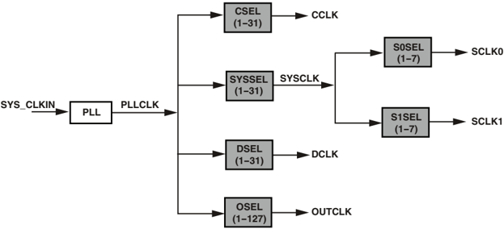

## ADSP-SC582/SC583/SC584/SC587/SC589/ADSP-21583/21584/21587

## ELECTRICAL CHARACTERISTICS

All specifications and characteristics apply across the entire operating conditions range unless otherwise noted.

| Parameter     |                                                 | Conditions                                                                                                                                                                     |   Min |   Typ |   Max | Unit   |
|---------------|-------------------------------------------------|--------------------------------------------------------------------------------------------------------------------------------------------------------------------------------|-------|-------|-------|--------|
| V OH 1 V OL 1 | HighLevelOutputVoltage Low Level Output Voltage | At V DD_EXT = minimum, I OH = -1.0mA 2 At V DD_EXT = minimum, I OL = 1.0mA 2                                                                                                   |   2.4 |       |   0.4 | V V    |
| V OH_DDR2 3   | HighLevelOutputVoltage forDDR2DS=40Ω            | At V DD_DDR = minimum, I OH = -5.8mA                                                                                                                                           |  1.38 |       |       | V      |
| V OL_DDR2 3   | Low Level Output Voltage forDDR2DS=40Ω          | At V DD_DDR = minimum, I OL = 5.8mA                                                                                                                                            |       |       |  0.32 | V      |
| V OH_DDR2 3   | HighLevelOutputVoltage forDDR2DS=60Ω            | At V DD_DDR = minimum, I OH = -3.4mA                                                                                                                                           |  1.38 |       |       | V      |
| V OL_DDR2 3   | Low Level Output Voltage forDDR2DS=60Ω          | At V DD_DDR = minimum, I OL = 3.4mA                                                                                                                                            |       |       |  0.32 | V      |
| V OH_DDR3 4   | HighLevelOutputVoltage forDDR3DS=40Ω            | At V DD_DDR = minimum, I OH = -5.8mA                                                                                                                                           | 1.105 |       |       | V      |
| V OL_DDR3 4   | Low Level Output Voltage forDDR3DS=40Ω          | At V DD_DDR = minimum, I OL = 5.8mA                                                                                                                                            |       |       |  0.32 | V      |
| V OH_DDR3 4   | HighLevelOutputVoltage forDDR3DS=60Ω            | At V DD_DDR = minimum, I OH = -3.4mA                                                                                                                                           | 1.105 |       |       | V      |
| V OL_DDR3 4   | Low Level Output Voltage forDDR3DS=60Ω          | At V DD_DDR = minimum, I OL = 3.4mA                                                                                                                                            |       |       |  0.32 | V      |
| V OH_LPDDR 5  | HighLevelOutputVoltage for LPDDR                | At V DD_DDR = minimum, I OH = -6.0mA                                                                                                                                           |  1.38 |       |       | V      |
| V OL_LPDDR 5  | Low Level Output Voltage for LPDDR              | At V DD_DDR = minimum, I OL = 6.0mA                                                                                                                                            |       |       |  0.32 | V      |
| I IH 6, 7     | High Level Input Current                        | At V DD_EXT = maximum, V IN = V DD_EXT maximum                                                                                                                                 |       |       |    10 | µA     |
| I IL 6        | Low Level Input Current                         | At V DD_EXT = maximum, V IN = 0 V                                                                                                                                              |       |       |    10 | µA     |
| I IL_PU 7     | Low Level Input Current Pull-Up                 | At V DD_EXT = maximum, V IN = 0 V                                                                                                                                              |       |       |   200 | µA     |
| I IH_PD 8     | High Level Input Current Pull-Down              | At V DD_EXT = maximum, V IN = V DD_EXT maximum                                                                                                                                 |       |       |   200 | µA     |
| I OZH 9       | Three-State Leakage Current                     | At V DD_EXT /V DD_DDR = maximum, V IN = V DD_EXT /V DD_DDR maximum                                                                                                             |       |       |    10 | µA     |
| I OZL 9       | Three-State Leakage Current                     | at V DD_EXT /V DD_DDR = maximum, V IN = 0 V                                                                                                                                    |       |       |    10 | µA     |
| C IN 10       | Input Capacitance                               | T J = 25°C                                                                                                                                                                     |       |       |     5 | pF     |
| I DD_IDLE     | V DD_INT Current in Idle                        | f CCLK = 450 MHz ASF SHARC1 = 0.31 ASF SHARC2 = 0.31 ASF A5 = 0.29 f SYSCLK = 225MHz f SCLK0/1 = 112.5 MHz (Other clocks are disabled) No peripheral or DMAactivity T J = 25°C |       |   495 |       | mA     |

## ADSP-SC582/SC583/SC584/SC587/SC589/ADSP-21583/21584/21587

| Parameter   |                          | Conditions                                                                                                                                                                                                                       | Min   |   Typ | Max                                                                       | Unit   |
|-------------|--------------------------|----------------------------------------------------------------------------------------------------------------------------------------------------------------------------------------------------------------------------------|-------|-------|---------------------------------------------------------------------------|--------|
| I DD_IDLE   | V DD_INT Current in Idle | f CCLK = 500 MHz ASF SHARC1 = 0.31 ASF SHARC2 = 0.31 ASF A5 = 0.29 f SYSCLK = 250MHz f SCLK0/1 = 125MHz (Other clocks are disabled) No peripheral or DMAactivity T J = 25°C V DD_INT = 1.15 V                                    |       |   575 |                                                                           | mA     |
| I DD_TYP    | V DD_INT Current         | f CCLK = 450 MHz ASF SHARC1 = 1.0 ASF SHARC2 = 1.0 ASF A5 = 0.73 f SYSCLK = 225MHz f SCLK0/1 = 112.5 MHz (Other clocks are disabled) FFT accelerator operating at f SYSCLK/4 DMAdata rate = 600 Mbps T J = 25°C V DD_INT = 1.1 V |       |  1112 |                                                                           | mA     |
| I DD_TYP    | V DD_INT Current         | f CCLK = 500 MHz ASF SHARC1 = 1.0 ASF SHARC2 = 1.0 ASF A5 = 0.73 f SYSCLK = 250MHz f SCLK0/1 = 125MHz (Other clocks are disabled) FFT accelerator operating at f SYSCLK/4 DMAdata rate = 600 Mbps T J = 25°C V DD_INT = 1.15 V   |       |  1185 |                                                                           | mA     |
| I DD_INT 11 | V DD_INT Current         | f CCLK  0 MHz f SCLK0/1  0MHz                                                                                                                                                                                                 |       |       | See I DD_INT_TOT equationinthe Total Internal Power Dissi- pation section | mA     |

7

Applies to input pins with internal pull-ups including JTG\_TDI, JTG\_TMS, and JTG\_TCK.

8 Applies to signals JTAG\_TRST, USB0\_VBUS, USB1\_VBUS.

9 Applies to signals PA0-15, PB0-15, PC0-15, PD0-15, PE0-15, PF0-15, PG0-5, DAI0\_PINx, DAI1\_PINx, DMC0\_DQx, DMC0\_LDQS, DMC0\_UDQS, DMC0\_LDQS, DMC0\_UDQS, SYS\_FAULT, SYS\_FAULT, JTG\_TDO, USB0\_ID, USBx\_DM, USBx\_DP, and USBx\_VBC.

10 Applies to all signal pins.

[11 See Estimating Power for ADSP-SC58x/2158x SHARC+ Processors (EE-392) for further information.](https://www.analog.com/en/search.html?q=EE-392)

## ADSP-SC582/SC583/SC584/SC587/SC589/ADSP-21583/21584/21587

## Total Internal Power Dissipation

Total power dissipation has two components:

- Static, including leakage current
- Dynamic, due to transistor switching characteristics for each clock domain

Many operating conditions can affect power dissipation, including temperature, voltage, operating frequency, and processor activity. The following equation describes the internal current consumption.

I DD\_INT\_TOT = I DD\_INT\_STATIC + I DD\_INT\_CCLK\_SHARC1\_DYN + I DD\_INT\_CCLK\_SHARC2\_DYN + I DD\_INT\_CCLK\_A5\_DYN + I DD\_INT\_DCLK\_DYN + I DD\_INT\_SYSCLK\_DYN + I DD\_INT\_SCLK0\_DYN + I DD\_INT\_SCLK1\_DYN + I DD\_INT\_OCLK\_DYN + I DD\_INT\_ACCL\_DYN + I DD\_INT\_USB\_DYN + I DD\_INT\_MLB\_DYN + I DD\_INT\_EMAC\_DYN + I DD\_INT\_DMA\_DR\_DYN + I DD\_INT\_PCIE\_DYN

I DD\_INT\_STATIC is the sole contributor to the static power dissipation component and is specified as a function of voltage (VDD\_INT) and junction temperature (TJ) in Table 31.

Table 31. Static Current-IDD\_INT\_STATIC (mA)

|          |   Voltage (V DD_INT ) |   Voltage (V DD_INT ) |   Voltage (V DD_INT ) |   Voltage (V DD_INT ) |
|----------|-----------------------|-----------------------|-----------------------|-----------------------|
| T J (°C) |                  1.05 |                  1.10 |                  1.15 |                  1.20 |
| -40      |                     7 |                     8 |                    10 |                    12 |
| -20      |                    12 |                    14 |                    17 |                    21 |
| -10      |                    16 |                    19 |                    23 |                    27 |
| +0       |                    21 |                    25 |                    30 |                    35 |
| +10      |                    28 |                    33 |                    39 |                    46 |
| +25      |                    42 |                    49 |                    58 |                    67 |
| +40      |                    63 |                    73 |                    84 |                    98 |
| +55      |                    92 |                   106 |                   122 |                   141 |
| +70      |                   133 |                   152 |                   175 |                   200 |
| +85      |                   190 |                   216 |                   247 |                   282 |
| +100     |                   269 |                   305 |                   346 |                   393 |
| +105     |                   302 |                   342 |                   387 |                   439 |
| +115     |                   376 |                   425 |                   480 |                   544 |
| +125     |                   466 |                   525 |                   592 |                   669 |
| +133     |                   552 |                   621 |                   700 |                   789 |

The other 14 addends in the IDD\_INT\_TOT equation comprise the dynamic power dissipation component and fall into four broad categories: application-dependent currents, clock currents, currents from high speed peripheral operation, and data transmission currents.

## Application Dependent Current

The application dependent currents include the dynamic current in the core clock domain of the two SHARC+ cores and the Arm Cortex-A5 core, as well as the dynamic current in the accelerator block.

Dynamic current consumed by the core is subject to an activity scaling factor (ASF) that represents application code running on the processor cores (see Table 32 and Table 33). The ASF is combined with the CCLK frequency and VDD\_INT dependent dynamic current data in Table 34 and Table 35, respectively, to calculate this portion of the total dynamic power dissipation component.

I DD\_INT\_CCLK\_SHARC1\_DYN = Table 34 × ASFSHARC1

I DD\_INT\_CCLK\_SHARC2\_DYN = Table 34 × ASFSHARC2

I DD\_INT\_CCLK\_A5\_DYN = Table 35 × ASFA5

Table 32. Activity Scaling Factors for the SHARC+ Core1 and Core2 (ASFSHARC1 and ASFSHARC2)

| I DD_INT Power Vector   |   ASF |
|-------------------------|-------|
| I DD-IDLE               |  0.31 |
| I DD-NOP                |  0.53 |
| I DD-TYP_3070           |  0.74 |
| I DD-TYP_5050           |  0.87 |
| I DD-TYP_7030           |  1.00 |
| I DD-PEAK_100           |  1.14 |

Table 33. Activity Scaling Factors for the Arm Cortex-A5 Core (ASFA5)

| I DD_INT Power Vector   |   ASF |
|-------------------------|-------|
| I DD-IDLE               |  0.29 |
| I DD-DHRYSTONE          |  0.73 |
| I DD-TYP_2575           |  0.57 |
| I DD-TYP_5050           |  0.80 |
| I DD-TYP_7525           |  1.00 |
| I DD-PEAK_100           |  1.21 |

## ADSP-SC582/SC583/SC584/SC587/SC589/ADSP-21583/21584/21587

Table 34. Dynamic Current for Each SHARC+ Core (mA, with ASF = 1.00) 1

|              | Voltage (V DD_INT )   |   Voltage (V DD_INT ) |   Voltage (V DD_INT ) |   Voltage (V DD_INT ) |
|--------------|-----------------------|-----------------------|-----------------------|-----------------------|
| f CCLK (MHz) | 1.05                  |                  1.10 |                  1.15 |                  1.20 |
| 500          | N/A                   |                   374 |                   391 |                   408 |
| 450          | 321                   |                   337 |                   352 |                   367 |
| 400          | 286                   |                   299 |                   313 |                   326 |
| 350          | 250                   |                   262 |                   274 |                   286 |
| 300          | 214                   |                   224 |                   235 |                   245 |
| 250          | 179                   |                   187 |                   196 |                   204 |
| 200          | 143                   |                   150 |                   156 |                   163 |
| 150          | 107                   |                   112 |                   117 |                   122 |
| 100          | 71                    |                    75 |                    78 |                    82 |

Table 35. Dynamic Current for the Arm Cortex-A5 Core (mA, with ASF = 1.00) 1

|              | Voltage (V DD_INT )   |   Voltage (V DD_INT ) |   Voltage (V DD_INT ) |   Voltage (V DD_INT ) |
|--------------|-----------------------|-----------------------|-----------------------|-----------------------|
| f CCLK (MHz) | 1.05                  |                  1.10 |                  1.15 |                  1.20 |
| 500          | N/A                   |                    83 |                    86 |                    90 |
| 450          | 71                    |                    74 |                    78 |                    81 |
| 400          | 63                    |                    66 |                    69 |                    72 |
| 350          | 55                    |                    58 |                    60 |                    63 |
| 300          | 47                    |                    50 |                    52 |                    54 |
| 250          | 39                    |                    41 |                    43 |                    45 |
| 200          | 32                    |                    33 |                    35 |                    36 |
| 150          | 24                    |                    25 |                    26 |                    27 |
| 100          | 16                    |                    17 |                    18 |                    19 |

The following equation is used to compute the power dissipation when the FFT accelerator is used:

I DD\_INT\_ACCL\_DYN (mA) = ASFACCL × fSYSCLK (MHz) × VDD\_INT (V)

Table 36. Activity Scaling Factors for the FFT Accelerator (ASFACCL)

| I DD_INT Power Vector   |   ASF ACCL |
|-------------------------|------------|
| Unused                  |        0.0 |
| I DD-TYP                |       0.32 |

## Clock Current

The dynamic clock currents provide the total power dissipated by all transistors switching in the clock paths. The power dissipated by each clock domain is dependent on voltage (VDD\_INT), operating frequency, and a unique scaling factor.

| I DD_INT_SYSCLK_DYN (mA) = 0.78 × f SYSCLK (MHz) × V DD_INT (V)   |
|-------------------------------------------------------------------|
| I DD_INT_SCLK0_DYN (mA) = 0.44 × f SCLK0 (MHz) × V DD_INT (V)     |
| I DD_INT_SCLK1_DYN (mA) = 0.06 × f SCLK1 (MHz) × V DD_INT (V)     |
| I DD_INT_DCLK_DYN (mA) = 0.14 × f DCLK (MHz) × V DD_INT (V)       |
| I DD_INT_OCLK_DYN (mA) = 0.02 × f OCLK (MHz) × V DD_INT (V)       |

## Current from High Speed Peripheral Operation

The following modules contribute significantly to power dissipation, and a single term is added when the modules are used.

I DD\_INT\_USB\_DYN = 20 mA (if both USBs are enabled in HS mode)

I DD\_INT\_MLB\_DYN = 10 mA (if MLB 6-pin interface is enabled)

I DD\_INT\_EMAC\_DYN = 10 mA (if EMAC is enabled)

I DD\_INT\_PCIE\_DYN = 240 mA (if PCIe is enabled in 5 Gbps mode)

## Data Transmission Current

The data transmission current represents the power dissipated when moving data throughout the system via direct memory access (DMA). This current is proportional to the data rate. Refer to the power calculator available with Estimating Power for ADSP-SC58x/2158x SHARC+ Processors (EE-392) to estimate IDD\_INT\_DMA\_DR\_DYN based on the bandwidth of the data transfer.

## HADC

## HADC Electrical Characteristics

## Table 37. HADC Electrical Characteristics

| Parameter           | Conditions                                                                       |   Typ | Unit   |
|---------------------|----------------------------------------------------------------------------------|-------|--------|
| I DD_HADC_IDLE      | Current consumption on V DD_HADC . HADC is powered on, but not converting.       |   2.0 | mA     |
| I DD_HADC_ACTIVE    | Current consumption on V DD_HADC during a conversion.                            |   2.5 | mA     |
| I DD_HADC_POWERDOWN | Current consumption on V DD_HADC . Analog circuitry of the HADC is powered down. |    10 | µA     |

## HADC DC Accuracy

## Table 38. HADC DC Accuracy 1

| Parameter                       | Typ   | Unit 2   |
|---------------------------------|-------|----------|
| Resolution                      | 12    | Bits     |
| No Missing Codes (NMC)          | 10    | Bits     |
| Integral Nonlinearity (INL)     | ±2    | LSB      |
| Differential Nonlinearity (DNL) | ±2    | LSB      |
| Offset Error                    | ±8    | LSB      |
| Offset Error Matching           | ±10   | LSB      |
| Gain Error                      | ±4    | LSB      |
| Gain Error Matching             | ±4    | LSB      |

## ADSP-SC582/SC583/SC584/SC587/SC589/ADSP-21583/21584/21587

## HADC Timing Specifications

## Table 39. HADC Timing Specifications

| Parameter        | Typ           |   Max | Unit   |
|------------------|---------------|-------|--------|
| Conversion Time  | 20 × T SAMPLE |       | µs     |
| Throughput Range |               |     1 | MSPS   |
| T WAKEUP         |               |   100 | µs     |

## TMU

## TMU Characteristics

## Table 40. TMU Characteristics

| Parameter   | Typ   | Unit   |
|-------------|-------|--------|
| Resolution  | 1     | °C     |
| Accuracy    | ±6    | °C     |

## Table 41. TMU Gain and Offset

| Junction Temperature Range   | TMU_GAIN TMU_OFFSET          |
|------------------------------|------------------------------|
| -40°C to +40°C               | Contact Analog Devices, Inc. |
| 40°C to 85°C                 | Contact Analog Devices, Inc. |
| 85°C to 133°C                | Contact Analog Devices, Inc. |

## ADSP-SC582/SC583/SC584/SC587/SC589/ADSP-21583/21584/21587

## ABSOLUTE MAXIMUM RATINGS

Stresses at or above those listed in Table 42 may cause permanent damage to the product. This is a stress rating only; functional operation of the product at these or any other conditions above those indicated in the operational section of this specification is not implied. Operation beyond the maximum operating conditions for extended periods may affect product reliability.

Table 42. Absolute Maximum Ratings

| Parameter                                        | Rating                     |
|--------------------------------------------------|----------------------------|
| Internal (Core) Supply Voltage (V DD_INT )       | -0.33 V to +1.26 V         |
| External (I/O) Supply Voltage (V DD_EXT )        | -0.33 V to +3.60 V         |
| DDR2/LPDDR Controller Supply Voltage (V DD_DMC ) | -0.33 V to +1.90 V         |
| DDR3 Controller Supply Voltage (V DD_DMC )       | -0.33 V to +1.60 V         |
| USB PHY Supply Voltage (V DD_USB )               | -0.33 V to +3.60 V         |
| Real-Time Clock Supply Voltage (V DD_RTC )       | -0.33 V to +3.60 V         |
| PCIeTransmitSupplyVoltage(V DD_PCIE_TX )         | -0.33 V to +1.20 V         |
| PCIe Receive Supply Voltage (V DD_PCIE_RX )      | -0.33 V to +1.20 V         |
| PCIe Supply Voltage (V DD_PCIE )                 | -0.33 V to +3.60 V         |
| HADC Supply Voltage (V DD_HADC )                 | -0.33 V to +3.60 V         |
| HADC Reference Voltage (V HADC_REF )             | -0.33 V to +3.60 V         |
| DDR2/LPDDR Input Voltage 1                       | -0.33 V to +1.90 V         |
| DDR2 Reference Voltage (V DDR_VREF )             | -0.33 V to +1.90 V         |
| DDR3 Input Voltage 1                             | -0.33 V to +1.60 V         |
| Digital Input Voltage 1, 2                       | -0.33 V to +3.60 V         |
| TWI Input Voltage 1, 3                           | -0.33 V to +5.50 V         |
| USB0_Dx Input Voltage 1, 4                       | -0.33 V to +5.25 V         |
| USB0_VBUS Input Voltage 1, 4                     | -0.33 V to +6 V            |
| Output Voltage Swing                             | -0.33 V to V DD_EXT +0.5 V |
| Analog Input Voltage 5                           | -0.2 V to V DD_HADC +0.2 V |
| I OH /I OL Current per Signal 2                  | 6 mA(maximum)              |
| Storage Temperature Range                        | -65  C to +150  C        |
| Junction Temperature While Biased                | 133  C                    |

## ESD CAUTION

ESD  (electrostatic  discharge)  sensitive  device. Charged devi c es and c ir c uit boards c an dis c harge w ithout dete c tion. A l though this produ c t features patented or proprietary prote c tion c ir c uitry, damage may o cc ur on devi c es sub j e c ted to high energy ES D. T herefore, proper ES D pre c autions shou l d be ta k en to avoid performan c e degradation or l oss of fun c tiona l ity.

## ADSP-SC582/SC583/SC584/SC587/SC589/ADSP-21583/21584/21587

## TIMING SPECIFICATIONS

All specifications and characteristics apply across the entire operating conditions range unless otherwise noted.

## Power-Up Reset Timing

Table 43 and Figure 9 show the relationship between power supply startup and processor reset timing, related to the clock generation unit (CGU) and reset control unit (RCU).

In Figure 9, VDD\_SUPPLIES are VDD\_INT, VDD\_EXT, VDD\_DMC, VDD\_USB, VDD\_HADC, VDD\_RTC, VDD\_PCI\_TX, VDD\_PCI\_RX, and VDD\_PCI\_CORE.

Table 43. Power-Up Reset Timing

| Parameter          | Parameter                                                                                                                                                                                                   | Min         | Max   | Unit   |
|--------------------|-------------------------------------------------------------------------------------------------------------------------------------------------------------------------------------------------------------|-------------|-------|--------|
| Timing Requirement | Timing Requirement                                                                                                                                                                                          |             |       |        |
| t RST_IN_PWR       | SYS_HWRST Deasserted after V DD_SUPPLIES (V DD_INT , V DD_EXT , V DD_DMC , V DD_USB , V DD_HADC , V DD_RTC , V DD_PCI_TX , V DD_PCI_RX , V DD_PCI_CORE ) and SYS_CLKINx are Stable and Within Specification | 11 × t CKIN |       | ns     |

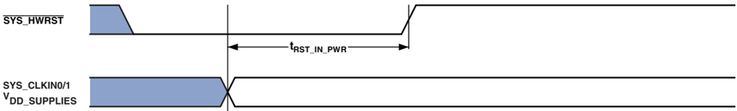

NOTE:  V DD\_SUPPLIES  REFER TO V DD\_INT , V DD\_EXT , V DD\_DMC , V DD\_USB , V DD\_HADC , V DD\_RTC , V DD\_PCI\_TX , V DD\_PCI\_RX , AND V DD\_PCI\_CORE .

Figure 9. Power-Up Reset Timing

## ADSP-SC582/SC583/SC584/SC587/SC589/ADSP-21583/21584/21587

## Clock and Reset Timing

Table 44 and Figure 10 describe clock and reset operations related to the CGU and RCU. Per the CCLK, SYSCLK, SCLK, DCLK, and OCLK timing specifications in Table 29, combinations of SYS\_CLKIN and clock multipliers must not select clock rates in excess of the maximum instruction rate of the processor.

## Table 44. Clock and Reset Timing

| Parameter           |                                               | Min Max     | Unit   |
|---------------------|-----------------------------------------------|-------------|--------|
| Timing Requirements |                                               |             |        |
| f CKIN              | SYS_CLKINx Frequency (Crystal) 1, 2, 3        | 20 50       | MHz    |
|                     | SYS_CLKINx Frequency (External CLKIN) 1, 2, 3 | 20 50       | MHz    |
| t CKINL             | CLKIN Low Pulse 1                             | 10          | ns     |
| t CKINH             | CLKIN High Pulse 1                            | 10          | ns     |
| t WRST              | RESET Asserted Pulse Width Low 4              | 11 × t CKIN | ns     |

Figure 10. Clock and Reset Timing

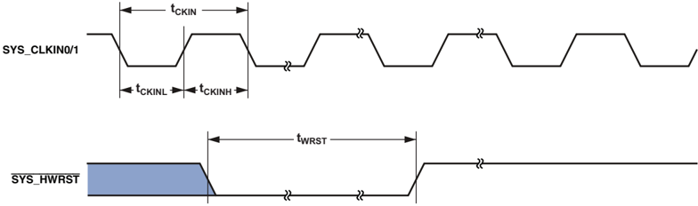

## ADSP-SC582/SC583/SC584/SC587/SC589/ADSP-21583/21584/21587

## Asynchronous Read

Table 45 and Figure 11 show asynchronous memory read timing, related to the SMC.

## Table 45. Asynchronous Read

| Parameter           | Min                                                                  | Max                          | Unit   |
|---------------------|----------------------------------------------------------------------|------------------------------|--------|
| Timing Requirements |                                                                      |                              |        |
| t SDATARE           | DATA in Setup Before SMC0_ARE High 5.1                               | ns                           |        |
| t HDATARE           | DATA in Hold After SMC0_ARE High 0.7                                 |                              | ns     |
| t DARDYARE          | SMC0_ARDY Valid After SMC0_ARE Low 1, 2                              | (RAT - 2.5) × t SCLK0 - 17.5 | ns     |
| Switching           | Characteristics                                                      |                              |        |
| t AMSARE            | ADDR/SMC0_AMSx Assertion Before SMC0_ARE Low 3 (PREST + RST + PREAT) | ns                           |        |
| t AOEARE            | SMC0_AOE Assertion Before SMC0_ARE Low (RST + PREAT) × t SCLK0       |                              | ns     |
| t HARE              | Output 4 Hold After SMC0_ARE High 5 RHT × t SCLK0 -2                 |                              | ns     |
| t WARE              | SMC0_ARE Active Low Width 6 RAT × t SCLK0 - 2                        |                              | ns     |
| t DAREARDY          | SMC0_ARE High Delay After SMC0_ARDY Assertion 1 2.5 × t SCLK0        | 3.5 × t SCLK0 + 17.5         | ns     |

Figure 11. Asynchronous Read

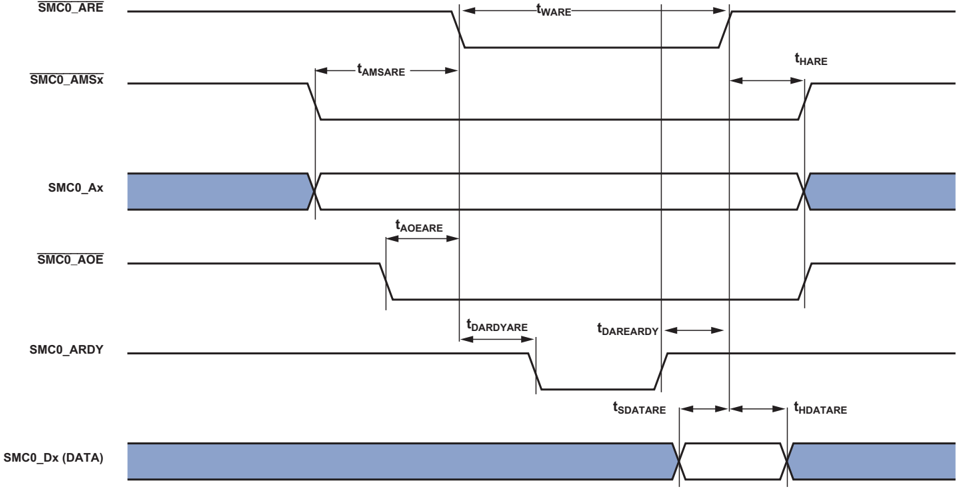

## ADSP-SC582/SC583/SC584/SC587/SC589/ADSP-21583/21584/21587

## SMC Read Cycle Timing With Reference to SYS\_CLKOUT

The following SMC specifications (Table 46 and Figure 12) with respect to SYS\_CLKOUT are given to accommodate the connection of the SMC to programmable logic devices. These specifications assume that SYS\_CLKOUT is outputting a buffered version of SCLK0 by setting CGU\_CLKOUTSEL.CLKOUTSEL = 0x3.

## Table 46. SMC Read Cycle Timing With Reference to SYS\_CLKOUT (BxMODE = b#00)

| Parameter                | Min                               |   Max | Unit   |
|--------------------------|-----------------------------------|-------|--------|
| Timing Requirements      |                                   |       |        |
| t SDAT                   | SMC0_Dx Setup Before SYS_CLKOUT   |   4.3 | ns     |
| t HDAT                   | SMC0_Dx Hold After SYS_CLKOUT     |     5 | ns     |
| t SARDY                  | SMC0_ARDY Setup Before SYS_CLKOUT |  14.4 | ns     |
| t HARDY                  | SMC0_ARDY Hold After SYS_CLKOUT   |   0.7 | ns     |
| Switching Characteristic | s                                 |       |        |
| t DO                     | Output Delay After SYS_CLKOUT 1   |     7 | ns     |
| t HO                     | Output Hold After SYS_CLKOUT 1    |  -2.5 | ns     |

Figure 12. Asynchronous Memory Read Cycle Timing

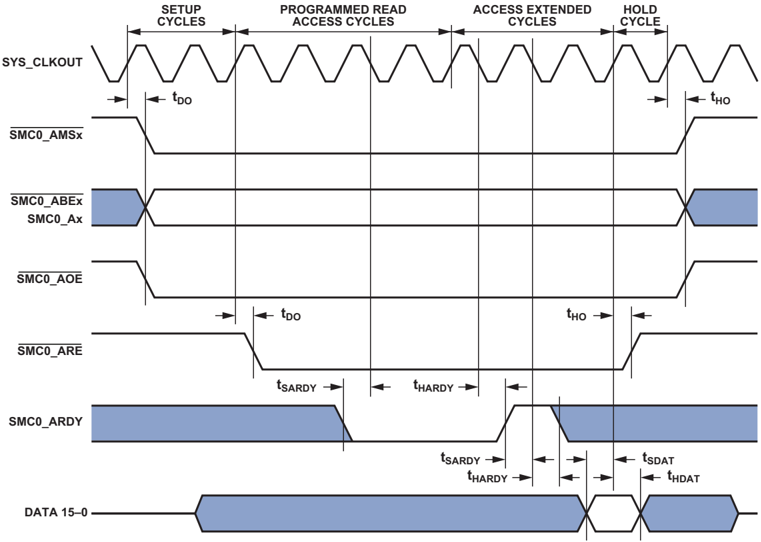

## ADSP-SC582/SC583/SC584/SC587/SC589/ADSP-21583/21584/21587

## Asynchronous Flash Read

Table 47 and Figure 13 show asynchronous flash memory read timing, related to the SMC.

## Table 47. Asynchronous Flash Read

| Parameter                 |                                                             | Min Max             | Unit   |
|---------------------------|-------------------------------------------------------------|---------------------|--------|
| Switching Characteristics | Switching Characteristics                                   |                     |        |
| t AMSADV                  | SMC0_Ax (Address)/SMC0_AMSx Assertion Before SMC0_NORDV Low | PREST × t SCLK0 - 2 | ns     |
| t WADV                    | SMC0_NORDV Active Low Width 2                               | RST × t SCLK0 - 2   | ns     |
| t DADVARE                 | SMC0_ARE Low Delay From SMC0_NORDV High 3                   | PREAT × t SCLK0 - 2 | ns     |
| t HARE                    | Output 4 Hold After SMC0_ARE High 5                         | RHT × t SCLK0 - 2   | ns     |
| t WARE 6                  | SMC0_ARE Active Low Width 7                                 | RAT × t SCLK0 - 2   | ns     |

Figure 13. Asynchronous Flash Read

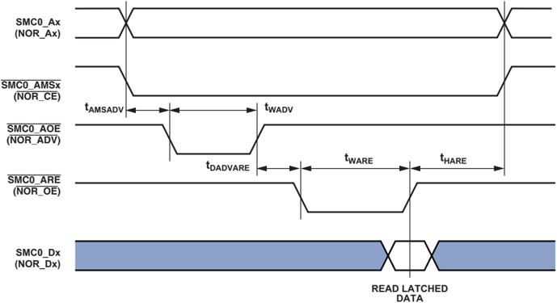

## ADSP-SC582/SC583/SC584/SC587/SC589/ADSP-21583/21584/21587

## Asynchronous Page Mode Read

Table 48 and Figure 14 show asynchronous memory page mode read timing, related to the SMC.

## Table 48. Asynchronous Page Mode Read

| Parameter                 |                                                                         | Min                                       | Unit   |
|---------------------------|-------------------------------------------------------------------------|-------------------------------------------|--------|
| Switching Characteristics | Switching Characteristics                                               |                                           |        |
| t AV                      | SMC0_Axx (Address) Valid for First Address Minimum Width 1              | (PREST + RST + PREAT + RAT) × t SCLK0 - 2 | ns     |
| t AV1                     | SMC0_Axx (Address) Valid for Subsequent SMC0_Ax (Address) Minimum Width | PGWS×t SCLK0 - 2                          | ns     |
| t WADV                    | SMC0_NORDV Active Low Width 2                                           | RST × t SCLK0 - 2                         | ns     |
| t HARE                    | Output 3 Hold After SMC0_ARE High 4                                     | RHT × t SCLK0 - 2                         | ns     |
| t WARE 5                  | SMC0_ARE Active Low Width 6, 7                                          | (RAT + (Nw - 1) × PGWS) × t SCLK0 - 2     | ns     |

Figure 14. Asynchronous Page Mode Read

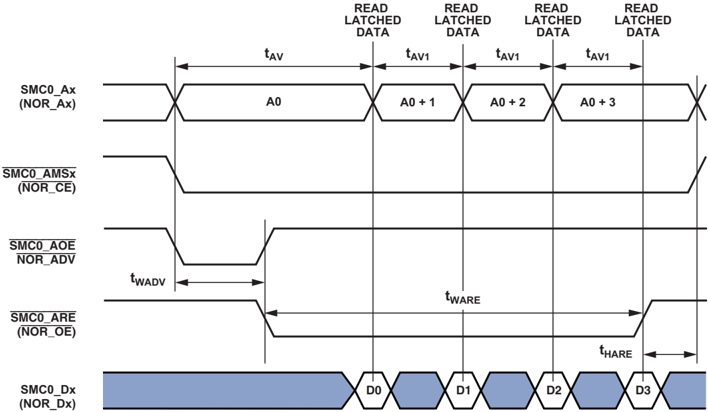

## ADSP-SC582/SC583/SC584/SC587/SC589/ADSP-21583/21584/21587

## Asynchronous Write

Table 49 and Figure 15 show asynchronous memory write timing, related to the SMC.

## Table 49. Asynchronous Memory Write

| Parameter                 | Parameter                                      | Min                                 | Max                          | Unit   |
|---------------------------|------------------------------------------------|-------------------------------------|------------------------------|--------|
| Timing Requirement        | Timing Requirement                             |                                     |                              |        |
| t DARDYAWE 1              | SMC0_ARDY Valid After SMC0_AWE Low 2           |                                     | (WAT - 2.5) × t SCLK0 - 17.5 | ns     |
| Switching Characteristics | Switching Characteristics                      |                                     |                              |        |
| t ENDAT                   | DATA Enable After SMC0_AMSx Assertion          | -3.5                                |                              | ns     |
| t DDAT                    | DATA Disable After SMC0_AMSx Deassertion       |                                     | 2.5                          | ns     |
| t AMSAWE                  | ADDR/SMC0_AMSx Assertion Before SMC0_AWE Low 3 | (PREST + WST + PREAT) × t SCLK0 - 2 |                              | ns     |
| t HAWE                    | Output 4 Hold After SMC0_AWE High 5            | WHT×t SCLK0 - 3.5                   |                              | ns     |
| t WAWE 6                  | SMC0_AWE Active Low Width 2                    | WAT × t SCLK0 - 2                   |                              | ns     |
| t DAWEARDY 1              | SMC0_AWE High Delay After SMC0_ARDY Assertion  | 2.5 × t SCLK0                       | 3.5 × t SCLK0 + 17.5         | ns     |

Figure 15. Asynchronous Write

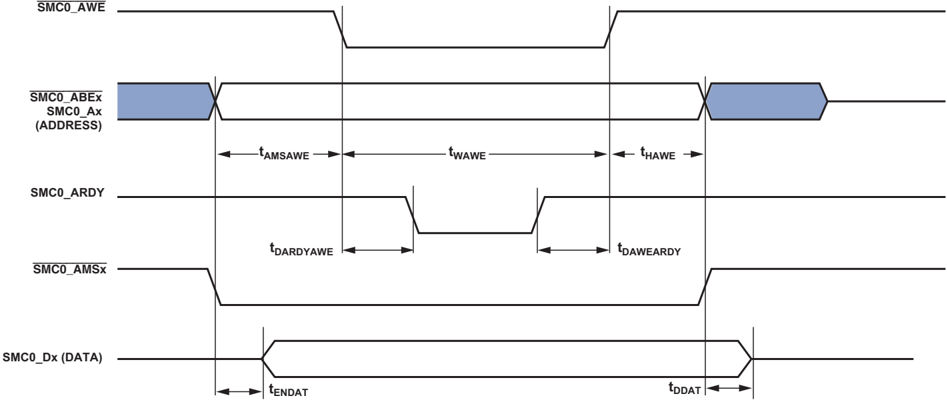

## ADSP-SC582/SC583/SC584/SC587/SC589/ADSP-21583/21584/21587

## SMC Write Cycle Timing With Reference to SYS\_CLKOUT

The following SMC specifications (Table 50 and Figure 16) with respect to SYS\_CLKOUT are given to accommodate the connection of the SMC to programmable logic devices. These specifications assume that SYS\_CLKOUT is outputting a buffered version of SCLK0 by setting CGU\_CLKOUTSEL.CLKOUTSEL = 0x3.

Table 50. SMC Write Cycle Timing With Reference to SYS\_CLKOUT (BxMODE = b#00)

| Parameter                  |                                   |   Min Max | Unit   |
|----------------------------|-----------------------------------|-----------|--------|
| Timing Requirements        |                                   |           |        |
| t SARDY                    | SMC0_ARDY Setup Before SYS_CLKOUT |      14.4 | ns     |
| t HARDY                    | SMC0_ARDY Hold After SYS_CLKOUT   |       0.7 | ns     |
| Switching Characteristic s | Switching Characteristic s        |           |        |
| t DDAT                     | SMC0_Dx Disable After SYS_CLKOUT  |         7 | ns     |
| t ENDAT                    | SMC0_Dx Enable After SYS_CLKOUT   |      -2.5 | ns     |
| t DO                       | Output Delay After SYS_CLKOUT 1   |         7 | ns     |
| t HO                       | Output Hold After SYS_CLKOUT 1    |      -2.5 | ns     |

Figure 16. SMC Write Cycle Timing With Reference to SYS\_CLKOUT Timing

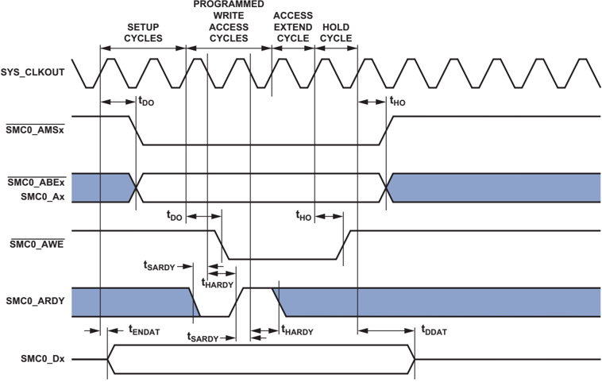

## All Accesses

Table 52 describes timing that applies to all memory accesses, related to the SMC.

## Table 52. All Accesses

| Parameter                | Parameter                | Min                     | Max   | Unit   |
|--------------------------|--------------------------|-------------------------|-------|--------|
| Switching Characteristic | Switching Characteristic |                         |       |        |
| t TURN                   | SMC0_AMSx Inactive Width | (IT + TT) × t SCLK0 - 2 |       | ns     |

## ADSP-SC582/SC583/SC584/SC587/SC589/ADSP-21583/21584/21587

## Asynchronous Flash Write

Table 51 and Figure 17 show asynchronous flash memory write timing, related to the SMC.

## Table 51. Asynchronous Flash Write

| Parameter                 | Min                                          | Max                 | Unit   |
|---------------------------|----------------------------------------------|---------------------|--------|
| Switching Characteristics | Switching Characteristics                    |                     |        |
| t AMSADV                  | SMC0_Ax/SMC0_AMSx Assertion Before ADV Low 1 | PREST × t SCLK0 - 2 | ns     |
| t DADVAWE                 | SMC0_AWE Low Delay From ADV High 2           | PREAT × t SCLK0 - 2 | ns     |
| t WADV                    | NR_ADV Active Low Width 3                    | WST × t SCLK0 - 2   | ns     |
| t HAWE                    | Output 4 Hold After SMC0_AWE High 5          | WHT×t SCLK0 - 3.5   | ns     |
| t WAWE 6                  | SMC0_AWE Active Low Width 7                  | WAT × t SCLK0 - 2   | ns     |

Figure 17. Asynchronous Flash Write

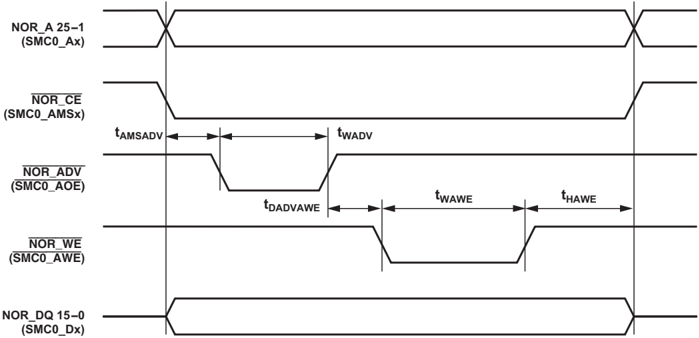

## ADSP-SC582/SC583/SC584/SC587/SC589/ADSP-21583/21584/21587

## DDR2 SDRAM Clock and Control Cycle Timing

Table 53 and Figure 18 show DDR2 SDRAM clock and control cycle timing, related to the DMC.

Table 53. DDR2 SDRAM Clock and Control Cycle Timing, VDD\_DMC, Nominal 1.8 V 1

|                           |                                                |      | 400MHz 2   |      |
|---------------------------|------------------------------------------------|------|------------|------|
| Parameter                 |                                                | Min  | Max        | Unit |
| Switching Characteristics | Switching Characteristics                      |      |            |      |
| t CK                      | Clock Cycle Time (CL = 2 Not Supported)        | 2.5  |            | ns   |
| t CH (abs) 3              | Minimum Clock Pulse Width                      | 0.44 | 0.56       | t CK |
| t CL (abs) 3              | Maximum Clock Pulse Width                      | 0.44 | 0.56       | t CK |
| t IS                      | Control/Address Setup Relative to DMCx_CK Rise | 175  |            | ps   |
| t IH                      | Control/Address Hold Relative to DMCx_CK Rise  | 250  |            | ps   |

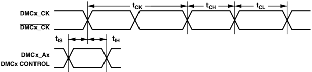

NOTE: CONTROL = DMCx\_CS0 , DMCx\_CKE, DMCx\_RAS , DMCx\_CAS , AND DMCx\_WE . ADDRESS = DMCx\_A0-A15 AND DMCx\_BA0-BA2.

Figure 18. DDR2 SDRAM Clock and Control Cycle Timing

## ADSP-SC582/SC583/SC584/SC587/SC589/ADSP-21583/21584/21587

## DDR2 SDRAM Read Cycle Timing

Table 54 and Figure 19 show DDR2 SDRAM read cycle timing, related to the DMC.

## Table 54. DDR2 SDRAM Read Cycle Timing, VDD\_DMC, Nominal 1.8 V 1

|                     |                                                                       | 400MHz 2   | 400MHz 2   |      |
|---------------------|-----------------------------------------------------------------------|------------|------------|------|
| Parameter           |                                                                       | Min        | Max        | Unit |
| Timing Requirements |                                                                       |            |            |      |
| t DQSQ              | DMCx_DQS to DMCx_DQSkew for DMCx_DQS and Associated DMCx_DQxx Signals |            | 0.2        | ns   |
| t QH                | DMCx_DQxx, DMCx_DQS Output Hold Time From DMCx_DQS                    | 0.8        |            | ns   |
| t RPRE              | Read Preamble                                                         | 0.9        |            | t CK |
| t RPST              | Read Postamble                                                        | 0.4        |            | t CK |

NOTE: CONTROL = DMCx\_CS0 , DMCx\_CKE, DMCx\_RAS , DMCx\_CAS , AND DMCx\_WE . ADDRESS = DMCx\_A00-13 AND DMCx\_BA0-1.

Figure 19. DDR2 SDRAM Controller Input AC Timing

## ADSP-SC582/SC583/SC584/SC587/SC589/ADSP-21583/21584/21587

## DDR2 SDRAM Write Cycle Timing

Table 55 and Figure 20 show DDR2 SDRAM write cycle timing, related to the DMC.

Table 55. DDR2 SDRAM Write Cycle Timing, VDD\_DMC, Nominal 1.8 V 1

|                           |                                                                  | 400MHz 2   | 400MHz 2   |      |
|---------------------------|------------------------------------------------------------------|------------|------------|------|
| Parameter                 |                                                                  | Min        | Max        | Unit |
| Switching Characteristics | Switching Characteristics                                        |            |            |      |
| t DQSS                    | DMCx_DQS Latching Rising Transitions to Associated Clock Edges 3 | -0.15      | +0.15      | t CK |
| t DS                      | Last Data Valid to DMCx_DQS Delay                                | 0.1        |            | ns   |
| t DH                      | DMCx_DQS to First Data Invalid Delay                             | 0.15       |            | ns   |
| t DSS                     | DMCx_DQS Falling Edge to Clock Setup Time                        | 0.2        |            | t CK |
| t DSH                     | DMCx_DQS Falling Edge Hold Time From DMCx_CK                     | 0.2        |            | t CK |
| t DQSH                    | DMCx_DQS Input High Pulse Width                                  | 0.35       |            | t CK |
| t DQSL                    | DMCx_DQS Input Low Pulse Width                                   | 0.35       |            | t CK |
| t WPRE                    | Write Preamble                                                   | 0.35       |            | t CK |
| t WPST                    | Write Postamble                                                  | 0.4        |            | t CK |
| t IPW                     | Address and Control Output Pulse Width                           | 0.6        |            | t CK |
| t DIPW                    | DMCx_DQ and DMCx_DMOutput Pulse Width                            | 0.35       |            | t CK |

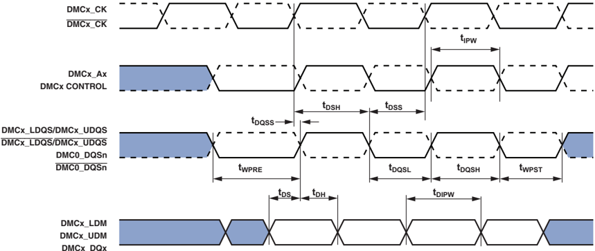

DMCx\_DQx

NOTE: CONTROL = DMCx\_CS0 , DMCx\_CKE, DMCx\_RAS , DMCx\_CAS , AND DMCx\_WE . ADDRESS = DMCx\_A00-13 AND DMCx\_BA0-1.

Figure 20. DDR2 SDRAM Controller Output AC Timing

## ADSP-SC582/SC583/SC584/SC587/SC589/ADSP-21583/21584/21587

## Mobile DDR (LPDDR) SDRAM Clock and Control Cycle Timing

Table 56 and Figure 21 show mobile DDR SDRAM clock and control cycle timing, related to the DMC.

Table 56. Mobile DDR SDRAM Clock and Control Cycle Timing, VDD\_DMC, Nominal 1.8 V 1

|                           |                                                |      | 200MHz 2   |      |
|---------------------------|------------------------------------------------|------|------------|------|
| Parameter                 |                                                | Min  | Max        | Unit |
| Switching Characteristics | Switching Characteristics                      |      |            |      |
| t CK                      | Clock Cycle Time (CL = 2 Not Supported)        | 5    |            | ns   |
| t CH                      | Minimum Clock Pulse Width                      | 0.45 | 0.55       | t CK |
| t CL                      | Maximum Clock Pulse Width                      | 0.45 | 0.55       | t CK |
| t IS                      | Control/Address Setup Relative to DMCx_CK Rise | 1    |            | ns   |
| t IH                      | Control/Address Hold Relative to DMCx_CK Rise  | 1    |            | ns   |

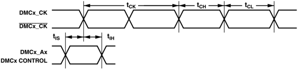

NOTE: CONTROL = DMCx\_CS0 , DMCx\_CKE, DMCx\_RAS , DMCx\_CAS , AND DMCx\_WE . ADDRESS = DMCx\_A0-A15 AND DMCx\_BA0-BA2.

Figure 21. Mobile DDR SDRAM Clock and Control Cycle Timing

## ADSP-SC582/SC583/SC584/SC587/SC589/ADSP-21583/21584/21587

## Mobile DDR SDRAM Read Cycle Timing

Table 57 and Figure 22 show mobile DDR SDRAM read cycle timing, related to the DMC.

Table 57. Mobile DDR SDRAM Read Cycle Timing, VDD\_DMC, Nominal 1.8 V 1

|                     |                                                                      | 200MHz   | 2   |      |
|---------------------|----------------------------------------------------------------------|----------|-----|------|
| Parameter           |                                                                      | Min      | Max | Unit |
| Timing Requirements |                                                                      |          |     |      |
| t QH                | DMCx_DQ, DMCx_DQS Output Hold Time From DMCx_DQS                     | 1.75     |     | ns   |
| t DQSQ              | DMCx_DQS to DMCx_DQ Skew for DMCx_DQS and Associated DMCx_DQ Signals |          | 0.4 | ns   |
| t RPRE              | Read Preamble                                                        | 0.9      | 1.1 | t CK |
| t RPST              | Read Postamble                                                       | 0.4      | 0.6 | t CK |

Figure 22. Mobile DDR SDRAM Controller Input AC Timing

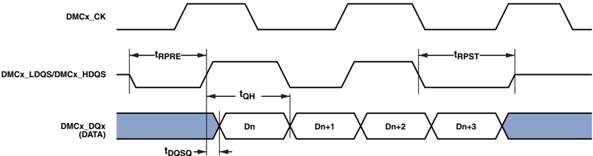

## ADSP-SC582/SC583/SC584/SC587/SC589/ADSP-21583/21584/21587

## Mobile DDR SDRAM Write Cycle Timing

Table 58 and Figure 23 show mobile DDR SDRAM write cycle timing, related to the DMC.

## Table 58. Mobile DDR SDRAM Write Cycle Timing, VDD\_DMC, Nominal 1.8 V 1

|                           |                                                                | 200MHz 2   | 200MHz 2   |      |
|---------------------------|----------------------------------------------------------------|------------|------------|------|
| Parameter                 |                                                                | Min        | Max        | Unit |
| Switching Characteristics | Switching Characteristics                                      |            |            |      |
| t DQSS 3                  | DMCx_DQS Latching Rising Transitions to Associated Clock Edges | 0.75       | 1.25       | t CK |
| t DS                      | Last Data Valid to DMCx_DQS Delay (Slew > 1 V/ns)              | 0.48       |            | ns   |
| t DH                      | DMCx_DQS to First Data Invalid Delay (Slew > 1 V/ns)           | 0.48       |            | ns   |
| t DSS                     | DMCx_DQS Falling Edge to Clock Setup Time                      | 0.2        |            | t CK |
| t DSH                     | DMCx_DQS Falling Edge Hold Time From DMCx_CK                   | 0.2        |            | t CK |
| t DQSH                    | DMCx_DQS Input High Pulse Width                                | 0.4        |            | t CK |
| t DQSL                    | DMCx_DQS Input Low Pulse Width                                 | 0.4        |            | t CK |
| t WPRE                    | Write Preamble                                                 | 0.25       |            | t CK |
| t WPST                    | Write Postamble                                                | 0.4        |            | t CK |
| t IPW                     | Address and Control Output Pulse Width                         | 2.3        |            | ns   |
| t DIPW                    | DMCx_DQ and DMCx_DMOutput Pulse Width                          | 1.8        |            | ns   |

Figure 23. Mobile DDR SDRAM Controller Output AC Timing

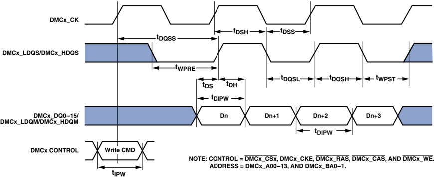

## ADSP-SC582/SC583/SC584/SC587/SC589/ADSP-21583/21584/21587

## DDR3 SDRAM Clock and Control Cycle Timing

Table 59 and Figure 24 show mobile DDR3 SDRAM clock and control cycle timing, related to the DMC.

Table 59. DDR3 SDRAM Clock and Control Cycle Timing, VDD\_DMC, Nominal 1.5 V 1

|                           |                                                | 450MHz   | 2    |      |
|---------------------------|------------------------------------------------|----------|------|------|
| Parameter                 |                                                | Min      | Max  | Unit |
| Switching Characteristics | Switching Characteristics                      |          |      |      |
| t CK                      | Clock Cycle Time (CL = 2 Not Supported)        | 2.22     |      | ns   |
| t CH(abs) 3               | Minimum Clock Pulse Width                      | 0.43     | 0.57 | t CK |
| t CL(abs) 3               | Maximum Clock Pulse Width                      | 0.43     | 0.57 | t CK |
| t IS                      | Control/Address Setup Relative to DMCx_CK Rise | 0.2      |      | ns   |
| t IH                      | Control/Address Hold Relative to DMCx_CK Rise  | 0.275    |      | ns   |

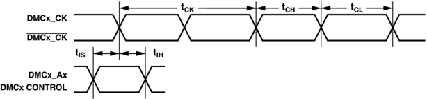

NOTE: CONTROL = DMCx\_CS0 , DMCx\_CKE, DMCx\_RAS , DMCx\_CAS , AND DMCx\_WE . ADDRESS = DMCx\_A0-A15 AND DMCx\_BA0-BA2.

Figure 24. DDR3 SDRAM Clock and Control Cycle Timing

## ADSP-SC582/SC583/SC584/SC587/SC589/ADSP-21583/21584/21587

## DDR3 SDRAM Read Cycle Timing

Table 60 and Figure 25 show mobile DDR3 SDRAM read cycle timing, related to the DMC.

## Table 60. DDR3 SDRAM Read Cycle Timing, VDD\_DMC, Nominal 1.5 V 1

|                     |                                                                      | 450MHz 2   |      |      |
|---------------------|----------------------------------------------------------------------|------------|------|------|
| Parameter           |                                                                      | Min        | Max  | Unit |
| Timing Requirements | Timing Requirements                                                  |            |      |      |
| t DQSQ              | DMCx_DQS to DMCx_DQ Skew for DMCx_DQS and Associated DMCx_DQ Signals |            | 0.15 | ns   |
| t QH                | DMCx_DQ, DMCx_DQS Output Hold Time From DMCx_DQS                     | 0.38       |      | t CK |
| t RPRE              | Read Preamble                                                        | 0.9        |      | t CK |
| t RPST              | Read Postamble                                                       | 0.3        |      | t CK |

NOTE: CONTROL = DMCx\_CS0 , DMCx\_CKE, DMCx\_RAS , DMCx\_CAS , AND DMCx\_WE . ADDRESS = DMCx\_A00-13 AND DMCx\_BA0-1.

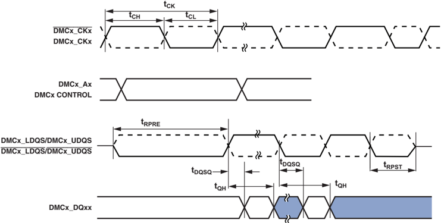

Figure 25. DDR3 SDRAM Controller Input AC Timing

## ADSP-SC582/SC583/SC584/SC587/SC589/ADSP-21583/21584/21587

## DDR3 SDRAM Write Cycle Timing

Table 61 and Figure 26 show mobile DDR3 SDRAM output ac timing, related to the DMC.

Table 61. DDR3 SDRAM Write Cycle Timing, VDD\_DMC, Nominal 1.5 V 1

|                           |                                                                | 450MHz 2   | 450MHz 2   |      |
|---------------------------|----------------------------------------------------------------|------------|------------|------|
| Parameter                 |                                                                | Min        | Max        | Unit |
| Switching Characteristics | Switching Characteristics                                      |            |            |      |
| t DQSS                    | DMCx_DQS Latching Rising Transitions to Associated Clock Edges | -0.25      | 0.25       | t CK |
| t DS                      | Last Data Valid to DMCx_DQS Delay (Slew > 1 V/ns)              | 0.125      |            | ns   |
| t DH                      | DMCx_DQS to First Data Invalid Delay (Slew > 1 V/ns)           | 0.150      |            | ns   |
| t DSS                     | DMCx_DQS Falling Edge to Clock Setup Time                      | 0.2        |            | t CK |
| t DSH                     | DMCx_DQS Falling Edge Hold Time From DMCx_CK                   | 0.2        |            | t CK |
| t DQSH                    | DMCx_DQS Input High Pulse Width                                | 0.45       | 0.55       | t CK |
| t DQSL                    | DMCx_DQS Input Low Pulse Width                                 | 0.45       | 0.55       | t CK |
| t WPRE                    | Write Preamble                                                 | 0.9        |            | t CK |
| t WPST                    | Write Postamble                                                | 0.3        |            | t CK |
| t IPW                     | Address and Control Output Pulse Width                         | 0.840      |            | ns   |
| t DIPW                    | DMCx_DQ and DMCx_DMOutput Pulse Width                          | 0.550      |            | ns   |

Figure 26. DDR3 SDRAM Controller Output AC Timing

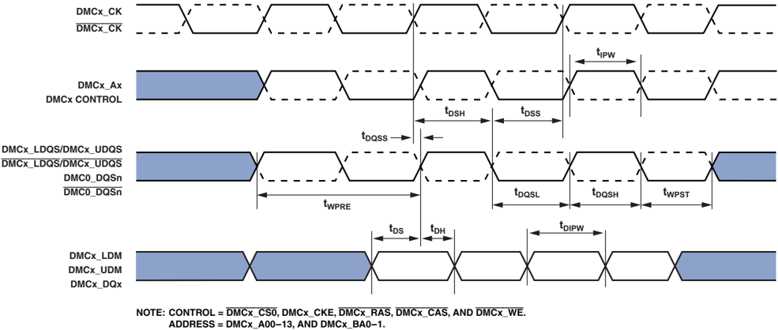

## ADSP-SC582/SC583/SC584/SC587/SC589/ADSP-21583/21584/21587

## Enhanced Parallel Peripheral Interface (EPPI) Timing

Table 62 and Table 63 and Figure 27 through Figure 35 describe enhanced parallel peripheral interface (EPPI) timing operations. In Figure 27 through Figure 35, POLC[1:0] represents the setting of the EPPI\_CTL register, which sets the sampling/driving edges of the EPPI clock.

When internally generated, the programmed PPI clock (fPCLKPROG) frequency in MHz is set by the following equation where VALUE is a field in the EPPI\_CLKDIV register that can be set from 0 to 65,535:

<!-- formula-not-decoded -->

<!-- formula-not-decoded -->

When externally generated, the EPPI\_CLK is called fPCLKEXT:

<!-- formula-not-decoded -->

<!-- formula-not-decoded -->

Table 62. Enhanced Parallel Peripheral Interface (EPPI)-Internal Clock

| Parameter                 |                                                                         | Min                    |   Max | Unit   |
|---------------------------|-------------------------------------------------------------------------|------------------------|-------|--------|
| Timing Requirements       | Timing Requirements                                                     |                        |       |        |
| t SFSPI                   | External FS Setup Before EPPI_CLK                                       | 6.5                    |       | ns     |
| t HFSPI                   | External FS Hold After EPPI_CLK                                         | 0                      |       | ns     |
| t SDRPI                   | Receive Data Setup Before EPPI_CLK                                      | 6.5                    |       | ns     |
| t HDRPI                   | Receive Data Hold After EPPI_CLK                                        | 0                      |       | ns     |
| t SFS3GI                  | External FS3 Input Setup Before EPPI_CLK Fall Edge in Clock Gating Mode | 14                     |       | ns     |
| t HFS3GI                  | External FS3 Input Hold Before EPPI_CLK Fall Edge in Clock Gating Mode  | 0                      |       | ns     |
| Switching Characteristics | Switching Characteristics                                               |                        |       |        |
| t PCLKW                   | EPPI_CLK Width 1                                                        | 0.5 × t PCLKPROG - 1.5 |       | ns     |
| t PCLK                    | EPPI_CLK Period 1                                                       | t PCLKPROG - 1.5       |       | ns     |
| t DFSPI                   | Internal FS Delay After EPPI_CLK                                        |                        |   3.5 | ns     |
| t HOFSPI                  | Internal FS Hold After EPPI_CLK                                         | -0.5                   |       | ns     |
| t DDTPI                   | Transmit Data Delay After EPPI_CLK                                      |                        |   3.5 | ns     |
| t HDTPI                   | Transmit Data Hold After EPPI_CLK                                       | -0.5                   |       | ns     |

## ADSP-SC582/SC583/SC584/SC587/SC589/ADSP-21583/21584/21587

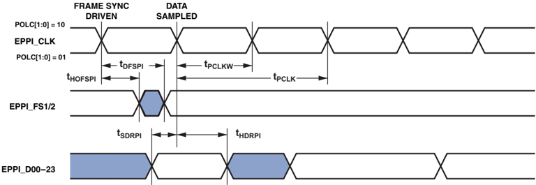

Figure 27. EPPI Internal Clock GP Receive Mode with Internal Frame Sync Timing

Figure 28. EPPI Internal Clock GP Transmit Mode with Internal Frame Sync Timing

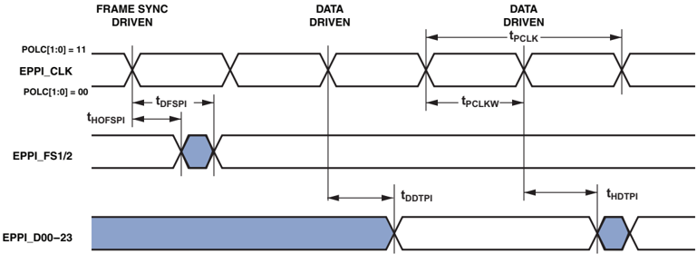

Figure 29. EPPI Internal Clock GP Receive Mode with External Frame Sync Timing

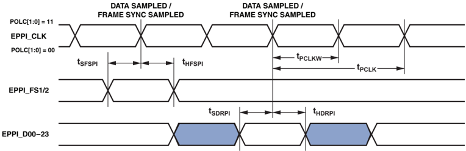

## ADSP-SC582/SC583/SC584/SC587/SC589/ADSP-21583/21584/21587

Figure 30. EPPI Internal Clock GP Transmit Mode with External Frame Sync Timing

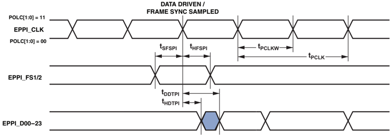

Figure 31. Clock Gating Mode with Internal Clock and External Frame Sync Timing

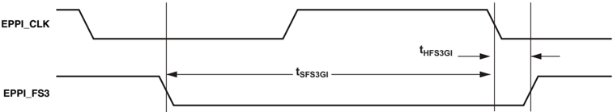

Table 63. Enhanced Parallel Peripheral Interface (EPPI)-External Clock

| Parameter                 | Parameter                          | Min                   |   Max | Unit   |
|---------------------------|------------------------------------|-----------------------|-------|--------|
| Timing Requirements       | Timing Requirements                |                       |       |        |
| t PCLKW                   | EPPI_CLK Width 1                   | 0.5 × t PCLKEXT - 0.5 |       | ns     |
| t PCLK                    | EPPI_CLK Period 1                  | t PCLKEXT - 1         |       | ns     |
| t SFSPE                   | External FS Setup Before EPPI_CLK  | 2                     |       | ns     |
| t HFSPE                   | External FS Hold After EPPI_CLK    | 3.7                   |       | ns     |
| t SDRPE                   | Receive Data Setup Before EPPI_CLK | 2                     |       | ns     |
| t HDRPE                   | Receive Data Hold After EPPI_CLK   | 3.7                   |       | ns     |
| Switching Characteristics | Switching Characteristics          |                       |       |        |
| t DFSPE                   | Internal FS Delay After EPPI_CLK   |                       |  15.3 | ns     |
| t HOFSPE                  | Internal FS Hold After EPPI_CLK    | 2.4                   |       | ns     |
| t DDTPE                   | Transmit Data Delay After EPPI_CLK |                       |  15.3 | ns     |
| t HDTPE                   | Transmit Data Hold After EPPI_CLK  | 2.4                   |       | ns     |

## ADSP-SC582/SC583/SC584/SC587/SC589/ADSP-21583/21584/21587

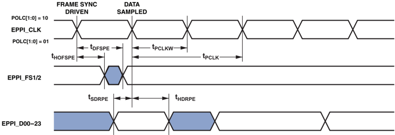

Figure 32. EPPI External Clock GP Receive Mode with Internal Frame Sync Timing

Figure 33. EPPI External Clock GP Transmit Mode with Internal Frame Sync Timing

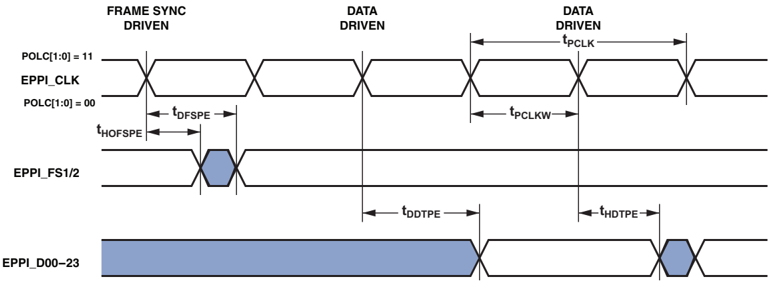

Figure 34. EPPI External Clock GP Receive Mode with External Frame Sync Timing

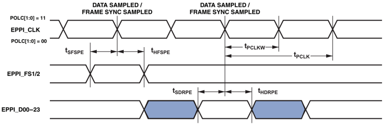

## ADSP-SC582/SC583/SC584/SC587/SC589/ADSP-21583/21584/21587

Figure 35. EPPI External Clock GP Transmit Mode with External Frame Sync Timing

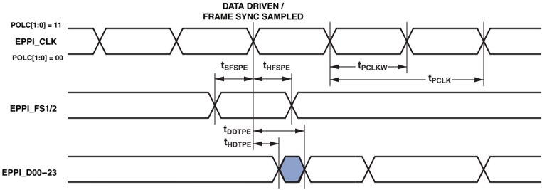

## ADSP-SC582/SC583/SC584/SC587/SC589/ADSP-21583/21584/21587

## Link Ports (LP)

In LP receive mode, the link port clock is supplied externally and is called fLCLKREXT, therefore the period can be represented by:

<!-- formula-not-decoded -->

In link port transmit mode, the programmed link port clock (fLCLKTPROG) frequency in MHz is set by the following equation where VALUE is a field in the LP\_DIV register that can be set from 1 to 255:

<!-- formula-not-decoded -->

In the case where VALUE = 0, fLCLKTPROG = fCLKO8. For all settings of VALUE, the following equation is true:

<!-- formula-not-decoded -->

Calculation of the link receiver data setup and hold relative to the link clock is required to determine the maximum allowable skew that can be introduced in the transmission path length difference between LPx\_Dx and LPx\_CLK. Setup skew is the maximum delay that can be introduced in LPx\_Dx relative to LPx\_CLK (setup skew = tLCLKTWH min - tDLDCH - tSLDCL). Hold skew is the maximum delay that can be introduced in LPx\_CLK relative to LPx\_Dx (hold skew = tLCLKTWL min - tHLDCH - tHLDCL).

## Table 64. Link Ports-Receive 1

| Parameter                | Min                                   | Max                     | Unit   |
|--------------------------|---------------------------------------|-------------------------|--------|
| Timing                   | Requirements                          |                         |        |
| f LCLKREXT               | LPx_CLK Frequency                     | 150                     | MHz    |
| t SLDCL                  | Data Setup Before LPx_CLK Low         | 0.9                     | ns     |
| t HLDCL                  | Data Hold After LPx_CLK Low           | 1.4                     | ns     |
| t LCLKEW                 | LPx_CLK Period 2                      | t LCLKREXT - 0.42       | ns     |
| t LCLKRWL                | LPx_CLK Width Low 2                   | 0.5 × t LCLKREXT        | ns     |
| t LCLKRWH                | LPx_CLK Width High 2                  | 0.5 × t LCLKREXT        | ns     |
| Switching Characteristic | Switching Characteristic              |                         |        |
| t DLALC                  | LPx_ACK Low Delay After LPx_CLK Low 3 | 1.5 × t CLKO8 + 4 2.5 × | ns     |

## ADSP-SC582/SC583/SC584/SC587/SC589/ADSP-21583/21584/21587

Figure 36. Link Ports-Receive

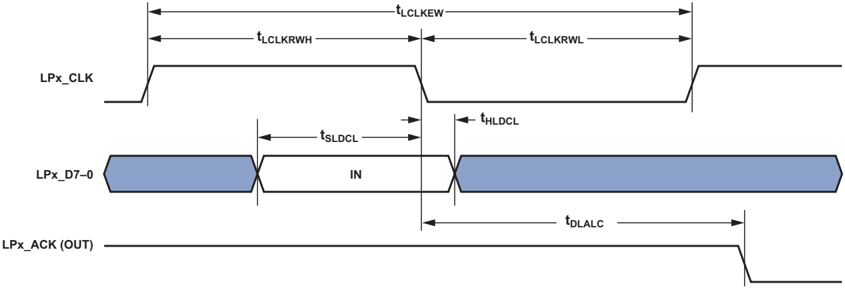

## ADSP-SC582/SC583/SC584/SC587/SC589/ADSP-21583/21584/21587

Table 65. Link Ports-Transmit 1

| Parameter                 |                                      | Min                 | Max Unit                       |    |
|---------------------------|--------------------------------------|---------------------|--------------------------------|----|
| Timing Requirements       | Timing Requirements                  |                     |                                |    |
| t SLACH                   | LPx_ACK Setup Before LPx_CLK Low     | 2 × t CLKO8 + 13.5  |                                | ns |
| t HLACH                   | LPx_ACK Hold After LPx_CLK Low       | -5.5                |                                | ns |
| Switching Characteristics | Switching Characteristics            |                     |                                |    |
| t DLDCH                   | Data Delay After LPx_CLK High        |                     | 1.6                            | ns |
| t HLDCH                   | Data Hold After LPx_CLK High         | -0.8                |                                | ns |
| t LCLKTWL 2               | LPx_CLK Width Low                    | 0.33 × t LCLKTPROG  | 0.6 × t LCLKTPROG              | ns |
| t LCLKTWH 2               | LPx_CLK Width High                   | 0.45 × t LCLKTPROG  | 0.66 × t LCLKTPROG             | ns |
| t LCLKTW 2                | LPx_CLK Period                       | N×t LCLKTPROG - 0.5 |                                | ns |
| t DLACLK                  | LPx_CLK Low Delay After LPx_ACK High | t CLKO8 + 4         | 2 × t CLKO8 + 1 × t LPCLK + 10 | ns |

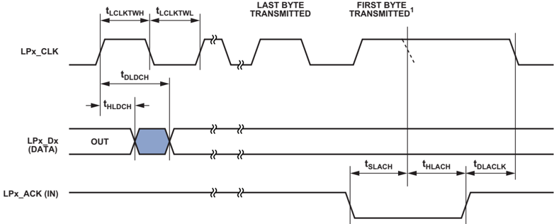

## NOTES

The t SLACH and t HLACH specifications apply only to the LPx\_CLK falling edge.  If these specifications are met, LPx\_CLK would extend and the dotted LPx\_CLK falling edge would not occur as shown.  The position of the dotted falling edge can be calculated using the t LCLKTWH specification.  t LCLKTWH Min should be used for t SLACH and t LCLKTWH Max for t HLACH .

Figure 37. Link Ports-Transmit

## ADSP-SC582/SC583/SC584/SC587/SC589/ADSP-21583/21584/21587

## Serial Ports (SPORT)

To determine whether a device is compatible with the SPORT at clock speed n, the following specifications must be confirmed: frame sync delay and frame sync setup and hold; data delay and data setup and hold; and serial clock (SPTx\_CLK) width. In Figure 38, either the rising edge or the falling edge of SPTx\_CLK (external or internal) can be used as the active sampling edge.

When externally generated, the SPORT clock is called fSPTCLKEXT:

<!-- formula-not-decoded -->

When internally generated, the programmed SPORT clock (fSPTCLKPROG) frequency in MHz is set by the following equation where CLKDIV is a field in the SPORT\_DIV register that can be set from 0 to 65,535:

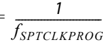

$$f SPTCLK PROG f SCLK0 CLKDIV 1 +   - - - - - - - - - - - - - - - - - - - - - - - - =$$

$$t SPTCLKPROG 1 f SPTCLKPROG - - - - - - - - - - - - - - - - - - - - - - - - - - - =$$

## Table 66. Serial Ports-External Clock 1

| Parameter                 |                                                                                                         | Min                     |   Max | Unit   |
|---------------------------|---------------------------------------------------------------------------------------------------------|-------------------------|-------|--------|
| Timing Requirements       | Timing Requirements                                                                                     |                         |       |        |
| t SFSE                    | Frame Sync Setup Before SPTx_CLK (Externally Generated Frame Sync in either Transmit or Receive Mode) 2 | 2                       |       | ns     |
| t HFSE                    | Frame Sync Hold After SPTx_CLK (Externally Generated Frame Sync in either Transmit or Receive Mode) 2   | 2.7                     |       | ns     |
| t SDRE                    | Receive Data Setup Before Receive SPTx_CLK 2                                                            | 2                       |       | ns     |
| t HDRE                    | Receive Data Hold After SPTx_CLK 2                                                                      | 2.7                     |       | ns     |
| t SPTCLKW                 | SPTx_CLK Width 3                                                                                        | 0.5 × t SPTCLKEXT - 1.5 |       | ns     |
| t SPTCLK                  | SPTx_CLK Period 3                                                                                       | t SPTCLKEXT - 1.5       |       | ns     |
| Switching Characteristics | Switching Characteristics                                                                               |                         |       |        |
| t DFSE                    | Frame Sync Delay After SPTx_CLK (Internally Generated Frame Sync in either Transmit or Receive Mode) 4  |                         |  14.5 | ns     |
| t HOFSE                   | Frame Sync Hold After SPTx_CLK (Internally Generated Frame Sync in either Transmit or Receive Mode) 4   | 2                       |       | ns     |
| t DDTE                    | Transmit Data Delay After Transmit SPTx_CLK 4                                                           |                         |    14 | ns     |
| t HDTE                    | Transmit Data Hold After Transmit SPTx_CLK 4                                                            | 2                       |       | ns     |

## ADSP-SC582/SC583/SC584/SC587/SC589/ADSP-21583/21584/21587

## Table 67. Serial Ports-Internal Clock 1

| Parameter                 |                                                                                                         | Min                      |   Max | Unit   |
|---------------------------|---------------------------------------------------------------------------------------------------------|--------------------------|-------|--------|
| Timing Requirements       | Timing Requirements                                                                                     |                          |       |        |
| t SFSI                    | Frame Sync Setup Before SPTx_CLK (Externally Generated Frame Sync in either Transmit or Receive Mode) 2 | 12                       |       | ns     |
| t HFSI                    | Frame Sync Hold After SPTx_CLK (Externally Generated Frame Sync in either Transmit or Receive Mode) 2   | -0.5                     |       | ns     |
| t SDRI                    | Receive Data Setup Before SPTx_CLK 2                                                                    | 3.4                      |       | ns     |
| t HDRI                    | Receive Data Hold After SPTx_CLK 2                                                                      | 1.5                      |       | ns     |
| Switching Characteristics | Switching Characteristics                                                                               |                          |       |        |
| t DFSI                    | Frame Sync Delay After SPTx_CLK (Internally Generated Frame Sync in Transmit or Receive Mode) 3         |                          |   3.5 | ns     |
| t HOFSI                   | Frame Sync Hold After SPTx_CLK (Internally Generated Frame Sync in Transmit or Receive Mode) 3          | -2.5                     |       | ns     |
| t DDTI                    | Transmit Data Delay After SPTx_CLK 3                                                                    |                          |   3.5 | ns     |
| t HDTI                    | Transmit Data Hold After SPTx_CLK 3                                                                     | -2.5                     |       | ns     |
| t SCLKIW                  | SPTx_CLK Width 4                                                                                        | 0.5 × t SPTCLKPROG - 1.5 |       | ns     |
| t SPTCLK                  | SPTx_CLK Period 4                                                                                       | t SPTCLKPROG - 1.5       |       | ns     |

## ADSP-SC582/SC583/SC584/SC587/SC589/ADSP-21583/21584/21587

Figure 38. Serial Ports

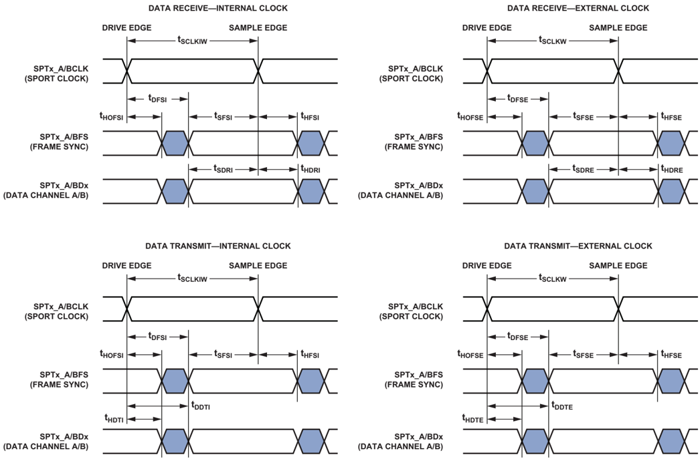

## ADSP-SC582/SC583/SC584/SC587/SC589/ADSP-21583/21584/21587

Table 68. Serial Ports-Enable and Three-State 1

| Parameter                 | Parameter                                      |   Min |   Max | Unit   |
|---------------------------|------------------------------------------------|-------|-------|--------|
| Switching Characteristics | Switching Characteristics                      |       |       |        |
| t DDTEN                   | Data Enable from External Transmit SPTx_CLK 2  |     1 |       | ns     |
| t DDTTE                   | Data Disable from External Transmit SPTx_CLK 2 |       |    14 | ns     |
| t DDTIN                   | Data Enable from Internal Transmit SPTx_CLK 2  |  -2.5 |       | ns     |
| t DDTTI                   | Data Disable from Internal Transmit SPTx_CLK 2 |       |   2.8 | ns     |

Figure 39. Serial Ports-Enable and Three-State

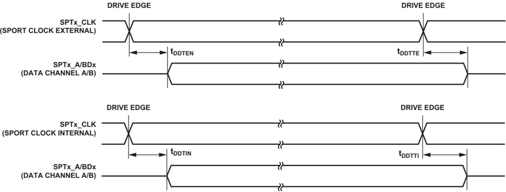

## ADSP-SC582/SC583/SC584/SC587/SC589/ADSP-21583/21584/21587

The SPTx\_TDV output signal becomes active in SPORT multichannel mode. During transmit slots (enabled with active channel selection registers) the SPTx\_TDV is asserted for communication with external devices.

## Table 69. Serial Ports-TDV (Transmit Data Valid) 1

| Parameter                 | Parameter                                                    |   Min |   Max | Unit   |
|---------------------------|--------------------------------------------------------------|-------|-------|--------|
| Switching Characteristics | Switching Characteristics                                    |       |       |        |
| t DRDVEN                  | Data Valid Enable Delay from Drive Edge of External Clock 2  |     2 |       | ns     |
| t DFDVEN                  | Data Valid Disable Delay from Drive Edge of External Clock 2 |       |    14 | ns     |
| t DRDVIN                  | Data Valid Enable Delay from Drive Edge of Internal Clock 2  |  -2.5 |       | ns     |
| t DFDVIN                  | Data Valid Disable Delay from Drive Edge of Internal Clock 2 |       |   3.5 | ns     |

Figure 40. Serial Ports-Transmit Data Valid Internal and External Clock

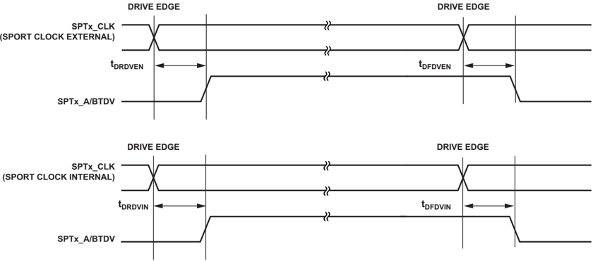

## ADSP-SC582/SC583/SC584/SC587/SC589/ADSP-21583/21584/21587

Table 70. Serial Ports-External Late Frame Sync 1

| Parameter                 | Parameter                                                                                             |   Min |   Max | Unit   |
|---------------------------|-------------------------------------------------------------------------------------------------------|-------|-------|--------|
| Switching Characteristics | Switching Characteristics                                                                             |       |       |        |
| t DDTLFSE                 | Data Delay from Late External Transmit Frame Sync or External Receive Frame Sync with MCE = 1,MFD=0 2 |       |    14 | ns     |
| t DDTENFS                 | Data Enable for MCE = 1,MFD=0 2                                                                       |   0.5 |       | ns     |

Figure 41. External Late Frame Sync

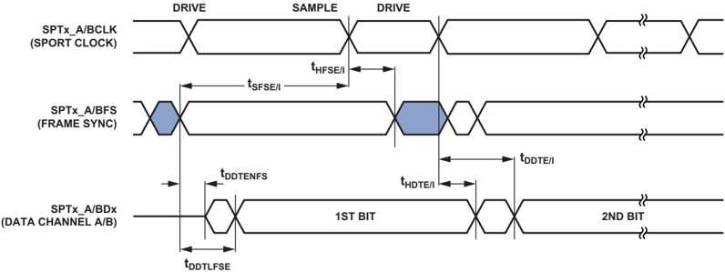

## ADSP-SC582/SC583/SC584/SC587/SC589/ADSP-21583/21584/21587

## Sample Rate Converter-Serial Input Port

The ASRC input signals are routed from the DAIx\_PINx pins using the SRU. Therefore, the timing specifications provided in Table 71 are valid at the DAIx\_PINx pins.

Table 71. ASRC, Serial Input Port

| Parameter           | Min                                              | Max         | Unit   |
|---------------------|--------------------------------------------------|-------------|--------|
| Timing Requirements |                                                  |             |        |
| t SRCSFS 1          | Frame Sync Setup Before Serial Clock Rising Edge | 4           | ns     |
| t SRCHFS 1          | Frame Sync Hold After Serial Clock Rising Edge   | 5.5         | ns     |
| t SRCSD 1           | Data Setup Before Serial Clock Rising Edge       | 4           | ns     |
| t SRCHD 1           | Data Hold After Serial Clock Rising Edge         | 5.5         | ns     |
| t SRCCLKW           | Clock Width                                      | t SCLK0 - 1 | ns     |
| t SRCCLK            | Clock Period                                     | 2 × t SCLK0 | ns     |

Figure 42. ASRC Serial Input Port Timing

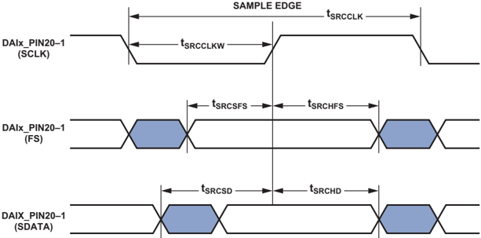

## ADSP-SC582/SC583/SC584/SC587/SC589/ADSP-21583/21584/21587

## Sample Rate Converter-Serial Output Port

For the serial output port, the frame sync is an input and it must meet setup and hold times with regard to SCLK on the output port. The serial data output has a hold time and delay specification with regard to serial clock. The serial clock rising edge is the sampling edge, and the falling edge is the drive edge.

Table 72. ASRC, Serial Output Port

| Parameter                 | Min                                                 | Max         | Unit   |
|---------------------------|-----------------------------------------------------|-------------|--------|
| Timing Requirements       | Timing Requirements                                 |             |        |
| t SRCSFS 1                | Frame Sync Setup Before Serial Clock Rising Edge    | 4           | ns     |
| t SRCHFS 1                | Frame Sync Hold After Serial Clock Rising Edge      | 5.5         | ns     |
| t SRCCLKW                 | Clock Width                                         | t SCLK0 - 1 | ns     |
| t SRCCLK                  | Clock Period                                        | 2 × t SCLK0 | ns     |
| Switching Characteristics | Switching Characteristics                           |             |        |
| t SRCTDD 1                | Transmit Data Delay After Serial Clock Falling Edge | 13          | ns     |
| t SRCTDH 1                | Transmit Data Hold After Serial Clock Falling Edge  | 1           | ns     |

Figure 43. ASRC Serial Output Port Timing

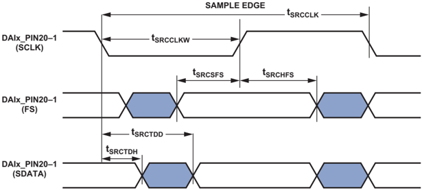

## Note that

- In dual-mode data transmit, the SPIx\_MISO signal is an output.
- In quad-mode data transmit, the SPIx\_MISO, SPIx\_D2, and SPIx\_D3 signals are outputs.
- In dual-mode data receive, the SPIx\_MOSI signal is an input.
- In quad-mode data receive, the SPIx\_MOSI, SPIx\_D2, and SPIx\_D3 signals are inputs.
- Quad-mode is supported by SPI2 only.
- CPHA is a configuration bit in the SPI\_CTL register.

## Table 73. SPI Port-Master Timing 1

| Parameter                 |                                                      | Min                    |   Max | Unit   |
|---------------------------|------------------------------------------------------|------------------------|-------|--------|
| Timing Requirements       | Timing Requirements                                  |                        |       |        |
| t SSPIDM                  | Data Input Valid to SPIx_CLK Edge (Data Input Setup) | 3.2                    |       | ns     |
| t HSPIDM                  | SPIx_CLK Sampling Edge to Data Input Invalid         | 1.2                    |       | ns     |
| Switching Characteristics | Switching Characteristics                            |                        |       |        |
| t SDSCIM                  | SPIx_SEL Low to First SPI_CLK Edge for CPHA = 1      | t SCLK1 - 2            |       | ns     |
|                           | SPIx_SEL Low to First SPI_CLK Edge for CPHA = 0      | 1.5 × t SCLK1 - 2      |       | ns     |
| t SPICHM                  | SPIx_CLK High Period 2                               | 0.5 × t SPICLKPROG - 1 |       | ns     |
| t SPICLM                  | SPIx_CLK Low Period 2                                | 0.5 × t SPICLKPROG - 1 |       | ns     |
| t SPICLK                  | SPIx_CLK Period 2                                    | t SPICLKPROG - 1       |       | ns     |
| t HDSM                    | Last SPIx_CLK Edge to SPIx_SEL High for CPHA = 1     | 1.5 × t SCLK1 - 2      |       | ns     |
|                           | Last SPIx_CLK Edge to SPIx_SEL High for CPHA = 0     | t SCLK1 - 2            |       | ns     |
| t SPITDM                  | Sequential Transfer Delay 3                          | t SCLK1 - 1            |       | ns     |
| t DDSPIDM                 | SPIx_CLK Edge to Data Out Valid (Data Out Delay)     |                        |   2.6 | ns     |
| t HDSPIDM                 | SPIx_CLK Edge to Data Out Invalid (Data Out Hold)    | -1.5                   |       | ns     |

## ADSP-SC582/SC583/SC584/SC587/SC589/ADSP-21583/21584/21587

## SPI Port-Master Timing

Table 73 and Figure 44 describe SPI port master operations.

When internally generated, the programmed SPI clock (fSPICLKPROG) frequency in MHz is set by the following equation where BAUD is a field in the SPIx\_CLK register that can be set from 0 to 65,535:

$$f SPICLK PROG f SCLK1 BAUD 1 +   - - - - - - - - - - - - - - - - - - - - - =$$

$$t SPICLKPROG 1 f SPICLKPROG - - - - - - - - - - - - - - - - - - - - - - - - - - =$$

## ADSP-SC582/SC583/SC584/SC587/SC589/ADSP-21583/21584/21587

Figure 44. SPI Port-Master Timing

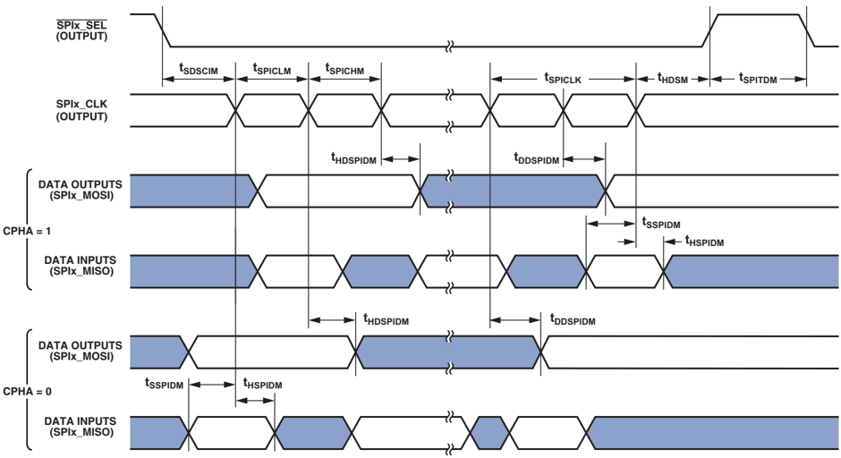

## ADSP-SC582/SC583/SC584/SC587/SC589/ADSP-21583/21584/21587

## SPI Port-Slave Timing

Table 74 and Figure 45 describe SPI port slave operations. Note that

- In dual-mode data transmit, the SPIx\_MOSI signal is an output.
- In quad-mode data transmit, the SPIx\_MOSI, SPIx\_D2, and SPIx\_D3 signals are outputs.
- In dual-mode data receive, the SPIx\_MISO signal is an input.
- In quad-mode data receive, the SPIx\_MISO, SPIx\_D2, and SPIx\_D3 signals are inputs.
- In SPI slave mode, the SPI clock is supplied externally and is called fSPICLKEXT, as follows:

<!-- formula-not-decoded -->

- Quad mode is supported by SPI2 only.
- CPHA is a configuration bit in the SPI\_CTL register.

## Table 74. SPI Port-Slave Timing 1

| Parameter                 |                                                      | Min Max               |   Unit |    |
|---------------------------|------------------------------------------------------|-----------------------|--------|----|
| Timing Requirements       | Timing Requirements                                  |                       |        |    |
| t SPICHS                  | SPIx_CLK High Period 2                               | 0.5 × t SPICLKEXT - 1 |        | ns |
| t SPICLS                  | SPIx_CLK Low Period 2                                | 0.5 × t SPICLKEXT - 1 |        | ns |
| t SPICLK                  | SPIx_CLK Period 2                                    | t SPICLKEXT - 1       |        | ns |
| t HDS                     | Last SPIx_CLK Edge to SPIx_SS Not Asserted           | 5                     |        | ns |
| t SPITDS                  | Sequential Transfer Delay                            | t SPICLK - 1          |        | ns |
| t SDSCI                   | SPIx_SS Assertion to First SPIx_CLK Edge             | 10.5                  |        | ns |
| t SSPID                   | Data Input Valid to SPIx_CLK Edge (Data Input Setup) | 2                     |        | ns |
| t HSPID                   | SPIx_CLK Sampling Edge to Data Input Invalid         | 1.6                   |        | ns |
| Switching Characteristics | Switching Characteristics                            |                       |        |    |
| t DSOE                    | SPIx_SS Assertion to Data Out Active                 | 0                     |     14 | ns |
| t DSDHI                   | SPIx_SS Deassertion to Data High Impedance           | 0                     |   12.5 | ns |
| t DDSPID                  | SPIx_CLK Edge to Data Out Valid (Data Out Delay)     |                       |     14 | ns |
| t HDSPID                  | SPIx_CLK Edge to Data Out Invalid (Data Out Hold)    | 0                     |        | ns |

## ADSP-SC582/SC583/SC584/SC587/SC589/ADSP-21583/21584/21587

Figure 45. SPI Port-Slave Timing

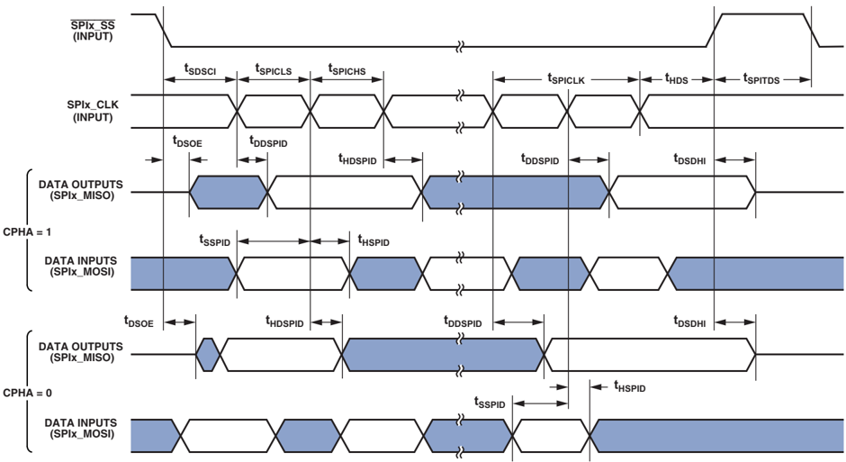

## ADSP-SC582/SC583/SC584/SC587/SC589/ADSP-21583/21584/21587

## SPI Port-SPI Ready (SPIx\_RDY) Slave Timing

SPIx\_RDY is used to provide flow control. CPOL, CPHA, and FCCH are configuration bits in the SPIx\_CTL register.

## Table 75. SPI Port-SPIx\_RDY Slave Timing 1

| Parameter                                                              | Conditions   | Min         | Max              | Unit   |
|------------------------------------------------------------------------|--------------|-------------|------------------|--------|
| Switching Characteristic                                               |              |             |                  |        |
| t DSPISCKRDYS SPIx_RDY Deassertion from Last Valid Input SPIx_CLK Edge | FCCH = 0     | 3 × t SCLK1 | 4 × t SCLK1 + 10 | ns     |
|                                                                        | FCCH = 1     | 4 × t SCLK1 | 5 × t SCLK1 + 10 | ns     |

Figure 46. SPIx\_RDY Deassertion from Valid Input SPIx\_CLK Edge in Slave Mode

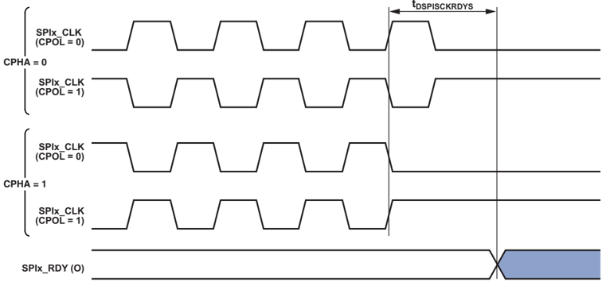

## ADSP-SC582/SC583/SC584/SC587/SC589/ADSP-21583/21584/21587

## SPI Port-Open Drain Mode (ODM) Timing

In Table 76 and Table 77 and Figure 47 and Figure 48, the outputs can be SPIx\_MOSI, SPIx\_MISO, SPIx\_D2, and/or SPIx\_D3, depending on the mode of operation. CPOL and CPHA are configuration bits in the SPI\_CTL register.

## Table 76. SPI Port-ODM Master Mode  1

| Parameter                                                       |   Min |   Max | Unit   |
|-----------------------------------------------------------------|-------|-------|--------|
| Switching Characteristics                                       |       |       |        |
| t HDSPIODMM SPIx_CLK Edge to High Impedance from Data Out Valid |    -1 |       | ns     |
| t DDSPIODMM SPIx_CLK Edge to Data Out Valid from High Impedance |    -1 |    +6 | ns     |

Figure 47. ODM Master Mode

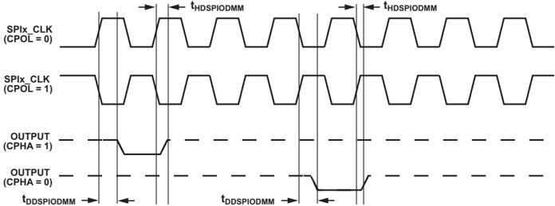

## Table 77. SPI Port-ODM Slave Mode 1

| Parameter           | Parameter                                           |   Min |   Max | Unit   |
|---------------------|-----------------------------------------------------|-------|-------|--------|
| Timing Requirements | Timing Requirements                                 |       |       |        |
| t HDSPIODMS         | SPIx_CLK Edge to High Impedance from Data Out Valid |     0 |       | ns     |
| t DDSPIODMS         | SPIx_CLK Edge to Data Out Valid from High Impedance |       |    11 | ns     |

Figure 48. ODM Slave Mode

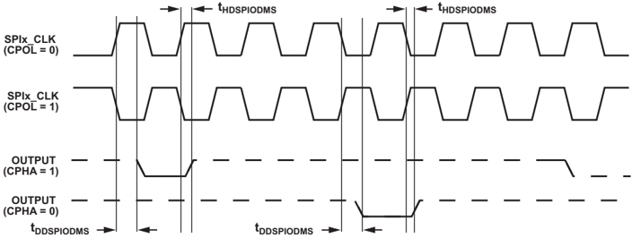

## ADSP-SC582/SC583/SC584/SC587/SC589/ADSP-21583/21584/21587

## SPI Port-SPIx\_RDY Master Timing

SPIx\_RDY provides flow control. CPOL and CPHA are configuration bits in the SPIx\_CTL register, whereas LEADX, LAGX, and STOP are configuration bits in the SPIx\_DLY register.

## Table 78. SPI Port-SPIx\_RDY Master Timing 1

| Parameter                | Parameter                                                                | Conditions         | Min                           | Max                              | Unit   |
|--------------------------|--------------------------------------------------------------------------|--------------------|-------------------------------|----------------------------------|--------|
| Timing Requirement       | Timing Requirement                                                       |                    |                               |                                  |        |
| t SRDYSCKM               | Setup Time for SPIx_RDY Deassertion Before Last Valid Data SPIx_CLK Edge |                    | (2+2×BAUD 2 )×t SCLK1 +10     | (2+2×BAUD 2 )×t SCLK1 +10        | ns     |
| Switching Characteristic | Switching Characteristic                                                 |                    |                               |                                  |        |
| t DRDYSCKM 3             | Assertion of SPIx_RDY to First SPIx_CLK Edge of Next Transfer            | Baud = 0, CPHA = 0 | 4.5 × t SCLK1                 | 5.5 × t SCLK1 + 10               | ns     |
|                          |                                                                          | Baud = 0, CPHA = 1 | 4 × t SCLK1                   | 5 × t SCLK1 + 10                 | ns     |
|                          |                                                                          | Baud > 0, CPHA = 0 | (1 + 1.5 × BAUD 2 ) × t SCLK1 | (2+2.5×BAUD 2 )×t SCLK1 +10      | ns     |
|                          |                                                                          | Baud > 0, CPHA = 1 | (1 + 1 × BAUD 2 ) × t SCLK1   | (2 + 2 × BAUD 2 ) × t SCLK1 + 10 | ns     |

Figure 49. SPIx\_RDY Setup Before SPIx\_CLK

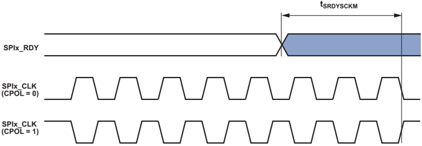

## ADSP-SC582/SC583/SC584/SC587/SC589/ADSP-21583/21584/21587

Figure 50. SPIx\_CLK Switching Diagram After SPIx\_RDY Assertion

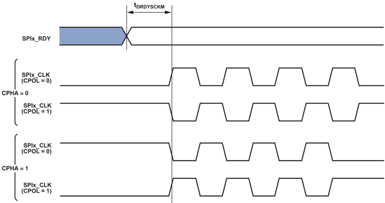

## ADSP-SC582/SC583/SC584/SC587/SC589/ADSP-21583/21584/21587

## Precision Clock Generator (PCG) (Direct Pin Routing)

This timing is only valid when the SRU is configured such that the precision clock generator (PCG) takes inputs directly from the DAI pins (via pin buffers) and sends outputs directly to the DAI pins. For the other cases, where the PCG inputs and outputs are not directly routed to/from DAI pins (via pin buffers), there is no timing data available. All timing parameters and switching characteristics apply to external DAI pins (DAIx\_PINx).

## Table 79. Precision Clock Generator (Direct Pin Routing)

| Parameter                 | Parameter                                                               | Min                             | Max                              | Unit   |
|---------------------------|-------------------------------------------------------------------------|---------------------------------|----------------------------------|--------|
| Timing Requirement s      | Timing Requirement s                                                    |                                 |                                  |        |
| t PCGIP                   | Input Clock Period                                                      | t SCLK × 2                      |                                  | ns     |
| t STRIG                   | PCG Trigger Setup Before Falling Edge of PCG Input Clock                | 4.5                             |                                  | ns     |
| t HTRIG                   | PCG Trigger Hold After Falling Edge of PCG Input Clock                  | 3                               |                                  | ns     |
| Switching Characteristics | Switching Characteristics                                               |                                 |                                  |        |
| t DPCGIO                  | PCG Output Clock and Frame Sync Active Edge Delay After PCG Input Clock | 2.5                             | 13.5                             | ns     |
| t DTRIGCLK                | PCG Output Clock Delay After PCG Trigger                                | 2.5 + (2.5 × t PCGIP )          | 13.5 + (2.5 × t PCGIP )          | ns     |
| t DTRIGFS 1               | PCG Frame Sync Delay After PCG Trigger                                  | 2.5 + ((2.5 + D-PH) × t PCGIP ) | 13.5 + ((2.5 + D-PH) × t PCGIP ) | ns     |
| t PCGOW 2                 | Output Clock Period                                                     | 2 × t PCGIP - 1                 |                                  | ns     |

Figure 51. PCG (Direct Pin Routing)

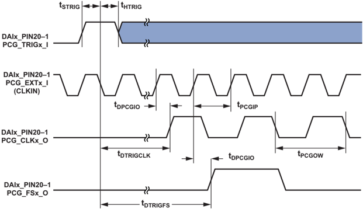

## ADSP-SC582/SC583/SC584/SC587/SC589/ADSP-21583/21584/21587

## General-Purpose I/O Port Timing

Table 80 and Figure 52 describe I/O timing, related to the general-purpose I/O port.

## Table 80. General-Purpose Port Timing

Figure 52. General-Purpose Port Pin Timing

| Parameter             | Min               | Max   | Unit   |
|-----------------------|-------------------|-------|--------|
| Timing Requirement    |                   |       |        |
| t WFI General-Purpose | 2 × t SCLK0 - 1.5 |       | ns     |

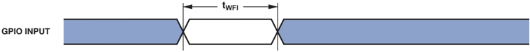

## General-Purpose I/O Timer Cycle Timing

Table 81, Table 82, and Figure 53 describe timer expired operations related to the general-purpose timer. The input signal is asynchronous in Width Capture Mode and External Clock Mode and has an absolute maximum input frequency of fSCLK/4 MHz. The Width Value value is the timer period assigned in the TMx\_TMRn\_WIDTH register and can range from 1 to 2 32 - 1. When externally generated, the TMx\_CLK clock is called fTMRCLKEXT, as follows:

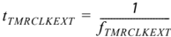

## Table 81. Timer Cycle Timing (Internal Mode)

| Parameter                | Min                                                      | Max                         | Unit   |
|--------------------------|----------------------------------------------------------|-----------------------------|--------|
| Timing Requirements      |                                                          |                             |        |
| t WL                     | Timer Pulse Width Input Low (Measured In SCLK Cycles) 1  | 2 × t SCLK                  | ns     |
| t WH                     | Timer Pulse Width Input High (Measured In SCLK Cycles) 1 | 2 × t SCLK                  | ns     |
| Switching Characteristic |                                                          |                             |        |
| t HTO                    | Timer Pulse Width Output (Measured In SCLK Cycles) 2     | t SCLK × WIDTH - 1.5 t SCLK | ns     |

## Table 82. Timer Cycle Timing (External Mode)

| Parameter                |                                                            | Min                     | Max                     | Unit   |
|--------------------------|------------------------------------------------------------|-------------------------|-------------------------|--------|
| Timing Requirements      | Timing Requirements                                        |                         |                         |        |
| t WL                     | Timer Pulse Width Input Low (Measured In EXT_CLK Cycles) 1 | 2 × t EXT_CLK           |                         | ns     |
| t WH                     | Timer Pulse Width Input High (Measured In EXT_CLK Cycles)  | 2 × t EXT_CLK           |                         | ns     |
| t EXT_CLK                | Timer External Clock Period 2                              | t TMRCLKEXT             |                         | ns     |
| Switching Characteristic | Switching Characteristic                                   |                         |                         |        |
| t HTO                    | Timer Pulse Width Output (Measured In EXT_CLK Cycles) 3    | t EXT_CLK × WIDTH - 1.5 | t EXT_CLK × WIDTH + 1.5 | ns     |

## ADSP-SC582/SC583/SC584/SC587/SC589/ADSP-21583/21584/21587

Figure 53. Timer Cycle Timing

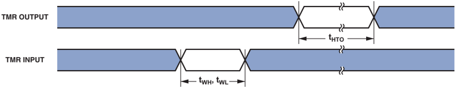

## DAIx Pin to DAIx Pin Direct Routing (DAI0 Block and DAI1 Block)

Table 83 and Figure 54 describe I/O timing related to the digital audio interface (DAI) for direct pin connections only (for example, DAIx\_PB01\_I to DAIx\_PB02\_O).

## Table 83. DAI Pin to DAI Pin Routing

Figure 54. DAI Pin to DAI Pin Direct Routing

| Parameter                                            |   Min |   Max | Unit   |
|------------------------------------------------------|-------|-------|--------|
| Switching Characteristic                             |       |       |        |
| t DPIO Delay DAI Pin Input Valid to DAI Output Valid |   1.5 |    12 | ns     |

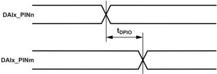

## Up/Down Counter/Rotary Encoder Timing

Table 84 and Figure 55 describe timing related to the general-purpose counter (CNT).

## Table 84. Up/Down Counter/Rotary Encoder Timing

Figure 55. Up/Down Counter/Rotary Encoder Timing

| Parameter          | Min         | Max   | Unit   |
|--------------------|-------------|-------|--------|
| Timing Requirement |             |       |        |
| t WCOUNT           | 2 × t SCLK0 |       | ns     |

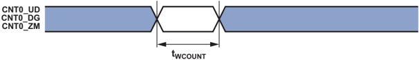

## ADSP-SC582/SC583/SC584/SC587/SC589/ADSP-21583/21584/21587

## Pulse Width Modulator (PWM) Timing

Table 85 and Figure 56 describe timing, related to the PWM.

## Table 85. PWM Timing 1

| Parameter                 | Min                                      | Max                           | Unit   |
|---------------------------|------------------------------------------|-------------------------------|--------|
| Timing Requirement        |                                          |                               |        |
| t ES                      | External Sync Pulse Width                | 2 × t SCLK0                   | ns     |
| Switching Characteristics |                                          |                               |        |
| t DODIS                   | Output Inactive (off) After Trip Input 2 | 15                            | ns     |
| t DOE                     | Output Delay After External Sync 2, 3    | 2 × t SCLK0 + 5.5 5 × t SCLK0 | ns     |

Figure 56. PWM Timing

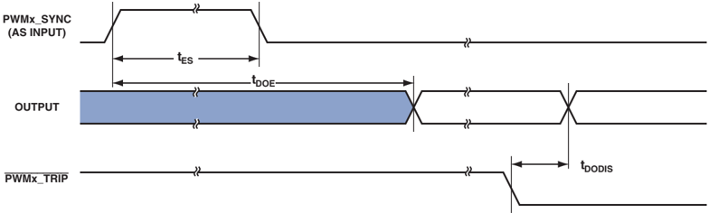

## ADSP-SC582/SC583/SC584/SC587/SC589/ADSP-21583/21584/21587

## PWM - Medium Precision (MP) Mode Timing

Table 86 and Figure 57 describe medium precision (MP) PWM operations.

## Table 86. PWM-MP Mode, Output Pulse

| Parameter                | Parameter                   | Min                         | Max                         | Unit   |
|--------------------------|-----------------------------|-----------------------------|-----------------------------|--------|
| Switching Characteristic | Switching Characteristic    |                             |                             |        |
| t MPWMW                  | MPPWMOutputPulse Width 1, 2 | (N + m×0.25) × t SCLK - 1.0 | (N + m×0.25) × t SCLK + 1.0 | ns     |

Figure 57. PWM MP Mode Timing, Output Pulse

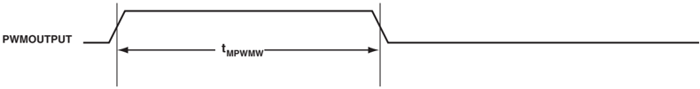

## PWM - Heightened Precision (HP) Mode Timing

Table 87, Table 88, and Figure 58 through Figure 61 describe heightened precision (HP) PWM operations.

## Table 87. PWM-HP Mode (HPPWM), Output Pulse Width Accuracy

| Parameter                            | Conditions                                                                                              |   Min |   Typ |   Max | Unit   |
|--------------------------------------|---------------------------------------------------------------------------------------------------------|-------|-------|-------|--------|
| HPPWMPulse Width Accuracy            |                                                                                                         |       |       |       |        |
| Resolution 1, 2                      | Maximum allowed heightened precision divider bits for fractional duty cycles within system clock period |       |       |     4 | Bits   |
| Differential Nonlinearity (DNL) 1, 3 | Guaranteed monotonic                                                                                    | -0.99 |       |  +1.0 | LSB    |
| Integral Nonlinearity (INL) 1, 4     |                                                                                                         |  -1.0 |       |  +1.0 | LSB    |
| RMS Jitter 1                         | RMS jitter of any given pulse width code step                                                           |       |   200 |       | ps     |

<!-- formula-not-decoded -->

4 INL definition. See Figure 60 for an example of INL calculation. For each heightened precision duty register value (n) is as follows:

<!-- formula-not-decoded -->

Figure 58. Fractional Duty Cycle Edge Placement (4-Bit Resolution)

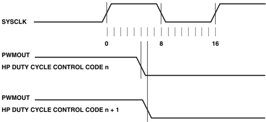

## ADSP-SC582/SC583/SC584/SC587/SC589/ADSP-21583/21584/21587

Figure 59. HPPWM Pulse Width Accuracy: DNL Calculation

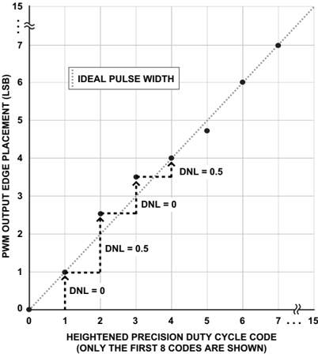

Note that Figure 59 and Figure 60 show sample data for calculating DNL and INL, respectively. They do not reflect actual measured performance.

## Table 88.  PWM-HP and MP Modes, Output Skew

| Parameter                      | Min   |   Max | Unit   |
|--------------------------------|-------|-------|--------|
| Switching Characteristic       |       |       |        |
| t PWMS HP andMPPWMOutputSkew 1 |       |   1.0 | ns     |

Figure 61. PWM HP and MP Modes Timing, Output Skew

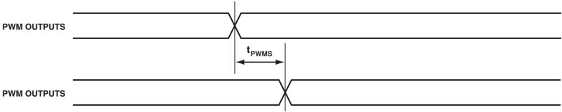

Figure 60. HPPWM Pulse Width Accuracy: INL Calculation

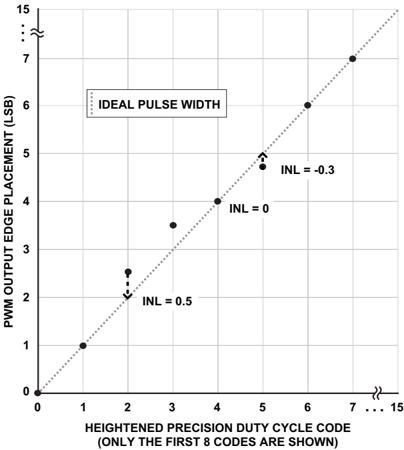

## ADSP-SC582/SC583/SC584/SC587/SC589/ADSP-21583/21584/21587

## ADC Controller Module (ACM) Timing

Table 89 and Figure 62 describe ACM operations.

When internally generated, the programmed ACM clock (fACLKPROG) frequency in MHz is set by the following equation where CKDIV is a field in the ACM\_TC0 register and ranges from 1 to 255:

<!-- formula-not-decoded -->

<!-- formula-not-decoded -->

Setup cycles (SC) in Table 89 is also a field in the ACM0\_TC0 register and ranges from 0 to 4095. Hold cycles (HC) is a field in the ACM0\_TC1 register that ranges from 0 to 15.

## Table 89. ACM Timing

| Parameter                 | Parameter                                              | Min                       | Max   | Unit   |
|---------------------------|--------------------------------------------------------|---------------------------|-------|--------|
| Timing Requirements       | Timing Requirements                                    |                           |       |        |
| t SDR                     | SPORT DRxPRI/DRxSEC Setup Before ACMx_CLK              | 3.5                       |       | ns     |
| t HDR                     | SPORT DRxPRI/DRxSEC Hold After ACMx_CLK                | 1.5                       |       | ns     |
| Switching Characteristics | Switching Characteristics                              |                           |       |        |
| t SCTLCS                  | ACMControls (ACMx_A[4:0]) Setup Before Assertion of CS | (SC + 1) × t SCLK1 - 3    |       | ns     |
| t HCTLCS                  | ACMControl (ACMx_A[4:0]) Hold After Deassertion of CS  | HC × t ACLKPROG - 1       |       | ns     |
| t ACLKW                   | ACMClock Pulse Width 1                                 | (0.5 × t ACLKPROG ) - 1.5 |       | ns     |
| t ACLK                    | ACMClock Period 1                                      | t ACLKPROG - 1.5          |       | ns     |
| t HCSACLK                 | CS Hold to ACMx_CLK Edge                               | -2.5                      |       | ns     |
| t SCSACLK                 | CS Setup to ACMx_CLK Edge                              | t ACLKPROG - 3.5          |       | ns     |

Figure 62. ACM Timing

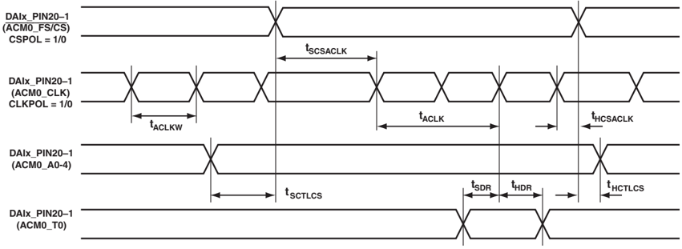

## ADSP-SC582/SC583/SC584/SC587/SC589/ADSP-21583/21584/21587

## Universal Asynchronous Receiver-Transmitter (UART) Ports-Receive and Transmit Timing

The UART ports receive and transmit operations are described in the ADSP-SC58x/ADSP-2158x SHARC+ Processor Hardware Reference.

## Controller Area Network (CAN) Interface

[The CAN interface timing is described in the ADSP-SC58x/ADSP-2158x SHARC+ Processor Hardware Reference.](https://www.analog.com/adsp-sc58x-adsp-2158x-hrm?doc=ADSP-SC582_SC583_SC584_SC587_SC589_21583_584_587.pdf)

## Universal Serial Bus (USB)

Table 90 describes the universal serial bus (USB) clock timing. Refer to the USB 2.0 Specification for timing and dc specifications for USB pins (including output characteristics for driver types E, F, and G listed in the ADSP-SC58x/ADSP-2158x Designer Quick Reference).

## Table 90. USB Clock Timing 1

| Parameter           |   Min |   Max | Unit   |
|---------------------|-------|-------|--------|
| Timing Requirements |       |       |        |
| f USBS              |    24 |    24 | MHz    |
| fs USB              |   -50 |   +50 | ppm    |

## PCI Express (PCIe)

The PCIe interface complies with the Gen1 and Gen2 x1 lane data rate specification and supports up to 3.0 PCIe base functionality.

For more information about PCIe, see the following standards:

- PCI Express Base 3.0 Specification , Revision 1.0, PCI-SIG
- PCI Express 2.0 Card Electromechanical Specification , Revision 2.0, PCI-SIG
- PHY Interface for the PCI Express Architecture , Revision 2.0, Intel Corporation
- PCI-SIG Engineering Change Request: L1 Substates , February 1, 2012, PCI-SIG
- IEEE Standard 1149.1-2001 , IEEE
- IEEE Standard 1149.6-2003 , IEEE

## ADSP-SC582/SC583/SC584/SC587/SC589/ADSP-21583/21584/21587

## 10/100 EMAC Timing (ETH0 and ETH1)

Table 91 through Table 93 and Figure 63 through Figure 65 describe the RMII EMAC operations.

## Table 91. 10/100 EMAC Timing -RMII Receive Signal 1

| Parameter 2         |                                                                    | Min Max         | Unit            |     |
|---------------------|--------------------------------------------------------------------|-----------------|-----------------|-----|
| Timing Requirements | Timing Requirements                                                |                 |                 |     |
| t REFCLKF           | ETHx_REFCLK Frequency (f SCLK0 = SCLK0 Frequency)                  |                 | 50+1%           | MHz |
| t REFCLKW           | ETHx_REFCLK Width (t REFCLKF = ETHx_REFCLK Period)                 | t REFCLKF × 35% | t REFCLKF × 65% | ns  |
| t REFCLKIS          | Rx Input Valid to RMII ETHx_REFCLK Rising Edge (Data Input Setup)  | 1.75            |                 | ns  |
| t REFCLKIH          | RMII ETHx_REFCLK Rising Edge to Rx Input Invalid (Data Input Hold) | 1.6             |                 | ns  |

Figure 63. 10/100 EMAC Controller Timing-RMII Receive Signal

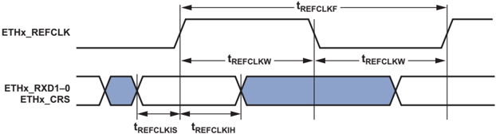

## Table 92. 10/100 EMAC Timing -RMII Transmit Signal 1

| Parameter 2               | Parameter 2                                                             |   Min |   Max | Unit   |
|---------------------------|-------------------------------------------------------------------------|-------|-------|--------|
| Switching Characteristics | Switching Characteristics                                               |       |       |        |
| t REFCLKOV                | RMII ETHx_REFCLK Rising Edge to Transmit Output Valid (Data Out Valid)  |       |  11.9 | ns     |
| t REFCLKOH                | RMII ETHx_REFCLK Rising Edge to Transmit Output Invalid (Data Out Hold) |     2 |       | ns     |

Figure 64. 10/100 EMAC Controller Timing-RMII Transmit Signal

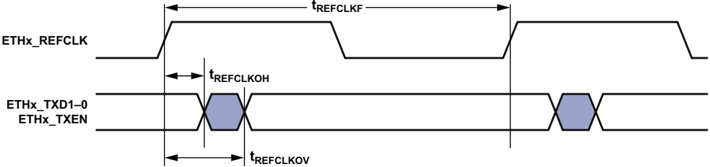

## ADSP-SC582/SC583/SC584/SC587/SC589/ADSP-21583/21584/21587

Table 93.  EMAC Timing -Station Management 1

| Parameter 2               | Min                                                      | Max          | Unit   |
|---------------------------|----------------------------------------------------------|--------------|--------|
| Timing Requirements       |                                                          |              |        |
| t MDIOS                   | ETHx_MDIO Input Valid to ETHx_MDC Rising Edge (Setup)    | 10.8         | ns     |
| t MDCIH                   | ETHx_MDC Rising Edge to ETHx_MDIO Input Invalid (Hold)   | 0            | ns     |
| Switching Characteristics |                                                          |              |        |
| t MDCOV                   | ETHx_MDC Falling Edge to ETHx_MDIO Output Valid          | t SCLK0      | ns     |
| t MDCOH                   | ETHx_MDC Falling Edge to ETHx_MDIO Output Invalid (Hold) | t SCLK0 -2.9 | ns     |

Figure 65. Ethernet MAC Controller Timing- Station Management

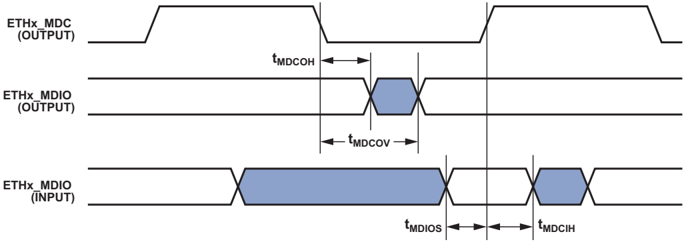

## ADSP-SC582/SC583/SC584/SC587/SC589/ADSP-21583/21584/21587

## 10/100/1000 EMAC Timing (ETH0 Only)

Table 94 and Figure 66 describe the RGMII EMAC timing.

## Table 94. 10/100/1000 EMAC Timing-RGMII Receive and Transmit Signals  1

| Parameter                 |                                          | Min Max          | Unit             |    |
|---------------------------|------------------------------------------|------------------|------------------|----|
| Timing Requirements       | Timing Requirements                      |                  |                  |    |
| t SETUPR                  | Data to Clock Input Setup at Receiver    | 1                |                  | ns |
| t HOLDR                   | Data to Clock Input Hold at Receiver     | 1                |                  | ns |
| t GREFCLKF                | RGMII Receive Clock Period               | 8                |                  | ns |
| t GREFCLKW                | RGMII Receive Clock Pulse Width          | 4                |                  | ns |
| Switching Characteristics | Switching Characteristics                |                  |                  |    |
| t SKEWT                   | Data to Clock Output Skew at Transmitter | -0.5             | 0.5              | ns |
| t CYC                     | Clock Cycle Duration                     | 7.2              | 8.8              | ns |
| t DUTY_G                  | Duty Cycle for RGMII Minimum             | t GREFCLKF × 45% | t GREFCLKF × 55% | ns |

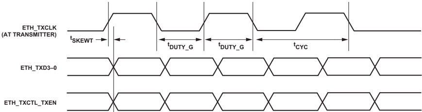

Figure 66. Gigabit EMAC Controller Timing-RGMII

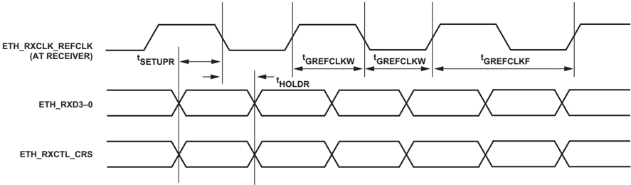

## ADSP-SC582/SC583/SC584/SC587/SC589/ADSP-21583/21584/21587

## Sinus Cardinalis (SINC) Filter Timing

The programmed SINC filter clock (fSINCLKPROG) frequency in MHz is set by the following equation where MDIV is a field in the CLK control register that can be set from 4 to 63:

$$f SINCLK PROG f SCLK MDIV - - - - - - - - - =$$

$$t SINCLKPROG 1 f SINCLKPROG - - - - - - - - - - - - - - - - - - - - - - - - - - =$$

## Table 95. SINC Timing

| Parameter                 | Min                                   | Max                      | Unit   |
|---------------------------|---------------------------------------|--------------------------|--------|
| Timing Requirements       |                                       |                          |        |
| t SSINC                   | SINC0_Dx Setup Before SINC0_CLKx Rise | 13.5                     | ns     |
| t HSINC                   | SINC0_Dx Hold After SINC0_CLKx Rise   | 0                        | ns     |
| Switching Characteristics |                                       |                          |        |
| t SINCLK                  | SINC0_CLKx Period 1                   | t SINCLKPROG - 2.5       | ns     |
| t SINCLKW                 | SINC0_CLKx Width 1                    | 0.5 × t SINCLKPROG - 2.5 | ns     |

Figure 67. SINC Timing

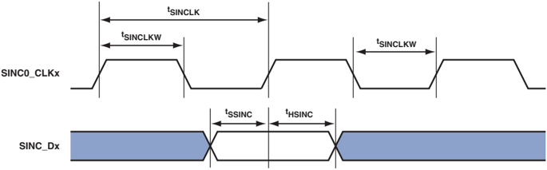

## ADSP-SC582/SC583/SC584/SC587/SC589/ADSP-21583/21584/21587

## Sony/Philips Digital Interface (S/PDIF) Transmitter

Serial data input to the S/PDIF transmitter can be formatted as left justified, I 2 S, or right justified with word widths of 16, 18, 20, or 24 bits. The following sections provide timing for the transmitter.

## S/PDIF Transmitter Serial Input Waveforms

Table 96 and Figure 68 show the right justified mode. Frame sync is high for the left channel and low for the right channel. Data is valid on the rising edge of serial clock. The MSB is delayed the minimum in 24-bit output mode or the maximum in 16-bit output mode from a frame sync transition, so that when there are 64 serial clock periods per frame sync period, the LSB of the data is right justified to the next frame sync transition.

## Table 96. S/PDIF Transmitter Right Justified Mode

Figure 68. Right Justified Mode

| Parameter          | Conditions       |   Nominal | Unit   |
|--------------------|------------------|-----------|--------|
| Timing Requirement |                  |           |        |
| t RJD              | 16-bit word mode |        16 | SCLK   |
|                    | 18-bit word mode |        14 | SCLK   |
|                    | 20-bit word mode |        12 | SCLK   |
|                    | 24-bit word mode |         8 | SCLK   |

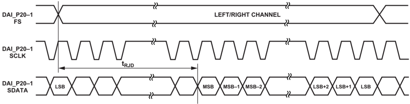

## ADSP-SC582/SC583/SC584/SC587/SC589/ADSP-21583/21584/21587

Table 97 and Figure 69 show the default I 2 S justified mode. The frame sync is low for the left channel and high for the right channel. Data is valid on the rising edge of serial clock. The MSB is left justified to the frame sync transition but with a delay.

## Table 97. S/PDIF Transmitter I 2 S Mode

Figure 69. I 2 S Justified Mode

| Parameter          |   Nominal | Unit   |
|--------------------|-----------|--------|
| Timing Requirement |           |        |
| t I2SD             |         1 | SCLK   |

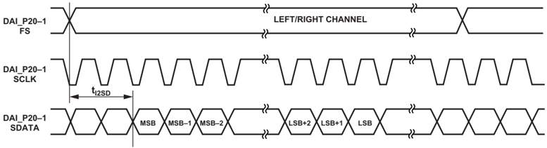

Table 98 and Figure 70 show the left justified mode. The frame sync is high for the left channel and low for the right channel. Data is valid on the rising edge of serial clock. The MSB is left justified to the frame sync transition with no delay.

## Table 98. S/PDIF Transmitter Left Justified Mode

Figure 70. Left Justified Mode

| Parameter          |   Nominal | Unit   |
|--------------------|-----------|--------|
| Timing Requirement |           |        |
| t LJD              |         0 | SCLK   |

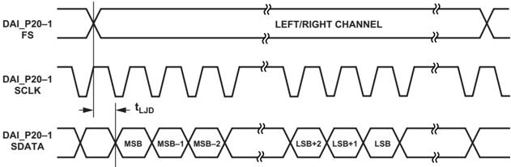

## ADSP-SC582/SC583/SC584/SC587/SC589/ADSP-21583/21584/21587

## S/PDIF Transmitter Input Data Timing

The timing requirements for the S/PDIF transmitter are given in Table 99. Input signals are routed to the DAIx\_PINx pins using the SRU. Therefore, the timing specifications provided below are valid at the DAIx\_PINx pins.

## Table 99. S/PDIF Transmitter Input Data Timing

| Parameter           | Parameter                                        |   Min | Max   | Unit   |
|---------------------|--------------------------------------------------|-------|-------|--------|
| Timing Requirements | Timing Requirements                              |       |       |        |
| t SISFS 1           | Frame Sync Setup Before Serial Clock Rising Edge |     3 |       | ns     |
| t SIHFS 1           | Frame Sync Hold After Serial Clock Rising Edge   |     3 |       | ns     |
| t SISD 1            | Data Setup Before Serial Clock Rising Edge       |     3 |       | ns     |
| t SIHD 1            | Data Hold After Serial Clock Rising Edge         |     3 |       | ns     |
| t SITXCLKW          | Transmit Clock Width                             |     9 |       | ns     |
| t SITXCLK           | Transmit Clock Period                            |    20 |       | ns     |
| t SISCLKW           | Clock Width                                      |    36 |       | ns     |
| t SISCLK            | Clock Period                                     |    80 |       | ns     |

Figure 71. S/PDIF Transmitter Input Timing

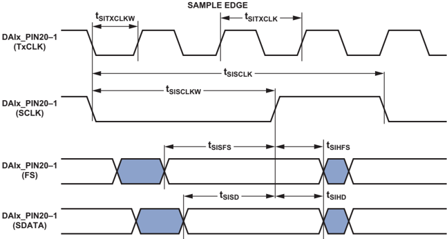

## Oversampling Clock (TxCLK) Switching Characteristics

The S/PDIF transmitter requires an oversampling clock input. This high frequency clock (TxCLK) input is divided down to generate the internal biphase clock.

## Table 100. Oversampling Clock (TxCLK) Switching Characteristics

| Parameter                 | Max                                                                        | Unit   |
|---------------------------|----------------------------------------------------------------------------|--------|
| Switching Characteristics |                                                                            |        |
| f TXCLK_384 Frequency     | for TxCLK = 384 × Frame Sync Oversampling ratio × frame sync ≤ 1/t SITXCLK | MHz    |
| f TXCLK_256 Frequency     | for TxCLK = 256 × Frame Sync 49.2                                          | MHz    |
| f FS                      | Frame Rate (FS) 192.0                                                      | kHz    |

## ADSP-SC582/SC583/SC584/SC587/SC589/ADSP-21583/21584/21587

## S/PDIF Receiver

The following section describes timing as it relates to the S/PDIF receiver.

## Internal Digital PLL Mode

In the internal digital PLL mode, the internal digital PLL generates the 512 × FS clock.

Table 101. S/PDIF Receiver Internal Digital PLL Mode Timing

| Parameter                 | Min                                      |   Max | Unit   |
|---------------------------|------------------------------------------|-------|--------|
| Switching Characteristics |                                          |       |        |
| t DFSI                    | Frame Sync Delay After Serial Clock      |     5 | ns     |
| t HOFSI                   | Frame Sync Hold After Serial Clock -2    |       | ns     |
| t DDTI                    | Transmit Data Delay After Serial Clock   |     5 | ns     |
| t HDTI                    | Transmit Data Hold After Serial Clock -2 |       | ns     |

Figure 72. S/PDIF Receiver Internal Digital PLL Mode Timing

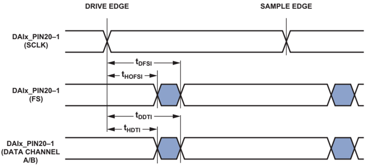

## ADSP-SC582/SC583/SC584/SC587/SC589/ADSP-21583/21584/21587

## Media LB (MLB)

All the numbers shown in Table 102 are applicable for all MLB speed modes (1024 FS, 512 FS, and 256 FS) for the 3-pin protocol, unless otherwise specified. Refer to the Media Local Bus Specification version 4.2 for more details.

Table 102. 3-Pin MLB Interface Specifications

| Parameter   |                                                   |   Min |   Typ |   Max Unit |      |
|-------------|---------------------------------------------------|-------|-------|------------|------|
| t MLBCLK    | MLB Clock Period                                  |       |       |            |      |
|             | 1024 FS                                           |       |  20.3 |            | ns   |
|             | 512 FS                                            |       |    40 |            | ns   |
|             | 256 FS                                            |       |    81 |            | ns   |
| t MCKL      | MLBCLK Low Time                                   |       |       |            |      |
|             | 1024 FS                                           |   6.1 |       |            | ns   |
|             | 512 FS                                            |    14 |       |            | ns   |
|             | 256 FS                                            |    30 |       |            | ns   |
| t MCKH      | MLBCLK High Time                                  |       |       |            |      |
|             | 1024 FS                                           |   9.3 |       |            | ns   |
|             | 512 FS                                            |    14 |       |            | ns   |
|             | 256 FS                                            |    30 |       |            | ns   |
| t MCKR      | MLBCLK Rise Time (V IL to V IH )                  |       |       |            |      |
|             | 1024 FS                                           |       |       |          1 | ns   |
|             | 512 FS/256 FS                                     |       |       |          3 | ns   |
| t MCKF      | MLBCLK Fall Time (V IH to V IL )                  |       |       |            |      |
|             | 1024 FS                                           |       |       |          1 | ns   |
|             | 512 FS/256 FS                                     |       |       |          3 | ns   |
| t MPWV 1    | MLBCLK Pulse Width Variation                      |       |       |            |      |
|             | 1024 FS                                           |       |       |        0.7 | nspp |
|             | 512 FS/256                                        |       |       |        2.0 | nspp |
| t DSMCF     | DAT/SIG Input Setup Time                          |     1 |       |            | ns   |
| t DHMCF     | DAT/SIG Input Hold Time                           |     2 |       |            | ns   |
| t MCFDZ     | DAT/SIG Output Time to Three-State                |     0 |       |         15 | ns   |
| t MCDRV     | DAT/SIG Output Data Delay From MLBCLK Rising Edge |       |       |          8 | ns   |
| t MDZH 2    | Bus Hold Time                                     |       |       |            |      |
|             | 1024 FS                                           |     2 |       |            | ns   |
|             | 512 FS/256                                        |     4 |       |            | ns   |
| C MLB       | DAT/SIG Pin Load                                  |       |       |            |      |
|             | 1024 FS                                           |       |       |         40 | pf   |
|             | 512 FS/256                                        |       |       |         60 | pf   |

## ADSP-SC582/SC583/SC584/SC587/SC589/ADSP-21583/21584/21587

Figure 73. MLB Timing (3-Pin Interface)

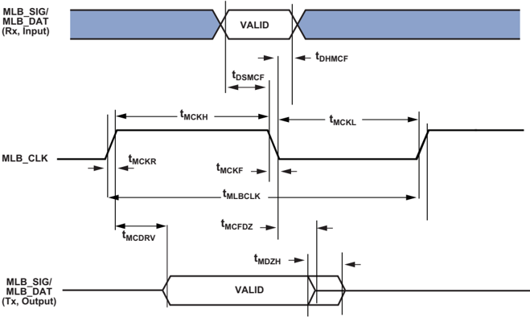

The ac timing specifications of the 6-pin MLB interface is detailed in Table 103. Refer to the Media Local Bus Specification version 4.2 for more details.

## Table 103. 6-Pin MLB Interface Specifications

| Parameter   | Parameter                                                                                                          | Conditions                                        |    Min | Typ   |   Max | Unit    |
|-------------|--------------------------------------------------------------------------------------------------------------------|---------------------------------------------------|--------|-------|-------|---------|
| t MT        | Differential Transition Time at the Input Pin (See Figure 74)                                                      | 20% to 80% V IN +/V IN - 80% to 20% V IN +/V IN - |        |       |     1 | ns      |
| f MCKE      | MLBCP/N External Clock Operating Frequency (See Figure 75) 1                                                       | 2048 × FS at 44.0 kHz 2048 × FS at 50.0 kHz       | 90.112 |       | 102.4 | MHz MHz |
| f MCKR      | Recovered Clock Operating Frequency (Internal, not Observable at Pins, Only for Timing References) (See Figure 75) | 2048 × FS at 44.0 kHz 2048 × FS at 50.0 kHz       | 90.112 |       | 102.4 | MHz MHz |
| t DELAY     | Transmitter MLBSP/N (MLBDP/N) Output Valid From Transition of MLBCP/N (Low to High) (See Figure 76)                | f MCKR = 2048 × FS                                |    0.6 |       |     5 | ns      |
| t PHZ       | Disable Turnaround Time From Transition of MLBCP/N (Low to High) (See Figure 77)                                   | f MCKR = 2048 × FS                                |    0.6 |       |     7 | ns      |
| t PLZ       | Enable Turnaround Time From Transition of MLBCP/N (Low to High) (See Figure 77)                                    | f MCKR = 2048 × FS                                |    0.6 |       |  11.2 | ns      |
| t SU        | MLBSP/N (MLBDP/N) Valid to Transition of MLBCP/N (Low to High) (See Figure 76)                                     | f MCKR = 2048 × FS                                |      1 |       |       | ns      |
| t HD        | MLBSP/N (MLBDP/N) Hold From Transition of MLBCP/N (Low to High) (See Figure 76) 2                                  |                                                   |    0.6 |       |       | ns      |

## ADSP-SC582/SC583/SC584/SC587/SC589/ADSP-21583/21584/21587

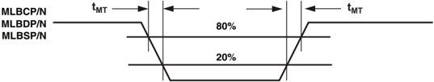

Figure 74. MLB 6-Pin Transition Time

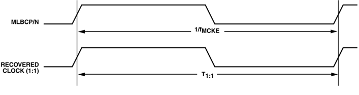

NOTE:

T 1:1  = 1/f MCKE

Figure 75. MLB 6-Pin Clock Definitions

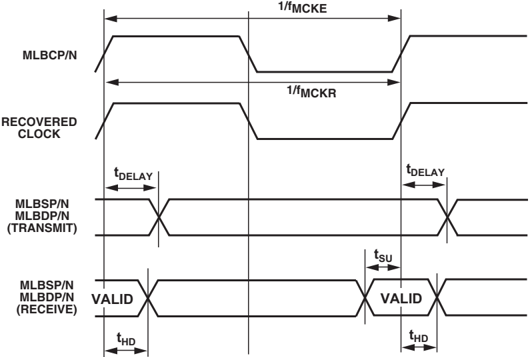

Figure 76. MLB 6-Pin Delay, Setup, and Hold Times

Figure 77. MLB 6-Pin Disable and Enable Turnaround Times

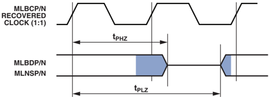

## ADSP-SC582/SC583/SC584/SC587/SC589/ADSP-21583/21584/21587

## Mobile Storage Interface (MSI) Controller Timing

Table 104 and Figure 78 show I/O timing related to the MSI.

## Table 104. MSI Controller Timing

| Parameter                 |                                             |   Min Max | Unit   |
|---------------------------|---------------------------------------------|-----------|--------|
| Timing Requirements       |                                             |           |        |
| t ISU                     | Input Setup Time                            |       4.8 | ns     |
| t IH                      | Input Hold Time                             |      -0.5 | ns     |
| Switching Characteristics |                                             |           |        |
| f PP                      | Clock Frequency Data Transfer Mode 1        |        50 | MHz    |
| t WL                      | Clock Low Time                              |         8 | ns     |
| t WH                      | Clock High Time                             |         8 | ns     |
| t TLH                     | Clock Rise Time                             |         3 | ns     |
| t THL                     | Clock Fall Time                             |         3 | ns     |
| t ODLY                    | Output Delay Time During Data Transfer Mode |         2 | ns     |
| t OH                      | Output Hold Time                            |      -1.8 | ns     |

Figure 78. MSI Controller Timing

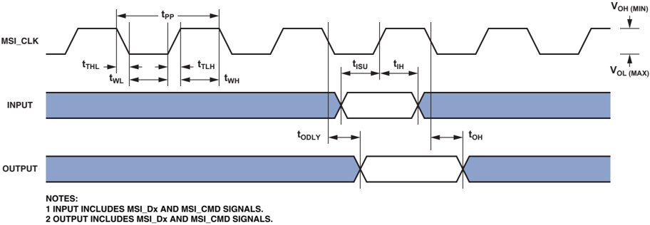

## ADSP-SC582/SC583/SC584/SC587/SC589/ADSP-21583/21584/21587

## Program Trace Macrocell (PTM) Timing

Table 105 and Figure 79 provide I/O timing related to the PTM.

## Table 105. Trace Timing

Figure 79. Trace Timing

| Parameter                 |                                           | Min Max             | Unit   |
|---------------------------|-------------------------------------------|---------------------|--------|
| Switching Characteristics |                                           |                     |        |
| t DTRD                    | Trace Data Delay From Trace Clock Maximum | 0.5 × t SCLK0 + 2   | ns     |
| t HTRD                    | Trace Data Hold From Trace Clock Minimum  | 0.5 × t SCLK0 - 1.2 | ns     |
| t PTRCK                   | Trace Clock Period Minimum                | 2 × t SCLK0 - 1     | ns     |

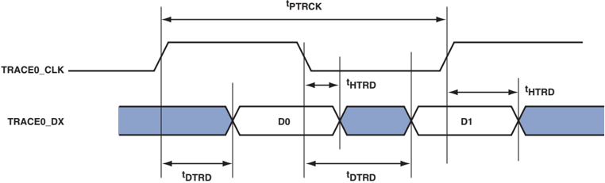

## ADSP-SC582/SC583/SC584/SC587/SC589/ADSP-21583/21584/21587

## Debug Interface (JTAG Emulation Port) Timing

Table 106 and Figure 80 provide I/O timing related to the debug interface (JTAG Emulator Port).

## Table 106. JTAG Emulation Port Timing

| Parameter                 |                                                   |   Min |   Max | Unit   |
|---------------------------|---------------------------------------------------|-------|-------|--------|
| Timing Requirements       | Timing Requirements                               |       |       |        |
| t TCK                     | JTG_TCK Period                                    |    20 |       | ns     |
| t STAP                    | JTG_TDI, JTG_TMS Setup Before JTG_TCK High        |     4 |       | ns     |
| t HTAP                    | JTG_TDI, JTG_TMS Hold After JTG_TCK High          |     4 |       | ns     |
| t SSYS                    | System Inputs Setup Before JTG_TCK High 1         |    12 |       | ns     |
| t HSYS                    | System Inputs Hold After JTG_TCK High 1           |     5 |       | ns     |
| t TRSTW                   | JTG_TRST Pulse Width (measured in JTG_TCK cycles) |     4 |       | T CK   |
| Switching Characteristics | Switching Characteristics                         |       |       |        |
| t DTDO                    | JTG_TDO Delay From JTG_TCK Low                    |       |  13.5 | ns     |
| t DSYS                    | System Outputs Delay After JTG_TCK Low 3          |       |    17 | ns     |

Figure 80. JTAG Port Timing

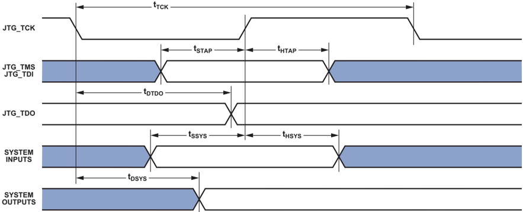

## ADSP-SC582/SC583/SC584/SC587/SC589/ADSP-21583/21584/21587

## OUTPUT DRIVE CURRENTS

Figure 81 through Figure 93 show typical current-voltage characteristics for the output drivers of the ADSP-SC58x and ADSP2158x processors. The curves represent the current drive capability of the output drivers as a function of output voltage.

Output drive currents for PCIe pins are compliant with PCIe Gen1 and Gen2 x1 lane data rate specifications. Output drive currents for MLB pins are compliant with MOST150 LVDS specifications. Output drive currents for USB pins are compliant with the USB 2.0 specifications.

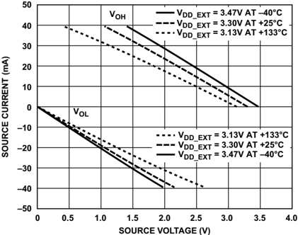

Figure 81. Driver Type A Current (3.3 V V DD\_EXT )

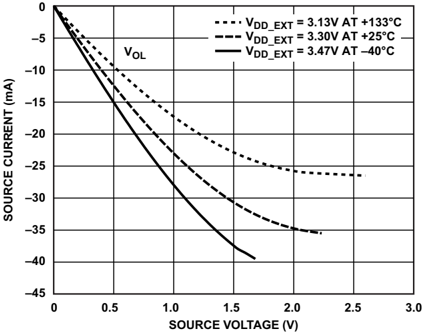

Figure 82. Driver Type D Current (3.3 V V DD\_EXT )

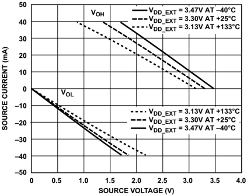

Figure 83. Driver Type H Current (3.3 V V DD\_EXT )

Figure 84. Driver Type B and Driver Type C (DDR3 Drive Strength 40 Ω)

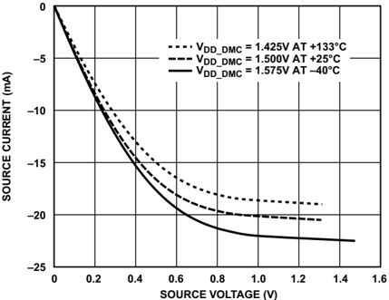

Figure 85. Driver Type B and Driver Type C (DDR3 Drive Strength 60 Ω)

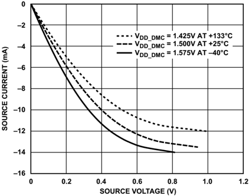

## ADSP-SC582/SC583/SC584/SC587/SC589/ADSP-21583/21584/21587

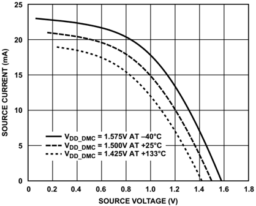

Figure 86. Driver Type B and Driver Type C (DDR3 Drive Strength 40 Ω)

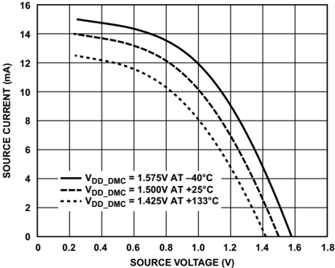

Figure 87. Driver Type B and Driver Type C (DDR3 Drive Strength 60 Ω)

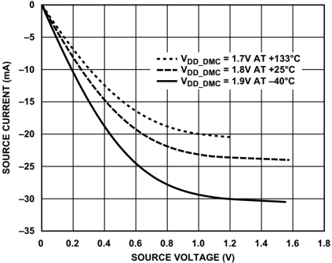

Figure 88. Driver Type B and Driver Type C (DDR2 Drive Strength 40 Ω)

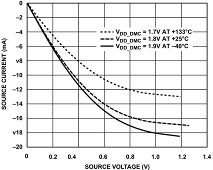

Figure 89. Driver Type B and Driver Type C (DDR2 Drive Strength 60Ω)

Figure 90. Driver Type B and Driver Type C (DDR2 Drive Strength 40Ω)

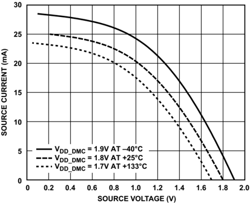

Figure 91. Driver Type B and Driver Type C (DDR2 Drive Strength 60 Ω)

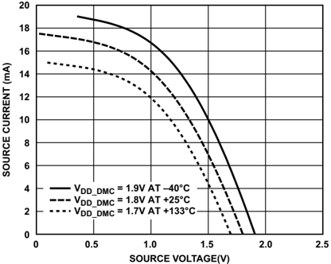

## ADSP-SC582/SC583/SC584/SC587/SC589/ADSP-21583/21584/21587

Figure 92. Driver Type B and Device Driver C (LPDDR)

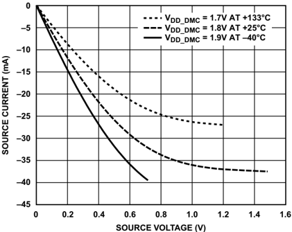

Figure 93. Driver Type B and Device Driver C (LPDDR)

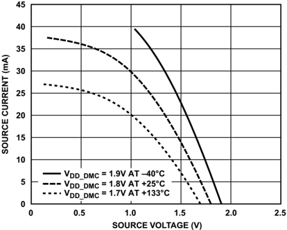

## TEST CONDITIONS

All timing parameters appearing in this data sheet were measured under the conditions described in this section. Figure 94 shows the measurement point for ac measurements (except output enable/disable). The measurement point, VMEAS, is VDD\_EXT/2 for VDD\_EXT (nominal) = 3.3 V.

Figure 94. Voltage Reference Levels for AC Measurements (Except Output Enable/Disable)

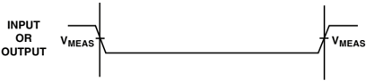

## Output Enable Time Measurement

Output pins are considered enabled when they make a transition from a high impedance state to the point when they start driving.

The output enable time, tENA, is the interval from the point when a reference signal reaches a high or low voltage level to the point when the output starts driving, as shown on the right side of Figure 95. If multiple pins are enabled, the measurement value is that of the first pin to start driving.

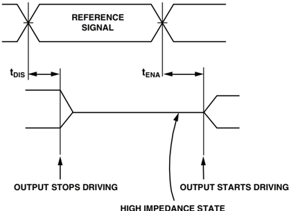

HIGH IMPEDANCE STATE

Figure 95. Output Enable/Disable

## Output Disable Time Measurement

Output pins are considered disabled when they stop driving, enter a high impedance state, and start to decay from the output high or low voltage. The output disable time, tDIS, is the interval from when a reference signal reaches a high or low voltage level to the point when the output stops driving, as shown on the left side of Figure 95.

## Capacitive Loading

Output delays and holds are based on standard capacitive loads of an average of 6 pF on all pins (see Figure 96). VLOAD is equal to VDD\_EXT/2. Figure 97 through Figure 101 show how output rise time varies with capacitance. The delay and hold specifications given must be derated by a factor derived from these figures. The graphs in these figures may not be linear outside the ranges shown.

## ADSP-SC582/SC583/SC584/SC587/SC589/ADSP-21583/21584/21587

## TESTER PIN ELECTRONICS

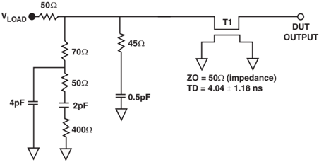

(MEASURED)

## VOL NOTES:

VOH (MEASURED)

V

VTRIP (HIGH)

Δ

-

VOL (MEASURED) +

VTRIP (LOW)

V

Δ

(MEASURED) tDECAY t TRIP VOL (MEASURED) THE WORST CASE TRANSMISSION LINE DELAY IS SHOWN AND CAN BE USED FOR THE OUTPUT TIMING ANALYSIS TO REFLECT THE TRANSMISSION LINE EFFECT AND MUST BE CONSIDERED. THE TRANSMISSION LINE (TD) IS FOR LOAD ONLY AND DOES NOT AFFECT THE DATA SHEET TIMING SPECIFICATIONS.

OUTPUT STARTS DRIVING HIGH IMPEDANCE STATE OUTPUT STOPS DRIVING ANALOG DEVICES RECOMMENDS USING THE IBIS MODEL TIMING FOR A GIVEN SYSTEM REQUIREMENT. IF NECESSARY, A SYSTEM MAY INCORPORATE EXTERNAL DRIVERS TO COMPENSATE FOR ANY TIMING DIFFERENCES.

Figure 96. Equivalent Device Loading for AC Measurements (Includes All Fixtures)

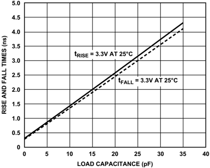

Figure 97. Driver Type A Typical Rise and Fall Times (10% to 90%) vs. Load Capacitance (VDD\_EXT = 3.3 V)

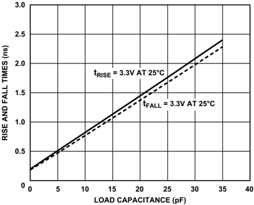

Figure 98. Driver Type H Typical Rise and Fall Times (10% to 90%) vs. Load Capacitance (VDD\_EXT = 3.3 V)

Figure 99. Driver Type B and Driver Type C Typical Rise and Fall Times (10% to 90%) vs. Load Capacitance (VDD\_DMC = 1.8 V) for LPDDR

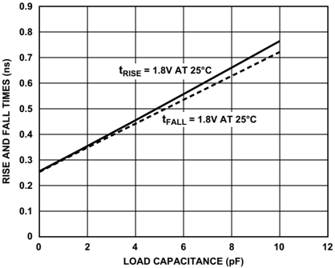

Figure 100. Driver Type B and Driver Type C Typical Rise and Fall Times (10% to 90%) vs. Load Capacitance (VDD\_DMC = 1.8 V) for DDR2

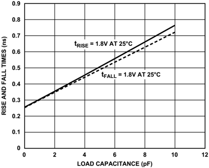

## ADSP-SC582/SC583/SC584/SC587/SC589/ADSP-21583/21584/21587

Figure 101. Driver Type B and Driver Type C Typical Rise and Fall Times (10% to 90%) vs. Load Capacitance (VDD\_DMC = 1.5 V) for DDR3

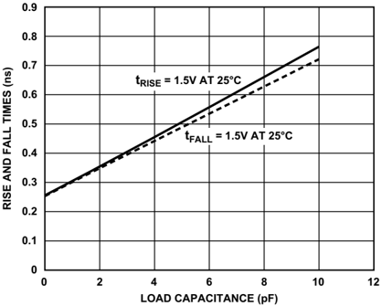

## ENVIRONMENTAL CONDITIONS

The ADSP-SC58x/ADSP-2158x processors are rated for performance over the temperature range specified in the Operating Conditions section.

Application system thermal simulation is required for accurate temperature analysis. The thermal simulation must account for all specific 3D system design features, including, but not limited to other heat sources, use of heat sinks, use of thermal interface materials, and the system enclosure details. Thermal models of the package are available from Analog Devices under the Tools and Simulations tab of the product web page. The thermal model(s) are compatible with all major thermal simulation tools.

The use of JEDEC  JA,  JC, or  JT  thermal parameters for application system thermal estimates is not recommended as indicated in the JEDEC51 specifications:

'This methodology is not meant to and will not predict the performance of a package in an application-specific environment.'

## ADSP-SC582/SC583/SC584/SC587/SC589/ADSP-21583/21584/21587

## ADSP-SC58x/ADSP-2158x 349-BALL BGA BALL ASSIGNMENTS

The ADSP-SC58x/ADSP-2158x 349-Ball BGA Ball Assignments (Numerical by Ball Number) table lists the 349-ball BGA package by ball number.

The ADSP-SC58x/ADSP-2158x 349-Ball BGA Ball Assignments (Alphabetical by Pin Name) table lists the 349-ball BGA package by pin name.

## ADSP-SC58x/ADSP-2158x 349-BALL BGA BALL ASSIGNMENTS (NUMERICAL BY BALL NUMBER)

| Ball No.   | PinName   | Ball No.   | PinName    | Ball No.   | PinName   | Ball No.   | PinName   |
|------------|-----------|------------|------------|------------|-----------|------------|-----------|
| A01        | GND       | B20        | PD_05      | F02        | PC_11     | H17        | VDD_DMC   |
| A02        | DMC0_A06  | B21        | GND        | F03        | DMC0_BA1  | H20        | VDD_INT   |
| A03        | DMC0_A04  | B22        | PD_08      | F06        | VDD_DMC   | H21        | PE_03     |
| A04        | DMC0_RAS  | C01        | DMC0_A10   | F07        | VDD_INT   | H22        | PE_04     |
| A05        | DMC0_CKE  | C02        | DMC0_A09   | F08        | VDD_INT   | J01        | PC_05     |
| A06        | DMC0_DQ15 | C03        | GND        | F09        | VDD_INT   | J02        | PC_06     |
| A07        | DMC0_DQ13 | C04        | DMC0_A08   | F10        | VDD_INT   | J03        | JTG_TDI   |
| A08        | DMC0_UDQS | C05        | DMC0_A03   | F11        | VDD_DMC   | J06        | VDD_DMC   |
| A09        | DMC0_UDQS | C06        | DMC0_CAS   | F12        | VDD_INT   | J09        | GND       |
| A10        | DMC0_DQ09 | C07        | DMC0_BA0   | F13        | VDD_INT   | J10        | GND       |
| A11        | DMC0_VREF | C08        | DMC0_A01   | F14        | VDD_INT   | J11        | GND       |
| A12        | DMC0_CK   | C09        | DMC0_RZQ   | F15        | VDD_INT   | J12        | GND       |
| A13        | DMC0_CK   | C10        | DMC0_WE    | F16        | VDD_INT   | J13        | GND       |
| A14        | DMC0_DQ06 | C11        | DMC0_CS0   | F17        | VDD_INT   | J14        | GND       |
| A15        | DMC0_LDQS | C12        | GND        | F20        | VDD_INT   | J17        | VDD_EXT   |
| A16        | DMC0_LDQS | C13        | DMC0_LDM   | F21        | PD_15     | J20        | VDD_INT   |
| A17        | DMC0_DQ01 | C14        | DMC0_UDM   | F22        | PE_00     | J21        | PE_05     |
| A18        | GND       | C15        | PD_01      | G01        | PC_12     | J22        | PE_06     |
| A19        | PD_00     | C16        | PC_14      | G02        | PC_10     | K01        | PC_03     |
| A20        | PD_03     | C17        | SYS_CLKOUT | G03        | PC_04     | K02        | PC_02     |
| A21        | PD_06     | C18        | PC_15      | G06        | VDD_DMC   | K03        | SYS_FAULT |
| A22        | GND       | C19        | PD_04      | G07        | VDD_DMC   | K06        | VDD_INT   |
| B01        | DMC0_A07  | C20        | GND        | G08        | VDD_DMC   | K08        | GND       |
| B02        | GND       | C21        | PD_07      | G09        | VDD_DMC   | K09        | GND       |
| B03        | DMC0_A02  | C22        | PD_11      | G10        | VDD_DMC   | K10        | GND       |
| B04        | DMC0_A00  | D01        | DMC0_A11   | G11        | VDD_DMC   | K11        | GND       |
| B05        | DMC0_ODT  | D02        | DMC0_A12   | G12        | VDD_DMC   | K12        | GND       |
| B06        | DMC0_DQ14 | D03        | DMC0_BA2   | G13        | VDD_DMC   | K13        | GND       |
| B07        | DMC0_DQ12 | D11        | VDD_INT    | G14        | VDD_DMC   | K14        | GND       |
| B08        | GND       | D12        | VDD_INT    | G15        | VDD_DMC   | K15        | GND       |
| B09        | DMC0_DQ11 | D20        | PD_10      | G16        | VDD_DMC   | K17        | VDD_EXT   |
| B10        | DMC0_DQ10 | D21        | PD_09      | G17        | VDD_DMC   | K20        | VDD_INT   |
| B11        | DMC0_DQ08 | D22        | PD_12      | G20        | VDD_INT   | K21        | PE_08     |
| B12        | DMC0_DQ07 | E01        | DMC0_A14   | G21        | PE_01     | K22        | PE_07     |
| B13        | DMC0_DQ05 | E02        | DMC0_A15   | G22        | PE_02     | L01        | PC_01     |
| B14        | DMC0_DQ04 | E03        | DMC0_A13   | H01        | PC_08     | L02        | SYS_HWRST |
| B15        | DMC0_DQ03 | E05        | DMC0_A05   | H02        | PC_07     | L03        | PC_09     |
| B16        | DMC0_DQ02 | E20        | VDD_INT    | H03        | SYS_FAULT | L04        | VDD_INT   |
| B17        | DMC0_DQ00 | E21        | PD_13      | H06        | VDD_DMC   | L06        | VDD_INT   |
| B18        | PC_13     | E22        | PD_14      | H07        | VDD_DMC   | L08        | GND       |
| B19        | PD_02     | F01        | DMC0_RESET | H16        | GND       | L09        | GND       |

## ADSP-SC582/SC583/SC584/SC587/SC589/ADSP-21583/21584/21587

| Ball No.   | PinName          | Ball No.   | PinName    | Ball No.   | PinName    | Ball No.   | PinName     |
|------------|------------------|------------|------------|------------|------------|------------|-------------|
| L10        | GND              | P03        | JTG_TDO    | U10        | VDD_INT    | AA01       | DAI0_PIN11  |
| L11        | GND              | P06        | VDD_EXT    | U11        | VDD_INT    | AA02       | GND         |
| L12        | GND              | P09        | GND        | U12        | VDD_INT    | AA03       | DAI0_PIN10  |
| L13        | GND              | P10        | GND        | U13        | VDD_INT    | AA04       | DAI0_PIN04  |
| L14        | GND              | P11        | GND        | U14        | VDD_EXT    | AA05       | DAI0_PIN05  |
| L15        | GND              | P12        | GND        | U15        | VDD_EXT    | AA06       | USB0_ID     |
| L17        | VDD_EXT          | P13        | GND        | U16        | VDD_EXT    | AA07       | USB0_VBUS   |
| L19        | VDD_INT          | P14        | GND        | U17        | VDD_EXT    | AA08       | TWI2_SCL    |
| L20        | PE_11            | P17        | VDD_EXT    | U20        | DAI1_PIN20 | AA09       | TWI2_SDA    |
| L21        | PE_10            | P20        | DAI1_PIN01 | U21        | DAI1_PIN11 | AA10       | TWI0_SDA    |
| L22        | PE_09            | P21        | DAI1_PIN05 | U22        | DAI1_PIN19 | AA11       | HADC0_VIN2  |
| M01        | JTG_TRST         | P22        | DAI1_PIN03 | V01        | PB_13      | AA12       | HADC0_VIN5  |
| M02        | JTG_TMS          | R01        | GND        | V02        | PB_12      | AA13       | HADC0_VIN4  |
| M03        | JTG_TCK          | R02        | PB_15      | V03        | DAI0_PIN20 | AA14       | HADC0_VIN7  |
| M04        | VDD_INT          | R03        | PB_14      | V20        | PA_00      | AA15       | PB_05       |
| M06        | VDD_INT          | R06        | VDD_EXT    | V21        | PA_01      | AA16       | PB_02       |
| M08        | GND              | R07        | GND        | V22        | PA_02      | AA17       | PA_14       |
| M09        | GND              | R16        | GND        | W01        | PB_10      | AA18       | PB_03       |
| M10        | GND              | R17        | VDD_EXT    | W02        | PB_11      | AA19       | PA_12       |
| M11        | GND              | R20        | DAI1_PIN08 | W03        | DAI0_PIN19 | AA20       | PA_11       |
| M12        | GND              | R21        | DAI1_PIN07 | W11        | VDD_INT    | AA21       | GND         |
| M13        | GND              | R22        | DAI1_PIN06 | W12        | VDD_INT    | AA22       | PA_09       |
| M14        | GND              | T01        | SYS_XTAL0  | W20        | PA_05      | AB01       | GND         |
| M15        | GND              | T02        | SYS_BMODE2 | W21        | PA_03      | AB02       | DAI0_PIN09  |
| M17        | VDD_EXT          | T03        | DAI0_PIN07 | W22        | PA_04      | AB03       | DAI0_PIN08  |
| M19        | VDD_INT          | T06        | VDD_EXT    | Y01        | PB_09      | AB04       | USB_CLKIN   |
| M20        | PE_13            | T07        | GND        | Y02        | PB_08      | AB05       | USB_XTAL    |
| M21        | PE_15            | T08        | GND        | Y03        | DAI0_PIN12 | AB06       | USB0_DP     |
| M22        | PE_12            | T09        | GND        | Y04        | DAI0_PIN06 | AB07       | USB0_DM     |
| N01        | SYS_XTAL1        | T10        | GND        | Y05        | DAI0_PIN02 | AB08       | TWI1_SCL    |
| N02        | SYS_BMODE0       | T11        | GND        | Y06        | DAI0_PIN03 | AB09       | HADC0_VREFP |
| N03        | PC_00            | T12        | GND        | Y07        | DAI0_PIN01 | AB10       | HADC0_VREFN |
| N06        | VDD_EXT          | T13        | GND        | Y08        | USB0_VBC   | AB11       | HADC0_VIN0  |
| N08        | GND              | T14        | GND        | Y09        | TWI0_SCL   | AB12       | HADC0_VIN1  |
| N09        | GND              | T15        | GND        | Y10        | TWI1_SDA   | AB13       | HADC0_VIN3  |
| N10        | GND              | T16        | GND        | Y11        | VDD_HADC   | AB14       | MLB0_SIGP   |
| N11        | GND              | T17        | VDD_EXT    | Y12        | GND        | AB15       | MLB0_SIGN   |
| N12        | GND              | T20        | DAI1_PIN12 | Y13        | HADC0_VIN6 | AB16       | MLB0_DATP   |
| N13        | GND              | T21        | DAI1_PIN10 | Y14        | PB_06      | AB17       | MLB0_DATN   |
| N14        | GND              | T22        | DAI1_PIN09 | Y15        | PB_00      | AB18       | MLB0_CLKP   |
| N15        | GND              | U01        | SYS_CLKIN0 | Y16        | PB_04      | AB19       | MLB0_CLKN   |
| N17        | VDD_EXT          | U02        | SYS_RESOUT | Y17 Y18    | PB_01      | AB20       | PA_13       |
| N20 N21    | DAI1_PIN04       | U03 U06    | PB_07      |            | PA_10      | AB21       | PA_07       |
|            | DAI1_PIN02       |            | VDD_EXT    | Y19        | PA_15      | AB22       |             |
| N22        |                  | U07        | VDD_EXT    |            | GND        |            | GND         |
| P01 P02    | PE_14 SYS_BMODE1 | U09        | VDD_INT    | Y20 Y22    | PA_08      |            |             |
|            | SYS_CLKIN1       | U08        | VDD_USB    | Y21        | PA_06      |            |             |

## ADSP-SC582/SC583/SC584/SC587/SC589/ADSP-21583/21584/21587

## ADSP-SC58x/ADSP-2158x 349-BALL BGA BALL ASSIGNMENTS (ALPHABETICAL BY PIN NAME)

| PinName           | Ball No.   | PinName    | Ball No.   | PinName   | Ball No.   | PinName     | Ball No.   |
|-------------------|------------|------------|------------|-----------|------------|-------------|------------|
| DAI0_PIN01        | Y07        | DMC0_CAS   | C06        | GND       | J09        | GND         | T07        |
| DAI0_PIN02        | Y05        | DMC0_CK    | A13        | GND       | J10        | GND         | T08        |
| DAI0_PIN03        | Y06        | DMC0_CKE   | A05        | GND       | J11        | GND         | T09        |
| DAI0_PIN04        | AA04       | DMC0_CK    | A12        | GND       | J12        | GND         | T10        |
| DAI0_PIN05        | AA05       | DMC0_CS0   | C11        | GND       | J13        | GND         | T11        |
| DAI0_PIN06        | Y04        | DMC0_DQ00  | B17        | GND       | J14        | GND         | T12        |
| DAI0_PIN07        | T03        | DMC0_DQ01  | A17        | GND       | K08        | GND         | T13        |
| DAI0_PIN08        | AB03       | DMC0_DQ02  | B16        | GND       | K09        | GND         | T14        |
| DAI0_PIN09        | AB02       | DMC0_DQ03  | B15        | GND       | K10        | GND         | T15        |
| DAI0_PIN10        | AA03       | DMC0_DQ04  | B14        | GND       | K11        | GND         | T16        |
| DAI0_PIN11        | AA01       | DMC0_DQ05  | B13        | GND       | K12        | GND         | Y12        |
| DAI0_PIN12        | Y03        | DMC0_DQ06  | A14        | GND       | K13        | GND         | Y20        |
| DAI0_PIN19        | W03        | DMC0_DQ07  | B12        | GND       | K14        | HADC0_VIN0  | AB11       |
| DAI0_PIN20        | V03        | DMC0_DQ08  | B11        | GND       | K15        | HADC0_VIN1  | AB12       |
| DAI1_PIN01        | P20        | DMC0_DQ09  | A10        | GND       | L08        | HADC0_VIN2  | AA11       |
| DAI1_PIN02        | N21        | DMC0_DQ10  | B10        | GND       | L09        | HADC0_VIN3  | AB13       |
| DAI1_PIN03        | P22        | DMC0_DQ11  | B09        | GND       | L10        | HADC0_VIN4  | AA13       |
| DAI1_PIN04        | N20        | DMC0_DQ12  | B07        | GND       | L11        | HADC0_VIN5  | AA12       |
| DAI1_PIN05        | P21        | DMC0_DQ13  | A07        | GND       | L12        | HADC0_VIN6  | Y13        |
| DAI1_PIN06        | R22        | DMC0_DQ14  | B06        | GND       | L13        | HADC0_VIN7  | AA14       |
| DAI1_PIN07        | R21        | DMC0_DQ15  | A06        | GND       | L14        | HADC0_VREFN | AB10       |
| DAI1_PIN08        | R20        | DMC0_LDM   | C13        | GND       | L15        | HADC0_VREFP | AB09       |
| DAI1_PIN09        | T22        | DMC0_LDQS  | A16        | GND       | M08        | JTG_TCK     | M03        |
| DAI1_PIN10        | T21        | DMC0_LDQS  | A15        | GND       | M09        | JTG_TDI     | J03        |
| DAI1_PIN11        | U21        | DMC0_ODT   | B05        | GND       | M10        | JTG_TDO     | P03        |
| DAI1_PIN12        | T20        | DMC0_RAS   | A04        | GND       | M11        | JTG_TMS     | M02        |
| DAI1_PIN19        | U22        | DMC0_RESET | F01        | GND       | M12        | JTG_TRST    | M01        |
| DAI1_PIN20        | U20        | DMC0_RZQ   | C09        | GND       | M13        | MLB0_CLKN   | AB19       |
| DMC0_A00          | B04        | DMC0_UDM   | C14        | GND       | M14        | MLB0_CLKP   | AB18       |
| DMC0_A01          | C08        | DMC0_UDQS  | A09        | GND       | M15        | MLB0_DATN   | AB17       |
| DMC0_A02          | B03        | DMC0_UDQS  | A08        | GND       | N08        | MLB0_DATP   | AB16       |
| DMC0_A03          | C05        | DMC0_VREF  | A11        | GND       | N09        | MLB0_SIGN   | AB15       |
| DMC0_A04          | A03        | DMC0_WE    | C10        | GND       | N10        | MLB0_SIGP   | AB14       |
| DMC0_A05          | E05        | GND        | A01        | GND       | N11        | PA_00       | V20        |
| DMC0_A06          | A02        | GND        | A18        | GND       | N12        | PA_01       | V21        |
| DMC0_A07          | B01        | GND        | A22        | GND       | N13        | PA_02       | V22        |
| DMC0_A08          | C04        | GND        | AA02       | GND       | N14        | PA_03       | W21        |
| DMC0_A09          | C02        | GND        | AA21       | GND       | N15        | PA_04       | W22        |
| DMC0_A10          | C01        | GND        | AB01       | GND       | P09        | PA_05       | W20        |
| DMC0_A11          | D01        | GND        | AB22       | GND       | P10        | PA_06       | Y21        |
| DMC0_A12          | D02        | GND        | B02        | GND       | P11        | PA_07       | AB21       |
| DMC0_A13          | E03        | GND        | B08        | GND       | P12        | PA_08       | Y22        |
| DMC0_A14          | E01        | GND        | B21        | GND       | P13        | PA_09       | AA22       |
| DMC0_A15          | E02        | GND        | C03        | GND       | P14        | PA_10       | Y18        |
| DMC0_BA0          | C07        | GND        | C12        | GND       | R01        | PA_11 PA_12 | AA20 AA19  |
| DMC0_BA1 DMC0_BA2 | F03 D03    | GND GND    | C20 H16    | GND GND   | R07 R16    | PA_13       | AB20       |

## ADSP-SC582/SC583/SC584/SC587/SC589/ADSP-21583/21584/21587

| PinName     | Ball No.   | PinName          | Ball No.   | PinName         | Ball No.   | PinName   | Ball No.   |
|-------------|------------|------------------|------------|-----------------|------------|-----------|------------|
| PA_14       | AA17       | PD_14            | E22        | VDD_DMC         | G09        | VDD_INT   | J20        |
| PA_15       | Y19        | PD_15            | F21        | VDD_DMC         | G10        | VDD_INT   | K06        |
| PB_00       | Y15        | PE_00            | F22        | VDD_DMC         | G11        | VDD_INT   | K20        |
| PB_01       | Y17        | PE_01            | G21        | VDD_DMC         | G12        | VDD_INT   | L04        |
| PB_02       | AA16       | PE_02            | G22        | VDD_DMC         | G13        | VDD_INT   | L06        |
| PB_03       | AA18       | PE_03            | H21        | VDD_DMC         | G14        | VDD_INT   | L19        |
| PB_04       | Y16        | PE_04            | H22        | VDD_DMC         | G15        | VDD_INT   | M04        |
| PB_05       | AA15       | PE_05            | J21        | VDD_DMC         | G16        | VDD_INT   | M06        |
| PB_06       | Y14        | PE_06            | J22        | VDD_DMC         | G17        | VDD_INT   | M19        |
| PB_07       | U03        | PE_07            | K22        | VDD_DMC         | H06        | VDD_INT   | U09        |
| PB_08       | Y02        | PE_08            | K21        | VDD_DMC         | H07        | VDD_INT   | U10        |
| PB_09       | Y01        | PE_09            | L22        | VDD_DMC         | H17        | VDD_INT   | U11        |
| PB_10       | W01        | PE_10            | L21        | VDD_DMC         | J06        | VDD_INT   | U12        |
| PB_11       | W02        | PE_11            | L20        | VDD_EXT         | J17        | VDD_INT   | U13        |
| PB_12       | V02        | PE_12            | M22        | VDD_EXT         | K17        | VDD_INT   | W11        |
| PB_13       | V01        | PE_13            | M20        | VDD_EXT         | L17        | VDD_INT   | W12        |
| PB_14       | R03        | PE_14            | N22        | VDD_EXT         | M17        | VDD_USB   | U08        |
| PB_15       | R02        | PE_15            | M21        | VDD_EXT         | N06        |           |            |
| PC_00       | N03        | SYS_BMODE0       | N02        | VDD_EXT         | N17        |           |            |
| PC_01       | L01        | SYS_BMODE1       | P02        | VDD_EXT         | P06        |           |            |
| PC_02       | K02        | SYS_BMODE2       | T02        | VDD_EXT         | P17        |           |            |
| PC_03       | K01        | SYS_CLKIN0       | U01        | VDD_EXT         | R06        |           |            |
| PC_04       | G03        | SYS_CLKIN1       | P01        | VDD_EXT         | R17        |           |            |
| PC_05       | J01        | SYS_CLKOUT       | C17        | VDD_EXT         | T06        |           |            |
| PC_06       | J02        | SYS_FAULT        | H03        | VDD_EXT         | T17        |           |            |
| PC_07       | H02        | SYS_FAULT        | K03        | VDD_EXT         | U06        |           |            |
| PC_08       | H01        | SYS_HWRST        | L02        | VDD_EXT         | U07        |           |            |
| PC_09       | L03        | SYS_RESOUT       | U02        | VDD_EXT         | U14        |           |            |
| PC_10       | G02        | SYS_XTAL0        | T01 N01    | VDD_EXT         | U15        |           |            |
| PC_11       | F02        | SYS_XTAL1        |            | VDD_EXT         | U16        |           |            |
| PC_12       | G01        | TWI0_SCL         | Y09        | VDD_EXT         | U17        |           |            |
| PC_14       | C16        | TWI1_SCL         | AB08       | VDD_INT         | D11        |           |            |
| PC_15       | C18        | TWI1_SDA         | Y10        | VDD_INT         | D12        |           |            |
|             |            | TWI2_SCL         | AA08       | VDD_INT         |            |           |            |
| PD_00 PD_01 | A19 C15    | TWI2_SDA         | AA09       | VDD_INT         | E20 F07    |           |            |
| PD_02       | B19        | USB0_DM          |            | VDD_INT         | F08        |           |            |
|             |            |                  | AB07       |                 |            |           |            |
| PD_03       | A20        | USB0_DP          | AB06       | VDD_INT         | F09        |           |            |
| PD_05       | B20        | USB0_VBC         | Y08        | VDD_INT         | F12        |           |            |
| PD_06       | A21        | USB0_VBUS        | AA07       |                 |            |           |            |
| PD_07       |            |                  |            | VDD_INT         | F13        |           |            |
|             | C21        | USB_CLKIN        | AB04       | VDD_INT         | F14        |           |            |
| PD_08       | B22        |                  | AB05       | VDD_INT         | F15        |           |            |
| PD_09       | D21        | USB_XTAL VDD_DMC | F06        |                 | F16        |           |            |
| PD_10       | D20        | VDD_DMC          | F11        | VDD_INT VDD_INT | F17        |           |            |
| PD_11       | C22        | VDD_DMC          | G06        | VDD_INT         | F20 G20    |           |            |
| PD_12 PD_13 | D22 E21    | VDD_DMC VDD_DMC  | G07 G08    | VDD_INT VDD_INT | H20        |           |            |

## ADSP-SC582/SC583/SC584/SC587/SC589/ADSP-21583/21584/21587

## CONFIGURATION OF THE 349-BALL CSP\_BGA

Figure 102 shows an overview of signal placement on the 349-ball CSP\_BGA.

TOP VIEW

BOTTOM VIEW

Figure 102. 349-Ball CSP\_BGA Configuration

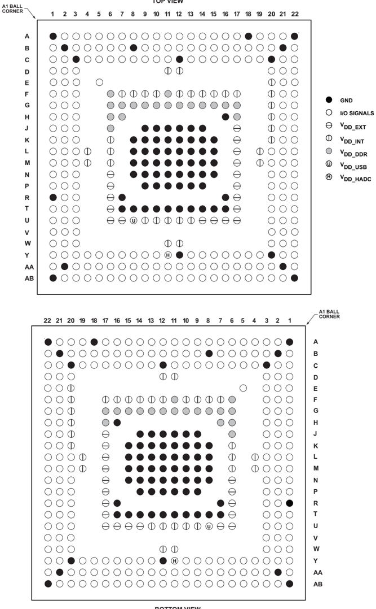

## ADSP-SC582/SC583/SC584/SC587/SC589/ADSP-21583/21584/21587

## ADSP-SC58x/ADSP-2158x 529-BALL BGA BALL ASSIGNMENTS

The ADSP-SC58x/ADSP-2158x 529-Ball BGA Ball Assignments (Numerical by Ball Number) table lists the 529-ball BGA package by ball number.

The ADSP-SC58x/ADSP-2158x 529-Ball BGA Ball Assignments (Alphabetical by Pin Name) table lists the 529-ball BGA package by pin name.

## ADSP-SC58x/ADSP-2158x 529-BALL BGA BALL ASSIGNMENTS (NUMERICAL BY BALL NUMBER)

| Ball No.   | PinName   | Ball No.   | PinName    | Ball No.   | PinName         | Ball No.   | PinName   |
|------------|-----------|------------|------------|------------|-----------------|------------|-----------|
| A01        | GND       | B19        | DMC1_DQ11  | D14        | DMC1_BA2        | F09        | GND       |
| A02        | DMC0_UDQS | B20        | DMC1_DQ12  | D15        | DMC1_CAS        | F10        | VDD_INT   |
| A03        | DMC0_CK   | B21        | DMC1_DQ14  | D16        | DMC1_RAS        | F11        | VDD_INT   |
| A04        | DMC0_CK   | B22        | PD_00      | D17        | DMC1_A09        | F12        | VDD_INT   |
| A05        | DMC0_DQ09 | B23        | PD_04      | D18        | DMC1_A15        | F13        | VDD_INT   |
| A06        | DMC0_LDQS | C01        | DMC0_DQ14  | D19        | DMC1_A10        | F14        | VDD_INT   |
| A07        | DMC0_LDQS | C02        | DMC0_DQ13  | D20        | DMC1_A11        | F15        | VDD_INT   |
| A08        | DMC0_DQ05 | C03        | DMC0_CS0   | D21        | PC_14           | F16        | GND       |
| A09        | DMC0_DQ03 | C04        | DMC0_CKE   | D22        | PD_10           | F17        | VDD_INT   |
| A10        | DMC0_DQ01 | C05        | DMC0_LDM   | D23        | PD_09           | F18        | VDD_INT   |
| A11        | DMC1_DQ03 | C06        | DMC1_RESET | E01        | DMC0_A04        | F19        | VDD_INT   |
| A12        | DMC1_DQ00 | C07        | DMC1_A03   | E02        | DMC0_RAS        | F20        | PE_06     |
| A13        | DMC1_LDQS | C08        | DMC1_A00   | E03        | DMC0_BA1        | F21        | PD_02     |
| A14        | DMC1_LDQS | C09        | DMC1_A01   | E04        | DMC0_WE         | F22        | PD_13     |
| A15        | DMC1_VREF | C10        | DMC1_A04   | E05        | DMC0_RZQ        | F23        | PD_12     |
| A16        | DMC1_CK   | C11        | DMC1_A06   | E06        | GND             | G01        | DMC0_A13  |
| A17        | DMC1_CK   | C12        | DMC1_BA1   | E07        | GND             | G02        | DMC0_A09  |
| A18        | DMC1_DQ09 | C13        | DMC1_ODT   | E08        | GND             | G03        | DMC0_A03  |
| A19        | DMC1_UDQS | C14        | DMC1_CS0   | E09        | GND             | G04        | DMC0_A11  |
| A20        | DMC1_UDQS | C15        | DMC1_LDM   | E10        | VDD_INT         | G05        | VDD_INT   |
| A21        | DMC1_DQ13 | C16        | DMC1_UDM   | E11        | VDD_INT         | G06        | VDD_DMC   |
| A22        | DMC1_DQ15 | C17        | DMC1_A14   | E12        | VDD_INT         | G07        | VDD_DMC   |
| A23        | GND       | C18        | DMC1_A12   | E13        | VDD_INT         | G08        | VDD_DMC   |
| B01        | DMC0_UDQS | C19        | DMC1_A13   | E14        | VDD_INT         | G09        | VDD_DMC   |
| B02        | DMC0_DQ12 | C20        | PC_13      | E15        | VDD_INT         | G10        | VDD_DMC   |
| B03        | DMC0_DQ11 | C21        | PD_01      | E16        | VDD_INT         | G11        | VDD_DMC   |
| B04        | DMC0_DQ10 | C22        | PD_06      | E17        | VDD_INT         | G12        | VDD_DMC   |
| B05        | DMC0_DQ08 | C23        | PD_05      | E18        | VDD_INT         | G13        | VDD_DMC   |
| B06        | DMC0_DQ06 | D01        | DMC0_VREF  | E19        | DMC1_RZQ        | G14        | VDD_DMC   |
| B07        | DMC0_DQ07 | D02        | DMC0_DQ15  | E20        | PC_15           | G15        | VDD_DMC   |
| B08        | DMC0_DQ04 | D03        | DMC0_BA0   | E21        | PD_08           | G16        | VDD_DMC   |
| B09        | DMC0_DQ02 | D04        | DMC0_BA2   | E22        | PD_14           | G17        | VDD_DMC   |
| B10        | DMC0_DQ00 | D05        | DMC0_ODT   | E23        | PD_11           | G18        | VDD_DMC   |
| B11        | DMC1_DQ01 | D06        | DMC0_UDM   | F01        | DMC0_A01        | G19        | VDD_INT   |
| B12        | DMC1_DQ02 | D07        | DMC1_A05   | F02        | DMC0_A06        | G20        | PE_04     |
| B13        | DMC1_DQ04 | D08        | DMC1_WE    | F03        | DMC0_CAS        | G21        | PE_13     |
| B14        | DMC1_DQ05 | D09        | DMC1_A07   | F04        | DMC0_A02        | G22        | PE_01     |
| B15        | DMC1_DQ06 | D10        | DMC1_A02   | F05        | DMC0_A07        | G23        | PE_00     |
| B16        | DMC1_DQ07 | D11        | DMC1_BA0   | F06        | GND             | H01        | DMC0_A14  |
| B17        | DMC1_DQ08 | D12        | DMC1_A08   |            |                 | H02        | DMC0_A12  |
| B18        | DMC1_DQ10 | D13        | DMC1_CKE   | F07 F08    | VDD_INT VDD_INT | H03        | DMC0_A05  |

## ADSP-SC582/SC583/SC584/SC587/SC589/ADSP-21583/21584/21587

| Ball No.   | PinName          | Ball No.   | PinName     | Ball No.   | PinName           | Ball No.   | PinName       |
|------------|------------------|------------|-------------|------------|-------------------|------------|---------------|
| H04        | DMC0_A00         | K05        | VDD_INT     | M06        | VDD_DMC           | P07        | GND           |
| H05        | VDD_INT          | K06        | VDD_DMC     | M07        | GND               | P08        | GND           |
| H06        | VDD_DMC          | K07        | GND         | M08        | GND               | P09        | GND           |
| H07        | VDD_DMC          | K08        | GND         | M09        | GND               | P10        | GND           |
| H08        | VDD_DMC          | K09        | GND         | M10        | GND               | P11        | GND           |
| H09        | VDD_DMC          | K10        | GND         | M11        | GND               | P12        | GND           |
| H10        | VDD_DMC          | K11        | GND         | M12        | GND               | P13        | GND           |
| H11        | VDD_DMC          | K12        | GND         | M13        | GND               | P14        | GND           |
| H12        | VDD_DMC          | K13        | GND         | M14        | GND               | P15        | GND           |
| H13        | VDD_DMC          | K14        | GND         | M15        | GND               | P16        | GND           |
| H14        | VDD_DMC          | K15        | GND         | M16        | GND               | P17        | GND           |
| H15        | VDD_DMC          | K16        | GND         | M17        | GND               | P18        | VDD_EXT       |
| H16        | VDD_DMC          | K17        | GND         | M18        | VDD_EXT           | P19        | PF_10         |
| H17        | VDD_DMC          | K18        | VDD_EXT     | M19        | PE_08             | P20        | PF_08         |
| H18        | VDD_DMC          | K19        | VDD_INT     | M20        | PE_11             | P21        | PF_15         |
| H19        | VDD_INT          | K20        | PD_15       | M21        | PF_03             | P22        | PF_12         |
| H20        | SYS_CLKOUT       | K21        | PF_11       | M22        | PF_00             | P23        | PG_00         |
| H21        | PE_12            | K22        | PF_06       | M23        | PF_02             | R01        | SYS_XTAL1     |
| H22        | PE_05            | K23        | PE_10       | N01        | JTG_TMS           | R02        | SYS_BMODE1    |
| H23        | PE_02            | L01        | PC_04       | N02        | JTG_TRST          | R03        | SYS_BMODE2    |
| J01        | DMC0_A15         | L02        | PC_12       | N03        | SYS_HWRST         | R04        | SYS_BMODE0    |
| J02        | DMC0_A10         | L03        | PC_07       | N04        | PC_03             | R05        | VDD_INT       |
| J03        | DMC0_A08         | L04        | PC_10       | N05        | VDD_INT           | R06        | VDD_EXT       |
| J04        | PC_08            | L05        | VDD_INT     | N06        | VDD_EXT           | R07        | GND           |
| J05        | VDD_INT          | L06        | VDD_DMC     | N07        | GND               | R08        | GND           |
| J06        | VDD_DMC          | L07        | GND         | N08        | GND               | R09        | GND           |
| J07        | GND              | L08        | GND         | N09        | GND               | R10        | GND           |
| J08        | GND              | L09        | GND         | N10        | GND               | R11        | GND           |
| J09        | GND              | L10        | GND         | N11        | GND               | R12        | GND           |
| J10        | GND              | L11        | GND         | N12        | GND               | R13        | GND           |
| J11        | GND              | L12        | GND         | N13        | GND               | R14        | GND           |
| J12        | GND              | L13        | GND         | N14        | GND               | R15        | GND           |
| J13        | GND              | L14        | GND         | N15        | GND               | R16        | GND           |
| J14        | GND              | L15        | GND         | N16        | GND               | R17        | GND           |
| J15        | GND              | L16        | GND         | N17        | GND               | R18        | VDD_EXT       |
| J16        | GND              | L17        | GND         | N18        | VDD_EXT           | R19        | VDD_INT       |
| J17        | GND              | L18        | VDD_EXT     | N19        | VDD_INT           | R20        | PG_01         |
| J18        | VDD_EXT          | L19        | VDD_INT     | N20        | PE_15             | R21        | PG_05         |
| J19        | PD_03            | L20        | PE_03       | N21        | PF_04             | R22        | PG_04         |
| J20        | PD_07            | L21        | PF_09       | N22        | PF_05             | R23        | PF_13         |
| J21        | PF_14            | L22        | PE_09       | N23        | PF_07             | T01        | SYS_CLKIN1    |
| J22        | PF_01            | L23        | PE_14 PC_01 | P01 P02    | JTG_TDO           | T02        | PB_15         |
| J23        | PE_07            | M01        |             | P03        | JTG_TDI           | T03        | GND           |
| K01 K02    | DMC0_RESET PC_11 | M02 M03    | PC_05 PC_02 | P04        | SYS_FAULT JTG_TCK | T04 T05    | PB_14 VDD_INT |
| K03        | PC_06            | M04        | SYS_FAULT   | P05        | VDD_INT           | T06        | VDD_EXT       |
| K04        | PC_09            | M05        | VDD_INT     | P06        | VDD_EXT           | T07        | GND           |

## ADSP-SC582/SC583/SC584/SC587/SC589/ADSP-21583/21584/21587

| Ball No.   | PinName             | Ball No.   | PinName           | Ball No.   | PinName                | Ball No.   | PinName              |
|------------|---------------------|------------|-------------------|------------|------------------------|------------|----------------------|
| T08        | GND                 | V10        | VDD_EXT           | Y12        | HADC0_VIN0             | AB14       | HADC0_VIN3           |
| T09        | GND                 | V11        | VDD_EXT           | Y13        | HADC0_VIN7             | AB15       | RTC0_XTAL            |
| T10        | GND                 | V12        | HADC0_VIN4        | Y14        | GND                    | AB16       | MLB0_SIGN            |
| T11        | GND                 | V13        | VDD_EXT           | Y15        | PB_05                  | AB17       | MLB0_DATN            |
| T12        | GND                 | V14        | VDD_EXT           | Y16        | PA_14                  | AB18       | MLB0_CLKN            |
| T13        | GND                 | V15        | VDD_EXT           | Y17        | PA_13                  | AB19       | PA_15                |
| T14        | GND                 | V16        | VDD_EXT           | Y18        | PA_12                  | AB20       | PA_11                |
| T15        | GND                 | V17        | VDD_EXT           | Y19        | PA_10                  | AB21       | PA_06                |
| T16        | GND                 | V18        | VDD_EXT           | Y20        | PA_00                  | AB22       | PA_04                |
| T17        | GND                 | V19        | VDD_INT           | Y21        | DAI1_PIN14             | AB23       | PA_02                |
| T18        | VDD_EXT             | V20        | DAI1_PIN16        | Y22        | DAI1_PIN17             | AC01       | GND                  |
| T19        | VDD_INT             | V21        | DAI1_PIN06        | Y23        | DAI1_PIN15             | AC02       | PCIE0_RXP            |
| T20        | DAI1_PIN03          |            | DAI1_PIN12        |            |                        | AC03       |                      |
| T21        | PG_03               | V22 V23    | DAI1_PIN09        | AA01 AA02  | PB_08 PB_07            | AC04       | PCIE0_RXM PCIE0_CLKM |
| T22        | PG_02               | W01        | PB_12             | AA03       | DAI0_PIN16             | AC05       | PCIE0_CLKP           |
| T23        | DAI1_PIN01          | W02        | PB_09             | AA04       | DAI0_PIN07             | AC06       | PCIE0_TXP            |
| U01        | SYS_XTAL0           | W03        | DAI0_PIN18        | AA05       | DAI0_PIN06             | AC07       | PCIE0_TXM            |
| U02        | SYS_RESOUT          | W04        | DAI0_PIN11        | AA06       | DAI0_PIN01             | AC08       | USB1_DM              |
| U03        | PC_00               | W05        | VDD_INT           | AA07       | PCIE0_REF              | AC09       | USB1_DP              |
| U04        | DAI0_PIN20          | W06        | VDD_INT           | AA08       | USB1_VBUS              | AC10       | USB0_DP              |
| U05        | VDD_INT             | W07        | VDD_PCIE          | AA09       | USB0_VBUS              | AC11       | USB0_DM              |
| U06        | VDD_EXT             | W08        | VDD_INT           | AA10       | TWI1_SCL               | AC12       | HADC0_VREFP          |
| U07        | GND                 | W09        | VDD_INT           | AA11       | TWI1_SDA               | AC13       | VDD_HADC             |
| U08        | GND                 | W10        | VDD_INT           | AA12       | HADC0_VIN1             | AC14       | GND                  |
| U09        | GND                 | W11        | VDD_INT           | AA13       | HADC0_VIN5             | AC15       | RTC0_CLKIN           |
| U10        | GND                 | W12        | HADC0_VIN6        | AA14       | PB_06                  | AC16       | MLB0_SIGP            |
| U11        | GND                 | W13        | VDD_INT           | AA15       | PB_02                  | AC17       | MLB0_DATP            |
| U12        | GND                 | W14        | VDD_RTC           | AA16       | PB_04                  | AC18       | MLB0_CLKP            |
| U13        | GND                 | W15        | VDD_INT           | AA17       | PB_03                  | AC19       | PB_01                |
| U14        | GND                 | W16        | VDD_INT           | AA18       | PB_00                  | AC20       | PA_07                |
| U15        | GND                 | W17        | VDD_INT           | AA19       | PA_09                  | AC21       | PA_08                |
| U16        | GND                 | W18        | VDD_INT           | AA20       | PA_05                  | AC22       | PA_03                |
| U17        | GND                 | W19        | VDD_INT           | AA21       | PA_01                  | AC23       | GND                  |
| U18        | VDD_EXT             | W20        | DAI1_PIN20        | AA22       | DAI1_PIN19             |            |                      |
| U19        | DAI1_PIN08          | W21        | DAI1_PIN11        | AA23       | DAI1_PIN18             |            |                      |
| U20        | DAI1_PIN07          | W22        | DAI1_PIN10        | AB01       | DAI0_PIN15             |            |                      |
| U21        | DAI1_PIN04          | W23        | DAI1_PIN13        | AB02       | DAI0_PIN14             |            |                      |
| U22        | DAI1_PIN05          | Y01        | PB_11             | AB03       | DAI0_PIN09             |            |                      |
| U23        | DAI1_PIN02          | Y02        | PB_10             | AB04       | DAI0_PIN13             |            |                      |
| V01        | SYS_CLKIN0          | Y03        | DAI0_PIN17        | AB05       | DAI0_PIN04             |            |                      |
| V02        | PB_13               | Y04        | DAI0_PIN08        | AB06       | DAI0_PIN02             |            |                      |
| V03        | DAI0_PIN19          | Y05        | DAI0_PIN05        | AB07       | DAI0_PIN03             |            |                      |
| V04        | DAI0_PIN12          | Y06        | DAI0_PIN10        | AB08       | USB_XTAL               |            |                      |
| V05        | VDD_INT             | Y07        | USB0_ID           | AB09       | USB_CLKIN              |            |                      |
| V06 V07    | VDD_EXT VDD_PCIE_RX | Y08 Y09    | VDD_USB USB0_VBC  | AB10 AB11  | TWI2_SCL TWI0_SDA      |            |                      |
| V08        | VDD_PCIE_TX         | Y10        | TWI0_SCL TWI2_SDA | AB12       | HADC0_VREFN HADC0_VIN2 |            |                      |
| V09        | VDD_EXT             | Y11        |                   | AB13       |                        |            |                      |

## ADSP-SC582/SC583/SC584/SC587/SC589/ADSP-21583/21584/21587

## ADSP-SC58x/ADSP-2158x 529-BALL BGA BALL ASSIGNMENTS (ALPHABETICAL BY PIN NAME)

| PinName    | Ball No.   | PinName    | Ball No.   | PinName    | Ball No.   | PinName   | Ball No.   |
|------------|------------|------------|------------|------------|------------|-----------|------------|
| DAI0_PIN01 | AA06       | DMC0_A06   | F02        | DMC1_A00   | C08        | DMC1_RZQ  | E19        |
| DAI0_PIN02 | AB06       | DMC0_A07   | F05        | DMC1_A01   | C09        | DMC1_UDM  | C16        |
| DAI0_PIN03 | AB07       | DMC0_A08   | J03        | DMC1_A02   | D10        | DMC1_UDQS | A20        |
| DAI0_PIN04 | AB05       | DMC0_A09   | G02        | DMC1_A03   | C07        | DMC1_UDQS | A19        |
| DAI0_PIN05 | Y05        | DMC0_A10   | J02        | DMC1_A04   | C10        | DMC1_VREF | A15        |
| DAI0_PIN06 | AA05       | DMC0_A11   | G04        | DMC1_A05   | D07        | DMC1_WE   | D08        |
| DAI0_PIN07 | AA04       | DMC0_A12   | H02        | DMC1_A06   | C11        | GND       | A01        |
| DAI0_PIN08 | Y04        | DMC0_A13   | G01        | DMC1_A07   | D09        | GND       | A23        |
| DAI0_PIN09 | AB03       | DMC0_A14   | H01        | DMC1_A08   | D12        | GND       | E06        |
| DAI0_PIN10 | Y06        | DMC0_A15   | J01        | DMC1_A09   | D17        | GND       | E07        |
| DAI0_PIN11 | W04        | DMC0_BA0   | D03        | DMC1_A10   | D19        | GND       | E08        |
| DAI0_PIN12 | V04        | DMC0_BA1   | E03        | DMC1_A11   | D20        | GND       | E09        |
| DAI0_PIN13 | AB04       | DMC0_BA2   | D04        | DMC1_A12   | C18        | GND       | F06        |
| DAI0_PIN14 | AB02       | DMC0_CAS   | F03        | DMC1_A13   | C19        | GND       | F09        |
| DAI0_PIN15 | AB01       | DMC0_CK    | A04        | DMC1_A14   | C17        | GND       | F16        |
| DAI0_PIN16 | AA03       | DMC0_CKE   | C04        | DMC1_A15   | D18        | GND       | J07        |
| DAI0_PIN17 | Y03        | DMC0_CK    | A03        | DMC1_BA0   | D11        | GND       | J08        |
| DAI0_PIN18 | W03        | DMC0_CS0   | C03        | DMC1_BA1   | C12        | GND       | J09        |
| DAI0_PIN19 | V03        | DMC0_DQ00  | B10        | DMC1_BA2   | D14        | GND       | J10        |
| DAI0_PIN20 | U04        | DMC0_DQ01  | A10        | DMC1_CAS   | D15        | GND       | J11        |
| DAI1_PIN01 | T23        | DMC0_DQ02  | B09        | DMC1_CK    | A16        | GND       | J12        |
| DAI1_PIN02 | U23        | DMC0_DQ03  | A09        | DMC1_CKE   | D13        | GND       | J13        |
| DAI1_PIN03 | T20        | DMC0_DQ04  | B08        | DMC1_CK    | A17        | GND       | J14        |
| DAI1_PIN04 | U21        | DMC0_DQ05  | A08        | DMC1_CS0   | C14        | GND       | J15        |
| DAI1_PIN05 | U22        | DMC0_DQ06  | B06        | DMC1_DQ00  | A12        | GND       | J16        |
| DAI1_PIN06 | V21        | DMC0_DQ07  | B07        | DMC1_DQ01  | B11        | GND       | J17        |
| DAI1_PIN07 | U20        | DMC0_DQ08  | B05        | DMC1_DQ02  | B12        | GND       | K07        |
| DAI1_PIN08 | U19        | DMC0_DQ09  | A05        | DMC1_DQ03  | A11        | GND       | K08        |
| DAI1_PIN09 | V23        | DMC0_DQ10  | B04        | DMC1_DQ04  | B13        | GND       | K09        |
| DAI1_PIN10 | W22        | DMC0_DQ11  | B03        | DMC1_DQ05  | B14        | GND       | K10        |
| DAI1_PIN11 | W21        | DMC0_DQ12  | B02        | DMC1_DQ06  | B15        | GND       | K11        |
| DAI1_PIN12 | V22        | DMC0_DQ13  | C02        | DMC1_DQ07  | B16        | GND       | K12        |
| DAI1_PIN13 | W23        | DMC0_DQ14  | C01        | DMC1_DQ08  | B17        | GND       | K13        |
| DAI1_PIN14 | Y21        | DMC0_DQ15  | D02        | DMC1_DQ09  | A18        | GND       | K14        |
| DAI1_PIN15 | Y23        | DMC0_LDM   | C05        | DMC1_DQ10  | B18        | GND       | K15        |
| DAI1_PIN16 | V20        | DMC0_LDQS  | A07        | DMC1_DQ11  | B19        | GND       | K16        |
| DAI1_PIN17 | Y22        | DMC0_LDQS  | A06        | DMC1_DQ12  | B20        | GND       | K17        |
| DAI1_PIN18 | AA23       | DMC0_ODT   | D05        | DMC1_DQ13  | A21        | GND       | L07        |
| DAI1_PIN19 | AA22       | DMC0_RAS   | E02        | DMC1_DQ14  | B21        | GND       | L08        |
| DAI1_PIN20 | W20        | DMC0_RESET | K01        | DMC1_DQ15  | A22        | GND       | L09        |
| DMC0_A00   | H04        | DMC0_RZQ   | E05        | DMC1_LDM   | C15        | GND       | L10        |
| DMC0_A01   | F01        | DMC0_UDM   | D06        | DMC1_LDQS  | A13        | GND       | L11        |
| DMC0_A02   | F04        | DMC0_UDQS  | B01        | DMC1_LDQS  |            | GND       |            |
| DMC0_A03   | G03        | DMC0_UDQS  | A02        | DMC1_ODT   | A14 C13    | GND       | L12 L13    |
| DMC0_A04   | E01        | DMC0_VREF  | D01        | DMC1_RAS   | D16        | GND       | L14        |
| DMC0_A05   | H03        | DMC0_WE    | E04        | DMC1_RESET | C06        | GND       | L15        |

## ADSP-SC582/SC583/SC584/SC587/SC589/ADSP-21583/21584/21587

| PinName   | Ball No.   | PinName         | Ball No.   | PinName     | Ball No.   | PinName     | Ball No.   |
|-----------|------------|-----------------|------------|-------------|------------|-------------|------------|
| GND       | L16        | GND             | T08        | PA_02       | AB23       | PC_11       | K02        |
| GND       | L17        | GND             | T09        | PA_03       | AC22       | PC_12       | L02        |
| GND       | M07        | GND             | T10        | PA_04       | AB22       | PC_13       | C20        |
| GND       | M08        | GND             | T11        | PA_05       | AA20       | PC_14       | D21        |
| GND       | M09        | GND             | T12        | PA_06       | AB21       | PC_15       | E20        |
| GND       | M10        | GND             | T13        | PA_07       | AC20       | PD_00       | B22        |
| GND       | M11        | GND             | T14        | PA_08       | AC21       | PD_01       | C21        |
| GND       | M12        | GND             | T15        | PA_09       | AA19       | PD_02       | F21        |
| GND       | M13        | GND             | T16        | PA_10       | Y19        | PD_03       | J19        |
| GND       | M14        | GND             | T17        | PA_11       | AB20       | PD_04       | B23        |
| GND       | M15        | GND             | U07        | PA_12       | Y18        | PD_05       | C23        |
| GND       | M16        | GND             | U08        | PA_13       | Y17        | PD_06       | C22        |
| GND       | M17        | GND             | U09        | PA_14       | Y16        | PD_07       | J20        |
| GND       | N07        | GND             | U10        | PA_15       | AB19       | PD_08       | E21        |
| GND       | N08        | GND             | U11        | PB_00       | AA18       | PD_09       | D23        |
| GND       | N09        | GND             | U12        | PB_01       | AC19       | PD_10       | D22        |
| GND       | N10        | GND             | U13        | PB_02       | AA15       | PD_11       | E23        |
| GND       | N11        | GND             | U14        | PB_03       | AA17       | PD_12       | F23        |
| GND       | N12        | GND             | U15        | PB_04       | AA16       | PD_13       | F22        |
| GND       | N13        | GND             | U16        | PB_05       | Y15        | PD_14       | E22        |
| GND       | N14        | GND             | U17        | PB_06       | AA14       | PD_15       | K20        |
| GND       | N15        | GND             | Y14        | PB_07       | AA02       | PE_00       | G23        |
| GND       | N16        | GND             | AC01       | PB_08       | AA01       | PE_01       | G22        |
| GND       | N17        | GND             | AC14       | PB_09       | W02        | PE_02       | H23        |
| GND       | P07        | GND             | AC23       | PB_10       | Y02        | PE_03       | L20        |
| GND       | P08        | HADC0_VIN0      | Y12        | PB_11       | Y01        | PE_04       | G20        |
| GND       | P09        | HADC0_VIN1      | AA12       | PB_12       | W01        | PE_05       | H22        |
| GND       | P10        | HADC0_VIN2      | AB13       | PB_13       | V02        | PE_06       | F20        |
| GND       | P11        | HADC0_VIN3      | AB14       | PB_14       | T04        | PE_07       | J23        |
| GND       | P12        | HADC0_VIN4      | V12        | PB_15       | T02        | PE_08       | M19        |
| GND       | P13        | HADC0_VIN5      | AA13       | PCIE0_CLKM  | AC04       | PE_09       | L22        |
| GND       | P14        | HADC0_VIN6      | W12        | PCIE0_CLKP  | AC05       | PE_10       | K23        |
| GND       | P15        | HADC0_VIN7      | Y13        | PCIE0_REF   | AA07       | PE_11       | M20        |
| GND       | P16        | HADC0_VREFN     | AB12       | PCIE0_RXM   | AC03       | PE_12       | H21        |
| GND       | P17        | HADC0_VREFP     | AC12       | PCIE0_RXP   | AC02       | PE_13       | G21        |
| GND       | R07        | JTG_TCK         | P04        | PCIE0_TXM   | AC07       | PE_14       | L23        |
| GND       | R08        | JTG_TDI         | P02        | PCIE0_TXP   | AC06       | PE_15       | N20        |
| GND       | R09        | JTG_TDO         | P01        | PC_00       | U03        | PF_00       | M22        |
| GND       | R10        | JTG_TMS         | N01        | PC_01       | M01        | PF_01       | J22        |
| GND       | R11        | JTG_TRST        | N02        | PC_02       | M03        | PF_02       | M23        |
| GND       | R12        | MLB0_CLKN       | AB18       | PC_03       | N04        | PF_03       | M21        |
| GND       | R13        | MLB0_CLKP       | AC18       | PC_04       | L01        | PF_04       | N21        |
| GND       | R14        | MLB0_DATN       | AB17       | PC_05       | M02        | PF_05       | N22        |
| GND       | R15        | MLB0_DATP       | AC17       | PC_06       | K03        | PF_06       | K22        |
| GND       | R16        | MLB0_SIGN       | AB16       | PC_07       | L03        | PF_07       | N23        |
| GND GND   | R17 T03    | MLB0_SIGP PA_00 | AC16 Y20   | PC_08 PC_09 | J04 K04    | PF_08 PF_09 | P20 L21    |
| GND       | T07        | PA_01           | AA21       | PC_10       | L04        | PF_10       | P19        |

## ADSP-SC582/SC583/SC584/SC587/SC589/ADSP-21583/21584/21587

| PinName         | Ball No.   | PinName         | Ball No.   | PinName         | Ball No.   | PinName     | Ball No.   |
|-----------------|------------|-----------------|------------|-----------------|------------|-------------|------------|
| PF_11           | K21        | VDD_DMC         | G13        | VDD_INT         | E10        | VDD_INT     | W16        |
| PF_12           | P22        | VDD_DMC         | G14        | VDD_INT         | E11        | VDD_INT     | W17        |
| PF_13           | R23        | VDD_DMC         | G15        | VDD_INT         | E12        | VDD_INT     | W18        |
| PF_14           | J21        | VDD_DMC         | G16        | VDD_INT         | E13        | VDD_INT     | W19        |
| PF_15           | P21        | VDD_DMC         | G17        | VDD_INT         | E14        | VDD_PCIE    | W07        |
| PG_00           | P23        | VDD_DMC         | G18        | VDD_INT         | E15        | VDD_PCIE_RX | V07        |
| PG_01           | R20        | VDD_DMC         | H06        | VDD_INT         | E16        | VDD_PCIE_TX | V08        |
| PG_02           | T22        | VDD_DMC         | H07        | VDD_INT         | E17        | VDD_RTC     | W14        |
| PG_03           | T21        | VDD_DMC         | H08        | VDD_INT         | E18        | VDD_USB     | Y08        |
| PG_04           | R22        | VDD_DMC         | H09        | VDD_INT         | F07        |             |            |
| PG_05           | R21        | VDD_DMC         | H10        | VDD_INT         | F08        |             |            |
| RTC0_CLKIN      | AC15       | VDD_DMC         | H11        | VDD_INT         | F10        |             |            |
| RTC0_XTAL       | AB15       | VDD_DMC         | H12        | VDD_INT         | F11        |             |            |
| SYS_BMODE0      | R04        | VDD_DMC         | H13        | VDD_INT         | F12        |             |            |
| SYS_BMODE1      | R02        | VDD_DMC         | H14        | VDD_INT         | F13        |             |            |
| SYS_BMODE2      | R03        | VDD_DMC         | H15        | VDD_INT         | F14        |             |            |
| SYS_CLKIN0      | V01        | VDD_DMC         | H16        | VDD_INT         | F15        |             |            |
| SYS_CLKIN1      | T01        | VDD_DMC         | H17        | VDD_INT         | F17        |             |            |
| SYS_CLKOUT      | H20        | VDD_DMC         | H18        | VDD_INT         | F18        |             |            |
| SYS_FAULT       | P03        | VDD_DMC         | J06        | VDD_INT         | F19        |             |            |
| SYS_FAULT       | M04        | VDD_DMC         | K06        | VDD_INT         | G05        |             |            |
| SYS_HWRST       | N03        | VDD_DMC         | L06        | VDD_INT         | G19        |             |            |
| SYS_RESOUT      | U02        | VDD_DMC         | M06        | VDD_INT         | H05        |             |            |
| SYS_XTAL0       | U01        | VDD_EXT         | J18        | VDD_INT         | H19        |             |            |
| SYS_XTAL1       | R01        | VDD_EXT         | K18        | VDD_INT         | J05        |             |            |
| TWI0_SCL        | Y10        | VDD_EXT         | L18        | VDD_INT         | K05        |             |            |
| TWI0_SDA        | AB11       | VDD_EXT         | M18        | VDD_INT         | K19        |             |            |
| TWI1_SCL        | AA10       | VDD_EXT         | N06        | VDD_INT         | L05        |             |            |
| TWI1_SDA        | AA11       | VDD_EXT         | N18        | VDD_INT         | L19        |             |            |
| TWI2_SCL        | AB10       | VDD_EXT         | P06        | VDD_INT         | M05        |             |            |
| TWI2_SDA        | Y11        | VDD_EXT         | P18        | VDD_INT         | N05        |             |            |
| USB0_DM         | AC11       | VDD_EXT         | R06        | VDD_INT         | N19        |             |            |
| USB0_DP         | AC10       | VDD_EXT         | R18        | VDD_INT         | P05        |             |            |
| USB0_ID         | Y07        | VDD_EXT         | T06        | VDD_INT         | R05        |             |            |
| USB0_VBC        | Y09        | VDD_EXT         | T18        | VDD_INT         | R19        |             |            |
| USB0_VBUS       | AA09       | VDD_EXT         | U06        | VDD_INT         | T05        |             |            |
| USB1_DM         | AC08       | VDD_EXT         | U18        | VDD_INT         | T19        |             |            |
| USB1_VBUS       | AA08       | VDD_EXT         | V09        | VDD_INT         | V05        |             |            |
| USB_CLKIN       | AB09       | VDD_EXT         | V10        | VDD_INT         | V19        |             |            |
| USB_XTAL        | AB08       | VDD_EXT         | V11        | VDD_INT         | W05        |             |            |
| VDD_DMC         | G06        | VDD_EXT         | V13        | VDD_INT         | W06        |             |            |
| VDD_DMC         | G07        | VDD_EXT         | V14        | VDD_INT         |            |             |            |
| VDD_DMC         | G08        |                 | V15        |                 | W08        |             |            |
|                 |            | VDD_EXT         | V16        | VDD_INT         | W09        |             |            |
| VDD_DMC VDD_DMC | G09 G10    | VDD_EXT VDD_EXT | V17        | VDD_INT VDD_INT | W10 W11    |             |            |
| VDD_DMC         | G11        | VDD_EXT         | V18        | VDD_INT         | W13        |             |            |
| VDD_DMC         | G12        | VDD_HADC        | AC13       | VDD_INT         | W15        |             |            |

## ADSP-SC582/SC583/SC584/SC587/SC589/ADSP-21583/21584/21587

## CONFIGURATION OF THE 529-BALL CSP\_BGA

Figure 103 shows an overview of signal placement on the 529-ball CSP\_BGA.

TOP VIEW

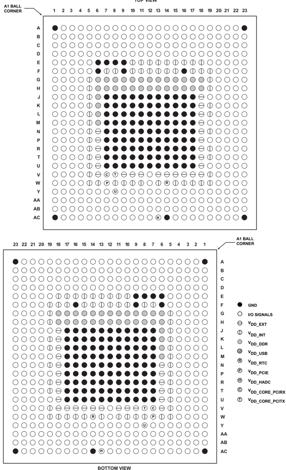

BOTTOM VIEW

Figure 103. 529-Ball CSP\_BGA Configuration

## ADSP-SC582/SC583/SC584/SC587/SC589/ADSP-21583/21584/21587

## OUTLINE DIMENSIONS

Dimensions for the 19 mm × 19 mm 349-ball CSP\_BGA package in Figure 104 are shown in millimeters.

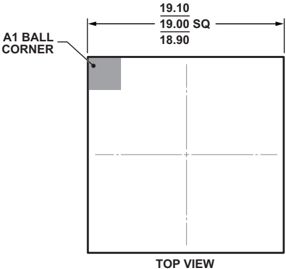

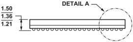

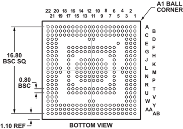

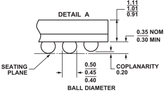

Figure 104. 349-Ball Chip Scale Package Ball Grid Array [CSP\_BGA]

(BC-349-1) Dimensions shown in millimeters COMPLIANT TO JEDEC STANDARDS MO-275-PPAB-2.

## ADSP-SC582/SC583/SC584/SC587/SC589/ADSP-21583/21584/21587

Dimensions for the 19 mm × 19 mm 529-ball CSP\_BGA package in Figure 105 are shown in millimeters.

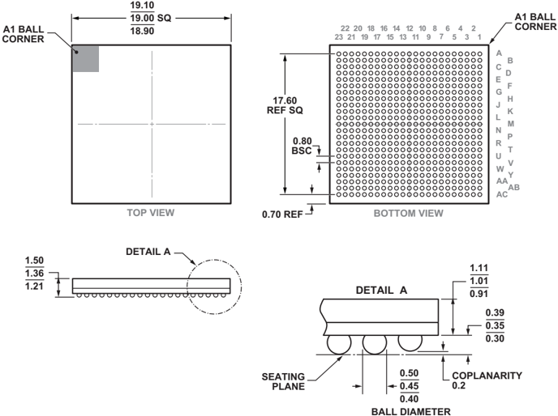

COMPLIANT TO JEDEC STANDARDS MO-275-RRAB-2.

Figure 105. 529-Ball Chip Scale Package Ball Grid Array [CSP\_BGA]

(BC-529-1) Dimensions shown in millimeters

## SURFACE-MOUNT DESIGN

Table 107 is an aid for PCB design. For industry-standard design recommendations, refer to IPC-7351, Generic Requirements for SurfaceMount Design and Land Pattern Standard .

Table 107. CSP\_BGA Data for Use with Surface-Mount Design

| Package   | Package Ball Attach Type   | Package Solder Mask Opening   | Package Ball Pad Size   |
|-----------|----------------------------|-------------------------------|-------------------------|
| BC-349-1  | Solder Mask Defined        | 0.4 mmDiameter                | 0.5 mmDiameter          |
| BC-529-1  | Solder Mask Defined        | 0.4 mmDiameter                | 0.5 mmDiameter          |

## ADSP-SC582/SC583/SC584/SC587/SC589/ADSP-21583/21584/21587

## AUTOMOTIVE PRODUCTS

The following models are available with controlled manufacturing to support the quality and reliability requirements of automotive applications. Note that these automotive models may have specifications that differ from the nonautomotive models; therefore designers should review the Specifications section of this data sheet carefully. Only the automotive grade

Table 108. Automotive Products

| Model 1, 2       | Processor Instruction Rate (Max)   | Temperature Range 3   | Arm Cores 4   |   SHARC+ Cores | SHARC+ SRAM   | PCIe Lanes 4   | Package Description   | Package Option   |
|------------------|------------------------------------|-----------------------|---------------|----------------|---------------|----------------|-----------------------|------------------|
| AD21583WCBCZ4Axx | 450 MHz                            | -40°C to +133°C       | N/A           |              2 | 384 kB        | N/A            | 349-Ball cspBGA       | BC-349-1         |
| AD21584WCBCZ4Axx | 450 MHz                            | -40°C to +133°C       | N/A           |              2 | 640 kB        | N/A            | 349-Ball cspBGA       | BC-349-1         |
| AD21584WCBCZ5Axx | 500 MHz                            | -40°C to +133°C       | N/A           |              2 | 640 kB        | N/A            | 349-Ball cspBGA       | BC-349-1         |
| ADSC582WCBCZ4Axx | 450 MHz                            | -40°C to +133°C       | 1             |              1 | 640 kB        | N/A            | 349-Ball cspBGA       | BC-349-1         |
| ADSC583WCBCZ3Axx | 300 MHz                            | -40°C to +133°C       | 1             |              2 | 384 kB        | N/A            | 349-Ball cspBGA       | BC-349-1         |
| ADSC583WCBCZ4Axx | 450 MHz                            | -40°C to +133°C       | 1             |              2 | 384 kB        | N/A            | 349-Ball cspBGA       | BC-349-1         |
| ADSC584WCBCZ3Axx | 300 MHz                            | -40°C to +133°C       | 1             |              2 | 640 kB        | N/A            | 349-Ball cspBGA       | BC-349-1         |
| ADSC584WCBCZ4Axx | 450 MHz                            | -40°C to +133°C       | 1             |              2 | 640 kB        | N/A            | 349-Ball cspBGA       | BC-349-1         |
| ADSC584WCBCZ5Axx | 500 MHz                            | -40°C to +133°C       | 1             |              2 | 640 kB        | N/A            | 349-Ball cspBGA       | BC-349-1         |
| ADSC587WCBCZ4Bxx | 450 MHz                            | -40°C to +133°C       | 1             |              2 | 640 kB        | N/A            | 529-Ball cspBGA       | BC-529-1         |
| ADSC587WBBCZ5Bxx | 500 MHz                            | -40°C to +133°C       | 1             |              2 | 640 kB        | N/A            | 529-Ball cspBGA       | BC-529-1         |

products shown in Table 108 are available for use in automotive applications. Contact your local Analog Devices account representative for specific product ordering information and to obtain the specific Automotive Reliability reports for these models.

## ADSP-SC582/SC583/SC584/SC587/SC589/ADSP-21583/21584/21587

## ORDERING GUIDE

| Model 1           | Processor Instruction Rate (Max)   | Temperature Range 2   | Arm Cores 3   |   SHARC+ Cores | SHARC+ SRAM   | PCIe Lanes 3   | Package Description   | Package Option   |
|-------------------|------------------------------------|-----------------------|---------------|----------------|---------------|----------------|-----------------------|------------------|
| ADSP-21583KBCZ-4A | 450 MHz                            | 0°C to 100°C          | N/A           |              2 | 384 kB        | N/A            | 349-Ball cspBGA       | BC-349-1         |
| ADSP-21583BBCZ-4A | 450 MHz                            | -40°C to +110°C       | N/A           |              2 | 384 kB        | N/A            | 349-Ball cspBGA       | BC-349-1         |
| ADSP-21583CBCZ-4A | 450 MHz                            | -40°C to +125°C       | N/A           |              2 | 384 kB        | N/A            | 349-Ball cspBGA       | BC-349-1         |
| ADSP-21584KBCZ-4A | 450 MHz                            | 0°C to 100°C          | N/A           |              2 | 640 kB        | N/A            | 349-Ball cspBGA       | BC-349-1         |
| ADSP-21584KBCZ-5A | 500 MHz                            | 0°C to 105°C          | N/A           |              2 | 640 kB        | N/A            | 349-Ball cspBGA       | BC-349-1         |
| ADSP-21584BBCZ-4A | 450 MHz                            | -40°C to +110°C       | N/A           |              2 | 640 kB        | N/A            | 349-Ball cspBGA       | BC-349-1         |
| ADSP-21584BBCZ-5A | 500 MHz                            | -40°C to +120°C       | N/A           |              2 | 640 kB        | N/A            | 349-Ball cspBGA       | BC-349-1         |
| ADSP-21584CBCZ-4A | 450 MHz                            | -40°C to +125°C       | N/A           |              2 | 640 kB        | N/A            | 349-Ball cspBGA       | BC-349-1         |
| ADSP-21584CBCZ-5A | 500 MHz                            | -40°C to +125°C       | N/A           |              2 | 640 kB        | N/A            | 349-Ball cspBGA       | BC-349-1         |
| ADSP-21587KBCZ-4B | 450 MHz                            | 0°C to 110°C          | N/A           |              2 | 640 kB        | N/A            | 529-Ball cspBGA       | BC-529-1         |
| ADSP-21587KBCZ-5B | 500 MHz                            | 0°C to 115°C          | N/A           |              2 | 640 kB        | N/A            | 529-Ball cspBGA       | BC-529-1         |
| ADSP-21587BBCZ-4B | 450 MHz                            | -40°C to +125°C       | N/A           |              2 | 640 kB        | N/A            | 529-Ball cspBGA       | BC-529-1         |
| ADSP-21587BBCZ-5B | 500 MHz                            | -40°C to +125°C       | N/A           |              2 | 640 kB        | N/A            | 529-Ball cspBGA       | BC-529-1         |
| ADSP-SC582KBCZ-4A | 450 MHz                            | 0°C to 100°C          | 1             |              1 | 640 kB        | N/A            | 349-Ball cspBGA       | BC-349-1         |
| ADSP-SC582BBCZ-4A | 450 MHz                            | -40°C to +110°C       | 1             |              1 | 640 kB        | N/A            | 349-Ball cspBGA       | BC-349-1         |
| ADSP-SC582CBCZ-4A | 450 MHz                            | -40°C to +125°C       | 1             |              1 | 640 kB        | N/A            | 349-Ball cspBGA       | BC-349-1         |
| ADSP-SC583KBCZ-3A | 300 MHz                            | 0°C to 100°C          | 1             |              2 | 384 kB        | N/A            | 349-Ball cspBGA       | BC-349-1         |
| ADSP-SC583BBCZ-3A | 300 MHz                            | -40°C to +110°C       | 1             |              2 | 384 kB        | N/A            | 349-Ball cspBGA       | BC-349-1         |
| ADSP-SC583CBCZ-3A | 300 MHz                            | -40°C to +125°C       | 1             |              2 | 384 kB        | N/A            | 349-Ball cspBGA       | BC-349-1         |
| ADSP-SC583KBCZ-4A | 450 MHz                            | 0°C to 100°C          | 1             |              2 | 384 kB        | N/A            | 349-Ball cspBGA       | BC-349-1         |
| ADSP-SC583BBCZ-4A | 450 MHz                            | -40°C to +110°C       | 1             |              2 | 384 kB        | N/A            | 349-Ball cspBGA       | BC-349-1         |
| ADSP-SC583CBCZ-4A | 450 MHz                            | -40°C to +125°C       | 1             |              2 | 384 kB        | N/A            | 349-Ball cspBGA       | BC-349-1         |
| ADSP-SC584KBCZ-3A | 300 MHz                            | 0°C to 100°C          | 1             |              2 | 640 kB        | N/A            | 349-Ball cspBGA       | BC-349-1         |
| ADSP-SC584BBCZ-3A | 300 MHz                            | -40°C to +110°C       | 1             |              2 | 640 kB        | N/A            | 349-Ball cspBGA       | BC-349-1         |
| ADSP-SC584CBCZ-3A | 300 MHz                            | -40°C to +125°C       | 1             |              2 | 640 kB        | N/A            | 349-Ball cspBGA       | BC-349-1         |
| ADSP-SC584KBCZ-4A | 450 MHz                            | 0°C to 100°C          | 1             |              2 | 640 kB        | N/A            | 349-Ball cspBGA       | BC-349-1         |
| ADSP-SC584KBCZ-5A | 500 MHz                            | 0°C to 105°C          | 1             |              2 | 640 kB        | N/A            | 349-Ball cspBGA       | BC-349-1         |
| ADSP-SC584BBCZ-4A | 450 MHz                            | -40°C to +110°C       | 1             |              2 | 640 kB        | N/A            | 349-Ball cspBGA       | BC-349-1         |
| ADSP-SC584BBCZ-5A | 500 MHz                            | -40°C to +120°C       | 1             |              2 | 640 kB        | N/A            | 349-Ball cspBGA       | BC-349-1         |
| ADSP-SC584CBCZ-4A | 450 MHz                            | -40°C to +125°C       | 1             |              2 | 640 kB        | N/A            | 349-Ball cspBGA       | BC-349-1         |
| ADSP-SC584CBCZ-5A | 500 MHz                            | -40°C to +125°C       | 1             |              2 | 640 kB        | N/A            | 349-Ball cspBGA       | BC-349-1         |
| ADSP-SC587KBCZ-4B | 450 MHz                            | 0°C to 110°C          | 1             |              2 | 640 kB        | N/A            | 529-Ball cspBGA       | BC-529-1         |
| ADSP-SC587KBCZ-5B | 500 MHz                            | 0°C to 115°C          | 1             |              2 | 640 kB        | N/A            | 529-Ball cspBGA       | BC-529-1         |
| ADSP-SC587BBCZ-4B | 450 MHz                            | -40°C to +125°C       | 1             |              2 | 640 kB        | N/A            | 529-Ball cspBGA       | BC-529-1         |
| ADSP-SC587BBCZ-5B | 500 MHz                            | -40°C to +125°C       | 1             |              2 | 640 kB        | N/A            | 529-Ball cspBGA       | BC-529-1         |
| ADSP-SC589KBCZ-4B | 450 MHz                            | 0°C to 110°C          | 1             |              2 | 640 kB        | 1              | 529-Ball cspBGA       | BC-529-1         |
| ADSP-SC589KBCZ-5B | 500 MHz                            | 0°C to 115°C          | 1             |              2 | 640 kB        | 1              | 529-Ball cspBGA       | BC-529-1         |
| ADSP-SC589BBCZ-4B | 450 MHz                            | -40°C to +125°C       | 1             |              2 | 640 kB        | 1              | 529-Ball cspBGA       | BC-529-1         |
|                   | 500 MHz                            | -40°C to +125°C       | 1             |              2 |               | 1              | 529-Ball cspBGA       | BC-529-1         |
| ADSP-SC589BBCZ-5B |                                    |                       |               |                | 640 kB        |                |                       |                  |

I 2 C refers to a communications protocol originally developed by Philips Semiconductors (now NXP Semiconductors).

© 2023  Analog  Devices,  Inc.  All  rights  reserved.  Trademarks  and registered trademarks are the property of their respective owners. D13317-6/23(C)

