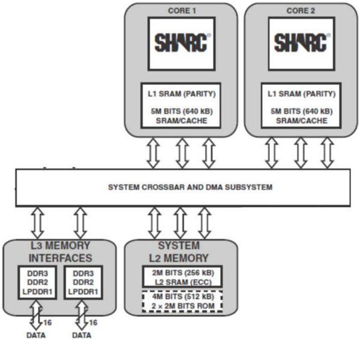
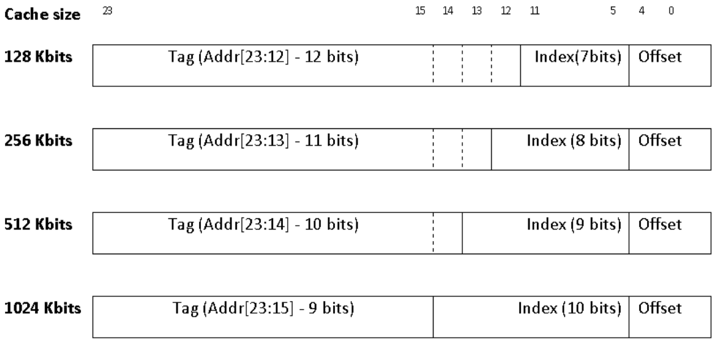
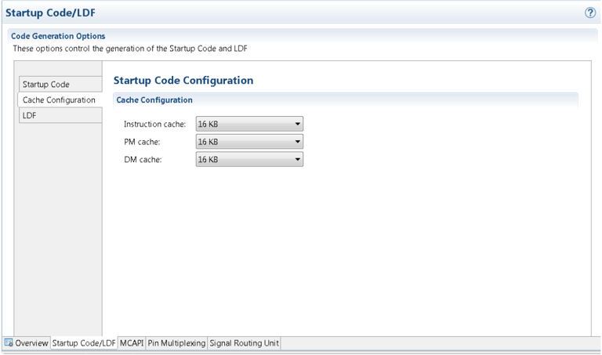

## Engineer-to-Engineer Note


EE-400

Technical notes on using Analog Devices products and development tools Visit  our  Web  resources  http://www.analog.com/ee-notes  and  http://www.analog.com/processors  or e-mail processor.support@analog.com or processor.tools.support@analog.com for technical support.

## Using Cache on ADSP-SC5xx/ADSP-215xx SHARC+  ®  Processors

Contributed by Nithya Kocherlakota and Mahesh Natarajan

## Introduction

This application note discusses cache memory management for the Analog Devices SHARC+ ® processor family, which is comprised of the ADSP-SC58x/ADSP-2158x and ADSP-SC57x/ADSP-2157x products. It describes the SHARC+ L1 cache architecture/organization and provides guidelines for managing cache memory, including:

- Cache configuration
- A usage model
- Coherency
- Optimization techniques




This EE-note assumes that the reader is familiar with basic cache terminology.

## Cache Memory in SHARC+ Processors

The  SHARC+  family  of  processors  support  code  and  data  storage  in  on-chip  and  external  memories. Maximum performance from the  SHARC+ core  is  achieved  when  the  code  and  data  are  fetched  from single-cycle access L1 memory; however, multi-cycle access L2 and L3 memories must be leveraged in most applications to accommodate the full application. For example, audio processing algorithms can be huge and must be stored externally.

In  the  previous  generation  SHARC  cores,  background  DMA  code  and  data  overlays  were  used  to maximize core performance. Managing these overlays became difficult because the overlays needed to be rewritten to accommodate each generation or variant of the processors. Reasons for the difficulty include:

- Changes in the memory maps (due to changes in physical memory)
- Change in the memory interface affecting latency or throughput
- Added, deleted, or modified software modules

The  addition  of  the  on-chip  data  and  instruction  caches  (data  cache  and  I-cache,  respectively)  to  the SHARC+  core  eliminates  the  need  for  overlay-based  data  and  code  management.  It  enables  high-

Copyright 2017, Analog Devices, Inc. All rights reserved. Analog Devices assumes no responsibility for customer product design or the use or application of customers' products  or  for  any  infringements  of  patents  or  rights  of  others  which  may  result  from  Analog  Devices  assistance.  All  trademarks  and  logos  are  property  of  their respective  holders.  Information  furnished  by  Analog  Devices  applications  and  development  tools  engineers  is  believed  to  be  accurate  and  reliable,  however  no responsibility  is  assumed  by  Analog  Devices  regarding  technical  accuracy  and  topicality  of  the  content  provided  in  Analog  Devices  Engineer-to-Engineer  Notes.

Rev 1 - September 22, 2017


performance code execution and reduces the demand on the DDR interface providing better utilization through the use of burst accesses.

Cache  memory  can  provide  code  and  data  at  the  core  clock  rate  of  the  processor  while  automatically managing the data movement to and from the slower off-chip memory. To achieve the best performance, critical code and data must be kept in L1 memory, whereas lesser used instructions and data can be kept in slower, external memories.

A  major  difference  between  the  previous  SHARC  processor  memory  model  without  cache  and  the SHARC+ memory model with cache is the way the memory hierarchy is managed. Without cache, the programmer manages the hierarchy by bringing the required code and data into L1 memory when needed, using  an  overlay  approach.  In  contrast,  in  a  cache-based  system,  the  cache  controller  manages  the hierarchy. Since the cache controller simplifies managing the memory hierarchy, system development time is greatly reduced. This is especially true in large systems where it is difficult to program the flow using an overlay  approach;  thus,  the  addition  of  cache  memory  provides  an  advantage  in  terms  of  faster development time and simplified data management.

## Cache Organization in the SHARC+ Core

The L1 cache memories coexist with on-chip L1 SRAM and use the same physical space. When the cache is  enabled,  part  of  L1  SRAM space is used for  cache  (upper  portion)  and  is  not  accessible  to  the  user. Since the on-chip L1 SRAM effectively has single-cycle read/write latencies, the cache controller stores only L2- and L3-based code and data.




L3 memory includes DMC0 and DMC1, asynchronous memory banks, PCIe data, and SPI flash memory space, as applicable for each processor variant.

Figure 1 shows the memory subsystem in ADSP-SC58x processor.



Figure 1: ADSP-SC58x Processor Memory Subsystem




The SHARC+ instruction and data caches discussed in this EE-note are separate from (and in addition to) the SHARC and SHARC+ instruction conflict cache, which reduces the latency of instruction accesses when conflicting with a simultaneous data access over the PM bus.

In the dual-core ADSP-SC58x processors, each SHARC+ core has L1 SRAM of up to 5Mb and its own L1 cache. Each SHARC+ core L1 cache can be configured independently. There are two data caches (DM and PM cache) and one I-cache per SHARC+ core. The L1 cache of the SHARC+ core has a bus-based architecture. The data cache attached to L1 block 1 caches all the external memory access requests coming over the DM bus (DM cache). Similarly, the data cache attached to L1 block 2 caches all external memory data  access  requests  coming  over  the  PM  bus  (PM  cache).  The  I-cache  is  attached  to  L1  block  3.  The SHARC+ core supports two caching modes:

- Instruction cache mode - only the I-cache is enabled
- Data cache mode - I-cache, DM cache, and PM cache are all enabled

## SHARC+ L1 Cache Parameters

The L1 cache has parameters for configuring block size, line  size,  and  write  and  replacement  policies. Table 1 describes the L1 cache parameters.


Table 1: L1 Cache Data Operations for Instruction and Data Cache

| Parameter          | Description                                                                                 |
|--------------------|---------------------------------------------------------------------------------------------|
| Block Size         | Configurable - 128, 256, 512, or 1024 Kbits                                                 |
| Associativity      | Two-way set associative                                                                     |
| Line size          | 512 bits                                                                                    |
| Write policy       | I-Cache - N/A                                                                               |
| Write policy       | Data cache : Write allocate - Write back (Default policy) No write allocate - Write through |
| Replacement policy | LRU based                                                                                   |

In addition to the parameters shown in Table 1, L1-cache also supports:

- Full-cache and address range-based locking, write-back and invalidation
- Range-based non-cacheable and write through
- Way-based locking
- DM-PM cache coherency




Ensure that the cache size is not configured to be larger than the block size.

## Cache Operation and Address Decomposition

Understanding  the  cache  address  decomposition  helps  to  optimize  the  cache  efficiency  in  small applications. Cache index conflicts can be avoided, thus reducing the cache line eviction rate; however, this static analysis alone does not increase the cache efficiency and must not be considered in isolation. The efficiency also depends on other factors, including code execution sequence, cache size, etc.

## Data Cache Address Decomposition

The 32-bit address ( Addr[31:0] )  of  an  incoming  data  cache  access  is  comprised  of  a  concatenation  of three fields: Tag , Index and Offset , as shown in Figure 2.

Figure 2 : Address Decomposition for Data Cache Accesses

| Cache size   | 31                          | 16151413        |                 |                 | 12              | 5 0    |
|--------------|-----------------------------|-----------------|-----------------|-----------------|-----------------|--------|
| 128 Kbits    | Tag (Addr[31:13]- 19 bits)  |                 |                 | Index(7bits)    | Index(7bits)    | Offset |
| 256 Kbits    | Tag (Addr[31:14] - 18 bits) |                 | Index (8 bits)  | Index (8 bits)  | Index (8 bits)  | Offset |
| 512 Kbits    | Tag (Addr[31:15] - 17 bits) |                 | Index (9 bits)  | Index (9 bits)  | Index (9 bits)  | Offset |
| 1024 Kbits   | Tag (Addr[31:16] - 16 bits) | Index (10 bits) | Index (10 bits) | Index (10 bits) | Index (10 bits) | Offset |


The Offset field identifies a unique byte in the cache line. The data cache line size is fixed at 64 bytes, so a 6-bit Offset field is required to properly encode the location of any individual byte within the line, and it resides in Addr[5:0] .

The Tag and Index fields span the remaining 26 bits in the address ( Addr[31:6] ), but their widths are a function of the configured cache size. Specifically, the Index field identifies a unique set within a way in the cache, and larger cache memory sizes have more sets; thus, more bits are needed to properly encode them. Consider a cache size of 128 Kbits (16 Kbytes). With 64-byte data cache lines, 256 (16 K/64) cache lines are required to span the entirety of the cache. Because the data cache is two-way set-associative, there are 128 (256/2) sets per way in the cache, which means the Index field in this case is 7-bit to access an individual set, and that field resides at Addr[12:6] , thus leaving the remaining 19 bits ( Addr[31:13] ) for the Tag field, where an address match to this field determines a cache hit or miss.

## I-Cache Address Decomposition

The same concepts apply also to the I-cache, but instructions have 24-bit addressing, as shown in Figure 3.

Figure 3 : Address Decomposition for Instruction Cache Accesses



| Cache size   | 23                          |                 | 151413          | 12              | 11              | 5               | 4      |
|--------------|-----------------------------|-----------------|-----------------|-----------------|-----------------|-----------------|--------|
| 128 Kbits    | Tag (Addr[23:12] - 12 bits) | I 1             | I I I           | 1 =             | Index(7bits)    | Index(7bits)    | Offset |
| 256 Kbits    | Tag (Addr[23:13] - 11 bits) | 1 I             |                 | Index (8 bits)( | Index (8 bits)( | Index (8 bits)( | Offset |
| 512 Kbits    | Tag (Addr[23:14] - 10 bits) | 1               |                 | Index (9 bits)  | Index (9 bits)  | Index (9 bits)  | Offset |
| 1024 Kbits   | Tag (Addr[23:15] - 9 bits)  | Index (10 bits) | Index (10 bits) | Index (10 bits) | Index (10 bits) | Index (10 bits) | Offset |

While data memory is byte-addressable, the minimum instruction width is 16 bits (VISA instructions); therefore, the step size required to identify a single instruction within a cache line is two bytes. Since the Icache line is also 64 bytes in length, 32 locations within each line must be accessible, thus requiring a 5-bit Offset field  ( Addr[4:0] )  for  all  cache  sizes.  The Index and Tag fields  span  the  remaining  19  bits ( Addr[23:5] ) and are defined as discussed in the Data Cache Address Decomposition section.

In small applications, code and data placement in external memory can be done in a way that avoids the Index conflict of two frequently used code/data sections. For more details on the functional description and operation of the cache controller, refer to the L1 Cache Controller chapter of  the SHARC+ ®  Core Programming Reference [1] manual .

## Additional SHARC+ L1 Cache Features

The SHARC+ L1 cache has additional features that can be used to manage the cache, including  range register configuration, locking, invalidation and write through accesses.

## Configurable Range Registers

The L1 cache controller contains eight range register pairs (RR7:0) to specify ranges for non-cacheability, write-through, write policy selection, locking and range-based invalidation/write-back invalidation. Each range register pair consists of a start address register and an end address register, which can be configured after  setting  the  functionality  of  the  pair  in  the  SHL1C\_CFG2 register.  Figure 4  shows  the  functions supported by each range register pair.

Figure 4 : Range Register (RR) Pair Functionality

| Range Register (RR) Pairs Functionality      | Range Register (RR) Pairs Functionality   | Range Register (RR) Pairs Functionality   |
|----------------------------------------------|-------------------------------------------|-------------------------------------------|
| RR0-RR1                                      | RR2-RR3                                   | RR4-RR7                                   |
| Locking range                                | Locking range                             | Write-through range                       |
| Write-Back Invalidation / Invalidation range | Non-cacheable range                       | Non-cacheable range                       |

CrossCore ® Embedded  Studio [13] provides  the adi\_cache\_set\_range function  to  configure  range register pairs, and some range registers are used by CCES CRT libraries. See the Support for SHARC+ L1 Cache in CCES section for further details. Further programming guidelines can be found in the L1 Cache Controller chapter of the SHARC+ Core Programming Reference [1] .

## Locking

Locking  is  used  to  avoid  thrashing  and  ensure  that  useful  buffers  remain  in  the  cache.  For  example, locking might be used before execution of a loop that would continuously result in thrashing. The cache can  be  completely  invalidated  (flushed)  and  one  or  both  ways  can  be  locked.  Within  the  loop,  as  the instruction or data in the working set is accessed, the cache gets filled. Once the relevant ways are full, additional accesses result in a miss but no replacements. When both ways in cache contain valid data, are locked, and there is a read/write miss, that request is directly serviced by external memory.

There are two methods of locking supported:

- Way-Based  Locking -  each  way  of  the  DM/PM/I-cache  can  be  independently  locked.  While locked, a valid line in the respective way is not replaced. However, invalid cache lines of a locked way can be filled.
- Address Range-Based Locking -  a  data  buffer  or  a  section  of  code  can  be  locked  using  range registers. A pair of range registers is selected to define lockable data and code ranges.

## Invalidation and Write-Back Invalidation

Invalidation  clears  the  cache  unconditionally  without  writing  back  to  L2/L3  memory.  Write-back invalidation (WBI/Flush) ensures that the cache is cleared and any updated copy in the cache is not cleared without writing back to L2/L3 memory.

## Range-Based Write-Back Validation/Invalidation

Once a pair of range registers is programmed with the start and end address of the data/code segment to be invalidated or written back and properties selected, the cache controller internally computes the starting index corresponding to the start address and the number of indexes to be invalidated based on the end


address. These  values are available in the SHL1C\_INV\_IXSTART0 and SHL1C\_INV\_CNT0 registers, respectively. These registers are running registers, which means that after clearing one index, the value of the index register increments and the value of the count register decrements. Refer to the SHARC+ ®  Core Programming Reference [1]  manual for complete details and usage restrictions .

## Write-Through Accesses

Sometimes, the cache controller does not perform a line fill after detecting a miss. It services the miss directly  from  the  requested  memory  location  (L2  or  DDR).  These  accesses  are  serviced  as  through accesses, where the access request is forwarded to external memory only if it is found to be uncached. For complete  details  on  conditions  when  through  accesses  are  launched,  refer  to  the SHARC+ ®   Core Programming Reference [1] manual .

## SHARC+ Core Accesses Through ARM L2 Cache

The SHARC+ core can access system memory directly or through the  ARM L2 cache. This feature  is present  only  on  the  ADSP-SC58x/SC57x  processors.  Refer  to  the SHARC+ ®   Core  Programming Reference [1] manual for complete details and usage restrictions .

To enable this functionality, complete the following steps:

1. The ARM Cortex ® -A5 core must configure the L2 cache controller. The SHARC+ core cannot access the ARM L2 cache controller registers.
2. Program  the  address  range  registers REG\_CMMR0\_L2CC\_START and REG\_CMMR0\_L2CC\_END to enable the path between the SHARC+ core and system memory through the L2 cache. As these registers are SHARC+ core MMRs, they are accessible only by the SHARC+ core.
3. Relocate code and data into that address range.



When the SHARC+ core accesses the system memory through the ARM L2 cache and has its L1 cache enabled, the data is cached in both L2 and L1 cache. To achieve data coherency between the ARM and the SHARC+ core at the L2 cache level, the processor provides  a connection between the SHARC+ core and the L2 cache of the ARM core.

## Support for SHARC+ L1 Cache in CCES

CCES supports configuring and using the SHARC+ L1 cache using the linker description file (LDF) and several tailored C run-time (CRT) library functions. This section discusses how to configure, invalidate, and  flush  the  cache,  as  well  as  how  to  configure  the  range  registers  associated  with  specific  cache functions.

## Configuration Cache via the LDF

The  LDF  defines  the  memory  layout  of  the  processor  for  a  given  application,  and  there  are  two possibilities for the LDF file for any given project:


- Non-generated  (default)  -  product-specific  default .ldf files  are  furnished  in  the SHARC/ldf CCES installation folder. These files are selected as a function of the processor identified in the project properties when no specific .ldf file is specified for the project and the Startup/LDF addin is not included in the system.svc utility.
- Generated  -  project-specific  . ldf files  that  are  created  at  project  inception  and  updated  when modifications are made via the system.svc utility.

When using generated . ldf files,  the  cache  is  configured  using  the Cache Configuration page  on  the Startup Code/LDF tab in the system.svc utility, as shown in Figure 5.

Figure 5 : Cache Configuration Tab



Since the cache memories occupy the same physical L1 instruction and data memory spaces that could otherwise be used as dedicated L1 SRAM, an enabled cache reduces the available application memory in the corresponding L1 SRAM space by the amount reserved. The .ldf file must reflect this configuration in order for applications to be mapped properly throughout the memory system. Making selections using the pull-downs in Figure 5 controls the definition of specific macros. The macros dictate how the .ldf file is  parsed  at  link-time  by  the  CCES  linker  and  determine  which  memory  is  cache  (reserved)  and  which memory is SRAM (can be mapped to). For example, consider the section of the .ldf file where the block 3 memory is defined as shown in Listing 1:

```
// ----------------------- L1-Block 3 RAM (1 MBit) --------------------------// The instruction cache is attached to block 3.  If the size of the cache // is 128KB, the whole of block 3 is cache and BLOCK3_RESERVED will be // defined. #if !defined(BLOCK3_RESERVED) mem_block3_bw    { TYPE(BW RAM) WIDTH(8) START(0x00380000) #if   defined(ICACHE_16KB) END(0x0039bfff)
```

Listing 1: Block 3 Memory Definition in LDF File


If  16 KB  is  selected  in  the Instruction  cache pull-down,  the ICACHE\_16KB label  is  defined  within  the project,  and  the  linker  will  set  the END boundary for block 3  to  0x0039BFFF,  thus  reserving  the  upper 16 KB of block 3 as cache. Similar macros exist for each supported cache size. As noted in the comments in  Listing 1,  if  the  full  cache  size  of  128 KB  is  selected,  the BLOCK3\_RESERVED macro  is  defined,  thus reserving all of L1 block 3 as cache and leaving no SRAM space for application code to be mapped to.




While using the system.svc utility  results in the  on-chip memory allocation for the cache regions being cared for automatically in the project build process for generated .ldf files, it is left to the user to directly edit non-generated .ldf files to define the required macros to do the same.

The  size  of  each  cache  is  set  independently,  and  blocks  1  and  2  (for  the  DM  and  PM  data  caches, respectively) have equivalent macros to those discussed above for block 3. By default, the cache settings for both generated (as shown in Figure 5) and non-generated . ldf files are set to all three caches enabled with the minimum size of 16 KB (128 Kbits).

If  any  cache memory is enabled, the \_\_lib\_set\_cache function is invoked as part of the CRT start-up code, using symbols provided by the . ldf .




Due  to  silicon  anomalies,  cache  is not enabled  in  the  startup  code  for  projects  built  for revision 0.1 ADSP-SC58x silicon, even when explicitly enabled via the system.svc utility.

Cache  initialization  code  disables  cache  for  memory  that  is  reserved  for  inter-core  communication  (as defined by the . ldf ) and for the SHARC+ L1 multi-processor (MP) address space. The remaining non-L1 address space is cached. A block of non-cached L2 memory is supported when using the default .ldf files. The \_\_\_l2\_uncached\_start and \_\_\_l2\_uncached\_end symbols  define  the  range  of  this  non-cached memory and are used by the startup cache initialization code. This non-cached memory is reserved for applications  using  the  multi-core  API  (MCAPI)  add-in.  Figure  6  provides  a  view  of  a  CCES  project showing the uncached L2 regions.

```
fL2-uncached memory L2-RAM (2 MBit) The 256 KB L2 memory has 8 banks partitions as follows: /1 Memory at the very start of L2 is dedicated for MCAPI bank1 2008_0000 2008_7FFF 4KB uncached-ICC /11 It is used to define a fixed size structure. // The labels defined below are used in runtime support 4KB uncached -MCAPI ARM 4KB uncached - MCAPI SHARC1 MCAPI_common_start = MEMORY_START(mem_L2B1P1_bw); 4KB uncached-MCAPI SHARCO MCAPI_common_end = MEMORY END (mem_ L2B1P1_bw); 16KB uncached -ARM MCAPI_arm_start = MEMORY START(mem L2B1P2 bw); bank2 2008_8000 2008_FFFF 32KB cached ARM MCAPI_arm_end MCAPI_sharcO_start = = MEMORY MEMORY START(mem END （mem_ L2B1P2 L2B1P4_ bw); bw); bank3 2009_0000 2009_7FFF 32KB cached ARM MCAPI_ sharc0_end = MEMORY END (mem_ L2B1P4 bw); bank4 bank5 200A_0000 2009_8000 2009_FFFF 200A_7FFF 32KB cached 32KB cached ARM SHARC1 MCAPI_sharc1_start MCAPI_sharc1_end = = MEMORY MEMORY START(mem END （mem_ L2B1P3 L2B1P3 bw); bw); 12_start = MEMORY START(mem L2B1P1_b bw); bank6 200A_8000 200A_FFFF 32KB cached SHARC1 12_end = MEMORY END (mem L2B8BC_bw); bank7 200B_0000 200B_7FFF 32KB cached SHARCO 12_uncached_start = MEMORY START(mem L2B1P1_bw); bank8 200B_8000 200B_DFFC 200B_DFFB 200B_FFFF 24KB cached 8KB cached boot codeworking SHARCO 12_uncached_end 12_cached_start = = MEMORY MEMORY _START（mem END L2B2toB4_bw); L2B1P5_bw); 12_cached_end = MEMORY_END (mem_L2B8BC_bw);
```

Figure 6 : L2 Uncached Regions Reserved for MCAPI Add-in (Default ADSP-SC58x CCES Project)

For more details on the default cache configuration and .ldf files,  refer  to  the CrossCore ®   Embedded Studio [13] documentation and On-Line Help sections .

## Cache Invalidation

The CRT library provides a set of routines ( #include &lt;sys/cache.h&gt; ) that can be used to invalidate the processor's instruction and data caches:

- adi\_code\_cache\_invalidate() -  clears  the  instruction  and  conflict  caches  and  invalidates  the Branch Target Buffer (BTB).
- dcache\_invalidate(pm\_or\_dm, writeback) -pm\_or\_dm determines  whether  to  clear  the  PM ( ADI\_DCACHE\_INV\_PM ) or DM ( ADI\_DCACHE\_INV\_DM ) data cache, and writeback controls whether the cache is flushed back to the source memory ( ADI\_DCACHE\_INV\_WB ) or not ( ADI\_DCACHE\_INV\_NOWB ).
- dcache\_invalidate\_both(writeback) - clears both the PM and DM data caches with the same flush ( writeback ) option as in dcache\_invalidate .
- icache\_invalidate() - clears the instruction cache.




The  execution  time  for  these  routines  depends  on  how  much  data  is  modified  within  the cache being flushed and the clocks associated with the source memory that the data is being flushed to. If the cache is disabled, the invalidation isn't performed, but the corresponding invalidation bits remain set.

## Cache Flushing

In addition to full cache invalidation, it may be desired to flush smaller areas of the enabled cache memory. For this, the flush\_data\_buffer(start, end, invalidate) routine may be used, which flushes back to the source memory any changes in the data cache that occur within the address range specified by the start and end arguments. If the invalidate argument is nonzero, the routine also invalidates the data cache for the address range so that the next access to the range requires a re-fetch from memory. This function is user-callable and is called as part of the startup CRT code.

## Configuring Range Registers

The  CRT  provides  the adi\_cache\_set\_range(\_start, \_end, \_rr, \_range\_setting) function  to configure range register pairs. This function sets a cache range register pair ( \_rr )  of  SHARC+ SHL1C core  MMRs  and  the  required  bits  in SHL1C\_CFG2 to  configure  a  particular  function  for  that  pair ( \_range\_setting ). The \_start and \_end parameters specify the address range.




The CRT reserves range register pair 0 (RR0) for the flush\_data\_buffer() function, RR2 for the non-cached L2 range, and RR3 for the SHARC+ L1 MP addresses. Restrictions on supported functions among RR pairs exist due to silicon anomaly 20-00-0065. Consult the appropriate Silicon Anomaly List [6][7] for details.

Figure 7 shows the range register pairs available after the CCES CRT code executes.


Figure 7: Range Register Pairs Available after CCES CRT Code

| _range_settingvalues          | rr0                                               | rr1                                              | rr2                | rr3                | rr4   | rr5                            | rr6                                                                   | rr7                                               |
|-------------------------------|---------------------------------------------------|--------------------------------------------------|--------------------|--------------------|-------|--------------------------------|-----------------------------------------------------------------------|---------------------------------------------------|
| adi_cache_disable_range       | Reserved for CCES.Available.                      |                                                  | Reserved for CCES. | Reserved for CCES. |       | Available.Available.Available. |                                                                       | Available.                                        |
| adi_cache_noncacheable_rangex |                                                   | X                                                | Reserved for CCES. | Reserved for CCES. |       |                                | Available.Available.Except when affected by silicon anomaly 20000065. | Except when affected by silicon anomaly 20000065. |
| adi_cache_flush_range         | Available.                                        | Exceptwhen affected by silicon anomaly 20000065. | X                  | X                  | X     | X                              | X                                                                     | X                                                 |
| adi_cache_lock_range          | Except when affected by silicon anomaly 20000065. | Available.                                       | Reserved for CCES. | Reserved for CCES. | X     | X                              | X                                                                     | X                                                 |
| adi_cache_wt_range            | X                                                 | X                                                | X                  | X                  |       |                                | Available.Available.Exceptwhen affected by silicon anomaly 20000065.  | Except when affected by silicon anomaly 20000065. |

The guidelines to use the run-time library routines mentioned in this section are explained in detail in the CrossCore ® Embedded Studio [13] documentation and On-Line Help sections .

## Cache Coherency

This section describes features present on the ADSP-SC5xx processors to ensure coherency among the various cache memories and identifies where additional software and careful planning are necessary when designing the full memory system for the application.

## Coherency Supported in Hardware Design

The DM and PM buses can access the same address range, and both caches can store overlapping regions of  external  memory.  This  could  result  in  two  cached  copies  of  a  single  piece  of  data  having  different values  if  there  were  nothing  in  place  to  avoid  it.  The  concern  for  this  potential  overlap  leading  to  an incoherent  view  of  memory  is  mitigated  by  the  DM-PM  data  coherence  mechanism  called cross-check (CC). By design, when a cache miss is detected in the native cache (the cache being actively accessed), the access is forwarded to the remote cache (the other cache where the source memory could be stored). In the remote cache, it is determined if data is present before fetching from the source memory.

As discussed, the SHARC+ core performs optimally when data is found in the native cache. For example, a buffer is marked as PM and is initially accessed and cached in the PM Cache. From that point onward, PM accesses to the same address occur at the core clock rate as a hit in the PM cache. However, if a DMbased pointer tries to access the same location (as stored in the PM cache), the access is not exactly at the core clock rate, even though it is a cache hit, as there is an extra two-cycle stall cross-check hit penalty incurred for the cache hit in the remote cache.

For  more  information  on  the  cross-check  feature  of  the  DM  and  PM  caches,  refer  to  the  'Coherency between  DM  and  PM  Caches'  section  in  the L1  Cache  Controller chapter  of  the SHARC+  Core


Programming Reference [1] manual. The examples provided with this EE note help to understand details on the coherency between data caches as well.

## Coherency Considerations for Multi-Core Applications

In multi-core applications where data is shared between the cores, the coherency of the shared variables and buffers must be maintained in software, which can be achieved in two ways:

- Place the shared variable/buffer in a non-cacheable region as determined by a range register pair (for the SHARC+ core) or the MMU table (for the ARM core).
- Ensure that all accesses to any cacheable data by a given core are preceded by a cache flush (write back invalidation) operation by the other core.

The former is the recommended approach, as the cycle overhead associated with frequent cache flushes and misses is likely to exceed that of direct external memory access.

## Incoherency Due to Source Memory Updates Outside the Memory Controller

Coherency can become a problem when cacheable data in source memory is updated by an external means via accesses that do not go through the memory controller, such as DMA or host/target file I/O. In these cases, valid data in the cache would not be a match to the source memory after the update, and subsequent cache  hits  would  result  in  stale  data  accesses  by  the  application.  To  prevent  this  incoherency,  it  is recommended that such regions be made non-cacheable, else the cache must always be invalidated before attempting the access. Refer to the EE note examples for details.

## Incoherency Due to Self-Modifying Code

Coherency between the data caches and the I-cache is not maintained in hardware. Self-modifying code by definition has instructions that use the DM/PM bus to overwrite the instruction space. If self-modifying code is present in external memory space and cacheable, it can lead to an incoherent view of memory, as the PM and DM accesses contained within it could be to other cached locations that would not be updating the  source  memory.  Therefore,  the  full  cache  must  be  flushed  after  any  cacheable  self-modifying  code executes. Alternatively, the problem is avoided altogether if self-modifying code is made non-cacheable or not used in the application at all.

## Optimizing Cache Performance

There are several ways to optimize cache performance including choosing an ideal cache size, increasing cache line reuse and avoiding conflicts at the system level.

## Determining Cache Size and Efficiency

Since the L1 SRAM and cache share the same physical memory, the right tradeoff between L1 SRAM size and L1 cache size must be determined to maximize code performance. This choice depends on several application-dependent criteria:


- how  much  performance-critical  code  or  data  exists  in  the  application,  as  this  determines  the minimum amount of dedicated L1 SRAM required
- how frequently a particular portion of code or piece of data is accessed
- how  certain  code  structures  must  be  organized  to  get  maximum  efficiency  (for  example,  data structures with non-sequential or irregular access would make inefficient use of the cache)

When looked at in isolation, even if an individual function does not exhibit high cache effectiveness, the overall system cache efficiency can be quite high. The focus must be on system optimizations around such functions.

## Algorithmic Level

At the algorithmic level, cache efficiency has two locality components:

- Temporal - cache efficiency increases with cache line reuse. Allow each function to do as much processing on each piece of data as possible to increase data reuse.
- Spatial - cache line size is fixed at 64-byte. Algorithms with well-planned spatial locality request larger  chunks  of  sequential  memory,  whereas  algorithms  having  less  spatial  locality  (accessing small pieces of non-sequential data) will fill cache lines with unneeded data, thus degrading the cache efficiency.

## System Level

At the system level, organizing the data for cache and controlling how the data location is accessed can increase cache hits.

## Avoid Conflict Miss

Avoid conflict misses ( Index conflicts) by organizing the data to increase cache hits. As the SHARC+ L1 cache is two-way set-associative, there can be scenarios where two small arrays exist in memory such that they map to the same cache sets. This means that both arrays could theoretically fit in the cache (if aligned differently), but they will instead compete for the same group of sets and thrash each other (i.e., the cached array will be evicted and replaced by the other array that was a cache miss).

## Avoid Capacity Miss

Avoid capacity misses by splitting  code  and  data  into  smaller  chunks.  If,  for  example,  a  256 KB  array needs to be iterated repeatedly, this data cannot fit into the cache and results in a capacity miss (except the first access of each line, which is a compulsory miss that would exist even if the cache size were made infinite). Use smaller working sets of data that are important to the program at the time of execution. If a working set is bigger than the cache size, then a capacity miss occurs and cache efficiency is reduced.

## Decrease DM and PM Cross-Check Hits

Cache  performance  improves  significantly  when  the  mixing  of  DM  and  PM  data  types  is  minimized. Therefore, the application should always try to access a specific data location using the same bus (PM or DM). Avoid accessing a location first through the DM bus and then through the PM bus (and conversely). This performance improvement occurs automatically when all the code is generated by the compiler, as DM/PM pointer swap is avoided.

An example code sequence that results in a cross-check is given in Listing 2:

```
dm int * pVariableA = 0x20080000; pm int * pVariableB = 0x200A0000; *pVariableA = *pVariableA + 1; // Data in address pointed by pVariableA in DM cache *pVariableB = *pVariableB + 1; // Data in address pointed by pVariableB in PM cache …. pVariableB = pVariableA; // DM/PM address swap * pVariableB  = * pVariableB +1; /* Accessing data in DM cache over PM bus results in cross-check hit */
```

Listing 2: Cross-check

Use PM data only when using DM and PM accesses in parallel, as in type-1 instructions. This practice helps reduce the PM cache size to a minimum (16 KB) and frees up L1 memory to be used as SRAM. Hence, partition algorithms to utilize PM and DM appropriately.

## Decrease Misaligned Accesses

Although misaligned cache accesses (accesses straddling two cache lines) are supported in the data caches, these accesses affect cache performance. A cache miss to a misaligned location fetches two cache lines and takes more time. In the case of cache hits, eight stall cycles are incurred due to the misaligned access. Aligning data to cache line boundaries helps reduce the occurrence of misaligned cache accesses.

## Use of the Locking Range Functionality in the Range Register Pair

Although  cache  improves  performance,  the  execution  time  becomes  unpredictable  due  to  the  dynamic behavior of the cache (worst case execution time can still be calculated precisely). A particular piece of code/data can be benchmarked to take a certain number of cycles to execute with a clean cache (all cache lines are invalidated) and a different number of cycles to execute with dirty cache lines (cache flush and compulsory  miss  overhead).  Locking  this  particular  code/data  in  the  cache  prevents  it  from  getting replaced, thus also avoiding the overhead of flushing the cache during normal application execution.

## Impact of Cache on Real-Time Code Execution

A  typical  embedded  system  must  follow  real-time  requirements:  it  receives  ADC  data  according  to  a sample rate, processes the sample, and finally feeds the data to the DAC buffer (which also follows realtime requirements). For example, the ADC reads and the DAC writes data every 20 µs (maximum) for a 48 kHz  sampling  system.  Exceeding  this  time  budget  results  in  missed  data  and  improper  algorithm execution;  therefore,  embedded  system  programmers  must  properly  consider  real-time  optimization techniques such as using sample vs block processing, interrupt nesting, changing DMA channel priority etc.

In a cache-based system, an upper bound for the time taken to get the data into the core can be determined. Assume that the cache is full with all the lines valid and dirty. The instructions and data must be fetched from memory outside the cache to replace the existing contents of the cache (cache line write back and replacement). From this assumption, we can examine whether there is enough time to process the input data set.


The same concern is present in a model with no cache memory, where we need to calculate the worst-case time taken to fetch the data directly from system memory. As such, the factors that affect real-time code execution are system-dependent and not exclusively a cache consideration.

## ADSP-SC58x/ADSP-2158x Throughput Analysis

Table 1 summarizes the throughput numbers observed on the ADSP-SC589 EZ-Kit Lite for SHARC+ core accesses to L2 and L3 (DDR) memory with cache disabled. These measurements were obtained with the processor performing sequential read/write accesses to L2/L3 memory at room temperature.

| Memory (CLK = Rate)   | Max Bandwidth 1   | Reads     | %MaxBW   | Writes     | %MaxBW   |
|-----------------------|-------------------|-----------|----------|------------|----------|
| L2 (SYSCLK = 225 MHz) | 1800 MBPS         | ~654 MBPS | ~36%     | ~1781 MBPS | ~99%     |
| L3 (DCLK = 450 MHz)   | 1800 MBPS         | ~262 MBPS | ~15%     | ~832 MBPS  | ~46%     |

Table 1. Throughput Measurements for External Accesses Without Cache

As can be seen, non-cached read/write accesses to L2/L3 result in an observed throughput that is a mere fraction  of  the  theoretical  maximum  bandwidth.  When  cache  is  enabled,  despite  cache  line  fills contributing  to  some  overhead,  the  theoretical  maximum  bandwidth  throughput  can  be  realized  with  a large number of accesses to the same memory addresses, as this increases the cache hit rate that allows for subsequent single-cycle accesses to the same instructions and data by the core after the accessed location is stored to the cache memory. For L2 accesses, line fills take ~50 CCLK cycles. For L3 accesses, assuming the DDR clock is optimally configured as DCLK = CCLK, line fills take ~80 CCLK cycles.

## General L1 Cache Considerations

When configuring and accessing the L1 cache, consider the following items:

1. L1 cache uses the upper portion of the L1 memory block. Do not configure the cache size bigger than the block size.
2. Non-burst and special access zones must be marked as non-cacheable (e.g., OTP memory).
3. SHARC+ core access to the L1 system space (multi-processor space) must be made non-cacheable.
4. Cache events like misses and hits are all uninterruptible. For a read miss event, read requests are sent to external memory for the complete cache line fill. Interrupt processing can be delayed when these events occur.
5. Practice caution when using the SMPU with cache. If the SMPU is configured to protect a memory region from write accesses, instruction fetches from a core are still possible because instructions are not updated/replaced during runtime. When program memory is used for data, a read access or cache fill  is  not  possible  if  the  memory  is  blocked  from  read  accesses.  If  reads  are  allowed  but writes are not, then there is an issue with coherency. The cache is filled; but, when the cache is updated and needs to be written back to the SMPU-protected memory, the write-access is blocked.
6. If  cache  is  enabled  and  the  range  registers  are  configured  to  set  a  region  as  non-cacheable,  the accesses to non-cacheable regions require more cycles than for un-cached accesses.


7. An 8 KB region of L2 memory must be made non-cacheable prior to calling boot ROM APIs from a SHARC+ core, as follows.

## On ADSP-SC58x/ADSP-2158x processors:

#define

PARAM\_ROM\_SECURE\_WORKSPACE\_START

0x200BE000

#define

PARAM\_ROM\_SECURE\_WORKSPACE\_END

0x200BFFFF

## On ADSP-SC57x/ADSP-2157x processors:

#define

PARAM\_ROM\_SECURE\_WORKSPACE\_START

0x200FE000

#define

PARAM\_ROM\_SECURE\_WORKSPACE\_END

0x200FFFFF

8. During debug, if the CCES debugger transitions into halt mode via breakpoint or single-step, all of the ADSP-SC58x and ADSP-SC57x L1/L2 caches are flushed (including the SHARC L1 caches); hence, the captured cache data is no longer meaningful. The printf functionality also flushes the SHARC+ L1 cache. Consider this functionality while benchmarking code with L1 cache enabled.

## References

- [1] SHARC+ Core Programming Reference. Revision 1.0, May 2017. Analog Devices, Inc.
- [2] ADSP-SC58x/ADSP-2158x  SHARC+ Processor Hardware Reference. Preliminary Revision 0.4, February 2017. Analog Devices, Inc.
- [3] ADSP-SC57x/ADSP-2157x  SHARC + Processor Hardware Reference. Preliminary Revision 0.1, June 2016. Analog Devices, Inc.
- [4] SHARC+ Dual Core DSP with ARM Cortex-A5 ADSP-SC582/SC583/SC584/SC587/SC589/ADSP-21583/21584/21587 Data Sheet. Revision A, July 2017. Analog Devices, Inc.
- [5] SHARC+ Dual Core DSP with ARM Cortex-A5 ADSP-SC570/571/572/573/ADSP-21571/21573 Data Sheet. Revision 0, June 2017. Analog Devices, Inc.
- [6] SHARC+ Dual Core DSP with ARM Cortex-A5ADSP-SC582/583/584/587/589/ADSP-21583/584/587 Silicon Anomaly List. Revision C, March 2017. Analog Devices, Inc.
- [7] SHARC+ Dual Core DSP with ARM Cortex-A5 ADSP-SC570/571/572/573/ADSP-21571/573 Silicon Anomaly List. Revision B, July 2017. Analog Devices, Inc.
- [8] CrossCore ® Embedded Studio 2.6.0 Assembler and Preprocessor Manual. Revision 2.0, June 2017. Analog Devices, Inc.
- [9] CrossCore ® Embedded Studio 2.6.0 Linker and Utilities Manual. Revision 2.0, June 2017. Analog Devices, Inc.
- [10] CrossCore ® Embedded Studio 2.6.0 Loader and Utilities Manual. Revision 2.0, June 2017. Analog Devices, Inc.
- [11] CrossCore ® Embedded Studio 2.5.0 C/C++ Compiler Manual for SHARC Processors. Revision 1.9, June 2017. Analog Devices, Inc.
- [12] CrossCore ® Embedded Studio 2.6.0 C/C++ Library Manual for SHARC Processors. Revision 1.9, June 2017. Analog Devices, Inc.
- [13] CrossCore ® Embedded Studio. Revision 2.6.0, Analog Devices, Inc.

## Document History

| Revision                                                                  | Description     |
|---------------------------------------------------------------------------|-----------------|
| Rev 1- September 18 th , 2017 by Mahesh Natarajan and Nithya Kocherlakota | Initial Release |

