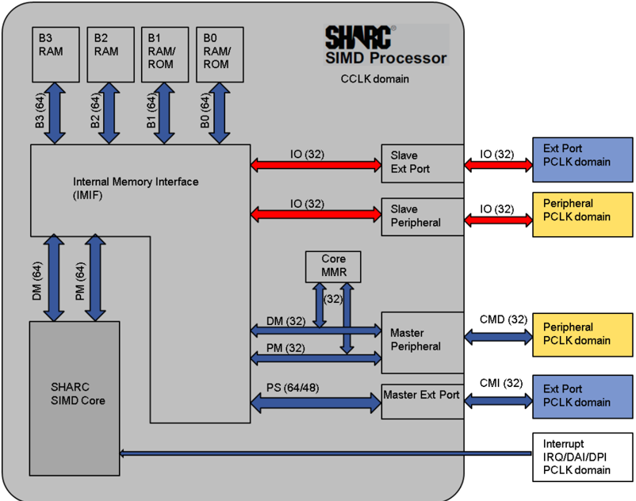
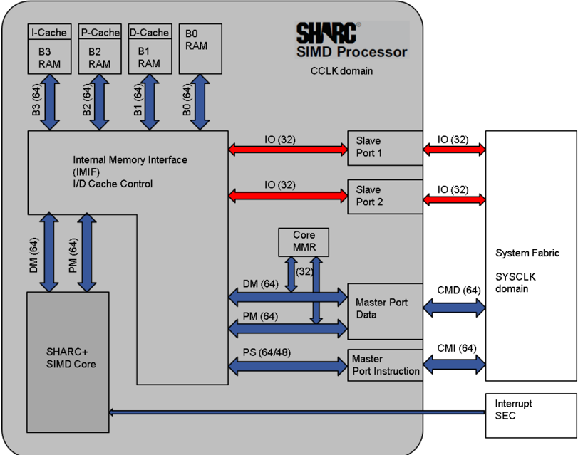
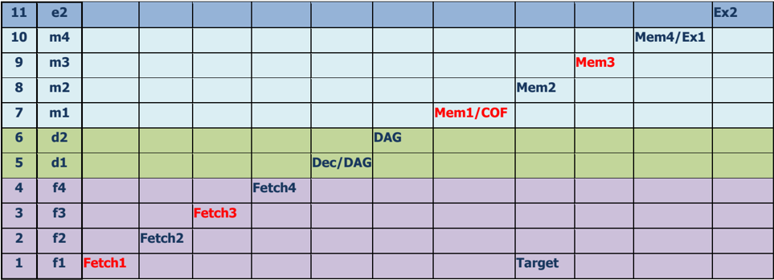
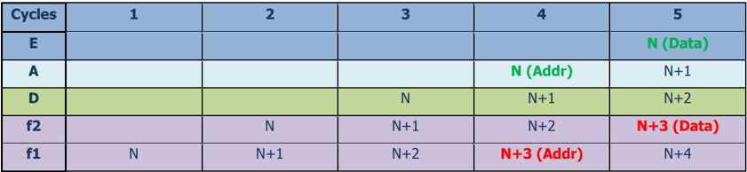
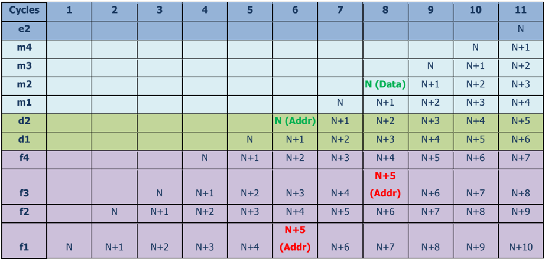

## Engineer-to-Engineer Note


## Technical notes on using Analog Devices products and development tools

Visit  our  Web  resources  http://www.analog.com/ee-notes  and  http://www.analog.com/processors  or e-mail  processor.support@analog.com  or  processor.tools.support@analog.com  for  technical  support.

## Migrating Legacy SHARC to ADSP-SC58x/2158x SHARC+ Processors

Contributed by Robert Hoffmann

## Introduction

Analog Devices recently introduced the next generation of floating-point SHARC® devices as the followon  to  the  ADSP-214xx series.  The  ADSP-2158x model is  the  first  dual-core  SHARC  product,  and  the ADSP-SC58x has the dual-core SHARC architecture plus an integrated ARM Cortex A5 core. Combined, these new products offer flexible System-on Chip (SoC) architectures to address a wide range of application requirements. Notably, the SHARC cores resident on these products have been upgraded from the previous generation SHARC products, now featuring an 11-stage pipeline and an ARM-friendly chip infrastructure (system fabric) that allows flexibility in connections with various peripherals.

The new 11-stage pipeline been defined in such a way that it remains backwards-compatible at the assembly code level with previous generations of SHARC devices. However, due to some phenomena like pipeline stage splitting, stack dependencies, data hazards, and stall conditions, some corner case combinations of code  flow  will  be  handled  differently  from  the  previous  design,  which  may  result  in  performance degradation if not modified to work well with the new pipeline.

This EE-note will describe these conditions, provide benchmarks and definitions to the known pipeline stalls, and provide examples of how to go about optimizing assembly code going from the 5-stage pipeline of the ADSP-214xx (and older) SHARC processors (hereon referred to as SHARC) to the deeper 11-stage pipeline of these ADSP-2158x/ADSP-SC58x processors (hereon referred to as SHARC+).

## Legacy Core with 5-Stage Pipeline (SHARC)

The SHARC system is shown in Figure 1. It illustrates the  core surrounded by its  L1 memory  blocks (RAM/ROM) and its connectivity buses for core and I/O operations. The two master and two slave ports communicate with the system infrastructure to exchange data with peripherals. This architecture applies to almost all SHARC product models that include an external port (e.g., all ADSP-2136x and ADSP-214xx SHARC products). One master/slave pair is assigned to a peripheral, and another is assigned to the external port.

Copyright 2015, Analog Devices, Inc. All rights reserved. Analog Devices assumes no responsibility for customer product design or the use or application of customers' products or for any infringements of patents or rights of others which may result from Analog Devices assistance. All trademarks and logos are property of their respective  holders.  Information  furnished  by  Analog  Devices  applications  and  development  tools  engineers  is  believed  to  be  accurate  and  reliable,  however  no responsibility  is  assumed by Analog  Devices  regarding technical  accuracy  and topicality  of the content provided  in Analog  Devices Engineer-to-Engineer Notes.

Rev 1 - June 11, 2015

Figure 1. Legacy SHARC Processor with SHARC Core SoC Block Diagram



## New Core with 11-Stage Pipeline (SHARC+)

The SHARC+ system (Figure 2) illustrates the core surrounded by its L1 memory blocks (RAM, but no ROM)  and  its  connectivity  buses  for  core  and  I/O  operations.  The  two  master  and  two  slave  ports communicate with the system infrastructure to exchange data with peripherals. This architecture applies to all ADSP-SC58x/ADSP2158x SHARC+ products. The master/slave pair is now assigned to any peripheral via the system infrastructure. Similar to the SHARC implementation above, the system still supports two memory-mapped slave ports, where one may be assigned to the external port while the other is assigned to the 2 nd SHARC+ coprocessor (refer to the product datasheet [1] for the address map of the slave ports).




The physical memory map of the L1 memory blocks has not changed from the previous ADSP-214xx processors and can be directly derived from LDF files for ADSP-214xx-based projects.

## Cross SHARC+ Core Communication

The two master/slave ports allow high speed communication between the two SHARC+ cores. The slave ports handle exchange of 64-bit single-instruction-multiple-data (SIMD) as serialized 2 x 32-bit transfers before writing into L1 memory. For memory DMA (MDMA), the master drives 32-bit data at the core clock speed  over  its  master  port  into  the  system  fabric,  and  the  data  is  synchronized  into  64-bit  transfers  at SYSCLK  speed  (1/2  core  clock).  This  data  is  then  captured  at  any  slave  port  by  doing  the  inverse


synchronization and writing into L1 destination memory. Both cores can exchange data in full-duplex mode and can freely change between core and MDMA accesses.

Figure 2. New SHARC Processor with SHARC+ Core SoC Block Diagram



## Core Register File Register Changes

Diving  down  into  the  cores,  the  first  difference  worth  describing  is  with  respect  to  the  core  registers themselves. There are two groups of registers classified  - register file registers accessed directly via an instruction:

```
bit set mode1 PEYEN; /* PEYEN bit set in MODE1 Register */ and the core memory-mapped registers accessed via addressing instructions: dm(SYSCTL)=USTAT1; /* USTAT1 is written via address to SYSCTL */
```

Table 1 provides the information regarding differences between the new SHARC+ implementation versus the previous SHARC implementation.


Table 1. SHARC+ Core Register Changes vs SHARC

| Register    | Update                                                                                                                          | Reset Setting      | Read Latency   | Effect Latency   | SIMD Pair       | LWPair            |
|-------------|---------------------------------------------------------------------------------------------------------------------------------|--------------------|----------------|------------------|-----------------|-------------------|
| R/S0-15     | No change                                                                                                                       | Undefined          | No change      | No change        | Rn-Sn           | R[n,n+1] S[n,n+1] |
| MRF/B MSF/B | No change                                                                                                                       | Undefined          | No change      | No change        | MRF-MSF MRB-MSB | N/A               |
| DAG I/B/M/L | No change                                                                                                                       | 0x0                | No change      | No change        | N/A             | I/B/M/L [n,n+1]   |
| USTAT       | No change                                                                                                                       | 0x0                | No change      | No change        | N/A             | U [n,n+1]         |
| PX          | No change                                                                                                                       | Undefined          | No change      | No change        | N/A             | PX                |
| PX1,PX2     | No change                                                                                                                       | Undefined          | No change      | No change        | PX1-PX2         | N/A               |
| ASTATx/y    | Exclusive access response ORed with EQ flag                                                                                     | ?                  | No change      | No change        | ASTATx- ASTATy  | N/A               |
| STKYx/y     | No change                                                                                                                       | 0x540_0000         | No change      | No change        | ASTATx- ASTATy  | N/A               |
| MODE1       | Bits [29,28,27]: new Parity enable Bit 30: Nested interrupt in progress Bit 31: 'Exclusive PEx/PEy in place of FLAG2 condition' | 0x0                | No change      | No change        | N/A             | N/A               |
| MODE1STK    | New UREG                                                                                                                        | 0x0                | 0              | 2                | N/A             | N/A               |
| MODE2       | Bit [0-2] IRQ-012 bits removed Bit 0: Reused for Self- nesting enable Bit 3: EXTCADIS removed Bit 7: New SLOWLOOP               | 0x540_0000         | No change      | No change        | N/A             | N/A               |
| IRPTL       | IVT changed                                                                                                                     | 0x0                | No change      | No change        | N/A             | N/A               |
| IMASK       | IVT changed                                                                                                                     | 0x3                | No change      | No change        | N/A             | N/A               |
| IMASKP      | IVT changed                                                                                                                     | 0x0                | No change      | No change        | N/A             | N/A               |
| MMASK       | No change                                                                                                                       | 0x20_0000          | No change      | No change        | N/A             | N/A               |
| LIRPTL      | Removed                                                                                                                         |                    |                |                  |                 |                   |
| PC          | No change                                                                                                                       | Undefined          | No change      | No change        | N/A             | N/A               |
| PCSTK       | No change                                                                                                                       | 0x7FFF_FFFF        | No change      | No change        | N/A             | N/A               |
| PCSTKP      | No change                                                                                                                       | 0x0                | No change      | No change        | N/A             | N/A               |
| LADDR       | No change                                                                                                                       | 0xFFFF_FFFF        | No change      | No change        | N/A             | N/A               |
| LCNTR       | No change                                                                                                                       | 0x0                | No change      | No change        | N/A             | N/A               |
| TPERIOD     | No change                                                                                                                       | Undefined          | No change      | No change        | N/A             | N/A               |
| TCOUNT      | No change                                                                                                                       | Undefined          | No change      | No change        | N/A             | N/A               |
| FLAG0-2     | No change                                                                                                                       | Output selects 0x0 | No change      | No change        | N/A             | N/A               |
| FADDR       | Removed - nowCMMR                                                                                                               |                    |                |                  |                 |                   |
| DADDR       | Removed - nowCMMR                                                                                                               |                    |                |                  |                 |                   |


For  specific  details  regarding  these  core  MMRs,  consult  the ADSP-SC58x  Programming  Reference Manual [2] .

## Memory-Mapped Register (MMR) Access Latencies

Core MMR (CMMR) accesses cause a variable number of stalls due to timing and effect latency reasons. Stalls on reads and writes can be up to 4 cycles.

System MMR (SMMR) accesses (to various peripheral control/status registers) take between 38-60 core cycles, depending on the system clock frequency (SYSCLK), the peripheral module clock, and the system fabric arbitration.

## Conflict Cache

The tiny (32-entry) conflict cache  in  the SHARC core continues to operate  in the new SHARC+ core; however,  entries  are  cached  only  when  internal  bus  conflicts  are  encountered.  This  is  unlike  the implementation on ADSP-214xx products and earlier, where the conflict cache was also filled from external ISA/VISA instruction and data memory spaces. As the new ADSP-SC58x/2158x devices feature dedicated program and data cache memories, the conflict cache no longer needs to care for this.

## SHARC+ Instruction Pipeline

The eleven stages of the SHARC+ pipeline were created by splitting each of the SHARC pipeline stages into two. After splitting the floating point ALU/MAC unit into two stages, they were positioned at the 10 th stage of the pipe instead of the 9 th , which created the 11 th stage of the pipe. The benefit here is that this 1stage shift ensures no load-to-use stall in the SHARC+ core.

In the entire pipeline, memory is accessed two times (phases in red in Figure 3) - once for instructions and once for data. There can be up to two data accesses, using either the PM or DM buses. These accesses can happen simultaneously if they are to both blocks, otherwise they cause a one-cycle stall to resolve each block conflict in exactly the same manner as with the SHARC core. Refer to the ADSP-SC58x Programming Reference Manual for pipeline stage descriptions.

Figure 3. Pipeline - Memory Access Phases



|   11 | e2   |        |        |        |        |         |          |        |      |          | Ex2   |
|------|------|--------|--------|--------|--------|---------|----------|--------|------|----------|-------|
|   10 | m4   |        |        |        |        |         |          |        |      | Mem4/Ex1 |       |
|    9 | m3   |        |        |        |        |         |          |        | Mem3 |          |       |
|    8 | m2   |        |        |        |        |         |          | Mem2   |      |          |       |
|    7 | m1   |        |        |        |        |         | Mem1/COF |        |      |          |       |
|    6 | d2   |        |        |        |        | DAG     |          |        |      |          |       |
|    5 | d1   |        |        |        |        | Dec/DAG |          |        |      |          |       |
|    4 | f4   |        |        |        | Fetch4 |         |          |        |      |          |       |
|    3 | f3   |        |        | Fetch3 |        |         |          |        |      |          |       |
|    2 | f2   |        | Fetch2 |        |        |         |          |        |      |          |       |
|    1 | f1   | Fetch1 |        |        |        |         |          | Target |      |          |       |

In the above, the pipeline stages can be defined further, as follows:

Stages 1-4 (Fetch1-4):

Instruction fetch

Stage 5 (Dec):

Instruction decode

Stage 6 (DAG):

Instruction address + arithmetic (I+M)

Stages 7-10 (Mem1-4):

Data access

COF:

Change of flow (interrupts, jumps, calls, returns)

Target:

COF target

Stages 10-11 (Ex1-2):

Compute

## Instruction Pipeline Flushes and Stalls

The processors use pipeline flushes and stalls to ensure correct and efficient program execution. Since the instruction pipeline is fully interlocked, programmers need to be aware of different scenarios which result in pipeline stages being either flushed or stalled.

Pipeline stalls are used in the following situations:

-  Structural hazards are incurred when different instructions at various stages of the instruction pipeline attempt to use the same processor resources simultaneously. For example, when the processor issues a data access on the PM bus, it conflicts with an instruction request being issued by the sequencer on the same bus.
-  Data and control hazards are incurred when an instruction attempts to read a value from a register or from a conditional flag that has been updated by an earlier instruction before the value becomes available. For example, an index register is changed during data address generation, which happens in an early stage of the pipeline, which causes a stall when the same index register is being loaded in a previous instruction.
-  Performance execution for a certain sequence of instructions: For example, when both the input operands are forwarded to the multiplier unit from a previous compute instruction, it causes stalls to accommodate additional operation.
-  Additional stalls include those to retain effect latencies compatible with earlier SHARC processors and stalls on double-precision computations.

Pipeline flushes are used when the processor branches to a new location, whether this is due to an interrupt or execution of a branch instruction (jump, call, return). When these are encountered, the pipeline flushes the instructions behind them in the instruction flow.

The following sections describe various scenarios of stalls and pipeline flushes in more detail.

## Pipeline Stalls

Stalls are usually introduced into complex systems because data to be used in the next cycle is not available because of crossing a clock domain, performing a change in instruction flow, or pending on a semaphore in a multi-core system.


## Memory Access Stalls

This section describes stalls related to the sequencer making accesses to instruction and data memory. Table 2 summarizes the memory access stalls.

Table 2. Memory Access Stalls

| Details                                 | Example                                       | Stall Type   |   SHARC |   SHARC+ |
|-----------------------------------------|-----------------------------------------------|--------------|---------|----------|
| Conflict Cache Miss on PM Data Access   | r0 = pm(Addr);                                | Structural   |       1 |        1 |
| Two Accesses to Same Bank in Same Cycle | r0 = dm(Block0-addr1), background DMAtoBlock0 | Structural   |       1 |        1 |
| Conditional Store to Any Load           | If eq DM(A) = Fz; Fa = DM(A/B)                | Timing       |       0 |        1 |

As can be seen in Table 2, using different memory blocks will avoid the stall introduced when having two accesses to the same bank. Similarly, the  conditional store stall  could  be avoided by  issuing  any  other instruction between the conditional store and the subsequent load.

## Compute Stalls

This section describes stalls related to computational instruction sequences that depend on conditions or data forwarding. Table 3 summarizes the compute stalls.

Table 3. Compute Stalls

| Details                                                                                                                  | Details                                                                                                                  | Example                                                        | Stall Type                           | SHARC                                | SHARC+                               |
|--------------------------------------------------------------------------------------------------------------------------|--------------------------------------------------------------------------------------------------------------------------|----------------------------------------------------------------|--------------------------------------|--------------------------------------|--------------------------------------|
| 1                                                                                                                        | Data Forwarding to Compute Operation                                                                                     | Data Forwarding to Compute Operation                           | Data Forwarding to Compute Operation | Data Forwarding to Compute Operation | Data Forwarding to Compute Operation |
| Floating point compute/multiply operation -to- next compute dependency                                                   | Floating point compute/multiply operation -to- next compute dependency                                                   | Fx = PASS Fy; Fz = Fx + Fa;                                    | Data dependency                      | 0                                    | 1                                    |
| If previous instruction is conditional fixed point compute or conditional register read and condition set is just before | If previous instruction is conditional fixed point compute or conditional register read and condition set is just before | Rx = PASS Ry; IF eq Rz = Ra + Rb; Fc = Fz + Fd;                | Data dependency                      | 0                                    | 1                                    |
| ASTATx/y register update -to- carry or overflow dependent instruction                                                    | ASTATx/y register update -to- carry or overflow dependent instruction                                                    | ASTATx = DM(..); Rx = Ry + Rz + CI;                            | Data dependency                      | 0                                    | 1                                    |
| 2                                                                                                                        | Dual Forwarding to Multiplier                                                                                            | Dual Forwarding to Multiplier                                  | Dual Forwarding to Multiplier        | Dual Forwarding to Multiplier        | Dual Forwarding to Multiplier        |
| Dual forwarding to multiply operation from N-2 to Nth location.                                                          | Dual forwarding to multiply operation from N-2 to Nth location.                                                          | Fx = Fa+Fb, Fy = Fa-Fb; [unrelated instruction]; Fz = Fx * Fy; | Timing                               | 0                                    | 1                                    |
| Dual forwarding to multiply operation from N-1 to Nth location                                                           | Dual forwarding to multiply operation from N-1 to Nth location                                                           | Fx = Fa+Fb, Fy = Fa-Fb; Fz = Fx * Fy;                          | Timing                               | 1                                    | 2                                    |
| 3                                                                                                                        | Floating point multiply operation to next fixed point ALU                                                                | Fz = Fx * Fy; Ra = Rz + Rb;                                    | Timing                               | 1                                    | 0                                    |

As was the case with the memory access stalls in the previous section, these compute stalls can be avoided by inserting unrelated instructions that do not affect the registers of interest into the identified sequence. Listing 1 illustrates some compute-to-compute hazards.


```
.SECTION/SW seg_swco; /* VISA instructions */ R4 = R1*R4(SSFR); /* single forwarding Fixed-Point */ R14 = R4*R12; /* SHARC = 0 stalls / SHARC+ = 1 stall */ nop; nop; R4 = R1*R4(SSFR), R12 = R8-R12; /* dual forwarding Fixed-Point */ nop; R14 = R4*R12; /* SHARC = 0 stalls / SHARC+ = 1 stall */ nop; nop; R4 = R1*R4(SSFR), R12 = R8-R12; /* dual forwarding Fixed-Point */ R14 = R4*R12; /* SHARC = 1 stall / SHARC+ = 2 stalls */ nop; nop; F4 = F1*F4; /* single forwarding Floating-Point */ F14 = F4*F12; /* SHARC = 0 stalls / SHARC+ = 1 stall */ nop; nop; F4 = F1*F4, F12 = F8-F12; /* dual forwarding Floating-Point */ nop; F14 = F4*F12; /* SHARC = 0 stalls / SHARC+ = 1 stall */ nop; nop; F4 = F1*F4, F12 = F8-F12; /* dual forwarding Floating-Point */ F14 = F4*F12; /* SHARC = 1 stall / SHARC+ = 2 stalls */ nop; nop;
```

Listing 1. Compute-Compute Hazards

## Data Address Generation (DAG) Stalls

This section describes stalls related to data address generation used to access on- and off-chip data memory. Table 4 summarizes the DAG stalls.

|   Details | Details                                                                                         | Example                                       | Stall Type      |   SHARC |   SHARC+* |
|-----------|-------------------------------------------------------------------------------------------------|-----------------------------------------------|-----------------|---------|-----------|
|         1 | Unconditional DAG register load-to- use                                                         | Ix = DM(..); DM(Ix…) = …;                     | Data Dependency |       2 |         4 |
|         2 | Conditional DAG register load (with condition set just before) -to- use                         | Rx = PASS Ry; IF eq Ix = DM(..); DM(Ix…) = …; | Data Dependency |       2 |         5 |
|         3 | Condition set -to- conditional post modify DAG operation on Ix -to- any DAGoperation on same Ix | Rx = PASS Ry; IF eq DM(Ix,..); DM(Ix…) = …;   | Data Dependency |       2 |         5 |
|         4 | Load of DAG register with immediate value -to- use                                              | Ix = [IMM VALUE]; DM(Ix..)..                  | Data Dependency |       2 |         0 |


Again,  as  was  the  case  in  the  previous  sections,  these  stalls  can  be  mitigated  by  inserting  unrelated instructions that do not affect the registers of interest into the identified sequence. Listing 2 illustrates a DAG register load hazard.

```
.SECTION/SW seg_swco; /* VISA instructions */ m0 = L1_memory; r0 = dm(i2,m0); /* SHARC = 2 stalls / SHARC+ = 0 stalls */ nop; nop; m0 = 2; r0 = dm(i0,m1); /* SHARC = 0 stalls / SHARC+ = 2 stalls */ nop; nop; i4 = L1_memory; r0 = dm(i4,m4); /* SHARC = 2 stalls / SHARC+ = 4 stalls */ nop; nop; b0 = L1_memory; r0 = dm(i0,m1); /* SHARC = 2 stalls / SHARC+ = 2 stalls */ nop; nop; l0 = 16; r0 = dm(i0,m4); /* SHARC = 2 stalls / SHARC+ = 2 stalls */
```

Listing 2. DAG Register Load Hazards

## Data Move Stalls

This section describes stalls that are introduced when data movement depends on instruction sequences. Table 5 lists data move stalls.

Table 5. Data Move Stalls

| Details                                                                                                                             | Example                                          | Stall Type       | SHARC+   |
|-------------------------------------------------------------------------------------------------------------------------------------|--------------------------------------------------|------------------|----------|
| Floating point compute or any multiplier operation followed by move of the result to any register outside the relevant PE           | F1 = F2 + F3; USTAT1 = F1;                       | Timing 0 0 0 0 0 | 1        |
| Condition set followed by a conditional load of a DAG reg followed by move of that reg to any other Ureg                            | R0 = R1 + 1; IF EQ I0 = PM(<Addr>); USTAT1 = I0; | Timing 0 0 0 0 0 | 1        |
| Access of any Timer register                                                                                                        | TCOUNT = USTAT1;                                 | Timing 0 0 0 0 0 | 1        |
| Read of these registers: IRPTL, IMASKP, MODE1STK, LPSTK, CCNTR, LCNTR, PCSTK, PCSTKP, MODE1, FLAGS, ASTATx/y, STKYx/y, FADDR, DADDR | R0 = IRPTL;                                      | Timing 0 0 0 0 0 | 1        |
| Write Followed by Read of these registers: IMASK, USTAT, MMASK, MODE2                                                               | USTAT1 = DM(<Addr>; R0 = USTAT1;                 | Timing 0 0 0 0 0 | 1        |
| Read and write of any coreMMR                                                                                                       | R0 = SYSCTL;                                     | Timing 0 0 0 0 0 | 0-4      |

There is no way to avoid stalls associated with MMR accesses; however, the same concept as in previous sections  also  applies  here  to  stalls  introduced  by  specific  instruction  sequences.  Inserting  unrelated instructions that do not affect the registers of interest into the identified sequence will mitigate the stall cycles that would otherwise be incurred.

## Miscellaneous Stalls

Table 6 lists miscellaneous stalls not covered in the previous sections.

Table 6. Miscellaneous Stalls/Flushes

| Details                                                                                                                          | Example                                 | Stall Type         | SHARC   | SHARC+   |
|----------------------------------------------------------------------------------------------------------------------------------|-----------------------------------------|--------------------|---------|----------|
| During the execution of first four instructions of an unrolled loop, when COF is at Nth position in loop from top, where N = 0-3 |                                         | Loop state machine | 0       | 4-N      |
| If RTS/RTI is returning to a loop at 'Last-Addr'- N, where N = 0-3                                                               |                                         | Data dependency    | 1-N     | 4-N      |
| Jump with loop abort                                                                                                             | Jump <Target> (LA);                     | Data dependency    | 1       | 4        |
| Target/next-to-target of CALL/RTS/RTI itself being an RTS/RTI                                                                    |                                         | Data dependency    | 0       | 3        |
| Target of CALL/RTS/RTI itself being a Jump                                                                                       |                                         | Data dependency    | 0       | 1        |
| Loop-stack modification followed by RTS/RTI/Jump                                                                                 |                                         | Data dependency    | 0       | 5        |
| Sreg or SYSCTL update to N+2 instruction                                                                                         | Bit set MODE1 CBUFEN; [Instr]; DM(I0…); | Control dependency | 1       | 5        |
| Bit set/clear MODE1 PEYEN to N+2 instruction                                                                                     | Bit set MODE1 PEYEN;                    | Control dependency | 1       | 0        |

## Stalls and Pipeline Flushes Related to Instruction Flow

In most cases, any branch instruction (jumps, calls, returns, rframe, and cjump) flushes the pipeline, and some cycles are lost. A new feature of the ADSP-2158x/ADSP-SC58x devices is the branch predictor, which attempts to minimize the loss of cycles incurred as a result of branch instructions that cause a change in instruction flow.

## Branch Target Buffer (BTB)

With the deeper pipeline, changes of flow (COF) become more costly to the processor's performance due to the increased number of pipeline flushes and stalls. However, these stall and flush cycles can be mitigated by employing the branch target buffer (BTB) condition predictor. COF works differently with and without BTB, and this section provides details regarding BTB-enabled COF in a SHARC+ system.




The BTB is enabled after reset (similar to conflict cache). BTB content can be disabled and frozen to test efficiency and to inspect for debug purposes.

## BTB Condition Prediction

The BTB adds value to the SHARC+ pipeline, as all branch-related latencies and stalls are significantly reduced with correct BTB prediction. A listing of the incurred stalls/flushes is shown in Table 7.


Table 7. Branch Target Buffer Flushes/Stalls

| Branch        | Prediction   | Condition Prediction   | Target Prediction   | Stall/Flush Cycles for Non-DB/DB   |
|---------------|--------------|------------------------|---------------------|------------------------------------|
| Conditional   | Taken        | HIT                    | HIT                 | 2/0                                |
| Conditional   | Not Taken    | HIT                    | -                   | 0                                  |
| Conditional   | Taken        | MISS                   | -                   | 11                                 |
| Conditional   | Not Taken    | MISS                   | -                   | 11/9                               |
| Conditional   | Taken        | HIT                    | MISS                | 6/4                                |
| Unconditional | -            | -                      | HIT                 | 2/0                                |
| Unconditional | -            | -                      | MISS                | 6/4                                |

## BTB Prediction Masking

While the branch predictor provides some execution gains when it is enabled, BTB prediction can be masked off in two ways. First, options like indirect branch prediction are configurable, so the user has the ability to disable various aspects of the prediction logic via writes to configuration registers, and this is obviously at the full discretion of the user. However, architectural limitations also influence the behavior of the hardware. For  example,  hardware  loops  and  BTB  are  incompatible  because  they  interfere  with  each  other's  state machines. As such, when hardware loops are executing, the processor automatically masks BTB prediction to ensure proper sequencing.

Table 8 lists places where BTB prediction is masked due to architectural reasons.

Table 8. Branch Target Buffer Disable Scenarios

| Cases Where BTB Prediction Is Masked                                          | Reason                       |
|-------------------------------------------------------------------------------|------------------------------|
| Two instructions after a branch is predicted                                  | Basic functional requirement |
| Return to last 8 instructions of an F1 active loop                            | To prevent counter decrement |
| Return to last 3 instructions of an E2 active and arithmetic loop             | Stack dependency             |
| DO_UNTIL instruction from D1 to E2 stage                                      | Stack dependency             |
| RTI                                                                           | Status/mode stack dependency |
| Branches which are placed within 5 instructions after loop-stack modification | Loop stack dependency        |

Table 9 describes the number of lost cycles when BTB is disabled or the branch entry is not present in the BTB (i.e., a BTB miss occurs). If the branch is the one with a delay slot of two instructions, the number of flushed instructions is reduced by 2.


|   # | Details                              | Example                          | Stall Type         | SHARC (Non-Delayed/Delayed)   | SHARC+ (Non-Delayed/Delayed)   |
|-----|--------------------------------------|----------------------------------|--------------------|-------------------------------|--------------------------------|
|   1 | Unconditional branch                 | Jump(My,Ix);                     | Pipeline flush     | 3/1                           | 6/4**                          |
|   2 | Condition set for conditional branch | Rx = PASS Ry; IF eq Jump(My,Ix); | Control dependency | 4/2***                        | 11/9*                          |

Table 9. Stalls/Flushes for COF

When the BTB is enabled and there is a hit, the pipeline stalls and flushes are possible. These stalls are described for various situations in Table 10.

Table 10. Stalls/Flushes for COF with BTB

|   # | Branch Type   | Prediction   | Condition Prediction   | Target Prediction   | SHARC+ (Non-Delayed/Delayed)   |
|-----|---------------|--------------|------------------------|---------------------|--------------------------------|
|   1 | Conditional   | Taken        | Correct                | Correct             | 2/0                            |
|   2 | Conditional   | Not Taken    | Correct                | -                   | 0                              |
|   3 | Conditional   | Taken        | Incorrect              | -                   | 11                             |
|   4 | Conditional   | Not Taken    | Incorrect              | -                   | 11/9                           |
|   5 | Conditional   | Taken        | Correct                | Incorrect           | 6/4                            |
|   6 | Unconditional | -            | -                      | Correct             | 2/0                            |
|   7 | Unconditional | -            | -                      | Incorrect           | 6/4                            |

In  addition  to  the  above  stalls,  there  are  other  data  and  control  dependency  stalls  relative  to  branch instructions. The cycles in Table 11 are in addition to the cycles incurred due to the reasons described in the above tables in this section.

|   # | Details                                                                                  | Example                                         | Stall Type                    |   SHARC | SHARC+   |
|-----|------------------------------------------------------------------------------------------|-------------------------------------------------|-------------------------------|---------|----------|
|   1 | CJUMP/RFRAME -to- use of I6                                                              | CJUMP; DM(I6,..) = …;                           | Data dependency               |       2 | 6        |
|   2 | CJUMP/RFRAME -to- read of I6/7                                                           | RFRAME; R0 = I6;                                | Data dependency               |       2 | 6        |
|   3 | Unconditional DAGregister load -to- use in indirect branch                               | Ix = DM(..); Jump(Ix…) = …;                     | Data dependency               |       2 | 4†       |
|   4 | Conditional DAG register load (with condition set just before) -to- use in indirect jump | Rx = PASS Ry; IF eq Ix = DM(..); Jump(Ix…) = …; | Data and control dependencies |       2 | 5*†      |

Table 11. Stalls/Flushes for COF Data/Control Dependency

## Hardware Loop Stalls/Flushes

With SHARC+, the LCE condition governing loop lengths of 10 and under will not give the same result as its SHARC predecessor. This is because of pipeline depth and because termination of loop lengths of 1 to 10 happens when the CCNTR value is 2 rather than 1. Restrictions for call and jump instructions inside a loop are identical to those on SHARC.

New restrictions due to the increased pipeline depth include:

-  The last five instructions of an arithmetic loop cannot be a delayed branch (dB).
-  The last three instructions of an arithmetic loop cannot be a branch.
-  Short loops of 2-4 instructions cannot contain two branches.
-  Short loops of 1-4 instructions carrying a nested loop cannot contain branches.
-  In short loops carrying a nested loop, 1/2 instructions before the inner do until instruction cannot be a branch.

Table 12 shows the hardware loop stalls.

| Details                                            | Example                         | Stall Type     |   SHARC |   SHARC+ |
|----------------------------------------------------|---------------------------------|----------------|---------|----------|
| On termination of E2 active and short loops        | LCNTR = 4, DO (PC,2) UNTIL LCE; | Pipeline flush |       4 |       11 |
| On termination of arithmetic condition based loops | DO (PC,2) UNTIL EQ;             |                |       2 |       11 |
| Write to CCNTR to LCE based instruction            | CCNTR = 4; If not LCE R0 = R1;  | Timing         |       2 |        1 |
| Start of 1,2,4 instruction loop                    | LCNTR = 4, DO (PC,2) UNTIL LCE; |                |       1 |        0 |

Table 12. Hardware Loop Stalls/Flushes

## Assembly Code Optimization Example (FIR Filter)

With the stall conditions defined above, it is useful to describe methods that can be applied when taking existing SHARC code and moving to the SHARC+ core. While the code itself will yield the same correct results using the SHARC+ core as it did using the SHARC core, architectural differences between the two cores may cause performance degradation when executed on the SHARC+ core. This section uses the FIR filter library code that ADI provides with the development tools as an example to apply some pipelinespecific optimizations to.

## Code/Data Buffer Placement

The  linker  description  file  (LDF)  plays  a  significant  role  in  throughput  optimization  when  using multifunction  instructions  with  dual-data  moves.  The  application  should  try  to  employ  conflict-free placement of the source and destination data buffers to avoid additional block arbitration latencies. The SHARC's Super Harvard architecture drives an internal conflict cache during loop iterations while DAG1 and DAG2 drive both data buses.

All the known rules for the SHARC memory architecture continue to apply to the SHARC+ architecture. Consider the case of a dual data move instruction. During cycle a of the SHARC pipeline (Figure 4), the pipeline posts addresses to instruction-assigned memory and data memory (assuming a hit in the conflict cache). Figure 5 shows the address and data phases in the SHARC+ pipeline for the same dual data move instruction. Note that there is another stage between the address and the data, which allows for higher-speed accesses.


Figure 4: Dual Data Move Instruction in SHARC



| Cycles   | 1   | 2   | 3   | 4          | 5          |
|----------|-----|-----|-----|------------|------------|
| E        |     |     |     |            | N (Data)   |
| A        |     |     |     | N (Addr)   | N+1        |
| D        |     |     | N   | N+1        | N+2        |
| f2       |     | N   | N+1 | N+2        | N+3 (Data) |
| f1       | N   | N+1 | N+2 | N+3 (Addr) | N+4        |

Figure 5: Dual Data Move Instruction in SHARC+



| Cycles   | 1   | 2   | 3   | 4   | 5   | 6          | 7   | 8          | 9   | 10   | 11   |
|----------|-----|-----|-----|-----|-----|------------|-----|------------|-----|------|------|
| e2       |     |     |     |     |     |            |     |            |     |      | N    |
| m4       |     |     |     |     |     |            |     |            |     | N    | N+1  |
| m3       |     |     |     |     |     |            |     |            | N   | N+1  | N+2  |
| m2       |     |     |     |     |     |            |     | N (Data)   | N+1 | N+2  | N+3  |
| m1       |     |     |     |     |     |            | N   | N+1        | N+2 | N+3  | N+4  |
| d2       |     |     |     |     |     | N (Addr)   | N+1 | N+2        | N+3 | N+4  | N+5  |
| d1       |     |     |     |     | N   | N+1        | N+2 | N+3        | N+4 | N+5  | N+6  |
| f4       |     |     |     | N   | N+1 | N+2        | N+3 | N+4        | N+5 | N+6  | N+7  |
| f3       |     |     | N   | N+1 | N+2 | N+3        | N+4 | N+5 (Addr) | N+6 | N+7  | N+8  |
| f2       |     | N   | N+1 | N+2 | N+3 | N+4        | N+5 | N+6        | N+7 | N+8  | N+9  |
| f1       | N   | N+1 | N+2 | N+3 | N+4 | N+5 (Addr) | N+6 | N+7        | N+8 | N+9  | N+10 |

In the case of an application like an FIR filter, the code/data might be placed as follows:

Block 0:

VISA/ISA code and FIR coefficients

Block 1:

State memory (delay line)

Blocks 2/3:

Ping-Pong DMA data buffers

This layout guarantees conflict-free block accesses (core PM/DM bus vs. slave port1-2 DMA buses).




Core  vs  DMA  block  conflicts  are  more  expensive  based  on  the  2::1 CCLK::SYSCLK clock speed ratio. Refer to the ADSP-SC58x Programming Reference Manual for the block arbitration priorities.

## SHARC FIR Filter

When attempting to run SHARC FIR filter source code on a SHARC+ core target, it will function correctly. However, as stated above, the new SHARC+ pipeline will add a mixture of static and dynamic stalls that might negatively impact the performance. As described earlier in this EE-note, there are various reasons for the sequencer to stall the instruction flow, with three of the more notable being:


- -floating-point compute-to-compute hazards
- -loop sequencer stalls
- -conflict cache stalls

In  both  the  single  channel  (SISD,  Listing  3)  and  dual-channel  (SIMD,  Listing  4)  listings  below,  the SHARC+ core will stall in the loop because the sequencer identifies identical source and destination data registers in consecutive 32-bit floating-point compute operations. As this stall is taken in the inner loop of the FIR, it is extremely costly from a performance perspective (highlighted in red).




In  all  the  source code provided below, a common header is used to differentiate among the various implementations being shown. Please refer to it when comparing between the SHARC core and SHARC+ core targets.

## Single-Channel 40-Bit SISD FIR

```
.SECTION/SW seg_swco; // VISA instructions /* SHARC Pipelined 40-bit SISD Version */ bit set MODE1 CBUFEN; bit clr MODE1 PEYEN; b5 = Input_Buf; // FIR Input Buffer m5 = 1; l5 = 0; b6 = Output_Buf; // FIR Output Buffer l6 = 0; b9 = FIR_Coeff_Buf; // i9 allows broadcast mode m9 = 1; l9 = TAPS; b2 = FIR_State_Buf; // Delay Line Buf m2 = 1; l2 = TAPS; lcntr = BP_COUNT, do Block until lce; // block processing r8 = r8-r8,   f0 = dm(i5,m5); // clr acc, read new sample r9 = r9-r9,   dm(i2,m2) = f0; // clr acc, write into DL f0 = dm(i2,m2), f4 = pm(i9,m9); f12 = f0*f4, f0 = dm(i2,m2), f4 = pm(i9,m9); lcntr = TAPS-2, do MAC until lce; MAC: f12 = f0*f4, f8 = f8+f12, f0 = dm(i2,m2), f4 = pm(i9,m9);  // 1-cycle SHARC+ stall f12 = f0*f4, f8 = f8+f12; f8 = f8+f12; Block: dm(i6,m5) = f8; // write to output
```

Listing 3. SHARC SISD FIR


## Dual-Channel 32-Bit SIMD FIR

```
.SECTION/SW seg_swco; // VISA instructions /* SHARC Pipelined 32-Bit SIMD Version */ bit set MODE1 PEYEN|CBUFEN|BDCST9; b5 = Input_Buf; // FIR Input Buffer m5 = 2; l5 = 0; b6 = Output_Buf; // FIR Output Buffer l6 = 0; b9 = FIR_Coeff_Buf; // i9 allows broadcast mode m9 = 1; l9 = TAPS; b2 = FIR_State_Buf; // Delay Line Buffer m2 = 2; l2 = 2*TAPS; lcntr = BP_COUNT/2, do Block until lce; // block processing r8 = r8-r8,   f0 = dm(i5,m5); // clr acc, read new sample r9 = r9-r9,   dm(i2,m2) = f0; // clr acc, write into DL f0 = dm(i2,m2), f4 = pm(i9,m9); f12 = f0*f4, f0 = dm(i2,m2), f4 = pm(i9,m9); lcntr = TAPS-2, do MAC until lce; MAC: f12 = f0*f4, f8 = f8+f12, f0 = dm(i2,m2), f4 = pm(i9,m9);  // 1-cycle SHARC+ stall f12 = f0*f4, f8 = f8+f12; f8 = f8+f12; Block: dm(i6,m5) = f8; // write to output
```

Listing 4. SHARC SIMD FIR

## Hand-Optimizing the Single-Channel FIR Filter in SHARC+

The basic idea for optimizing the code is to use the floating-point compute-to-compute hazard stall cycle identified in Listing 3 to interleave an independent MAC operation. In other words, split the MAC into two MAC operations with different result registers (MAC F8 and MAC F9) for accumulation, as shown in Listing 5.

```
.SECTION/SW seg_swco; // VISA instructions /* SHARC Unpipelined 40-Bit SISD Version */ lcntr = BP_COUNT, do Block until lce; // block processing r8 = r8-r8,   f0 = dm(i5,m5); // clr acc, read new sample r9 = r9-r9,   dm(i2,m2) = f0; // clr acc, write into DL f0 = dm(i2,m2), f4 = pm(i9,m9); // MAC only for odd TAP count f12 = f0*f4; f8 = f8+f12; lcntr = TAPS/2, do MAC until lce; f0 = dm(i2,m2), f4 = pm(i9,m9); // MAC F8 f12 = f0*f4; f8 = f8+f12; f0 = dm(i2,m2), f4 = pm(i9,m9); // MAC F9 f13 = f0*f4; MAC: f9 = f9+f13; f10= f8+f9; // add MAC1-0 Block: dm(i6,m5) = f10; // write to output
```

Listing 5. SISD FIR Optimization 1

From a performance perspective, this is actually a step in the wrong direction, as cycles are being added to split  the  MAC operations; however, doing so lends itself to further possible optimizations targeting the SHARC+ pipeline performance. In Listing 6, the code is reordered to take full advantage of the parallel


operation instructions, where data accesses are performed first, multiplication second, and accumulation third; hence, three instruction cycles are required to fill the pipeline with data. When filled, the instruction is executed in the HW loop body until the loop exits, at which point the pipeline needs to be flushed (which takes another 3 cycles until finished). Note that this code sequence illustrates separate pipelining for the F8 and F9 result registers, controlled by two separate inner loops, which is the next opportunity for further optimization.

```
.SECTION/SW seg_swco; // VISA instructions /* SHARC Pipelined 40-Bit SISD Version with Separate MAC */ lcntr = BP_COUNT, do Block until lce; // block processing r8 = r8-r8,   f0 = dm(i5,m5); // clr acc, read new sample r9 = r9-r9,   dm(i2,m2) = f0; // clr acc, write into DL f0 = dm(i2,m2), f4 = pm(i9,m9); f12 = f0*f4, f0 = dm(i2,m2), f4 = pm(i9,m9); lcntr = (TAPS-4)/2, do MAC0 until lce; MAC0: f12 = f0*f4, f8 = f8+f12, f0 = dm(i2,m2), f4 = pm(i9,m9); f12 = f0*f4, f8 = f8+f12; f8 = f8+f12; f0 = dm(i2,m2), f4 = pm(i9,m9); f13 = f0*f4, f0 = dm(i2,m2), f4 = pm(i9,m9); lcntr = (TAPS-4)/2, do MAC1 until lce; MAC1: f13 = f0*f4, f9 = f9+f13, f0 = dm(i2,m2), f4 = pm(i9,m9); f13 = f0*f4, f9 = f9+f13; f9 = f9+f13; f10= f8+f9; // MAC f8+f9 Block: dm(i6,m5) = f10; // write to output
```

Listing 6. SISD Optimization 2

As a final step, the MAC operations can be interleaved such that the now singular inner loop body contains just two instructions. Keeping the same red/green color encoding to differentiate between the F8 and F9 MACs, Listing 7 depicts this modification.

```
.SECTION/SW seg_swco; // VISA instructions /* SHARC+ Pipelined 40-Bit SISD Version with Interleaved MAC */ lcntr = BP_COUNT, do Block until lce; // block processing r8 = r8-r8,   f0 = dm(i5,m5); // clr acc, read new sample r9 = r9-r9,   dm(i2,m2) = f0; // clr acc, write into DL f0 = dm(i2,m2), f4 = pm(i9,m9); f12 = f0*f4, f0 = dm(i2,m2), f4 = pm(i9,m9); f13 = f0*f4, f0 = dm(i2,m2), f4 = pm(i9,m9); lcntr = (TAPS-4)/2, do MAC until lce; f12 = f0*f4, f8 = f8+f12, f0 = dm(i2,m2), f4 = pm(i9,m9); MAC: f13 = f0*f4, f9 = f9+f13, f0 = dm(i2,m2), f4 = pm(i9,m9); f12 = f0*f4, f8 = f8+f12, f0 = dm(i2,m2), f4 = pm(i9,m9); f13 = f0*f4, f9 = f9+f13; f8 = f8+f12; f9 = f9+f13; f10= f8+f9; // MAC f8+f9 Block: dm(i6,m5) = f10; // write to output
```

Listing 7. SISD Optimization 3

The loop execution ensures the desired source and destination registers are sequenced such that consecutive reads  and  writes  of  the  F12  and  F13  registers  never  occur  on  consecutive  cycles,  which  results  in  the compute-to-compute stall penalty being removed. In the loop epilogue, one instruction must be added to


sum the two MAC result registers to get the correct result stored to the F10 register to be written to the output buffer, and the FIR is now fully optimized for the SHARC+ pipeline!




As an addendum to this exercise, the FIR filter design criteria may require that the TAP count be odd. In that case, one additional multi-function instruction must be added into the loop prologue to account for it, as shown in red in Listing 8.

```
.SECTION/SW seg_swco; // VISA instructions /* Pipelined SISD Version with Interleaved MAC */ lcntr = BP_COUNT, do Block until lce; // block processing r8 = r8-r8,   f0 = dm(i5,m5); // clr acc, read new sample r9 = r9-r9,   dm(i2,m2) = f0; // clr acc, write into DL f0 = dm(i2,m2), f4 = pm(i9,m9); f12 = f0*f4, f0 = dm(i2,m2), f4 = pm(i9,m9); f13 = f0*f4, f0 = dm(i2,m2), f4 = pm(i9,m9); f12 = f0*f4, f8 = f8+f12, f0 = dm(i2,m2), f4 = pm(i9,m9); // only odd TAP count lcntr = (TAPS-4)/2, do MAC until lce; /* for odd loop (TAPS-5)/2 */ f12 = f0*f4, f8 = f8+f12, f0 = dm(i2,m2), f4 = pm(i9,m9); MAC: f13 = f0*f4, f9 = f9+f13, f0 = dm(i2,m2), f4 = pm(i9,m9); f12 = f0*f4, f8 = f8+f12, f0 = dm(i2,m2), f4 = pm(i9,m9); f13 = f0*f4, f9 = f9+f13; f8 = f8+f12; f9 = f9+f13; f10= f8+f9; // MAC f8+f9 Block: dm(i6,m5) = f10; // write to output
```

Listing 8. SISD Optimization 3 with Odd Loop Count

## Dual-Channel SHARC+ SIMD FIR Filter

Given the SISD example above, moving from single-channel to dual-channel SIMD source code is fairly straightforward, though there are a few differences that need to be discussed.

First, the total loop count is half that of the SISD implementation, as the workload in the SIMD model is distributed between the PEX and PEY processing units. Second, as a result of the data being fetched and forwarded to the two processing units in parallel, the data access modifier (DAG stride) is set to two in the SIMD version rather than 1, as was the case in the SISD version (Listing 9).


```
.SECTION/SW seg_swco; // VISA instructions /* SHARC+ Pipelined 32-Bit SIMD Version with Interleaved MAC */ bit set MODE1 PEYEN|CBUFEN|BDCST9; b5 = Input_Buf; // FIR Input Buffer m5 = 2; // SIMD Stride is 2 l5 = 0; b6 = Output_Buf; // FIR Output Buffer l6 = 0; b9 = FIR_Coeff_Buf; // i9 broadcast mode m9 = 1; l9 = TAPS; b2 = FIR_State_Buf; // Delay Line Buffer m2 = 2; // SIMD Stride is 2 l2 = 2*TAPS; lcntr = BP_COUNT/2, do Block until lce; // SIMD block processing r8 = r8-r8,   f0 = dm(i5,m5); // clr acc, read new sample r9 = r9-r9,   dm(i2,m2) = f0; // clr acc, write into DL f0 = dm(i2,m2), f4 = pm(i9,m9); f12 = f0*f4, f0 = dm(i2,m2), f4 = pm(i9,m9); f13 = f0*f4, f0 = dm(i2,m2), f4 = pm(i9,m9); f12 = f0*f4, f8 = f8+f12, f0 = dm(i2,m2), f4 = pm(i9,m9); // only odd loop count lcntr = (TAPS-4)/2, do MAC until lce; /* for odd loop (TAPS-5)/2 */ f12 = f0*f4, f8 = f8+f12, f0 = dm(i2,m2), f4 = pm(i9,m9); MAC: f13 = f0*f4, f9 = f9+f13, f0 = dm(i2,m2), f4 = pm(i9,m9); f12 = f0*f4, f8 = f8+f12, f0 = dm(i2,m2), f4 = pm(i9,m9); f13 = f0*f4, f9 = f9+f13; f8 = f8+f12; f9 = f9+f13; f10= f8+f9; // add MAC1-0 Block: dm(i6,m5) = f10; // write to output
```

Listing 9. SIMD Optimization (Including Odd Tap Count)

As  was  the  case  in  the  SISD  implementation,  note  also  that  explicit  and  implicit  DAG  addressing  is interleaved within the multi-function instructions (the I2/M2 register pair is used on the DM bus access, and the I9/M9 pair is used on the PM bus access). Finally, keep in mind that dual-channel processing depends on the broadcast mode.

## Filter Broadcast Mode

Broadcast mode is useful if the same filter kernel is processed by both channels (PEX and PEY). In this case, the length of the coefficient buffer is exactly the number of taps (identical to SISD mode), and the circular pointer increment stride is 1 regardless of SIMD mode.

## Filter No Broadcast Mode

With broadcast mode disabled (MODE1.BDCST9 bit is cleared), the length of the coefficient buffer is twice the number of taps (one coefficient for each channel), and the PEX and PEY coefficients are interleaved in a single buffer in memory. If the tap count for each channel is odd, then the total count becomes even. In this case, the circular pointer increment is 2 (SIMD mode).

## FIR Benchmark Summary - SHARC vs SHARC+

The  following  section  summarizes  floating-point  benchmarks,  measured  in  core  clock  (CCLK)  cycles, obtained when running various versions of the FIR source code referenced throughout this EE-note on target devices representing each of the SHARC (ADSP-21469) and SHARC+ (ADSP-SC58x) core technologies. The SHARC FIR Code is  the DSP library code furnished by Analog Devices, which was developed and optimized for the legacy SHARC processor architecture and has been a staple offering in the VisualDSP++® and CrossCore® Embedded Studio development tools platforms for a number of years. The SHARC+ FIR Code is the fully optimized example from this note, which is part of the new DSP libraries supporting the new SHARC+ architecture.

In each of the tables provided, a 255-tap FIR was executed for a sample size of 256. Each algorithm was run on both architectures, such that a comprehensive analysis between the two architectures can be made.

## 32-bit Standard Precision (SIMD Implementation)

For the SIMD implementation, Table 13 shows the relevant benchmark data.

Table 13. FIR Code SIMD Mode

| Dual-Channel (SIMD) 32-Bit Precision   |   SHARC Target (ADSP-21469) |   SHARC+ Target (ADSP-SC589) |
|----------------------------------------|-----------------------------|------------------------------|
| SHARC FIR Code                         |                      33,560 |                       65,950 |
| SHARC+ FIR Code                        |                      33,820 |                       34,090 |

As can be seen, the legacy ADSP-21469 SHARC code performs admirably with a baseline benchmark of 33,560 CCLK cycles; however, when the very same code is run on the SHARC+ core, it takes nearly twice as  many  cycles  (96.5%  performance  degradation).  By  fixing  the  consecutive  compute-compute  stalls described in the previous section, the cycle count drops by 48.5% and is very nearly on par with the optimal performance of the original FIR code running on the SHARC target (34,090 CCLK cycles vs 33,560 CCLK cycles). If this optimized SHARC+ code is then run on a SHARC core, the benchmark is even closer by comparison (now 34,090 CCLK cycles vs 33,820 CCLK cycles). This minor delta can be explained by the added loop prologue/epilogue instructions and by effects of the new pipeline/loop controller.

## 40-bit Extended Precision (SISD Implementation)

By comparison, the 40-bit extended precision SISD implementation data is shown in Table 14 (SIMD mode is not supported).

| Single-Channel (SISD) 40-Bit Precision   |   SHARC Target (ADSP-21469) |   SHARC+ Target (ADSP-SC589) |
|------------------------------------------|-----------------------------|------------------------------|
| SHARC FIR Code                           |                      67,100 |                      131,870 |
| SHARC+ FIR Code                          |                      67,610 |                       68,140 |

Table 14. FIR Code SISD Mode


The data follows that depicted in the previous section for the 32-bit SIMD implementation in terms of performance degradation of the original code between the two targets, the performance improvement on the SHARC+ core after the recommended optimizations were made, and the performance of the SHARC+ code when run on the original SHARC target.

## Conclusion

There  are  many  architectural  differences  between  the  legacy  SHARC  and  the  new  SHARC+  core technologies, which cause different behavior in terms of stall conditions that are transparent to the user. Simply taking code from the old architecture to the new will work, but the performance might suffer due to some of these differences relative to the longer pipeline. As an example, the FIR filter is a good reference because it introduces one such stall (compute-to-compute) in the oft-executed inner loop of the algorithm.

Convolution is based on a two-deep nested loop, where the outer loop does the block accesses to/from the system buffers  (block  processing  vs.  sample  processing,  system  decisions  with  regards  to  latency,  ISR context savings, etc.) while the inner loop performs the filter convolution (tap filter kernel, filter design requirements, etc.). Due to this structure, cycles can be traded between the loops, and the inner loop is iterated with interleaved MAC operations to mitigate the compute-to-compute stall.

The overall performance highly depends on the total loop count (inner loop count x outer loop count). For example, a system with a large filter kernel (e.g., 1024) does sample processing much faster than a 512sample block processing algorithm, even though both use the same optimized inner loop count.

## References

- [1] SHARC+ Core Dual Processor with ARM Cortex-A5 Data Sheet. Rev PrC, May 2015. Analog Devices, Inc.
- [2] SHARC+ Core Programming Reference. Preliminary Revision 0.1. May 2015. Analog Devices, Inc.
- [3] ADSP-SC58x Processor Hardware Reference. Preliminary Revision 0.2, June 2015. Analog Devices, Inc.

## Document History

| Revision                                 | Description     |
|------------------------------------------|-----------------|
| Rev 1 - June 11, 2015 by Robert Hoffmann | Initial Release |