Technical notes on using Analog Devices products and development tools Visit  our  Web  resources  http://www.analog.com/ee-notes  and  http://www.analog.com/processors  or e-mail  processor.support@analog.com  or  processor.tools.support@analog.com  for  technical  support.

## Using MCAPI/MDMA for ADSP-SC58x Dual-SHARC Audio Talkthrough

Contributed by Eric Gregori

## Introduction

The ADSP-SC58x processor (Figure 1) contains two SHARC+ cores (with 640KB of L1 SRAM each), an ARM Cortex-A5 processor, and 256KB of L2 SRAM. A system crossbar and 100-channel DMA controller provide simultaneous access to multiple memory spaces. This EE-note covers two methods for moving data between cores, commonly called Inter-Core Communications (ICC), and is centered about a dual-SHARC audio talkthrough example (in the associated zip file [1] ). The example takes audio from an ADC into one SHARC+ core, passes it to the second SHARC+ core (using an ICC), and finally sends it out to a DAC. Though the example is a simple audio pass through application, hooks are in place for customers to add their own audio processing algorithms.

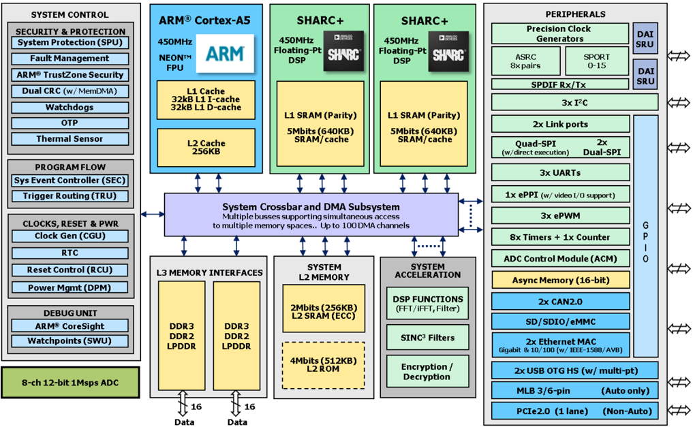

Data

Data

Figure 1. ADSP-SC58x Block Diagram

Copyright 2015, Analog Devices, Inc. All rights reserved. Analog Devices assumes no responsibility for customer product design or the use or application of customers' products or for any infringements of patents or rights of others which may result from Analog Devices assistance. All trademarks and logos are property of their respective holders.  Information furnished by Analog Devices Applications and Development Tools Engineers is believed to be accurate and reliable, however no responsibility is assumed by Analog Devices regarding the technical accuracy and topicality of the content provided in all Analog Devices' Engineer-to-Engineer Notes.

Rev 2 - October 9, 2015

## Dual-SHARC Audio Talkthrough Overview

The ADSP-SC58x dual-SHARC audio talkthrough (Figure 2) takes in four channels of analog audio and digitizes it. The digitized audio is passed serially through two SHARC cores, and the result is converted back to the analog domain and output as four channels of analog audio. Each SHARC runs its own audio algorithm, and the result of the audio algorithm running on SHARC #1 (Fs1) is passed to SHARC #2. Buffering allows the Fs1 algorithm executing on SHARC #1 to run concurrently with the Fs2 algorithm on SHARC #2, resulting in parallel execution with respect to time.

Figure 2. Dual-SHARC Audio Talkthrough Block Diagram

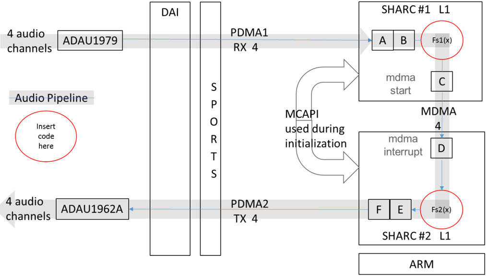

The dual-SHARC audio talkthrough is an example of how to use ICC between the SHARC cores. The ADSP-SC58x  processor  supports  two  forms  of  ICC,  Multi-Core  Communications  API  (MCAPI)  and Memory  DMA  (MDMA).  This  example  demonstrates  both  ICC  methods,  as  MCAPI  is  used  during initialization to configure MDMA, and MDMA is used during runtime to maximize performance.

In this example, the ARM core is only used to initialize various ADSP-SC58x peripherals. Out of reset, the ARM core executes first while the SHARC+ cores are held in reset. After the ARM core initializes various peripherals, it releases the SHARC+ cores from reset. MCAPI is then used to synchronize the two SHARC+ cores after they come out of reset.

Figure 3 shows the path of an audio frame through the ADSP-SC58x processor. A frame containing 16 samples of four-channel, 32-bit audio data (256 bytes) is transferred via peripheral DMA (PDMA) from the SPORT module to buffer A or B, both located in the SHARC #1 L1 SRAM (S1L1), at which point SHARC #1 runs the Fs1 algorithm on the frame and stores the result in buffer C (also in S1L1). SHARC #1 then starts the MDMA transfer from buffer C to buffer D, which is located in SHARC #2 L1 SRAM (S2L1).


When the transfer completes, the MDMA done interrupt is triggered on SHARC #2, and the Fs2 algorithm is then executed by SHARC #2 as part of the interrupt handler.

Figure 3. Dual-SHARC Audio Talkthrough Pipeline

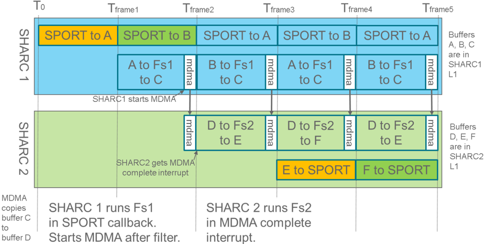

The SPORT allocated to SHARC #2 is synchronized with the SPORT allocated to SHARC #1 during initialization. After the MDMA completion interrupt occurs, SHARC #2 has almost one whole frame worth of time before its SPORT callback function expects another frame.

## Inter-Core Communications (ICC)

ICC is used to transfer data between cores. As shown in Figure 4, the ADSP-SC58x processor contains two SHARC+ cores, each with 640KB of L1 SRAM and a shared 256KB L2 SRAM. Each SHARC+ L1 SRAM is mapped twice in the system's linear address space - one region is private to that SHARC+ core, and the other is accessible from any core (multiprocessor space). Transfers to or from the SHARC+ L1 SRAM use the multiprocessor address space. The ARM core can also copy data to either SHARC+ L1 SRAM using the multiprocessor space.

The  ADSP-SC58x  tools  supports  two  ICC  libraries  for  transferring  data  between  cores,  MCAPI  and MDMA. MCAPI is an industry standard, and the ADSP-SC58x port of MCAPI uses core operations for transferring  data,  which  consumes  CPU  cycles.  MDMA  is  a  hardware  block  in  the  ADSP-SC58x architecture that can transfer data between cores in the background without CPU intervention. The ADSPSC58x processor has a high-performance MDMA channel designed to transfer data at up to 1500MB/s between SHARC+ L1 SRAM spaces. This high-speed MDMA channel is the fastest and most efficient method of transferring data between the two SHARC+ L1 SRAM spaces.


Figure 4. Moving Data in the ADSP-SC58x Processor

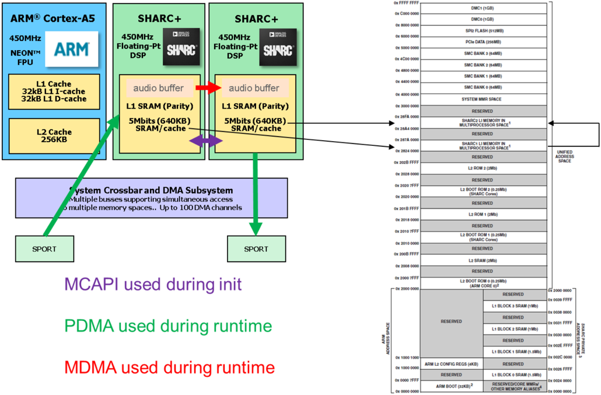

The dual-SHARC audio talkthrough example uses MCAPI to synchronize and share information between cores during initialization. At runtime, MDMA is used to transfer audio frames from SHARC #1 to SHARC #2 for maximum performance and efficiency.

## Multicore Communications API (MCAPI)

The Multicore Communications Applications Interface (MCAPI) protocol is a message-passing API that provides for communication and synchronization between processing cores in embedded systems. In the ADSP-SC58x processor, MCAPI can be used to transfer data between all three cores (e.g., S1L1 to S2L1, L2 SRAM to S1L1 or S2L1, S1L1 or S2L1 to L2 SRAM, etc.).

As shown in Figure 5, MCAPI uses domains, nodes, and endpoints for communications. A domain is a collection of nodes. Each core is a node, and all three nodes comprise a single domain (the ADSP-SC58x processor itself). Each node can have multiple endpoints, which can be thought of as the ends of a pipe. Two endpoints are required to pass data through the pipe.


Figure 5. MCAPI Overview

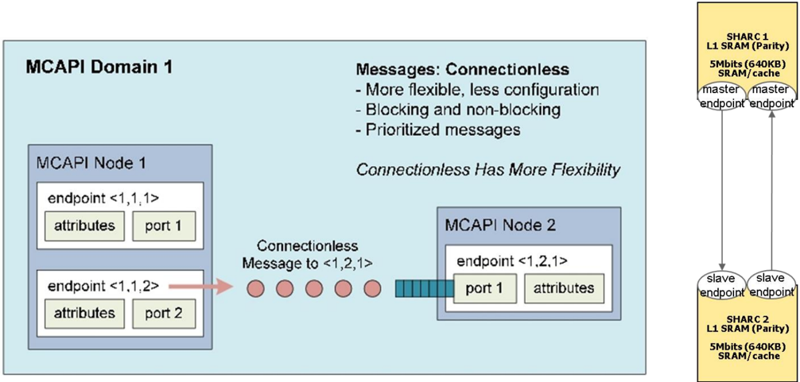

The ADSP-SC58x implementation of MCAPI uses core operations to transport data. Core operations use CPU cycles to copy data between buffers, making it less efficient than DMA. When MCAPI transfers data from one core to the next, a Trigger Routing Unit (TRU) signal is sent to indicate to the receiving core that the data is available.

The MCAPI API is easy to use, supporting both polling and blocking function calls. MCAPI does not support callbacks. Once an endpoint is generated on both sides of the pipe, data can be transferred in both directions.

The  dual-SHARC  talkthrough  example  uses  MCAPI  during  initialization  to  transfer  information  and provide synchronization in setting up the MDMA connection between the SHARC cores. It is not used during runtime in this example, though future examples will use MCAPI during runtime to exchange control signals and data between the ARM and SHARC cores. This is an interrupt-driven example, as the main() code (background thread) for all three cores is simply a while loop awaiting interrupts. Using blocking MCAPI calls in the background thread would have no effect on the cycles available for the filters.

MCAPI messages, shown in Figure 5, provide a flexible method to transmit data between endpoints without first establishing a connection. The buffers on both the sender and receiver sides must be provided by the user application. MCAPI messages may be sent with different priorities on a per-message basis.

## Using MCAPI to Synchronize MDMA Initialization

MCAPI messages are used to share data and perform synchronization during initialization of the dualSHARC audio talkthrough example. To send a message using MCAPI, two endpoints must be created - one by the source core and one by the destination core. Figure 6 shows the source code from for creating the MCAPI endpoints. After the source core creates its endpoint using mcapi\_endpoint\_create() , it waits for the  destination  core  to  create  its  endpoint  by  calling  the mcapi\_endpoint\_get() function.  After  both endpoints are created, communication can occur between cores.


```
// Open MCAPI connection to slave A************************************************************************* DEBUGMSG(stdout, "Corel: Creating MCAPI master endpoint\n" ); master_ep = mcapi_endpoint_create(1, &mcapi_status); // Create master MCAPI endpoint if (MCAPI_SUCCESS != mcapi_status) { #ifdef MCAPI_VERBOSE mcapi_display_status(mcapi_status, status_buff, sizeof(status_buff)); DEBUGMSG(stdout, "[ERR] mcapi_endpoint_create %s %s %d\n", status_buff, _FILE, _LINE_); #endif return(SHARC_LINK_MCAPI_ERROR); 1 DEBUGMSG(stdout,' "Corel: Waiting for McAPI slave endpoint creation\n" ); slave_ep = mcapi_endpoint_get(DOMAIN, NODE_CORE_1, 1, MCAPI_TIMEOUT_INFINITE, &mcapi_status); if (MCAPI_SUCCESS != mcapi_status) // Get MCAPI slave endpoint #ifdef MCAPI_VERBOSE mcapi_display_status(mcapi_status, status_buff, sizeof(status_buff)); DEBUGMSG(stdout, "[ERR] mcapi_endpoint_get %s %s %d\n", status_buff, _FILE, _LINE_); #endif return (SHARC_LINK_MCAPI_ERROR); 1 DEBUGMSG(stdout, "Core1: MCAPI slave endpoint captured\n" ）；
```

Figure 6. Master/Source MDMA Initialization/Synchronization - Opening a MCAPI Connection

Figure 7 shows the code for transmitting the Sid from the master/source core to the slave/destination core. After the two endpoints are established, the source core can send the Sid to the destination core. After the source core sends the Sid to the destination core, it waits for the destination core to install the interrupt handler. This waiting occurs in the mcapi\_msg\_recv() function, which blocks until the destination core installs the interrupt handler and sends the destination buffer address. Upon receiving the destination buffer address, the source core continues execution.


```
// Send SID to slave DEBUGMSG(stdout，"Corel:Sending Sid to slave\n"); mcapi_msg_send(master_ep, slave_ep, &nSid, sizeof(nSid), 0, &mcapi_status); if (MCAPI_SUCCESS != mcapi_status) // Send Sid to slave over MCAPI { #ifdef MCAPI_VERBOSE mcapi_display_status(mcapi_status, status_buff, sizeof(status_buff)); DEBUGMSG(stdout, "[ERR] mcapi_msg_send_i %s %s %d\n", status_buff, _FILE_, LINE_); #endif retu rn(SHARC_LINK_MCAPI_ERROR); 1 A********************************************************************** // Wait for buffer address from slave DEBUGMSG(stdout, "Corel: Waiting for destination address from slave\n" ); mcapi_msg_recv(master_ep, &DestAddress, sizeof(DestAddress), &RcvBytes, &mcapi_status); if （ MCAPI_SUCCESS != mcapi_status ) // Block here until we receive the buffer address from slave { #ifdef MCAPI_VERBOSE mcapi_display_status(mcapi_status, status_buff, sizeof(status_buff)); DEBUGMSG(stdout, "[ERR] mcapi_msg_recv %s %s %d\n", status_buff, _FILE_, LINE); #endif return(SHARC_LINK_MCAPI_ERROR); 1 if( RcvBytes != 4 ） return(SHARC_LINK_MCAPI_ERROR); Il Error if we did not receive the address A************************************************************************** // SHARC_link connection established ********************************************************************** DEBUGMSG(stdout, "Core1: SHARKlink connection established Ox%08X\n"， DestAddress ); *DMASlaveDestinationAddress = DestAddress; // Return DMA destination address return SHARC_LINK_SUCCESS;
```

Figure 7. Master/Source MDMA Initialization/Synchronization - TX Sid to Slave, RX Buffer Address from Slave

The source code for the slave/destination side is shown in Figure 8. The slave creates an endpoint which becomes the other side of the MCAPI pipe. With an endpoint created on both sides (master and slave), a communication  pipe  is  created.  Using  this  pipe,  the  master  sends  the  Sid,  which  is  received  by  the mcapi\_msg\_recv() call. After receiving the Sid, the destination core can insert the interrupt handler.


```
// Open MCAPI connection to master DEBUGMSG(stdout, "Core2: Creating MCAPI slave endpoint\n" ); slave_ep = mcapi_endpoint_create(1, &mcapi_status); // Create MCAPI slave endpoint if (MCAPI_SUCCESS != mcapi_status) { #ifdef MCAPI_VERBOSE mcapi_display_status(mcapi_status, status_buff, sizeof(status_buff)); DEBUGMSG(stdout, "[ERR] mcapi_endpoint_create %s %s %d\n", status_buff, _FILE, _LINE_); #endif return(SHARC_LINK_MCAPI_ERROR); 1 DEBUGMSG(stdout, "Core2: MCAPI slave endpoint created\n" ); A************************************************************************** // Wait for Sid from master mcapi_msg_recv(slave_ep, &nSid, sizeof(nSid), &RcvBytes, &mcapi_status); if (MCAPI_SUCCESS != mcapi_status) // Block until we receive the Sid from master { #ifdef MCAPI_VERBOSE mcapi_display_status(mcapi_status, status_buff, sizeof(status_buff)); DEBUGMSG(stdout, "[ERR] mcapi_msg_recv_i %s %s %d\n", status_buff, _FILE_, _LINE_); #endif return (SHARC_LINK_MCAPI_ERROR); 1 DEBUGMSG( stdout, "Core2: Received 0x%08X Sid from master\n", nSid ); // insert interrupt handler based on Sid adi_int_InstallHandler (nSid, pfHandler, NULL, true); DEBUGMSG( stdout, "Core2: MDMA interrupt handler installed\n" );
```

Figure 8. Slave/Destination MDMA Initialization/Synchronization - Receiving Sid and Installing the Interrupt Handler

Figure  9  shows  the  code  on  the  slave/destination  core  for  acknowledging  the  insertion  of  the  interrupt handler  and  sending  the  buffer  address  to  the  master/source  core.  After  the  destination  core  inserts  the interrupt handler, it sends its audio buffer address to the source core. The source core will use this address when initiating the MDMA transfer. This transaction also informs the source core that the interrupt handler is installed and it is OK to start initiating transfers.


```
***************************************************************** 119 sends DMA destination buffer address to Master A************************************************************************** DestAddress = (uint32_t)DMASlaveDestinationAddress; DEBUGMSG( stdout, "Core2: Sending buffer destination address Ox%08X to master\n", DestAddress ); master_ep = mcapi_endpoint_get(DOMAIN, NODE_CORE_0, 1, MCAPI_TIMEOUT_INFINITE, &mcapi_status); // Get master endpoint if (MCAPI_SUCCESS != mcapi_status) { #ifdef MCAPI_VERBOSE mcapi_display_status(mcapi_status, status_buff, sizeof(status_buff)); DEBUGMSG(stdout, "[ERR] mcapi_endpoint_get %s %s %d\n", status_buff, _FILE, _LINE_); #endif return (SHARC_LINK_MCAPI_ERROR); 1 mcapi_msg_send(slave_ep, master_ep, &DestAddress, sizeof(DestAddress), 0, &mcapi_status); if (MCAPI_SUCCESS != mcapi_status) // Send DMA transfer destination address to master { #ifdef MCAPI_VERBOSE mcapi_display_status(mcapi_status, status_buff, sizeof(status_buff)); DEBUGMSG(stdout, "[ERR] mcapi_msg_send %s %s %d\n", status_buff, _FILE, _LINE_); #endif DEBUGMSG( stdout, "Core2: SHARC_link connection established\n" ); return (SHARC_LINK_SUCCESS);
```

Figure 9. Slave/Destination MDMA Initialization/Synchronization - Sending the Audio Buffer Address to the Master

## Memory DMA (MDMA)

Memory DMA (MDMA) is a hardware block dedicated to moving data around the various memory elements on the ADSP-SC58x processor. There are four MDMA streams - two low-speed (450MB/s), a mediumspeed (900MB/s), and a high-speed (1500MB/s) - which can be used to transfer data from S1L1 to S2L1 in the background with no CPU intervention, as shown in Figure 10.

Figure 10. MDMA Supports 4 Streams up to 1500 MB/s

|   MDMA Stream | Channel (S/D)   | FIFO Depth   | Speed   | Performance S1L1 to S2L1   |
|---------------|-----------------|--------------|---------|----------------------------|
|             0 | 8,9             | 128,64       | Low     | 450MB/s                    |
|             1 | 18,19           | 128,64       | Low     | 450MB/s                    |
|             2 | 39,40           | 128,64       | Medium  | 900MB/s                    |
|             3 | 43,44           | 128,64       | High    | 1500MB/s                   |

After the MDMA channel is configured, sending a data buffer from S1L1 is done using a simple MDMA library call. After the transfer is complete, a MDMA completion interrupt occurs on the SHARC #2 core, effectively combining the transfer and buffer ready signaling into a single hardware module. The result is the least amount of CPU cycles possible used to move the data between cores.

Figure  11  describes  how  to  setup  and  use  MDMA  to  transfer  data  between  SHARC  cores.  During initialization, the source core (SHARC #1) opens the DMA stream using a device driver call. The source core sends the stream identifier (Sid) to the destination core, which then uses the Sid to install an interrupt handler. The destination core sends the address of its buffer back to the source core, which will then use this address when initiating future transfers.

At runtime, a transfer from the source buffer (S1L1) to the destination buffer (S2L1) is initiated by the source core. When the transfer is complete, the DMA engine sends a signal to the destination core (SHARC #2), which causes the SHARC #2 core to execute the MDMA complete callback function.

Two pieces of information must be shared between cores to initialize a  MDMA transfer. The Sid is a constant, and the destination buffer address is a pointer to the destination of the MDMA transfer (an address within the destination core's L1 SRAM space). If the stream ID is hardcoded in the source core firmware, the Sid could be hardcoded in the destination core firmware.

Normally, a global buffer address is not constant at build time. The linker can decide to move any global variable  anywhere  in  an  address  region  defined  by  the  Linker  Description  File  (LDF).  Forcing  the destination buffer into a constant place in memory can be done by creating a region in the LDF. If the buffer is set to the beginning of this custom region, the destination buffer address will be constant. If the destination buffer address is constant, the destination buffer address can be hardcoded in the source core firmware.


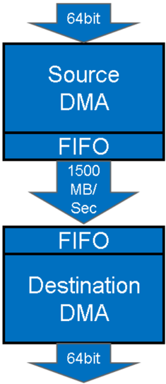


Figure 11. Using MDMA to Transfer Audio Buffers Between SHARC+ Cores

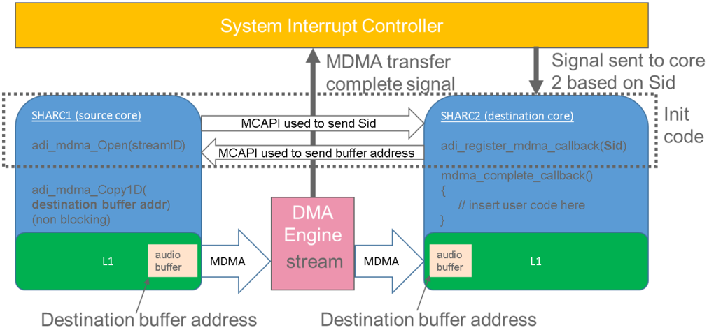

Although  constant  data  does  not  need  to  be  shared  between  cores  to  initialize  MDMA,  the  MDMA configuration process does require synchronizations between cores, which requires a semaphore (using the TRU or a global variable). This example uses MCAPI for synchronization. The example does not use a constant destination buffer address, so MCAPI is also used to transfer the destination buffer address from the destination core to the source core.

## MDMA Driver

The MDMA driver is documented in the CrossCore® Embedded Studio (CCES) On-line Help system, and information on any API function is easily retrieved by performing a search by function name. Figure 12 shows  the  MDMA  initialization  portion  of  the  example.  The  MDMA  driver  is  initialized  using  the adi\_mdma\_Open() function, which has arguments for stream ID, pointers to workspace RAM, and pointers for a source and destination handle. The handles are then used for all future transactions with the driver.

By default, the MDMA driver enables a transfer completion interrupt on the same core (transfer source) that opened the MDMA driver (called adi\_mdma\_Open() ). For this application, the completion interrupt needs to occur on the other core (destination core). The adi\_mdma\_EnableChannelInterrupt() driver function call disables the transfer complete interrupt on the source core. In order to change the completion interrupt from the source to the destination, the Sid needs to be set to the destination core. The adi\_mdma\_GetChannelSID() function gets the Sid, and the adi\_sec\_SetCoreID() function is then used to tell the driver to send the MDMA completion interrupt to the destination core.

The adi\_mdma\_EnableChannelInterrupt() function  call  enables  an  interrupt  on  the  source  core  side when the MDMA transfer is complete, and the adi\_dma\_UpdateCallback() function tells the driver which function to call when the MDMA interrupt hits.


```
// Open MDMA channel DEBUGMSG(stdout,"Corel: Opening MDMA channel\n" ); eResult = adi_mdma_Open (MEMCOPY_STREAM_ID, &MemDmaStreamMem[0], &hMemDmaStream, &hSrcDmaChannel, &hDestDmaChannel, NULL, NULL); if (eResult != ADI_DMA_SUCCESS) { DEBUGMSG(stdout,"Failed to open MDMA stream, Error Code: Ox%08X\n", eResult); return SHARC_LINK_ERROR; } ******************* // Configure MDMA channel ********************* adi_mdma_EnableChannelInterrupt(hDestDmaChannel,false,false); // Disable the MDMA destination transfer complete interrupt adi_mdma_GetChannelSID (hDestDmaChannel,&nSid); // Get the channel SID for the MDMA destination complete interrupt adi_sec_SetCoreID(nSid,ADI_SEC_CORE_1); // Set interrupt to occur on Core 2(unfortunate enumeration name in driver) adi_mdma_EnableChannelInterrupt(hSrcDmaChannel,true,true); // Enable the MDMA source transfer complete interrupt eResult = adi_dma_UpdateCallback (hSrcDmaChannel,MemDmaCallback,hMemDmaStream); // Register Source transfer complete interrupt /* IF（Failure）*/ if (eResult != ADI_DMA_SUCCESS) DEBUGMSG("Failed to set DMA callback, Error Code: Ox%08X\n", eResult); return SHARC_LINK_ERROR;
```

Figure 12. MDMA Source Driver

After the source core opens the MDMA driver and gets the Sid, the Sid is sent to the destination core. The destination code is shown in Figure 13. The destination core uses the Sid from the source core to install an interrupt handler. The adi\_int\_InstallHandler() function installs a callback associated with the Sid into the interrupt driver for the destination core. When the MDMA completes, the interrupt is executed on the destination core.


```
//Interrupt handler for MDMA transfer completeon slave Sharc staticvoid DataTransferFromMasterComplete(uint32_t SID,void *pCBParam) //Fix for stutter if((_builtin_emuclk()-PreviousCycleTime)>2000) PreviousCycleTime=_builtin_emuclk(); TIMESTAMP ++RxBuffersReceived; if(pSportOutputBuffer!=0) OutputSeriesFilter(&BufferFromCore1[o],pSportOutputBuffer,AUDIO_BUFFER_SIZE); { //insert interrupthandlerbased on Sid adi_int_InstallHandler （nSid,pfHandler,NULL,true); DEBUGMSG( stdout, "Core2: MDMA interrupt handler installed\n" );
```

Figure 13. MDMA Destination Driver

As shown in Figure 14, the MDMA driver must be synchronized between cores during initialization, which is  accomplished  in  the  dual-SHARC  talkthrough  using  MCAPI.  The  destination  core  cannot  install  an interrupt handler until it receives the Sid from the source core, and the source core cannot start sending data until the destination core has installed the interrupt handler.

The source core opens the MDMA driver on a specific stream and sends the Sid to the destination core, which blocks until the Sid is received. After receiving the Sid, the destination core can install its interrupt handler.

As the source core cannot start sending data to the destination core until the destination core has installed the interrupt handler, it blocks after opening the MDMA driver until it receives a signal from the destination core indicating the interrupt handler is installed. In this example, MCAPI sends the destination address from the destination core to the source core. The source core then uses the destination address to MDMA audio frames to the destination buffer.


Figure 14. Sequence for Setting up the MDMA Driver

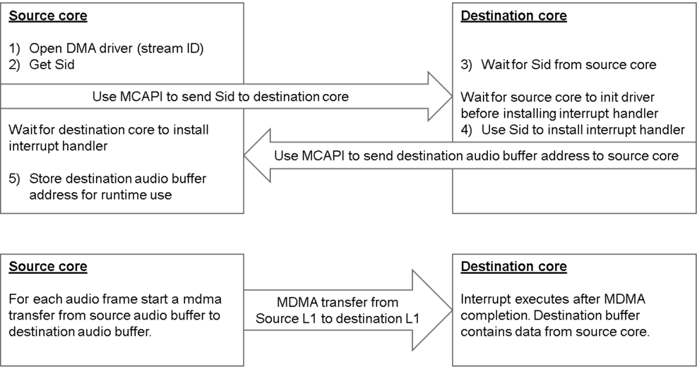

## Loading and Running the Example

The dual-SHARC talkthrough example has code in all three cores. At reset, the ARM core initializes the board and the SPU while holding the SHARC cores in reset. After the ARM core completes the initialization, the SHARC cores are released from reset, and both SHARC cores start executing at approximately the same time. Figure 15 shows the talkthrough project modules spread across the three cores. The main() function for the source core (SHARC #1) is located in MultiCoreTalkThruSharcSharc\_Core1.c. The main() function for the destination core (SHARC #2) is located in MultiCoreTalkThruSharcSharc\_Core2.c.

The Adau1979Interface.c module is the ADC driver containing all the functions required to interface to the ADAU1979 codec, and it executes on the SHARC #1 source core. The Adau1962Interface.c module is the DAC driver containing all the functions required to interface to the ADAU1962 codec, which executes on the SHARC #2 destination core.

Instantiating  the  MDMA  interface  is  done  on  the  source  side  using  the  SHARC\_linkMasterInterface.c module and on the destination side using the SHARC\_linkSlaveinterface.c module. These modules perform the data exchange and synchronization used to initialize the MDMA transfer.


Figure 6. Dual SHARC Talk-through Project and Modules

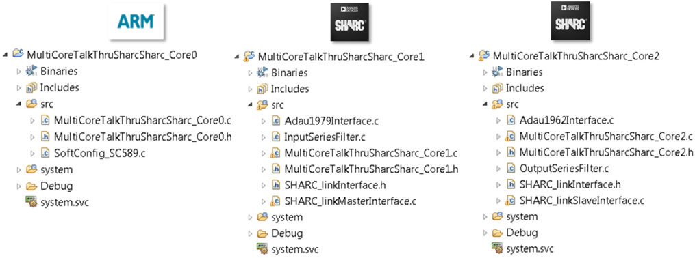

Finally, the InputSeriesFilter.c module contains the source core audio filter (currently just a pass through). Similarly, the OutputSeriesFilter.c module contains the destination core audio filter (also currently just a pass through). The user just needs to insert their audio processing code into these modules!

To run the example, unzip the example workspace, open CCES, and switch to the example workspace. Once open, build the project by clicking on the hammer icon, as shown in Figure 16 (indicated as step 1). Then click on the debug icon (green bug), as indicated in Figure 16 step 2.

Figure 7. Loading and Running the Example (Steps 1 and 2)

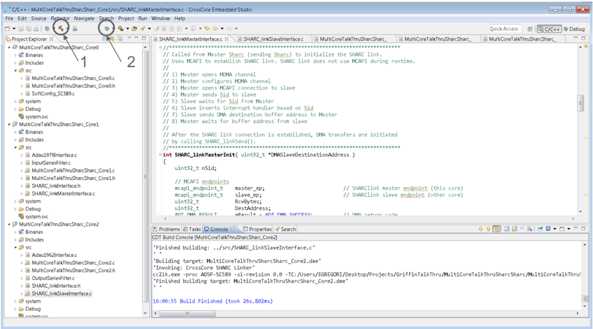


This puts the IDE in the debugger perspective. Click the multi-core resume icon (as shown in Figure 17, indicated as step 3). This will cause the ARM core to execute its initialization code, which releases the SHARC cores from reset. The SHARC cores will run until they hit the breakpoints automatically inserted at the beginning of their respective main() routines, but the ARM core is still running.

Figure 8. Loading and Running the Example (Step 3)

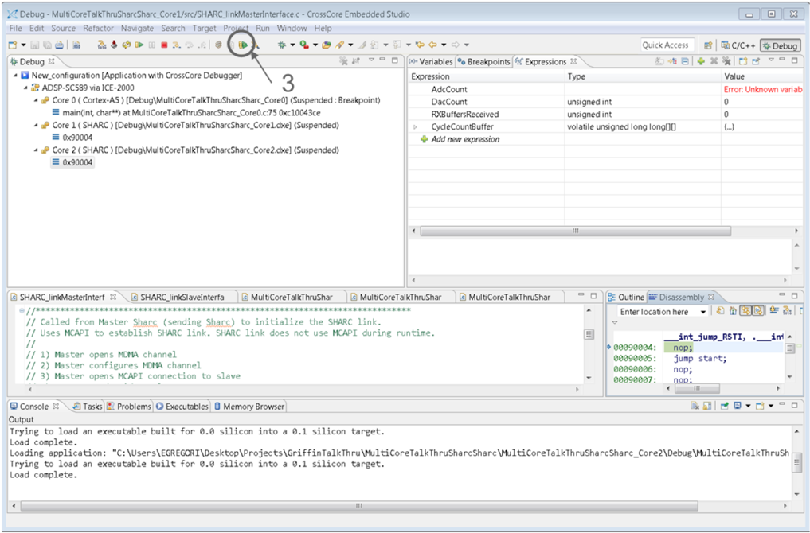

In order to start the SHARC cores, we need to halt the ARM core to reactivate the multicore resume button. Click on the multi-core pause icon, as shown in Figure 18 (indicated as step 4). At this point, all three cores are halted. The ARM has done its initialization and is paused in a while(1) loop. The SHARC cores are both paused at the start of main() .


Figure 9. Loading and Running the Example (Step 4)

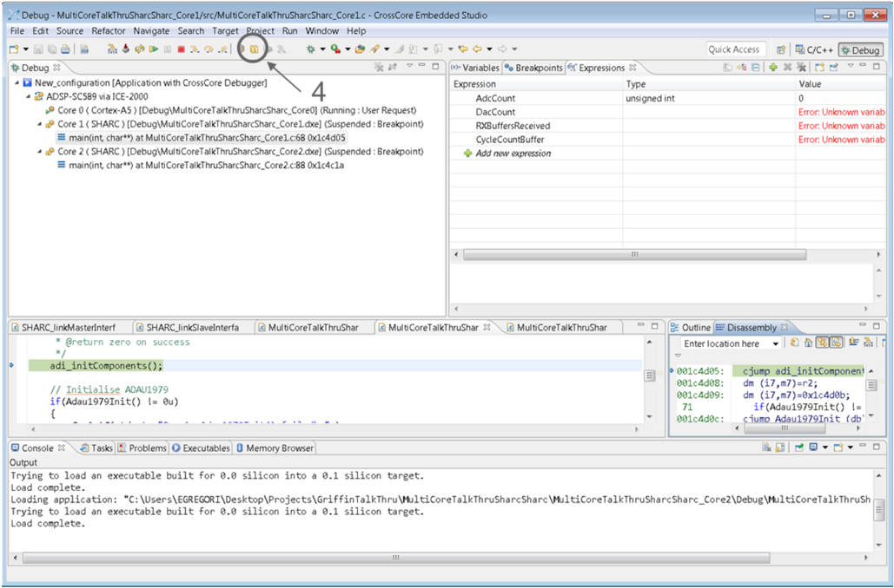

At this point we want to resume all three cores at the same time. Click the multi-core resume icon, as shown in Figure 19 (indicated as step 5).


Figure 10. Loading and Running the Example (Step 5)

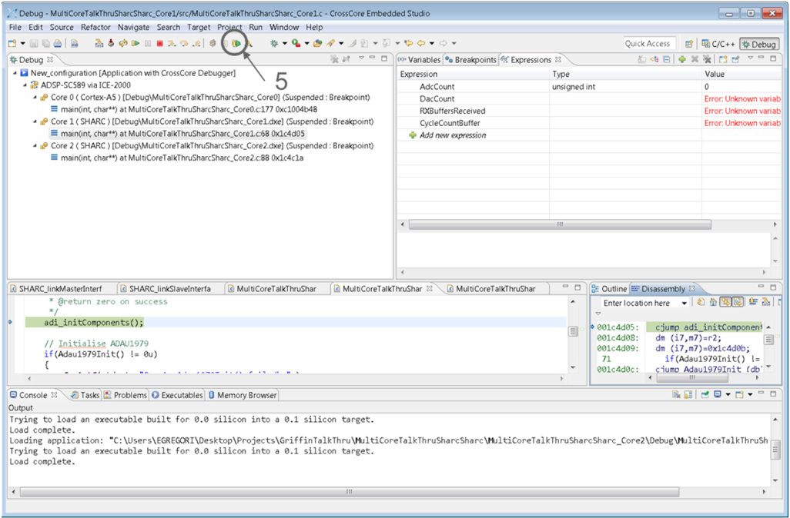

After all three cores are resumed, the console window will show the two SHARC cores communicating with each other via MCAPI (as shown in Figure 20), transferring the Sid and audio buffer destination address. After the MDMA ICC is fully configured, the ADC is enabled. After an audio frame is received from the ADC, it is sent to the destination core using MDMA. The MDMA completion interrupt on the destination core causes the DAC to be enabled. The result is synchronization between ADC and DAC.


Figure 11. Example Output in Console Window

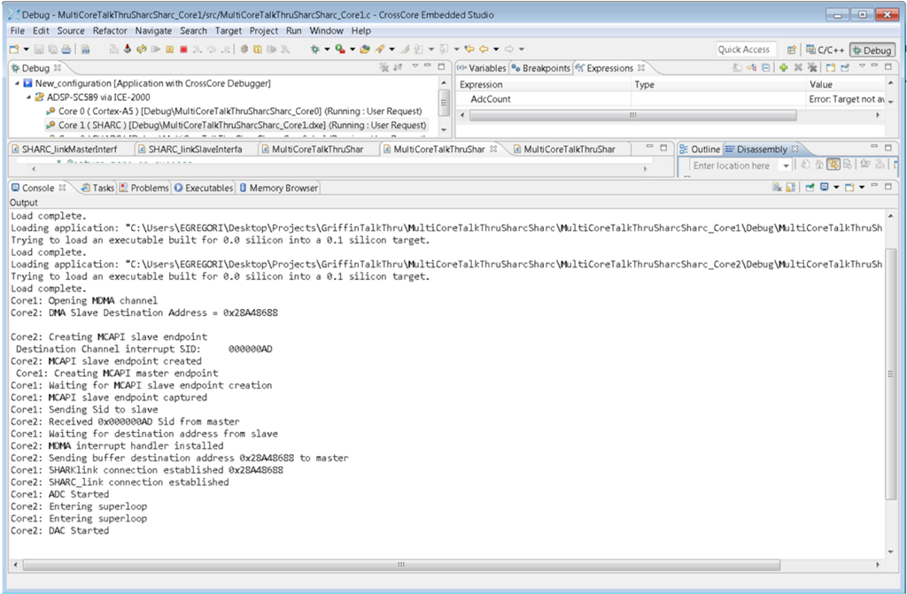

## Conclusion

The ADSP-SC58x processor is a multicore SoC with an ARM Cortex-A5 core and two SHARC+ cores. While MCAPI is very easy to use with a rich API, it uses core accesses to move data from one SRAM to the next, requiring CPU cycles that could otherwise be used by application code. MDMA requires a separate synchronization mechanism during configuration (making it more difficult to setup) and some compile-time decisions  about  how  to  share  Sid  and  destination  buffer  address  during  initialization.  The  advantage, however, is that MDMA does not require CPU cycles to transfer data (data transfer is done by hardware in the background) and a hardware-generated interrupt occurs on the destination core to indicate the buffer is ready for processing. MDMA uses significantly less CPU cycles to transfer data from a source to destination.

## References

- [1] Associated ZIP File (EE377v01.zip) for ADSP-SC58x MCAPI and MDMA Dual SHARC Talkthrough Example (EE-377). June 2015. Analog Devices, Inc.
- [2] SHARC+ Core Dual Processor with ARM Cortex-A5 Data Sheet. Rev PrC, May 2015. Analog Devices, Inc.
- [3] ADSP-SC58x Processor Hardware Reference. Preliminary Revision 0.2, June 2015. Analog Devices, Inc.

## Document History

| Revision                                | Description          |
|-----------------------------------------|----------------------|
| Rev 2 - October 9, 2015 by Eric Gregori | Corrected Throughput |
| Rev 1 - June 11, 2015 by Eric Gregori   | Initial Release      |

