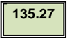

## Engineer-to-Engineer Note


EE-392

## Technical notes on using Analog Devices products and development tools

Visit our Web resources http://www.analog.com/ee-notes and http://www.analog.com/processors or e-mail processor.support@analog.com or processor.tools.support@analog.com for technical support.

## Estimating Power for ADSP-SC58x/2158x SHARC+ Processors

Contributed by Nabeel Shah and Joe B.

## Introduction

This EE-note describes how to estimate power consumption on ADSP-SC58x/2158x processors (hereafter referred to collectively as 'ADSP-SC58x processors'), which are multi-core high-performance processors with a multitude of peripherals, accelerators and high-speed Direct Memory Access (DMA) channels. These processors have multiple power  and  clock  domains,  and  the  intent  of  this  application  note  is  to  provide  a  simplified  methodology  for estimating the total System-on-Chip (SoC) power consumption depending on the amount of processor activity.

Power estimates are based on design simulations and characterization data measured across power supply voltage, core and system clock frequency, and junction temperature (TJ) and can vary widely depending on how the on-chip ADSP-SC58x  resources  are  used.  Thus,  power  consumption  cannot  be  estimated  accurately  without  an understanding of the components in use and the usage patterns for those components. By providing the usage parameters that describe how and what is being used, accurate consumption estimates can be obtained for use by board designers to consider when developing their ADSP-SC58x-based power supply and thermal relief designs.

Please  consult  the  following  sections  of  the ADSP-SC582/583/584/587/589/ADSP-21583/584/587  SHARC+  Dual Core DSP with ARM Cortex®-A5 Embedded Processor Datasheet [1] for details specific to discussions throughout this EE-Note:

-  See the Recommended Operating Conditions section for details regarding supported power supply ranges.
-  See  the Electrical  Characteristics and  subsequent Total  Internal  Power  Dissipation sections  for  details regarding current specifications.

In the associated ZIP file [2] furnished with this EE-note is a convenient Power Calculator Tool that allows users to obtain a total power profile by populating the cells in a spreadsheet with data found both in the processor datasheet and  as  a  result  of  calculations  specific  to  the  intended  application.  For  cases  where  information  in  the  power calculator is not also in the datasheet, it is explained in this document. This EE-note also describes how to provide the appropriate input to the power calculator such that the full power profile for the application can be obtained and details how the calculations are made and how the results contribute to the overall power profile.

Copyright 2016, Analog Devices, Inc. All rights reserved. Analog Devices assumes no responsibility for customer product design or the use or application of customers' products or for any infringements of patents or rights of others which may result from Analog Devices assistance. All trademarks and logos are property of their respective holders. Information furnished by Analog Devices applications and development tools engineers is believed to be accurate and reliable, however no responsibility is assumed by Analog Devices regarding technical accuracy and topicality of the content provided in Analog Devices Engineer-to-Engineer Notes.

Rev 1 - October 24, 2016

## Power Domains

There are multiple power domains associated with the ADSP-SC58x processor, and total power consumption is the sum  of  the  power  consumed  across  all  of  them.  There  are  seven  major  power  domains  that  are  significant contributors to the overall power profile:

-  VDD\_INT: most internal on-chip logic (e.g., cores, accelerators, DMA engines, etc.)
-  VDD\_EXT: I/O pad ring, JTAG, etc.
-  VDD\_DMC: DDR controller, DDR PHY logic
-  VDD\_USB: USB PHY logic
-  VDD\_PCIE, VDD\_PCI\_RX, and VDD\_PCI\_TX: PCIe core and PCIe PHY logic




The VDD\_RTC (for the Real-Time Clock) and VDD\_HADC (for the Housekeeping ADC) power domains are marginal contributors to total power and can be ignored when calculating the full power profile for an application.

## Estimating Internal Power Consumption (PDD\_INT\_TOT)

The total  power  consumption  associated with the on-chip logic  (on the VDD\_INT  supply)  is  the  sum  of  the  static (leakage) and dynamic (switching) power components. The dynamic component depends on processor activity, which includes the instruction execution sequence, the data operands involved, and the instruction rate on each core, as well as the number of active peripherals/accelerators, their clock rates, and any associated DMA data traffic. The static component is independent of processor activity and is a function of temperature and voltage.

The internal current (IDD\_INT\_TOT) consumed by ADSP-SC58x processors is comprised of:

-  I DD\_INT\_ STATIC: leakage current
-  IDD\_INT\_CCLK\_A5\_DYN: dynamic current in CCLK domain for ARM Cortex-A5 (core0)
-  IDD\_INT\_CCLK\_SHARC1\_DYN: dynamic current in CCLK domain for SHARC+ (core1)
-  IDD\_INT\_CCLK\_SHARC2\_DYN: dynamic current in CCLK domain for SHARC+ (core2)
-  IDD\_INT\_DCLK\_DYN: dynamic current in DCLK domain (no other activity)
-  IDD\_INT\_SYSCLK\_DYN: dynamic current in SYSCLK domain (no other activity)
-  IDD\_INT\_SCLK0\_DYN: dynamic current in SCLK0 domain (no other activity)
-  IDD\_INT\_SCLK1\_DYN: dynamic current in SCLK1 domain (no other activity)
-  IDD\_INT\_OCLK\_DYN: dynamic current in OCLK domain (no other activity)
-  IDD\_INT\_USB\_DYN: dynamic current in USB domain (no other activity)
-  IDD\_INT\_PCIE\_DYN: dynamic current consumed by PCIe block
-  IDD\_INT\_GIGE\_DYN: dynamic current consumed by GigE block
-  IDD\_INT\_MLB\_DYN: dynamic current consumed by MLB block (only applies to automotive models)
-  IDD\_INT\_DMA\_DR\_DYN: dynamic current consumed due to DMA activity
-  IDD\_INT\_ACCL\_DYN: dynamic current consumed by accelerator block

Therefore, the total current can be expressed as the sum of each of the above components, where there is a single static power component and several dynamic power components that must be included in the overall power profile.


Typical  and  maximum  specifications  for  IDD\_INT  are  provided  in  the  processor  datasheet  at  specific  voltages, frequencies,  and  temperatures,  and  the  following  sections  describe  how  to  use  this  data  to  calculate  the application's overall power and thermal needs.

## Estimating Total IDD\_INT Dynamic Current

Due to the multi-featured clock and power designs of the ADSP-SC58x processors, there are many contributors to the overall dynamic component associated with the power consumed by the core. While there is opportunity to disable clocks to the various domains, each must be scrutinized to determine what needs to be accounted for with respect to power dissipation when any combination of these domains is active in the system.

## Core Dynamic Current (IDD\_INT\_CCLK\_A5\_DYN, IDD\_INT\_CCLK\_SHARC1\_DYN, and IDD\_INT\_CCLK\_SHARC2\_DYN)

The ADSP-SC58x processor datasheet provides baseline dynamic current consumption specifications, which are obtained with the processor running what is defined to be a 'typical' application and is represented in the datasheet by the IDD\_TYP specification. However, these conditions do not represent all possible application code and ignore the concept of silicon process variation, which also influences the power profile because the transistor physics are not uniform across it. When making decisions regarding the power supply design, the worst-case scenario must always be  considered,  and  the  above  assumptions  are  addressed  in  two  places  in  the  datasheet  in  order  to  facilitate extrapolation to obtain the maximum requirements for the power supply design:

-  Dynamic Current tables - provide the maximum (across process) core dynamic current spec for each core as a function of voltage (VDD\_INT) and frequency (fCCLK) while running 'typical' application code
-  Activity Scaling Factor (ASF) tables - describe discrete dynamic activity levels for each processor core to provide insight as to how the dynamic current scales with changing loads on the core

The data in the Dynamic Current tables for the two types of cores on the ADSP-SC58x processor were obtained based on the following equations, which include  a scaling factor  unique to each type of core representing the currents consumed per MHz per Volt in each core clock domain; therefore, VDD\_INT is in terms of Volts, and fXXX is in terms of MHz in the following core clock dynamic current equations:

-  I DD\_INT\_ CCLK\_SHARC1\_DYN = 0.68 x VDD\_INT x f CCLK\_SHARC1

-  I DD\_INT\_ CCLK\_SHARC2\_DYN = 0.68 x VDD\_INT x f CCLK\_SHARC2

-  I DD\_INT\_CCLK\_A5\_DYN = 0.15 x VDD\_INT x f CCLK\_A5

Using these combined specifications, the dynamic component of core power consumption can be estimated for each core by multiplying the baseline spec obtained from the Dynamic Current tables by the associated ASF, as further explored in the following sections.

## ARM Cortex-A5 Activity Scaling Factor (ASF) Vectors

The Activity Scaling Factors for ARM Cortex-A5 Core table in the datasheet defines the following vectors:

-  I DD-IDLE : ARM core executing only the IDLE instruction ('idle activity')
-  I DD-DHRYSTONE : ARM core executing Dhrystone benchmark algorithm
-  I DD-2575 : ARM core executing 25% peak activity and 75% idle activity
-  I DD-5050 : ARM core executing 50% peak activity and 50% idle activity
-  I DD-7525 : ARM core executing 75% peak activity and 25% idle activity (used for IDD\_TYP spec)
-  I DD-PEAK\_100 : ARM core continuously thrashing cache memory with maximum data changes ('peak activity')




The test code used to measure IDD-PEAK represents worst-case core operation and is not sustainable under normal application conditions.

In addition to the ASFs above, the power calculator defines the following vectors on the Core Activity Factors tab:

-  I DD-CLOCK\_GATED : ARM core clock disabled (no dynamic power)

## SHARC+® Core Activity Scaling Factor (ASF) Vectors

The Activity Scaling Factors for SHARC+ Core1 and Core2 table in the datasheet defines the following vectors:

-  I DD-IDLE : SHARC+ core executing only the IDLE instruction
-  I DD-NOP: SHARC+ core executing 100% NOPs
-  I DD-TYP\_3070 : SHARC+ core executing 30% floating-point (FP) multiply/add/subtract and store instructions and 70% NOPs
-  I DD-TYP\_5050 : SHARC+ core executing 50% FP multiply/add/subtract and store instructions and 50% NOPs
-  I DD-TYP\_7030 : SHARC+ core executing 70% FP multiply/add/subtract and store instructions and 30% NOPs (used for IDD\_TYP spec)
-  I DD-PEAK\_100 : SHARC+ core executing 100% FP multiply/add/subtract and store instructions




The test code used to measure IDD-PEAK\_100 represents worst-case core operation and is not sustainable under normal application conditions.

In addition to the ASFs above, the power calculator defines the following vector on the Core Activity Factors tab:

-  I DD-CLOCK\_GATED : SHARC+ core clock disabled (no dynamic power)

## Using ASFs to Establish Application-Specific Total Average Power Profile

Once  the  baseline  dynamic  current  specification  from  the Dynamic  Current tables  is  obtained  from  the  cell associated with the CCLK frequency (fCCLK) and input voltage (VDD\_INT) of interest, the next step is to analyze the application  to  identify  and  apply  the  proper  ASFs.  To  do  so,  the  application  needs  to  be  broken  down  into percentages of time spent in states associated with one of these standard power vectors. With knowledge of the program flow and an estimate as to the percentage of time spent at each activity level, the baseline dynamic current and the corresponding ASF can be used to determine the average dynamic current consumption for each core.

For  example,  IDD\_INT\_CCLK\_SHARC1\_DYN  for  the  SHARC+  core1  in  a  specific  application  can  be  calculated  according  to Equation 1, where '%' is the percentage of the overall time that the application spends in that state:

```
I DD_INT_CCLK_SHARC1_DYN = (% Peak activity level x IDD-PEAK ASF x I DD_INT_CCLK_SHARC1_DYN ) + (% High activity level x IDD-TYP_7030 ASF x I DD_INT_CCLK_SHARC1_DYN )  + (% Moderate activity level x IDD-TYP_5050 ASF x IDD_INT_CCLK_SHARC1_DYN (% Low activity level x IDD-TYP_3070 ASF x I DD_INT_CCLK_SHARC1_DYN ) + (% NOP activity level x IDD-NOP ASF x IDD_INT_CCLK_SHARC1_DYN )  + (% IDLE activity level x IDD-IDLE ASF x I DD_INT_CCLK_SHARC1_DYN ) + (% CCLK disabled x IDD-CLOCK_GATED ASF x IDD_INT_CCLK_SHARC1_DYN )
```

Equation 1. Total Individual Core Dynamic Current

) +


Note that the IDD\_INT\_CCLK\_SHARC1\_DYN output is the average current, whereas the IDD\_INT\_CCLK\_SHARC1\_DYN inputs are with ASF = 1.0. Consider a SHARC+ core1 application that is continuously running and never idles, where core activity is:

-  I DD-PEAK activity level - 10%
-  I DD-TYP\_7030  activity level - 20%
-  I DD-TYP\_5050  activity level - 50%
-  I DD-TYP\_3070  activity level - 10%
-  IDD-NOP activity level - 10%
-  I DD-IDLE and IDD-CLOCK\_GATED activity level - 0%

## Applying Equation 1 to this profile yields:

I DD\_INT\_CCLK\_SHARC1\_DYN =

(0.1 x I DD-PEAK ASF x I DD\_INT\_CCLK\_SHARC1\_DYN ) + (0.2 x I DD-TYP\_7030 ASF x I DD\_INT\_CCLK\_SHARC1\_DYN )  +

(0.5 x I DD-TYP\_5050 ASF x I DD\_INT\_CCLK\_SHARC1\_DYN ) + (0.1 x I DD-TYP\_3070 ASF x I DD\_INT\_CCLK\_SHARC1\_DYN ) +

(0.1 x I DD-NOP ASF x I DD\_INT\_CCLK\_SHARC1\_DYN )

The above process must then be repeated for the SHARC+ core2 and ARM Cortex-A5 cores to obtain the appropriate values for IDD\_INT\_CCLK\_SHARC2\_DYN and IDD\_INT\_CCLK\_A5\_DYN, respectively, to be used in the IDD\_INT\_TOT calculation.

## Estimating System Clock Tree Currents

ADSP-SC58x processors have multiple system clock domains to clock the system buses, various peripherals, DMA controllers, L2 memory, and DDR controllers. Each of these clock domains consume power that dissipates in the internal  power  domain due to  its  respective  clock  toggling  inside  the  chip.  Additional  power  consumed  by  the peripherals and DMA when turned on is attributed to individual peripherals/DMAs running in the system, which is estimated separately and added to this baseline system power when the total power profile is calculated.

There are four major system clock domains on ADSP-SC58x processors: SYSCLK, SCLK0, SCLK1, and DCLK.




SYSCLK, SCLK0 and SCLK1 are generated by the Clock Generation Unit 0 (CGU0). DCLK is selected via the Clock Distribution Unit (CDU). Please see the ADSP-SC58x SHARC+ Processor Hardware Reference Manual [3] for details.

There is also a programmable output clock (OCLK), which can be generated by one of the CGUs and routed to an external pin on the processor via the CDU, that has a small influence on the overall power profile as well.

To estimate the impact to the current consumed in the VDD\_INT domain as a result of each of these system clocks, unique scaling factors are furnished in the processor datasheet, representing the currents consumed per MHz per Volt in each system clock domain; therefore, VDD\_INT is in terms of Volts, and fXXX is in terms of MHz in the system clock dynamic current equations:

-  I DD\_INT\_DCLK\_DYN = 0.14 x VDD\_INT x f DCLK
-  I DD\_INT\_SYSCLK\_DYN = 0.78 x VDD\_INT x f SYSCLK
-  I DD\_INT\_SCLK0\_DYN = 0.44 x VDD\_INT x f SCLK0
-  I DD\_INT\_SCLK1\_DYN = 0.06 x VDD\_INT x f SCLK1
-  I DD\_INT\_OCLK\_DYN = 0.02 x VDD\_INT x f OCLK




The scaling factor for each of the above system clock dynamic current equations is in units of mA/MHz/V; therefore, the result for each is in terms of mA.

## Estimating USB Contribution to Internal Dynamic Current (IDD\_INT\_USB\_DYN)

If  either of the two USB controllers is used, it contributes to the VDD\_INT domain's dynamic current consumption (IDD\_INT\_USB\_DYN).  While  the  datasheet  provides  a  single  addend  to  be  included  in  the  total  core  dynamic  power dissipation calculation, the value carries with it the worst-case assumption that both USBs are enabled, and both are  in  high-speed  mode  (HS-MODE).  Table 1,  from  the USB tab  in  the  power  calculator,  defines  the  current consumed  by  each  USB  module.  Beyond  what  is  found  in  the  processor  datasheet,  this  table  also  defines IDD\_INT\_USB\_DYN  values  for  both  the  full-speed  (FS-MODE)  and  suspend  (SUSPEND-ON)  modes  of  operation.  These values were obtained through design simulations and are included in the power calculator to properly model the system when considering the impact to the overall system power from the USB blocks.

| USB Mode   |   I DD_INT_USB_DYN (mA) |
|------------|-------------------------|
| NOT USED   |                       0 |
| SUSPEND-ON |                    0.31 |
| FS-MODE    |                    6.78 |
| HS-MODE    |                     9.6 |

Table 1. Dynamic USB Current Dissipated in the VDD\_INT Domain (IDDINT\_USB\_DYN)




The current numbers in Table 1 are for one USB controller. The IDD\_INT\_USB\_DYN component must account for the contributions of each USB controller when both are used.

## Estimating PCIe Contribution to Internal Dynamic Current (IDD\_INT\_PCIE\_DYN)

When the PCIe controller is used in the system, it contributes to the VDD\_INT domain's dynamic current consumption (IDD\_INT\_PCIE\_DYN).  While  the  datasheet  provides  a  single  addend  to  be  included  in  the  total  core  dynamic  power dissipation calculation, the value carries with it the assumption that the PCIe is in the P0-5GBPS mode of operation. Table 2, from the PCIe tab in the power calculator, defines the current consumed by the PCIe block when in other mode of operation, including POWERDOWN and P0-2.5GBPS .

| PCIe Mode   |   I DDINT_PCIE_DYN (mA) |
|-------------|-------------------------|
| NOT USED    |                       0 |
| POWERDOWN   |                       1 |
| P0-2.5GBPS  |                     197 |
| P0-5GBPS    |                     240 |

Table 2. Dynamic PCIe Current Dissipated in the VDD\_INT Domain (IDD\_INT\_PCIE\_DYN)


## Estimating Gigabit Ethernet Contribution to Internal Dynamic Current (IDD\_INT\_GIGE\_DYN)

Table 3 can be found on the GigE tab of the power calculator and shows the current consumed in the VDD\_INT domain by  the  Gigabit  Ethernet  block  if  it  is  enabled.  It  simply  reflects  the  addend  identified  in  the  datasheet  as  the I DD\_INT\_GIGE\_DYN  component  to  include  in  the  calculation  for  the  total  internal  power  (IDD\_INT\_TOT)  estimation  when Gigabit Ethernet is used.

Table 3. Dynamic Gigabit Ethernet Current Dissipated in the VDD\_INT Domain (IDD\_INT\_GIGE\_DYN)

| GigE used?   |   I DD_INT_GIGE_DYN (mA) |
|--------------|--------------------------|
| NOT USED     |                        0 |
| USED         |                       10 |

## Estimating MLB Contribution to Internal Dynamic Current (IDD\_INT\_MLB\_DYN)

On automotive models, the Media Local Bus (MLB) is available to enable communication with a MOST network. Table 4 can be found on the MLB tab of the power calculator and shows the current consumed in the VDD\_INT domain by the MLB if it is enabled. It simply reflects the addend identified in the datasheet as the IDD\_INT\_MLB\_DYN component to include in the calculation for the total internal power (IDD\_INT\_TOT) estimation when MLB is used.

Table 4. Dynamic Media Local Bus Current Dissipated in the VDD\_INT Domain (IDD\_INT\_MLB\_DYN)

| MLB used?   |   I DD_INT_MLB_DYN (mA) |
|-------------|-------------------------|
| NOT USED    |                       0 |
| USED        |                      10 |

## Estimating DMA Contribution to Internal Dynamic Current (IDD\_INT\_DMA\_DR\_DYN)

Different types of DMA transactions in the system will result in additional power consumption:

-  DMA transfers between the various memory spaces
-  DMA transfers from memory to peripherals
-  DMA transfers from peripherals to memory

Power consumption varies with the number of running DMA channels and the rate at which they move data through the system. To estimate DMA power consumption, three power profiles are available in the power calculator in the DMA/Peripheral Usage pull-down in the VDD\_INT Clock Domains &amp; DMA Rates table on the Power Estimation tab:

- 1) HIGH : comprised of high-speed MDMA, multiple low-speed MDMAs, and several high-speed peripheral DMAs (e.g., MSI, Link Port, PPI, etc.) running simultaneously in the system for a combined throughput of ~3100 MBPS.
- 2) MEDIUM : comprised of medium-speed MDMA, multiple low-speed MDMAs, and several low-speed peripheral DMAs (e.g., SPI, SPORT, etc.) running simultaneously in the system for a combined throughput of ~1600 MBPS.
- 3) LOW : comprised of low-speed MDMA and several low-speed peripheral DMAs (e.g., SPI, SPORT, etc.) running simultaneously in the system for a combined throughput of ~600 MBPS.

To estimate the DMA dynamic current (IDD\_INT\_DMA\_DR\_DYN) in the application, the combined data bandwidth of all the DMAs running in the system will determine which of these profiles should be selected as a closest match to the actual application and used as the IDD\_INT\_DMA\_DR\_DYN component for the IDD\_INT\_TOT calculation.


## High DMA Configuration

The following peripheral and memory DMAs are active in this configuration:

-  8 SPORTs @56.25MHz in RX mode with PRI/SEC enabled (writing data to L2)
-  8 SPORTs @56.25MHz in TX mode with PRI/SEC enabled (reading data from L2)
-  SPI2 in Quad mode, SPI0/SPI1 in Dual mode TX operation, all @56.25MHz (reading data from L2)
-  PPI with 16-bit data in RX mode @56.25MHz (writing data to L2)
-  Link Port TX mode @112.5 MHz (reading data from L2)
-  One Low-Speed MDMA transferring data from SHARC0 L1 to DMC0
-  One Medium-Speed MDMA transferring data from SHARC0 L1 to DMC0
-  One High-Speed DMA transferring data from SHARC1 L1 to DMC1

In this configuration, the IDD\_INT\_DMA\_DR\_DYN component (see the DMA\_Usage tab of the power calculator) is 130 mA.

## Medium DMA Configuration

The following peripheral and memory DMAs are active in this configuration:

-  8 SPORTs @56.25MHz in RX mode with PRI/SEC enabled (writing data to L2)
-  8 SPORTs @56.25MHz in TX mode with PRI/SEC enabled (reading data from L2)
-  SPI2 in Quad mode, SPI0/SPI1 in Dual mode TX operation, all @56.25MHz (reading data from L2)
-  PPI with 16-bit in RX mode @56.25MHz (writing data to L2)
-  Link Port TX mode @112.5 MHz (reading data from L2)
-  One Low-Speed MDMA transferring data from SHARC0 L1 to DMC0 (bandwidth limited to 370 MBPS)
-  One Medium-Speed MDMA transferring data from SHARC1 L1 to DMC0

In this configuration, the IDD\_INT\_DMA\_DR\_DYN component (see the DMA\_Usage tab of the power calculator) is 82 mA.

## Low DMA Configuration

The following peripheral and memory DMAs are active in this configuration:

-  8 SPORTs @56.25MHz  in RX mode with PRI/SEC enabled (writing data to L2)
-  8 SPORTs @56.25MHz in TX mode with PRI/SEC enabled (reading data from L2)
-  SPI2 in Quad mode, SPI0/SPI1 in Dual mode TX operation, all @56.25MHz (reading data from L2)
-  One Low-Speed MDMA transferring data from SHARC0 L1 to DMC0 (bandwidth limited to 320 MBPS)

In this configuration, the IDD\_INT\_DMA\_DR\_DYN component (see the DMA\_Usage tab of the power calculator) is 49 mA.




The IDD\_INT\_DMA\_DR\_DYN component value specified for each of the configurations above is the delta between IDD\_INT current measurements obtained empirically on the ADSP-SC589 EZ-KIT Lite® evaluation platform before and after enabling the indicated DMA activity.

## Estimating Accelerator Contribution to Internal Dynamic Current (IDD\_INT\_ACCL\_DYN)

The high-performance system acceleration engine consumes a significant amount of current in the VDD\_INT domain, which is a function of its operating mode and the SYSCLK frequency at which it runs. The power consumed by the accelerator engine varies a great deal depending on the way it and its associated DMA (i.e., if it is a functional replacement FFT, a pipelined FFT, an interleaved FFT, etc.) are configured, which determines I/O efficiency.


As is the case with the system clocks, a unique scaling factor of 0.32 is furnished in the power calculator on the Accelerators tab, representing the current consumed per MHz per Volt by the system acceleration engine. As such, this scaling factor is in units of mA/MHz/V.




For the typical FFT use case, the IDD\_INT\_ACCL\_DYN current is ~79mA.

Additionally, the DMA activity associated with the data required by the system acceleration engine will also consume power, depending on the average data rate of the DMA transfers. This current can be estimated as part of the overall system DMA bandwidth calculation and must be included in the IDD\_INT\_DMA\_DYN component of the total dynamic power calculation, as discussed in Estimating DMA Dynamic Current (IDD\_INT\_DMA\_DR\_DYN).

## Estimating Total Static Current (IDD\_INT\_STATIC)

The static current (IDD\_INT\_STATIC) dissipated across the entire device in the VDD\_INT power domain is due to transistor leakage and is present when power is applied to the power domains, even when all the internal clocks are shut off (by gating/cutting the CLKIN to the ADSP-SC58x processor) and the device is held in reset. As such, static current is solely a function of junction temperature (TJ) and voltage (VDD\_INT) and, unlike dynamic current, need not be adjusted for discrete core activity levels. IDD\_INT\_STATIC can be obtained by looking up the value corresponding to the application conditions (i.e., at a specific VDD\_INT and TJ) in the Static Current table in the processor datasheet.




The IDD\_INT\_STATIC specifications in the Static Current table in the datasheet are maximum specifications that account for the wafer fabrication process.

Since the static power component is constant for a given voltage and temperature, it is simply added to the total estimated dynamic current when calculating the total power consumption due to the core logic of the processor. When developing power supply and thermal relief designs, care should be taken to ensure that the highest expected junction temperature and voltage is used when extracting data from the Static Current table.

## Estimating External Power Consumption (PDD\_EXT and PDD\_DMC)

Total external power consumption (PDD\_EXT\_TOT, dissipated in the VDD\_EXT and VDD\_DMC power domains) is dependent on several parameters:

-  O - number of output pins associated with the interface
-  TR - toggle ratio (percentage of pins that switch any given cycle)
-  f - maximum frequency at which the output pins can switch
-  VDD\_EXT or VDD\_DMC - voltage swing of the output pins
-  CL - load capacitance of the output pins
-  U - utilization factor (percentage of time that the peripheral is on and running)




In addition to the input capacitance of each device connected to an output, the total capacitance (CL) should include the capacitance of the processor pin itself (COUT), which is driving the load.


The worst-case external pin power scenario occurs when the load capacitor charges and discharges continuously, requiring the pin to toggle each cycle In terms of external supply power, over the maximum VDD\_EXT voltage swing (as specified in the datasheet). Since the state of the pin can change only once per cycle, the maximum toggling frequency is f/2. When considering the full current profile for the VDD\_EXT power domain, there are a number of peripherals that can contribute to it, and each must be considered separately and then summed together to form the single IDD\_EXT component of the total estimated power dissipation.

Equation 2 shows how to calculate the average external current (IDD\_EXT) using the above parameters:

<!-- formula-not-decoded -->

Equation 2. Total External Current (IDD\_EXT) Calculation

Estimated average external power consumption (PDD\_EXT) can then be calculated as:

<!-- formula-not-decoded -->

Substituting from Equation 2, this calculation becomes:

<!-- formula-not-decoded -->

Table 5 is an excerpt from the example application use case contained on the VDD\_EXT Power Domain tab in the power calculator and shows the Link Port interface portion to illustrate the concept more clearly.

Table 5. VDD\_EXT Power Consumption Example

| Peripheral   |   Frequency (Hz) |   # of Pins |   C/pin (F) |   Toggle Ratio |   Utilization Factor |   V DD_EXT (V) |   P DD_EXT (mW) |
|--------------|------------------|-------------|-------------|----------------|----------------------|----------------|-----------------|
| Link Port    |         5.650E+7 |           9 |    3.00E-11 |            0.5 |                 1.00 |           3.30 |            41.8 |

Beyond the peripheral pins, there is one additional output pin on ADSP-SC58x processors that may contribute to the VDD\_EXT supply domain's power profile. Specifically, if the system design uses a crystal to provide the CLKIN signal to the processor, the XTAL output pin will be driven when the PLL is active. When this is the case, the XTAL pin must be added as a unique 1-pin entry in the table on the VDD\_EXT Power Domain tab in the power calculator. The output drive frequency is exactly the CLKIN rate, and the pin capacitance value can be obtained from the crystal datasheet.




For most crystals, the voltage swing will likely be less than VDD\_EXT; therefore, using VDD\_EXT in computations would be a worst-case model in terms of power dissipation profiling.

Similar  to  estimating  the  IDD\_EXT  current,  the  IDD\_DMC  current  consumption  for  the  on-chip  LPDDR/DDR2/DDR3 controllers (DMC0 and DMC1) can be estimated depending on the number of pins toggling and the toggle rate. VDD\_DMC  is  used  for  the  voltage  swing  (obtain  the  maximum  VDD\_DMC  specification  from  the  datasheet),  and  the designer only needs to consider the pins of the employed DMC(s). The VDD\_DMC Power Domain tab in the power calculator includes a table similar to the one referenced by Table 5, with the DDR pins grouped by function (e.g., address, data, control, and clock) for the user to customize based on the application. If the application uses both controllers,  each  must  be  considered  and  summed  together  to  obtain  the  proper  IDD\_DMC  component  when estimating the full power profile.

## Power Consumption in the USB Power Domain (PDD\_USB)

The amount of current consumed in the VDD\_USB voltage domain varies depending on the USB mode of operation. The following table can be found on the USB tab in the power calculator, depicting the current consumption for different modes of operation.

| USB Mode   |   I DD_USB (mA) |
|------------|-----------------|
| NOT USED   |               0 |
| SUSPEND-ON |           0.055 |
| FS-MODE    |           14.68 |
| HS-MODE    |           36.33 |

Table 6. IDD\_USB Current




The current numbers in Table 6 are for one USB controller. The IDD\_USB current must account for the contributions of each USB controller when both are used.

## Power Consumption in the PCIe Power Domain

The PCIe block has three power domains associated with it, one each for receive (VDD\_PCIE\_RX) and transmit (VDD\_PCIE\_TX) operations and one for powering the PCIe controller core (VDD\_PCIE). The respective PDD\_PCIE\_RX, PDD\_PCIE\_TX, and PDD\_PCIE power dissipation components corresponding with these domains depend on the PCIe mode of operation being used.  Table 7  is  an  excerpt  of  the  table  found  on  the PCIe tab  in  the  power  calculator  depicting  the  currents consumed in each of these voltage domains for the supported PCIe operating modes.

| PCIe Mode   |   I DD_PCIE_RX (mA) |   I DD_PCIE_TX (mA) |   I DD_PCIE (mA) |
|-------------|---------------------|---------------------|------------------|
| P0-5GBPS    |                31.6 |                16.3 |             17.4 |
| P0-2.5GBPS  |                20.2 |                  15 |             15.2 |
| Power-Down  |                 1.4 |                0.05 |             0.73 |
| Not-Used    |                   0 |                   0 |                0 |

Table 7. PCIe Current Dissipation




The values in Table 7 were obtained with VDD\_PCIE\_TX = VDD\_PCIE\_RX = 1.1 V and VDD\_PCIE = 3.3 V.


## General Guidelines for Power Supply and Thermal Relief Designs

While estimating average total power associated with a given application, power supply and thermal relief designs must always consider the worst-case scenario in order to prevent operational failures due to the processor being operated out-of-spec as a result of a sagging power rail or an out-of-bounds junction temperature. The following sections provide some advice supporting this methodology.

## Power Supply Sizing

DO:

-  Use the maximum expected voltages associated with all of the influencing power domains involved in each of the look-ups and computations discussed throughout this application note
-  Use the junction temperature associated with the maximum ambient temperature (TA) that the application is expected to be subjected to for all temperature-related look-ups and computations discussed throughout this application note
-  Use the highest ASF possible for the application being run
-  Calculate each unique voltage domain separately

## DO NOT:

-  Use typical IDD, nominal voltage, or room temperature specifications
-  Use total device power alone

## Thermal Relief

DO:

-  Use nominal voltages
-  Use the junction temperature associated with the maximum ambient temperature (TA) that the application is expected to be subjected to
-  Use the Full-on-Typical (or lower) ASF to match realistic application code activity levels
-  Calculate total thermal power for all voltage domains

## DO NOT:

-  Use typical IDD specifications or room temperature when calculating thermal power
-  Use maximum voltage (this is not realistic, as any transient will exceed the maximum voltage specification)

## Example Application Using the Power Calculator

This section walks through an example application to illustrate how to use the associated power calculator tool described throughout this EE-note. There are three tabs in the power calculator that contain color-coded cells along with the guidance to populate the yellow cells with the needed system settings and let the calculator automatically populate the green cells with either data from other tabs on the spreadsheet or with a calculated result from the user inputs. Some of the yellow cells are free form, whereas others are selectable via a pull-down, and the following sections describe what user input is required on each tab to arrive at the overall power dissipation estimation.

## Power Estimation Tab

The first tab in the power calculator spreadsheet is the Power Estimation tab. This is the main interface for the power calculator, where input is required in the yellow cells to properly model the intended system. On this tab, the user must provide all the information regarding the power supplies and intended clock rates throughout the system, as well as the other influences on the overall power dissipation discussed throughout this application note (e.g., core activity, DMA rates, etc.). This tab works in conjunction with the other tabs in the spreadsheet to provide the total power dissipation for the application as a function of all the configurable system-dependent parameters.

## Set the Power Domains and Junction Temperature

The first step is to set the power domains and temperature to the maximum levels expected by the application. For example, consider a design that utilizes the following:

-  VDD\_INT = VDD\_PCIE\_TX = VDD\_PCIE\_RX = 1.1 V
-  VDD\_EXT = VDD\_USB = VDD\_PCIE = 3.3 V
-  VDD\_DMC = 1.8 V
-  TJ = 70 o C

Since the VDD\_INT domain and TJ values are used as inputs to look-up tables on other tabs in the power calculator to extract the needed current dissipation data for the calculation, they are selectable via pull-downs in the Operating Conditions table on the Power Estimation tab (cells K9 and K10) based on the discrete levels defined in the Static and Dynamic Current tables in the processor datasheet.




The Static and Dynamic Current tables included in the power calculator are from the referenced processor datasheet. Always verify that the data in the calculator matches what is in the current datasheet to ensure that the proper specifications are being included.

The  other  relevant  power  domains  must  also  be  configured  on  the Power  Estimation tab.  Manually  input  the appropriate values for the VDD\_EXT (cell G61) and VDD\_DMC (cell G68) domains, as well as the VDD\_USB, VDD\_PCIE, VDD\_PCIE\_TX, and VDD\_PCIE\_RX (cells G76:80) domains, and the calculator will compute the current and/or power in the associated green cells.




There is no error checking built into the calculator for the range of these power domains. A Configuration Warning is associated with each of these yellow cells indicating that the values input must be verified against the processor datasheet for validity.

The green output cells associated with the VDD\_EXT and VDD\_DMC domains will be influenced by user input on the VDD\_EXT and VDD\_DMC Power Domain tabs, respectively, whereas the green output cells associated with the PCIe and USB domains will change when the corresponding modes of operation are selected.


## Set the Clocks

With the power domains and temperature set, the next step is to input all the clocking information that will define the dynamic currents expected throughout the system. For example, consider a design that utilizes the following:

- 

- f CCLK\_SHARC1 = 450 MHz

-  f CCLK\_SHARC2

= 450 MHz

-  f

- CCLK\_A5

- = 450 MHz

-  f SYSCLK

= 225 MHz

-  f

- SCLK0

= 112.5 MHz

-  f SCLK1 = 56.25 MHz

-  f DCLK

- = 400 MHz

-  f OCLK

= 225 MHz

Manually input the above eight values into the appropriate yellow input cells in the Clock Domains &amp; DMA Rates table (cells G9:16), and the calculator will compute the associated dynamic current in the adjacent green cells.




There is no error checking built into the calculator for the range of these operating frequencies. A Configuration Warning is associated with each of these yellow cells indicating that the values input must be verified against the processor datasheet for validity.

## Set the Activity Scaling Factors (ASFs)

As discussed in Using ASFs to Establish Application-Specific Total Average Power Profile, the next step is to analyze the application to determine what sort of core loads to associate with the application in order to establish the dynamic power dissipation component for each core, which is handled in the yellow input cells in the COREx Average ASF tables in the VDD\_INT section of the Power Estimation tab. The proper input for these cells is a fractional number from 0.0 to 1.0 indicating the percentage of time spent by the application at that discrete ASF level for the identified core, and the calculator outputs the Average ASF (as described by Equation 1) in the corresponding green output cell for that core based on the data found on the Core Activity Factors tab.




There is no error checking built into the calculator for the sum of these percentages. A hover message indicating that the ' Sum of these fractions should be 1 ' appears to advise the user when inputting data in this section.




The ASF tables included in the power calculator are from the referenced processor data sheet. Always verify that the data in the calculator matches what is in the current datasheet to ensure that the proper specifications are being included.

Generally speaking, a power supply design should use a maximum power dissipation profile accounting for the worst-case scenario, in which case the peak activity value should always be used for all cores used in the system. In this case, it is sufficient to simply input a 1 in the 100 (Peak) cell for all three cores. However, to establish an average power profile, the calculator is built to account for all the discrete ASF levels defined by the processor datasheet, and the yellow cells can be populated to reflect the actual system model.


For example, after analyzing the application, it is determined that the following describes the core activity levels:

- 

- CORE0 (ARM Cortex-A5):

35% Idle, 65% Peak

- 

- CORE1 (SHARC+ Core1): 16% Idle, 84% Peak

-  CORE2 (SHARC+ Core2):

100% Typical

When input into the calculator, the corresponding average ASFs are computed, as follows:

- 

- ASFA5 = 0.89

- 

- ASFSHARC1

= 1.01

- 

- ASF SHARC2 = 1.00

These ASFs are then used by the calculator to compute the dynamic current component for each core in the green cells in the Contribution (mA) column in the Clock Domains &amp; DMA Rates table.

## Set the Peripheral Resource Usage

As discussed in this EE-note, several of the more complex peripherals (i.e., USB, PCIe, MLB, GigE, and the system acceleration engine) dissipate dynamic power in the VDD\_INT domain as part of the total internal dynamic current (IDD\_INT\_TOT) equation in the processor datasheet. This is accounted for in the VDD\_INT section of the Power Estimation tab in a series of pull-down yellow cells in the Resource Usage table (cells G52:57), and the selectable mode options for each row provide a look-up value into an associated table on another tab in the calculator, as follows:

-  USB0/1: extracts data from the I DD\_INT\_USB\_DYN column on the USB tab
-  PCIe: extracts data from the I DD\_INT\_PCIE\_DYN column on the PCIe tab
-  MLB: extracts data from the I DD\_INT\_MLB\_DYN column on the MLB tab
-  GigE: extracts data from the I DD\_INT\_GIGE\_DYN column on the GigE tab
-  Accelerators: extracts data from the Scale Factor column on the Accelerators tab

For the MLB and GigE blocks, it is simply a case of selecting whether the peripheral block is used or not used from the pull-down, in which case the calculator will link in the respective addend for the total internal dynamic current calculation (IDD\_INT\_TOT). For the USB and PCIe blocks, the supported modes of operation are selectable so that the calculator can extract the appropriate data from the design simulations available on the associated USB and PCIe tabs, respectively. For the system acceleration engine, only the Typical setting is available, as discussed in Estimating Accelerator Contribution to Internal Dynamic Current (IDD\_INT\_ACCL\_DYN), where the scale factor of 0.32 is extracted and applied to the selected fSYSCLK and VDD\_INT settings.

For example, consider a system with the following characteristics:

-  USB0: enabled in High-Speed mode

- 

- USB1: unused

- 

PCIe: unused

-  MLB: unused

-  GigE: enabled

-  Accelerators: used for FFT (typical use case)

Then the Resource Usage table would be populated as shown in Table 8.

Table 8. Example Resource Usage

| Resource Usage       | Resource Usage       |   Contribution (mA) |
|----------------------|----------------------|---------------------|
| USB0                 | HS-MODE              |                9.60 |
| USB1                 | NOT USED             |                0.00 |
| PCIe                 | Not-Used             |                0.00 |
| MLB-6 Pin            | NOT USED             |                0.00 |
| Gigabit Ethernet     | USED                 |               10.00 |
| Accelerators         | Typical              |               79.20 |
| Dynamic Current (A2) | Dynamic Current (A2) |               98.80 |

In Table 8, the green cells are populated by the calculator based on the pull-downs, where all values were obtained from associated look-up tables, with the Accelerators row having the additional dependency on fSYSCLK and VDD\_INT.

## Select Appropriate DMA Activity Level

The final user input required on the Power Estimation tab is the DMA/Peripheral Usage row in the Clock Domains &amp; DMA Rates table in the VDD\_INT section. It is here that the user must select from the three defined profiles discussed in Estimating DMA Dynamic Current (IDD\_INT\_DMA\_DR\_DYN) (HIGH, MEDIUM, or LOW) as the closest match to the data activity in the system. When selected via the yellow pull-down (cell G17), the corresponding look-up value from the IDD\_INT\_DMA\_DR\_DYN  column on the DMA\_Usage tab  will  be  populated  in  the  corresponding  green  cell  (H17)  in  the Contribution  (mA) column.  For  example,  if  the MEDIUM profile  is  selected  (1600 MBPS),  the  value  for IDD\_INT\_DMA\_DR\_DYN is 82 mA.

## Select the Desired Static Power Profile

Next to the Operating Conditions table on the Power Estimation tab, there is one final user-configurable yellow cell called Desired Static Power Profile (cell N8). As described in this EE-note, sizing a power supply requires that the worst-case scenario be considered, so the default setting is Maximum . With this setting, the static current values are extracted from the maximum static current specifications on the VDD\_INT Maximum Static Current tab (which is a duplicate of the Static Current table in the referenced datasheet). There is, however, the option to choose Typical from this pull-down, which will instead take the static current data from the equivalent typical static current table on the VDD\_INT Typical Static Current tab. With Typical selected, the associated red bold text warning is output by the calculator:

Warning: Typical current is in the middle of the process distribution. A significant number of devices will exceed typical currents. For system analysis, use maximum power numbers.

While not recommended for doing power supply sizing, typical numbers may be preferred for other analyses and are therefore furnished for reference.

## VDD\_EXT Power Domain Tab

The next tab requiring user input is the VDD\_EXT Power Domain tab. It is here that the user must identify each VDD\_EXT power domain peripheral that is in use in the system and model its power profile as a function of how often it is on, how many pins are switching, the load capacitance associated with those pins, the voltage swing on the


pins, and the frequency at which the pins can switch. As was the case with the Power Estimation tab, the yellow cells are those requiring user input, and the green cells are those populated by the calculator.

The VDD\_EXT column is automatically populated from the Power Estimation tab, and the user must fill in the yellow cells. Consider an application that uses a link port, two serial ports (SPORTs), one SPI, and one UART. While most of the  columns  are  straightforward  in  terms  of  populating  them  with  the  appropriate  clock  frequencies,  the  pin capacitance  from  the  design,  and  the  application's  use  of  the  peripheral  (see  Estimating  External  Power Consumption (PDD\_EXT and PDD\_DMC)), the Number of Output pins  and Utilization Factor are  a  function of how the peripheral itself is configured. For example, consider the following configuration settings for the listed peripherals:

-  Link port is an 8-bit host interface  one output clock pin and eight output data pins
-  SPI0 is a master transmitter in dual-I/O mode  one output clock pin and two output data pins
-  Both SPORTs are single-channel transmitters  one output clock pin and one output data pin each

With this peripheral configuration, Table 9 could represent such a system after the user inputs the proper number of output pins (O), makes a reasonable guess as to the number of pins switching any given cycle (TR), and supplies information about the percentage of the time the peripheral is enabled (U) after having populated the frequency (f) and load capacitance (CL) cells per the system specifications.

Table 9. Example VDD\_EXT Peripheral Usage

| Peripheral                                     | Frequency in Hz (f)                            | Number of Output Pins (O)                      | Pin Capacitance in Farads (C L )               | Toggle Ratio (TR)                              | Utilization Factor (U)                         | V DD_EXT (V)       | P DD_EXT (mW)      |
|------------------------------------------------|------------------------------------------------|------------------------------------------------|------------------------------------------------|------------------------------------------------|------------------------------------------------|--------------------|--------------------|
| Link Port                                      | 5.650E+07                                      | 9                                              | 3.00E-11                                       | 0.5                                            | 1                                              | 3.30               | 41.532             |
| SPORT0                                         | 4.00E+06                                       | 2                                              | 3.00E-11                                       | 1                                              | 1                                              | 3.30               | 1.307              |
| SPORT1                                         | 4.00E+06                                       | 2                                              | 3.00E-11                                       | 1                                              | 1                                              | 3.30               | 1.307              |
| UART0                                          | 1.15E+05                                       | 1                                              | 3.00E-11                                       | 1                                              | 0.25                                           | 3.30               | 0.005              |
| SPI0(DUAL)                                     | 1.20E+07                                       | 3                                              | 3.00E-11                                       | 0.5                                            | 0.5                                            | 3.30               | 1.47               |
| Total Peripheral Power Dissipation (estimated) | Total Peripheral Power Dissipation (estimated) | Total Peripheral Power Dissipation (estimated) | Total Peripheral Power Dissipation (estimated) | Total Peripheral Power Dissipation (estimated) | Total Peripheral Power Dissipation (estimated) | P DD_EXT = 45.62mW | P DD_EXT = 45.62mW |

The PDD\_EXT (mW) column contains the results of the calculator applying Equation 2 to the input data in the other columns, and the sum of the power contributions from each of the individual peripheral components is calculated in cell J16. Peripherals can be added/deleted from this profile by inserting/removing rows, as needed.

## VDD\_DMC Power Domain Tab

The final tab requiring user input is the VDD\_DMC Power Domain tab. The concepts from VDD\_EXT Power Domain Tab apply to this tab as well, except the table is slightly different because it is modeling a single interface that has numerous groups of pins that need to be treated differently based on factors that do not remain consistent across the interface. As was the case on the VDD\_EXT Power Domain tab, there are green cells that are either populated by the calculator from elsewhere or are the output of a computation, and it is on the user to populate the yellow cells with information regarding the configuration of the DDR controller.

Table 10. Example VDD\_DMC Use Case

As typical DDR accesses are sequential in nature, it is unlikely that the number of address pins toggling any cycle would exceed 25% (four pins), and a worst-case model assumes the interface is always running (U = 1.00). For average  power  dissipation,  there  could  be  low-power  modes  employed,  making  a  fractional Utilization  Factor possible and supported by the calculator.

## Summarizing the Process of Estimating Power

With the concepts described and the guidance provided for using the power calculator tool itself, the following is a summary of the steps required to estimate total overall power in an example ADSP-SC58x processor design, using the examples given throughout this EE-note as a reference.

## Step 1: Obtain the Internal Static Current Component (IDD\_INT\_STATIC)

Use  the  maximum  power  rail  (VDD\_INT)  and  junction  temperature  (TJ)  values  for  the  application  to  look  up  the appropriate maximum IDD\_INT\_STATIC spec from the Static Current table in the processor datasheet. In the example discussed  in  Set  the  Power  Domains  and  Junction  Temperature,  VDD\_INT  =  1.1 V  and  TJ  =  70 o C;  therefore,  the associated value from the VDD\_INT Maximum Static Current tab is 152 mA.


The power supply information for the VDD\_DMC (V) column is automatically extracted from the Power Estimation tab, as is the Frequency in Hz (f) column. Note that the calculator automatically applies the fDCLK rate to the clock ( CLK ) and Address pins [15:0] rows, as these pins can switch at this rate in a worst-case scenario. Due to the double data rate nature of the DDR interface, where data can switch on each clock edge, the data pins must be set to twice the fDCLK rate; therefore, the calculator doubles fDCLK for the Data pins [15:0] row. Finally, the control ( CTRL row) pins can only switch outside of a burst transfer, which means they can only switch at 1/4 or 1/8 the fDCLK rate, as governed by the yellow Burst Mode pull-down (cell E9), so the calculator also accounts for this.

As was indicated in the Set the Clocks section, the DDR clock was configured to be 400 MHz on the Power Estimation tab, so Table 10 could be an example model for the DDR interface for this application after the pin capacitance (CL) and other inputs are finalized by the user.

| Peripheral   | Peripheral          |   Frequency in Hz (f) |   Number of Output Pins (O) |   Pin Capacitance in Farads (C L ) |   Toggle Ratio (TR) |   Utilization Factor (U) |   V DD_DMC (V) |   P DD_DMC (mW) |
|--------------|---------------------|-----------------------|-----------------------------|------------------------------------|---------------------|--------------------------|----------------|-----------------|
| DDR2         | Address pins [15:0] |              4.00E+08 |                          16 |                           5.00E-12 |                0.25 |                     1.00 |           1.80 |           12.96 |
| DDR2         | Data pins [15:0]    |              8.00E+08 |                          16 |                           5.00E-12 |                   1 |                     1.00 |           1.80 |          103.68 |
| DDR2         | CTRL                |              1.00E+08 |                          15 |                           5.00E-12 |                   1 |                     1.00 |           1.80 |           12.15 |
| DDR2         | CLK                 |              4.00E+08 |                           2 |                           5.00E-12 |                   1 |                     1.00 |           1.80 |            6.48 |

Total DDR Power Dissipation (mW)




## Step 2: Obtain Baseline Core Dynamic Currents (IDD\_INT\_CCLK\_A5\_DYN, IDD\_INT\_CCLK\_SHARC1\_DYN, IDD\_INT\_CCLK\_SHARC2\_DYN)

Use the same VDD\_INT power rail and the expected core clock frequency (fCCLK) to look up the appropriate values in the Dynamic Current tables in the processor datasheet for each core. In the example discussed in Set the Clocks, VDD\_INT = 1.1 V and all three cores are running at 450 MHz; therefore, the associated values from the equations in Core Dynamic Current (also in the Dynamic Current datasheet tables) are:

-  I DD\_INT\_ CCLK\_SHARCx\_DYN = 0.68 x VDD\_INT x f CCLK\_SHARCx  0.68 x 1.1 x 450 = 336.6 mA

-  I DD\_INT\_CCLK\_A5\_DYN

= 0.15 x VDD\_INT x f CCLK\_A5

 0.15 x 1.1 x 450 = 74.25 mA

## Step 3: Model Application to Establish Activity Scale Factors (ASFA5, ASFSHARC1, ASFSHARC2)

Using the definitions of the scale factors in the Activity Scaling Factors tables in the datasheet, model the application for each core to determine the processor load as a result of the code being executed. For a maximum calculation, the worst-case ASF at any given time should be used, but an average ASF can be calculated, as described in the Using ASFs section. From the example provided in Set the Activity Scaling Factors (ASFs):

- 

- ASFA5 = 0.89

- 

- ASFSHARC1

= 1.01

- 

- ASFSHARC2 = 1.00

## Step 4: Apply ASFs to Core Dynamic Components

The calculated average ASF or the worst-case ASF must then be applied to the core dynamic component for each core as a simple multiplication:

- 

- I DD\_INT\_ CCLK\_SHARC1\_DYN

- = I DD\_INT\_ CCLK\_SHARC1\_DYN x ASFSHARC1

-  336.6 x 1.00 = 336.6 mA

-  I DD\_INT\_ CCLK\_SHARC2\_DYN = I DD\_INT\_ CCLK\_SHARC2\_DYN x ASFSHARC2

-  336.6 x 1.01 = 339.97 mA

-  I DD\_INT\_CCLK\_A5\_DYN = I DD\_INT\_ CCLK\_A5\_DYN x ASFA5

-  74.25 x 0.89 = 66.08 mA

## Step 5: Calculate the System Clock Tree Core Dynamic Currents

The dynamic current dissipated in the VDD\_INT domain as a result of the clocks toggling inside the processor are a function of the internal voltage (in Volts) and each clock's frequency (in MHz), as governed by the equations in the processor datasheet. Using the example from Estimating System Clock Tree Currents:

-  I DD\_INT\_DCLK\_DYN = 0.14 x f DCLK x V DD\_INT

-  0.14 x 400.0 x 1.1 = 61.6 mA

-  I DD\_INT\_SYSCLK\_DYN = 0.78 x f SYSCLK x V DD\_INT

-  0.78 x 225.0 x 1.1 = 193.05 mA

-  I DD\_INT\_SCLK0\_DYN = 0.44 x f SCLK0 x V DD\_INT

-  0.44 x 112.5 x 1.1 = 54.45 mA

-  I DD\_INT\_SCLK1\_DYN = 0.06 x f SCLK1 x V DD\_INT

-  0.06 x 56.25 x 1.1 = 3.71 mA

-  I DD\_INT\_OCLK\_DYN = 0.02 x f OCLK x V DD\_INT

-  0.02 x 225.0 x 1.1 = 4.95 mA

## Step 6: Choose a DMA Profile to Obtain Core Dynamic DMA Current (IDD\_INT\_DMA\_DR\_DYN)

Calculate the total system DMA bandwidth during peak activity and select the profile that is the closest match. A reasonable IDD\_INT\_DMA\_DR\_DYN ratio beyond the LOW profile (~50 mA @ 600 MBPS) baseline is ~33 mA/1000 MBPS. The example in Select Appropriate DMA Activity Level sets the DMA profile to MEDIUM , therefore:

-  IDD\_INT\_DMA\_DR\_DYN = 82 mA

## Step 7: Account for Core Dynamic Currents from USB/PCIe/MLB/GigE/Accelerator Blocks

Each of these blocks dissipates power in the VDD\_INT domain and must be considered when estimating the total core dynamic current.

## USB Contribution (IDD\_INT\_USB\_DYN)

This component can be obtained from either the mode-dependent data on the USB tab of the calculator or the worst-case  constant  addend  defined  in  the  processor  datasheet.  The  example  discussed  in  Set  the  Peripheral Resource  Usage  employs  only  USB0  in  high-speed  mode  (HS-MODE),  but  the  calculation  requires  that  both controllers be included and summed together to get the appropriate value for IDD\_INT\_USB\_DYN. From the USB tab in the calculator, this component is:

-  IDD\_INT\_USB\_DYN = 9.6 mA

## PCIe Contribution (IDD\_INT\_PCIE\_DYN)

This component can be obtained from either the mode-dependent data on the PCIe tab of the calculator or the worst-case  constant  addend  detailed  in  the  processor  datasheet.  The  example  discussed  in  Set  the  Peripheral Resource Usage has the PCIe block disabled, therefore:

-  I DD\_INT\_PCIE\_DYN = 0.0 mA

## GigE Contribution (IDD\_INT\_GIGE\_DYN)

This component is a constant addend detailed in the processor datasheet when the GigE block is enabled. The example discussed in Set the Peripheral Resource Usage has the GigE block enabled, therefore:

-  IDD\_INT\_GIGE\_DYN = 10 mA

## MLB Contribution (IDD\_INT\_MLB\_DYN)

For automotive models, this component is a constant addend detailed in the processor datasheet when the MLB block is enabled. The example discussed in Set the Peripheral Resource Usage has the MLB block disabled, therefore:

-  IDD\_INT\_MLB\_DYN = 0.0 mA

## System Acceleration Engine Contribution (IDD\_INT\_ACCL\_DYN)

This component scales with operating frequency (fSYSCLK) and voltage (VDD\_INT) when the system acceleration engine is used, with the ASF defined in the processor datasheet. The example discussed in Set the Peripheral Resource Usage has the system acceleration engine enabled, therefore:

-  I DD\_INT\_ACCL\_DYN = ASFACCL x f SYSCLK x V DD\_INT  0.32 x 225.0 x 1.1 = 79.2 mA

## Step 8: Calculate Total Internal Power Dissipation (PDD\_INT\_TOT)

Add the static internal current (Step 1) component to the sum of all the dynamic internal current components (Step 4 through Step 7) to get the total current in the VDD\_INT domain (IDD\_INT\_TOT):

I DD\_INT\_TOT =

I DD\_INT\_ STATIC + I DD\_INT\_CCLK\_SHARC1\_DYN + I DD\_INT\_CCLK\_SHARC2\_DYN + I DD\_INT\_CCLK\_A5\_DYN + I DD\_INT\_DCLK\_DYN + I DD\_INT\_SYSCLK\_DYN + I DD\_INT\_SCLK0\_DYN + I DD\_INT\_SCLK1\_DYN + I DD\_INT\_OCLK\_DYN +  I DD\_INT\_ACCL\_DYN + I DD\_INT\_USB\_DYN + I DD\_INT\_PCIE\_DYN + I DD\_INT\_MLB\_DYN + I DD\_INT\_GIGE\_DYN + I DD\_INT\_DMA\_DR\_DYN


IDD\_INT\_TOT  = 152 + 336.6 + 339.97 + 66.08 + 61.6 + 193.05 + 54.45 + 3.71 + 4.95 + 79.2 + 9.6 + 10 + 82 = 1393.21 mA

With the total IDD\_INT\_TOT current calculated, the total power (PDD\_INT\_TOT) can then be estimated:

-  PDD\_INT\_TOT = I DD\_INT\_TOT x V DD\_INT  1393.21 mA x 1.10 V = 1532.53 mW

## Step 9: Calculate External Power Dissipation (PDD\_EXT\_TOT)

The total external power dissipation (PDD\_EXT\_TOT) is comprised of the power dissipated in each of the other six critical power domains (VDD\_EXT, VDD\_DMC, VDD\_USB, VDD\_PCIE, VDD\_PCIE\_TX, and VDD\_PCIE\_RX).

## Calculate Power Dissipated in the VDD\_EXT Domain (PDD\_EXT)

Model the application using the concepts discussed in Estimating External Power Consumption (PDD\_EXT and PDD\_DMC) to estimate the power dissipated in the VDD\_EXT domain (PDD\_EXT). From the example discussed in VDD\_EXT Power Domain Tab:

-  PDD\_EXT = 45.62 mW

## Calculate Power Dissipated in the VDD\_DMC Domain (PDD\_DMC)

Model the application using the concepts discussed in Estimating External Power Consumption (PDD\_EXT and PDD\_DMC) to estimate the power dissipated in the VDD\_DMC domain (PDD\_DMC). From the example discussed in VDD\_DMC Power Domain Tab:

-  PDD\_DMC = 135.27 mW

## Calculate Power Dissipated in the VDD\_USB Domain (PDD\_USB)

This component is comprised of the power dissipated in the VDD\_USB domain by the two USB controllers. As was the case in USB Contribution (IDD\_INT\_USB\_DYN), both USB controllers must be included in this calculation, and the modedependent IDD\_USB current can be retrieved from the USB tab of the power calculator. Since the example in Set the Peripheral Resource Usage employs only USB0 in the high-speed (HS-MODE) mode of operation, the IDD\_USB current is 36.33 mA, therefore:

-  PDD\_USB = I DD\_USB x V DD\_USB  36.33 mA x 3.3 V = 119.89 mW

## Calculate Power Dissipated in the VDD\_PCIE Domain (PDD\_PCIE)

This component is the power dissipated in the VDD\_PCIE domain by the PCIe core and is a function of the PCIe mode of operation. The mode-dependent IDD\_PCIE current can be retrieved from the PCIe tab of the power calculator. Since the example in Set the Peripheral Resource Usage does not use PCIe, the IDD\_PCIE current is 0.0 mA, therefore:

-  PDD\_PCIE = I DD\_PCIE x V DD\_PCIE  0.0 mA x 3.3 V = 0.0 mW

## Calculate Power Dissipated in the VDD\_PCIE\_TX Domain (PDD\_PCIE\_TX)

This component is the power dissipated in the VDD\_PCIE\_TX domain by the PCIe block during transmit activity and is a function of the PCIe mode of operation. The mode-dependent IDD\_PCIE\_TX current can be retrieved from the PCIe tab of the power calculator. Since the example in Set the Peripheral Resource Usage does not use PCIe, the IDD\_PCIE\_TX current is 0.0 mA, therefore:

-  PDD\_PCIE\_TX = I DD\_PCIE\_TX x V DD\_PCIE\_TX  0.0 mA x 1.1 V = 0.0 mW

## Calculate Power Dissipated in the VDD\_PCIE\_RX Domain (PDD\_PCIE\_RX)

This component is the power dissipated in the VDD\_PCIE\_RX domain by the PCIe block during receive activity and is a function of the PCIe mode of operation. The mode-dependent IDD\_PCIE\_RX current can be retrieved from the PCIe tab of the power calculator. Since the example in Set the Peripheral Resource Usage does not use the PCIe block, the IDD\_PCIE\_RX current is 0.0 mA, therefore:

-  PDD\_PCIE\_RX = I DD\_PCIE\_RX x V DD\_PCIE\_RX  0.0 mA x 1.1 V = 0.0 mW

With all of the components for the total external power (PDD\_EXT\_TOT) computed, they can be summed:

<!-- formula-not-decoded -->

-  PDD\_EXT\_TOT = 45.62 + 135.27 + 119.89 + 0.0 + 0.0 + 0.0  300.78 mW

## Step 10: Calculate Total Power Dissipation (PDD\_TOT)

Finally, with all of the core and system elements properly modelled, the total power dissipation can be calculated as the sum of the internal (PDD\_INT\_TOT) and external (PDD\_EXT\_TOT) power dissipation components:

<!-- formula-not-decoded -->

-  PDD\_TOT = PDD\_INT\_TOT + PDD\_EXT\_TOT  1532.53 + 300.78 = 1.833 W




## References

- [1] ADSP-SC582/583/584/587/589/ADSP-21583/584/587 Embedded Processor Data Sheet. Rev. 0, October 2016. Analog Devices, Inc.
- [2] Associated ZIP File for Estimating Power on ADSP-SC58x/ADSP-2158x SHARC+ Processors (EE-392) . Rev 1, October 2016. Analog Devices, Inc.
- [3] ADSP-SC58x SHARC Processor Hardware Reference. Preliminary Revision 0.2, June 2015. Analog Devices, Inc.

## Document History

| Revision                                               | Description      |
|--------------------------------------------------------|------------------|
| Rev 1 - October 24 th , 2016 by Nabeel Shah and Joe B. | Initial Release. |

The average ASF calculations in the example above are rounded to two decimal places; however, the power calculator does not round the average ASF in the computation. Therefore, the H11 and H9 cells differ slightly from the values used in the calculation above, and the total power is likewise affected.

