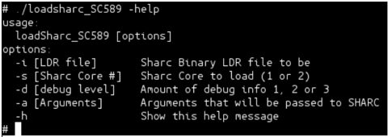
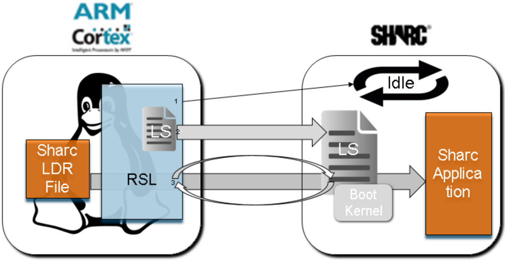
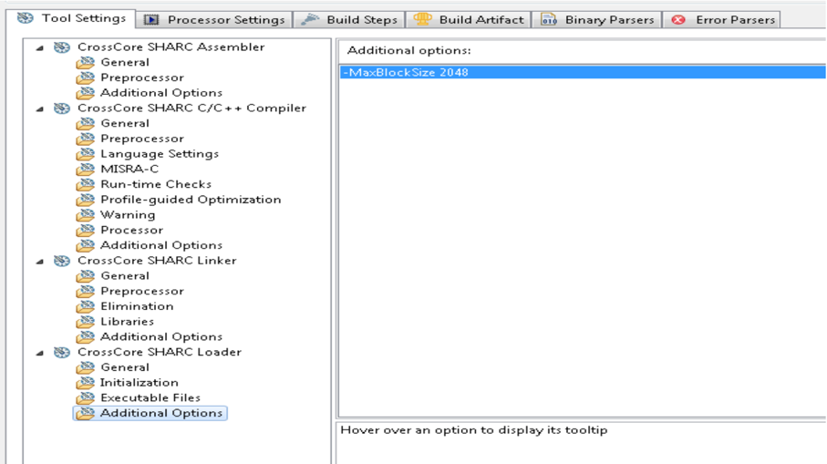

Technical  notes  on  using  Analog  Devices  DSP  products  and  development  tools Visit  our  Web  resources  http://www.analog.com/ee-notes  and  http://www.analog.com/processors  or e-mail  processor.support@analog.com  or  processor.tools.support@analog.com  for  technical  support.

## The Linux Run-Time SHARC+ Loader on the ADSP-SC57x/ADSP-SC58x Processors

Contributed by Zhang, Wenting, Jayasree, V.B., and Yi, Gabby.

## Introduction

The ADSP-SC58x and ADSP-SC57x processors are  comprised  of  an  ARM  Cortex ® -A5  core alongside  dual  DSP  SHARC+ ® cores.    Analog Devices,  Inc.  provides  a  Linux  add-in  BSP  that allows  a  user  to  run  Linux  on  the  ARM  core. When a user wants to run an application on one of the SHARC+ cores, a debugger such as the ICE1000  or  ICE-2000  can  be  used  to  load  the SHARC+ cores without disturbing the ARM core running Linux.

When  a SHARC+  application is ready for deployment,  the  user  must  create  a  single  boot stream containing u-boot and  the  SHARC+ application for each SHARC+ core.

This EE-Note describes a method to load different boot  stream  loader  (LDR)  files  from  the  Linux filesystem  to  run  on  the  SHARC+  cores  during run time.

## Run-Time SHARC+ Loader

The  Run-Time  SHARC+  Loader  (RSL)  is  a userspace  Linux  application  that  reads  a  binary boot stream LDR file and boots it onto one of the SHARC+ cores. Additionally, it can pass command line arguments to the SHARC+ application  if  desired.    In  Figure  1,  the  help message  is  displayed  for  the  RSL  executed  on ADSP-SC589.  By default, if no SHARC+ core is specified, core 1 is the target.

Rev 3 - January 18, 2019

Figure 1: Help message from Run-Time SHARC+ Loader on ADSP-SC589



The option -d allows the user to specify the debug level  for  the  amount  of  information  displayed during the execution.

## Architecture

The RSL is comprised of a front-end and a backend.  The front-end is the Linux application that reads  in  the  binary  boot  stream  LDR  file.    The back-end is a Loader Stub (LS) which runs on the SHARC+ core and communicates with the RSL front-end.  The RSL is also responsible for loading the LS onto the SHARC+ for execution. Optionally, to receive arguments from the RSL, an additional back-end function must be added to the user application to communicate with the RSL front end.

The LS uses the boot kernel stored in boot ROM memory  to  do  the  actual  booting  of  the  boot stream.  It supplies a Load function driver to be registered  with  the  boot  kernel  used  during  the booting.    As  the  booting  occurs,  the  supplied Load function is called to fetch more boot stream data.  Since the LDR file sits on the file system on

Copyright 2019, Analog Devices, Inc. All rights reserved. Analog Devices assumes no responsibility for customer product design or the use or application of customers' products or for any infringements of patents or rights of others which may result from Analog Devices assistance. All trademarks and logos are property of their respective  holders.  Information  furnished  by  Analog  Devices  applications  and  development  tools  engineers  is  believed  to  be  accurate  and  reliable,  however  no responsibility  is  assumed by Analog  Devices  regarding technical  accuracy  and topicality  of the content provided  in Analog  Devices Engineer-to-Engineer Notes.

the ARM core, the Load function communicates with the RSL front-end as to how much data to fetch.    The  RSL  front-end  acts  as  a  server  and waits for this request.  Once it gets a request, it will fread() the  requested  amount  from  the LDR file and the store it in the shared buffer with the SHARC+ core.

There are two main reasons for the RSL architecture.

1. It is easier for the boot kernel to load and boot  a  boot  stream  than  for  a  Linux application to parse and load a DXE image file.
2. The boot kernel API is not Linuxcompatible, so a Linux application cannot directly  employ  the  boot  kernel  API  to boot an LDR file.

## Operational Flow

In Figure 2, the diagram pictorializes the flow of the SHARC+ application loading.  The following sequence of steps occurs:

1. Set the RCU\_SVECTn register to the location  in  boot  ROM  to  loop  on  idle instruction.
2. Reset the SHARC+ core.
3. Load the loader stub onto the L1 memory of the SHARC+s.
4. Set the RCU\_SVECTn register to the beginning of the loader stub application in SHARC+ L1 memory.
5. Reset the SHARC+ core.
6. The RSL front-end waits for a signal from the LS that it is running.
7. The  LS  starts  executing  and  sets  up  the boot structure of type ADI\_ROM\_BOOT\_CONFIG and calls adi\_rom\_BootKernel() to  start  the boot procedure.
8. The RSL waits for a request from LS for boot stream data.
- a. Once  the  request  is  obtained,  the RSL reads data in from the LDR file and stores it in shared memory.
- b. The  RSL  signals  to  LS  that  the boot stream data is ready.
9. This loop continues until the booting finishes and the LS signals to the RSL that no more data is needed.
10. The LS calls the booted application as a function  call  to  start  execution,  and  the RSL waits for a signal from the application.
11. The RSL sends the length of the command line argument to the application.
12. The user application allocates the memory for the command  line  and  sends the address back to the RSL.
13. The RSL copies the command line to the address received and signals the application and exit.
14. The user application parses the command line and start normal execution.


## Loader Stub

The  LS  is  a  SHARC+  application.    It  does  two things.    First,  it  sets  up  the  boot  configuration structure for the boot kernel and then, using the boot  API,  calls  the  boot  kernel.    Second,  it provides a Load function to be registered with the boot  kernel.    The  LS  is  essentially  doing  a memory  boot.    The  boot  API  allows  users  to define their own drivers to support custom boot modes.    Since  memory  boot  is  not  one  of  the supplied boot modes, a user must supply a custom driver.  A driver is a set of functions which include Init , Config , Load ,  and Cleanup .    For  a running  system,  memory  is  already  configured and initialized, so there is no need for functions other than the Load function.




Figure 2: Linux Run-Time SHARC+ Loader Block Diagram


 More information  about  the  boot  ROM and  boot  kernel  can  be  found  in  the ADSP-SC58x/ADSP-2158x SHARC+ ® Processor  Hardware  Reference [1] and Tips and Tricks Using the ADSPSC58x/ADSP-2158x Processor Boot ROM (EE-384) [3] .

## Combining Loader Stub with RSL Linux Application

The RSL loads the loader stub into the SHARC+ memory for execution.  Before this happens, the LS is compiled into RSL. The contents of the LS DXE files  are  dumped and parsed and formatted into C source code data buffers using a script and ELFDUMP.EXE . ( ELFDUMP.EXE is a utility that comes with CrossCore ® Embedded Studio (CCES)).

From the provided source code, SharcBooter\_Core1 is the CCES project for the loader stub for ADSP-SC589 SHARC core 1 and SharcBooter\_Core2 is the CCES project

for the loader stub for core 2. There are corresponding  projects  for  the  ADSP-SC573  as well.  All the projects share the same source code for the LS.

A provided script makeSectData.sh outputs secdat\_SC589\_sh1.c and secdat\_SC589\_sh2.c which can be compiled  into  the  RSL,  for  the  ADSP-SC589. The same script can be used to process the DXE's from the ADSP-SC573 projects and produce the corresponding  source  code  for  the  LS's  for  the ADSP-SC573.

## Loader Stub Memory Placement

Since  the  loader  stub  is  a  SHARC+  application running from SHARC+ memory and it calls the boot kernel to boot another SHARC+ application that also resides in SHARC+ memory, DO NOT overwrite  the  loader  stub  during  the  booting. Therefore, the loader stub is placed in the upper portion of L2 memory at 0x200BB000 for core 1 and 0x200AD000 for  core  2  in  case  of  ADSPSC589  and  at 0x200FB000 for core 1 and 0x200BD000 for core 2 in case of ADSP-SC573 .


 Since the LS resides in the upper portion of the L2  memory,  the  SHARC+® applications  to  be  loaded  by  the  RSL should not use memory occupied by the LS  in  the  ADSP-SC589/ADSP-SC573 memory map.

## Loader Stub Size

The size of the loader stub is primarily determined by:

-  the shared memory buffer that the RSL frontend  places  data  into  from  reading  the  LDR file, and
-  the location where the LS reads from when the boot kernel requires more boot stream data

For this implementation, the buffer size is defined to be 2KB.  Therefore, the user must restrict the block  size  of  the  boot  stream  of  the  SHARC+ application to be loaded to 2KB.


 The maximum block size for a block in the LDR file of the SHARC+ application must be equal or less than 2KB.

To  restrict  block  size,  the  user  can  provide  an extra option for the CrossCore ®  SHARC+ Loader utility.    In  the  tools  settings  for  the  SHARC+ CCES project, there is a subsection for Additional Options under  the CrossCore  SHARC  Loader section. In this, add the switch -MaxBlockSize 2048 .

Figure 3  shows this option in CCES.

## Loading the Loader Stub

Once compiled into the  RSL, the loader stub  is copied into the correct SHARC+ memory locations.  But, before this can be done, it must be ensured that the SHARC+ core is not simultaneously trying to access the same memory locations.  The RSL does not know the state of the SHARC+  core.    The  core  could  already  be executing  an  application  that  shares  the  same memory locations as the loader stub.  Therefore, the RSL sets the RCU\_SVECTn register for either SHARC+ core 1 or core 2 to a location in readonly boot rom  which holds instructions for looping on an idle instruction.  Then, the Reset Control Unit (RCU) is used again to trigger a core reset which makes the SHARC+ core jump to the location specified in the RCU\_SVECTn register. As  a  result,  the  RSL  is  guaranteed  that  the SHARC+ core is in a safe state for which the RSL can load the loader stub.


Figure 3: Specifying Maximum Block Size in LDR File



## Communication and Handshaking

## Loading SHARC+with Loader Stub

On  the  ADSP-SC58x  and  ADSP-SC57x,  the internal memory of the SHARC+ core is accessible by other system masters which include other cores via the multi-processor address space.

When the  loader  stub  contents  are  dumped  and parsed, secdat\_sh1.c and secdat\_sh2.c are  created;  the  memory  addresses  refer  to  the internal memory space of the SHARC+ core.  For the RSL to load content into SHARC+ memory, these  memory addresses are translated to multiprocessor space addresses. For explanation purposes the generic terms secdat\_sh1.c and secdat\_sh2.c used throughout the document, while RSL compilation expects secdat\_SC573\_sh1.c, secdat\_SC573\_sh2.c and secdat\_SC589\_sh1.c,

secdat\_SC589\_sh2.c compilation targets.

## Boot Stream Data Buffer

As  described  earlier,  the  LS  declares  a  buffer which is used by both the LS and the RSL.  When secdat\_sh1.c and secdat\_sh2.c are created,  the  script  also  obtains  the  SHARC+ address for this data buffer to load into a pointer variable declaration for the RSL.  Thus, the RSL knows where to place the boot stream data.

## Semaphores

Using the same method, a pair of volatile variables are declared in the LS.  The addresses are parsed and then loaded into variable declarations in the RSL.  The SHARC+ uses the variables in the pair to write to and signal to the ARM core.  The ARM core uses this shared variable only as a read-only variable. This configuration assures that there is no possible contention between both cores trying to write to the same memory location (variable). The  other  variable  in  the  pair  is  used  similarly. The ARM uses it to write to and communicate to the SHARC+ core. The SHARC+ core uses it only as a read-only variable.

## Accessing Physical Memory

The RSL front-end (ARM core) and the SHARC+ communicate and share data with each other by accessing the SHARC+ memory and translating it to the multi-processor address space. For example, in case of SHARC+ L1 memory, take the  SHARC+  byte  address  and  then  prepend 0x280  to  the  most  significant  ten  bits  of  the SHARC+ L1 address (if using slave port 1). Or, prepend  0x281  if  using  slave  port  2.    For  this implementation, slave port 1 is used.  For more information on multi-processor space addressing, refer to the SHARC+ ®  Dual Core DSP with ARM Cortex-A5 [3] data sheet.

However,  Linux  cannot  access  these  memory addresses directly. Linux  runs in a virtual memory space, and any of the address provided by the  parsed  output  of  the  LS  binary  image  are physical addresses. In order to access this memory, the physical address region is memory differentiating


mapped using mmap() .    The  result  is  a  virtual address  which  corresponds  to  the  start  of  the physical  address  region.    From  this  virtual  start address, another address translation is calculated.

Details of this process is outside the scope of this EE-Note  and  will  be  provided  in  a  separate upcoming EE-Note.

## Argument Passing

In some cases, it can be useful if the RSL can pass arguments to the SHARC+ application as standard C command line arguments. To achieve this, some additional code must be added to the user application's main function to receive the arguments from the RSL. The RSL communicates with the user application. The LS is not involved in this process.

## Memory Allocation

Two additional pieces of memory are required to support the argument passing mechanism: one for the communication channels (semaphores implemented with  shared  global  variable  pairs), another for storing the arguments. The space for the channel is only used during the bootstrapping process. Once the transmission is done, the space is no longer used. However, the address must be predetermined. The  space for the arguments should  be  preserved  throughout  the  lifecycle  of the user application, like argc and argv arguments.  The  address  does  not  need  to  be predetermined.

In this implementation, the space reserved for the MCAPI in  L2  by  the  default  linker  description files  is  used  for  the  communication  channel. Unlike L1 memory where each SHARC core has its  own  L1  memory,  L2  is  shared  across  the SHARC  cores.  If  L2  is  used,  take  care  to  not overwrite the memory space occupied by another core.  Each  core  has  its  own  MCAPI  space reserved. The address is predetermined. Overwriting the area does not affect other running cores. Since the channel is no longer used after the bootstrapping and the MCAPI is initialized after

bootstrapping, using this space should not affect the function of MCAPI.

The memory space for the arguments is allocated dynamically  in  the  SHARC  application  using malloc . In this way we can guarantee the space is  preserved  throughout  the  life  cycle  without imposing  any  restriction  on  user  application's memory  layout.  The  size  can  be  dynamically determined to avoid wasted space. Depending on the specific application memory layout, the heap can reside in either L1 or L2.

## Receiving the Arguments

The additional argument receiving code is added to the user application. It is a single C function, which should be in the first line of main (in the user's main function). The following sequence of events occur:

-  The code sends a handshake signal to the RSL on the command channel, then waits for the handshake from the RSL.
-  The RSL returns the length of command line along with the handshake.
-  Memory space is allocated with malloc .
-  Depending on the result, the code either sends back an error message, or the data request on the  command  channel  with  the  address  of allocated space on the data channel.
-  The  code  waits  for  the  RSL  to  signal  the completion of memcpy of the command line arguments to the provided memory space from the user application.
-  No more bytes are sent on the channel.
-  The function continues to break the command line into sub-strings and create an argv table to point to the sub-strings.
-  The  arguments argc and argv are  passed back to the main function using pointers, and the  two  channels  used  before  are  cleared before returning to main .


## SHARC+ ®  Application Boot Stream Constraints and Further Investigations

## Memory Placement

As noted previously, the LS resides in a section of L2 memory. It calls the boot kernel API to boot the  SHARC+  application  and  then  performs  a direct  call  to  the  application.    Therefore,  the SHARC+ application cannot use the same memory region as the LS because the LS would be overwritten before booting completes.

## System Interaction

There are system interactions that must be considered  as  well.    The  RSL  only  resets  a SHARC+ core and boots a SHARC+ application during a running system.  If a previous SHARC+ application configured a peripheral to run and use DMA,  there  could  still  be  SHARC+  memory accesses ongoing while the RSL is trying to load the LS into SHARC+ memory.  As such, there are some situations where the RSL is prevented from loading subsequent boot stream LDR files.

## Security

The current version of the RSL does not support loading  secure  boot  streams.  There  are  relevant security  implications.    Even  in  a  non-secure system, security mechanisms such as the System Protection  Unit  (SPU)  and  the  System  Memory Protection Unit (SMPU) can still be activated or active.

As such, the user should be aware that the boot kernel uses memory DMA engine 1 (MDMA1) to move data.  Previously executing code could have altered the security settings.  To ensure that MDMA1 has correct privileges to access memory, SPU0\_SECURE90 and SPU0\_SECURE91 are set so that both the source and destination channels of MDMA1 are secure masters.

## Example Code and Projects

A zip file is included with this note that contains three  folders.    One  is SharcLoader .    This folder  is  the  source  code  for  the  user  Linux application,  otherwise  referred  to  as  the  RSL front-end.    The loader stub source data is already parsed  and  ready  to  compile  into  the  RSL.  A makefile is  also  provided  to  use  the  GCC toolchain  provided  in  the  Linux  Add-in  to  help compile  the  RSL.  The makefile expects  the processor  target  as  the  command  line  argument (either ADSP-SC589 or ADSP-SC573).

The other folder SharcBooter contains Windows CCES projects: SharcBooter\_Core1,

SharcBooter\_Core2 for both the ADSP-589 and the ADSP-573.    These files are the projects for generating the loader stubs for ADSP-SC589 and ADSP-SC573 respectively.  Both projects use a script provided in their project directories called makeSectData.sh .  This file is a bash script that  was  used  and  run  under  Cygwin  to  run elfdump.exe from  CCES.  It  also  includes SED and other utilities to parse the output DXE to create secdat\_sh1.c and secdat\_sh2.c. Differentiating tag is added to rename the generated  files  to secdat\_SC589\_sh1.c or secdat\_SC573\_sh1.c indicating the processor  target.  Similar  naming  convention  is followed for SHARC core 2. The script runs by providing the path to the DXE image and the core it runs on.  Future work would be to port this to Python and rid the requirement of Cygwin.

The RSL can be executed as such:

```
./loadSharc_SC589 -i LED_SC589_EZKIT_Core1.ldr -s 1 -d 3 -a "1 2 3"
```

Listing 1: Running the RSL

Listing 1 shows how to run the RSL on ADSPSC589. Likewise, the generated executable loadSharc\_SC573 can invoked by the similar pattern of command line arguments as shown in


Listing 1. The -i switch provides the input binary LDR file to be booted.  The -s switch indicates which SHARC+ core to boot. The -d indicates the verbosity level of information printed out to console.  The -a switch  provides  the  command line arguments that are be passed to the application.

Finally, there is also a SharcLoaderExample folder  containing  examples  for  both  processors: two  LED  blink  programs,  one  for  each  core  of ADSP-SC589, and for the ADSP-SC573, and one talk thru program that runs on the SHARC+ core 1 of the ADSP-SC589.

Pre-built binaries for these projects are provided in the SharcLoader folder.

The  LED  blink  program  receives  the  argument from the RSL to determine which LED to blink.

The LED blink program also contains code that loads two  locations of a global buffer with 0xDEAD and 0xBEEF .  Besides verifying that the LEDs blink on the EZ-board, a user can load  a 'symbols  only'  session  on  CCES  and  see  the following in the disassembly window.

Figure 4: Disassembly Window of Instructions in LED Blink Program in ADSP-SC589

## Memory Allocation

The linker description file (LDF) must be modified not to overwrite the LS, otherwise, the booting might  crash. Refer to the LDF  file provided with the example projects.

Listing  2  shows  the  memory  space  occupied  by the LS and the address range available to the user for  both  cores  on  ADSP-SC573  and  ADSPSC589.

```
SC573 - Core1: USER: START(0x200c0000) END(0x200fafff) LS:   START(0x200fb000) END(0x200fdffb) SC573 - Core2: USER: START(0x20080000) END(0x200bcfff) LS:   START(0x200bd000) END(0x200bffff) SC589 - Core1: USER: START(0x200b0000) END(0x200bafff) LS:   START(0x200bb000) END(0x200bdffb) SC589 - Core2: USER: START(0x200a0000) END(0x200acfff) LS:   START(0x200ad000) END(0x200affff)
```

Listing 2: Memory Allocation for LS

## Conclusion

This  EE-Note  demonstrates  a  proof-of-concept method to boot different SHARC+ boot streams from  Linux  running  on  the  ARM  core  of  the ADSP-SC58x and ADSP-SC57x during run time.

The  method  employed  numerous  techniques  to solve issues such as:

1. Accessing physical memory from Linux
2. Resetting the SHARC+ core
3. Assessing SHARC+ memory
4. Putting the SHARC+ core in a safe state while loading SHARC+ memory
5. Using the boot kernel  stored  in  the  boot rom


## References

- [1] ADSP-SC58x/ADSP-2158x SHARC+® Processor Hardware Reference (http://www.analog.com/media/en/dspdocumentation/processor-manuals/SC58x-2158x-hrm.pdf) . Rev 1.0, Sept 2017. Analog Devices, Inc.
- [2] ADSP-SC57x/ADSP-2157x SHARC+® Processor Hardware Reference (https://www.analog.com/media/en/dspdocumentation/processor-manuals/adsp-sc57x-2157x\_hwr.pdf) . Rev 1.0, March 2018. Analog Devices, Inc.
- [3] Engineer-to-Engineer Note 384 : Tips and Tricks Using the ADSP-SC58x/ADSP-2158x Processor Boot ROM (http://www.analog.com/media/en/technical-documentation/application-notes/EE384v01.pdf). Rev 1, Sept 30, 2015. Analog Devices, Inc.
- [4] SHARC+®Dual Core DSP with ARM Cortex-A5 Data Sheet (http://www.analog.com/media/en/technicaldocumentation/data-sheets/ADSP-SC582\_583\_584\_587\_589\_ADSP-21583\_584\_587.pdf).  Rev B, December 2018. Analog Devices, Inc.


## Document History

| Revision                                   | Description                                                               |
|--------------------------------------------|---------------------------------------------------------------------------|
| Rev 1 -November 1st, 2017 By G.Yi          | Initial Release                                                           |
| Rev 2 -November 9th, 2018 By V.B. Jayasree | Functionality extended to ADSP-SC573 family                               |
| Rev 2 -January 15th, 2019 By W. Zhang      | Implemented argument passing Moved LS into L2 memory Enabled parity check |

