## 1   Introduction

The ADSP-SC58x and ADSP-215xx processors are members of the SHARC+ family of products. The ADSPSC58x processor is based on the SHARC+ dual-core processor and the ARM Cortex-A5 processor cores.

As shown in the ADSP-SC58x Functional Block Diagram , by integrating a rich set of industry-leading system peripherals and memory (see product data sheet), the ARM/SHARC+ processor is the platform of choice for nextgeneration applications that require RISC-like programmability, multimedia support, and leading-edge signal processing in one integrated package. These applications span a wide array of markets, from automotive and pro-audio to industrial-based applications that require high floating-point performance.

NOTE: For specific product configurations (available cores and peripherals), see the SHARC+ Dual Core DSP with ARM Cortex-A5 ADSP-SC582/SC583/SC584/SC587/SC589/ADSP-21583/21584/21587 data sheet.

Figure 1-1: ADSP-SC58x Functional Block Diagram

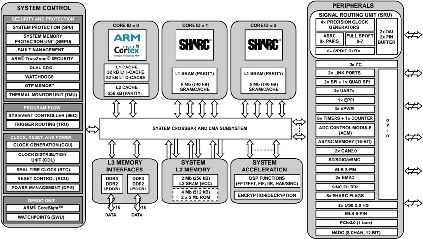

## ARM Cortex-A5 Processor Core

The ARM Cortex-A5 processor (shown in the Figure 2-1 A5 Sub-System Block Diagram) is a high performance processor with an L1 cache and a virtual Memory Management Unit. This processor is available on the ADSPSC5xx processors and has a core ID = 0.

## SHARC+ Processor Cores

The ADSP-SC58x/ADSP-215xx SHARC+ processors are members of the SIMD SHARC+ family of DSPs that feature Analog Devices Super Harvard Architecture. These 32-bit/40-bit/64-bit floating-point processors are optimized for high performance audio/floating-point applications with their large on-chip SRAM, multiple internal buses to eliminate I/O bottlenecks, and innovative digital audio interfaces (DAI). New enhancements to the SHARC+ core add cache enhancements, branch prediction and other instruction set improvements all while maintaining instruction set compatibility to previous SHARC products.

The ADSP-SC58x/ADSP-2158x processors feature two SHARC+ cores (SHARC1 and SHARC2), which have core IDs of 1 and 2, respectively.

## Power and Clock Management (DPM/RCU/CGU/CDU)

The processor contains four modules that control power and clocking.

## Dynamic Power Management (DPM)

The Dynamic Power Management (DPM) unit of the processor controls transitions between different power-saving modes.

## Reset Control Unit (RCU)

The Reset Control Unit (RCU) controls how all the functional units enter and exit reset. Differences in functional requirements and clocking constraints define how reset signals are generated. The RCU supports separate reset control for various chip sub-systems. For deterministic operation programmers should ensure there is no activity between separate chip sub-systems during reset activity. More global reset options are also supported. Programs must guarantee that none of the reset functions puts the system into an undefined state or causes resources to stall. This functionality is important when only one of the cores is reset (programs must ensure that there is no pending system activity involving the core that is being reset).

Figure 1-2: RCU System Diagram

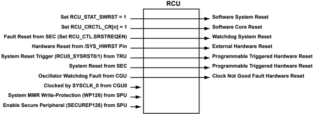

## Clock Generation Unit (CGU)

The Clock Generation Unit (CGU) includes the phase locked loop (PLL) and the PLL control unit (PCU). The PLL generates a clock that runs at a frequency that is a multiple of the SYS\_CLKINx input clock frequency. It also generates all on-chip clocks and synchronization signals. The PCU allows the application software to control the PLL module operation. All clocks derived from the CGU are then forwarded to the CDU for distribution.

Figure 1-3: CGU System Diagram

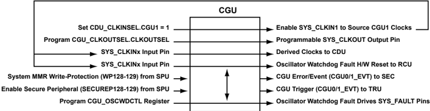

## Clock Distribution Unit (CDU)

The Clock Distribution Unit (CDU) consists of an array of software-configurable multiplexors that select clocks originated from up to four different clock sources that are generated from the CGUs. Unused input clocks are grounded internally and never selected. The output clock signal for each multiplexor is assigned to one or more destinations within the processor.

Figure 1-4: CDU System Diagram

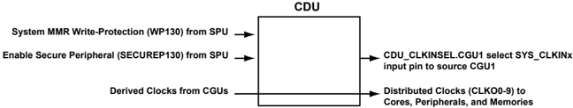

## System Interrupts and Triggers (SEC/TRU)

The SEC and TRU modules provide interrupt and trigger management functions for the processor.

## System Event Controller (SEC)

There are two interrupt controllers- the System Event Controller (SEC) and Generic Interrupt Controller (GIC). The generic interrupt controller is used for the ARM core, and the system event controller is used for the SHARC+ cores.

The SEC manages the configuration of all system event sources and the propagation of system events to all connected cores and the system fault interface. The SEC arbitrates among all pending system interrupt requests and presents the highest priority interrupt to the core(s) for processing.

Figure 1-5: SEC System Diagram

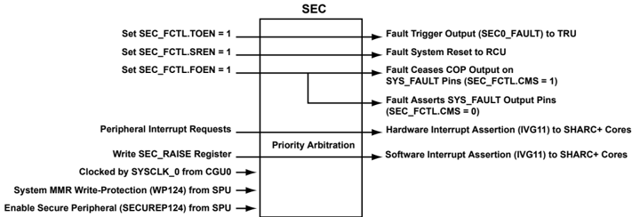

## Trigger Routing Unit (TRU)

The Trigger Routing Unit (TRU) provides system-level sequence control without core intervention. The TRU maps trigger masters (generators of triggers) to trigger slaves (receivers of triggers). Slave endpoints can be configured to respond to triggers in various ways. Multiple TRUs may be provided in a multiprocessor system to create a trigger network. Common applications enabled by the TRU include:

- Automatically triggering the start of a DMA sequence after a sequence from another DMA channel completes
- Software triggering
- Synchronization of concurrent activities

Figure 1-6: TRU System Diagram

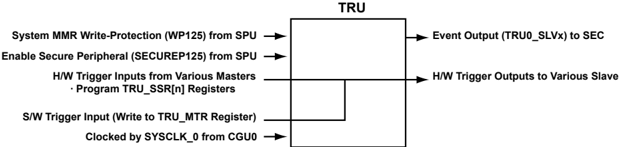

## System Memory (L2CTL/DMC/SMC/OTPC/SMPU)

The following sections describe the memory architecture of the ADSP-SC58x processors. More information can be found in the processor data sheet.

## L2 Memory Controller (L2CTL)

L2 System Memory has significant bandwidth for core accesses, but it is important to note that L2 responds slower to core accesses than L1 memories. L2 SRAM is the ideal storage for multiple processor cores to share data and instruction resources, such as semaphores, shared buffers, and code libraries. Due to sophisticated data integrity protection and write protection, L2 SRAM is also ideal for data and instructions critical for safe operation of the application.

Figure 1-7: L2CTL System Diagram

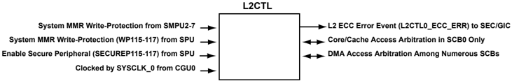

## Dynamic Memory Controller (DMC)

The Dynamic Memory Controller (DMC) provides a glueless interface between DDR3/DDR2/LPDDR SDRAMs and the system crossbar interface (SCB). The DMC enables execution of instructions from, as well as transfer of data to and from, DDR3, DDR2 SDRAM or LPDDR SDRAM, respectively.

The DMC is partitioned in a manner that allows reconfiguration and maintainability. The memory access protocol state machine along with JEDEC standard specific logic is embedded in the protocol controller. An access and operation reordering mechanism is incorporated as an efficiency controller. An SCB slave interface is provided to interface with the on-chip interconnect. This interface results in an efficient slave implementation owing to its out-oforder transaction capabilities.

The DMC supports access to the external memory by core and DMA accesses.

Figure 1-8: DMC System Diagram

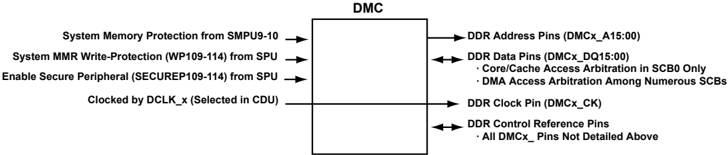

## Static Memory Controller (SMC)

The Static Memory Controller (SMC) is a protocol converter and data transfer interface between the internal processor bus and the external L3 memory. It provides a glueless interface to various external memories and peripheral devices, including SRAM, ROM, EPROM, NOR flash memory and FPGA/ASIC devices.

The SMC acts as an SCB slave. The processor SCB interconnect fabric arbitrates accesses to the SMC. The SMC connects to signal pins for memory control (such as read, write, output enable, and memory select lines).

Figure 1-9: SMC System Diagram

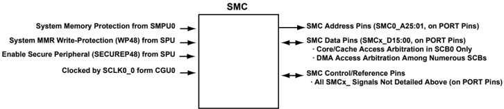

## One-Time Programmable Memory Controller (OTPC)

The One-Time Programmable Memory Controller (OTPC) module is a complete system integrating an OTP memory core with a programming controller, charge pump, and voltage regulator. A built-in Hamming Code Error Correction (ECC), and a fully implemented double-redundant program or read scheme protect the OTP data.

Figure 1-10: OTPC System Diagram

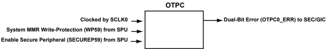

## System Memory Protection Unit (SMPU)

The System Memory Protection Unit (SMPU) provides a flexible way of protecting memory regions against read or write access from any or all masters in the system. In addition, it can guard against memory access depending on security privileges of the system master.

On the ADSP-SC58x, 10 SMPU instances are available to protect the L2, external memory (DMC/SMC), and memory-mapped I/O (PCIe) interfaces. Six instances are allotted to protect the L2 memory, two instances for DMC0 and DMC1, one instance for SMC and one instance for PCIe.

Figure 1-11: SMPU System Diagram

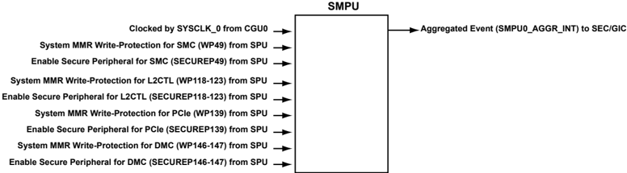

## Direct Memory Access (DMA/MDMA/EMDMA/CRC)

## DMA Controller (DMA)

The processors use Direct Memory Access (DMA) to transfer data within memory spaces or between a memory space and a peripheral. The processors can specify data transfer operations and return to normal processing while the fully integrated DMA controller carries out the data transfers independent of processor activity.

DMA transfers can occur between memory and a peripheral or between one memory and another memory. Each Memory-to-memory DMA stream uses two channels, where one channel is the source channel, and the second is the destination channel. Most peripherals have at least one dedicated DMA channel associated with them.

All DMAs can transport data to and from all on-chip and off-chip memories. Programs can use two types of DMA transfers, descriptor-based or register-based. Register-based DMA allows the processors to directly program DMA control registers to initiate a DMA transfer. On completion, the control registers may be automatically updated with their original setup values for continuous transfer. Descriptor-based DMA transfers require a set of parameters stored within memory to initiate a DMA sequence. Descriptor-based DMA transfers allow multiple DMA sequences to be chained together and a DMA channel can be programmed to automatically set up and start another DMA transfer after the current sequence completes.

Figure 1-12: DMA System Diagram

## Memory DMA Controllers (MDMA)

The processor supports a variety of Memory DMA and Triggering memory-to-memory DMA operations which include:

- Two standard memory DMA channels with CRC protection (32-bit bus width, run on SCLK0)
- One enhanced memory DMA channel (32-bit bus width, runs on SYSCLK)
- Two memory DMA channels (64-bit bus width, run on SYSCLK, one channel may be assigned to the FFT accelerator)
- Two EMDMA channels (32-bit bus width, run on SCLK0)

Figure 1-13: MDMA System Diagram

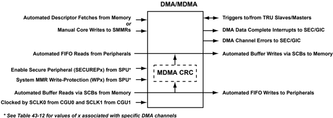

## Extended Memory DMA (EMDMA)

The Extended Memory DMA (EMDMA) engine can be used in applications that copy data in a non-sequential manner. This includes delay lines, scatter and gather, and circular access types.

Unlike previous SHARC processors which contained external port DMA, the current EPDMA module can access all memory locations (L1/L2/L3) for source and destination DMA operations.

Figure 1-14: EMDMA System Diagram

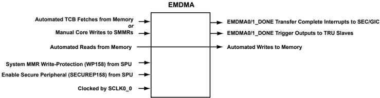

## Cyclic Redundancy Check (CRC)

The Cyclic Redundancy Check (CRC) peripheral performs the cyclic redundancy check (CRC) of the block of data that is presented to the peripheral. The peripheral provides a means to verify periodically the integrity of the system memory, the contents of memory-mapped registers (MMRs), or communication message objects. It is based on a CRC32 engine that computes the signature of 32-bit data presented to the peripheral.

The dedicated hardware compares the calculated signature of the operation to a pre-loaded expected signature. If the two signatures fail to match, the peripheral generates an error. The source channel of the memory-to-memory DMA channels can provide data. The CRC optionally forwards data to memory through the destination DMA channel. Alternatively, the peripheral supports data presented by core write transactions.

The CRC peripheral implements a reduced table-look-up algorithm to compute the signature of the data. The CRC uses a programmable 32-bit CRC polynomial to generate the look-up table (LUT) contents automatically.

More CRC peripheral modes allow for initializing large memory sections with a constant value, or for verifying that sections of memory are equal to a constant value.

Figure 1-15: CRC System Diagram

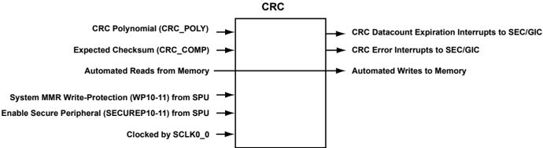

## Peripherals

The SHARC+ processor contains a rich set of industry leading system peripherals. The processor is the platform of choice for applications that require RISC-like programmability, multimedia support, and leading edge signal processing in one integrated package. These applications span a wide array of markets, including automotive, pro audio, and industrial-based applications that require high floating-point performance. These peripherals are described in the following sections.

- General-Purpose I/O (GPIO) Peripherals
- DAI/SRU Peripherals
- Dedicated Pin Peripherals

## General-Purpose I/O (GPIO) Peripherals

The SHARC+ processors feature up to 102 general-purpose I/O pins mapped across up to seven ports (PORT A through PORT G). Each pin can be configured individually to serve as a GPIO pin or as a peripheral-specific pin.

## GPIO Ports (PORT)

When configured in the default GPIO mode, the PORT pins allow for the processor to interface to system components to provide handshaking functionality as either inputs or outputs. When in output mode, open-drain output is supported. A single MMR access can be used to sense or set individual pins or a complete port of 16 pins.

Additionally, each GPIO pin can optionally be configured to raise a system interrupt on the processor via a dedicated pin interrupt (PINT) block, and all peripheral functions are controlled via a set of port multiplexing registers, with specific settings defined in the processor data sheet.

Figure 1-16: PORT System Diagram

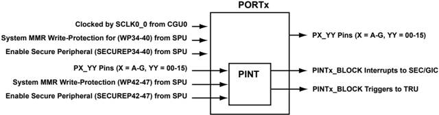

## Link Ports (LP)

The Link Port (LP) allow the processor to connect to other processors or peripheral link ports using a simple communication protocol for high-speed parallel data transfer. This peripheral allows various I/O peripheral interconnection schemes to I/O peripheral devices, as well as co-processing and multiprocessing schemes.

Figure 1-17: LP System Diagram

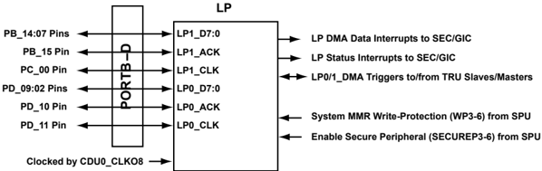

## Serial Peripheral Interface Ports (SPI)

The Serial Peripheral Interface (SPI) is an industry-standard synchronous serial link that supports communication with multiple SPI-compatible devices. The baseline SPI peripheral is a synchronous, four-wire interface consisting of two data pins, one device select pin, and a gated clock pin. The two data pins allow full-duplex operation to other SPI-compatible devices. Two extra (optional) data pins are provided on specific SPIs to support quad SPI operation. Enhanced modes of operation such as flow control, fast mode, and dual-I/O mode (DIOM) are also supported. In addition, a direct memory access (DMA) mode allows for transferring several words with minimal CPU interaction.

Figure 1-18: SPI System Diagram

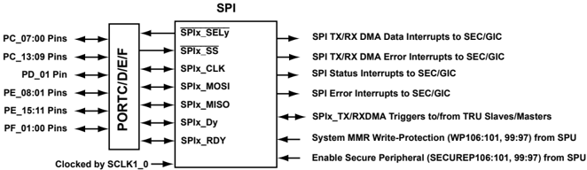

## Universal Asynchronous Receiver/Transmitter (UART)

The Universal Asynchronous Receiver/Transmitter (UART) module is a full-duplex peripheral compatible with PCstyle industry-standard UARTs. The UART converts data between serial and parallel formats. The serial communication follows an asynchronous protocol that supports various word lengths, stop bits, bit rates, and parity-generation options. The UART includes interrupt-handling hardware. Multiple events can generate interrupts.

The UART is logically compliant to EIA-232E, EIA-422, EIA-485 and LIN standards, but usually requires external transceiver devices to meet electrical requirements. In IrDA (Infrared Data Association) mode, the UART meets the half-duplex IrDA SIR (9.6/115.2 Kbps rate) protocol. In multi-drop bus mode, the UART meets the full-duplex MDB/ICP v2.0 protocol.

Figure 1-19: UART System Diagram

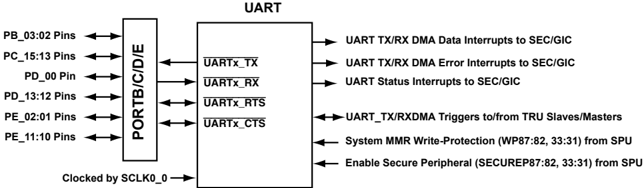

## Enhanced Parallel Peripheral Interface (EPPI)

The Enhanced Parallel Peripheral Interface (EPPI) is a half-duplex, bidirectional port with a dedicated clock pin and three frame sync (FS) pins. It can support direct connections to active TFT LCDs, parallel A/D and D/A converters, video encoders and decoders, image sensor modules and other general-purpose peripherals. Each EPPI has two DMA channels associated with it. Moreover, in some modes, an EPPI can use an extra DMA channel.

Figure 1-20: EPPI System Diagram

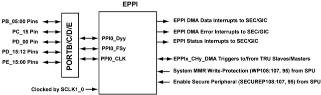

## Pulse-Width Modulator (PWM)

The Pulse-Width Modulator (PWM) module is a flexible and programmable waveform generator.

Figure 1-21: PWM System Diagram

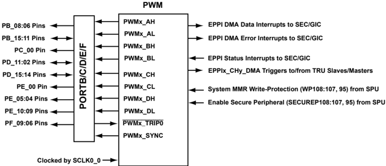

## General-Purpose Counter (CNT)

The General-Purpose Counter (CNT) converts pulses from incremental position encoders into data that is representative of the actual position of the pulse. This conversion is done by integrating (counting) pulses on one or two

inputs. Since integration provides relative position, some devices also feature a zero-position input (zero marker). The GP counter can use the zero position input feature to establish a reference point for verifying that the acquired position does not drift over time. In addition, the GP counter can use the incremental position information to determine speed, if the time intervals are measured.

Figure 1-22: CNT System Diagram

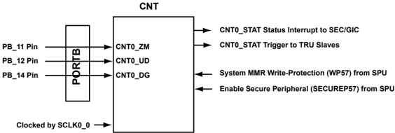

## ADC Control Module (ACM)

The processor includes an ADC Control Module (ACM) that provides an interface that synchronizes the controls between the processor and an analog-to-digital converter (ADC). The processor initiates analog-to-digital conversions, based on either external or internal events.

Figure 1-23: ACM System Diagram

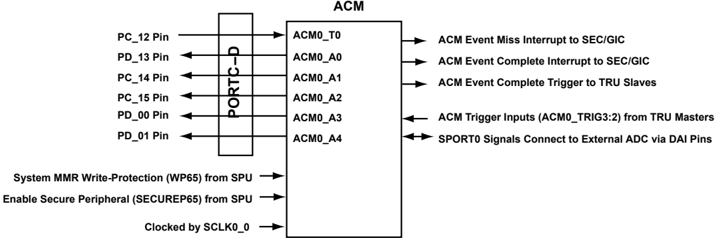

## Controller Area Network (CAN)

The processor contains a Controller Area Network (CAN) module based on the CAN 2.0B (active) protocol. This protocol is an asynchronous communications protocol used in both industrial and automotive control systems. The CAN protocol is compatible with the control applications. It can communicate reliably over a network and incorporates CRC checking, message error tracking, and fault node confinement.

Figure 1-24: CAN System Diagram

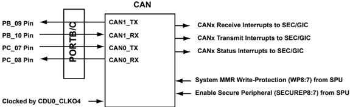

## Mobile Storage Interface (MSI)

The Mobile Storage Interface (MSI) is a fast, synchronous controller that uses various protocols to communicate with MMC, SD, and SDIO cards. It addresses the growing storage need in embedded systems, hand held, and consumer electronics applications that require low power.

Figure 1-25: MSI System Diagram

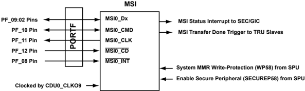

## Media Local Bus (MLB)

The Media Local Bus (MLB)® is an on-PCB or inter-chip communication bus, which allows an application to access the MOST network data. Media Local Bus supports all the MOST network data transport methods including synchronous stream data, asynchronous packet data, control message data and isochronous data. The MLB topology supports communication among the MLB controller and MLB devices, where the MLB controller is the interface between the MLB devices and the MOST network.

Figure 1-26: MLB System Diagram

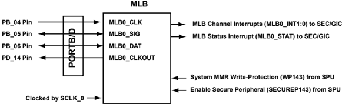

## Ethernet Media Access Controller (EMAC)

The Ethernet Media Access Controller (EMAC) peripheral in the processor enables network connectivity to applications through an Ethernet interface.

Figure 1-27: EMAC System Diagram

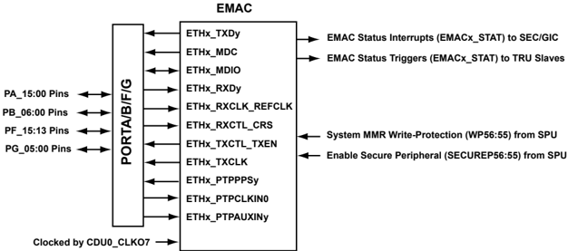

## Sinus Cardinalis (SINC) Filter

The sinus cardinalis (SINC) filter module processes four independent sigma-delta bit streams by applying a pair of SINC filters to each stream. See System Accelerators (FFT/FIR/IIR/HAE/SINC)The following sections provide information about the high-performance acceleration engines on the processor..

Figure 1-28: SINC System Diagram

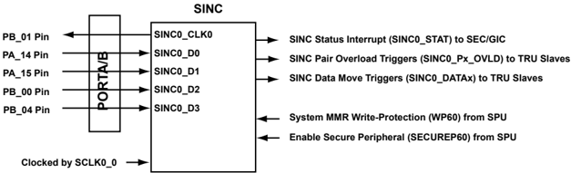

## DAI/SRU Peripherals

The Digital Audio Interface (DAI) (DAIn) are comprised of groups of identical peripherals and their respective Signal Routing Units (SRUn). The SRU connects inputs and outputs of the DAI peripherals with each other and to the external pins. This configuration allows peripherals to be interconnected to accomodate a wide variety of systems without making external pin connections.

The DAI Routing Capabilities section provides an overview of the different routing capabilities for the DAI unit. An example for the eight SPORTs is shown in the following figure.

Figure 1-29: SPORT Block Diagram

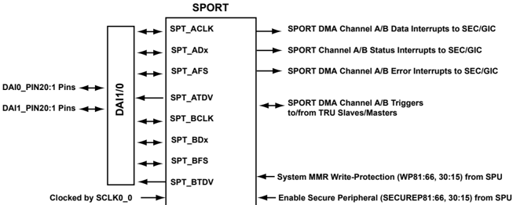

The following additional peripherals are connected using the DAI/SRU.

- Eight Asynchronous Sample Rate Converter (ASRC) blocks
- Two Sony/Philips Digital Interface (S/PDIF) transmit/receive blocks
- Four Precision Clock Generators (PCG)

## Dedicated Pin Peripherals

The following peripherals have dedicated pins on the processor.

## Two-Wire Interface (TWI)

The processor has a Two-Wire Interface (TWI), that provides a simple exchange method of control data between multiple devices. The TWI module is compatible with the widely used I2C bus standard. Additionally, the TWI module is fully compatible with serial camera control bus (SCCB) functionality for easier control of various CMOS camera sensor devices.

Figure 1-30: TWI System Diagram

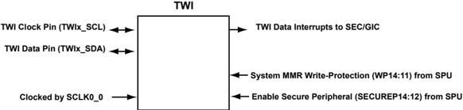

## Universal Serial Bus (USB)

The Universal Serial Bus (USB) controller provides a low-cost connectivity solution for consumer mobile devices such as cell phones, digital still cameras, and MP3 players. It allows these devices to transfer data using a point-topoint USB connection without the need for a personal computer host.

The USB controller can operate in a traditional USB peripheral-only mode as well as the host mode presented in the On-The-Go (OTG) supplement to the USB 2.0 Specification.

Figure 1-31: USB System Diagram

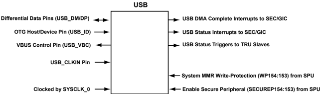

## Media Local Bus (6-pin) (MLB)

The Media Local Bus (MLB) supports the MOST25, MOST50 and MOST150 standards and this document assumes familiarity with these standards. For more information, refer to the Media Local Bus specification version 4.2.

Figure 1-32: MLB System Diagram

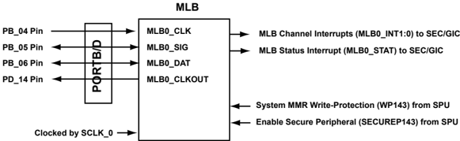

## PCI Express

PCI Express is a high performance, general purpose I/O interconnect defined for a wide variety of computing and communication platforms.

Figure 1-33: PCIE System Diagram

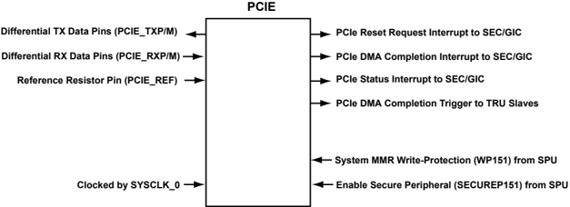

## Housekeeping ADC (HADC)

The Housekeeping ADC (HADC) is a 12-bit (with 10-bit accuracy), successive approximation ADC. It operates from single supply and features throughput rates up to 1 MSPS. The HADC can be used for the collection of housekeeping parameters like voltages, temperatures in the system or for any general-purpose use as well.

Figure 1-34: HADC System Diagram

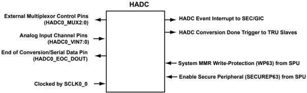

## System Accelerators (FFT/FIR/IIR/HAE/SINC)

The following sections provide information about the high-performance acceleration engines on the processor.

## FFT Accelerator (FFTA)

The FFT Accelerator (FFTA) performs memory to memory FFT/IFFT operations without core software intervention. Additionally, the FFTA architecture allows execution of complex, pipelined, memory to memory algorithms including ping-ponged, windowed frequency domain filtering and very large FFTs. The FFTA may also be used in conjunction with minimal computation support from a core in applications such as the overlap-add operations required for large frequency domain based convolutions.

Figure 1-35: FFTA System Diagram

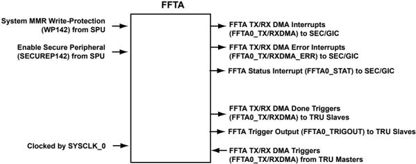

## FIR Accelerator (FIR)

FIR Accelerator (FIR) filters are frequently used in DSP applications. The FIR accelerator is a dedicated hardware interface used to perform filter processing to reduce the instruction processing load on the core. FIR filters are used in a wide array of applications including multi-rate processing with an interpolator or decimator.

Figure 1-36: FIR System Diagram

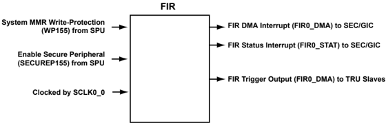

## IIR Accelerator (IIR)

The processor includes an IIR Accelerator (IIR) implemented in hardware that reduces the processing load on the core, freeing it up for other tasks.

Figure 1-37: IIR System Diagram

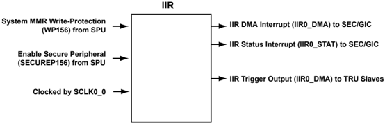

## Harmonic Analysis Engine (HAE)

The Harmonic Analysis Engine (HAE) analyzes harmonic frequencies present on the voltage and current input samples. The HAE receives input samples from two source channels whose frequencies are 45-65 Hz. The HAE then processes the input samples and produces output results. The output results consist of power quality measurements of the fundamental and up to 12 more harmonics.

Figure 1-38: HAE System Diagram

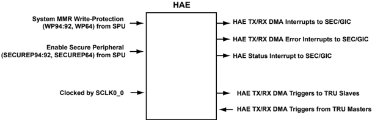

## Sinus Cardinalis (SINC) Filter

The Sinus Cardinalis (SINC) Filter module processes four independent sigma-delta bit streams by applying a pair of SINC filters to each stream. A SINC filter converts the bit stream from a sigma-delta front-end modulator into a digital word representing the signal level presented to the modulator.

The filter consists of a set of integration and decimation stages implemented directly in logic for efficient execution. The SINC filter supports capture of current or voltage feedback signals from an isolating analog-to-digital converter (ADC). Each modulator bit stream connects to two SINC filters: a primary filter for controlling feedback; a secondary filter for overcurrent detection. The SINC module includes four filter channels and two modulator clock generators.

Figure 1-39: SINC System Diagram

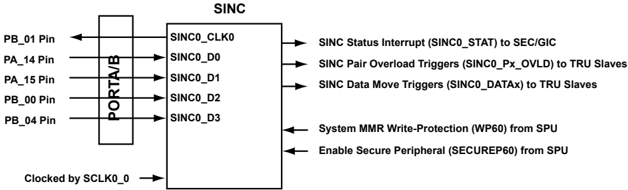

## Security and Protection (SPU/PKTE/PKIC/PKA/TRNG)

The following modules provide system safety and security.

## System Protection Unit (SPU)

In a system with multiple system MMR masters, configurations of peripherals can be changed unintentionally leading to bad data or even system malfunctions. The peripherals are shared resources in the system. The System Protection Unit (SPU) restricts access to certain MMRs, similar to the functionality of a semaphore.

The SPU also protects peripherals based on security settings. It is part of the overall security infrastructure of the processor.

## Security Packet Engine (PKTE)

The PKTE is a security packet engine designed to off-load the host processor to improve the speed of applications requiring cryptographic processing. The packet engine contains a set of modules for encryption and decryption, hashing, and pseudo-random number generation.

## Public Key Accelerator (PKA)

The Public Key Accelerator (PKA) helps offload computationally-intensive operations commonly found in public key cryptography algorithms. The PKA also contains hardware logic to automatically zero out the PKA RAM buffer to clear out any information that is considered sensitive or secure.

## Public Key Interrupt Controller (PKIC)

The Public Key Interrupt Controller (PKIC) is a common interrupt controller shared with the True Random Number Generator. The host processor configures the PKIC to generate interrupts when certain operations are complete or interrupts are caused by errors.

## True Random Number Generator (TRNG)

The True Random Number Generator (TRNG) engine provides a true, non-deterministic, noise source for generating keys, Initialization Vectors (IVs), and other random number requirements. Other non-cryptographic purposes include statistical sampling, retry timers for communications protocols and noise generation.

## Safety (WDOG/TMU/VMU)

## Signal Watchdogs (WDOG)

The eight general-purpose Watchdog Timer (WDOG) timers feature modes to monitor off-chip signals. The Watchdog Period mode monitors whether external signals toggle with a period within an expected range. The Watchdog Width mode monitors whether the pulse widths of external signals are within an expected range. Both modes help to detect undesired toggling (or lack thereof) of system-level signals.

## Thermal Monitor Unit (TMU)

The Thermal Monitoring Unit (TMU) unit senses the die temperature during runtime. In cases of weak temp violations an alert (interrupt) is given or in case for severe violations a HW reset is asserted to shut down the system.

## Analog Subsystem (HADC)

The Housekeeping ADC (HADC) is a 12-bit (with 10-bit accuracy), successive approximation ADC. It operates from single supply and features throughput rates up to 1 MSPS. The HADC can be used for the collection of housekeeping parameters like voltages, temperatures in the system or for any general-purpose use as well.

Figure 1-40: HADC System Diagram

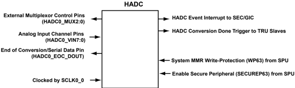

## System Debug (SCB/SWU/DBG/TAPC/CSPFT/STM)

The System Debug and Trace Unit (DBG) is based on ARM Core Sight technology. CoreSight™ is a set of architecture specifications defining debug and trace architecture. The processor uses CoreSight infrastructure to provide industry standard debug and trace capabilities through the following modules.

- Test Access Port Controller (TAPC)
- Trace Unit (CSPFT)
- System Trace Module (STM)

Additional debug resources are provided by the following modules.

- The System Crossbars (SCB) are the fundamental building blocks of a switch-fabric style for (on-chip) system bus interconnection. The SCBs connect system bus masters to system bus slaves, providing concurrent data transfer between multiple bus masters and multiple bus slaves. The SCB provides sustainable throughput for simultaneous transactions in the system with configurable Quality of Service for each type of transaction

(traffic) as required. A hierarchical model, built from multiple SCBs, provides a power and area efficient system interconnect, which satisfies the performance and flexibility requirements of a specific system.

- The System Watchpoint Unit (SWU) is a single module used for transaction monitoring. The SWU is attached to each system slave through the system crossbar interface and provides ports for all address channel signals for the system crossbar. The SWU does not have ports for the read/write data channel signals or the low-power interface signals.