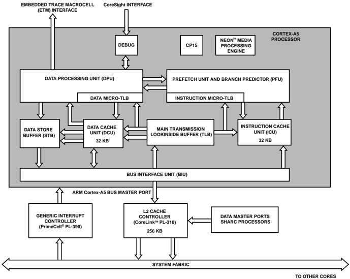

## 2   ARM Cortex-A5 Sub-System

The ADSP-SC589 processor includes an ARM ®  Cortex-A5 ®  core. The ARM Cortex-A5 processor is the smallest, lowest cost and lowest power ARMv7 application processor. The A5 sub-system in the ADSP-SC589 processor includes a Floating-Point Unit, NEON Media Processing Engine, Generic Interrupt Controller and a Level 2 Cache Controller. The A5 also includes support for a L1-Cache sub-system and a full-fledged Memory Management Unit. The A5 implements the ARMv7 architecture and runs 32-bit ARM instructions, 16-bit and 32-bit Thumb instructions, and 8-bit Java byte-codes in Jazelle state.

This document describes the ARM Cortex-A5 core and memory architecture used on the ADSP-SC58x processor, but does not provide detailed programming information for the ARM processor. For more information about programming the ARM processor, visit the ARM Information Center:

- http://infocenter.arm.com.

The applicable documentation for programming the ARM Cortex-A5 processor include:

- Cortex-A5 Technical Reference Manual, Revision: r0p1
- Cortex-A Series Programmer's Guide, Revision: r0p1
- Cortex-A5 NEON Media Processing Engine Technical Reference Manual, Revision: r0p1
- Cortex-A5 Floating-Point Unit Technical Reference Manual, Revision: r0p1
- CoreLink Level 2 Cache Controller L2C-310 Technical Reference Manual, Revision: r3p3
- PrimeCell Generic Interrupt Controller (PL390) Technical Reference Manual, Revision: r0p0

## Cortex A5 Features

The Cortex-A5 Sub-system has the following features.

- Thumb / ARM Instruction support
- L1- Instruction Cache and L1-Data Cache
- Floating Point Unit (FPU)
- NEON Media Processing Engine (NEON)

- Generic Interrupt Controller (GIC)
- Level 2 Cache Controller (L2CC)
- Memory Management Unit (MMU)

## Functional Description

The following sections provide information on the function of the sub-system.

## A5 Block Diagram

The following figure shows the primary blocks of the Cortex A5 sub-system. The performance increases with accesses to lower levels of memory as follows:

1. Level 1 - cache on-chip, separate data/code (highest)
2. Level 2 - cache on-chip, unified
3. Level 3 - memory external, (lowest)

Figure 2-1: A5 Sub-System Block Diagram

## Control Co-Processor (CP15)

The system control co-processor, CP15, controls and provides status information for the functions implemented in the processor. The main functions of the system control co processor are:

- Overall system control and configuration
- MMU configuration and management
- Cache configuration and management
- System performance monitoring

All system architecture functions are controlled by reading or writing a general purpose processor register (Rt) from or to a set of registers (CRn) located within co-processor 15. The Op1, Op2, and CRm fields of the instruction can also be used to select registers or operations.

- MRC p15, Op1, Rt, CRn, CRm, Op2; read a CP15 register into an ARM register
- MCR p15, Op1, Rt, CRn, CRm, Op2; write a CP15 register from an ARM register

## L1 Cache

The Cortex-A5 processor has separate instruction and data caches that run at ARM Core clock speed. The caches have the following features:

- L1-Data Cache size 32 KB
- L1-Instruction Cache size 32 KB
- Each cache can be disabled independently, using the system control coprocessor
- Cache replacement policy is pseudo random
- Data cache is 4-way set-associative
- Instruction cache is 2-way set-associative
- The cache line length is eight words.
- On a cache miss, critical word first filling of the cache is performed.

## Prefetch Unit (PFU)

The PFU implements a two-level prediction mechanism, comprising the following:

- A 256 entry branch pattern history table
- A four-entry BTAC
- A four-entry return stack

## Memory-Management Unit (MMU)

The ARM MMU is responsible for translating addresses of code and data from the virtual view of memory to the physical addresses in the real system. The translation is carried out by the MMU hardware and is transparent to the application. In addition, the MMU controls such things as memory access permissions, memory ordering and cache policies for each region of memory.

The MMU enables tasks or applications to be written in a way that requires them to have no knowledge of the physical memory map of the system, or about other programs that might be running simultaneously. This enables you to use the same virtual memory address space for each program. It also lets you work with a contiguous virtual memory map, even if the physical memory is fragmented. This virtual address space is separate from the actual physical map of memory in the system. Applications are written, compiled and linked to run in the virtual memory space. Virtual addresses are those used by you, and the compiler and linker, when placing code in memory. Physical addresses are those used by the actual hardware system.

The first level MMU uses a Harvard design with separate micro TLB structures in the PFU for instruction fetches and in the DPU for data read and write requests. A miss in the micro TLB results in a request to the main unified TLB shared between the data and instruction sides of the memory system. The TLB consists of a 128-entry two-way set-associative RAM based structure. The TLB page-walk mechanism supports page descriptors held in the L1 data cache. The caching of page descriptors is configured globally for each translation table base register, TTBRx, in the system coprocessor, CP15.

Page table entries support:

- 16 MB super sections
- 1 MB sections
- 64 KB large pages
- 4 KB small pages

NOTE: Virtual Memory translation tables are typically created by operating systems, and are often dynamically managed by the memory management layer. However, even a bare metal system can enable the MMU. For this, a flat mapping technique is used, where all virtual memory addresses shall be programmed exactly same as the physical memory addresses in the system.

- NOTE: In order to utilize L1-Data Cache, application has to enable the MMU, via Co-Processor 15 in the ARM Core. After MMU and L1-Data Cache are enabled via CP15: SCTLR, application can disable / enable cache for individual pages / sections.

## L2 Cache

The Level 2 Cache Controller in the ADSP-SC589 is a CoreLink Level 2 Cache Controller (L2C-310) from ARM and is clocked at SYSCLK speed. The addition of an on-chip secondary cache, also referred to as a Level 2 or L2 cache, is a recognized method of improving the performance of ARM-based systems when significant memory traffic is generated by the processor. By definition a secondary cache assumes the presence of a Level 1 or primary cache, closely coupled or internal to the processor. The cache controller is a unified, physically addressed, physically tagged cache. It includes the following features:

- 256 KB total size
- Lockdown by Line / Way / Master
- Fixed line length of 32 bytes, eight words or 256 bits

- Direct mapped to 8-way associativity (fixed)
- Prefetching capability
- Event monitoring
- Software option to enable exclusive cache configuration
- Additional Buffers:
- Line Fill Buffers (LFBs)
- Line Read Buffers (LRBs)
- Eviction Buffers (EBs)
- Store Buffers (STBs)
- TrustZone support, with the following features:
- Non-Secure (NS) tag bit added in tag RAM and used for lookup in the same way as an address bit. The NS-tag bit is added in all buffers.
- NS bit in Tag RAM used to determine security level of evictions to L3.
- Restrictions for NS accesses for control, configuration, and maintenance registers to restrict access to secure data.
- Parity Support

NOTE: The L2CC Address Filtering registers should not be programmed by user. Not retaining the reset values can give unpredictable results.

## Sharing L2 Cache with SHARC+ Cores

The L2CC (PL310) supports two master and two slave ports. The SHARC+ core can access the L2-Cache without bank conflict versus the Cortex A5 core by programming the L2CC registers. The cache access is restricted to the address range: from CMMR\_L2CC\_START [31:0] to CMMR\_L2CC\_END [31:0]. For more information, see the SHARC+ Core Programming Reference.

NOTE: There is no guarantee for the data coherency between A5 and SHARC+ cores.

- NOTE: Programs should perform L2 cache write-back invalidation before changing the value of CMMR\_L2CC\_START and CMMR\_L2CC\_END .

## Floating-Point Unit (FPU)

The Cortex-A5 FPU is a VFPv4-D16 implementation of the ARMv7 floating-point architecture. It provides lowcost high performance floating-point computation. The FPU supports all addressing modes and operations described in the ARM Architecture Reference Manual .

The features in the FPU are as follows.

- Support for single-precision and double-precision floating-point formats
- Support for conversion between half-precision and single-precision
- Support for Fused Multiply Accumulate (FMA) operations
- Normalized and de-normalized data are all handled in hardware
- Trap-less operation enabling fast execution

## NeON

The Cortex-A5 NEON MPE extends the Cortex-A5 functionality to provide support for the ARM v7 Advanced SIMD v2 and Vector Floating-Point v4 (VFPv4) instruction sets. The Cortex-A5 NEON MPE supports all addressing modes and data-processing operations described in the ARM Architecture Reference Manual .

The Cortex-A5 NEON MPE features are:

- SIMD and scalar single-precision floating-point computation
- scalar double-precision floating-point computation
- SIMD and scalar half-precision floating-point conversion
- SIMD 8, 16, 32, and 64-bit signed and unsigned integer computation
- 8 or 16-bit polynomial computation for single-bit coefficients
- structured data load capabilities
- Large, shared register file, addressable as:
- 32 32-bit S (single) registers
- 32 64-bit D (double) registers
- 16 128-bit Q (quad) registers
- The operations include:
- Addition and subtraction
- Multiplication with optional accumulation
- Maximum or minimum value driven lane selection operations
- Inverse square-root approximation
- Comprehensive data-structure load instructions, including register-bank-resident table lookup

See the ARM Architecture Reference Manual for details of the extension register set.

## Generic Interrupt Controller (GIC)

The GIC is an ARM Architecture compliant System-on-Chip (SoC) peripheral. It is a high-performance, area-optimized interrupt controller. The GIC implements the ARM Generic Interrupt Controller Architecture. The GIC takes interrupts asserted at the system level and signals them to each connected processor as appropriate. The GIC has the following features.

- Registers for managing interrupt sources, interrupt behavior, and interrupt routing to one or more processors
- Support for the ARM architecture Security Extensions
- Support for enabling, disabling, and generating processor interrupts from hardware (peripheral) interrupt sources
- Support for generating software interrupts
- Support for interrupt masking and prioritization

Refer to GIC Overview for more information on the ADSP-SC58x specific configuration of GIC.

Table 2-1: ADSP-SC58x GIC Interrupt List

| Module   | Event/Interrupt                             | SEC ID   |   GIC ID | SEC/GIC Interrupt Name   |
|----------|---------------------------------------------|----------|----------|--------------------------|
| GIC      | Software Interrupt 0, core reset            | N/A      |        0 | GIC_SOFT00               |
| GIC      | Software Interrupt 1, undefined instruction | N/A      |        1 | GIC_SOFT01               |
| GIC      | Software Interrupt 2, supervisor call       | N/A      |        2 | GIC_SOFT02               |
| GIC      | Software Interrupt 3, prefetch abort        | N/A      |        3 | GIC_SOFT03               |
| GIC      | Software Interrupt 4, data abort            | N/A      |        4 | GIC_SOFT04               |
| GIC      | Software Interrupt 5, reserved              | N/A      |        5 | GIC_SOFT05               |
| GIC      | Software Interrupt 6, IRQ interrupt         | N/A      |        6 | GIC_SOFT06               |
| GIC      | Software Interrupt 7, FIQ interrupt         | N/A      |        7 | GIC_SOFT07               |
| CORE     | Cortex A5 L2 Cache                          | 22       |       54 | C0_L2CC                  |
| CORE     | Cortex A5 L1 Parity                         | 23       |       55 | C0_L1_PERR               |
| CTI      | Cortex A5 CTI 0                             | Reserved |      284 | ECT_C0_EVT               |
| PMU      | Cortex A5 Performance Monitoring            | Reserved |      285 | C0_PMUIRQ                |

## A5 Configurations

The following are the Cortex A5 and ADSP-SC58x configurations.

## A5 Configurations

Table 2-2: A5 Core Configuration

| Core Feature           | Comment     |
|------------------------|-------------|
| JAZELLE Support        | Implemented |
| NEON Engine            | Implemented |
| FPU                    | Implemented |
| Instruction cache size | 32 KB       |
| Data cache size        | 32 KB       |

## A5 Configuration Signals

Table 2-3: A5 Configuration Signals

| Configuration                                                              | A5 TRM Signal Name   | Comment                                       |
|----------------------------------------------------------------------------|----------------------|-----------------------------------------------|
| Default Exception Handler Endianness                                       | CFGEND               | Little Endian                                 |
| CPU ID field                                                               | CLUSTERID[3:0]       | 4'b0000                                       |
| Disable Write access to some CP15 registers                                | CP15SDISABLE         | Not Enabled                                   |
| Default exception handling state                                           | TEINIT               | ARM Mode                                      |
| Exception vectors' location at reset                                       | VINITHI              | start exception vectors at address 0x00000000 |
| Disable invalidate entire data cache, instruc- tion cache and TLB at reset | L1RSTDISABLE         | Disabled                                      |
| Enable the RAM interface clamps                                            | CPURAMCLAMP          | clamps not active                             |

## A5 Power Modes

Table 2-4: ARM Core Power Modes

| Mode          | Comment       |
|---------------|---------------|
| Run mode      | Supported     |
| Standby mode  | Supported     |
| Dormant mode  | Not Supported |
| Shutdown mode | Not Supported |

## L2CC Configuration Signals

Table 2-5: L2CC Configuration Signals

| Configuration   | L2CC TRM Signal Name   | Comment   |
|-----------------|------------------------|-----------|
| Associativity   | ASSOCIATIVITY          | 8-Way     |

Table 2-5: L2CC Configuration Signals (Continued)

| Configuration                                                  | L2CC TRM Signal Name   | Comment       |
|----------------------------------------------------------------|------------------------|---------------|
| Cache controller cache ID                                      | CACHEID[5:0]           | 0             |
| Address filtering Enable out of reset                          | CFGADDRFILTEN          | Enabled       |
| Address filtering End Address out of reset                     | CFGADDRFILTEND[11:0]   | 0xFFF         |
| Address filtering Start Address out of reset                   | CFGADDRFILTSTART[11:0] | 0x201         |
| Endian mode for accessing configuration registers out of reset | CFGBIGEND              | Little-endian |
| Base address for accessing configuration registers             | REGFILEBASE[19:0]      | 0x10000       |
| Size of ways                                                   | WAYSIZE[2:0]           | 32 KB         |

## L2CC Power Down Modes

## Table 2-6: L2CC Power Down Modes

| Mode                 | Comment       |
|----------------------|---------------|
| Run mode             | Supported     |
| Dynamic Clock Gating | Supported     |
| Standby mode         | Not Supported |
| Dormant mode         | Not Supported |
| Shutdown mode        | Not Supported |

## L2CC Configuration

## Table 2-7: L2CC Configuration

| Feature               | Comment   |
|-----------------------|-----------|
| Cache way size        | 32 KB     |
| Associativity         | 8 Ways    |
| Default RAM latencies | 2 cycles  |
| DATA RAM banking      | Disabled  |
| Slave port 1 present  | Enabled   |
| Master port 1 present | Enabled   |
| Parity logic          | Enabled   |
| Lock down by master   | Enabled   |
| Lock down by line     | Enabled   |
| Address filtering     | Enabled   |
| Speculative reading   | Disabled  |