## 9   L2 System Memory

L2 system memories have significant bandwidth for core accesses, but it is important to note that L2 responds slower to core accesses than L1 memories. L2 SRAM is the ideal storage for multiple processor cores to share data and instruction resources, such as semaphores, shared buffers, and code libraries. Due to sophisticated data integrity protection and write protection, L2 SRAM is also ideal for data and instructions critical for safe operation of the application.

## L2 System Memory Features

The L2 system memory features include:

- Operation at SYSCLK\_0 frequency
- ECC protection of SRAM area
- ECC memory refresh

Three instances of L2 system memory: SRAM and 2x ROM.

- L2CTL0 contains 256K bytes of RAM grouped into eight banks, 32K bytes each and 32K bytes of boot ROM (ARM core).
- L2CTL1 contains 256K bytes of application ROM grouped into eight banks, 32K bytes each and 32K bytes of boot ROM (SHARC core).
- L2CTL2 contains 256K bytes of application ROM grouped into eight banks, 32K bytes each and 32K bytes of boot ROM (any of the cores).
- All instances supports exclusive access through SMPU.
- SHARC core data ports can access L2 memory through direct path as well as through ARM L2 cache.

## L2 System Memory Functional Description

The L2 system memory manages all of the L2 SRAM and ROM memory banks. The system memory interface arbitrates competing accesses, write protection, and ensures SRAM data integrity. The L2 system memory domain is a unified instruction and data memory. It can hold any mixture of code and data required by the system design.

The following sections provide a functional description of the L2 system memory.

## ADSP-SC58x L2CTL Interrupt List

Table 9-1: ADSP-SC58x L2CTL Interrupt List

|   Interrupt ID | Name           | Description      | Sensitivity   | DMA Channel   |
|----------------|----------------|------------------|---------------|---------------|
|              8 | L2CTL0_ECC_ERR | L2CTL0 ECC Error | Level         |               |

## ADSP-SC58x L2CTL Register List

The L2 memory controller (L2CTL) includes the controls to manage each L2 memory bank independently. A set of registers governs L2CTL operations. For more information on L2CTL functionality, see the L2CTL register descriptions.

Table 9-2: ADSP-SC58x L2CTL Register List

| Name           | Description                   |
|----------------|-------------------------------|
| L2CTL_CTL      | Control Register              |
| L2CTL_EADDR0   | Error Type 0 Address Register |
| L2CTL_EADDR1   | Error Type 1 Address Register |
| L2CTL_ERRADDR0 | ECC Error Address 0 Register  |
| L2CTL_ERRADDR1 | ECC Error Address 1 Register  |
| L2CTL_ERRADDR2 | ECC Error Address 2 Register  |
| L2CTL_ERRADDR3 | ECC Error Address 3 Register  |
| L2CTL_ERRADDR4 | ECC Error Address 4 Register  |
| L2CTL_ERRADDR5 | ECC Error Address 5 Register  |
| L2CTL_ERRADDR6 | ECC Error Address 6 Register  |
| L2CTL_ERRADDR7 | ECC Error Address 7 Register  |
| L2CTL_ET0      | Error Type 0 Register         |
| L2CTL_ET1      | Error Type 1 Register         |
| L2CTL_RFA      | Refresh Address Register      |
| L2CTL_RPCR     | Read Priority Count Register  |
| L2CTL_STAT     | Status Register               |
| L2CTL_WPCR     | Write Priority Count Register |

## L2 System Memory Block Diagram

The ADSP-SC58x Complete L2 System Block Diagram figure shows the complete L2 system memory, including the three memory block instances: L2CTL0, L2CTL1, and L2CTL2. The L2CTL0 block contains boot ROM code for

ARM and eight banks of L2 RAM containing 32 Kbytes each. ARM's 0x00000000 location (reset ISR) is mapped to this block. The L2CTL1 block contains one bank of boot ROM for SHARC+ ID = 1 and eight banks of application ROM.

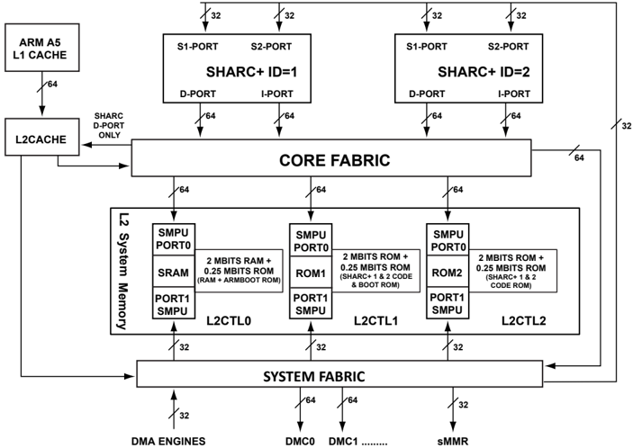

## LEGEND:

S1/S2-Ports: SHARC+ S1/S2 slave ports

D-Port: SHARC+ master data port

I-Port: SHARC+ master instruction port

Figure 9-1: ADSP-SC58x Complete L2 System Block Diagram

## L2 System Memory Architectural Concepts

The following sections describe architecture features of the L2 system memory.

- Read/Write Latency and Throughput
- Arbitration and Priority

## Access Characteristics

The L2 system memory interface converts all 8-bit, 16-bit, and 32-bit accesses to 64-bit accesses. Additionally, it converts 8-bit, 16-bit, and 32-bit bursts to an equivalent internal 64-bit access. For example, the L2 system memory interface converts a 64-bit address-aligned burst of 8-bit accesses of burst length 8 to a single 64-bit access.

## Read/Write Latency and Throughput

The L2 memory design is optimized for burst accesses at the crossbar interface. The L2 system memory buffers and converts write data of 8/16/32-bit to an equivalent 64-bit access. This conversion creates modulo-32-bit writes if the starting addresses are 32-bit aligned. A single 8-bit or 16-bit access, or a non-32-bit address-aligned 8-bit or 16-bit

burst access to an ECC-enabled bank creates an extra latency of two SYSCLK\_0 cycles. No extra latency is seen if the ECC is disabled.

NOTE: Continuous 8/16-bit core access to an ECC-enabled L2 bank is not recommended from a throughput perspective.

## L2 Memory Controller Block Diagram (Instance)

As shown in the following figure, the L2 controller has two ports that interface to system crossbars. Port 0 is a 64-bit interface that is dedicated to core traffic, and port 1 is a 32-bit interface that connects through DMA access. For L2 SRAM both ports (0/1) have a read channel and a write channel, for L2 ROM both ports (0/1) have read channels only. The SRAM/ROM are organized in multiple banks, and each bank has 32K Bytes of data. For ADSP-SC58x parts, the L2CTL0 has an additional bank for the boot ROM; for ADSP-2158x parts, the L2CTL1 has an additional bank for the boot ROM.

Within each bank, data is organized into 4096 words, with each word comprising 64 bits of data and 14 bits of ECC checksum. ROM memory is not protected by the ECC scheme. When the L2 controller accesses RAM and ROM cells, it always reads and writes whole 64-bit words. Despite this, the L2 controller supports 8-, 16-, and 32bit reads and writes from cores and system by applying respective data masks.

Figure 9-2: L2 System Memory Block Diagram

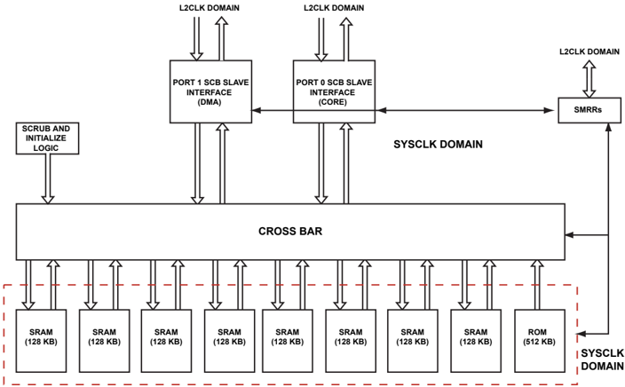

## Arbitration and Priority

Each bank of L2 RAM or ROM has an arbiter which receives requests from the two crossbar ports.

Each arbiter follows a fixed priority scheme for giving grants when more than one channel requests the same bank. The arbiter also supports priority elevation through urgent priority requests.

NOTE: Attempting a write access to both L2 ROM spaces returns an error.

The Fixed Priority table shows the priority for fixed priority mode (with urgent priority disabled) for each SCB channel.

If two cores (or the 64-bit Max BW DMA) simultaneously try to access L2 for the same instance (both read or both write), even to different banks, software allows only one master access at a time. One access port can support one read and write at the same time. However, if one core issues a write and the other issues a read, then access can proceed simultaneously. There is no extra latency inside L2, as long as the accesses are to different banks (assuming pending DMA traffic is also to a non-conflicting bank).

When a core and DMA both access the same bank via the same port (both read or both writes), the best access rate that DMA can achieve is one 64-bit access in every three SYSCLK\_0 cycles during the conflict period. This access rate is achieved by programming the read priority count register ( L2CTL\_RPCR.RPC0 ) bit and the write priority count register ( L2CTL\_WPCR.WPC0 ) bit to 0, while programming the L2CTL\_RPCR.RPC1 and the L2CTL\_WPCR.WPC1 bits to 1.

Table 9-3: Fixed Priority

| Channel              | Priority Level   |
|----------------------|------------------|
| L2 Refresh Request   | 5 (highest)      |
| Port 0 Read Channel  | 4                |
| Port 0 Write Channel | 3                |
| Port 1 Read Channel  | 2                |
| Port 1 Write Channel | 1 (lowest)       |

The arbiters also support priority elevation for a particular channel that has been starved of grants for many SYSCLK\_0 cycles. If a channel does not get a grant for N cycles after its request, then that channel can elevate the priority of its request by issuing an urgent priority request. This request causes that particular channel to become the highest priority master for the next grant cycle (pipelined arbitration for urgent priority). The number of cycles N , after which the priority is elevated, can be programmed for each channel separately using the L2CTL\_RPCR and L2CTL\_WPCR registers.

Programming the bits in the L2CTL\_RPCR and L2CTL\_WPCR registers appropriately achieves the best grant rate for DMA. This grant rate of one in three SYSCLK\_0 cycles during the conflict period is achievable under the following conflict conditions:

- An access conflict between the core and DMA to the same memory bank in the fixed priority arbitration scheme with core activity always prioritized over DMA activity
- An access conflict within the pipelined implementation of urgent priority

To disable urgent priority requests, set the L2CTL\_CTL.DISURP bit. This bit disables the urgent priority requests for all port channels. Each channel can also be prevented from raising the urgent priority request through the priority count register for the specific channel. However, there is no support for disabling urgent priority for a specific memory bank arbiter.

The Fixed Priority With Priority Elevation table provides the various priority levels for the L2 system memory.

Table 9-4: Fixed Priority With Priority Elevation

| Channel                             | Priority Level   |
|-------------------------------------|------------------|
| L2 Refresh Request                  | 9 (highest)      |
| Port 0 Read Channel Urgent Request  | 8                |
| Port 0 Write Channel Urgent Request | 7                |
| Port 1 Read Channel Urgent Request  | 6                |
| Port 1 Write Channel Urgent Request | 5                |
| Port 0 Read Channel Normal Request  | 4                |
| Port 0 Write Channel Normal Request | 3                |
| Port 1 Read Channel Normal Request  | 2                |
| Port 1 Write Channel Normal Request | 1 (lowest)       |

## Data Integrity

The following sections provide information on how the L2 system memory ensures data integrity.

## ECC Algorithm

Hsaio encoding calculates the ECC syndrome. A 7-bit syndrome is generated during write operation and stored as a 7-bit parity field along with the 32 data bits. Each data bit contributes to three parity bits according. Each parity bit represents the XOR value of 13 or 14 data bits according to the following mapping:

Figure 9-3: Hsaio Parity Bit Mapping

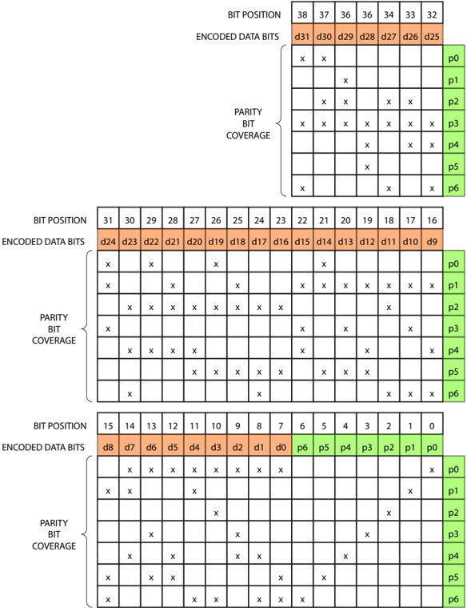

During read operation, the parity bits become part of the syndrome equation. The new syndrome bits are now the XOR values of the 13 or 14 data bits plus the respective stored parity bit. If any of the seven syndrome bits is set, an error situation is detected. An OR gate cross of the 7 bits reports the error, without specifying the type of the error.

If a single parity bit failed, the new 7-bit syndrome has 1 bit that is set. If a single data bit failed, the new syndrome has 3 bits that are set, because all three related parity bits fail. So, an XOR gate cross of all seven syndrome bits detects a single-bit error, indicating that an odd number of syndrome bits is set.

Figure 9-4: Hsiao Error Reports

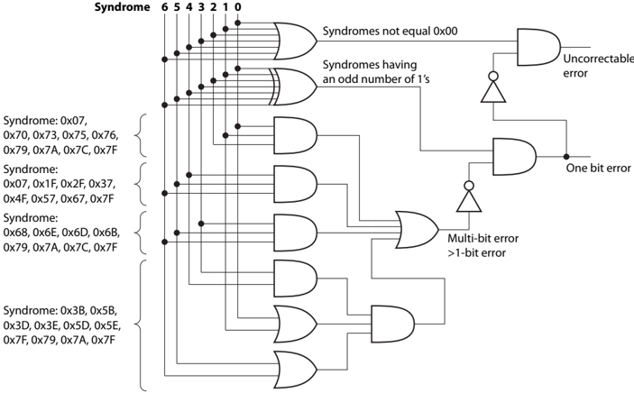

The XOR gate detects single-bit errors and does not flag any dual-bit error. But, the gate does flag 50% of the other multi-bit errors undesirably. Extra logic is implemented to increase the detection rate of multi-bit errors to 68.7% as shown in the figure.

If a single-bit error is detected, the failing bit can be localized and corrected. If all three syndrome bits corresponding to a specific data bit are 1, a data error is assumed. The respective data bit is toggled on its way to the system bus.

## ECC Hardware Control

After reset, ECC protection is enabled. The boot code initializes all L2 SRAM data and checksum cells. ECC protection adds some cycle penalty when 8-bit and 16-bit values write L2 memory. Disable ECC protection for individual SRAM banks by setting the L2CTL\_CTL.BK0EDIS through L2CTL\_CTL.BK7EDIS disable bits. Due to caching mechanisms of the processor cores and data bursting of the DMA channels, 8-bit and 16-bit write accesses are rather uncommon. Typically, only two-dimensional DMA operations or uncached 8-bit and 16-bit store instruction can trigger these writes.

For system integrity testing, the L2 system memory also provides a method for accessing the ECC checksum area directly. The L2CTL\_CTL.ECCMAP0 through L2CTL\_CTL.ECCMAP7 bits map the ECC checksum values into the address space of the data bits. This feature can be activated per SRAM bank. In this mode, only 32-bit accesses are allowed. 32-bit reads return the checksum value in the lower 7 bits while the upper bits read zero. Any 32-bit write overwrites the checksum. The upper bits are ignored.

Using this checksum mapping feature, safety critical applications can verify the ECC hardware during boot up sequence or even at run time. It is not required to set the L2CTL\_CTL.BK0EDIS through L2CTL\_CTL.BK7EDIS disable bits explicitly. T o test the ECC hardware, use the following steps:

1. Write data values to L2 SRAM destination (preferable an even number of 32-bit words).
2. If data cache enabled, make sure that it flushes out data.

3. Execute SYNC instruction.
4. Set L2CTL\_CTL.ECCMAP7 -L2CTL\_CTL.ECCMAP0 bits of interest.
5. Execute SYNC instruction.
6. Write checksum values using 32-bit store instructions.
7. If data cache enabled, make sure that it flushes out checksum values.
8. Execute SYNC instruction.
9. Clear L2CTL\_CTL.ECCMAP7 -L2CTL\_CTL.ECCMAP0 bits.
10. Execute SYNC instruction.
11. Read data values back.

## ECC Error Management

The L2 system memory flags 2-bit and multi-bit errors to the system by:

- Raising the ECC\_ERR interrupt
- Reporting a read error to the system bus
- Setting the sticky L2CTL\_STAT.ECCERR7 -L2CTL\_STAT.ECCERR0 status flag
- Latching the address of the failing operation into the respective L2CTL\_ERRADDR7 -L2CTL\_ERRADDR0 register.

There is one error status bit and one error address register per L2 SRAM bank.

Typically, ECC\_ERR events are declared as system faults in the system event controller (SEC). Whether these faults are reported, the interrupt service routine can consult the L2CTL\_STAT register and the L2CTL\_ERRADDR0 through L2CTL\_ERRADDR7 registers to determine whether:

- The data at the failing L2 address was critical enough to require an immediate reboot of the system
- The data at the failing L2 address was less critical or can be restored

The L2CTL\_STAT.ECCERR0 through L2CTL\_STAT.ECCERR7 flags are cleared with a W1C operation.

## Memory Refresh

If data in L2 SRAM contains single-bit errors, the data is corrected on its way to the system buses. The corrected value is not written back to the SRAM location. To prevent any risk of accumulation of single-bit errors over time and to minimize likelihood of multi-bit errors, the L2 system memory provides a special memory refresh mechanism.

Software can initiate a memory refresh cycle of a 64-bit SRAM entity by writing the address of interest into the refresh address register, L2CTL\_RFA . The write triggers an atomic operation. In this operation, the L2 system memory:

- Reads a 64-bit entity from the targeted memory

- Applies an ECC algorithm to the two 32-bit words
- Writes the corrected data back to memory

While the atomic refresh operation is ongoing, other accesses to the same SRAM bank are locked-out. The L2CTL\_STAT.RFRS status bit signals an ongoing refresh operation. Hardware clears the bit after the operation has finished. The content of the L2CTL\_RFA register must not change while the refresh operation is ongoing.

In safety-critical applications, software can refresh all L2 SRAM by periodically writing to the L2CTL\_RFA register with values. It increments with a value of eight until all SRAM locations are refreshed.

Memory refresh operation is meaningless when the L2CTL\_CTL.BK0EDIS through L2CTL\_CTL.BK7EDIS disable bits are set.

## L2 System Memory Event Control

The following sections describe event control features of the L2 system memory, such as error response.

## ECC Error Interrupt

A bus error is signaled under any of the following conditions.

- A write access to ROM address space
- A read/write access to reserved address space
- An ECC multi-bit error in an ECC-enabled bank. A non-modulo, 32-bit write to an ECC-enabled bank can also potentially create a bus error response due to an ECC multi-bit error. This response is because the L2 system memory implements a 32-bit ECC, and therefore a non-modulo, 32-bit write results in a read. This read can create multi-bit errors even if the memory was initialized.

Bus error notifications are stored in the L2CTL\_STAT register, and the addresses that generated the error on a given port are stored in the L2CTL\_EADDR0 / L2CTL\_EADDR1 register of that port. The details of the error are stored in the L2CTL\_ET0 / L2CTL\_ET1 register of the port.

## ADSP-SC58x L2CTL Register Descriptions

L2 Memory Controller (L2CTL) contains the following registers.

Table 9-5: ADSP-SC58x L2CTL Register List

| Name           | Description                   |
|----------------|-------------------------------|
| L2CTL_CTL      | Control Register              |
| L2CTL_EADDR0   | Error Type 0 Address Register |
| L2CTL_EADDR1   | Error Type 1 Address Register |
| L2CTL_ERRADDR0 | ECC Error Address 0 Register  |

Table 9-5: ADSP-SC58x L2CTL Register List (Continued)

| Name           | Description                   |
|----------------|-------------------------------|
| L2CTL_ERRADDR1 | ECC Error Address 1 Register  |
| L2CTL_ERRADDR2 | ECC Error Address 2 Register  |
| L2CTL_ERRADDR3 | ECC Error Address 3 Register  |
| L2CTL_ERRADDR4 | ECC Error Address 4 Register  |
| L2CTL_ERRADDR5 | ECC Error Address 5 Register  |
| L2CTL_ERRADDR6 | ECC Error Address 6 Register  |
| L2CTL_ERRADDR7 | ECC Error Address 7 Register  |
| L2CTL_ET0      | Error Type 0 Register         |
| L2CTL_ET1      | Error Type 1 Register         |
| L2CTL_RFA      | Refresh Address Register      |
| L2CTL_RPCR     | Read Priority Count Register  |
| L2CTL_STAT     | Status Register               |
| L2CTL_WPCR     | Write Priority Count Register |

## Control Register

The L2CTL\_CTL register includes a write protection bit, enables L2 banks, and selects mapping of banks (as ECC RAM or data RAM).

Figure 9-5: L2CTL\_CTL Register Diagram

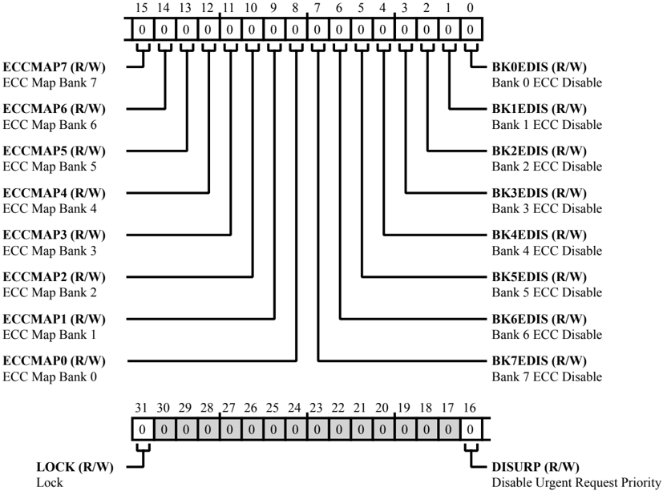

Table 9-6: L2CTL\_CTL Register Fields

| Bit No. (Access)   | Bit Name   | Description/Enumeration                                                                                                                                     |
|--------------------|------------|-------------------------------------------------------------------------------------------------------------------------------------------------------------|
| 31 (R/W)           | LOCK       | Lock. If the global lock bit is set ( SPU_CTL.GLCK bit =1) and the L2CTL_CTL.LOCK bit is set, the L2CTL_CTL register is read only (locked). 0 Unlock 1 Lock |
| 16 (R/W)           | DISURP     | Disable Urgent Request Priority. The L2CTL_CTL.DISURP disables urgent request priority mode for all L2 banks. 0 Enable URP 1 Disable URP                    |

Table 9-6: L2CTL\_CTL Register Fields (Continued)

| Bit No. (Access)   | Bit Name   | Description/Enumeration                                                                            |
|--------------------|------------|----------------------------------------------------------------------------------------------------|
| 15 (R/W)           | ECCMAP7    | ECC Map Bank 7. The L2CTL_CTL.ECCMAP7 bit selects whether L2 bank 7 addresses ECC RAM or data RAM. |
| 15 (R/W)           | ECCMAP7    | 0 Data RAM                                                                                         |
| 15 (R/W)           | ECCMAP7    | 1 ECC RAM                                                                                          |
| 14 (R/W)           | ECCMAP6    | ECC Map Bank 6. The L2CTL_CTL.ECCMAP6 bit selects whether L2 bank 6 addresses ECC RAM or data RAM. |
| 14 (R/W)           | ECCMAP6    | 0 Data RAM                                                                                         |
| 14 (R/W)           | ECCMAP6    | 1 ECC RAM                                                                                          |
| 13 (R/W)           | ECCMAP5    | ECC Map Bank 5. The L2CTL_CTL.ECCMAP5 bit selects whether L2 bank 5 addresses ECC RAM or data RAM. |
| 13 (R/W)           | ECCMAP5    | 0 Data RAM                                                                                         |
| 13 (R/W)           | ECCMAP5    | 1 ECC RAM                                                                                          |
| 12 (R/W)           | ECCMAP4    | ECC Map Bank 4. The L2CTL_CTL.ECCMAP4 bit selects whether L2 bank 4 addresses ECC RAM or data RAM. |
| 12 (R/W)           | ECCMAP4    | 0 Data RAM                                                                                         |
| 12 (R/W)           | ECCMAP4    | 1 ECC RAM                                                                                          |
| 11 (R/W)           | ECCMAP3    | ECC Map Bank 3. The L2CTL_CTL.ECCMAP3 bit selects whether L2 bank 3 addresses ECC RAM or data RAM. |
| 11 (R/W)           | ECCMAP3    | 0 Data RAM                                                                                         |
| 11 (R/W)           | ECCMAP3    | 1 ECC RAM                                                                                          |
| 10 (R/W)           | ECCMAP2    | ECC Map Bank 2. The L2CTL_CTL.ECCMAP2 bit selects whether L2 bank 2 addresses ECC RAM or data RAM. |
| 10 (R/W)           | ECCMAP2    | 0 Data RAM                                                                                         |
| 10 (R/W)           | ECCMAP2    | 1 ECC RAM                                                                                          |

Table 9-6: L2CTL\_CTL Register Fields (Continued)

| Bit No. (Access)   | Bit Name   | Description/Enumeration                                                                            |
|--------------------|------------|----------------------------------------------------------------------------------------------------|
| 9 (R/W)            | ECCMAP1    | ECC Map Bank 1. The L2CTL_CTL.ECCMAP1 bit selects whether L2 bank 1 addresses ECC RAM or data RAM. |
| 9 (R/W)            | ECCMAP1    | 0 Data RAM                                                                                         |
| 9 (R/W)            | ECCMAP1    | 1 ECC RAM                                                                                          |
| 8 (R/W)            | ECCMAP0    | ECC Map Bank 0. The L2CTL_CTL.ECCMAP0 bit selects whether L2 bank 0 addresses ECC RAM or data RAM. |
| 8 (R/W)            | ECCMAP0    | 0 Data RAM                                                                                         |
| 8 (R/W)            | ECCMAP0    | 1 ECC RAM                                                                                          |
| 7 (R/W)            | BK7EDIS    | Bank 7 ECC Disable. The L2CTL_CTL.BK7EDIS bit disables L2 bank 7 ECC operation.                    |
| 7 (R/W)            | BK7EDIS    | 0 Enable ECC                                                                                       |
| 6 (R/W)            | BK6EDIS    | Bank 6 ECC Disable. The L2CTL_CTL.BK6EDIS bit disables L2 bank 6 ECC operation.                    |
| 6 (R/W)            | BK6EDIS    | 0 Enable ECC                                                                                       |
| 6 (R/W)            | BK6EDIS    | 1 Disable ECC                                                                                      |
| 5 (R/W)            | BK5EDIS    | Bank 5 ECC Disable. The L2CTL_CTL.BK5EDIS bit disables L2 bank 5 ECC operation.                    |
| 5 (R/W)            | BK5EDIS    | 0 Enable ECC                                                                                       |
| 5 (R/W)            | BK5EDIS    | 1 Disable ECC                                                                                      |
| 4 (R/W)            | BK4EDIS    | Bank 4 ECC Disable. The L2CTL_CTL.BK4EDIS bit disables L2 bank 4 ECC operation. ECC                |
| 4 (R/W)            | BK4EDIS    | 0 Enable                                                                                           |
| 4 (R/W)            | BK4EDIS    | 1 Disable ECC                                                                                      |
| 3 (R/W)            | BK3EDIS    | Bank 3 ECC Disable. The L2CTL_CTL.BK3EDIS bit disables L2 bank 3 ECC operation.                    |
| 3 (R/W)            | BK3EDIS    | 0 Enable ECC                                                                                       |
| 3 (R/W)            | BK3EDIS    | 1 Disable ECC                                                                                      |

Table 9-6: L2CTL\_CTL Register Fields (Continued)

| Bit No. (Access)   | Bit Name   | Description/Enumeration                                                                                    |
|--------------------|------------|------------------------------------------------------------------------------------------------------------|
| 2 (R/W)            | BK2EDIS    | Bank 2 ECC Disable. The L2CTL_CTL.BK2EDIS bit disables L2 bank 2 ECC operation. 0 Enable ECC               |
| 1 (R/W)            | BK1EDIS    | Bank 1 ECC Disable. The L2CTL_CTL.BK1EDIS bit disables L2 bank 1 ECC operation. 0 Enable ECC               |
| 0 (R/W)            | BK0EDIS    | Bank 0 ECC Disable. The L2CTL_CTL.BK0EDIS bit disables L2 bank 0 ECC operation. 0 Enable ECC 1 Disable ECC |

## Error Type 0 Address Register

The L2CTL\_EADDR0 register holds the address that created an access error on the L2 port 0 bus interface (cores). This register is be updated only if the corresponding error status bit ( L2CTL\_STAT.ERR0 ) is cleared. After the status bit is set for an error, further errors do not update the L2CTL\_EADDR0 register until a W1C clears the corresponding status bit. If read and write access errors occur simultaneously, the register captures the write access error address.

Figure 9-6: L2CTL\_EADDR0 Register Diagram

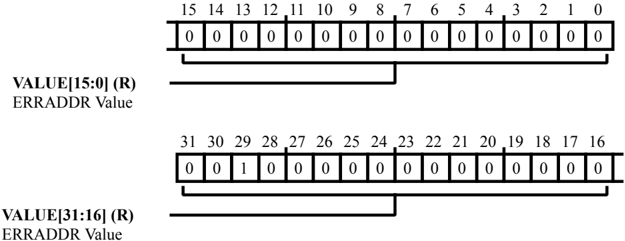

Table 9-7: L2CTL\_EADDR0 Register Fields

| Bit No. (Access)   | Bit Name   | Description/Enumeration                                             |
|--------------------|------------|---------------------------------------------------------------------|
| 31:0               | VALUE      | ERRADDR Value.                                                      |
| (R/NW)             |            | The L2CTL_EADDR0.VALUE bits hold the address causing the bus error. |

## Error Type 1 Address Register

The L2CTL\_EADDR1 register holds the address that created an access error on the L2 port 1 bus interface (DMA). This register is be updated only if the corresponding error status bit ( L2CTL\_STAT.ERR1 ) is cleared. After the status bit is set for an error, further errors do not update the L2CTL\_EADDR1 register until a W1C clears the corresponding status bit. If read and write access errors occur simultaneously, the register captures the write access error address.

Figure 9-7: L2CTL\_EADDR1 Register Diagram

Table 9-8: L2CTL\_EADDR1 Register Fields

| Bit No. (Access)   | Bit Name   | Description/Enumeration                                             |
|--------------------|------------|---------------------------------------------------------------------|
| 31:0               | VALUE      | ERRADDR Value.                                                      |
| (R/NW)             |            | The L2CTL_EADDR1.VALUE bits hold the address causing the bus error. |

## ECC Error Address 0 Register

The L2CTL\_ERRADDR0 register holds the address containing an ECC multi-bit error for the corresponding bank. The L2CTL updates this register only if the bank's status bit ( L2CTL\_STAT.ECCERR0 ) is cleared. After the bank's status bit is set for an error, further errors in the same bank are not detected until a W1C clears the status bit.

Figure 9-8: L2CTL\_ERRADDR0 Register Diagram

Table 9-9: L2CTL\_ERRADDR0 Register Fields

| Bit No. (Access)   | Bit Name   | Description/Enumeration                                                                             |
|--------------------|------------|-----------------------------------------------------------------------------------------------------|
| 31:0 (R/NW)        | VALUE      | ERRADDR Value. The L2CTL_ERRADDR0.VALUE bits hold the address containing the ECC double- bit error. |

## ECC Error Address 1 Register

The L2CTL\_ERRADDR1 register holds the address containing an ECC multi-bit error for the corresponding bank. The L2CTL updates this register only if the bank's status bit ( L2CTL\_STAT.ECCERR1 ) is cleared. After the bank's status bit is set for an error, further errors in the same bank are not detected until a W1C clears the status bit.

Figure 9-9: L2CTL\_ERRADDR1 Register Diagram

Table 9-10: L2CTL\_ERRADDR1 Register Fields

| Bit No. (Access)   | Bit Name   | Description/Enumeration                                                                             |
|--------------------|------------|-----------------------------------------------------------------------------------------------------|
| 31:0 (R/NW)        | VALUE      | ERRADDR Value. The L2CTL_ERRADDR1.VALUE bits hold the address containing the ECC double- bit error. |

## ECC Error Address 2 Register

The L2CTL\_ERRADDR2 register holds the address containing an ECC multi-bit error for the corresponding bank. The L2CTL updates this register only if the bank's status bit ( L2CTL\_STAT.ECCERR2 ) is cleared. After the bank's status bit is set for an error, further errors in the same bank are not detected until a W1C clears the status bit.

Figure 9-10: L2CTL\_ERRADDR2 Register Diagram

Table 9-11: L2CTL\_ERRADDR2 Register Fields

| Bit No. (Access)   | Bit Name   | Description/Enumeration                                                                             |
|--------------------|------------|-----------------------------------------------------------------------------------------------------|
| 31:0 (R/NW)        | VALUE      | ERRADDR Value. The L2CTL_ERRADDR2.VALUE bits hold the address containing the ECC double- bit error. |

## ECC Error Address 3 Register

The L2CTL\_ERRADDR3 register holds the address containing an ECC multi-bit error for the corresponding bank. The L2CTL updates this register only if the bank's status bit ( L2CTL\_STAT.ECCERR3 ) is cleared. After the bank's status bit is set for an error, further errors in the same bank are not detected until a W1C clears the status bit.

Figure 9-11: L2CTL\_ERRADDR3 Register Diagram

Table 9-12: L2CTL\_ERRADDR3 Register Fields

| Bit No. (Access)   | Bit Name   | Description/Enumeration                                                                             |
|--------------------|------------|-----------------------------------------------------------------------------------------------------|
| 31:0 (R/NW)        | VALUE      | ERRADDR Value. The L2CTL_ERRADDR3.VALUE bits hold the address containing the ECC double- bit error. |

## ECC Error Address 4 Register

The L2CTL\_ERRADDR4 register holds the address containing an ECC multi-bit error for the corresponding bank. The L2CTL updates this register only if the bank's status bit ( L2CTL\_STAT.ECCERR4 ) is cleared. After the bank's status bit is set for an error, further errors in the same bank are not detected until a W1C clears the status bit.

Figure 9-12: L2CTL\_ERRADDR4 Register Diagram

Table 9-13: L2CTL\_ERRADDR4 Register Fields

| Bit No. (Access)   | Bit Name   | Description/Enumeration                                                                             |
|--------------------|------------|-----------------------------------------------------------------------------------------------------|
| 31:0 (R/NW)        | VALUE      | ERRADDR Value. The L2CTL_ERRADDR4.VALUE bits hold the address containing the ECC double- bit error. |

## ECC Error Address 5 Register

The L2CTL\_ERRADDR5 register holds the address containing an ECC multi-bit error for the corresponding bank. The L2CTL updates this register only if the bank's status bit ( L2CTL\_STAT.ECCERR5 ) is cleared. After the bank's status bit is set for an error, further errors in the same bank are not detected until a W1C clears the status bit.

Figure 9-13: L2CTL\_ERRADDR5 Register Diagram

Table 9-14: L2CTL\_ERRADDR5 Register Fields

| Bit No. (Access)   | Bit Name   | Description/Enumeration                                                                             |
|--------------------|------------|-----------------------------------------------------------------------------------------------------|
| 31:0 (R/NW)        | VALUE      | ERRADDR Value. The L2CTL_ERRADDR5.VALUE bits hold the address containing the ECC double- bit error. |

## ECC Error Address 6 Register

The L2CTL\_ERRADDR6 register holds the address containing an ECC multi-bit error for the corresponding bank. The L2CTL updates this register only if the bank's status bit ( L2CTL\_STAT.ECCERR6 ) is cleared. After the bank's status bit is set for an error, further errors in the same bank are not detected until a W1C clears the status bit.

Figure 9-14: L2CTL\_ERRADDR6 Register Diagram

Table 9-15: L2CTL\_ERRADDR6 Register Fields

| Bit No. (Access)   | Bit Name   | Description/Enumeration                                                                             |
|--------------------|------------|-----------------------------------------------------------------------------------------------------|
| 31:0 (R/NW)        | VALUE      | ERRADDR Value. The L2CTL_ERRADDR6.VALUE bits hold the address containing the ECC double- bit error. |

## ECC Error Address 7 Register

The L2CTL\_ERRADDR7 register holds the address containing an ECC multi-bit error for the corresponding bank. The L2CTL updates this register only if the bank's status bit ( L2CTL\_STAT.ECCERR7 ) is cleared. After the bank's status bit is set for an error, further errors in the same bank are not detected until a W1C clears the status bit.

Figure 9-15: L2CTL\_ERRADDR7 Register Diagram

Table 9-16: L2CTL\_ERRADDR7 Register Fields

| Bit No. (Access)   | Bit Name   | Description/Enumeration                                                                             |
|--------------------|------------|-----------------------------------------------------------------------------------------------------|
| 31:0 (R/NW)        | VALUE      | ERRADDR Value. The L2CTL_ERRADDR7.VALUE bits hold the address containing the ECC double- bit error. |

## Error Type 0 Register

The L2CTL\_ET0 register holds information about the error transaction that has occurred on the bus for the corresponding L2 bus port 0 (cores). This register is updated only if the corresponding error status bit L2CTL\_STAT.ERR0 is cleared. After the status bit is set for an error, further errors do not update the L2CTL\_ET0 register until a W1C clears the corresponding status bit. If read and write access errors occur simultaneously, the L2CTL\_ET0 captures the write access error, keeping in sync with the error address register ( L2CTL\_EADDR0 ).

Figure 9-16: L2CTL\_ET0 Register Diagram

Table 9-17: L2CTL\_ET0 Register Fields

| Bit No. (Access)   | Bit Name   | Description/Enumeration                                                                                                        |
|--------------------|------------|--------------------------------------------------------------------------------------------------------------------------------|
| 20:8 (R/NW)        | ID         | Error ID. The L2CTL_ET0.ID bits hold the bus master ID of the access that caused an error.                                     |
| 4 (R/NW)           | RDWR       | Read/Write Error. The L2CTL_ET0.RDWR bit indicates whether a read or write access caused an error. 0 Read Access created Error |
| 3 (R/NW)           | ECCERR     | ECC Error. The L2CTL_ET0.ECCERR bit indicates whether the access had an ECC double-bit error.                                  |
| 2 (R/NW)           | ACCERR     | Access Error. The L2CTL_ET0.ACCERR bit indicates whether the access went to a restricted bank.                                 |

Table 9-17: L2CTL\_ET0 Register Fields (Continued)

| Bit No. (Access)   | Bit Name   | Description/Enumeration                                                      |
|--------------------|------------|------------------------------------------------------------------------------|
| 0                  | ROMERR     | ROMError.                                                                    |
| (R/NW)             |            | The L2CTL_ET0.ROMERR bit indicates whether a write access went to a ROMarea. |

## Error Type 1 Register

The L2CTL\_ET1 register holds information about the error transaction that has occurred on the bus for the corresponding L2 bus port 1 (DMA). This register is updated only if the corresponding error status bit L2CTL\_STAT.ERR1 is cleared. After the status bit is set for an error, further errors do not update the L2CTL\_ET1 register until a W1C clears the corresponding status bit. If read and write access errors occur simultaneously, the L2CTL\_ET1 captures the write access error, keeping in sync with the error address register ( L2CTL\_EADDR1 ).

Figure 9-17: L2CTL\_ET1 Register Diagram

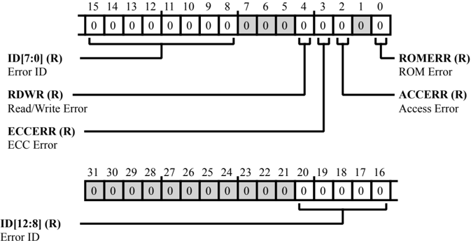

Table 9-18: L2CTL\_ET1 Register Fields

| Bit No. (Access)   | Bit Name   | Description/Enumeration                                                                                                        |
|--------------------|------------|--------------------------------------------------------------------------------------------------------------------------------|
| 20:8 (R/NW)        | ID         | Error ID. The L2CTL_ET1.ID bits hold the bus master ID of the access that caused an error.                                     |
| 4 (R/NW)           | RDWR       | Read/Write Error. The L2CTL_ET1.RDWR bit indicates whether a read or write access caused an error. 0 Read access created error |
| 3 (R/NW)           | ECCERR     | ECC Error. If the L2CTL_ET1.ECCERR bit =1, the access had an ECC double-bit error.                                             |
| 2 (R/NW)           | ACCERR     | Access Error. If the L2CTL_ET1.ACCERR bit =1, the access went to a restricted bank.                                            |
| 0 (R/NW)           | ROMERR     | ROMError. If the L2CTL_ET1.ROMERR bit =1, a write access went to a ROMarea.                                                    |

## Refresh Address Register

The L2CTL\_RFA register stores the refresh address value. When this register is written, L2 initiates an atomic readwrite operation to the address value written into the register. This is a read/write register, but a new value in the corresponding field has to be written only when there are no outstanding refresh request pending ( L2CTL\_STAT.RFRS =0). If a write occurs while a request is pending, the L2CTL generates a bus error, and the write does not take effect.

Figure 9-18: L2CTL\_RFA Register Diagram

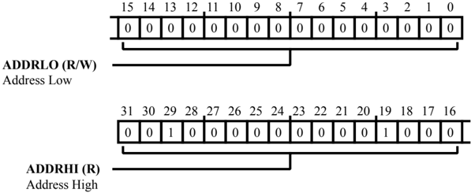

Table 9-19: L2CTL\_RFA Register Fields

| Bit No. (Access)   | Bit Name   | Description/Enumeration                                                                                                                                                      |
|--------------------|------------|------------------------------------------------------------------------------------------------------------------------------------------------------------------------------|
| 31:16 (R/NW)       | ADDRHI     | Address High. The L2CTL_RFA.ADDRHI bits hold the high 16-bits of the L2 refresh address. Note that the upper 14 bits are hard-coded to the upper bits of the L2 address map. |
| 15:0 (R/W)         | ADDRLO     | Address Low. The L2CTL_RFA.ADDRLO bits hold the low 16-bits of the L2 refresh address. Note that the lowest three bits are do-not-care.                                      |

## Read Priority Count Register

The L2CTL\_RPCR register stores the count value to be used for priority elevation for bus read channels. If a bus channel is not granted access from the bank arbiter, the channel waits for the programmed number of SYSCLK\_0 cycles, before the request is elevated to a high priority request. If a priority count value is programmed as zero for a channel, that channel does not raise the urgent priority request.

This is a read/write register, but a new value in the corresponding field must be written only when there are no outstanding transactions on the corresponding bus read channel. A best practice is to program this register before initiating an L2 access.

Figure 9-19: L2CTL\_RPCR Register Diagram

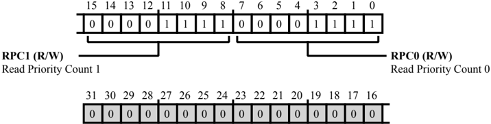

Table 9-20: L2CTL\_RPCR Register Fields

| Bit No. (Access)   | Bit Name   | Description/Enumeration                                                     |
|--------------------|------------|-----------------------------------------------------------------------------|
| 15:8               | RPC1       | Read Priority Count 1.                                                      |
| (R/W)              |            | The L2CTL_RPCR.RPC1 bits hold the priority count for L2 bus read channel 1. |
| 7:0                | RPC0       | Read Priority Count 0.                                                      |
| (R/W)              |            | The L2CTL_RPCR.RPC0 bits hold the priority count for L2 bus read channel 0. |

## Status Register

The L2CTL\_STAT register indicates ECC error status, refresh register status, and bus error status.

Figure 9-20: L2CTL\_STAT Register Diagram

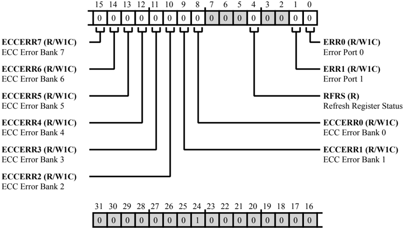

Table 9-21: L2CTL\_STAT Register Fields

| Bit No. (Access)   | Bit Name   | Description/Enumeration                                                                                        |
|--------------------|------------|----------------------------------------------------------------------------------------------------------------|
| 15 (R/W1C)         | ECCERR7    | ECC Error Bank 7. The L2CTL_STAT.ECCERR7 bit indicates that an ECC double-bit error occurred inside L2 bank 7. |
| 15 (R/W1C)         | ECCERR7    | 0 No Status                                                                                                    |
| 14 (R/W1C)         | ECCERR6    | ECC Error Bank 6. The L2CTL_STAT.ECCERR6 bit indicates that an ECC double-bit error occurred inside L2 bank 6. |
| 14 (R/W1C)         | ECCERR6    | 0 No Status                                                                                                    |
| 14 (R/W1C)         | ECCERR6    | 1 ECC Double Bit Error                                                                                         |
| 13 (R/W1C)         | ECCERR5    | ECC Error Bank 5. The L2CTL_STAT.ECCERR5 bit indicates that an ECC double-bit error occurred inside L2 bank 5. |
| 13 (R/W1C)         | ECCERR5    | 0 No Status                                                                                                    |
| 13 (R/W1C)         | ECCERR5    | 1 ECC Double Bit Error                                                                                         |

Table 9-21: L2CTL\_STAT Register Fields (Continued)

| Bit No. (Access)   | Bit Name   | Description/Enumeration                                                                                                                                |
|--------------------|------------|--------------------------------------------------------------------------------------------------------------------------------------------------------|
| 12 (R/W1C)         | ECCERR4    | ECC Error Bank 4. The L2CTL_STAT.ECCERR4 bit indicates that an ECC double-bit error occurred inside L2 bank 4.                                         |
| 12 (R/W1C)         | ECCERR4    | 0 No Status                                                                                                                                            |
| 12 (R/W1C)         | ECCERR4    | 1 ECC Double Bit Error                                                                                                                                 |
| 11 (R/W1C)         | ECCERR3    | ECC Error Bank 3. The L2CTL_STAT.ECCERR3 bit indicates that an ECC double-bit error occurred inside L2 bank 3.                                         |
| 11 (R/W1C)         | ECCERR3    | 0 No Status                                                                                                                                            |
| 11 (R/W1C)         | ECCERR3    | 1 ECC Double Bit Error                                                                                                                                 |
| 10 (R/W1C)         | ECCERR2    | ECC Error Bank 2. The L2CTL_STAT.ECCERR2 bit indicates that an ECC double-bit error occurred inside L2 bank 2.                                         |
| 10 (R/W1C)         | ECCERR2    | 0 No Status                                                                                                                                            |
| 10 (R/W1C)         | ECCERR2    | 1 ECC Double Bit Error                                                                                                                                 |
| 9 (R/W1C)          | ECCERR1    | ECC Error Bank 1. The L2CTL_STAT.ECCERR1 bit indicates that an ECC double-bit error occurred inside L2 bank 1.                                         |
| 9 (R/W1C)          | ECCERR1    | 0 No Status                                                                                                                                            |
| 9 (R/W1C)          | ECCERR1    | 1 ECC Double Bit Error                                                                                                                                 |
| 8 (R/W1C)          | ECCERR0    | ECC Error Bank 0. The L2CTL_STAT.ECCERR0 bit indicates that an ECC double-bit error occurred inside L2 bank 0.                                         |
| 8 (R/W1C)          | ECCERR0    | 0 No Status                                                                                                                                            |
| 8 (R/W1C)          | ECCERR0    | 1 ECC Double Bit Error                                                                                                                                 |
| 4 (R/NW)           | RFRS       | Refresh Register Status. The L2CTL_STAT.RFRS bit indicates whether a refresh request is pending (in prog- ress) or that there are no pending requests. |
| 4 (R/NW)           | RFRS       | 0 No Pending Requests                                                                                                                                  |
| 4 (R/NW)           | RFRS       | 1 Request Pending (Refresh in Progress)                                                                                                                |

Table 9-21: L2CTL\_STAT Register Fields (Continued)

| Bit No. (Access)   | Bit Name   | Description/Enumeration                                                                                                                          |
|--------------------|------------|--------------------------------------------------------------------------------------------------------------------------------------------------|
| 1 (R/W1C)          | ERR1       | Error Port 1. The L2CTL_STAT.ERR1 indicates whether the L2CTL has detected a bus access er- ror on L2s bus port 1. 0 No Error 1 Bus Access Error |
| 0 (R/W1C)          | ERR0       | Error Port 0. The L2CTL_STAT.ERR0 indicates whether the L2CTL has detected a bus access er- ror on L2s bus port 0. 0 No Error                    |

## Write Priority Count Register

The L2CTL\_WPCR register stores the count value to be used for priority elevation for bus write channels. If a bus channel is not granted access from the bank arbiter, the channel waits for the programmed number of SYSCLK\_0 cycles, before the request is elevated to a high priority request. If a priority count value is programmed as zero for a channel, that channel does not raise the urgent priority request.

This is a read/write register, but a new value in the corresponding field must be written only when there are no outstanding transactions on the corresponding bus write channel. A best practice is to program this register before initiating an L2 access.

Figure 9-21: L2CTL\_WPCR Register Diagram

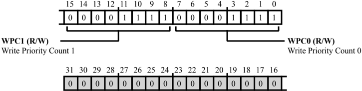

Table 9-22: L2CTL\_WPCR Register Fields

| Bit No. (Access)   | Bit Name   | Description/Enumeration                                                      |
|--------------------|------------|------------------------------------------------------------------------------|
| 15:8               | WPC1       | Write Priority Count 1.                                                      |
| (R/W)              |            | The L2CTL_WPCR.WPC1 bits hold the priority count for L2 bus write channel 0. |
| 7:0                | WPC0       | Write Priority Count 0.                                                      |
| (R/W)              |            | The L2CTL_WPCR.WPC0 bits hold the priority count for L2 bus write channel 1. |