## 29   PCI Express

Peripheral Component Interconnect Express (PCIe) is a high performance, general purpose I/O interconnect defined for a wide variety of computing and communication platforms.

PCIe retains some desirable attributes of the PCI interface, such as its usage model, load-store architecture, and software interfaces, whereas its parallel bus implementation is replaced by a highly scalable, fully serial interface. PCI Express takes advantage of recent advances in point-to-point interconnects, switch-based technology, and packetized protocol to deliver new levels of performance and features.

The PCIe Dual Mode core implements the three PCI Express protocol layers; the transaction layer, data link layer, and the MAC portion of the physical layer. It also implements the application-dependent functionality of the PCI Express transaction layer for packet transmission, which is located between the application logic and the PCI Express protocol layers. As shown in the PCIe Layers figure, a complete PCI Express Port solution includes the core, an analog PHY macro, and application logic to source and sink data. The physical layer is split across the PIPE such that the MAC functionality (LTSSM) is in the core and the PHY functionality is implemented in the PIPE-compliant PHY. The PIPE interface is internal to the core, and the external interface for the PHY consists of one transmit and one receive differential pair. Otherwise, the PHY module resides outside of the core, interfacing through the standard PIPE.

The PCIe interface is in compliance with PCI-SIG standards. If you require detailed information on PCIe protocol, refer the corresponding PCI-SIG specifications. The PCIe controller follows the following standards.

- PCI Express Base 3.0 Specification, revision 1.0
- PIPE Specification for PCI Express, Version 4.0, Intel Corporation

Figure 29-1: PCIe Layers

## PCIe Features

The PCI Express core is compliant with the PCI Express Gen 2 standard. The following features are supported:

- Dual operation mode: Root Complex (RC) and End Point (EP)
- Supports a single bidirectional x1 link interface
- Supports 2.5 Gbps or 5.0 Gbps per lane per direction
- 3.3 V I/O power supply (The PHY can also support a 2.5 V I/O)
- Maximum outbound payload size of 256 bytes
- Maximum inbound payload size of 256 bytes
- Maximum remote read request size of 256 bytes
- Polarity inversion on receive
- Single virtual channel (VC)
- Single traffic class (TC)
- Single function in End Point (EP) mode
- ECRC generation and checking
- PCI device power management
- PCI Express active state power management (ASPM) state L0s and L1

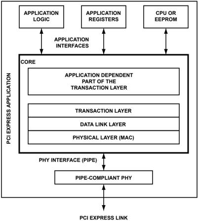

- PCI Express link power management
- PCI Express advanced error reporting
- PCI Express messages for both transmit and receive
- Filtering for posted, non-posted, and completion traffic
- Configurable BAR filtering, I/O filtering, configuration filtering, and completion lookup/timeout
- Access to configuration space registers and external application memory-mapped registers through local bus controller
- Legacy interrupts reception (RC) and generation (EP)
- MSI reception (RC) and generation (EP)
- Tx-to-Rx PIPE loopback
- IEEE 1149.6 (JTAG) boundary scan

## Functional Description

The following sections provide information on the function of the PCIe.

## ADSP-SC58x PCIE Register List

The following table lists the registers used by the PCIe interface.

Table 29-1: ADSP-SC58x PCIE Register List

| Name                    | Description                                                  |
|-------------------------|--------------------------------------------------------------|
| PCIE_ACK_ASPMCTL_[n]    | Acknowledge Frequency and L0-L1 ASPM Control Register        |
| PCIE_ACK_TMR_[n]        | Acknowledge Latency Timer and Replay Timer Register          |
| PCIE_ADVERR_CAPBCTL_[n] | Advanced Error Capabilities and Control Register             |
| PCIE_ADVERR_EXTCAPB_[n] | Advanced Error Reporting Extended Capability Header Register |
| PCIE_APP_CORERR_MSG     | Correctable Error Message Requester ID Register              |
| PCIE_APP_CTL            | Application Control Register                                 |
| PCIE_APP_DIAGCTL        | Diagnostic Control Register                                  |
| PCIE_APP_DIAGSTAT       | Diagnostic Status Register                                   |
| PCIE_APP_FERR_MSG       | Fatal Error Message Requester ID Register                    |
| PCIE_APP_INTSTAT        | Application Interrupts Status Register                       |
| PCIE_APP_NFERR_MSG      | Non Fatal Error Message Requester ID Register                |
| PCIE_APP_PMACK_MSG      | Power Management Acknowledge Message Requester ID Register   |
| PCIE_APP_PMEVT_MSG      | Power Management Event Message Requester ID Register         |

Table 29-1: ADSP-SC58x PCIE Register List (Continued)

| Name                        | Description                                                 |
|-----------------------------|-------------------------------------------------------------|
| PCIE_APP_PMTOFF_MSG         | Power Management Turn Off Message Requester ID Register     |
| PCIE_APP_STAT               | Application Status Register                                 |
| PCIE_APP_UNLK_MSG           | Unlock Message Requester ID Register                        |
| PCIE_APP_VNDR_MSG           | Vendor Message Requester ID Register                        |
| PCIE_APP_VNDR_MSG_HDR0      | Vendor Message Header Bytes 8 to 11 Register                |
| PCIE_APP_VNDR_MSG_HDR1      | Vendor Message Header Bytes 12 to 15 Register               |
| PCIE_AUX_CLKFREQ_[n]        | Auxiliary Clock Frequency Control Register                  |
| PCIE_BERR_RESP_[n]          | Peripheral and SCB Bridge Slave Error Response Register     |
| PCIE_BUSMGR_WDOG_[n]        | Bus Order Manager Watchdog Off Register                     |
| PCIE_BUS_MULOB_DECOMP_[n]   | Bus Multiple Outbound Decomposition SubReq Control Register |
| PCIE_CACHE_CTL1_[n]         | ACE Cache Coherency Control Register 1                      |
| PCIE_CACHE_CTL3_[n]         | ACE Cache Coherency Control Register 3                      |
| PCIE_CAPB_NPTR_[n]          | PCIe Capabilities, ID, Next Pointer Register                |
| PCIE_CORERR_MSK_[n]         | Correctable Error Mask Register                             |
| PCIE_CORERR_STAT_[n]        | Correctable Error Status Register                           |
| PCIE_DEV_CAPB2_[n]          | Device Capabilities 2 Register                              |
| PCIE_DEV_CTLSTAT2_[n]       | Device Control 2 and Status 2 Register                      |
| PCIE_DEV_CTLSTAT_[n]        | Device Control and Status Register                          |
| PCIE_DMARD_ARBWGT_LO_[n]    | DMARead Arbitration Weight Low Off Register                 |
| PCIE_DMARD_CH01_IMWR_[n]    | DMARead Channel 1 and 0 IMWr Data Register                  |
| PCIE_DMARD_CTL1_[n]         | DMAControl 1 Read Channel Register                          |
| PCIE_DMARD_DAR_HI_[n]       | DMADestination Address High Read Channel Register           |
| PCIE_DMARD_DAR_LO_[n]       | DMADestination Address Low Read Channel Register            |
| PCIE_DMARD_DONE_IMWR_HI_[n] | DMARead Done IMWr Address High Register                     |
| PCIE_DMARD_DONE_IMWR_LO_[n] | DMARead Done IMWr Address Low Register                      |
| PCIE_DMARD_DRBL_[n]         | DMARead Doorbell Register                                   |
| PCIE_DMARD_EN_[n]           | DMARead Engine Enable Register                              |
| PCIE_DMARD_ERRSTAT_HI_[n]   | DMARead Error Status High Register                          |
| PCIE_DMARD_ERRSTAT_LO_[n]   | DMARead Error Status Low Register                           |
| PCIE_DMARD_ICLR_[n]         | DMARead Interrupt Clear Register                            |
| PCIE_DMARD_IMSK_[n]         | DMARead Interrupt Mask Register                             |

Table 29-1: ADSP-SC58x PCIE Register List (Continued)

| Name                        | Description                                          |
|-----------------------------|------------------------------------------------------|
| PCIE_DMARD_IMWRABRT_HI_[n]  | DMARead Abort IMWr Address High Register             |
| PCIE_DMARD_IMWRABRT_LO_[n]  | DMARead Abort IMWr Address Low Register              |
| PCIE_DMARD_ISTAT_[n]        | DMARead Interrupt Status Register                    |
| PCIE_DMARD_LLP_HI_[n]       | DMALLP High Read Channel Register                    |
| PCIE_DMARD_LLP_LO_[n]       | DMALLP Low Read Channel Register                     |
| PCIE_DMARD_LLSTERR_EN_[n]   | DMARead Linked List Error Enable Register            |
| PCIE_DMARD_SAR_HI_[n]       | DMASAR High Read Channel Register                    |
| PCIE_DMARD_SAR_LO_[n]       | DMASAR Low Read Channel Register                     |
| PCIE_DMARD_XFRSZ_[n]        | DMATransfer Size Read Channel Register               |
| PCIE_DMAWR_ABRT_IMWR_HI[n]  | DMAWrite Abort IMWr Address High Register            |
| PCIE_DMAWR_ABRT_IMWR_LO[n]  | DMAWrite Abort IMWr Address Low Register             |
| PCIE_DMAWR_ARBWGT_LO_[n]    | DMAWrite Channel Arbitration Weight Low Off Register |
| PCIE_DMAWR_CH01_IMWR_[n]    | DMAWrite Channel 1 and 0 IMWr Data Register          |
| PCIE_DMAWR_CTL1_[n]         | DMAControl 1 Write Channel Register                  |
| PCIE_DMAWR_DAR_HI_[n]       | DMADar High Write Channel Register                   |
| PCIE_DMAWR_DAR_LO_[n]       | DMADARLow Write Channel Register                     |
| PCIE_DMAWR_DONE_IMWR_HI_[n] | DMAWrite Done IMWr Interrupt Address High Register   |
| PCIE_DMAWR_DONE_IMWR_LO_[n] | DMAWrite Done IMWr Address Low Register              |
| PCIE_DMAWR_DRBL_[n]         | DMAWrite Doorbell Register                           |
| PCIE_DMAWR_EN_[n]           | DMAWrite Engine Enable Register                      |
| PCIE_DMAWR_ERRSTAT_[n]      | DMAWrite Error Status Register                       |
| PCIE_DMAWR_ICLR_[n]         | DMAWrite Interrupt Clear Register                    |
| PCIE_DMAWR_IMSK_[n]         | DMAWrite Interrupt Mask Register                     |
| PCIE_DMAWR_ISTAT_[n]        | DMAWrite Interrupt Status Register                   |
| PCIE_DMAWR_LLP_HI_[n]       | DMALLP High Write Channel Register                   |
| PCIE_DMAWR_LLP_LO_[n]       | DMALLP Low Write Channel Register                    |
| PCIE_DMAWR_LLSTERR_EN_[n]   | DMAWrite Linked List Error Enable Register           |
| PCIE_DMAWR_PREQ_TMR_[n]     | DMAWrite Posted Request Deadlock Timer Register      |
| PCIE_DMAWR_SAR_HI_[n]       | DMASAR High Write Channel Register                   |
| PCIE_DMAWR_SAR_LO_[n]       | DMASAR Low Write Channel Register                    |
| PCIE_DMAWR_XFRSZ_0[n]       | DMATransfer Size Write Channel Register              |

Table 29-1: ADSP-SC58x PCIE Register List (Continued)

| Name                   | Description                                   |
|------------------------|-----------------------------------------------|
| PCIE_DMA_CTL_[n]       | DMANumber of Channels Register                |
| PCIE_DMA_VWPRT_SEL_[n] | DMAChannel Context Index Register             |
| PCIE_EP_BAR0_MASK[n]   | Endpoint Base Address Mask Register 0         |
| PCIE_EP_BAR0_[n]       | Endpoint Base Address Register 0              |
| PCIE_EP_BAR1_MASK[n]   | Endpoint Base Address Mask Register 1         |
| PCIE_EP_BAR1_[n]       | Endpoint Base Address Register 1              |
| PCIE_EP_BAR2_MASK[n]   | Endpoint Base Address Mask Register 2         |
| PCIE_EP_BAR2_[n]       | Endpoint Base Address Register 2              |
| PCIE_EP_BAR3_MASK[n]   | Endpoint Base Address Mask Register 3         |
| PCIE_EP_BAR3_[n]       | Endpoint Base Address Register 3              |
| PCIE_EP_BAR4_MASK[n]   | Endpoint Base Address Mask Register 4         |
| PCIE_EP_BAR4_[n]       | Endpoint Base Address Register 4              |
| PCIE_EP_BAR5_MASK[n]   | Endpoint Base Address Mask Register 5         |
| PCIE_EP_BAR5_[n]       | End Point Base Address Register 5             |
| PCIE_EP_CAPBPTR_[n]    | Capability Pointer Register                   |
| PCIE_EP_CCRID_[n]      | Class Code and Revision ID Register           |
| PCIE_EP_CFG_[n]        | End Point Configuration Register              |
| PCIE_EP_CRDBPTR_[n]    | CardBus CIS Pointer Register                  |
| PCIE_EP_DEVCAPB_[n]    | Device Capabilities Register                  |
| PCIE_EP_ID_[n]         | Device ID and Vendor ID Register              |
| PCIE_EP_PINLN_INT_[n]  | Interrupt Line and Pin Register               |
| PCIE_EP_ROMCFG_[n]     | End Point Expansion ROMBase Address Register  |
| PCIE_EP_SSVID_[n]      | Subsystem ID and Subsystem Vendor ID Register |
| PCIE_EP_STATCMD_[n]    | Command and Status Register                   |
| PCIE_ERRSRC_ID_[n]     | Error Source Identification Register          |
| PCIE_FILTMSK2_[n]      | Filter Mask 2 Register                        |
| PCIE_GEN2_CTL_[n]      | Link Width and Speed Change Control Register  |
| PCIE_HDRLOG0_[n]       | Header Log Register 0                         |
| PCIE_HDRLOG1_[n]       | Header Log Register 1                         |
| PCIE_HDRLOG2_[n]       | Header Log Register 2                         |
| PCIE_HDRLOG3_[n]       | Header Log Register 3                         |

Table 29-1: ADSP-SC58x PCIE Register List (Continued)

| Name                       | Description                                          |
|----------------------------|------------------------------------------------------|
| PCIE_IATU_CTL1_INB_[n]     | iATU Region Control 1 Inbound Register               |
| PCIE_IATU_CTL1_OUTB_[n]    | iATU Region Control 1 Outbound Register              |
| PCIE_IATU_CTL2_INB_[n]     | iATU Region Control 2 Inbound Register               |
| PCIE_IATU_CTL2_OUTB_[n]    | iATU Region Control 2 Register Outbound              |
| PCIE_IATU_CTL3_INB_[n]     | iATU Region Control 3 Register                       |
| PCIE_IATU_CTL3_OUTB_[n]    | iATU Region Control 3 Register                       |
| PCIE_IATU_LBADDR_INB_[n]   | IATU Lower Base Inbound Address Register             |
| PCIE_IATU_LBADDR_OUTB_[n]  | IATU Lower Base Outbound Address Register            |
| PCIE_IATU_LMTADDR_INB_[n]  | IATU Inbound Limit Address Register                  |
| PCIE_IATU_LMTADDR_OUTB_[n] | IATU Outbound Limit Address Register                 |
| PCIE_IATU_LTADDR_INB_[n]   | IATU Lower Target Address Inbound Register           |
| PCIE_IATU_LTADDR_OUTB_[n]  | IATU Lower Target Address Outbound Register          |
| PCIE_IATU_UBADDR_INB_[n]   | IATU Upper Base Address Inbound Register             |
| PCIE_IATU_UBADDR_OUTB_[n]  | IATU Upper Base Address Outbound Register            |
| PCIE_IATU_UTADDR_INB_[n]   | iATU Upper Target Address Inbound Register           |
| PCIE_IATU_UTADDR_OUTB_[n]  | iATU Upper Target Address Outbound Register          |
| PCIE_IATU_VWPRT_[n]        | IATU View Port Register                              |
| PCIE_LANE_SKEW_[n]         | Lane Skew Register                                   |
| PCIE_LNK_CAPB2_[n]         | Link Capabilities 2 Register                         |
| PCIE_LNK_CAPB_[n]          | Link Capabilities Register                           |
| PCIE_LNK_CTLSTAT2_[n]      | Link Control 2 and Status 2 Register                 |
| PCIE_LNK_CTLSTAT_[n]       | Link Control and Status Register                     |
| PCIE_MISC_CTL1_[n]         | DBI Read-Only Write Enable Register                  |
| PCIE_MSI_CAPB_NPTR_[n]     | MSI Capability ID, Next Pointer and Control Register |
| PCIE_MSI_CAPB_OFF4_[n]     | MSI Capability Offset Register                       |
| PCIE_MSI_CAPB_OFF8_[n]     | MSI Capability Offset Register                       |
| PCIE_MSI_CAPB_OFFC_[n]     | MSI Capability Offset Register                       |
| PCIE_MSI_CTL_LADDR_[n]     | MSI Controller Lower Address Register                |
| PCIE_MSI_CTL_UADDR_[n]     | MSI Controller Upper Address Register                |
| PCIE_MSI_GPIO_IO_[n]       | MSI Controller General-Purpose IO Register           |
| PCIE_MSI_IEN0_[n]          | MSI Controller Interrupt 0 Enable Register           |

Table 29-1: ADSP-SC58x PCIE Register List (Continued)

| Name                | Description                                |
|---------------------|--------------------------------------------|
| PCIE_MSI_IEN1_[n]   | MSI Controller Interrupt 1 Enable Register |
| PCIE_MSI_IEN2_[n]   | MSI Controller Interrupt 2 Enable Register |
| PCIE_MSI_IEN3_[n]   | MSI Controller Interrupt 3 Enable Register |
| PCIE_MSI_IEN4_[n]   | MSI Controller Interrupt 4 Enable Register |
| PCIE_MSI_IEN5_[n]   | MSI Controller Interrupt 5 Enable Register |
| PCIE_MSI_IEN6_[n]   | MSI Controller Interrupt 6 Enable Register |
| PCIE_MSI_IEN7_[n]   | MSI Controller Interrupt 7 Enable Register |
| PCIE_MSI_IMSK0_[n]  | MSI Controller Interrupt 0 Mask Register   |
| PCIE_MSI_IMSK1_[n]  | MSI Controller Interrupt 1 Mask Register   |
| PCIE_MSI_IMSK2_[n]  | MSI Controller Interrupt 2 Mask Register   |
| PCIE_MSI_IMSK3_[n]  | MSI Controller Interrupt 3 Mask Register   |
| PCIE_MSI_IMSK4_[n]  | MSI Controller Interrupt 4 Mask Register   |
| PCIE_MSI_IMSK5_[n]  | MSI Controller Interrupt 5 Mask Register   |
| PCIE_MSI_IMSK6_[n]  | MSI Controller Interrupt 6 Mask Register   |
| PCIE_MSI_IMSK7_[n]  | MSI Controller Interrupt 7 Mask Register   |
| PCIE_MSI_ISTAT0_[n] | MSI Controller Interrupt 0 Status Register |
| PCIE_MSI_ISTAT1_[n] | MSI Controller Interrupt 1 Status Register |
| PCIE_MSI_ISTAT2_[n] | MSI Controller Interrupt 2 Status Register |
| PCIE_MSI_ISTAT3_[n] | MSI Controller Interrupt 3 Status Register |
| PCIE_MSI_ISTAT4_[n] | MSI Controller Interrupt 4 Status Register |
| PCIE_MSI_ISTAT5_[n] | MSI Controller Interrupt 5 Status Register |
| PCIE_MSI_ISTAT6_[n] | MSI Controller Interrupt 6 Status Register |
| PCIE_MSI_ISTAT7_[n] | MSI Controller Interrupt 7 Status Register |
| PCIE_PHY_TXDEEMPH   | TX De-emphasis Parameters Register         |
| PCIE_PHY_TXSWING    | TX Launch Amplitude Register               |
| PCIE_PLCTL_[n]      | Port Logic Link Control Register           |
| PCIE_PLDBG0_[n]     | Port Logic Debug0 Register                 |
| PCIE_PLDBG1_[n]     | Port Logic Debug1 Register                 |
| PCIE_PL_FRC_[n]     | Port Force Link Register                   |
| PCIE_PL_PHYCTL_[n]  | Port Control PHY Control Register          |
| PCIE_PL_PHYSTAT_[n] | Port Control PHY Status Register           |

Table 29-1: ADSP-SC58x PCIE Register List (Continued)

| Name                     | Description                                            |
|--------------------------|--------------------------------------------------------|
| PCIE_PMT_CAPB_[n]        | Power Management Capabilities Register                 |
| PCIE_PMT_CTLSTAT_[n]     | Power Management Control and Status Register           |
| PCIE_QSTAT_[n]           | Queue Status Register                                  |
| PCIE_RC_BRDG_ILPCTL_[n]  | Interrupt Bridge Line and Pin Control Register         |
| PCIE_RC_CAPBPTR_[n]      | Capability Pointer Register.                           |
| PCIE_RC_CCRID_[n]        | Class Code and Revision ID Register                    |
| PCIE_RC_CFG_[n]          | Root Complex Configuration Register                    |
| PCIE_RC_CTLCAPB_[n]      | Root Control and Capabilities Register                 |
| PCIE_RC_DEVCAPB_[n]      | Device Capabilities Register                           |
| PCIE_RC_ERRCMD_[n]       | Root Complex Error Command Register                    |
| PCIE_RC_ERRSTAT_[n]      | Root Error Status Register                             |
| PCIE_RC_ID_[n]           | Device ID and Vendor ID Register                       |
| PCIE_RC_IOBL_[n]         | Root Complex I/O Base and Limit Upper 16 bits Register |
| PCIE_RC_MBL_[n]          | Memory Base and Memory Limit Register                  |
| PCIE_RC_PREFMBL_[n]      | Prefetchable Memory Base and Limit Register            |
| PCIE_RC_PREF_BUPP_[n]    | Prefetchable Base Upper 32 Bits Register               |
| PCIE_RC_PREF_LMT_UP_[n]  | Prefetchable Limit Upper 32 Bits Register              |
| PCIE_RC_ROMCFG_[n]       | Root Complex Expansion ROMBase Address Register        |
| PCIE_RC_SECSTAT_[n]      | Secondary Status and I/O Base and Limit Register       |
| PCIE_RC_STATCMD_[n]      | Command and Status Register                            |
| PCIE_RC_STAT_[n]         | Root Status Register                                   |
| PCIE_RC_TMRLAT_[n]       | Latency Timer Register                                 |
| PCIE_RSCK_CTL            | Reset and Clock Control Register                       |
| PCIE_RSCK_STAT           | Reset and Clock Status                                 |
| PCIE_SYM_TMRFILT1_[n]    | Symbol Timer Filter 1 Off                              |
| PCIE_TMRCTL_MFN_[n]      | Timer Control and Max Function Number Register         |
| PCIE_TXCOMP_FCCSTAT_[n]  | Transmit Completion FC Credit Status Register          |
| PCIE_TX_NPST_FCCSTAT_[n] | Transmit Non-Posted FC Credit Status Register          |
| PCIE_TX_PST_FCCSTAT_[n]  | Transmit Posted FC Credit Status Register              |
| PCIE_UNCOR_ERRMSK_[n]    | Uncorrectable Error Mask Register                      |
| PCIE_UNCOR_ERRSEV_[n]    | Uncorrectable Error Severity Register                  |

Table 29-1: ADSP-SC58x PCIE Register List (Continued)

| Name                     | Description                                                    |
|--------------------------|----------------------------------------------------------------|
| PCIE_UNCOR_ERRSTAT_[n]   | Uncorrectable Error Status Register                            |
| PCIE_VC0_COMP_RXQCTL_[n] | Segmented-Buffer VC0 Completion Receive Queue Control Register |
| PCIE_VC0_NPST_RXQCTL_[n] | Segmented-Buffer VC0 Non-Posted Receive Queue Control Register |
| PCIE_VC0_PST_RXQCTL_[n]  | Segmented-Buffer VC0 Posted Receive Queue Control Register     |
| PCIE_VC_TXARB1_[n]       | Virtual Channel Transmit Arbitration Register 1                |
| PCIE_VC_TXARB2_[n]       | Virtual Channel Transmit Arbitration Register 2                |
| PCIE_VEND_DLLP_[n]       | Vendor Specific DLLP Register                                  |

## ADSP-SC58x PCIE Interrupt List

Table 29-2: ADSP-SC58x PCIE Interrupt List

|   Interrupt ID | Name        | Description         | Sensitivity   | DMA Channel   |
|----------------|-------------|---------------------|---------------|---------------|
|            243 | PCIE0_RESET | PCIE0 Reset         |               |               |
|            244 | PCIE0_STAT  | PCIE0 Status        |               |               |
|            245 | PCIE0_DMA   | PCIE0 DMACompletion |               |               |

## ADSP-SC58x PCIE Trigger List

Table 29-3: ADSP-SC58x PCIE Trigger List Masters

|   Trigger ID | Name      | Description   | Sensitivity   |
|--------------|-----------|---------------|---------------|
|          135 | PCIE0_DMA | PCIE0 DMADone |               |

Table 29-4: ADSP-SC58x PCIE Trigger List Slaves

| Trigger ID   | Name   | Description   | Sensitivity   |
|--------------|--------|---------------|---------------|
| None         | None   | None          | None          |

## Definitions

The following definitions are helpful when using the PCIE module.

## BAR

Base Address register

## CPL

Completion

## DBI

Data Bus Interface

## DLLP

Data Link Layer Packet

## DSP

Downstream Port

EP

PCIe Endpoint

## iATU

Internal Address Translation Unit

## Inbound Traffic

Transactions that enter the PCIe port from the wire side and are sent out onto the master SCB interface.

## LOS

Loss of signal

## NP

Non Posted

## Outbound Traffic

Transactions that enter the PCIe port from the slave SCB interface and are sent out onto the PCIe wire

## PCIe Host

The processor running the PCIe software on the RC device

## PCIe software

Software that configures and controls the whole PCIe system.

## PIPE

Standard interface between the PCIe PHY and the core

## TLP

Transaction Layer Packet

## USP

Upstream Port

## VC

Virtual Channel

## VMI

Vendor Message Interface

## Top-level Block Diagram and Description

The ADI implementation of the PCIe interface is shown in the PCIe Interface Block Diagram below, and comprises the modules described in the following section.

Figure 29-2: PCIe Interface Block Diagram

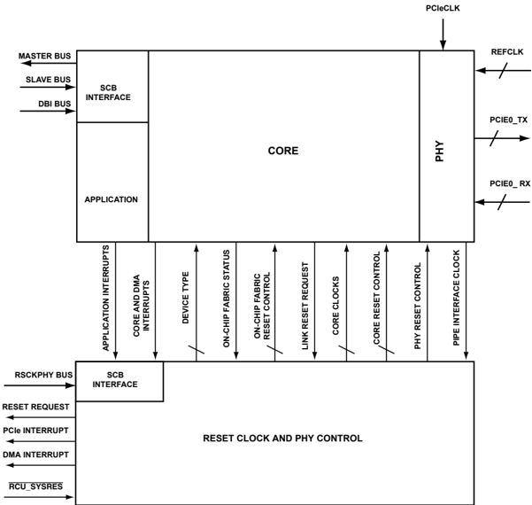

## Module-level Block Diagrams and Descriptions

The following modules are integrated in the PCIe port:

- Reset clock control and PHY control (RSCKPHY). Controls the PCIe port's clocking and reset functions. It can be accessed by on-chip fabric masters regardless of the dual-mode core and PHY status.
- Application (APP). ADSP-SC58x specific application registers and logic.
- The PCIe core and PCIe PHY. Form the heart of the PCIe interface and implement the PCIe protocol stack, and the physical pins, connected to each other through the PIPE interface.

Registers and memory space are accessed over the following system cross bar (SCB) ports:

- DBI SCB slave interface. PCI, PCIe, port logic and application registers.
- Slave SCB interface. PCIe memory space across the PCIe link.
- Master SCB port. On-chip address space accessed from a PCIe partner over the PCIe link.
- RSCKPHY SCB port. RSCKPHY and PCIe PHY registers.

## Reset Clock and PHY Control Module (RSCKPHY)

The RSCKPHY block includes the clock and reset circuitry and PCIe PHYs control and status registers. It also drives the bus to configure the PCIe core to either a Root Complex (RC) or an End Point (EP) port. The whole PCIe port is reset by the RCU\_SYSRES signal and enabled by software.

While booting through the PCIe port is not one of the default ADSP-SC58x boot modes, applications can choose to implement a second stage boot loader kernel that configures and enables the PCIe port to load a custom application into the ADSP-SC58x memory.

The RSCKPHY block generates all clocks and reset signals for the PCIe core and PCIe PHY.

## RSCKPHY System Cross Bar (SCB) Port

On-chip masters can access the RSCKPHY MMRs through a dedicated SCB port in the SYSCLK clock domain.

## PCIe Reset

All on-chip modules are reset if a system reset ( RCU\_SYSRES asserted) event occurs. The PCIe APP , Core, PHY and Core's SCB Interface are taken out of reset only by software. After a Hardware or System Reset only the RSCKPHY block is out of reset. The PCIE\_RSCK\_CTL.PCIERES bit controls the assertion and deassertion of the PCIe cold reset signal. When the PCIE\_RSCK\_CTL.PCIERES bit is cleared, the core, application, PHY and the core's SCB interface are brought out of reset and their clocks are enabled. To satisfy the PHYs Power-On-Reset timing, RSCKPHY delays the deassertion of its cold reset output by at least 25000 SYSCLK cycles.

The PCIe core and PCIe PHY mode of operation (Root Complex or End Point) is determined by the value of the PCIE\_RSCK\_CTL.DEVTYP bit field at the time the PCIE\_RSCK\_CTL.PCIERES bit is cleared (both fields can be written at the same time). Writing values other than 0x0 or 0x4 to the PCIE\_RSCK\_CTL.DEVTYP bit field is not allowed.

To reset the PCIe port (warm or hot reset), the PCIe core asserts its Link Reset Request signal to make RSCKPHY assert Reset Request signal. This signal is used as an interrupt. Writing 1 to the PCIE\_RSCK\_CTL.DBISLVDIS bit enables the PCIe port reset. The application software may also decide to assert the Power Reset signals by setting the PCIE\_RSCK\_CTL.PCIERES bit.

## Clocking

The PHY uses external reference clock (REFCLK\_P and REFCLK\_N). These are the external reference 100 MHz differential clocks. If the PHYs input clock has been stable and running for more than 10 µsec, the additional delay can be disabled by clearing the PCIE\_RSCK\_CTL.RESDELEN bit. Software can request to remove the reference clock by setting the PCIE\_RSCK\_CTL.RFCKRMREQ bit. The PCIE\_RSCK\_STAT.RFCKRMEN bit shows when the reference clock can be removed.

PCLK is generated by the PHY TX PLL from the reference clock. Its frequency changes when the PCIe port transitions from one frequency to another. CORE\_CLK is the primary clock for the core. It is identical to PCLK.

The SCB interface synchronizes between the SCB buses in the SYSCLK domain and the core in the CORE\_CLK domain. From the PCIe perspective there are no restrictions on SYSCLK other than changing frequencies when the interface is idle.

AUX\_CLK is the clock source for parts of the Power Management Controller module. It is implemented as a low frequency (f SYSCLK /16) clock derived from SYSCLK.

## Power Management

An EP needs to send a Power Management Event (PM\_PME) message to the RC to wake up from a power down state. For the message to be sent, the Power Management Controller (PMC) in the PCIe core module needs to wake up and the PCIe link brought to its L0 state. This process is triggered by the application software writing 1 to the PCIE\_RSCK\_CTL.PMPMEREQ bit.

It is the application software responsibility not to write 1 to the PCIE\_RSCK\_CTL.PMPMEREQ bit until the previous message has been transmitted.

## Reset

The Reset Summary table provides descriptions of the PCIe reset states.

Table 29-5: Reset Summary

| Reset State   | Triggered By              | Description                                                                                                                                                                                                                                                                  |
|---------------|---------------------------|------------------------------------------------------------------------------------------------------------------------------------------------------------------------------------------------------------------------------------------------------------------------------|
| System Reset  | Reset Control Unit        | This is a full-chip reset state. It is triggered by Hard or System Reset events (See the RCU chapter of the HRM). Resets the Reset Clock and PHY Control, Application, Core, Core's SCB Interface and PHY.                                                                   |
| Cold Reset    | PCIE_RSCK_CTL.PCIERES bit | This state is entered if PCIE_RSCK_CTL.PCIERES is set. All the PCIe modules except RSCKPHY are reset. Resets the Application, Core, Core's SCB Interface and PHY. To exit Cold Reset software must clear PCIE_RSCK_CTL.PCIERES                                               |
| Warm Reset    | Core                      | This state is entered if the PCIe core requests a link reset. All the PCIe modules except RSCKPHY and sticky bits and registers are reset. Resets the Application, Core, Core's SCB Interface and PHY except sticky bits.                                                    |
| Hot Reset     | PCIe Link                 | This state is entered if a downstream port needs to reset an upstream port asserting a downstream reset request. All the PCIe modules except RSCKPHY and sticky bits and registers are reset. Resets the Application, Core, Core's SCB Interface and PHY except sticky bits. |

## Responding to a Warm or Hot Reset

During normal operation when the link has to be reset, the PCIe core asserts the link reset request output. The PCIe core and PHY is not reset until that PHY has had a chance to transmit the EIOS.

When the link reset request signal is asserted, the SCB bridge operates as follows:

System cross bar bridge slave interface (including DBI slave interface):

- Keeps accepting any new read/write requests but does not forward them to the PCIe link or application registers.
- For write requests:
- Allows the application SCB master to complete all write data bursts and dumps data internally in the bridge.
- On the completion of write data burst, generates a write response with slave error status.
- Generates a slave error response for all SCB beats of read requests. For more details, see PCI Express Controller DM Port Core Databook 'Generating a Warm Reset (Link Down

Reset)' and 'Generating and Processing Hot Resets (Training Resets)'.

System cross bar bridge master interface:

- Stops generating any new read and write requests.
- Waits for (and dumps) the completion of all responses from the application for every outstanding command.

The reset request signal is asserted in response to link reset requests assertion. It is the responsibility of the application software to stop all accesses to the slave SCB and DBI SCB ports. Once all accesses are stopped, software must write 1 to the PCIE\_RSCK\_CTL.DBISLVDIS bit to reset the PCIe core. The application software should implement the process shown in the Hot Reset Process figure.

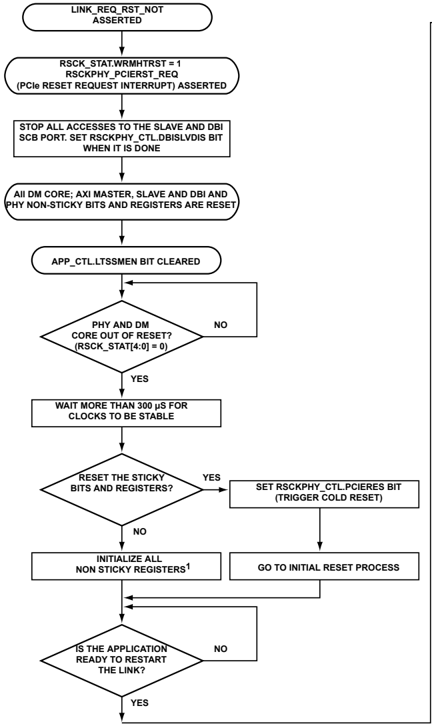

## NOTES:

1. Internal Address Translation and Embedded DMA registers have to be reprogrammed, and the custom configuration space setting must be re-written. 2. If configured as an EP, the application logic must wait for the PCIE\_EP\_STATCMD\_n.BME bit to be set in order to access the PCIe address space. If configured as a RC, the application logic must wait for the PCIE\_RC\_STATCMD\_[n].MSE and the PCIE\_RC\_STATCMD\_[n].IOE bits to be set in order to generate any MEM or I/O requests.

Figure 29-3: Hot Reset Process

The RSCKPHY block resets the PCIe core and PCIe\_PHY modules.

Hot reset is similar to a warm reset. The upstream port requests the RSCKPHY to reset the core in response to a reset request sent by the downstream port. If the PCIe core is configured as a root complex port, the application may request the core to reset upstream devices by writing 1 (across the DBI port) to the PCIE\_APP\_CTL.INITDSRST bit. Writing one to this bit makes the APP module assert its APP\_INIT\_RST to

the PCIe core.

In this case, the process involves the RC and EP devices on both sides of the PCIe link. Writing to the PCIE\_APP\_CTL.INITDSRST bit occurs in the RC device. The reset request is transmitted over the PCIe link to the EP device. Then the EP core starts the hot reset sequence.

The application can send new requests to the core only after verifying that the link is up again.

CLEAR RSCK\_STAT.WRMHTRST BIT

SET APP\_CTL.LTSSMEN BIT

(START LINK TRAINING)

LINK UP?

(APP\_STAT.LINKUP = 1)

YES

LINK READY 2

NO

## Application Module (APP)

The APP module implements the application-specific control and status logic and registers. Registers are mapped to the PCIe core configuration space. The SCB master accesses these registers across the DBI bus. When the port is configured as an End Point (EP), the remote PCIe device can also access registers across the PCIe link.

This module enables the application software running on the local core to handle PCIe interrupts and messages, and to access general link information. This entire module resides in the PCIe core and is reset when the PCIe core is reset.

## APP Registers Access

Application registers are mapped to the upper DBI address or configuration space. Local cores can access these registers regardless of the PCIe core configuration. In EP mode, these registers can also be accessed from the PCIe wire using CFG requests or with BAR matched MEM requests.

The following limitations apply to SCB accesses:

- SCB transfers to the APP address space must be 32-bits wide. Errors are not reported when the size is not equal to 32 bits
- Byte access within a 32-bit double word is not supported
- Zero-byte writes should not be issued

Accessing the ADI-specific PCIe registers enables software to control PCIe features such as Message Signaled Interrupts (MSI) and power management messages, and to debug the PCIe core.

## Interrupts When Configured as a PCIe End Point (EP)

The APP enables the application software to signal an interrupt to the RC over the PCIe serial link. Interrupts are asserted in one of two ways, as message signaled interrupts or as an INTA assert message. Accessing APP registers is enabled as long as the core is out of reset, regardless of the PCIe core configuration. The application software should not trigger an interrupt when the PCIe core is configured as RC.

The PCIE\_APP\_STAT.MSIEN PCIE\_APP\_STAT.MSIEN bit reflects the state of the MSI enable bit in the MSI control register. If PCIE\_APP\_STAT.MSIEN is set, the interrupt request is converted into an MSI message. The PCIE\_APP\_STAT.OUTSTMSI bit reflects the status of the previous Interrupt request when the PCIE\_APP\_STAT.MSIEN bit is set.

The PCIE\_APP\_STAT.OUTSTMSI bit signals that an MSI interrupt has been requested but the PCIe core has not accepted it.

The PCIe core grants the MSI request by asserting MSI\_GRANT. The PCIE\_APP\_STAT.OUTSTMSI bit and PCIE\_APP\_STAT.MSIGRANT bits are cleared and set, respectively.

If PCIE\_APP\_STAT.MSIEN is cleared, the interrupt request is converted into a PCI legacy INTA assert message. The PCIE\_APP\_STAT.OUTSTINTA bit reflects the status of the previous interrupt request when PCIE\_APP\_STAT.MSIEN is cleared.

The PCIE\_APP\_STAT.OUTSTINTA bit signals that an INTA interrupt has been requested. The PCIE\_APP\_STAT.OUTSTINTA bit does not indicate that the RC device is processing the interrupt.

## Interrupts when Configured as an RC

An MSI can be received in two ways. If the SCB MSI controller is enabled, MSIs do not reach the master SCB port and generate a PCIe interrupt instead. MSI status and control registers are part of the port logic registers. If the SCB MSI controller is disabled, MSIs reach the master SCB port as a write transaction to a predetermined address.

When configured as an RC, the PCIe core accepts Assert\_INTx and Deassert\_INTx messages from the downstream component and signal the APP module to trigger a PCIe interrupt. Incoming interrupts are registered in the PCIE\_APP\_INTSTAT (legacy interrupts status) register. The RC can also write directly to the APP registers to trigger an interrupt deassert message on the EP device.

## Inbound Messages

Inbound messages are dropped and not forwarded to the master SCB interface. Instead, these messages are registered and a PCIe interrupt triggered to report the reception of a message. Message interrupts can be individually enabled by setting the appropriate interrupt enable bit in the PCIE\_APP\_CTL register. Each type of message has a corresponding bit in the PCIE\_APP\_INTSTAT register. These bits are set to signal the reception of a message and must be cleared to receive a new message of the same type.

Table 29-6: Inbound Messages Support

| Message Type                     | Interrupt Enable PCIE_APP_CTL Register   | Interrupt Status PCIE_APP_ INTSTAT Register   | Header 4th Double Word   | Header 3rd Double Word   | Requester ID (BDF)   |
|----------------------------------|------------------------------------------|-----------------------------------------------|--------------------------|--------------------------|----------------------|
| Vendor                           | VENIEN                                   | VENDMSG                                       | APP_VNDR_MSG_ HDR0       | APP_VNDR_MSG_ HDR1       | APP_VNDR _MSG        |
| Unlock                           | UNLKIEN                                  | UNLK                                          | Not Applicable           | Not Applicable           | APP_UNLK _MSG        |
| Correctable Er- ror              | CORERRIEN                                | CORERR                                        | Not Applicable           | Not Applicable           | APP_CORERR _MSG      |
| Non Fatal Error                  | NFTLERRIEN                               | NFTLERR                                       | Not Applicable           | Not Applicable           | APP_NFERR_MSG        |
| Fatal Error                      | FERRIEN                                  | FTLERR                                        | Not Applicable           | Not Applicable           | APP_FERR _MSG        |
| Power Manage- ment Event         | PMEIEN                                   | PME                                           | Not Applicable           | Not Applicable           | APP_ PMEVT_MSG       |
| Power Manage- ment Acknowl- edge | PMTOACKIEN                               | PMTOACK                                       | Not Applicable           | Not Applicable           | APP_ PMACK_MSG       |
| Power Manage- ment Turn Off      | PMTOFFIEN                                | PMTOFF                                        | Not Applicable           | Not Applicable           | APP_PMTOFF _MSG      |

## Outbound Messages

In addition to MSI and PCI legacy interrupts, the transmission of power management turn-off or unlock messages is triggered by writing 1 to the corresponding PCIE\_APP\_CTL.PMOFFREQ or PCIE\_APP\_CTL.UNLKREQ bits. Power management enable messages are triggered by writing 1 to the PCIE\_RSCK\_CTL.PMPMEREQ bit. These two messages can be triggered when the PCIe core is configured as an RC. It is the responsibility of the application software to not start a new message until the previous message has been transmitted. The core does not return an acknowledgment or grant signal.

## Diagnostics

APP also includes a diagnostic feature that enables the application software to inject LCRC and ECRC errors into the datapath of the core.

To inject an LCRC error, the application software must write a 1 to the PCIE\_APP\_DIAGCTL.LCRCGEN bit and initiate a packet transmission. To inject an ECRC error, the application software must write a 1 to the PCIE\_APP\_DIAGCTL.ECRCERR bit and initiate a packet transmission. The PCIE\_APP\_DIAGSTAT.LCRC bit is set when LCRC error packets are transmitted. The PCIE\_APP\_DIAGSTAT.ECRC bit is set when ECRC error packets are transmitted.

This handshake between control and status allows the application to control a specific packet injection with a CRC or ECRC error. Inverting the last bit of an LCRC or ECRC value generates the LCRC and ECRC errors.

## Architectural Concepts

The following sections describe PCIe architectural features supporting register and address space accesses, configuration, and PHY control.

## Register Accesses (PCIe Link and SCB DBI Port)

The PCIe registers are used to configure and control the PCIe port. The registers are accessed:

- across the DBI SCB interface or over the PCIe link using memory read or write requests, or
- using CFG requests when the DM core is configured as an EP

Accesses over the DBI SCB port must be 32 bits wide with addresses aligned to the data width (address [1:0] = 00).

These registers are divided into two groups. The first group of registers is implemented inside the PCIe core. It includes the PCI configuration header, PCI standard capability structures, PCIe extended capability structures and port logic. The second group of registers is implemented inside the APP module. It includes the application-specific registers.

PCIe link configuration transfers access the PCIe core registers when the registers address is less than 0xC00. It transfers using APP registers when the address is greater than or equal to 0xC00. The PCI configuration header, PCI standard capability structures, PCIe are PCIe core configuration registers specified by the PCI Express specification revision 3.0. The PCI Express 3.0 specification does not specify the port logic registers. These registers are accessed

as memory-mapped registers or normally using CFG requests. A PCIe master can also access the PCIe registers using memory accesses to the local DBI SCB address space.

On-chip SCB masters have no concept of MEM, I/O, or CFG transfers. The PCIe core registers are mapped to the lower 4 KB addresses of the PCIe DBI region (DBI address [13:12] = 00). To enable writes to some read-only and shadow registers, PCIe registers are also mapped onto the 4 KB region (DBI write address [13:12] = 01). APP registers are mapped to the higher 4 KB addresses of the PCIe DBI region (address [13:12] = 1x).

## SOC Address Space Accesses

The SCB master interface enables a remote PCIe device to read and write to a slave connected to the on-chip fabric. The PCIe Address Space table provides details on the address space for the processor.

Table 29-7: PCIe Address Space

| Name         | Base Address   | End Address   |
|--------------|----------------|---------------|
| PCIE-DBI *1  | 0x310B_8000    | 0x310B_AFFF   |
| PCIE-RSCKPHY | 0x310B_B000    | 0x310B_BFFF   |

PCIe core registers 0x310B\_8000 to 0x310B\_8FFF

PCIe core write enabled registers 0x310B\_9000 to 0x310B\_9FFF

APP registers 0x310B\_A000 to 0x310B\_AFFF

## System Cross Bar (SCB) Master Features

- Address bus width is 32-bit
- Data bus width is 32-bit
- Only incremental bursts are supported
- Maximum allowable burst length is 16 Beats
- Graceful flush and reset when link is down
- No exclusive access support
- Only posted writes are expected, therefore the master SCB port ignores the write response from the SCB slave.
- PCIe Advanced Error Reporting (AER) is not supported. AER is only supported with respect to the native PCIe core. Errors detected by the bridge are not reported as part of AER.
- Read requests above the 256 bytes limit are not supported

## PCIe Address Space Accesses

The System Cross Bar slave interface enables a master on the on-chip fabric to read and write through the System Cross Bar bridge to a remote PCIe device. (In the ADSP-SC58x processor, the PCIe address space size is 256 MB

mapped to addresses 0x5000\_0000 to 0x5FFF\_FFFF). The Internal Address Translation Unit (iATU) enables the mapping of these 256 MB to anywhere in the PCIe memory space.

Table 29-8: ADSP-SC58x System Component Memory Address Map

|                                    |                                    | ARM             | View System          | View                 | SHARC View          | SHARC View          | SHARC View       | SHARC View       |
|------------------------------------|------------------------------------|-----------------|----------------------|----------------------|---------------------|---------------------|------------------|------------------|
| ADSP-SC58x System Component Memory | ADSP-SC58x System Component Memory | All Accesses    |                      | All Accesses         | Data Accesses       | Data Accesses       | Code Execution   | Code Execution   |
| Address Map                        | Address Map                        | Byte            |                      | Byte                 | Byte                | NW                  | VISA             | Non-VISA         |
| Memory                             | Sub-division                       | Group range --> | 0000_0000- FFFF_FFFF | 2000_0000- FFFF_FFFF | 2000_0000- FFF_FFFF | 100_0000- 1FFF_FFFF | 80_0000- FF_FFFF | 40_0000- 7F_FFFF |
| PCIe Data                          | 256MB                              | 5000_0000       | 5007_FFFF            | 5000_0000            | 5007_FFFF           | 5000_0000           | 5007_FFFF        | 200_0000         |
|                                    |                                    | 5008_0000       | 5017_FFFF            | 5008_0000            | 5017_FFFF           | 5008_0000           | 5017_FFFF        | 202_0000         |
|                                    |                                    | 5018_0000       | 57FF_FFFF            | 5018_0000            | 57FF_FFFF           | 5018_0000           | 57FF_FFFF        | 206_0000         |
|                                    |                                    | 5800_0000       | 5FFF_FFFF            | 5800_0000            | 5FFF_FFFF           | 5800_0000           | 5FFF_FFFF        | N/A              |

## SCB Slave Port Features

- Address bus width is 32-bit
- Data bus width is 32-bit
- Only incremental bursts are supported
- Maximum allowable burst length is 16 Beats
- Graceful flush and reset when link is down
- No exclusive access support
- No write interleaving with reads
- No write interleaving with writes of different AWIDs
- Outbound write burst with zero or partial (but contiguous) write strobes set is only supported for the first and last beats of a burst.
- All accesses are memory accesses (always posted)
- Write responses are generated by the PCIe core after the write request and are received
- PCIe Advanced Error Reporting (AER) is not supported. AER is only supported with respect to the native PCIe core. Errors detected by the bridge are not reported as part of AER.
- Read requests above the 256 Bytes limit are not supported

## Message Signaled Interrupts (MSI) Controller

The SCB Interface block provides an optional programmable MSI controller to detect and terminate inbound MSI requests. Rather than propagating MSI MWr TLPs onto the SCB bus through the master interface; the MSI packets are captured and terminated in the SCB Interface block and an interrupt is signaled locally.

The MSI Controller is programmed with an address that is used as the system MSI address. When an inbound (received) MWr request is passed to the SCB interface and matches the specified MSI address, as well as the conditions specified for an MSI memory write request, then an MSI interrupt is detected. This memory write request is not driven onto the SCB master interface. The MSI Controller decodes the MSI MWr data payload to determine which endpoint device (EP) sent the MSI and which interrupt vector the MSI corresponds to. When a valid interrupt has been decoded, the PCIE\_APP\_INTSTAT.MSI bit is set. This bit remains set when any MSI interrupt is pending. It is only de-asserted when there is no MSI interrupt pending. The controller has a full set of MSI registers.

## Features

- MSI interrupt controller only enabled in RC mode when the PCIE\_RSCK\_CTL.DEVTYP bit field =0x4. It is inactive in EP mode.
- The MSI interrupt controller provides support for up to eight EPs. Each supported EP has a set of interrupt enable, mask, and status registers.
- Guarantees correct SCB ordering with respect to other inbound posted writes by generating the MSI interrupt only after an SCB slave acknowledges responses of previous posted TLPs.
- A maximum of 32 interrupts are supported per EP .

## MSI Request Detection Criteria

An MSI interrupt request is detected when the core receives a MWr TLP that satisfies the following conditions:

- Header attributes bits are zero. No snoop (NS) and relaxed ordering (RO) must be zero.
- Length field is 0x01 to indicate a payload of one double word.
- First byte enable (FBE) must be such that it is enabling the first two bytes (16 bits) of the payload.
- Last byte enable (LBE) is 4b0000.
- TLP address corresponds to systems chosen MSI address as programmed in the MSI Controller Address register ( PCIE\_MSI\_CTL\_LADDR\_[n] and PCIE\_MSI\_CTL\_UADDR\_[n] ). This register is not the MSI Lower 32 Bits Address Register which is part of the PCI Express MSI capability register structure In addition to these criteria the MWr must also pass the receive filtering rules.

The following table shows the MSI Controller software register map. The tables show the address's offset. The MSI Controller registers base address is 0x310B8700.

Table 29-9: MSI Controller Software Registers

| Byte Offset   | Name                    | Description                                 | Reset      | Access   |
|---------------|-------------------------|---------------------------------------------|------------|----------|
| +0x120        | PCIE_MSI_CTL_LADDR _[n] | MSI Controller Address Register.            | 0x00000000 | R/W      |
|               | PCIE_MSI_CTL_UADDR _[n] | MSI Controller Upper Address Register.      | 0x00000000 | R/W      |
|               | PCIE_MSI_IEN0_[n]       | MSI Controller Interrupt#0 Enable Register. | 0x00000000 | R/W      |
|               | PCIE_MSI_IMSK0_[n]      | MSI Controller Interrupt#0 Mask Register.   | 0x00000000 | R/W      |
|               | PCIE_MSI_ISTAT0_[n ]    | MSI Controller Interrupt#0 Status Register. | 0x00000000 | R/W      |
|               | PCIE_MSI_IEN1_[n]       | MSI Controller Interrupt#1 Enable Register. | 0x00000000 | R/W      |
|               | PCIE_MSI_IMSK1_[n]      | MSI Controller Interrupt#1 Mask Register.   | 0x00000000 | R/W      |
|               | PCIE_MSI_ISTAT1_[n ]    | MSI Controller Interrupt#1 Status Register. | 0x00000000 | R/W      |
|               | PCIE_MSI_IEN2_[n]       | MSI Controller Interrupt#2 Enable Register. | 0x00000000 | R/W      |
|               | PCIE_MSI_IMSK2_[n]      | MSI Controller Interrupt#2 Mask Register.   | 0x00000000 | R/W      |
|               | PCIE_MSI_ISTAT2_[n ]    | MSI Controller Interrupt#2 Status Register. | 0x00000000 | R/W      |
|               | PCIE_MSI_IEN3_[n]       | MSI Controller Interrupt#3 Enable Register. | 0x00000000 | R/W      |
|               | PCIE_MSI_IMSK3_[n]      | MSI Controller Interrupt#3 Mask Register.   | 0x00000000 | R/W      |
|               | PCIE_MSI_ISTAT3_[n ]    | MSI Controller Interrupt#3 Status Register. | 0x00000000 | R/W      |
|               | PCIE_MSI_IEN4_[n]       | MSI Controller Interrupt#4 Enable Register. | 0x00000000 | R/W      |
|               | PCIE_MSI_IMSK4_[n]      | MSI Controller Interrupt#4 Mask Register.   | 0x00000000 | R/W      |
|               | PCIE_MSI_ISTAT4_[n ]    | MSI Controller Interrupt#4 Status Register. | 0x00000000 | R/W      |
|               | PCIE_MSI_IEN5_[n]       | MSI Controller Interrupt#5 Enable Register. | 0x00000000 | R/W      |
|               | PCIE_MSI_IMSK5_[n]      | MSI Controller Interrupt#5 Mask Register.   | 0x00000000 | R/W      |
|               | PCIE_MSI_ISTAT5_[n ]    | MSI Controller Interrupt#5 Status Register. | 0x00000000 | R/W      |
|               | PCIE_MSI_IEN6_[n]       | MSI Controller Interrupt#6 Enable Register. | 0x00000000 | R/W      |
|               | PCIE_MSI_IMSK6_[n]      | MSI Controller Interrupt#6 Mask Register.   | 0x00000000 | R/W      |
|               | PCIE_MSI_ISTAT6_[n ]    | MSI Controller Interrupt#6 Status Register. | 0x00000000 | R/W      |
|               | PCIE_MSI_IEN7_[n]       | MSI Controller Interrupt#7 Enable Register. | 0x00000000 | R/W      |
|               | PCIE_MSI_IMSK7_[n]      | MSI Controller Interrupt#7 Mask Register.   | 0x00000000 | R/W      |

Table 29-9: MSI Controller Software Registers (Continued)

| Byte Offset   | Name                  | Description                                 | Reset      | Access   |
|---------------|-----------------------|---------------------------------------------|------------|----------|
|               | PCIE_MSI_ISTAT7_[n ]  | MSI Controller Interrupt#7 Status Register. | 0x00000000 | R/W      |
|               | PCIE_MSI_GPIO_IO_[ n] | MSI Controller General Purpose IO Register. | 0x00000000 | R/W      |

## Internal Address Translation (iATU)

The Address Translation Unit is used for mapping internal/external memory regions to external/internal memory regions. If an outbound transaction falls into one of the enabled iATU regions, TLP headers are created replacing the default values by the corresponding fields in the regions iATU registers. Without address translation, application addresses are passed straight through to the SCB master/slave interfaces.

## Inbound Address Translation Features

- Match mode operation for MEM, I/O, CFG, and MSG TLPs. No translation for completions.
- Selectable BAR Match mode operation for I/O and MEM TLPs.
- · TLPs destined for PCIe or APP registers in an upstream port are not translated.
- TLPs that are not error-free (ECRC, malformed and so on) are not translated.
- Programmable TLP header field matching.
- Up to 5 address regions programmable for location and size.
- Programmable enable/disable per region.
- Automatic FMT field translation between three DWORDS and four DWORDS for 64-bit addresses.
- Invert Address Matching mode to translate accesses outside of a successful address match.
- ECAM Configuration Shift mode to allow a 256 MB CFG1 space to be located anywhere in the 64-bit address space.
- The minimum region size is 64 kB.

## Outbound Address Translation Features

- Address Match mode operation for MEM and I/O, CFG, and MSG TLPs. No translation for completions.
- Supports type translation through TLP type header field replacement for MEM or I/O types to MSG/CFG types.
- Includes posted to non-posted translation (for example, MWr to CfgWr0)
- No translation from completions
- Programmable TLP header field replacement.

- Up to 4 address regions programmable for location and size.
- Programmable enable/disable per region.
- Automatic FMT field translation between three DWORDS and four DWORDS for 64-bit addresses.
- Invert Address Matching mode to translate accesses outside of a successful address match.
- Response code which defines the completion status to return for accesses matching a region.
- The minimum region size is 64 kB.
- DMA bypass mode to allow TLPs which are initiated by the embedded DMA engine, to pass through the iATU un-translated.

## Configuration and Programming

The iATU Configuration table provides the basic values for configuring the iATU.

Table 29-10: iATU Configuration Summary

| Parameter                                              | Value     | Notes                                                                                                                                                                      |
|--------------------------------------------------------|-----------|----------------------------------------------------------------------------------------------------------------------------------------------------------------------------|
| Maximum Number of Outbound Address Translation Regions | 4         | Enables the SCB to PCIe address mapping. The PCIe space is defined as 256 Mbytes.                                                                                          |
| Maximum Number of Inbound Address Translation Regions  | 5         | Enables PCIe to SCB address mapping. Assuming one region dedicated to System L2, one to L1s in multiprocessing space, one to MMRs, one to ASYNC memory and one DDR memory. |
| Minimum size of an Address Trans- lation Region        | 64 Kbytes |                                                                                                                                                                            |

The following table shows the iATU software register map. The table shows the address's offset. The iATU registers Base Address is 0x310B8700.

Table 29-11: iATU Software Registers

| Byte Offset   | Name                      | Description                             | Reset      | Access   |
|---------------|---------------------------|-----------------------------------------|------------|----------|
| 0x310B8900    | PCIE_IATU_VWPRT_[n]       | IATU ViewPort                           | 0x00000000 | R/W      |
| 0x310B8904    | PCIE_IATU_CTL1_INB_[n]    | iATU Region Control 1 Register Inbound  | 0x0XXX0XXX | R/W      |
| 0x310B8904    | PCIE_IATU_CTL1_OUTB_[n]   | iATU Region Control 1 Register Outbound | 0x0XXX0XXX | R/W      |
| 0x310B8908    | PCIE_IATU_CTL2_OUTB_[n]   | iATU Region Control 2 Register Outbound | 0x00000000 | R/W      |
| 0x310B8908    | PCIE_IATU_CTL2_INB_[n]    | iATU Region Control 2 Register Inbound  | 0x00000000 | R/W      |
| 0x310B890C    | PCIE_IATU_LBADDR_OUTB_[n] | iATU Lower Base Address Outbound        | 0x00000000 | R/W      |
| 0x310B890C    | PCIE_IATU_LBADDR_INB_[n]  | iATU Lower Base address Inbound         | 0x00000000 | R/W      |
| 0x310B8910    | PCIE_IATU_UBADDR_OUTB_[n] | iATU Upper Base Address Outbound        | 0x00000000 | R/W      |
| 0x310B8910    | PCIE_IATU_UBADDR_INB_[n]  | iATU Upper Base address Inbound         | 0x00000000 | R/W      |

Table 29-11: iATU Software Registers (Continued)

| Byte Offset   | Name                       | Description                         | Reset      | Access   |
|---------------|----------------------------|-------------------------------------|------------|----------|
| 0x310B8914    | PCIE_IATU_LMTADDR_OUTB_[n] | iATU Outbound Limit Address         | 0xFFFFFFFF | R        |
| 0x310B8914    | PCIE_IATU_LMTADDR_INB_[n]  | iATU Inbound Limit address          | 0xFFFFFFFF | R        |
| 0x310B8918    | PCIE_IATU_LTADDR_INB_[n]   | iATU Lower Target Address Inbound   | 0x00000000 | R/W      |
| 0x310B8918    | PCIE_IATU_LTADDR_OUTB_[n]  | iATU Lower Target Address Outbound  | 0x00000000 | R/W      |
| 0x310B891C    | PCIE_IATU_UTADDR_INB_[n]   | iATU Upper Target Address Inbound   | 0x00000000 | R/W      |
| 0x310B891C    | PCIE_IATU_UTADDR_OUTB_[n]  | iATU Upper Target Address Outbound. | 0x00000000 | R/W      |
| 0x310B8920    | PCIE_IATU_CTL3_INB_[n]     | iATU Region Control 3 Register.     | 0x00000000 | R/W      |
| 0x310B8920    | PCIE_IATU_CTL3_OUTB_[n]    | iATU Region Control 3 Register.     | 0x00000000 | R/W      |

## Embedded DMA Controller (eDMA)

The Embedded DMA Controller implements single DMA write and DMA read channels. It can simultaneously perform the following types of memory transactions.

- DMA Write. Copy a block of data in local memory to remote memory over the PCIe link.
- DMA Read. Copy a block of data in remote memory to local memory over the SCB fabric.

Read and write transfers are processed at the same time, and in parallel with normal (non-DMA) traffic. When a DMA transfer completes or an error occurs, the DMA optionally interrupts the local CPU or sends an interrupt MWr (IMWr) to the remote CPU. The DMA is highly configurable and can be programmed using the local DBI or over the PCIe wire. The channels are named read channel 0 and write channel 0 . There are a set of registers associated with each DMA channel that are used for programming the DMA channel to create a correct set of header fields for any TLP that it generates. To access some of these registers (DMA channel context registers), indirect addressing through an index register needs to be used.

The following tables show the DMA software register map. The tables show the address's offset. The eDMA registers base address is 0x310B8700.

Table 29-12: DMA Software Registers

| Byte Offset   | Description                                     |
|---------------|-------------------------------------------------|
| +0x278        | Number of DMAChannels                           |
| +0x27C        | DMAWrite Engine Enable                          |
| +0x280        | DMAWrite Doorbell                               |
| +0x288        | DMAWrite Engine Channel Arbitration Weight Low  |
| +0x28C        | DMAWrite Engine Channel Arbitration Weight High |
| +0x29C        | DMARead Engine Enable                           |
| +0x2A0        | DMARead Doorbell                                |

Table 29-12: DMA Software Registers (Continued)

| Byte Offset   | Description                                    |
|---------------|------------------------------------------------|
| +0x2A8        | DMARead Engine Channel Arbitration Weight Low  |
| +0x2AC        | DMARead Engine Channel Arbitration Weight High |

## The DMA Interrupt registers are shown in the table below:

Table 29-13: DMA Interrupt Registers

| Byte Offset   | Description                         |
|---------------|-------------------------------------|
| +0x2BC        | DMAWrite Interrupt Status           |
| +0x2C0        | Not used (RsvdP)                    |
| +0x2C4        | DMAWrite Interrupt Mask             |
| +0x2C8        | DMAWrite Interrupt Clear            |
| +0x2CC        | DMAWrite Error Status               |
| +0x2D0        | DMAWrite Done IMWr Address Low      |
| +0x2D4        | DMAWrite Done IMWr Address High     |
| +0x2D8        | DMAWrite Abort IMWr Address Low     |
| +0x2DC        | DMAWrite Abort IMWr Address High    |
| +0x2E0        | DMAWrite Channels 1 and 0 IMWr Data |
| +0x2E4        | DMAWrite Channels 3 and 2 IMWr Data |
| +0x2E8        | DMAWrite Channels 5 and 4 IMWr Data |
| +0x2EC        | DMAWrite Channels 7 and 6 IMWr Data |
| +0x300        | DMAWrite Linked List Error Enable   |
| up to +0x30C  | Not used (RsvdP)                    |
| +0x310        | DMARead Interrupt Status            |
| +0x314        | Not used (RsvdP).                   |
| +0x318        | DMARead Interrupt Mask              |
| +0x31C        | DMARead Interrupt Clear             |
| +0x320        | Not used (RsvdP)                    |
| +0x324        | DMARead Error Status Low            |
| +0x328        | DMARead Error Status High           |
| up to +0x330  | Not used (RsvdP)                    |
| +0x334        | DMARead Linked List Error Enable    |
| +0x338        | Not used (RsvdP)                    |

Table 29-13: DMA Interrupt Registers (Continued)

| Byte Offset   | Description                        |
|---------------|------------------------------------|
| +0x33C        | DMARead Done IMWr Address Low      |
| +0x340        | DMARead Done IMWr Address High     |
| +0x344        | DMARead Abort IMWr Address Low     |
| +0x348        | DMARead Abort IMWr Address High    |
| +0x34C        | DMARead Channels 1 and 0 IMWr Data |
| +0x350        | DMARead Channels 3 and 2 IMWr Data |
| +0x354        | DMARead Channels 5 and 4 IMWr Data |
| +0x358        | DMARead Channels 7 and 6 IMWr Data |

## Operations

The following sections provide information about PCIe operations including initialization, reading and writing memory and DMA.

## Initialization

Initialization involves two main tasks:

- Configuring the PCIe port. This is accomplished by the application software immediately after taking the PCIe port out of reset.
- Initializing the PCIe. This is accomplished by the PCIe core as a result of the previous step or as a result of configuration writes received across the PCIe link.

## Port Configuration

Clearing the PCIE\_RSCK\_CTL.PCIERES bit starts the reset exit sequence of the PCIe port. The PCIE\_RSCK\_CTL.DEVTYP bit determines if the PCIe core is configured as an End Point or a Root Complex port. The PCIE\_RSCK\_CTL.DEVTYP bit has to be stable before taking the PCIe core out of reset. The application software should check that all reset bits in the PCIE\_RSCK\_STAT register are cleared before accessing the local PCIe core and the APP registers. Initialize all relevant PCIe registers along with any address translation mapping before setting the PCIE\_APP\_CTL.LTSSMEN bit. Once asserted, the APP block and the LTSSM begin link training.

PCI configuration header space, PCIe standard and extended capability structures and port logic and application registers are accessed by a SOC fabric master over the DBI SCB port.

The PCIe specification requires components to enter the LTSSM detect state within 20 ms of the end of reset. The specification does not ask components on the same link to exit reset at the same time. The PCIe specification also notes that the only transition out of detect is polling. The LTSSM is kept in the detect state as long as the

PCIE\_APP\_CTL.LTSSMEN bit is low and transitions to polling when the PCIE\_APP\_CTL.LTSSMEN bit is set. Polling makes the PCIe link exit electrical idle and send TS1 ordered set.

If the PCIe core is configured as a RC, software must wait a minimum of 100 ms before sending a configuration request to the device immediately below that port. The PCIe specification allows downstream devices that receive a configuration request to respond with a configuration request retry status (CRS) completion status to terminate the request. The request stalls until the local initialization is completed and the local device is ready to communicate with the host.

## BARs Disable Example

Five BAR registers are enabled by default. As a result of that the amount of memory space advertised by the EP may be too large. The following example shows how to disable all BARs except BAR0.

1. Verify that the PCIE\_MISC\_CTL1\_[n].RODBIWREN bit is set (enables DBI write accesses to read only registers).
2. Clear the PCIE\_EP\_BAR0\_MASK[n].ENABLED / PCIE\_EP\_BAR1\_MASK[n].ENABLED bits (1 ≥ n ≥ 4) registers.

The PCIE\_EP\_BAR0\_MASK[n].ENABLED / PCIE\_EP\_BAR1\_MASK[n].ENABLED bits are sticky and they do not need to be modified after a warm or hot reset event.

Using the iATU's address match mode, it is also possible to map multiple SCB slaves (for example L1, L2, SMMR, DMC0, DMC1) to a single BAR address range.

For example, to allocate various SCB slaves (L1, L2, SMMR, DMC0, DMC1) to BAR0 in the following way.

Table 29-14: iATU SCB Slave Address Mapping

|   iATU Region | SCB Slave   | SCB Slave Start Address   | Size Required   | BAR0 address range    |
|---------------|-------------|---------------------------|-----------------|-----------------------|
|             0 | L1          | 0x380000                  | 64K bytes       | 0x10000000-0x1000FFFF |
|             1 | L2          | 0x20080000                | 256K bytes      | 0x10010000-0x1004FFFF |
|             2 | SMMR        | 0x31024180                | 64K bytes       | 0x10050000-0x1005FFFF |
|             3 | DMC0        | 0x80000000                | 63M bytes       | 0x10200000-0x140FFFFF |
|             4 | DMC1        | 0xC0000000                | 63M bytes       | 0x14100000-0x17FFFFFF |

The following example code can be used to configure the iATU to achieve the address mapping shown in the table.

```
//L1 iATU map *pREG_PCIE0_IATU_VWPRT_0           =    0x80000000; *pREG_PCIE0_IATU_LBADDR_INB_0      = 0x10000000; *pREG_PCIE0_IATU_UBADDR_INB_0      = 0x0; *pREG_PCIE0_IATU_LMTADDR_OUTB_0    = 0x1000FFFF; *pREG_PCIE0_IATU_LTADDR_INB_0      =    0x380000|0x28800000; *pREG_PCIE0_IATU_UTADDR_INB_0      =    0x0; *pREG_PCIE0_IATU_CTL1_INB_0        =    0x0;
```

```
*pREG_PCIE0_IATU_CTL2_INB_0        =    0x80000000; //L2 iATU map *pREG_PCIE0_IATU_VWPRT_0           =    0x80000001; *pREG_PCIE0_IATU_LBADDR_INB_0      = 0x10010000; *pREG_PCIE0_IATU_UBADDR_INB_0      = 0x0; *pREG_PCIE0_IATU_LMTADDR_OUTB_0    = 0x1004FFFF; *pREG_PCIE0_IATU_LTADDR_INB_0      =    0x20080000; *pREG_PCIE0_IATU_UTADDR_INB_0      =    0x0; *pREG_PCIE0_IATU_CTL1_INB_0        =    0x0; *pREG_PCIE0_IATU_CTL2_INB_0        =    0x80000000; //SMMR iATU map *pREG_PCIE0_IATU_VWPRT_0           =    0x80000002; *pREG_PCIE0_IATU_LBADDR_INB_0      = 0x10050000; *pREG_PCIE0_IATU_UBADDR_INB_0      = 0x0; *pREG_PCIE0_IATU_LMTADDR_OUTB_0    = 0x1005FFFF; *pREG_PCIE0_IATU_LTADDR_INB_0      =    0x31024180; *pREG_PCIE0_IATU_UTADDR_INB_0      =    0x0; *pREG_PCIE0_IATU_CTL1_INB_0        =    0x0; *pREG_PCIE0_IATU_CTL2_INB_0        =    0x80000000; //DMC0 iATU map *pREG_PCIE0_IATU_VWPRT_0           =    0x80000003; *pREG_PCIE0_IATU_LBADDR_INB_0      = 0x10200000; *pREG_PCIE0_IATU_UBADDR_INB_0      = 0x0; *pREG_PCIE0_IATU_LMTADDR_OUTB_0    = 0x140FFFFF; *pREG_PCIE0_IATU_LTADDR_INB_0      =    0x80000000; *pREG_PCIE0_IATU_UTADDR_INB_0      =    0x0; *pREG_PCIE0_IATU_CTL1_INB_0        =    0x0; *pREG_PCIE0_IATU_CTL2_INB_0        =    0x80000000; //DMC1 iATU map *pREG_PCIE0_IATU_VWPRT_0           =    0x80000004; *pREG_PCIE0_IATU_LBADDR_INB_0      = 0x14100000; *pREG_PCIE0_IATU_UBADDR_INB_0      = 0x0; *pREG_PCIE0_IATU_LMTADDR_OUTB_0    = 0x17FFFFFF; *pREG_PCIE0_IATU_LTADDR_INB_0      =    0xC0000000; *pREG_PCIE0_IATU_UTADDR_INB_0      =    0x0; *pREG_PCIE0_IATU_CTL1_INB_0        =    0x0; *pREG_PCIE0_IATU_CTL2_INB_0        =    0x80000000;
```

## Link Training and Establishment

The PCIe core implements the LTSSM function according to the PCI Express Base 3.0 Specification , revision 1.0.

## Downstream Device Enumeration by Root Complex

Before issuing any request to the device across the PCIe link, the application software must initialize the iATU register to correctly translate the SCB read or write transactions into PCIe TLPs. All PCIe configuration registers may be accessed by an SOC fabric master over the DBI SCB.

When the PHY link is up and running the PCIE\_APP\_STAT.LNKUP bit is set.

The PCIe software:

- Scans the PCIe fabric to discover its topology and learn how the fabric is populated
- Programs the base and limit registers of switch ports to reflect the BAR range of the devices enumerated downstream
- Programs the BARs of endpoints

## Host Software Writes to Bus Master Enable (BME), Memory Space Enable (MSE), and I/O Space Enable (ISE) Bits in PCI-Compatible Command Register

## End Point

The EP application logic must not generate any MEM or I/O requests until the host software has set the PCIE\_EP\_STATCMD\_[n].BME bit in the PCI-compatible command register. This bit is not checked before transmitting requests. Therefore the application software must monitor the status of the PCIE\_EP\_STATCMD\_[n].BME bit by reading the register over the DBI SCB interface.

## Root Complex

The RC application logic must not generate any MEM or I/O requests until the host has enabled the Memory Space Enable bit ( PCIE\_RC\_STATCMD\_[n].MSE ) and the I/O Space Enable bits

( PCIE\_RC\_STATCMD\_[n].IOE ) in the PCI-compatible command register. The RC port core does not check these bits before transmitting requests. Therefore the application can monitor the status of these bits by reading the register over the DBI SCB.

## Configuration for Memory Read and Write Transactions

The following sections provides procedures for configuring memory reads and writes.

NOTE: Do not configure the IATU when inbound or outbound transactions are in progress. The Inbound Transactions and Outbound Transactions figures show the respective data transfers.

Figure 29-4: Inbound Transactions (PHYSICAL LINK to L3)

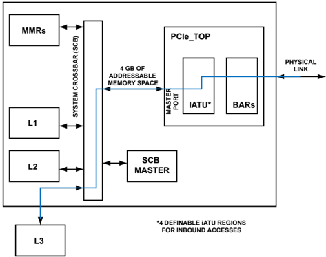

Figure 29-5: Outbound Transactions (SCB MASTER to PHYSICAL LINK)

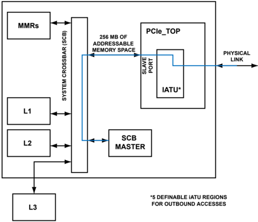

## Inbound Programming Example (BAR Match Mode)

Define Inbound Region n (4 ≥ n ≥ 0) as the memory region matching BAR4 mapping to 0x8000 0000 in the processor's address space using the following equation. In BAR Match mode the region size is set by the BAR mask of the matched BAR.

Refer to IATU Register section and the iATU Address Region Mapping: Inbound 64-bit (BAR Match Mode) figure below. Set up the PCIE\_IATU\_VWPRT\_[n] register to region n to access the IATU configuration registers of this region.

1. Configure the Index register to the set inbound region n as the current region.
2. Write n to the PCIE\_IATU\_VWPRT\_[n].REGNINDX bit field and 1 to the PCIE\_IATU\_VWPRT\_[n].REGNDIR bit.

3. Configure the target address registers.
4. Write 0x8000 0000 to the PCIE\_IATU\_LTADDR\_INB\_[n] register to set the lower target address.
5. Write 0x0000 0000 to the PCIE\_IATU\_UTADDR\_INB\_[n] register to set the upper target address.
6. Configure the region through the region control 1 inbound register.
7. Write 0x0000 0000 to the PCIE\_IATU\_CTL1\_INB\_[n] register to define the type of the region to be MEM.
8. Enable the region for BAR match mode.
9. Write 0xC000 0400 to the PCIE\_IATU\_CTL2\_INB\_[n] register to enable the region for BAR match for BAR#4.

Figure 29-6: iATU Address Region Mapping: Inbound 64-bit (BAR Match Mode)

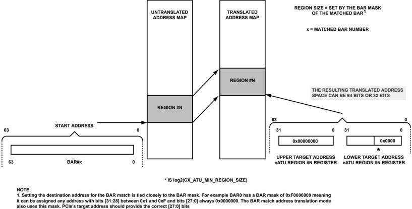

## Inbound Programming Example (Address Match Mode)

Define Inbound Region n (4 ≥ n ≥ 0) as MEM region matching TLPs with address in the range (see also the iATU Address Region Mapping: 64-bit Address Outbound and Inbound (Address Match Mode figure):

- From {PCIE\_MSTARTH, PCIE\_MSTARTHL} to {PCIE\_MSTARTH, PCIE\_MSTARTHL} + 0xFF\_FFFF
- SOC MEM Region
- From 0x8000\_0000 to 0x80FF\_FFFF

Configure the PCIE\_IATU\_VWPRT\_[n] register to region n to access the IATU configuration registers of this region.

1. Configure the PCIE\_IATU\_VWPRT\_[n].REGNINDX Index Register to set inbound region n as the current region.
2. Write n to the PCIE\_IATU\_VWPRT\_[n].REGNINDX bit field and write 1 to the PCIE\_IATU\_VWPRT\_[n].REGNDIR bit.
3. Setup the region base and limit address registers.
4. Write PCIE\_MSTARTL to the PCIE\_IATU\_LBADDR\_INB\_[n] register to set the lower base address.
5. Write PCIE\_MSTARTH to the PCIE\_IATU\_UBADDR\_INB\_[n] register to set the upper base address.
6. Write 0xFF\_FFFF to the PCIE\_IATU\_LMTADDR\_INB\_[n] register to set the limit address.
7. Setup the target address registers.
8. Write 0x8000\_0000 to the PCIE\_IATU\_LTADDR\_INB\_[n] register to set the lower target address.
9. Write 0x0000\_0000 PCIE\_IATU\_LTADDR\_INB\_[n] register to set the upper target address
10. Configure the region through the region control 1 register.
11. Write 0x0000\_0000 to the PCIE\_IATU\_CTL1\_INB\_[n] register to define the type of the region to be MEM.
12. Enable the region.
13. Write 0x8000\_0000 to the PCIE\_IATU\_CTL1\_INB\_[n] register to enable the region.

Figure 29-7: iATU Address Region Mapping: 64-bit Address Outbound and Inbound (Address Match Mode)

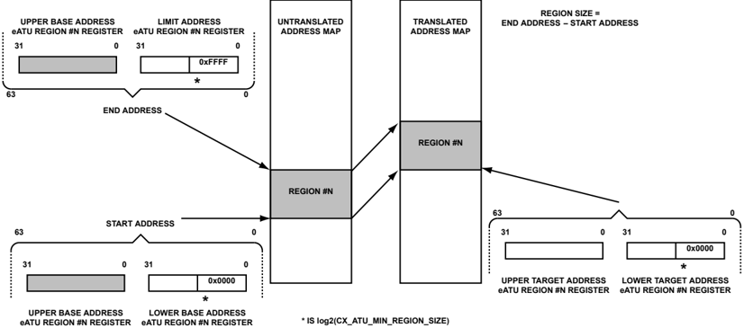

## Outbound Programming Example

Define Outbound Region n (3 ≥ n ≥ 0) as:

- SOC MEM Region

- From MSTART (0x5000\_0000 ≥ MSTART ≥ 0x5FFF\_0000)
- To MEND (0x5000\_FFFF ≥ MSTART ≥ 0x5FFF\_FFFF)
- Mapped to PCIe IO Space
- From PCIE\_MSTART
- To PCIE\_MEND

Refer to iATU Register section. Set up the port logic registers ( PCIE\_IATU\_VWPRT\_[n] ) to region n to access the iATU configuration registers of this region.

1. Setup the Index Register to set outbound region n as the current region.
2. Write n to the PCIE\_IATU\_VWPRT\_[n].REGNINDX bit field and write 1 to the PCIE\_IATU\_VWPRT\_[n].REGNDIR bit.
3. Setup the region base and limit address registers.
4. Write MSTART to the PCIE\_IATU\_LBADDR\_OUTB\_[n] register to set the lower base address.
5. Write 0x0000 0000 to the PCIE\_IATU\_LBADDR\_OUTB\_[n] register to set the upper base address.
6. Write MEND to the PCIE\_IATU\_LMTADDR\_OUTB\_[n] register to set the limit address.
7. Setup the target address registers.
8. Write PCIE\_MSTART to the PCIE\_IATU\_LTADDR\_OUTB\_[n] register to set the lower target address.
9. Write 0x0000 0000 to the PCIE\_IATU\_UTADDR\_OUTB\_[n] register to set the upper target address.
10. Configure the region through the region control 1 register.
11. Write 0x0000 0002 to the PCIE\_IATU\_CTL1\_OUTB\_[n] register to define the region type as I/O.
12. Enable the region.
13. Write 0x8000 0000 to the PCIE\_IATU\_CTL2\_OUTB\_[n] register to enable the region.

## Non DMA Transfers

Non DMA transfers are transfers triggered by a local System Cross Bar fabric master (transmit) or by a remote partner (receive).

## Transmit Transaction Layer Packets (TLP)

Data is transmitted to a PCIe link partner by writing to the slave system cross bar port. Data is read from a PCIe partner by reading from the slave SCB port. The slave system cross bar buses are directly connected to PCIe core's corresponding inputs and outputs. The iATU is used to map outbound system cross bar transactions from different system cross bar address regions to PCIe address regions and to determine their TLP types.

The address field of each request is checked to see if it falls into any of the enabled regions. When an address match is found, the TLP address field, TYPE, TLP digest field present (TD) and attributes (ATTR) header fields are replaced with the corresponding fields in the PCIE\_IATU\_CTL1\_OUTB\_[n] register.

## Receive Transaction Layer Packets (TLP)

The writes addresses of the PCIe partners are translated into master SCB write transactions to the SOC address space. PCIe partners' reads from the processor's assigned address are translated into master system cross bar read transactions from SOC address space. The master system cross bar buses are directly connected to PCIe core corresponding inputs and outputs.

Inbound address translation operates in one of two modes as determined by the PCIE\_IATU\_CTL2\_INB\_[n].MAT bit field.

- Address Match Mode. Normally used by a RC, but may be useful in mapping sections of an EP memory region into noncontiguous sections. The address field of each request TLP is checked to see if it falls into any of the enabled address regions. When an address match is found the TLP address is modified.
- BAR Match Mode. Normally used by an EP . Looking for an address match is a two step process.
1. The standard internal PCI Express BAR matching mechanism checks if the address field of any MEM and IO request TLP falls into any address region defined by the enabled BAR address and masks.
2. When a matched BAR is found, the iATU compares the BAR ID to the PCIE\_IATU\_CTL2\_INB\_[n].BARNUM bit field for all enabled regions.

The PCIE\_APP\_STAT.RXQNEMPTY bit signals that the receive queues are not empty.

## DMA Transfers

These are transfers triggered by the DMA write channel (local to remote memory) or by the DMA read channel (remote to local memory).

The presence of the DMA controller does not affect:

- Normal filtering rules for inbound TLPs (for example, BAR checking in end points)
- The operation of any internal or external address translation. To prevent the iATU from translating inbound or outbound requests that are generated by the internal DMA module one of the following approaches can be implemented:
- Ensure that the combination of DMA channel programming and iATU control register programming, causes no translation of DMA traffic to occur in the iATU.
- Activate the DMA bypass mode to allow request TLPs which are initiated by the DMA controller to pass through the iATU untranslated.

Initialize all registers except PCIE\_DMA\_VWPRT\_SEL\_[n] . Initialize reserved bits to 0x0.

## Read Transfer

The DMA issues a read request to the PCIe link (1 and 2 in the DMA Read Transfers figure). When the read data is received (3 in the figure), the DMA issues a write request to the local memory (4 and 5 in the figure). Once the write completes, the local memory issues a write response to the PCIe core (6 in the figure).

Figure 29-8: DMA Read Transfers

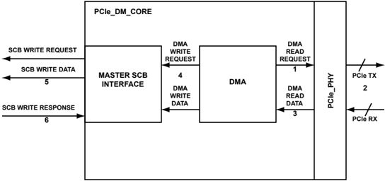

To access the read channel registers, set the PCIE\_DMA\_VWPRT\_SEL\_[n].DIR bit and clear the PCIE\_DMA\_VWPRT\_SEL\_[n].NUM bit field.

The address of the remote buffer is programmed using the PCIE\_DMARD\_SAR\_LO\_[n] register and the address of the local buffer is programmed using the PCIE\_DMARD\_DAR\_LO\_[n] register.

The DMA transfer size is programmed using the PCIE\_DMARD\_XFRSZ\_[n] register. The DMA decrements the value in this register as the DMA transfer progresses. This register can be read at any time to determine the number of bytes remaining to be transferred. When all bytes are successfully transferred, the result is zero. The DMA transfer size can be of any value from one byte, up to a maximum of 4 GB.

Program bits [31:12] in the PCIE\_DMARD\_CTL1\_[n] register to set the TC, TD, RO, NS, AT and FN TLP header fields for any TLP it generates. Once all the DMA controller registers are programmed, a DMA read transfer is started by writing 0x0 to the PCIE\_DMARD\_DRBL\_[n].NUM bit field.

The normal end of a DMA read transfer is detected by any of the following methods:

- The assertion of the RSCKPHY\_EDMA\_INT interrupt and setting the PCIE\_DMARD\_IMSK\_[n].DONE bit.
- The reception of a Done remote interrupt
- When the CS (Channel Status) field in the PCIE\_DMARD\_CTL1\_[n].CS is stopped, and the PCIE\_DMARD\_XFRSZ\_[n] register = 0x0.
- Polling the PCIE\_DMARD\_ISTAT\_[n] register.

The abnormal end of a DMA read transfer is detected by any of the following methods:

- The assertion of a RSCKPHY\_EDMA\_INT interrupt and setting the PCIE\_DMARD\_ISTAT\_[n].ABRT bit.

- The reception of an abort remote interrupt
- When the PCIE\_DMARD\_CTL1\_[n].CS (channel status) field halts. The PCIE\_DMARD\_XFRSZ\_[n] register indicates the remaining number bytes to be transferred except when there is a system cross bar write error.
- Polling the PCIE\_DMARD\_ISTAT\_[n] register.

The application software can stop DMA read transfers by writing to the PCIE\_DMARD\_DRBL\_[n].STOP bit. This action also sets the PCIE\_DMARD\_ISTAT\_[n].ABRT bit.

## Write Transfer

The DMA issues a read request to the local memory (1 and 2 in the DMA Write Transfers figure). When the read data is received (3 and 4 in the figure), the DMA sends the data to the PCIe link (5 and 6 in the figure).

Figure 29-9: DMA Write Transfers

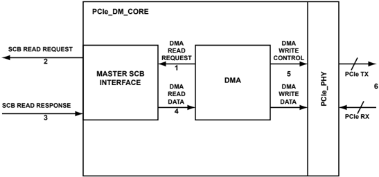

To access the write channel registers, clear the PCIE\_DMA\_VWPRT\_SEL\_[n].DIR bit and the PCIE\_DMA\_VWPRT\_SEL\_[n].NUM bit field.

The address of the local buffer is programmed using the DMASAR\_WR\_LOn register and the address of the remote buffer is programmed using the PCIE\_DMAWR\_DAR\_LO\_[n] register.

The DMA transfer size is programmed using the PCIE\_DMAWR\_XFRSZ\_0[n] register. The DMA decrements the value in this register as the DMA transfer progresses. This register can be read at any time to determine the number of bytes remaining to be transferred. When all bytes are successfully transferred, the result is zero. The DMA transfer size can be of any value from one byte, up to a maximum of 4 GB. Program bits [31:12] in the PCIE\_DMAWR\_CTL1\_[n] register to set the TC, TD, RO, NS, AT and FN TLP header fields for any TLP it generates.

Once all the DMA controller registers are programmed, a DMA write transfer is started by writing 0x0 to the PCIE\_DMAWR\_DRBL\_[n].NUM bit field.

The normal end of a DMA write transfer is detected by any of the following methods:

- The assertion of RSCKPHY\_EDMA\_INT interrupt and setting the PCIE\_DMAWR\_IMSK\_[n].DONE bit.
- The reception of a DONE remote interrupt.

- When the PCIE\_DMAWR\_CTL1\_[n].CS bit field (Channel Status) is stopped and the PCIE\_DMAWR\_XFRSZ\_0[n] register =0x0
- Polling the PCIE\_DMAWR\_ISTAT\_[n] register.

The abnormal end of a DMA write transfer is detected by any of the following methods:

- The RSCKPHY\_EDMA\_INT interrupt is asserted and the PCIE\_DMAWR\_IMSK\_[n].ABRT bit is set.
- The reception of a ABORT remote interrupt.
- When the PCIE\_DMAWR\_CTL1\_[n].CS bit field halts. The PCIE\_DMAWR\_XFRSZ\_0[n] register indicates the remaining number of bytes to be transferred.
- Polling the PCIE\_DMAWR\_ISTAT\_[n] register.

The application software can stop DMA write transfers by writing to the PCIE\_DMARD\_DRBL\_[n].STOP bit. This action also sets the PCIE\_DMAWR\_ISTAT\_[n].ABRT bit.

## Flow Control

The flow control mechanism is divided into two phases: initialization and update. The PCIe core automatically performs both of these phases with minimal support required from the application.

## EP to EP Transactions

An EP does not know the actual address of other EPs in the PCIe system. To enable transfers between EPs or between an EP and other memory-mapped components, the iATU needs to be programmed. To do this the PCIe upstream device can access the iATU directly over the PCIe link or can 'ask' an EP local master to do so.

## Gen2 5.0 GT/s Operation

The PCIe core supports all non-optional Gen2 5.0 GT/s features defined in the PCI Express Base 3.0 Specification, revision 1.0. The interface between the core and the PHY is compliant with the PIPE Specification for PCI Express, Version 4.0. The number of active symbols on the PIPE interface is constant and the frequency of the core doubles each time as the core transitions from the Gen1 to the Gen2 rate.

## Power Management

The power management (PM) state of a PCIe link is determined by the D-state of the upstream port (USP , PCIe core configured as an EP). Power is managed in two ways, by software running on the host or locally by the Active State Power Management (ASPM) hardware.

## Power Management Software

The Power Management Control and Status registers should be set to the desired default values, the NO\_SOFT\_RST should be set as software Reset is not supported. The PM software running on the upstream device can direct the PCIe core to enter any of the D1 or D3 low-power states. It does this by writing to the Power Management Control and Status Register (PMCSR) in the PCI-PM capability structure. Link states L0 and L1 are

not visible to the PM software and are derived from PM D-state connected to the link. The action of changing the D-state in the PMCSR indirectly causes the USP to change the link power state. The L1 state is entered when the USP on a link is programmed to a D-state other than D0.

The following table shows the relationship between Device State (Dx), Link State (Sx) and PHY state (Px) and summarizes the state of clock and power sources for the supported Power States.

Table 29-15: Device State (Dx), Link State (Sx) and PHY state (Px)

| D-State        | Link State Change Trigger *1   | Permissible Qui- escent *2 Link States   | Active Power Supplies *3   | Active Clock Supplies *4   | PIPE_CLK CORE_CLK   | PHY State   |
|----------------|--------------------------------|------------------------------------------|----------------------------|----------------------------|---------------------|-------------|
| D0 unitialized | n/a                            | L0                                       | VDDINT                     | PCIeCLK                    | ON                  | P0, P0S     |
| D0 active      | ASPM *5                        | L0                                       | VDDINT                     | SYSCLK                     | ON                  | P0, P0S     |
| D0 active      | ASPM *5                        | L0S                                      | VDDINT                     | SYSCLK                     | ON                  | P0, P0S     |
| D0 active      | ASPM *5                        | L1                                       | VDDINT                     | SYSCLK                     | ON                  | P1          |
| D1, D3 hot     | PCI-PM *6                      | L1                                       | VDDINT                     | SYSCLK                     | ON                  | P1          |

- *1 The Port Type Link States table shows what link state each port type can trigger.
- *2 VDDINT is connected to the PCIe core V AUX  and V MAIN . V AUX  is the power supply for the Power Management Controller (PMC) and Configuration Dependent Module (CDM) modules. VMAIN is the power supply for the rest of the core.
- *3 VDDINT is connected to the PCIe core V AUX  and V MAIN . V AUX  is the power supply for the Power Management Controller (PMC) and Configuration Dependent Module (CDM) modules. VMAIN is the power supply for the rest of the core.
- *4 The PCIeCLK or REFCLK is connected to the PCIe PHY which is the platform reference clock (REFCLK) for the PHY TX PLL. The platform low-power clock (CLK\_RST's AUXCLK input) is derived from SYSCLK .
- *5 ASPM is the Active State Power Management (Autonomous Link Power Management) hardware.
- *6 By executing a PMCSR write. PMCSR is the power management control and status register ( PCIE\_PMT\_CTLSTAT\_[n] ) in the PCI Compatible Power Management structure (PCI-PM).

Table 29-16: Port Type Link States

| Port   | Triggers L0/L0s Entry   | Triggers L1 Entry                                                                                      |
|--------|-------------------------|--------------------------------------------------------------------------------------------------------|
| USP    | Yes                     | Yes, on any of these triggers: Software programs non-D0 state (PCI-PM) USP's idle timer expires (ASPM) |
| DSP    | No                      | Indirectly by writing non-D0 value to PMCSR of the USP link partner.                                   |

If the USP device needs to transition back to D0 it can send a PME message to the host. The PM software can put the USP into D0 by writing to the Power Management Control and Status Register ( PCIE\_PMT\_CTLSTAT\_[n] ) in the PCI-PM capability structure.

## Active State Power Management (ASPM)

ASPM is enabled through the ASPM control field in the link control register ( PCIE\_LNK\_CAPB\_[n].ASPM ). When the USP is in L0 and detects idle on the link for a specific amount of time (determined by the PCIE\_ACK\_ASPMCTL\_[n].FREQ and PCIE\_LNK\_CAPB\_[n].L0SELAT L0s entrance latency field2 in the (Ack Frequency and L0-L1 ASPM Control Register), it automatically transitions the link to the L0 or L1 power state. Each link direction (transmit and receive) is processed separately. The core exits L0s when there is traffic waiting to be sent.

## Completion Timeout Ranges

Timeout ranges are supported as defined in the PCI Express Base 3.0 Specification, revision 1.0.

## PHY Registers Access

PHY registers can be accessed in the following ways:

- As memory-mapped registers across the ADI\_RCCKPHY and PHY parallel interface
- Across the JTAG port

## RCCKPHY

See Reset Clock and PHY Control Module (RSCKPHY).

## Event Control

The following sections provide information about PCIe errors, messages, and interrupts.

## Error Handling and Debug

The following sections provide information on errors and debugging the PCIe module.

## System Cross Bar Master Interface to PCIe Link Error Mapping

PCIe masters can access the ADSP-SC58x address space across the master system cross bar interface. The system cross bar slave responds to posted or non-posted requests issuing write or read response transactions.

Memory read transactions are non-posted and require the PCIe port to create a completion packet, including error information if needed.

Error Mapping:

- System cross bar SLVERR Slave Error, means that the slave wishes to return an error condition to the master is mapped to a CA (Completer Abort) error.
- System cross bar DECERR Decode Error, means that there is no slave at the transaction address is mapped to an UR (Unsupported Request) error.

Memory writes are posted transactions and do not require a completion packet to be generated. The application can send a message to the root to inform the PCIe software about the error, but the error is not seen by the requester. The system cross bar master interface does not forward information about the requester to the target of the write transaction, the write ID is always 0. The write response is dropped by the system cross bar bridge and not forwarded to the PCIe link.

## PCIe Link Error Mapping to SCB Slave Interface

PCIe slaves can access PCIe's address space across the slave system cross bar interface. All accesses are treated as memory ones. System cross bar slave accesses can be used to create different type of packets if the iATU is enabled and configured as needed. The PCIe slave responds to non-posted requests (read requests) sending completion packets. Completion packets including error information, if needed.

Error mapping:

- PCIe completion time-out is mapped to system cross bar DECERR (decode error).
- ECRC error is mapped to system cross bar SLVERR (slave error).
- Poisoned error (data in TLP is known to be corrupted) is mapped to system cross bar SLVERR
- CA (completer abort) error is mapped to system cross bar SLVERR
- CRS (configuration request retry status) error is mapped to system cross bar SLVERR
- UR (unsupported request) is mapped to system cross bar DECERR

Completion packets are not generated for PCIe posted transactions, therefore responses to slave memory write transactions are generated locally.

## Messages

Messages are generated from memory write transactions using the Internal Address Translation Unit. To ensure that the iATU does not translate MSI or power management messages, the third and fourth double words of these messages do not match any programmed iATU address region.

When there is a successful address match on an outbound MEM TLP , and the translated TLP type field is MSG, then the message code field of the TLP is set to the value in the Message Code field of the PCIE\_IATU\_CTL2\_OUTB\_[n] register. A MWr (memory write transaction) with an effective length of 0' (taking into account SLV\_AWSTRB) is converted to Msg and all other MWr TLPs are converted to MsgD.

## PCIe Interrupts

The following sections provide information on interrupts associated with the PCIe module.

## PCIe Interrupt Request

The following interrupts can trigger a PCIe interrupt request:

- Message signaled interrupt

- Legacy interrupts
- Incoming message interrupts
- Link up
- Receive overflow

These interrupts can be individually enabled by the application software, as needed. To determine the source of the interrupt, read the PCIE\_APP\_INTSTAT register and write a 1 to the interrupt status bit to clear it.

## Configuration

To enable end points to generate MSIs, MSI capabilities register PCIE\_MSI\_CAPB\_NPTR\_[n] , PCIE\_MSI\_CAPB\_OFF4\_[n] , PCIE\_MSI\_CAPB\_OFF8\_[n] and PCIE\_MSI\_CAPB\_OFFC\_[n] (See section 10) need to be programmed.

The local core or the PCIe host configures the MSI interrupt controller.

- The local core or the PCIe host programs the common MSI address used for the EPs into the PCIE\_MSI\_CTL\_LADDR\_[n] and PCIE\_MSI\_CTL\_UADDR\_[n] registers.
- The PCIe host reads the MSI capability of each EP to determine the number of vectors enabled in each EP and use this information to program the interrupt enable registers in the MSI interrupt controller.
- The local core or the PCIe host programs all interrupt enable registers (for example PCIE\_MSI\_IEN0\_[n] ) and all interrupt mask registers (for example PCIE\_MSI\_IMSK0\_[n] ).

## MSI Generation by the EP Local Core

The local EP core provides the following.

- Verify that the PCIE\_APP\_STAT.OUTSTMSI bit is cleared.
- Write 1 to the PCIE\_APP\_CTL.INTREQ bit.
- If the PCIe core is multiple message capable, set the PCIE\_APP\_CTL.MSIVECT bit field to identify the MSI source.
- Poll the PCIE\_APP\_STAT.MSIGRANT bit to check if the MSI request has been granted.
- Clear the PCIE\_APP\_STAT.MSIGRANT bit before issuing a new MSI request.

## MSI Reception by the RC port

MSI packets are captured and terminated in the system cross bar bridge, the packet's payload is decoded, the corresponding interrupt status register (for example PCIE\_MSI\_ISTAT0\_[n] ) is updated and an interrupt is signaled asserting the PCIe interrupt request. The interrupt routine running on the local RC core should:

- Read the interrupt status registers if MSIs from EPn are enabled.
- Write to the interrupt status registers to clear the bit that triggered the interrupt.

## Configuration

Only INTA can be generated. To enable end points to generate INTA, disable MSIs PCIE\_MSI\_CAPB\_NPTR\_[n] bit 16 =0). The local core or any other system cross bar master in the RC enables each specific interrupt.

- The local core or any other system cross bar master sets the PCIE\_APP\_CTL.AIEN , PCIE\_APP\_CTL.BIEN , PCIE\_APP\_CTL.CIEN or PCIE\_APP\_CTL.DIEN bits.

## Interrupt Assert Generation by the EP Local Core (INTA only)

The local EP core should:

- Verify that the PCIE\_APP\_STAT.OUTSTMSI bit is cleared
- Write 1 to the PCIE\_APP\_CTL.INTREQ bit

## Interrupt De-assert Generation by the EP Local Core (INTA only)

The application software or any system cross bar master can trigger an INTA deassert message and clear the PCIE\_APP\_STAT.OUTSTINTA bit. It should:

- Write 1 to the PCIE\_APP\_CTL.INTACLR bit. T wo cases can be considered:
- The device that receives the interrupt understands a sequence of assert INTA message and deassert INTA message as an interrupt pulse that has to be serviced if enabled.
- The device that receives the interrupt needs to acknowledge its reception to the interrupt source to clear it. In this case the interrupt routine on the PCIe Host can either write to the EP's PCIE\_APP\_CTL register or send a message (write) to the EP to acknowledge the reception of the interrupt.

Writing to the PCIE\_APP\_CTL.INTACLR bit when the PCIE\_APP\_STAT.MSIEN bit is set has no effect.

## Interrupt Reception by the RC Port (INTA, INTB, INTC or INTD)

The reception of an enabled interrupt sets the corresponding bit in the PCIE\_APP\_INTSTAT register. These interrupts are treated as level. The interrupt service routine should:

- Test the PCIE\_APP\_INTSTAT.INTA , PCIE\_APP\_INTSTAT.INTB , PCIE\_APP\_INTSTAT.INTC and PCIE\_APP\_INTSTAT.INTD bits to determine which interrupt to service.
- If necessary, write to the EP to acknowledge that the interrupt is being serviced. The interrupt service routine can only clear the above interrupt bits by writing to EP's APP\_CTL register.
- Wait for the INTiASSTD to clear to exit.

## Incoming Messages Interrupts

The following Inbound messages trigger a PCIe interrupt:

- Vendor Defined
- Unlock Transaction (RC Mode)
- Error Signaling (EP Mode)
- Correctable
- Non-Fatal
- Fatal
- Power Management
- Event (RC Mode)
- Turn Off Acknowledge (RC Mode)
- Turn Off (EP Mode)

## Configuration

Enabling interrupts that cannot be received in EP or RC modes is meaningless.

The local core or any other system cross bar master in the RC enables each specific interrupt.

- Write 1 to the appropriate interrupt enable bit in the PCIE\_APP\_CTL register.

## Interrupt Reception

Applies to the reception of an enabled interrupt. The corresponding bit in the PCIE\_APP\_INTSTAT register is set. The interrupt routine should:

- Test the PCIE\_APP\_INTSTAT.CORERR , PCIE\_APP\_INTSTAT.FTLERR , PCIE\_APP\_INTSTAT.NFTLERR , PCIE\_APP\_INTSTAT.PME PCIE\_APP\_INTSTAT.PMTOACK , PCIE\_APP\_INTSTAT.PMTOFF , PCIE\_APP\_INTSTAT.UNLK , and PCIE\_APP\_INTSTAT.VENDMSG bits to determine which interrupt to serve.
- Read the corresponding APP\_&lt;message name&gt;\_MSG registers (xxxMSGRQID) to discover the source of the xxx message.
- If a Vendor message is received, reading the PCIE\_APP\_VNDR\_MSG\_HDR1 and PCIE\_APP\_VNDR\_MSG\_HDR0 registers provide
- Once the interrupt is serviced, clear the status bit by writing 1 to the corresponding bit in the PCIE\_APP\_INTSTAT register.

## Link Up- and Receive-Overflow Interrupts

These interrupts can be enabled in both EP as well as RC modes of operation.

## Configuration

The Local core or any other system cross bar master in the RC has to enable the Receive Overflow interrupt. The Link Up interrupt is enabled by default but can be disabled by software.

- Write 1 to the PCIE\_APP\_CTL.RXQOVFIEN bits to enable the Receive Overflow interrupt.
- Write 1 to the PCIE\_APP\_CTL.LNKUPINTDIS bits to disable the Link Up interrupt.

The PCIE\_APP\_STAT.LNKUP bit reflects the status of the Links Data and MAC/PHY layers.

## Interrupt Reception

Applies to the reception of an enabled interrupt. The corresponding bit in the PCIE\_APP\_INTSTAT register is set. The interrupt routine should:

- Test the PCIE\_APP\_INTSTAT.LNKUP and PCIE\_APP\_INTSTAT.RXQOVF bits to determine which interrupt to serve.
- Once the interrupt is serviced, clear the status bit by writing 1 to the corresponding bit in the PCIE\_APP\_INTSTAT register.

## End Point

If the PCIe core is configured as an EP , the application software can send the upstream device either MSI (Message Signaled Interrupts) or virtual legacy INTA messages.

## MSI Generation

See section 4.5.3.2.1 Interrupts in EP mode.

## INTA Assert and INTA Deassert Generation

See section 4.5.3.2.1 Interrupts in EP mode.

The application software needs to deassert the virtual interrupt when the system software has disabled interrupts or if the PCI Express link has been placed in a low power state. The PCIe core does automatically send a deassert interrupt message when software disables interrupts. The application software must deassert the virtual interrupt before it can send a new interrupt because the PCIe core requires a rising edge on the virtual interrupt signal to generate a new Assert interrupt message. The core does not automatically send a deassert interrupt message when the power state changes.

## Root Complex

If the PCIe core is configured as an RC, it can receive either MSI or Legacy Interrupt messages but cannot generate them. These messages make the RSCKPHY\_PCIEINT\_REQ interrupt signal to become active. If the MSI controller is disabled, MSIs do not make RSCKPHY\_PCIEINT\_REQ interrupt signal assert, instead MSI are forwarded as Write Transactions to the SCB master port. See section 4.5.3.2.2. for more information.

## MSI Reception in the SCB Bridge

When an inbound (received) MWr request is passed to the peripheral or system cross bar bridge and matches the specified MSI address, as well as the conditions specified for an MSI memory write request, then an MSI interrupt is detected and RSCKPHY\_PCIEINT\_REQ interrupt signal asserted. The MSI write request never appears on the SCB master bus.

## Programming and Using the MSI Controller in the SCB Bridge

The host CPU configures the MSI capabilities of all endpoints through CFG requests across the link or accessing the DBI address space.

- Program the 'MSI Data Register' PCIE\_MSI\_CAPB\_OFF8\_[n] (which is part of the PCI Express MSI capability register structure of each EP) as follows to allow the MSI interrupt controller to decode the interrupt source.
- Program the 'MSI Lower 32 Bits Address Register' PCIE\_MSI\_CAPB\_OFF4\_[n] (which is part of the PCI Express MSI capability register structure) of every EP with one common MSI address.

Table 29-17: MSI Data Register Programming

| 15:8     | 7:5                                                                                                      | 4:0                                                                                                                                                                                                           |
|----------|----------------------------------------------------------------------------------------------------------|---------------------------------------------------------------------------------------------------------------------------------------------------------------------------------------------------------------|
| Not Used | EP Number Allows each EP to be identified within the system, For example, EP#5 is programmed with 3'b101 | Interrupt Vector Number • Identifies the interrupt source within each EP • Programmed to 5'b00000. • Set by MSI generation logic to identify each in- terrupt source in real time • Supports up to 32 Vectors |

The host CPU configures the MSI interrupt controller through CFG requests across the link or accessing the DBI address space.

- Program the common MSI address that you used for the EPs into the interrupt controller's MSI Controller Address register ( PCIE\_MSI\_CTL\_LADDR\_[n] )
- Read the MSI capability of each EP to determine the number of vectors enabled in each EP and uses this information to program the interrupt enable registers in the MSI interrupt controller. The interrupt enable register allows up to 32 MSI interrupt vectors to be enabled within the MSI interrupt controller for a given EP . It is the responsibility of the host CPU to read the contents of the 'Multiple Message Enable' field in an EP's MSI capability structure and program that EP's Interrupt Enable register in the interrupt controller appropriately. For example when the 'Multiple Message Enable' is 0b100 for endpoint N (which corresponds to 16 enabled interrupt vectors), then the host CPU should program interrupt enable register #N in the interrupt controller with 0x0000FFFF.

## Legacy Interrupts Reception

The PCIe core can receive INTA, INTB, INTC and INTD interrupt messages. Each interrupt can be individually enabled by setting the corresponding bit in the PCIE\_APP\_CTL register. If any of the enabled interrupts is detected, the corresponding bit in the PCIE\_APP\_INTSTAT register is set and RSCKPHY\_PCIEINT\_REQ asserted.

## Local Interrupts

In addition to the PCIe Interrupts that are always generated by EP ports and received by RC ports, messages, and local events can also make RSCKPHY\_PCIEINT\_REQ assert. These interrupts may be generated in any of the PCIe core configurations.

## Inbound Messages

The following Inbound Messages are registered:

- Vendor Defined
- Unlock Transaction (RC Mode)
- Error Signaling (EP Mode)
- Correctable
- Non-Fatal
- Fatal
- Power Management
- Event (RC Mode)
- Turn Off Acknowledge (RC Mode)
- Turn Off (EP Mode)

The information related to vendor messages is registered in a set of three registers:

- (If applicable) PCIE\_APP\_VNDR\_MSG\_HDR0 message request header bytes 8 to 11
- (If applicable) PCIE\_APP\_VNDR\_MSG\_HDR1 message request header bytes 12 to 15
- PCIE\_APP\_VNDR\_MSG message request header requester ID field (bytes 4 and 5)

All other messages have only an APP\_ Message Name \_MSG register. Each register holds the coresponding message request header ID field The message header information and requester ID are registered if the corresponding interrupt bit in the PCIE\_APP\_INTSTAT is not set.

## Link Up

This Interrupt is triggered when the PCIE\_APP\_STAT.LNKUP bit transitions from 0 to 1. It tells the system that the link is up and ready to transfer data or messages. The PCIE\_APP\_STAT.LNKUP bit is read only. When the Link Up interrupt is asserted the PCIE\_APP\_INTSTAT.LNKUP bit is set.

## Receive Overflow Interrupt

If an overflow occurs in any of the receive queues, the PCIE\_APP\_INTSTAT.RXQOVF bit is set and RSCKPHY\_PCIEINT\_REQ is asserted. This bit stays set and the interrupt asserted until the application software writes 1 to it.

## Reset Interrupt Request

The Reset Interrupt Request is triggered only by the PCIe core warm or hot link reset request. This interrupt has to be enabled if the PCIe port is enabled. A warm or hot reset event sets the PCIE\_RSCK\_STAT.WRMHTRST bit.

In response to the RSCKPHY\_PCIERST\_REQ the interrupt service routine performs the following tasks.

- Allows the PCIe master accesses to complete normally.
- Stops all system cross bar bus masters from accessing PCIe core slave system cross bar port.
- Allows the slave system cross bar transactions in progress complete. The response is bus error.
- Stops the system cross bar bus masters from accessing the PCIe core DBI SCB port.
- Allows the slave DBI SCB transactions in progress to complete. The response is bus error.
- Two actions may follow.
- Write 1 to the PCIE\_RSCK\_CTL.DBISLVDIS bit to let CLK\_RST reset the PCIe core, non sticky registers and PCIe PHY.
- Set the PCIE\_RSCK\_CTL.PCIERES bit to reset the whole PCIe port (similar to cold reset).
- If set, clear the PCIE\_RSCK\_CTL.PCIERES bit.
- Write 1 to the PCIE\_RSCK\_STAT.WRMHTRST bit to clear the interrupt request.

The core reset, PHY reset system cross bar master interface, system cross bar slave interface and system cross bar DBI interface reset status can be monitored by software by checking the PCIE\_RSCK\_STAT.CORERST , PCIE\_RSCK\_STAT.PHYRST , PCIE\_RSCK\_STAT.MSTRST , PCIE\_RSCK\_STAT.SLVRST and PCIE\_RSCK\_STAT.DBIRST bits. These bits are implemented for debug purposes and should be treated as asynchronous.

## DMA Interrupts

RSCKPHY\_EDMAINT\_REQ is an interrupt request signal dedicated to the Embedded DMA controller.

## Programming Model

The following sections provide general programming information for the PCIe module.

## Enumeration

Enumeration is the first step in the system discovery and configuration process run by the PCIe CPU.

## Enumeration Driver Example

The processor's PCIe port does not check configuration requests (at the application transmit interface) for valid target Bus-Device-Function (BDF) numbers before it transmits them. It does not check that the target bus number &gt; secondary bus number and that target bus number ≤ subordinate bus number . Software running on the local core provides only legal requests to the PCIe core. Only one PCIe port is implemented, therefore bus 0 has only a single device on it. This device may be an EP or a switch. If the device is an EP the number of functions (F) is determined and the only valid BDF numbers are 00F . If the device is a switch the search on the secondary bus and down continues normally until the last EP is discovered.

The following CfgRd0 or CfgRd1 Example example requires the use and configuration of the iATU (See section 4.6.4. Internal Address T ranslation). Enumeration uses configuration requests, therefore the iATU has to be configured to translate slave system cross bar reads into CfgRd0 or CfgRd1 and slave system cross bar writes into CfgWr0 or CfgWr1 outbound transactions. To determine what Device 0 on bus 0 is, the RC can issue a CfgRd1 request from the device's 0 Vendor ID register. If the response is 0xFFFF (unsupported request), device 0 is an End Point and the PCIe software continues issuing CfgRd0 to determine the number of functions. If the response is different than 0xFFFF, device 0 is a bridge and the Enumeration process continues using configuration requests as required by the PCIe system topology.

Define Outbound Region n (3 ≥ n ≥ 0) as:

- MSIZE = 64 Kbytes
- SOC MEM Region
- From MSTART (0x5000\_0000 ≥ MSTART ≥ 0x5FFF\_0000)
- To MEND (0x5000\_FFFF ≥ MSTART ≥ 0x5FFF\_FFFF)
- Mapped to PCIe Configuration Space
- CFG Space[31:16] = BDF
- CFG Space[15:12] = 0x0
- CFG Space[11:8] = Extended Register Number
- CFG Space[7:2] = Configuration Register Number
- CFG Space[1:0] = 0x0

Define Outbound Transaction as Cfg

- TYPE = CfgRd0 or CfgRd1
- TC = 0x0
- TD = 0
- ATTR = 0x0
- AT = 0x0

Port Logic Registers. Configure the PCIE\_IATU\_VWPRT\_[n] register to access the region n IATU configuration registers.

1. Setup the Index Register to set outbound region n as the current region.
- a. Write n to PCIE\_IATU\_VWPRT\_[n].REGNINDX and 0 to PCIE\_IATU\_VWPRT\_[n].REGNDIR register address.
2. Setup the Region Base and Limit Address registers.
- a. Write 'MSTART' to the PCIE\_IATU\_LBADDR\_OUTB\_[n] register to set the lower base address.
- b. Write 0x0000\_0000 to the PCIE\_IATU\_UBADDR\_OUTB\_[n] register to set the upper base address.
- c. Write 'MEND' to PCIE\_IATU\_LMTADDR\_OUTB\_[n] register to set the limit address.
3. Setup the Target Address Registers.
- a. Write 'CFG Space' to the PCIE\_IATU\_LTADDR\_OUTB\_[n] register to set the lower target address.
- b. Write 0x0000\_0000 to the PCIE\_IATU\_UTADDR\_OUTB\_[n] register to set the upper target address.
4. Configure the region through the Region Control 1 register.
- a. Write to the PCIE\_IATU\_CTL1\_OUTB\_[n].TYPE , PCIE\_IATU\_CTL1\_OUTB\_[n].TC , PCIE\_IATU\_CTL1\_OUTB\_[n].TD , PCIE\_IATU\_CTL1\_OUTB\_[n].ATTR and PCIE\_IATU\_CTL1\_OUTB\_[n].AT bits and 0 to all the other bits.
5. Enable the region.
- a. Write 0x8000\_0000 to the PCIE\_IATU\_CTL2\_OUTB\_[n] register to enable the region.

Configuration write transactions are implemented in the same way as configuration read transactions. Configure the PCIE\_IATU\_CTL1\_OUTB\_[n].TYPE bit field to CfgWr0 or CfgWr1.

## DMA Transfers

The order in which the DMA Controller's registers are programmed is not important except for the PCIE\_DMAWR\_DRBL\_[n] or PCIE\_DMARD\_DRBL\_[n] registers, which initiates the DMA transfer.

## DMA Write Transfer Example

Transfer 1MB from local L2 (0x2400 0000) to PCIe memory space (0x5000 0000)

1. Write 0x0 to the PCIE\_DMA\_VWPRT\_SEL\_[n] register to select channel 0 write registers.
2. Write 0x1 to the PCIE\_DMAWR\_EN\_[n].EN bit.
3. Write 0x0 to the PCIE\_DMAWR\_IMSK\_[n] register.

4. Clear the PCIE\_DMAWR\_CTL1\_[n].AT , PCIE\_DMAWR\_CTL1\_[n].RO , PCIE\_DMAWR\_CTL1\_[n].NS , PCIE\_DMAWR\_CTL1\_[n].TC , PCIE\_DMAWR\_CTL1\_[n].FNUM and PCIE\_DMAWR\_CTL1\_[n].RIE bit fields. 5. Set the PCIE\_DMAWR\_CTL1\_[n].LIE and the PCIE\_DMAWR\_CTL1\_[n].TD bits. 6. Set the PCIE\_DMAWR\_XFRSZ\_0[n] register to 0x0010 0000 (1 MB). 7. Set the PCIE\_DMAWR\_SAR\_LO\_[n] register to 0x2400 0000. 8. Set the PCIE\_DMAWR\_SAR\_HI\_[n] register to 0x0000 0000. 9. Set the PCIE\_DMAWR\_DAR\_LO\_[n] register to 0x5000 0000. 10. Set the PCIE\_DMAWR\_DAR\_HI\_[n] register to 0x0000 0000. 11. Write 0x0 to the PCIE\_DMAWR\_DRBL\_[n] register. DMA Read Transfer Example Transfer 1MB from remote PCIe memory space (0x5000 0000) to local L2 (0x2400 0000) 1. Write 0x8000\_0000 to the PCIE\_DMA\_VWPRT\_SEL\_[n] register to select channel 0 read registers. 2. Write 0x1 to the PCIE\_DMARD\_EN\_[n].EN bit. 3. Write 0x0 to the PCIE\_DMARD\_IMSK\_[n] register. 4. Clear the PCIE\_DMARD\_CTL1\_[n].AT , PCIE\_DMARD\_CTL1\_[n].RO , PCIE\_DMARD\_CTL1\_[n].NS , PCIE\_DMARD\_CTL1\_[n].TC , PCIE\_DMARD\_CTL1\_[n].FNUM and PCIE\_DMARD\_CTL1\_[n].RIE bit fields. 5. Set the PCIE\_DMARD\_CTL1\_[n].LIE and the PCIE\_DMARD\_CTL1\_[n].TD bits. 6. Set the PCIE\_DMARD\_XFRSZ\_[n] register to 0x0010 0000 (1 MB). 7. Set the PCIE\_DMARD\_SAR\_LO\_[n] register to 0x2400 0000. 8. Set the PCIE\_DMARD\_SAR\_LO\_[n] register to 0x0000 0000. 9. Set the PCIE\_DMARD\_DAR\_LO\_[n] register to 0x5000 0000. 10. Set the PCIE\_DMARD\_DAR\_HI\_[n] register to 0x0000 0000. 11. Write 0x0 to the PCIE\_DMARD\_DRBL\_[n] register.

## Device Reset

There are two reset types for the ADI PCIe core. The first is initial power-up and is only reached from chip initialization. This has been referred to as Cold reset in prior descriptions. The key to this step is making sure the Physical layer is correctly out of reset and setting the device into the proper operating mode, either Root Complex or End point. The second type of reset is one initiated from an upstream port, referred to as a hot reset request. The hot

reset does not require resetting of the physical layer but does require re-training the link and setup of all configuration registers, address translation and DMA engines. The cold reset sequence always proceeds to a hot reset.

## Cold Reset

The cold reset is entered via power up or a system reset. This is also referred to as a fundamental reset. The PERST# signal is not connected to the system reset by default. The following steps prepare the hardware to enter the Hot reset sequence.

1. Take the core out of reset and configure as Root complex or Endpoint.
2. Wait for the core to come out of rest.

```
if (*pREG_RSCK_CTL & 0x01)  // check if it is reset. { *pREG_RSCK_CTL = 0x00000002; //take core out of reset. set to end point delay(256); }
```

```
While (*pREG_RSCK_STAT & 0x1);
```

## Hot Reset

The hot reset is entered via the upstream port PCIe TSI ordered sets. This is typically a software driven event. The ADI PCIe core intercepts this bit and when detected sets a bit in the PCIE\_RSCK\_STAT register. Additionally, this bit can trigger an interrupt via the APP\_STAT interrupt. The reception of the Hot Reset command indicates the link must re-enter detect state. All configuration registers and address mapping must be re-initialized.

1. Either detect the hot reset request (via the APP\_STAT interrupt or polling the PCIE\_RSCK\_STAT register) or enter from the fundamental reset.
2. Clear the reset events and verify
3. Setup the configuration registers, including BAR address size, MSIs and custom device id. Finally, enable the IO and command register space. The program must enable the DBI registers in order to access the configuration space.

```
if (*pREG_RSCK_STAT & 0x20000)  // lock write error bit is set { *pREG_RSCK_STAT = 0x20000;    // clear lock write error bit } if (*pREG_RSCK_STAT & 0x20)  // reset bit is set { *pREG_RSCK_STAT = 0x20;  // clear  Hot reset request } // wait for device to come out of reset while ( (*pREG_RSCK_STAT & 0x1F) !=0 );
```

```
*pREG_PCIE0_MISC_CONTROL_1_REG0 = 0x1; //Write enable for DBI Read register *pREG_PCIE0_BAR0_REG0    = 0x08;        // 32 bit address *pREG_PCIE0_BAR1_CS    = 0x00000000;    //  disable bar1-4 *pREG_PCIE0_BAR2_CS    = 0x00000000; *pREG_PCIE0_BAR3_CS    = 0x00000000; *pREG_PCIE0_BAR4_CS    = 0x00000000; *pREG_PCIE0_TYPE1_DEV_ID_VEND_ID_REG0 =   ((DEV_ID << 16) |VEND_ID);; *pREG_PCIE0_TYPE1_SUBSYS_ID_VEND_REG0 =   ( (EP_SS_ID << 16) | SSVID_ID ); *pREG_PCIE0_TYPE1_STATUS_COMMAND_REG0   |= 3;
```

4. Setup the address translation. This example matches the incoming BAR0 and translates to L2RAM at 0x2xxxxxxx.
5. Enter link training and wait for link establishment. Link establishment can be detected by polling the PCIE\_APP\_STAT register or via interrupt.
6. If the device is configured as an endpoint, wait for the upstream port to configure the bus enable bit. If the device is a Root complex begin configuration of endpoint.
7. Begin normal processing while monitoring link status.

```
*pREG_PCIE0_IATU_VIEWPORT_REG0 =   0x80000000;        // inbound region 0 *pREG_PCIE0_PL_IATU_LWR_TARGET_ADDR_REG_OUTBOUND_00   =   0x20000000; *pREG_PCIE0_PL_IATU_UPPER_TARGET_ADDR_REG_OUTBOUND_00 =   0x0; *pREG_PCIE0_PL_IATU_REGION_CTRL_REG_1_OUTBOUND_00     =    0x0;    // MEMr/w *pREG_PCIE0_PL_IATU_REGION_CTRL_REG_2_OUTBOUND_00   =   0xC0000000;  // BAR0
```

```
// bits[3:0]link speed 1 = 2.5G, 2=5G *pREG_PCIE_USP0_LINK_CAPABILITIES = 0x0040AC11; *pREG_APP_CTL = 0x1;                 // start training process While  (!(*pREG_APP_STAT & 0x01) );       // wait for link to train
```

```
while ( !(*pREG_PCIE0_TYPE1_STATUS_COMMAND_REG0 & 0x04 ) ); //endpoint
```

## ADSP-SC58x Product Specific Information

The following information is specific to PCIe operation on the ADSP-SC58x processors.

## PHY Parameter Control

Several signals set static or programmable values that are used by the PHY. Some of these parameters are packagedependent and their programmability is advantageous. Systems drive these from a register with a default value set.

The values for transmit de-emphasis and amplitude are derived from the following equations.

<!-- formula-not-decoded -->

Using these relationships, the default settings for 1.0-V launch amplitude and transmit equalization are: Transmit de-emphasis for PCI Express:

- pcs\_tx\_deemph: PHY\_TXDEEMPH.GEN1 = 24 (0x18) (Typical setting for 2.5 Gb/s operation) PHY\_TXDEEMPH.GEN2\_35 = 24 (0x18) (Typical setting for 5.0 Gb/s operation, 3.5 dB) PHY\_TXDEEMPH.GEN2\_6 = 33 (0x21) (Typical setting for 5.0 Gb/s operation, 6 dB)

## Transmit launch amplitude:

- pcs\_tx\_swing: PHY\_TXSWING.FULL = 115 (0x73) (For the default 1.0 V launch amplitude) PHY\_TXSWING.LOW = 115 (0x73) (To support Mobile mode)

## ADSP-SC58x PCIE Register Descriptions

(PCIE) contains the following registers.

Table 29-18: ADSP-SC58x PCIE Register List

| Name                    | Description                                                  |
|-------------------------|--------------------------------------------------------------|
| PCIE_ACK_ASPMCTL_[n]    | Acknowledge Frequency and L0-L1 ASPM Control Register        |
| PCIE_ACK_TMR_[n]        | Acknowledge Latency Timer and Replay Timer Register          |
| PCIE_ADVERR_CAPBCTL_[n] | Advanced Error Capabilities and Control Register             |
| PCIE_ADVERR_EXTCAPB_[n] | Advanced Error Reporting Extended Capability Header Register |
| PCIE_APP_CORERR_MSG     | Correctable Error Message Requester ID Register              |
| PCIE_APP_CTL            | Application Control Register                                 |
| PCIE_APP_DIAGCTL        | Diagnostic Control Register                                  |
| PCIE_APP_DIAGSTAT       | Diagnostic Status Register                                   |
| PCIE_APP_FERR_MSG       | Fatal Error Message Requester ID Register                    |
| PCIE_APP_INTSTAT        | Application Interrupts Status Register                       |
| PCIE_APP_NFERR_MSG      | Non Fatal Error Message Requester ID Register                |
| PCIE_APP_PMACK_MSG      | Power Management Acknowledge Message Requester ID Register   |
| PCIE_APP_PMEVT_MSG      | Power Management Event Message Requester ID Register         |
| PCIE_APP_PMTOFF_MSG     | Power Management Turn Off Message Requester ID Register      |
| PCIE_APP_STAT           | Application Status Register                                  |

Table 29-18: ADSP-SC58x PCIE Register List (Continued)

| Name                        | Description                                                 |
|-----------------------------|-------------------------------------------------------------|
| PCIE_APP_UNLK_MSG           | Unlock Message Requester ID Register                        |
| PCIE_APP_VNDR_MSG           | Vendor Message Requester ID Register                        |
| PCIE_APP_VNDR_MSG_HDR0      | Vendor Message Header Bytes 8 to 11 Register                |
| PCIE_APP_VNDR_MSG_HDR1      | Vendor Message Header Bytes 12 to 15 Register               |
| PCIE_AUX_CLKFREQ_[n]        | Auxiliary Clock Frequency Control Register                  |
| PCIE_BERR_RESP_[n]          | Peripheral and SCB Bridge Slave Error Response Register     |
| PCIE_BUSMGR_WDOG_[n]        | Bus Order Manager Watchdog Off Register                     |
| PCIE_BUS_MULOB_DECOMP_[n]   | Bus Multiple Outbound Decomposition SubReq Control Register |
| PCIE_CACHE_CTL1_[n]         | ACE Cache Coherency Control Register 1                      |
| PCIE_CACHE_CTL3_[n]         | ACE Cache Coherency Control Register 3                      |
| PCIE_CAPB_NPTR_[n]          | PCIe Capabilities, ID, Next Pointer Register                |
| PCIE_CORERR_MSK_[n]         | Correctable Error Mask Register                             |
| PCIE_CORERR_STAT_[n]        | Correctable Error Status Register                           |
| PCIE_DEV_CAPB2_[n]          | Device Capabilities 2 Register                              |
| PCIE_DEV_CTLSTAT2_[n]       | Device Control 2 and Status 2 Register                      |
| PCIE_DEV_CTLSTAT_[n]        | Device Control and Status Register                          |
| PCIE_DMARD_ARBWGT_LO_[n]    | DMARead Arbitration Weight Low Off Register                 |
| PCIE_DMARD_CH01_IMWR_[n]    | DMARead Channel 1 and 0 IMWr Data Register                  |
| PCIE_DMARD_CTL1_[n]         | DMAControl 1 Read Channel Register                          |
| PCIE_DMARD_DAR_HI_[n]       | DMADestination Address High Read Channel Register           |
| PCIE_DMARD_DAR_LO_[n]       | DMADestination Address Low Read Channel Register            |
| PCIE_DMARD_DONE_IMWR_HI_[n] | DMARead Done IMWr Address High Register                     |
| PCIE_DMARD_DONE_IMWR_LO_[n] | DMARead Done IMWr Address Low Register                      |
| PCIE_DMARD_DRBL_[n]         | DMARead Doorbell Register                                   |
| PCIE_DMARD_EN_[n]           | DMARead Engine Enable Register                              |
| PCIE_DMARD_ERRSTAT_HI_[n]   | DMARead Error Status High Register                          |
| PCIE_DMARD_ERRSTAT_LO_[n]   | DMARead Error Status Low Register                           |
| PCIE_DMARD_ICLR_[n]         | DMARead Interrupt Clear Register                            |
| PCIE_DMARD_IMSK_[n]         | DMARead Interrupt Mask Register                             |
| PCIE_DMARD_IMWRABRT_HI_[n]  | DMARead Abort IMWr Address High Register                    |
| PCIE_DMARD_IMWRABRT_LO_[n]  | DMARead Abort IMWr Address Low Register                     |

Table 29-18: ADSP-SC58x PCIE Register List (Continued)

| Name                        | Description                                          |
|-----------------------------|------------------------------------------------------|
| PCIE_DMARD_ISTAT_[n]        | DMARead Interrupt Status Register                    |
| PCIE_DMARD_LLP_HI_[n]       | DMALLP High Read Channel Register                    |
| PCIE_DMARD_LLP_LO_[n]       | DMALLP Low Read Channel Register                     |
| PCIE_DMARD_LLSTERR_EN_[n]   | DMARead Linked List Error Enable Register            |
| PCIE_DMARD_SAR_HI_[n]       | DMASAR High Read Channel Register                    |
| PCIE_DMARD_SAR_LO_[n]       | DMASAR Low Read Channel Register                     |
| PCIE_DMARD_XFRSZ_[n]        | DMATransfer Size Read Channel Register               |
| PCIE_DMAWR_ABRT_IMWR_HI[n]  | DMAWrite Abort IMWr Address High Register            |
| PCIE_DMAWR_ABRT_IMWR_LO[n]  | DMAWrite Abort IMWr Address Low Register             |
| PCIE_DMAWR_ARBWGT_LO_[n]    | DMAWrite Channel Arbitration Weight Low Off Register |
| PCIE_DMAWR_CH01_IMWR_[n]    | DMAWrite Channel 1 and 0 IMWr Data Register          |
| PCIE_DMAWR_CTL1_[n]         | DMAControl 1 Write Channel Register                  |
| PCIE_DMAWR_DAR_HI_[n]       | DMADar High Write Channel Register                   |
| PCIE_DMAWR_DAR_LO_[n]       | DMADARLow Write Channel Register                     |
| PCIE_DMAWR_DONE_IMWR_HI_[n] | DMAWrite Done IMWr Interrupt Address High Register   |
| PCIE_DMAWR_DONE_IMWR_LO_[n] | DMAWrite Done IMWr Address Low Register              |
| PCIE_DMAWR_DRBL_[n]         | DMAWrite Doorbell Register                           |
| PCIE_DMAWR_EN_[n]           | DMAWrite Engine Enable Register                      |
| PCIE_DMAWR_ERRSTAT_[n]      | DMAWrite Error Status Register                       |
| PCIE_DMAWR_ICLR_[n]         | DMAWrite Interrupt Clear Register                    |
| PCIE_DMAWR_IMSK_[n]         | DMAWrite Interrupt Mask Register                     |
| PCIE_DMAWR_ISTAT_[n]        | DMAWrite Interrupt Status Register                   |
| PCIE_DMAWR_LLP_HI_[n]       | DMALLP High Write Channel Register                   |
| PCIE_DMAWR_LLP_LO_[n]       | DMALLP Low Write Channel Register                    |
| PCIE_DMAWR_LLSTERR_EN_[n]   | DMAWrite Linked List Error Enable Register           |
| PCIE_DMAWR_PREQ_TMR_[n]     | DMAWrite Posted Request Deadlock Timer Register      |
| PCIE_DMAWR_SAR_HI_[n]       | DMASAR High Write Channel Register                   |
| PCIE_DMAWR_SAR_LO_[n]       | DMASAR Low Write Channel Register                    |
| PCIE_DMAWR_XFRSZ_0[n]       | DMATransfer Size Write Channel Register              |
| PCIE_DMA_CTL_[n]            | DMANumber of Channels Register                       |
| PCIE_DMA_VWPRT_SEL_[n]      | DMAChannel Context Index Register                    |

Table 29-18: ADSP-SC58x PCIE Register List (Continued)

| Name                    | Description                                   |
|-------------------------|-----------------------------------------------|
| PCIE_EP_BAR0_MASK[n]    | Endpoint Base Address Mask Register 0         |
| PCIE_EP_BAR0_[n]        | Endpoint Base Address Register 0              |
| PCIE_EP_BAR1_MASK[n]    | Endpoint Base Address Mask Register 1         |
| PCIE_EP_BAR1_[n]        | Endpoint Base Address Register 1              |
| PCIE_EP_BAR2_MASK[n]    | Endpoint Base Address Mask Register 2         |
| PCIE_EP_BAR2_[n]        | Endpoint Base Address Register 2              |
| PCIE_EP_BAR3_MASK[n]    | Endpoint Base Address Mask Register 3         |
| PCIE_EP_BAR3_[n]        | Endpoint Base Address Register 3              |
| PCIE_EP_BAR4_MASK[n]    | Endpoint Base Address Mask Register 4         |
| PCIE_EP_BAR4_[n]        | Endpoint Base Address Register 4              |
| PCIE_EP_BAR5_MASK[n]    | Endpoint Base Address Mask Register 5         |
| PCIE_EP_BAR5_[n]        | End Point Base Address Register 5             |
| PCIE_EP_CAPBPTR_[n]     | Capability Pointer Register                   |
| PCIE_EP_CCRID_[n]       | Class Code and Revision ID Register           |
| PCIE_EP_CFG_[n]         | End Point Configuration Register              |
| PCIE_EP_CRDBPTR_[n]     | CardBus CIS Pointer Register                  |
| PCIE_EP_DEVCAPB_[n]     | Device Capabilities Register                  |
| PCIE_EP_ID_[n]          | Device ID and Vendor ID Register              |
| PCIE_EP_PINLN_INT_[n]   | Interrupt Line and Pin Register               |
| PCIE_EP_ROMCFG_[n]      | End Point Expansion ROMBase Address Register  |
| PCIE_EP_SSVID_[n]       | Subsystem ID and Subsystem Vendor ID Register |
| PCIE_EP_STATCMD_[n]     | Command and Status Register                   |
| PCIE_ERRSRC_ID_[n]      | Error Source Identification Register          |
| PCIE_FILTMSK2_[n]       | Filter Mask 2 Register                        |
| PCIE_GEN2_CTL_[n]       | Link Width and Speed Change Control Register  |
| PCIE_HDRLOG0_[n]        | Header Log Register 0                         |
| PCIE_HDRLOG1_[n]        | Header Log Register 1                         |
| PCIE_HDRLOG2_[n]        | Header Log Register 2                         |
| PCIE_HDRLOG3_[n]        | Header Log Register 3                         |
| PCIE_IATU_CTL1_INB_[n]  | iATU Region Control 1 Inbound Register        |
| PCIE_IATU_CTL1_OUTB_[n] | iATU Region Control 1 Outbound Register       |

Table 29-18: ADSP-SC58x PCIE Register List (Continued)

| Name                       | Description                                          |
|----------------------------|------------------------------------------------------|
| PCIE_IATU_CTL2_INB_[n]     | iATU Region Control 2 Inbound Register               |
| PCIE_IATU_CTL2_OUTB_[n]    | iATU Region Control 2 Register Outbound              |
| PCIE_IATU_CTL3_INB_[n]     | iATU Region Control 3 Register                       |
| PCIE_IATU_CTL3_OUTB_[n]    | iATU Region Control 3 Register                       |
| PCIE_IATU_LBADDR_INB_[n]   | IATU Lower Base Inbound Address Register             |
| PCIE_IATU_LBADDR_OUTB_[n]  | IATU Lower Base Outbound Address Register            |
| PCIE_IATU_LMTADDR_INB_[n]  | IATU Inbound Limit Address Register                  |
| PCIE_IATU_LMTADDR_OUTB_[n] | IATU Outbound Limit Address Register                 |
| PCIE_IATU_LTADDR_INB_[n]   | IATU Lower Target Address Inbound Register           |
| PCIE_IATU_LTADDR_OUTB_[n]  | IATU Lower Target Address Outbound Register          |
| PCIE_IATU_UBADDR_INB_[n]   | IATU Upper Base Address Inbound Register             |
| PCIE_IATU_UBADDR_OUTB_[n]  | IATU Upper Base Address Outbound Register            |
| PCIE_IATU_UTADDR_INB_[n]   | iATU Upper Target Address Inbound Register           |
| PCIE_IATU_UTADDR_OUTB_[n]  | iATU Upper Target Address Outbound Register          |
| PCIE_IATU_VWPRT_[n]        | IATU View Port Register                              |
| PCIE_LANE_SKEW_[n]         | Lane Skew Register                                   |
| PCIE_LNK_CAPB2_[n]         | Link Capabilities 2 Register                         |
| PCIE_LNK_CAPB_[n]          | Link Capabilities Register                           |
| PCIE_LNK_CTLSTAT2_[n]      | Link Control 2 and Status 2 Register                 |
| PCIE_LNK_CTLSTAT_[n]       | Link Control and Status Register                     |
| PCIE_MISC_CTL1_[n]         | DBI Read-Only Write Enable Register                  |
| PCIE_MSI_CAPB_NPTR_[n]     | MSI Capability ID, Next Pointer and Control Register |
| PCIE_MSI_CAPB_OFF4_[n]     | MSI Capability Offset Register                       |
| PCIE_MSI_CAPB_OFF8_[n]     | MSI Capability Offset Register                       |
| PCIE_MSI_CAPB_OFFC_[n]     | MSI Capability Offset Register                       |
| PCIE_MSI_CTL_LADDR_[n]     | MSI Controller Lower Address Register                |
| PCIE_MSI_CTL_UADDR_[n]     | MSI Controller Upper Address Register                |
| PCIE_MSI_GPIO_IO_[n]       | MSI Controller General-Purpose IO Register           |
| PCIE_MSI_IEN0_[n]          | MSI Controller Interrupt 0 Enable Register           |
| PCIE_MSI_IEN1_[n]          | MSI Controller Interrupt 1 Enable Register           |
| PCIE_MSI_IEN2_[n]          | MSI Controller Interrupt 2 Enable Register           |

Table 29-18: ADSP-SC58x PCIE Register List (Continued)

| Name                 | Description                                  |
|----------------------|----------------------------------------------|
| PCIE_MSI_IEN3_[n]    | MSI Controller Interrupt 3 Enable Register   |
| PCIE_MSI_IEN4_[n]    | MSI Controller Interrupt 4 Enable Register   |
| PCIE_MSI_IEN5_[n]    | MSI Controller Interrupt 5 Enable Register   |
| PCIE_MSI_IEN6_[n]    | MSI Controller Interrupt 6 Enable Register   |
| PCIE_MSI_IEN7_[n]    | MSI Controller Interrupt 7 Enable Register   |
| PCIE_MSI_IMSK0_[n]   | MSI Controller Interrupt 0 Mask Register     |
| PCIE_MSI_IMSK1_[n]   | MSI Controller Interrupt 1 Mask Register     |
| PCIE_MSI_IMSK2_[n]   | MSI Controller Interrupt 2 Mask Register     |
| PCIE_MSI_IMSK3_[n]   | MSI Controller Interrupt 3 Mask Register     |
| PCIE_MSI_IMSK4_[n]   | MSI Controller Interrupt 4 Mask Register     |
| PCIE_MSI_IMSK5_[n]   | MSI Controller Interrupt 5 Mask Register     |
| PCIE_MSI_IMSK6_[n]   | MSI Controller Interrupt 6 Mask Register     |
| PCIE_MSI_IMSK7_[n]   | MSI Controller Interrupt 7 Mask Register     |
| PCIE_MSI_ISTAT0_[n]  | MSI Controller Interrupt 0 Status Register   |
| PCIE_MSI_ISTAT1_[n]  | MSI Controller Interrupt 1 Status Register   |
| PCIE_MSI_ISTAT2_[n]  | MSI Controller Interrupt 2 Status Register   |
| PCIE_MSI_ISTAT3_[n]  | MSI Controller Interrupt 3 Status Register   |
| PCIE_MSI_ISTAT4_[n]  | MSI Controller Interrupt 4 Status Register   |
| PCIE_MSI_ISTAT5_[n]  | MSI Controller Interrupt 5 Status Register   |
| PCIE_MSI_ISTAT6_[n]  | MSI Controller Interrupt 6 Status Register   |
| PCIE_MSI_ISTAT7_[n]  | MSI Controller Interrupt 7 Status Register   |
| PCIE_PHY_TXDEEMPH    | TX De-emphasis Parameters Register           |
| PCIE_PHY_TXSWING     | TX Launch Amplitude Register                 |
| PCIE_PLCTL_[n]       | Port Logic Link Control Register             |
| PCIE_PLDBG0_[n]      | Port Logic Debug0 Register                   |
| PCIE_PLDBG1_[n]      | Port Logic Debug1 Register                   |
| PCIE_PL_FRC_[n]      | Port Force Link Register                     |
| PCIE_PL_PHYCTL_[n]   | Port Control PHY Control Register            |
| PCIE_PL_PHYSTAT_[n]  | Port Control PHY Status Register             |
| PCIE_PMT_CAPB_[n]    | Power Management Capabilities Register       |
| PCIE_PMT_CTLSTAT_[n] | Power Management Control and Status Register |

Table 29-18: ADSP-SC58x PCIE Register List (Continued)

| Name                     | Description                                                    |
|--------------------------|----------------------------------------------------------------|
| PCIE_QSTAT_[n]           | Queue Status Register                                          |
| PCIE_RC_BRDG_ILPCTL_[n]  | Interrupt Bridge Line and Pin Control Register                 |
| PCIE_RC_CAPBPTR_[n]      | Capability Pointer Register.                                   |
| PCIE_RC_CCRID_[n]        | Class Code and Revision ID Register                            |
| PCIE_RC_CFG_[n]          | Root Complex Configuration Register                            |
| PCIE_RC_CTLCAPB_[n]      | Root Control and Capabilities Register                         |
| PCIE_RC_DEVCAPB_[n]      | Device Capabilities Register                                   |
| PCIE_RC_ERRCMD_[n]       | Root Complex Error Command Register                            |
| PCIE_RC_ERRSTAT_[n]      | Root Error Status Register                                     |
| PCIE_RC_ID_[n]           | Device ID and Vendor ID Register                               |
| PCIE_RC_IOBL_[n]         | Root Complex I/O Base and Limit Upper 16 bits Register         |
| PCIE_RC_MBL_[n]          | Memory Base and Memory Limit Register                          |
| PCIE_RC_PREFMBL_[n]      | Prefetchable Memory Base and Limit Register                    |
| PCIE_RC_PREF_BUPP_[n]    | Prefetchable Base Upper 32 Bits Register                       |
| PCIE_RC_PREF_LMT_UP_[n]  | Prefetchable Limit Upper 32 Bits Register                      |
| PCIE_RC_ROMCFG_[n]       | Root Complex Expansion ROMBase Address Register                |
| PCIE_RC_SECSTAT_[n]      | Secondary Status and I/O Base and Limit Register               |
| PCIE_RC_STATCMD_[n]      | Command and Status Register                                    |
| PCIE_RC_STAT_[n]         | Root Status Register                                           |
| PCIE_RC_TMRLAT_[n]       | Latency Timer Register                                         |
| PCIE_RSCK_CTL            | Reset and Clock Control Register                               |
| PCIE_RSCK_STAT           | Reset and Clock Status                                         |
| PCIE_SYM_TMRFILT1_[n]    | Symbol Timer Filter 1 Off                                      |
| PCIE_TMRCTL_MFN_[n]      | Timer Control and Max Function Number Register                 |
| PCIE_TXCOMP_FCCSTAT_[n]  | Transmit Completion FC Credit Status Register                  |
| PCIE_TX_NPST_FCCSTAT_[n] | Transmit Non-Posted FC Credit Status Register                  |
| PCIE_TX_PST_FCCSTAT_[n]  | Transmit Posted FC Credit Status Register                      |
| PCIE_UNCOR_ERRMSK_[n]    | Uncorrectable Error Mask Register                              |
| PCIE_UNCOR_ERRSEV_[n]    | Uncorrectable Error Severity Register                          |
| PCIE_UNCOR_ERRSTAT_[n]   | Uncorrectable Error Status Register                            |
| PCIE_VC0_COMP_RXQCTL_[n] | Segmented-Buffer VC0 Completion Receive Queue Control Register |

Table 29-18: ADSP-SC58x PCIE Register List (Continued)

| Name                     | Description                                                    |
|--------------------------|----------------------------------------------------------------|
| PCIE_VC0_NPST_RXQCTL_[n] | Segmented-Buffer VC0 Non-Posted Receive Queue Control Register |
| PCIE_VC0_PST_RXQCTL_[n]  | Segmented-Buffer VC0 Posted Receive Queue Control Register     |
| PCIE_VC_TXARB1_[n]       | Virtual Channel Transmit Arbitration Register 1                |
| PCIE_VC_TXARB2_[n]       | Virtual Channel Transmit Arbitration Register 2                |
| PCIE_VEND_DLLP_[n]       | Vendor Specific DLLP Register                                  |

## Acknowledge Frequency and L0-L1 ASPM Control Register

The PCIE\_ACK\_ASPMCTL\_[n] register controls several aspects of Active State Power Management acknowledge.

Figure 29-10: PCIE\_ACK\_ASPMCTL\_[n] Register Diagram

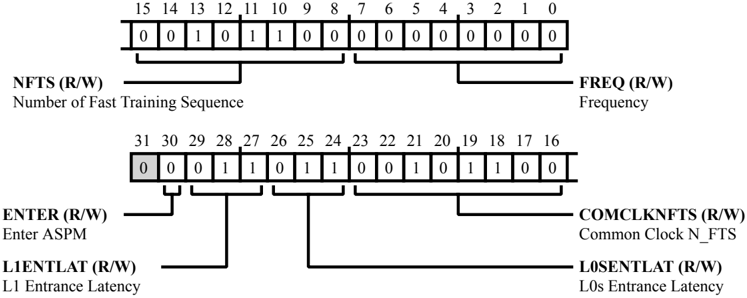

Table 29-19: PCIE\_ACK\_ASPMCTL\_[n] Register Fields

| Bit No. (Access)   | Bit Name   | Description/Enumeration                                                                                                                                                                                                                                                                                   | Description/Enumeration                                                                                                                                                                                                                                                                                   |
|--------------------|------------|-----------------------------------------------------------------------------------------------------------------------------------------------------------------------------------------------------------------------------------------------------------------------------------------------------------|-----------------------------------------------------------------------------------------------------------------------------------------------------------------------------------------------------------------------------------------------------------------------------------------------------------|
| 30 (R/W)           | ENTER      | Enter ASPM. The PCIE_ACK_ASPMCTL_[n].ENTER bit allows the core to enter ASPM L1 even when link partner did not go to L0s (receive is not in L0s). When cleared (=0), the core goes to ASPM L1 only after an idle period during which both receive and transmit are in L0s. This register field is sticky. | Enter ASPM. The PCIE_ACK_ASPMCTL_[n].ENTER bit allows the core to enter ASPM L1 even when link partner did not go to L0s (receive is not in L0s). When cleared (=0), the core goes to ASPM L1 only after an idle period during which both receive and transmit are in L0s. This register field is sticky. |
| 29:27 (R/W)        | L1ENTLAT   | L1 Entrance Latency. The PCIE_ACK_ASPMCTL_[n].L1ENTLAT bit field specifies the L1 Entrance Latency. Programming this timer with a value greater that 32 us has no effect unless extended sync is used, or all of the credits are infinite. This register field is sticky.                                 | L1 Entrance Latency. The PCIE_ACK_ASPMCTL_[n].L1ENTLAT bit field specifies the L1 Entrance Latency. Programming this timer with a value greater that 32 us has no effect unless extended sync is used, or all of the credits are infinite. This register field is sticky.                                 |
|                    |            | 0                                                                                                                                                                                                                                                                                                         | 1 us                                                                                                                                                                                                                                                                                                      |
|                    |            | 1                                                                                                                                                                                                                                                                                                         | 2 us                                                                                                                                                                                                                                                                                                      |
|                    |            | 2                                                                                                                                                                                                                                                                                                         | 4 us                                                                                                                                                                                                                                                                                                      |
|                    |            | 3                                                                                                                                                                                                                                                                                                         | 8 us                                                                                                                                                                                                                                                                                                      |
|                    |            | 4                                                                                                                                                                                                                                                                                                         | 16 us                                                                                                                                                                                                                                                                                                     |
|                    |            | 5                                                                                                                                                                                                                                                                                                         | 32 us                                                                                                                                                                                                                                                                                                     |
|                    |            | 6                                                                                                                                                                                                                                                                                                         | 64 us                                                                                                                                                                                                                                                                                                     |
|                    |            | 7                                                                                                                                                                                                                                                                                                         | 64 us                                                                                                                                                                                                                                                                                                     |

Table 29-19: PCIE\_ACK\_ASPMCTL\_[n] Register Fields (Continued)

| Bit No. (Access)       | Bit Name        | Description/Enumeration                                                                                                                                                                                                                                                                                                                                                                                                                                                                                                                                                                                                                                                                                                                                                                                                                                                                                                                                                                                                                                                                                                                                                    |
|------------------------|-----------------|----------------------------------------------------------------------------------------------------------------------------------------------------------------------------------------------------------------------------------------------------------------------------------------------------------------------------------------------------------------------------------------------------------------------------------------------------------------------------------------------------------------------------------------------------------------------------------------------------------------------------------------------------------------------------------------------------------------------------------------------------------------------------------------------------------------------------------------------------------------------------------------------------------------------------------------------------------------------------------------------------------------------------------------------------------------------------------------------------------------------------------------------------------------------------|
| 26:24 (R/W)            | L0SENTLAT       | L0s Entrance Latency. The PCIE_ACK_ASPMCTL_[n].L0SENTLAT bit field specifies the L0s entrance latency. This register field is sticky.                                                                                                                                                                                                                                                                                                                                                                                                                                                                                                                                                                                                                                                                                                                                                                                                                                                                                                                                                                                                                                      |
| 23:16 (R/W) 15:8 (R/W) | COMCLKNFTS NFTS | Common Clock N_FTS. The PCIE_ACK_ASPMCTL_[n].COMCLKNFTS bit field specifies the number of Fast Training Sequence ordered sets transmitted when transitioning from L0s to L0 when a common clock is used. The maximum number of FTS ordered-sets that a component can request is 255. This field is only writable (sticky) when all of the fol- lowing configuration parameter equations are true: • CX_NFTS !=CX_COMM_NFTS • DEFAULT_L0S_EXIT_LATENCY !=DEFAULT_COMM_L0S_EXIT_LATEN- CY • DEFAULT_L1_EXIT_LATENCY !=DEFAULT_COMM_L1_EXIT_LATENCY The core does not support a value of zero; a value of zero can cause the LTSSM to go into the recovery state when exiting from L0s. The access attributes of this field are as follows: • Wire: R • Dbi: R • Dbi2: R Number of Fast Training Sequence. The PCIE_ACK_ASPMCTL_[n].NFTS bit field specifies the number of Fast Training Sequence ordered sets transmitted when transitioning from L0s to L0. The maximum number of FTS ordered-sets that a component can request is 255. The core does not support a value of zero; a value of zero can cause the LTSSM to go into the recovery state when exiting from L0s. |

Table 29-19: PCIE\_ACK\_ASPMCTL\_[n] Register Fields (Continued)

| Bit No. (Access)   | Bit Name   | Description/Enumeration                                                                                                                                                                                                                                                                                                                                            |
|--------------------|------------|--------------------------------------------------------------------------------------------------------------------------------------------------------------------------------------------------------------------------------------------------------------------------------------------------------------------------------------------------------------------|
| 7:0 (R/W)          | FREQ       | Frequency. The PCIE_ACK_ASPMCTL_[n].FREQ bit field specifies the number of pending Acks the core accumulates (up to 255) before sending an Ack DLLP. Zero indicates that this Ack frequency control feature is turned off and that the core accumulates 255 received TLPs before sending an Ack DLLP. Other values indicate that the core Acks every received TLP. |

## Acknowledge Latency Timer and Replay Timer Register

The PCIE\_ACK\_TMR\_[n] register controls Ack latency timer limits and replay timer limits.

Figure 29-11: PCIE\_ACK\_TMR\_[n] Register Diagram

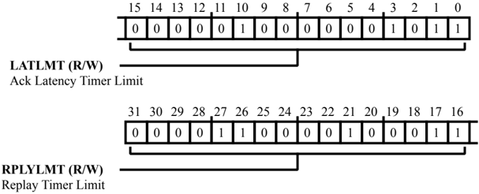

Table 29-20: PCIE\_ACK\_TMR\_[n] Register Fields

| Bit No. (Access)   | Bit Name   | Description/Enumeration                                                                                                                                                                                                                                                                                                                                                                                                                                                                                                                                                                 |
|--------------------|------------|-----------------------------------------------------------------------------------------------------------------------------------------------------------------------------------------------------------------------------------------------------------------------------------------------------------------------------------------------------------------------------------------------------------------------------------------------------------------------------------------------------------------------------------------------------------------------------------------|
| 31:16 (R/W)        | RPLYLMT    | Replay Timer Limit. The PCIE_ACK_TMR_[n].RPLYLMT bit field specifies the replay timer expiration limit. The core initiates a replay on reception of a Nak or when the replay timer ex- pires. For more details, see "Transmit Retry". Programs can modify the effective timer limit with the PCIE_TMRCTL_MFN_[n].RLMT bit field. After reset, the core up- dates the default according to the Negotiated Link Width and Max_Payload_Size. When operating at 5 Gb/s, then an additional 153/CX_NB is added for additional in- ternal processing for received TLPs and transmitted DLLPs. |
| 15:0 (R/W)         | LATLMT     | Ack Latency Timer Limit. The PCIE_ACK_TMR_[n].LATLMT bit field specifies the Ack latency timer expire limit. Programs can modify the effective timer limit with the PCIE_TMRCTL_MFN_[n].RLMT bit field. After reset, the core updates the default according to the Negotiated Link Width and Max_Payload_Size. When operating at 5 Gb/s, an additional 51/CX_NB is added for additional internal processing for received TLPs and transmitted DLLPs.                                                                                                                                    |

## Advanced Error Capabilities and Control Register

The PCIE\_ADVERR\_CAPBCTL\_[n] register controls some ECRC capabilities and their function.

Figure 29-12: PCIE\_ADVERR\_CAPBCTL\_[n] Register Diagram

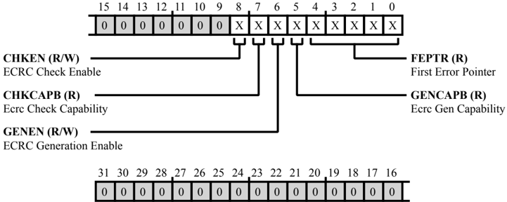

Table 29-21: PCIE\_ADVERR\_CAPBCTL\_[n] Register Fields

| Bit No. (Access)   | Bit Name   | Description/Enumeration                                                                                                                                                                                                       |
|--------------------|------------|-------------------------------------------------------------------------------------------------------------------------------------------------------------------------------------------------------------------------------|
| 8 (R/W)            | CHKEN      | ECRC Check Enable. The PCIE_ADVERR_CAPBCTL_[n].CHKEN bit enables ECRC checking. Func- tions that do not implement the associated mechanism are permitted to set this bit to 0. The default value of this bit is 0 (disabled). |
| 7 (R/NW)           | CHKCAPB    | Ecrc Check Capability. The PCIE_ADVERR_CAPBCTL_[n].CHKCAPB bit indicates that the Function is capable of checking ECRC.                                                                                                       |
| 6 (R/W)            | GENEN      | ECRC Generation Enable. The PCIE_ADVERR_CAPBCTL_[n].GENEN bit enables ECRC. Functions that do not implement the associated mechanism are permitted to hardwire this bit to 0. The default value of this bit is 0 (disabled).  |
| 5 (R/NW)           | GENCAPB    | Ecrc Gen Capability. If set, the PCIE_ADVERR_CAPBCTL_[n].GENCAPB bit indicates that the Func- tion is capable of generating an ECRC.                                                                                          |
| 4:0 (R/NW)         | FEPTR      | First Error Pointer. The PCIE_ADVERR_CAPBCTL_[n].FEPTR bit field identifies the bit position of the first error reported in the PCIE_UNCOR_ERRSTAT_[n] register.                                                              |

## Advanced Error Reporting Extended Capability Header Register

The PCIE\_ADVERR\_EXTCAPB\_[n] register provides optional extended error reporting capability. It implemented by PCI Express device Functions that support advanced error control and reporting.

Figure 29-13: PCIE\_ADVERR\_EXTCAPB\_[n] Register Diagram

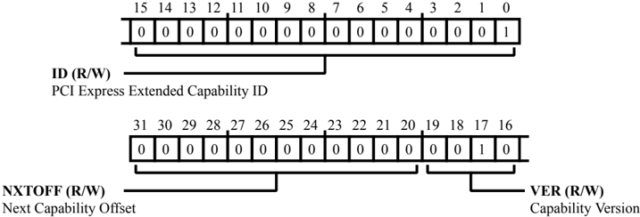

Table 29-22: PCIE\_ADVERR\_EXTCAPB\_[n] Register Fields

| Bit No. (Access)   | Bit Name   | Description/Enumeration                                                                                                                                                                                                                                                                                                                                                                                                                               |
|--------------------|------------|-------------------------------------------------------------------------------------------------------------------------------------------------------------------------------------------------------------------------------------------------------------------------------------------------------------------------------------------------------------------------------------------------------------------------------------------------------|
| 31:20 (R/W)        | NXTOFF     | Next Capability Offset. The PCIE_ADVERR_EXTCAPB_[n].NXTOFF bit field contains the offset to the next PCI Express capability structure or 0x0 if no other items exist in the linked list of capabilities. For extended capabilities implemented in configuration space, this offset is relative to the beginning of PCI compatible configuration space and thus must always be either 0x0 (for terminating list of capabilities) or greater than 0xFF. |
| 19:16 (R/W)        | VER        | Capability Version. The PCIE_ADVERR_EXTCAPB_[n].VER bit field is a PCI-SIG defined version number that indicates the version of the Capability structure present. This field must be 0x2 if the End-End TLP Prefix Supported bit is set and must be 0x1 or 0x2 other- wise.                                                                                                                                                                           |
| 15:0 (R/W)         | ID         | PCI Express Extended Capability ID. The PCIE_ADVERR_EXTCAPB_[n].ID bit field is read-only and reports the PCI-SIG defined ID number that indicates the nature and format of the Extended Ca- pability. The Extended Capability ID for the Advanced Error Reporting Capability is 0x001.                                                                                                                                                               |

## Correctable Error Message Requester ID Register

The PCIE\_APP\_CORERR\_MSG register contains the requester ID of the latest received Correctable Error Message. It is advised to read this register when the PCIE\_APP\_INTSTAT.CORERR bit is set.

Figure 29-14: PCIE\_APP\_CORERR\_MSG Register Diagram


Table 29-23: PCIE\_APP\_CORERR\_MSG Register Fields

| Bit No. (Access)   | Bit Name   | Description/Enumeration                                                                                                         |
|--------------------|------------|---------------------------------------------------------------------------------------------------------------------------------|
| 15:0               | VALUE      | Message ID. The PCIE_APP_CORERR_MSG.VALUE bit field contains the requester ID of the latest received Correctable Error Message. |
| (R/NW)             |            |                                                                                                                                 |

## Application Control Register

The PCIE\_APP\_CTL register contains bits that control various PCIE functions. This register also reports whether interrupts are enabled.

Figure 29-15: PCIE\_APP\_CTL Register Diagram

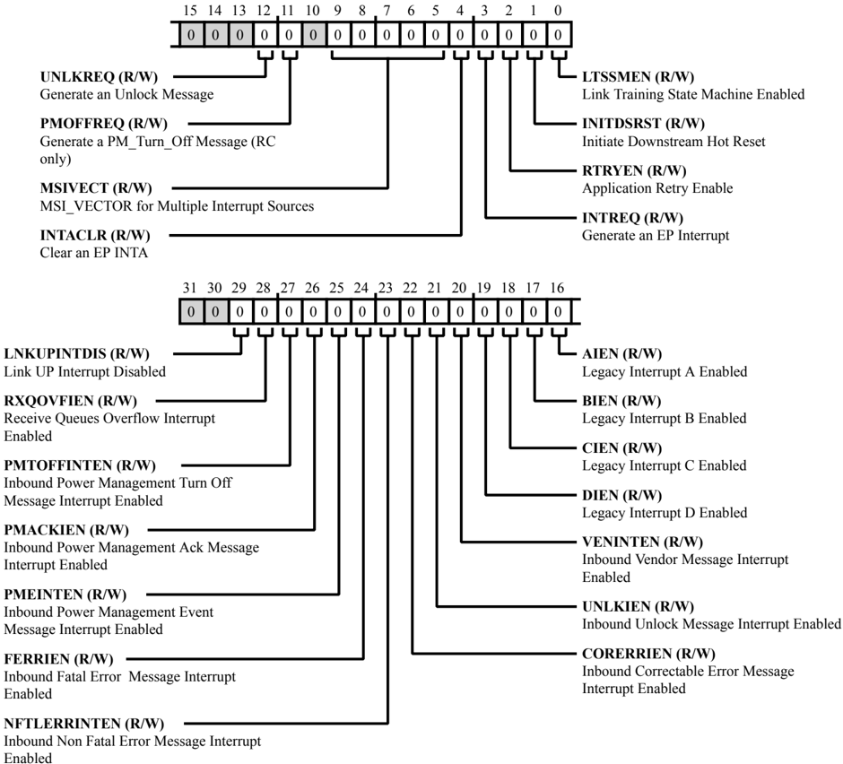

Table 29-24: PCIE\_APP\_CTL Register Fields

| Bit No. (Access)        | Bit Name             | Description/Enumeration                                                                                                                                                                                                    |
|-------------------------|----------------------|----------------------------------------------------------------------------------------------------------------------------------------------------------------------------------------------------------------------------|
| 29 (R/W)                | LNKUPINTDIS          | Link UP Interrupt Disabled. 0 Interrupt Enabled                                                                                                                                                                            |
| 28                      | RXQOVFIEN            | Receive Queues Overflow Interrupt Enabled. 0 Interrupt Disabled                                                                                                                                                            |
| (R/W) 27 (R/W) 26 (R/W) | PMTOFFINTEN PMACKIEN | 1 Interrupt Enabled Inbound Power Management Turn Off Message Interrupt Enabled. 0 Interrupt Disabled 1 Interrupt Enabled Inbound Power Management Ack Message Interrupt Enabled. 0 Interrupt Disabled 1 Interrupt Enabled |
| 25 (R/W)                | PMEINTEN FERRIEN     | Inbound Power Management Event Message Interrupt Enabled. 0 Interrupt Disabled 1 Interrupt Enabled                                                                                                                         |
| 24                      |                      | Inbound Fatal Error Message Interrupt Enabled. 0 Interrupt Disabled                                                                                                                                                        |
| (R/W)                   | NFTLERRINTEN         |                                                                                                                                                                                                                            |
| 23 (R/W)                |                      | 1 Interrupt Enabled                                                                                                                                                                                                        |
|                         |                      | Inbound Non Fatal Error Message Interrupt Enabled. 0 Interrupt Disabled                                                                                                                                                    |
| 22 (R/W)                | CORERRIEN            | 1 Interrupt Enabled                                                                                                                                                                                                        |
| 21                      |                      | Inbound Correctable Error Message Interrupt Enabled. 0 Interrupt Disabled 1 Interrupt Enabled                                                                                                                              |
| (R/W)                   | UNLKIEN              | Inbound Unlock Message Interrupt Enabled. 0 Interrupt Disabled 1 Interrupt Enabled                                                                                                                                         |
| 20                      | VENINTEN             | Inbound Vendor Message Interrupt Enabled.                                                                                                                                                                                  |
| (R/W)                   |                      |                                                                                                                                                                                                                            |
|                         |                      | 0 Interrupt Disabled                                                                                                                                                                                                       |
|                         |                      | 1 Interrupt Enabled                                                                                                                                                                                                        |

Table 29-24: PCIE\_APP\_CTL Register Fields (Continued)

| Bit No. (Access)   | Bit Name   | Description/Enumeration                                                                                                                                                             | Description/Enumeration                                                                                                                                                             |
|--------------------|------------|-------------------------------------------------------------------------------------------------------------------------------------------------------------------------------------|-------------------------------------------------------------------------------------------------------------------------------------------------------------------------------------|
| 19 (R/W)           | DIEN       | Legacy Interrupt DEnabled.                                                                                                                                                          | Legacy Interrupt DEnabled.                                                                                                                                                          |
| 19 (R/W)           | DIEN       | 0                                                                                                                                                                                   | Interrupt Disabled                                                                                                                                                                  |
| 19 (R/W)           | DIEN       | 1                                                                                                                                                                                   | Interrupt Enabled                                                                                                                                                                   |
| 18 (R/W)           | CIEN       | Legacy Interrupt C Enabled.                                                                                                                                                         | Legacy Interrupt C Enabled.                                                                                                                                                         |
| 18 (R/W)           | CIEN       | 0                                                                                                                                                                                   | Interrupt Disabled                                                                                                                                                                  |
| 18 (R/W)           | CIEN       | 1                                                                                                                                                                                   | Interrupt Enabled                                                                                                                                                                   |
| 17 (R/W)           | BIEN       | Legacy Interrupt B Enabled.                                                                                                                                                         | Legacy Interrupt B Enabled.                                                                                                                                                         |
| 17 (R/W)           | BIEN       | 0                                                                                                                                                                                   | Interrupt Disabled                                                                                                                                                                  |
| 17 (R/W)           | BIEN       | 1                                                                                                                                                                                   | Interrupt Enabled                                                                                                                                                                   |
| 16 (R/W)           | AIEN       | Legacy Interrupt A Enabled.                                                                                                                                                         | Legacy Interrupt A Enabled.                                                                                                                                                         |
| 16 (R/W)           | AIEN       | 0                                                                                                                                                                                   | Interrupt Disabled                                                                                                                                                                  |
| 16 (R/W)           | AIEN       | 1                                                                                                                                                                                   | Interrupt Enabled                                                                                                                                                                   |
| 12 (R/W)           | UNLKREQ    | Generate an Unlock Message.                                                                                                                                                         | Generate an Unlock Message.                                                                                                                                                         |
| 11 (R/W)           | PMOFFREQ   | Generate a PM_Turn_Off Message (RC only).                                                                                                                                           | Generate a PM_Turn_Off Message (RC only).                                                                                                                                           |
| 9:5 (R/W)          | MSIVECT    | MSI_VECTOR for Multiple Interrupt Sources.                                                                                                                                          | MSI_VECTOR for Multiple Interrupt Sources.                                                                                                                                          |
| 4 (R/W)            | INTACLR    | Clear an EP INTA.                                                                                                                                                                   | Clear an EP INTA.                                                                                                                                                                   |
| 3 (R/W)            | INTREQ     | Generate an EP Interrupt.                                                                                                                                                           | Generate an EP Interrupt.                                                                                                                                                           |
| 2 (R/W)            | RTRYEN     | Application Retry Enable. The PCIE_APP_CTL.RTRYEN bit determines whether the core completes incom- ing configuration requests with or without a configuration request retry status. | Application Retry Enable. The PCIE_APP_CTL.RTRYEN bit determines whether the core completes incom- ing configuration requests with or without a configuration request retry status. |
| 2 (R/W)            | RTRYEN     | 0                                                                                                                                                                                   | The core completes incoming configuration requests without a configuration request retry status.                                                                                    |
| 2 (R/W)            | RTRYEN     | 1                                                                                                                                                                                   | The core completes incoming configuration requests with a configuration request retry status.                                                                                       |
| 1 (R/W)            | INITDSRST  | Initiate Downstream Hot Reset.                                                                                                                                                      | Initiate Downstream Hot Reset.                                                                                                                                                      |

Table 29-24: PCIE\_APP\_CTL Register Fields (Continued)

| Bit No. (Access)   | Bit Name   | Description/Enumeration                                                                                                   |
|--------------------|------------|---------------------------------------------------------------------------------------------------------------------------|
| 0 (R/W)            | LTSSMEN    | Link Training State Machine Enabled. The PCIE_APP_CTL.LTSSMEN bit reports the state of the link training state ma- chine. |
| 0 (R/W)            |            | 0 The LTSSM is held in the Detect state                                                                                   |
| 0 (R/W)            |            | 1 Core Configuration Registers are initialized                                                                            |

## Diagnostic Control Register

The PCIE\_APP\_DIAGCTL register provides CRC diagnostic message control.

Figure 29-16: PCIE\_APP\_DIAGCTL Register Diagram

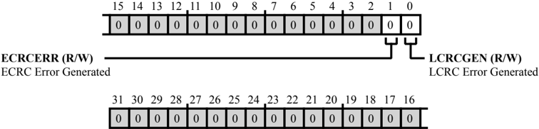

Table 29-25: PCIE\_APP\_DIAGCTL Register Fields

| Bit No. (Access)   | Bit Name   | Description/Enumeration                                                                                                    |
|--------------------|------------|----------------------------------------------------------------------------------------------------------------------------|
| 1 (R/W)            | ECRCERR    | ECRC Error Generated. The PCIE_APP_DIAGCTL.ECRCERR bit enables ECRC error generation. 0 Interrupt not enabled              |
| 0 (R/W)            | LCRCGEN    | LCRC Error Generated. The PCIE_APP_DIAGCTL.LCRCGEN bit enables the LCRC error. 0 Interrupt not enabled 1 Interrupt enabled |

## Diagnostic Status Register

The PCIE\_APP\_DIAGSTAT register reports LCRC and ECRC status.

Figure 29-17: PCIE\_APP\_DIAGSTAT Register Diagram

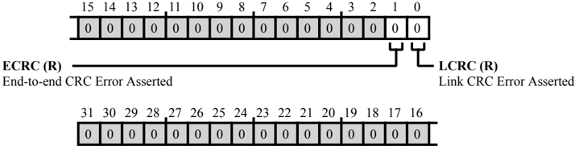

Table 29-26: PCIE\_APP\_DIAGSTAT Register Fields

| Bit No. (Access)   | Bit Name   | Description/Enumeration                                                                       | Description/Enumeration                                                                       |
|--------------------|------------|-----------------------------------------------------------------------------------------------|-----------------------------------------------------------------------------------------------|
| 1 (R/NW)           | ECRC       | End-to-end CRC Error Asserted. The PCIE_APP_DIAGSTAT.ECRC bit reports the status of the ECRC. | End-to-end CRC Error Asserted. The PCIE_APP_DIAGSTAT.ECRC bit reports the status of the ECRC. |
| 1 (R/NW)           | ECRC       | 0                                                                                             | End-to-end CRC is not corrupted                                                               |
| 1 (R/NW)           | ECRC       | 1                                                                                             | End-to-end CRC Error injected by writing 1 to DBGCTL.LCRCERR                                  |
| 0 (R/NW)           | LCRC       | Link CRC Error Asserted. The PCIE_APP_DIAGSTAT.LCRC bit reports the status of the LCRC.       | Link CRC Error Asserted. The PCIE_APP_DIAGSTAT.LCRC bit reports the status of the LCRC.       |
| 0 (R/NW)           | LCRC       | 0                                                                                             | Link CRC is not corrupted                                                                     |
| 0 (R/NW)           | LCRC       | 1                                                                                             | Link CRC Error injected by writing 1 to DBGCTL.LCRCERR                                        |

## Fatal Error Message Requester ID Register

Figure 29-18: PCIE\_APP\_FERR\_MSG Register Diagram


Table 29-27: PCIE\_APP\_FERR\_MSG Register Fields

| Bit No. (Access)   | Bit Name   | Description/Enumeration   |
|--------------------|------------|---------------------------|
| 15:0               | VALUE      | Message ID.               |

## Application Interrupts Status Register

The PCIE\_APP\_INTSTAT register reports the status of various interrupts and messages.

Figure 29-19: PCIE\_APP\_INTSTAT Register Diagram

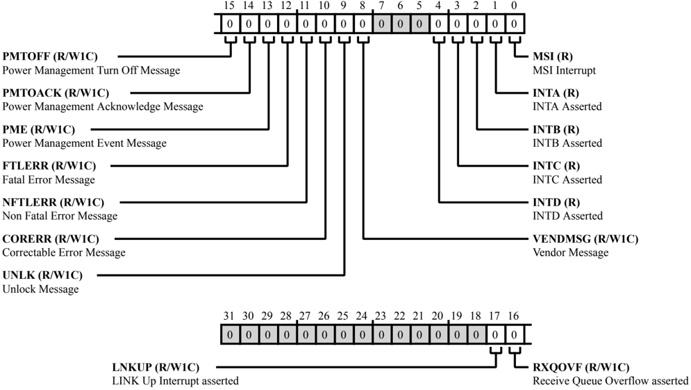

Table 29-28: PCIE\_APP\_INTSTAT Register Fields

| Bit No. (Access)   | Bit Name   | Description/Enumeration                                                                                 |
|--------------------|------------|---------------------------------------------------------------------------------------------------------|
| 17 (R/W1C)         | LNKUP      | LINK Up Interrupt asserted. The PCIE_APP_INTSTAT.LNKUP bit reports the status of the link up interrupt. |
| 17 (R/W1C)         | LNKUP      | 0 Link Up Interrupt was not asserted since the last time this bit was cleared                           |
| 17 (R/W1C)         | LNKUP      | 1 Link Up Interrupt was asserted since the last time this bit cleared                                   |

Table 29-28: PCIE\_APP\_INTSTAT Register Fields (Continued)

| Bit No. (Access)   | Bit Name   | Description/Enumeration                                                                                                                  |
|--------------------|------------|------------------------------------------------------------------------------------------------------------------------------------------|
| 16 (R/W1C)         | RXQOVF     | Receive Queue Overflow asserted. The PCIE_APP_INTSTAT.RXQOVF bit reports the status of the receive queue overflow interrupt.             |
| 16 (R/W1C)         | RXQOVF     | 0 Receive Queue Overflow Interrupt was not asserted since the last time this bit was cleared                                             |
| 16 (R/W1C)         | RXQOVF     | 1 Receive Queue Overflow Interrupt was not asserted since the last time this bit was cleared                                             |
| 15 (R/W1C)         | PMTOFF     | Power Management Turn Off Message. The PCIE_APP_INTSTAT.PMTOFF bit reports the status of the power manage- ment turn off message.        |
| 15 (R/W1C)         | PMTOFF     | 0 No Message                                                                                                                             |
| 15 (R/W1C)         | PMTOFF     | 1 Message Received                                                                                                                       |
| 14 (R/W1C)         | PMTOACK    | Power Management Acknowledge Message. The PCIE_APP_INTSTAT.PMTOACK bit reports the status of the power manage- ment acknowledge message. |
| 14 (R/W1C)         | PMTOACK    | 0 No Message                                                                                                                             |
| 14 (R/W1C)         | PMTOACK    | 1 Message Received                                                                                                                       |
| 13 (R/W1C)         | PME        | Power Management Event Message. The PCIE_APP_INTSTAT.PME bit reports the status of the power management event message.                   |
| 13 (R/W1C)         | PME        | 0 No Message                                                                                                                             |
| 13 (R/W1C)         | PME        | 1 Message Received                                                                                                                       |
| 12 (R/W1C)         | FTLERR     | Fatal Error Message. The PCIE_APP_INTSTAT.FTLERR bit reports the status of the fatal error mes- sage.                                    |
| 12 (R/W1C)         | FTLERR     | 0 No Message                                                                                                                             |
| 12 (R/W1C)         | FTLERR     | 1 Message Received                                                                                                                       |
| 11 (R/W1C)         | NFTLERR    | Non Fatal Error Message. The PCIE_APP_INTSTAT.NFTLERR bit reports the status of the non-fatal error message.                             |
| 11 (R/W1C)         | NFTLERR    | 0 No Message                                                                                                                             |
| 11 (R/W1C)         | NFTLERR    | 1 Message Received                                                                                                                       |

Table 29-28: PCIE\_APP\_INTSTAT Register Fields (Continued)

| Bit No. (Access)   | Bit Name   | Description/Enumeration                                                                                         |
|--------------------|------------|-----------------------------------------------------------------------------------------------------------------|
| 10 (R/W1C)         | CORERR     | Correctable Error Message. The PCIE_APP_INTSTAT.CORERR bit reports the status of the correctable error message. |
| 10 (R/W1C)         | CORERR     | 0 No Message                                                                                                    |
| 10 (R/W1C)         | CORERR     | 1 Message Received                                                                                              |
| 9 (R/W1C)          | UNLK       | Unlock Message. The PCIE_APP_INTSTAT.UNLK bit reports the status of the unlock message.                         |
| 9 (R/W1C)          | UNLK       | 0 No Message                                                                                                    |
| 9 (R/W1C)          | UNLK       | 1 Message Received                                                                                              |
| 8 (R/W1C)          | VENDMSG    | Vendor Message. The PCIE_APP_INTSTAT.VENDMSG bit reports the status of the vendor message.                      |
| 8 (R/W1C)          | VENDMSG    | 0 No Message                                                                                                    |
| 8 (R/W1C)          | VENDMSG    | 1 Message Received                                                                                              |
| 4 (R/NW)           | INTD       | INTD Asserted. The PCIE_APP_INTSTAT.INTD bit reports the status of the legacy Dinterrupt.                       |
| 4 (R/NW)           | INTD       | 0 INTD De-asserted                                                                                              |
| 4 (R/NW)           | INTD       | 1 INTD Asserted                                                                                                 |
| 3 (R/NW)           | INTC       | INTC Asserted. The PCIE_APP_INTSTAT.INTC bit reports the status of the legacy C interrupt.                      |
| 3 (R/NW)           | INTC       | 0 INTC De-asserted                                                                                              |
| 3 (R/NW)           | INTC       | 1 INTC Asserted                                                                                                 |
| 2 (R/NW)           | INTB       | INTB Asserted. The PCIE_APP_INTSTAT.INTB bit reports the status of the legacy B interrupt.                      |
| 2 (R/NW)           | INTB       | 0 INTB De-asserted                                                                                              |
| 2 (R/NW)           | INTB       | 1 INTB Asserted                                                                                                 |
| 1 (R/NW)           | INTA       | INTA Asserted. The PCIE_APP_INTSTAT.INTA bit reports the status of the legacy A interrupt.                      |
| 1 (R/NW)           | INTA       | 0 INTA De-asserted                                                                                              |
| 1 (R/NW)           | INTA       | 1 INTA Asserted                                                                                                 |

Table 29-28: PCIE\_APP\_INTSTAT Register Fields (Continued)

| Bit No. (Access)   | Bit Name   | Description/Enumeration                                                                             |
|--------------------|------------|-----------------------------------------------------------------------------------------------------|
| 0 (R/NW)           | MSI        | MSI Interrupt. The PCIE_APP_INTSTAT.MSI bit reports the status of the message signaled inter- rupt. |

## Non Fatal Error Message Requester ID Register

The PCIE\_APP\_NFERR\_MSG register contains the requester ID of the latest received Non Fatal Error Message. It is advised to read this register when the PCIE\_APP\_INTSTAT.NFTLERR bit in APP\_INTSTAT register is set.

Figure 29-20: PCIE\_APP\_NFERR\_MSG Register Diagram


Table 29-29: PCIE\_APP\_NFERR\_MSG Register Fields

| Bit No. (Access)   | Bit Name   | Description/Enumeration                                                                                                        |
|--------------------|------------|--------------------------------------------------------------------------------------------------------------------------------|
| 15:0               | VALUE      | Message ID. The PCIE_APP_NFERR_MSG.VALUE bit field contains the requester ID of the lat- est received Non Fatal Error Message. |
| (R/NW)             |            |                                                                                                                                |

## Power Management Acknowledge Message Requester ID Register

Figure 29-21: PCIE\_APP\_PMACK\_MSG Register Diagram

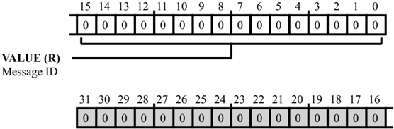

Table 29-30: PCIE\_APP\_PMACK\_MSG Register Fields

| Bit No. (Access)   | Bit Name   | Description/Enumeration   |
|--------------------|------------|---------------------------|
| 15:0               | VALUE      | Message ID.               |

## Power Management Event Message Requester ID Register

The PCIE\_APP\_PMEVT\_MSG register contains the requester ID of the latest received Power Management Event Message. It is advised to read this register when the PME bit in PCIE\_APP\_INTSTAT.PME register is set.

Figure 29-22: PCIE\_APP\_PMEVT\_MSG Register Diagram


Table 29-31: PCIE\_APP\_PMEVT\_MSG Register Fields

| Bit No. (Access)   | Bit Name   | Description/Enumeration                                                                                                               |
|--------------------|------------|---------------------------------------------------------------------------------------------------------------------------------------|
| 15:0               | VALUE      | Message ID. The PCIE_APP_PMEVT_MSG.VALUE bit field contains the requester ID of the lat- est received Power Management Event Message. |
| (R/NW)             |            |                                                                                                                                       |

## Power Management Turn Off Message Requester ID Register

The PCIE\_APP\_PMTOFF\_MSG register contains the requester ID of the latest received Power Management T urn Off Message. It is advised to read this register when the PCIE\_APP\_INTSTAT.PMTOFF bit is set.

Figure 29-23: PCIE\_APP\_PMTOFF\_MSG Register Diagram


Table 29-32: PCIE\_APP\_PMTOFF\_MSG Register Fields

| Bit No. (Access)   | Bit Name   | Description/Enumeration                                                                                                                 |
|--------------------|------------|-----------------------------------------------------------------------------------------------------------------------------------------|
| 15:0               | VALUE      | Message ID. The PCIE_APP_PMTOFF_MSG.VALUE bit field contains the requester ID of the latest received Power Management Turn Off Message. |
| (R/NW)             |            |                                                                                                                                         |

## Application Status Register

The PCIE\_APP\_STAT register provides information about various application states.

Figure 29-24: PCIE\_APP\_STAT Register Diagram

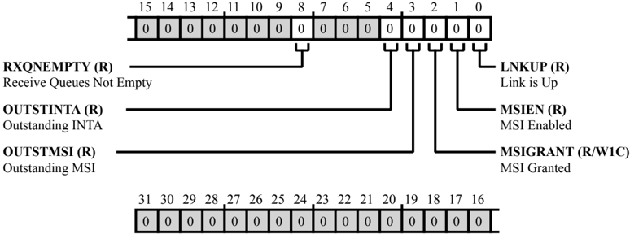

Table 29-33: PCIE\_APP\_STAT Register Fields

| Bit No. (Access)   | Bit Name   | Description/Enumeration   | Description/Enumeration                                       |
|--------------------|------------|---------------------------|---------------------------------------------------------------|
| 8                  | RXQNEMPTY  | Receive Queues Not Empty. | Receive Queues Not Empty.                                     |
| (R/NW)             |            | 0                         | Receive Queues Empty                                          |
|                    |            | 1                         | Receive Queues Not Empty                                      |
| 4                  | OUTSTINTA  | Outstanding INTA.         | Outstanding INTA.                                             |
| (R/NW)             |            | 0                         | No outstanding INTA Request                                   |
|                    |            | 1                         | Outstanding INTA Request                                      |
| 3                  | OUTSTMSI   | Outstanding MSI.          | Outstanding MSI.                                              |
| (R/NW)             |            | 0                         | No outstanding MSI Request                                    |
|                    |            | 1                         | Outstanding MSI Request                                       |
| 2                  | MSIGRANT   | MSI Granted.              | MSI Granted.                                                  |
| (R/W1C)            |            | 0                         | The PCIe_DM_CORE has not accepted the request to send an MSI. |
|                    |            | 1                         | The PCIe_DM_CORE has accepted the request to send an MSI.     |
| 1                  | MSIEN      | MSI Enabled.              | MSI Enabled.                                                  |
| (R/NW)             |            | 0                         | MSI is Disabled / INTx message may be sent                    |
|                    |            | 1                         | MSI is Enabled / INTx message is not sent                     |

Table 29-33: PCIE\_APP\_STAT Register Fields (Continued)

| Bit No. (Access)   | Bit Name   | Description/Enumeration   |
|--------------------|------------|---------------------------|
| 0                  | LNKUP      | Link is Up.               |
| (R/NW)             |            | 0 Link is Down            |
|                    |            | 1 Link is Up              |

## Unlock Message Requester ID Register

The PCIE\_APP\_UNLK\_MSG register contains the ID of the Requestor to generate an Unlock message.

Figure 29-25: PCIE\_APP\_UNLK\_MSG Register Diagram


Table 29-34: PCIE\_APP\_UNLK\_MSG Register Fields

| Bit No. (Access)   | Bit Name   | Description/Enumeration   |
|--------------------|------------|---------------------------|
| 15:0               | VALUE      | Message ID.               |
| (R/NW)             |            |                           |

## Vendor Message Requester ID Register

Figure 29-26: PCIE\_APP\_VNDR\_MSG Register Diagram

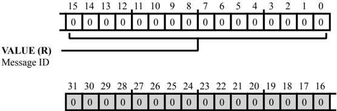

Table 29-35: PCIE\_APP\_VNDR\_MSG Register Fields

| Bit No. (Access)   | Bit Name   | Description/Enumeration   |
|--------------------|------------|---------------------------|
| 15:0               | VALUE      | Message ID.               |

## Vendor Message Header Bytes 8 to 11 Register

The PCIE\_APP\_VNDR\_MSG\_HDR0 register contains the 4th double word of the latest received Vendor Message header. It is advised to read this register when the PCIE\_APP\_INTSTAT.VENDMSG bit is set.

Figure 29-27: PCIE\_APP\_VNDR\_MSG\_HDR0 Register Diagram

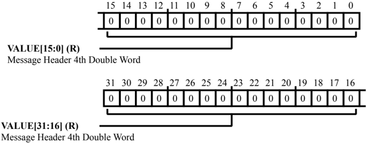

Table 29-36: PCIE\_APP\_VNDR\_MSG\_HDR0 Register Fields

| Bit No. (Access)   | Bit Name   | Description/Enumeration                                                                                                                               |
|--------------------|------------|-------------------------------------------------------------------------------------------------------------------------------------------------------|
| 31:0 (R/NW)        | VALUE      | Message Header 4th Double Word. The PCIE_APP_VNDR_MSG_HDR0.VALUE bit field contains the 4th double word of the latest received Vendor Message header. |

## Vendor Message Header Bytes 12 to 15 Register

The PCIE\_APP\_VNDR\_MSG\_HDR1 register contains the 5th double word of the latest received Vendor Message header. It is advised to read this register when the PCIE\_APP\_INTSTAT.VENDMSG bit is set.

Figure 29-28: PCIE\_APP\_VNDR\_MSG\_HDR1 Register Diagram


Table 29-37: PCIE\_APP\_VNDR\_MSG\_HDR1 Register Fields

| Bit No. (Access)   | Bit Name   | Description/Enumeration   |
|--------------------|------------|---------------------------|
| 31:0               | VALUE      | Message Header 3rd DW.    |
| (R/NW)             |            |                           |

## Auxiliary Clock Frequency Control Register

The PCIE\_AUX\_CLKFREQ\_[n] register is used to provide a 1 us reference for counting time during low-power states with aux\_clk when the PHY has removed the pipe\_clk.

Figure 29-29: PCIE\_AUX\_CLKFREQ\_[n] Register Diagram

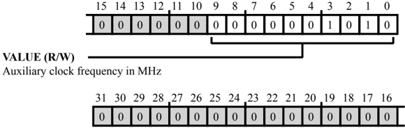

Table 29-38: PCIE\_AUX\_CLKFREQ\_[n] Register Fields

| Bit No. (Access)   | Bit Name   | Description/Enumeration                                                                                                                                                                                                                                                                                                                                                                                                                                                                                                                                                                                                                                                                                                                                                                                   |
|--------------------|------------|-----------------------------------------------------------------------------------------------------------------------------------------------------------------------------------------------------------------------------------------------------------------------------------------------------------------------------------------------------------------------------------------------------------------------------------------------------------------------------------------------------------------------------------------------------------------------------------------------------------------------------------------------------------------------------------------------------------------------------------------------------------------------------------------------------------|
| 9:0 (R/W)          | VALUE      | Auxiliary clock frequency in MHz. The PCIE_AUX_CLKFREQ_[n].VALUE bit field is used to provide a 1 us refer- ence for counting time during low-power states with aux_clk when the PHY has re- moved the pipe_clk. Frequencies lower than 1 MHz are possible but with a loss of ac- curacy in the time counted. If the actual frequency (f ) of aux_clk does not exactly match the programmed frequen- cy (f_prog), then an error in the time counted by the core that can be expressed in percentage as: err% = (f_prog/f-1)*100. For example if f=2.5 MHz and f_prog=3 MHz, then err% =(3/2.5-1)*100 =20%, meaning that the time counted by the core on aux_clk will be 20% greater than the time in us programmed in the corresponding time register (for example T_POWER_ON). This bit field is sticky. |

## Peripheral and SCB Bridge Slave Error Response Register

The PCIE\_BERR\_RESP\_[n] register controls the mapping of errors for received inbound completions (of nonposted requests), and the Slave Port response to the SCB master.

Figure 29-30: PCIE\_BERR\_RESP\_[n] Register Diagram

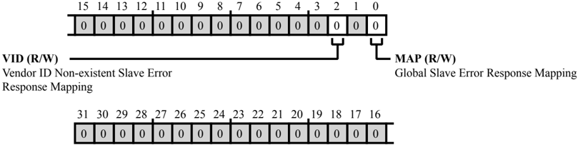

Table 29-39: PCIE\_BERR\_RESP\_[n] Register Fields

| Bit No. (Access)   | Bit Name   | Description/Enumeration                                                                                                                                                                                                                                                                                                                                      | Description/Enumeration                                                                                                                                                                                                                                                                                                                                      |
|--------------------|------------|--------------------------------------------------------------------------------------------------------------------------------------------------------------------------------------------------------------------------------------------------------------------------------------------------------------------------------------------------------------|--------------------------------------------------------------------------------------------------------------------------------------------------------------------------------------------------------------------------------------------------------------------------------------------------------------------------------------------------------------|
| 2 (R/W)            | VID        | Vendor ID Non-existent Slave Error Response Mapping. Vendor ID Non-existent Slave Error Response Mapping. The PCIE_BERR_RESP_[n].VID bit determines the peripheral/SCB slave response for errors on reads to non-existent Vendor ID register. The core ignores the setting in the bit when bit 0 of this register is 0. Note: This register field is sticky. | Vendor ID Non-existent Slave Error Response Mapping. Vendor ID Non-existent Slave Error Response Mapping. The PCIE_BERR_RESP_[n].VID bit determines the peripheral/SCB slave response for errors on reads to non-existent Vendor ID register. The core ignores the setting in the bit when bit 0 of this register is 0. Note: This register field is sticky. |
| 2 (R/W)            | VID        | 0                                                                                                                                                                                                                                                                                                                                                            | OKAY (with FFFF data for non-posted requests)                                                                                                                                                                                                                                                                                                                |
| 2 (R/W)            | VID        | 1                                                                                                                                                                                                                                                                                                                                                            | Error                                                                                                                                                                                                                                                                                                                                                        |
| 0 (R/W)            | MAP        | Global Slave Error Response Mapping.                                                                                                                                                                                                                                                                                                                         | Global Slave Error Response Mapping.                                                                                                                                                                                                                                                                                                                         |
| 0 (R/W)            | MAP        | 0                                                                                                                                                                                                                                                                                                                                                            | OKAY (with FFFF data for non-posted requests) and ig- nore the settings in bit [3:2] of this register                                                                                                                                                                                                                                                        |
| 0 (R/W)            | MAP        | 1                                                                                                                                                                                                                                                                                                                                                            | ERROR for normal link (data) accesses and Error for normal link data accesses and look at bits [3:2] for other scenarios                                                                                                                                                                                                                                     |

## Bus Order Manager Watchdog Off Register

The PCIE\_BUSMGR\_WDOG\_[n] register contains the initial load value for the bus ordering manager watchdog timer. It has a resolution of 2 us.

The bridge dequeue controller checks (per VC) that there are no outstanding posted transactions on the bus master interface before it takes a completion from the native core receive queue; to prevent violation of rule (5). If necessary it will halt the completion queue and start the watchdog timer.

Figure 29-31: PCIE\_BUSMGR\_WDOG\_[n] Register Diagram

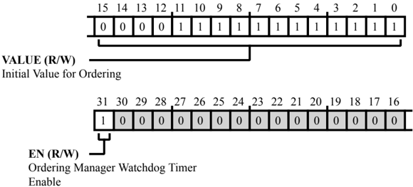

Table 29-40: PCIE\_BUSMGR\_WDOG\_[n] Register Fields

| Bit No. (Access)   | Bit Name   | Description/Enumeration                                                                                                                                                                                                                                   |
|--------------------|------------|-----------------------------------------------------------------------------------------------------------------------------------------------------------------------------------------------------------------------------------------------------------|
| 31 (R/W)           | EN         | Ordering Manager Watchdog Timer Enable. The PCIE_BUSMGR_WDOG_[n].EN bit enables (if set =1) the bus ordering man- ager watchdog timer.                                                                                                                    |
| 15:0 (R/W)         | VALUE      | Initial Value for Ordering. The PCIE_BUSMGR_WDOG_[n].VALUE bit field contains the initial load value for the bus ordering manager watchdog timer. It has a resolution of 2 us. Valid write range values are 1 = 2us, 2 = 4us, 3 = 6us ... 65536 = ~131ms. |

## Bus Multiple Outbound Decomposition SubReq Control Register

The PCIE\_BUS\_MULOB\_DECOMP\_[n] register controls whether multiple outstanding non-posted requests that were derived from decomposition of an outbound memory bus request can occur.

Figure 29-32: PCIE\_BUS\_MULOB\_DECOMP\_[n] Register Diagram

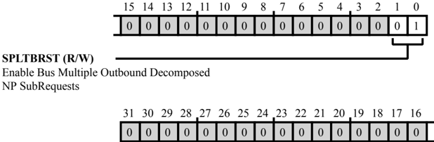

Table 29-41: PCIE\_BUS\_MULOB\_DECOMP\_[n] Register Fields

| Bit No. (Access)   | Bit Name   | Description/Enumeration                                                                                                                                                                                                                                                                                                                                                                                                                                                                                                                                           |
|--------------------|------------|-------------------------------------------------------------------------------------------------------------------------------------------------------------------------------------------------------------------------------------------------------------------------------------------------------------------------------------------------------------------------------------------------------------------------------------------------------------------------------------------------------------------------------------------------------------------|
| 1:0 (R/W)          | SPLTBRST   | Enable Bus Multiple Outbound Decomposed NP SubRequests. When the PCIE_BUS_MULOB_DECOMP_[n].SPLTBRST bit is cleared (=0), the possibility of having multiple outstanding non-posted requests that were derived from decomposition of an outbound memory bus request is disabled. You should not clear this register unless your application master is requesting an amount of read data greater than Max_Read_Request_Size, and the remote device (or switch) is reordering com- pletions that have different tags <br><i>Note</i>: This register field is sticky. |

## ACE Cache Coherency Control Register 1

The PCIE\_CACHE\_CTL1\_[n] register sets the memory type for the lower and upper parts of the address space and contains bits [31:0] of dword-aligned address of the boundary for memory type.

Figure 29-33: PCIE\_CACHE\_CTL1\_[n] Register Diagram

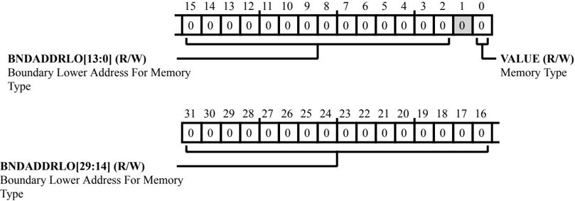

Table 29-42: PCIE\_CACHE\_CTL1\_[n] Register Fields

| Bit No. (Access)   | Bit Name   | Description/Enumeration                                                                                                                                                                                                                                                                                                                                                                                                              |
|--------------------|------------|--------------------------------------------------------------------------------------------------------------------------------------------------------------------------------------------------------------------------------------------------------------------------------------------------------------------------------------------------------------------------------------------------------------------------------------|
| 31:2 (R/W)         | BNDADDRLO  | Boundary Lower Address For Memory Type. The PCIE_CACHE_CTL1_[n].BNDADDRLO bit field contains bits [31:0] of dword-aligned address of the boundary for Memory type. The two lower address LSBs are 0. Addresses up to but not including this value are in the lower address space re- gion; addresses equal or greater than this value are in the upper address space region. This PCIE_CACHE_CTL1_[n].BNDADDRLO bit field is sticky. |
| 0 (R/W)            | VALUE      | Memory Type. The PCIE_CACHE_CTL1_[n].VALUE bit sets the memory type for the lower and upper parts of the address space. The PCIE_CACHE_CTL1_[n].VALUE bit is sticky. 0 lower = Peripheral, upper = Memory                                                                                                                                                                                                                            |
| 0 (R/W)            | VALUE      | 1 lower = Memory type, upper = Peripheral                                                                                                                                                                                                                                                                                                                                                                                            |
| 0 (R/W)            | VALUE      |                                                                                                                                                                                                                                                                                                                                                                                                                                      |

## ACE Cache Coherency Control Register 3

The PCIE\_CACHE\_CTL3\_[n] register defines cache signal behavior and identifies cache signal values.

Figure 29-34: PCIE\_CACHE\_CTL3\_[n] Register Diagram

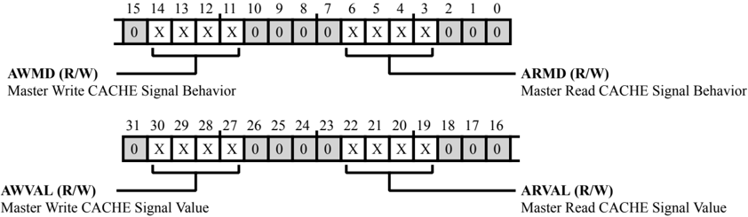

Table 29-43: PCIE\_CACHE\_CTL3\_[n] Register Fields

| Bit No. (Access)   | Bit Name   | Description/Enumeration                                                                                                                                                                                                                                                                                                     | Description/Enumeration                                                                                                                                                                                                                                                                                                     |
|--------------------|------------|-----------------------------------------------------------------------------------------------------------------------------------------------------------------------------------------------------------------------------------------------------------------------------------------------------------------------------|-----------------------------------------------------------------------------------------------------------------------------------------------------------------------------------------------------------------------------------------------------------------------------------------------------------------------------|
| 30:27 (R/W)        | AWVAL      | Master Write CACHE Signal Value. The PCIE_CACHE_CTL3_[n].AWVAL bit field is the value of the individual bits in mstr_awcache when CFG_MSTR_AWCACHE_MODE is 1. This is not applicable to message requests; for message requests the value of mstr_awcache is always 0000. The PCIE_CACHE_CTL3_[n].AWVAL bit field is sticky. | Master Write CACHE Signal Value. The PCIE_CACHE_CTL3_[n].AWVAL bit field is the value of the individual bits in mstr_awcache when CFG_MSTR_AWCACHE_MODE is 1. This is not applicable to message requests; for message requests the value of mstr_awcache is always 0000. The PCIE_CACHE_CTL3_[n].AWVAL bit field is sticky. |
| 22:19 (R/W)        | ARVAL      | Master Read CACHE Signal Value. The PCIE_CACHE_CTL3_[n].ARVAL bit field is the value of the individual bits in mstr_arcache when CFG_MSTR_ARCACHE_MODE is 1. The PCIE_CACHE_CTL3_[n].ARVAL bit field is sticky.                                                                                                             | Master Read CACHE Signal Value. The PCIE_CACHE_CTL3_[n].ARVAL bit field is the value of the individual bits in mstr_arcache when CFG_MSTR_ARCACHE_MODE is 1. The PCIE_CACHE_CTL3_[n].ARVAL bit field is sticky.                                                                                                             |
| 14:11 (R/W)        | AWMD       | Master Write CACHE Signal Behavior. The PCIE_CACHE_CTL3_[n].AWMD bit field defines how the individual bits in mstr_awcache are controlled. For message requests the value of mstr_awcache is always 0000 regardless of the value of this bit field. The PCIE_CACHE_CTL3_[n].AWMD bit field is sticky.                       | Master Write CACHE Signal Behavior. The PCIE_CACHE_CTL3_[n].AWMD bit field defines how the individual bits in mstr_awcache are controlled. For message requests the value of mstr_awcache is always 0000 regardless of the value of this bit field. The PCIE_CACHE_CTL3_[n].AWMD bit field is sticky.                       |
| 14:11 (R/W)        | AWMD       | 0                                                                                                                                                                                                                                                                                                                           | Set automatically by the SCB master                                                                                                                                                                                                                                                                                         |
| 14:11 (R/W)        | AWMD       | 1                                                                                                                                                                                                                                                                                                                           | Set automatically by the SCB master                                                                                                                                                                                                                                                                                         |
| 6:3 (R/W)          | ARMD       | Master Read CACHE Signal Behavior. The PCIE_CACHE_CTL3_[n].ARMD bit field defines how the individual bits in mstr_arcache are controlled. The PCIE_CACHE_CTL3_[n].ARMD bit field is sticky.                                                                                                                                 | Master Read CACHE Signal Behavior. The PCIE_CACHE_CTL3_[n].ARMD bit field defines how the individual bits in mstr_arcache are controlled. The PCIE_CACHE_CTL3_[n].ARMD bit field is sticky.                                                                                                                                 |
| 6:3 (R/W)          | ARMD       | 0                                                                                                                                                                                                                                                                                                                           | Set automatically by the SCB master                                                                                                                                                                                                                                                                                         |
| 6:3 (R/W)          | ARMD       | 1                                                                                                                                                                                                                                                                                                                           | Set by the value of the corresponding bit of the CFG_MSTR_ARCACHE_VALUE field                                                                                                                                                                                                                                               |

## PCIe Capabilities, ID, Next Pointer Register

The PCIE\_CAPB\_NPTR\_[n] register configures PCI Express capabilities, identifies the capability structure version number, identifies which MSI/MSI-X vector is used for the interrupt message, and the offset to the next PCI Capability structure Next Pointer.

Figure 29-35: PCIE\_CAPB\_NPTR\_[n] Register Diagram

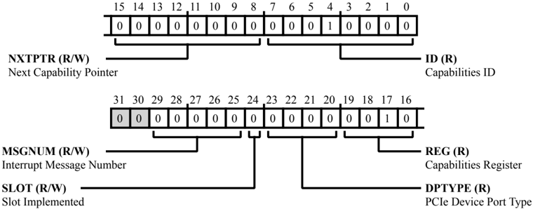

Table 29-44: PCIE\_CAPB\_NPTR\_[n] Register Fields

| Bit No. (Access)   | Bit Name   | Description/Enumeration                                                                                                                                                                                                                                                                                                                                                                                                                                                                                                                                                                                                                                                                                                                                                                                                                                                                                                                                                                                                                                                                                                                                                                                                                                                                                                          |
|--------------------|------------|----------------------------------------------------------------------------------------------------------------------------------------------------------------------------------------------------------------------------------------------------------------------------------------------------------------------------------------------------------------------------------------------------------------------------------------------------------------------------------------------------------------------------------------------------------------------------------------------------------------------------------------------------------------------------------------------------------------------------------------------------------------------------------------------------------------------------------------------------------------------------------------------------------------------------------------------------------------------------------------------------------------------------------------------------------------------------------------------------------------------------------------------------------------------------------------------------------------------------------------------------------------------------------------------------------------------------------|
| 29:25 (R/W)        | MSGNUM     | Interrupt Message Number. The PCIE_CAPB_NPTR_[n].MSGNUM bit field indicates which MSI/MSI-X vec- tor is used for the interrupt message generated in association with any of the status bits of this Capability structure. For MSI, the value in this field indicates the offset between the base Message Data and the interrupt message that is generated. Hardware is required to update this field so that it is correct if the number of MSI Messages assigned to the Function changes when software writes to the Multiple Message Enable field in the MSI Message Con- trol register. For MSI-X, the value in this field indicates which MSI-X Table entry is used to gener- ate the interrupt message. The entry must be one of the first 32 entries even if the Function implements more than 32 entries. For a given MSI-X implementation, the entry must remain constant. If both MSI and MSI-X are implemented, they are permitted to use different vectors, though software is permitted to enable only one mechanism at a time. If MSI-X is ena- bled, the value in this field must indicate the vector for MSI-X. If MSI is enabled or neither is enabled, the value in this field must indicate the vector for MSI. If software enables both MSI and MSI-X at the same time, the value in this field is undefined. |

Table 29-44: PCIE\_CAPB\_NPTR\_[n] Register Fields (Continued)

| Bit No. (Access)   | Bit Name   | Description/Enumeration                                                                                                                                                                                                                                                                                                                                                                                                                                                                                                                                                                                                                                                                                                                                                               | Description/Enumeration                                                                                                                                                                                                                                                                                                                                                                                                                                                                                                                                                                                                                                                                                                                                                               |
|--------------------|------------|---------------------------------------------------------------------------------------------------------------------------------------------------------------------------------------------------------------------------------------------------------------------------------------------------------------------------------------------------------------------------------------------------------------------------------------------------------------------------------------------------------------------------------------------------------------------------------------------------------------------------------------------------------------------------------------------------------------------------------------------------------------------------------------|---------------------------------------------------------------------------------------------------------------------------------------------------------------------------------------------------------------------------------------------------------------------------------------------------------------------------------------------------------------------------------------------------------------------------------------------------------------------------------------------------------------------------------------------------------------------------------------------------------------------------------------------------------------------------------------------------------------------------------------------------------------------------------------|
| 24 (R/W)           | SLOT       | Slot Implemented. When Set, the PCIE_CAPB_NPTR_[n].SLOT bit indicates that the Link associat- ed with this Port is connected to a slot (as compared to being connected to a system- integrated device or being disabled). This bit is valid for Downstream Ports. This bit is undefined for Upstream Ports.                                                                                                                                                                                                                                                                                                                                                                                                                                                                           | Slot Implemented. When Set, the PCIE_CAPB_NPTR_[n].SLOT bit indicates that the Link associat- ed with this Port is connected to a slot (as compared to being connected to a system- integrated device or being disabled). This bit is valid for Downstream Ports. This bit is undefined for Upstream Ports.                                                                                                                                                                                                                                                                                                                                                                                                                                                                           |
| 23:20 (R/NW)       | DPTYPE     | PCIe Device Port Type. The PCIE_CAPB_NPTR_[n].DPTYPE bit field indicates the specific type of this PCI Express Function. Note that different Functions in a multi-Function device can generally be of different types. All encodings not listed are Reserved. *This value is on- ly valid for Functions that implement a Type 0x1 PCI Configuration Space header.                                                                                                                                                                                                                                                                                                                                                                                                                     | PCIe Device Port Type. The PCIE_CAPB_NPTR_[n].DPTYPE bit field indicates the specific type of this PCI Express Function. Note that different Functions in a multi-Function device can generally be of different types. All encodings not listed are Reserved. *This value is on- ly valid for Functions that implement a Type 0x1 PCI Configuration Space header.                                                                                                                                                                                                                                                                                                                                                                                                                     |
| 23:20 (R/NW)       | DPTYPE     | 0                                                                                                                                                                                                                                                                                                                                                                                                                                                                                                                                                                                                                                                                                                                                                                                     | PCI Express Endpoint                                                                                                                                                                                                                                                                                                                                                                                                                                                                                                                                                                                                                                                                                                                                                                  |
| 23:20 (R/NW)       | DPTYPE     | 1                                                                                                                                                                                                                                                                                                                                                                                                                                                                                                                                                                                                                                                                                                                                                                                     | Legacy PCI Express Endpoint                                                                                                                                                                                                                                                                                                                                                                                                                                                                                                                                                                                                                                                                                                                                                           |
| 23:20 (R/NW)       | DPTYPE     | 2                                                                                                                                                                                                                                                                                                                                                                                                                                                                                                                                                                                                                                                                                                                                                                                     | Root Port of PCI Express Root Complex*                                                                                                                                                                                                                                                                                                                                                                                                                                                                                                                                                                                                                                                                                                                                                |
| 23:20 (R/NW)       | DPTYPE     | 3                                                                                                                                                                                                                                                                                                                                                                                                                                                                                                                                                                                                                                                                                                                                                                                     | Upstream Port of PCI Express Switch*                                                                                                                                                                                                                                                                                                                                                                                                                                                                                                                                                                                                                                                                                                                                                  |
| 23:20 (R/NW)       | DPTYPE     | 4                                                                                                                                                                                                                                                                                                                                                                                                                                                                                                                                                                                                                                                                                                                                                                                     | Downstream Port of PCI Express Switch*                                                                                                                                                                                                                                                                                                                                                                                                                                                                                                                                                                                                                                                                                                                                                |
| 23:20 (R/NW)       | DPTYPE     | 5                                                                                                                                                                                                                                                                                                                                                                                                                                                                                                                                                                                                                                                                                                                                                                                     | PCI Express to PCI/PCI-X Bridge*                                                                                                                                                                                                                                                                                                                                                                                                                                                                                                                                                                                                                                                                                                                                                      |
| 23:20 (R/NW)       | DPTYPE     | 6                                                                                                                                                                                                                                                                                                                                                                                                                                                                                                                                                                                                                                                                                                                                                                                     | PCI/PCI-X to PCI Express Bridge*                                                                                                                                                                                                                                                                                                                                                                                                                                                                                                                                                                                                                                                                                                                                                      |
| 23:20 (R/NW)       | DPTYPE     | 7                                                                                                                                                                                                                                                                                                                                                                                                                                                                                                                                                                                                                                                                                                                                                                                     | Root Complex Integrated Endpoint                                                                                                                                                                                                                                                                                                                                                                                                                                                                                                                                                                                                                                                                                                                                                      |
| 23:20 (R/NW)       | DPTYPE     | 8                                                                                                                                                                                                                                                                                                                                                                                                                                                                                                                                                                                                                                                                                                                                                                                     | Root Complex Event Collector                                                                                                                                                                                                                                                                                                                                                                                                                                                                                                                                                                                                                                                                                                                                                          |
| 19:16 (R/NW)       | REG        | Capabilities Register. The PCIE_CAPB_NPTR_[n].REG bit field is read-only field must be set to 0x2.                                                                                                                                                                                                                                                                                                                                                                                                                                                                                                                                                                                                                                                                                    | Capabilities Register. The PCIE_CAPB_NPTR_[n].REG bit field is read-only field must be set to 0x2.                                                                                                                                                                                                                                                                                                                                                                                                                                                                                                                                                                                                                                                                                    |
| 15:8 (R/W)         | NXTPTR     | Next Capability Pointer. The PCIE_CAPB_NPTR_[n].NXTPTR bit field contains the offset to the next PCI Capability structure or 0x0 if no other items exist in the linked list of Capabilities.                                                                                                                                                                                                                                                                                                                                                                                                                                                                                                                                                                                          | Next Capability Pointer. The PCIE_CAPB_NPTR_[n].NXTPTR bit field contains the offset to the next PCI Capability structure or 0x0 if no other items exist in the linked list of Capabilities.                                                                                                                                                                                                                                                                                                                                                                                                                                                                                                                                                                                          |
| 7:0 (R/NW)         | ID         | Capabilities ID. The PCIE_CAPB_NPTR_[n].ID read-only bit indicates PCI-SIG defined PCI Ex- press Capability structure version number. A version of the specification that changes the PCI Express Capability structure in a way that is not otherwise identifiable (e.g., through a new Capability field) is permitted to increment this field. All such changes to the PCI Express Capability structure must be software-compatible. Software must check for Capability Version numbers that are greater than or equal to the highest number defined when the software is written, as Functions reporting any such Capability Version numbers will contain a PCI Express Capability structure that is compatible with that piece of software. Must be hardwired to 0x2 for Functions | Capabilities ID. The PCIE_CAPB_NPTR_[n].ID read-only bit indicates PCI-SIG defined PCI Ex- press Capability structure version number. A version of the specification that changes the PCI Express Capability structure in a way that is not otherwise identifiable (e.g., through a new Capability field) is permitted to increment this field. All such changes to the PCI Express Capability structure must be software-compatible. Software must check for Capability Version numbers that are greater than or equal to the highest number defined when the software is written, as Functions reporting any such Capability Version numbers will contain a PCI Express Capability structure that is compatible with that piece of software. Must be hardwired to 0x2 for Functions |

## Correctable Error Mask Register

The PCIE\_CORERR\_MSK\_[n] register controls reporting of individual correctable errors by this Function to the PCI Express Root Complex via a PCI Express error Message. A masked error (respective bit Set in the mask register) is not reported to the PCI Express Root Complex by this Function. There is a mask bit per error bit in the Correctable Error Status register. Register fields for bits not implemented by the Function are set to 0.

Figure 29-36: PCIE\_CORERR\_MSK\_[n] Register Diagram

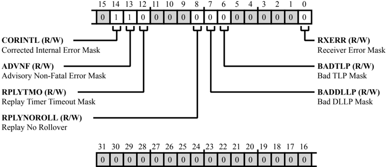

Table 29-45: PCIE\_CORERR\_MSK\_[n] Register Fields

| Bit No. (Access)   | Bit Name   | Description/Enumeration                                                                                                                                                      |
|--------------------|------------|------------------------------------------------------------------------------------------------------------------------------------------------------------------------------|
| 14 (R/W)           | CORINTL    | Corrected Internal Error Mask.                                                                                                                                               |
| 13 (R/W)           | ADVNF      | Advisory Non-Fatal Error Mask. The PCIE_CORERR_MSK_[n].ADVNF bit is set by default to enable compatibility with software that does not comprehend Role-Based Error Reporting |
| 12 (R/W)           | RPLYTMO    | Replay Timer Timeout Mask.                                                                                                                                                   |
| 8 (R/W)            | RPLYNOROLL | Replay No Rollover.                                                                                                                                                          |
| 7 (R/W)            | BADDLLP    | Bad DLLP Mask.                                                                                                                                                               |
| 6 (R/W)            | BADTLP     | Bad TLP Mask.                                                                                                                                                                |
| 0 (R/W)            | RXERR      | Receiver Error Mask.                                                                                                                                                         |

## Correctable Error Status Register

The PCIE\_CORERR\_STAT\_[n] register reports error status of individual correctable error sources on a PCI Express device Function. When an individual error status bit is Set, it indicates that a particular error occurred; software may clear an error status by writing a 1 to the respective bit. Register bits not implemented by the Function are hardwired to 0.

Figure 29-37: PCIE\_CORERR\_STAT\_[n] Register Diagram


Table 29-46: PCIE\_CORERR\_STAT\_[n] Register Fields

| Bit No. (Access)   | Bit Name   | Description/Enumeration          | Description/Enumeration             |
|--------------------|------------|----------------------------------|-------------------------------------|
| 14 (R/W)           | CORINTL    | Corrected Internal Error Status. | Corrected Internal Error Status.    |
| 13 (R/W)           | ADVNF      | Advisory Non Fatal Error Status. | Advisory Non Fatal Error Status.    |
| 12 (R/W)           | RPLYTMO    | Replay Timer Timeout Status.     | Replay Timer Timeout Status.        |
| 8 (R/W)            | RPLYNOROLL | Replay No Rollover Status.       | Replay No Rollover Status.          |
| 7 (R/W)            | BADDLLP    | Bad DLLP Status.                 | Bad DLLP Status.                    |
|                    | BADTLP     | 0 1                              | No error DLLP status error occurred |
| 6 (R/W)            |            | Bad TLP Status.                  | Bad TLP Status.                     |
|                    |            | 0                                | No error                            |
|                    |            | 1                                | TLP error occurred                  |

Table 29-46: PCIE\_CORERR\_STAT\_[n] Register Fields (Continued)

| Bit No. (Access)   | Bit Name   | Description/Enumeration   |
|--------------------|------------|---------------------------|
| 0                  | RXERR      | Receiver Error Status.    |
| (R/W)              |            | 0 No error                |
|                    |            | 1 Receive error occurred  |

## Device Capabilities 2 Register

The PCIE\_DEV\_CAPB2\_[n] register configures and reports the status of various Function types.

Figure 29-38: PCIE\_DEV\_CAPB2\_[n] Register Diagram

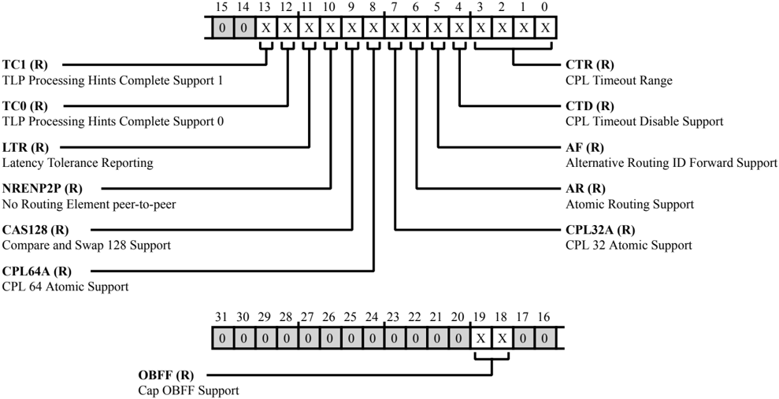

Table 29-47: PCIE\_DEV\_CAPB2\_[n] Register Fields

| Bit No. (Access)   | Bit Name   | Description/Enumeration                                                                                                                                                                                                                                                                                                                                                                                                                                                                                                                                                                                                                                                                                                                                                                                                                                                                                   |
|--------------------|------------|-----------------------------------------------------------------------------------------------------------------------------------------------------------------------------------------------------------------------------------------------------------------------------------------------------------------------------------------------------------------------------------------------------------------------------------------------------------------------------------------------------------------------------------------------------------------------------------------------------------------------------------------------------------------------------------------------------------------------------------------------------------------------------------------------------------------------------------------------------------------------------------------------------------|
| 19:18 (R/NW)       | OBFF       | Cap OBFF Support. The PCIE_DEV_CAPB2_[n].OBFF bit field indicates if OBFF (Optimized Buffer Flush/Fill) is supported and, if so, what signaling mechanism is used. The value report- ed in this field must indicate support for WAKE# signaling only if: • For a Downstream Port, driving the WAKE# signal for OBFF is supported and the connector or component connected Downstream is known to receive that same WAKE# signal • For an Upstream Port, receiving the WAKE# signal for OBFF is supported and, if the component is on an add-in-card, that the component is connected to the WAKE# signal on the connector. Root Ports, Switch Ports, and Endpoints are permitted to implement this capability. For Bridges and Ports that do not implement this capability, this field must be set to 00. 0 Not supported 1 Supported using Message signaling only 2 Supported using WAKE# signaling only |
| 13 (R/NW)          | TC1        | TLP Processing Hints Complete Support 1. The PCIE_DEV_CAPB2_[n].TC1 bit indicates Completer support for TPH or Extended TPH. Applicable only to Root Ports and Endpoints. For all other Functions, this field is Reserved.                                                                                                                                                                                                                                                                                                                                                                                                                                                                                                                                                                                                                                                                                |
| 12 (R/NW)          | TC0        | TLP Processing Hints Complete Support 0. The PCIE_DEV_CAPB2_[n].TC0 bit indicates Completer support for TPH or Extended TPH. Applicable only to Root Ports and Endpoints. For all other Functions, this field is Reserved.                                                                                                                                                                                                                                                                                                                                                                                                                                                                                                                                                                                                                                                                                |
| 11 (R/NW)          | LTR        | Latency Tolerance Reporting. The PCIE_DEV_CAPB2_[n].LTR bit indicates indicates support for the optional Latency Tolerance Reporting (LTR) mechanism. Root Ports, Switches and Endpoints are permitted to implement this capability. For Bridges and other Functions that do not implement this capability, this bit must be set to 0.                                                                                                                                                                                                                                                                                                                                                                                                                                                                                                                                                                    |
| 10 (R/NW)          | NRENP2P    | No Routing Element peer-to-peer. If the PCIE_DEV_CAPB2_[n].NRENP2P bit is set, the routing element never car- ries out the passing that is associated with the Relaxed Ordering Attribute field being Set. This bit applies only for Switches and RCs that support peer-to-peer traffic be- tween Root Ports. The PCIE_DEV_CAPB2_[n].NRENP2P bit applies only to Posted Requests being forwarded through the Switch or Root-Complex and does not apply to traffic originating or terminating within the Switch or Root-Complex itself. All Ports on a Switch or Root-Complex must report the same value for this bit. For all other functions, this bit must be 0.                                                                                                                                                                                                                                        |

Table 29-47: PCIE\_DEV\_CAPB2\_[n] Register Fields (Continued)

| Bit No. (Access)   | Bit Name   | Description/Enumeration                                                                                                                                                                                                                                                                                                                                                                                                                                                  |
|--------------------|------------|--------------------------------------------------------------------------------------------------------------------------------------------------------------------------------------------------------------------------------------------------------------------------------------------------------------------------------------------------------------------------------------------------------------------------------------------------------------------------|
| 9 (R/NW)           | CAS128     | Compare and Swap 128 Support. Applicable to Functions with Memory Space BARs as well as all Root Ports; must be 0 otherwise. The PCIE_DEV_CAPB2_[n].CAS128 bit must be set to 1 if the Func- tion supports this optional capability.                                                                                                                                                                                                                                     |
| 8 (R/NW)           | CPL64A     | CPL 64 Atomic Support. The PCIE_DEV_CAPB2_[n].CPL64A bit applies to Functions with Memory Space BARs as well as all Root Ports; must be 0 otherwise. Includes FetchAdd, Swap, and CAS AtomicOps. This bit must be set to 1 if the Function supports this optional capability.                                                                                                                                                                                            |
| 7 (R/NW)           | CPL32A     | CPL 32 Atomic Support. The PCIE_DEV_CAPB2_[n].CPL32A bit applies to Functions with Memory Space BARs as well as all Root Ports; must be 0 otherwise. Includes FetchAdd, Swap, and CAS AtomicOps. This bit must be set to 1 if the Function supports this optional capability.                                                                                                                                                                                            |
| 6 (R/NW)           | AR         | Atomic Routing Support. The PCIE_DEV_CAPB2_[n].AR bit applies only to Switch Upstream Ports, Switch Downstream Ports, and Root Ports; must be 0 for other Function types. This bit must be set to 1 if the Port supports this optional capability.                                                                                                                                                                                                                       |
| 5 (R/NW)           | AF         | Alternative Routing ID Forward Support. The PCIE_DEV_CAPB2_[n].AF bit applies only to Switch Downstream Ports and Root Ports; must be 0 for other Function types. This bit must be set to 1 if a Switch Downstream Port or Root Port supports this optional capability.                                                                                                                                                                                                  |
| 4 (R/NW)           | CTD        | CPL Timeout Disable Support. A value of 1 in the PCIE_DEV_CAPB2_[n].CTD bit indicates support for the Completion Timeout Disable mechanism. The Completion Timeout Disable mecha- nism is required for Endpoints that issue Requests on their own behalf and PCI Ex- press to PCI/PCI-X Bridges that take ownership of Requests issued on PCI Express. This mechanism is optional for Root Ports. For all other Functions this field is Re- served and must be set to 0. |

Table 29-47: PCIE\_DEV\_CAPB2\_[n] Register Fields (Continued)

| Bit No. (Access)   | Bit Name   | Description/Enumeration                                                                                                                                                                                                                                                                                                                                                                                                                                                                                                                                                                                                                                                                                                                                                                 | Description/Enumeration                                                                                                                                                                                                                                                                                                                                                                                                                                                                                                                                                                                                                                                                                                                                                                 |
|--------------------|------------|-----------------------------------------------------------------------------------------------------------------------------------------------------------------------------------------------------------------------------------------------------------------------------------------------------------------------------------------------------------------------------------------------------------------------------------------------------------------------------------------------------------------------------------------------------------------------------------------------------------------------------------------------------------------------------------------------------------------------------------------------------------------------------------------|-----------------------------------------------------------------------------------------------------------------------------------------------------------------------------------------------------------------------------------------------------------------------------------------------------------------------------------------------------------------------------------------------------------------------------------------------------------------------------------------------------------------------------------------------------------------------------------------------------------------------------------------------------------------------------------------------------------------------------------------------------------------------------------------|
| 3:0 (R/NW)         | CTR        | CPL Timeout Range. The PCIE_DEV_CAPB2_[n].CTR bit field indicates device Function support for the optional Completion Timeout programmability mechanism. This mechanism al- lows system software to modify the Completion Timeout value. This field is applicable only to Root Ports, Endpoints that issue Requests on their own behalf, and PCI Ex- press to PCI/PCI-X Bridges that take ownership of Requests issued on PCI Express. For all other Functions this field is Reserved and must be set to 0000. Four time value ranges are defined: • Range A: 50 s to 10 ms • Range B: 10 ms to 250 ms • Range C: 250 ms to 4 s • Range D: 4 s to 64 s All other values are Reserved. It is strongly recommended that the Completion Time- out mechanism not expire in less than 10 ms. | CPL Timeout Range. The PCIE_DEV_CAPB2_[n].CTR bit field indicates device Function support for the optional Completion Timeout programmability mechanism. This mechanism al- lows system software to modify the Completion Timeout value. This field is applicable only to Root Ports, Endpoints that issue Requests on their own behalf, and PCI Ex- press to PCI/PCI-X Bridges that take ownership of Requests issued on PCI Express. For all other Functions this field is Reserved and must be set to 0000. Four time value ranges are defined: • Range A: 50 s to 10 ms • Range B: 10 ms to 250 ms • Range C: 250 ms to 4 s • Range D: 4 s to 64 s All other values are Reserved. It is strongly recommended that the Completion Time- out mechanism not expire in less than 10 ms. |
|                    |            | 0                                                                                                                                                                                                                                                                                                                                                                                                                                                                                                                                                                                                                                                                                                                                                                                       | Completion Timeout programming not supported the Function must implement a timeout value in the range 50 s to 50 ms                                                                                                                                                                                                                                                                                                                                                                                                                                                                                                                                                                                                                                                                     |
|                    |            | 1                                                                                                                                                                                                                                                                                                                                                                                                                                                                                                                                                                                                                                                                                                                                                                                       | Range A                                                                                                                                                                                                                                                                                                                                                                                                                                                                                                                                                                                                                                                                                                                                                                                 |
|                    |            | 2                                                                                                                                                                                                                                                                                                                                                                                                                                                                                                                                                                                                                                                                                                                                                                                       | Range B                                                                                                                                                                                                                                                                                                                                                                                                                                                                                                                                                                                                                                                                                                                                                                                 |
|                    |            | 3                                                                                                                                                                                                                                                                                                                                                                                                                                                                                                                                                                                                                                                                                                                                                                                       | Ranges A and B                                                                                                                                                                                                                                                                                                                                                                                                                                                                                                                                                                                                                                                                                                                                                                          |
|                    |            | 4                                                                                                                                                                                                                                                                                                                                                                                                                                                                                                                                                                                                                                                                                                                                                                                       | Ranges B and C                                                                                                                                                                                                                                                                                                                                                                                                                                                                                                                                                                                                                                                                                                                                                                          |
|                    |            | 5                                                                                                                                                                                                                                                                                                                                                                                                                                                                                                                                                                                                                                                                                                                                                                                       | Ranges A, B and C                                                                                                                                                                                                                                                                                                                                                                                                                                                                                                                                                                                                                                                                                                                                                                       |
|                    |            | 6                                                                                                                                                                                                                                                                                                                                                                                                                                                                                                                                                                                                                                                                                                                                                                                       | Ranges B, C andD                                                                                                                                                                                                                                                                                                                                                                                                                                                                                                                                                                                                                                                                                                                                                                        |
|                    |            | 7                                                                                                                                                                                                                                                                                                                                                                                                                                                                                                                                                                                                                                                                                                                                                                                       | Ranges A, B, C andD                                                                                                                                                                                                                                                                                                                                                                                                                                                                                                                                                                                                                                                                                                                                                                     |

## Device Control 2 and Status 2 Register

The PCIE\_DEV\_CTLSTAT2\_[n] register configures the Completion Timeout mechanism and allows the Downstream Port to disable its traditional Device Number field.

Figure 29-39: PCIE\_DEV\_CTLSTAT2\_[n] Register Diagram

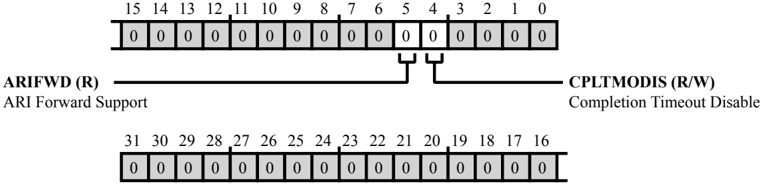

Table 29-48: PCIE\_DEV\_CTLSTAT2\_[n] Register Fields

| Bit No. (Access)   | Bit Name   | Description/Enumeration                                                                                                                                                                                                                                                                                                                                                                    |
|--------------------|------------|--------------------------------------------------------------------------------------------------------------------------------------------------------------------------------------------------------------------------------------------------------------------------------------------------------------------------------------------------------------------------------------------|
| 5 (R/NW)           | ARIFWD     | ARI Forward Support. When the PCIE_DEV_CTLSTAT2_[n].ARIFWD bit is set, the Downstream Port disables its traditional Device Number field = 0 enforcement when turning a Type 1 Configuration Request into a Type 0 Configuration Request. This permits access to Extended Functions in an ARI Device immediately below the Port. Must be set to 0 if the ARI Forwarding Supported bit is 0. |
| 4 (R/W)            | CPLTMODIS  | Completion Timeout Disable. When set, the PCIE_DEV_CTLSTAT2_[n].CPLTMODIS bit disables the Com- pletion Timeout mechanism.                                                                                                                                                                                                                                                                 |

## Device Control and Status Register

The PCIE\_DEV\_CTLSTAT\_[n] register controls PCI Express device specific parameters.

Figure 29-40: PCIE\_DEV\_CTLSTAT\_[n] Register Diagram

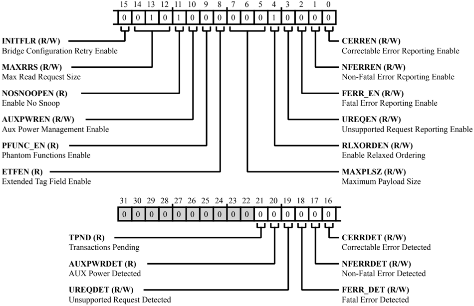

Table 29-49: PCIE\_DEV\_CTLSTAT\_[n] Register Fields

| Bit No. (Access)   | Bit Name   | Description/Enumeration                                                                                                                                                                                                                                                                                                                                                                                                                                                                                                                                                                                                                                                                                                                                                                                                                                                                                                                                                                                                                                                                    |
|--------------------|------------|--------------------------------------------------------------------------------------------------------------------------------------------------------------------------------------------------------------------------------------------------------------------------------------------------------------------------------------------------------------------------------------------------------------------------------------------------------------------------------------------------------------------------------------------------------------------------------------------------------------------------------------------------------------------------------------------------------------------------------------------------------------------------------------------------------------------------------------------------------------------------------------------------------------------------------------------------------------------------------------------------------------------------------------------------------------------------------------------|
| 21 (R/NW)          | TPND       | Transactions Pending. When the PCIE_DEV_CTLSTAT_[n].TPND bit is set for endpoints, it indicates that the Function has issued Non-Posted Requests that have not been completed. A Function reports this bit cleared only when all outstanding Non-Posted Requests have completed or have been terminated by the Completion Timeout mechanism. This bit must also be cleared upon the completion of an FLR. For Root Complex and Switch Ports, when this bit is set, it indicates that a Port has issued Non-Posted Requests on its own behalf (using the Ports own Requester ID) which have not been completed. The Port reports this bit cleared only when all such outstanding Non- Posted Requests have completed or have been terminated by the Completion Timeout mechanism. Note that Root and Switch Ports implementing on- ly the functionality required by this document do not issue Non-Posted Requests on their own behalf, and therefore are not subject to this case. Root and Switch Ports that do not issue Non-Posted Requests on their own behalf hardwire this bit to 0. |
| 20 (R/NW)          | AUXPWRDET  | AUX Power Detected. The PCIE_DEV_CTLSTAT_[n].AUXPWRDET is read-only. Functions that require Aux power report this bit as set if Aux power is detected by the Function.                                                                                                                                                                                                                                                                                                                                                                                                                                                                                                                                                                                                                                                                                                                                                                                                                                                                                                                     |
| 19 (R/W)           | UREQDET    | Unsupported Request Detected. The PCIE_DEV_CTLSTAT_[n].UREQDET bit indicates that the Function re- ceived an Unsupported Request. Errors are logged in this register regardless of whether error reporting is enabled or not in the Device Control register. For a multi-Function device, each Function indicates status of errors as perceived by the respective Function. Default value of this bit is 0.                                                                                                                                                                                                                                                                                                                                                                                                                                                                                                                                                                                                                                                                                |
| 18 (R/W)           | FERR_DET   | Fatal Error Detected. The PCIE_DEV_CTLSTAT_[n].FERR_DET bit indicates status of Fatal errors detected. Errors are logged in this register regardless of whether error reporting is ena- bled or not in the Device Control register. For a multi-Function device, each Function indicates status of errors as perceived by the respective Function. For Functions supporting Advanced Error Handling, errors are logged in this register regardless of the settings of the Uncorrectable Error Mask register. Default value of this bit is 0.                                                                                                                                                                                                                                                                                                                                                                                                                                                                                                                                               |
| 17 (R/W)           | NFERRDET   | Non-Fatal Error Detected. The PCIE_DEV_CTLSTAT_[n].NFERRDET bit indicates status of Nonfatal er- rors detected. Errors are logged in this register regardless of whether error reporting is enabled or not in the Device Control register. For a multi-Function device, each Func- tion indicates status of errors as perceived by the respective Function. For Functions supporting Advanced Error Handling, errors are logged in this register regardless of the settings of the Uncorrectable Error Mask register. Default value of this bit is 0.                                                                                                                                                                                                                                                                                                                                                                                                                                                                                                                                      |

Table 29-49: PCIE\_DEV\_CTLSTAT\_[n] Register Fields (Continued)

| Bit No. (Access)   | Bit Name   | Description/Enumeration                                                                                                                                                                                                                                                                                                                                                                                                                                                                                                                                                                                                                                                                                       | Description/Enumeration                                                                                                                                                                                                                                                                                                                                                                                                                                                                                                                                                                                                                                                                                       |
|--------------------|------------|---------------------------------------------------------------------------------------------------------------------------------------------------------------------------------------------------------------------------------------------------------------------------------------------------------------------------------------------------------------------------------------------------------------------------------------------------------------------------------------------------------------------------------------------------------------------------------------------------------------------------------------------------------------------------------------------------------------|---------------------------------------------------------------------------------------------------------------------------------------------------------------------------------------------------------------------------------------------------------------------------------------------------------------------------------------------------------------------------------------------------------------------------------------------------------------------------------------------------------------------------------------------------------------------------------------------------------------------------------------------------------------------------------------------------------------|
| 16 (R/W)           | CERRDET    | Correctable Error Detected. The PCIE_DEV_CTLSTAT_[n].CERRDET bit indicates status of correctable er- rors detected. Errors are logged in this register regardless of whether error reporting is enabled or not in the Device Control register. For a multi-Function device, each Func- tion indicates status of errors as perceived by the respective Function. For Functions supporting Advanced Error Handling, errors are logged in this register regardless of the settings of the Correctable Error Mask register. Default value of this                                                                                                                                                                 | Correctable Error Detected. The PCIE_DEV_CTLSTAT_[n].CERRDET bit indicates status of correctable er- rors detected. Errors are logged in this register regardless of whether error reporting is enabled or not in the Device Control register. For a multi-Function device, each Func- tion indicates status of errors as perceived by the respective Function. For Functions supporting Advanced Error Handling, errors are logged in this register regardless of the settings of the Correctable Error Mask register. Default value of this                                                                                                                                                                 |
| 15 (R/W)           | INITFLR    | Bridge Configuration Retry Enable.                                                                                                                                                                                                                                                                                                                                                                                                                                                                                                                                                                                                                                                                            | Bridge Configuration Retry Enable.                                                                                                                                                                                                                                                                                                                                                                                                                                                                                                                                                                                                                                                                            |
| 14:12 (R/W)        | MAXRRS     | Max Read Request Size. The PCIE_DEV_CTLSTAT_[n].MAXRRS bit field sets the maximum Read Re- quest size for the Function as a Requester. The Function must not generate Read Re- quests with a size exceeding the set value. Functions that do not generate Read Re- quests larger than 128 bytes and Functions that do not generate Read Requests on their own behalf are permitted to implement this field as Read Only (RO) with a value of 000b. Default value of this field is 010b.                                                                                                                                                                                                                       | Max Read Request Size. The PCIE_DEV_CTLSTAT_[n].MAXRRS bit field sets the maximum Read Re- quest size for the Function as a Requester. The Function must not generate Read Re- quests with a size exceeding the set value. Functions that do not generate Read Re- quests larger than 128 bytes and Functions that do not generate Read Requests on their own behalf are permitted to implement this field as Read Only (RO) with a value of 000b. Default value of this field is 010b.                                                                                                                                                                                                                       |
|                    |            | 0                                                                                                                                                                                                                                                                                                                                                                                                                                                                                                                                                                                                                                                                                                             | 128 bytes maximum Read Request size                                                                                                                                                                                                                                                                                                                                                                                                                                                                                                                                                                                                                                                                           |
|                    |            | 1                                                                                                                                                                                                                                                                                                                                                                                                                                                                                                                                                                                                                                                                                                             | 256 bytes maximum Read Request size                                                                                                                                                                                                                                                                                                                                                                                                                                                                                                                                                                                                                                                                           |
|                    |            | 3                                                                                                                                                                                                                                                                                                                                                                                                                                                                                                                                                                                                                                                                                                             | 1024 bytes maximum Read Request size                                                                                                                                                                                                                                                                                                                                                                                                                                                                                                                                                                                                                                                                          |
|                    |            | 4                                                                                                                                                                                                                                                                                                                                                                                                                                                                                                                                                                                                                                                                                                             | 2048 bytes maximum Read Request size                                                                                                                                                                                                                                                                                                                                                                                                                                                                                                                                                                                                                                                                          |
|                    |            | 5                                                                                                                                                                                                                                                                                                                                                                                                                                                                                                                                                                                                                                                                                                             | 4096 bytes maximum Read Request size                                                                                                                                                                                                                                                                                                                                                                                                                                                                                                                                                                                                                                                                          |
|                    |            | 6                                                                                                                                                                                                                                                                                                                                                                                                                                                                                                                                                                                                                                                                                                             | Reserved                                                                                                                                                                                                                                                                                                                                                                                                                                                                                                                                                                                                                                                                                                      |
|                    |            | 7                                                                                                                                                                                                                                                                                                                                                                                                                                                                                                                                                                                                                                                                                                             | Reserved                                                                                                                                                                                                                                                                                                                                                                                                                                                                                                                                                                                                                                                                                                      |
| 11 (R/NW)          | NOSNOOPEN  | Enable No Snoop. The PCIE_DEV_CTLSTAT_[n].NOSNOOPEN bit allows the Function to Set the No Snoop bit in the Requester Attributes of transactions it initiates that do not require hardware enforced cache coherency. Note that setting this bit to 1 should not cause a Function to set the No Snoop attribute on all transactions that it initiates. Even when the PCIE_DEV_CTLSTAT_[n].NOSNOOPEN bit is set, a Function is only permit- ted to set the No Snoop attribute on a transaction when it can guarantee that the ad- dress of the transaction is not stored in any cache in the system. This bit is permitted to be hardwired to 0 if a Function would never set the No Snoop attribute in transac- | Enable No Snoop. The PCIE_DEV_CTLSTAT_[n].NOSNOOPEN bit allows the Function to Set the No Snoop bit in the Requester Attributes of transactions it initiates that do not require hardware enforced cache coherency. Note that setting this bit to 1 should not cause a Function to set the No Snoop attribute on all transactions that it initiates. Even when the PCIE_DEV_CTLSTAT_[n].NOSNOOPEN bit is set, a Function is only permit- ted to set the No Snoop attribute on a transaction when it can guarantee that the ad- dress of the transaction is not stored in any cache in the system. This bit is permitted to be hardwired to 0 if a Function would never set the No Snoop attribute in transac- |

Table 29-49: PCIE\_DEV\_CTLSTAT\_[n] Register Fields (Continued)

| Bit No. (Access)   | Bit Name   | Description/Enumeration                                                                                                                                                                                                                                                                                                                                                                                                                    | Description/Enumeration                                                                                                                                                                                                                                                                                                                                                                                                                    |
|--------------------|------------|--------------------------------------------------------------------------------------------------------------------------------------------------------------------------------------------------------------------------------------------------------------------------------------------------------------------------------------------------------------------------------------------------------------------------------------------|--------------------------------------------------------------------------------------------------------------------------------------------------------------------------------------------------------------------------------------------------------------------------------------------------------------------------------------------------------------------------------------------------------------------------------------------|
| 10 (R/W)           | AUXPWREN   | Aux Power Management Enable. The PCIE_DEV_CTLSTAT_[n].AUXPWREN bit enables a Function to draw Aux power independent of PME Aux power.                                                                                                                                                                                                                                                                                                      | Aux Power Management Enable. The PCIE_DEV_CTLSTAT_[n].AUXPWREN bit enables a Function to draw Aux power independent of PME Aux power.                                                                                                                                                                                                                                                                                                      |
| 9 (R/NW)           | PFUNC_EN   | Phantom Functions Enable. When the PCIE_DEV_CTLSTAT_[n].PFUNC_EN bit is set, a Function can use unclaimed Functions as Phantom Functions to extend the number of outstanding transaction identifiers. If the bit =0, the Function is not allowed to use Phantom Func- tions.                                                                                                                                                               | Phantom Functions Enable. When the PCIE_DEV_CTLSTAT_[n].PFUNC_EN bit is set, a Function can use unclaimed Functions as Phantom Functions to extend the number of outstanding transaction identifiers. If the bit =0, the Function is not allowed to use Phantom Func- tions.                                                                                                                                                               |
| 8 (R/NW)           | ETFEN      | Extended Tag Field Enable. If the PCIE_DEV_CTLSTAT_[n].ETFEN bit is Set, the Function is permitted to set the Relaxed Ordering bit in the Attributes field of transactions it initiates that do not require strong write ordering. A Function is permitted to hardwire this bit to 0 if it never sets the Relaxed Ordering attribute in transactions it initiates as a Requester. De-                                                      | Extended Tag Field Enable. If the PCIE_DEV_CTLSTAT_[n].ETFEN bit is Set, the Function is permitted to set the Relaxed Ordering bit in the Attributes field of transactions it initiates that do not require strong write ordering. A Function is permitted to hardwire this bit to 0 if it never sets the Relaxed Ordering attribute in transactions it initiates as a Requester. De-                                                      |
| 7:5 (R/W)          | MAXPLSZ    | fault value of this bit is 1. Maximum Payload Size. The PCIE_DEV_CTLSTAT_[n].MAXPLSZ bit field sets maximum TLP payload size for the Function. As a Receiver, the Function must handle TLPs as large as the set value. As a Transmitter, the Function must not generate TLPs exceeding the set value. Permissible values that can be programmed are indicated by the Max_Payload_Size Supported field in the Device Capabilities register. | fault value of this bit is 1. Maximum Payload Size. The PCIE_DEV_CTLSTAT_[n].MAXPLSZ bit field sets maximum TLP payload size for the Function. As a Receiver, the Function must handle TLPs as large as the set value. As a Transmitter, the Function must not generate TLPs exceeding the set value. Permissible values that can be programmed are indicated by the Max_Payload_Size Supported field in the Device Capabilities register. |
|                    |            | 0                                                                                                                                                                                                                                                                                                                                                                                                                                          | 128 bytes max payload size                                                                                                                                                                                                                                                                                                                                                                                                                 |
|                    |            | 1                                                                                                                                                                                                                                                                                                                                                                                                                                          | 256 bytes max payload size                                                                                                                                                                                                                                                                                                                                                                                                                 |
|                    |            | 2                                                                                                                                                                                                                                                                                                                                                                                                                                          | 512 bytes max payload size                                                                                                                                                                                                                                                                                                                                                                                                                 |
|                    |            | 3                                                                                                                                                                                                                                                                                                                                                                                                                                          | 1024 bytes max payload size                                                                                                                                                                                                                                                                                                                                                                                                                |
|                    |            | 4                                                                                                                                                                                                                                                                                                                                                                                                                                          | 2048 bytes max payload size                                                                                                                                                                                                                                                                                                                                                                                                                |
|                    |            | 5                                                                                                                                                                                                                                                                                                                                                                                                                                          | 4096 bytes max payload size                                                                                                                                                                                                                                                                                                                                                                                                                |
|                    |            | 6                                                                                                                                                                                                                                                                                                                                                                                                                                          | Reserved                                                                                                                                                                                                                                                                                                                                                                                                                                   |
|                    |            | 7                                                                                                                                                                                                                                                                                                                                                                                                                                          | Reserved                                                                                                                                                                                                                                                                                                                                                                                                                                   |
| 4 (R/W)            | RLXORDEN   | Enable Relaxed Ordering. If the PCIE_DEV_CTLSTAT_[n].RLXORDEN bit is Set, the Function is permit- ted to set the Relaxed Ordering bit in the Attributes field of transactions it initiates that do not require strong write ordering. A Function is permitted to hardwire this bit                                                                                                                                                         | Enable Relaxed Ordering. If the PCIE_DEV_CTLSTAT_[n].RLXORDEN bit is Set, the Function is permit- ted to set the Relaxed Ordering bit in the Attributes field of transactions it initiates that do not require strong write ordering. A Function is permitted to hardwire this bit                                                                                                                                                         |

Table 29-49: PCIE\_DEV\_CTLSTAT\_[n] Register Fields (Continued)

| Bit No. (Access)   | Bit Name   | Description/Enumeration                                                                                                                                                                                                                                                                                                                                                                                                                                                                                                                                                                  |
|--------------------|------------|------------------------------------------------------------------------------------------------------------------------------------------------------------------------------------------------------------------------------------------------------------------------------------------------------------------------------------------------------------------------------------------------------------------------------------------------------------------------------------------------------------------------------------------------------------------------------------------|
| 3 (R/W)            | UREQEN     | Unsupported Request Reporting Enable. The PCIE_DEV_CTLSTAT_[n].UREQEN bit, in conjunction with other bits, controls the signaling of Unsupported Request Errors by sending error Messages. For a multi-Function device, this bit controls error reporting for each Function from point- of-view of the respective Function. A Root Complex Integrated Endpoint that is not associated with a Root Complex Event Collector is permitted to hardwire this bit to 0. Default value of this bit is 0.                                                                                        |
| 2 (R/W)            | FERR_EN    | Fatal Error Reporting Enable. The PCIE_DEV_CTLSTAT_[n].FERR_EN bit, in conjunction with other bits, controls sending fatal error Messages. For a multi-Function device, this bit controls er- ror reporting for each Function from point-of-view of the respective Function. For a Root Port, the reporting of Fatal errors is internal to the root. No external fatal error Message is generated. A Root Complex Integrated Endpoint that is not associated with a Root Complex Event Collector is permitted to hardwire this bit to 0b. Default value of this bit is 0.                |
| 1 (R/W)            | NFERREN    | Non-Fatal Error Reporting Enable. The PCIE_DEV_CTLSTAT_[n].NFERREN bit, in conjunction with other bits, controls sending non-fatal error Messages. For a multi-Function device, this bit con- trols error reporting for each Function from point-of-view of the respective Function. For a Root Port, the reporting of Non-fatal errors is internal to the root. No external non-fatal error Message is generated. A Root Complex Integrated Endpoint that is not associated with a Root Complex Event Collector is permitted to hardwire this bit to 0. Default value of this bit is 0. |
| 0 (R/W)            | CERREN     | Correctable Error Reporting Enable. The PCIE_DEV_CTLSTAT_[n].CERREN bit, in conjunction with other bits, controls sending correctable error messages. For a multi-Function device, this bit con- trols error reporting for each Function from point-of-view of the respective Function. For a Root Port, the reporting of correctable errors is internal to the root. No external ERR_COR Message is generated. A Root Complex Integrated Endpoint that is not as- sociated with a Root Complex Event Collector is permitted to hardwire this bit to 0. Default value of this bit is 0.  |

## DMA Read Arbitration Weight Low Off Register

The PCIE\_DMARD\_ARBWGT\_LO\_[n] register for 5-bit channel weight (for read channels 0-3) specifies the number of TLP requests that the DMA can issue for that channel before it must return to the arbitration routine. When the channel weight count is reached, the WWR arbiter selects the next channel to be processed. Your software must initialize this register before ringing the doorbell. Value range is (0-0x1F) corresponding to (1-32) transactions.

Figure 29-41: PCIE\_DMARD\_ARBWGT\_LO\_[n] Register Diagram

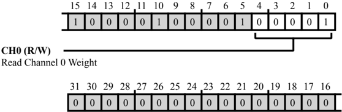

Table 29-50: PCIE\_DMARD\_ARBWGT\_LO\_[n] Register Fields

| Bit No. (Access)   | Bit Name   | Description/Enumeration                                                                                                                                                                                                                   |
|--------------------|------------|-------------------------------------------------------------------------------------------------------------------------------------------------------------------------------------------------------------------------------------------|
| 4:0 (R/W)          | CH0        | Read Channel 0 Weight. The PCIE_DMARD_ARBWGT_LO_[n].CH0 bit field value is used by the channel weighted round robin arbiter to select the next channel read request. The weight is ini- tialized by software before ringing the doorbell. |

## DMA Read Channel 1 and 0 IMWr Data Register

The PCIE\_DMARD\_CH01\_IMWR\_[n] register is implemented in RAM whose contents are uninitialized after power on. This register must always have an initialized value because the default is undefined. All fields marked Reserved must be programmed to 1'b0. This register is not affected by any of the reset signals.

Figure 29-42: PCIE\_DMARD\_CH01\_IMWR\_[n] Register Diagram


Table 29-51: PCIE\_DMARD\_CH01\_IMWR\_[n] Register Fields

| Bit No. (Access)   | Bit Name   | Description/Enumeration                                                                                                                                                 |
|--------------------|------------|-------------------------------------------------------------------------------------------------------------------------------------------------------------------------|
| 15:0 (R/W)         | CH0        | Read Channel 0 Data. The DMAuses the PCIE_DMARD_CH01_IMWR_[n].CH0 bit field to generate the data field for the Done or Abort IMWr TLPs it generates for read channel 0. |

## DMA Control 1 Read Channel Register

The PCIE\_DMARD\_CTL1\_[n] register is implemented in RAM whose contents are uninitialized after power-on. All fields marked "Reserved" MUST be programmed to 1'b0. This register is not affected by any of the reset signals.

Figure 29-43: PCIE\_DMARD\_CTL1\_[n] Register Diagram

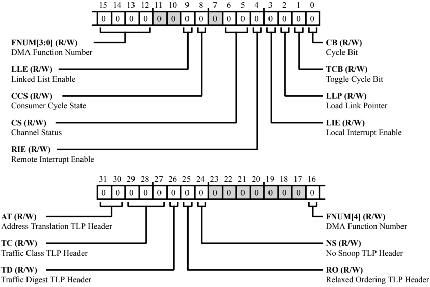

Table 29-52: PCIE\_DMARD\_CTL1\_[n] Register Fields

| Bit No. (Access)   | Bit Name   | Description/Enumeration                                                                                                                                                                            |
|--------------------|------------|----------------------------------------------------------------------------------------------------------------------------------------------------------------------------------------------------|
| 31:30 (R/W)        | AT         | Address Translation TLP Header. The DMAuses the PCIE_DMARD_CTL1_[n].AT bit field when generating MRd/MWr (not IMWr) TLPs.                                                                          |
| 29:27 (R/W)        | TC         | Traffic Class TLP Header. The DMAuses the PCIE_DMARD_CTL1_[n].TC bit field when generating MRd/MWr (not IMWr) TLPs.                                                                                |
| 26 (R/W)           | TD         | Traffic Digest TLP Header. The PCIe core adds the ECRC field and sets the PCIE_DMARD_CTL1_[n].TD bit in the TLP header. The DMAuses this TLP header field when generating MRd/MWr (not IMWr) TLPs. |

Table 29-52: PCIE\_DMARD\_CTL1\_[n] Register Fields (Continued)

| Bit No. (Access)   | Bit Name   | Description/Enumeration                                                                                                                                                                                                                                                                                                                                                                                           |
|--------------------|------------|-------------------------------------------------------------------------------------------------------------------------------------------------------------------------------------------------------------------------------------------------------------------------------------------------------------------------------------------------------------------------------------------------------------------|
| 25 (R/W)           | RO         | Relaxed Ordering TLP Header. The DMAuses the PCIE_DMARD_CTL1_[n].RO bit field when generating MRd/MWr (not IMWr) TLPs.                                                                                                                                                                                                                                                                                            |
| 24 (R/W)           | NS         | No Snoop TLP Header. The PCIE_DMARD_CTL1_[n].NS bit is used by DMAwhen generating MRd/MWr (not IMWr) TLPs.                                                                                                                                                                                                                                                                                                        |
| 16:12 (R/W)        | FNUM       | DMAFunction Number. The core uses the PCIE_DMARD_CTL1_[n].FNUM bit field when generating the requester ID for the MRd/MWr DMATLP. When SR-IOV is enabled, this field is ig- nored if the VFE field in the DMAWrite Channel Control 2 Register is set.                                                                                                                                                             |
| 9 (R/W)            | LLE        | Linked List Enable. The PCIE_DMARD_CTL1_[n].LLE bit enables linked list operation. 0 Disable Linked Lists 1 Enable Linked Lists                                                                                                                                                                                                                                                                                   |
| 8 (R/W)            | CCS        | Consumer Cycle State. The PCIE_DMARD_CTL1_[n].CCS bit is used to synchronize the producer (soft- ware) and the consumer (DMA). This bit must be initialized. The DMAupdates the PCIE_DMARD_CTL1_[n].CCS bit during linked list operation. Used in linked list mode only.                                                                                                                                          |
| 6:5 (R/W)          | CS         | Channel Status. The PCIE_DMARD_CTL1_[n].CS status bits identify the current operational state of the DMAchannel.                                                                                                                                                                                                                                                                                                  |
| 6:5 (R/W)          | CS         | 0 Reserved                                                                                                                                                                                                                                                                                                                                                                                                        |
| 6:5 (R/W)          | CS         | 2 Halted. An error condition has been detected, and the DMAhas stopped this channel.                                                                                                                                                                                                                                                                                                                              |
| 4 (R/W)            | RIE        | Remote Interrupt Enable. Programs must set the PCIE_DMARD_CTL1_[n].RIE bit to enable the generation of the Done or Abort Remote interrupts. In LL mode, the DMAoverwrites this with the RIE of the LL element. The PCIE_DMARD_CTL1_[n].RIE bit in a LL ele- ment only enables the Done interrupt. In non-LL mode, this bit enables the Done and Abort interrupts. This field is not defined in a link LL element. |

Table 29-52: PCIE\_DMARD\_CTL1\_[n] Register Fields (Continued)

| Bit No. (Access)   | Bit Name   | Description/Enumeration                                                                                                                                                                                                                                                                                                                                                                                                 |
|--------------------|------------|-------------------------------------------------------------------------------------------------------------------------------------------------------------------------------------------------------------------------------------------------------------------------------------------------------------------------------------------------------------------------------------------------------------------------|
| 3 (R/W)            | LIE        | Local Interrupt Enable. Programs must set the PCIE_DMARD_CTL1_[n].LIE bit to enable the generation of the Done or Abort Local interrupts. In LL mode, the DMAoverwrites the PCIE_DMARD_CTL1_[n].LIE bit with the LIE of the LL element. The LIE bit in a LL element only enables the Done interrupt. In non-LL mode, the LIE bit enables the Done and Abort interrupts. This field is not defined in a link LL element. |
| 2 (R/W)            | LLP        | Load Link Pointer. The PCIE_DMARD_CTL1_[n].LLP bit indicates that this linked list element is a link element, and its LL element pointer dwords point to the next (non-contiguous) element. The DMAloads this field with the LLP of the linked list element. Used in linked list mode only.                                                                                                                             |
| 1 (R/W)            | TCB        | Toggle Cycle Bit. The PCIE_DMARD_CTL1_[n].TCB bit indicates to the DMAto toggle its inter- pretation of the CB. It is used to synchronize the producer (software) and the consum- er (DMA). The DMAloads this field with the TCB of the linked list element. This field is not defined in a data LL element and is used in linked list mode only.                                                                       |
| 0 (R/W)            | CB         | Cycle Bit. The PCIE_DMARD_CTL1_[n].CB bit is used to synchronize the producer (soft- ware) and the consumer (DMA). The DMAloads this field with the CB of the linked list element. Used in linked list mode only.                                                                                                                                                                                                       |

## DMA Destination Address High Read Channel Register

The PCIE\_DMARD\_DAR\_HI\_[n] register is implemented in RAM whose contents are uninitialized after poweron. All fields marked "Reserved" MUST be programmed to 1'b0. This register is not affected by any of the reset signals.

Figure 29-44: PCIE\_DMARD\_DAR\_HI\_[n] Register Diagram

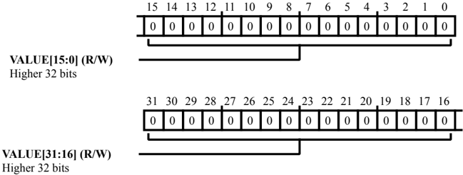

Table 29-53: PCIE\_DMARD\_DAR\_HI\_[n] Register Fields

| Bit No. (Access)   | Bit Name   | Description/Enumeration                                                                                                                 |
|--------------------|------------|-----------------------------------------------------------------------------------------------------------------------------------------|
| 31:0 (R/W)         | VALUE      | Higher 32 bits. In LL mode, the DMAoverwrites the PCIE_DMARD_DAR_HI_[n].VALUE bit field with the corresponding dword of the LL element. |

## DMA Destination Address Low Read Channel Register

The PCIE\_DMARD\_DAR\_LO\_[n] register is implemented in RAM whose contents are uninitialized after poweron. All fields marked "Reserved" MUST be programmed to 1'b0. This register is not affected by any of the reset signals.

Figure 29-45: PCIE\_DMARD\_DAR\_LO\_[n] Register Diagram


Table 29-54: PCIE\_DMARD\_DAR\_LO\_[n] Register Fields

| Bit No. (Access)   | Bit Name   | Description/Enumeration                                                                                                                                                                                                                                                                                                                                                           |
|--------------------|------------|-----------------------------------------------------------------------------------------------------------------------------------------------------------------------------------------------------------------------------------------------------------------------------------------------------------------------------------------------------------------------------------|
| 31:0 (R/W)         | VALUE      | Lower 32 bits. The PCIE_DMARD_DAR_LO_[n].VALUE bit field indicates the next address to be written to. The DMAincrements the DAR as the DMAtransfer progresses. The DAR is always dword aligned even if the transfer size is byte aligned. In LL mode, theDMA overwrites this bit field with the corresponding dword of the LL element. he DAR is the address of the local memory. |

## DMA Read Done IMWr Address High Register

The PCIE\_DMARD\_DONE\_IMWR\_HI\_[n] register is implemented in RAM whose contents are uninitialized after power on. Therefore, you must always initialize this register value because the default is undefined. All fields marked Reserved must be programmed to 1'b0. This register is not affected by any of the reset signals.

Figure 29-46: PCIE\_DMARD\_DONE\_IMWR\_HI\_[n] Register Diagram


Table 29-55: PCIE\_DMARD\_DONE\_IMWR\_HI\_[n] Register Fields

| Bit No. (Access)   | Bit Name   | Description/Enumeration                                                                                                                             |
|--------------------|------------|-----------------------------------------------------------------------------------------------------------------------------------------------------|
| 31:0 (R/W)         | VALUE      | DMARead Done High. The DMAuses the PCIE_DMARD_DONE_IMWR_HI_[n].VALUE bit field to generate bits [63:32] of the address field for the Done IMWr TLP. |

## DMA Read Done IMWr Address Low Register

The PCIE\_DMARD\_DONE\_IMWR\_LO\_[n] register is implemented in RAM whose contents are uninitialized after power on. Therefore, you must always initialize this register value because the default is undefined. All fields marked Reserved MUST be programmed to 1'b0. This register is not affected by any of the reset signals.

Figure 29-47: PCIE\_DMARD\_DONE\_IMWR\_LO\_[n] Register Diagram


Table 29-56: PCIE\_DMARD\_DONE\_IMWR\_LO\_[n] Register Fields

| Bit No. (Access)   | Bit Name   | Description/Enumeration                                                                                                                                                                                        |
|--------------------|------------|----------------------------------------------------------------------------------------------------------------------------------------------------------------------------------------------------------------|
| 31:0 (R/W)         | VALUE      | DMARead Done Low. The DMAuses the PCIE_DMARD_DONE_IMWR_LO_[n].VALUE bit field to generate bits [31:0] of the address field for the Done IMWr TLP. Bits [1:0] must be 00 as this address must be dword aligned. |

## DMA Read Doorbell Register

The PCIE\_DMARD\_DRBL\_[n] bit register provides the doorbell number and stops issuing requests.

Figure 29-48: PCIE\_DMARD\_DRBL\_[n] Register Diagram

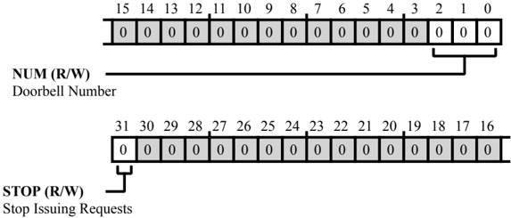

Table 29-57: PCIE\_DMARD\_DRBL\_[n] Register Fields

| Bit No. (Access)   | Bit Name   | Description/Enumeration                                                                                                                                                                                                                                                                                                                                                                                                     |
|--------------------|------------|-----------------------------------------------------------------------------------------------------------------------------------------------------------------------------------------------------------------------------------------------------------------------------------------------------------------------------------------------------------------------------------------------------------------------------|
| 31 (R/W)           | STOP       | Stop Issuing Requests. The PCIE_DMARD_DRBL_[n].STOP bit is set in conjunction with the doorbell number field. The DMAread channel stops issuing requests, sets the channel status to Stopped, and asserts the Abort interrupt (if enabled). Before setting the PCIE_DMARD_DRBL_[n].STOP bit, programs must read the PCIE_DMARD_CTL1_[n].CS (channel status) to ensure that the read channel is running (transferring data). |
| 2:0 (R/W)          | NUM        | Doorbell Number. The PCIE_DMARD_DRBL_[n].NUM bit field is the doorbell number. Programs must write 0x0 to this bit field to start the DMAread transfer for that channel. The DMAdetects a write to this register field even if the value of this field does not change. The range of this field is 0x0 to 0x7, and 0x0 corresponds to channel 0.                                                                            |

## DMA Read Engine Enable Register

The PCIE\_DMARD\_EN\_[n] register enables the DMA read engine. Programs must initially enable the the DMA read engine (=1) for normal operation, before any other software setup. The enable bit in this register does not need to be toggled or rewritten during normal operation. To soft reset the DMA controller read logic this bit should be cleared (=0). There are three possible reasons for resetting the DMA controller read logic.

- The PCIE\_DMARD\_ISTAT\_[n].ABRT bit is set and any of the bits in the PCIE\_DMARD\_ERRSTAT\_LO\_[n] register are set. Resetting the DMA controller read logic re-initializes the control logic, ensuring that the next DMA read transfer is executed successfully.
- The procedure outlined in "Stop Bit" has been executed, after which, the PCIE\_DMARD\_ISTAT\_[n].ABRT bit is set and the PCIE\_DMARD\_CTL1\_[n].CS is set to "Stopped". Resetting the DMA controller read logic re-initializes the control logic ensuring that the next DMA read transfer is executed successfully.
- If the DMA engine is incorrectly programmed during software development.

To Soft Reset the DMA controller read logic:

- De-assert the DMA read engine enable bit.
- Wait for the DMA to complete any in-progress TLP transfer, by waiting until a read on the DMA read engine enable bit returns a 0.
- Assert the DMA read engine enable bit.

This Soft Reset does not clear the DMA configuration registers. The DMA read transfer does not start until you write to the PCIE\_DMARD\_DRBL\_[n].STOP bit.

Figure 29-49: PCIE\_DMARD\_EN\_[n] Register Diagram

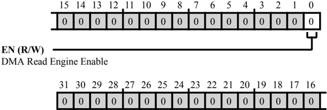

Table 29-58: PCIE\_DMARD\_EN\_[n] Register Fields

| Bit No. (Access)   | Bit Name   | Description/Enumeration                                                                     |
|--------------------|------------|---------------------------------------------------------------------------------------------|
| 0 (R/W)            | EN         | DMARead Engine Enable. The PCIE_DMARD_EN_[n].EN bit enables or disables the DMAread engine. |
| 0 (R/W)            | EN         | 0 Disable engine (soft reset)                                                               |
| 0 (R/W)            | EN         | 1 Enable engine                                                                             |

## DMA Read Error Status High Register

The PCIE\_DMARD\_ERRSTAT\_HI\_[n] register reports errors for read channels 4-7.

Figure 29-50: PCIE\_DMARD\_ERRSTAT\_HI\_[n] Register Diagram

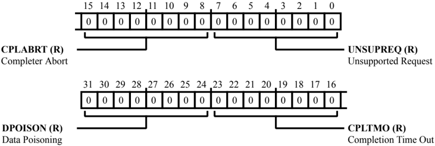

Table 29-59: PCIE\_DMARD\_ERRSTAT\_HI\_[n] Register Fields

| Bit No. (Access)   | Bit Name   | Description/Enumeration                                                                                                                                                                                                                                                                                                                                                                                                                                                                                                                                                                                                                                                                                                                                                                                                                                             |
|--------------------|------------|---------------------------------------------------------------------------------------------------------------------------------------------------------------------------------------------------------------------------------------------------------------------------------------------------------------------------------------------------------------------------------------------------------------------------------------------------------------------------------------------------------------------------------------------------------------------------------------------------------------------------------------------------------------------------------------------------------------------------------------------------------------------------------------------------------------------------------------------------------------------|
| 31:24 (R/NW)       | DPOISON    | Data Poisoning. The PCIE_DMARD_ERRSTAT_HI_[n].DPOISON bit field reports that the DMAread channel has detected data poisoning in the completion from the remote de- vice (in response to the MRd request). The DMAread channel drops the completion and then halts. The CX_FLT_MSK_UR_POIS filter rule does not affect this behavior. Each bit corresponds to a DMAchannel. Bit [0] corresponds to channel 0. • Enable. For details, see "Interrupts and Error Handling". • Mask. The DMAread interrupt Mask register has no effect on this register. • Clear. Programs must write a 1'b1 to the corresponding channel bit in the Abort interrupt field of the ( PCIE_DMARD_ICLR_[n] ) register to clear this error bit. Note that this action also clears the other error bits for the same channel in this register and in the PCIE_DMARD_ERRSTAT_LO_[n] register. |
| 23:16 (R/NW)       | CPLTMO     | Completion Time Out. The PCIE_DMARD_ERRSTAT_HI_[n].CPLTMO bit field reports that theDMA read channel has timed-out while waiting for the remote device to respond to the MRd request, or a malformed CplD has been received. For more details, see "Linked List Mode". Each bit corresponds to a DMAchannel. Bit [0] corresponds to channel 0. • Enable. For details, see "Interrupts and Error Handling". • Mask. The DMAread interrupt Mask register has no effect on this register. • Clear. Programs must write a 1'b1 to the corresponding channel bit in the Abort interrupt field of the ( PCIE_DMARD_ICLR_[n] ) register to clear this error bit. Note that this action also clears the other error bits for the same channel in this register and in the PCIE_DMARD_ERRSTAT_LO_[n] register.                                                               |

Table 29-59: PCIE\_DMARD\_ERRSTAT\_HI\_[n] Register Fields (Continued)

| Bit No. (Access)   | Bit Name   | Description/Enumeration                                                                                                                                                                                                                                                                                                                                                                                                                                                                                                                                                                                                                                                                                                                                                                                             |
|--------------------|------------|---------------------------------------------------------------------------------------------------------------------------------------------------------------------------------------------------------------------------------------------------------------------------------------------------------------------------------------------------------------------------------------------------------------------------------------------------------------------------------------------------------------------------------------------------------------------------------------------------------------------------------------------------------------------------------------------------------------------------------------------------------------------------------------------------------------------|
| 15:8 (R/NW)        | CPLABRT    | Completer Abort. The PCIE_DMARD_ERRSTAT_HI_[n].CPLABRT bit field reports that the DMAread channel has received a PCIe completer abort completion status from the remote device in response to the MRd request. For more details, see "Linked List Mode". Each bit corresponds to a DMAchannel. Bit [0] corresponds to channel 0. • Enable. For details, see "Interrupts and Error Handling". • Mask. The DMAread interrupt Mask register has no effect on this register. • Clear. Programs must write a 1'b1 to the corresponding channel bit in the Abort interrupt field of the ( PCIE_DMARD_ICLR_[n] ) register to clear this error bit. Note that this action also clears the other error bits for the same channel in this register and in the PCIE_DMARD_ERRSTAT_LO_[n] register.                             |
| 7:0 (R/NW)         | UNSUPREQ   | Unsupported Request. The PCIE_DMARD_ERRSTAT_HI_[n].UNSUPREQ bit field reports that the DMAread channel has received a PCIe unsupported request completion status from the remote device in response to the MRd request. For more details, see "Linked List Mode". Each bit corresponds to a DMAchannel. Bit [0] corresponds to channel 0. - Enabling: For details, see "Interrupts and Error Handling". - Masking: The DMAread interrupt Mask register has no effect on this register. - Clearing: You must write a 1'b1 to the corresponding channel bit in the Abort interrupt field of the "DMA Read Inter- rupt Clear Register" (DMA_RD_INT_CLEAR_OFF) to clear this error bit. Note, this also clears the other error bits for the same channel in this register and in the DMARead Error Status Low register. |

## DMA Read Error Status Low Register

The PCIE\_DMARD\_ERRSTAT\_LO\_[n] register reports errors for read channels 0-3.

Figure 29-51: PCIE\_DMARD\_ERRSTAT\_LO\_[n] Register Diagram

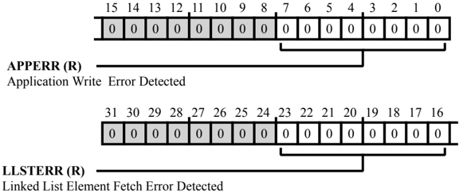

Table 29-60: PCIE\_DMARD\_ERRSTAT\_LO\_[n] Register Fields

| Bit No. (Access)   | Bit Name   | Description/Enumeration                                                                                                                                                                                                                                                                                                                                                                                                                                                                                                                                                                                                                                                                                                                                                                                                                                                                                                                                                                           |
|--------------------|------------|---------------------------------------------------------------------------------------------------------------------------------------------------------------------------------------------------------------------------------------------------------------------------------------------------------------------------------------------------------------------------------------------------------------------------------------------------------------------------------------------------------------------------------------------------------------------------------------------------------------------------------------------------------------------------------------------------------------------------------------------------------------------------------------------------------------------------------------------------------------------------------------------------------------------------------------------------------------------------------------------------|
| 23:16 (R/NW)       | LLSTERR    | Linked List Element Fetch Error Detected. The PCIE_DMARD_ERRSTAT_LO_[n].LLSTERR bit field reports that the DMAread channel has received an error response from the AHB/AXI bus while read- ing a linked list element from local memory. Each bit corresponds to a DMAchannel. Bit [0] corresponds to channel 0. • Enable. For details, see "Interrupts and Error Handling". • Mask. The DMAread interrupt Mask register has no effect on this register. • Clear. Programs must write a 1'b1 to the corresponding channel bit in the Abort interrupt field of the ( PCIE_DMARD_ICLR_[n] ) register to clear this error bit. Note that this action also clears the other error bits for the same channel in this register and in the PCIE_DMARD_ERRSTAT_HI_[n] register.                                                                                                                                                                                                                            |
| 7:0 (R/NW)         | APPERR     | Application Write Error Detected. The PCIE_DMARD_ERRSTAT_LO_[n].APPERR bit field reports that theDMA read channel has received an error response from the peripheral/core bus (or RTRGT1 interface when the AHB/AXI Bridge is not used) while writing data to it. This error is fatal. The data transfer must be restarted from the beginning, as the channel context is corrupted, and the transfer is not rolled back. For more details, see "Linked List Mode". Each bit corresponds to a DMAchannel. Bit [0] corresponds to channel 0. • Enable. For details, see "Interrupts and Error Handling". • Mask. The DMAread interrupt Mask register has no effect on this register. • Clear. Programs must write a 1'b1 to the corresponding channel bit in the Abort interrupt field of the ( PCIE_DMARD_ICLR_[n] ) register to clear this error bit. Note that this action also clears the other error bits for the same channel in this register and in the PCIE_DMARD_ERRSTAT_HI_[n] register. |

## DMA Read Interrupt Clear Register

The PCIE\_DMARD\_ICLR\_[n] register is used to clear corresponding bits in the PCIE\_DMARD\_ISTAT\_[n] register.

Figure 29-52: PCIE\_DMARD\_ICLR\_[n] Register Diagram


Table 29-61: PCIE\_DMARD\_ICLR\_[n] Register Fields

| Bit No. (Access)   | Bit Name   | Description/Enumeration                                                                                                                                                                                                                                                                             |
|--------------------|------------|-----------------------------------------------------------------------------------------------------------------------------------------------------------------------------------------------------------------------------------------------------------------------------------------------------|
| 23:16 (R/W)        | ABRT       | Abort Interrupt Clear. Writing 1'b1 to the PCIE_DMARD_ICLR_[n].ABRT bit field clears the corre- sponding bit in the PCIE_DMARD_ISTAT_[n].ABRT bit field. Each bit corre- sponds to a DMAchannel. Bit [0] corresponds to channel 0. Reading from this self-clearing register field always returns 0. |
| 7:0 (R/W)          | DONE       | Done Interrupt Clear. Writing 1'b1 to the PCIE_DMARD_ICLR_[n].DONE bit field clears the corre- sponding bit in the PCIE_DMARD_ISTAT_[n].DONE bit field. Each bit corre- sponds to a DMAchannel. Bit [0] corresponds to channel 0. Reading from this self-clearing register field always returns 0.  |

## DMA Read Interrupt Mask Register

The PCIE\_DMARD\_IMSK\_[n] register is used to mask interrupts in the PCIE\_DMARD\_ISTAT\_[n] register.

Figure 29-53: PCIE\_DMARD\_IMSK\_[n] Register Diagram

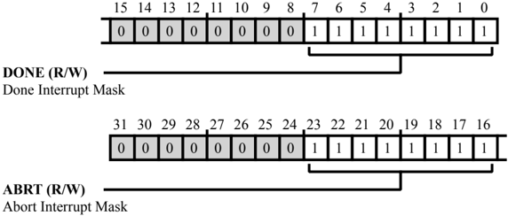

Table 29-62: PCIE\_DMARD\_IMSK\_[n] Register Fields

| Bit No. (Access)   | Bit Name   | Description/Enumeration                                                                                                                                                                                                                    |
|--------------------|------------|--------------------------------------------------------------------------------------------------------------------------------------------------------------------------------------------------------------------------------------------|
| 23:16 (R/W)        | ABRT       | Abort Interrupt Mask. The PCIE_DMARD_IMSK_[n].ABRT bit field prevents the PCIE_DMARD_ISTAT_[n].ABRT status field in the DMAfrom asserting the ed- ma_int output. Each bit corresponds to a DMAchannel. Bit [0] corresponds to chan- nel 0. |
| 7:0 (R/W)          | DONE       | Done Interrupt Mask. The PCIE_DMARD_IMSK_[n].DONE bit field prevents the PCIE_DMARD_ISTAT_[n].DONE status field in the DMAfrom asserting the ed- ma_int output. Each bit corresponds to a DMAchannel. Bit [0] corresponds to chan- nel 0.  |

## DMA Read Abort IMWr Address High Register

The PCIE\_DMARD\_IMWRABRT\_HI\_[n] register is implemented in RAM whose contents are uninitialized after power on. Programs must always initialize this register value because the default is undefined. All fields marked Reserved MUST be programmed to 1'b0. This register is not affected by any of the reset signals.

Figure 29-54: PCIE\_DMARD\_IMWRABRT\_HI\_[n] Register Diagram

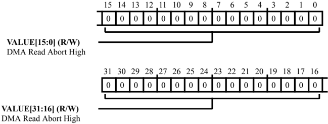

Table 29-63: PCIE\_DMARD\_IMWRABRT\_HI\_[n] Register Fields

| Bit No. (Access)   | Bit Name   | Description/Enumeration                                                                                                                                    |
|--------------------|------------|------------------------------------------------------------------------------------------------------------------------------------------------------------|
| 31:0               | VALUE      | DMARead Abort High. The PCIE_DMARD_IMWRABRT_HI_[n].VALUE bit field is used by the DMAto generate bits [63:32] of the address field for the Abort IMWr TLP. |
| (R/W)              |            |                                                                                                                                                            |

## DMA Read Abort IMWr Address Low Register

The PCIE\_DMARD\_IMWRABRT\_LO\_[n] register is implemented in RAM whose contents are uninitialized after power on. Therefore, you must always initialize this register value because the default is undefined. All fields marked Reserved MUST be programmed to 1'b0. This register is not affected by any of the reset signals.

Figure 29-55: PCIE\_DMARD\_IMWRABRT\_LO\_[n] Register Diagram


Table 29-64: PCIE\_DMARD\_IMWRABRT\_LO\_[n] Register Fields

| Bit No. (Access)   | Bit Name   | Description/Enumeration                                                                                                                                                                                               |
|--------------------|------------|-----------------------------------------------------------------------------------------------------------------------------------------------------------------------------------------------------------------------|
| 31:0 (R/W)         | VALUE      | DMARead Abort Low. The PCIE_DMARD_IMWRABRT_LO_[n].VALUE bit field is used by the DMAto generate bits [31:0] of the address field for the Abort IMWr TLP. Bits [1:0] must be 00 as this address must be dword aligned. |

## DMA Read Interrupt Status Register

The PCIE\_DMARD\_ISTAT\_[n] register provides status information on DMA reads.

Figure 29-56: PCIE\_DMARD\_ISTAT\_[n] Register Diagram

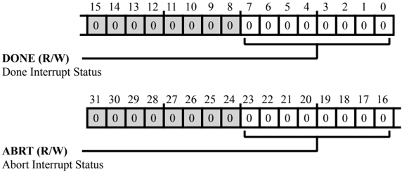

Table 29-65: PCIE\_DMARD\_ISTAT\_[n] Register Fields

| Bit No. (Access)   | Bit Name   | Description/Enumeration                                                                                                                                                                                                                                                                                                                                                                                                                                                                                                                                                                                                                                                                                                                                                                           |
|--------------------|------------|---------------------------------------------------------------------------------------------------------------------------------------------------------------------------------------------------------------------------------------------------------------------------------------------------------------------------------------------------------------------------------------------------------------------------------------------------------------------------------------------------------------------------------------------------------------------------------------------------------------------------------------------------------------------------------------------------------------------------------------------------------------------------------------------------|
| 23:16 (R/W)        | ABRT       | Abort Interrupt Status. The PCIE_DMARD_ISTAT_[n].ABRT indicates the DMAread channel has de- tected an error or the transfer was stopped manually. Each bit corresponds to aDMA channel. Bit [0] corresponds to channel 0. Programs can read the DMARead Error Status Low Register and DMARead Error Status High Register to determine the source of the error. The DMAread interrupt Mask register has no effect on this bit field. Programs must write a 1'b1 to the corre- sponding channel bit in the DMAread interrupt Clear register to clear this interrupt bit. Programs can write to this bit field to emulate interrupt generation, during software or hardware testing. A write to the address triggers an interrupt, but the DMAdoes not set the Done or Abort bits in this bit field. |
| 7:0 (R/W)          | DONE       | Done Interrupt Status. The PCIE_DMARD_ISTAT_[n].DONE indicates the DMAread channel has suc- cessfully completed the DMAread transfer. Each bit corresponds to a DMAchannel. Bit [0] corresponds to channel 0. The DMAread interrupt Mask register has no effect on this bit field. Programs must write a 1'b1 to the corresponding channel bit in the DMAread interrupt Clear register to clear this interrupt bit. Programs can write to this bit field to emulate interrupt generation, during software or hardware testing. A write to the address triggers an interrupt, but the DMAdoes not set the Done or Abort bits in this bit field.                                                                                                                                                    |

## DMA LLP High Read Channel Register

The PCIE\_DMARD\_LLP\_HI\_[n] register is implemented in RAM whose contents are uninitialized after power on. This register value must always be initialized because the default is undefined. All fields marked Reserved must be programmed to 1'b0. All fields marked Reserved MUST be programmed to 1'b0. This register is not affected by any of the reset signals.

Figure 29-57: PCIE\_DMARD\_LLP\_HI\_[n] Register Diagram

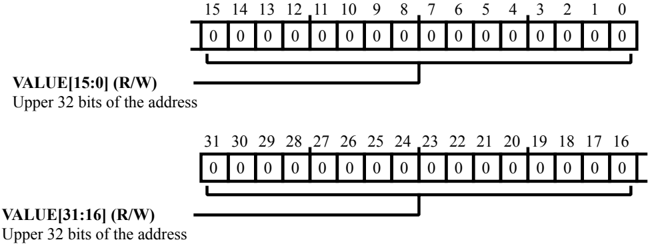

Table 29-66: PCIE\_DMARD\_LLP\_HI\_[n] Register Fields

| Bit No. (Access)   | Bit Name   | Description/Enumeration                                                                                                                                                                                                                                                                                                                       |
|--------------------|------------|-----------------------------------------------------------------------------------------------------------------------------------------------------------------------------------------------------------------------------------------------------------------------------------------------------------------------------------------------|
| 31:0 (R/W)         | VALUE      | Upper 32 bits of the address. The PCIE_DMARD_LLP_HI_[n].VALUE bit field contains the upper 32 bits of the address of the linked list transfer list in local memory. Used in linked list mode only. The PCIE_DMARD_LLP_HI_[n].VALUE bit field is updated by theDMA to point to the next element in the transfer list as elements are consumed. |

## DMA LLP Low Read Channel Register

The PCIE\_DMARD\_LLP\_LO\_[n] register is implemented in RAM whose contents are uninitialized after power on. All fields marked Reserved must be programmed to 1'b0. This register is not affected by any of the reset signals.

Figure 29-58: PCIE\_DMARD\_LLP\_LO\_[n] Register Diagram


Table 29-67: PCIE\_DMARD\_LLP\_LO\_[n] Register Fields

| Bit No. (Access)   | Bit Name   | Description/Enumeration                                                                                                                                                                                                                                                                                                                                                                                                                                                                                                                          |
|--------------------|------------|--------------------------------------------------------------------------------------------------------------------------------------------------------------------------------------------------------------------------------------------------------------------------------------------------------------------------------------------------------------------------------------------------------------------------------------------------------------------------------------------------------------------------------------------------|
| 31:0 (R/W)         | VALUE      | Lower address bits. The PCIE_DMARD_LLP_LO_[n].VALUE bit field contains the lower bits of the address of the linked list transfer list in local memory. Used in linked list mode only. The PCIE_DMARD_LLP_LO_[n].VALUE bit field is updated by the DMAto point to the next element in the transfer list after the previous element is consumed. • When the current element is a data element; this field is incremented by 6. • When the current element is a link element; this field is overwritten by the LL Ele- ment Pointer of the element. |

## DMA Read Linked List Error Enable Register

The PCIE\_DMARD\_LLSTERR\_EN\_[n] register provides bits in the LL element that enable the channel done and abort interrupts (local and remote).

Figure 29-59: PCIE\_DMARD\_LLSTERR\_EN\_[n] Register Diagram

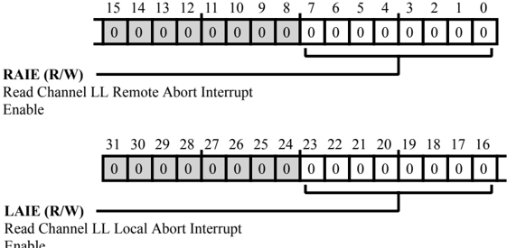

Table 29-68: PCIE\_DMARD\_LLSTERR\_EN\_[n] Register Fields

| Bit No. (Access)   | Bit Name   | Description/Enumeration                                                                                                                                                                                                                             |
|--------------------|------------|-----------------------------------------------------------------------------------------------------------------------------------------------------------------------------------------------------------------------------------------------------|
| 23:16 (R/W)        | LAIE       | Read Channel LL Local Abort Interrupt Enable. The PCIE_DMARD_LLSTERR_EN_[n].LAIE bit field enables the read channel local abort interrupt. Each bit corresponds to a DMAchannel. Bit [0] corresponds to channel 0. Used in linked list mode only.   |
| 7:0 (R/W)          | RAIE       | Read Channel LL Remote Abort Interrupt Enable. The PCIE_DMARD_LLSTERR_EN_[n].RAIE bit field enables the read channel remote abort interrupt. Each bit corresponds to a DMAchannel. Bit [0] corresponds to channel 0. Used in linked list mode only. |

## DMA SAR High Read Channel Register

The PCIE\_DMARD\_SAR\_HI\_[n] register is implemented in RAM whose contents are uninitialized after poweron. All fields marked Reserved MUST be programmed to 1'b0. This register is not affected by any of the reset signals.

Figure 29-60: PCIE\_DMARD\_SAR\_HI\_[n] Register Diagram


Table 29-69: PCIE\_DMARD\_SAR\_HI\_[n] Register Fields

| Bit No. (Access)   | Bit Name   | Description/Enumeration                                                                                                                 |
|--------------------|------------|-----------------------------------------------------------------------------------------------------------------------------------------|
| 31:0 (R/W)         | VALUE      | Higher 32 bits. In LL mode, the DMAoverwrites the PCIE_DMARD_SAR_HI_[n].VALUE bit field with the corresponding dword of the LL element. |

## DMA SAR Low Read Channel Register

The PCIE\_DMARD\_SAR\_LO\_[n] register is implemented in RAM whose contents are uninitialized after poweron. All fields marked Reserved MUST be programmed to 1'b0. This register is not affected by any of the reset signals.

Figure 29-61: PCIE\_DMARD\_SAR\_LO\_[n] Register Diagram


Table 29-70: PCIE\_DMARD\_SAR\_LO\_[n] Register Fields

| Bit No. (Access)   | Bit Name   | Description/Enumeration                                                                                                                                                                                                                                                                       |
|--------------------|------------|-----------------------------------------------------------------------------------------------------------------------------------------------------------------------------------------------------------------------------------------------------------------------------------------------|
| 31:0 (R/W)         | VALUE      | Lower 32 bits. The PCIE_DMARD_SAR_LO_[n].VALUE bit field indicates the next address to be read from. The DMAincrements the SAR as the DMAtransfer progresses. In LL mode, the DMAoverwrites this with the corresponding dword of the LL element. The SAR is the address of the remote memory. |

## DMA Transfer Size Read Channel Register

The PCIE\_DMARD\_XFRSZ\_[n] register is implemented in RAM whose contents are uninitialized after poweron. All fields marked Reserved MUST be programmed to 1'b0. This register is not affected by any of the reset signals.

Figure 29-62: PCIE\_DMARD\_XFRSZ\_[n] Register Diagram

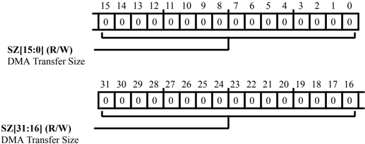

Table 29-71: PCIE\_DMARD\_XFRSZ\_[n] Register Fields

| Bit No. (Access)   | Bit Name   | Description/Enumeration                                                                                                                                                                                                                                                                                                                                                                                                                                                                                                                                                 |
|--------------------|------------|-------------------------------------------------------------------------------------------------------------------------------------------------------------------------------------------------------------------------------------------------------------------------------------------------------------------------------------------------------------------------------------------------------------------------------------------------------------------------------------------------------------------------------------------------------------------------|
| 31:0 (R/W)         | SZ         | DMATransfer Size. The PCIE_DMARD_XFRSZ_[n].SZ bit field configures the size of theDMA transfer. The maximum DMAtransfer size is 4Gbytes. The minimum transfer size is one byte (0x1). This field is automatically decremented by the DMAas theDMA write and read channel transfer progresses. This field indicates the number bytes re- maining to be transferred. When all bytes are successfully transferred the current trans- fer size is zero. In LL mode, the DMAoverwrites the PCIE_DMARD_XFRSZ_[n].SZ bit field with the corresponding dword of the LL element. |

## DMA Write Abort IMWr Address High Register

The PCIE\_DMAWR\_ABRT\_IMWR\_HI[n] register is implemented in RAM whose contents are uninitialized after power on. Therefore, you must program and initialize every field as the default is undefined. All fields marked Reserved MUST be programmed to 1'b0. This register is not affected by any of the reset signals.

Figure 29-63: PCIE\_DMAWR\_ABRT\_IMWR\_HI[n] Register Diagram

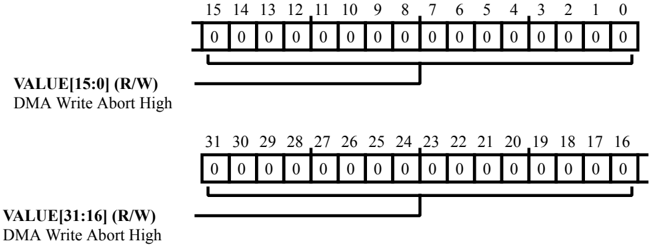

Table 29-72: PCIE\_DMAWR\_ABRT\_IMWR\_HI[n] Register Fields

| Bit No. (Access)   | Bit Name   | Description/Enumeration                                                                                                                                 |
|--------------------|------------|---------------------------------------------------------------------------------------------------------------------------------------------------------|
| 31:0 (R/W)         | VALUE      | DMAWrite Abort High. The DMAuses the PCIE_DMAWR_ABRT_IMWR_HI[n].VALUE bit field to gen- erate bits [63:32] of the address field for the Abort IMWr TLP. |

## DMA Write Abort IMWr Address Low Register

The PCIE\_DMAWR\_ABRT\_IMWR\_LO[n] register is implemented in RAM whose contents are uninitialized after power on. Therefore, you must program and initialize every field as the default is undefined. All fields marked Reserved MUST be programmed to 1'b0. This register is not affected by any of the reset signals.

Figure 29-64: PCIE\_DMAWR\_ABRT\_IMWR\_LO[n] Register Diagram


Table 29-73: PCIE\_DMAWR\_ABRT\_IMWR\_LO[n] Register Fields

| Bit No. (Access)   | Bit Name   | Description/Enumeration                                                                                                                                                                                                         |
|--------------------|------------|---------------------------------------------------------------------------------------------------------------------------------------------------------------------------------------------------------------------------------|
| 31:0 (R/W)         | VALUE      | DMAWrite Abort Low. The DMAuses the PCIE_DMAWR_ABRT_IMWR_LO[n].VALUE bit field to gen- erate bits [31:0] of the address field for the Abort IMWr TLP it generates. Bits [1:0] must be 00 as this address must be dword aligned. |

## DMA Write Channel Arbitration Weight Low Off Register

The PCIE\_DMAWR\_ARBWGT\_LO\_[n] register specifies the number of TLP requests that the DMA can issue for that channel before it must return to the arbitration routine. It does this for the 5-bit channel weight (for write channels 0-3). When the channel weight count is reached, the WWR arbiter selects the next channel to be processed. The software must initialize this register before ringing the doorbell. The value range is (0x00-0x1F) corresponding to (1-32) transactions.

Figure 29-65: PCIE\_DMAWR\_ARBWGT\_LO\_[n] Register Diagram

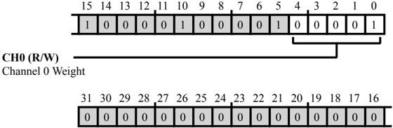

Table 29-74: PCIE\_DMAWR\_ARBWGT\_LO\_[n] Register Fields

| Bit No. (Access)   | Bit Name   | Description/Enumeration                                                                                                                                                                                                              |
|--------------------|------------|--------------------------------------------------------------------------------------------------------------------------------------------------------------------------------------------------------------------------------------|
| 4:0 (R/W)          | CH0        | Channel 0 Weight. The PCIE_DMAWR_ARBWGT_LO_[n].CH0 bit field value is used by the channel weighted round robin arbiter to select the next channel read request. The weight is ini- tialized by software before ringing the doorbell. |

## DMA Write Channel 1 and 0 IMWr Data Register

The PCIE\_DMAWR\_CH01\_IMWR\_[n] register is implemented in RAM whose contents are uninitialized after power on. Therefore, you must program and initialize every field as the default is undefined. All fields marked Reserved must be programmed to 1'b0. This register is not affected by any of the reset signals.

Figure 29-66: PCIE\_DMAWR\_CH01\_IMWR\_[n] Register Diagram

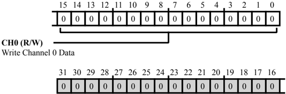

Table 29-75: PCIE\_DMAWR\_CH01\_IMWR\_[n] Register Fields

| Bit No. (Access)   | Bit Name   | Description/Enumeration                                                                                                                                                   |
|--------------------|------------|---------------------------------------------------------------------------------------------------------------------------------------------------------------------------|
| 15:0 (R/W)         | CH0        | Write Channel 0 Data. The DMAuses the PCIE_DMAWR_CH01_IMWR_[n].CH0 bit field to generate the data field for the Done or Abort IMWr TLPs it generates for write channel 0. |

## DMA Control 1 Write Channel Register

The PCIE\_DMAWR\_CTL1\_[n] register is implemented in RAM whose contents are uninitialized after power-on. All fields marked Reserved must be programmed to 1'b0. This register is not affected by any of the reset signals.

Figure 29-67: PCIE\_DMAWR\_CTL1\_[n] Register Diagram

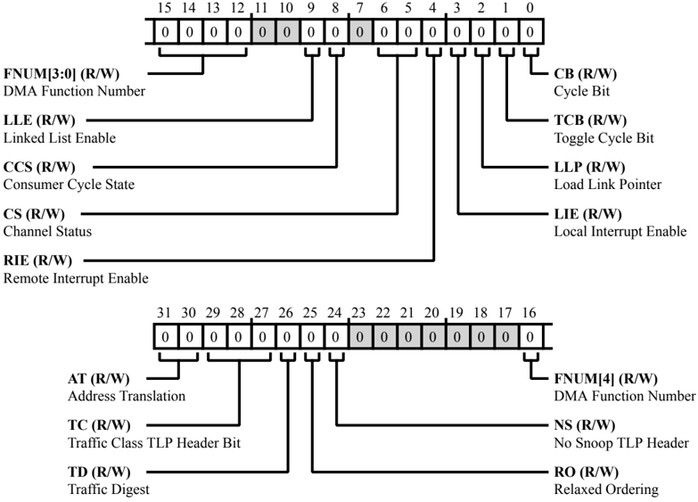

Table 29-76: PCIE\_DMAWR\_CTL1\_[n] Register Fields

| Bit No. (Access)   | Bit Name   | Description/Enumeration                                                                                                                                                                                                            |
|--------------------|------------|------------------------------------------------------------------------------------------------------------------------------------------------------------------------------------------------------------------------------------|
| 31:30 (R/W)        | AT         | Address Translation. The DMAuses the PCIE_DMAWR_CTL1_[n].AT TLP header field when generat- ing memory read and memory write (not IMWr) TLPs.                                                                                       |
| 29:27 (R/W)        | TC         | Traffic Class TLP Header Bit. The DMAuses the PCIE_DMAWR_CTL1_[n].TC bit TLP header field when gen- erating memory read and memory write (not IMWr) TLPs.                                                                          |
| 26 (R/W)           | TD         | Traffic Digest. The PCIe core adds the ECRC field and sets the PCIE_DMAWR_CTL1_[n].TD bit in the TLP header. The DMAuses the PCIE_DMAWR_CTL1_[n].TD TLP header field when generating memory read and memory write (not IMWr) TLPs. |

Table 29-76: PCIE\_DMAWR\_CTL1\_[n] Register Fields (Continued)

| Bit No. (Access)   | Bit Name   | Description/Enumeration                                                                                                                                                                                                                                                                                                  | Description/Enumeration                                                                                                                                                                                                                                                                                                  |
|--------------------|------------|--------------------------------------------------------------------------------------------------------------------------------------------------------------------------------------------------------------------------------------------------------------------------------------------------------------------------|--------------------------------------------------------------------------------------------------------------------------------------------------------------------------------------------------------------------------------------------------------------------------------------------------------------------------|
| 25 (R/W)           | RO         | Relaxed Ordering. The DMAuses the PCIE_DMAWR_CTL1_[n].RO TLP header field when generat- ing memory read and memory write (not IMWr) TLPs.                                                                                                                                                                                | Relaxed Ordering. The DMAuses the PCIE_DMAWR_CTL1_[n].RO TLP header field when generat- ing memory read and memory write (not IMWr) TLPs.                                                                                                                                                                                |
| 24 (R/W)           | NS         | No Snoop TLP Header. The DMAuses the PCIE_DMAWR_CTL1_[n].NS TLP header field when generat- ing memory read and memory write (not IMWr) TLPs.                                                                                                                                                                             | No Snoop TLP Header. The DMAuses the PCIE_DMAWR_CTL1_[n].NS TLP header field when generat- ing memory read and memory write (not IMWr) TLPs.                                                                                                                                                                             |
| 16:12 (R/W)        | FNUM       | DMAFunction Number. The core uses the PCIE_DMAWR_CTL1_[n].FNUM bit field when generating the requester ID for the memory read, memory write DMATLP.                                                                                                                                                                      | DMAFunction Number. The core uses the PCIE_DMAWR_CTL1_[n].FNUM bit field when generating the requester ID for the memory read, memory write DMATLP.                                                                                                                                                                      |
| 9 (R/W)            | LLE        | Linked List Enable. The PCIE_DMAWR_CTL1_[n].LLE bit enables (=1) and disables (=0) linked list operation.                                                                                                                                                                                                                | Linked List Enable. The PCIE_DMAWR_CTL1_[n].LLE bit enables (=1) and disables (=0) linked list operation.                                                                                                                                                                                                                |
| 8 (R/W)            | CCS        | Consumer Cycle State. The PCIE_DMAWR_CTL1_[n].CCS bit is used in linked list mode to synchronize the producer (software) and the consumer (DMA). For more details, see "PCS-CCS- CB-TCB Producer-Consumer Synchronization". This bit must be initialized. The DMAupdates this bit during linked list operation.          | Consumer Cycle State. The PCIE_DMAWR_CTL1_[n].CCS bit is used in linked list mode to synchronize the producer (software) and the consumer (DMA). For more details, see "PCS-CCS- CB-TCB Producer-Consumer Synchronization". This bit must be initialized. The DMAupdates this bit during linked list operation.          |
| 6:5 (R/W)          | CS         | Channel Status. The PCIE_DMAWR_CTL1_[n].CS bit field identifies the current operational state of the DMAchannel. In the case of 2'b11 (Stopped) this means the DMAhas transfer- red all data for this channel, or the program has prematurely stopped this channel by writing to the PCIE_DMAWR_DRBL_[n].STOP bit field. | Channel Status. The PCIE_DMAWR_CTL1_[n].CS bit field identifies the current operational state of the DMAchannel. In the case of 2'b11 (Stopped) this means the DMAhas transfer- red all data for this channel, or the program has prematurely stopped this channel by writing to the PCIE_DMAWR_DRBL_[n].STOP bit field. |
| 6:5 (R/W)          | CS         | 0                                                                                                                                                                                                                                                                                                                        | Reserved                                                                                                                                                                                                                                                                                                                 |
| 6:5 (R/W)          | CS         | 1                                                                                                                                                                                                                                                                                                                        | Running (channel active and transferring data)                                                                                                                                                                                                                                                                           |
| 6:5 (R/W)          | CS         | 2                                                                                                                                                                                                                                                                                                                        | Halted (an error condition has been detected, and the DMAhas stopped this channel)                                                                                                                                                                                                                                       |
| 6:5 (R/W)          | CS         | 3                                                                                                                                                                                                                                                                                                                        | Stopped                                                                                                                                                                                                                                                                                                                  |
| 4 (R/W)            | RIE        | Remote Interrupt Enable. Programs must set the PCIE_DMAWR_CTL1_[n].RIE bit to enable the generation of the Done or Abort Remote interrupts. For more details, see "Interrupts and Error Handling". In LL mode, the DMAoverwrites this with the RIE of the LL element.                                                    | Remote Interrupt Enable. Programs must set the PCIE_DMAWR_CTL1_[n].RIE bit to enable the generation of the Done or Abort Remote interrupts. For more details, see "Interrupts and Error Handling". In LL mode, the DMAoverwrites this with the RIE of the LL element.                                                    |

Table 29-76: PCIE\_DMAWR\_CTL1\_[n] Register Fields (Continued)

| Bit No. (Access)   | Bit Name   | Description/Enumeration                                                                                                                                                                                                                                                                                                                                                                                                                                              |
|--------------------|------------|----------------------------------------------------------------------------------------------------------------------------------------------------------------------------------------------------------------------------------------------------------------------------------------------------------------------------------------------------------------------------------------------------------------------------------------------------------------------|
| 3 (R/W)            | LIE        | Local Interrupt Enable. Programs must set the PCIE_DMAWR_CTL1_[n].LIE bit to enable generation of the Done or Abort Local interrupts. For more details, see "Interrupts and Error Han- dling". In LL mode, the DMAoverwrites this with the LIE of the LL element. The PCIE_DMAWR_CTL1_[n].LIE bit in a LL element only enables the Done inter- rupt. In non-LL mode, this bit enables the Done and Abort interrupts. This field is not defined in a link LL element. |
| 2 (R/W)            | LLP        | Load Link Pointer. The PCIE_DMAWR_CTL1_[n].LLP bit is used in linked list mode only. This bit indicates that this linked list element is a link element, and its LL element pointer dwords are pointing to the next (non-contiguous) element. The DMAloads this field with the LLP of the linked list element.                                                                                                                                                       |
| 1 (R/W)            | TCB        | Toggle Cycle Bit. The PCIE_DMAWR_CTL1_[n].TCB bit indicates to the DMAto toggle its inter- pretation of the CB. Used in linked list mode only. It is used to synchronize the pro- ducer (software) and the consumer (DMA). For more details, see "PCS-CCS-CB-TCB Producer-Consumer Synchronization". The DMAloads this field with the TCB of the linked list element. this field is not defined in a data LL element.                                                |
| 0 (R/W)            | CB         | Cycle Bit. The PCIE_DMAWR_CTL1_[n].CB bit is used in linked list mode only. It is used to synchronize the producer (software) and the consumer (DMA). For more details, see "PCS-CCS-CB-TCB Producer-Consumer Synchronization". The DMAloads this field with the CB of the linked list element.                                                                                                                                                                      |

## DMA Dar High Write Channel Register

The PCIE\_DMAWR\_DAR\_HI\_[n] register is implemented in RAM whose contents are uninitialized after poweron. All fields marked Reserved must be programmed to 1'b0. This register is not affected by any of the reset signals.

Figure 29-68: PCIE\_DMAWR\_DAR\_HI\_[n] Register Diagram


Table 29-77: PCIE\_DMAWR\_DAR\_HI\_[n] Register Fields

| Bit No. (Access)   | Bit Name   | Description/Enumeration                                                                                                                 |
|--------------------|------------|-----------------------------------------------------------------------------------------------------------------------------------------|
| 31:0 (R/W)         | VALUE      | Higher 32 bits. In LL mode, the DMAoverwrites the PCIE_DMAWR_DAR_HI_[n].VALUE bit field with the corresponding dword of the LL element. |

## DMA DAR Low Write Channel Register

The PCIE\_DMAWR\_DAR\_LO\_[n] register is implemented in RAM whose contents are uninitialized after poweron. All fields marked Reserved must be programmed to 1'b0. This register is not affected by any of the reset signals.

Figure 29-69: PCIE\_DMAWR\_DAR\_LO\_[n] Register Diagram


Table 29-78: PCIE\_DMAWR\_DAR\_LO\_[n] Register Fields

| Bit No. (Access)   | Bit Name   | Description/Enumeration                                                                                                                                                                                                                                                                                                                                                     |
|--------------------|------------|-----------------------------------------------------------------------------------------------------------------------------------------------------------------------------------------------------------------------------------------------------------------------------------------------------------------------------------------------------------------------------|
| 31:0 (R/W)         | VALUE      | Lower 32 bits. The PCIE_DMAWR_DAR_LO_[n].VALUE bit field indicates the next address to be written to. The DMAincrements the DAR as the DMAtransfer progresses. The DAR is always dword aligned even if the transfer size is byte aligned. In LL mode, theDMA overwrites this with the corresponding dword of the LL element. The DAR is the ad- dress of the remote memory. |

## DMA Write Done IMWr Interrupt Address High Register

The PCIE\_DMAWR\_DONE\_IMWR\_HI\_[n] register is implemented in RAM whose contents are uninitialized after power on. Programs must initialize every field as the default is undefined. All fields marked Reserved must be programmed to 1'b0. This register is not affected by any of the reset signals.

Figure 29-70: PCIE\_DMAWR\_DONE\_IMWR\_HI\_[n] Register Diagram

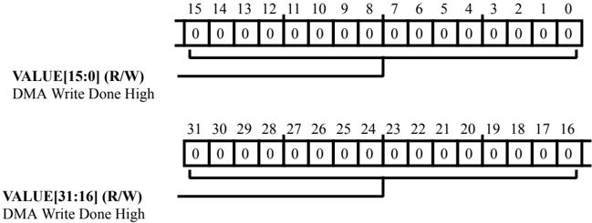

Table 29-79: PCIE\_DMAWR\_DONE\_IMWR\_HI\_[n] Register Fields

| Bit No. (Access)   | Bit Name   | Description/Enumeration                                                                                                                              |
|--------------------|------------|------------------------------------------------------------------------------------------------------------------------------------------------------|
| 31:0 (R/W)         | VALUE      | DMAWrite Done High. The DMAuses the PCIE_DMAWR_DONE_IMWR_HI_[n].VALUE bit field to generate bits [63:32] of the address field for the Done IMWr TLP. |

## DMA Write Done IMWr Address Low Register

The PCIE\_DMAWR\_DONE\_IMWR\_LO\_[n] register is implemented in RAM whose contents are uninitialized after power on. Therefore, you must program and initialize every field as the default is undefined. All fields marked Reserved must be programmed to 1'b0. This register is not affected by any of the reset signals.

Figure 29-71: PCIE\_DMAWR\_DONE\_IMWR\_LO\_[n] Register Diagram

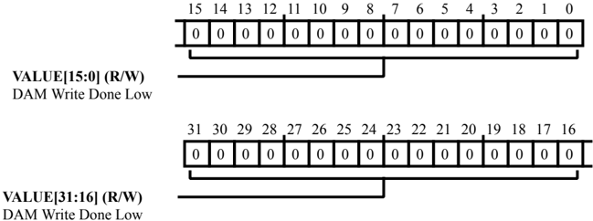

Table 29-80: PCIE\_DMAWR\_DONE\_IMWR\_LO\_[n] Register Fields

| Bit No. (Access)   | Bit Name   | Description/Enumeration                                                                                                                                                                                         |
|--------------------|------------|-----------------------------------------------------------------------------------------------------------------------------------------------------------------------------------------------------------------|
| 31:0 (R/W)         | VALUE      | DAMWrite Done Low. The DMAuses the PCIE_DMAWR_DONE_IMWR_LO_[n].VALUE bit field to generate bits [31:0] of the address field for the Done IMWr TLP. Bits [1:0] must be 00 as this address must be dword aligned. |

## DMA Write Doorbell Register

The PCIE\_DMAWR\_DRBL\_[n] register contains bits that set a channel number to start the DMA write transfer for that channel and to stop a DMA transfer.

Figure 29-72: PCIE\_DMAWR\_DRBL\_[n] Register Diagram

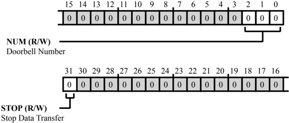

Table 29-81: PCIE\_DMAWR\_DRBL\_[n] Register Fields

| Bit No. (Access)   | Bit Name   | Description/Enumeration                                                                                                                                                                                                                                                                                                                                                                                                        |
|--------------------|------------|--------------------------------------------------------------------------------------------------------------------------------------------------------------------------------------------------------------------------------------------------------------------------------------------------------------------------------------------------------------------------------------------------------------------------------|
| 31 (R/W)           | STOP       | Stop Data Transfer. The PCIE_DMAWR_DRBL_[n].STOP bit is set in conjunction with the PCIE_DMAWR_DRBL_[n].NUM field. The DMAwrite channel stops issuing re- quests, sets the channel status to Stopped, and asserts the Abort interrupt if it is ena- bled. Before setting this bit, the program must read the PCIE_DMAWR_CTL1_[n].CS bit field to ensure that the write channel is Running (transferring data).                 |
| 2:0 (R/W)          | NUM        | Doorbell Number. The PCIE_DMAWR_DRBL_[n].NUM bit field provides the channel number to this register to start the DMAwrite transfer for that channel. The DMAdetects a write to this register field even if the value of this field does not change. Programs do not need to toggle or write any other value to this register to start a new transfer. The range of this field is 0x0 to 0x7, and 0x0 corresponds to channel 0. |

## DMA Write Engine Enable Register

The PCIE\_DMAWR\_EN\_[n] register enables the DMA write engine.

Figure 29-73: PCIE\_DMAWR\_EN\_[n] Register Diagram

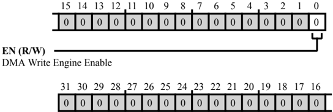

Table 29-82: PCIE\_DMAWR\_EN\_[n] Register Fields

| Bit No. (Access)   | Bit Name   | Description/Enumeration                                                                                                                                                                                                                                                                                                                                                                                                                                                                                                                                                                                                                                                                                                                                                                                                                                                                                                                                                                                                                                                                                                                                                                                                                                                                                                                                                                                                                                                                                                                                                                                                           |
|--------------------|------------|-----------------------------------------------------------------------------------------------------------------------------------------------------------------------------------------------------------------------------------------------------------------------------------------------------------------------------------------------------------------------------------------------------------------------------------------------------------------------------------------------------------------------------------------------------------------------------------------------------------------------------------------------------------------------------------------------------------------------------------------------------------------------------------------------------------------------------------------------------------------------------------------------------------------------------------------------------------------------------------------------------------------------------------------------------------------------------------------------------------------------------------------------------------------------------------------------------------------------------------------------------------------------------------------------------------------------------------------------------------------------------------------------------------------------------------------------------------------------------------------------------------------------------------------------------------------------------------------------------------------------------------|
| 0 (R/W)            | EN         | DMAWrite Engine Enable. When set (=1) the PCIE_DMAWR_EN_[n].EN bit enables the DMAwrite engine. For normal operation, set this bit to 1 before performing any other software setup ac- tions. Programs do not need to toggle or rewrite to this bit during normal operation. Programs should set the PCIE_DMAWR_EN_[n].EN bit to 0 to perform a soft reset the DMAcontroller write logic. There are three reasons for resetting the DMAcon- troller write logic • The PCIE_DMAWR_ISTAT_[n].ABRT bit is set, and any of the bits is in the PCIE_DMAWR_ERRSTAT_[n] register are set. Resetting the DMAcontroller write logic re-initializes the control logic, ensuring that the next DMAwrite trans- fer is executed successfully. • The program has executed the procedure outlined in the PCIE_DMAWR_DRBL_[n].STOP bit description, after which, the PCIE_DMAWR_ISTAT_[n].ABRT bit is set and the PCIE_DMAWR_CTL1_[n].CS bit field is set to Stopped. Resetting theDMA controller write logic re-initializes the control logic ensuring that the nextDMA write transfer is executed successfully. • During software development, when the DMAwrite engine is programmed incor- rectly. To perform a soft reset the DMAcontroller write logic: • De-assert the DMAwrite engine enable bit. • Wait for the DMAto complete any in-progress TLP transfer, by waiting until a read on the DMAwrite engine enable bit returns a 0. • Assert the DMAwrite engine enable bit. This soft reset does not clear the DMAconfiguration registers. The DMAwrite trans- fer does not start until you write to the PCIE_DMAWR_DRBL_[n].STOP bit. |

## DMA Write Error Status Register

The PCIE\_DMAWR\_ERRSTAT\_[n] register reports various write errors.

Figure 29-74: PCIE\_DMAWR\_ERRSTAT\_[n] Register Diagram

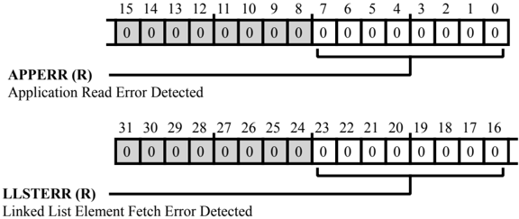

Table 29-83: PCIE\_DMAWR\_ERRSTAT\_[n] Register Fields

| Bit No. (Access)   | Bit Name   | Description/Enumeration                                                                                                                                                                                                                                                                                                                                                                                                                                                                                                                                                                                                                                                                                                                                             |
|--------------------|------------|---------------------------------------------------------------------------------------------------------------------------------------------------------------------------------------------------------------------------------------------------------------------------------------------------------------------------------------------------------------------------------------------------------------------------------------------------------------------------------------------------------------------------------------------------------------------------------------------------------------------------------------------------------------------------------------------------------------------------------------------------------------------|
| 23:16 (R/NW)       | LLSTERR    | Linked List Element Fetch Error Detected. The PCIE_DMAWR_ERRSTAT_[n].LLSTERR bit provides notice that theDMA write channel has received an error response. This response comes from the peripheral or SCB bus (or the RTRGT1 interface when the peripheral or SCB Bridge is not used) while reading a linked list element from local memory. Each bit corresponds to a DMAchannel. Bit [0] corresponds to channel 0. • Enabling: For details, see "Interrupts and Error Handling". • Masking: The DMAwrite interrupt Mask register has no effect on this register. • Clearing: Programs must write a 1'b1 to the corresponding channel bit in the Abort interrupt field of the "DMA Write Interrupt Clear Register" (DMA_WR_INT_CLEAR_OFF) to clear this error bit. |
| 7:0 (R/NW)         | APPERR     | Application Read Error Detected. The PCIE_DMAWR_ERRSTAT_[n].APPERR bit provides notice that theDMA write channel has received an error response. This response comes from the peripheral or SCB bus (or the RTRGT1 interface when the peripheral or SCB Bridge is not used) while reading data from it. Each bit corresponds to a DMAchannel. Bit [0] corre- sponds to channel 0. • Enabling: For details, see "Interrupts and Error Handling". • Masking: The DMAwrite interrupt Mask register has no effect on this register. • Clearing: Programs must write a 1'b1 to the corresponding channel bit in the Abort interrupt field of the "DMA Write Interrupt Clear Register" (DMA_WR_INT_CLEAR_OFF) to clear this error bit.                                    |

## DMA Write Interrupt Clear Register

The PCIE\_DMAWR\_ICLR\_[n] register provides bits that all the program to clear interrupts from the PCIE\_DMAWR\_ISTAT\_[n].DONE and PCIE\_DMAWR\_ISTAT\_[n].DONE fields. Each bit corresponds to a DMA channel.

Figure 29-75: PCIE\_DMAWR\_ICLR\_[n] Register Diagram

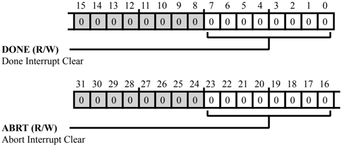

Table 29-84: PCIE\_DMAWR\_ICLR\_[n] Register Fields

| Bit No. (Access)   | Bit Name   | Description/Enumeration                                                                                                                                                                                                                                                                                                                                |
|--------------------|------------|--------------------------------------------------------------------------------------------------------------------------------------------------------------------------------------------------------------------------------------------------------------------------------------------------------------------------------------------------------|
| 23:16 (R/W)        | ABRT       | Abort Interrupt Clear. Programs must write a 1'b1 to the PCIE_DMAWR_ICLR_[n].ABRT bit field clear the corresponding bit in the PCIE_DMAWR_ISTAT_[n].ABRT field of theDMA write interrupt status register. Each bit corresponds to a DMAchannel. Bit [0] corre- sponds to channel 0. Reading from this self-clearing register field always returns a 0. |
| 7:0 (R/W)          | DONE       | Done Interrupt Clear. Programs must write a 1'b1 to the PCIE_DMAWR_ICLR_[n].DONE bit field clear the corresponding bit in the PCIE_DMAWR_ISTAT_[n].DONE field of theDMA write interrupt status register. Each bit corresponds to a DMAchannel. Bit [0] corre- sponds to channel 0. Reading from this self-clearing register field always returns a 0.  |

## DMA Write Interrupt Mask Register

The PCIE\_DMAWR\_IMSK\_[n] register is used to mask interrupts in the PCIE\_DMAWR\_ISTAT\_[n] register.

Figure 29-76: PCIE\_DMAWR\_IMSK\_[n] Register Diagram

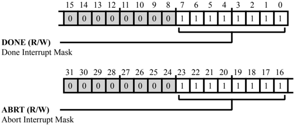

Table 29-85: PCIE\_DMAWR\_IMSK\_[n] Register Fields

| Bit No. (Access)   | Bit Name   | Description/Enumeration                                                                                                                                                                                                                    |
|--------------------|------------|--------------------------------------------------------------------------------------------------------------------------------------------------------------------------------------------------------------------------------------------|
| 23:16 (R/W)        | ABRT       | Abort Interrupt Mask. The PCIE_DMAWR_IMSK_[n].ABRT bit field prevents the PCIE_DMAWR_ISTAT_[n].ABRT status field in the DMAfrom asserting the ed- ma_int output. Each bit corresponds to a DMAchannel. Bit [0] corresponds to chan- nel 0. |
| 7:0 (R/W)          | DONE       | Done Interrupt Mask. The PCIE_DMAWR_IMSK_[n].DONE bit field prevents the PCIE_DMAWR_ISTAT_[n].DONE status field in the DMAfrom asserting the ed- ma_int output. Each bit corresponds to a DMAchannel. Bit [0] corresponds to chan- nel 0.  |

## DMA Write Interrupt Status Register

The PCIE\_DMAWR\_ISTAT\_[n] register provides status information on DMA writes.

Figure 29-77: PCIE\_DMAWR\_ISTAT\_[n] Register Diagram


Table 29-86: PCIE\_DMAWR\_ISTAT\_[n] Register Fields

| Bit No. (Access)   | Bit Name   | Description/Enumeration                                                                                                                                                                                                                                                                                                                                                                                                                                                                                                                                                                                                                                                                                                                                                                            |
|--------------------|------------|----------------------------------------------------------------------------------------------------------------------------------------------------------------------------------------------------------------------------------------------------------------------------------------------------------------------------------------------------------------------------------------------------------------------------------------------------------------------------------------------------------------------------------------------------------------------------------------------------------------------------------------------------------------------------------------------------------------------------------------------------------------------------------------------------|
| 23:16 (R/W)        | ABRT       | Abort Interrupt Status. The PCIE_DMAWR_ISTAT_[n].ABRT indicates the DMAwrite channel has de- tected an error or the transfer was stopped manually. Each bit corresponds to aDMA channel. Bit [0] corresponds to channel 0. Programs can read the DMARead Error Status Low Register and DMARead Error Status High Register to determine the source of the error. The DMAread interrupt Mask register has no effect on this bit field. Programs must write a 1'b1 to the corre- sponding channel bit in the DMAread interrupt Clear register to clear this interrupt bit. Programs can write to this bit field to emulate interrupt generation, during software or hardware testing. A write to the address triggers an interrupt, but the DMAdoes not set the Done or Abort bits in this bit field. |
| 7:0 (R/W)          | DONE       | Done Interrupt Status. The PCIE_DMAWR_ISTAT_[n].DONE bit field indicates the DMAwrite channel has successfully completed the DMAtransfer. Each bit corresponds to a DMAchan- nel. Bit [0] corresponds to channel 0. - Enabling: For details, see "Interrupts and Error Handling". - Masking: The DMAwrite interrupt Mask register has no effect on this register. - Clearing: You must write a 1'b1 to the corresponding channel bit in the DMAwrite interrupt Clear register to clear this interrupt bit. <b> Note: </b> You can write to this register to emulate interrupt generation, during software or hardware test- ing. A write to the address triggers an interrupt, but the DMAdoes not set the Done or Abort bits in this register.                                                    |

## DMA LLP High Write Channel Register

The PCIE\_DMAWR\_LLP\_HI\_[n] register is implemented in RAM whose contents are uninitialized after power on. This register value must always be initialized because the default is undefined. All fields marked Reserved must be programmed to 1'b0. This register is not affected by any of the reset signals.

Figure 29-78: PCIE\_DMAWR\_LLP\_HI\_[n] Register Diagram


Table 29-87: PCIE\_DMAWR\_LLP\_HI\_[n] Register Fields

| Bit No. (Access)   | Bit Name   | Description/Enumeration                                                                                                                                                                                                                                                                                                                |
|--------------------|------------|----------------------------------------------------------------------------------------------------------------------------------------------------------------------------------------------------------------------------------------------------------------------------------------------------------------------------------------|
| 31:0 (R/W)         | VALUE      | Upper 32 address bits. The PCIE_DMAWR_LLP_HI_[n].VALUE bit field contains the upper 32 bits of the address of the linked list transfer list in local memory. Used in linked list mode only. The PCIE_DMAWR_LLP_HI_[n].VALUE bit field is updated by theDMA to point to the next element in the transfer list as elements are consumed. |

## DMA LLP Low Write Channel Register

The PCIE\_DMAWR\_LLP\_LO\_[n] register is implemented in RAM whose contents are uninitialized after power on. All fields marked Reserved must be programmed to 1'b0. This register is not affected by any of the reset signals.

Figure 29-79: PCIE\_DMAWR\_LLP\_LO\_[n] Register Diagram


Table 29-88: PCIE\_DMAWR\_LLP\_LO\_[n] Register Fields

| Bit No. (Access)   | Bit Name   | Description/Enumeration                                                                                                                                                                                                                                                                                                                                                                                                                                                                                                                          |
|--------------------|------------|--------------------------------------------------------------------------------------------------------------------------------------------------------------------------------------------------------------------------------------------------------------------------------------------------------------------------------------------------------------------------------------------------------------------------------------------------------------------------------------------------------------------------------------------------|
| 31:0 (R/W)         | VALUE      | Lower address bits. The PCIE_DMAWR_LLP_LO_[n].VALUE bit field contains the lower bits of the address of the linked list transfer list in local memory. Used in linked list mode only. The PCIE_DMAWR_LLP_LO_[n].VALUE bit field is updated by the DMAto point to the next element in the transfer list after the previous element is consumed. • When the current element is a data element; this field is incremented by 6. • When the current element is a link element; this field is overwritten by the LL Ele- ment Pointer of the element. |

## DMA Write Linked List Error Enable Register

The PCIE\_DMAWR\_LLSTERR\_EN\_[n] register provides bits in the LL element that enable the channel done and abort interrupts (local and remote).

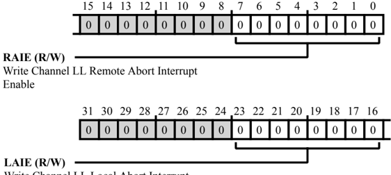

Enable Write Channel LL Local Abort Interrupt

Figure 29-80: PCIE\_DMAWR\_LLSTERR\_EN\_[n] Register Diagram

Table 29-89: PCIE\_DMAWR\_LLSTERR\_EN\_[n] Register Fields

| Bit No. (Access)   | Bit Name   | Description/Enumeration                                                                                                                                                                                                                               |
|--------------------|------------|-------------------------------------------------------------------------------------------------------------------------------------------------------------------------------------------------------------------------------------------------------|
| 23:16 (R/W)        | LAIE       | Write Channel LL Local Abort Interrupt Enable. The PCIE_DMAWR_LLSTERR_EN_[n].LAIE bit field enables the write channel local abort interrupt. Each bit corresponds to a DMAchannel. Bit [0] corresponds to channel 0. Used in linked list mode only.   |
| 7:0 (R/W)          | RAIE       | Write Channel LL Remote Abort Interrupt Enable. The PCIE_DMAWR_LLSTERR_EN_[n].RAIE bit field enables the write channel remote abort interrupt. Each bit corresponds to a DMAchannel. Bit [0] corresponds to channel 0. Used in linked list mode only. |

## DMA Write Posted Request Deadlock Timer Register

The PCIE\_DMAWR\_PREQ\_TMR\_[n] register sets the time-out value for the write channel DMA transmit write posted request deadlock timer. This timer is only enabled if there is a pending TX non-DMA completion blocked behind the DMA posted request. When the timer expires, the core pulls back the pending DMA posted request and allows non-DMA completions to pass. When all completions have been transmitted, the SCB bridge replays the DMA posted requests. If the DMA posted TLPs are not making progress and posted credits have not been returned within this time frame, then is safe to assume that the DMA posted TLPs are blocked.

The timeout value increments in steps of 2 usec. The default value is 30 usec based on the PCIe specification's maximum latency between posted credit updates from the remote link partner. The timeout value must be less than the remote link partner's completion timeout value to avoid the remote link partner timing out its non-posted requests. The minimum completion timeout value is 50 usec but is typically in the order of tens of milliseconds. If the deadlock timeout value is too close to the completion timeout value then you can reprogram this timer and decrease the timeout value.

To allow sufficient time for posted credits to be updated and avoid unnecessary flushing of DMA posted requests, the recommended minimum timer value is 10 usec.

Figure 29-81: PCIE\_DMAWR\_PREQ\_TMR\_[n] Register Diagram

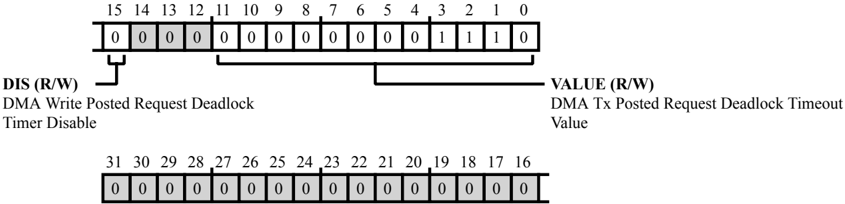

Table 29-90: PCIE\_DMAWR\_PREQ\_TMR\_[n] Register Fields

| Bit No. (Access)   | Bit Name   | Description/Enumeration                                                                                                                                                                                                                                                                                            |
|--------------------|------------|--------------------------------------------------------------------------------------------------------------------------------------------------------------------------------------------------------------------------------------------------------------------------------------------------------------------|
| 15 (R/W)           | DIS        | DMAWrite Posted Request Deadlock Timer Disable. The PCIE_DMAWR_PREQ_TMR_[n].DIS bit disables the deadlock timer.                                                                                                                                                                                                   |
| 11:0 (R/W)         | VALUE      | DMATx Posted Request Deadlock Timeout Value. The PCIE_DMAWR_PREQ_TMR_[n].VALUE bit field sets the DMATx posted re- quest deadlock timeout value. In normal operation the receiver must process a posted request within 10 usec. The default value is 30 usec and encoding is 0 = 2us, 1 = 4us, ..., 4095 = 8192us. |

## DMA SAR High Write Channel Register

The PCIE\_DMAWR\_SAR\_HI\_[n] register is implemented in RAM whose contents are uninitialized after poweron. All fields marked Reserved must be programmed to 1'b0. This register is not affected by any of the reset signals.

Figure 29-82: PCIE\_DMAWR\_SAR\_HI\_[n] Register Diagram

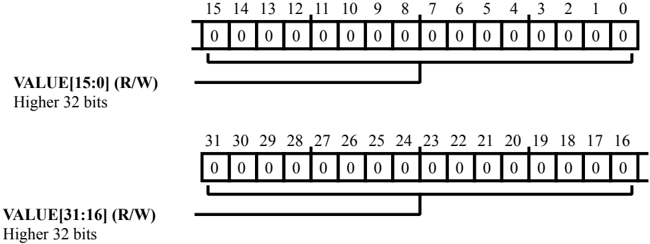

Table 29-91: PCIE\_DMAWR\_SAR\_HI\_[n] Register Fields

| Bit No. (Access)   | Bit Name   | Description/Enumeration                                                                                                                 |
|--------------------|------------|-----------------------------------------------------------------------------------------------------------------------------------------|
| 31:0 (R/W)         | VALUE      | Higher 32 bits. In LL mode, the DMAoverwrites the PCIE_DMAWR_SAR_HI_[n].VALUE bit field with the corresponding dword of the LL element. |

## DMA SAR Low Write Channel Register

The PCIE\_DMAWR\_SAR\_LO\_[n] register is implemented in RAM whose contents are uninitialized after poweron. All fields marked Reserved must be programmed to 1'b0. This register is not affected by any of the reset signals.

Figure 29-83: PCIE\_DMAWR\_SAR\_LO\_[n] Register Diagram

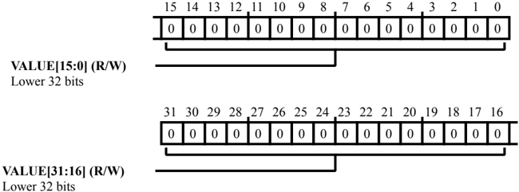

Table 29-92: PCIE\_DMAWR\_SAR\_LO\_[n] Register Fields

| Bit No. (Access)   | Bit Name   | Description/Enumeration                                                                                                                                                                                                                                                                     |
|--------------------|------------|---------------------------------------------------------------------------------------------------------------------------------------------------------------------------------------------------------------------------------------------------------------------------------------------|
| 31:0 (R/W)         | VALUE      | Lower 32 bits. The PCIE_DMAWR_SAR_LO_[n].VALUE register indicates the next address to be read from. The DMAincrements the SAR as the DMAtransfer progresses. In LL mode, the DMAoverwrites this with the corresponding dword of the LL element. The SAR is the address of the local memory. |

## DMA Transfer Size Write Channel Register

The PCIE\_DMAWR\_XFRSZ\_0[n] register is implemented in RAM whose contents are uninitialized after poweron. All fields marked Reserved must be programmed to 1'b0. This register is not affected by any of the reset signals.

Figure 29-84: PCIE\_DMAWR\_XFRSZ\_0[n] Register Diagram


Table 29-93: PCIE\_DMAWR\_XFRSZ\_0[n] Register Fields

| Bit No. (Access)   | Bit Name   | Description/Enumeration                                                                                                                                                                                                                                                                                                                                                                                                                                                                                                                                                   |
|--------------------|------------|---------------------------------------------------------------------------------------------------------------------------------------------------------------------------------------------------------------------------------------------------------------------------------------------------------------------------------------------------------------------------------------------------------------------------------------------------------------------------------------------------------------------------------------------------------------------------|
| 31:0 (R/W)         | SZ         | DMATransfer Size. The PCIE_DMAWR_XFRSZ_0[n].SZ bit field configures the size of theDMA transfer. The maximum DMAtransfer size is 4Gbytes. The minimum transfer size is one byte (0x1). This field is automatically decremented by the DMAas theDMA write and read channel transfer progresses. This field indicates the number bytes re- maining to be transferred. When all bytes are successfully transferred the current trans- fer size is zero. In LL mode, the DMAoverwrites the PCIE_DMAWR_XFRSZ_0[n].SZ bit field with the corresponding dword of the LL element. |

## DMA Number of Channels Register

The PCIE\_DMA\_CTL\_[n] register reports the number of read and write channels that are configured.

Figure 29-85: PCIE\_DMA\_CTL\_[n] Register Diagram

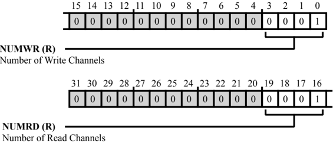

Table 29-94: PCIE\_DMA\_CTL\_[n] Register Fields

| Bit No. (Access)   | Bit Name   | Description/Enumeration                                                                                                                              |
|--------------------|------------|------------------------------------------------------------------------------------------------------------------------------------------------------|
| 19:16 (R/NW)       | NUMRD      | Number of Read Channels. The PCIE_DMA_CTL_[n].NUMRD bit field reports the number of read channels the DMAcontroller is configured to support.        |
| 3:0 (R/NW)         | NUMWR      | Number of Write Channels. The PCIE_DMA_CTL_[n].NUMWR bit field reports the number of write channels that the DMAcontroller is configured to support. |

## DMA Channel Context Index Register

The PCIE\_DMA\_VWPRT\_SEL\_[n] register programs the DMA registers using an indirect addressing scheme to reduce the address footprint in the PCI Express extended configuration space.

Figure 29-86: PCIE\_DMA\_VWPRT\_SEL\_[n] Register Diagram

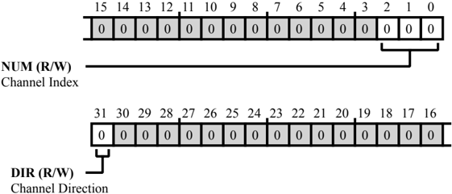

Table 29-95: PCIE\_DMA\_VWPRT\_SEL\_[n] Register Fields

| Bit No. (Access)   | Bit Name   | Description/Enumeration                                                                                                                                         |
|--------------------|------------|-----------------------------------------------------------------------------------------------------------------------------------------------------------------|
| 31 (R/W)           | DIR        | Channel Direction. The PCIE_DMA_VWPRT_SEL_[n].DIR bit field sets the channel direction. Se- lects a write channel or read channel context. 0 DMAWrite 1 DMARead |
| 2:0 (R/W)          | NUM        | Channel Index. The PCIE_DMA_VWPRT_SEL_[n].NUM bit field sets the channel number. This field must be set to 0x0.                                                 |

## Endpoint Base Address Mask Register 0

The mask for this BAR exists as a shadow register at this address. The PCIE\_EP\_BAR0\_[n] register cannot be disabled but this register can be modified to change the size of memory advertised by PCIE\_EP\_BAR0\_[n] to the host processor. Writing to this register is enabled if the PCIE\_MISC\_CTL1\_[n].RODBIWREN bit is set.

Figure 29-87: PCIE\_EP\_BAR0\_MASK[n] Register Diagram

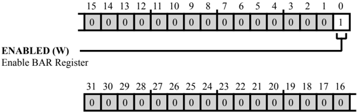

Table 29-96: PCIE\_EP\_BAR0\_MASK[n] Register Fields

| Bit No. (Access)   | Bit Name   | Description/Enumeration                                      |
|--------------------|------------|--------------------------------------------------------------|
| 0                  | ENABLED    | Enable BAR Register.                                         |
| (RX/W)             |            | The PCIE_EP_BAR0_MASK[n].ENABLED bit indicates memory space. |

## Endpoint Base Address Register 0

The PCIE\_EP\_BAR0\_[n] register forms bits [31:x] of the start address of the address region to be translated. This register also determines the use of the prefetch capability. For more information, see the PCI Express Base Specification, Rev. 3.0.


Start

Figure 29-88: PCIE\_EP\_BAR0\_[n] Register Diagram

Table 29-97: PCIE\_EP\_BAR0\_[n] Register Fields

| Bit No. (Access)   | Bit Name   | Description/Enumeration                                                                                                                                                                                                                                                                         | Description/Enumeration                                                                                                                                                                                                                                                                         |
|--------------------|------------|-------------------------------------------------------------------------------------------------------------------------------------------------------------------------------------------------------------------------------------------------------------------------------------------------|-------------------------------------------------------------------------------------------------------------------------------------------------------------------------------------------------------------------------------------------------------------------------------------------------|
| 31:4 (R/W)         | ST         | Start. The PCIE_EP_BAR0_[n].ST bit field forms bits [31:x] of the start address of the address region to be translated.                                                                                                                                                                         | Start. The PCIE_EP_BAR0_[n].ST bit field forms bits [31:x] of the start address of the address region to be translated.                                                                                                                                                                         |
| 3 (R/W)            | PF         | Prefetch. The PCIE_EP_BAR0_[n].PF bit is usually set to one if there are no side effects on reads. The device returns all bytes on reads regardless of the byte enables, and host bridges can merge processor writes into this range without causing errors. Bit must be set to zero otherwise. | Prefetch. The PCIE_EP_BAR0_[n].PF bit is usually set to one if there are no side effects on reads. The device returns all bytes on reads regardless of the byte enables, and host bridges can merge processor writes into this range without causing errors. Bit must be set to zero otherwise. |
| 2:1 (R/W)          | TYPE       | Type.                                                                                                                                                                                                                                                                                           | Type.                                                                                                                                                                                                                                                                                           |
|                    |            | 0                                                                                                                                                                                                                                                                                               | Locate anywhere in 32-bit access space                                                                                                                                                                                                                                                          |
|                    |            | 1                                                                                                                                                                                                                                                                                               | Reserved                                                                                                                                                                                                                                                                                        |
|                    |            | 2                                                                                                                                                                                                                                                                                               | Locate anywhere in 62-bit access space                                                                                                                                                                                                                                                          |
|                    |            | 3                                                                                                                                                                                                                                                                                               | Reserved                                                                                                                                                                                                                                                                                        |
| 0                  | MIO        | Memory I/O.                                                                                                                                                                                                                                                                                     | Memory I/O.                                                                                                                                                                                                                                                                                     |
| (R/W)              |            | The PCIE_EP_BAR0_[n].MIO bit indicates memory space.                                                                                                                                                                                                                                            | The PCIE_EP_BAR0_[n].MIO bit indicates memory space.                                                                                                                                                                                                                                            |
|                    |            | 0                                                                                                                                                                                                                                                                                               | Memory space                                                                                                                                                                                                                                                                                    |
|                    |            | 1                                                                                                                                                                                                                                                                                               | I/O space                                                                                                                                                                                                                                                                                       |

## Endpoint Base Address Mask Register 1

The mask for this BAR exists as a shadow register at this address. The PCIE\_EP\_BAR0\_[n] register cannot be disabled but this register ( PCIE\_EP\_BAR1\_MASK[n] ) can be modified to change the size of memory advertised by PCIE\_EP\_BAR0\_[n] to the host processor. Writing to this register is enabled if the PCIE\_MISC\_CTL1\_[n].RODBIWREN bit is set.

Figure 29-89: PCIE\_EP\_BAR1\_MASK[n] Register Diagram


Table 29-98: PCIE\_EP\_BAR1\_MASK[n] Register Fields

| Bit No. (Access)   | Bit Name   | Description/Enumeration                                                           |
|--------------------|------------|-----------------------------------------------------------------------------------|
| 0 (RX/W)           | ENABLED    | Enable BAR Register. The PCIE_EP_BAR1_MASK[n].ENABLED bit indicates memory space. |

## Endpoint Base Address Register 1

The PCIE\_EP\_BAR1\_[n] register forms bits [31:x] of the start address of the address region to be translated. This register also determines the use of the prefetch capability. For more information, see the PCI Express Base Specification, Rev. 3.0.

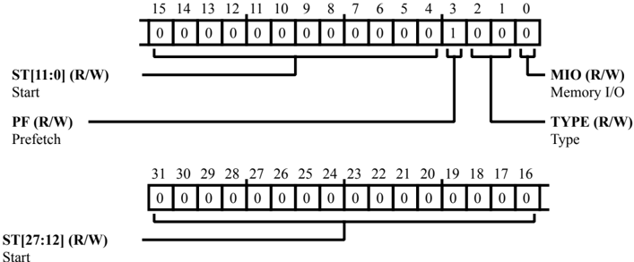

Start

Figure 29-90: PCIE\_EP\_BAR1\_[n] Register Diagram

Table 29-99: PCIE\_EP\_BAR1\_[n] Register Fields

| Bit No. (Access)   | Bit Name   | Description/Enumeration                                                                                                                                                                                                                                                                         | Description/Enumeration                                                                                                                                                                                                                                                                         |
|--------------------|------------|-------------------------------------------------------------------------------------------------------------------------------------------------------------------------------------------------------------------------------------------------------------------------------------------------|-------------------------------------------------------------------------------------------------------------------------------------------------------------------------------------------------------------------------------------------------------------------------------------------------|
| 31:4 (R/W)         | ST         | Start. The PCIE_EP_BAR1_[n].ST bit field forms bits [31:x] of the start address of the address region to be translated.                                                                                                                                                                         | Start. The PCIE_EP_BAR1_[n].ST bit field forms bits [31:x] of the start address of the address region to be translated.                                                                                                                                                                         |
| 3 (R/W)            | PF         | Prefetch. The PCIE_EP_BAR1_[n].PF bit is usually set to one if there are no side effects on reads. The device returns all bytes on reads regardless of the byte enables, and host bridges can merge processor writes into this range without causing errors. Bit must be set to zero otherwise. | Prefetch. The PCIE_EP_BAR1_[n].PF bit is usually set to one if there are no side effects on reads. The device returns all bytes on reads regardless of the byte enables, and host bridges can merge processor writes into this range without causing errors. Bit must be set to zero otherwise. |
| 2:1 (R/W)          | TYPE       | Type.                                                                                                                                                                                                                                                                                           | Type.                                                                                                                                                                                                                                                                                           |
|                    |            | 0                                                                                                                                                                                                                                                                                               | Locate anywhere in 32-bit access space                                                                                                                                                                                                                                                          |
|                    |            | 1                                                                                                                                                                                                                                                                                               | Reserved                                                                                                                                                                                                                                                                                        |
|                    |            | 2                                                                                                                                                                                                                                                                                               | Locate anywhere in 62-bit access space                                                                                                                                                                                                                                                          |
|                    |            | 3                                                                                                                                                                                                                                                                                               | Reserved                                                                                                                                                                                                                                                                                        |
| 0                  | MIO        | Memory I/O.                                                                                                                                                                                                                                                                                     | Memory I/O.                                                                                                                                                                                                                                                                                     |
| (R/W)              |            | The PCIE_EP_BAR1_[n].MIO bit selects the memory space indicator.                                                                                                                                                                                                                                | The PCIE_EP_BAR1_[n].MIO bit selects the memory space indicator.                                                                                                                                                                                                                                |
|                    |            | 0                                                                                                                                                                                                                                                                                               | Memory space                                                                                                                                                                                                                                                                                    |
|                    |            | 1                                                                                                                                                                                                                                                                                               | I/O space                                                                                                                                                                                                                                                                                       |

## Endpoint Base Address Mask Register 2

The mask for this BAR exists as a shadow register at this address. The PCIE\_EP\_BAR0\_[n] register cannot be disabled but but this register ( PCIE\_EP\_BAR2\_MASK[n] ) can be modified to change the size of memory advertised by PCIE\_EP\_BAR0\_[n] to the host processor. Writing to this register is enabled if the PCIE\_MISC\_CTL1\_[n].RODBIWREN bit is set.

Figure 29-91: PCIE\_EP\_BAR2\_MASK[n] Register Diagram

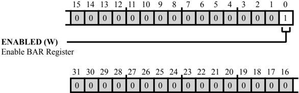

Table 29-100: PCIE\_EP\_BAR2\_MASK[n] Register Fields

| Bit No. (Access)   | Bit Name   | Description/Enumeration                                                           |
|--------------------|------------|-----------------------------------------------------------------------------------|
| 0 (RX/W)           | ENABLED    | Enable BAR Register. The PCIE_EP_BAR2_MASK[n].ENABLED bit indicates memory space. |

## Endpoint Base Address Register 2

The PCIE\_EP\_BAR2\_[n] register forms bits [31:x] of the start address of the address region to be translated. This register also determines the use of the prefetch capability. For more information, see the PCI Express Base Specification, Rev. 3.0.


Start

Figure 29-92: PCIE\_EP\_BAR2\_[n] Register Diagram

Table 29-101: PCIE\_EP\_BAR2\_[n] Register Fields

| Bit No. (Access)   | Bit Name   | Description/Enumeration                                                                                                                                                                                                                                                                         | Description/Enumeration                                                                                                                                                                                                                                                                         |
|--------------------|------------|-------------------------------------------------------------------------------------------------------------------------------------------------------------------------------------------------------------------------------------------------------------------------------------------------|-------------------------------------------------------------------------------------------------------------------------------------------------------------------------------------------------------------------------------------------------------------------------------------------------|
| 31:4 (R/W)         | ST         | Start. The PCIE_EP_BAR2_[n].ST bit field forms bits [31:x] of the start address of the address region to be translated.                                                                                                                                                                         | Start. The PCIE_EP_BAR2_[n].ST bit field forms bits [31:x] of the start address of the address region to be translated.                                                                                                                                                                         |
| 3 (R/W)            | PF         | Prefetch. The PCIE_EP_BAR2_[n].PF bit is usually set to one if there are no side effects on reads. The device returns all bytes on reads regardless of the byte enables, and host bridges can merge processor writes into this range without causing errors. Bit must be set to zero otherwise. | Prefetch. The PCIE_EP_BAR2_[n].PF bit is usually set to one if there are no side effects on reads. The device returns all bytes on reads regardless of the byte enables, and host bridges can merge processor writes into this range without causing errors. Bit must be set to zero otherwise. |
| 2:1 (R/W)          | TYPE       | Type.                                                                                                                                                                                                                                                                                           | Type.                                                                                                                                                                                                                                                                                           |
|                    |            | 0                                                                                                                                                                                                                                                                                               | Locate anywhere in 32-bit access space                                                                                                                                                                                                                                                          |
|                    |            | 1                                                                                                                                                                                                                                                                                               | Reserved                                                                                                                                                                                                                                                                                        |
|                    |            | 2                                                                                                                                                                                                                                                                                               | Locate anywhere in 62-bit access space                                                                                                                                                                                                                                                          |
|                    |            | 3                                                                                                                                                                                                                                                                                               | Reserved                                                                                                                                                                                                                                                                                        |
| 0                  | MIO        | Memory I/O.                                                                                                                                                                                                                                                                                     | Memory I/O.                                                                                                                                                                                                                                                                                     |
| (R/W)              |            | The PCIE_EP_BAR2_[n].MIO bit indicates memory space.                                                                                                                                                                                                                                            | The PCIE_EP_BAR2_[n].MIO bit indicates memory space.                                                                                                                                                                                                                                            |
|                    |            | 0                                                                                                                                                                                                                                                                                               | Memory space                                                                                                                                                                                                                                                                                    |
|                    |            | 1                                                                                                                                                                                                                                                                                               | I/O space                                                                                                                                                                                                                                                                                       |

## Endpoint Base Address Mask Register 3

The mask for this BAR exists as a shadow register at this address. The PCIE\_EP\_BAR0\_[n] register cannot be disabled but this register ( PCIE\_EP\_BAR3\_MASK[n] ) can be modified to change the size of memory advertised by PCIE\_EP\_BAR0\_[n] to the host processor. Writing to this register is enabled if the PCIE\_MISC\_CTL1\_[n].RODBIWREN bit is set.

Figure 29-93: PCIE\_EP\_BAR3\_MASK[n] Register Diagram


Table 29-102: PCIE\_EP\_BAR3\_MASK[n] Register Fields

| Bit No. (Access)   | Bit Name   | Description/Enumeration                                                           |
|--------------------|------------|-----------------------------------------------------------------------------------|
| 0 (RX/W)           | ENABLED    | Enable BAR Register. The PCIE_EP_BAR3_MASK[n].ENABLED bit indicates memory space. |

## Endpoint Base Address Register 3

The PCIE\_EP\_BAR3\_[n] register forms bits [31:x] of the start address of the address region to be translated. This register also determines the use of the prefetch capability. For more information, see the PCI Express Base Specification, Rev. 3.0.


Start

Figure 29-94: PCIE\_EP\_BAR3\_[n] Register Diagram

Table 29-103: PCIE\_EP\_BAR3\_[n] Register Fields

| Bit No. (Access)   | Bit Name   | Description/Enumeration                                                                                                                                                                                                                                                                         | Description/Enumeration                                                                                                                                                                                                                                                                         |
|--------------------|------------|-------------------------------------------------------------------------------------------------------------------------------------------------------------------------------------------------------------------------------------------------------------------------------------------------|-------------------------------------------------------------------------------------------------------------------------------------------------------------------------------------------------------------------------------------------------------------------------------------------------|
| 31:4 (R/W)         | ST         | Start. The PCIE_EP_BAR3_[n].ST bit field forms bits [31:x] of the start address of the address region to be translated.                                                                                                                                                                         | Start. The PCIE_EP_BAR3_[n].ST bit field forms bits [31:x] of the start address of the address region to be translated.                                                                                                                                                                         |
| 3 (R/W)            | PF         | Prefetch. The PCIE_EP_BAR3_[n].PF bit is usually set to one if there are no side effects on reads. The device returns all bytes on reads regardless of the byte enables, and host bridges can merge processor writes into this range without causing errors. Bit must be set to zero otherwise. | Prefetch. The PCIE_EP_BAR3_[n].PF bit is usually set to one if there are no side effects on reads. The device returns all bytes on reads regardless of the byte enables, and host bridges can merge processor writes into this range without causing errors. Bit must be set to zero otherwise. |
| 2:1 (R/W)          | TYPE       | Type.                                                                                                                                                                                                                                                                                           | Type.                                                                                                                                                                                                                                                                                           |
|                    |            | 0                                                                                                                                                                                                                                                                                               | Locate anywhere in 32-bit access space                                                                                                                                                                                                                                                          |
|                    |            | 1                                                                                                                                                                                                                                                                                               | Reserved                                                                                                                                                                                                                                                                                        |
|                    |            | 2                                                                                                                                                                                                                                                                                               | Locate anywhere in 62-bit access space                                                                                                                                                                                                                                                          |
|                    |            | 3                                                                                                                                                                                                                                                                                               | Reserved                                                                                                                                                                                                                                                                                        |
| 0                  | MIO        | Memory I/O.                                                                                                                                                                                                                                                                                     | Memory I/O.                                                                                                                                                                                                                                                                                     |
| (R/W)              |            | The PCIE_EP_BAR3_[n].MIO bit indicates memory space.                                                                                                                                                                                                                                            | The PCIE_EP_BAR3_[n].MIO bit indicates memory space.                                                                                                                                                                                                                                            |
|                    |            | 0                                                                                                                                                                                                                                                                                               | Memory space                                                                                                                                                                                                                                                                                    |
|                    |            | 1                                                                                                                                                                                                                                                                                               | I/O space                                                                                                                                                                                                                                                                                       |

## Endpoint Base Address Mask Register 4

The mask for this BAR exists as a shadow register at this address. The PCIE\_EP\_BAR0\_[n] register cannot be disabled but but this register ( PCIE\_EP\_BAR4\_MASK[n] ) can be modified to change the size of memory advertised by PCIE\_EP\_BAR0\_[n] to the host processor. Writing to this register is enabled if the PCIE\_MISC\_CTL1\_[n].RODBIWREN bit is set.

Figure 29-95: PCIE\_EP\_BAR4\_MASK[n] Register Diagram


Table 29-104: PCIE\_EP\_BAR4\_MASK[n] Register Fields

| Bit No. (Access)   | Bit Name   | Description/Enumeration                                                           |
|--------------------|------------|-----------------------------------------------------------------------------------|
| 0 (RX/W)           | ENABLED    | Enable BAR Register. The PCIE_EP_BAR4_MASK[n].ENABLED bit indicates memory space. |

## Endpoint Base Address Register 4

The PCIE\_EP\_BAR4\_[n] register forms bits [31:x] of the start address of the address region to be translated. This register also determines the use of the prefetch capability. For more information, see the PCI Express Base Specification, Rev. 3.0.


Start

Figure 29-96: PCIE\_EP\_BAR4\_[n] Register Diagram

Table 29-105: PCIE\_EP\_BAR4\_[n] Register Fields

| Bit No. (Access)   | Bit Name   | Description/Enumeration                                                                                                                                                                                                                                                                         | Description/Enumeration                                                                                                                                                                                                                                                                         |
|--------------------|------------|-------------------------------------------------------------------------------------------------------------------------------------------------------------------------------------------------------------------------------------------------------------------------------------------------|-------------------------------------------------------------------------------------------------------------------------------------------------------------------------------------------------------------------------------------------------------------------------------------------------|
| 31:4 (R/W)         | ST         | Start. The PCIE_EP_BAR4_[n].ST bit field forms bits [31:x] of the start address of the address region to be translated.                                                                                                                                                                         | Start. The PCIE_EP_BAR4_[n].ST bit field forms bits [31:x] of the start address of the address region to be translated.                                                                                                                                                                         |
| 3 (R/W)            | PF         | Prefetch. The PCIE_EP_BAR4_[n].PF bit is usually set to one if there are no side effects on reads. The device returns all bytes on reads regardless of the byte enables, and host bridges can merge processor writes into this range without causing errors. Bit must be set to zero otherwise. | Prefetch. The PCIE_EP_BAR4_[n].PF bit is usually set to one if there are no side effects on reads. The device returns all bytes on reads regardless of the byte enables, and host bridges can merge processor writes into this range without causing errors. Bit must be set to zero otherwise. |
| 2:1 (R/W)          | TYPE       | Type.                                                                                                                                                                                                                                                                                           | Type.                                                                                                                                                                                                                                                                                           |
|                    |            | 0                                                                                                                                                                                                                                                                                               | Locate anywhere in 32-bit access space                                                                                                                                                                                                                                                          |
|                    |            | 1                                                                                                                                                                                                                                                                                               | Reserved                                                                                                                                                                                                                                                                                        |
|                    |            | 2                                                                                                                                                                                                                                                                                               | Locate anywhere in 62-bit access space                                                                                                                                                                                                                                                          |
|                    |            | 3                                                                                                                                                                                                                                                                                               | Reserved                                                                                                                                                                                                                                                                                        |
| 0                  | MIO        | Memory I/O.                                                                                                                                                                                                                                                                                     | Memory I/O.                                                                                                                                                                                                                                                                                     |
| (R/W)              |            | The PCIE_EP_BAR4_[n].MIO bit indicates memory space.                                                                                                                                                                                                                                            | The PCIE_EP_BAR4_[n].MIO bit indicates memory space.                                                                                                                                                                                                                                            |
|                    |            | 0                                                                                                                                                                                                                                                                                               | Memory space                                                                                                                                                                                                                                                                                    |
|                    |            | 1                                                                                                                                                                                                                                                                                               | I/O space                                                                                                                                                                                                                                                                                       |

## Endpoint Base Address Mask Register 5

The mask for this BAR exists as a shadow register at this address. The PCIE\_EP\_BAR0\_[n] register cannot be disabled but but this register ( PCIE\_EP\_BAR5\_MASK[n] ) can be modified to change the size of memory advertised by PCIE\_EP\_BAR0\_[n] to the host processor. Writing to this register is enabled if the PCIE\_MISC\_CTL1\_[n].RODBIWREN bit is set.

Figure 29-97: PCIE\_EP\_BAR5\_MASK[n] Register Diagram


Table 29-106: PCIE\_EP\_BAR5\_MASK[n] Register Fields

| Bit No. (Access)   | Bit Name   | Description/Enumeration                                                           |
|--------------------|------------|-----------------------------------------------------------------------------------|
| 0 (RX/W)           | ENABLED    | Enable BAR Register. The PCIE_EP_BAR5_MASK[n].ENABLED bit indicates memory space. |

## End Point Base Address Register 5

The PCIE\_EP\_BAR5\_[n] register forms bits [31:x] of the start address of the address region to be translated. This register also determines the use of the prefetch capability. For more information, see the PCI Express Base Specification, Rev. 3.0.

Figure 29-98: PCIE\_EP\_BAR5\_[n] Register Diagram

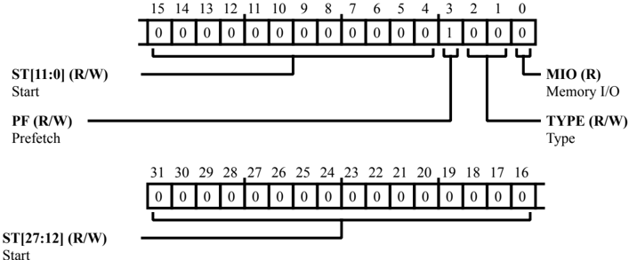

Table 29-107: PCIE\_EP\_BAR5\_[n] Register Fields

| Bit No. (Access)   | Bit Name   | Description/Enumeration                                                                                                                                                                                                                                                                         | Description/Enumeration                                                                                                                                                                                                                                                                         |
|--------------------|------------|-------------------------------------------------------------------------------------------------------------------------------------------------------------------------------------------------------------------------------------------------------------------------------------------------|-------------------------------------------------------------------------------------------------------------------------------------------------------------------------------------------------------------------------------------------------------------------------------------------------|
| 31:4 (R/W)         | ST         | Start. The PCIE_EP_BAR5_[n].ST bit field forms bits [31:x] of the start address of the address region to be translated.                                                                                                                                                                         | Start. The PCIE_EP_BAR5_[n].ST bit field forms bits [31:x] of the start address of the address region to be translated.                                                                                                                                                                         |
| 3 (R/W)            | PF         | Prefetch. The PCIE_EP_BAR5_[n].PF bit is usually set to one if there are no side effects on reads. The device returns all bytes on reads regardless of the byte enables, and host bridges can merge processor writes into this range without causing errors. Bit must be set to zero otherwise. | Prefetch. The PCIE_EP_BAR5_[n].PF bit is usually set to one if there are no side effects on reads. The device returns all bytes on reads regardless of the byte enables, and host bridges can merge processor writes into this range without causing errors. Bit must be set to zero otherwise. |
| 2:1 (R/W)          | TYPE       | Type.                                                                                                                                                                                                                                                                                           | Type.                                                                                                                                                                                                                                                                                           |
|                    |            | 0                                                                                                                                                                                                                                                                                               | Locate anywhere in 32-bit access space                                                                                                                                                                                                                                                          |
|                    |            | 1                                                                                                                                                                                                                                                                                               | Reserved                                                                                                                                                                                                                                                                                        |
|                    |            | 2                                                                                                                                                                                                                                                                                               | Locate anywhere in 62-bit access space                                                                                                                                                                                                                                                          |
|                    |            | 3                                                                                                                                                                                                                                                                                               | Reserved                                                                                                                                                                                                                                                                                        |
| 0                  | MIO        | Memory I/O.                                                                                                                                                                                                                                                                                     | Memory I/O.                                                                                                                                                                                                                                                                                     |
| (R/NW)             |            | The PCIE_EP_BAR5_[n].MIO bit indicates memory space.                                                                                                                                                                                                                                            | The PCIE_EP_BAR5_[n].MIO bit indicates memory space.                                                                                                                                                                                                                                            |
|                    |            | 0                                                                                                                                                                                                                                                                                               | Memory space                                                                                                                                                                                                                                                                                    |
|                    |            | 1                                                                                                                                                                                                                                                                                               | I/O space                                                                                                                                                                                                                                                                                       |

## Capability Pointer Register

The PCIE\_EP\_CAPBPTR\_[n] register points to the first item in the list of capabilities.

Figure 29-99: PCIE\_EP\_CAPBPTR\_[n] Register Diagram

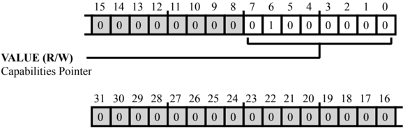

Table 29-108: PCIE\_EP\_CAPBPTR\_[n] Register Fields

| Bit No. (Access)   | Bit Name   | Description/Enumeration                                                                                                                                                                                                                                                                                                                                                                                                                                                                                                                                                                                                                                                                           |
|--------------------|------------|---------------------------------------------------------------------------------------------------------------------------------------------------------------------------------------------------------------------------------------------------------------------------------------------------------------------------------------------------------------------------------------------------------------------------------------------------------------------------------------------------------------------------------------------------------------------------------------------------------------------------------------------------------------------------------------------------|
| 7:0 (R/W)          | VALUE      | Capabilities Pointer. The PCIE_EP_CAPBPTR_[n].VALUE bit field points to the first item in the list of capabilities. Each capability in the list consists of an 8-bit ID field assigned by the PCI SIG, an 8 bit pointer in configuration space to the next capability, and some number of additional registers immediately following the pointer to implement that capability. Each capability must be DWORDaligned. The bottom two bits of all pointers (including the initial pointer at 0x34) are reserved and must be implemented as 00b although software must mask them to allow for future uses of these bits. A pointer value of 0x00 is used to indicate the last capability in the list |

## Class Code and Revision ID Register

The PCIE\_EP\_CCRID\_[n] register identifies the function of a device.

Figure 29-100: PCIE\_EP\_CCRID\_[n] Register Diagram

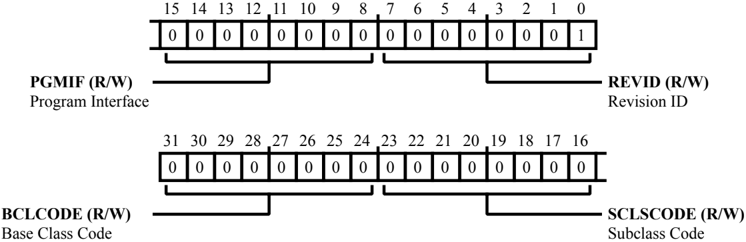

Table 29-109: PCIE\_EP\_CCRID\_[n] Register Fields

| Bit No. (Access)   | Bit Name   | Description/Enumeration                                                                                                                                                                          |
|--------------------|------------|--------------------------------------------------------------------------------------------------------------------------------------------------------------------------------------------------|
| 31:24 (R/W)        | BCLCODE    | Base Class Code. The PCIE_EP_CCRID_[n].BCLCODE bit field broadly classifies the type of func- tion the device performs.                                                                          |
| 23:16 (R/W)        | SCLSCODE   | Subclass Code. The PCIE_EP_CCRID_[n].SCLSCODE bit field identifies more specifically the function of the device.                                                                                 |
| 15:8 (R/W)         | PGMIF      | Program Interface. The PCIE_EP_CCRID_[n].PGMIF bit field identifies a specific register-level pro- gramming interface (if any) so that device independent software can interact with the device. |
| 7:0 (R/W)          | REVID      | Revision ID. The PCIE_EP_CCRID_[n].REVID bit field is the device-specific revision identifi- er.                                                                                                 |

## End Point Configuration Register

The PCIE\_EP\_CFG\_[n] register configures the header type, cache line size, and latency timer.

Figure 29-101: PCIE\_EP\_CFG\_[n] Register Diagram


Table 29-110: PCIE\_EP\_CFG\_[n] Register Fields

| Bit No. (Access)   | Bit Name   | Description/Enumeration                                                                                                                                                                                                                                                                                                                                                                                                                                   |
|--------------------|------------|-----------------------------------------------------------------------------------------------------------------------------------------------------------------------------------------------------------------------------------------------------------------------------------------------------------------------------------------------------------------------------------------------------------------------------------------------------------|
| 23 (R/W)           | MULTI_FUNC | Multi-function Support. The PCIE_EP_CFG_[n].MULTI_FUNC bit must be set to zero.                                                                                                                                                                                                                                                                                                                                                                           |
| 22:16 (R/NW)       | HDRTYPE    | Header Type. The PCIE_EP_CFG_[n].HDRTYPE bit field identifies the layout of the second part of the predefined header and also whether or not the device contains multiple functions. Bit 7 in this register is used to identify a multifunction device. If the bit is 0, then the device is single function. If the bit is 1, then the device has multiple func- tions. Bits 6 through 0 identify the layout of the second part of the predefined header. |
| 15:8 (R/NW)        | LATMST_TMR | Latency Master Timer. The PCIE_EP_CFG_[n].LATMST_TMR bit field specifies the value of the latency timer in units of PCI bus clocks.                                                                                                                                                                                                                                                                                                                       |
| 7:0 (R/W)          | LNSIZ      | Cache Line Size. The PCIE_EP_CFG_[n].LNSIZ bit field specifies the system cache line size in units of DWORDS.                                                                                                                                                                                                                                                                                                                                             |

## CardBus CIS Pointer Register

The PCIE\_EP\_CRDBPTR\_[n] register is optionally used by devices that want to share silicon between CardBus and PCI.

Figure 29-102: PCIE\_EP\_CRDBPTR\_[n] Register Diagram

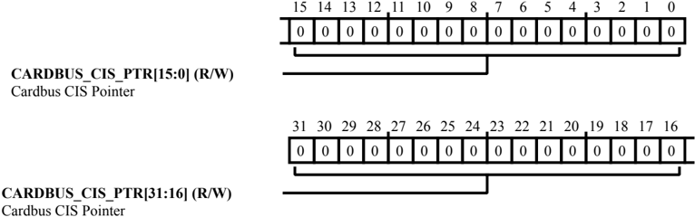

Table 29-111: PCIE\_EP\_CRDBPTR\_[n] Register Fields

| Bit No. (Access)   | Bit Name        | Description/Enumeration                                                                                                                                                                                                               |
|--------------------|-----------------|---------------------------------------------------------------------------------------------------------------------------------------------------------------------------------------------------------------------------------------|
| 31:0 (R/W)         | CARDBUS_CIS_PTR | Cardbus CIS Pointer. The PCIE_EP_CRDBPTR_[n].CARDBUS_CIS_PTR bit field is used to point to the Card Information Structure (CIS) for the CardBus card. For a detailed explanation of the CIS, refer to the PCMCIA v2.10 specification. |

## Device Capabilities Register

The PCIE\_EP\_DEVCAPB\_[n] register identifies PCI Express device Function specific capabilities.

Figure 29-103: PCIE\_EP\_DEVCAPB\_[n] Register Diagram

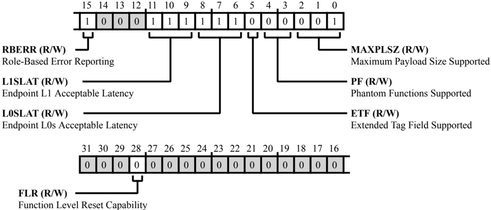

Table 29-112: PCIE\_EP\_DEVCAPB\_[n] Register Fields

| Bit No. (Access)   | Bit Name   | Description/Enumeration                                                                                                                                                                                                                                                                                                                                           | Description/Enumeration                                                                                                                                                                                                                                                                                                                                           |
|--------------------|------------|-------------------------------------------------------------------------------------------------------------------------------------------------------------------------------------------------------------------------------------------------------------------------------------------------------------------------------------------------------------------|-------------------------------------------------------------------------------------------------------------------------------------------------------------------------------------------------------------------------------------------------------------------------------------------------------------------------------------------------------------------|
| 28 (R/W)           | FLR        | Function Level Reset Capability. A value of 1 in the PCIE_EP_DEVCAPB_[n].FLR bit indicates that a Function supports the optional Function Level Reset mechanism. This bit applies to Endpoints only. For all other Function types this bit must be set to 0.                                                                                                      | Function Level Reset Capability. A value of 1 in the PCIE_EP_DEVCAPB_[n].FLR bit indicates that a Function supports the optional Function Level Reset mechanism. This bit applies to Endpoints only. For all other Function types this bit must be set to 0.                                                                                                      |
| 15 (R/W)           | RBERR      | Role-Based Error Reporting. When set, the PCIE_EP_DEVCAPB_[n].RBERR bit indicates that the Function implements the functionality originally defined in the PCI Express Base Specification. This bit is read-only and always set to 1.                                                                                                                             | Role-Based Error Reporting. When set, the PCIE_EP_DEVCAPB_[n].RBERR bit indicates that the Function implements the functionality originally defined in the PCI Express Base Specification. This bit is read-only and always set to 1.                                                                                                                             |
| 11:9 (R/W)         | L1SLAT     | Endpoint L1 Acceptable Latency. The PCIE_EP_DEVCAPB_[n].L1SLAT bit field indicates the acceptable latency that an Endpoint can withstand due to the transition from L1 state to the L0 state. It is essentially an indirect measure of the Endpoints internal buffering. For Functions other than Endpoints, this field is Reserved and must be hardwired to 000. | Endpoint L1 Acceptable Latency. The PCIE_EP_DEVCAPB_[n].L1SLAT bit field indicates the acceptable latency that an Endpoint can withstand due to the transition from L1 state to the L0 state. It is essentially an indirect measure of the Endpoints internal buffering. For Functions other than Endpoints, this field is Reserved and must be hardwired to 000. |
|                    |            | 0                                                                                                                                                                                                                                                                                                                                                                 | Maximum of 1 us                                                                                                                                                                                                                                                                                                                                                   |
|                    |            | 1                                                                                                                                                                                                                                                                                                                                                                 | Maximum of 2 us                                                                                                                                                                                                                                                                                                                                                   |
|                    |            | 2                                                                                                                                                                                                                                                                                                                                                                 | Maximum of 4 us                                                                                                                                                                                                                                                                                                                                                   |
|                    |            | 3                                                                                                                                                                                                                                                                                                                                                                 | Maximum of 8 us                                                                                                                                                                                                                                                                                                                                                   |
|                    |            | 4                                                                                                                                                                                                                                                                                                                                                                 | Maximum of 16 us                                                                                                                                                                                                                                                                                                                                                  |
|                    |            | 5                                                                                                                                                                                                                                                                                                                                                                 | Maximum of 32 us                                                                                                                                                                                                                                                                                                                                                  |

Table 29-112: PCIE\_EP\_DEVCAPB\_[n] Register Fields (Continued)

| Bit No. (Access)   | Bit Name   |                                                                                                                                                                                                                                                                                                                                             | Description/Enumeration                                                                                                                                                                                                                                                                                                                     |
|--------------------|------------|---------------------------------------------------------------------------------------------------------------------------------------------------------------------------------------------------------------------------------------------------------------------------------------------------------------------------------------------|---------------------------------------------------------------------------------------------------------------------------------------------------------------------------------------------------------------------------------------------------------------------------------------------------------------------------------------------|
|                    |            | 6                                                                                                                                                                                                                                                                                                                                           | Maximum of 64 us                                                                                                                                                                                                                                                                                                                            |
|                    |            | 7                                                                                                                                                                                                                                                                                                                                           | No limit                                                                                                                                                                                                                                                                                                                                    |
| 8:6                | L0SLAT     | Endpoint L0s Acceptable Latency.                                                                                                                                                                                                                                                                                                            | Endpoint L0s Acceptable Latency.                                                                                                                                                                                                                                                                                                            |
| (R/W)              |            | The PCIE_EP_DEVCAPB_[n].L0SLAT bit field indicates the acceptable total la- tency that an Endpoint can withstand due to the transition from L0s state to the L0 state. It is essentially an indirect measure of the Endpoints internal buffering. For Functions other than Endpoints, this field is Reserved and must be hardwired to 000.  | The PCIE_EP_DEVCAPB_[n].L0SLAT bit field indicates the acceptable total la- tency that an Endpoint can withstand due to the transition from L0s state to the L0 state. It is essentially an indirect measure of the Endpoints internal buffering. For Functions other than Endpoints, this field is Reserved and must be hardwired to 000.  |
|                    |            | 0                                                                                                                                                                                                                                                                                                                                           | Maximum of 64 ns                                                                                                                                                                                                                                                                                                                            |
|                    |            | 1                                                                                                                                                                                                                                                                                                                                           | Maximum of 128 ns                                                                                                                                                                                                                                                                                                                           |
|                    |            | 2                                                                                                                                                                                                                                                                                                                                           | Maximum of 256 ns                                                                                                                                                                                                                                                                                                                           |
|                    |            | 3                                                                                                                                                                                                                                                                                                                                           | Maximum of 512 ns                                                                                                                                                                                                                                                                                                                           |
|                    |            | 4                                                                                                                                                                                                                                                                                                                                           | Maximum of 1 us                                                                                                                                                                                                                                                                                                                             |
|                    |            | 5                                                                                                                                                                                                                                                                                                                                           | Maximum of 2 us                                                                                                                                                                                                                                                                                                                             |
|                    |            | 6                                                                                                                                                                                                                                                                                                                                           | Maximum of 4 us                                                                                                                                                                                                                                                                                                                             |
|                    |            | 7                                                                                                                                                                                                                                                                                                                                           | No limit                                                                                                                                                                                                                                                                                                                                    |
| 5 (R/W)            | ETF        | Extended Tag Field Supported. The PCIE_EP_DEVCAPB_[n].ETF bit indicates the maximum supported size of the Tag field as a Requester. Note that 8-bit Tag field generation must be enabled by the Extended Tag Field Enable bit in the Device Control register of the Requester Function before 8-bit Tags can be generated by the Requester. | Extended Tag Field Supported. The PCIE_EP_DEVCAPB_[n].ETF bit indicates the maximum supported size of the Tag field as a Requester. Note that 8-bit Tag field generation must be enabled by the Extended Tag Field Enable bit in the Device Control register of the Requester Function before 8-bit Tags can be generated by the Requester. |
|                    |            | 0                                                                                                                                                                                                                                                                                                                                           | 5-bit Tag field supported                                                                                                                                                                                                                                                                                                                   |
|                    |            | 1                                                                                                                                                                                                                                                                                                                                           | 8-bit Tag field supported                                                                                                                                                                                                                                                                                                                   |
| 4:3 (R/W)          | PF         | Phantom Functions Supported. The PCIE_EP_DEVCAPB_[n].PF bit field indicates the support for use of un- claimed Function Numbers to extend the number of outstanding transactions allowed by logically combining unclaimed Function Numbers (called Phantom Functions) with the Tag identifier.                                              | Phantom Functions Supported. The PCIE_EP_DEVCAPB_[n].PF bit field indicates the support for use of un- claimed Function Numbers to extend the number of outstanding transactions allowed by logically combining unclaimed Function Numbers (called Phantom Functions) with the Tag identifier.                                              |
| 2:0 (R/W)          | MAXPLSZ    | Maximum Payload Size Supported. The PCIE_EP_DEVCAPB_[n].MAXPLSZ bit field indicates the maximum pay- load size that the Function can support for TLPs. The Functions of a multi-Function device are permitted to report different values for this field.                                                                                    | Maximum Payload Size Supported. The PCIE_EP_DEVCAPB_[n].MAXPLSZ bit field indicates the maximum pay- load size that the Function can support for TLPs. The Functions of a multi-Function device are permitted to report different values for this field.                                                                                    |
|                    |            | 0                                                                                                                                                                                                                                                                                                                                           | 128 bytes max payload size                                                                                                                                                                                                                                                                                                                  |
|                    |            | 1                                                                                                                                                                                                                                                                                                                                           | 256 bytes max payload size                                                                                                                                                                                                                                                                                                                  |
|                    |            | 2                                                                                                                                                                                                                                                                                                                                           | 512 bytes max payload size                                                                                                                                                                                                                                                                                                                  |

Table 29-112: PCIE\_EP\_DEVCAPB\_[n] Register Fields (Continued)

| Bit No.   |   Bit Name | Description/Enumeration     |
|-----------|------------|-----------------------------|
| (Access)  |            |                             |
|           |          3 | 1024 bytes max payload size |
|           |          4 | 2048 bytes max payload size |
|           |          5 | 4096 bytes max payload size |
|           |          6 | Reserved                    |
|           |          7 | Reserved                    |

## Device ID and Vendor ID Register

The PCIE\_EP\_ID\_[n] register indicates the assigned IDs.

Figure 29-104: PCIE\_EP\_ID\_[n] Register Diagram

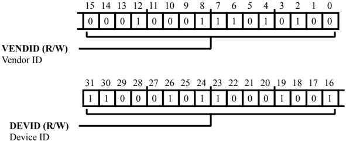

Table 29-113: PCIE\_EP\_ID\_[n] Register Fields

| Bit No. (Access)   | Bit Name   | Description/Enumeration                                                                                                                                                                  |
|--------------------|------------|------------------------------------------------------------------------------------------------------------------------------------------------------------------------------------------|
| 31:16 (R/W)        | DEVID      | Device ID. The PCIE_EP_ID_[n].DEVID bit field indicates the vendor assigned field that provides a means for a vendor to classify a particular RCRB.                                      |
| 15:0 (R/W)         | VENDID     | Vendor ID. The PCIE_EP_ID_[n].VENDID bit field indicates the PCI-SIG assigned field that provides a means to associate an RCRB (root complex register block) with a par- ticular vendor. |

## Interrupt Line and Pin Register

The PCIE\_EP\_PINLN\_INT\_[n] register provides interrupt and line routing information.

Figure 29-105: PCIE\_EP\_PINLN\_INT\_[n] Register Diagram

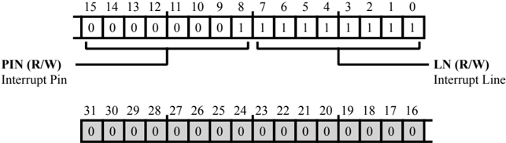

Table 29-114: PCIE\_EP\_PINLN\_INT\_[n] Register Fields

| Bit No. (Access)   | Bit Name   | Description/Enumeration                                                                                                                                                                                                                                                                                                                                                                                                             |
|--------------------|------------|-------------------------------------------------------------------------------------------------------------------------------------------------------------------------------------------------------------------------------------------------------------------------------------------------------------------------------------------------------------------------------------------------------------------------------------|
| 15:8 (R/W)         | PIN        | Interrupt Pin. The PCIE_EP_PINLN_INT_[n].PIN bit field identifies the legacy interrupt Message(s) the Function uses. Valid values are 0x1, 0x2, 0x3, and 0x4 that map to leg- acy interrupt Messages for INTA, INTB, INTC, and INTD respectively. A value of 0x0 indicates that the Function uses no legacy interrupt Message(s).                                                                                                   |
| 7:0 (R/W)          | LN         | Interrupt Line. The PCIE_EP_PINLN_INT_[n].LN bit field communicates interrupt line rout- ing information. The field is read/write and must be implemented by any Function that uses an interrupt pin. Values in this bit field are programmed by system software and are system architecture specific. The Function itself does not use this value; rather the value in this field is used by device drivers and operating systems. |

## End Point Expansion ROM Base Address Register

The PCIE\_EP\_ROMCFG\_[n] register contains bits that indicate the upper 21 bits of the Expansion ROM base address and bits that control whether or not the device accepts accesses to its expansion ROM.

Figure 29-106: PCIE\_EP\_ROMCFG\_[n] Register Diagram

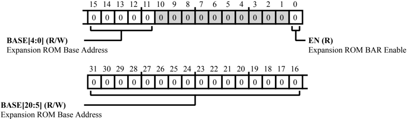

Table 29-115: PCIE\_EP\_ROMCFG\_[n] Register Fields

| Bit No. (Access)   | Bit Name   | Description/Enumeration                                                                                                                                                                                                                                                                                                                                                                                                                                                                                                   |
|--------------------|------------|---------------------------------------------------------------------------------------------------------------------------------------------------------------------------------------------------------------------------------------------------------------------------------------------------------------------------------------------------------------------------------------------------------------------------------------------------------------------------------------------------------------------------|
| 31:11 (R/W)        | BASE       | Expansion ROMBase Address. The PCIE_EP_ROMCFG_[n].BASE bit field correspond to the upper 21 bits of the Expansion ROMbase address. The number of bits (out of these 21) that a device actually implements depends on how much address space the device requires. For in- stance, a device that requires a 64 KB area to map its expansion ROMwould imple- ment the top 16 bits in the register, leaving the bottom 5 (out of these 21) hardwired to 0. Devices that support an expansion ROMmust implement this register. |
| 0 (R/NW)           | EN         | Expansion ROMBAR Enable. The PCIE_EP_ROMCFG_[n].EN bit controls whether or not the device accepts ac- cesses to its expansion ROM. When this bit is 0, the devices expansion ROMaddress space is disabled. When the bit is 1, address decoding is enabled using the parameters in the other part of the base register. This allows a device to be used with or without an expansion ROMdepending on system configuration.                                                                                                 |

## Subsystem ID and Subsystem Vendor ID Register

Figure 29-107: PCIE\_EP\_SSVID\_[n] Register Diagram

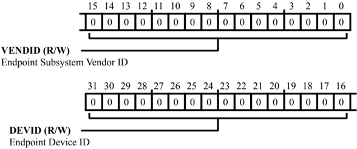

Table 29-116: PCIE\_EP\_SSVID\_[n] Register Fields

| Bit No. (Access)   | Bit Name   | Description/Enumeration       |
|--------------------|------------|-------------------------------|
| 31:16              | DEVID      | Endpoint Device ID.           |
| (R/W)              |            | Subsystem device ID           |
| 15:0               | VENDID     | Endpoint Subsystem Vendor ID. |
| (R/W)              |            | Subsystem vendor ID           |

## Command and Status Register

The PCIE\_EP\_STATCMD\_[n] register contains bits that provide status information. This register also contains bits that enable various configuration options.

Figure 29-108: PCIE\_EP\_STATCMD\_[n] Register Diagram

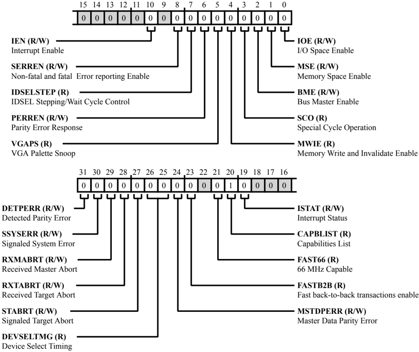

Table 29-117: PCIE\_EP\_STATCMD\_[n] Register Fields

| Bit No. (Access)   | Bit Name   | Description/Enumeration                                                                                                                                                                                                                                                                                                                             |
|--------------------|------------|-----------------------------------------------------------------------------------------------------------------------------------------------------------------------------------------------------------------------------------------------------------------------------------------------------------------------------------------------------|
| 31 (R/W)           | DETPERR    | Detected Parity Error. The PCIE_EP_STATCMD_[n].DETPERR bit is set by a function whenever it re- ceives a poisoned TLP, regardless of the state of the PCIE_EP_STATCMD_[n].PERREN bit. On a function with a Type 1 Configura- tion header, the bit is set when the poisoned TLP is received by its primary side. The default value of this bit is 0. |

Table 29-117: PCIE\_EP\_STATCMD\_[n] Register Fields (Continued)

| Bit No. (Access)   | Bit Name   | Description/Enumeration                                                                                                                                                                                                                                                                                                                                                                                                                                                                                                      |
|--------------------|------------|------------------------------------------------------------------------------------------------------------------------------------------------------------------------------------------------------------------------------------------------------------------------------------------------------------------------------------------------------------------------------------------------------------------------------------------------------------------------------------------------------------------------------|
| 30 (R/W)           | SSYSERR    | Signaled System Error. The PCIE_EP_STATCMD_[n].SSYSERR bit is set when a function sends an ERR_FATAL or ERR_NONFATAL message, and the PCIE_EP_STATCMD_[n].SERREN bit is set to 1. The default value of this bit is 0.                                                                                                                                                                                                                                                                                                        |
| 29 (R/W)           | RXMABRT    | Received Master Abort. The PCIE_EP_STATCMD_[n].RXMABRT bit is set when a Requester receives a completion with unsupported request completion status. On a function with a Type 1 Configuration header, the PCIE_EP_STATCMD_[n].RXMABRT bit is set when the unsupported request is received by its Primary side. The default value of this bit is 0.                                                                                                                                                                          |
| 28 (R/W)           | RXTABRT    | Received Target Abort. The PCIE_EP_STATCMD_[n].RXTABRT bit is set when a requester receives a completion with completer abort completion status. On a function with a Type 1 Configuration header, the PCIE_EP_STATCMD_[n].RXTABRT bit is set when the completer abort is received by its primary side. The default value of this bit is 0.                                                                                                                                                                                  |
| 27 (R/W)           | STABRT     | Signaled Target Abort. The PCIE_EP_STATCMD_[n].STABRT bit is set when a function completes a posted or non-posted request as a Completer Abort error. This applies to a function with a Type 1 Configuration header when the completer abort was generated by its primary side. The default value of this bit is 0.                                                                                                                                                                                                          |
| 26:25 (R/NW)       | DEVSELTMG  | Device Select Timing. Does not apply to PCI Express and must be set to 0.                                                                                                                                                                                                                                                                                                                                                                                                                                                    |
| 24 (R/W)           | MSTDPERR   | Master Data Parity Error. The PCIE_EP_STATCMD_[n].MSTDPERR bit is set by a Root port, Switch Up- stream port, or Switch Downstream port if the PCIE_EP_STATCMD_[n].PERREN bit in the command register is set to 1 and ei- ther of the following two conditions occurs. • A port receives a poisoned completion going downstream • A port transmits a poisoned request upstream If the PCIE_EP_STATCMD_[n].PERREN bit is cleared (=0), the PCIE_EP_STATCMD_[n].MSTDPERR bit is never set. The default value of this bit is 0. |
| 23 (R/NW)          | FASTB2B    | Fast back-to-back transactions enable. Does not apply to PCI Express and must be set to 0.                                                                                                                                                                                                                                                                                                                                                                                                                                   |
| 21 (R/NW)          | FAST66     | 66 MHz Capable. Does not apply to PCI Express and must be set to 0.                                                                                                                                                                                                                                                                                                                                                                                                                                                          |

Table 29-117: PCIE\_EP\_STATCMD\_[n] Register Fields (Continued)

| Bit No. (Access)   | Bit Name   | Description/Enumeration                                                                                                                                                                                                                                                                                                                                                                                                                                                                                                                                                                                                                                                                                                                                                                                                                                          |
|--------------------|------------|------------------------------------------------------------------------------------------------------------------------------------------------------------------------------------------------------------------------------------------------------------------------------------------------------------------------------------------------------------------------------------------------------------------------------------------------------------------------------------------------------------------------------------------------------------------------------------------------------------------------------------------------------------------------------------------------------------------------------------------------------------------------------------------------------------------------------------------------------------------|
| 20 (R/NW)          | CAPBLIST   | Capabilities List. The PCIE_EP_STATCMD_[n].CAPBLIST bit indicates the presence of an Ex- tended Capability list item. Since all PCI Express device functions are required to im- plement the PCI Express Capability structure, this bit is always set to 1.                                                                                                                                                                                                                                                                                                                                                                                                                                                                                                                                                                                                      |
| 19 (R/W)           | ISTAT      | Interrupt Status. When the PCIE_EP_STATCMD_[n].ISTAT bit is set, an INTx emulation inter- rupt is pending internally in the function. INTx emulation interrupts forwarded by Root and Switch ports from devices downstream of the Root or Switch port are not reflected in this bit. The default value of this bit is 0.                                                                                                                                                                                                                                                                                                                                                                                                                                                                                                                                         |
| 10 (R/W)           | IEN        | Interrupt Enable. The PCIE_EP_STATCMD_[n].IEN bit controls the ability of a PCI Express Func- tion to generate INTx interrupts. When set, functions are prevented from asserting INTx interrupts. Any INTx emulation interrupts already asserted by the function must be de-asserted when this bit is set. When the PCIE_EP_STATCMD_[n].IEN bit is set, INTx interrupts use virtual wires that must, if asserted, be de-asserted using the appropriate Deassert_INTx mes- sage(s). Only the INTx virtual wire interrupt(s) associated with the function(s) for which this bit is set are affected. For Endpoints that generate INTx interrupts, this bit is required. For Endpoints that generate INTx interrupts, this bit is required. For Endpoints that do not generate INTx interrupts this bit is optional. If not implemented, this bit must be set to 0. |
| 8 (R/W)            | SERREN     | Non-fatal and fatal Error reporting Enable. When the PCIE_EP_STATCMD_[n].SERREN bit is set, reports of non-fatal and fatal errors detected by the function to the root complex are issued. Errors are reported either through this bit or through the PCI Express specific bits in the PCIE_EP_CCRID_[n] register. In addition, for functions with Type 1 Configura- tion Space headers, this bit controls transmission by the primary interface of ERR_NONFATAL and ERR_FATAL error messages forwarded from the secondary interface. The PCIE_EP_STATCMD_[n].SERREN bit does not affect the transmission of forwarded ERR_COR messages. A Root Complex Integrated Endpoint that is not as- sociated with a Root Complex Event Collector is permitted to hardwire this bit to 0. The default value of this bit is 0.                                             |
| 7 (R/NW)           | IDSELSTEP  | IDSEL Stepping/Wait Cycle Control. Does not apply to PCI Express and must be set to 0.                                                                                                                                                                                                                                                                                                                                                                                                                                                                                                                                                                                                                                                                                                                                                                           |

Table 29-117: PCIE\_EP\_STATCMD\_[n] Register Fields (Continued)

| Bit No. (Access)   | Bit Name   | Description/Enumeration                                                                                                                                                                                                                                                                                                                                                                                                                                                                                                                                                                                                                                                                                                                                   |
|--------------------|------------|-----------------------------------------------------------------------------------------------------------------------------------------------------------------------------------------------------------------------------------------------------------------------------------------------------------------------------------------------------------------------------------------------------------------------------------------------------------------------------------------------------------------------------------------------------------------------------------------------------------------------------------------------------------------------------------------------------------------------------------------------------------|
| 6 (R/W)            | PERREN     | Parity Error Response. The PCIE_EP_STATCMD_[n].PERREN bit controls the logging of poisoned TLPs in the PCIE_EP_STATCMD_[n].MSTDPERR bit. A Root Complex Inte- grated Endpoint that is not associated with a Root Complex Event Collector is permit- ted to hardwire this bit to 0. The default value of this bit is 0.                                                                                                                                                                                                                                                                                                                                                                                                                                    |
| 5 (R/NW)           | VGAPS      | VGA Palette Snoop. Does not apply to PCI Express and must be set to 0.                                                                                                                                                                                                                                                                                                                                                                                                                                                                                                                                                                                                                                                                                    |
| 4 (R/NW)           | MWIE       | Memory Write and Invalidate Enable. Does not apply to PCI Express and must be set to 0.                                                                                                                                                                                                                                                                                                                                                                                                                                                                                                                                                                                                                                                                   |
| 3 (R/NW)           | SCO        | Special Cycle Operation. Does not apply to PCI Express and must be set to 0.                                                                                                                                                                                                                                                                                                                                                                                                                                                                                                                                                                                                                                                                              |
| 2 (R/W)            | BME        | Bus Master Enable. The PCIE_EP_STATCMD_[n].BME bit controls the ability of a PCI Express End- point to issue memory and I/O read/write requests, and the ability of a Root or Switch Port to forward memory and I/O read/write requests in the upstream direction. For end points, when the PCIE_EP_STATCMD_[n].BME bit is set, the PCI Ex- press function is allowed to issue memory or I/O requests. When this bit is cleared, the PCI Express function is not allowed to issue any memory or I/O requests. MSI/MSI-X interrupt messages are in-band memory writes and setting this bit to 0 also disables MSI/MSI-X interrupt messages. Requests other than memory or I/O requests are not controlled by this bit. The default value of this bit is 0. |
| 1 (R/W)            | MSE        | Memory Space Enable. The PCIE_EP_STATCMD_[n].MSE bit enables memory space.                                                                                                                                                                                                                                                                                                                                                                                                                                                                                                                                                                                                                                                                                |
| 0 (R/W)            | IOE        | I/O Space Enable. The PCIE_EP_STATCMD_[n].IOE bit enables I/O space.                                                                                                                                                                                                                                                                                                                                                                                                                                                                                                                                                                                                                                                                                      |

## Error Source Identification Register

The PCIE\_ERRSRC\_ID\_[n] register identifies the source (Requester ID) of first correctable and uncorrectable (Non- Fatal/Fatal) errors reported in the Root Error Status register. This register is updated regardless of the settings of the Root Control register and the Root Error Command register.

Figure 29-109: PCIE\_ERRSRC\_ID\_[n] Register Diagram

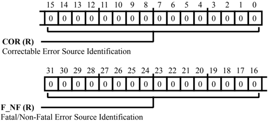

Table 29-118: PCIE\_ERRSRC\_ID\_[n] Register Fields

| Bit No. (Access)   | Bit Name   | Description/Enumeration                                                                                                                                                                                                                                                                   |
|--------------------|------------|-------------------------------------------------------------------------------------------------------------------------------------------------------------------------------------------------------------------------------------------------------------------------------------------|
| 31:16 (R/NW)       | F_NF       | Fatal/Non-Fatal Error Source Identification. The PCIE_ERRSRC_ID_[n].F_NF bit field is loaded with the Requester ID indi- cated in the received Fatal/Non-Fatal Error Message when the Fatal/Non-Fatal Error Message Received bit is not already set. Default value of this field is 0000. |
| 15:0 (R/NW)        | COR        | Correctable Error Source Identification. The PCIE_ERRSRC_ID_[n].COR bit field is loaded with the Requester ID indi- cated in the received Correctable Error Message when the Correctable Error Received bit is not already set. Default value of this field is 0000.                      |

## Filter Mask 2 Register

The PCIE\_FILTMSK2\_[n] register is used to mask RADM Filtering and Error Handling rules.

Figure 29-110: PCIE\_FILTMSK2\_[n] Register Diagram

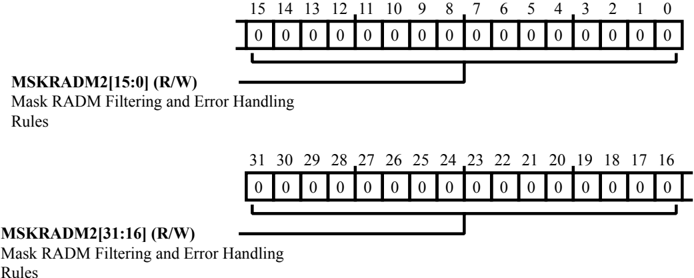

Table 29-119: PCIE\_FILTMSK2\_[n] Register Fields

| Bit No. (Access)   | Bit Name   | Description/Enumeration                                                                                                                                                                                                                                                                                                                                                                                                                                                                                                                                                                                                                                                                                                                              |
|--------------------|------------|------------------------------------------------------------------------------------------------------------------------------------------------------------------------------------------------------------------------------------------------------------------------------------------------------------------------------------------------------------------------------------------------------------------------------------------------------------------------------------------------------------------------------------------------------------------------------------------------------------------------------------------------------------------------------------------------------------------------------------------------------|
| 31:0 (R/W)         | MSKRADM2   | Mask RADM Filtering and Error Handling Rules. Mask RADM Filtering and Error Handling Rules: Mask 2. There are several mask bits used to turn off the filtering and error handling rules. <br>[31:4]: Reserved <br>[3]: CX_FLT_MSK_HANDLE_FLUSH - 0: Disable core Filter to handle flush request - 1: Enable core Filter to handle flush request [2]: CX_FLT_MSK_DABRT_4UCPL - 0: Enable DLLP abort for unexpected completion - 1: Do not enable DLLP abort for unexpected completion [1]: CX_FLT_MSK_VENMSG1_DROP - 0: Vendor MSG Type 1 dropped silently - 1: Vendor MSG Type 1 not dropped [0]: CX_FLT_MSK_VENMSG0_DROP - 0: Vendor MSG Type 0 dropped with UR er- ror reporting - 1: Vendor MSG Type 0 not dropped This register field is sticky. |

## Link Width and Speed Change Control Register

This register is used to configure some of the PCIe PHY features. The For details see the bit field descriptions.

Figure 29-111: PCIE\_GEN2\_CTL\_[n] Register Diagram

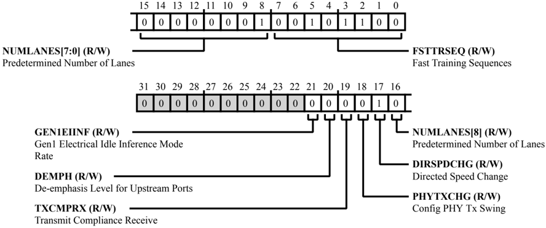

Table 29-120: PCIE\_GEN2\_CTL\_[n] Register Fields

| Bit No. (Access)   | Bit Name   | Description/Enumeration                                                                                                                                                                                                                                                                                                                                                                                                                                                                                                                                                                                                                     |
|--------------------|------------|---------------------------------------------------------------------------------------------------------------------------------------------------------------------------------------------------------------------------------------------------------------------------------------------------------------------------------------------------------------------------------------------------------------------------------------------------------------------------------------------------------------------------------------------------------------------------------------------------------------------------------------------|
| 21 (R/W)           | GEN1EIINF  | Gen1 Electrical Idle Inference Mode Rate. The PCIE_GEN2_CTL_[n].GEN1EIINF bit is used to determine inferred electri- cal idle (EI) in recovery. This bit does this by looking at the speed or Loopback.Active (as slave) state at Gen1 speed by looking for a 1 value on RxElecIdle instead of looking for a 0 on RxValid. If the PHY fails to deassert the RxValid signal in Recovery.Speed or Loopback.Active (because of corrupted EIOS for example), then electrical idle cannot be inferred suc- cessfully in the core by just detecting the condition RxValid=0. This bit is sticky. 0 Use RxElecIdle signal to infer Electrical Idle |
| 20 (R/W)           | DEMPH      | De-emphasis Level for Upstream Ports. The PCIE_GEN2_CTL_[n].DEMPH bit is used to set the de-emphasis level for up- stream ports. This bit is sticky.                                                                                                                                                                                                                                                                                                                                                                                                                                                                                        |
| 19 (R/W)           | TXCMPRX    | Transmit Compliance Receive. When the PCIE_GEN2_CTL_[n].TXCMPRX bit is set (=1), it signals the LTSSM to transmit TS ordered sets with the compliance receive bit assert (equal to 1). This bit sticky.                                                                                                                                                                                                                                                                                                                                                                                                                                     |

Table 29-120: PCIE\_GEN2\_CTL\_[n] Register Fields (Continued)

| Bit No. (Access)   | Bit Name   | Description/Enumeration                                                                                                                                                                                                                                                                                                                                                                                                                                                                                                                                                                                                                                                                                                                                                                                                                                                                                                                                                                                                                                                                                                                                                                                                                                                              |
|--------------------|------------|--------------------------------------------------------------------------------------------------------------------------------------------------------------------------------------------------------------------------------------------------------------------------------------------------------------------------------------------------------------------------------------------------------------------------------------------------------------------------------------------------------------------------------------------------------------------------------------------------------------------------------------------------------------------------------------------------------------------------------------------------------------------------------------------------------------------------------------------------------------------------------------------------------------------------------------------------------------------------------------------------------------------------------------------------------------------------------------------------------------------------------------------------------------------------------------------------------------------------------------------------------------------------------------|
| 18 (R/W)           | PHYTXCHG   | Config PHY Tx Swing. The PCIE_GEN2_CTL_[n].PHYTXCHG bit controls the PHY transmitter voltage swing level. The core drives the mac_phy_txswing output from this bit. This bit is sticky.                                                                                                                                                                                                                                                                                                                                                                                                                                                                                                                                                                                                                                                                                                                                                                                                                                                                                                                                                                                                                                                                                              |
| 18 (R/W)           | PHYTXCHG   | 0 Full swing                                                                                                                                                                                                                                                                                                                                                                                                                                                                                                                                                                                                                                                                                                                                                                                                                                                                                                                                                                                                                                                                                                                                                                                                                                                                         |
| 17 (R/W)           | DIRSPDCHG  | Directed Speed Change. Setting (=1) the PCIE_GEN2_CTL_[n].DIRSPDCHG bit instructs the LTSSM to initiate a speed change to Gen2 or Gen3 after the link is initialized at Gen1 speed. The speed change is initiated automatically after link up, and the core clears the contents of this field. To prevent this automatic speed change, write a lower speed value to the PCIE_LNK_CTLSTAT2_[n].TRGSPD bit field through the DBI before link up. When the speed change occurs, the core clears the contents of this field. When the program reads this bit it returns 0. To manually initiate the speed change: • Write to PCIE_LNK_CTLSTAT2_[n].TRGSPD in the local device • Deassert the PCIE_GEN2_CTL_[n].DIRSPDCHG bit • Assert the PCIE_GEN2_CTL_[n].DIRSPDCHG bit                                                                                                                                                                                                                                                                                                                                                                                                                                                                                                                |
| 16:8 (R/W)         | NUMLANES   | Predetermined Number of Lanes. The PCIE_GEN2_CTL_[n].NUMLANES bit field defines the number of lanes which are connected and not bad. This value is used to limit the effective link width to ignore broken or unused lanes that detect a receiver. Indicates the number of lanes to check for exit from Electrical Idle in Polling. Active and L2.Idle. It is possible that the LTSSM might detect a receiver on a bad or broken lane during the detect substate. However, it is also possible that such a lane might also fail to exit Electrical Idle and therefore prevent a valid link from being configured. This value is referred to as the "Predetermined Number of Lanes" in section 4.2.6.2.1 of the PCI Express Base 3.0 Specification, revision 1.0. Encoding is as follows: 0x01: 1 lane 0x02: 2 lanes 0x03: 3 lanes ... When there are unused lanes in the system, then the value in this register must change to reflect the number of lanes. The value in the Link Mode Enable field of the Port Link Control Register must also be changed. The value in this register is normally the same as the encoded value in the Port Link Control Register. If one of the used lanes is bad then the value in this register must be reduced. This register field is sticky. |

Table 29-120: PCIE\_GEN2\_CTL\_[n] Register Fields (Continued)

| Bit No. (Access)   | Bit Name   | Description/Enumeration                                                                                                                                                                                                                                                                                                                                                                                                                                                                                              |
|--------------------|------------|----------------------------------------------------------------------------------------------------------------------------------------------------------------------------------------------------------------------------------------------------------------------------------------------------------------------------------------------------------------------------------------------------------------------------------------------------------------------------------------------------------------------|
| 7:0 (R/W)          | FSTTRSEQ   | Fast Training Sequences. The PCIE_GEN2_CTL_[n].FSTTRSEQ bit field configures the number of Fast Training Sequences (N_FTS) that the core advertises as its N_FTS during Gen2 or Gen3 link training. This value is used to inform the link partner about the PHY"s abil- ity to recover synchronization after a low power state. This value is provided by the PHY vendor. Do not set N_FTS to zero; doing so can cause the LTSSM to go into the recovery state when exiting from L0s. This register field is sticky. |

## Header Log Register 0

The PCIE\_HDRLOG0\_[n] register contains bytes 0-3 of the Header of the TLP associated with an error.

Figure 29-112: PCIE\_HDRLOG0\_[n] Register Diagram


Table 29-121: PCIE\_HDRLOG0\_[n] Register Fields

| Bit No. (Access)   | Bit Name   | Description/Enumeration                                                                                           |
|--------------------|------------|-------------------------------------------------------------------------------------------------------------------|
| 31:0               | FDW        | First DWORD. The PCIE_HDRLOG0_[n].FDW bit field is bytes 0-3 of the Header of the TLP as- sociated with an error. |
| (R/NW)             |            |                                                                                                                   |

## Header Log Register 1

The PCIE\_HDRLOG1\_[n] register contains bytes 4-7 of the Header of the TLP associated with an error.

Figure 29-113: PCIE\_HDRLOG1\_[n] Register Diagram


Table 29-122: PCIE\_HDRLOG1\_[n] Register Fields

| Bit No. (Access)   | Bit Name   | Description/Enumeration                                                                                            |
|--------------------|------------|--------------------------------------------------------------------------------------------------------------------|
| 31:0               | SDW        | Second DWORD. The PCIE_HDRLOG1_[n].SDW bit field is bytes 4-7 of the Header of the TLP as- sociated with an error. |
| (R/NW)             |            |                                                                                                                    |

## Header Log Register 2

The PCIE\_HDRLOG2\_[n] register contains bytes 8-11 of the Header of the TLP associated with an error.

Figure 29-114: PCIE\_HDRLOG2\_[n] Register Diagram

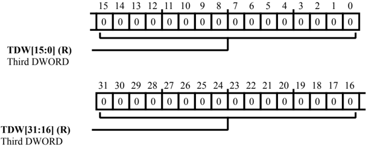

Table 29-123: PCIE\_HDRLOG2\_[n] Register Fields

| Bit No. (Access)   | Bit Name   | Description/Enumeration                                                                                          |
|--------------------|------------|------------------------------------------------------------------------------------------------------------------|
| 31:0 (R/NW)        | TDW        | Third DWORD. The PCIE_HDRLOG2_[n].TDW bit field is bytes 8-11 of the Header of the TLP associated with an error. |

## Header Log Register 3

The PCIE\_HDRLOG3\_[n] register contains bytes 12-15 of the Header of the TLP associated with an error.

Figure 29-115: PCIE\_HDRLOG3\_[n] Register Diagram

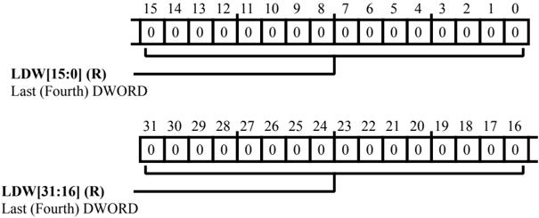

Table 29-124: PCIE\_HDRLOG3\_[n] Register Fields

| Bit No. (Access)   | Bit Name   | Description/Enumeration                                                                                                   |
|--------------------|------------|---------------------------------------------------------------------------------------------------------------------------|
| 31:0 (R/NW)        | LDW        | Last (Fourth) DWORD. The PCIE_HDRLOG3_[n].LDW bit field is bytes 12-15 of the Header of the TLP associated with an error. |

## iATU Region Control 1 Inbound Register

The PCIE\_IATU\_CTL1\_INB\_[n] register controls several aspects of inbound address translation used for mapping different address ranges to different memory spaces.

Figure 29-116: PCIE\_IATU\_CTL1\_INB\_[n] Register Diagram


Table 29-125: PCIE\_IATU\_CTL1\_INB\_[n] Register Fields

| Bit No. (Access)   | Bit Name   | Description/Enumeration                                                                                                                                                                                                                                                                                                                                                                                                                                                                                                                                                                                                                                                                                               |
|--------------------|------------|-----------------------------------------------------------------------------------------------------------------------------------------------------------------------------------------------------------------------------------------------------------------------------------------------------------------------------------------------------------------------------------------------------------------------------------------------------------------------------------------------------------------------------------------------------------------------------------------------------------------------------------------------------------------------------------------------------------------------|
| 24:20 (R/W)        | FUNCNUM    | Function Number. The PCIE_IATU_CTL1_INB_[n].FUNCNUM bit field is used for MEM-I/O and CFG0/CFG1 transactions as described below. • MEM-I/O - EP. When the Address and BAR matching logic in the core indicate that a MEM-I/O transaction matches a BAR in the function corresponding to this value, then address translation proceeds. This check is only performed if the PCIE_IATU_CTL2_INB_[n].FNM bit is set. • CFG0/CFG1 - EP. When the destination function number as specified in the routing ID of the TLP header matches the function, then address translation pro- ceeds. This check is only performed if the PCIE_IATU_CTL2_INB_[n].FNM bit is set. • For RC this field is reserved and must be set to 0. |
| 17:16 (R/W)        | AT         | Address Translation AT Value. When the value in the PCIE_IATU_CTL1_INB_[n].AT bit field matches the AT field of an inbound TLP, then address translation proceeds (when all other enabled field-matches are successful). This check is only performed if the PCIE_IATU_CTL2_INB_[n].MAT bit is set. Not valid, ATS is not supported.                                                                                                                                                                                                                                                                                                                                                                                  |

Table 29-125: PCIE\_IATU\_CTL1\_INB\_[n] Register Fields (Continued)

| Bit No. (Access)   | Bit Name   | Description/Enumeration                                                                                                                                                                                                                                                                                       |
|--------------------|------------|---------------------------------------------------------------------------------------------------------------------------------------------------------------------------------------------------------------------------------------------------------------------------------------------------------------|
| 10:9 (R/W)         | ATTR       | Address Translation ATTR Value. When the value in the PCIE_IATU_CTL1_INB_[n].ATTR bit field matches the ATTR field of an inbound TLP, then address translation proceeds (when all other ena- bled field-matches are successful). This check is only performed if the PCIE_IATU_CTL2_INB_[n].ATTRM bit is set. |
| 8 (R/W)            | TD         | Address Translation TD Value. When the value in the PCIE_IATU_CTL1_INB_[n].TD bit field matches the TD field of an inbound TLP, then address translation proceeds (when all other enabled field-matches are successful). This check is only performed if the PCIE_IATU_CTL2_INB_[n].TDM bit is set.           |
| 7:5 (R/W)          | TC         | Address Translation TC Value. When the value in the PCIE_IATU_CTL1_INB_[n].TC bit field matches the TC field of an inbound TLP, then address translation proceeds (when all other enabled field-matches are successful). This check is only performed if the PCIE_IATU_CTL2_INB_[n].TCM bit is set.           |
| 4:0 (R/W)          | TYPE       | Address Translation TYPE Value. When the value in the PCIE_IATU_CTL1_INB_[n].TYPE bit field matches the TYPE field of an inbound TLP, then address translation proceeds (when all other ena- ble field-matches are successful).                                                                               |

## iATU Region Control 1 Outbound Register

The PCIE\_IATU\_CTL1\_OUTB\_[n] register controls several aspects of outbound address translation used for mapping different address ranges to different memory spaces.

Figure 29-117: PCIE\_IATU\_CTL1\_OUTB\_[n] Register Diagram

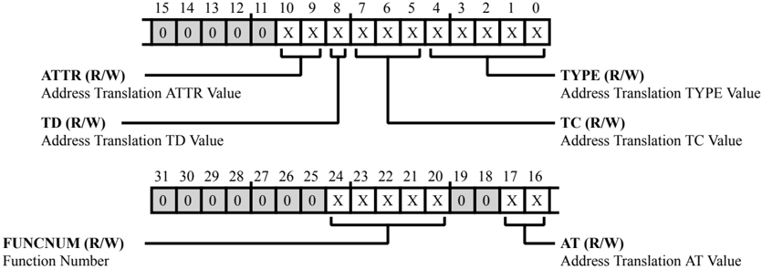

Table 29-126: PCIE\_IATU\_CTL1\_OUTB\_[n] Register Fields

| Bit No. (Access)   | Bit Name   | Description/Enumeration                                                                                                                                                                                                                                                                                                                                                                                                                                                                                                                                                       |
|--------------------|------------|-------------------------------------------------------------------------------------------------------------------------------------------------------------------------------------------------------------------------------------------------------------------------------------------------------------------------------------------------------------------------------------------------------------------------------------------------------------------------------------------------------------------------------------------------------------------------------|
| 24:20 (R/W)        | FUNCNUM    | Function Number. For an EP: When the value in the PCIE_IATU_CTL1_OUTB_[n].FUNCNUM bit field is matched to the address of an outbound TLP and the PCIE_IATU_CTL2_OUTB_[n].FUNCBYP bit field =0, then the function num- ber used in generating the function part of the requester ID (RID) field of the TLP is taken from this 5-bit register. The value in this register must be 0x0. For a RC: The PCIE_IATU_CTL1_OUTB_[n].FUNCNUM bit field is swapped be- fore SCB decomposition occurs so that the correct "Max_Read_Request_Size" and "Max_Payload_Size" values are used. |
| 17:16 (R/W)        | AT         | Address Translation AT Value. When the value in the PCIE_IATU_CTL1_OUTB_[n].AT bit field matches the address of an outbound TLP, then the AT field of the TLP is changed to the value in this register. Not valid. ATS is not supported.                                                                                                                                                                                                                                                                                                                                      |
| 10:9 (R/W)         | ATTR       | Address Translation ATTR Value. When the value in the PCIE_IATU_CTL1_OUTB_[n].ATTR bit field matches the address of an outbound TLP, then the ATTR field of the TLP is changed to the value in this register.                                                                                                                                                                                                                                                                                                                                                                 |
| 8 (R/W)            | TD         | Address Translation TD Value. When the value in the PCIE_IATU_CTL1_OUTB_[n].TD bit field matches the address of an outbound TLP, then the TD field of the TLP is changed to the value in this register.                                                                                                                                                                                                                                                                                                                                                                       |

Table 29-126: PCIE\_IATU\_CTL1\_OUTB\_[n] Register Fields (Continued)

| Bit No. (Access)   | Bit Name   | Description/Enumeration                                                                                                                                                                                       |
|--------------------|------------|---------------------------------------------------------------------------------------------------------------------------------------------------------------------------------------------------------------|
| 7:5 (R/W)          | TC         | Address Translation TC Value. When the value in the PCIE_IATU_CTL1_OUTB_[n].TC bit field matches the address of an outbound TLP, then the TC field of the TLP is changed to the value in this register.       |
| 4:0 (R/W)          | TYPE       | Address Translation TYPE Value. When the value in the PCIE_IATU_CTL1_OUTB_[n].TYPE bit field matches the address of an outbound TLP, then the TYPE field of the TLP is changed to the value in this register. |

## iATU Region Control 2 Inbound Register

The PCIE\_IATU\_CTL2\_INB\_[n] register controls several aspects of inbound address translation used for mapping different address ranges to different memory spaces.

Figure 29-118: PCIE\_IATU\_CTL2\_INB\_[n] Register Diagram

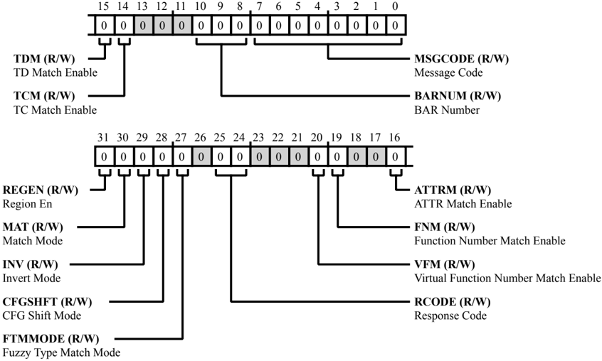

Table 29-127: PCIE\_IATU\_CTL2\_INB\_[n] Register Fields

| Bit No. (Access)   | Bit Name   | Description/Enumeration                                                                                   |
|--------------------|------------|-----------------------------------------------------------------------------------------------------------|
| 31                 | REGEN      | Region En. The PCIE_IATU_CTL2_INB_[n].REGEN bit must be set to 1 for address trans- lation to take place. |
| (R/W)              |            |                                                                                                           |

Table 29-127: PCIE\_IATU\_CTL2\_INB\_[n] Register Fields (Continued)

| Bit No. (Access)   | Bit Name   | Description/Enumeration                                                                                                                                                                                                                                                                                                                                                                                                                                                                                                                                                                                                                                                                                                                                                                                                                                                                                                                                                                                                                                                                                                                                                                                                                                                                                                                                                                                                                                                                                                                                                                                                                                                                                                                                                                           |
|--------------------|------------|---------------------------------------------------------------------------------------------------------------------------------------------------------------------------------------------------------------------------------------------------------------------------------------------------------------------------------------------------------------------------------------------------------------------------------------------------------------------------------------------------------------------------------------------------------------------------------------------------------------------------------------------------------------------------------------------------------------------------------------------------------------------------------------------------------------------------------------------------------------------------------------------------------------------------------------------------------------------------------------------------------------------------------------------------------------------------------------------------------------------------------------------------------------------------------------------------------------------------------------------------------------------------------------------------------------------------------------------------------------------------------------------------------------------------------------------------------------------------------------------------------------------------------------------------------------------------------------------------------------------------------------------------------------------------------------------------------------------------------------------------------------------------------------------------|
| 30 (R/W)           | MAT        | Match Mode. The PCIE_IATU_CTL2_INB_[n].MAT bit determines Inbound matching mode for TLPs. The mode depends on the type of TLP that is received. For MEM-I/O TLPs, this field is interpreted as: • 0=Address Match Mode. The iATU operates using addresses as in the outbound direction. The Region Base and Limit Registers must be setup. • 1=BAR Match Mode. BAR matching is used. The "BAR Number" field is rele- vant. Not used for RC. For CFG0 TLPs, this field is interpreted as: • 0=Routing ID Match Mode. The iATU interprets the Routing ID (Bytes 8 to 11 of TLP header) as an address. This corresponds to the upper 16 bits of the address in MEM-I/O transactions. The Routing ID of the TLP must be within the base and limit of the iATU region for matching to proceed. • 1=Accept Mode. The iATU accepts all CFG0 transactions as address matches. The routing ID in the CFG0 TLP is ignored. This is useful as all received CFG0 TLPs should be processed regardless of the Bus number. For MSG/MSGD TLPs, this field is interpreted as: • 0=Address Match Mode. The iATU treats the third dword and fourth dword of the inbound MSG/MSGD TLP as an address and it is matched against the Region Base and Limit Registers. • 1=Vendor ID Match Mode. This mode is relevant for ID-routed Vendor Defined Messages. The iATU ignores the Routing ID (Bus, Device, Function) in bits [31:16] of the third dword of the TLP header, but matches against the Vendor ID in bits [15:0] of the third dword of the TLP header. Bits [15:0] of the Region Up- per Base register should be programmed with the required Vendor ID. The lower Base and Limit Register should be programmed to translate TLPs based on vendor specific information in the fourth dword of the TLP header. |
| 29 (R/W)           | INV        | Invert Mode. When the PCIE_IATU_CTL2_INB_[n].INV bit is set the address matching re- gion is inverted. Therefore, an address match occurs when the untranslated address is in the region outside the defined range (Base Address to Limit Address).                                                                                                                                                                                                                                                                                                                                                                                                                                                                                                                                                                                                                                                                                                                                                                                                                                                                                                                                                                                                                                                                                                                                                                                                                                                                                                                                                                                                                                                                                                                                               |
| 28 (R/W)           | CFGSHFT    | CFG Shift Mode. The PCIE_IATU_CTL2_INB_[n].CFGSHFT bit is useful for CFG transactions where the PCIe configuration mechanism maps bits [27:12] of the address to the bus/ device and function number. This allows a CFG configuration space to be located in any 256MB window of the application memory space using a 28-bit effective ad- dress.Shifts bits [27:12] of the untranslated address to form bits [31:16] of the translat- ed address.                                                                                                                                                                                                                                                                                                                                                                                                                                                                                                                                                                                                                                                                                                                                                                                                                                                                                                                                                                                                                                                                                                                                                                                                                                                                                                                                                |

Table 29-127: PCIE\_IATU\_CTL2\_INB\_[n] Register Fields (Continued)

| Bit No. (Access)   | Bit Name   | Description/Enumeration                                                                                                                                                                                                                                                                                                                                                                                                      |
|--------------------|------------|------------------------------------------------------------------------------------------------------------------------------------------------------------------------------------------------------------------------------------------------------------------------------------------------------------------------------------------------------------------------------------------------------------------------------|
| 27 (R/W)           | FTMMODE    | Fuzzy Type Match Mode. When the PCIE_IATU_CTL2_INB_[n].FTMMODE bit is set, the iATU relaxes the matching of the TLP TYPE field against the expected TYPE field so that CfgRd0/ CfgRd1 and CfgWr0/CfgWr1 and MRd/MRdLk TLPs are seen as identical. The Routing field of Msg/MsgD TLPs is ignored. For example, CFG0 in the PCIE_IATU_CTL1_INB_[n].TYPE field matches against an inbound CfgRd0, CfgRd1, CfgWr0 or CfgWr1 TLP. |
| 25:24 (R/W)        | RCODE      | Response Code. The PCIE_IATU_CTL2_INB_[n].RCODE bit field defines the type of response to give for accesses matching this region. This overrides the normal RADM filter re- sponse.                                                                                                                                                                                                                                          |
| 20 (R/W)           | VFM        | Virtual Function Number Match Enable. For an EP the PCIE_IATU_CTL2_INB_[n].VFM bit ensures that a successful Virtual Function Number TLP field comparison match (see PCIE_IATU_CTL1_INB_[n].FUNCNUM ) occurs (in MEM-I/O and CFG0/ CFG1 transactions) for address translation to proceed. For RC the PCIE_IATU_CTL2_INB_[n].VFM bit is reserved and must be set to 0.                                                        |
| 19 (R/W)           | FNM        | Function Number Match Enable. For an EP the PCIE_IATU_CTL2_INB_[n].FNM bit ensures that a successful Function Number TLP field comparison match (see PCIE_IATU_CTL1_INB_[n].FUNCNUM ) occurs (in MEM-I/O and CFG0/ CFG1 transactions) for address translation to proceed. For RC the PCIE_IATU_CTL2_INB_[n].FNM bit is reserved and must be set to 0.                                                                        |
| 16 (R/W)           | ATTRM      | ATTR Match Enable. The PCIE_IATU_CTL2_INB_[n].ATTRM bit ensures that a successful ATTR TLP field comparison match (see PCIE_IATU_CTL1_INB_[n].ATTR ) occurs for address translation to proceed.                                                                                                                                                                                                                              |
| 15 (R/W)           | TDM        | TD Match Enable. The PCIE_IATU_CTL2_INB_[n].TDM bit ensures that a successful TD TLP field comparison match (see PCIE_IATU_CTL1_INB_[n].TD ) occurs for address translation to proceed.                                                                                                                                                                                                                                      |

Table 29-127: PCIE\_IATU\_CTL2\_INB\_[n] Register Fields (Continued)

| Bit No. (Access)   | Bit Name   | Description/Enumeration                                                                                                                                                                                                                                                                                                                                                                                                     | Description/Enumeration                                                                                                                                                                                                                                                                                                                                                                                                     |
|--------------------|------------|-----------------------------------------------------------------------------------------------------------------------------------------------------------------------------------------------------------------------------------------------------------------------------------------------------------------------------------------------------------------------------------------------------------------------------|-----------------------------------------------------------------------------------------------------------------------------------------------------------------------------------------------------------------------------------------------------------------------------------------------------------------------------------------------------------------------------------------------------------------------------|
| 14 (R/W)           | TCM        | TC Match Enable. The PCIE_IATU_CTL2_INB_[n].TCM bit ensures that a successful TC TLP field comparison match (see PCIE_IATU_CTL1_INB_[n].TC ) occurs for address translation to proceed.                                                                                                                                                                                                                                     | TC Match Enable. The PCIE_IATU_CTL2_INB_[n].TCM bit ensures that a successful TC TLP field comparison match (see PCIE_IATU_CTL1_INB_[n].TC ) occurs for address translation to proceed.                                                                                                                                                                                                                                     |
| 10:8 (R/W)         | BARNUM     | BAR Number. For an EP, when the value in the PCIE_IATU_CTL2_INB_[n].BARNUM bit field matches the BAR number of an inbound MEM"that is matched by the normal inter- nal BAR address matching mechanism ", address translation proceeds (when all other enabled field-matches are successful). This check is only performed if the PCIE_IATU_CTL2_INB_[n].MAT bit is set. For RC this field is reserved and must be set to 0. | BAR Number. For an EP, when the value in the PCIE_IATU_CTL2_INB_[n].BARNUM bit field matches the BAR number of an inbound MEM"that is matched by the normal inter- nal BAR address matching mechanism ", address translation proceeds (when all other enabled field-matches are successful). This check is only performed if the PCIE_IATU_CTL2_INB_[n].MAT bit is set. For RC this field is reserved and must be set to 0. |
|                    |            | 0                                                                                                                                                                                                                                                                                                                                                                                                                           | BAR0                                                                                                                                                                                                                                                                                                                                                                                                                        |
|                    |            | 1                                                                                                                                                                                                                                                                                                                                                                                                                           | BAR1                                                                                                                                                                                                                                                                                                                                                                                                                        |
|                    |            | 2                                                                                                                                                                                                                                                                                                                                                                                                                           | BAR2                                                                                                                                                                                                                                                                                                                                                                                                                        |
|                    |            | 3                                                                                                                                                                                                                                                                                                                                                                                                                           | BAR3                                                                                                                                                                                                                                                                                                                                                                                                                        |
|                    |            | 4                                                                                                                                                                                                                                                                                                                                                                                                                           | BAR4                                                                                                                                                                                                                                                                                                                                                                                                                        |
|                    |            | 5                                                                                                                                                                                                                                                                                                                                                                                                                           | BAR5                                                                                                                                                                                                                                                                                                                                                                                                                        |
|                    |            | 6                                                                                                                                                                                                                                                                                                                                                                                                                           | ROM                                                                                                                                                                                                                                                                                                                                                                                                                         |
|                    |            | 7                                                                                                                                                                                                                                                                                                                                                                                                                           | Reserved                                                                                                                                                                                                                                                                                                                                                                                                                    |
| 7:0 (R/W)          | MSGCODE    | Message Code. When the value in the PCIE_IATU_CTL2_INB_[n].MSGCODE bit field matches                                                                                                                                                                                                                                                                                                                                        | Message Code. When the value in the PCIE_IATU_CTL2_INB_[n].MSGCODE bit field matches                                                                                                                                                                                                                                                                                                                                        |

## iATU Region Control 2 Register Outbound

The PCIE\_IATU\_CTL2\_OUTB\_[n] register controls several aspects of outbound address translation used for mapping different address ranges to different memory spaces.

Figure 29-119: PCIE\_IATU\_CTL2\_OUTB\_[n] Register Diagram

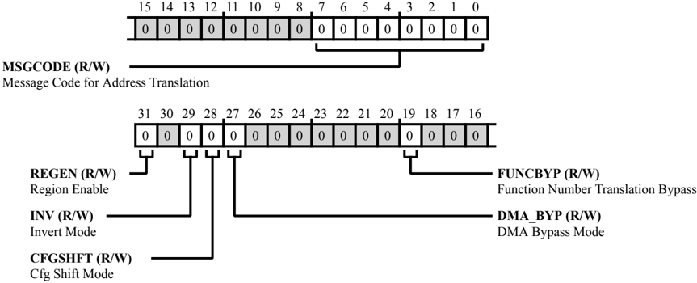

Table 29-128: PCIE\_IATU\_CTL2\_OUTB\_[n] Register Fields

| Bit No. (Access)   | Bit Name   | Description/Enumeration                                                                                                                                                                                                                                                                                                                                                                                                                        |
|--------------------|------------|------------------------------------------------------------------------------------------------------------------------------------------------------------------------------------------------------------------------------------------------------------------------------------------------------------------------------------------------------------------------------------------------------------------------------------------------|
| 31 (R/W)           | REGEN      | Region Enable. The PCIE_IATU_CTL2_OUTB_[n].REGEN bit must be set to 1 for address translation to take place.                                                                                                                                                                                                                                                                                                                                   |
| 29 (R/W)           | INV        | Invert Mode. When the PCIE_IATU_CTL2_OUTB_[n].INV bit is set the address matching re- gion is inverted. Therefore, an address match occurs when the untranslated address is in the region outside the defined range (Base Address to Limit Address).                                                                                                                                                                                           |
| 28 (R/W)           | CFGSHFT    | Cfg Shift Mode. The PCIE_IATU_CTL2_OUTB_[n].CFGSHFT bit is used for CFG transactions where the PCIe configuration mechanism maps bits [27:12] of the address to the bus/ device and function number. This allows a CFG configuration space to be located in any 256MB window of the application memory space using a 28-bit effective address. Shifts bits [27:12] of the untranslated address to form bits [31:16] of the translated address. |
| 27 (R/W)           | DMA_BYP    | DMABypass Mode. The PCIE_IATU_CTL2_OUTB_[n].DMA_BYP bit allows request TLPs which are initiated by the DMAcontroller to pass through the iATU untranslated.                                                                                                                                                                                                                                                                                    |

Table 29-128: PCIE\_IATU\_CTL2\_OUTB\_[n] Register Fields (Continued)

| Bit No. (Access)   | Bit Name   | Description/Enumeration                                                                                                                                                                                                                                                          |
|--------------------|------------|----------------------------------------------------------------------------------------------------------------------------------------------------------------------------------------------------------------------------------------------------------------------------------|
| 19 (R/W)           | FUNCBYP    | Function Number Translation Bypass. The PCIE_IATU_CTL2_OUTB_[n].FUNCBYP bit field configures the iATU to use the function number of the translated TLP from the Slave SCB interface and not from the PCIE_IATU_CTL1_OUTB_[n].FUNCNUM or the PCIE_IATU_CTL3_OUTB_[n].VFNUM field. |
| 7:0 (R/W)          | MSGCODE    | Message Code for Address Translation. When the address of an inbound TLP is matched to the PCIE_IATU_CTL2_OUTB_[n].MSGCODE bit field, and the translated TLP TYPE field is Msg or MsgD; then the message field of the TLP is changed to the value in this register.              |

## iATU Region Control 3 Register

The PCIE\_IATU\_CTL3\_INB\_[n] register controls virtual function of inbound address translation used for mapping different address ranges to different memory spaces.

Figure 29-120: PCIE\_IATU\_CTL3\_INB\_[n] Register Diagram

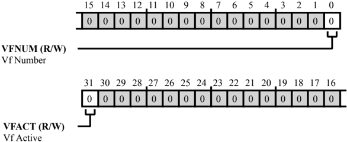

Table 29-129: PCIE\_IATU\_CTL3\_INB\_[n] Register Fields

| Bit No. (Access)   | Bit Name   | Description/Enumeration                                |
|--------------------|------------|--------------------------------------------------------|
| 31                 | VFACT      | Vf Active.                                             |
| (R/W)              |            | The PCIE_IATU_CTL3_INB_[n].VFACT bit must be set to 0. |
| 0                  | VFNUM      | Vf Number.                                             |
| (R/W)              |            | The PCIE_IATU_CTL3_INB_[n].VFNUM bit must be set to 0. |

## iATU Region Control 3 Register

The PCIE\_IATU\_CTL3\_OUTB\_[n] register controls virtual function of outbound address translation used for mapping different address ranges to different memory spaces.

Figure 29-121: PCIE\_IATU\_CTL3\_OUTB\_[n] Register Diagram

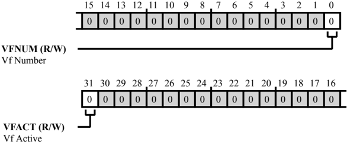

Table 29-130: PCIE\_IATU\_CTL3\_OUTB\_[n] Register Fields

| Bit No. (Access)   | Bit Name   | Description/Enumeration                                 |
|--------------------|------------|---------------------------------------------------------|
| 31                 | VFACT      | Vf Active.                                              |
| (R/W)              |            | The PCIE_IATU_CTL3_OUTB_[n].VFACT bit must be set to 0. |
| 0                  | VFNUM      | Vf Number.                                              |
| (R/W)              |            | The PCIE_IATU_CTL3_OUTB_[n].VFNUM bit must be set to 0. |

## IATU Lower Base Inbound Address Register

The PCIE\_IATU\_LBADDR\_INB\_[n] register contains the minimum size of an address translation region to 64 KB. The lower 16 bits of the Base, Limit and Target registers are zero and all address regions are aligned on 64 KB boundaries. More precisely, the lower 16 bits are zero.

Figure 29-122: PCIE\_IATU\_LBADDR\_INB\_[n] Register Diagram

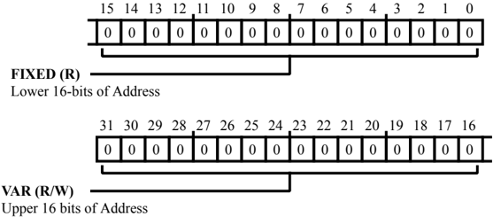

Table 29-131: PCIE\_IATU\_LBADDR\_INB\_[n] Register Fields

| Bit No. (Access)   | Bit Name   | Description/Enumeration                                                                                                                                                                                                                                                                                      |
|--------------------|------------|--------------------------------------------------------------------------------------------------------------------------------------------------------------------------------------------------------------------------------------------------------------------------------------------------------------|
| 31:16 (R/W)        | VAR        | Upper 16 bits of Address. The PCIE_IATU_LBADDR_INB_[n].VAR bit field forms bits [31:16] of the start address of the address region to be translated. This bit field is writeable.                                                                                                                            |
| 15:0 (R/NW)        | FIXED      | Lower 16-bits of Address. The PCIE_IATU_LBADDR_INB_[n].FIXED bit field forms bits [15:0] of the start address of the address region to be translated. The start address must be aligned to 64 KB, so these bits are always 0. A write to this location is ignored by the PCIe core. This field is read-only. |

## IATU Lower Base Outbound Address Register

The PCIE\_IATU\_LBADDR\_OUTB\_[n] register contains the minimum size of an address translation region to 64 KB. The lower 16 bits of the Base, Limit and Target registers are zero and all address regions are aligned on 64 KB boundaries. More precisely, the lower 16 bits are zero.

Figure 29-123: PCIE\_IATU\_LBADDR\_OUTB\_[n] Register Diagram

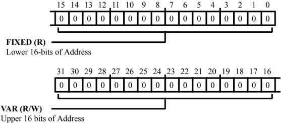

Table 29-132: PCIE\_IATU\_LBADDR\_OUTB\_[n] Register Fields

| Bit No. (Access)   | Bit Name   | Description/Enumeration                                                                                                                                                                                                                                                              |
|--------------------|------------|--------------------------------------------------------------------------------------------------------------------------------------------------------------------------------------------------------------------------------------------------------------------------------------|
| 31:16 (R/W)        | VAR        | Upper 16 bits of Address. The PCIE_IATU_LBADDR_OUTB_[n].VAR bit field forms bits [31:16] of the start address of the address region to be translated. This bit field is writeable.                                                                                                   |
| 15:0 (R/NW)        | FIXED      | Lower 16-bits of Address. The PCIE_IATU_LBADDR_OUTB_[n].FIXED bit field forms bits [15:0] of the start address of the address region to be translated. The start address must be aligned to 64 KB, so these bits are always 0. A write to this location is ignored by the PCIe core. |

## IATU Inbound Limit Address Register

The PCIE\_IATU\_LMTADDR\_INB\_[n] register includes the 32 bits end address of the address region to be translated.

Figure 29-124: PCIE\_IATU\_LMTADDR\_INB\_[n] Register Diagram

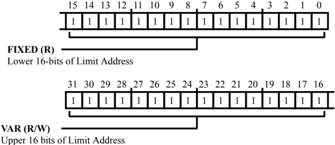

Table 29-133: PCIE\_IATU\_LMTADDR\_INB\_[n] Register Fields

| Bit No. (Access)   | Bit Name   | Description/Enumeration                                                                                                                                                                                                                                                                |
|--------------------|------------|----------------------------------------------------------------------------------------------------------------------------------------------------------------------------------------------------------------------------------------------------------------------------------------|
| 31:16 (R/W)        | VAR        | Upper 16 bits of Limit Address. The PCIE_IATU_LMTADDR_INB_[n].VAR bit field forms bits [31:16] of the end address of the address region to be translated. This bit field is writeable.                                                                                                 |
| 15:0 (R/NW)        | FIXED      | Lower 16-bits of Limit Address. The PCIE_IATU_LMTADDR_INB_[n].FIXED bit field forms bits [15:0] of the end address of the address region to be translated. The end address must be aligned to 64 KB, so these bits are always 0. A write to this location is ignored by the PCIe core. |

## IATU Outbound Limit Address Register

The PCIE\_IATU\_LMTADDR\_OUTB\_[n] register includes the 32 bits end address of the address region to be translated.

Figure 29-125: PCIE\_IATU\_LMTADDR\_OUTB\_[n] Register Diagram

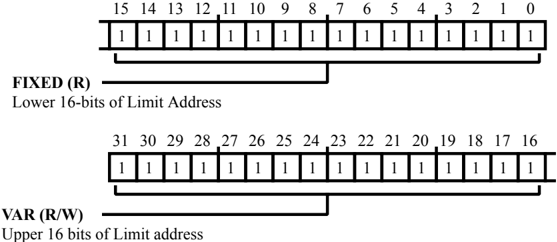

Table 29-134: PCIE\_IATU\_LMTADDR\_OUTB\_[n] Register Fields

| Bit No. (Access)   | Bit Name   | Description/Enumeration                                                                                                                                                                                                                                                                 |
|--------------------|------------|-----------------------------------------------------------------------------------------------------------------------------------------------------------------------------------------------------------------------------------------------------------------------------------------|
| 31:16 (R/W)        | VAR        | Upper 16 bits of Limit address. The PCIE_IATU_LMTADDR_OUTB_[n].VAR bit field forms bits [31:16] of the end address of the address region to be translated. This bit field is writeable.                                                                                                 |
| 15:0 (R/NW)        | FIXED      | Lower 16-bits of Limit Address. The PCIE_IATU_LMTADDR_OUTB_[n].FIXED bit field forms bits [15:0] of the end address of the address region to be translated. The end address must be aligned to 64 KB, so these bits are always 0. A write to this location is ignored by the PCIe core. |

## IATU Lower Target Address Inbound Register

The PCIE\_IATU\_LTADDR\_INB\_[n] register includes the least significant 32 bits of the 64-bit new address of the address region to be translated.

Figure 29-126: PCIE\_IATU\_LTADDR\_INB\_[n] Register Diagram

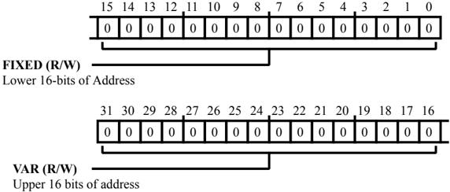

Table 29-135: PCIE\_IATU\_LTADDR\_INB\_[n] Register Fields

| Bit No. (Access)   | Bit Name   | Description/Enumeration                                                                                                                                                                                                                                                                                               |
|--------------------|------------|-----------------------------------------------------------------------------------------------------------------------------------------------------------------------------------------------------------------------------------------------------------------------------------------------------------------------|
| 31:16 (R/W)        | VAR        | Upper 16 bits of address. The PCIE_IATU_LTADDR_INB_[n].VAR bit field forms bits [31:16] of the new address of the translated region. This bit field is writeable.                                                                                                                                                     |
| 15:0 (R/W)         | FIXED      | Lower 16-bits of Address. The PCIE_IATU_LTADDR_INB_[n].FIXED bit field forms bits [15:0] of the start address of the new address of the translated region. The start address must be aligned to 64 KB, so these bits are always 0. A write to this location is ignored by the PCIe core. This bit field is read-only. |

## IATU Lower Target Address Outbound Register

The PCIE\_IATU\_LTADDR\_OUTB\_[n] register includes the least significant 32 bits of the 64-bit new address of the address region to be translated.

Figure 29-127: PCIE\_IATU\_LTADDR\_OUTB\_[n] Register Diagram

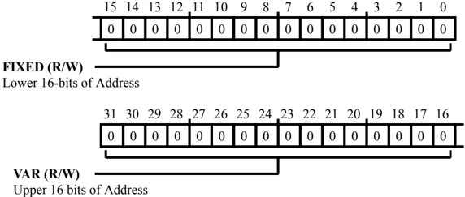

Table 29-136: PCIE\_IATU\_LTADDR\_OUTB\_[n] Register Fields

| Bit No. (Access)   | Bit Name   | Description/Enumeration                                                                                                                                                                                                                                                                                                |
|--------------------|------------|------------------------------------------------------------------------------------------------------------------------------------------------------------------------------------------------------------------------------------------------------------------------------------------------------------------------|
| 31:16 (R/W)        | VAR        | Upper 16 bits of Address. The PCIE_IATU_LTADDR_OUTB_[n].VAR bit field forms bits [31:16] of the new address of the translated region. This bit field is writeable.                                                                                                                                                     |
| 15:0 (R/W)         | FIXED      | Lower 16-bits of Address. The PCIE_IATU_LTADDR_OUTB_[n].FIXED bit field forms bits [15:0] of the start address of the new address of the translated region. The start address must be aligned to 64 KB, so these bits are always 0. A write to this location is ignored by the PCIe core. This bit field is read-only. |

## IATU Upper Base Address Inbound Register

The PCIE\_IATU\_UBADDR\_INB\_[n] register forms bits [63:32] of the start (and end) address of the address region to be translated. In systems with a 32-bit address space, this register is not used and therefore writing to this register has no effect.

Figure 29-128: PCIE\_IATU\_UBADDR\_INB\_[n] Register Diagram


Table 29-137: PCIE\_IATU\_UBADDR\_INB\_[n] Register Fields

| Bit No. (Access)   | Bit Name   | Description/Enumeration                                                                                                                                                                                                                                                                  |
|--------------------|------------|------------------------------------------------------------------------------------------------------------------------------------------------------------------------------------------------------------------------------------------------------------------------------------------|
| 31:0 (R/W)         | VAR        | Upper 32 bits of Address. The PCIE_IATU_UBADDR_INB_[n].VAR bit field forms bits [63:32] of the start (and end) address of the address region to be translated. In systems with a 32-bit ad- dress space, this register is not used and therefore writing to this register has no effect. |

## IATU Upper Base Address Outbound Register

The PCIE\_IATU\_UBADDR\_OUTB\_[n] register forms bits [63:32] of the start (and end) address of the address region to be translated. In systems with a 32-bit address space, this register is not used and therefore writing to this register has no effect.

Figure 29-129: PCIE\_IATU\_UBADDR\_OUTB\_[n] Register Diagram


Table 29-138: PCIE\_IATU\_UBADDR\_OUTB\_[n] Register Fields

| Bit No. (Access)   | Bit Name   | Description/Enumeration                                                                                                                                                                                                                                                                   |
|--------------------|------------|-------------------------------------------------------------------------------------------------------------------------------------------------------------------------------------------------------------------------------------------------------------------------------------------|
| 31:0 (R/W)         | VAR        | Upper 32 bits of Address. The PCIE_IATU_UBADDR_OUTB_[n].VAR bit field forms bits [63:32] of the start (and end) address of the address region to be translated. In systems with a 32-bit address space, this register is not used and therefore writing to this register has no ef- fect. |

## iATU Upper Target Address Inbound Register

The PCIE\_IATU\_UTADDR\_INB\_[n] register forms bits [63:32] of the start address of the new address of the translated region.

Figure 29-130: PCIE\_IATU\_UTADDR\_INB\_[n] Register Diagram

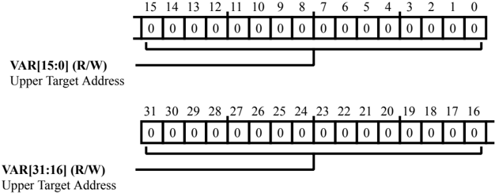

Table 29-139: PCIE\_IATU\_UTADDR\_INB\_[n] Register Fields

| Bit No. (Access)   | Bit Name   | Description/Enumeration                                                                                                                                                            |
|--------------------|------------|------------------------------------------------------------------------------------------------------------------------------------------------------------------------------------|
| 31:0 (R/W)         | VAR        | Upper Target Address. The PCIE_IATU_UTADDR_INB_[n].VAR bit field forms bits [63:32] of the start address of the new address of the translated region. This bit field is writeable. |

## iATU Upper Target Address Outbound Register

The PCIE\_IATU\_UTADDR\_OUTB\_[n] register contains bits [63:32] of the start address of the new address of the translated region.

Figure 29-131: PCIE\_IATU\_UTADDR\_OUTB\_[n] Register Diagram


Table 29-140: PCIE\_IATU\_UTADDR\_OUTB\_[n] Register Fields

| Bit No. (Access)   | Bit Name   | Description/Enumeration                                                                                                                                |
|--------------------|------------|--------------------------------------------------------------------------------------------------------------------------------------------------------|
| 31:0 (R/W)         | VAR        | Upper Target Address. The PCIE_IATU_UTADDR_OUTB_[n].VAR bit field forms bits [63:32] of the start address of the new address of the translated region. |

## IATU View Port Register

The PCIE\_IATU\_VWPRT\_[n] register programs the iATU registers through an indirect addressing scheme to reduce the address footprint in the PCI Express extended configuration space. The size of the required port logic space does not depend on the number of regions defined as the index register is used to select which memory region is being accessed.

There are 28 bytes of register space implemented per address region per direction. The number of address regions that are remapped by the iATU is configurable in each direction from 0 (none) to 256. However, only 32 bytes of the PCIe extended configuration space address map is used.

Figure 29-132: PCIE\_IATU\_VWPRT\_[n] Register Diagram

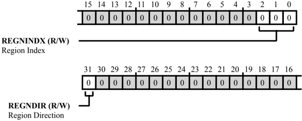

Table 29-141: PCIE\_IATU\_VWPRT\_[n] Register Fields

| Bit No. (Access)   | Bit Name   | Description/Enumeration                                                                                                                                                                                                                                                                                                                                                                                      |
|--------------------|------------|--------------------------------------------------------------------------------------------------------------------------------------------------------------------------------------------------------------------------------------------------------------------------------------------------------------------------------------------------------------------------------------------------------------|
| 31 (R/W)           | REGNDIR    | Region Direction. The PCIE_IATU_VWPRT_[n].REGNDIR bit defines the region being accessed as either inbound or outbound. 0 Outbound                                                                                                                                                                                                                                                                            |
| 2:0 (R/W)          | REGNINDX   | Region Index. The PCIE_IATU_VWPRT_[n].REGNINDX bit field defines which region is being accessed when writing to the control, base, limit and target registers. The value must not be set to a number greater than 3 when an outbound region is being accessed or a value greater than 5 when an inbound region is being accessed. X = is log2(CX_ATU_NUM_INBOUND_REGIONS and CX_ATU_NUM_OUT- BOUND_REGIONS). |

## Lane Skew Register

The PCIE\_LANE\_SKEW\_[n] register contains bits that control lane skew and Data Link Layer Packet operations.

Figure 29-133: PCIE\_LANE\_SKEW\_[n] Register Diagram

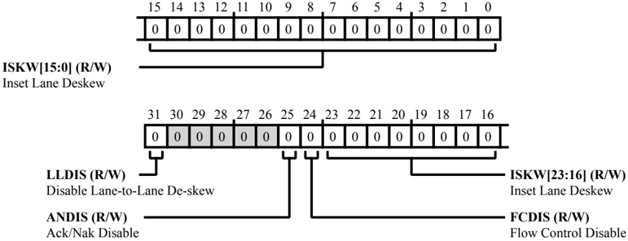

Table 29-142: PCIE\_LANE\_SKEW\_[n] Register Fields

| Bit No. (Access)   | Bit Name   | Description/Enumeration                                                                                                                                                        |
|--------------------|------------|--------------------------------------------------------------------------------------------------------------------------------------------------------------------------------|
| 31 (R/W)           | LLDIS      | Disable Lane-to-Lane De-skew. The PCIE_LANE_SKEW_[n].LLDIS bit causes the core to disable the internal Lane-to-Lane de-skew logic. This register field is sticky.              |
| 25 (R/W)           | ANDIS      | Ack/Nak Disable. The PCIE_LANE_SKEW_[n].ANDIS bit prevents the core from sending Ack and Nak DLLPs. This register field is sticky.                                             |
| 24 (R/W)           | FCDIS      | Flow Control Disable. The PCIE_LANE_SKEW_[n].FCDIS bit prevents the core from sending FC Data Link Layer Packets (DLLPs). This register field is sticky. 0 Do not send FC DLLP |
| 24 (R/W)           | 1          | Send FC DLLP                                                                                                                                                                   |
| 24 (R/W)           |            |                                                                                                                                                                                |

Table 29-142: PCIE\_LANE\_SKEW\_[n] Register Fields (Continued)

| Bit No. (Access)   | Bit Name   | Description/Enumeration                                                                                                                                                                                                                                                                                                                                                                                         |
|--------------------|------------|-----------------------------------------------------------------------------------------------------------------------------------------------------------------------------------------------------------------------------------------------------------------------------------------------------------------------------------------------------------------------------------------------------------------|
| 23:0 (R/W)         | ISKW       | Inset Lane Deskew. The PCIE_LANE_SKEW_[n] bit field configures the optional feature that causes the core to insert skew between lanes for test purposes. There are three bits per lane. The value is in units of one symbol time. For example, the value 010b for a lane forces a skew of two symbol times for that Lane. The maximum skew value for any lane is 5 symbol times. This register field is sticky. |

## Link Capabilities 2 Register

The PCIE\_LNK\_CAPB2\_[n] register contains bits that indicate the link speed vector and port cross link status.

Figure 29-134: PCIE\_LNK\_CAPB2\_[n] Register Diagram

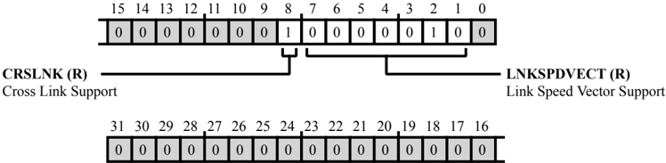

Table 29-143: PCIE\_LNK\_CAPB2\_[n] Register Fields

| Bit No. (Access)   | Bit Name   | Description/Enumeration                                                                                                                                                                                                                                                                                                                                                                                                                                  |
|--------------------|------------|----------------------------------------------------------------------------------------------------------------------------------------------------------------------------------------------------------------------------------------------------------------------------------------------------------------------------------------------------------------------------------------------------------------------------------------------------------|
| 8 (R/NW)           | CRSLNK     | Cross Link Support. When set to 1, the PCIE_LNK_CAPB2_[n].CRSLNK bit indicates that the associ- ated port supports cross links. When set to 0 on a port that supports link speeds of 8.0 GT/s or higher, this bit indicates that the associated port does not support cross links. When cleared (=0) on a port that only supports link speeds of 2.5 GT/s or 5.0 GT/s, this bit provides no information regarding the ports level of cross link support. |
| 7:1 (R/NW)         | LNKSPDVECT | Link Speed Vector Support. The PCIE_LNK_CAPB2_[n].LNKSPDVECT bit field indicates the supported link speed(s) of the associated port. For each bit, a value of 1 indicates that the correspond- ing link speed is supported; otherwise, the link speed is not supported.                                                                                                                                                                                  |
| 7:1 (R/NW)         | LNKSPDVECT | 0 2.5 GT/sec                                                                                                                                                                                                                                                                                                                                                                                                                                             |
| 7:1 (R/NW)         | LNKSPDVECT | 1 5.0 GT/sec                                                                                                                                                                                                                                                                                                                                                                                                                                             |
| 7:1 (R/NW)         | LNKSPDVECT | 2 8.0 GT/sec                                                                                                                                                                                                                                                                                                                                                                                                                                             |

## Link Capabilities Register

The PCIE\_LNK\_CAPB\_[n] register contains bits that indicate the status of links and various link capabilities.

Figure 29-135: PCIE\_LNK\_CAPB\_[n] Register Diagram

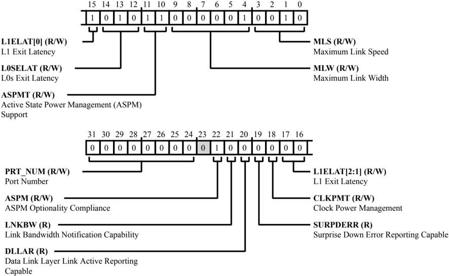

Table 29-144: PCIE\_LNK\_CAPB\_[n] Register Fields

| Bit No. (Access)   | Bit Name   | Description/Enumeration                                                                                                                                                                                                                                                                                                                          |
|--------------------|------------|--------------------------------------------------------------------------------------------------------------------------------------------------------------------------------------------------------------------------------------------------------------------------------------------------------------------------------------------------|
| 31:24 (R/W)        | PRT_NUM    | Port Number. The PCIE_LNK_CAPB_[n].PRT_NUM bit field indicates the PCI Express Port number for the given PCI Express Link. Multi-function devices associated with an up- stream port must report the same value in this field for all functions.                                                                                                 |
| 22 (R/W)           | ASPM       | ASPM Optionality Compliance. The PCIE_LNK_CAPB_[n].ASPM bit must be set to 1 in all functions. Compo- nents implemented against certain earlier versions of this specification will have this bit set to 0. Software is permitted to use the value of this bit to help determine whether to enable ASPM or whether to run ASPM compliance tests. |

Table 29-144: PCIE\_LNK\_CAPB\_[n] Register Fields (Continued)

| Bit No. (Access)   | Bit Name   | Description/Enumeration                                                                                                                                                                                                                                                                                                                                                                                                                                                                                                                                                                                                                                                                                                                                                                                                                                                                                                |
|--------------------|------------|------------------------------------------------------------------------------------------------------------------------------------------------------------------------------------------------------------------------------------------------------------------------------------------------------------------------------------------------------------------------------------------------------------------------------------------------------------------------------------------------------------------------------------------------------------------------------------------------------------------------------------------------------------------------------------------------------------------------------------------------------------------------------------------------------------------------------------------------------------------------------------------------------------------------|
| 21 (R/NW)          | LNKBW      | Link Bandwidth Notification Capability. A value of 1 in the PCIE_LNK_CAPB_[n].LNKBW bit indicates support for the Link Bandwidth Notification status and interrupt mechanisms. This capability is re- quired for all Root Ports and Switch Downstream Ports supporting links wider than x1 and/or multiple Link speeds. This bit is not applicable and is Reserved for Endpoints, PCI Express to PCI/PCI-X bridges, and upstream ports of switches. Functions that do not implement the Link Bandwidth Notification Capability must hardwire this bit to 0.                                                                                                                                                                                                                                                                                                                                                            |
| 20 (R/NW)          | DLLAR      | Data Link Layer Link Active Reporting Capable. For a downstream port, the PCIE_LNK_CAPB_[n].DLLAR bit must be hardwired to 1 if the component supports the optional capability of reporting the DL_Active state of the Data Link Control and Management State Machine. For a hot-plug capa- ble downstream port (as indicated by the Hot-Plug Capable bit of the Slot Capabilities register) or a downstream port that supports Link speeds greater than 5.0 GT/s, this bit must be hardwired to 1. For upstream ports and components that do not support this optional capability, this bit must be hardwired to 0.                                                                                                                                                                                                                                                                                                   |
| 19 (R/NW)          | SURPDERR   | Surprise Down Error Reporting Capable. For a downstream port, the PCIE_LNK_CAPB_[n].SURPDERR bit must be set (=1) if the component supports the optional capability of detecting and reporting a Surprise Down error condition. For upstream ports and components that do not sup- port this optional capability, this bit must be hardwired to 0.                                                                                                                                                                                                                                                                                                                                                                                                                                                                                                                                                                     |
| 18 (R/W)           | CLKPMT     | Clock Power Management. For upstream ports, a 1 the PCIE_LNK_CAPB_[n].CLKPMT bit indicates that the component tolerates the removal of any reference clock(s) via the clock request (CLKREQ#) mechanism when the Link is in the L1 and L2/L3 Ready Link states. A value of 0 indicates the component does not have this capability and that reference clock(s) must not be removed in these Link states. This capability is applicable only in form factors that support clock request (CLKREQ#) capability. For a multi-Function device associated with an upstream port, each function indicates its capability independently. Power Management configuration software must only per- mit reference clock removal if all functions of the multi-function device indicate a 1b in this bit. For ARI devices, all functions must indicate the same value in this bit. For downstream ports, this bit must be set to 0. |

Table 29-144: PCIE\_LNK\_CAPB\_[n] Register Fields (Continued)

| Bit No. (Access)   | Bit Name   | Description/Enumeration                                                                                                                                                                                                                                                                                                                                                                                                                                     | Description/Enumeration                                                                                                                                                                                                                                                                                                                                                                                                                                     |
|--------------------|------------|-------------------------------------------------------------------------------------------------------------------------------------------------------------------------------------------------------------------------------------------------------------------------------------------------------------------------------------------------------------------------------------------------------------------------------------------------------------|-------------------------------------------------------------------------------------------------------------------------------------------------------------------------------------------------------------------------------------------------------------------------------------------------------------------------------------------------------------------------------------------------------------------------------------------------------------|
| 17:15 (R/W)        | L1ELAT     | L1 Exit Latency. The PCIE_LNK_CAPB_[n].L1ELAT bit field indicates the L1 exit latency for the given PCI Express Link. The value reported indicates the length of time this Port re- quires to complete transition from ASPM L1 to L0. If ASPM L1 is not supported, the value is undefined. Note that exit latencies may be influenced by PCI Express reference clock configura- tion depending upon whether a component uses a common or separate reference | L1 Exit Latency. The PCIE_LNK_CAPB_[n].L1ELAT bit field indicates the L1 exit latency for the given PCI Express Link. The value reported indicates the length of time this Port re- quires to complete transition from ASPM L1 to L0. If ASPM L1 is not supported, the value is undefined. Note that exit latencies may be influenced by PCI Express reference clock configura- tion depending upon whether a component uses a common or separate reference |
|                    |            | 0                                                                                                                                                                                                                                                                                                                                                                                                                                                           | Less than 1s                                                                                                                                                                                                                                                                                                                                                                                                                                                |
|                    |            | 1                                                                                                                                                                                                                                                                                                                                                                                                                                                           | 1 s to less than 2 s                                                                                                                                                                                                                                                                                                                                                                                                                                        |
|                    |            | 2                                                                                                                                                                                                                                                                                                                                                                                                                                                           | 2 s to less than 4 s                                                                                                                                                                                                                                                                                                                                                                                                                                        |
|                    |            | 3                                                                                                                                                                                                                                                                                                                                                                                                                                                           | 4 s to less than 8 s                                                                                                                                                                                                                                                                                                                                                                                                                                        |
|                    |            | 4                                                                                                                                                                                                                                                                                                                                                                                                                                                           | 8 s to less than 16 s                                                                                                                                                                                                                                                                                                                                                                                                                                       |
|                    |            | 5                                                                                                                                                                                                                                                                                                                                                                                                                                                           | 16 s to less than 32 s                                                                                                                                                                                                                                                                                                                                                                                                                                      |
|                    |            | 6                                                                                                                                                                                                                                                                                                                                                                                                                                                           | 32 s-64 s                                                                                                                                                                                                                                                                                                                                                                                                                                                   |
|                    |            | 7                                                                                                                                                                                                                                                                                                                                                                                                                                                           | More than 64 s                                                                                                                                                                                                                                                                                                                                                                                                                                              |
| 14:12 (R/W)        | L0SELAT    | L0s Exit Latency. The PCIE_LNK_CAPB_[n].L0SELAT bit field indicates the L0s exit latency for the given PCI Express Link. The value reported indicates the length of time this port requires to complete transition from L0s to L0. If L0s is not supported, the value is undefined.                                                                                                                                                                         | L0s Exit Latency. The PCIE_LNK_CAPB_[n].L0SELAT bit field indicates the L0s exit latency for the given PCI Express Link. The value reported indicates the length of time this port requires to complete transition from L0s to L0. If L0s is not supported, the value is undefined.                                                                                                                                                                         |
|                    |            | 0                                                                                                                                                                                                                                                                                                                                                                                                                                                           | Less than 64 ns                                                                                                                                                                                                                                                                                                                                                                                                                                             |
|                    |            | 1                                                                                                                                                                                                                                                                                                                                                                                                                                                           | 64 ns to less than 128 ns                                                                                                                                                                                                                                                                                                                                                                                                                                   |
|                    |            | 2                                                                                                                                                                                                                                                                                                                                                                                                                                                           | 128 ns to less than 256 ns                                                                                                                                                                                                                                                                                                                                                                                                                                  |
|                    |            | 3                                                                                                                                                                                                                                                                                                                                                                                                                                                           | 256 ns to less than 512 ns                                                                                                                                                                                                                                                                                                                                                                                                                                  |
|                    |            | 4                                                                                                                                                                                                                                                                                                                                                                                                                                                           | 512 ns to less than 1 s                                                                                                                                                                                                                                                                                                                                                                                                                                     |
|                    |            | 5                                                                                                                                                                                                                                                                                                                                                                                                                                                           | 1 s to less than 2 s                                                                                                                                                                                                                                                                                                                                                                                                                                        |
|                    |            | 6                                                                                                                                                                                                                                                                                                                                                                                                                                                           | 2 s-4 s                                                                                                                                                                                                                                                                                                                                                                                                                                                     |
|                    |            | 7                                                                                                                                                                                                                                                                                                                                                                                                                                                           | More than 4 s                                                                                                                                                                                                                                                                                                                                                                                                                                               |

Table 29-144: PCIE\_LNK\_CAPB\_[n] Register Fields (Continued)

| Bit No. (Access)   | Bit Name                                                                          | Description/Enumeration                                                                                                                                                                                                                                                                                                                                                                                                                                         |
|--------------------|-----------------------------------------------------------------------------------|-----------------------------------------------------------------------------------------------------------------------------------------------------------------------------------------------------------------------------------------------------------------------------------------------------------------------------------------------------------------------------------------------------------------------------------------------------------------|
| 11:10 (R/W)        | ASPMT                                                                             | Active State Power Management (ASPM) Support. The PCIE_LNK_CAPB_[n].ASPMT bit field indicates the level of ASPM support- ed on the given PCI Express Link. Multi-function devices associated with an Upstream Port must report the same value in this field for all Functions.                                                                                                                                                                                  |
| 11:10 (R/W)        | ASPMT                                                                             | 0 No ASPM support                                                                                                                                                                                                                                                                                                                                                                                                                                               |
| 11:10 (R/W)        | ASPMT                                                                             | 1 0s support                                                                                                                                                                                                                                                                                                                                                                                                                                                    |
| 11:10 (R/W)        | ASPMT                                                                             | 2 L1 supported                                                                                                                                                                                                                                                                                                                                                                                                                                                  |
| 11:10 (R/W)        | ASPMT                                                                             | 3 L0s and L1 supported                                                                                                                                                                                                                                                                                                                                                                                                                                          |
| 9:4 (R/W)          | MLW                                                                               | Maximum Link Width. The PCIE_LNK_CAPB_[n].MLW bit field indicates the maximum link width (xN corresponding to NLanes) implemented by the component. This value is permitted to exceed the number of lanes routed to the slot (downstream port), adapter connector (upstream port), or in the case of component-to- component connections, the actual wired connection width. Multi-Function devices associated with an upstream port must report the same value |
| 9:4 (R/W)          | MLW                                                                               | 0 Reserved                                                                                                                                                                                                                                                                                                                                                                                                                                                      |
| 9:4 (R/W)          | MLW                                                                               | 1 x1                                                                                                                                                                                                                                                                                                                                                                                                                                                            |
| 9:4 (R/W)          | MLW                                                                               | 3 x4                                                                                                                                                                                                                                                                                                                                                                                                                                                            |
| 9:4 (R/W)          | MLW                                                                               | 4 x8                                                                                                                                                                                                                                                                                                                                                                                                                                                            |
| 9:4 (R/W)          | MLW                                                                               | 5 x12                                                                                                                                                                                                                                                                                                                                                                                                                                                           |
| 9:4 (R/W)          | MLW                                                                               | 6 x16                                                                                                                                                                                                                                                                                                                                                                                                                                                           |
| 9:4 (R/W)          | MLS                                                                               | 7 x32 Maximum                                                                                                                                                                                                                                                                                                                                                                                                                                                   |
| 9:4 (R/W)          | Link Speed. PCIE_LNK_CAPB_[n].MLS associated port. The vector (in the link speed. |                                                                                                                                                                                                                                                                                                                                                                                                                                                                 |
| 9:4 (R/W)          | Link Speed. PCIE_LNK_CAPB_[n].MLS associated port. The vector (in the link speed. | 1 Supported Link Speeds Vector field bit 1                                                                                                                                                                                                                                                                                                                                                                                                                      |
| 9:4 (R/W)          |                                                                                   |                                                                                                                                                                                                                                                                                                                                                                                                                                                                 |
| 9:4 (R/W)          |                                                                                   |                                                                                                                                                                                                                                                                                                                                                                                                                                                                 |

Table 29-144: PCIE\_LNK\_CAPB\_[n] Register Fields (Continued)

| Bit No.   | Bit Name   | Description/Enumeration                    |
|-----------|------------|--------------------------------------------|
| (Access)  |            |                                            |
|           |            | 3 Supported Link Speeds Vector field bit 3 |
|           |            | 4 Supported Link Speeds Vector field bit 4 |
|           |            | 5 Supported Link Speeds Vector field bit 5 |
|           |            | 6 Supported Link Speeds Vector field bit 6 |

## Link Control 2 and Status 2 Register

The PCIE\_LNK\_CTLSTAT2\_[n] register is used to configure various link attributes and reports various link status.

Figure 29-136: PCIE\_LNK\_CTLSTAT2\_[n] Register Diagram

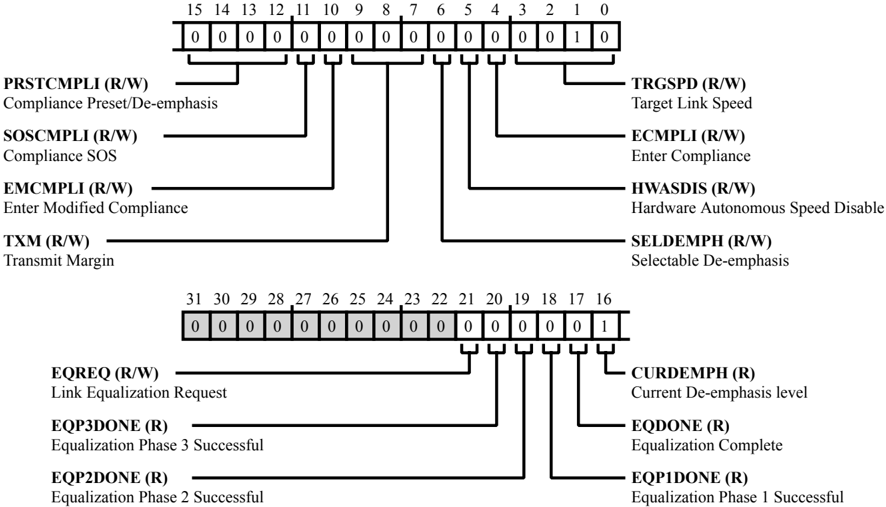

Table 29-145: PCIE\_LNK\_CTLSTAT2\_[n] Register Fields

| Bit No. (Access)   | Bit Name   | Description/Enumeration                                                                                                                                                             |
|--------------------|------------|-------------------------------------------------------------------------------------------------------------------------------------------------------------------------------------|
| 21 (R/W)           | EQREQ      | Link Equalization Request. The PCIE_LNK_CTLSTAT2_[n].EQREQ bit is set by hardware to request the link equalization process to be performed on the link.                             |
| 20 (R/NW)          | EQP3DONE   | Equalization Phase 3 Successful. When set (=1), the PCIE_LNK_CTLSTAT2_[n].EQP3DONE bit indicates that Phase 3 of the Transmitter Equalization procedure has successfully completed. |
| 19 (R/NW)          | EQP2DONE   | Equalization Phase 2 Successful. When set (=1), the PCIE_LNK_CTLSTAT2_[n].EQP2DONE bit indicates that Phase 2 of the Transmitter Equalization procedure has successfully completed. |
| 18 (R/NW)          | EQP1DONE   | Equalization Phase 1 Successful. When set (=1), the PCIE_LNK_CTLSTAT2_[n].EQP1DONE bit indicates that Phase 1 of the Transmitter Equalization procedure has successfully completed. |

Table 29-145: PCIE\_LNK\_CTLSTAT2\_[n] Register Fields (Continued)

| Bit No. (Access)   | Bit Name   | Description/Enumeration                                                                                                                                                                                                                                                                                                                                                                                                                                                                                                                                                                                                                                                                                        |
|--------------------|------------|----------------------------------------------------------------------------------------------------------------------------------------------------------------------------------------------------------------------------------------------------------------------------------------------------------------------------------------------------------------------------------------------------------------------------------------------------------------------------------------------------------------------------------------------------------------------------------------------------------------------------------------------------------------------------------------------------------------|
| 17 (R/NW)          | EQDONE     | Equalization Complete. For a description of this standard PCIe register field, see the PCI Express Base Specifi- cation 3.0. This register field is sticky.                                                                                                                                                                                                                                                                                                                                                                                                                                                                                                                                                    |
| 16 (R/NW)          | CURDEMPH   | Current De-emphasis level. When the link is operating at 5.0 GT/sec speed, this bit reflects the level of de-empha- sis. The value in this bit is undefined when the link is not operating at 5.0 GT/sec speed. Components that support only the 2.5 GT/sec speed are permitted to set this bit to 0.                                                                                                                                                                                                                                                                                                                                                                                                          |
| 16 (R/NW)          | CURDEMPH   | 0 -6.0 dB                                                                                                                                                                                                                                                                                                                                                                                                                                                                                                                                                                                                                                                                                                      |
| 15:12 (R/W)        | PRSTCMPLI  | Compliance Preset/De-emphasis. The PCIE_LNK_CTLSTAT2_[n].PRSTCMPLI bit field sets the de-emphasis lev- el in Polling for 5.0 GT/sec data rate. Compliance state if the entry occurred due to the Enter Compliance bit being 1. Defined Encodings are 0001=3.5 dB and 0000=6 dB. When the Link is operating at 2.5 GT/sec, this field has no effect. Components that support only 2.5 GT/sec speed are permitted to set this field to 0000. This field is in- tended for debug and compliance testing purposes. System firmware and software is allowed to modify this field only during debug or compliance testing. In all other cas- es, the system must ensure that this field is set to the default value. |
| 11 (R/W)           | SOSCMPLI   | Compliance SOS. When the PCIE_LNK_CTLSTAT2_[n].SOSCMPLI bit is set (=1), the LTSSM is required to send SKP Ordered Sets between sequences when sending the Compliance Pattern or Modified Compliance Pattern. For a Multi-Function device associated with an Upstream Port, the bit in Function 0 is of type RWS, and only Function 0 controls the components link behavior. In all other Functions of that device, this bit is of type RsvdP . The default value of this bit is 0. The PCIE_LNK_CTLSTAT2_[n].SOSCMPLI bit is applicable when the Link is operating at 2.5 GT/sec or 5.0 GT/sec data rates only. Components that support only the 2.5 GT/sec speed are permitted to hardwire this bit to 0.    |
| 10 (R/W)           | EMCMPLI    | Enter Modified Compliance. When the PCIE_LNK_CTLSTAT2_[n].EMCMPLI bit is set (=1), the device transmits Modified Compliance Pattern if the LTSSM enters Polling Compliance state. Components that support only the 2.5 GT/sec speed are permitted to set this bit to 0. The PCIE_LNK_CTLSTAT2_[n].EMCMPLI bit is intended for debug and com- pliance testing purposes. System firmware and software is allowed to modify this bit only during debug or compliance testing. In all other cases, the system must ensure that this bit is set to the default value.                                                                                                                                               |

Table 29-145: PCIE\_LNK\_CTLSTAT2\_[n] Register Fields (Continued)

| Bit No. (Access)   | Bit Name   | Description/Enumeration                                                                                                                                                                                                                                                                                                                                                                                                                                                                                         |
|--------------------|------------|-----------------------------------------------------------------------------------------------------------------------------------------------------------------------------------------------------------------------------------------------------------------------------------------------------------------------------------------------------------------------------------------------------------------------------------------------------------------------------------------------------------------|
| 9:7 (R/W)          | TXM        | Transmit Margin. The PCIE_LNK_CTLSTAT2_[n].TXM bit field controls the value of the non-de- emphasized voltage level at the transmitter pins. This field is reset to 0x0 on entry to the LTSSM Polling.                                                                                                                                                                                                                                                                                                          |
| 6 (R/W)            | SELDEMPH   | Selectable De-emphasis. The PCIE_LNK_CTLSTAT2_[n].SELDEMPH bit is used to control the transmit deemphasis of the link in specific situations when the link is operating at 5.0 GT/sec. When the link is not operating at 5.0 GT/sec speed, the setting of this bit has no ef- fect. Components that support only the 2.5 GT/sec speed are permitted to hardwire this bit to 0. This bit is not applicable and reserved for Endpoints, PCI Express to PCI/PCI-X bridges, and upstream ports of switches. 0 -6 dB |
| 5 (R/W)            | HWASDIS    | Hardware Autonomous Speed Disable. When the PCIE_LNK_CTLSTAT2_[n].HWASDIS bit is set (=1), hardware can- not change the link speed for device-specific reasons other than attempting to correct unreliable link operation. Initial transition to the highest supported common link speed is not blocked by this bit.                                                                                                                                                                                            |
| 4 (R/W)            | ECMPLI     | Enter Compliance. When set (=1) the PCIE_LNK_CTLSTAT2_[n].ECMPLI bit allows software to force a link to enter Compliance mode (at the speed indicated in the Target Link Speed field and the de-emphasis/preset level indicated by the Compliance Preset/De- emphasis field) in both components on a link and then initiating a hot reset on the link.                                                                                                                                                          |

Table 29-145: PCIE\_LNK\_CTLSTAT2\_[n] Register Fields (Continued)

| Bit No. (Access)   | Bit Name   | Description/Enumeration                                                                                                                                                                                                                                                                                                                                                                                                                                                                                                                                                                                                                                                                                                                                                                                                                                                                                                                                                                                                                                                                                                                                                                                                                                                                                |
|--------------------|------------|--------------------------------------------------------------------------------------------------------------------------------------------------------------------------------------------------------------------------------------------------------------------------------------------------------------------------------------------------------------------------------------------------------------------------------------------------------------------------------------------------------------------------------------------------------------------------------------------------------------------------------------------------------------------------------------------------------------------------------------------------------------------------------------------------------------------------------------------------------------------------------------------------------------------------------------------------------------------------------------------------------------------------------------------------------------------------------------------------------------------------------------------------------------------------------------------------------------------------------------------------------------------------------------------------------|
| 3:0 (R/W)          | TRGSPD     | Target Link Speed. For downstream ports, the PCIE_LNK_CTLSTAT2_[n].TRGSPD bit field sets an upper limit on Link operational speed by restricting the values advertised by the Up- stream component in its training sequences. The encoded value specifies a bit location in the Supported Link Speeds Vector (in the Link Capabilities 2 register) that corre- sponds to the desired target Link speed. All encodings not listed below are reserved. If a value is written to the PCIE_LNK_CTLSTAT2_[n].TRGSPD bit field that does not correspond to a supported speed (as indicated by the Supported Link Speeds Vector), the result is undefined. If either of the Enter Compliance or Enter Modified Compliance bits are implement- ed, then this field must also be implemented. The default value of this field is the high- est Link speed supported by the component (as reported in the PCIE_LNK_CAPB_[n].MLS bit field) unless the corresponding platform/form fac- tor requires a different default value. For both upstream and downstream ports, this field is used to set the target compliance mode speed when software is using the Enter Compliance bit to force a Link into compliance mode. Components that support only the 2.5 GT/s speed are permitted to set this field to 0000. |
|                    |            | 0 Supported Link Speeds Vector field bit 0                                                                                                                                                                                                                                                                                                                                                                                                                                                                                                                                                                                                                                                                                                                                                                                                                                                                                                                                                                                                                                                                                                                                                                                                                                                             |
|                    |            | 1 Supported Link Speeds Vector field bit 1                                                                                                                                                                                                                                                                                                                                                                                                                                                                                                                                                                                                                                                                                                                                                                                                                                                                                                                                                                                                                                                                                                                                                                                                                                                             |
|                    |            | 2 Supported Link Speeds Vector field bit 2                                                                                                                                                                                                                                                                                                                                                                                                                                                                                                                                                                                                                                                                                                                                                                                                                                                                                                                                                                                                                                                                                                                                                                                                                                                             |
|                    |            | 3 Supported Link Speeds Vector field bit 3                                                                                                                                                                                                                                                                                                                                                                                                                                                                                                                                                                                                                                                                                                                                                                                                                                                                                                                                                                                                                                                                                                                                                                                                                                                             |
|                    |            | 4 Supported Link Speeds Vector field bit 4                                                                                                                                                                                                                                                                                                                                                                                                                                                                                                                                                                                                                                                                                                                                                                                                                                                                                                                                                                                                                                                                                                                                                                                                                                                             |
|                    |            | 5 Supported Link Speeds Vector field bit 5                                                                                                                                                                                                                                                                                                                                                                                                                                                                                                                                                                                                                                                                                                                                                                                                                                                                                                                                                                                                                                                                                                                                                                                                                                                             |
|                    |            | 6 Supported Link Speeds Vector field bit 6                                                                                                                                                                                                                                                                                                                                                                                                                                                                                                                                                                                                                                                                                                                                                                                                                                                                                                                                                                                                                                                                                                                                                                                                                                                             |

## Link Control and Status Register

The PCIE\_LNK\_CTLSTAT\_[n] register controls PCI Express Link specific parameters.

Figure 29-137: PCIE\_LNK\_CTLSTAT\_[n] Register Diagram

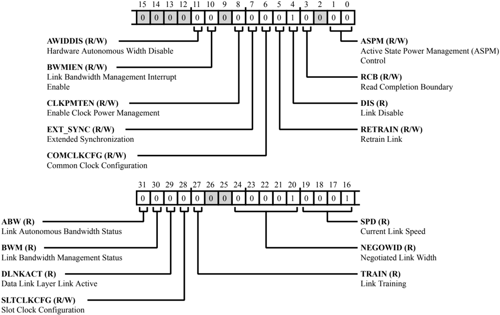

Table 29-146: PCIE\_LNK\_CTLSTAT\_[n] Register Fields

| Bit No. (Access)   | Bit Name   | Description/Enumeration                                                                                                                            |
|--------------------|------------|----------------------------------------------------------------------------------------------------------------------------------------------------|
| 31 (R/NW)          | ABW        | Link Autonomous Bandwidth Status. For a description of the PCIe standard PCIE_LNK_CTLSTAT_[n].ABW bit, see the PCI Express Base Specification 3.0. |
| 30 (R/NW)          | BWM        | Link Bandwidth Management Status. For a description of the PCIe standard PCIE_LNK_CTLSTAT_[n].BWM bit, see the PCI Express Base Specification 3.0. |
| 29 (R/NW)          | DLNKACT    | Data Link Layer Link Active. For a description of the PCIe standard PCIE_LNK_CTLSTAT_[n].DLNKACT bit, see the PCI Express Base Specification 3.0.  |

Table 29-146: PCIE\_LNK\_CTLSTAT\_[n] Register Fields (Continued)

| Bit No. (Access)   | Bit Name   | Description/Enumeration                                                                                                                                                                                                                           |
|--------------------|------------|---------------------------------------------------------------------------------------------------------------------------------------------------------------------------------------------------------------------------------------------------|
| 28 (R/W)           | SLTCLKCFG  | Slot Clock Configuration. For a description of the PCIe standard PCIE_LNK_CTLSTAT_[n].SLTCLKCFG bit, see the PCI Express Base Specification 3.0. The access attributes of this field are as follows: • Wire: No access. • Dbi: R/W • Dbi2: HWINIT |
| 27 (R/NW)          | TRAIN      | Link Training. For a description of the PCIe standard PCIE_LNK_CTLSTAT_[n].TRAIN bit, see the PCI Express Base Specification 3.0.                                                                                                                 |
| 24:20 (R/NW)       | NEGOWID    | Negotiated Link Width. For a description of the PCIe standard PCIE_LNK_CTLSTAT_[n].NEGOWID bit, see the PCI Express Base Specification 3.0.                                                                                                       |
| 19:16 (R/NW)       | SPD        | Current Link Speed. For a description of the PCIe standard PCIE_LNK_CTLSTAT_[n].SPD bit, see the PCI Express Base Specification 3.0.                                                                                                              |
| 11 (R/W)           | AWIDDIS    | Hardware Autonomous Width Disable. For a description of the PCIe standard PCIE_LNK_CTLSTAT_[n].AWIDDIS bit, see the PCI Express Base Specification 3.0.                                                                                           |
| 10 (R/W)           | BWMIEN     | Link Bandwidth Management Interrupt Enable. For a description of the PCIe standard PCIE_LNK_CTLSTAT_[n].BWMIEN bit, see the PCI Express Base Specification 3.0.                                                                                   |
| 8 (R/W)            | CLKPMTEN   | Enable Clock Power Management. For a description of this standard PCIe register field, see the <i>PCI Express Base Spec- ification 3.0</i>.                                                                                                       |
| 7 (R/W)            | EXT_SYNC   | Extended Synchronization. For a description of the PCIe standard PCIE_LNK_CTLSTAT_[n].EXT_SYNC bit, see the PCI Express Base Specification 3.0.                                                                                                   |
| 6 (R/W)            | COMCLKCFG  | Common Clock Configuration. For a description of the PCIe standard PCIE_LNK_CTLSTAT_[n].COMCLKCFG bit, see the PCI Express Base Specification 3.0.                                                                                                |
| 5 (R/W)            | RETRAIN    | Retrain Link. For a description of the PCIe standard PCIE_LNK_CTLSTAT_[n].RETRAIN bit, see the PCI Express Base Specification 3.0.                                                                                                                |

Table 29-146: PCIE\_LNK\_CTLSTAT\_[n] Register Fields (Continued)

| Bit No. (Access)   | Bit Name   | Description/Enumeration                                                                                                                                                                                                                                             | Description/Enumeration                                                                                                                                                                                                                                             |
|--------------------|------------|---------------------------------------------------------------------------------------------------------------------------------------------------------------------------------------------------------------------------------------------------------------------|---------------------------------------------------------------------------------------------------------------------------------------------------------------------------------------------------------------------------------------------------------------------|
| 4 (R/NW)           | DIS        | Link Disable. The PCIE_LNK_CTLSTAT_[n].DIS bit disables the link by directing the LTSSM to the disabled state. This bit is reserved on Endpoints, PCI Express to PCI/PCI-X bridges, and upstream ports of switches. Writes to this bit are immediately reflected in | Link Disable. The PCIE_LNK_CTLSTAT_[n].DIS bit disables the link by directing the LTSSM to the disabled state. This bit is reserved on Endpoints, PCI Express to PCI/PCI-X bridges, and upstream ports of switches. Writes to this bit are immediately reflected in |
| 3 (R/W)            | RCB        | Read Completion Boundary. The PCIE_LNK_CTLSTAT_[n].RCB bit indicates the RCB value for the Root Port.                                                                                                                                                               | Read Completion Boundary. The PCIE_LNK_CTLSTAT_[n].RCB bit indicates the RCB value for the Root Port.                                                                                                                                                               |
| 3 (R/W)            | RCB        | 0                                                                                                                                                                                                                                                                   | 64-byte                                                                                                                                                                                                                                                             |
| 1:0 (R/W)          | ASPM       | Active State Power Management (ASPM) Control. The PCIE_LNK_CTLSTAT_[n].ASPM bit field controls the level of ASPM ena- bled on the given PCI Express Link.                                                                                                           | Active State Power Management (ASPM) Control. The PCIE_LNK_CTLSTAT_[n].ASPM bit field controls the level of ASPM ena- bled on the given PCI Express Link.                                                                                                           |
| 1:0 (R/W)          | ASPM       | 0                                                                                                                                                                                                                                                                   | Disabled                                                                                                                                                                                                                                                            |
| 1:0 (R/W)          | ASPM       | 1                                                                                                                                                                                                                                                                   | L0s entry enabled                                                                                                                                                                                                                                                   |
| 1:0 (R/W)          | ASPM       | 2                                                                                                                                                                                                                                                                   | L1 entry enabled                                                                                                                                                                                                                                                    |
| 1:0 (R/W)          | ASPM       | 3                                                                                                                                                                                                                                                                   | L0s and L1 entry enabled                                                                                                                                                                                                                                            |

## DBI Read-Only Write Enable Register

The PCIE\_MISC\_CTL1\_[n] register allows programs to write applicable hardware init and read-only bits from the local application through the DBI.

Figure 29-138: PCIE\_MISC\_CTL1\_[n] Register Diagram

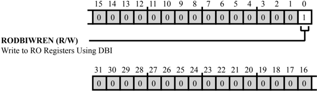

Table 29-147: PCIE\_MISC\_CTL1\_[n] Register Fields

| Bit No. (Access)   | Bit Name   | Description/Enumeration                                                                                                                                                                                |
|--------------------|------------|--------------------------------------------------------------------------------------------------------------------------------------------------------------------------------------------------------|
| 0 (R/W)            | RODBIWREN  | Write to RO Registers Using DBI. The PCIE_MISC_CTL1_[n].RODBIWREN bit, when set (=1), allows programs to write applicable hardware init and read-only bits from the local application through the DBI. |

## MSI Capability ID, Next Pointer and Control Register

The PCIE\_MSI\_CAPB\_NPTR\_[n] register controls MSI capability.

Figure 29-139: PCIE\_MSI\_CAPB\_NPTR\_[n] Register Diagram

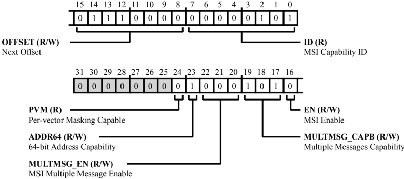

Table 29-148: PCIE\_MSI\_CAPB\_NPTR\_[n] Register Fields

| Bit No. (Access)   | Bit Name   | Description/Enumeration                                                                                                                                                                                                                                                                                                                                                                                                                                                                                                                                                                                                                  |
|--------------------|------------|------------------------------------------------------------------------------------------------------------------------------------------------------------------------------------------------------------------------------------------------------------------------------------------------------------------------------------------------------------------------------------------------------------------------------------------------------------------------------------------------------------------------------------------------------------------------------------------------------------------------------------------|
| 24 (R/NW)          | PVM        | Per-vector Masking Capable. The PCIE_MSI_CAPB_NPTR_[n].PVM bit determines whether software has the ability to mask individual interrupts with the PVM capability structure (=1) or does not implement PVM (=0).                                                                                                                                                                                                                                                                                                                                                                                                                          |
| 23 (R/W)           | ADDR64     | 64-bit Address Capability. The PCIE_MSI_CAPB_NPTR_[n].ADDR64 bit indicates if the function is capa- ble (=1) or is not capable (=0) of generating a 64-bit message address. This bit is read only.                                                                                                                                                                                                                                                                                                                                                                                                                                       |
| 22:20 (R/W)        | MULTMSG_EN | MSI Multiple Message Enable. System software writes to the PCIE_MSI_CAPB_NPTR_[n].MULTMSG_EN bit field to indicate the number of allocated messages (equal to or less than the number of requested messages). The number of allocated messages is aligned to a power of two. If a function requests four messages (indicated by a Multiple Message Capable encoding of 010), system software can allocate either four, two, or one message by writing a 010, 001, or 000 to this field, respectively. When MSI is enabled, a device is allocated at least 1 message. This fields state after reset is 000. This field is read/write. 0 1 |
|                    |            | 1 2                                                                                                                                                                                                                                                                                                                                                                                                                                                                                                                                                                                                                                      |
|                    |            | 2 4                                                                                                                                                                                                                                                                                                                                                                                                                                                                                                                                                                                                                                      |
|                    |            | 3 8                                                                                                                                                                                                                                                                                                                                                                                                                                                                                                                                                                                                                                      |

Table 29-148: PCIE\_MSI\_CAPB\_NPTR\_[n] Register Fields (Continued)

| Bit No. (Access)   | Bit Name     |                                                                                                                                                                                                                                                                                                                                                                                                           | Description/Enumeration                                                                                                                                                                                                                                                                                                                                                                                   |
|--------------------|--------------|-----------------------------------------------------------------------------------------------------------------------------------------------------------------------------------------------------------------------------------------------------------------------------------------------------------------------------------------------------------------------------------------------------------|-----------------------------------------------------------------------------------------------------------------------------------------------------------------------------------------------------------------------------------------------------------------------------------------------------------------------------------------------------------------------------------------------------------|
|                    |              | 4                                                                                                                                                                                                                                                                                                                                                                                                         | 16                                                                                                                                                                                                                                                                                                                                                                                                        |
|                    |              | 5                                                                                                                                                                                                                                                                                                                                                                                                         | 32                                                                                                                                                                                                                                                                                                                                                                                                        |
|                    |              | 6                                                                                                                                                                                                                                                                                                                                                                                                         | Reserved                                                                                                                                                                                                                                                                                                                                                                                                  |
|                    |              | 7                                                                                                                                                                                                                                                                                                                                                                                                         | Reserved                                                                                                                                                                                                                                                                                                                                                                                                  |
| 19:17 (R/W)        | MULTMSG_CAPB | Multiple Messages Capability. System software reads the PCIE_MSI_CAPB_NPTR_[n].MULTMSG_CAPB bit field to determine the number of requested messages. The number of requested mes- sages must be aligned to a power of two (if a function requires three messages, it re- quests four by initializing this field to 010). This field is read only.                                                         | Multiple Messages Capability. System software reads the PCIE_MSI_CAPB_NPTR_[n].MULTMSG_CAPB bit field to determine the number of requested messages. The number of requested mes- sages must be aligned to a power of two (if a function requires three messages, it re- quests four by initializing this field to 010). This field is read only.                                                         |
|                    |              | 0                                                                                                                                                                                                                                                                                                                                                                                                         | 1                                                                                                                                                                                                                                                                                                                                                                                                         |
|                    |              | 1                                                                                                                                                                                                                                                                                                                                                                                                         | 2                                                                                                                                                                                                                                                                                                                                                                                                         |
|                    |              | 2                                                                                                                                                                                                                                                                                                                                                                                                         | 4                                                                                                                                                                                                                                                                                                                                                                                                         |
|                    |              | 3                                                                                                                                                                                                                                                                                                                                                                                                         | 8                                                                                                                                                                                                                                                                                                                                                                                                         |
|                    |              | 4                                                                                                                                                                                                                                                                                                                                                                                                         | 16                                                                                                                                                                                                                                                                                                                                                                                                        |
|                    |              | 5                                                                                                                                                                                                                                                                                                                                                                                                         | 32                                                                                                                                                                                                                                                                                                                                                                                                        |
|                    |              | 6                                                                                                                                                                                                                                                                                                                                                                                                         | Reserved                                                                                                                                                                                                                                                                                                                                                                                                  |
|                    |              | 7                                                                                                                                                                                                                                                                                                                                                                                                         | Reserved                                                                                                                                                                                                                                                                                                                                                                                                  |
| 16 (R/W)           | EN           | MSI Enable. If the PCIE_MSI_CAPB_NPTR_[n].EN bit =1, the function is permitted to use MSI to request service and is prohibited from using its INTx# pin (if implemented). System configuration software sets this bit to enable MSI. A device driver is prohibited from writing this bit to mask a functions service request. This bits state after reset is 0 (MSI is disabled). This bit is read/write. | MSI Enable. If the PCIE_MSI_CAPB_NPTR_[n].EN bit =1, the function is permitted to use MSI to request service and is prohibited from using its INTx# pin (if implemented). System configuration software sets this bit to enable MSI. A device driver is prohibited from writing this bit to mask a functions service request. This bits state after reset is 0 (MSI is disabled). This bit is read/write. |
|                    |              | 0                                                                                                                                                                                                                                                                                                                                                                                                         | The function is prohibited from using MSI to request service                                                                                                                                                                                                                                                                                                                                              |
|                    |              | 1                                                                                                                                                                                                                                                                                                                                                                                                         | The function can use MSI to request service                                                                                                                                                                                                                                                                                                                                                               |
| 15:8 (R/W)         | OFFSET       | Next Offset.                                                                                                                                                                                                                                                                                                                                                                                              | Next Offset.                                                                                                                                                                                                                                                                                                                                                                                              |
| 7:0 (R/NW)         | ID           | MSI Capability ID. The value of 0x5 in the PCIE_MSI_CAPB_NPTR_[n].ID bit field identifies the function as message signaled interrupt capable. This field is read only.                                                                                                                                                                                                                                    | MSI Capability ID. The value of 0x5 in the PCIE_MSI_CAPB_NPTR_[n].ID bit field identifies the function as message signaled interrupt capable. This field is read only.                                                                                                                                                                                                                                    |

## MSI Capability Offset Register

PCI MSI Capability Offset

Figure 29-140: PCIE\_MSI\_CAPB\_OFF4\_[n] Register Diagram

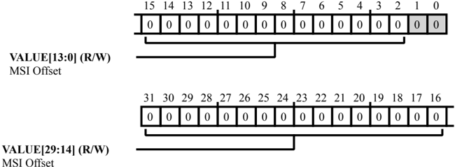

Table 29-149: PCIE\_MSI\_CAPB\_OFF4\_[n] Register Fields

| Bit No. (Access)   | Bit Name   | Description/Enumeration   |
|--------------------|------------|---------------------------|
| 31:2               | VALUE      | MSI Offset.               |
| (R/W)              |            | Message Address [31:0]    |

## MSI Capability Offset Register

PCI MSI Capability DW2 (64-bit Address).

Figure 29-141: PCIE\_MSI\_CAPB\_OFF8\_[n] Register Diagram

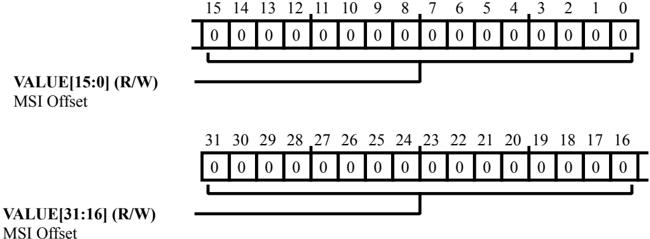

Table 29-150: PCIE\_MSI\_CAPB\_OFF8\_[n] Register Fields

| Bit No. (Access)   | Bit Name   | Description/Enumeration   |
|--------------------|------------|---------------------------|
| 31:0               | VALUE      | MSI Offset.               |
| (R/W)              |            | Message Address [63:32]   |

## MSI Capability Offset Register

PCI MSI Capability DW3 (64-bit Address).

Figure 29-142: PCIE\_MSI\_CAPB\_OFFC\_[n] Register Diagram

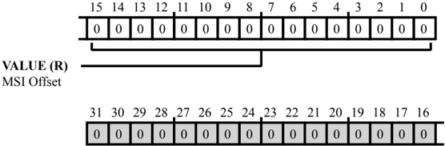

Table 29-151: PCIE\_MSI\_CAPB\_OFFC\_[n] Register Fields

| Bit No. (Access)   | Bit Name   | Description/Enumeration                                                                                          |
|--------------------|------------|------------------------------------------------------------------------------------------------------------------|
| 15:0 (R/NW)        | VALUE      | MSI Offset. For a description of this standard PCIe register field, see the PCI Express Base Specifi- cation 3.0 |

## MSI Controller Lower Address Register

The PCIE\_MSI\_CTL\_LADDR\_[n] register contains the system specified lower address for MSI memory write transaction termination. Within the SCB bridge, every received memory write request is examined to see if it targets the MSI address that has been specified in the MSI Controller Address Register and also to see if it satisfies the definition of an MSI interrupt request. When these conditions are satisfied the memory write request is marked as an MSI request.

Figure 29-143: PCIE\_MSI\_CTL\_LADDR\_[n] Register Diagram

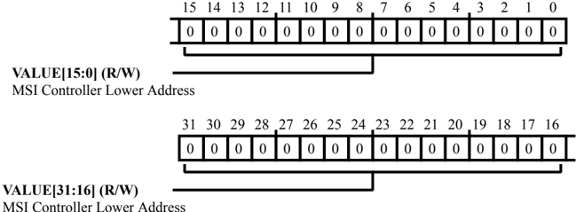

Table 29-152: PCIE\_MSI\_CTL\_LADDR\_[n] Register Fields

| Bit No. (Access)   | Bit Name   | Description/Enumeration                                                                                                                                      |
|--------------------|------------|--------------------------------------------------------------------------------------------------------------------------------------------------------------|
| 31:0 (R/W)         | VALUE      | MSI Controller Lower Address. The PCIE_MSI_CTL_LADDR_[n].VALUE bit field contains the system specified address for MSI memory write transaction termination. |

## MSI Controller Upper Address Register

The PCIE\_MSI\_CTL\_UADDR\_[n] register contains the system specified upper address for MSI memory write transaction termination. Allows functions to support a 64-bit MSI address.

Figure 29-144: PCIE\_MSI\_CTL\_UADDR\_[n] Register Diagram

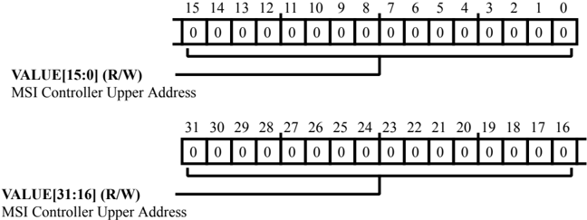

Table 29-153: PCIE\_MSI\_CTL\_UADDR\_[n] Register Fields

| Bit No. (Access)   | Bit Name   | Description/Enumeration                                                                                                                                            |
|--------------------|------------|--------------------------------------------------------------------------------------------------------------------------------------------------------------------|
| 31:0 (R/W)         | VALUE      | MSI Controller Upper Address. The PCIE_MSI_CTL_UADDR_[n].VALUE bit field contains the system specified upper address for MSI memory write transaction termination. |

## MSI Controller General-Purpose IO Register

The contents of the PCIE\_MSI\_GPIO\_IO\_[n] register drives the top-level GPIO msi\_ctrl\_io[31:0] pins.

Figure 29-145: PCIE\_MSI\_GPIO\_IO\_[n] Register Diagram

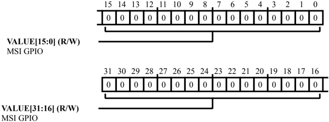

Table 29-154: PCIE\_MSI\_GPIO\_IO\_[n] Register Fields

| Bit No. (Access)   | Bit Name   | Description/Enumeration                                                                                               |
|--------------------|------------|-----------------------------------------------------------------------------------------------------------------------|
| 31:0 (R/W)         | VALUE      | MSI GPIO. The contents of the PCIE_MSI_GPIO_IO_[n].VALUE bit field drives the top- level GPIO msi_ctrl_io[31:0] pins. |

## MSI Controller Interrupt 0 Enable Register

The PCIE\_MSI\_IEN0\_[n] register specifies which interrupts are enabled. When an MSI is received from a disabled interrupt, no status bit gets set in MSI controller interrupt status register. Each bit corresponds to a single MSI interrupt vector.

Figure 29-146: PCIE\_MSI\_IEN0\_[n] Register Diagram


Table 29-155: PCIE\_MSI\_IEN0\_[n] Register Fields

| Bit No. (Access)   | Bit Name   | Description/Enumeration                                                    |
|--------------------|------------|----------------------------------------------------------------------------|
| 31:0               | EN         | MSI Interrupt 0 Enable.                                                    |
| (R/W)              |            | The PCIE_MSI_IEN0_[n].EN bit field specifies which interrupts are enabled. |

## MSI Controller Interrupt 1 Enable Register

The PCIE\_MSI\_IEN1\_[n] register specifies which interrupts are enabled. When an MSI is received from a disabled interrupt, no status bit gets set in MSI controller interrupt status register. Each bit corresponds to a single MSI interrupt vector.

Figure 29-147: PCIE\_MSI\_IEN1\_[n] Register Diagram


Table 29-156: PCIE\_MSI\_IEN1\_[n] Register Fields

| Bit No. (Access)   | Bit Name   | Description/Enumeration                                                    |
|--------------------|------------|----------------------------------------------------------------------------|
| 31:0               | EN         | MSI Interrupt 1 Enable.                                                    |
| (R/W)              |            | The PCIE_MSI_IEN1_[n].EN bit field specifies which interrupts are enabled. |

## MSI Controller Interrupt 2 Enable Register

The PCIE\_MSI\_IEN2\_[n] register specifies which interrupts are enabled. When an MSI is received from a disabled interrupt, no status bit gets set in MSI controller interrupt status register. Each bit corresponds to a single MSI interrupt vector.

Figure 29-148: PCIE\_MSI\_IEN2\_[n] Register Diagram


Table 29-157: PCIE\_MSI\_IEN2\_[n] Register Fields

| Bit No. (Access)   | Bit Name   | Description/Enumeration                                                    |
|--------------------|------------|----------------------------------------------------------------------------|
| 31:0               | EN         | MSI Interrupt 2 Enable.                                                    |
| (R/W)              |            | The PCIE_MSI_IEN2_[n].EN bit field specifies which interrupts are enabled. |

## MSI Controller Interrupt 3 Enable Register

The PCIE\_MSI\_IEN3\_[n] register specifies which interrupts are enabled. When an MSI is received from a disabled interrupt, no status bit gets set in MSI controller interrupt status register. Each bit corresponds to a single MSI interrupt vector.

Figure 29-149: PCIE\_MSI\_IEN3\_[n] Register Diagram

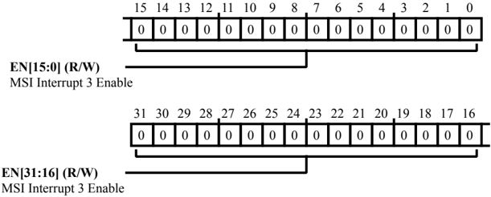

Table 29-158: PCIE\_MSI\_IEN3\_[n] Register Fields

| Bit No. (Access)   | Bit Name   | Description/Enumeration                                                    |
|--------------------|------------|----------------------------------------------------------------------------|
| 31:0               | EN         | MSI Interrupt 3 Enable.                                                    |
| (R/W)              |            | The PCIE_MSI_IEN3_[n].EN bit field specifies which interrupts are enabled. |

## MSI Controller Interrupt 4 Enable Register

The PCIE\_MSI\_IEN4\_[n] register specifies which interrupts are enabled. When an MSI is received from a disabled interrupt, no status bit gets set in MSI controller interrupt status register. Each bit corresponds to a single MSI interrupt vector.

Figure 29-150: PCIE\_MSI\_IEN4\_[n] Register Diagram


Table 29-159: PCIE\_MSI\_IEN4\_[n] Register Fields

| Bit No. (Access)   | Bit Name   | Description/Enumeration                                                    |
|--------------------|------------|----------------------------------------------------------------------------|
| 31:0               | EN         | MSI Interrupt 4 Enable.                                                    |
| (R/W)              |            | The PCIE_MSI_IEN4_[n].EN bit field specifies which interrupts are enabled. |

## MSI Controller Interrupt 5 Enable Register

The PCIE\_MSI\_IEN5\_[n] register specifies which interrupts are enabled. When an MSI is received from a disabled interrupt, no status bit gets set in MSI controller interrupt status register. Each bit corresponds to a single MSI interrupt vector.

Figure 29-151: PCIE\_MSI\_IEN5\_[n] Register Diagram


Table 29-160: PCIE\_MSI\_IEN5\_[n] Register Fields

| Bit No. (Access)   | Bit Name   | Description/Enumeration                                                    |
|--------------------|------------|----------------------------------------------------------------------------|
| 31:0               | EN         | MSI Interrupt 5 Enable.                                                    |
| (R/W)              |            | The PCIE_MSI_IEN5_[n].EN bit field specifies which interrupts are enabled. |

## MSI Controller Interrupt 6 Enable Register

The PCIE\_MSI\_IEN6\_[n] register specifies which interrupts are enabled. When an MSI is received from a disabled interrupt, no status bit gets set in MSI controller interrupt status register. Each bit corresponds to a single MSI interrupt vector.

Figure 29-152: PCIE\_MSI\_IEN6\_[n] Register Diagram


Table 29-161: PCIE\_MSI\_IEN6\_[n] Register Fields

| Bit No. (Access)   | Bit Name   | Description/Enumeration                                                    |
|--------------------|------------|----------------------------------------------------------------------------|
| 31:0               | EN         | MSI Interrupt 6 Enable.                                                    |
| (R/W)              |            | The PCIE_MSI_IEN6_[n].EN bit field specifies which interrupts are enabled. |

## MSI Controller Interrupt 7 Enable Register

The PCIE\_MSI\_IEN7\_[n] register specifies which interrupts are enabled. When an MSI is received from a disabled interrupt, no status bit gets set in MSI controller interrupt status register. Each bit corresponds to a single MSI interrupt vector.

Figure 29-153: PCIE\_MSI\_IEN7\_[n] Register Diagram


Table 29-162: PCIE\_MSI\_IEN7\_[n] Register Fields

| Bit No. (Access)   | Bit Name   | Description/Enumeration                                                    |
|--------------------|------------|----------------------------------------------------------------------------|
| 31:0               | EN         | MSI Interrupt 7 Enable.                                                    |
| (R/W)              |            | The PCIE_MSI_IEN7_[n].EN bit field specifies which interrupts are enabled. |

## MSI Controller Interrupt 0 Mask Register

The PCIE\_MSI\_IMSK0\_[n] register allows enabled interrupts to be masked. When an MSI is received for a masked interrupt, the corresponding status bit gets set in the interrupt status register but the msi\_ctrl\_int output is not set high. Each bit corresponds to a single MSI interrupt vector.

Figure 29-154: PCIE\_MSI\_IMSK0\_[n] Register Diagram


Table 29-163: PCIE\_MSI\_IMSK0\_[n] Register Fields

| Bit No. (Access)   | Bit Name   | Description/Enumeration                                          |
|--------------------|------------|------------------------------------------------------------------|
| 31:0               | VALUE      | MSI Interrupt 0 Mask.                                            |
| (R/W)              |            | The PCIE_MSI_IMSK0_[n].VALUE bit field masks enabled interrupts. |

## MSI Controller Interrupt 1 Mask Register

The PCIE\_MSI\_IMSK1\_[n] register allows enabled interrupts to be masked. When an MSI is received for a masked interrupt, the corresponding status bit gets set in the interrupt status register but the msi\_ctrl\_int output is not set high. Each bit corresponds to a single MSI interrupt vector.

Figure 29-155: PCIE\_MSI\_IMSK1\_[n] Register Diagram


Table 29-164: PCIE\_MSI\_IMSK1\_[n] Register Fields

| Bit No. (Access)   | Bit Name   | Description/Enumeration                                          |
|--------------------|------------|------------------------------------------------------------------|
| 31:0               | VALUE      | MSI Interrupt 1 Mask.                                            |
| (R/W)              |            | The PCIE_MSI_IMSK1_[n].VALUE bit field masks enabled interrupts. |

## MSI Controller Interrupt 2 Mask Register

The PCIE\_MSI\_IMSK2\_[n] register allows enabled interrupts to be masked. When an MSI is received for a masked interrupt, the corresponding status bit gets set in the interrupt status register but the msi\_ctrl\_int output is not set high. Each bit corresponds to a single MSI interrupt vector.

Figure 29-156: PCIE\_MSI\_IMSK2\_[n] Register Diagram


Table 29-165: PCIE\_MSI\_IMSK2\_[n] Register Fields

| Bit No. (Access)   | Bit Name   | Description/Enumeration                                          |
|--------------------|------------|------------------------------------------------------------------|
| 31:0               | VALUE      | MSI Interrupt 2 Mask.                                            |
| (R/W)              |            | The PCIE_MSI_IMSK2_[n].VALUE bit field masks enabled interrupts. |

## MSI Controller Interrupt 3 Mask Register

The PCIE\_MSI\_IMSK3\_[n] register allows enabled interrupts to be masked. When an MSI is received for a masked interrupt, the corresponding status bit gets set in the interrupt status register but the msi\_ctrl\_int output is not set high. Each bit corresponds to a single MSI interrupt vector.

Figure 29-157: PCIE\_MSI\_IMSK3\_[n] Register Diagram


Table 29-166: PCIE\_MSI\_IMSK3\_[n] Register Fields

| Bit No. (Access)   | Bit Name   | Description/Enumeration                                          |
|--------------------|------------|------------------------------------------------------------------|
| 31:0               | VALUE      | MSI Interrupt 3 Mask.                                            |
| (R/W)              |            | The PCIE_MSI_IMSK3_[n].VALUE bit field masks enabled interrupts. |

## MSI Controller Interrupt 4 Mask Register

The PCIE\_MSI\_IMSK4\_[n] register allows enabled interrupts to be masked. When an MSI is received for a masked interrupt, the corresponding status bit gets set in the interrupt status register but the msi\_ctrl\_int output is not set high. Each bit corresponds to a single MSI interrupt vector.

Figure 29-158: PCIE\_MSI\_IMSK4\_[n] Register Diagram


Table 29-167: PCIE\_MSI\_IMSK4\_[n] Register Fields

| Bit No. (Access)   | Bit Name   | Description/Enumeration                                          |
|--------------------|------------|------------------------------------------------------------------|
| 31:0               | VALUE      | MSI Interrupt 4 Mask.                                            |
| (R/W)              |            | The PCIE_MSI_IMSK4_[n].VALUE bit field masks enabled interrupts. |

## MSI Controller Interrupt 5 Mask Register

The PCIE\_MSI\_IMSK5\_[n] register allows enabled interrupts to be masked. When an MSI is received for a masked interrupt, the corresponding status bit gets set in the interrupt status register but the msi\_ctrl\_int output is not set high. Each bit corresponds to a single MSI interrupt vector.

Figure 29-159: PCIE\_MSI\_IMSK5\_[n] Register Diagram

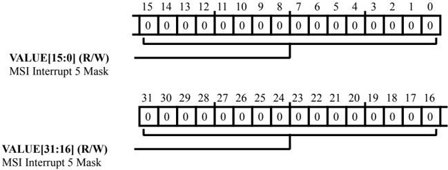

Table 29-168: PCIE\_MSI\_IMSK5\_[n] Register Fields

| Bit No. (Access)   | Bit Name   | Description/Enumeration                                          |
|--------------------|------------|------------------------------------------------------------------|
| 31:0               | VALUE      | MSI Interrupt 5 Mask.                                            |
| (R/W)              |            | The PCIE_MSI_IMSK5_[n].VALUE bit field masks enabled interrupts. |

## MSI Controller Interrupt 6 Mask Register

The PCIE\_MSI\_IMSK6\_[n] register allows enabled interrupts to be masked. When an MSI is received for a masked interrupt, the corresponding status bit gets set in the interrupt status register but the msi\_ctrl\_int output is not set high. Each bit corresponds to a single MSI interrupt vector.

Figure 29-160: PCIE\_MSI\_IMSK6\_[n] Register Diagram


Table 29-169: PCIE\_MSI\_IMSK6\_[n] Register Fields

| Bit No. (Access)   | Bit Name   | Description/Enumeration                                          |
|--------------------|------------|------------------------------------------------------------------|
| 31:0               | VALUE      | MSI Interrupt 6 Mask.                                            |
| (R/W)              |            | The PCIE_MSI_IMSK6_[n].VALUE bit field masks enabled interrupts. |

## MSI Controller Interrupt 7 Mask Register

The PCIE\_MSI\_IMSK7\_[n] register allows enabled interrupts to be masked. When an MSI is received for a masked interrupt, the corresponding status bit gets set in the interrupt status register but the msi\_ctrl\_int output is not set high. Each bit corresponds to a single MSI interrupt vector.

Figure 29-161: PCIE\_MSI\_IMSK7\_[n] Register Diagram


Table 29-170: PCIE\_MSI\_IMSK7\_[n] Register Fields

| Bit No. (Access)   | Bit Name   | Description/Enumeration                                          |
|--------------------|------------|------------------------------------------------------------------|
| 31:0               | VALUE      | MSI Interrupt 7 Mask.                                            |
| (R/W)              |            | The PCIE_MSI_IMSK7_[n].VALUE bit field masks enabled interrupts. |

## MSI Controller Interrupt 0 Status Register

When an MSI is detected for End Point 0, one bit in the PCIE\_MSI\_ISTAT0\_[n] register is set. The decoding of the data payload of the MSI memory write request determines which bit is set. A status bit is cleared by writing a 1 to the bit. Each bit corresponds to a single MSI interrupt vector.

Figure 29-162: PCIE\_MSI\_ISTAT0\_[n] Register Diagram


Table 29-171: PCIE\_MSI\_ISTAT0\_[n] Register Fields

| Bit No. (Access)   | Bit Name   | Description/Enumeration                                                                                    |
|--------------------|------------|------------------------------------------------------------------------------------------------------------|
| 31:0 (R/W)         | VALUE      | MSI Interrupt 0 Status. The PCIE_MSI_ISTAT0_[n].VALUE bit field indicates when an MSI is detected for EP0. |

## MSI Controller Interrupt 1 Status Register

When an MSI is detected for End Point 0, one bit in the PCIE\_MSI\_ISTAT1\_[n] register is set. The decoding of the data payload of the MSI memory write request determines which bit is set. A status bit is cleared by writing a 1 to the bit. Each bit corresponds to a single MSI interrupt vector.

Figure 29-163: PCIE\_MSI\_ISTAT1\_[n] Register Diagram


Table 29-172: PCIE\_MSI\_ISTAT1\_[n] Register Fields

| Bit No. (Access)   | Bit Name   | Description/Enumeration                                                                                    |
|--------------------|------------|------------------------------------------------------------------------------------------------------------|
| 31:0 (R/W)         | VALUE      | MSI Interrupt 1 Status. The PCIE_MSI_ISTAT1_[n].VALUE bit field indicates when an MSI is detected for EP1. |

## MSI Controller Interrupt 2 Status Register

When an MSI is detected for End Point 0, one bit in the PCIE\_MSI\_ISTAT2\_[n] register is set. The decoding of the data payload of the MSI memory write request determines which bit is set. A status bit is cleared by writing a 1 to the bit. Each bit corresponds to a single MSI interrupt vector.

Figure 29-164: PCIE\_MSI\_ISTAT2\_[n] Register Diagram


Table 29-173: PCIE\_MSI\_ISTAT2\_[n] Register Fields

| Bit No. (Access)   | Bit Name   | Description/Enumeration                                                                                    |
|--------------------|------------|------------------------------------------------------------------------------------------------------------|
| 31:0 (R/W)         | VALUE      | MSI Interrupt 2 Status. The PCIE_MSI_ISTAT2_[n].VALUE bit field indicates when an MSI is detected for EP2. |

## MSI Controller Interrupt 3 Status Register

When an MSI is detected for End Point 0, one bit in the PCIE\_MSI\_ISTAT3\_[n] register is set. The decoding of the data payload of the MSI memory write request determines which bit is set. A status bit is cleared by writing a 1 to the bit. Each bit corresponds to a single MSI interrupt vector.

Figure 29-165: PCIE\_MSI\_ISTAT3\_[n] Register Diagram

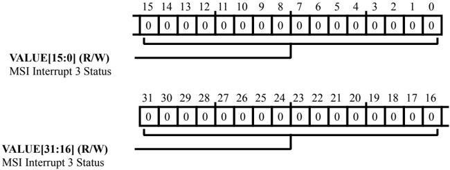

Table 29-174: PCIE\_MSI\_ISTAT3\_[n] Register Fields

| Bit No. (Access)   | Bit Name   | Description/Enumeration                                                                                    |
|--------------------|------------|------------------------------------------------------------------------------------------------------------|
| 31:0 (R/W)         | VALUE      | MSI Interrupt 3 Status. The PCIE_MSI_ISTAT3_[n].VALUE bit field indicates when an MSI is detected for EP3. |

## MSI Controller Interrupt 4 Status Register

When an MSI is detected for End Point 0, one bit in the PCIE\_MSI\_ISTAT4\_[n] register is set. The decoding of the data payload of the MSI memory write request determines which bit is set. A status bit is cleared by writing a 1 to the bit. Each bit corresponds to a single MSI interrupt vector.

Figure 29-166: PCIE\_MSI\_ISTAT4\_[n] Register Diagram


Table 29-175: PCIE\_MSI\_ISTAT4\_[n] Register Fields

| Bit No. (Access)   | Bit Name   | Description/Enumeration                                                                                    |
|--------------------|------------|------------------------------------------------------------------------------------------------------------|
| 31:0 (R/W)         | VALUE      | MSI Interrupt 4 Status. The PCIE_MSI_ISTAT4_[n].VALUE bit field indicates when an MSI is detected for EP4. |

## MSI Controller Interrupt 5 Status Register

When an MSI is detected for End Point 0, one bit in the PCIE\_MSI\_ISTAT5\_[n] register is set. The decoding of the data payload of the MSI memory write request determines which bit is set. A status bit is cleared by writing a 1 to the bit. Each bit corresponds to a single MSI interrupt vector.

Figure 29-167: PCIE\_MSI\_ISTAT5\_[n] Register Diagram


Table 29-176: PCIE\_MSI\_ISTAT5\_[n] Register Fields

| Bit No. (Access)   | Bit Name   | Description/Enumeration                                                                                    |
|--------------------|------------|------------------------------------------------------------------------------------------------------------|
| 31:0 (R/W)         | VALUE      | MSI Interrupt 5 Status. The PCIE_MSI_ISTAT5_[n].VALUE bit field indicates when an MSI is detected for EP5. |

## MSI Controller Interrupt 6 Status Register

When an MSI is detected for End Point 0, one bit in the PCIE\_MSI\_ISTAT6\_[n] register is set. The decoding of the data payload of the MSI memory write request determines which bit is set. A status bit is cleared by writing a 1 to the bit. Each bit corresponds to a single MSI interrupt vector.

Figure 29-168: PCIE\_MSI\_ISTAT6\_[n] Register Diagram


Table 29-177: PCIE\_MSI\_ISTAT6\_[n] Register Fields

| Bit No. (Access)   | Bit Name   | Description/Enumeration                                                                                    |
|--------------------|------------|------------------------------------------------------------------------------------------------------------|
| 31:0 (R/W)         | VALUE      | MSI Interrupt 6 Status. The PCIE_MSI_ISTAT6_[n].VALUE bit field indicates when an MSI is detected for EP6. |

## MSI Controller Interrupt 7 Status Register

When an MSI is detected for End Point 0, one bit in the PCIE\_MSI\_ISTAT7\_[n] register is set. The decoding of the data payload of the MSI memory write request determines which bit is set. A status bit is cleared by writing a 1 to the bit. Each bit corresponds to a single MSI interrupt vector.

Figure 29-169: PCIE\_MSI\_ISTAT7\_[n] Register Diagram


Table 29-178: PCIE\_MSI\_ISTAT7\_[n] Register Fields

| Bit No. (Access)   | Bit Name   | Description/Enumeration                                                                                    |
|--------------------|------------|------------------------------------------------------------------------------------------------------------|
| 31:0 (R/W)         | VALUE      | MSI Interrupt 7 Status. The PCIE_MSI_ISTAT7_[n].VALUE bit field indicates when an MSI is detected for EP7. |

## TX De-emphasis Parameters Register

The PCIE\_PHY\_TXDEEMPH register can be used to modify the de-emphasis level of the transmitter.

Figure 29-170: PCIE\_PHY\_TXDEEMPH Register Diagram

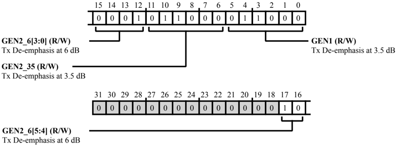

Table 29-179: PCIE\_PHY\_TXDEEMPH Register Fields

| Bit No. (Access)   | Bit Name   | Description/Enumeration                                                                                                                                                                                                                                                                                                                   |
|--------------------|------------|-------------------------------------------------------------------------------------------------------------------------------------------------------------------------------------------------------------------------------------------------------------------------------------------------------------------------------------------|
| 17:12 (R/W)        | GEN2_6     | Tx De-emphasis at 6 dB. The PCIE_PHY_TXDEEMPH.GEN2_6 bit field is a static value that sets the Tx driver de-emphasis value in the case where pipeP_tx_deemph is set to 1'b0 and the PHY is running at the Gen2 rate. This bus is provided for completeness and as a sec- ond potential launch amplitude.                                  |
| 11:6 (R/W)         | GEN2_35    | Tx De-emphasis at 3.5 dB. The PCIE_PHY_TXDEEMPH.GEN2_35 bit field is a static value that sets the Tx driver de-emphasis value in the case where pipeP_tx_deemph is set to 1'b1 (default set- ting) and the PHY is running at the Gen2 rate. To enable tuning at the board level for Rx eye compliance, connect this signal to a register. |
| 5:0 (R/W)          | GEN1       | Tx De-emphasis at 3.5 dB. The PCIE_PHY_TXDEEMPH.GEN1 bit field is a static value that sets the Tx driver de-emphasis value in the case where pipeP_tx_deemph is set to 1'b1 (default setting) and the PHY is running at the Gen1 rate. To enable tuning at the board level for Rx eye compliance, connect this signal to a register.      |

## TX Launch Amplitude Register

The PCIE\_PHY\_TXSWING register is used to modify the voltage swing level of the transmitter.

Figure 29-171: PCIE\_PHY\_TXSWING Register Diagram

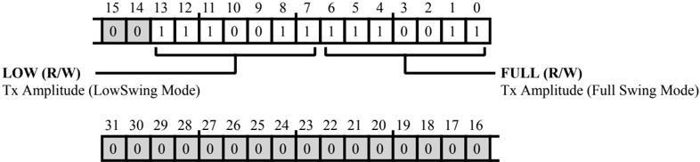

Table 29-180: PCIE\_PHY\_TXSWING Register Fields

| Bit No. (Access)   | Bit Name   | Description/Enumeration                                                                                                                                                                                                                                                                     |
|--------------------|------------|---------------------------------------------------------------------------------------------------------------------------------------------------------------------------------------------------------------------------------------------------------------------------------------------|
| 13:7 (R/W)         | LOW        | Tx Amplitude (LowSwing Mode). The PCIE_PHY_TXSWING.LOW bit field is a static value that sets the launch ampli- tude of the transmitter when pipeP_tx_swing is set to 1'b0 (default state). To enable tuning at the board level for Rx eye compliance, connect this signal to a register.    |
| 6:0 (R/W)          | FULL       | Tx Amplitude (Full Swing Mode). The PCIE_PHY_TXSWING.FULL bit field is a static value that sets the launch am- plitude of the transmitter when pipeP_tx_swing is set to 1'b0 (default state). To enable tuning at the board level for Rx eye compliance, connect this signal to a register. |

## Port Logic Link Control Register

The PCIE\_PLCTL\_[n] register controls various functions of the port logic including DLL use, loopback control, and reset recovery.

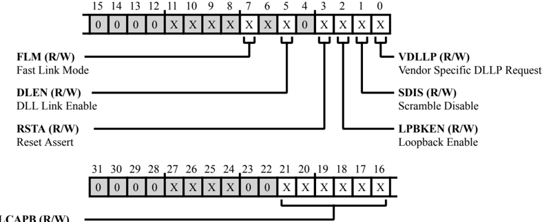

LCAPB (R/W)

Link Mode Enable

Figure 29-172: PCIE\_PLCTL\_[n] Register Diagram

Table 29-181: PCIE\_PLCTL\_[n] Register Fields

| Bit No. (Access)   | Bit Name   | Description/Enumeration                                                                                                                                                                                                                                                                                                                                                                                                                                                                                                                                                                         |
|--------------------|------------|-------------------------------------------------------------------------------------------------------------------------------------------------------------------------------------------------------------------------------------------------------------------------------------------------------------------------------------------------------------------------------------------------------------------------------------------------------------------------------------------------------------------------------------------------------------------------------------------------|
| 21:16 (R/W)        | LCAPB      | Link Mode Enable. The PCIE_PLCTL_[n].LCAPB bit field sets the number of lanes in the link that are needed to connect to the link partner. When there are unused lanes in a system, then the value in this bit field must change to reflect the number of lanes. The value in the "Predetermined Number of Lanes" field of the "Link Width and Speed Change Control Register" also must change. For more information, see "How to Tie Off Unused Lanes". For information on upsizing and downsizing the link width, see "Link Establishment". This register field is sticky. 0 x1 1 x2 2 x4 3 x8 |
| 21:16 (R/W)        | LCAPB      | 4 x16                                                                                                                                                                                                                                                                                                                                                                                                                                                                                                                                                                                           |
| 21:16 (R/W)        | LCAPB      | 5 x32 (not supported)                                                                                                                                                                                                                                                                                                                                                                                                                                                                                                                                                                           |
| 21:16 (R/W)        | LCAPB      |                                                                                                                                                                                                                                                                                                                                                                                                                                                                                                                                                                                                 |
| 21:16 (R/W)        | LCAPB      |                                                                                                                                                                                                                                                                                                                                                                                                                                                                                                                                                                                                 |
| 21:16 (R/W)        | LCAPB      |                                                                                                                                                                                                                                                                                                                                                                                                                                                                                                                                                                                                 |
| 21:16 (R/W)        | LCAPB      |                                                                                                                                                                                                                                                                                                                                                                                                                                                                                                                                                                                                 |

Table 29-181: PCIE\_PLCTL\_[n] Register Fields (Continued)

| Bit No. (Access)   | Bit Name   | Description/Enumeration                                                                                                                                                                                                                                                                                                                                                                                           |
|--------------------|------------|-------------------------------------------------------------------------------------------------------------------------------------------------------------------------------------------------------------------------------------------------------------------------------------------------------------------------------------------------------------------------------------------------------------------|
| 7 (R/W)            | FLM        | Fast Link Mode. The PCIE_PLCTL_[n].FLM bit enables Fast Link mode. All internal timers are set to Fast Mode to speed up simulation. This mode forces the LTSSM training (link initi- alization) to use shorter time-outs and to link up faster. The scaling factor is 1024 for all internal timers. Fast Link Mode can also be activated by setting the diag_ctrl_bus[2] pin to 1. This register field is sticky. |
| 5 (R/W)            | DLEN       | DLL Link Enable. The PCIE_PLCTL_[n].DLEN bit enables link initialization. When DLL Link En- able =0, the core does not transmit InitFC DLLPs and does not establish a link. This register field is sticky.                                                                                                                                                                                                        |
| 3 (R/W)            | RSTA       | Reset Assert. The PCIE_PLCTL_[n].RSTA bit triggers a recovery and forces the LTSSM to the hot reset state for a downstream port only. This bit is sticky.                                                                                                                                                                                                                                                         |
| 2 (R/W)            | LPBKEN     | Loopback Enable. The PCIE_PLCTL_[n].LPBKEN bit turns on loopback. This register field is sticky.                                                                                                                                                                                                                                                                                                                  |
| 1 (R/W)            | SDIS       | Scramble Disable. The PCIE_PLCTL_[n].SDIS bit turns off data scrambling. This register field is sticky.                                                                                                                                                                                                                                                                                                           |
| 0 (R/W)            | VDLLP      | Vendor Specific DLLP Request. When the PCIE_PLCTL_[n].VDLLP bit is set (=1), the core transmits the DLLP contained in the "Vendor Specific DLLP Register". Reading from this self-clearing register field always returns 0.                                                                                                                                                                                       |

## Port Logic Debug0 Register

Figure 29-173: PCIE\_PLDBG0\_[n] Register Diagram

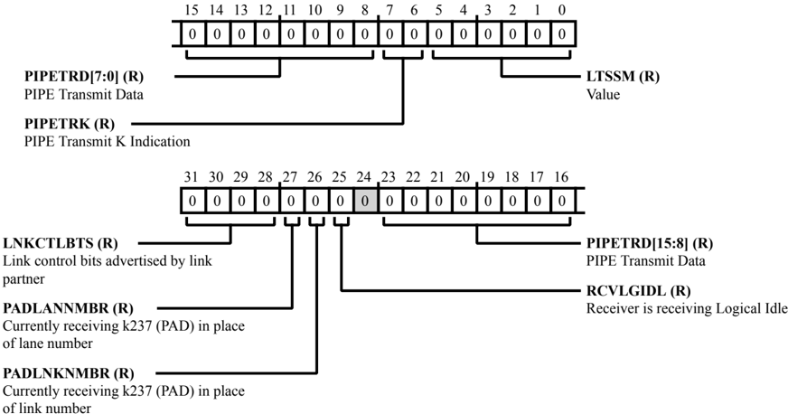

Table 29-182: PCIE\_PLDBG0\_[n] Register Fields

| Bit No. (Access)   | Bit Name   | Description/Enumeration                                                                         |
|--------------------|------------|-------------------------------------------------------------------------------------------------|
| 31:28 (R/NW)       | LNKCTLBTS  | Link control bits advertised by link partner.                                                   |
| 27 (R/NW)          | PADLANNMBR | Currently receiving k237 (PAD) in place of lane number.                                         |
| 26 (R/NW)          | PADLNKNMBR | Currently receiving k237 (PAD) in place of link number.                                         |
| 25 (R/NW)          | RCVLGIDL   | Receiver is receiving Logical Idle.                                                             |
| 23:8 (R/NW)        | PIPETRD    | PIPE Transmit Data. PIPETRD[i] is Data Byte [i] transmitted to the PHY over the PIPE interface. |
| 7:6 (R/NW)         | PIPETRK    | PIPE Transmit K Indication. PIPETRK[i] is the K character indication for PIPETRD Byte [i]       |
| 5:0 (R/NW)         | LTSSM      | Value. Link Training and Status State Machine Current State                                     |

Table 29-182: PCIE\_PLDBG0\_[n] Register Fields (Continued)

| Bit No. (Access)   | Bit Name   |    | Description/Enumeration                                                             |
|--------------------|------------|----|-------------------------------------------------------------------------------------|
|                    |            |  0 | S_DETECT_QUIET For more information see the PCI Express Base Specification 3.0      |
|                    |            |  1 | S_DETECT_ACT For more information see the PCI Express Base Specification 3.0        |
|                    |            |  2 | S_POLL_ACTIVE For more information see the PCI Express Base Specification 3.0       |
|                    |            |  3 | S_POLL_COMPLIANCE For more information see the PCI Express Base Specification 3.0   |
|                    |            |  4 | S_POLL_CONFIG For more information see the PCI Express Base Specification 3.0       |
|                    |            |  5 | S_PRE_DETECT_QUIET For more information see the PCI Express Base Specification 3.0  |
|                    |            |  6 | S_DETECT_WAIT For more information see the PCI Express Base Specification 3.0       |
|                    |            |  7 | S_CFG_LINKWD_START For more information see the PCI Express Base Specification 3.0  |
|                    |            |  8 | S_CFG_LINKWD_ACEPT For more information see the PCI Express Base Specification 3.0  |
|                    |            |  9 | S_CFG_LANENUM_WAIT For more information see the PCI Express Base Specification 3.0  |
|                    |            | 10 | S_CFG_LANENUM_ACEPT For more information see the PCI Express Base Specification 3.0 |
|                    |            | 11 | S_CFG_COMPLETE For more information see the PCI Express Base Specification 3.0      |
|                    |            | 12 | S_CFG_IDLE For more information see the PCI Ex- press Base Specification 3.0        |
|                    |            | 13 | S_RCVRY_LOCK For more information see the PCI Express Base Specification 3.0        |
|                    |            | 14 | S_RCVRY_SPEED For more information see the PCI Express Base Specification 3.0       |
|                    |            | 15 | S_RCVRY_RCVRCFG For more information see the PCI Express Base Specification 3.0     |
|                    |            | 16 | S_RCVRY_IDLE For more information see the PCI Express Base Specification 3.0        |
|                    |            | 17 | S_L0 For more information see the PCI Express Base Specification 3.0                |

Table 29-182: PCIE\_PLDBG0\_[n] Register Fields (Continued)

| Bit No. (Access)   | Bit Name   |    | Description/Enumeration                                                             |
|--------------------|------------|----|-------------------------------------------------------------------------------------|
|                    |            | 18 | S_L0S For more information see the PCI Express Base Specification 3.0               |
|                    |            | 19 | S_L123_SEND_EIDLE For more information see the PCI Express Base Specification 3.0   |
|                    |            | 20 | S_L1_IDLE For more information see the PCI Express Base Specification 3.0           |
|                    |            | 21 | S_L2_IDLE For more information see the PCI Express Base Specification 3.0           |
|                    |            | 22 | S_L2_WAKE For more information see the PCI Express Base Specification 3.0           |
|                    |            | 23 | S_DISABLED_ENTRY For more information see the PCI Express Base Specification 3.0    |
|                    |            | 24 | S_DISABLED_IDLE For more information see the PCI Express Base Specification 3.0     |
|                    |            | 25 | S_DISABLED For more information see the PCI Ex- press Base Specification 3.0        |
|                    |            | 26 | S_LPBK_ENTRY For more information see the PCI Express Base Specification 3.0        |
|                    |            | 27 | S_LPBK_ACTIVE For more information see the PCI Express Base Specification 3.0       |
|                    |            | 28 | S_LPBK_EXIT For more information see the PCI Ex- press Base Specification 3.0       |
|                    |            | 29 | S_LPBK_EXIT_TIMEOUT For more information see the PCI Express Base Specification 3.0 |
|                    |            | 30 | S_HOT_RESET_ENTRY For more information see the PCI Express Base Specification 3.0   |
|                    |            | 31 | S_HOT_RESET For more information see the PCI Ex- press Base Specification 3.0       |
|                    |            | 32 | S_RCVRY_EQ0 For more information see the PCI Ex- press Base Specification 3.0       |
|                    |            | 33 | S_RCVRY_EQ1 For more information see the PCI Ex- press Base Specification 3.0       |
|                    |            | 34 | S_RCVRY_EQ2 For more information see the PCI Ex- press Base Specification 3.0       |
|                    |            | 35 | S_RCVRY_EQ3 For more information see the PCI Ex- press Base Specification 3.0       |

## Port Logic Debug1 Register

The PCIE\_PLDBG1\_[n] register provides information regarding the state of the PCIe link.

Figure 29-174: PCIE\_PLDBG1\_[n] Register Diagram

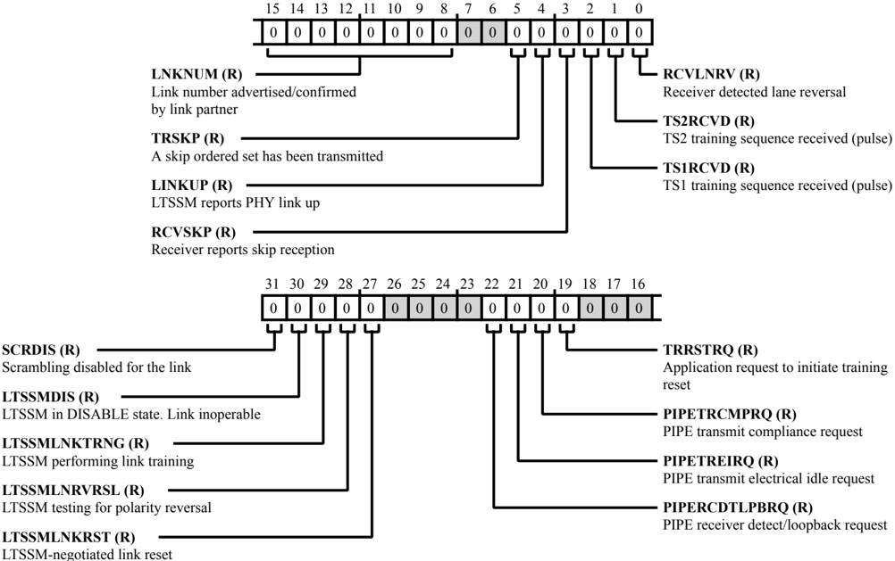

Table 29-183: PCIE\_PLDBG1\_[n] Register Fields

| Bit No. (Access)   | Bit Name     | Description/Enumeration                  |
|--------------------|--------------|------------------------------------------|
| 31 (R/NW)          | SCRDIS       | Scrambling disabled for the link.        |
| 30 (R/NW)          | LTSSMDIS     | LTSSM in DISABLE state. Link inoperable. |
| 29 (R/NW)          | LTSSMLNKTRNG | LTSSM performing link training.          |
| 28 (R/NW)          | LTSSMLNRVRSL | LTSSM testing for polarity reversal.     |

Table 29-183: PCIE\_PLDBG1\_[n] Register Fields (Continued)

| Bit No. (Access)   | Bit Name      | Description/Enumeration                           |
|--------------------|---------------|---------------------------------------------------|
| 27 (R/NW)          | LTSSMLNKRST   | LTSSM-negotiated link reset.                      |
| 22 (R/NW)          | PIPERCDTLPBRQ | PIPE receiver detect/loopback request.            |
| 21 (R/NW)          | PIPETREIRQ    | PIPE transmit electrical idle request.            |
| 20 (R/NW)          | PIPETRCMPRQ   | PIPE transmit compliance request.                 |
| 19 (R/NW)          | TRRSTRQ       | Application request to initiate training reset.   |
| 15:8 (R/NW)        | LNKNUM        | Link number advertised/confirmed by link partner. |
| 5 (R/NW)           | TRSKP         | A skip ordered set has been transmitted.          |
| 4 (R/NW)           | LINKUP        | LTSSM reports PHY link up.                        |
| 3 (R/NW)           | RCVSKP        | Receiver reports skip reception.                  |
| 2 (R/NW)           | TS1RCVD       | TS1 training sequence received (pulse).           |
| 1 (R/NW)           | TS2RCVD       | TS2 training sequence received (pulse).           |
| 0 (R/NW)           | RCVLNRV       | Receiver detected lane reversal.                  |

## Port Force Link Register

The PCIE\_PL\_FRC\_[n] register implements core support for testing and debug that allows software to force the LTSSM state machine into a specific state, and to force the core to transmit a specific Link Command.

Figure 29-175: PCIE\_PL\_FRC\_[n] Register Diagram

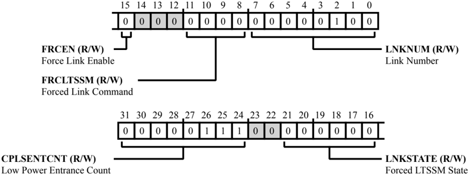

Table 29-184: PCIE\_PL\_FRC\_[n] Register Fields

| Bit No. (Access)   | Bit Name   | Description/Enumeration                                                                                                                                                                                                                                                                                                                                                                                        |
|--------------------|------------|----------------------------------------------------------------------------------------------------------------------------------------------------------------------------------------------------------------------------------------------------------------------------------------------------------------------------------------------------------------------------------------------------------------|
| 31:24 (R/W)        | CPLSENTCNT | Low Power Entrance Count. The PCIE_PL_FRC_[n].CPLSENTCNT bit field reports the number of clock cy- cles for the associated completion of a CfgWr to D-state register to go low-power. This bit field is intended for applications that do not let the core handle a completion for configuration request to the PMCSCR register. Not used in downstream ports. <br><i>Note</i>: This register field is sticky. |
| 21:16 (R/W)        | LNKSTATE   | Forced LTSSM State. The PCIE_PL_FRC_[n].LNKSTATE bit field reports the LTSSM state that the core is forced to when the PCIE_PL_FRC_[n].FRCEN bit is set. LTSSM state en- coding is defined by the lts_state variable in workspace/src/Layer1/xmlh_ltssm.v. This register field is sticky.                                                                                                                      |
| 15 (R/W)           | FRCEN      | Force Link Enable. The PCIE_PL_FRC_[n].FRCEN bit enables the force link functionality where the LTSSM is in the state specified by the PCIE_PL_FRC_[n].LNKSTATE bit field. Also the core is forced to transmit the command specified by the Forced Link Com- mand field. This is a self-clearing bit. Reading from this bit always returns 0.                                                                  |
| 11:8 (R/W)         | FRCLTSSM   | Forced Link Command. The PCIE_PL_FRC_[n].FRCLTSSM bit field reports the link command that the core is forced to transmit when the PCIE_PL_FRC_[n].FRCEN bit is set. Link command encoding is defined by the ltssm_cmd variable in workspace/src/Layer1/ xmlh_ltssm.v. This register field is sticky.                                                                                                           |

Table 29-184: PCIE\_PL\_FRC\_[n] Register Fields (Continued)

| Bit No. (Access)   | Bit Name   | Description/Enumeration                                                                                |
|--------------------|------------|--------------------------------------------------------------------------------------------------------|
| 7:0                | LNKNUM     | Link Number.                                                                                           |
| (R/W)              |            | The PCIE_PL_FRC_[n].LNKNUM bit field reports the link number. This bit field is not used for endpoint. |

## Port Control PHY Control Register

The PCIE\_PL\_PHYCTL\_[n] register is a memory-mapped register that reflects the values on the the static phy\_cfg\_control output signals. Using this register does not in any way influence core function. The PCIE\_PL\_PHYCTL\_[n] register can be used for any static sideband status signaling requirements for the PHY.

Figure 29-176: PCIE\_PL\_PHYCTL\_[n] Register Diagram

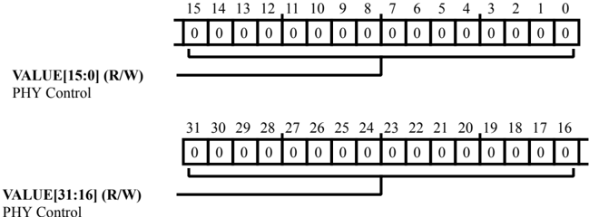

Table 29-185: PCIE\_PL\_PHYCTL\_[n] Register Fields

| Bit No. (Access)   | Bit Name   | Description/Enumeration                                                                                        |
|--------------------|------------|----------------------------------------------------------------------------------------------------------------|
| 31:0 (R/W)         | VALUE      | PHY Control. The PCIE_PL_PHYCTL_[n].VALUE bit field holds the data sent directly from the phy_cfg_control bus. |

## Port Control PHY Status Register

The PCIE\_PL\_PHYSTAT\_[n] register is a memory-mapped register that reflects the values on the the static phy\_cfg\_status input signals. Using this register does not in any way influence core functionality. The PCIE\_PL\_PHYSTAT\_[n] register can be used for any static sideband status signaling requirements for the PHY.

Figure 29-177: PCIE\_PL\_PHYSTAT\_[n] Register Diagram


Table 29-186: PCIE\_PL\_PHYSTAT\_[n] Register Fields

| Bit No. (Access)   | Bit Name   | Description/Enumeration                                                                                                 |
|--------------------|------------|-------------------------------------------------------------------------------------------------------------------------|
| 31:0 (R/NW)        | VALUE      | PHY Status Value. The PCIE_PL_PHYSTAT_[n].VALUE bit field holds the data received directly from the phy_cfg_status bus. |

## Power Management Capabilities Register

The PCIE\_PMT\_CAPB\_[n] register indicates various settings for the power management module.

Figure 29-178: PCIE\_PMT\_CAPB\_[n] Register Diagram

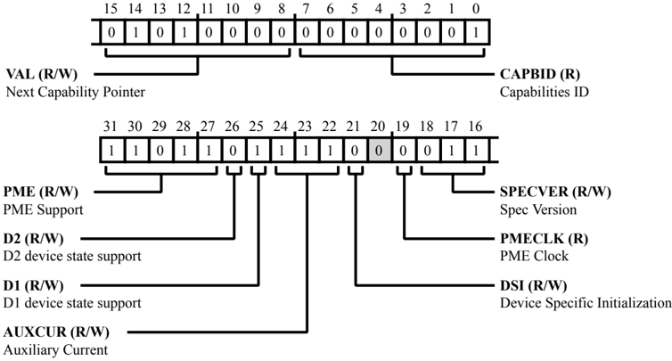

Table 29-187: PCIE\_PMT\_CAPB\_[n] Register Fields

| Bit No. (Access)   | Bit Name   | Description/Enumeration                                                                                                                                                                                                                                                                                             |
|--------------------|------------|---------------------------------------------------------------------------------------------------------------------------------------------------------------------------------------------------------------------------------------------------------------------------------------------------------------------|
| 31:27 (R/W)        | PME        | PME Support. For a device Function, the PCIE_PMT_CAPB_[n].PME bit field indicates the pow- er states in which the Function may generate a PME. Bits 31, 30, and 27 must be set for PCI-PCI Bridge structures representing ports on Root Complexes/Switches to indi- cate that the Bridge will forward PME Messages. |
| 26 (R/W)           | D2         | D2 device state support. If the PCIE_PMT_CAPB_[n].D2 bit =1, this function supports the D2 Power Management State. Functions that do not support D2 must always return a value of 0.                                                                                                                                |
| 25 (R/W)           | D1         | D1 device state support. If the PCIE_PMT_CAPB_[n].D1 bit =1, this function supports the D1 Power Management State. Functions that do not support D1 must always return a value of 0.                                                                                                                                |
| 24:22 (R/W)        | AUXCUR     | Auxiliary Current. The PCIE_PMT_CAPB_[n].AUXCUR bit field reports the 3.3V auxiliary current requirements for the PCI function.                                                                                                                                                                                     |
| 21 (R/W)           | DSI        | Device Specific Initialization. The PCIE_PMT_CAPB_[n].DSI bit indicates whether special initialization of this function is required (beyond the standard PCI configuration header) before the generic class device driver is able to use it                                                                         |

Table 29-187: PCIE\_PMT\_CAPB\_[n] Register Fields (Continued)

| Bit No. (Access)   | Bit Name   | Description/Enumeration                                                                                                                                                                                                                                                                     |
|--------------------|------------|---------------------------------------------------------------------------------------------------------------------------------------------------------------------------------------------------------------------------------------------------------------------------------------------|
| 19 (R/NW)          | PMECLK     | PME Clock. Does not apply to PCI Express. Must be set to 0                                                                                                                                                                                                                                  |
| 18:16 (R/W)        | SPECVER    | Spec Version. When the PCIE_PMT_CAPB_[n].SPECVER bit field = 011 it indicates that this function complies with revision 1.2 of the PCI Power Management Interface Specifica- tion.                                                                                                          |
| 15:8 (R/W)         | VAL        | Next Capability Pointer. The PCIE_PMT_CAPB_[n].VAL bit field provides an offset into the functions PCI Configuration Space pointing to the location of next item in the functions capa- bility list. If there are no additional items in the Capabilities List, this bit field is set to 0. |
| 7:0 (R/NW)         | CAPBID     | Capabilities ID. When the PCIE_PMT_CAPB_[n].CAPBID bit field = 0x1, it identifies the linked list item as being the PCI Power Management registers.                                                                                                                                         |

## Power Management Control and Status Register

The PCIE\_PMT\_CTLSTAT\_[n] register controls/indicates various settings for the power management module.

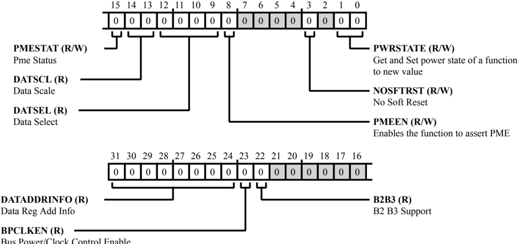

Bus Power/Clock Control Enable

Figure 29-179: PCIE\_PMT\_CTLSTAT\_[n] Register Diagram

Table 29-188: PCIE\_PMT\_CTLSTAT\_[n] Register Fields

| Bit No. (Access)   | Bit Name    | Description/Enumeration                                                                                                                                                                                               |
|--------------------|-------------|-----------------------------------------------------------------------------------------------------------------------------------------------------------------------------------------------------------------------|
| 31:24 (R/NW)       | DATADDRINFO | Data Reg Add Info. The PCIE_PMT_CTLSTAT_[n].DATADDRINFO bit field provides a mechanism for a function to report state dependent operating data such as power consumed or heat dissipation (read-only).                |
| 23 (R/NW)          | BPCLKEN     | Bus Power/Clock Control Enable. The PCIE_PMT_CTLSTAT_[n].BPCLKEN bit determines whether the bridges PMCSR PowerState field can be used by system software to control the power or clock of the bridges secondary bus. |
| 23 (R/NW)          | BPCLKEN     | 0 Indicates that the bus power/clock control policies have been disabled                                                                                                                                              |
| 23 (R/NW)          | BPCLKEN     | 1 Indicates that the bus power/clock control mechanism is enabled                                                                                                                                                     |

Table 29-188: PCIE\_PMT\_CTLSTAT\_[n] Register Fields (Continued)

| Bit No. (Access)   | Bit Name   | Description/Enumeration                                                                                                                                                                                                                                                                                                                                                                                                                                                                                                             |
|--------------------|------------|-------------------------------------------------------------------------------------------------------------------------------------------------------------------------------------------------------------------------------------------------------------------------------------------------------------------------------------------------------------------------------------------------------------------------------------------------------------------------------------------------------------------------------------|
| 22 (R/NW)          | B2B3       | B2 B3 Support. The state of the PCIE_PMT_CTLSTAT_[n].B2B3 bit determines the action that is to occur as a direct result of programming the function to D3hot. This bit is only meaningful if the PCIE_PMT_CTLSTAT_[n].BPCLKEN bit is enabled.                                                                                                                                                                                                                                                                                       |
| 15 (R/W)           | PMESTAT    | (B2) Pme Status. The PCIE_PMT_CTLSTAT_[n].PMESTAT bit is set when the function would normally assert the PME# signal independent of the state of the PME_En bit. Writing a 1 to this bit clears it and causes the function to stop asserting a PME# (if enabled). Writing a 0 has no effect. This bit defaults to 0 if the function does not support PME# generation from D3cold. If the function supports PME# from D3cold, then this bit is sticky and must be explicitly cleared by the operating system each time the operating |
| 14:13 (R/NW)       | DATSCL     | Data Scale. The PCIE_PMT_CTLSTAT_[n].DATSCL bit field indicates the scaling factor to be used when interpreting the value of the Data register. The value and meaning of this field varies depending on which data value has been selected by the Data_Select field.                                                                                                                                                                                                                                                                |
| 12:9 (R/NW)        | DATSEL     | Data Select. The PCIE_PMT_CTLSTAT_[n].DATSEL bit field is used to select which data is to be reported through the Data register and Data_Scale field.                                                                                                                                                                                                                                                                                                                                                                               |
| 8 (R/W)            | PMEEN      | Enables the function to assert PME. The PCIE_PMT_CTLSTAT_[n].PMEEN bit enables the function to assert PME.                                                                                                                                                                                                                                                                                                                                                                                                                          |
| 3 (R/W)            | NOSFTRST   | No Soft Reset. The PCIE_PMT_CTLSTAT_[n].NOSFTRST bit enables or disables No_soft_Re- set.                                                                                                                                                                                                                                                                                                                                                                                                                                           |
| 3 (R/W)            |            | 0 Functional context is not required to be maintained by the Function in the D3hot state                                                                                                                                                                                                                                                                                                                                                                                                                                            |
| 3 (R/W)            |            | 1 Functional context should be maintained by the Func- tion in the D3hot state                                                                                                                                                                                                                                                                                                                                                                                                                                                      |

Table 29-188: PCIE\_PMT\_CTLSTAT\_[n] Register Fields (Continued)

| Bit No. (Access)   | Bit Name   | Description/Enumeration                                                                                                                                                                                                                                                                                                                                                                                                        |
|--------------------|------------|--------------------------------------------------------------------------------------------------------------------------------------------------------------------------------------------------------------------------------------------------------------------------------------------------------------------------------------------------------------------------------------------------------------------------------|
| 1:0 (R/W)          | PWRSTATE   | Get and Set power state of a function to new value. The PCIE_PMT_CTLSTAT_[n].PWRSTATE bit field is used both to determine the current power state of a function and to set the function into a new power state. If software attempts to write an unsupported, optional state to this field, the write opera- tion must complete normally on the bus. However, the data is discarded and no state change occurs. 0 D0 1 D1 2 D2 |
| 1:0 (R/W)          | PWRSTATE   | 3 D3 hot                                                                                                                                                                                                                                                                                                                                                                                                                       |
| 1:0 (R/W)          | PWRSTATE   |                                                                                                                                                                                                                                                                                                                                                                                                                                |
| 1:0 (R/W)          | PWRSTATE   |                                                                                                                                                                                                                                                                                                                                                                                                                                |
| 1:0 (R/W)          | PWRSTATE   |                                                                                                                                                                                                                                                                                                                                                                                                                                |

## Queue Status Register

The PCIE\_QSTAT\_[n] register reports the status of data transfers and the FC Latency Timer.

Figure 29-180: PCIE\_QSTAT\_[n] Register Diagram

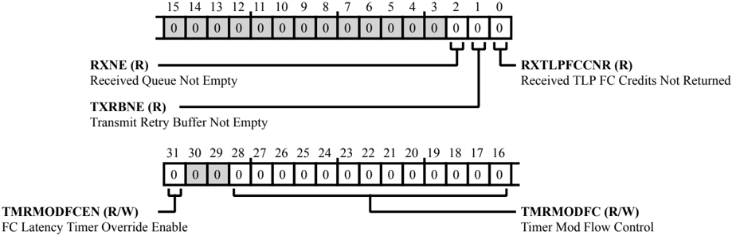

Table 29-189: PCIE\_QSTAT\_[n] Register Fields

| Bit No. (Access)   | Bit Name   | Description/Enumeration                                                                                                                                                                                                                                                                             |
|--------------------|------------|-----------------------------------------------------------------------------------------------------------------------------------------------------------------------------------------------------------------------------------------------------------------------------------------------------|
| 31 (R/W)           | TMRMODFCEN | FC Latency Timer Override Enable. The PCIE_QSTAT_[n].TMRMODFCEN bit indicates the FC Latency Timer Over- ride Enable. When this bit is set, the value from the PCIE_QSTAT_[n].TMRMODFC bit field overrides the FC latency timer value that the core calculates according to the PCIe specification. |
| 28:16 (R/W)        | TMRMODFC   | Timer Mod Flow Control. The PCIE_QSTAT_[n].TMRMODFC bit field indicates the FC Latency Timer Override value. When the PCIE_QSTAT_[n].TMRMODFCEN bit is set, the value in this field overrides the FC latency timer value that the core calculates according to the PCIe specification.              |
| 2 (R/NW)           | RXNE       | Received Queue Not Empty. The PCIE_QSTAT_[n].RXNE bit indicates there is data in one or more of the re- ceive buffers.                                                                                                                                                                              |
| 1 (R/NW)           | TXRBNE     | Transmit Retry Buffer Not Empty. The PCIE_QSTAT_[n].TXRBNE bit indicates that there is data in the transmit re- try buffer.                                                                                                                                                                         |
| 0 (R/NW)           | RXTLPFCCNR | Received TLP FC Credits Not Returned. The PCIE_QSTAT_[n].RXTLPFCCNR bit indicates that the core has sent a TLP but has not yet received an UpdateFC DLLP indicating that the credits for that TLP have been restored by the receiver at the other end of the link.                                  |

## Interrupt Bridge Line and Pin Control Register

Interrupt Bridge, Line and Pin Control Register

Figure 29-181: PCIE\_RC\_BRDG\_ILPCTL\_[n] Register Diagram

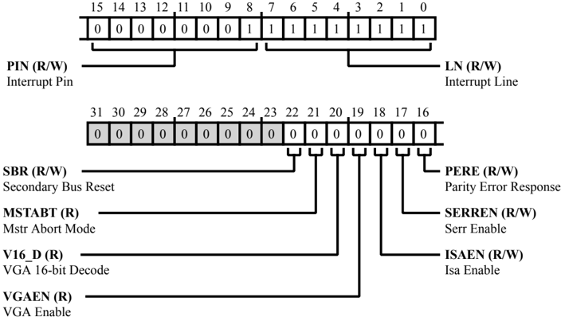

Table 29-190: PCIE\_RC\_BRDG\_ILPCTL\_[n] Register Fields

| Bit No. (Access)   | Bit Name   | Description/Enumeration                                                                                                                                                                                                                                                                                                                                                                                                                                                       |
|--------------------|------------|-------------------------------------------------------------------------------------------------------------------------------------------------------------------------------------------------------------------------------------------------------------------------------------------------------------------------------------------------------------------------------------------------------------------------------------------------------------------------------|
| 22 (R/W)           | SBR        | Secondary Bus Reset. Setting the PCIE_RC_BRDG_ILPCTL_[n].SBR bit triggers a hot reset on the corresponding PCIe port.                                                                                                                                                                                                                                                                                                                                                         |
| 21 (R/NW)          | MSTABT     | Mstr Abort Mode. The PCIE_RC_BRDG_ILPCTL_[n].MSTABT bit controls the behavior of a bridge when a Master-Abort termination occurs on either interface while the bridge is the master of the transaction. Does not apply to PCIe and must be set to 0.                                                                                                                                                                                                                          |
| 20 (R/NW)          | V16_D      | VGA 16-bit Decode. The PCIE_RC_BRDG_ILPCTL_[n].V16_D bit only has meaning if either bit 3 (VGA Enable) of this register or bit 5 (VGA Palette Snoop Enable) of the Command Register, is also set to 1, enabling VGA I/O decoding and forwarding by the bridge. This read/write bit enables system configuration software to select between 10-bit (=0) and 16-bit (=1) I/O address decoding for all VGA I/O register accesses that are for- warded from primary to secondary. |

Table 29-190: PCIE\_RC\_BRDG\_ILPCTL\_[n] Register Fields (Continued)

| Bit No. (Access)   | Bit Name   | Description/Enumeration                                                                                                                                                                                                                                                                                                                      | Description/Enumeration                                                                                                                                                                                                                                                                                                                      |
|--------------------|------------|----------------------------------------------------------------------------------------------------------------------------------------------------------------------------------------------------------------------------------------------------------------------------------------------------------------------------------------------|----------------------------------------------------------------------------------------------------------------------------------------------------------------------------------------------------------------------------------------------------------------------------------------------------------------------------------------------|
| 19 (R/NW)          | VGAEN      | VGA Enable. The PCIE_RC_BRDG_ILPCTL_[n].VGAEN bit modifies the response by the bridge to VGA compatible addresses.                                                                                                                                                                                                                           | VGA Enable. The PCIE_RC_BRDG_ILPCTL_[n].VGAEN bit modifies the response by the bridge to VGA compatible addresses.                                                                                                                                                                                                                           |
| 19 (R/NW)          | VGAEN      |                                                                                                                                                                                                                                                                                                                                              | 0 Do not forward VGA compatible memory and I/O ad- dresses from the primary to the secondary interface (addresses defined above) unless they are enabled for forwarding by the defined I/O and memory address ranges                                                                                                                         |
| 19 (R/NW)          | VGAEN      |                                                                                                                                                                                                                                                                                                                                              | 1 Forward VGA compatible memory and I/O addresses (addresses defined above) from the primary interface to the secondary interface (if the I/O Enable and Memory Enable bits are set) independent of the I/O and memory address ranges and independent of the ISA Enable bit                                                                  |
| 18 (R/W)           | ISAEN      | Isa Enable. The PCIE_RC_BRDG_ILPCTL_[n].ISAEN bit modifies the response by the bridge to ISA I/O addresses. This applies only to I/O addresses that are enabled by the I/O Base and I/O Limit registers and are in the first 64 KB of PCI I/O address space (0000 0000h to 0000 FFFFh). The default state of this bit after reset must be 0. | Isa Enable. The PCIE_RC_BRDG_ILPCTL_[n].ISAEN bit modifies the response by the bridge to ISA I/O addresses. This applies only to I/O addresses that are enabled by the I/O Base and I/O Limit registers and are in the first 64 KB of PCI I/O address space (0000 0000h to 0000 FFFFh). The default state of this bit after reset must be 0. |
| 18 (R/W)           | ISAEN      |                                                                                                                                                                                                                                                                                                                                              | 0 Forward downstream all I/O addresses in the address range defined by the I/O Base and I/O Limit registers                                                                                                                                                                                                                                  |
| 18 (R/W)           | ISAEN      |                                                                                                                                                                                                                                                                                                                                              | 1 Forward upstream ISA I/O addresses in the address range defined by the I/O Base and I/O Limit registers that are in the first 64 KB of PCI I/O address space (top 768 bytes of each 1-KB block)                                                                                                                                            |
| 17 (R/W)           | SERREN     | Serr Enable. The PCIE_RC_BRDG_ILPCTL_[n].SERREN bit controls forwarding of correct- able, nonfatal and fatal error from secondary to primary.                                                                                                                                                                                                | Serr Enable. The PCIE_RC_BRDG_ILPCTL_[n].SERREN bit controls forwarding of correct- able, nonfatal and fatal error from secondary to primary.                                                                                                                                                                                                |
| 16 (R/W)           | PERE       | Parity Error Response. The PCIE_RC_BRDG_ILPCTL_[n].PERE bit controls the logging of poisoned TLPs in the Master Data Parity Error bit in the Secondary Status register.                                                                                                                                                                      | Parity Error Response. The PCIE_RC_BRDG_ILPCTL_[n].PERE bit controls the logging of poisoned TLPs in the Master Data Parity Error bit in the Secondary Status register.                                                                                                                                                                      |
| 15:8 (R/W)         | PIN        | Interrupt Pin. The PCIE_RC_BRDG_ILPCTL_[n].PIN bit field identifies the legacy interrupt Message(s) the Function uses. Valid values are 0x1, 0x2, 0x3, and 0x4 that map to leg- acy interrupt Messages for INTA, INTB, INTC, and INTD respectively. A value of 0x0 indicates that the Function uses no legacy interrupt Message(s).          | Interrupt Pin. The PCIE_RC_BRDG_ILPCTL_[n].PIN bit field identifies the legacy interrupt Message(s) the Function uses. Valid values are 0x1, 0x2, 0x3, and 0x4 that map to leg- acy interrupt Messages for INTA, INTB, INTC, and INTD respectively. A value of 0x0 indicates that the Function uses no legacy interrupt Message(s).          |

Table 29-190: PCIE\_RC\_BRDG\_ILPCTL\_[n] Register Fields (Continued)

| Bit No. (Access)   | Bit Name   | Description/Enumeration                                                                                                                                                                                                                                                                                                                                                                                                                     |
|--------------------|------------|---------------------------------------------------------------------------------------------------------------------------------------------------------------------------------------------------------------------------------------------------------------------------------------------------------------------------------------------------------------------------------------------------------------------------------------------|
| 7:0 (R/W)          | LN         | Interrupt Line. The PCIE_RC_BRDG_ILPCTL_[n].LN bit field communicates interrupt line routing information. This bit field is read/write and must be implemented by any Function that uses an interrupt pin. Values in this register are programmed by system software and are system architecture specific. The Function itself does not use this val- ue; rather the value in this register is used by device drivers and operating systems |

## Capability Pointer Register.

The PCIE\_RC\_CAPBPTR\_[n] register points to the first item in the list of capabilities.

Figure 29-182: PCIE\_RC\_CAPBPTR\_[n] Register Diagram


Table 29-191: PCIE\_RC\_CAPBPTR\_[n] Register Fields

| Bit No. (Access)   | Bit Name   | Description/Enumeration                                                                                                                                                                                                                                                                                                                                                                                                                                                                                                                                                                                                                                                                           |
|--------------------|------------|---------------------------------------------------------------------------------------------------------------------------------------------------------------------------------------------------------------------------------------------------------------------------------------------------------------------------------------------------------------------------------------------------------------------------------------------------------------------------------------------------------------------------------------------------------------------------------------------------------------------------------------------------------------------------------------------------|
| 7:0 (R/W)          | VALUE      | Capabilities Pointer. The PCIE_RC_CAPBPTR_[n].VALUE bit field points to the first item in the list of capabilities. Each capability in the list consists of an 8-bit ID field assigned by the PCI SIG, an 8 bit pointer in configuration space to the next capability, and some number of additional registers immediately following the pointer to implement that capability. Each capability must be DWORDaligned. The bottom two bits of all pointers (including the initial pointer at 0x34) are reserved and must be implemented as 00b although software must mask them to allow for future uses of these bits. A pointer value of 0x00 is used to indicate the last capability in the list |

## Class Code and Revision ID Register

The PCIE\_RC\_CCRID\_[n] register provides the Class Code and Revision ID.

Figure 29-183: PCIE\_RC\_CCRID\_[n] Register Diagram

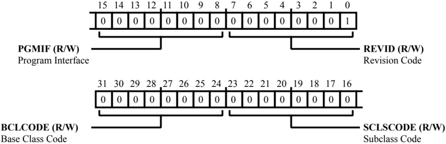

Table 29-192: PCIE\_RC\_CCRID\_[n] Register Fields

| Bit No. (Access)   | Bit Name   | Description/Enumeration                                                                                                                                                                          |
|--------------------|------------|--------------------------------------------------------------------------------------------------------------------------------------------------------------------------------------------------|
| 31:24 (R/W)        | BCLCODE    | Base Class Code. The PCIE_RC_CCRID_[n].BCLCODE bit field broadly classifies the type of func- tion the device performs.                                                                          |
| 23:16 (R/W)        | SCLSCODE   | Subclass Code. The PCIE_RC_CCRID_[n].SCLSCODE bit field identifies more specifically the function of the device.                                                                                 |
| 15:8 (R/W)         | PGMIF      | Program Interface. The PCIE_RC_CCRID_[n].PGMIF bit field identifies a specific register-level pro- gramming interface (if any) so that device independent software can interact with the device. |
| 7:0 (R/W)          | REVID      | Revision Code. The PCIE_RC_CCRID_[n].REVID bit field is the device-specific revision identifi- er.                                                                                               |

## Root Complex Configuration Register

The PCIE\_RC\_CFG\_[n] register provides bits to configure the header type, cache line size, and master latency timer.

Figure 29-184: PCIE\_RC\_CFG\_[n] Register Diagram

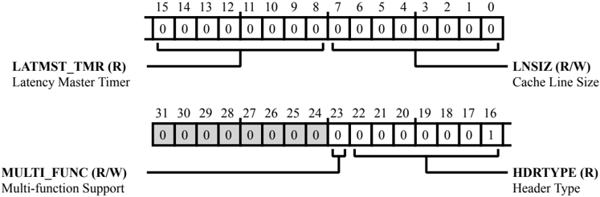

Table 29-193: PCIE\_RC\_CFG\_[n] Register Fields

| Bit No. (Access)   | Bit Name   | Description/Enumeration                                                                                                                                                                                                                                                                                                                                                                                                                                   |
|--------------------|------------|-----------------------------------------------------------------------------------------------------------------------------------------------------------------------------------------------------------------------------------------------------------------------------------------------------------------------------------------------------------------------------------------------------------------------------------------------------------|
| 23 (R/W)           | MULTI_FUNC | Multi-function Support. This bit must be set to 0.                                                                                                                                                                                                                                                                                                                                                                                                        |
| 22:16 (R/NW)       | HDRTYPE    | Header Type. The PCIE_RC_CFG_[n].HDRTYPE bit field identifies the layout of the second part of the predefined header and also whether or not the device contains multiple functions. Bit 7 in this register is used to identify a multifunction device. If the bit is 0, then the device is single function. If the bit is 1, then the device has multiple func- tions. Bits 6 through 0 identify the layout of the second part of the predefined header. |
| 15:8 (R/NW)        | LATMST_TMR | Latency Master Timer. The PCIE_RC_CFG_[n].LATMST_TMR bit field specifies the value of the latency timer in units of PCI bus clocks.                                                                                                                                                                                                                                                                                                                       |
| 7:0 (R/W)          | LNSIZ      | Cache Line Size. The PCIE_RC_CFG_[n].LNSIZ bit field specifies the system cache line size in units of DWORDS.                                                                                                                                                                                                                                                                                                                                             |

## Root Control and Capabilities Register

The PCIE\_RC\_CTLCAPB\_[n] register identifies PCI Express Root Port specific control and capabilities.

Figure 29-185: PCIE\_RC\_CTLCAPB\_[n] Register Diagram

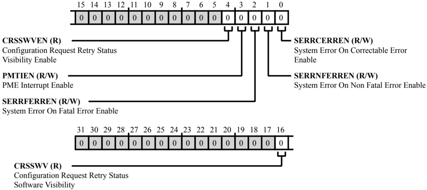

Table 29-194: PCIE\_RC\_CTLCAPB\_[n] Register Fields

| Bit No. (Access)   | Bit Name   | Description/Enumeration                                                                                                                                                                                                                                                                                     |
|--------------------|------------|-------------------------------------------------------------------------------------------------------------------------------------------------------------------------------------------------------------------------------------------------------------------------------------------------------------|
| 16 (R/NW)          | CRSSWV     | Configuration Request Retry Status Software Visibility. When Set, this bit indicates that the Root Port is capable of returning Configuration Request Retry Status (CRS) Completion Status to software.                                                                                                     |
| 4 (R/NW)           | CRSSWVEN   | Configuration Request Retry Status Visibility Enable. The PCIE_RC_CTLCAPB_[n].CRSSWVEN bit enables the Root Port to return Configuration Request Retry Status (CRS) Completion Status to software. Root Ports that do not implement this capability must set this bit to 0. Default value of this bit is 0. |
| 3 (R/W)            | PMTIEN     | PME Interrupt Enable. The PCIE_RC_CTLCAPB_[n].PMTIEN bit enables PME interrupt generation upon receipt of a PME Message as reflected in the PME Status bit. A PME interrupt is also generated if the PME Status bit is set when this bit is changed from clear to set. Default value of this bit is 0.      |

Table 29-194: PCIE\_RC\_CTLCAPB\_[n] Register Fields (Continued)

| Bit No. (Access)   | Bit Name    | Description/Enumeration                                                                                                                                                                                                                                                                                                                                                                                                                                                                                                |
|--------------------|-------------|------------------------------------------------------------------------------------------------------------------------------------------------------------------------------------------------------------------------------------------------------------------------------------------------------------------------------------------------------------------------------------------------------------------------------------------------------------------------------------------------------------------------|
| 2 (R/W)            | SERRFERREN  | System Error On Fatal Error Enable. The PCIE_RC_CTLCAPB_[n].SERRFERREN bit indicates that a System Error should be generated if a Fatal error is reported by any of the devices in the hierarchy associated with this Root Port, or by the Root Port itself. The mechanism for signaling a System Error to the system is system specific. Root Complex Event Collectors pro- vide support for the above described functionality for Root Complex Integrated End- points. Default value of this bit is 0.               |
| 1 (R/W)            | SERRNFERREN | System Error On Non Fatal Error Enable. The PCIE_RC_CTLCAPB_[n].SERRNFERREN bit indicates that a System Error should be generated if a Non-fatal error is reported by any of the devices in the hierar- chy associated with this Root Port, or by the Root Port itself. The mechanism for sig- naling a System Error to the system is system specific. Root Complex Event Collectors provide support for the above described functionality for Root Complex Integrated Endpoints. Default value of this bit is 0.      |
| 0 (R/W)            | SERRCERREN  | System Error On Correctable Error Enable. The PCIE_RC_CTLCAPB_[n].SERRCERREN bit indicates that a System Error should be generated if a correctable error is reported by any of the devices in the hier- archy associated with this Root Port, or by the Root Port itself. The mechanism for signaling a System Error to the system is system specific. Root Complex Event Collec- tors provide support for the above described functionality for Root Complex Integrat- ed Endpoints. Default value of this bit is 0. |

## Device Capabilities Register

The PCIE\_RC\_DEVCAPB\_[n] register identifies PCI Express device Function specific capabilities.

Figure 29-186: PCIE\_RC\_DEVCAPB\_[n] Register Diagram

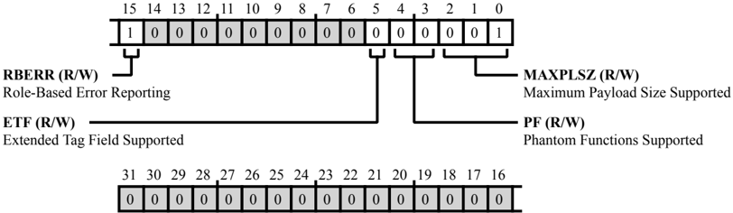

Table 29-195: PCIE\_RC\_DEVCAPB\_[n] Register Fields

| Bit No. (Access)   | Bit Name   | Description/Enumeration                                                                                                                                                                                                                                                                                                                     | Description/Enumeration                                                                                                                                                                                                                                                                                                                     |
|--------------------|------------|---------------------------------------------------------------------------------------------------------------------------------------------------------------------------------------------------------------------------------------------------------------------------------------------------------------------------------------------|---------------------------------------------------------------------------------------------------------------------------------------------------------------------------------------------------------------------------------------------------------------------------------------------------------------------------------------------|
| 15 (R/W)           | RBERR      | Role-Based Error Reporting. When the PCIE_RC_DEVCAPB_[n].RBERR bit is set, (=1) it indicates that the Function implements the functionality originally defined in the PCI Express Base Specification. This bit is read-only and always set to 1.                                                                                            | Role-Based Error Reporting. When the PCIE_RC_DEVCAPB_[n].RBERR bit is set, (=1) it indicates that the Function implements the functionality originally defined in the PCI Express Base Specification. This bit is read-only and always set to 1.                                                                                            |
| 5 (R/W)            | ETF        | Extended Tag Field Supported. The PCIE_RC_DEVCAPB_[n].ETF bit indicates the maximum supported size of the Tag field as a Requester. Note that 8-bit Tag field generation must be enabled by the Extended Tag Field Enable bit in the Device Control register of the Requester Function before 8-bit Tags can be generated by the Requester. | Extended Tag Field Supported. The PCIE_RC_DEVCAPB_[n].ETF bit indicates the maximum supported size of the Tag field as a Requester. Note that 8-bit Tag field generation must be enabled by the Extended Tag Field Enable bit in the Device Control register of the Requester Function before 8-bit Tags can be generated by the Requester. |
| 5 (R/W)            | ETF        | 0                                                                                                                                                                                                                                                                                                                                           | 5-bit Tag field supported                                                                                                                                                                                                                                                                                                                   |
| 4:3 (R/W)          | PF         | Phantom Functions Supported. The PCIE_RC_DEVCAPB_[n].PF bit field indicates the support for use of un- claimed Function Numbers to extend the number of outstanding transactions allowed by logically combining unclaimed Function Numbers (called Phantom Functions) with the Tag identifier.                                              | Phantom Functions Supported. The PCIE_RC_DEVCAPB_[n].PF bit field indicates the support for use of un- claimed Function Numbers to extend the number of outstanding transactions allowed by logically combining unclaimed Function Numbers (called Phantom Functions) with the Tag identifier.                                              |
| 2:0 (R/W)          | MAXPLSZ    | Maximum Payload Size Supported. The PCIE_RC_DEVCAPB_[n].MAXPLSZ bit field indicates the maximum pay- load size that the Function can support for TLPs. The Functions of a multi-Function device are permitted to report different values for this field.                                                                                    | Maximum Payload Size Supported. The PCIE_RC_DEVCAPB_[n].MAXPLSZ bit field indicates the maximum pay- load size that the Function can support for TLPs. The Functions of a multi-Function device are permitted to report different values for this field.                                                                                    |
| 2:0 (R/W)          | MAXPLSZ    | 0                                                                                                                                                                                                                                                                                                                                           | 128 bytes max payload size                                                                                                                                                                                                                                                                                                                  |
| 2:0 (R/W)          | MAXPLSZ    | 1                                                                                                                                                                                                                                                                                                                                           | 256 bytes max payload size                                                                                                                                                                                                                                                                                                                  |
| 2:0 (R/W)          | MAXPLSZ    | 2                                                                                                                                                                                                                                                                                                                                           | 512 bytes max payload size                                                                                                                                                                                                                                                                                                                  |

## Table 29-195: PCIE\_RC\_DEVCAPB\_[n] Register Fields (Continued)

| Bit No.   |   Bit Name | Description/Enumeration     |
|-----------|------------|-----------------------------|
| (Access)  |            |                             |
|           |          3 | 1024 bytes max payload size |
|           |          4 | 2048 bytes max payload size |
|           |          5 | 4096 bytes max payload size |
|           |          6 | Reserved                    |
|           |          7 | Reserved                    |

## Root Complex Error Command Register

The PCIE\_RC\_ERRCMD\_[n] register allows further control of Root Complex response to Correctable, Non-Fatal, and Fatal error Messages than the basic Root Complex capability to generate system errors in response to error Messages (either received or internally generated). Bit fields enable or disable generation of interrupts (claimed by the Root Port or Root Complex Event Collector) in addition to system error Messages.

Figure 29-187: PCIE\_RC\_ERRCMD\_[n] Register Diagram

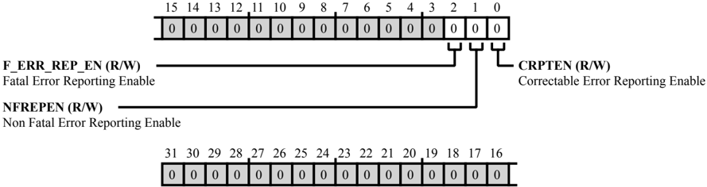

Table 29-196: PCIE\_RC\_ERRCMD\_[n] Register Fields

| Bit No. (Access)   | Bit Name     | Description/Enumeration                                                                                                                                                                                                                                                                                                                                    |
|--------------------|--------------|------------------------------------------------------------------------------------------------------------------------------------------------------------------------------------------------------------------------------------------------------------------------------------------------------------------------------------------------------------|
| 2 (R/W)            | F_ERR_REP_EN | Fatal Error Reporting Enable. The PCIE_RC_ERRCMD_[n].F_ERR_REP_EN bit enables the generation of an interrupt when a Fatal error is reported by any of the Functions in the hierarchy associ- ated with this Root Complex Port. Root Complex Event Collectors provide support for the above described functionality for Root Complex Integrated Endpoints.  |
| 1 (R/W)            | NFREPEN      | Non Fatal Error Reporting Enable. The PCIE_RC_ERRCMD_[n].NFREPEN bit enables the generation of an interrupt when a Non-fatal error is reported by any of the Functions in the hierarchy associated with this Root Complex Port. Root Complex Event Collectors provide support for the above described functionality for Root Complex Integrated Endpoints. |
| 0 (R/W)            | CRPTEN       | Correctable Error Reporting Enable. When Set, this bit enables the generation of an interrupt when a correctable error is reported by any of the Functions in the hierarchy associated with this Root Complex Port. Root Complex Event Collectors provide support for the above described func- tionality for Root Complex Integrated Endpoints.           |

## Root Error Status Register

The PCIE\_RC\_ERRSTAT\_[n] register reports status of error Messages (ERR\_COR, ERR\_NONFATAL, and ERR\_FATAL) received by the Root Port, and of errors detected by the Root Port itself (which are treated conceptually as if the Root Port had sent an error Message to itself).

Figure 29-188: PCIE\_RC\_ERRSTAT\_[n] Register Diagram

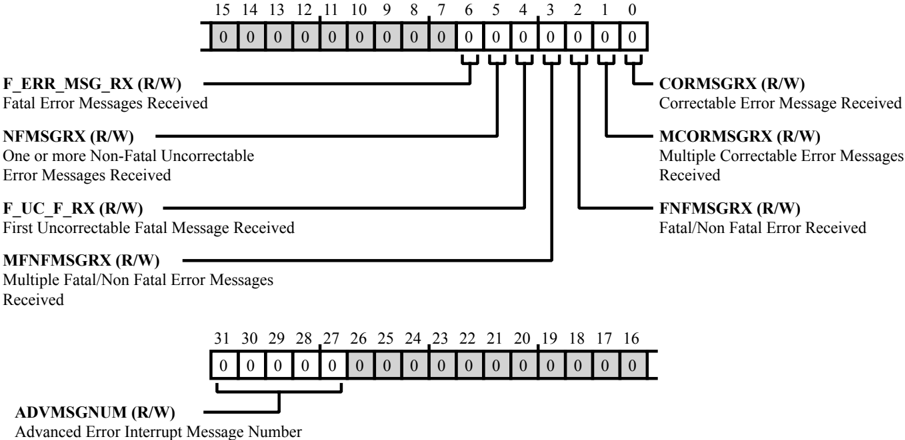

Table 29-197: PCIE\_RC\_ERRSTAT\_[n] Register Fields

| Bit No. (Access)   | Bit Name     | Description/Enumeration                                                                                                                                                                                                                                                                                                                                                                                                                                                                                                                                                                                                                                                                                                                                                                                                                                                                                                                                                                                                                                                                                                                                                                                                                                                                                                                                       |
|--------------------|--------------|---------------------------------------------------------------------------------------------------------------------------------------------------------------------------------------------------------------------------------------------------------------------------------------------------------------------------------------------------------------------------------------------------------------------------------------------------------------------------------------------------------------------------------------------------------------------------------------------------------------------------------------------------------------------------------------------------------------------------------------------------------------------------------------------------------------------------------------------------------------------------------------------------------------------------------------------------------------------------------------------------------------------------------------------------------------------------------------------------------------------------------------------------------------------------------------------------------------------------------------------------------------------------------------------------------------------------------------------------------------|
| 31:27 (R/W)        | ADVMSGNUM    | Advanced Error Interrupt Message Number. The PCIE_RC_ERRSTAT_[n].ADVMSGNUM bit field indicates which MSI/MSI- X vector is used for the interrupt message generated in association with any of the sta- tus bits of this Capability. For MSI, the value in this register indicates the offset between the base Message Data and the interrupt message that is generated. Hardware is required to update this field so that it is correct if the number of MSI Messages assigned to the Function changes when software writes to the Multiple Message Enable field in the MSI Message Con- trol register. For MSI-X, the value in this register indicates which MSI-X Table entry is used to gen- erate the interrupt message. The entry must be one of the first 32 entries even if the Function implements more than 32 entries. For a given MSI-X implementation, the entry must remain constant. If both MSI and MSI-X are implemented, they are permitted to use different vectors, though software is permitted to enable only one mechanism at a time. If MSI-X is ena- bled, the value in this register must indicate the vector for MSI-X. If MSI is enabled or neither is enabled, the value in this register must indicate the vector for MSI. If soft- ware enables both MSI and MSI-X at the same time, the value in this register is unde- fined. |
| 6 (R/W)            | F_ERR_MSG_RX | Fatal Error Messages Received. The PCIE_RC_ERRSTAT_[n].F_ERR_MSG_RX bit is set when one or more Fa- tal Uncorrectable error Messages have been received. Default value of this bit is 0.                                                                                                                                                                                                                                                                                                                                                                                                                                                                                                                                                                                                                                                                                                                                                                                                                                                                                                                                                                                                                                                                                                                                                                      |
| 5 (R/W)            | NFMSGRX      | One or more Non-Fatal Uncorrectable Error Messages Received. The PCIE_RC_ERRSTAT_[n].NFMSGRX bit is set when one or more Non-Fatal Uncorrectable error Messages have been received. Default value of this bit is 0.                                                                                                                                                                                                                                                                                                                                                                                                                                                                                                                                                                                                                                                                                                                                                                                                                                                                                                                                                                                                                                                                                                                                           |
| 4 (R/W)            | F_UC_F_RX    | First Uncorrectable Fatal Message Received. The PCIE_RC_ERRSTAT_[n].F_UC_F_RX bit is set when the first Uncorrecta- ble error Message received is for a Fatal error. Default value of this field is 0.                                                                                                                                                                                                                                                                                                                                                                                                                                                                                                                                                                                                                                                                                                                                                                                                                                                                                                                                                                                                                                                                                                                                                        |
| 3 (R/W)            | MFNFMSGRX    | Multiple Fatal/Non Fatal Error Messages Received. The PCIE_RC_ERRSTAT_[n].MFNFMSGRX bit is set when either a Fatal or a Non-fatal error is received and ERR_FATAL/NONFATAL Received is already Set. De- fault value of this bit is 0.                                                                                                                                                                                                                                                                                                                                                                                                                                                                                                                                                                                                                                                                                                                                                                                                                                                                                                                                                                                                                                                                                                                         |
| 2 (R/W)            | FNFMSGRX     | Fatal/Non Fatal Error Received. The PCIE_RC_ERRSTAT_[n].FNFMSGRX bit is set when either a Fatal or a Non-fatal error Message is received and this bit is not already Set. Default value of this bit is 0.                                                                                                                                                                                                                                                                                                                                                                                                                                                                                                                                                                                                                                                                                                                                                                                                                                                                                                                                                                                                                                                                                                                                                     |

Table 29-197: PCIE\_RC\_ERRSTAT\_[n] Register Fields (Continued)

| Bit No. (Access)   | Bit Name   | Description/Enumeration                                                                                                                                                                                      |
|--------------------|------------|--------------------------------------------------------------------------------------------------------------------------------------------------------------------------------------------------------------|
| 1 (R/W)            | MCORMSGRX  | Multiple Correctable Error Messages Received. The PCIE_RC_ERRSTAT_[n].MCORMSGRX bit is set when a Correctable error Message is received and ERR_COR Received is already Set. Default value of this bit is 0. |
| 0 (R/W)            | CORMSGRX   | Correctable Error Message Received. The PCIE_RC_ERRSTAT_[n].CORMSGRX bit is set when a Correctable error Message is received and this bit is not already set. Default value of this bit is 0.                |

## Device ID and Vendor ID Register

The PCIE\_RC\_ID\_[n] register provides the Device ID and Vendor ID.

Figure 29-189: PCIE\_RC\_ID\_[n] Register Diagram


Table 29-198: PCIE\_RC\_ID\_[n] Register Fields

| Bit No. (Access)   | Bit Name   | Description/Enumeration                                                                                                                                                           |
|--------------------|------------|-----------------------------------------------------------------------------------------------------------------------------------------------------------------------------------|
| 31:16 (R/W)        | DEVID      | Device ID. The PCIE_RC_ID_[n].DEVID bit field is the Vendor assigned field that provides a means for a vendor to classify a particular RCRB.                                      |
| 15:0 (R/W)         | VENDID     | Vendor ID. The PCIE_RC_ID_[n].VENDID bit field is the PCI-SIG assigned field that pro- vides a means to associate an RCRB (root complex register block) with a particular vendor. |

## Root Complex I/O Base and Limit Upper 16 bits Register

The PCIE\_RC\_IOBL\_[n] register provides the root complex I/O base and limit upper address bits (16 bits).

Figure 29-190: PCIE\_RC\_IOBL\_[n] Register Diagram

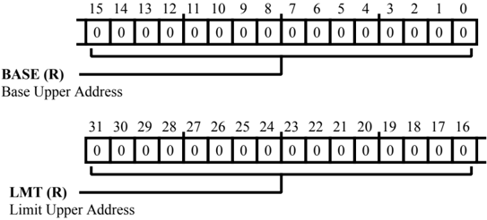

Table 29-199: PCIE\_RC\_IOBL\_[n] Register Fields

| Bit No. (Access)   | Bit Name   | Description/Enumeration                                                                       |
|--------------------|------------|-----------------------------------------------------------------------------------------------|
| 31:16 (R/NW)       | LMT        | Limit Upper Address. The PCIE_RC_IOBL_[n].LMT bit field contains the I/O Limit upper 16 bits. |
| 15:0 (R/NW)        | BASE       | Base Upper Address. The PCIE_RC_IOBL_[n].BASE bit field contains the I/O base upper 16 bits.  |

## Memory Base and Memory Limit Register

The PCIE\_RC\_MBL\_[n] register contains the non-prefetchable memory base address and the non-prefetchable memory limit.

Figure 29-191: PCIE\_RC\_MBL\_[n] Register Diagram

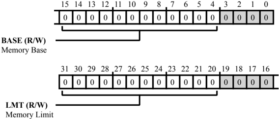

Table 29-200: PCIE\_RC\_MBL\_[n] Register Fields

| Bit No. (Access)   | Bit Name   | Description/Enumeration                                                                            |
|--------------------|------------|----------------------------------------------------------------------------------------------------|
| 31:20 (R/W)        | LMT        | Memory Limit. The PCIE_RC_MBL_[n].LMT bit field contains the non-prefetchable memory lim- it.      |
| 15:4 (R/W)         | BASE       | Memory Base. The PCIE_RC_MBL_[n].BASE bit field contains the non-prefetchable memory base address. |

## Prefetchable Memory Base and Limit Register

The PCIE\_RC\_PREFMBL\_[n] register contains the prefetchable memory base and limit addresses.

Figure 29-192: PCIE\_RC\_PREFMBL\_[n] Register Diagram

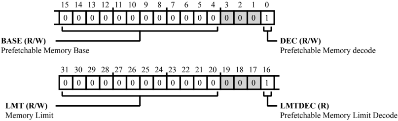

Table 29-201: PCIE\_RC\_PREFMBL\_[n] Register Fields

| Bit No. (Access)   | Bit Name   | Description/Enumeration                                            |
|--------------------|------------|--------------------------------------------------------------------|
| 31:20 (R/W)        | LMT        | Memory Limit. Precethable memory limit                             |
| 16 (R/NW)          | LMTDEC     | Prefetchable Memory Limit Decode. Prefetchable memory limit decode |
| 15:4 (R/W)         | BASE       | Prefetchable Memory Base. Prefetchable memory base address         |
| 0 (R/W)            | DEC        | Prefetchable Memory decode. Prefetchable memory decode             |

## Prefetchable Base Upper 32 Bits Register

The PCIE\_RC\_PREF\_BUPP\_[n] register contains the Prefetchable base upper 32 bits.

Figure 29-193: PCIE\_RC\_PREF\_BUPP\_[n] Register Diagram

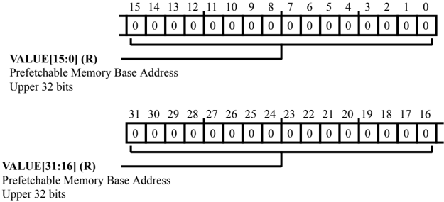

Table 29-202: PCIE\_RC\_PREF\_BUPP\_[n] Register Fields

| Bit No. (Access)   | Bit Name   | Description/Enumeration                                                                                                                         |
|--------------------|------------|-------------------------------------------------------------------------------------------------------------------------------------------------|
| 31:0 (R/NW)        | VALUE      | Prefetchable Memory Base Address Upper 32 bits. The PCIE_RC_PREF_BUPP_[n].VALUE bit field contains the prefetchable base address upper 32 bits. |

## Prefetchable Limit Upper 32 Bits Register

The PCIE\_RC\_PREF\_LMT\_UP\_[n] register contains the prefetchable limit upper 32 bits.

Figure 29-194: PCIE\_RC\_PREF\_LMT\_UP\_[n] Register Diagram


Table 29-203: PCIE\_RC\_PREF\_LMT\_UP\_[n] Register Fields

| Bit No. (Access)   | Bit Name   | Description/Enumeration                                                                                                                    |
|--------------------|------------|--------------------------------------------------------------------------------------------------------------------------------------------|
| 31:0 (R/NW)        | VALUE      | Prefetchable Limit Upper 32 bit Address. The PCIE_RC_PREF_LMT_UP_[n].VALUE bit field contains the prefetchable limit upper 32 bit address. |

## Root Complex Expansion ROM Base Address Register

The PCIE\_RC\_ROMCFG\_[n] register controls whether or not the device accepts accesses to its expansion ROM and indicates the upper 21 bits of the Expansion ROM base address.

Figure 29-195: PCIE\_RC\_ROMCFG\_[n] Register Diagram

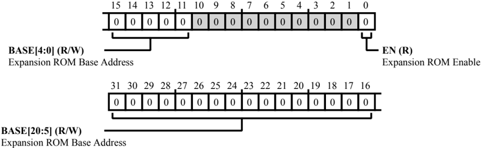

Table 29-204: PCIE\_RC\_ROMCFG\_[n] Register Fields

| Bit No. (Access)   | Bit Name   | Description/Enumeration                                                                                                                                                                                                                                                                                                                                                                                                                                                                                                   |
|--------------------|------------|---------------------------------------------------------------------------------------------------------------------------------------------------------------------------------------------------------------------------------------------------------------------------------------------------------------------------------------------------------------------------------------------------------------------------------------------------------------------------------------------------------------------------|
| 31:11 (R/W)        | BASE       | Expansion ROMBase Address. The PCIE_RC_ROMCFG_[n].BASE bit field corresponds to the upper 21 bits of the Expansion ROMbase address. The number of bits (out of these 21) that a device actually implements depends on how much address space the device requires. For in- stance, a device that requires a 64 KB area to map its expansion ROMwould imple- ment the top 16 bits in the register, leaving the bottom 5 (out of these 21) hardwired to 0. Devices that support an expansion ROMmust implement this register |
| 0 (R/NW)           | EN         | Expansion ROMEnable. The PCIE_RC_ROMCFG_[n].EN bit controls whether or not the device accepts ac- cesses to its expansion ROM. When this bit is 0, the devices expansion ROMaddress space is disabled. When the bit is 1, address decoding is enabled using the parameters in the other part of the base register. This allows a device to be used with or without an expansion ROMdepending on system configuration.                                                                                                     |

## Secondary Status and I/O Base and Limit Register

The PCIE\_RC\_SECSTAT\_[n] register provides error and status information for the secondary status and I/O base and limit. This register also provides the upper 4 bits of the 16-bit limit address (bits 15:12) and the upper 4 bits of the 16- bit base address (bits 15:12).

Figure 29-196: PCIE\_RC\_SECSTAT\_[n] Register Diagram

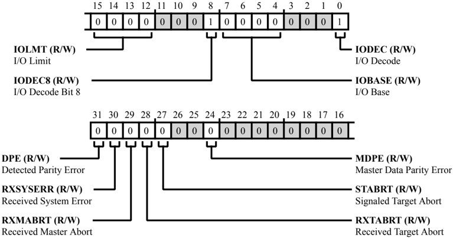

Table 29-205: PCIE\_RC\_SECSTAT\_[n] Register Fields

| Bit No. (Access)   | Bit Name   | Description/Enumeration                                                                                                                                                                                                        | Description/Enumeration                                                                                                                                                                                                        |
|--------------------|------------|--------------------------------------------------------------------------------------------------------------------------------------------------------------------------------------------------------------------------------|--------------------------------------------------------------------------------------------------------------------------------------------------------------------------------------------------------------------------------|
| 31 (R/W)           | DPE        | Detected Parity Error. The PCIE_RC_SECSTAT_[n].DPE bit reports the detection of an address or data parity error by the bridge on its secondary interface. This bit must be set when any of the following conditions is true: • | Detected Parity Error. The PCIE_RC_SECSTAT_[n].DPE bit reports the detection of an address or data parity error by the bridge on its secondary interface. This bit must be set when any of the following conditions is true: • |
|                    |            | 0                                                                                                                                                                                                                              | Address or data parity error not detected by the bridge on its secondary interface                                                                                                                                             |
|                    |            | 1                                                                                                                                                                                                                              | Address or data parity error detected by the bridge on its secondary interface                                                                                                                                                 |

Table 29-205: PCIE\_RC\_SECSTAT\_[n] Register Fields (Continued)

| Bit No. (Access)   | Bit Name   | Description/Enumeration                                                                                                                                                                                                                                                                                                                                                         | Description/Enumeration                                                                                                                                                                                                                                                                                                                                                         |
|--------------------|------------|---------------------------------------------------------------------------------------------------------------------------------------------------------------------------------------------------------------------------------------------------------------------------------------------------------------------------------------------------------------------------------|---------------------------------------------------------------------------------------------------------------------------------------------------------------------------------------------------------------------------------------------------------------------------------------------------------------------------------------------------------------------------------|
| 30 (R/W)           | RXSYSERR   | Received System Error. The PCIE_RC_SECSTAT_[n].RXSYSERR bit reports the detection of an SERR# assertion on the secondary interface of the bridge. Once set, this bit remains set until it is reset by writing a 1 to this bit location. The default state must be 0 after reset.                                                                                                | Received System Error. The PCIE_RC_SECSTAT_[n].RXSYSERR bit reports the detection of an SERR# assertion on the secondary interface of the bridge. Once set, this bit remains set until it is reset by writing a 1 to this bit location. The default state must be 0 after reset.                                                                                                |
| 30 (R/W)           | RXSYSERR   | 0                                                                                                                                                                                                                                                                                                                                                                               | SERR# assertion on the secondary interface has not been detected                                                                                                                                                                                                                                                                                                                |
| 30 (R/W)           | RXSYSERR   | 1                                                                                                                                                                                                                                                                                                                                                                               | SERR# assertion on the secondary interface has been detected                                                                                                                                                                                                                                                                                                                    |
| 29 (R/W)           | RXMABRT    | Received Master Abort. The PCIE_RC_SECSTAT_[n].RXMABRT bit reports the detection of a Master- Abort termination by the bridge when it is the master of a transaction on its secondary interface. Once set, this bit remains set until it is reset by writing a 1 to this bit loca- tion. A bridge must implement this bit and the default state must be 0 after reset.          | Received Master Abort. The PCIE_RC_SECSTAT_[n].RXMABRT bit reports the detection of a Master- Abort termination by the bridge when it is the master of a transaction on its secondary interface. Once set, this bit remains set until it is reset by writing a 1 to this bit loca- tion. A bridge must implement this bit and the default state must be 0 after reset.          |
| 29 (R/W)           | RXMABRT    | 0                                                                                                                                                                                                                                                                                                                                                                               | Master-Abort not detected by the bridge on its secon- dary interface                                                                                                                                                                                                                                                                                                            |
| 29 (R/W)           | RXMABRT    | 1                                                                                                                                                                                                                                                                                                                                                                               | Master-Abort detected by the bridge on its secondary interface                                                                                                                                                                                                                                                                                                                  |
| 28 (R/W)           | RXTABRT    | Received Target Abort. The PCIE_RC_SECSTAT_[n].RXTABRT bit reports the detection of a Target- Abort termination by the bridge when it is the master of a transaction on its secondary interface. Once set, this bit remains set until it is reset by writing a 1 to this bit loca- tion. A bridge must implement this bit. The default state of this bit must be 0 after reset. | Received Target Abort. The PCIE_RC_SECSTAT_[n].RXTABRT bit reports the detection of a Target- Abort termination by the bridge when it is the master of a transaction on its secondary interface. Once set, this bit remains set until it is reset by writing a 1 to this bit loca- tion. A bridge must implement this bit. The default state of this bit must be 0 after reset. |
| 28 (R/W)           | RXTABRT    | 0                                                                                                                                                                                                                                                                                                                                                                               | Target-Abort not detected by the bridge on its secon- dary interface                                                                                                                                                                                                                                                                                                            |
| 28 (R/W)           | RXTABRT    | 1                                                                                                                                                                                                                                                                                                                                                                               | Target-Abort detected by the bridge on its secondary in- terface                                                                                                                                                                                                                                                                                                                |
| 27 (R/W)           | STABRT     | Signaled Target Abort. The PCIE_RC_SECSTAT_[n].STABRT bit reports the signaling of a Target- Abort termination by the bridge when it responds as the target of a transaction on its secondary interface. Once set, this bit remains set until it is reset by writing a 1 to this bit location. A bridge must implement this bit and the default state must be 0 after reset.    | Signaled Target Abort. The PCIE_RC_SECSTAT_[n].STABRT bit reports the signaling of a Target- Abort termination by the bridge when it responds as the target of a transaction on its secondary interface. Once set, this bit remains set until it is reset by writing a 1 to this bit location. A bridge must implement this bit and the default state must be 0 after reset.    |
| 27 (R/W)           | STABRT     | 0                                                                                                                                                                                                                                                                                                                                                                               | Target-Abort not signaled by the bridge on its secondary interface                                                                                                                                                                                                                                                                                                              |
| 27 (R/W)           | STABRT     | 1                                                                                                                                                                                                                                                                                                                                                                               | Target-Abort signaled by the bridge on its secondary in- terface                                                                                                                                                                                                                                                                                                                |

Table 29-205: PCIE\_RC\_SECSTAT\_[n] Register Fields (Continued)

| Bit No. (Access)   | Bit Name   | Description/Enumeration                                                                                                                                                                                                                                                                                                                                                                                                                                                                                                                                                                                                                                                                                      |
|--------------------|------------|--------------------------------------------------------------------------------------------------------------------------------------------------------------------------------------------------------------------------------------------------------------------------------------------------------------------------------------------------------------------------------------------------------------------------------------------------------------------------------------------------------------------------------------------------------------------------------------------------------------------------------------------------------------------------------------------------------------|
| 24 (R/W)           | MDPE       | Master Data Parity Error. The PCIE_RC_SECSTAT_[n].MDPE bit is used to report the detection of a parity error by the bridge when it is the master of a transaction. This bit is set if all the fol- lowing conditions are true: • The bridge is the bus master of the transaction on the secondary interface. • The bridge asserted PERR# (read transaction) or detected PERR# asserted (write transaction). • The Parity Error Response bit in the Bridge Control register is set. Once set, this bit remains set until it is reset by writing a 1 to this bit location. A bridge must implement this bit and the default state must be 0 after reset. 0 No parity error detected on the secondary interface |
| 15:12 (R/W)        | IOLMT      | I/O Limit. The PCIE_RC_SECSTAT_[n].IOLMT bit field contains the upper 4 bits of the 16-bit Limit address (bits 15:12). The lower 12 bits of the limit address are implied to be all F's.                                                                                                                                                                                                                                                                                                                                                                                                                                                                                                                     |
| 8 (R/W)            | IODEC8     | I/O Decode Bit 8.                                                                                                                                                                                                                                                                                                                                                                                                                                                                                                                                                                                                                                                                                            |
| 7:4 (R/W)          | IOBASE     | I/O Base. The PCIE_RC_SECSTAT_[n].IOBASE bit field contains the upper 4 bits of the 16-bit Base address (bits 15:12). The lower 12 bits of the base address are implied to be all 0's, meaning that the base address is always aligned on a 4KB boundary.                                                                                                                                                                                                                                                                                                                                                                                                                                                    |
| 0 (R/W)            | IODEC      | I/O Decode.                                                                                                                                                                                                                                                                                                                                                                                                                                                                                                                                                                                                                                                                                                  |

## Command and Status Register

The PCIE\_RC\_STATCMD\_[n] register contains bits that enable various memory spaces. The register also reports several errors.

Figure 29-197: PCIE\_RC\_STATCMD\_[n] Register Diagram


Table 29-206: PCIE\_RC\_STATCMD\_[n] Register Fields

| Bit No. (Access)   | Bit Name   | Description/Enumeration                                                                                                                                                                                                                                                                                                                           |
|--------------------|------------|---------------------------------------------------------------------------------------------------------------------------------------------------------------------------------------------------------------------------------------------------------------------------------------------------------------------------------------------------|
| 31 (R/W)           | DETPERR    | Detected Parity Error. The PCIE_RC_STATCMD_[n].DETPERR bit is set by a Function whenever it re- ceives a Poisoned TLP, regardless of the state of the PCIE_RC_STATCMD_[n].PERREN bit. On a Function with a Type 1 Configura- tion header, the bit is Set when the Poisoned TLP is received by its Primary Side. De- fault value of this bit is 0. |

Table 29-206: PCIE\_RC\_STATCMD\_[n] Register Fields (Continued)

| Bit No. (Access)   | Bit Name   | Description/Enumeration                                                                                                                                                                                                                                                                                                                                                                                                                                      |
|--------------------|------------|--------------------------------------------------------------------------------------------------------------------------------------------------------------------------------------------------------------------------------------------------------------------------------------------------------------------------------------------------------------------------------------------------------------------------------------------------------------|
| 30 (R/W)           | SSYSERR    | Signaled System Error. The PCIE_RC_STATCMD_[n].SSYSERR bit is Set when a Function sends an ERR_FATAL or ERR_NONFATAL Message, and the PCIE_RC_STATCMD_[n].SERREN bit is set to 1. Default value of this bit is 0.                                                                                                                                                                                                                                            |
| 29 (R/W)           | RXMABRT    | Received Master Abort. The PCIE_RC_STATCMD_[n].RXMABRT bit is set when a Requester receives a Completion with Unsupported Request Completion Status. On a Function with a Type 1 Configuration header, the bit is Set when the Unsupported Request is received by its Primary Side. Default value of this bit is 0.                                                                                                                                          |
| 28 (R/W)           | RXTABRT    | Received Target Abort. The PCIE_RC_STATCMD_[n].RXTABRT bit is Set when a Requester receives a Completion with Completer Abort Completion Status. On a Function with a Type 1 Configuration header, the bit is Set when the Completer Abort is received by its Pri- mary Side. Default value of this bit is 0.                                                                                                                                                |
| 27 (R/W)           | STABRT     | Signaled Target Abort. The PCIE_RC_STATCMD_[n].STABRT bit is set when a Function completes a Posted or Non-Posted Request as a Completer Abort error. This applies to a Function with a Type 1 Configuration header when the Completer Abort was generated by its Primary Side. Default value of this bit is 0.                                                                                                                                              |
| 26:25 (R/NW)       | DEVSELTMG  | Device Select Timing. Does not apply to PCI express and must be set to 0.                                                                                                                                                                                                                                                                                                                                                                                    |
| 24 (R/W)           | MSTDPERR   | Master Data Parity Error. The PCIE_RC_STATCMD_[n].MSTDPERR bit is set by a Root Port, Switch Up- stream Port, or Switch Downstream Port if the PCIE_RC_STATCMD_[n].PERREN bit is set to 1 and either of the following two conditions occurs: • Port receives a Poisoned Completion going Downstream • Port transmits a Poisoned Request Upstream If the PCIE_RC_STATCMD_[n].PERREN bit is set to 0, this bit is never set. De- fault value of this bit is 0. |
| 23 (R/NW)          | FASTB2B    | Fast back-to-back transactions enable. Does not apply to PCI express and must be set to 0.                                                                                                                                                                                                                                                                                                                                                                   |
| 21 (R/NW)          | FAST66     | 66 MHz Capable. Does not apply to PCI express and must be set to 0.                                                                                                                                                                                                                                                                                                                                                                                          |

Table 29-206: PCIE\_RC\_STATCMD\_[n] Register Fields (Continued)

| Bit No. (Access)   | Bit Name   | Description/Enumeration                                                                                                                                                                                                                                                                                                                                                                                                                                                                                                                                                                                                                                                                                                                                                                                                                                                                                                                                                             |
|--------------------|------------|-------------------------------------------------------------------------------------------------------------------------------------------------------------------------------------------------------------------------------------------------------------------------------------------------------------------------------------------------------------------------------------------------------------------------------------------------------------------------------------------------------------------------------------------------------------------------------------------------------------------------------------------------------------------------------------------------------------------------------------------------------------------------------------------------------------------------------------------------------------------------------------------------------------------------------------------------------------------------------------|
| 20 (R/NW)          | CAPBLIST   | Capabilities List. The PCIE_RC_STATCMD_[n].CAPBLIST bit indicates the presence of an Ex- tended Capability list item. Since all PCI Express device Functions are required to im- plement the PCI Express Capability structure, this bit is always set to 1.                                                                                                                                                                                                                                                                                                                                                                                                                                                                                                                                                                                                                                                                                                                         |
| 19 (R/W)           | ISTAT      | Interrupt Status. The PCIE_RC_STATCMD_[n].ISTAT bit indicates that an INTx emulation in- terrupt is pending internally in the function. Note that INTx emulation interrupts for- warded by Root and Switch Ports from devices Downstream of the Root or Switch Port are not reflected in this bit. Default value of this bit is 0.                                                                                                                                                                                                                                                                                                                                                                                                                                                                                                                                                                                                                                                  |
| 10 (R/W)           | IEN        | Interrupt Enable. The PCIE_RC_STATCMD_[n].IEN bit controls the ability of a PCI Express Func- tion to generate INTx interrupts. When set, functions are prevented from asserting INTx interrupts. Any INTx emulation interrupts already asserted by the function must be de-asserted when this bit is set. Note that INTx interrupts use virtual wires that must, if asserted, be de-asserted using the appropriate Deassert_INTx message(s) when this bit is Set. Only the INTx virtual wire interrupt(s) associated with the function(s) for which this bit is Set are affected. For Endpoints that generate INTx interrupts, this bit is required. The PCIE_RC_STATCMD_[n].IEN bit has no effect on interrupts that pass through the port from the secondary side. For root ports, switch ports, and bridges that do not generate INTx interrupts on their own behalf this bit is optional. If not implemented, this bit must be hardwired to 0. Default value of this bit is 0. |
| 8 (R/W)            | SERREN     | Non-fatal and fatal Error reporting Enable. When the PCIE_RC_STATCMD_[n].SERREN bit is set, the PCIE reports non-fa- tal and fatal errors detected by the function to the root complex. Note that errors are reported if enabled either through this bit or through the PCI Express specific bits in the Device Control register. In addition, for functions with Type 1 configuration space headers, this bit controls transmission by the primary interface of ERR_NONFATAL and ERR_FATAL error Messages forwarded from the secondary interface. This bit does not affect the trans- mission of forwarded ERR_COR messages. A root complex integrated endpoint that is not associated with a Root Complex Event Collector is permitted to hardwire this bit to 0. The default value of this bit is 0.                                                                                                                                                                             |
| 7 (R/NW)           | IDSELSTEP  | IDSEL Stepping/Wait Cycle Control. Does not apply to PCI Express and must be set to 0.                                                                                                                                                                                                                                                                                                                                                                                                                                                                                                                                                                                                                                                                                                                                                                                                                                                                                              |

Table 29-206: PCIE\_RC\_STATCMD\_[n] Register Fields (Continued)

| Bit No. (Access)   | Bit Name   | Description/Enumeration                                                                                                                                                                                                                                                                                                                                                                                                                                                                                                                                                                                                                                                                                                                                                                                                                                                                                      |
|--------------------|------------|--------------------------------------------------------------------------------------------------------------------------------------------------------------------------------------------------------------------------------------------------------------------------------------------------------------------------------------------------------------------------------------------------------------------------------------------------------------------------------------------------------------------------------------------------------------------------------------------------------------------------------------------------------------------------------------------------------------------------------------------------------------------------------------------------------------------------------------------------------------------------------------------------------------|
| 6 (R/W)            | PERREN     | Parity Error Response. The PCIE_RC_STATCMD_[n].PERREN bit controls the logging of poisoned TLPs in the PCIE_EP_STATCMD_[n].MSTDPERR bit. A Root Complex Inte- grated Endpoint that is not associated with a Root Complex Event Collector is permit- ted to hardwire this bit to 0. Default value of this bit is 0.                                                                                                                                                                                                                                                                                                                                                                                                                                                                                                                                                                                           |
| 5 (R/NW)           | VGAPS      | VGA Palette Snoop. Does not apply to PCI Express and must be set to 0.                                                                                                                                                                                                                                                                                                                                                                                                                                                                                                                                                                                                                                                                                                                                                                                                                                       |
| 4 (R/NW)           | MWIE       | Memory Write and Invalidate Enable. Does not apply to PCI Express and must be set to 0.                                                                                                                                                                                                                                                                                                                                                                                                                                                                                                                                                                                                                                                                                                                                                                                                                      |
| 3 (R/NW)           | SCO        | Special Cycle Operation. Does not apply to PCI Express and must be set to 0.                                                                                                                                                                                                                                                                                                                                                                                                                                                                                                                                                                                                                                                                                                                                                                                                                                 |
| 2 (R/W)            | BME        | Bus Master Enable. The PCIE_RC_STATCMD_[n].BME bit controls the ability of a PCI Express End- point to issue Memory and I/O Read/Write Requests, and the ability of a Root or Switch Port to forward Memory and I/O Read/Write Requests in the Upstream direc- tion. For root complex, the PCIE_RC_STATCMD_[n].BME bit controls forwarding of memory or I/O requests by a switch or root port in the upstream direction. When this bit is 0, memory and I/O requests received at a root port or the downstream side of a switch port must be handled as unsupported requests (UR), and for non-posted re- quests a completion with UR completion status must be returned. This bit does not affect forwarding of completions in either the upstream or downstream direction. The forwarding of requests other than memory or I/O requests is not controlled by this bit. The default value of this bit is 0. |
| 1 (R/W)            | MSE        | Memory Space Enable. The PCIE_RC_STATCMD_[n].MSE bit enables memory space.                                                                                                                                                                                                                                                                                                                                                                                                                                                                                                                                                                                                                                                                                                                                                                                                                                   |
| 0 (R/W)            | IOE        | I/O Space Enable. The PCIE_RC_STATCMD_[n].IOE bit enables I/O space.                                                                                                                                                                                                                                                                                                                                                                                                                                                                                                                                                                                                                                                                                                                                                                                                                                         |

## Root Status Register

The PCIE\_RC\_STAT\_[n] register provides information about PCI Express device specific parameters.

Figure 29-198: PCIE\_RC\_STAT\_[n] Register Diagram

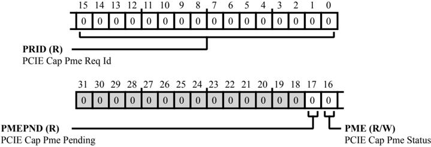

Table 29-207: PCIE\_RC\_STAT\_[n] Register Fields

| Bit No. (Access)   | Bit Name   | Description/Enumeration                                                                                                                                                                                                                                                                                                                                                         |
|--------------------|------------|---------------------------------------------------------------------------------------------------------------------------------------------------------------------------------------------------------------------------------------------------------------------------------------------------------------------------------------------------------------------------------|
| 17 (R/NW)          | PMEPND     | PCIE Cap Pme Pending. The PCIE_RC_STAT_[n].PMEPND bit indicates that another PME is pending when the PME Status bit is Set. When the PME Status bit is cleared by software; the PME is delivered by hardware by setting the PME Status bit again and updating the PME Requester ID field appropriately. The PME Pending bit is cleared by hardware if no more PMEs are pending. |
| 16 (R/W)           | PME        | PCIE Cap Pme Status. The PCIE_RC_STAT_[n].PME bit indicates that PME was asserted by the PME Requester indicated in the PME Requester ID field. Subsequent PMEs are kept pend- ing until the status register is cleared by software by writing a 1. Default value of this bit is 0.                                                                                             |
| 15:0 (R/NW)        | PRID       | PCIE Cap Pme Req Id. The PCIE_RC_STAT_[n].PRID bit field indicates the PCI Requester ID of the last PME Requester. This field is only valid when the PME Status bit is Set.                                                                                                                                                                                                     |

## Latency Timer Register

The PCIE\_RC\_TMRLAT\_[n] register provides the primary, secondary and subordinate bus numbers and the latency timer value.

Figure 29-199: PCIE\_RC\_TMRLAT\_[n] Register Diagram

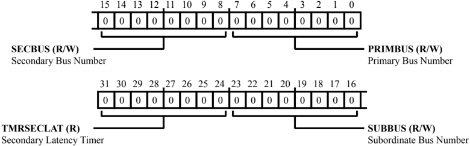

Table 29-208: PCIE\_RC\_TMRLAT\_[n] Register Fields

| Bit No. (Access)   | Bit Name   | Description/Enumeration   |
|--------------------|------------|---------------------------|
| 31:24 (R/NW)       | TMRSECLAT  | Secondary Latency Timer.  |
| 23:16 (R/W)        | SUBBUS     | Subordinate Bus Number.   |
| 15:8 (R/W)         | SECBUS     | Secondary Bus Number.     |
| 7:0 (R/W)          | PRIMBUS    | Primary Bus Number.       |

## Reset and Clock Control Register

The PCIE\_RSCK\_CTL register contains bits that control various reset and clocking options.

Figure 29-200: PCIE\_RSCK\_CTL Register Diagram

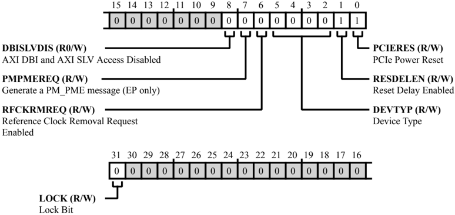

Table 29-209: PCIE\_RSCK\_CTL Register Fields

| Bit No. (Access)   | Bit Name   | Description/Enumeration                  | Description/Enumeration                        |
|--------------------|------------|------------------------------------------|------------------------------------------------|
| 31                 | LOCK       | Lock Bit.                                | Lock Bit.                                      |
| (R/W)              |            | 0                                        | Register is not locked                         |
|                    |            | 1                                        | Register is locked                             |
| 8                  | DBISLVDIS  | AXI DBI and AXI SLV Access Disabled.     | AXI DBI and AXI SLV Access Disabled.           |
| (R0/W)             |            |                                          |                                                |
| 7                  | PMPMEREQ   | Generate a PM_PME message (EP only).     | Generate a PM_PME message (EP only).           |
| (R/W)              |            |                                          |                                                |
| 6                  | RFCKRMREQ  | Reference Clock Removal Request Enabled. | Reference Clock Removal Request Enabled.       |
| (R/W)              |            | 0                                        | Request to remove the reference clock disabled |
|                    |            | 1                                        | Request to remove the reference clock enabled  |
| 5:2                | DEVTYP     | Device Type.                             | Device Type.                                   |
| (R/W)              |            | 0                                        | PCIe Endpoint                                  |
|                    |            | 4                                        | PCIe Root Complex                              |
| 1                  | RESDELEN   | Reset Delay Enabled.                     | Reset Delay Enabled.                           |
| (R/W)              |            | 0                                        | RSCKPHY_SYSRESb de-assertion is not delayed    |
|                    |            | 1                                        | RSCKPHY_SYSRESb de-assertion is delayed        |

Table 29-209: PCIE\_RSCK\_CTL Register Fields (Continued)

| Bit No. (Access)   | Bit Name   | Description/Enumeration            |
|--------------------|------------|------------------------------------|
| 0 PCIERES          | PCIe Power | Reset.                             |
| (R/W)              |            | 0 PCIe Power Reset is not asserted |
|                    |            | 1 PCIe Power Reset is asserted     |

## Reset and Clock Status

Figure 29-201: PCIE\_RSCK\_STAT Register Diagram

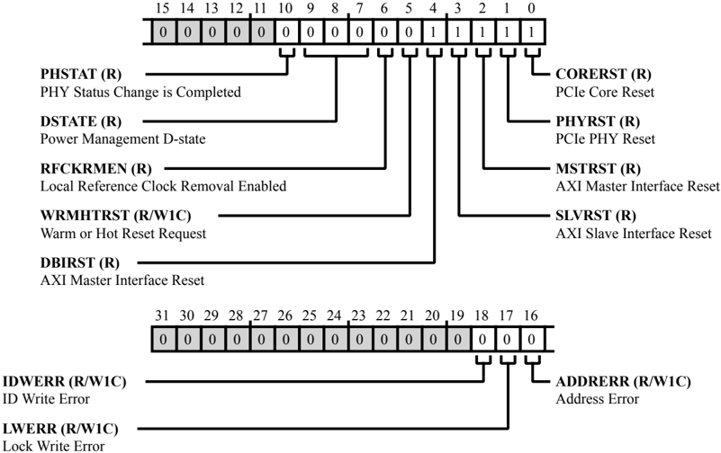

Table 29-210: PCIE\_RSCK\_STAT Register Fields

| Bit No. (Access)   | Bit Name   | Description/Enumeration                                                                                                                       |
|--------------------|------------|-----------------------------------------------------------------------------------------------------------------------------------------------|
| 18                 | IDWERR     | ID Write Error.                                                                                                                               |
| 17 (R/W1C)         | LWERR      | Lock Write Error. 0 No Lock Write Error 1 Lock Write Error                                                                                    |
| 16 (R/W1C)         | ADDRERR    | Address Error. 0 No Error                                                                                                                     |
| 10 (R/NW)          | PHSTAT     | 1 o Accesses to an unimplemented address, writes to Read Only registers, different than single 32-bit aligned PHY Status Change is Completed. |
| 9:7                | DSTATE     | Power Management D-state.                                                                                                                     |
| (R/NW)             |            |                                                                                                                                               |

Table 29-210: PCIE\_RSCK\_STAT Register Fields (Continued)

| Bit No. (Access)   | Bit Name   |                                        | Description/Enumeration                |
|--------------------|------------|----------------------------------------|----------------------------------------|
|                    |            | 0                                      | D0 Power State                         |
|                    |            | 1                                      | D1 Power State                         |
|                    |            | 2                                      | D2 Power State                         |
|                    |            | 3                                      | D3 Power State                         |
|                    |            | 4                                      | D0 Uninitialized                       |
| 6                  | RFCKRMEN   | Local Reference Clock Removal Enabled. | Local Reference Clock Removal Enabled. |
| (R/NW)             |            | 0                                      | Local Reference Clock is needed        |
|                    |            | 1                                      | Local Reference Clock can be removed   |
| 5                  | WRMHTRST   | Warm or Hot Reset Request.             | Warm or Hot Reset Request.             |
| (R/W1C)            |            | 0                                      | No Reset Request                       |
|                    |            | 1                                      | PCIe_DM_CORE issued a Reset Request    |
| 4                  | DBIRST     | AXI Master Interface Reset.            | AXI Master Interface Reset.            |
| (R/NW)             |            | 0                                      | The AXI DBI IF is out of Reset         |
|                    |            | 1                                      | The AXI DBI IF is Reset                |
| 3                  | SLVRST     | AXI Slave Interface Reset.             | AXI Slave Interface Reset.             |
| (R/NW)             |            | 0                                      | The AXI Slave IF is out of Reset       |
|                    |            | 1                                      | The AXI Slave IF is Reset              |
| 2                  | MSTRST     | AXI Master Interface Reset.            | AXI Master Interface Reset.            |
| (R/NW)             |            | 0                                      | The AXI Master IF is out of Reset      |
|                    |            | 1                                      | The AXI Master IF is Reset             |
| 1                  | PHYRST     | PCIe PHY Reset.                        | PCIe PHY Reset.                        |
| (R/NW)             |            | 0                                      | The PCIe PHY is out of Reset           |
|                    |            | 1                                      | The PCIe PHY is Reset                  |
| 0                  | CORERST    | PCIe Core Reset.                       | PCIe Core Reset.                       |
| (R/NW)             |            | 0                                      | The PCIe Core is out of reset          |
|                    |            | 1                                      | The PCIe Core is Reset                 |

## Symbol Timer Filter 1 Off

Bits [31:16] of the PCIE\_SYM\_TMRFILT1\_[n] register are the Mask RADM Filtering and Error Handling Rules for Mask 1. There are several mask bits to turn off the filtering and error handling rules (For more details, see "Receive Filtering". In each case, 0 applies the associated filtering rule and 1 masks the associated filtering rule. Default is DEFAULT\_FILTER\_MSK\_1.

Figure 29-202: PCIE\_SYM\_TMRFILT1\_[n] Register Diagram

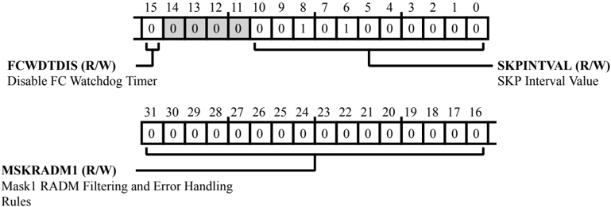

Table 29-211: PCIE\_SYM\_TMRFILT1\_[n] Register Fields

| Bit No. (Access)   | Bit Name   | Description/Enumeration                                                                                                                                                                                                                                                                                                                                                                                                                                                                                                                                                                                                                                                                                                                                                              |
|--------------------|------------|--------------------------------------------------------------------------------------------------------------------------------------------------------------------------------------------------------------------------------------------------------------------------------------------------------------------------------------------------------------------------------------------------------------------------------------------------------------------------------------------------------------------------------------------------------------------------------------------------------------------------------------------------------------------------------------------------------------------------------------------------------------------------------------|
| 31:16 (R/W)        | MSKRADM1   | Mask1 RADM Filtering and Error Handling Rules. The PCIE_SYM_TMRFILT1_[n].MSKRADM1 bit field mask bits turn off the fil- tering and error handling rules. In each case, 0 applies the associated filtering rule and 1 masks the associated filtering rule.                                                                                                                                                                                                                                                                                                                                                                                                                                                                                                                            |
| 15 (R/W)           | FCWDTDIS   | Disable FC Watchdog Timer. The PCIE_SYM_TMRFILT1_[n].FCWDTDIS bit disables the FC Watchdog Timer. This register field is sticky.                                                                                                                                                                                                                                                                                                                                                                                                                                                                                                                                                                                                                                                     |
| 10:0 (R/W)         | SKPINTVAL  | SKP Interval Value. The PCIE_SYM_TMRFILT1_[n].SKPINTVAL bit field sets the number of sym- bol times to wait between transmitting SKP ordered sets. Note that the core actually waits the number of symbol times in this register plus 1 between transmitting SKP or- dered sets. The application must program this register accordingly. For example, if 1536 is programmed into this bit field (in a 250 MHz core), then the core actually transmits SKP ordered sets once every 1537 symbol times. The value programmed to this register is actually clock ticks and not symbol times. In a 125 MHz core, programming the value programmed to this register should be scaled down by a factor of 2 (because 1 clock tick = 2 symbol times in this case). This bit field is sticky. |

## Timer Control and Max Function Number Register

The PCIE\_TMRCTL\_MFN\_[n] register provides bits that configure and control the timer and requests targeted at function numbers.

Figure 29-203: PCIE\_TMRCTL\_MFN\_[n] Register Diagram

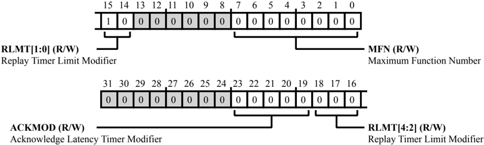

Table 29-212: PCIE\_TMRCTL\_MFN\_[n] Register Fields

| Bit No. (Access)   | Bit Name   | Description/Enumeration                                                                                                                                                                                                                                                                                                                                                                                                                            |
|--------------------|------------|----------------------------------------------------------------------------------------------------------------------------------------------------------------------------------------------------------------------------------------------------------------------------------------------------------------------------------------------------------------------------------------------------------------------------------------------------|
| 23:19 (R/W)        | ACKMOD     | Acknowledge Latency Timer Modifier. The PCIE_TMRCTL_MFN_[n].ACKMOD bit field increases the timer value for the Ack latency timer in increments of 64 clock cycles. A value of 0 represents no modifi- cation to the timer value. <br><i>Note</i>: This register field is sticky.                                                                                                                                                                   |
| 18:14 (R/W)        | RLMT       | Replay Timer Limit Modifier. The PCIE_TMRCTL_MFN_[n].RLMT bit field increases the time-out value for the replay timer in increments of 64 clock cycles at Gen1 or Gen2 speed, and in incre- ments of 256 clock cycles at Gen3 speed. A value of 0 represents no modification to the timer limit. At Gen3 speed, the core automatically changes the value of this field to DEFAULT_GEN3_REPLAY_ADJ. <br><i>Note</i>: This register field is sticky. |
| 7:0 (R/W)          | MFN        | Maximum Function Number. The PCIE_TMRCTL_MFN_[n].MFN bit field configures requests targeted at func- tion numbers. Value higher than this are returned with UR (unsupported request). This register field is sticky.                                                                                                                                                                                                                               |

## Transmit Completion FC Credit Status Register

The PCIE\_TXCOMP\_FCCSTAT\_[n] register reports the completion data credits and the completion header credits advertised by the receiver at the other end of the link, updated with each UpdateFC DLLP .

Figure 29-204: PCIE\_TXCOMP\_FCCSTAT\_[n] Register Diagram

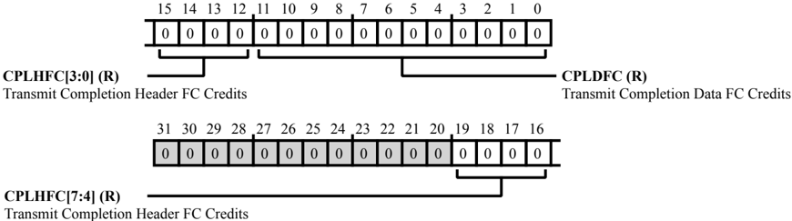

Table 29-213: PCIE\_TXCOMP\_FCCSTAT\_[n] Register Fields

| Bit No. (Access)   | Bit Name   | Description/Enumeration                                                                                                                                                                                                                                                                                                                                                                                                                                                                 |
|--------------------|------------|-----------------------------------------------------------------------------------------------------------------------------------------------------------------------------------------------------------------------------------------------------------------------------------------------------------------------------------------------------------------------------------------------------------------------------------------------------------------------------------------|
| 19:12 (R/NW)       | CPLHFC     | Transmit Completion Header FC Credits. The PCIE_TXCOMP_FCCSTAT_[n].CPLHFC bit field reports the Completion Header credits advertised by the receiver at the other end of the link, updated with each UpdateFC DLLP. Default value depends on the number of advertised credits for header and data [12'b0, xtlh_xadm_cplh_cdts, xtlh_xadm_cpld_cdts]; When the number of advertised completion credits (both header and data) are infinite, then the default is [12'b0, 8'hFF, 12'hFFF]. |
| 11:0 (R/NW)        | CPLDFC     | Transmit Completion Data FC Credits. The PCIE_TXCOMP_FCCSTAT_[n].CPLDFC bit field reports the completion data credits advertised by the receiver at the other end of the link, updated with each UpdateFC DLLP. Default value depends on the number of advertised credits for head- er and data [12'b0, xtlh_xadm_cplh_cdts, xtlh_xadm_cpld_cdts]; When the number of advertised completion credits (both header and data) are infinite, then the default is [12'b0, 8'hFF, 12'hFFF].   |

## Transmit Non-Posted FC Credit Status Register

The PCIE\_TX\_NPST\_FCCSTAT\_[n] register reports the non-posted data credits and the non-posted header credits advertised by the receiver at the other end of the link, updated with each UpdateFC DLLP .

Figure 29-205: PCIE\_TX\_NPST\_FCCSTAT\_[n] Register Diagram

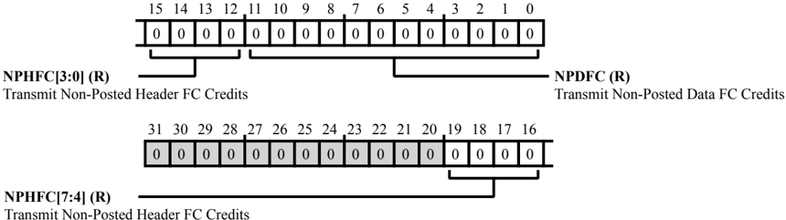

Table 29-214: PCIE\_TX\_NPST\_FCCSTAT\_[n] Register Fields

| Bit No. (Access)   | Bit Name   | Description/Enumeration                                                                                                                                                                                                                                                                                                                                                                                                                                                                 |
|--------------------|------------|-----------------------------------------------------------------------------------------------------------------------------------------------------------------------------------------------------------------------------------------------------------------------------------------------------------------------------------------------------------------------------------------------------------------------------------------------------------------------------------------|
| 19:12 (R/NW)       | NPHFC      | Transmit Non-Posted Header FC Credits. The PCIE_TX_NPST_FCCSTAT_[n].NPHFC bit field reports the non-posted header credits advertised by the receiver at the other end of the link, updated with each UpdateFC DLLP. Default value depends on the number of advertised credits for head- er and data [12'b0, xtlh_xadm_nph_cdts, xtlh_xadm_npd_cdts]; When the number of advertised completion credits (both header and data) are infinite, then the default is [12'b0, 8'hFF, 12'hFFF]. |
| 11:0 (R/NW)        | NPDFC      | Transmit Non-Posted Data FC Credits. The PCIE_TX_NPST_FCCSTAT_[n].NPDFC bit field reports the non-posted data credits advertised by the receiver at the other end of the link, updated with each UpdateFC DLLP. Default value depends on the number of advertised credits for head- er and data [12'b0, xtlh_xadm_nph_cdts, xtlh_xadm_npd_cdts]; When the number of advertised completion credits (both header and data) are infinite, then the default is [12'b0, 8'hFF, 12'hFFF].     |

## Transmit Posted FC Credit Status Register

The PCIE\_TX\_PST\_FCCSTAT\_[n] register reports the posted data credits and the posted header credits advertised by the receiver at the other end of the link, updated with each UpdateFC DLLP .

Figure 29-206: PCIE\_TX\_PST\_FCCSTAT\_[n] Register Diagram

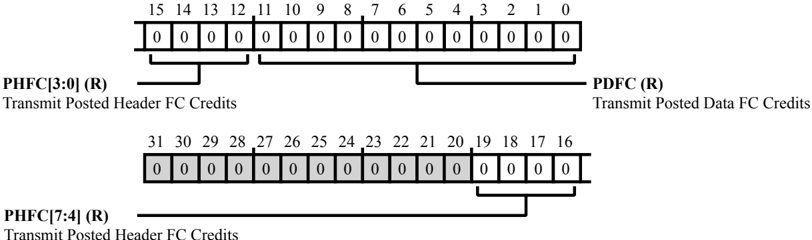

Table 29-215: PCIE\_TX\_PST\_FCCSTAT\_[n] Register Fields

| Bit No. (Access)   | Bit Name   | Description/Enumeration                                                                                                                                                                                                                                                                                                                                                                                                                                                           |
|--------------------|------------|-----------------------------------------------------------------------------------------------------------------------------------------------------------------------------------------------------------------------------------------------------------------------------------------------------------------------------------------------------------------------------------------------------------------------------------------------------------------------------------|
| 19:12 (R/NW)       | PHFC       | Transmit Posted Header FC Credits. The PCIE_TX_PST_FCCSTAT_[n].PHFC bit field reports the posted header credits advertised by the receiver at the other end of the link, updated with each Upda- teFC DLLP. The default value depends on the number of advertised credits for header and data [12'b0, xtlh_xadm_ph_cdts, xtlh_xadm_pd_cdts]; When the number of ad- vertised completion credits (both header and data) are infinite, then the default is [12'b0, 8'hFF, 12'hFFF]. |
| 11:0 (R/NW)        | PDFC       | Transmit Posted Data FC Credits. The PCIE_TX_PST_FCCSTAT_[n].PDFC bit field reports the posted data cred- its advertised by the receiver at the other end of the link, updated with each UpdateFC DLLP. The default value depends on the number of advertised credits for header and data [12'b0, xtlh_xadm_ph_cdts, xtlh_xadm_pd_cdts]. When the number of adver- tised completion credits (both header and data) are infinite, then the default is [12'b0, 8'hFF, 12'hFFF].     |

## Uncorrectable Error Mask Register

The PCIE\_UNCOR\_ERRMSK\_[n] register controls reporting of individual errors by the device Function to the PCI Express Root Complex via a PCI Express error message. A masked error (indicated by a set bit) is not recorded or reported in the Header Log register. Also the First Error Pointer is not updated or reported to the PCI Express Root Complex by this function. There is a mask bit per error bit of the Uncorrectable Error Status register ( PCIE\_UNCOR\_ERRSTAT\_[n] ). Register fields for bits not implemented by the Function are set to 0.

Figure 29-207: PCIE\_UNCOR\_ERRMSK\_[n] Register Diagram

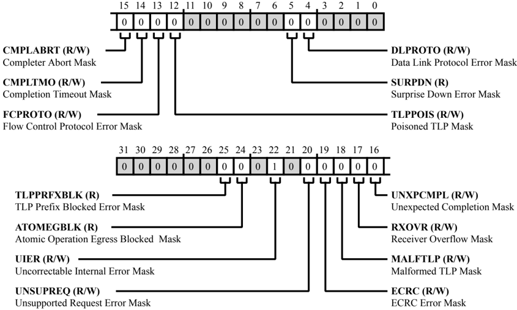

Table 29-216: PCIE\_UNCOR\_ERRMSK\_[n] Register Fields

| Bit No. (Access)   | Bit Name   | Description/Enumeration                                                                                                                                                       |
|--------------------|------------|-------------------------------------------------------------------------------------------------------------------------------------------------------------------------------|
| 25 (R/NW)          | TLPPRFXBLK | TLP Prefix Blocked Error Mask. The PCIE_UNCOR_ERRMSK_[n].TLPPRFXBLK bit indicates whether the LP Prefix Blocked Error Severity error is masked (=1) or unmasked (=0).         |
| 24 (R/NW)          | ATOMEGBLK  | Atomic Operation Egress Blocked Mask. The PCIE_UNCOR_ERRMSK_[n].ATOMEGBLK bit indicates whether the Atomi- cOp Egress Blocked Severity error is masked (=1) or unmasked (=0). |
| 22 (R/W)           | UIER       | Uncorrectable Internal Error Mask. The PCIE_UNCOR_ERRMSK_[n].UIER bit indicates whether the Uncorrectable Internal Error Severity error is masked (=1) or unmasked (=0).      |

Table 29-216: PCIE\_UNCOR\_ERRMSK\_[n] Register Fields (Continued)

| Bit No. (Access)   | Bit Name   | Description/Enumeration                                                                                                                                                     |
|--------------------|------------|-----------------------------------------------------------------------------------------------------------------------------------------------------------------------------|
| 20 (R/W)           | UNSUPREQ   | Unsupported Request Error Mask. The PCIE_UNCOR_ERRMSK_[n].UNSUPREQ bit indicates whether the Unsup- ported Request Error Severity error is masked (=1) or unmasked (=0).    |
| 19 (R/W)           | ECRC       | ECRC Error Mask. The PCIE_UNCOR_ERRMSK_[n].ECRC bit indicates whether the ECRC Error Severity error is masked (=1) or unmasked (=0).                                        |
| 18 (R/W)           | MALFTLP    | Malformed TLP Mask. The PCIE_UNCOR_ERRMSK_[n].MALFTLP bit indicates whether the Mal- formed TLP Severity error is masked (=1) or unmasked (=0).                             |
| 17 (R/W)           | RXOVR      | Receiver Overflow Mask. The PCIE_UNCOR_ERRMSK_[n].RXOVR bit indicates whether the Receiver Overflow Error Severity error is masked (=1) or unmasked (=0).                   |
| 16 (R/W)           | UNXPCMPL   | Unexpected Completion Mask. The PCIE_UNCOR_ERRMSK_[n].UNXPCMPL bit indicates whether the Unex- pected Completion Error Severity error is masked (=1) or unmasked (=0).      |
| 15 (R/W)           | CMPLABRT   | Completer Abort Mask. The PCIE_UNCOR_ERRMSK_[n].CMPLABRT bit indicates whether the Complet- er Abort Error Severity error is masked (=1) or unmasked (=0).                  |
| 14 (R/W)           | CMPLTMO    | Completion Timeout Mask. The PCIE_UNCOR_ERRMSK_[n].CMPLTMO bit indicates whether the Comple- tion Timeout Error Severity error is masked (=1) or unmasked (=0).             |
| 13 (R/W)           | FCPROTO    | Flow Control Protocol Error Mask. The PCIE_UNCOR_ERRMSK_[n].FCPROTO bit indicates whether the Flow Con- trol Protocol Error Severity error is masked (=1) or unmasked (=0). |
| 12 (R/W)           | TLPPOIS    | Poisoned TLP Mask. The PCIE_UNCOR_ERRMSK_[n].TLPPOIS bit indicates whether the Poisoned TLP Severity error is masked (=1) or unmasked (=0).                                 |
| 5 (R/NW)           | SURPDN     | Surprise Down Error Mask. The PCIE_UNCOR_ERRMSK_[n].SURPDN bit indicates whether the Surprise Down Error Severity error is masked (=1) or unmasked (=0).                    |
| 4 (R/W)            | DLPROTO    | Data Link Protocol Error Mask. The PCIE_UNCOR_ERRMSK_[n].DLPROTO bit indicates whether the Data Link Protocol Error Severity error is masked (=1) or unmasked (=0).         |

## Uncorrectable Error Severity Register

The PCIE\_UNCOR\_ERRSEV\_[n] register controls whether an individual error is reported as a Nonfatal or Fatal error. An error is reported as fatal when the corresponding error bit in the severity register is set (=1). If the bit is clear (=0), the corresponding error is considered non-fatal. Register fields for bits not implemented by the Function are hardwired to an implementation specific value.

Figure 29-208: PCIE\_UNCOR\_ERRSEV\_[n] Register Diagram

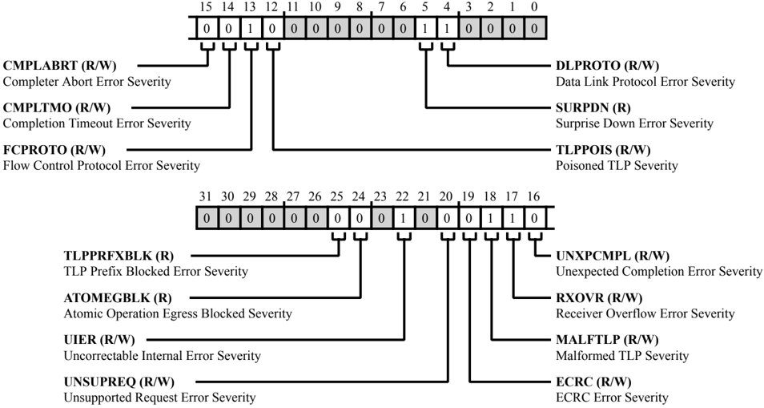

Table 29-217: PCIE\_UNCOR\_ERRSEV\_[n] Register Fields

| Bit No. (Access)   | Bit Name   | Description/Enumeration                                                                                                                                                                |
|--------------------|------------|----------------------------------------------------------------------------------------------------------------------------------------------------------------------------------------|
| 25 (R/NW)          | TLPPRFXBLK | TLP Prefix Blocked Error Severity. The PCIE_UNCOR_ERRSEV_[n].TLPPRFXBLK bit indicates that the TLP Pre- fix Blocked Error Severity error is fatal (=1) or non-fatal (=0) non-fatal.    |
| 24 (R/NW)          | ATOMEGBLK  | Atomic Operation Egress Blocked Severity. The PCIE_UNCOR_ERRSEV_[n].ATOMEGBLK bit indicates that the AtomicOp Egress Blocked Severity error is fatal (=1) or non-fatal (=0) non-fatal. |
| 22 (R/W)           | UIER       | Uncorrectable Internal Error Severity. The PCIE_UNCOR_ERRSEV_[n].UIER bit indicates that the Uncorrectable In- ternal Error Severity error is fatal (=1) or non-fatal (=0) non-fatal.  |

Table 29-217: PCIE\_UNCOR\_ERRSEV\_[n] Register Fields (Continued)

| Bit No. (Access)   | Bit Name   | Description/Enumeration                                                                                                                                                               |
|--------------------|------------|---------------------------------------------------------------------------------------------------------------------------------------------------------------------------------------|
| 20 (R/W)           | UNSUPREQ   | Unsupported Request Error Severity. The PCIE_UNCOR_ERRSEV_[n].UNSUPREQ bit indicates that the Unsupported Request Error Severity error is fatal (=1) or non-fatal (=0) non-fatal.     |
| 19 (R/W)           | ECRC       | ECRC Error Severity. The PCIE_UNCOR_ERRSEV_[n].ECRC bit indicates that the ECRC Error Se- verity error is fatal (=1) or non-fatal (=0) non-fatal.                                     |
| 18 (R/W)           | MALFTLP    | Malformed TLP Severity. The PCIE_UNCOR_ERRSEV_[n].MALFTLP bit indicates that the Malformed TLP Severity error is fatal (=1) or non-fatal (=0) non-fatal.                              |
| 17 (R/W)           | RXOVR      | Receiver Overflow Error Severity. The PCIE_UNCOR_ERRSEV_[n].RXOVR bit indicates that the Receiver Overflow Error Severity error is fatal (=1) or non-fatal (=0) non-fatal.            |
| 16 (R/W)           | UNXPCMPL   | Unexpected Completion Error Severity. The PCIE_UNCOR_ERRSEV_[n].UNXPCMPL bit indicates that the Unexpected Completion Error Severity error is fatal (=1) or non-fatal (=0) non-fatal. |
| 15 (R/W)           | CMPLABRT   | Completer Abort Error Severity. The PCIE_UNCOR_ERRSEV_[n].CMPLABRT bit indicates that the Completer Abort Error Severity error is fatal (=1) or non-fatal (=0) non-fatal.             |
| 14 (R/W)           | CMPLTMO    | Completion Timeout Error Severity. The PCIE_UNCOR_ERRSEV_[n].CMPLTMO bit indicates that the Completion Timeout Error Severity error is fatal (=1) or non-fatal (=0) non-fatal.        |
| 13 (R/W)           | FCPROTO    | Flow Control Protocol Error Severity. The PCIE_UNCOR_ERRSEV_[n].FCPROTO bit indicates that the Flow Control Protocol Error Severity error is fatal (=1) or non-fatal (=0) non-fatal.  |
| 12 (R/W)           | TLPPOIS    | Poisoned TLP Severity. The PCIE_UNCOR_ERRSEV_[n].TLPPOIS bit indicates that the Poisoned TLP Severity error is fatal (=1) or non-fatal (=0) non-fatal.                                |
| 5 (R/NW)           | SURPDN     | Surprise Down Error Severity. The PCIE_UNCOR_ERRSEV_[n].SURPDN bit indicates that the Surprise Down Error Severity error is fatal (=1) or non-fatal (=0) non-fatal.                   |
| 4 (R/W)            | DLPROTO    | Data Link Protocol Error Severity. The PCIE_UNCOR_ERRSEV_[n].DLPROTO bit indicates that the Data Link Pro- tocol Error Severity error is fatal (=1) or non-fatal (=0) non-fatal.      |

## Uncorrectable Error Status Register

The PCIE\_UNCOR\_ERRSTAT\_[n] register indicates error detection status of individual errors on a PCI Express device Function. An individual error status bit that is set (=1) indicates that a particular error was detected. Software may clear an error status by writing a 1 to the respective bit. Register bits not implemented by the Function are set to 0.

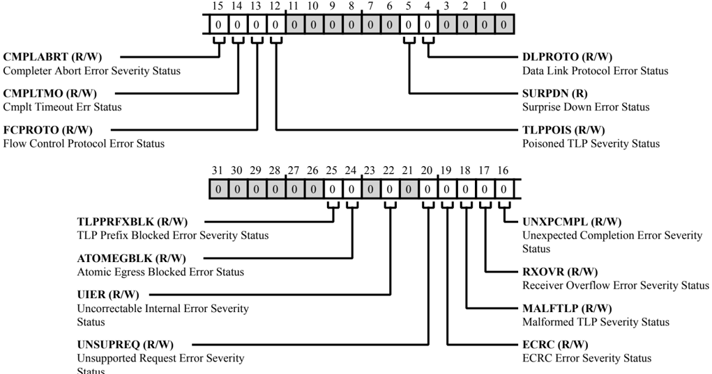

Status

Figure 29-209: PCIE\_UNCOR\_ERRSTAT\_[n] Register Diagram

Table 29-218: PCIE\_UNCOR\_ERRSTAT\_[n] Register Fields

| Bit No. (Access)   | Bit Name   | Description/Enumeration                                                                                                                                                               |
|--------------------|------------|---------------------------------------------------------------------------------------------------------------------------------------------------------------------------------------|
| 25 (R/W)           | TLPPRFXBLK | TLP Prefix Blocked Error Severity Status. The PCIE_UNCOR_ERRSTAT_[n].TLPPRFXBLK bit indicates that a TLP Prefix Blocked Error Severity error occurred (=1) or did not occur (=0).     |
| 24 (R/W)           | ATOMEGBLK  | Atomic Egress Blocked Error Status. The PCIE_UNCOR_ERRSTAT_[n].ATOMEGBLK bit indicates that a AtomicOp Egress Blocked Severity error occurred (=1) or did not occur (=0).             |
| 22 (R/W)           | UIER       | Uncorrectable Internal Error Severity Status. The PCIE_UNCOR_ERRSTAT_[n].UIER bit indicates that a Uncorrectable Inter- nal Error Severity error occurred (=1) or did not occur (=0). |

Table 29-218: PCIE\_UNCOR\_ERRSTAT\_[n] Register Fields (Continued)

| Bit No. (Access)   | Bit Name   | Description/Enumeration                                                                                                                                                         |
|--------------------|------------|---------------------------------------------------------------------------------------------------------------------------------------------------------------------------------|
| 20 (R/W)           | UNSUPREQ   | Unsupported Request Error Severity Status. The PCIE_UNCOR_ERRSTAT_[n].UNSUPREQ bit indicates that a Completer Abort Error Severity error occurred (=1) or did not occur (=0).   |
| 19 (R/W)           | ECRC       | ECRC Error Severity Status. The PCIE_UNCOR_ERRSTAT_[n].ECRC bit indicates that a Completer Abort Error Severity error occurred (=1) or did not occur (=0).                      |
| 18 (R/W)           | MALFTLP    | Malformed TLP Severity Status. The PCIE_UNCOR_ERRSTAT_[n].MALFTLP bit indicates that a Completer Abort Error Severity error occurred (=1) or did not occur (=0).                |
| 17 (R/W)           | RXOVR      | Receiver Overflow Error Severity Status. The PCIE_UNCOR_ERRSTAT_[n].RXOVR bit indicates that a Completer Abort Error Severity error occurred (=1) or did not occur (=0).        |
| 16 (R/W)           | UNXPCMPL   | Unexpected Completion Error Severity Status. The PCIE_UNCOR_ERRSTAT_[n].UNXPCMPL bit indicates that a Completer Abort Error Severity error occurred (=1) or did not occur (=0). |
| 15 (R/W)           | CMPLABRT   | Completer Abort Error Severity Status. The PCIE_UNCOR_ERRSTAT_[n].CMPLABRT bit indicates that a Completer Abort Error Severity error occurred (=1) or did not occur (=0).       |
| 14 (R/W)           | CMPLTMO    | Cmplt Timeout Err Status. The PCIE_UNCOR_ERRSTAT_[n].CMPLTMO bit indicates that a Completion Timeout Error Severity error occurred (=1) or did not occur (=0).                  |
| 13 (R/W)           | FCPROTO    | Flow Control Protocol Error Status. The PCIE_UNCOR_ERRSTAT_[n].FCPROTO bit indicates that a Flow Control Protocol Error Severity error occurred (=1) or did not occur (=0).     |
| 12 (R/W)           | TLPPOIS    | Poisoned TLP Severity Status. The PCIE_UNCOR_ERRSTAT_[n].TLPPOIS bit indicates that a Surprise Down Error Severity error occurred (=1) or did not occur (=0).                   |
| 5 (R/NW)           | SURPDN     | Surprise Down Error Status. The PCIE_UNCOR_ERRSTAT_[n].SURPDN bit indicates that a Surprise Down Error Severity error occurred (=1) or did not occur (=0).                      |
| 4 (R/W)            | DLPROTO    | Data Link Protocol Error Status. The PCIE_UNCOR_ERRSTAT_[n].DLPROTO bit indicates that a Data Link Pro- tocol Error Severity error occurred (=1) or did not occur (=0).         |

## Segmented-Buffer VC0 Completion Receive Queue Control Register

The PCIE\_VC0\_COMP\_RXQCTL\_[n] register reports VC0 completion data and header credits. Writing to the PCIE\_VC0\_COMP\_RXQCTL\_[n] register is only possible when CX\_DYNAMIC\_FC\_CREDIT =1.

Figure 29-210: PCIE\_VC0\_COMP\_RXQCTL\_[n] Register Diagram

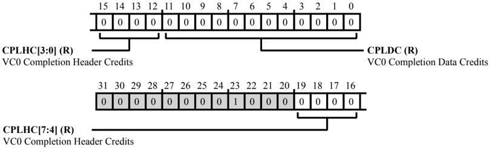

Table 29-219: PCIE\_VC0\_COMP\_RXQCTL\_[n] Register Fields

| Bit No. (Access)   | Bit Name   | Description/Enumeration                                                                                                                                                                                                                                                                           |
|--------------------|------------|---------------------------------------------------------------------------------------------------------------------------------------------------------------------------------------------------------------------------------------------------------------------------------------------------|
| 19:12 (R/NW)       | CPLHC      | VC0 Completion Header Credits. The PCIE_VC0_COMP_RXQCTL_[n].CPLHC bit field indicates the number of initial Completion header credits for VC0, used only in the segmented-buffer configu- ration. The access attributes of this field are - Wire: No access. - Dbi: R (sticky) - Dbi2: R (sticky) |
| 11:0 (R/NW)        | CPLDC      | VC0 Completion Data Credits. The PCIE_VC0_COMP_RXQCTL_[n].CPLDC bit field indicates the number of initial Completion data credits for VC0, used only in the segmented-buffer configura- tion. he access attributes of this field are - Wire: No access. - Dbi: R (sticky) - Dbi2: R (sticky)      |

## Segmented-Buffer VC0 Non-Posted Receive Queue Control Register

The PCIE\_VC0\_NPST\_RXQCTL\_[n] register reports VC0 non-posted data and header Credits. Writing to the PCIE\_VC0\_NPST\_RXQCTL\_[n] register is only possible when CX\_DYNAMIC\_FC\_CREDIT =1.

Figure 29-211: PCIE\_VC0\_NPST\_RXQCTL\_[n] Register Diagram

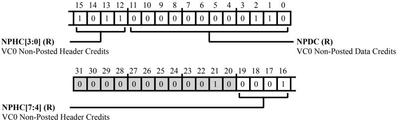

Table 29-220: PCIE\_VC0\_NPST\_RXQCTL\_[n] Register Fields

| Bit No. (Access)   | Bit Name   | Description/Enumeration                                                                                                                                                                                                                                                                            |
|--------------------|------------|----------------------------------------------------------------------------------------------------------------------------------------------------------------------------------------------------------------------------------------------------------------------------------------------------|
| 19:12 (R/NW)       | NPHC       | VC0 Non-Posted Header Credits. The PCIE_VC0_NPST_RXQCTL_[n].NPHC bit field indicates the number of ini- tial non-posted header credits for VC0, used only in the segmented-buffer configura- tion. The access attributes of this field are - Wire: R (sticky) - Dbi: R (sticky) - Dbi2: R (sticky) |
| 11:0 (R/NW)        | NPDC       | VC0 Non-Posted Data Credits. The PCIE_VC0_NPST_RXQCTL_[n].NPDC bit field indicates the number of ini- tial non-posted data credits for VC0, used only in the segmented-buffer configuration. The access attributes of this field are - Wire: R (sticky) - Dbi: R (sticky) - Dbi2: R (sticky)       |

## Segmented-Buffer VC0 Posted Receive Queue Control Register

The PCIE\_VC0\_PST\_RXQCTL\_[n] register reports VC0 posted data and header credits. Writing to the PCIE\_VC0\_PST\_RXQCTL\_[n] register is only possible when CX\_DYNAMIC\_FC\_CREDIT =1.

Figure 29-212: PCIE\_VC0\_PST\_RXQCTL\_[n] Register Diagram

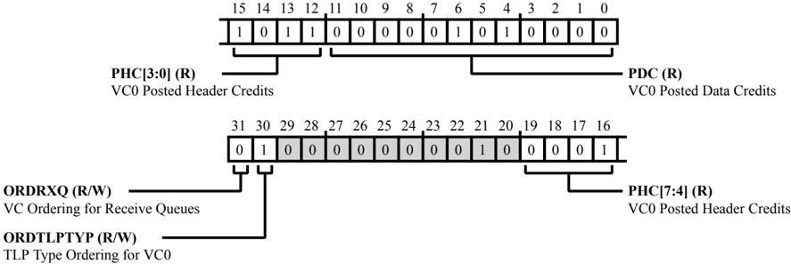

Table 29-221: PCIE\_VC0\_PST\_RXQCTL\_[n] Register Fields

| Bit No. (Access)   | Bit Name   | Description/Enumeration                                                                                                                                                                                 | Description/Enumeration                                                                                                                                                                                 |
|--------------------|------------|---------------------------------------------------------------------------------------------------------------------------------------------------------------------------------------------------------|---------------------------------------------------------------------------------------------------------------------------------------------------------------------------------------------------------|
| 31 (R/W)           | ORDRXQ     | VC Ordering for Receive Queues. The PCIE_VC0_PST_RXQCTL_[n].ORDRXQ bit determines the VC ordering rule for the receive queues, used only in the segmented-buffer configuration. This bit is sticky.     | VC Ordering for Receive Queues. The PCIE_VC0_PST_RXQCTL_[n].ORDRXQ bit determines the VC ordering rule for the receive queues, used only in the segmented-buffer configuration. This bit is sticky.     |
| 31 (R/W)           | ORDRXQ     | 0                                                                                                                                                                                                       | Round robin                                                                                                                                                                                             |
| 31 (R/W)           | ORDRXQ     | 1                                                                                                                                                                                                       | Strict ordering, higher numbered VCs have higher pri- ority                                                                                                                                             |
| 30 (R/W)           | ORDTLPTYP  | TLP Type Ordering for VC0. The PCIE_VC0_PST_RXQCTL_[n].ORDTLPTYP bit determines the TLP type ordering rule for VC0 receive queues, used only in the segmented-buffer configuration. This bit is sticky. | TLP Type Ordering for VC0. The PCIE_VC0_PST_RXQCTL_[n].ORDTLPTYP bit determines the TLP type ordering rule for VC0 receive queues, used only in the segmented-buffer configuration. This bit is sticky. |
| 30 (R/W)           | ORDTLPTYP  | 0                                                                                                                                                                                                       | Strict ordering: posted, completion, then non-posted                                                                                                                                                    |
| 30 (R/W)           | ORDTLPTYP  | 1                                                                                                                                                                                                       | PCIe ordering rules                                                                                                                                                                                     |

Table 29-221: PCIE\_VC0\_PST\_RXQCTL\_[n] Register Fields (Continued)

| Bit No. (Access)   | Bit Name   | Description/Enumeration                                                                                                                                                                                                                                                                |
|--------------------|------------|----------------------------------------------------------------------------------------------------------------------------------------------------------------------------------------------------------------------------------------------------------------------------------------|
| 19:12 (R/NW)       | PHC        | VC0 Posted Header Credits. The PCIE_VC0_PST_RXQCTL_[n].PHC bit field indicates he number of initial posted header credits for VC0, used only in the segmented-buffer configuration. The access attributes of this field are as follows: • Wire: R (sticky) • Dbi: R (sticky) • Dbi2: R |
| 11:0 (R/NW)        | PDC        | VC0 Posted Data Credits. The PCIE_VC0_PST_RXQCTL_[n].PDC bit field indicates the number of initial posted data credits for VC0, used only in the segmented-buffer configuration. The ac- cess attributes of this field are as follows: • Wire: R (sticky) • Dbi: R (sticky) • Dbi2: R  |

## Virtual Channel Transmit Arbitration Register 1

The PCIE\_VC\_TXARB1\_[n] register indicates the weighted round robin arbitration weights for the indicated virtual channels.

Figure 29-213: PCIE\_VC\_TXARB1\_[n] Register Diagram

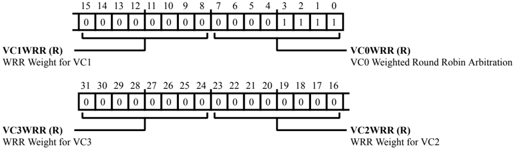

Table 29-222: PCIE\_VC\_TXARB1\_[n] Register Fields

| Bit No. (Access)   | Bit Name   | Description/Enumeration                                                                                                                                                                |
|--------------------|------------|----------------------------------------------------------------------------------------------------------------------------------------------------------------------------------------|
| 31:24 (R/NW)       | VC3WRR     | WRR Weight for VC3. The PCIE_VC_TXARB1_[n].VC3WRR bit field indicates the WRR Weight for VC3. The access attributes of this field are as follows: • Wire: No access • Dbi: R • Dbi2: R |
| 23:16 (R/NW)       | VC2WRR     | WRR Weight for VC2. The PCIE_VC_TXARB1_[n].VC2WRR bit field indicates the WRR Weight for VC2. The access attributes of this field are as follows: • Wire: No access • Dbi: R • Dbi2: R |
| 15:8 (R/NW)        | VC1WRR     | WRR Weight for VC1. The PCIE_VC_TXARB1_[n].VC1WRR bit field indicates the WRR Weight for VC1. The access attributes of this field are as follows: • Wire: No access • Dbi: R • Dbi2: R |

Table 29-222: PCIE\_VC\_TXARB1\_[n] Register Fields (Continued)

| Bit No. (Access)   | Bit Name   | Description/Enumeration                                                                                                                                                                                  |
|--------------------|------------|----------------------------------------------------------------------------------------------------------------------------------------------------------------------------------------------------------|
| 7:0 (R/NW)         | VC0WRR     | VC0 Weighted Round Robin Arbitration. The PCIE_VC_TXARB1_[n].VC0WRR bit field indicates the WRR Weight for VC0. The access attributes of this field are as follows: • Wire: No access • Dbi: R • Dbi2: R |

## Virtual Channel Transmit Arbitration Register 2

The PCIE\_VC\_TXARB2\_[n] register indicates the weighted round robin arbitration weights for the indicated virtual channels.

Figure 29-214: PCIE\_VC\_TXARB2\_[n] Register Diagram

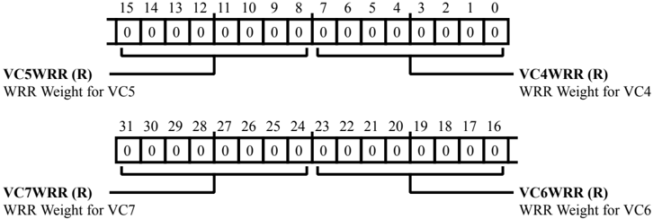

Table 29-223: PCIE\_VC\_TXARB2\_[n] Register Fields

| Bit No. (Access)   | Bit Name   | Description/Enumeration                                                                                                                                                                |
|--------------------|------------|----------------------------------------------------------------------------------------------------------------------------------------------------------------------------------------|
| 31:24 (R/NW)       | VC7WRR     | WRR Weight for VC7. The PCIE_VC_TXARB2_[n].VC7WRR bit field indicates the WRR Weight for VC7. The access attributes of this field are as follows: • Wire: No access • Dbi: R • Dbi2: R |
| 23:16 (R/NW)       | VC6WRR     | WRR Weight for VC6. The PCIE_VC_TXARB2_[n].VC6WRR bit field indicates the WRR Weight for VC6. The access attributes of this field are as follows: • Wire: No access • Dbi: R • Dbi2: R |
| 15:8 (R/NW)        | VC5WRR     | WRR Weight for VC5. The PCIE_VC_TXARB2_[n].VC5WRR bit field indicates the WRR Weight for VC5. The access attributes of this field are as follows: • Wire: No access • Dbi: R • Dbi2: R |

Table 29-223: PCIE\_VC\_TXARB2\_[n] Register Fields (Continued)

| Bit No. (Access)   | Bit Name   | Description/Enumeration                                                                                                                                                                |
|--------------------|------------|----------------------------------------------------------------------------------------------------------------------------------------------------------------------------------------|
| 7:0 (R/NW)         | VC4WRR     | WRR Weight for VC4. The PCIE_VC_TXARB2_[n].VC4WRR bit field indicates the WRR Weight for VC4. The access attributes of this field are as follows: • Wire: No access • Dbi: R • Dbi2: R |

## Vendor Specific DLLP Register

The PCIE\_VEND\_DLLP\_[n] register is used to send a specific PCI Express DLLP .

Figure 29-215: PCIE\_VEND\_DLLP\_[n] Register Diagram

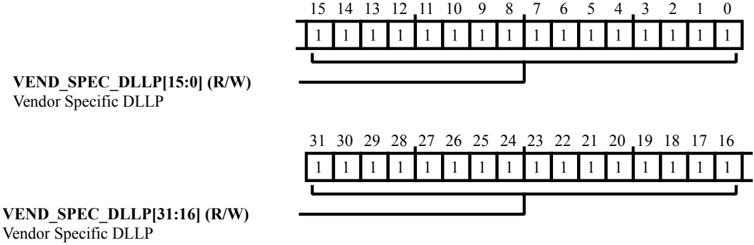

Table 29-224: PCIE\_VEND\_DLLP\_[n] Register Fields

| Bit No. (Access)   | Bit Name       | Description/Enumeration                                                                                                                                                                                                                                                                       |
|--------------------|----------------|-----------------------------------------------------------------------------------------------------------------------------------------------------------------------------------------------------------------------------------------------------------------------------------------------|
| 31:0 (R/W)         | VEND_SPEC_DLLP | Vendor Specific DLLP. The PCIE_VEND_DLLP_[n].VEND_SPEC_DLLP bit field contains a specific PCI Express DLLP. An application writes the 8-bit DLLP type and 24-bits of payload data into this bit field, then sets bit 0 of the Port Link Control Register ( PCIE_PLCTL_[n] ) to send the DLLP. |