## 53    Boot ROM and Booting the Processor

Bootstrapping or booting is the series of events that occur when the system applies power to the processor or when the processor enters a hardware reset state. This section gives an in-depth description of these events and how to integrate an application effectively.

On reset, the processor begins fetching instruction from an internal ROM. The boot code contained within the ROM is designed to facilitate loading an application. The boot code can automatically initialize certain peripherals for communication based on a chosen boot mode, then load an application. For more information on what boot modes are available, see the Boot Modes section. The boot code can efficiently load an entire application, code, and data, into appropriate locations after the development tools repackage the application into a boot stream.

A boot stream is an application or data that the boot-loader tool splits into blocks. A 16-byte header in each block provides instruction to the boot code for processing the associated data. The processor can perform several boot functions, depending on the flags set in the header. For more details on what options are available and a description of the stream format, refer to the Boot Loader Stream section.

The boot ROM provides a mechanism through available non-volatile programmable memory (OTP on this processor) to customize different aspects of the boot process. These customizations include: overriding default boot-peripheral instance, overriding default peripheral-timing parameters and disabling boot modes.

Many of the utilities of the boot code are also available to the application. These utilities include features such as copying memory, comparing memory, or loading another boot stream at run time. The APIs may be used to help ensure that application code is more compatible with future products. For more details on available APIs, see the API Reference section.

In addition to APIs, the boot code provides the ability to define a custom boot mode. This capability helps when support is not available for a desired boot mode. It allows second stage boot loaders for unsupported boot peripherals to leverage a significant amount of the existing boot ROM functionality.

## SRAM Requirements

The boot process reserves 8KB of L2 ECC Protected SRAM for dedicated use. This topic describes how the reserved memory region is utilized during boot.

The boot process requires SRAM resources for stack usage and for storage of various data items that require read write access during the boot process. 8KB of L2 ECC protected SRAM is reserved for this purpose. The table below describes the various items stored in this memory region.

Table 53-1: Boot Process SRAM Requirements

| Address    |   Size (Bytes) | Item                                        | Description                                                                                                                                                                                                                                                                                                   |
|------------|----------------|---------------------------------------------|---------------------------------------------------------------------------------------------------------------------------------------------------------------------------------------------------------------------------------------------------------------------------------------------------------------|
| 0x200BE000 |              4 | Reserved                                    |                                                                                                                                                                                                                                                                                                               |
| 0x200BE004 |              4 | Pointer to the ADI_ROM_BOOT_CONFIG object   | Pointer to the boot configuration structure that is located on the stack. This location can be used to find the location of the boot structure on the stack for debug purposes.                                                                                                                               |
| 0x200BE008 |              8 | Reserved                                    |                                                                                                                                                                                                                                                                                                               |
| 0x200BE010 |           1024 | Internal Intermediate Buffer 0              | The first of two internal buffers used for inter- mediate storage of boot content when using indi- rect and page mode accesses and for secure boot operations. Two buffers are used to allow SHA-224 and AES-128 operations to be per- formed on one buffer while simultaneously load- ing the other buffer.  |
| 0x200BE410 |           1024 | Internal Intermediate Buffer 1              | The second of two internal buffers used for inter- mediate storage of boot content when using indi- rect and page mode accesses and for secure boot operations. Two buffers are used to allow SHA-224 and AES-128 operations to be per- formed on one buffer while simultaneously load- ing the other buffer. |
| 0x200BE810 |             16 | ADI_ROM_BOOT_HEADER object                  | Storage location for all the block headers of the boot stream.                                                                                                                                                                                                                                                |
| 0x200BE820 |           2912 | Storage for Secure Boot related descriptors | Contains a number of buffers for the various de- scriptors used by the Cryptographic Accelerators as well as providing storage for the secure header of a secure boot stream.                                                                                                                                 |
| 0x200BF380 |            128 | Cortex-A5 IRQ, FIQ, ABT and UNDstacks       | Exception handler stacks for the IRQ, FIQ, ABT and UNDexceptions.                                                                                                                                                                                                                                             |
| 0x200BF400 |           3072 | Stack for the boot process                  | The primary booting cores stack. Any processor core that is mastering a boot operation should lo- cate the stack in this region in order to preserve se- curity in secure boot operations.                                                                                                                    |

NOTE: In order to preserve the security of the product the 8KB region described here is not a bootable region of memory. If the boot process determines that a block of data in the boot stream is targeted towards this memory region the boot process will terminate and enter either the default error handler or if applicable a user defined error handler if installed. This reserved memory region is free for use after the boot process completes. In order to preserve security when using the boot API to boot a secure boot stream, the stack

used during the execution of the boot API must be located to the default location in this reserved 8KB region of memory.

## Preboot Operations

Preboot is responsible for configuration of all system resources prior to executing the required boot operation.

The steps performed by the preboot process are described here in the order of execution. Numerous stages of the preboot process are conditional based upon the content of RCU\_BCODE .

- NOTE: Upon completion of a power on reset, hard reset and software triggered system reset events the processor is initially running by default in PLL Bypass mode. Partway through the preboot sequence the processor will be brought into full-on mode at the default settings unless the user has provisioned custom CGU settings in the OTP . The Oscillator Watchdog Fault, enabled by default upon reset completion will be disabled at this stage unless Oscillator Watchdogs settings are also supplied.

## Start-up Sequence

This section describes the initial start-up sequence of all cores in the processor.

Upon completion of a power-on reset, hardware reset or system reset event, only a single core is released from reset and is responsible for managing the boot process. The following sections describe in detail the sequence of events that occur for each of the cores on the various product derivatives.

## Core Reset Sequencing

System and Hardware reset events result in the processor state being reset and the boot sequence is executed. Only a single core is initially released from reset and starts execution of the preboot software from the boot ROM. The sequencing between the RCU and the various cores is shown for each of the product derivatives.

For the ADSP-SC583, ADSP-SC584, ADSP-SC587 and ADSP-SC589 derivatives, Core 0 is responsible for mastering the boot process. Cores 1 and 2 are held in reset until Core 0 releases them from reset during the preboot phase of the boot process. The initial sequence of events after the completion of the reset sequence are shown.

On the ADSP-SC582 processor, Core 0 is responsible for mastering the boot process. Core 1 is held in reset until Core 0 releases the core from reset during the preboot phase of the boot process. The initial sequence of events after the completion of the reset sequence are shown.

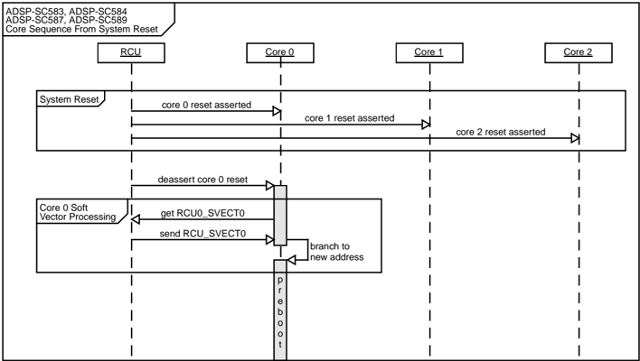

The ADSP-2158x derivative contains two cores with IDs of 1 and 2. In this device the Core 1 is responsible for mastering the boot process and Core 2 is held in reset until released by Core 1 during the preboot phase of the boot process. The initial sequence of events after the completion of the reset sequence are shown.


## Core 0 Start-up

Describes the initial operations performed by Core 0 immediately after being released from reset and soft vector processing has completed. This topic is only applicable to the ADSP-SC58x processors.

Upon initial release from the reset event the soft vectoring process results in Core 0 executing the boot process as long as the RCU\_SVECT0 register contained the default reset value during the soft vector processing. The core performs the following initial operations:

- Set VBAR register to 0x00000020. This step installs a second vector table that is located in the boot ROM that has a reset vector pointing directly to the start of the boot process as opposed to the soft vector routine.
- Disable ECC in all 8 banks via L2CTL\_CTL of L2CTL1 and L2CTL2 controllers that interface to the onchip ROM memories
- Disable the MMU
- Disable L1 Cache
- Invalidate the TLB
- Disable Branch Prediction
- Read and store the contents of RCU\_STAT
- Install the stack for the IRQ exception
- Install the stack for the FIQ exception
- Install the stack for the ABORT exception
- Install the stack for the UND exception
- Install the stack for the SVC mode of operation. The boot process runs in SVC mode and the stack installed is the main stack used for the complete boot process.

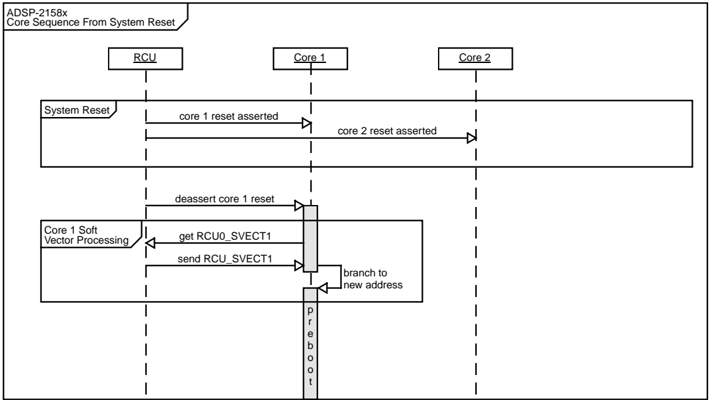

- Initialize the top 1024 bytes of the stack to initialize the corresponding ECC parity to allow for read access to the initial stack space. This step is bypassed if RCU\_BCODE.NOMEMINIT is set.
- Call the preboot function passing the previously read RCU\_STAT contents as an argument

NOTE: The USR and SYS modes of operation are never entered during the boot process and as such their stack are not configured during boot. The boot process runs entirely in SVC mode. User application software is required to install USR and SYS stacks in the secure mode of operation. For systems requiring security, user application software should also install a secure monitor and implement any additional security configuration before transitioning to the non-secure mode of operation.

## Core 1 Start-up

Describes the initial operations performed by Core 1 immediately after being released from reset and soft vector processing has completed.

Upon initial release from reset the soft vectoring process results in Core 1 executing from the boot ROM as long as the RCU\_SVECT1 register contained the default reset value during the soft vector processing. The operations the core performs varies depending on the product.

## ADSP-SC58x Processors

The following steps apply only to the ADSP-SC58x processors. Core 1 is not responsible for the booting of the processor from reset and thus enters a safe IDLE state allowing access to the cores L1 resources by any other core.

- Disable Software Return feature in the BTB
- Disable the BTB
- Disable ECC in all 8 banks via L2CTL\_CTL of L2CTL1 and L2CTL2 controllers that interface to the onchip ROM memories
- Set RCU\_MSG.C1IDLE
- Enter and endless IDLE loop

## ADSP-2158x Processors

The following steps only apply to the ADSP-2158x processors. Core 1 is responsible for mastering the boot process and the following actions are performed:

- Disable Software Return feature in the BTB
- Disable the BTB
- Disable ECC in all 8 banks via L2CTL\_CTL of L2CTL1 and L2CTL2 controllers that interface to the onchip ROM memories
- Disable cache via MODE2 register
- Flush cache

- Set IRPTL to 0x00000000
- Configure primary and secondary DAG configurations to setup the C run-time environment
- Clear CBUFEN , SRD1H , SRD1L , SRD2H , SRD2L , ALUSAT , TRUNCATE in the MODE1 register
- Set IRPTEN , IPERREN , DPERREN , SPERREN , in the MODE1 register
- Set MMASK to 0x00000000
- Set IMASK to 0x00000000
- Initialize the top 1024 bytes of the stack to initialize the corresponding ECC parity to allow for read access to the initial stack space. This step is bypassed if RCU\_BCODE.NOMEMINIT is set.
- Call the preboot function passing the contents of RCU\_STAT as an argument

Table 53-2: Primary/Secondary DAG Configuration for C Run-Time Setup

| Primary/Secondary DAG regis- ter   | Value      | Description                                  |
|------------------------------------|------------|----------------------------------------------|
| M7, M15                            | -1         | Dedicated registers must always be set to -1 |
| M6, M14                            | 1          | Dedicated registers must always be set to 1  |
| M5, M13                            | 0          | Dedicated registers must always be set to 0  |
| L0-L5                              | 0          | Preserved registers set initially to 0       |
| L6, L7                             | 0          | Stack Length Register set initially to 0     |
| L8 - L15                           | 0          | Preserved registers set initially to 0       |
| B6, B7                             | 0x200BF400 | Stack Base Registers                         |
| I7                                 | 0x200BFFFC | Stack Pointer                                |
| L6, L7                             | 0x00000BFD | Stack Length Registers                       |
| I6                                 | 0x200BFFFC | Frame Pointer                                |

## Core 2 Start-up

Describes the initial operations performed by Core 2 immediately after being released from reset and soft vector processing has completed. This topic applies to all derivatives except the ADSP-SC582.

Upon initial release from reset the soft vectoring process results in Core 2 executing from the boot ROM as long as the RCU\_SVECT2 register contained the default reset value during the soft vector processing. The operations the core performs varies depending on the product.

The following steps apply only to the ADSP-SC58x processors. Core 1 is not responsible for the booting of the processor from reset and thus enters a safe IDLE state allowing access to the cores L1 resources by any other core.

- Disable Software Return feature in the BTB
- Disable the BTB

- Disable ECC in all 8 banks via L2CTL\_CTL of L2CTL1 and L2CTL2 controllers that interface to the onchip ROM memories
- Set RCU\_MSG.C2IDLE
- Enter and endless IDLE loop

## Idle On Entry

The Idle On Entry implementation allows a means for a debugger to perform a system of the processor and halt the boot code before continuing with any further preboot operations.

When this feature is enabled the processor will execute a WFI/IDLE instruction and then continue once an event such as an emulator exception is serviced.

NOTE: Idle On Entry processing is disabled by default and may be optionally enabled by setting RCU\_BCODE.IDLEONENTRY prior to performing a system reset operation.

## Fault Configuration

Describes the initial fault sources that are enabled allowing the processor to signal a fault to the system.

The following faults are enabled via the SEC . Please note that only the faults are enabled, the boot process does not install any SEC interrupts.

Table 53-3: Initial Faults installed during Preboot

|   SEC Fault ID | SEC Fault Name   | Description                                                                                      |
|----------------|------------------|--------------------------------------------------------------------------------------------------|
|              1 | INTR_SEC0_ERR    | SEC Error                                                                                        |
|              3 | INTR_WDOG0_EXP   | WDOGExpire                                                                                       |
|              4 | INTR_WDOG1_EXP   | WDOGExpire                                                                                       |
|            178 | INTR_CRC0_ERR    | CRC Error                                                                                        |
|            179 | INTR_CRC1_ERR    | CRC Error                                                                                        |
|              5 | INTR_OTPC0_ERR   | OTPC Error                                                                                       |
|             47 | INTR_SOFT3_INT   | Software Driven Interrupt 3 . This is raised in the boot rom error handler should it be entered. |

The SEC is configured to have a fault delay of 0x100 via SEC\_FDLY.COUNT and SEC\_FSRDLY.COUNT . This allows for a delay to be implemented before assertion of the fault should a customer error handler be installed and any SEC interrupts enabled and handled for more advanced second stage boot scenarios.

The SYS\_FAULT pins are configured via the SEC to support both incoming and out going faults by enabling both SEC\_FCTL.FIEN and SEC\_FCTL.FOEN . This allows the boot process to capture an incoming fault if asserted by the external system upon handover to the user application after boot.

NOTE: The installation of the fault sources is enabled by default and may be optionally bypassed via RCU\_BCODE.NOFAULTS .

Faults are also disabled when the NOBOOT boot mode is enabled.

## SPU Configuration

The SPU is configured differently depending upon the detected security state of the device. The first operation clears any existing security violations that may be indicated via SPU\_STAT .

For an open device, a device that has not had the locked bit set in OTP . The boot process makes all peripherals ignore security signals by setting SPU\_SECURECTL.SSECCLR .

If the security state of the processor is locked then none of the peripherals are configured to ignore security signals and only the following masters are configured to generate secure transactions.

Table 53-4: Locked Processor SPU Secure Masters During Boot

|   SPU Endpoint ID | Master Name                  |
|-------------------|------------------------------|
|                88 | MDMA0 Source DMAChannel      |
|                89 | MDMA0 Destination DMAChannel |
|                90 | MDMA1 Source DMAChannel      |
|                91 | MDMA1 Destination DMAchannel |
|                10 | CRC0                         |
|                11 | CRC1                         |
|               162 | PKTE                         |

## SMPU Configuration

The SMPU is used to restrict access to various memory regions in the processor. The configuration applied during boot differs depending on the locked state of the processor.

By default the SMPU instances only allow secure read and write transactions. The tables below describe the configurations for the different security states.

Table 53-5: SMPU Configuration

| SMPU Instance         |   SMPU In- stance | Open SMPU_SECURECTL Val- ue                      | Locked SMPU_SECURECTL Value        |
|-----------------------|-------------------|--------------------------------------------------|------------------------------------|
| SMC                   |                 0 | SMPU_SECURECTL.WNSEN &#124; SMPU_SECURECTL.RNSEN | 0x00000000 (Default Reset Val- ue) |
| Core_L2_RAM_Boot_ROM0 |                 2 | SMPU_SECURECTL.WNSEN &#124; SMPU_SECURECTL.RNSEN | 0x00000000 (Default Reset Val- ue) |
| DMA_L2_RAM_Boot_ROM0  |                 3 | SMPU_SECURECTL.WNSEN &#124; SMPU_SECURECTL.RNSEN | 0x00000000 (Default Reset Val- ue) |

Table 53-5: SMPU Configuration (Continued)

| SMPU Instance          |   SMPU In- stance | Open SMPU_SECURECTL Val- ue                      | Locked SMPU_SECURECTL Value        |
|------------------------|-------------------|--------------------------------------------------|------------------------------------|
| Core_L2_ROM1_Boot_ROM1 |                 4 | SMPU_SECURECTL.WNSEN &#124; SMPU_SECURECTL.RNSEN | 0x00000000 (Default Reset Val- ue) |
| DMA_L2_ROM1_Boot_ROM1  |                 5 | SMPU_SECURECTL.WNSEN &#124; SMPU_SECURECTL.RNSEN | 0x00000000 (Default Reset Val- ue) |
| Core_L2_ROM2_Boot_ROM2 |                 6 | SMPU_SECURECTL.WNSEN &#124; SMPU_SECURECTL.RNSEN | 0x00000000 (Default Reset Val- ue) |
| DMA_L2_ROM2_Boot_ROM2  |                 7 | SMPU_SECURECTL.WNSEN &#124; SMPU_SECURECTL.RNSEN | 0x00000000 (Default Reset Val- ue) |
| DMC0                   |                 9 | SMPU_SECURECTL.WNSEN &#124; SMPU_SECURECTL.RNSEN | 0x00000000 (Default Reset Val- ue) |
| DMC1                   |                10 | SMPU_SECURECTL.WNSEN &#124; SMPU_SECURECTL.RNSEN | 0x00000000 (Default Reset Val- ue) |

Speculative reads are also disabled by setting SMPU\_CTL.RSDIS .

## Secure Debug Key Processing

In the event the processor is locked, a secure debug key is required to be submitted via the debug tools and matched with a key on the processor. A 128-bit Secure Debug Key must be provisioned by user prior to locking the device.

The secure debug key is read from the OTP memory and then written to the corresponding register in the TAPC. After the key has been written the TAPC\_SDBGKEY\_CTL.VALID bit is set then allowing for a key compare operation to be performed once the debug tools then submit their key.

It is important that the debug tools wait for the boot software to load the key then set the TAPC\_SDBGKEY\_CTL.VALID before submitting the key for comparison.

The 128-bit Secure Debug Key is loaded as follows from the storage area in OTP .

Table 53-6: Secure Debug Key Load Procedure

| Secure Debug Key[127:0]   | Register      |
|---------------------------|---------------|
| Secure Debug Key[31:0]    | TAPC_SDBGKEY0 |
| Secure Debug Key[63:32]   | TAPC_SDBGKEY1 |
| Secure Debug Key[95:94]   | TAPC_SDBGKEY2 |
| Secure Debug Key[127:96]  | TAPC_SDBGKEY3 |

CAUTION: A key of 0xFFFFFFFF, 0xFFFFFFFF, 0xFFFFFFFF, 0xFFFFFFFF provisioned in OTP will result in the boot code bypassing the key load operation entirely. If debug access is then ever required the key must be loaded to the TAPC by user software. If the processor fails to boot perhaps due to corrupted firmware then the user will have no debug access. The only way to gain access would be to load an

authenticated boot image that can then load the required keys prior to attempting to connect with a debugger.

## CGU Configuration

Reconfigures the internal clocks on the processor for improved boot performance.

The boot process can optionally configure the CGU in order to improve boot performance. The settings to be applied to the CGU are located within the ADI\_ROM\_OTP\_BOOT\_CGU\_INFO structure that has storage allocated in the OTP as part of the ADI\_ROM\_OTP\_BOOT\_INFO structure.

Typically, CGU configuration would be performed through the use of an Init Block in the boot stream. This provides greatest flexibility. In situations where boot time must be kept to a minimum, provide settings in the OTP that can be applied at this stage of preboot as opposed to during the boot process itself. When a processor is locked, the boot process does not support an Init Block in the boot stream. For a locked processor users must use the OTP in order to reconfigure the clocks without adopting a multi-stage boot strategy.

When the processor is initially released from reset, the CGU is configured for PLL Bypass mode. In order to improve boot performance the boot software reconfigures the CGUsuch that Full-On mode is entered with the default CGU settings. If the user has not supplied settings in OTP to configure the Oscillator Watchdog then the Oscillator watchdog fault, enabled by default after reset, is disabled prior to reconfiguring the CGU. If settings are provisioned in the OTP to configure the Oscillator Watchdog the fault is left enabled and if applicable the CGU is configured per the provided settings. The remainder of the boot process completes in Full-On mode.

Table 53-7: ADI\_ROM\_OTP\_BOOT\_CGU\_INFO Members

| Type     | Name                              | Description                                                   |
|----------|-----------------------------------|---------------------------------------------------------------|
| uint32_t | ctl_WEN:1 (bitfield)              | Enable write to the CGU_CTL register                          |
| uint32_t | div_WEN:1 (bitfield)              | Enable write to the CGU_DIV register                          |
| uint32_t | reserved0:1 (bitfield)            | Reserved                                                      |
| uint32_t | div_DSEL:5 (bitfield)             | CGU_DIV.DSEL value                                            |
| uint32_t | div_CSEL:5 (bitfield)             | CGU_DIV.CSEL value                                            |
| uint32_t | div_S0SEL:3 (bitfield)            | CGU_DIV.S0SEL value                                           |
| uint32_t | div_SYSSEL:5 (bitfield)           | CGU_DIV.SYSSEL value                                          |
| uint32_t | div_S1SEL:3 (bitfield)            | CGU_DIV.S1SEL value                                           |
| uint32_t | div_OSEL:7 (bitfield)             | CGU_DIV.OSEL value                                            |
| uint32_t | ctl_DF:1 (bitfield)               | CGU_CTL.DF value                                              |
| uint32_t | ctl_MSEL:7 (bitfield)             | CGU_CTL.MSEL value                                            |
| uint32_t | auto_disable:1 (bit- field)       | disable polling on auto-alignment of clocks, NOT RECOMMENDED! |
| uint32_t | clkoutsel_ USBCLKSEL:6 (bitfield) | CGU_CLKOUTSEL.USBCLKSEL value                                 |

Table 53-7: ADI\_ROM\_OTP\_BOOT\_CGU\_INFO Members (Continued)

| Type     | Name                                 | Description                                          |
|----------|--------------------------------------|------------------------------------------------------|
| uint32_t | clkoutsel_ CLKOUTSEL:5 (bitfield)    | CGU_CLKOUTSEL.CLKOUTSEL value                        |
| uint32_t | clkoutsel_WEN:1 (bitfield)           | Enable write to the CGU_CLKOUTSEL register           |
| uint32_t | oscwctl0_WEN:1 (bit- field)          | Enable write to the CGU_OSCWDCTL instance 0 register |
| uint32_t | oscwctl0_HODF:6 (bitfield)           | CGU_OSCWDCTL.HODF value                              |
| uint32_t | oscwctl0_HODEN:1 (bitfield)          | CGU_OSCWDCTL.HODEN value                             |
| uint32_t | oscwctl0_CNGEN:1 (bitfield)          | CGU_OSCWDCTL.CNGEN value                             |
| uint32_t | oscwctl0_BOUF:5 (bitfield)           | CGU_OSCWDCTL.BOUF value                              |
| uint32_t | oscwctl0_BOUEN:1 (bitfield)          | CGU_OSCWDCTL.BOUEN value                             |
| uint32_t | oscwctl0_FAULTEN:1 (bitfield)        | CGU_OSCWDCTL.FAULTEN value                           |
| uint32_t | oscwctl0_MONDIS:1 (bitfield)         | CGU_OSCWDCTL.MONDIS value                            |
| uint32_t | oscwctl0_ FAULTPINDIS:1 (bit- field) | CGU_OSCWDCTL.FAULTPINDIS value                       |
| uint32_t | oscwctl1_WEN:1 (bit- field)          | Enable write to the CGU_OSCWDCTL instance 0 register |
| uint32_t | oscwctl1_HODF:6 (bitfield)           | CGU_OSCWDCTL.HODF value                              |
| uint32_t | oscwctl1_HODEN:1 (bitfield)          | CGU_OSCWDCTL.HODEN value                             |
| uint32_t | oscwctl1_CNGEN:1 (bitfield)          | CGU_OSCWDCTL.CNGEN value                             |
| uint32_t | oscwctl1_BOUF:5 (bitfield)           | CGU_OSCWDCTL.BOUF value                              |
| uint32_t | oscwctl1_BOUEN:1 (bitfield)          | CGU_OSCWDCTL.BOUEN value                             |
| uint32_t | oscwctl1_FAULTEN:1 (bitfield)        | CGU_OSCWDCTL.FAULTEN value                           |

Table 53-7: ADI\_ROM\_OTP\_BOOT\_CGU\_INFO Members (Continued)

| Type     | Name                                 | Description                    |
|----------|--------------------------------------|--------------------------------|
| uint32_t | oscwctl1_MONDIS:1 (bitfield)         | CGU_OSCWDCTL.MONDIS value      |
| uint32_t | oscwctl1_ FAULTPINDIS:1 (bit- field) | CGU_OSCWDCTL.FAULTPINDIS value |
| uint32_t | reserved2:28 (bitfield)              | Reserved                       |

If a CGU\_STAT.WDIVERR , CGU\_STAT.WDFMSERR , CGU\_STAT.LWERR or CGU\_STAT.ADDRERR is either present upon entry to the configuration routine or upon completion of the configuration then the default error handler is called and the boot process terminates.

NOTE: The configuration of the CGU will be bypassed if RCU\_BCODE.NOPREBOOT is set when this part of the boot process is reached.

## Releasing All Cores From Reset

The master booting core releases all other cores from reset allowing them to then run by default into a safe endless loop state. By releasing all other cores from reset any dedicated core L1 memories then become accessible to all cores via the system address space.

In order for one core to load or read data from another cores dedicated L1 memory. The core must be released from the reset state. By default the other cores in the processor execute a safe endless loop in the boot ROM.

## L1/L2 Memory Initialization

The processor initializes all parity and ECC protected memories allowing for subsequent read operations to be performed without generation of an ECC or parity error.

The table below describes the methods used to initialize the various parity and ECC supported memories on the processor.

Table 53-8: L1/L2 Memory Initialization

| Resource To Fill Memory   | Memory Type      | Address    | Count       | Fill Value   | Flag Set Upon Completion   |
|---------------------------|------------------|------------|-------------|--------------|----------------------------|
| Core 1                    | Core 1 L1 Bank 0 | 0x00048000 | 0x5000 (LW) | 0x00000000   | RCU_MSG.C1L1INIT           |
| Core 1                    | Core 1 L1 Bank 1 | 0x00058000 | 0x5000 (LW) | 0x00000000   | RCU_MSG.C1L1INIT           |
| Core 1                    | Core 1 L1 Bank 2 | 0x00060000 | 0x4000 (LW) | 0x00000000   | RCU_MSG.C1L1INIT           |
| Core 1                    | Core 1 L1 Bank 3 | 0x00070000 | 0x4000 (LW) | 0x00000000   | RCU_MSG.C1L1INIT           |

Table 53-8: L1/L2 Memory Initialization (Continued)

| Resource To Fill Memory   | Memory Type      | Address    | Count        | Fill Value   | Flag Set Upon Completion   |
|---------------------------|------------------|------------|--------------|--------------|----------------------------|
| Core 2                    | Core 2 L1 Bank 0 | 0x00048000 | 0x5000 (LW)  | 0x00000000   | RCU_MSG.C2L1INIT           |
| Core 2                    | Core 2 L1 Bank 1 | 0x00058000 | 0x5000 (LW)  | 0x00000000   | RCU_MSG.C2L1INIT           |
| Core 2                    | Core 2 L1 Bank 2 | 0x00060000 | 0x4000 (LW)  | 0x00000000   | RCU_MSG.C2L1INIT           |
| Core 2                    | Core 2 L1 Bank 3 | 0x00070000 | 0x4000 (LW)  | 0x00000000   | RCU_MSG.C2L1INIT           |
| MDMA0\CRC0                | System L2 RAM    | 0x20080000 | 0x20000 (BW) | 0x00000000   | RCU_MSG.L2INIT             |
| MDMA1\CRC1                | System L2 RAM    | 0x200A0000 | 0x1FC00 (BW) | 0x00000000   | RCU_MSG.L2INIT             |

NOTE: The Memory Initialization process is enabled by default and may be optionally bypassed by setting RCU\_BCODE.NOMEMINIT .

## Default Application Entry Points

The core sets default application entry points for all cores in the processor. This step is performed in the event a boot stream does not contain blocks that specify the application entry point.

The table below defines the default application entry points for each core in the processor.

Table 53-9: RCU\_SVECTn Default Application Entry Points

|   Core ID | Corresponding RCU_SVECTn Register   | Application Entry Point   |
|-----------|-------------------------------------|---------------------------|
|         0 | RCU_SVECT0                          | 0x20080000                |
|         1 | RCU_SVECT1                          | 0x00090004                |
|         2 | RCU_SVECT2                          | 0x00090004                |

The values defined here get overwritten by First Block located within the boot stream.

NOTE: The initialization of the RCU\_SVECT0 register is enabled by default and may be optionally bypassed by setting RCU\_BCODE.NOVECTINIT .

## Memory Faults Configuration

Describes the memory fault sources that are enabled allowing the processor to signal a fault to the system in the even of a memory error.

The following faults are enabled via the SEC . Please note that only the faults are enabled, the boot process does not install any SEC interrupts.

Table 53-10: Memory Faults installed during Preboot

|   SEC Fault ID | SEC Fault Name       | Description            |
|----------------|----------------------|------------------------|
|              8 | INTR_L2CTL0_ECC_ ERR | L2 ECC Error           |
|             23 | INTR_C0_L1_PERR      | Core 0 L1 Parity Error |

The SEC is configured to have a fault delay of 0x100 via SEC\_FDLY.COUNT and SEC\_FSRDLY.COUNT . This allows for a delay to be implemented before assertion of the fault should a customer error handler be installed and any SEC interrupts enabled and handled for more advanced second stage boot scenarios.

The SYS\_FAULT pins are configured via the SEC to support both incoming and out going faults by enabling both SEC\_FCTL.FIEN and SEC\_FCTL.FOEN . This allows the boot process to capture an incoming fault if asserted by the external system upon handover to the user application after boot.

NOTE: The installation of the fault sources is enabled by default and may be optionally bypassed via RCU\_BCODE.NOFAULTS .

Faults are also disabled when the NOBOOT boot mode is enabled.

## NO-BOOT Processing

No-Boot mode is executed on supported devices when selected by the SYS\_BMODE[n] pins. The boot mode is intended as a recovery boot mode or for debug purposes. The core simply executes in an endless loop in the boot ROM thus terminating further execution of the boot process.

This boot mode is primarily intended for debug sessions when no boot source may be configured. It allows for a debugger to safely connect to the device and take control assuming the debugger has been granted access rights as defined by the processor security implementation.

NOTE: NO-BOOT processing is usually only entered as a result of the boot mode pin sampling resulting in execution of the No-Boot boot mode. This processing can also be optionally enabled by setting RCU\_BCODE.HALT . The setting of RCU\_BCODE.HALT can be especially useful for debug sessions to force the execution of the NO-BOOT mode regardless of the SYS\_BMODE[n] state allowing a user application to be loaded via the debug tools without fear of the image being corrupted as a result of attempting to boot through another source.

## SYS\_RESOUTb Processing

The SYS\_RESOUT pin can be used to signal to the external system that the processor is now in a state where it is ready boot

In order to signal to the external system that the processor in now in a configured state and ready to start the boot process, the boot software de-asserts the SYS\_RESOUT pin via RCU\_CTL.RSTOUTDSRT .

## DMC Configuration

Configures the DMC to allow booting directly to external DDR memory. Primarily intended to support booting to external memory when the processor is locked.

In order to boot to external DDR memories the DMC must be configured. Typically DMC configuration would be done with the support of

Typically, DMC configuration would be performed through the use of an Init Block in the boot stream. This provides greatest flexibility. When a processor is locked however, the boot process does not support an Init Block in the boot stream. For a locked processor users must use the OTP in order to configure the DMC without adopting a multi-stage boot strategy.

The table below provides details of the OTP region that is used to store theDMC configuration to be applied. In addition to the settings described in the table below ADI\_ROM\_OTP\_BOOT\_CFG::dmcEn must be set in order for the settings to be applied.

There is an additional single bit located in OTP , ADI\_ROM\_OTP\_BOOT\_CFG::dmcInv , allowing users to invalidate the DMC settings stored in OTP .

NOTE: Once ADI\_ROM\_OTP\_BOOT\_CFG::dmcInv has been set in OTP there is no means to configure the DMC during the preboot phase.

Table 53-11: ADI\_ROM\_OTP\_DMC\_CONFIG Members

| Type     | Name                       | Description                                                               |
|----------|----------------------------|---------------------------------------------------------------------------|
| uint32_t | reserved0:10 (bitfield)    | Reserved                                                                  |
| uint32_t | ulDDR_DLLCTL:12 (bitfield) | Contents of DMC_DLLCTL [11:0]                                             |
| uint32_t | ulDDR_EMR2:8 (bitfield)    | Contents of DMC_EMR2 [7:0]                                                |
| uint32_t | reserved1:2 (bitfield)     | Reserved                                                                  |
| uint32_t | ulDDR_CFGCTL               | Packed content of DMC_CTL Register, DMC_CFG registers.                    |
| uint32_t | ulDDR_MREMR1               | Packed content of DMC_EMR1 Register, DMC_MR registers.                    |
| uint32_t | ulDDR_TR0                  | Content of DMC_TR0                                                        |
| uint32_t | ulDDR_TR1                  | Content of DMC_TR1                                                        |
| uint32_t | ulDDR_TR2                  | Content of DMC_TR2                                                        |
| uint32_t | ulDDR_PHYCTL0              | Content of DMC_PHY_CTL0                                                   |
| uint32_t | ulDDR_PHYCTL145            | Packed content of DMC_PHY_CTL1 , DMC_PHY_CTL4 and DMC_PHY_CTL5 registers. |
| uint32_t | ulDDR_PHYCTL2              | Content of DMC_PHY_CTL2                                                   |
| uint32_t | ulDDR_PHYCTL3              | Content of DMC_PHY_CTL3                                                   |

Table 53-11: ADI\_ROM\_OTP\_DMC\_CONFIG Members (Continued)

| Type     | Name                           | Description                                                                      |
|----------|--------------------------------|----------------------------------------------------------------------------------|
| uint32_t | ulDDR_CAL_PADCTL0_ PHY_STAT3_0 | Packed content of DMC_CAL_PADCTL0 , DMC_PHY_STAT0 , and DMC_PHY_STAT3 registers. |
| uint32_t | ulDDR_CAL_PADCTL2              | Content of DMC_CAL_PADCTL2                                                       |

NOTE: The configuration of the DMC will be bypassed if RCU\_BCODE.NOPREBOOT is set when this part of the boot process is reached.

## Bypassing the Boot Process

It is possible to bypass the actual booting process and execute from the address stored in the cores soft vector register. This can be useful when working in emulation sessions as it provides a mechanism to be able to execute directly from an accessible memory that already contains executable code.

The boot process can be bypassed by setting RCU\_BCODE.NOKERNEL and the core will instead vector to the address stored in the cores corresponding RCU\_SVECT[n] register instead of calling the required boot mode.

This feature would often be used along with other features such as disabling of memory initialization.

## Boot Mode Disable

Specific boot modes can be permanently disabled via OTP resulting in a boot error should the disabled boot mode be enabled via the SYS\_BMODE[n] pins.

A byte of storage is provided in the OTP allowing for disabling of up to 8 boot modes. The boot mode disable field can be programmed using the adi\_rom\_otp\_pgm() routine. The otp\_data::bootModeDisable member is used in the program operation to disable the various boot modes.

|   otp_data::bootModeDisable Bit Position | Corresponding Boot Mode   |
|------------------------------------------|---------------------------|
|                                        0 | SPI Master Boot Mode      |
|                                        1 | SPI Slave Boot Mode       |
|                                        2 | Reserved                  |
|                                        3 | Reserved                  |
|                                        4 | Reserved                  |
|                                        5 | LINKPORT Slave Boot Mode  |
|                                        6 | UART Slave Boot Mode      |
|                                        7 | Reserved                  |

## Boot Command Customization

Boot Command Customization allows for the permanent customization of a particular boot mode. For example it is possible to change the peripheral instance that is used for the boot operation.

Storage is provide in OTP for a command item for each of the supported boot modes. The storage is provided in the ADI\_ROM\_OTP\_BOOT\_CMD\_INFO member of ADI\_ROM\_OTP\_BOOT\_INFO . Refer to the corresponding boot modes boot command description for details on the supported command options.

NOTE: Before programming the boot command to the OTP . It is advisable to thoroughly evaluate the boot command using the adi\_rom\_Boot() API to ensure the boot command provides the desired functionality. Once the command is programmed to OTP there is no means to revert to the original default settings.

## Boot Mode Specific SPU Configuration

Prior to performing the actual boot process, the processors SPU resources specific to the boot mode selected are configured. This is performed in the preboot phase as opposed to within the boot mode itself when calling the boot API as it isolates the security functionality of the processor allowing it to be handled specifically by a separate process.

The following additional SPU resources are configured as secure masters according to the boot mode selected.

Table 53-12: Boot Mode Specific SPU Configuration

| Boot Mode                            | SPU Endpoint ID   | Master Name                                             |
|--------------------------------------|-------------------|---------------------------------------------------------|
| SPI Master Boot (Memory Mapped Mode) | 88, 89            | MDMA0 Source DMAChannel, MDMA0 Destination DMAChannel   |
| SPI Master Boot (Peripheral Mode)    | 106, 104, 102     | SPI2 Receive DMA, SPI1 Receive DMA, SPI0 ReceiveDMA     |
| SPI Slave Boot                       | 106, 104, 102     | SPI2 Receive DMA, SPI1 Receive DMA, SPI0 ReceiveDMA     |
| UART Slave Boot                      | 82, 84, 86        | UART 0 Receive DMA, UART1 Receive DMA, UART2 ReceiveDMA |
| LINKPORT Slave Boot                  | 5, 6              | LINKPORT0 DMA, LINKPORT1DMA                             |

NOTE: Note that for a given boot mode in the table not all the SPU resources are configured. Only a single peripheral instance is enabled according the peripheral instance selected for boot. For example if the boot command for the boot mode indicates boot from UART0 only the UART0 Receive DMA is configured, the other UART Receive DMAs are not configured for secure access.

## Executing the Boot Mode

The boot mode is called using the adi\_rom\_Boot() routine resulting in the fetching and processing of the boot stream from the configured boot source.

The table below provides default parameters passed to each of the supported boot modes. For details on the API usage please refer to adi\_rom\_Boot() .

Table 53-13: Default Boot ROM API Parameters

| Boot Mode           | pAddressflags   |            | blockCount   | pHook                             | command    |
|---------------------|-----------------|------------|--------------|-----------------------------------|------------|
| No Boot             | 0x000000 00     | 0x00000000 | 0x00000000   | ARM: 0x00000301 SHARC: 0x00b003e5 | 0x00000000 |
| SPI Master Boot     | 0x600000 00     | 0x00040000 | 0x00000000   | ARM: 0x00000301 SHARC: 0x00b003e5 | 0x00010207 |
| SPI Slave Boot      | 0x000000 00     | 0x00000000 | 0x00000000   | ARM: 0x00000301 SHARC: 0x00b003e5 | 0x00000212 |
| Reserved            | 0x000000 00     | 0x00000000 | 0x00000000   | ARM: 0x00000301 SHARC: 0x00b003e5 | 0x00000000 |
| Reserved            | 0x000000 00     | 0x00000000 | 0x00000000   | ARM: 0x00000301 SHARC: 0x00b003e5 | 0x00000000 |
| Reserved            | 0x000000 00     | 0x00000000 | 0x00000000   | ARM: 0x00000301 SHARC: 0x00b003e5 | 0x00000000 |
| LINKPORT Slave Boot | 0x000000 00     | 0x00000000 | 0x00000000   | ARM: 0x00000301 SHARC: 0x00b003e5 | 0x00000014 |
| UART Slave Boot     | 0x000000 00     | 0x00000000 | 0x00000000   | ARM: 0x00000301 SHARC: 0x00b003e5 | 0x00000013 |

The hook function installed via pHook on this product performs no additional configuration.

## Boot Modes

The boot implementation provides built-in support for booting from various peripherals. The Booting Modes table describes the supported boot modes.

In slave boot modes, the processor functions as a slave to any host device. In these modes, the host device usually controls the processor SYS\_HWRST input. Typically, the host applies the reset sequence and waits until the processor is ready to boot, depending on the peripheral in use, and transmits the boot stream data to the processor. Handshake signals are most likely used to signal to the host that the processor is ready to accept more data.

In a master boot modes, the processor controls the peripheral and requests data via the peripheral as and when required.

Individual boot modes can be disabled. For more information about disabling boot modes, see Boot ROM OTP Customizations.

Table 53-14: Booting Modes

|   SYS_BMODE[2:0] | Boot Source     | Description                                                                                                                           |
|------------------|-----------------|---------------------------------------------------------------------------------------------------------------------------------------|
|              000 | No Boot         | The processor does not boot. Rather the boot kernel executes some of the preboot operations then enters and endless WFI / IDLE state. |
|              001 | SPI Master Boot | Boot from integrated Flash memory through the SPI2 peripheral configured for memory mapped mode.                                      |
|              010 | SPI Slave Boot  | Boot through the SPI2 peripheral configured as a slave                                                                                |
|              011 | Reserved        |                                                                                                                                       |
|              100 | Reserved        |                                                                                                                                       |
|              101 | Reserved        |                                                                                                                                       |
|              110 | LINKPORT Boot   | Boot through LINKPORT0 peripheral configured as a slave receiver                                                                      |
|              111 | UART Boot       | Boot through UART0 peripheral configured as a slave receiver                                                                          |

## No-Boot Mode

No-Boot mode is intended for device-recovery purposes caused by incorrect programming of the boot source memory allowing for target connection through an emulator. Emulation tools can also leverage the No-Boot functionality allowing for debug sessions to run the preboot software prior to loading an application while preventing the boot process from continuing and clobbering data loaded by the emulator.

This boot mode results in a number of preboot operations being performed before then placing the core into a safe endless loop located in the boot ROM. For a complete list of operations performed when No-Boot is selected please refer to Preboot Operations. The core terminates at the NO-BOOT Processing stage of the preboot process.

## SPI Master Boot Mode

The SPI master boot routine provides support for booting the processor from SPI flash memories.

The SPI boot mode utilizes a device auto-detection feature that is enabled by default allowing for the boot stream itself to instruct updates to the SPI configuration and the read command used allowing for more efficient transactions.

## Boot From External SPI Flash Devices

The SPI boot mode supports booting from 24-bit addressable flash devices. The boot mode uses the MDMA channels by default and configures the SPI flash for memory mapped functionality. Peripheral DMA mode is also supported when calling the boot mode via adi\_rom\_Boot() . Support for 32-bit addressable flash devices can be achieved by disabling the device auto-detection and supplying the required configuration via the command parameter.

When auto-device detection is enabled, the SPI memory is initially read using the standard 0x03 SPI read command with a reduced clocking frequency for maximum compatibility. The first nibble of the boot stream is then used to reconfigure the SPI interface and possible the SPI flash. Refer to SPI Device Detection Routine.

NOTE: Support for automatic device detection via the first nibble of the boot stream is not supported when booting secure boot streams. Instead when signing the boot image an attribute can be set in the image header that specifies the configuration to use.

For booting, the SPI memory is connected as shown in the SPI Memory Connections figure.

Figure 53-1: SPI Memory Connections

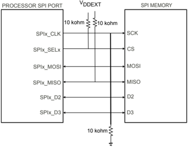

The pull-up resistor on the slave select signal ensures that the memory is deselected when the pin is in a high-impedance mode such as during reset.

Initialization codes are allowed to manipulate ADI\_ROM\_BOOT\_CONFIG::dBootCommand to extend the boot mechanism to a second SPI memory connected to another slave select pin. Updating the field that specifies the slave select signal for use allows the boot process to manage larger boot streams than are able to fit in a single SPI device.

NOTE: If modifying the slave select signal used during the boot process, configure the pin multiplexing to enable the correct functionality for the pin. Once the boot process has proceeded past the configuration function and the boot process has actually started, the boot kernel will not perform any further pin multiplexing operations.

For SPI master boot peripheral mode, the SPE , MSTR , and SZ bits are set in the SPIx\_CTL register. The TIMOD=2 bits enable the receive DMA mode. The CPOL and CPHA bits are set by default, resulting in SPI mode 3. The boot kernel does not allow SPIx hardware to control the SPI\_SEL[n] pin. Instead, software toggles this pin.

## SPI Device Detection Routine

Since the boot mode supports booting from various SPI memories, the boot kernel automatically detects what type of memory is connected. To determine whether the SPI memory device requires an 8, 16, 24, or 32-bit addressing scheme, the boot kernel performs a device detection sequence prior to booting. The SPI\_MISO signal requires a pull-up resistor. The routine relies on the fact that memories do not drive their data outputs unless the right number of address bytes are received.

Initially, the boot kernel transmits the read command on the SPI\_MOSI line. Once the command has been sent, the boot kernel proceeds to transmit a single address byte and waits until the receive FIFO indicates that the buffer is no longer empty. The first received byte is discarded. The boot code then proceeds to issue another address byte while simultaneously receiving a byte. The process continues until a non-0xFF or 0x00 byte is received or until the full 4 address bytes is sent without any valid data being returned.

The receiving of a non-0x00 or 0xFF byte tells the boot code whether the memory device requires 8, 16, 24, 32 address bits. The lower nibble of the received byte is then used to further customize the boot mode. This nibble is referred to as the BCODE . The boot code applies settings to the SPI peripheral according to the SPI Master Boot BCODE Descriptions .

If the received value equals 0x00 or 0xFF , it is assumed that the memory device has not driven its data output thus, another zero byte is transmitted and the received data is tested again.

If the value still equals 0xFF , device detection continues. Device detection aborts immediately when a byte different than 0xFF is received. The boot process continues with normal boot operation and it re-issues a command to re-read from address 0. Two read sequences load the first block header. Separate read sequences load further block headers and block payload fields.

The SPI Device Detection Principle figure illustrates how individual devices behave.

Figure 53-2: SPI Device Detection Principle

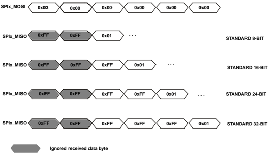

Table 53-15: SPI Master Boot BCODE Descriptions

| BCODE   | Mode      | Command   | Dummy Bytes   | Data Lines   | Address Lines   | SPI Clock   | Purpose                            |
|---------|-----------|-----------|---------------|--------------|-----------------|-------------|------------------------------------|
| 0x0     | Init      | Init      | Init          | Init         | Init            | Init        | Unused                             |
| 0x1     | STANDARD  | 0x03      | 0             | 1            | 1               | SCLK0/16    | Legacy single-bit SPI mode         |
| 0x2     | STANDARD  | 0x03      | 0             | 1            | 1               | SCLK0/4     | Legacy single-bit SPI mode         |
| 0x3     | FAST READ | 0x0B      | 1             | 1            | 1               | SCLK0/2     | Single bit with dummy address byte |

Table 53-15: SPI Master Boot BCODE Descriptions (Continued)

| BCODE   | Mode                           | Command   | Dummy Bytes   | Data Lines   | Address Lines   | SPI Clock   | Purpose                                                                                               |
|---------|--------------------------------|-----------|---------------|--------------|-----------------|-------------|-------------------------------------------------------------------------------------------------------|
| 0x4     | FAST READ                      | 0x0B      | 1             | 1            | 1               | SCLK0/2     | Single bit with dummy address byte. SPI_CTL.FMODE is ena- bled for full cycle access.                 |
| 0x5     | STANDARD                       | 0x03      | 0             | 1            | 1               | SCLK0/3     | Legacy single bit. SPI_CTL.FMODE is enabled for full cycle access.                                    |
| 0x6     | FAST READ                      | 0x0B      | 1             | 2            | 1               | SCLK0/1     | Single bit with dummy byte. SPI_CTL.FMODE is enabled for full cycle access.                           |
| 0x7     | RAPID-S                        | 0x1B      | 2             | 2            | 2               | SCLK0/1     | Single bit with dummy bytes. SPI_CTL.FMODE is enabled for full cycle access.                          |
| 0x8     | DOR                            | 0x3B      | 1             | 2            | 1               | SCLK0/2     | Dual bit data. SPI_CTL.FMODE is enabled for full cycle access.                                        |
| 0x9     | DIOR                           | 0xBB      | 1             | 2            | 2               | SCLK0/2     | Dual data and address. SPI_CTL.FMODE is enabled for full cycle access.                                |
| 0xA     | QOR READ (Quad Mode Method 1)  | 0x6B      | 1             | 4            | 1               | SCLK0/2     | Quad bit data mode using quad enable method 1 with SPI_CTL.FMODE is enabled for full cycle access.    |
| 0xB     | QIOR READ (Quad Mode Method 1) | 0xEB      | 3             | 4            | 4               | SCLK0/2     | Quad data and address using quad enable method 1 with SPI_CTL.FMODE is enabled for full cycle access. |
| 0xC     | QOR READ (Quad Mode Method 2)  | 0x6B      | 1             | 4            | 1               | SCLK0/2     | Quad data using quad mode ena- ble method 2. SPI_CTL.FMODE is enabled for full cycle access           |
| 0xD     | QIOR READ (Quad Mode Method 2) | 0xEB      | 3             | 4            | 4               | SCLK0/2     | Quad data and address using quad mode enable method 2. SPI_CTL.FMODE is enabled for full cycle access |
| 0xE     | QIOR READ (Quad Mode Method 3) | 0xEB      | 3             | 4            | 4               | SCLK0/2     | Quad data and address using quad mode enable method 3. SPI_CTL.FMODE is enabled for full cycle access |
| 0xF     | Init                           | Init      | Init          | Init         | Init            | Init        | Unused                                                                                                |

NOTE: For all the above configurations the addressing scheme is also set to a fixed 3-bytes for 24-bit addressable flash support only. The SPI mode byte issued for all the SPI Master peripheral based configurations is 0x00. The mode byte is the first byte transmitted after the address cycles and is used to control the continuous read mode functionality in which the next read operation is not required to issue a command cycle. Continuous read mode is not supported during the boot process.

## Supported Quad Mode Enable Methods

The boot rom supports the following methods for enabling quad mode on the SPI flash device

NOTE: Please note that the procedures listed here write to a non-volatile register in the SPI flash. There are typically delays implemented with writes to such registers and these need to be accounted for in the boot time. If the flash supports a non-volatile setting using a different procedure from those supported here then it may be more beneficial to boot initially in dual mode and use an initcode to enable quad mode.

## Quad Mode Method 1.

1. Issue the Read Status Register command (0x05) and read in the value of the status register.
2. Issue the Read Configuration Register command (0x3F) and read in the configurations register value.
3. Issue the Write Enable command (0x06).
4. Issue the Read Status Register command (0x05) to verify the write latch status is set.
5. Set bit 7 of the read configuration register value to enable quad mode.
6. Issue the Write Register command (0x3E) and write the value of the configuration register.
7. Issue the Read Status Register command (0x05) until the device is ready and write latch is cleared.
8. Issue the Read Configuration Register command (0x3F) to verify quad mode is enabled.

## Quad Mode Method 2.

1. Issue the Read Status Register command (0x05) and read in the value of the status register.
2. Issue the Read Configuration Register command (0x35) and read in the value of the configuration register.
3. Issue the Write Enable command (0x06).
4. Issue the Read Status Register command (0x05) to verify the write latch status is set.
5. Set bit 1 of the read configuration register value to enable quad mode.
6. Issue the Write Register command (0x01) and write the value of the status register and the updated value of the configuration register.
7. Issue the Read Status Register command (0x05) until the device is ready.

## Quad Mode Method 3.

1. Issue the Read Status Register command (0x05) and read in the value of the status register.

2. Issue the Write Enable command (0x06).
3. Issue the Read Status Register command (0x05) to verify the write latch status is set.
4. Set bit 6 of the read status register value to enable quad mode.
5. Issue the Write Status command (0x01) and write the value of the status register back to enable quad mode.
6. Issue the Read Status Register command (0x05) until the device is ready.

## Run-time API

The following table provides descriptions of the adi\_rom\_Boot() command parameter.

Table 53-16: SPI Master Boot command Bit Descriptions

| Bit No. (Access)   | Bit Name              | Description/Enumeration                                                                                                                                                                                                                                                                                                                            |
|--------------------|-----------------------|----------------------------------------------------------------------------------------------------------------------------------------------------------------------------------------------------------------------------------------------------------------------------------------------------------------------------------------------------|
| 31:28              | ROM_BCMD_S PIM_SPEED  | SPI clock divider to be used. The value written to the SPI Peripherals clock divider register.                                                                                                                                                                                                                                                     |
| 26:25              | ROM_BCMD_S PIM_IOPROT | SPI I/O protocol. If multiple I/O pins are required, then I/O mode is enabled on the flash device. The number of data bits required for the data transfer determines the I/O mode enabled. This field is only applied if NOAUTO is set to 1. Otherwise, the protocol for enabling the additional pins is defined through the BCODE value supplied. |
| 26:25              | ROM_BCMD_S PIM_IOPROT | 0x0 No protocol required to implement multiple I/O                                                                                                                                                                                                                                                                                                 |
| 26:25              | ROM_BCMD_S PIM_IOPROT | 0x1 Enable quad functionality using protocol 1                                                                                                                                                                                                                                                                                                     |
| 26:25              | ROM_BCMD_S PIM_IOPROT | 0x2 Enable quad functionality using protocol 2                                                                                                                                                                                                                                                                                                     |
| 26:25              | ROM_BCMD_S PIM_IOPROT | 0x3 Enable quad functionality using protocol 3                                                                                                                                                                                                                                                                                                     |
| 24:22              | ROM_BCMD_S PIM_DUMMY  | Number of dummy bytes to be issued. Specifies the number of dummy bytes to be issued after the address bytes are issued for the required read command.                                                                                                                                                                                             |
| 24:22              | ROM_BCMD_S PIM_DUMMY  | 0x0 Do not issue dummy bytes                                                                                                                                                                                                                                                                                                                       |
| 24:22              | ROM_BCMD_S PIM_DUMMY  | 0x1 Issue 1 dummy byte                                                                                                                                                                                                                                                                                                                             |
| 24:22              | ROM_BCMD_S PIM_DUMMY  | 0x2 Issue 2 dummy bytes                                                                                                                                                                                                                                                                                                                            |
| 24:22              | ROM_BCMD_S PIM_DUMMY  | 0x3 Issue 3 dummy bytes                                                                                                                                                                                                                                                                                                                            |
| 24:22              | ROM_BCMD_S PIM_DUMMY  | 0x4 Issue 4 dummy bytes                                                                                                                                                                                                                                                                                                                            |
| 24:22              | ROM_BCMD_S PIM_DUMMY  | 0x5 Issue 5 dummy bytes                                                                                                                                                                                                                                                                                                                            |
| 24:22              | ROM_BCMD_S PIM_DUMMY  | 0x6 Issue 6 dummy bytes                                                                                                                                                                                                                                                                                                                            |
| 24:22              | ROM_BCMD_S PIM_DUMMY  | 0x7 Issue 7 dummy bytes                                                                                                                                                                                                                                                                                                                            |

Table 53-16: SPI Master Boot command Bit Descriptions (Continued)

| Bit No. (Access)   | Bit Name             | Description/Enumeration                                                                                                                                                                                        |
|--------------------|----------------------|----------------------------------------------------------------------------------------------------------------------------------------------------------------------------------------------------------------|
| 21:20              | ROM_BCMD_S PIM_ADDR  | Number of address bytes to be issued. Specifies the number of address bytes that are required to be issued to the SPI flash for the required read command.                                                     |
|                    |                      | 0x0 Issue 1 address byte                                                                                                                                                                                       |
|                    |                      | 0x1 Issue 2 address bytes                                                                                                                                                                                      |
|                    |                      | 0x2 Issue 3 address bytes                                                                                                                                                                                      |
|                    |                      | 0x3 Issue 4 address bytes                                                                                                                                                                                      |
| 19:16              | ROM_BCMD_S PIM_BCODE | Boot mode-specific code. Specifies the boot mode-specific code that can further customize and control the boot process.                                                                                        |
| 14:12              | ROM_BCMD_S PIM_SSEL  | SPI Slave select signal. Specifies the SPI slave select signal to be used to enable the SPI Flash. Not all slave selects are available for each SPI port. Refer to the product data sheet for further details. |
|                    |                      | 0x0 SEL1                                                                                                                                                                                                       |
|                    |                      | 0x1 SEL2                                                                                                                                                                                                       |
|                    |                      | 0x2 SEL3                                                                                                                                                                                                       |
|                    |                      | 0x3 SEL4                                                                                                                                                                                                       |
|                    |                      | 0x4 SEL5                                                                                                                                                                                                       |
|                    |                      | 0x5 SEL6                                                                                                                                                                                                       |
|                    |                      | 0x6 SEL7                                                                                                                                                                                                       |
|                    |                      | 0x7 Reserved                                                                                                                                                                                                   |
| 11:8               | ROM_BCMD_ DEVENUM    | Device enumeration. Specifies the SPI device to use.                                                                                                                                                           |
|                    |                      | 0x0 SPI0                                                                                                                                                                                                       |
|                    |                      | 0x1 SPI1                                                                                                                                                                                                       |
|                    |                      | 0x2 SPI2                                                                                                                                                                                                       |
|                    |                      | 0x3 - 0xF Reserved                                                                                                                                                                                             |
| 6                  | ROM_BCMD_ NOAUTO     | Automatic device detection disable. When set disables automatic device detection and uses the setting provided in the other fields of this register to configure the boot mode.                                |
| 5                  | ROM_BCMD_ NOCFG      | Device configuration disable. When set, this bit disables device configuration. Device configuration includes reconfiguration of the peripherals MMRregisters and device pin muxing.                           |

Table 53-16: SPI Master Boot command Bit Descriptions (Continued)

| Bit No. (Access)   | Bit Name         | Description/Enumeration                                                                                                          |
|--------------------|------------------|----------------------------------------------------------------------------------------------------------------------------------|
| 4                  | ROM_BCMD_ HOST   | Host boot mode enable. When set, this bit indicates that SPI slave boot is to be performed. Otherwise, use the master boot mode. |
| 3:0                | ROM_BCMD_ DEVICE | Boot source device. Specifies the device to boot from.                                                                           |
| 3:0                |                  | 0x2 SPI                                                                                                                          |
| 3:0                |                  | 0x7 Memory Mapped SPI (For use with SPI2 only)                                                                                   |

NOTE: All bits in the above table that are not defined must be set to zero. Features supported may be limited depending on peripheral instance.

## SPI Slave Boot Mode

When using SPI slave mode boot, the processor consumes boot data from an external SPI host device. This mode supports single, dual, and quad-bit modes. The boot kernel always starts in single bit mode and can be changed using the appropriate command. The following figures show the hardware configuration for the modes. As in all slave boot modes, the host device controls the SYS\_HWRST input of the processor.

NOTE: Secure Boot Stream Padding

For slave boot modes, the host must always send data in multiples of 1024 bytes. This requirement is due to the sizing of internal buffers used for DMA.

Figure 53-3: Connection Between Host (SPI Master) and Processor (SPI Slave)

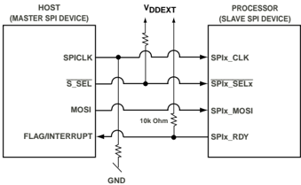

Figure 53-4: Connection Between Host (SPI Master) and Processor (SPI Slave) DIOM

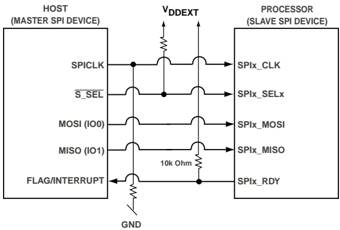

Figure 53-5: Connection Between Host (SPI Master) and Processor (SPI Slave) QSPI

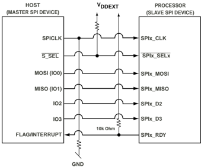

The host drives the SPI clock and is responsible for timing. The host must provide an active-low chip select signal that connects to the SPIx\_SS input of the processor. It can toggle with each byte transferred or remain low during the entire procedure. 8-bit data is expected and 16-bit mode is not supported.

In SPI slave boot mode, the boot kernel sets the SPI\_CTL.CPHA bit and clears the SPI\_CTL.CPOL bit in the SPI\_CTL register. Therefore the SPI\_MISO pin is latched on the falling edge of the SPI\_MOSI pin.

The SPI slave processor detects the correct boot mode from the host SPI device by reading the first byte sent, defined as SPICMD . The SPICMD Descriptions table describes the available codes. These additional bytes must be sent prior to transmitting the data to configure the SPI device accordingly.

The table describes two cases, one in which the host starts in single bit mode, and one in which the host starts in a mode other than single bit.

Table 53-17: SPICMD Descriptions

| SPICMD                                | Description             |
|---------------------------------------|-------------------------|
| If host Starts in Single bit Mode     |                         |
| 0x3                                   | Keep single-bit mode    |
| 0x7                                   | Switch to dual-bit mode |
| 0xB                                   | Switch to quad-bit mode |
| If host device starts in DIOM or QSPI |                         |

Table 53-17: SPICMD Descriptions (Continued)

| SPICMD              | Description             |
|---------------------|-------------------------|
| 0xAA,0xBF           | Switch to dual-bit mode |
| 0xEE,0xEE,0xFE,0xFF | Switch to quad-bit mode |

In SPI slave boot mode, SPIx\_RDY functionality is critical. The SPIx\_RDY output is used for back pressure and requires a pulling resistor. The boot code requires the SPIx\_RDY signal function as active-low. The host is only permitted to transfer data when SPIx\_RDY is in the active state. This functionality allows the processor to hold off the host while the processor is in reset or executing the pre-boot and processor initialization sequences. The SPI is configured to de-assert SPIx\_RDY when the receive FIFO is filled to 75% or more. The SPI Program Flow on the Host Side figure illustrates the required program flow on the host side.

d

d

d

Figure 53-6: SPI Program Flow on the Host Side

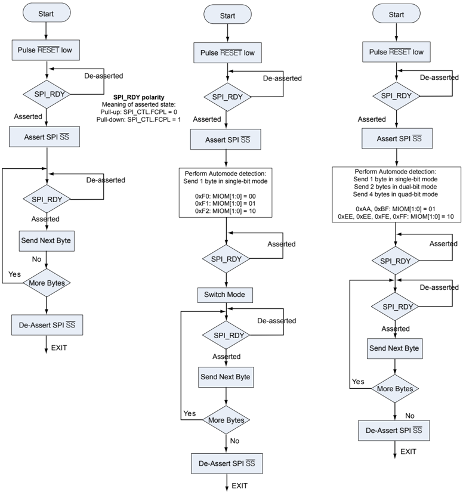

## Run-time API

The SPI Slave Boot mode can be called through the Boot Routine API function at run-time. Initiating a boot through the run-time API allows for extra customization such as disabling automatic device configuration or specifying a different SPI device other than the default.

When ROM\_BCMD\_NOCFG flag is specified, it is necessary to program pin multiplexing and other SPI configuration as required, while keeping the SPI\_CTL.EN bit cleared.

The ROM\_BCMD\_NOAUTO flag can suppress auto mode detection. In that case, the desired configuration must be passed through the ROM\_BCMD\_SPIS\_BCODE bit field, even if the ROM\_BCMD\_NOCFG flag is set.

The following table provides descriptions of the adi\_rom\_Boot() command parameter.

Table 53-18: SPI Slave Boot command Bit Descriptions

| Bit No. (Access)   | Bit Name             | Description/Enumeration                                                                                                                                                              | Description/Enumeration                                                                                                                                                              |
|--------------------|----------------------|--------------------------------------------------------------------------------------------------------------------------------------------------------------------------------------|--------------------------------------------------------------------------------------------------------------------------------------------------------------------------------------|
| 19:16              | ROM_BCMD_S PIS_BCODE | Boot Mode Specific BCODE. Specifies the boot mode-specific code that can further customize and control the boot process.                                                             | Boot Mode Specific BCODE. Specifies the boot mode-specific code that can further customize and control the boot process.                                                             |
| 19:16              | ROM_BCMD_S PIS_BCODE | 00xxb                                                                                                                                                                                | Single bit SPI bus                                                                                                                                                                   |
| 19:16              | ROM_BCMD_S PIS_BCODE | 01xxb                                                                                                                                                                                | Dual SPI bus                                                                                                                                                                         |
| 19:16              | ROM_BCMD_S PIS_BCODE | 10xxb                                                                                                                                                                                | Quad SPI bus                                                                                                                                                                         |
| 19:16              | ROM_BCMD_S PIS_BCODE | 11xxb                                                                                                                                                                                | Reserved                                                                                                                                                                             |
| 11:8               | ROM_BCMD_ DEVENUM    | Device enumeration. Specifies the SPI device to use.                                                                                                                                 | Device enumeration. Specifies the SPI device to use.                                                                                                                                 |
| 11:8               | ROM_BCMD_ DEVENUM    | 0x0                                                                                                                                                                                  | SPI0                                                                                                                                                                                 |
| 11:8               | ROM_BCMD_ DEVENUM    | 0x1                                                                                                                                                                                  | SPI1                                                                                                                                                                                 |
| 11:8               | ROM_BCMD_ DEVENUM    | 0x2                                                                                                                                                                                  | SPI2                                                                                                                                                                                 |
| 11:8               | ROM_BCMD_ DEVENUM    | 0x3 - 0xF                                                                                                                                                                            | Reserved                                                                                                                                                                             |
| 6                  | ROM_BCMD_ NOAUTO     | Automatic device detection disable. When set disables automatic device detection and uses the setting provided in the other fields of this register to configure the boot mode.      | Automatic device detection disable. When set disables automatic device detection and uses the setting provided in the other fields of this register to configure the boot mode.      |
| 5                  | ROM_BCMD_ NOCFG      | Device configuration disable. When set, this bit disables device configuration. Device configuration includes reconfiguration of the peripherals MMRregisters and device pin muxing. | Device configuration disable. When set, this bit disables device configuration. Device configuration includes reconfiguration of the peripherals MMRregisters and device pin muxing. |
| 4                  | ROM_BCMD_ HOST       | Host boot mode enable. When set, this bit indicates that SPI slave boot is to be performed. Otherwise, use the master boot mode.                                                     | Host boot mode enable. When set, this bit indicates that SPI slave boot is to be performed. Otherwise, use the master boot mode.                                                     |

Table 53-18: SPI Slave Boot command Bit Descriptions (Continued)

| Bit No. (Access)   | Bit Name         | Description/Enumeration                                |
|--------------------|------------------|--------------------------------------------------------|
| 3:0                | ROM_BCMD_ DEVICE | Boot source device. Specifies the device to boot from. |
| 3:0                |                  | 0x2 SPI                                                |

NOTE: All bits in the above table that are not defined must be set to zero. Features supported may be limited depending on peripheral instance.

## Link Port Slave Boot Mode

This section describes booting from the link port with the processor as a slave.

Link port boot is a slave boot mode in which the processor receives boot data from an external link port master through link port 0. The link port is configured for receive mode and all transfers from the link port to memory are performed under the control of DMA. The maximum supported operating frequency of the link port is 66 MHz for which the master boot source is responsible for deriving the clock frequency. The link port receiver operates at an asynchronous frequency up to the maximum supported operating frequency.

The link port protocol supports a way to generate link port transmit and receive service requests. The transmit service request is generated on the processor to transmit data when the transmitter is disabled. The receiver drives the LACKx signal high to initiate this activity. The receive service request is generated on a receiver when it is disabled. The transmitter drives the LCLKx signal high to initiate this activity.

Because the transmitter and receivers can be enabled at different times, external pull-down resistors are required on both the LCLKx and LACKx signals to eliminate any false service request assertions.

The link port slave boot mode initialization phase waits for the receive service request before passing control back to the main kernel. Once this initial receive service request has been detected, the receiving link port is enabled and the boot process completes. The receiving link port is not disabled again until after boot is complete. Once the link port is enabled, the receive DMA channel controls all transfers. The load function for the link port receive boot mode can then point to the peripheral DMA routine of the main kernel in a similar way to the SPI slave boot mode.

## Run-time API

The LINKPORT slave boot mode can be called through the boot routine API function at run time. The run-time API allows for more customization. Both device auto-detection and device configuration can be disabled, and a device other than the default LINKPORT0 can be specified.

If ROM\_BCMD\_NOCFG flag is specified, it is the programs responsibility to configure pin multiplexing as required.

The following table provides descriptions of the adi\_rom\_Boot() command parameter.

Table 53-19: LINKPORT Slave Boot command Bit Descriptions

| Bit No. (Access)   | Bit Name          | Description/Enumeration                                                                                                                                                              |
|--------------------|-------------------|--------------------------------------------------------------------------------------------------------------------------------------------------------------------------------------|
| 11:8               | ROM_BCMD_ DEVENUM | Device enumeration. Specifies the LINKPORT device to use.                                                                                                                            |
| 11:8               | ROM_BCMD_ DEVENUM | 0x0 LP0                                                                                                                                                                              |
| 11:8               | ROM_BCMD_ DEVENUM | 0x1 LP1                                                                                                                                                                              |
| 11:8               | ROM_BCMD_ DEVENUM | 0x2 - 0xF Reserved                                                                                                                                                                   |
| 6                  | ROM_BCMD_ NOAUTO  | Automatic device detection disable. When set disables automatic device detection and uses the setting provided in the other fields of this register to configure the boot mode.      |
| 5                  | ROM_BCMD_ NOCFG   | Device configuration disable. When set, this bit disables device configuration. Device configuration includes reconfiguration of the peripherals MMRregisters and device pin muxing. |
| 4                  | ROM_BCMD_ HOST    | Host boot mode enable. When set, this bit indicates that SPI slave boot is to be performed. Otherwise, use the master boot mode.                                                     |
| 3:0                | ROM_BCMD_ DEVICE  | Boot source device. Specifies the device to boot from.                                                                                                                               |
| 3:0                | ROM_BCMD_ DEVICE  | 0x4 LINKPORT                                                                                                                                                                         |

NOTE: All bits in the above table that are not defined must be set to zero. Features supported may be limited depending on peripheral instance.

## UART Slave Boot Mode

When using UART slave mode boot, the processor receives boot data from a UART host device connected to the UART interface. The device connected to UART0 is initially detected using an autobaud detection sequence. After finishing the UART slave boot process, all control and status registers of the used resources are restored.

Further customization, such as disabling autobaud detection, and changing the device, use the boot routine API.

During the boot operation, the host device usually relies on the RTS output of the UART device. At boot time, the processor does not evaluate RTS signals driven by host. Since the RTS is in a high impedance state when the processor is in reset, or while executing a pre-boot, an external pull-up resistor to VDDEXT is recommended. The Connection Between Host and Processor figure shows the interconnection required for booting. The figure does not show physical line drivers and level shifters that are typically required to meet the individual UART-compatible standards.

Figure 53-7: Connection Between Host and Processor

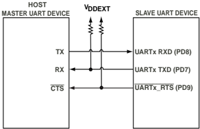

When the UART is enabled, the RTS goes immediately low, encouraging the host to send the first boot stream data as shown in the Host Relying on RTS figure. For half-duplex UART connections, the host must avoid this action. The host must wait until it has received the 4 bytes from the slave processor before sending any data.

Figure 53-8: Host Relying on RTS

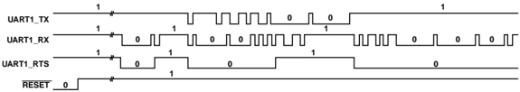

When the boot kernel is processing fill or Initcode blocks, it can require extra processing time and must delay the host from sending more data. This request is signaled using the RTS output.

The Host Relying on RTS figure shows RTS timing when an extended Initcode routine executes. Since code execution is distracting from the data loading, the host device must be prevented from sending more data. The timing of the RTS depends on the state of the RFRT bit in the UART control register ( UART\_CTL ). This bit is cleared during UART slave boot mode when RTS is de-asserted, the UART receive FIFO contains 4 or more data words, and another start bit is detected.

NOTE: Secure Boot Stream Padding

For slave boot modes, the host must always send data in multiples of 1024 bytes. This requirement is due to the sizing of internal buffers used for DMA.

## Autobaud Detection

The kernel supports autobaud detection using the '@' character as data. The host is expected to have its clock set to a rate supported in the UART.

To determine the bit rate when performing autobaud detection, use the following steps:

1. The boot kernel expects an '@' character (0x40, eight bits data, one start bit, one stop bit, no parity bit) on the UART RXD input.
2. The EDBO and UART\_CLK register is cleared.
3. The boot kernel acknowledges, and the host then downloads the boot stream. The acknowledgment consists of 4 bytes: 0xBF , UART\_CLK [15:8], UART\_CLK [7:0], 0x00.

4. The host is requested to not send further bytes until it has received the complete acknowledge string.
5. Once the 0x00 byte is received, the host can send the entire boot stream.

The host knows the total byte count of the boot stream, but it is not required to know the content of the boot stream.

UART0\_RX

UART0\_RX

UART0\_RTS

UART0\_CTS

Figure 53-9: UART Autobaud Detection Waveform

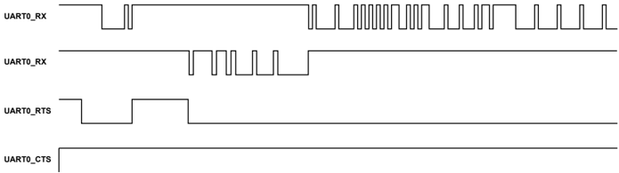

The UART Autobaud Detection Waveform figure provides timing information for UART booting. After the bit rate is known, the UART is enabled and the kernel transmits the 4 acknowledge bytes.

## Run-time API

The UART slave boot mode can be called through the boot routine API function at run time. The run-time API allows for more customization. Both autobaud detection and device configuration can be disabled, and a device other than the default UART0 can be specified.

If ROM\_BCMD\_NOCFG flag is specified, it is the programs responsibility to configure pin multiplexing as required.

Autobaud detection can be suppressed using the ROM\_BCMD\_NOAUTO flag. In this case, the desired configuration can be passed through the ROM\_BCMD\_UART\_CLK bit field. If the ROM\_BCMD\_UART\_CLK bit field is zero, UART\_CLK is evaluated. If a value of 0xFFFF was present, the default error routine of the boot kernel is called and the booting process is aborted. Otherwise, the value in UART\_CLK remains untouched.

The following table provides descriptions of the adi\_rom\_Boot() command parameter.

Table 53-20: UART Slave Boot command Bit Descriptions

| Bit No. (Access)   | Bit Name            | Description/Enumeration                                      |
|--------------------|---------------------|--------------------------------------------------------------|
| 31:16              | ROM_BCMD_ UART_CLK  | UART Clock Divider. When set to zero this field is ignored.  |
| 15                 | ROM_BCMD_ UART_EDBO | UART Clock Divider Mode When set enables EDBO functionality. |

Table 53-20: UART Slave Boot command Bit Descriptions (Continued)

| Bit No. (Access)   | Bit Name          | Description/Enumeration                                                                                                                                                              |
|--------------------|-------------------|--------------------------------------------------------------------------------------------------------------------------------------------------------------------------------------|
| 11:8               | ROM_BCMD_ DEVENUM | Device enumeration. Specifies the UART device to use.                                                                                                                                |
| 11:8               | ROM_BCMD_ DEVENUM | 0x0 UART0                                                                                                                                                                            |
| 11:8               | ROM_BCMD_ DEVENUM | 0x1 UART1                                                                                                                                                                            |
| 11:8               | ROM_BCMD_ DEVENUM | 0x2 UART2                                                                                                                                                                            |
| 11:8               | ROM_BCMD_ DEVENUM | 0x3 - 0xF Reserved                                                                                                                                                                   |
| 6                  | ROM_BCMD_ NOAUTO  | Automatic device detection disable. When set disables automatic device detection and uses the setting provided in the other fields of this register to configure the boot mode.      |
| 5                  | ROM_BCMD_ NOCFG   | Device configuration disable. When set, this bit disables device configuration. Device configuration includes reconfiguration of the peripherals MMRregisters and device pin muxing. |
| 4                  | ROM_BCMD_ HOST    | Host boot mode enable. When set, this bit indicates that SPI slave boot is to be performed. Otherwise, use the master boot mode.                                                     |
| 3:0                | ROM_BCMD_ DEVICE  | Boot source device. Specifies the device to boot from.                                                                                                                               |
| 3:0                | ROM_BCMD_ DEVICE  | 0x3 UART                                                                                                                                                                             |

NOTE: All bits in the above table that are not defined must be set to zero. Features supported may be limited depending on peripheral instance.

## Boot Loader Stream

A loader stream is a set of formatted blocks containing instructions for the boot kernel, as well as the application and data for loading to the chip. This section details the different aspects of the stream, its blocks, some common use cases, and the ROM functionality.

Each block begins with a block header which contains attributes of the block as well as flags to control its processing by the boot ROM. On power-up or reset, the processor begins executing the on-chip boot ROM. The boot stream is either read from memory or received from a peripheral, depending on the boot mode specified. Each block in the boot stream instructs the boot kernel to perform an action, most commonly to load data to a specified location. For a complete list of actions, refer to Block Types. Some common actions include:

- running code that initializes a peripheral
- processing data then loading it to a location

As the Project Flow figure illustrates, a utility is required to process the resulting output from the tool chain to create a valid boot stream. This utility can be in the form of a standalone application or script that parses an application image file, elf output file, or text-based file such as Intel hex. It creates a valid boot stream. A flash programmer utility can format a boot stream internally.

The elfloader utility parses the application data, and creates a set of blocks representing the segmented application. When processing an actual image that must be loaded to a single contiguous memory block, this representation can contain as little as a single header block. The output of the standalone utility is stored in a loader file (.ldr). The loader file contains the boot stream and becomes available to hardware by:

- programming or burning it into non-volatile external memory, or
- sending it through a peripheral such as the UART during boot time

A loader stream must always begin with a first block and end with a final block. The loader file contains the boot stream and becomes available to hardware by:

- programming or burning it into non-volatile external memory, or
- sending it through a peripheral during boot time

Figure 53-10: Project Flow

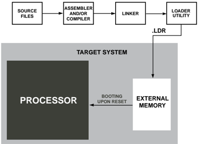

The Booting Process figure shows the parallel or serial boot stream contained in a flash memory device. In host boot scenarios, the non-volatile memory usually connects to the host processor rather than directly to the processor. After reset, the on-chip boot kernel reads and parses the headers and the loader stream is processed block-by-block. Finally, payload data is copied to destination addresses, either in on-chip L1 and L2 memory, or off-chip to SDRAM or SRAM.

Figure 53-11: Booting Process

In some cases (for example, secure boot or when the BFLAG\_INDIRECT flag for any block is set), the boot kernel uses another memory block for intermediate data storage. In order to preserve the security of the device processors will not allow these storage regions to be initialized with boot data. The boot stream is loaded to the intermediate storage then processed by the kernel and loaded to the final destination. Thge final destination cannot be the intermediate storage location otherwise the boot process will terminate in error.

## Block Header

Figure 53-12: Loader Stream Block Structure

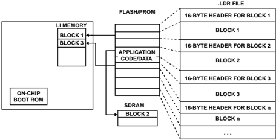

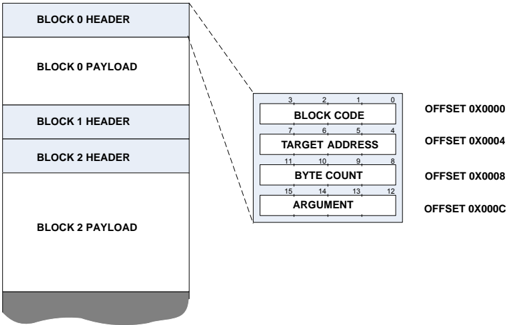

A boot stream consists of multiple boot blocks as shown in the figure. A 16-byte block header begins every block. The 16 bytes are functionally grouped into four 32-bit words:

- the block code
- the target address
- the byte count
- the argument field

This section describes the fields in general. The uses can vary depending on the particular block type and boot mode. Refer to the block type descriptions and boot modes for further information.

## Block Code

Table 53-21: Block Code flags

| Bit   | Name           | Description                                                                                                                                                                                                   |
|-------|----------------|---------------------------------------------------------------------------------------------------------------------------------------------------------------------------------------------------------------|
| 0-3   | BCODE          | Specific to boot modes (see Boot Modes)                                                                                                                                                                       |
| 4     | BFLAG_SAVE     | Intended to allow for a user application to mark blocks for saving the memory of this block to off-chip memory in case of power failure . The on-chip boot kernel does not use this flag.                     |
| 5     | BFLAG_AUX      | When set indicates that the byte address space translation for SHARC core boot blocks requires translation to the 48-bit PM address space. When cleared translation to the 32-bit address space is performed. |
| 6     | reserved       |                                                                                                                                                                                                               |
| 8     | BFLAG_FILL     | Fill the target location with a specified 32-bit value                                                                                                                                                        |
| 10    | BFLAG_CALLBACK | Calls the previously registered callback function                                                                                                                                                             |
| 11    | BFLAG_INIT     | Calls function at target address. If the block contains a payload, the payload is loaded prior to the call.                                                                                                   |
| 12    | BFLAG_IGNORE   | Block payload is ignored                                                                                                                                                                                      |
| 13    | BFLAG_INDIRECT | Boots the payload to the intermediate storage location                                                                                                                                                        |
| 14    | BFLAG_FIRST    | Indicates the block to be the beginning of a new application                                                                                                                                                  |
| 15    | BFLAG_FINAL    | Indicates the last block of a loader stream. Booting will complete after processing the block. This flag does not denote the end of an application in a Multi-Application Boot Streams boot stream.           |
| 16-23 | HDRCHK         | A simple 8-bit XOR checksum of the other 24 bits in the boot block header.                                                                                                                                    |
| 24-31 | HDRSIGN        | 0xAD, 0xAC or 0xAB. Indicates if the boot block is intended for core 0, core 1 or core 2 respec- tively.                                                                                                      |

## TARGET\_ADDRESS

The TARGET\_ADDRESS holds the applicable address for the block, (where the code or data is loaded). However, the interpretation of the field differs depending on what specific flags are set in the block code. Refer to the documentation for each block type for details.

The following attributes must be true:

- The target address must be divisible by 4, as the boot kernel uses 32-bit DMA for certain operations.
- The target address must point to valid on-chip or off-chip memory locations.

## BYTE\_COUNT

The byte count must be divisible by 4, and can also be zero. This 32-bit field generally holds the size of the block. In some cases, it has a different use (such as when BFLAG\_FILL is set). See the Block Types section for information on the variations.

## ARGUMENT

The 32-bit field is a user-variable for most block types. The Initcode or the callback routine can access this value and use it for optional instructions.

The different block types use the ARGUMENT field in various ways. See the Block Types descriptions for further information.

## Block Types

A loader stream is a set of linked blocks and each block is responsible for performing a certain function dependent on the block type. The flags in the block header define a block type. Operations include functions such as loading data, filling a memory region with data, and instructing the kernel to stop processing. This section describes each block type and its usage within a boot loader stream.

## Normal Block

The primary function of a block is to load data into a specified location of memory. A normal block instructs the boot kernel to load the data contained in its payload to the location specified in the TARGET\_ADDRESS field. The BYTE\_COUNT defines the size of the payload. Once the correct amount of data has been loaded, the kernel moves on to process the next block in the stream.

Table 53-22: Flags

| Flag           | Required Value   | Init                                            |
|----------------|------------------|-------------------------------------------------|
| TARGET_ADDRESS | Y                | Address where payload is loaded (must be valid) |
| BYTE_COUNT     | Y                | Size of block in bytes                          |

## First Block

A first block indicates the start of a boot stream and is always needed at the beginning of the boot stream. When a loader stream contains Multi-Application Boot Streams, a first block occurring within the loader stream indicates the beginning of a new application.

When the kernel processes the first block in a loader stream, the boot kernel uses the TARGET\_ADDRESS to determine the application entry location. For more details, refer to Boot Termination and Application Execution .

NOTE: A first block cannot be combined with a fill block.

Table 53-23: Flags

| Flag        | Required Value   |   Init |
|-------------|------------------|--------|
| BFLAG_FIRST | Y                |      1 |

Table 53-23: Flags (Continued)

| Flag           | Required Value   | Init                                                                                                                                                                                                       |
|----------------|------------------|------------------------------------------------------------------------------------------------------------------------------------------------------------------------------------------------------------|
| ARGUMENT       | Y                | Offset to the next application, or first address following loader stream. Commonly re- ferred to as the NEXTDXE field.                                                                                     |
| TARGET_ADDRESS | Y                | When the block is the first block in a loader stream, also defines the start address for the application. If the block is not the first in a loader stream, use the target address as in normal operation. |

## Final Block

The final block marks the last block in a boot stream. After processing a final block, the boot kernel jumps to the start address of the application. For more information on the definition of the start address, refer to Boot Termination and Application Execution .

There is further customization to the kernel behavior available. For example, the kernel can be instructed to return from the boot routine rather than jump to the application using initialization codes or the adi\_rom\_Boot() API.

Before the boot kernel passes program control to the application, it does some housekeeping. Most of the registers in use are set to their default state. However, some register values can differ depending on the boot mode. See Boot Modes for more information.

Table 53-24: Flags

| Flag        | Required Value   |   Init |
|-------------|------------------|--------|
| BFLAG_FINAL | Y                |      1 |

## Indirect Block

An indirect block is first loaded to a storage location before being copied to the destination. The following situations motivate this functionality:

- Some boot modes do not use DMA from the boot peripheral. The core is not always able to access some memory locations directly or efficiently. An intermediate load to a different location improves overall efficiency.
- In some booting scenarios, the data in the payload must be operated-on or analyzed before it is fully loaded (such as decryption or checksum calculation). By using an intermediate location, such scenarios are simplified and can be more efficient when loading to off-chip memories (see Callback Block).

In some cases, a boot block does not fit into temporary storage memory. Having a larger buffer can improve boot performance. If an entire block cannot fit into the buffer, it is processed in pieces. Initialization code or callback functions can alter the temporary buffer region, including its location and size, by modifying ADI\_ROM\_BOOT\_CONFIG::pTempBuffer and ADI\_ROM\_BOOT\_CONFIG::dTempByteCount variables in the ADI\_ROM\_BOOT\_CONFIG structure.

Table 53-25: Flags

| Flag           | Required Value   | Init                                                                                                |
|----------------|------------------|-----------------------------------------------------------------------------------------------------|
| BFLAG_INDIRECT | Y                | 1                                                                                                   |
| BFLAG_CALLBACK | N                | Defines a callback function to operate on intermediate data. These 2 flags are often used together. |

## Ignore Block

An ignore block is a block that is (in most cases) ignored by the loader stream. Ignore blocks are useful when it is not possible to pass information in another block header. For example, if the first block contains data such as a firmware revision rather than application code, then BFLAG\_IGNORE can be set with the correct application start address. This step ensures that the loader stream uses the correct start address. Since this block has no other function, identify it as an ignore block. Then, the kernel does not attempt to process any payload.

Ignore blocks result in the clearing of the following flags, disabling the corresponding blocks from being processed if set along with BFLAG\_IGNORE :

- BFLAG\_INIT
- BFLAG\_CALLBACK
- BFLAG\_FINAL
- BFLAG\_AUX

NOTE: When BFLAG\_IGNORE is set along with BFLAG\_FIRST , only the payload associated with the first block is ignored. The application entry point retrieved from the first block is always processed.

Table 53-26: Flags

| Flag         | Required Value   | Init                                 |
|--------------|------------------|--------------------------------------|
| BFLAG_IGNORE | Y                | 1                                    |
| BYTE_COUNT   | Y                | Size of block to ignore; can be zero |

## Fill Block

A fill block instructs the boot kernel to perform a 32-bit memory fill of the memory region. Fill blocks help minimize the size of a boot stream when an application contains large arrays of data that need to be initialized upon startup. Zero fill is the most common fill block type. However, any 32-bit fill value is supported.

Table 53-27: Flags

| Flag           | Required Value   | Init                                            |
|----------------|------------------|-------------------------------------------------|
| BFLAG_FILL     | Y                | 1                                               |
| TARGET_ADDRESS | Y                | Address where payload is loaded (must be valid) |
| BYTE_COUNT     | Y                | Size of block in bytes (must be multiple of 4)  |
| ARGUMENT       | Y                | 32-bit fill value                               |

## AUX Block

The AUX block is used to indicate whether addresses not within the system wide byte address space for the processor are to be converted using the regular 32-bit address space translation or 48-bit program memory space conversion. When this flag is cleared, 32-bit address conversion is used. When set, 48-bit address conversion is used to obtain the byte address to load the payload.

This flag is only required to be used when the utility used for generating the boot stream does not automatically convert payload addresses to the byte address space. When the boot kernel detects that an address in the block header is already targeted towards the byte address space, this flag has no purpose.

It should also be noted that the converted address is only used for the loading of the payload via the DMA channels. If a block such a callback block or an init block is required to execute from SHARC L1 48-bit PM space, the address is converted for the load operation. However, the call is performed to the original 48-bit PM address.

## Init Block

An initialization block instructs the boot kernel to do a function call to the target address after the entire block has loaded. The function called is referred to as the initialization code (Initcode) routine . Refer to the API reference initcode() for full details.

If the Initcode routine has been previously loaded, the block can declare a zero-size and have no payload.

Initcode routines can be used to speed up and customize booting mechanisms exposed by the boot kernel. Traditionally, an Initcode routine is used to setup system PLL, bit rates, wait states, and the external memory controllers. If executed early in the boot process, the boot time can be significantly reduced.

Initcode routines are required to follow the C language calling conventions. The expected C prototype is: void initcode(ADI\_ROM\_BOOT\_CONFIG * pBootConfig)

NOTE: When programming in assembly, use a return from subroutine instruction for returns.

The structure provided to the Initcode routine by the boot kernel contains various information about the block being processed. It includes header information, locations of temporary block data (for indirect blocks), target address, and byte count. See ADI\_ROM\_BOOT\_CONFIG for a full list and details on the provided data.

In the simplest case, an Initcode routine consists of only a single block in which the BFLAG\_INIT flag is set. For larger routines, a sequence of blocks can incrementally load the routine, and only the last block sets the BFLAG\_INIT flag. In the latter case, the last block has no payload attached, and simply instructs the boot kernel to issue a call to subroutine instruction.

An Initcode routine can be overwritten by a successive block when it is no longer needed. Otherwise, the routine can be called at multiple points during the boot process, and even remain in memory after the application completes booting.

NOTE: The following list provides requirements for Initcode that is written in C or C++.

- Ensure that the Initcode routine does not contain calls to the run-time libraries
- Do not assume that parts of the run-time environment, such as the heap, are fully functional
- Ensure that all run-time components are loaded and initialized before the routine executes

The loader utility and tool set provide mechanisms to aid in implementing initialization codes and organizing them properly within the boot loader stream. A special project type is provided to allow the creation of Initcode routines as separate projects. Options are available to assign particular pieces of the application to be Initcode routines. For details and more information on the utility, see to the Loader and Utilities manual .

Table 53-28: Flags

| Flag           | Required Value   | Init                                                                             |
|----------------|------------------|----------------------------------------------------------------------------------|
| BFLAG_INIT     | Y                | 1                                                                                |
| TARGET_ADDRESS | Y                | Location to load payload data. Call to subroutine issued to the same loca- tion. |
| ARGUMENT       | N                | Can be used to supply block specific arguments                                   |
| BYTE_COUNT     | Y                | Size of payload; can be zero                                                     |

NOTE: Init blocks result in execution of software not located in the boot rom during the boot process. In the case of a secure boot scenrio, initcode routines are not supported. The secure boot authentication process is performed at the end of the boot process. Execution of any user software prior to the authentication process would violate the secure boot requirements.

## Callback Block

A callback block instructs the boot kernel to call a pre-registered function upon completion of loading the payload of the block. The purpose of a callback routine is to apply standard processing to the block payload. The callback routine is registered through an Initcode routine prior to loading a block using the routine. Typically, callback routines contain checksum, decryption, decompression or hash algorithms. Please refer to callback() API reference.

To register a callback, create an Init Block whose Initcode modifies ADI\_ROM\_BOOT\_CONFIG::pCallBackFunction with the address of the callback function to execute. A callback function must be registered prior to processing a callback block.

Since callback routines require access to the payload data of the boot blocks, load the block data before processing. Often an Indirect Block block is used in combination with a callback block. Indirect blocks in combination with callback blocks can allow for post processing of the loaded data before it is then transferred to the final destination.

Callback routines are expected to meet the C language calling conventions. The prototype is as follows:

```
ROM_BOOT_RESULT callback( ADI_ROM_BOOT_CONFIG * pBootConfig, ADI_ROM_BOOT_BUFFER * pBuffer, uint32_t nFlags )
```

The pBootConfig argument contains a pointer to the ADI\_ROM\_BOOT\_CONFIG information, and pBuffer provides access to the address and size of the block (can vary when using indirect). The nFlags parameter is specifically used when BFLAG\_INDIRECT is also used. CBFLAG\_DIRECT flag indicates that the BFLAG\_INDIRECT bit is not active and so that the program only calls the callback routine once per block. When the CBFLAG\_DIRECT is set, CBFLAG\_FIRST and CBFLAG\_FINAL are also set.

NOTE: Callback blocks result in execution of software not located in the boot rom during the boot process. In the case of a secure boot scenario callback routines are not supported as the secure boot authentication process is performed at the end of the boot process and execution of any user software prior to the authentication process would violate the secure boot requirements.

## Callback Block Used in Conjunction with Indirect Block

When a block using a callback routine is also loaded indirectly, there are slight behavior differences. The procedure for loading is:

1. Load data into the temporary buffer defined by ADI\_ROM\_BOOT\_CONFIG::pTempBuffer .
2. Issue a call to ADI\_ROM\_BOOT\_CONFIG::pCallBackFunction .
3. After the callback routine returns, if the return value is zero, the memory DMA copies data to the destination.

When a block does not fit entirely into the temporary buffer, loading is performed similar to indirect blocks. The software calls the callback function after each chunk is loaded into the temporary storage. The nFlags parameter gives information on the specific iteration.

When a block does not fit entirely into the temporary storage area, the nFlags tells the callback routine whether it is invoked for the first time ( CBFLAG\_FIRST ) or called the last time ( CBFLAG\_FINAL ) for a specific block.

When the software invokes DMA to copy the data, it relies on the supplied pBuffer data, not the ADI\_ROM\_BOOT\_CONFIG::pTempBuffer and ADI\_ROM\_BOOT\_CONFIG::dTempByteCount members of the boot structure. The callback routine can control the source of the memory DMA by altering the content

of the pBuffer structure. This alteration can be necessary when the callback routine performs data manipulation such as decompression.

When the software uses an indirect block, the return value of the callback routine determines whether the DMA transfer occurs. If the value is non-zero, then the transfer does not occur.

Table 53-29: Flags

| Flag           | Required Value   |   Init |
|----------------|------------------|--------|
| BFLAG_CALLBACK | Y                |      1 |

NOTE: Callback blocks result in execution of software not located in the boot rom during the boot process. In the case of a secure boot scenrio callback routines are not supported as the secure boot authentication process is performed at the end of the boot process and execution of any user software prior to the authentication process would violate the secure boot requirements.

## Quick Boot Block

There are some booting scenarios in which not all memories are required to be reinitialized during the boot process and as a result the boot kernel supports conditional processing of boot blocks in specific circumstances. Dynamic RAM is also not always impacted if it was put into a self-refresh mode before the processor powered down.

The processing of a quick boot block is determined by the state of the BFLAG\_WAKEUP , BFLAG\_QUICKBOOT and BFLAG\_IGNORE flags.

Table 53-30: Quick Boot Block Processing

|   BFLAG_WAKEUP |   BFLAG_QUICKBOOT |   BFLAG_IGNORE | Block Processed   |
|----------------|-------------------|----------------|-------------------|
|              0 |                 0 |              0 | Yes               |
|              0 |                 0 |              1 | No                |
|              0 |                 1 |              0 | Yes               |
|              0 |                 1 |              1 | No                |
|              1 |                 0 |              0 | Yes               |
|              1 |                 0 |              1 | No                |
|              1 |                 1 |              0 | No                |
|              1 |                 1 |              1 | Yes               |

The BFLAG\_WAKEUP flag is applied to the entire boot process when calling the boot kernel. Refer to adi\_rom\_Boot() for further details on the global flags available that can be applied to the boot process.

When the boot process is triggered via a hard reset or a software triggered system reset event the boot kernel is always called with BFLAG\_WAKEUP cleared. Processors not supporting the wakeup from hibernate feature would generally not have this quickboot feature available for typical boot events. However, when using

adi\_rom\_Boot() or adi\_rom\_BootKernel() from the user application to boot the processor, the quickboot feature and selective processing of boot blocks is fully available .

NOTE: When BFLAG\_WAKEUP is set and a block also has BFLAG\_QUICKBOOT set, BFLAG\_IGNORE flag is toggled within the boot kernel. This event occurs before the processing of an Ignore Block and as such also has an influence on the processing of blocks that are disabled as a result of BFLAG\_IGNORE being set.

NOTE: If an initcode contains an implementation that requires some operations to be performed for wakeup type events, do not set BFLAG\_QUICKBOOT in the initblock, disabling it completely. Instead, ensure BFLAG\_QUICKBOOT is clear and perform any conditional processing based on the state of the BFLAG\_WAKEUP flag.

Table 53-31: Flags

| Flag            | Required Value   |   Init |
|-----------------|------------------|--------|
| BFLAG_QUICKBOOT | Y                |      1 |

## Save Block

A save block is intended to mark blocks in a boot stream that are to be saved to off-chip memory. The on-chip boot kernel does not use this flag. A user application can process the boot steam to find address of regions of memory that are to be saved off to external memory. Upon a reboot the user application may then restore the previously saved contents. It provides a means of doing a context restore after a reboot.

Table 53-32: Flags

| Flag       | Required Value   |   Init |
|------------|------------------|--------|
| BFLAG_SAVE | Y                |      1 |

## Single-Block Boot Streams

The simplest boot stream consists of a single block header and one contiguous block of instructions and possibly data. When the appropriate flags are set in the block header, the kernel loads the block to the target address, terminates the boot process, and begins executing from the entry address of the application.

The Initial Header for Single-Block Stream table shows an example of a single-block boot stream header with settings that can be loaded using any boot mode. The BFLAG\_FIRST and BFLAG\_FINAL flags are both set at the same time. The desired location and size of the application determines the target address and byte count.

When using single block boot streams on products with multiple cores, the boot stream must be targeted towards the primary booting core that manages the boot process. If core 0 is the primary booting core, the boot stream must contain code that is intended for execution by that core. It is possible to boot an single block boot stream when

using the API to load an application to the non booting core. In this case the BFLAG\_RETURN flag must be set so the boot process returns to user application on the core mastering the boot process.

Table 53-33: Initial Header for Single-Block Stream

| Field          | Description of Value                                                     |
|----------------|--------------------------------------------------------------------------|
| BLOCK_CODE     | 0xAD000000&#124;XORSUM&#124; BFLAG_FINAL &#124; BFLAG_FIRST              |
| TARGET_ADDRESS | Start address of block                                                   |
| BYTE_COUNT     | Number of bytes in the block                                             |
| ARGUMENT       | Functions as next-application pointer in multi-application boot streams. |

## Direct Code Execution

Applications can avoid long booting times and execute code from flash or SDRAM memory with minimal processing by the boot kernel. This feature is called direct code execution.

An initial boot block header is required for the processor to fetch and execute program code from the boot device as early as possible. The block uses safety mechanisms of the block to avoid unpredictable processor behavior when boot memory is not yet programmed with valid data. Safety mechanisms include the header signature and the bytewise XOR checksum. Rather than blindly executing code, the boot kernel first executes the pre-boot routine for system customization. It then loads the first block header and checks it for consistency. If the block header is corrupt, the boot kernel calls the error handler and does not start code execution.

If the initial block header check is good, the boot kernel interrogates the block flags. If the block has the BFLAG\_FINAL flag set, the boot kernel terminates and executes the sequence as described in the Boot Termination and Application Execution section. To cause the boot kernel to customize the starting address in advance, the first block must also have the BFLAG\_FIRST flag set. The target address field is then saved as the application start address.

When processing direct code execution blocks, the block instructs the processor executing the boot code to execute from the address specified. It is not possible to have core 0 to boot the block and have it instruct core 1 to immediately start execution from the address provided.

Table 53-34: Example Direct Code Execution Header

| Field          | Value      | Comments                                                                                                                                                                                       |
|----------------|------------|------------------------------------------------------------------------------------------------------------------------------------------------------------------------------------------------|
| BLOCK_CODE     | 0xAD7BD006 | 0xAD000000&#124;XORSUM&#124; BFLAG_FINAL &#124; BFLAG_FIRST &#124; BFLAG_IGNORE &#124;BCODE                                                                                                    |
| TARGET_ADDRESS | 0x20000020 | Start address of application code. Provided as an example this would be de- pendent upon the start address required for a given product.                                                       |
| BYTE_COUNT     | 0x00000010 | Ignores 16 bytes to provide space for control data such as version code and build data. This field is optional and can be zero. The payload is ignored due to the BFLAG_IGNORE flag being set. |
| ARGUMENT       | 0x00000010 | Functions as next-application pointer in multi-application boot streams.                                                                                                                       |

## Multi-Application Boot Streams

This section describes loader streams that contain multiple applications.

A boot stream is typically generated from an application file. It is therefore common to refer to loader streams with more than one application (multi-application) booting. A loader utility often accepts multiple application files as input parameters and generates a contiguous boot image. The subsequent applications are appended to the first.

The loader utility must also update the argument field of all BFLAG\_FIRST blocks. The argument field of a BFLAG\_FINAL block is called the next-application pointer.

The next-application pointer of the first application boot stream points relatively to the start address of the second application boot stream. A multi-application boot image can be seen as a linked list of boot streams. The next-application pointer of the last application boot stream points relatively to the next free address. The Multi-Application Boot Stream Example figure illustrates an example.

Figure 53-13: Multi-Application Boot Stream Example

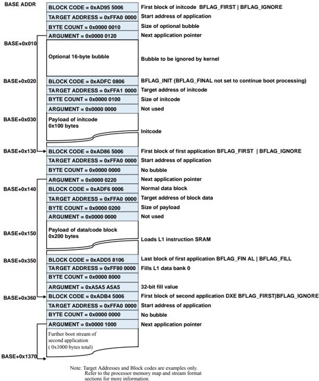

The Multi-Application Direct Code Execution Example figure shows a linked list of initial block headers. The blocks instruct the boot kernel to terminate immediately and to start code execution at the address provided by the target address field of the individual blocks. There is nothing in the boot code that prevents multi-application streams from mixing regular boot streams and direct code execution blocks.

Figure 53-14: Multi-Application Direct Code Execution Example

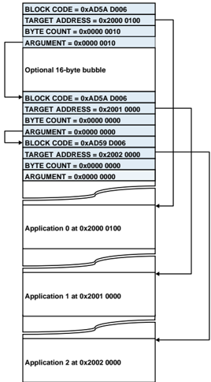

## CRC32 Protection

This section describes the CRC32 protection provisions.

The boot kernel provides mechanisms to allow verification of each blocks payload using a 32-bit CRC. The boot rom contains a function in the rom that can be called as an initcode to register the CRC callback and initialize the CRC peripheral with a user specified polynomial. The utilities provided by the supporting toolchain for the processor allow for generation of CRC32 protected loader streams.

To enable this feature an Init Block must be located in the boot stream with a TARGET\_ADDRESS that points to the function in the ROM. The ARGUMENT field contains the CRC32 checksum polynomial to be used to initialize the CRC lookup table. Once this CRC initcode function in the ROM has been executed CRC verification is enabled for all subsequent blocks except:

- Ignore
- First

NOTE: Due to the fact that the enabling of the CRC functionality is dependent upon the use of an Initblock. The feature is not supported in secure boot situations.

## Secure Boot

The secure boot process provides a means of integrating security in the processor boot sequence. A chain of trust is established within the system by ensuring the integrity and authenticity of the boot image. Confidentially support is also supported.

Secure boot increases protection against malicious, unsecured accesses to critical and confidential resources of the processor. The boot stream application code and data must be digitally signed in order to build up a chain of trust in the system. This allows the processor to distinguish between authentic and trusted code from non-authentic and untrusted code.

Secure boot also provides confidentiality support. The digitally signed boot image can be optionally encrypted as well. When loading an encrypted image, the ROM decrypts while loading, then authenticates, before any application code is executed.

Secure boot is an optional feature of the processor and is disabled by default. The feature is enabled using the OTP lock API, and secure boot cannot be disabled after it has been enabled. When security is enabled, developers are not dependent upon on Analog Devices to provision the devices, sign code or provide security certificates. The required tools for signing and encrypting the boot images are provided with the development tools for the processor.

## Integrity and Authenticity Protection

Integrity protection is based on the secure hash SHA-2 224 bit algorithm. Authenticity protection is based on the ECDSA algorithm.

ECDSA uses public key cryptography consisting of two keys, a private key and a public key. The public key is stored in OTP memory on the processor so that the secure boot process can verify the authenticity of the signed boot image. Only parties in possession of the private key are able to sign the images.

## Confidentiality Protection

Confidentiality protection uses the AES algorithm. Two variants are supported, wrapped and unwrapped.

The wrapped variant utilizes a 128-bit Key Encryption Key (KEK) stored on the processor to decrypt the 128-bit AES decryption key embedded in the secure header. The unwrapped variant stores the AES description key on the processor and utilizes it to decrypt the entire image.

The privacy of the key stored on the device (whether AES or KEK) is paramount to the security of the system. Disclosure of this key compromises security of the entire system.

## Anti-Cloning Protection

Anti-cloning protection is based on the confidentiality protection. If each processor uses a unique private key for the confidentiality protection, then cloning between these devices can be prevented. The boot image is incompatible with devices using a different private key for the decryption.

## Anti-Rollback Protection

The secure boot process supports anti-rollback protection through a 32-bit counter in the OTP memory. A value of 0x00000000 in the OTP results in anti-rollback being disabled by default. If anti-rollback protection is required, then the user may set the Rollback ID when signing the boot image. Upon successful authentication of the boot image, the secure boot software then updates the counter in the OTP. The software updates the counter if the rollback ID in the boot image is greater than the value currently stored in the OTP counter.

The rollback ID stored in the secure boot image header is integrity-protected preventing altering of the rollback ID.

NOTE: In order to initially enable anti-rollback protection for secure boot operations, a non-zero must be written to the 32-bit counter in the OTP memory. As long as this register filed remains at the default value of zero anti-rollback protections will not be enabled regardless of the rollback ID located in a secure boot stream.

CAUTION: As the rollback ID is implemented in the OTP module, there are a number of restrictions for its use. It is therefore recommended to only use the OTP boot program ROM API to set the counter. Refer to the OTP counters section for information detailing the implementation strategy.

## Terminology

## ECDSA

Elliptical Curve Digital Signature Algorithm

## BLp

BLx

BLw

BLe

## SBLS

## SBH

Secure Boot Header

## SBCR

Secure Boot Confidentiality Root

Boot Loader plain text, Plaintext Format

Boot Loader without key, Keyless Format

Boot Loader wrapped, Wrapped Format

Boot Loader encrypted, Encrypted Format

Secure Boot Loader Stream

## AES

Advanced Encryption Standard

## Secure Boot Image Signing

All boot images must be digitally signed to create secure boot images. The boot image is processed by the security utilities included with the development tools to sign and optionally encrypt the boot image. The security utilities operate with key-pairs consisting of a private and a public key. The private key is used for signing the images, and the public key is used to validate an image being loaded into the processor.

CAUTION: The private key generated from the singing utility, used for signing images, is never required by the processor for successful secure boot. The private key is only ever required by the signing utility and should be made available only within the system responsible for the image signing process.

The image signing utility provides the following functionality:

- Signing and encrypting of images
- Generation of ECDSA key pairs
- Generation of random encryption keys
- Extraction of the public key from an ECDSA key pair
- Setting Secure Boot Image Attributes

For more information on the use of the signing utility, refer to the Loader and Utilities manual.

## Secure Boot Image Types

This section provides an overview of the different image types supported, as well as supporting information on how to use them.

## Plaintext Format (BLp)

Provides integrity plus authentication protection of the boot image. The boot image is produced using a 224-bit Elliptical Curve Digital Signature Algorithm (ECDSA) private key. To authenticate the image, program the corresponding public key into the OTP public\_key field using the OTP boot program API.

SBH

Boot Loader Stream

## Wrapped Format (BLw)

Provides the highest level of protection: integrity plus authentication, confidentiality, and anti-cloning protection. The image contains an ECDSA wrapped image encryption key (denoted by [K]) within the secure header. The image data is encrypted with the wrapped key, preventing cloning. An extra key is required to unwrap the header, program this key into OTP pvt\_128key field using the OTP boot program API.

| SBH [K]   | Encrypted Boot Loader Stream   |
|-----------|--------------------------------|

## Keyless Format (BLx)

Similar to the BLw format except that the image does not contain the key at all. This format provides anti-cloning protection only if the secure key is unique per device. Program the decryption key for the data into OTP pvt\_128key field using the OTP boot program API.

| SBH   | Encrypted Boot Loader Stream   |
|-------|--------------------------------|

## Secure Boot Image Format

Secure Boot images provide authenticity and integrity protection during the boot process. A secure boot image is comprised of a secure boot header and an optionally encrypted loader stream.

Signed images consist of the following sections to comprise a complete secure boot image:

- Secure Boot Header
- Image Attributes
- Image Section

The Figure 53-15 Secure Boot Image figure shows that the image attributes are encapsulated within the secure boot header. The image attributes are actually integrity protected along with the image section. The image section contains a standard Boot Loader Stream. Some block types are not allowed as described in Unsupported Boot Stream Blocks.

Figure 53-15: Secure Boot Image

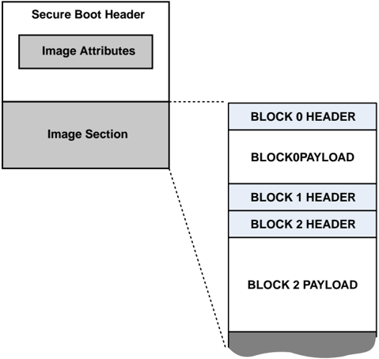

## Secure Boot Header

Table 53-35: Secure Boot Header

|         |            |                                                                                                          | Values                                        | Values                                          | Values                                        |
|---------|------------|----------------------------------------------------------------------------------------------------------|-----------------------------------------------|-------------------------------------------------|-----------------------------------------------|
| Bytes   | Name       | Description                                                                                              | Keyless Format (BLx)                          | Wrapped Format (BLw)                            | Plaintext Format (BLp)                        |
| 3:0     | Type       | Format and version of the image. Upper 24 bits is the image format and lower 8 bits is the image version | 0x424c7801                                    | 0x424c7701                                      | 0x424c7001                                    |
| 67:4    | Signature  | The ECDSA signature of the image                                                                         | Two 256-bit numbers                           | Two 256-bit numbers                             | Two 256-bit numbers                           |
| 91:68   | Key        | Confidentiality (only appli- cable for certain formats)                                                  | Reserved                                      | 192-bit AES-WRAP data holding a 128-bit AES key | Reserved                                      |
| 107:92  | IV         | Initialization Vector (only applicable for certain for- mats)                                            | Reserved                                      | 16-byte IV generated during signing process     | 16-byte IV generated during signing process   |
| 111:108 | Length     | The length of the image sec- tion in bytes                                                               | Maximum supported byte count 0x10000000 bytes | Maximum supported byte count 0x10000000 bytes   | Maximum supported byte count 0x10000000 bytes |
| 175:112 | Attributes | Image attributes                                                                                         | Support for up to 8 image attributes          | Support for up to 8 image attributes            | Support for up to 8 image attributes          |
| 179:176 | Reserved   | Reserved                                                                                                 | Reserved                                      | Reserved                                        | Reserved                                      |

## Overview of Secure Boot Processing

The Secure Boot Processing figure illustrates how the block is processed regarding secure features. The figure does not detail all the block header type handling when processing the 16-byte block headers of the image section. For details on the various block types and their functionality, refer to Block Types. Some image types are decrypted. [Decrypt] indicates that the data is decrypted when applicable to the Secure Boot Image Types at that particular stage.

Figure 53-16: Secure Boot Processing

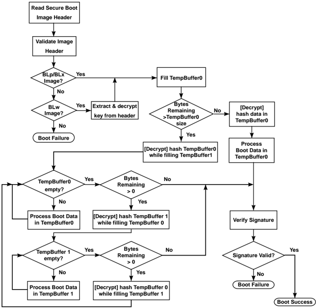

## Unsupported Boot Stream Blocks

To ensure the security of the processor, the following block types are not supported in a secure boot image. If the boot kernel finds one of these block types, the boot process terminates.

## · Init Block

Init blocks require a call to user application code prior to the authentication of the boot image, and, therefore, cannot be supported. If customizations or optimizations are necessary to improve the load performance, use a second stage loader style implementation. The first application will contain only the custom code. Issue a call using to boot using the desired device.

## · Callback Block

Callback blocks require a call to a user-defined address prior to the authentication of the boot image, and therefore cannot be supported.

NOTE: Secure boot streams use double buffer Page Mode to optimize the boot process. This functionality allows for the performance of decrypt and hash operations on received data while new data is fetched from the boot source. This host in slave boot mode must ensure that more data is sent after the boot stream to ensure that the temp buffer is filled completely. The size of the secure boot stream minus the size of the

secure boot header must be a multiple of the size of the temp buffer. The temp buffer default size is 1024 bytes.

## Secure Boot Image Attributes

Secure boot image attributes form part of the secure boot header . The attributes provide more information about the content of the secure boot image.

All image attributes are integrity protected using the same algorithm as the image section. When the image authentication process completes and the image is successfully authenticated, the image attributes are known to be trustworthy.

Attributes are specified as type value pairs with both the type and value being a 32-bit value. The boot code supports the following image attributes.

Table 53-36: Secure Boot Image Attributes

| ID         | Name        | Description                                                                                                                                                                    | Values                                                                                                                                                | Values                                                                                                                                                                                    |
|------------|-------------|--------------------------------------------------------------------------------------------------------------------------------------------------------------------------------|-------------------------------------------------------------------------------------------------------------------------------------------------------|-------------------------------------------------------------------------------------------------------------------------------------------------------------------------------------------|
| 0x00000000 | Unused      | Unused attribute                                                                                                                                                               | Value must be 0x00000000                                                                                                                              | Value must be 0x00000000                                                                                                                                                                  |
| 0x00000001 | Version     | Version of the at- tribute format                                                                                                                                              | Value must be 0x00000000                                                                                                                              | Value must be 0x00000000                                                                                                                                                                  |
| 0x00000002 | Rollback ID | Current value of the rollback coun- ter                                                                                                                                        | 0x00000000                                                                                                                                            | Rollback disabled                                                                                                                                                                         |
| 0x00000002 | Rollback ID | Current value of the rollback coun- ter                                                                                                                                        | 0x00000001 - 0x0000001F                                                                                                                               | Current firmware revision. Must be greater than or equal to the value retrieved from OTP Refer to Anti-Rollback Protection and the OTP chapter for details on the counter implementation. |
| 0x80000001 | NoRestore   | Controls whether the boot process re- stored registers back to default val- ues and clears sensi- tive security related information from the stack and dedi- cated structures. | 0x1                                                                                                                                                   | Do not restore registers and clear security information from the stack and dedicated structures                                                                                           |
| 0x80000001 | NoRestore   | Controls whether the boot process re- stored registers back to default val- ues and clears sensi- tive security related information from the stack and dedi- cated structures. | other                                                                                                                                                 | Restore registers and clear security sensitive information from the stack and dedicated structures                                                                                        |
| 0x80000002 | BCODE       | Used by the boot mode drivers that support auto-detec- tion to configure the device from a range of pre-config- ured settings                                                  | Values between 0x00000000 and 0x0000000F supported. Please refer to the boot mode specific documentation for details on a boot modes supported BCODE. | Values between 0x00000000 and 0x0000000F supported. Please refer to the boot mode specific documentation for details on a boot modes supported BCODE.                                     |

## Secure Boot Streams

The secure boot image sections contain the code and data for loading to the various memory regions of the processor. The content is in the form of a boot stream format consisting of block headers that provide a descriptor for the associated block payloads.

The image section within the secure boot stream consists of a standard boot Boot Loader Stream consisting of block headers and payloads as generated by the supporting tools and utilities. Refer to the section describing the format of the boot stream for further details.

The secure boot image section can contain application images for just a single core or for multiple cores allowing for a flexible booting strategy.

A single boot image containing program and data for multiple cores permits a full system boot initializing all internal memories without needing a second stage loader approach. If boot images are required to initialize external memories, then a multi-stage loader approach can be required to configure the memory interfaces. The advantage of a single boot image for multiple cores is that authentication and decryption of the boot image requires only one execution. However, it is over a larger boot image.

Multiple single-core boot images permit one core to boot then execute that core's boot image without booting the other cores. This booting strategy can be needed when a single processor must be brought up quickly to deal with some initial tasks before booting the rest of the system. Or, it can be used to initialize extra peripherals to use for external memory interfaces. The core that has previously booted can then control the boot process for the remaining cores.

## Single Core Images

Single core boot images are the result of processing a single core's output from the linker and converting it to a compliant boot stream. The resulting boot stream has a single first block at the beginning of the boot stream and a final block at the end of the boot stream.

The Block Header HDRSIGN field of the resulting boot stream is used to identify which core the image is intended for. This identification is required so that the boot code can set the correct RCU\_SVECT[n] when the first block is read to set the application start address for that core. When the boot image is loaded and authentication is successful, the boot code jumps to the location stored in the cores corresponding RCU\_SVECT[n] register.

This boot stream must then be Secure Boot Image Signing using the secure boot utilities resulting in the final secure boot image for a single core.

A second stage loader option is also available giving maximum flexibility both in terms of using ROM functionality, or creating a custom booting strategy. The simplest option is to have the application utilize adi\_rom\_Boot() to boot the main application image or indeed a third stage loader when one is required.

The boot stream is generated such that all image contents are in the system address space. Core specific L1 memory sections are converted during the boot stream generation process such that they are loaded through the multiprocessor memory space. The core executing the second stage loader can boot an application image intended for another core.

- NOTE: The ROM\_BFLAG\_RETURN flag is set when calling the boot routine for the other cores than the core executing the second stage loader then cleared when loading the cores own image. Failure to do so would result in unintentional behavior.

When a core is used to boot a separately generated boot stream for another core, the ROM\_BFLAG\_RETURN flag should be used when calling adi\_rom\_Boot() instructing the boot kernel to return to the calling application, which in this case is back to the core that was running the second stage loader. Failure to set this flag would result in the core vectoring to the location in its own RCU\_SVECT[n] register which would not be the intention. In order to allow the core that was just booted to start running the newly loaded application.

By default when implementing a scheme such as previously described where one processor is responsible for booting images for another core, the other cores in the system will remain in their existing idle state that they should be placed in prior to the boot commencing. In order to allows the cores to execute their new application the corew that was responsible for booting the other cores must reset the cores via the RCU\_CRCTL then release them again from reset. If there is a requirement to release the core from the reset state, then this must be done within the application code of the running core.

Releasing other cores from reset to run application software while other processors are running a boot process requires careful system design. The drivers used by the boot kernel for the boot process assume the various peripheral and infrastructure resources such as MDMA channels and peripherals are available for use, and are not being used by another core. If the boot routine is being executed while other cores are running applications, then those applications must ensure that all the required boot resources are freed up and remain free in order for the boot process to complete on the remaining cores.

## Multi-core Boot Images

Multi-core boot images are generated as a result or processing the multiple linker output files for multiple cores together to create a single compliant boot stream. The resulting boot stream has a first header block at the beginning of each core boot stream and a single final block at the end of the boot stream. The boot stream must only have a single final block to allow the boot kernel to continue processing the entire boot stream. A final block results in the boot kernel terminating triggering the final public key authentication sequence.

The block headers BLOCK\_CODE.HDRSIGN field of the resulting boot stream is used to identify which core the image is intended for. This identification is required such that the boot code can set the correct RCU\_SVECT[n] when the first block is read to set the application start address for that core. When the boot image is loaded and authentication was successful, the core executing the boot sequence jumps to the location stored in the cores corresponding RCU\_SVECT[n] register. However, as the boot stream has multiple first blocks present for each of the cores, all other cores RCU\_SVECT[n] register is set for their applications. Upon the booting core running its application, it must release the other cores from reset in order for them to then start running their loaded applications.

If a product supports three or more cores, it is acceptable to create a dual core boot image and then load the other cores later using single core boot images stored elsewhere in the boot source. There are no restrictions on a multicore boot stream requiring to contain an application for all the cores in a product.

The resulting multi-core boot stream must then be signed and optionally encrypted resulting in a complaint secure boot stream that can be used to boot a secure device.

Multiple core boot images are advantageous in the fact that applications can be loaded to all cores in the system in a single boot sequence resulting in the requirement to decrypt and authenticate only a single boot image.

NOTE: If there is a requirement for a multi-core boot stream to load code to memory spaces that require a memory controller to be initialized that is not supported by the boot process a multi-stage booting approach is required that can initialize the peripheral. This boot stream is then authenticated, and executed prior to the loading of the boot stream.

## Secure Debug Access

The TAPCcontroller provides a means of restricting access to secure resources of the processor. Secure access through the debug port is protected through a 128-bit security key that must match a key that has been loaded into OTP for access.

To access a locked processor, the TAPC must allow access to the part. The TAPC only allows access to the part if it is provided with a matching key to the data loaded into its TAPC\_USERKEYn registers.

With the processor in a locked state, on initial boot the boot ROM reads the 128-bit secure\_emu\_key from the OTP memory and programs the key into the TAPC\_SDBGKEY0 , TAPC\_SDBGKEY1 , TAPC\_SDBGKEY2 , and TAPC\_SDBGKEY3 registers before then setting the TAPC\_USERKEY\_CTL.USERKEY\_VALID bit. Then, the TAPC is able to access a matching outside key to allow access.

CAUTION: A key of 0xFFFFFFFF, 0xFFFFFFFF, 0xFFFFFFFF, 0xFFFFFFFF provisioned in OTP will result in the boot code bypassing the key load operation entirely. If debug access is then ever required the key must be loaded to the TAPC by user software. If the processor fails to boot perhaps due to corrupted firmware then the user will have no debug access. The only way to gain access would be to load an authenticated boot image that can then load the required keys prior to attempting to connect with a debugger.

The key is set in OTP using the OTP boot program API to program the secure\_emu\_key , this key is read and loaded by the ROM in the following sequence:

1. Bits 31:0 of the key in OTP are stored to TAPC\_SDBGKEY0 bits 31:0
2. Bits 63:32 of the key in OTP are stored to TAPC\_SDBGKEY1 bits 31:0
3. Bits 95:64 of the key in OTP are stored to TAPC\_SDBGKEY2 bits 31:0
4. Bits 127:96 of the key in OTP are stored to TAPC\_SDBGKEY3 bits 31:0

Once the ROM has loaded the user key, a test key can be provided to the TAPC through JTAG. Refer to the Emulator manual for details for providing the key.

A key failure indication can be detected through the TAPC\_SDBGKEY\_STAT register. The boot code does not check the key status, nor does it enable any associated interrupts to signal key failure. The boot code continues to boot upon a key failure in a secure manner. The key failure status remains intact so that the application loaded can check for a failed challenge on the debug port.

The boot code can be configured to bypass the loading of the key during the boot sequence by setting the value of the otp\_data::secure\_emu\_key in the OTP to all ones. In this case, the only way to gain access to the secure resources through the debug port is to load an alternate key using the application. The alternative key must always reside in a secure region of memory. Or, if sent remotely, it should be transmitted over a secure connection.

## Errors and Failures

Any errors encounters while processing a secure boot image results in the ROM jumping to the Error Handler . This includes decryption failures, authentication failures, and configuration errors.

As the boot process doe no checking for a matched secure debug key, should an incorrect key be supplied during boot, no boot failure will occur and the processor will continue to boot as normal. A user supplying an incorrect key will not be able to gain access to any secure resources of the processor.

## Boot ROM Programming Model

This section describes the programming model for booting the processor. The programming model includes booting functions, API calls, and data structures.

## Boot Mode Driver API

The kernel provides a mechanism to provide a customization of supported boot modes or for implementation of completely new boot modes as second stage boot loaders. This allows users to customize booting while still taking advantage of the rest of the booting framework. A custom boot mode could provide support for a peripheral that is not supported for boot by the ROM, or it could support one of the same peripherals but with a different configuration.

All the same security features can be supported when using a custom boot mode.

A full boot mode, as perceived by the boot implementation, is a collection of five functions.

- Register - installs the driver functions listed below so they can be accessed by the boot process
- Initialization - initialize the boot source
- Configuration - configure the boot source
- Load - read from the boot source
- Cleanup - called after booting

Of these later four functions the boot kernel is only ever aware and has a requirement to support the Load function. It is this function that is responsible for the fetching of the boot stream from the boot peripheral. The other functions are used prior to executing the kernel or for cleaning up after the kernel has completed processing the boot stream.

To install a custom boot mode:

- Create a first stage boot application to define a Load function

- Use the adi\_rom\_BootKernel() API to call the boot kernel once the boot peripheral and pinmuxing has configured. Ensure all the fields of ADI\_ROM\_BOOT\_CONFIG are configured accordingly prior to performing the call.

The boot mode can use the pModeData member of ADI\_ROM\_BOOT\_CONFIG to preserve and access shared data across the different function calls if required.

All functions have the following prototype:

```
void apiFunction( ADI_ROM_BOOT_CONFIG* pBootStruct);
```

## Load Function

The load function is required to read data from the source into the specified destination, according to the parameters given through the configuration struct parameter. The structure provides all of the required information read from the block header, or specified by the kernel to read the block header. The load function often makes use of the supplied DMA APIs in order to simplify the load function implementation.

As the kernel processes the stream, it calls the load function to request data. Initially, the request is for the header, then the kernel requests according to the block flags it parses. The load function must only read from the device, and write where requested.

Relevant fields within the ADI\_ROM\_BOOT\_CONFIG object for the load function can be (not limited to): uwDataWidth , pSource , dByteCount , pDestination , loadType .

Custom load functions must meet the following requirements.

- Protect against dByteCount values of zero
- Use multiple DMA units if dByteCount is greater than 65536 and the peripheral does not support byte count transfers greater than 65536
- The pSource and pDestination pointers must be properly updated after loading.

In slave boot modes, the boot kernel uses the address of the dArgument field in the pHeader block as the destination for the required dummy DMAs when payload data is consumed from ROM\_BFLAG\_IGNORE blocks. If the load function requires access to the ARGUMENT word of the block, it should be read early in the function.

## Initialization/ Configuration Function

The initialization and configuration functions are called in sequence when calling a boot operation using an already supported boot peripheral via the adi\_rom\_Boot() API. These functions are used to configure the boot peripheral prior to calling the boot kernel. Both functions are called in sequence separated only by a call to a user-defined hook function. This hook function is useful when using built-in boot modes to further customize their functionality. The initialization and configuration functions are responsible for applying any required settings to any devices in

use. For example, pin multiplexing may need to be applied, and any data or pointers that are used by the load function must be initialized. The specific actions depend on the device and functionality used.

## Cleanup Function

The cleanup function is called after the entire boot stream is read, and the kernel has completed its boot modespecific function. This is only performed when using the adi\_rom\_Boot() API. Resetting of any status registers, or device parameters is done to prepare the environment for the execution of the newly loaded application.

## Error Handler

This section describes the default error handler for the ROM including information on how to customize the error handling.

The default error handler eventually puts the core into an idle state. This functionality can be overridden by using an Init Block (see Block Types) to modify the error function point in the ADI\_ROM\_BOOT\_CONFIG structure. The error handler has access to the entire boot info structure and receives the instruction address that triggered the error.

When a part is locked, and the boot type has not disabled secure boot, only the default error handler is called.

The expected prototype is:

```
void ErrorFunction( ADI_ROM_BOOT_CONFIG* pBootStruct, void *pFailingAddress);
```

The error handler saves the failing address to the ADI\_ROM\_BOOT\_CONFIG structure then raises the INTR\_SOFT3 fault signaling a fault condition to the system before then entering an endless loop in the boot rom.

NOTE: When using the adi\_rom\_Boot() function to perform a boot action. Users may need to manually configure the INTR\_SOFT3 fault signaling depending on previous application software executed. Calling the boot process via adi\_rom\_Boot() does not result in all the SEC and Fault configuration being reset and installed as described in Preboot Operations.

## Page Mode

For the benefit of page oriented boot source devices, and to improve boot performance for secure boot operations, the boot kernel provides support for page operations. Page mode optimizes memory reads for block organized devices by always reading a page, rather than reading data on demand. T wo 1024 byte buffers are used in page mode.

Two buffers are used allowing the contents of one buffer to be processed by the boot kernel while DMA is used to load the next data into the second buffer.

The load to the active buffer uses a blocking DMA, forcing the process to pause until the DMA is complete. Loading to the non-active buffer uses non-blocking DMA allowing the active buffer to be processing while loading the new data in parallel.

Page mode can be enabled when calling a boot mode via the adi\_rom\_Boot() . Refer to the API documentation for the various supported by this API. Additionally users can set the flag via ADI\_ROM\_BOOT\_CONFIG::dFlags when using hook functions

NOTE: Due to security requirements it is not recommended to customize the page mode settings from the default installed by the boot process.

## Boot Hook Function

The boot software allows installation of callback hooks through the use of the adi\_rom\_Boot() APIs hook function parameter. By using this feature, it is possible to alter the state of the processor, at different stages of the boot process and customize the boot structures to alter the behavior of the boot process.

The hook function must adhere to the following prototype:

```
int32_t hookFunction( ADI_ROM_BOOT_CONFIG* pBootconfig, ROM_HOOK_CALL_CAUSE cause);
```

By modifying settings in the ADI\_ROM\_BOOT\_CONFIG structure, many alterations of the boot process can be achieved. Much of the same functionality that is available in an Init Block can be provided through the hook function, with even more flexibility for customization. The hook function is called once after executing the boot modes Init routine then once again after executing the boot modes Config routine. A flag passed to the hook function allows software to determine at which point the call took place to allow for conditional processing to occur at different stages of the setup phase.

The hook function must return a zero value in order for normal booting to continue. A non-zero return value will cause the ROM to skip over loading of any data and immediately transfer control according to Boot Termination and Application Execution .

When the hook function is called, a parameter is passed indicating why the hook function was called. Refer to ROM\_HOOK\_CALL\_CAUSE for further details.

## enum ROM\_HOOK\_CALL\_CAUSE

Enumeration Type Declaration: ROM\_HOOK\_CALL\_CAUSE

Passed to a user hook routine to indicate the reason of the call.

When calling a boot mode via adi\_rom\_Boot, the user may provide an optional hook routine as a callback. This hook routine is called by the boot software firstly after the execution of the boot modes initialization routine then again after execution of the boot modes configuration routine. This parameter allows the users routine to identify at which point the call was made allowing the user to perform different actions for each call.

Table 53-37: ROM\_HOOK\_CALL\_CAUSE Members

| Enumerator   | Description                                                                  |
|--------------|------------------------------------------------------------------------------|
|              | Call was as a result of completion of the boot modes initialization function |

Table 53-37: ROM\_HOOK\_CALL\_CAUSE Members (Continued)

| Enumerator                     | Description                                                                     |
|--------------------------------|---------------------------------------------------------------------------------|
| ROM_HOOK_CALL_INIT_COMPLETE    |                                                                                 |
| ROM_HOOK_CALL_CONFIG_ COMPLETE | Call was as a result of the completion of the boot modes configuration function |

## ROM\_HOOK\_CALL\_INIT\_COMPLETE

Call was as a result of completion of the boot modes initialization function

## ROM\_HOOK\_CALL\_CONFIG\_COMPLETE

Call was as a result of the completion of the boot modes configuration function

## Boot Return Feature

The adi\_rom\_Boot() API provides a feature to bypass calling of the loaded application upon boot completion, and to simply return to the routine that made the call instead. This can be useful when using the . The boot software returns the next address after the last loaded application block in the boot source when this feature is enabled..

To enable this feature, set the ROM\_BFLAG\_RETURN flag in the flags argument when calling the API.

## Boot Termination and Application Execution

When the boot kernel completes the processing of the boot stream, a sequence of events is required to then pass control to the loaded application.

When the boot process is complete, the core sis required to vector to the application start address and start executing the newly loaded application. Typically, the first block of a boot stream, which is marked with the BFLAG\_FIRST flag, contains the address of the application. In a multi-core system there may be multiple first blocks in the boot stream indicating the start address of the application for each core. The application entry point for each core is loaded into the cores corresponding RCU\_SVECTn register.

Upon boot completion only the core that performed the boot process will vector and start executing the loaded application. This core must then manage the process of resetting then releasing from the reset the other cores in the system in order to make them execute their newly loaded applications.

Execution of the loaded application can be bypassed when calling the boot mode via adi\_rom\_Boot() and setting the ROM\_BFLAG\_RETURN flag.

Table 53-38: Application Entry Point Registers

|   Core ID | Corresponding RCU_SVECTn Register   |
|-----------|-------------------------------------|
|         0 | RCU_SVECT0                          |
|         1 | RCU_SVECT1                          |

Table 53-38: Application Entry Point Registers (Continued)

|   Core ID | Corresponding RCU_SVECTn Register   |
|-----------|-------------------------------------|
|         2 | RCU_SVECT2                          |

## API Reference

The APIs defined in this section are exposed for general use.

## adi\_rom\_Boot()

Provides access to boot an application at run-time through a supported peripheral.

## API Details

```
void * adi_rom_Boot( void * pAddress, uint32_t flags, int32_t blockCount, ROM_BOOT_HOOK_FUNC * pHook, uint32_t command )
```

## pAddress

Pointer to source address of the boot stream.

## flags

contains the global flags to be applied to the entire boot process

## blockCount

Number of block to be booted. Zero results in processing until a final block is reached.

## pHook

Pointer to user implemented hook function for enabling callbacks during the registering of the boot mode with the boot kernel

## command

The boot command defining the boot mode to use, the peripheral instance to boot from as well as some boot mode specific configuration

## Returns

The 32-bit address of the next address in the boot source to be processed

## Function Description

This function may be used for any kind of second-stage boot for an already supported boot mode. It provides options to boot from any peripheral enumeration and in the case of SPI Master boot using any SPI slave select signal.

Boot modes may support an auto-detection mechanism to identify the type of connected device and the function provides options to bypass such auto-detection and use custom configuration options. Options are also provided to bypass peripheral configuration such as pinmux settings or peripheral configuration if existing peripheral already configured are more appropriate to allow communication with the boot source.

These features are all provided via the command parameter which is specific for each particular boot mode.

The source address of the boot stream is required for master boot modes that require an address to be issued in order to request data from the boot source. Slave boot modes are under full control of the host and use a handshake mechanism to indicate that the processor is ready to receive data. For boot modes such as UART Slave and SPI Slave this parameter is of little value in regards to the boot process itself however it can prove useful in debug to see how far through the boot stream the boot process got in the event of a boot failure.

NOTE: The processor supports both SPI Memory Mapped boot as well as Peripheral Based SPI Boot. When the boot mode is called to boot from the memory mapped boot mode via the command argument the address must coincide with the processors memory mapped SPI address space as defined by the processors internal memory map. When using the peripheral based boot mode the absolute address of the boot stream in flash must be used.

Flags passed via the flags argument are global flags and the functionality gets applied throughout the entire boot process. These must not be confused with the boot block specific flags which are part of the boot stream and indicate how a particular block in the boot stream is processed. Internally the boot kernel will take the global flags supplied via this function call and combine them with a boot blocks local flags to determine all the operations to be performed on a given block. After processing the boot block the local flags get cleared ready to be populated from the next boot block and the global flags remain.

The global flags supported by the product are:

|   Bit Position | Flag Name                 | Description                                                                                                                              |
|----------------|---------------------------|------------------------------------------------------------------------------------------------------------------------------------------|
|             18 | ROM_BFLAG_HOOK            | Calls the user supplied hook function after execution of bootmode init and config routines                                               |
|             19 | ROM_BLAG_PAGEMODE         | Enables page mode processing where blocks of data are fetched and processed from internal memory                                         |
|             20 | ROM_BFLAG_NOFIRS- THEADER | Set this if calling the boot mode and the first block header has al- ready been fetched and present in the block header storage location |
|             21 | ROM_BFLAG_HEADER          | Not intended to be set by the user, set by the boot code each time it fetched a block header                                             |
|             22 | Reserved                  | Reserved                                                                                                                                 |
|             23 | Reserved                  | Reserved                                                                                                                                 |
|             24 | Reserved                  | Reserved                                                                                                                                 |
|             25 | ROM_BFLAG_PERIPHERAL      | Boot mode is a peripheral boot mode as opposed to a memory boot mode                                                                     |

|   Bit Position | Flag Name           | Description                                                                                             |
|----------------|---------------------|---------------------------------------------------------------------------------------------------------|
|             26 | ROM_BFLAG_SLAVE     | Boot mode is a slave boot mode. This results in different handling of ignore blocks by the kernel       |
|             27 | ROM_BFLAG_WAKEUP    | Set this to enable conditional processing of boot blocks intended for wakeup events but not exclusively |
|             28 | ROM_BFLAG_NEXTDXE   | Parse stream via Next DXE pointer                                                                       |
|             29 | ROM_BFLAG_RETURN    | Return the application after calling the API instead of running the new application                     |
|             30 | Reserved            | Reserved                                                                                                |
|             31 | ROM_BFLAG_NORESTORE | Do not execute the boot peripherals cleanup routine to restore regis- ter contents                      |

The blockCount argument specifies the number of blocks to be processed before terminating the boot process. The default would normally be 0x00000000. A value of 0x00000000 instructs the boot software to continue processing a boot stream until the ROM\_BFLAG\_FINAL flag is set. Should users wish to load only a specified number of blocks they can instruct the boot kernel to do so via this parameter.

When the block count is used in combination with the ROM\_BFLAG\_NEXTDXE flag then the block count is re purposed as a next application count. The boot kernel will navigate the first blocks of multiple boot streams similar to a linked list and upon reaching the requested application count will return the pointer to this application in the boot source. This allows users to use the boot kernel to find a specific application when multiple application boot stream are stored contiguously in the boot source.

The pHook argument is a function pointer to a hook routine. When set along with the ROM\_BFLAG\_HOOK global flag the boot mode will call the hook routine after calling the boot modes init and functions in the boot modes driver allowing customization and altering of the configuration performed by the boot software.

This can be used to enabled new features not supported by the boot software and allows for installing of a user defined load function or error handler as an example.

The command argument describes the boot peripheral to boot from, the peripheral instance and contains additional boot mode specific configuration information and flags specific to the boot mode.

NOTE: When calling a boot mode via this API the user must first ensure that the boot peripheral is confirgured accordingly in the SPU as a secure master. The boot software does not configure the peripheral security via this API in order to allow device security to be fully controlled by a dedicated task.

## adi\_rom\_BootKernel()

Calls the boot kernel allowing for implementation of custom boot modes.

## API Details

<!-- formula-not-decoded -->

## pBoot

Pointer to the ADI\_ROM\_BOOT\_CONFIG boot structure containing the complete context of the boot configuration

## Returns

Pointer containing the address of the byte immediately following the end of the boot stream.

## Function Description

The boot kernel performs the core processing of the boot stream. The boot kernel calls a load function to load in data from the peripheral to the required destination. The boot kernel itself has no concept of what the boot peripheral is or how that peripheral is configured. The kernel calls the registered load function and the load function must then analyze the boot structure and provide the requested amount of data to the required destination.

The load function called by the kernel is provided via the ADI\_ROM\_BOOT\_REGISTRY::pLoadFunction member of ADI\_ROM\_BOOT\_CONFIG::bootRegistry .

The boot kernel basically works in a cycle of fetching a boot stream block header then a payload if one exists. The boot kernel takes care of the size of the data being requested and the destination address.

The load function that is registered with the kernel is required to update the ADI\_ROM\_BOOT\_CONFIG::pSource member. Keeping this control under the load function as opposed to the boot kernel itself allows load functions to better control where the next block of data is fetched in the event the boot stream is fragmented or split into different areas of the boot source.

This function would typically be used to implement a second stage boot loader for a peripheral in which there is no driver support in the boot rom. The user is responsible for initializing the peripheral prior and the complete ADI\_ROM\_BOOT\_CONFIG object prior to calling this function. Upon return form the function the user application is then responsible for performing a vector to the newly loaded application.

NOTE: Users must ensure that a new application being loaded does not clobber the load function and the part of the software responsible for making the core jump to the start of the newly loaded application.

## adi\_rom\_Crc32Init()

The CRC32 Initcode function in the boot rom that is called to enable CRC32 support of boot stream payloads.

## API Details

```
ROM_BOOT_RESULT adi_rom_Crc32Init(ADI_ROM_BOOT_CONFIG * pBootConfig)
```

## pBootConfig

Pointer to the ADI\_ROM\_BOOT\_CONFIG object containing the complete boot configuration

## Returns

Returns the following results

- ROM\_BOOT\_RESULT::ROM\_BOOT\_CRC\_INITCODE\_ERR when pBootConfig or pBootConfig&gt;pHeader are zero
- ROM\_BOOT\_RESULT::ROM\_BOOT\_SUCCESS when the callback is registered and lookup table initialized

## Function Description

The boot process supports CRC32 protection of all boot block payloads. In order to enable this feature a global callback must be registered with the boot process via ADI\_ROM\_BOOT\_CONFIG::pCrcFunction and the CRC peripherals look up table initialized from the users polynomial.

In order to enable the CRC functionality a init block header in which the ROM\_BFLAG\_INIT flag is set must be included in the boot stream. The\_ADI\_ROM\_BOOT\_HEADER::pTargetAddress field must be set to the address of this function and the users polynomial is provided via the blocks ADI\_ROM\_BOOT\_HEADER::dArgument member.

When the boot kernel processes the init block described the boot kernel calls this function in the boot rom registering the callback with the kernel and performing the look up table initialization.

The CRC functionality is enabled on MDMA channel 1 interfaced to the CRC0 peripheral instance

## adi\_rom\_Crc32Poly()

Initializes the CRC peripheral for use with the user supplied polynomial.

## API Details

```
ROM_BOOT_RESULT adi_rom_Crc32Poly( uint32_t CrcPoly, ROM_BOOT_MDMA_REGS const *const pDma )
```

## CrcPoly

None

## pDma

None

## Function Description

In order to prepare the CRC peripheral for use, the CRC lookup table must be initialized for the CRC polynomial of choice. Users may perform this task via this function.

## adi\_rom\_GetAddress()

Used to find the location of various look-up tables and data objects used during the boot process.

## API Details

```
int32_t adi_rom_GetAddress(ROM_GETADDR_VALUE value)
```

## value

The ROM\_GETADDR\_VALUE enumeration specifying the object to retrieve the address of in the ROM memory

## Returns

The byte address of the object in memory

## Function Description

The function returns the address of the object specified by the enumerator provided as an argument to the function. Using this function cane make software more code compatible with future products and silicon revisions.

Table 53-39: ROM\_GETADDR\_VALUE Members

| Enumerator               | Description                                                                                                     |
|--------------------------|-----------------------------------------------------------------------------------------------------------------|
| ROM_GETADDR_CONSTANTS    | Retrieve the address of the ROM_CONSTANTS_TYPE object                                                           |
| ROM_GETADDR_BMODE        | Retrieve the address of the lookup table sotring the default adi_rom_boot() parameters for each boot mode       |
| ROM_GETADDR_MDMAREGS     | Retrieve the address of the ROM_BOOT_MDMA_REGS object                                                           |
| ROM_GETADDR_SPILUT       | Retrieve the address of the lookup table in the rom describing the various SPI master boot BCODE configurations |
| ROM_GETADDR_ECDSA_DOMAIN | Retrieve the address of the domain parameteres used for ECDSA                                                   |

## adi\_rom\_MemCompare()

Verifies that a block of data is filled with a user supplied 32-bit value.

## API Details

```
ROM_BOOT_RESULT adi_rom_MemCompare( ROM_DMA_MDMA_CONFIG * pDmaCfg, ROM_BOOT_MDMA_REGS const *const pDma )
```

```
pDmaCfg None pDma None
```

## Function Description

The CRC peripheral used in compare mode and a source MDMA channel is used to read data from a buffer and supply each 32-bit value to the CRC. The CRC peripheral checks the incoming 32-bit value matches the 32-bit value to compare against.

## adi\_rom\_MemCopy()

Performs a Memory to Memory DMA (MDMA) operation using a source and destination pair of DMA channels.

## API Details

```
ROM_BOOT_RESULT adi_rom_MemCopy( ROM_DMA_MDMA_CONFIG * pDmaCfg, ROM_BOOT_MDMA_REGS const *const pDma )
```

## pDmaCfg

Pointer to the ROM\_DMA\_PDMA\_CONFIG object containing the peripheral DMA configuration

## pDma

Pointer to the ROM\_BOOT\_MDMA\_REGS objects that provides access to the DMA channels MMRs and associated CRC peripheral

## Returns

Returns the following results

- ROM\_BOOT\_RESULT::ROM\_BOOT\_SUCCESS for a successful operation or when byte count is 0 as no operation to be performed
- ROM\_BOOT\_RESULT::ROM\_BOOT\_DMA\_FAILURE if a configuration error was detected in the DMA channel prior to configuring the channels for the new operation
- if a configuration error occurred in the source MDMA channel
- if a configuration error occurred in the destination MDMA channel

## Function Description

The memory copy routine performs transfers of blocks of data from one memory location to another. The routine takes a basic descriptor providing configuration details of the operation to be performed via the ROM\_DMA\_MDMA\_CONFIG object passed as the first argument. The second argument is a descriptor that provides access the DMA channels MMR registers and associated CRC peripheral. When called from the higher level adi\_rom\_MemDma() routine this object is retrieved from the ROM.

NOTE: Users are expected to make use the adi\_rom\_MemDma() routine for all MDMA operations, there is little additional optional configuration that is supported by using this routine.

## adi\_rom\_MemCrc()

Performs CRC32 verification of a block of block of data by reading the contents and comparing with an expected result.

## API Details

```
ROM_BOOT_RESULT adi_rom_MemCrc( ROM_DMA_MDMA_CONFIG * pDmaCfg, ROM_BOOT_MDMA_REGS const *const pDma )
```

## pDmaCfg

Pointer to the ROM\_DMA\_PDMA\_CONFIG object containing the peripheral DMA configuration

## pDma

Pointer to the ROM\_BOOT\_MDMA\_REGS objects that provides access to the DMA channels MMRs and associated CRC peripheral

## Function Description

The routine uses an MDMA channel pairs source DMA channel and the CRC peripheral to calculate a CRC32 result of a data block using a previously supplied polynomial.

The polynomial should be supplied through the adi\_rom\_Crc32Poly() routine in order to ensure consistent CRC peripheral configuration for the look up table initialization that uses the polynomial and the

NOTE: Users are expected to make use the adi\_rom\_MemDma() routine for all MDMA operations, there is little additional optional configuration that is supported by using this routine.

## adi\_rom\_MemDma()

Provides access to all the MDMA operations supported by the boot ROM implementation.

## API Details

```
ROM_BOOT_RESULT adi_rom_MemDma(ROM_DMA_MDMA_CONFIG * pDmaCfg)
```

## pDmaCfg

Pointer to the ROM\_DMA\_MDMA\_CONFIG object containing the MDMA configuration

## Returns

Returns the following results

- ROM\_BOOT\_RESULT::ROM\_BOOT\_SUCCESS for a successful operation or when byte count is 0 as no operation to be performed

- ROM\_BOOT\_RESULT::ROM\_BOOT\_MDMA\_ID\_ERR if an MDMA channel ID is provided that is not supported
- ROM\_BOOT\_RESULT::ROM\_BOOT\_CRC\_SUPPORTED\_ERR if a CRC operation was attempted on an MDMA channel not supporting CRC
- ROM\_BOOT\_RESULT::ROM\_BOOT\_MDMA\_OPERATION\_ERR if the operation to be performed is not supported
- ROM\_BOOT\_RESULT::ROM\_BOOT\_DMA\_FAILURE if a configuration error was detected in the DMA channel prior to configuring the channels for the new operation
- ROM\_BOOT\_RESULT::ROM\_BOOT\_DMA\_FAILURE if a configuration error was detected in the DMA channel and the operation requested involves only a single DMA channel
- if a configuration error occurred in the source MDMA channel
- if a configuration error occurred in the destination MDMA channel
- ROM\_BOOT\_RESULT::ROM\_BOOT\_CRC\_COUNT\_ERR if a CRC operation is being requested and the byte count is not a multiple of 4
- ROM\_BOOT\_RESULT::ROM\_BOOT\_CRC\_FAILURE if CRC32 verification fails
- ROM\_BOOT\_RESULT::ROM\_BOOT\_CRC\_FAILURE if 32-bit memory compare fails

## Function Description

The MDMA operations supported are:

Table 53-40: ROM\_DMA\_MDMA\_OPERATION Members

| Enumerator           | Description                                                                         |
|----------------------|-------------------------------------------------------------------------------------|
| ROM_DMA_MEM_COPY     | Standard MDMAtransfer from a source to a destination                                |
| ROM_DMA_MEM_CRC      | Performs a CRC32 MDMAread operation and compares the result with an expected result |
| ROM_DMA_MEM_FILL     | Uses the CRC peripheral to perform a fill operation with a 32-bit value             |
| ROM_DMA_MEM_COMPARE  | Uses the CRC peripheral to compare data with a constant 32-bit value                |
| ROM_DMA_CRC_LUT_INIT | Initializes the CRC LUT from the supplied CRC Polynomial                            |

NOTE: While the MDMA and CRC peripherals support on the fly CRC32 calculations during the transfer of data from one location to another, the MDMA functionality of the boot ROM software does not support this. For CRC calculations data is instead read back from its final destination and verified.

While this function is the main entry point for all the MDMA functionality supported by the boot ROM software, the individual functions that are called for each operation type are also exposed via the public API.

NOTE: The recommendation is to use this function for all operations. The lower level functions allow for some basic reconfiguration of default parameters however such modifications should not be required in most cases where these basic MDMA operations are required.

The boot ROM has an MDMA configuration data structure included that is used to specify the overall MDMA configuration of the processor. It provides details on the DMA channel ID associated with each MDMA channels source and destination DMA channels as well as information relating to CRC support and the CRC peripheral instance that is to be used for a given MDMA channel. Please refer to ROM\_BOOT\_MDMA and ROM\_BOOT\_MDMA\_REGS for full details of the content stored.

The configuration provided as the only argument to the function is provided below:

Table 53-41: ROM\_DMA\_MDMA\_CONFIG Members

| Type                        | Name         | Description                                                         |
|-----------------------------|--------------|---------------------------------------------------------------------|
| ROM_DMA_MDMA_ OPERATION     | eOperation   | Type of operation to perform                                        |
| ROM_DMA_MDMA_ID             | eId          | MDMAChannel ID                                                      |
| void *                      | pSource      | Source Pointer                                                      |
| void *                      | pDestination | Destination Pointer                                                 |
| uint32_t                    | ByteCount    | Byte Count                                                          |
| ROM_DMA_DONE_ DETECT_METHOD | eDoneDetect  | DMADone Detection Method                                            |
| uint32_t                    | CrcCtl       | CRC_CTL value when CRC operations are required                      |
| uint32_t                    | FillVal      | Fill value for memory fill operations                               |
| uint32_t                    | CrcPoly      | CRC Polynomial for CRC operations                                   |
| uint32_t                    | CrcCompare   | Value used for CRC compare operations or for a CRC32 result compare |

For a basic MDMA transfer from source to destination the user needs to configure:

- The ROM\_DMA\_MDMA\_CONFIG::eOperation type as ROM\_DMA\_MDMA\_OPERATION::ROM\_DMA\_MEM\_COPY
- The MDMA channel to use via ROM\_DMA\_MDMA\_CONFIG::eId for example
- Set the address of the source data via ROM\_DMA\_MDMA\_CONFIG::pSource
- Set the destination address of the source data via ROM\_DMA\_MDMA\_CONFIG::pDestination
- Set the byte count via ROM\_DMA\_MDMA\_CONFIG::ByteCount
- Set ROM\_DMA\_MDMA\_CONFIG::eDoneDetect to ROM\_DMA\_DONE\_DETECT\_METHOD::ROM\_DMA\_DONE\_POLL\_IRQDONE in order to poll for DMA completion

NOTE: The implementation of the MDMA operations does not support interrupt driven data transfers the routines were implemented for the intentions of polling on the DMA status for use during the boot process. Also there are restrictions in regards to the boot stream in regards to byte counts and source and destination address alignment all being a multiple of 4 bytes and as such, compliance to these restrictions must be adhered to when using these MDMA routines.

When wishing to use the CRC32 functionality of the MDMA routines, the user must first of all initialize the CRC lookup table from the user supplied polynomial. This operation can be performed by setting

ROM\_DMA\_MDMA\_CONFIG::eOperation type as ROM\_DMA\_MDMA\_OPERATION::ROM\_DMA\_CRC\_LUT\_INIT . If an MDMA channel is specified that does not support CRC functionality an error result is returned.

For further details of the individual operations supported please refer to the following API references:

- adi\_rom\_MemCopy() · adi\_rom\_MemCrc() · adi\_rom\_MemFill() · adi\_rom\_MemCompare() · adi\_rom\_Crc32Poly()

## adi\_rom\_MemFill()

Fills a block of memory with a 32-bit user supplied value.

## API Details

```
ROM_BOOT_RESULT adi_rom_MemFill( ROM_DMA_MDMA_CONFIG * pDmaCfg, ROM_BOOT_MDMA_REGS const *const pDma )
```

## pDmaCfg

None

## pDma

None

## Returns

Returns the following results

- ROM\_BOOT\_RESULT::ROM\_BOOT\_SUCCESS for a successful operation or when byte count is 0 as no operation to be performed

- ROM\_BOOT\_RESULT::ROM\_BOOT\_DMA\_FAILURE if a configuration error was detected in the DMA channel prior to configuring the channels for the new operation
- if a configuration error occurred in the source MDMA channel
- if a configuration error occurred in the destination MDMA channel

## Function Description

The CRC peripheralis configured for fill mode and the destination MDMA channel is configured to fill a block of memory with a fixed 32-bit value.

## adi\_rom\_PeriphDma()

Provides access to any peripherals dedicated DMA channel for receive operations only.

## API Details

```
ROM_BOOT_RESULT adi_rom_PeriphDma(ROM_DMA_PDMA_CONFIG * pDmaCfg)
```

## pDmaCfg

Pointer to the ROM\_DMA\_PDMA\_CONFIG object containing the peripheral DMA configuration

## Returns

Returns the following results

- ROM\_BOOT\_RESULT::ROM\_BOOT\_SUCCESS for a successful operation or when byte count is 0 as no operation to be performed
- ROM\_BOOT\_RESULT::ROM\_BOOT\_DMA\_ACTIVE if the DMA channel is currently running
- ROM\_BOOT\_RESULT::ROM\_BOOT\_DMA\_FAILURE if a configuration error was detected in the DMA channel after starting the DMA operation

## Function Description

The peripheral DMA routine is used by the load routines of boot peripherals that have dedicated DMA channels and do not support MDMA channel pairs. Examples are the SPI when not configured for memory mapped mode and UART peripherals.

In the boot implementation this routine is called from the peripheral load function to request data from the boot source. The routine supports both polling on DMA completion and non-blocking operation to allow for immediate return after starting the DMA operation and continuing with further processing.

NOTE: The function only supports read operations from the peripheral to memory. Transmit operations from memory to peripheral are not supported

## adi\_rom\_otp\_cfg()

Configures the OTPC to enable read and program operations to be be performed.

## API Details

```
bool adi_rom_otp_cfg(void)
```

## Function Description

Users may call this routine to ensure the OTPC is configured correctly for read and write access.

NOTE: The preboot process configured the OTPC for use and as such there should be no direct requirement to call this function when using the OTP .

## adi\_rom\_otp\_get()

Reads the field from OTP as defined by the supplied OTPCMD .

## API Details

```
bool adi_rom_otp_get( OTPCMD cmd, uint32_t data[] )
```

## cmd

The OTPCMD enumeration describing the OTP content to be read

## data[]

Pointer to storage area to store the read OTP contents

## Function Description

Users can read the various fields of the OTP via this routine. The supplied OTPCMD object is used to specify the object to be read.

## Table 53-42: OTPCMD Members

| Enumerator           | Description                         |
|----------------------|-------------------------------------|
| otpcmd_reserved0     | Reserved                            |
| otpcmd_huk           | Hardware Unique Key                 |
| otpcmd_DTCP_key_ecc  | DTCP Key (ECC Parameters)           |
| otpcmd_DTCP_key_cont | DTCP Key (constant for content key) |
| otpcmd_DTCP_key_dev  | DTCP Key (device specific keys)     |

Table 53-42: OTPCMD Members (Continued)

| Enumerator              | Description                            |
|-------------------------|----------------------------------------|
| otpcmd_pvt_128key0      | Customer Private AES Key0              |
| otpcmd_pvt_128key1      | Customer Private AES Key1              |
| otpcmd_pvt_128key2      | Customer Private AES Key2              |
| otpcmd_pvt_128key3      | Customer Private AES Key3              |
| otpcmd_ek               | Endorsement Key                        |
| otpcmd_secure_emu_key   | Secure Emulation Key                   |
| otpcmd_public_key0      | Customer Public Key0                   |
| otpcmd_public_key1      | Customer Public Key1                   |
| otpcmd_boot_info        | Customer Programmable Boot Information |
| otpcmd_otpTiming        | OTP Read timing override               |
| otpcmd_antiroll_nv_cntr | AntiRollback NV Counter                |
| otpcmd_gp1              | General Purpose 1                      |
| otpcmd_bootModeDisable  | Boot Mode Disable Bits                 |
| otpcmd_preboot_ddr_cfg  | User DMCconfiguration                  |
| otpcmd_stageID          | StageID                                |
| otpcmd_reserved1        | Reserved                               |

## adi\_rom\_otp\_lock()

Locks the processor, enabling all security features.

## API Details

bool adi\_rom\_otp\_lock(void)

## Function Description

This function si used to lock the processor securing the device from unauthorized access. Once called users must supply a secure debug key in order to gain access to the device with debug tools and the part may only be booted using a secure boot stream.

WARNING: Users must ensure that the OTP secure boot fields are all programmed. Secure boot can be verified prior to locking the processor. Users should also provision a secure debug key.

## adi\_rom\_otp\_pgm()

Programs the OTP Memory with the contents of the otp\_data object.

## API Details

```
bool adi_rom_otp_pgm(otp_data * data)
```

## data

Pointer to the::otp\_data object containing the complete OTP contents to program

## Function Description

The OTP memory is only programmed with values that are not 0. Any items that are 0 are ignored. Users are expected to use this function for all OTP program operations.

## callback()

Callback function for implementing custom callbacks to previously loaded code during boot.

## API Details

```
ROM_BOOT_RESULT callback( ADI_ROM_BOOT_CONFIG * pBootConfig, ADI_ROM_BOOT_BUFFER * pBuffer, uint32_t nFlags )
```

## pBootConfig

Pointer to the ADI\_ROM\_BOOT\_CONFIG object containing the complete context of the boot procedure

## pBuffer

Pointer to the ADI\_ROM\_BOOT\_BUFFER object containing details of the payload associated with the callback

## nFlags

The callback flags as set by the boot kernel

## Function Description

A single callback function may be registered with the boot kernel via

ADI\_ROM\_BOOT\_CONFIG::pCallBackFunction . This functions is then called whenever a block is processed with the ROM\_BFLAG\_CALLBACK flag set. Only a single callback function can be registered for the complete boot process.

Callbacks may typically be used alongside indirect blocks. This would be used if there was a requirement for post processing of the received boot data before sending to the final destination. An example of this would be if compression was applied to block payloads. The compressed payload would be loaded indirectly to the intermediate buffer where it would be decompressed by the callback. The callback can modify the source address and byte count for the final MDMA transfer of the decompressed payload via the supplied pBuffer parameter such that when the callback returns the boot kernel then handles the final transfer of the uncompressed data to the destination.

When dealing with indirect blocks, there are restrictions on the amount of data that can be loaded depending on the size of the intermediate buffer. For this reason the nFlags parameter is used to indicate the status of the callback when handling larger blocks of indirect data. The table below defines the supported flags:

| Bit Position   | Flag Name           | Description                                                                                                  |
|----------------|---------------------|--------------------------------------------------------------------------------------------------------------|
| 0              | ROM_CBFLAG_DIRECT   | When set indicates the call was from the processing of a block head- er with the ROM_BFLAG_CALLBACK flag set |
| 1              | ROM_CBLAG_PAGESTART | Indicates the callback was a result of a fetch of a page of data to the intermediate buffers                 |
| 2              | ROM_CBFLAG_FIRST    | Set if the first fetch of payload data                                                                       |
| 3              | ROM_CBFLAG_FINAL    | Set if the final fetch of payload data                                                                       |
| 31:4           | Reserved            | Reserved                                                                                                     |

When a callback block header is received by the boot kernel a call to the callback is performed with the ROM\_CBFLAG\_DIRECT flag set. If the ROM\_BFLAG\_INDIRECT flag or the ROM\_BFLAG\_PAGEMODE flags are set indicating the use of indirect or page mode the ROM\_CBFLAG\_FIRST and ROM\_CBFLAG\_FINAL flags are cleared. If the transfer is a direct transfer straight to the final destination and not via the intermediate buffers then the ROM\_CBFLAG\_FIRST and ROM\_CBFLAG\_FINAL flags are also set.

This allows software to identify a callback call based on the processing of a block header with the ROM\_BFLAG\_CALLBACK flag set.

In addition to callbacks being performed on processing of the block header they are also called when processing payloads indirectly or when page mode is enabled. When the callback is called as a result of processing the payload data via the intermediate buffers ROM\_CBFLAG\_DIRECT is cleared. If the callback is being called as a result of fetching the first block of data in the payload the ROM\_CBFLAG\_FIRST flag is set. If the complete block of data fits in the intermediate buffer is also set. If the payload does not fit completely in the intermediate buffers multiple fetches must take place and thus multiple callbacks generated. If no flags are set it indicates a callback on a payload transfer and it is neither the first nor the last block of data in the payload, so there is still further data in the payload to be fetched. If only ROM\_CBFLAG\_FINAL is set then it is the final block in a payload transfer.

The following table provides an overview of the flag states and their meaning for the processing of callbacks.

|   ROM_CBFLAG_ DIRECT |   ROM_CBFLAG_ PAGESTART |   ROM_CBFLAG_ FIRST |   ROM_CBFLAG_ FINAL | Description                                                                           |
|----------------------|-------------------------|---------------------|---------------------|---------------------------------------------------------------------------------------|
|                    1 |                       0 |                   0 |                   0 | Callback as a result of processing a block header with indirect or pagemode enabled   |
|                    1 |                       0 |                   1 |                   1 | Callback as a result of processing a block header with indirect and pagemode disabled |
|                    0 |                       1 |                   0 |                   0 | Callback as a result of fetching a page of data in pagemode                           |

|   ROM_CBFLAG_ DIRECT |   ROM_CBFLAG_ PAGESTART |   ROM_CBFLAG_ FIRST |   ROM_CBFLAG_ FINAL | Description                                                                                 |
|----------------------|-------------------------|---------------------|---------------------|---------------------------------------------------------------------------------------------|
|                    0 |                       1 |                   0 |                   1 | Callback as a result of fetching a page of data in pagemode and the final page in the block |
|                    0 |                       0 |                   1 |                   0 | Callback as a result of fetching the first part of payload in an indirect payload           |
|                    0 |                       0 |                   0 |                   0 | Callback as a result of fetching an indirect payload, not first or last transfer in payload |
|                    0 |                       0 |                   0 |                   1 | Callback as a result of fetching the final part of payload in an indirect payload           |
|                    0 |                       0 |                   1 |                   1 | Callback as a result of fetching the complete payload in an indirect payload                |

## initcode()

Initcode function for implementing custom callbacks to previously loaded code during boot.

## API Details

void initcode(ADI\_ROM\_BOOT\_CONFIG * pBootConfig)

## pBootConfig

Pointer to the ADI\_ROM\_BOOT\_CONFIG object containing the complete context of the boot procedure

## Function Description

Initcode functions can be embedded into the boot stream to allow for execution of user defined code during the boot phase. This is typically used to allow for optimal configuration of the CGU or any external memory interfaces that may be required to be initialized in order to be able to boot data to those memories.

A boot stream may have any number of initcodes present. The only requirement is that the code to be executed must be loaded prior to the BFLAG\_INIT block being processed.

The initcode routine is passed the pointer to the complete boot context allowing for initcodes to provide extensive boot customization tasks is so desired.

## Data Structures

The programming model for booting the processor uses the data structures defined in this section.

## struct ADI\_ROM\_BOOT\_BUFFER

Structure Type Declaration: ADI\_ROM\_BOOT\_BUFFER Boot Buffer.

A basic buffer type consisting of a pointer to the buffer and its size

Table 53-43: ADI\_ROM\_BOOT\_BUFFER Members

| Type    | Name       | Description           |
|---------|------------|-----------------------|
| void *  | pBuffer    | Pointer to the buffer |
| int32_t | dByteCount | Size of the buffer    |

## pBuffer

Pointer to the buffer

## dByteCount

Size of the buffer

## struct ADI\_ROM\_BOOT\_CONFIG

Structure Type Declaration: ADI\_ROM\_BOOT\_CONFIG

The Boot Configuration Object that contains all context for the boot process.

This structure contains the complete context for the boot process. A pointer to this object is passed through many of the routines and is presented to routines that are expected to be customized by users such as initcodes, custom initialization, configuration, load and cleanup routines. The object is passed to error handlers and callbacks giving the end user opportunity to significantly customize and adapt the boot process to their specific needs, especially in regards to multi-stage boot loader development.

Table 53-44: ADI\_ROM\_BOOT\_CONFIG Members

| Type                | Name             | Description                                                                                            |
|---------------------|------------------|--------------------------------------------------------------------------------------------------------|
| void *              | pSource          | Source address from where to fetch the next boot data.                                                 |
| void *              | pDestination     | Destination address to store the fetched data.                                                         |
| int32_t             | dByteCount       | Number of bytes to fetch from the boot source.                                                         |
| int32_t             | dFlags           | Control flags related to the boot kernel processing of blocks.                                         |
| uint32_t            | ulBlockCount     | Limit of blocks to be processed during boot.                                                           |
| uint32_t            | ulBlockCurrent   | The number of blocks currently processed by the boot kernel                                            |
| void *              | pNextDxe         | Pointer to the next application in the boot stream or the first free location af- ter the boot stream. |
| uint32_t            | uByteAddress     | The destination address converted to the byte address space.                                           |
| uint32_t volatile * | pControlRegister | Pointer to the boot peripherals control register.                                                      |

Table 53-44: ADI\_ROM\_BOOT\_CONFIG Members (Continued)

| Type                        | Name                | Description                                                                                                                                               |
|-----------------------------|---------------------|-----------------------------------------------------------------------------------------------------------------------------------------------------------|
| int32_t                     | dControlValue       | Storage for the boot peripheral main control value to enable that peripheral in a required configuration.                                                 |
| uint32_t volatile *         | pPeripheralBase     | Pointer to the boot peripherals base MMRaddress                                                                                                           |
| uint32_t volatile *         | pAuxControlRegister | Pointer to any register that may be used for auxiliary operations such as a tim- er control register for UART autobaud detection                          |
| uint32_t volatile *         | pAuxPeripheralBase  | Pointer to the base address of any peripheral used for auxiliary operations such as the TIMER block                                                       |
| uint32_t volatile *         | pSecControlRegister | Base MMRaddress of the SEC SSI instance associated with the boot periph- eral should they be required for advanced second stage boot loader develop- ment |
| ADI_DMA_TypeDef *           | pDmaBaseRegister    | Base MMRaddress of the DMAchannel associated with the boot peripheral.                                                                                    |
| ROM_DMA_DONE_ DETECT_METHOD | loadType            | Set by the kernel to specify to the boot peripherals load function if it is re- questing a blocking or non-blockingDMA                                    |
| ROM_DMA_MDMA_ CONFIG        | MdmaCfg             | An MDMAdescriptor that is used by the boot kernel for internalMDMA operations.                                                                            |
| uint16_t                    | uwDataWidth         | The maximum data width supported by the boot peripherals DMAchannel. Set to 0 for 8-bit, 1 for 16-bit and 2 for 32-bit                                    |
| uint16_t                    | uwSrcModifyMult     | The source modify multiplier used to set DMA_XMOD for source MDMAop- erations or peripheral DMAtransmit operations                                        |
| uint16_t                    | uwDstModifyMult     | The destination modify multiplier used to set DMA_XMOD for destination MDMAoperations or peripheral DMAreceive operations                                 |
| uint16_t                    | uwUserShort         | Free to use by the user                                                                                                                                   |
| int32_t                     | dUserLong           | Free to use by the user                                                                                                                                   |
| int32_t                     | dReserved0          | Reserved for future use                                                                                                                                   |
| void *                      | pModeData           | Pointer to the boot mode specific data structure.                                                                                                         |
| int32_t                     | dBootCommand        | The boot command value supplied during the call to the adi_rom_Boot() routine                                                                             |
| ADI_ROM_BOOT_ HEADER *      | pHeader             | Pointer to the boot header storage location where all boot stream block head- ers eventually reside for processing by the kernel                          |
| void *                      | pTempBuffer         | Pointer to the internal intermediate buffer. Used for processing of indirect blocks                                                                       |
| void                        | dReserved1          | Reserved                                                                                                                                                  |
| int32_t                     | dTempByteCount      | Size of the internal intermediate buffer in bytes                                                                                                         |
| void *                      | pTempSource         | Current source address that is being processed in the internal intermediate buffer                                                                        |

Table 53-44: ADI\_ROM\_BOOT\_CONFIG Members (Continued)

| Type                        | Name                 | Description                                                                                                                                                     |
|-----------------------------|----------------------|-----------------------------------------------------------------------------------------------------------------------------------------------------------------|
| int32_t                     | dPageByteCount       | The page size to be used for page mode processing. On this product page size is fixed to 1024 bytes and this member is not used for the load requests           |
| ADI_ROM_BOOT_INTER _BUFFERS | bootBuffers          | The internal intermediate buffer descriptors required when using indirect and page mode features                                                                |
| ROM_BOOT_REGISTRY           | bootRegistry         | The registry object that is used to register a boot peripherals routines with the kernel.                                                                       |
| ROM_BOOT_ERROR_ FUNC *      | pErrorFunction       | Pointer to the error handler to be called in the event of an error                                                                                              |
| ROM_BOOT_CALLBACK_ FUNC *   | pCallBackFunction    | Pointer to the callback function that is called when processing boot blocks with the callback flag set                                                          |
| ROM_BOOT_CALLBACK_ FUNC *   | pCrcFunction         | Pointer to the CRC function that is used to perform CRC validation of the boot stream payload data                                                              |
| ROM_BOOT_CALLBACK_ FUNC *   | pForwardFunction     | Feature not supported on this product                                                                                                                           |
| ADI_ROM_BOOT_MODES          | bootModes            | Access to all boot mode specific resources                                                                                                                      |
| void *                      | pLogBuffer           | Pointer to the log buffer. Logging is disabled by default on this product and thus must be configured from within initcodes or hook routines                    |
| void *                      | pLogCurrent          | The current position within the log buffer. Logging is disabled by default on this product and thus must be configured from within initcodes or hook rou- tines |
| int32_t                     | dLogByteCount        | The size of the log buffer. Logging is disabled by default on this product and thus must be configured from within initcodes or hook routines                   |
| ADI_ROM_OTP_BOOT_ INFO *    | pOtpBootInfo         | Pointer to the ADI_ROM_OTP_BOOT_INFO boot information block that gets read from OTP and contains boot customization options                                     |
| ADI_ROM_BOOT_KEY_ TYPE      | keyType              | When set to a specific value allows keys not stored in OTP to be used for se- cure boot evaluation on an open processor.                                        |
| ADI_ROM_BOOT_TYPE           | bootType             | A key to indicate if the boot type is secure or non-secure for open parts                                                                                       |
| ROM_SB_IMAGE_TYPE           | secureBootImageType  | The type of secure boot image                                                                                                                                   |
| SBIF_ECDSA_Header_ t *      | pSecureHeader        | Pointer to the secure boot stream header that is loaded by the boot peripheral from the boot source during the configuration phase                              |
| ADI_SBIF_ECDSA_ PublicKey_t | publicKey            | The public key used for secure boot image authentication                                                                                                        |
| CRYPTO_DESCRIPTORS          | cryptoDescriptors    | The descriptor items as required for the PKTE operations                                                                                                        |
| SB_StorageArea_t *          | pSB_Storage          | Storage area reserved for some crypto operations                                                                                                                |
| int32_t                     | secureBytesRemaining | The number of bytes remaining to be processed in the secure boot stream                                                                                         |
| uint32_t[4]                 | aesKey               | The 128-bit AES decryption key                                                                                                                                  |

Table 53-44: ADI\_ROM\_BOOT\_CONFIG Members (Continued)

| Type        | Name        | Description                                                                                                           |
|-------------|-------------|-----------------------------------------------------------------------------------------------------------------------|
| uint32_t[6] | aesWrapKey  | The key wrapped key from the BLw secure boot image                                                                    |
| uint32_t[4] | IV          | The IV as read from the secure boot header as required to initialize the PKTE                                         |
| uint8_t *   | pHash       | Pointer to the output destination of the SHA-224 result that is required for authentication of the secure boot stream |
| uint32_t    | errorReturn | Storage location for the address of the instruction line following a call to the error handler                        |

## pSource

Source address from where to fetch the next boot data.

The source address must be maintained by the boot peripherals load function. The kernel does not update the source pointer automatically after requesting data. This allows for load routines to control and change the source address, especially useful for advanced second stage loaders if they have a requirement to change the source address due to a fragmented boot stream or to reset the address if expanding into a second SPI flash device.

During debug it is useful in identifying the block in the boot stream that is currently being processed.

## pDestination

Destination address to store the fetched data.

Used by the boot kernel to indicate the destination address for the data to be fetched. Boot peripherals load function must transfer the data to this location before returning back to the kernel. The boot kernel updates this field depending on whether a block header or payload is being fetched. In normal mode of operation the kernel will load this field with the location of the storage area to store a block header then after processing the block header loads it with the ADI\_ROM\_BOOT\_HEADER::pTargetAddress contents red from the fetched block header. When using page mode the destination points to the internal buffers and is then updated for transferring data to the final destination.

## dByteCount

Number of bytes to fetch from the boot source.

The kernel sets this parameter to indicate to he load function the number of bytes the kernel is requesting. The kernel is responsible for adjusting the byte count for page mode based accesses. The peripherals load function must return the required number of bytes to the destination address provided.

## dFlags

Control flags related to the boot kernel processing of blocks.

When calling a boot mode via the adi\_rom\_Boot() routine the flags supplied to that routine are used to initialize this item. These become global flags that remain set through the entire boot process. When a block header is received the lower 16-bits of the block header are OR'ed with the global flags. The boot software may

clear some flags if it detects some flags are not compatible with some others and then writes the resulting flags back to this member. The boot kernel then processes the block payload as instructed by the combination of global and boot block specific flags. Upon completion of the block processing original set of global flags are restored and the process repeated.

## ulBlockCount

Limit of blocks to be processed during boot.

When calling the boot process the adi\_rom\_Boot() routine can accept a block limit for the number of blocks to process before terminating the boot process. If the block count is set to zero then the boot process will continue until a final block reached indicating end of the boot stream. This member holds the user specified limit for the number of blocks to be processed and is used by the boot kernel after processing of each block and compares it against the ADI\_ROM\_BOOT\_CONFIG::ulBlockCurrent value. Boot process terminates when ADI\_ROM\_BOOT\_CONFIG::ulBlockCurrent equals ADI\_ROM\_BOOT\_CONFIG::ulBlockCount

## ulBlockCurrent

The number of blocks currently processed by the boot kernel

## pNextDxe

Pointer to the next application in the boot stream or the first free location after the boot stream.

This member is initialized when processing a first block in the boot stream. The

ADI\_ROM\_BOOT\_HEADER::dArgument field of a first block contains the number of bytes left in the boot stream before we reach the end of that boot stream. This allows for the this pointer to be used to point to the next boot stream or to the first empty location after the boot stream. This allows for a feature when using the adi\_rom\_Boot() routine to find the address of an application in a linked list of boot streams or to find the first empty location after the boot stream.

## uByteAddress

The destination address converted to the byte address space.

This member is used to store the byte address space equivalent of SHARC L1 memory addresses, allowing any core to load content to any SHARC cores L1 memory. The SHARC core in which the load is targeted is determined by the block header.

## pControlRegister

Pointer to the boot peripherals control register.

This can be used by a boot mode peripherals driver in order to gain efficient access to a control MMR register in the boot peripheral.

NOTE: This is not used in this products boot implementation but may be leveraged by developers of second stage boot loaders if required

## dControlValue

Storage for the boot peripheral main control value to enable that peripheral in a required configuration.

This can be used by a boot modes peripheral driver in order to store a control value that can be used to enable the peripheral for a required configuration.

## pPeripheralBase

Pointer to the boot peripherals base MMR address

## pAuxControlRegister

Pointer to any register that may be used for auxiliary operations such as a timer control register for UART autobaud detection

## pAuxPeripheralBase

Pointer to the base address of any peripheral used for auxiliary operations such as the TIMER block

## pSecControlRegister

Base MMR address of the SEC SSI instance associated with the boot peripheral should they be required for advanced second stage boot loader development

## pDmaBaseRegister

Base MMR address of the DMA channel associated with the boot peripheral.

This is used by the boot kernel to gain access to the DMA channels status when using non blocking DMA operations when page mode or secure boot is required, so it must be set when implementing custom boot loaders in order for the kernel to get access to that peripherals DMA status.

NOTE: If a custom boot peripheral does not support the standard DMA instance then the custom driver will be required to set up a DMA instance in SRAM that this location points to and the load function would need to update the status accordingly to indicate when the DMA was running and when the DMA completed.

## loadType

Set by the kernel to specify to the boot peripherals load function if it is requesting a blocking or non-blocking DMA

## MdmaCfg

An MDMA descriptor that is used by the boot kernel for internal MDMA operations.

The boot kernel may be required to perform internal MDMA operations outside the control of the boot peripheral driver. Such operations include processing of fill blocks CRC callbacks for CRC verification and MDMA operations from the internal intermediate buffers for indirect block and page mode processing.

NOTE: Users must not use this item or reconfigure this item when developing custom boot drivers, it is intended purely for the internal use by the boot kernel

## uwDataWidth

The maximum data width supported by the boot peripherals DMA channel. Set to 0 for 8-bit, 1 for 16-bit and 2 for 32-bit

## uwSrcModifyMult

The source modify multiplier used to set DMA\_XMOD for source MDMA operations or peripheral DMA transmit operations

## uwDstModifyMult

The destination modify multiplier used to set DMA\_XMOD for destination MDMA operations or peripheral DMA receive operations

## uwUserShort

Free to use by the user

## dUserLong

Free to use by the user

## pModeData

Pointer to the boot mode specific data structure.

Can be set by a boot peripheral driver to allow for a single point of access to the boot mode specific object containing control and configuration information specific to that single boot mode.

## dBootCommand

The boot command value supplied during the call to the adi\_rom\_Boot() routine

## pHeader

Pointer to the boot header storage location where all boot stream block headers eventually reside for processing by the kernel

## pTempBuffer

Pointer to the internal intermediate buffer. Used for processing of indirect blocks

## dTempByteCount

Size of the internal intermediate buffer in bytes

## pTempSource

Current source address that is being processed in the internal intermediate buffer

## dPageByteCount

The page size to be used for page mode processing. On this product page size is fixed to 1024 bytes and this member is not used for the load requests

## bootBuffers

The internal intermediate buffer descriptors required when using indirect and page mode features

## bootRegistry

The registry object that is used to register a boot peripherals routines with the kernel.

When using the adi\_rom\_Boot() function the boot software calls a peripherals initialization, configuration, load and cleanup routines from the pointers stored in this object. The kernel itself only makes calls to the load function for the peripheral so when using the adi\_rom\_BootKernel() function the load function that is called by the boot kernel to fetch data from the boot source must be registered via ADI\_ROM\_BOOT\_REGISTRY::pLoadFunction .

## pErrorFunction

Pointer to the error handler to be called in the event of an error

## pCallBackFunction

Pointer to the callback function that is called when processing boot blocks with the callback flag set

## pCrcFunction

Pointer to the CRC function that is used to perform CRC validation of the boot stream payload data

## pForwardFunction

Feature not supported on this product

## bootModes

Access to all boot mode specific resources

## pLogBuffer

Pointer to the log buffer. Logging is disabled by default on this product and thus must be configured from within initcodes or hook routines

## pLogCurrent

The current position within the log buffer. Logging is disabled by default on this product and thus must be configured from within initcodes or hook routines

## dLogByteCount

The size of the log buffer. Logging is disabled by default on this product and thus must be configured from within initcodes or hook routines

## pOtpBootInfo

Pointer to the ADI\_ROM\_OTP\_BOOT\_INFO boot information block that gets read from OTP and contains boot customization options

## keyType

When set to a specific value allows keys not stored in OTP to be used for secure boot evaluation on an open processor.

By default when performing boot on an open part the decryption keys and the public key are fetched from OTP . By setting this field to ADI\_ROM\_BOOT\_KEY\_TYPE::ADI\_ROM\_CUSTOM\_SECURITY disable the fetching of the keys from and instead provision the keys directly in the users can OTP ADI\_ROM\_BOOT\_CONFIG::publicKey and ADI\_ROM\_BOOT\_CONFIG::aesKey members via

hook routines when using the adi\_rom\_Boot() function.

## bootType

A key to indicate if the boot type is secure or non-secure for open parts

## secureBootImageType

The type of secure boot image

## pSecureHeader

Pointer to the secure boot stream header that is loaded by the boot peripheral from the boot source during the configuration phase

## publicKey

The public key used for secure boot image authentication

## cryptoDescriptors

The descriptor items as required for the PKTE operations

## pSB\_Storage

Storage area reserved for some crypto operations

## secureBytesRemaining

The number of bytes remaining to be processed in the secure boot stream

## aesKey

The 128-bit AES decryption key

## aesWrapKey

The key wrapped key from the BLw secure boot image

## IV

The IV as read from the secure boot header as required to initialize the PKTE

## pHash

Pointer to the output destination of the SHA-224 result that is required for authentication of the secure boot stream

## errorReturn

Storage location for the address of the instruction line following a call to the error handler

## struct ADI\_ROM\_BOOT\_CUSTOM

Structure Type Declaration: ADI\_ROM\_BOOT\_CUSTOM

A custom boot structure for storing information relating to a custom boot mode.

This structure is not used by the boot rom software at all but it is included in

ADI\_ROM\_BOOT\_CONFIG::bootModes in the event storage is required for custom boot loaders. Users can make use of this storage are to register DMA channels and define flags that may be used by a custom load routine.

Table 53-45: ADI\_ROM\_BOOT\_CUSTOM Members

| Type                        | Name            | Description                                                                                                                                            |
|-----------------------------|-----------------|--------------------------------------------------------------------------------------------------------------------------------------------------------|
| uint32_t                    | nFlags          | Flags related to the custom boot mode                                                                                                                  |
| void *                      | pRegisters      | Used to store a pointer to the MMRregisters for the peripheral                                                                                         |
| ADI_DMA_TypeDef *           | pRxDmaRegisters | Pointer to the peripherals Tx DMAchannel                                                                                                               |
| ADI_DMA_TypeDef *           | pTxDmaRegisters | Pointer to the peripherals Rx DMAchannel                                                                                                               |
| ADI_SEC_Sysblock_ TypeDef * | pSecSsi         | Pointer to the peripherals SEC SSI block                                                                                                               |
| void *                      | pModeData       | Void pointer that can be used to access additional boot mode specific resour- ces not originally accessible via this data object                       |
| ADI_ROM_BOOT_ REGISTRY      | registry        | For storage of the custom boot mode registration items, not used in this prod- uct, use ADI_ROM_BOOT_CONFIG::bootRegistry to register custom functions |

## nFlags

Flags related to the custom boot mode

## pRegisters

Used to store a pointer to the MMR registers for the peripheral

## pRxDmaRegisters

Pointer to the peripherals Tx DMA channel

## pTxDmaRegisters

Pointer to the peripherals Rx DMA channel

## pSecSsi

Pointer to the peripherals SEC SSI block

## pModeData

Void pointer that can be used to access additional boot mode specific resources not originally accessible via this data object

## registry

For storage of the custom boot mode registration items, not used in this product, use

ADI\_ROM\_BOOT\_CONFIG::bootRegistry to register custom functions

## struct ADI\_ROM\_BOOT\_HEADER

Structure Type Declaration: ADI\_ROM\_BOOT\_HEADER

Boot Block Header.

Boot block headers control the loading process of the boot stream, For full details on the contents of the block header and supported flags see Boot Loader Stream .

Table 53-46: ADI\_ROM\_BOOT\_HEADER Members

| Type    | Name           | Description                                          |
|---------|----------------|------------------------------------------------------|
| int32_t | dBlockCode     | Instructs the boot kernel how to process the block.  |
| void *  | pTargetAddress | Destination Address of Payload                       |
| int32_t | dByteCount     | Byte Count of the Payload                            |
| int32_t | dArgument      | Argument functionality varies depending on operation |

## dBlockCode

Instructs the boot kernel how to process the block.

Contains a number of fields for verification of the block header and flags to indicate the type of block allowing the kernel to process the block accordingly.

## pTargetAddress

Destination Address of Payload

## dByteCount

Byte Count of the Payload

## dArgument

Argument functionality varies depending on operation

## struct ADI\_ROM\_BOOT\_INTER\_BUFFER

Structure Type Declaration: ADI\_ROM\_BOOT\_INTER\_BUFFER

The buffer object for the internal intermediate buffers used for indirect and page mode operations.

Table 53-47: ADI\_ROM\_BOOT\_INTER\_BUFFER Members

| Type      | Name     | Description                        |
|-----------|----------|------------------------------------|
| uint8_t * | pBuffer  | Pointer to the buffer              |
| uint32_t  | size     | Size of the buffer                 |
| uint32_t  | pageSize | Page size for block based devices. |

## pBuffer

Pointer to the buffer size

Size of the buffer pageSize

Page size for block based devices.

NOTE:

On this product this field is not used. A fixed page size of 1024 bytes is used in this product.

## struct ADI\_ROM\_BOOT\_INTER\_BUFFERS

Structure Type Declaration: ADI\_ROM\_BOOT\_INTER\_BUFFERS

The boot kernels internal buffer object used to access the intermediate buffers and obtain buffer status.

Table 53-48: ADI\_ROM\_BOOT\_INTER\_BUFFERS Members

| Type                          | Name    | Description                                                                               |
|-------------------------------|---------|-------------------------------------------------------------------------------------------|
| ADI_ROM_BOOT_INTER _BUFFER[2] | buffer  | The two buffer descriptors                                                                |
| ADI_ROM_BOOT_ BUFFER_STATE    | state   | Buffer Status Information                                                                 |
| void *                        | pSource | Original source address pointer of data loaded to active buffer. Not used on this product |
| ADI_DMA_TypeDef *             | pDma    |                                                                                           |

## buffer

The two buffer descriptors

## state

Buffer Status Information

## pSource

Original source address pointer of data loaded to active buffer. Not used on this product

## struct ADI\_ROM\_BOOT\_LINKPORT

Structure Type Declaration: ADI\_ROM\_BOOT\_LINKPORT

The LINKPORT Slave Boot Mode Specific Structure.

This structure contains all the boot context information that is specific to the use for the LINKPORT slave boot mode.

Table 53-49: ADI\_ROM\_BOOT\_LINKPORT Members

| Type                        | Name            | Description                                                                                                                   |
|-----------------------------|-----------------|-------------------------------------------------------------------------------------------------------------------------------|
| uint32_t                    | nFlags          | Flags related to linkport boot mode                                                                                           |
| ADI_LP_TypeDef *            | pRegisters      | Pointer to the LP peripherals base MMRaddress, not used on this product                                                       |
| ADI_DMA_TypeDef *           | pRxDmaRegisters | Pointer to the DMAperipherals base MMRaddress,for receive operations, not used on this product                                |
| ADI_DMA_TypeDef *           | pTxDmaRegisters | Pointer to the DMAperipherals base MMRaddress,for transmit operations, not used on this product                               |
| ADI_SEC_Sysblock_ TypeDef * | pSecSsi         | Pointer to the SEC SSI item for interrupt configuration for the peripheral, not used on this product                          |
| ADI_ROM_BOOT_ REGISTRY      | registry        | For storage of the LP Slave boot specific registration items, not used in this product, use ADI_ROM_BOOT_CONFIG::bootRegistry |

## nFlags

Flags related to linkport boot mode

## pRegisters

Pointer to the LP peripherals base MMR address, not used on this product

## pRxDmaRegisters

Pointer to the DMA peripherals base MMR address,for receive operations, not used on this product

## pTxDmaRegisters

Pointer to the DMA peripherals base MMR address,for transmit operations, not used on this product pSecSsi

Pointer to the SEC SSI item for interrupt configuration for the peripheral, not used on this product

## registry

For storage of the LP Slave boot specific registration items, not used in this product, use ADI\_ROM\_BOOT\_CONFIG::bootRegistry

## struct ADI\_ROM\_BOOT\_MODES

Structure Type Declaration: ADI\_ROM\_BOOT\_MODES

Holds all boot mode specific configuration items.

A boot mode may have requirements for some dedicated storage. This object is used to collect together all those storage items for all the boot modes supported by the boot rom.

Table 53-50: ADI\_ROM\_BOOT\_MODES Members

| Type                   | Name     | Description                                |
|------------------------|----------|--------------------------------------------|
| ADI_ROM_BOOT_SPI       | spi      | Access to all SPI boot mode resources      |
| ADI_ROM_BOOT_UART      | uart     | Access to all UART boot mode resources     |
| ADI_ROM_BOOT_ LINKPORT | linkport | Access to all LINKPORT boot mode resources |
| ADI_ROM_BOOT_ CUSTOM   | custom   | Access to all custom boot mode resources   |

## spi

uart

Access to all UART boot mode resources

## linkport

Access to all LINKPORT boot mode resources

## custom

Access to all custom boot mode resources

## struct ADI\_ROM\_BOOT\_REGISTRY

Structure Type Declaration: ADI\_ROM\_BOOT\_REGISTRY

Boot Mode Registration.

Used to hold pointers for the boot modes initialization, configuration, load and cleanup functions. By using pointer users can customize the registered content via hook routines or install their own load functions or cleanup functions from within init codes.

Access to all SPI boot mode resources

When using adi\_rom\_Boot() the boot process will make a call to the initialization function and the configuration function before calling the kernel. The kernel then runs making calls to the load function. Upon reaching the end of the boot stream the cleanup function is then called.

When using the adi\_rom\_BootKernel() function only the load function is called during execution of the software in the boot rom. All the functions here must return a ROM\_BOOT\_RESULT::ROM\_BOOT\_SUCCESS result in order for the boot process to continue. All functions expect a single argument that is the pointer to the boot structure object ADI\_ROM\_BOOT\_CONFIG .

Table 53-51: ADI\_ROM\_BOOT\_REGISTRY Members

| Type                          | Name             | Description                                       |
|-------------------------------|------------------|---------------------------------------------------|
| ROM_BOOT_MODE_INIT _FUNC *    | pInitFunction    | Pointer to the boot modes Initialization function |
| ROM_BOOT_MODE_ CONFIG_FUNC *  | pConfigFunction  | Pointer to the boot modes Configuration function  |
| ROM_BOOT_MODE_LOAD _FUNC *    | pLoadFunction    | Pointer to the boot modes Load function           |
| ROM_BOOT_MODE_ CLEANUP_FUNC * | pCleanUpFunction | Pointer to the boot modes Cleanup function        |
| void *                        | pReserved        | Reserved for future use                           |
| int32_t                       | dReserved        | Reserved for future use                           |

## pInitFunction

Pointer to the boot modes Initialization function

## pConfigFunction

Pointer to the boot modes Configuration function

## pLoadFunction

Pointer to the boot modes Load function

## pCleanUpFunction

Pointer to the boot modes Cleanup function

## struct ADI\_ROM\_BOOT\_SPI

Structure Type Declaration: ADI\_ROM\_BOOT\_SPI

The SPI Master Boot Mode Specific Structure.

This structure contains all the boot context information that is specific to the use for the SPI master boot mode. During auto-detection information is copied from the required ::ROM\_SPI\_LUTENTRY item into this structure and used to configure the SPI peripheral for the mode of operation.

Table 53-52: ADI\_ROM\_BOOT\_SPI Members

| Type                            | Name            | Description                                                                                                                     |
|---------------------------------|-----------------|---------------------------------------------------------------------------------------------------------------------------------|
| uint8_t                         | ubReadCommand   | Read command to use to read data from the SPI device                                                                            |
| uint8_t                         | ubDummyBytes    | Number of dummy bytes to issue after the read command                                                                           |
| uint8_t                         | ubAddressBytes  | Number of address bytes required to access the device                                                                           |
| uint8_t                         | ubDataBits      | The bus width to be used when reading the data. 0 for single bit, 1 for dual, 2 for quad                                        |
| uint16_t                        | uwClkLower      | The SPI clock divider value to be used                                                                                          |
| uint16_t                        | uReserved0      | Reserved                                                                                                                        |
| uint32_t                        | nTxCtl          | The value to be written to the SPI_TXCTL register that is used for the ad- dress transmit operations such as address cycles     |
| uint32_t                        | nRxCtl          | The value to be written to the SPI_RXCTL register that is used for all receive operations                                       |
| uint32_t                        | nCmdCtl         | The value to be written to the SPI_TXCTL register that is used for sending the read command to the SPI Flash                    |
| ROM_BOOT_SPIM_IO_ ENABLE_FUNC * | pMIOEnFunction  | Pointer to the function used to enable quad mode on the SPI flash                                                               |
| uint8_t                         | nDummy          | The Dummy Byte value to be used if dummy byte transfers are required and the bus is not tri-stated                              |
| uint8_t                         | nFlags          | Flags used for some additional SPI configuration processing.                                                                    |
| uint16_t                        | uReserved2      | Reserved                                                                                                                        |
| void *                          | pXIPAddress     | The memory mapped SPI address to boot from                                                                                      |
| ADI_SPI_TypeDef *               | pRegisters      | Pointer to the SPI peripherals base MMRaddress, not used on this product                                                        |
| ADI_DMA_TypeDef *               | pRxDmaRegisters | Pointer to the DMAperipherals base MMRaddress,for receive operations, not used on this product                                  |
| ADI_DMA_TypeDef *               | pTxDmaRegisters | Pointer to the DMAperipherals base MMRaddress,for transmit operations, not used on this product                                 |
| ADI_SEC_Sysblock_ TypeDef *     | pSecSsi         | Pointer to the SEC SSI item for interrupt configuration for the peripheral, not used on this product                            |
| ADI_ROM_BOOT_ REGISTRY          | registry        | For storage of the SPI Master boot specific registration items, not used in this product, use ADI_ROM_BOOT_CONFIG::bootRegistry |

## ubReadCommand

Read command to use to read data from the SPI device

## ubDummyBytes

Number of dummy bytes to issue after the read command

## ubAddressBytes

Number of address bytes required to access the device

## ubDataBits

The bus width to be used when reading the data. 0 for single bit, 1 for dual, 2 for quad

## uwClkLower

The SPI clock divider value to be used

## nTxCtl

The value to be written to the SPI\_TXCTL register that is used for the address transmit operations such as address cycles

## nRxCtl

The value to be written to the SPI\_RXCTL register that is used for all receive operations

## nCmdCtl

The value to be written to the SPI\_TXCTL register that is used for sending the read command to the SPI Flash

## pMIOEnFunction

Pointer to the function used to enable quad mode on the SPI flash

## nDummy

The Dummy Byte value to be used if dummy byte transfers are required and the bus is not tri-stated

## nFlags

Flags used for some additional SPI configuration processing.

The flags supported are defined as follows:

|   Bit Position | Name                       | Description                                                                                                                                    |
|----------------|----------------------------|------------------------------------------------------------------------------------------------------------------------------------------------|
|              0 | ROM_SPI_FLAGS_ CMDSKIP_EN  | When set will result in the configuration routine enabling com- mand skip mode where the SPI will not issue a read command for read operations |
|              1 | ROM_SPI_FLAGS_ MULTICMD_EN | Instructs the configuration routine to enable sending of com- mand cycles over dual or quad bit bus                                            |

## pXIPAddress

The memory mapped SPI address to boot from

## pRegisters

Pointer to the SPI peripherals base MMR address, not used on this product

## pRxDmaRegisters

Pointer to the DMA peripherals base MMR address,for receive operations, not used on this product

## pTxDmaRegisters

Pointer to the DMA peripherals base MMR address,for transmit operations, not used on this product pSecSsi

Pointer to the SEC item for interrupt configuration for the peripheral, not used on this product

SSI registry

For storage of the SPI Master boot specific registration items, not used in this product, use ADI\_ROM\_BOOT\_CONFIG::bootRegistry

## struct ADI\_ROM\_BOOT\_UART

Structure Type Declaration: ADI\_ROM\_BOOT\_UART

The UART Slave Boot Mode Specific Structure.

This structure contains all the boot context information that is specific to the use for the UART slave boot mode.

Table 53-53: ADI\_ROM\_BOOT\_UART Members

| Type                        | Name            | Description                                                                                                                     |
|-----------------------------|-----------------|---------------------------------------------------------------------------------------------------------------------------------|
| uint32_t                    | nFlags          | Flags related to UART Boot mode                                                                                                 |
| ADI_UART_TypeDef *          | pRegisters      | Pointer to the UART peripherals base MMRaddress, not used on this prod- uct                                                     |
| ADI_DMA_TypeDef *           | pRxDmaRegisters | Pointer to the DMAperipherals base MMRaddress,for receive operations, not used on this product                                  |
| ADI_DMA_TypeDef *           | pTxDmaRegisters | Pointer to the DMAperipherals base MMRaddress,for transmit operations, not used on this product                                 |
| ADI_SEC_Sysblock_ TypeDef * | pSecSsi         | Pointer to the SEC SSI item for interrupt configuration for the peripheral, not used on this product                            |
| ADI_ROM_BOOT_ REGISTRY      | registry        | For storage of the UART Slave boot specific registration items, not used in this product, use ADI_ROM_BOOT_CONFIG::bootRegistry |

## nFlags

Flags related to UART Boot mode

## pRegisters

Pointer to the UART peripherals base MMR address, not used on this product

## pRxDmaRegisters

Pointer to the DMA peripherals base MMR address,for receive operations, not used on this product

## pTxDmaRegisters

Pointer to the DMA peripherals base MMR address,for transmit operations, not used on this product pSecSsi

Pointer to the SEC SSI item for interrupt configuration for the peripheral, not used on this product

## registry

For storage of the UART Slave boot specific registration items, not used in this product, use ADI\_ROM\_BOOT\_CONFIG::bootRegistry

## struct ADI\_ROM\_OTP\_BOOT\_CFG

Structure Type Declaration: ADI\_ROM\_OTP\_BOOT\_CFG

The boot configuration object for storing further boot customization objects.

This is a 160-bit structure that is allocated to one contiguous region in the OTP memory array. The functionality provided allows for individual flags to be set to enable or disable specific features of the boot process. Each flag is allocated in a separate 16-bit word so that each flag can be set at different times and the ECC information will not impact the setting of another flag.

Table 53-54: ADI\_ROM\_OTP\_BOOT\_CFG Members

| Type     | Name                        | Description                                                                                    |
|----------|-----------------------------|------------------------------------------------------------------------------------------------|
| uint32_t | cacheDis:1 (bitfield)       | Cache Disable.                                                                                 |
| uint32_t | reserved0:15 (bitfield)     | Reserved                                                                                       |
| uint32_t | decryptOnlyEn:1 (bitfield)  | Decrypt Only Enable.                                                                           |
| uint32_t | reserved1:15 (bitfield)     | Reserved                                                                                       |
| uint32_t | cacheDisInv:1 (bit- field)  | Cache Disable Invalidate.                                                                      |
| uint32_t | reserved2:15 (bitfield)     | Reserved                                                                                       |
| uint32_t | decryptOnlyInv:1 (bitfield) | Decrypt Only Invalidate.                                                                       |
| uint32_t | reserved3:15 (bitfield)     | Reserved                                                                                       |
| uint32_t | pubkey0Inv:1 (bitfield)     | Invalidate Public Key 0, use next public key for secure boot                                   |
| uint32_t | reserved4:15 (bitfield)     | Reserved                                                                                       |
| uint32_t | pubkey1Inv:1 (bitfield)     | Invalidate Public Key 1, Secure boot will no longer be operational as no fur- ther public keys |
| uint32_t | reserved5:15 (bitfield)     | Reserved                                                                                       |

Table 53-54: ADI\_ROM\_OTP\_BOOT\_CFG Members (Continued)

| Type     | Name                       | Description                                                                                                  |
|----------|----------------------------|--------------------------------------------------------------------------------------------------------------|
| uint32_t | privkey0Inv:1 (bit- field) | Invalidate Decryption Key 0, use next Decryption key for secure boot                                         |
| uint32_t | reserved6:15 (bitfield)    | Reserved                                                                                                     |
| uint32_t | privkey1Inv:1 (bit- field) | Invalidate Decryption Key 1, use next Decryption key for secure boot                                         |
| uint32_t | reserved7:15 (bitfield)    | Reserved                                                                                                     |
| uint32_t | privkey2Inv:1 (bit- field) | Invalidate Decryption Key 2, use next Decryption key for secure boot                                         |
| uint32_t | reserved8:15 (bitfield)    | Reserved                                                                                                     |
| uint32_t | privkey3Inv:1 (bit- field) | Invalidate Decryption Key 3, once invalidated part will no longer be bootable                                |
| uint32_t | reserved9:15 (bitfield)    | Reserved                                                                                                     |
| uint32_t | dmcEn:1 (bitfield)         | Enables configuration of the DMCfrom values in OTP stored in the format of the ADI_ROM_OTP_DMC_CONFIG object |
| uint32_t | reserved10:15 (bit- field) | Reserved                                                                                                     |
| uint32_t | dmcInv:1 (bitfield)        | Invalidates the DMCvalues in the OTP resulting is bypassing of DMCcon- figuration                            |
| uint32_t | reserved11:15 (bit- field) | Reserved                                                                                                     |

## cacheDis

Cache Disable.

By default the cache is enabled by boot software during preboot. Setting this bit will prevent the boot software from enabling the cache which will result in slower boot performance but allows for the memory regions that are used for cache space to be bootable memory regions for larger application images.

## decryptOnlyEn

Decrypt Only Enable.

By default secure boot images that are also encrypted are decrypted then authenticated before the application is executed by the core. Authentication is a time consuming task and in situations where boot time is critical and the security of the device is less important, bypassing the authentication stage is possible by setting this bit. This will compromise security and is not recommended for use without additional security measures being implemented to verify the integrity of the loader software.

## cacheDisInv

Cache Disable Invalidate.

Invalidates the Cache Disable bit to allow the boot rom to enable the cache again during preboot

## decryptOnlyInv

Decrypt Only Invalidate.

```
Invalidates the Decrypt Only bit to allow the boot rom to perform full decrypt and authentication of secure boot streams pubkey0Inv Invalidate Public Key 0, use next public key for secure boot pubkey1Inv Invalidate Public Key 1, Secure boot will no longer be operational as no further public keys privkey0Inv Invalidate Decryption Key 0, use next Decryption key for secure boot privkey1Inv Invalidate Decryption Key 1, use next Decryption key for secure boot privkey2Inv Invalidate Decryption Key 2, use next Decryption key for secure boot privkey3Inv Invalidate Decryption Key 3, once invalidated part will no longer be bootable dmcEn Enables configuration of the DMC from values in OTP stored in the format of the
```

ADI\_ROM\_OTP\_DMC\_CONFIG object

## dmcInv

Invalidates the DMC values in the OTP resulting is bypassing of DMC configuration

## struct ADI\_ROM\_OTP\_BOOT\_CGU\_INFO

Structure Type Declaration: ADI\_ROM\_OTP\_BOOT\_CGU\_INFO

The CGU configuration object located in OTP for configuration of the CGU by the boot software.

This is a 128-bit structure that is allocated to one contiguous region in the OTP memory array. The functionality provided allows the boot software to configure the CGU to allow for a more efficient boot process.

Table 53-55: ADI\_ROM\_OTP\_BOOT\_CGU\_INFO Members

| Type     | Name                              | Description                                                   |
|----------|-----------------------------------|---------------------------------------------------------------|
| uint32_t | ctl_WEN:1 (bitfield)              | Enable write to the CGU_CTL register                          |
| uint32_t | div_WEN:1 (bitfield)              | Enable write to the CGU_DIV register                          |
| uint32_t | reserved0:1 (bitfield)            | Reserved                                                      |
| uint32_t | div_DSEL:5 (bitfield)             | CGU_DIV.DSEL value                                            |
| uint32_t | div_CSEL:5 (bitfield)             | CGU_DIV.CSEL value                                            |
| uint32_t | div_S0SEL:3 (bitfield)            | CGU_DIV.S0SEL value                                           |
| uint32_t | div_SYSSEL:5 (bitfield)           | CGU_DIV.SYSSEL value                                          |
| uint32_t | div_S1SEL:3 (bitfield)            | CGU_DIV.S1SEL value                                           |
| uint32_t | div_OSEL:7 (bitfield)             | CGU_DIV.OSEL value                                            |
| uint32_t | ctl_DF:1 (bitfield)               | CGU_CTL.DF value                                              |
| uint32_t | ctl_MSEL:7 (bitfield)             | CGU_CTL.MSEL value                                            |
| uint32_t | auto_disable:1 (bit- field)       | disable polling on auto-alignment of clocks, NOT RECOMMENDED! |
| uint32_t | clkoutsel_ USBCLKSEL:6 (bitfield) | CGU_CLKOUTSEL.USBCLKSEL value                                 |
| uint32_t | clkoutsel_ CLKOUTSEL:5 (bitfield) | CGU_CLKOUTSEL.CLKOUTSEL value                                 |
| uint32_t | clkoutsel_WEN:1 (bitfield)        | Enable write to the CGU_CLKOUTSEL register                    |
| uint32_t | oscwctl0_WEN:1 (bit- field)       | Enable write to the CGU_OSCWDCTL instance 0 register          |
| uint32_t | oscwctl0_HODF:6 (bitfield)        | CGU_OSCWDCTL.HODF value                                       |
| uint32_t | oscwctl0_HODEN:1 (bitfield)       | CGU_OSCWDCTL.HODEN value                                      |
| uint32_t | oscwctl0_CNGEN:1 (bitfield)       | CGU_OSCWDCTL.CNGEN value                                      |
| uint32_t | oscwctl0_BOUF:5 (bitfield)        | CGU_OSCWDCTL.BOUF value                                       |
| uint32_t | oscwctl0_BOUEN:1 (bitfield)       | CGU_OSCWDCTL.BOUEN value                                      |
| uint32_t | oscwctl0_FAULTEN:1 (bitfield)     | CGU_OSCWDCTL.FAULTEN value                                    |
| uint32_t | oscwctl0_MONDIS:1 (bitfield)      | CGU_OSCWDCTL.MONDIS value                                     |

Table 53-55: ADI\_ROM\_OTP\_BOOT\_CGU\_INFO Members (Continued)

| Type     | Name                                 | Description                                          |
|----------|--------------------------------------|------------------------------------------------------|
| uint32_t | oscwctl0_ FAULTPINDIS:1 (bit- field) | CGU_OSCWDCTL.FAULTPINDIS value                       |
| uint32_t | oscwctl1_WEN:1 (bit- field)          | Enable write to the CGU_OSCWDCTL instance 0 register |
| uint32_t | oscwctl1_HODF:6 (bitfield)           | CGU_OSCWDCTL.HODF value                              |
| uint32_t | oscwctl1_HODEN:1 (bitfield)          | CGU_OSCWDCTL.HODEN value                             |
| uint32_t | oscwctl1_CNGEN:1 (bitfield)          | CGU_OSCWDCTL.CNGEN value                             |
| uint32_t | oscwctl1_BOUF:5 (bitfield)           | CGU_OSCWDCTL.BOUF value                              |
| uint32_t | oscwctl1_BOUEN:1 (bitfield)          | CGU_OSCWDCTL.BOUEN value                             |
| uint32_t | oscwctl1_FAULTEN:1 (bitfield)        | CGU_OSCWDCTL.FAULTEN value                           |
| uint32_t | oscwctl1_MONDIS:1 (bitfield)         | CGU_OSCWDCTL.MONDIS value                            |
| uint32_t | oscwctl1_ FAULTPINDIS:1 (bit- field) | CGU_OSCWDCTL.FAULTPINDIS value                       |
| uint32_t | reserved2:28 (bitfield)              | Reserved                                             |

## ctl\_WEN

Enable write to the CGU\_CTL register

## div\_WEN

Enable write to the CGU\_DIV register

## div\_DSEL

CGU\_DIV.DSEL value

## div\_CSEL

CGU\_DIV.CSEL value

## div\_S0SEL

CGU\_DIV.S0SEL value

## div\_SYSSEL

```
CGU_DIV.SYSSEL value div_S1SEL CGU_DIV.S1SEL value div_OSEL CGU_DIV.OSEL value ctl_DF CGU_CTL.DF value ctl_MSEL CGU_CTL.MSEL value auto_disable disable polling on auto-alignment of clocks, NOT RECOMMENDED! clkoutsel_USBCLKSEL CGU_CLKOUTSEL.USBCLKSEL value clkoutsel_CLKOUTSEL CGU_CLKOUTSEL.CLKOUTSEL value clkoutsel_WEN Enable write to the CGU_CLKOUTSEL register oscwctl0_WEN Enable write to the CGU_OSCWDCTL instance 0 register oscwctl0_HODF CGU_OSCWDCTL.HODF value oscwctl0_HODEN CGU_OSCWDCTL.HODEN value oscwctl0_CNGEN CGU_OSCWDCTL.CNGEN value oscwctl0_BOUF CGU_OSCWDCTL.BOUF value oscwctl0_BOUEN CGU_OSCWDCTL.BOUEN value
```

## oscwctl0\_FAULTEN

CGU\_OSCWDCTL.FAULTEN value

## oscwctl0\_MONDIS

CGU\_OSCWDCTL.MONDIS value

## oscwctl0\_FAULTPINDIS

CGU\_OSCWDCTL.FAULTPINDIS value

## oscwctl1\_WEN

Enable write to the CGU\_OSCWDCTL instance 0 register

## oscwctl1\_HODF

CGU\_OSCWDCTL.HODF value

## oscwctl1\_HODEN

CGU\_OSCWDCTL.HODEN value

## oscwctl1\_CNGEN

CGU\_OSCWDCTL.CNGEN value

## oscwctl1\_BOUF

CGU\_OSCWDCTL.BOUF value

## oscwctl1\_BOUEN

CGU\_OSCWDCTL.BOUEN value

## oscwctl1\_FAULTEN

CGU\_OSCWDCTL.FAULTEN value

## oscwctl1\_MONDIS

CGU\_OSCWDCTL.MONDIS value

## oscwctl1\_FAULTPINDIS

CGU\_OSCWDCTL.FAULTPINDIS value

## struct ADI\_ROM\_OTP\_BOOT\_CMD\_INFO

Structure Type Declaration: ADI\_ROM\_OTP\_BOOT\_CMD\_INFO

The boot command object for storing a customized boot command for each boot mode within the OTP memory array.

This is a 128-bit structure that is allocated to one contiguous region in the OTP memory array. The functionality provided allows the boot rom software to pass a custom boot command to a specific boot mode changing the default boot behavior on startup. This can be used for example to change the default UART instance used for a UART boot operation.

Table 53-56: ADI\_ROM\_OTP\_BOOT\_CMD\_INFO Members

| Type     | Name             | Description               |
|----------|------------------|---------------------------|
| uint32_t | spiMasterBootCmd | SPI Master Boot Mode      |
| uint32_t | spiSlaveBootCmd  | SPI Slave Boot Mode       |
| uint32_t | lpBootCmd        | Link Port Slave Boot Mode |
| uint32_t | uartBootCmd      | UART Slave Boot Mode      |

## spiMasterBootCmd

SPI Master Boot Mode

spiSlaveBootCmd

SPI Slave Boot Mode

lpBootCmd

Link Port Slave Boot Mode

uartBootCmd

UART Slave Boot Mode

## struct ADI\_ROM\_OTP\_BOOT\_INFO

Structure Type Declaration: ADI\_ROM\_OTP\_BOOT\_INFO

The 512-bit boot info object located in OTP for boot customization.

This is a 512 bit structure that is allocated to one contiguous region in the OTP memory array. The contented in OTP is stored in the format of this structure allowing boot to read the contents directly into this object.

Users can read this object using the adi\_rom\_otp\_get() routine supplying the

OTPCMD::otpcmd\_boot\_info enumeration

Table 53-57: ADI\_ROM\_OTP\_BOOT\_INFO Members

| Type                       | Name   | Description                                                                                                               |
|----------------------------|--------|---------------------------------------------------------------------------------------------------------------------------|
| ADI_ROM_OTP_BOOT_ CGU_INFO | cgu    | CGU Configuration information                                                                                             |
| ADI_ROM_OTP_BOOT_ CMD_INFO | bcmd   | Boot Command customization for each boot mode allowing for a change of default boot peripheral instance and configuration |

Table 53-57: ADI\_ROM\_OTP\_BOOT\_INFO Members (Continued)

| Type                  | Name          | Description                                                                                |
|-----------------------|---------------|--------------------------------------------------------------------------------------------|
| ADI_ROM_OTP_BOOT_ CFG | bcfg          | Additional boot configuration flags for key invalidation and for enabling DMCconfiguration |
| uint32_t              | reserved0     | Reserved                                                                                   |
| uint16_t              | reserved1     | Reserved                                                                                   |
| uint16_t              | otpReadTiming | Reserved, Must always be zero                                                              |

## cgu

## CGU Configuration information

## bcmd

Boot Command customization for each boot mode allowing for a change of default boot peripheral instance and configuration

## bcfg

Additional boot configuration flags for key invalidation and for enabling DMC configuration

## otpReadTiming

Reserved, Must always be zero

## struct ADI\_ROM\_OTP\_DMC\_CONFIG

Structure Type Declaration: ADI\_ROM\_OTP\_DMC\_CONFIG

The 384-bit configuration object located in OTP for configuration of the DMC during preboot.

If the user wishes to make use of the memories connected to the DMC peripheral during boot without the use of init codes in the boot stream then the settings can be applied to this object in the OTP memory. During preboot the boot software reads the object from OTP and will configure the peripheral accordingly.

NOTE: When the device is open it advisable to avoid the use of OTP and instead use initcodes for DMC initialization as the initcode method is highly customizable. If users wish to lock the device to enable secure boot then in order to boot to memories interfaced to the DMC then the configuration must be provisioned to OTP as initcodes are not supported in secure boot.

Table 53-58: ADI\_ROM\_OTP\_DMC\_CONFIG Members

| Type     | Name                    | Description   |
|----------|-------------------------|---------------|
| uint32_t | reserved0:10 (bitfield) | Reserved      |

Table 53-58: ADI\_ROM\_OTP\_DMC\_CONFIG Members (Continued)

| Type     | Name                           | Description                                                                      |
|----------|--------------------------------|----------------------------------------------------------------------------------|
| uint32_t | ulDDR_DLLCTL:12 (bitfield)     | Contents of DMC_DLLCTL [11:0]                                                    |
| uint32_t | ulDDR_EMR2:8 (bitfield)        | Contents of DMC_EMR2 [7:0]                                                       |
| uint32_t | reserved1:2 (bitfield)         | Reserved                                                                         |
| uint32_t | ulDDR_CFGCTL                   | Packed content of DMC_CTL Register, DMC_CFG registers.                           |
| uint32_t | ulDDR_MREMR1                   | Packed content of DMC_EMR1 Register, DMC_MR registers.                           |
| uint32_t | ulDDR_TR0                      | Content of DMC_TR0                                                               |
| uint32_t | ulDDR_TR1                      | Content of DMC_TR1                                                               |
| uint32_t | ulDDR_TR2                      | Content of DMC_TR2                                                               |
| uint32_t | ulDDR_PHYCTL0                  | Content of DMC_PHY_CTL0                                                          |
| uint32_t | ulDDR_PHYCTL145                | Packed content of DMC_PHY_CTL1 , DMC_PHY_CTL4 and DMC_PHY_CTL5 registers.        |
| uint32_t | ulDDR_PHYCTL2                  | Content of DMC_PHY_CTL2                                                          |
| uint32_t | ulDDR_PHYCTL3                  | Content of DMC_PHY_CTL3                                                          |
| uint32_t | ulDDR_CAL_PADCTL0_ PHY_STAT3_0 | Packed content of DMC_CAL_PADCTL0 , DMC_PHY_STAT0 , and DMC_PHY_STAT3 registers. |
| uint32_t | ulDDR_CAL_PADCTL2              | Content of DMC_CAL_PADCTL2                                                       |

## ulDDR\_DLLCTL

Contents of DMC\_DLLCTL [11:0]

## ulDDR\_EMR2

Contents of DMC\_EMR2 [7:0]

## ulDDR\_CFGCTL

Packed content of DMC\_CTL Register, DMC\_CFG registers.

The contents are packed as follows:

| ADI_ROM_OTP_DMC_CONFIG:: ulDDR_CFGCTL   | Register       |
|-----------------------------------------|----------------|
| [15:0]                                  | DMC_CFG [15:0] |
| [31:16]                                 | DMC_CTL [15:0] |

## ulDDR\_MREMR1

Packed content of DMC\_EMR1 Register, DMC\_MR registers.

The contents are packed as follows:

| ADI_ROM_OTP_DMC_CONFIG:: ulDDR_MREMR1   | Register        |
|-----------------------------------------|-----------------|
| [15:0]                                  | DMC_EMR1 [15:0] |
| [31:16]                                 | DMC_MR [15:0]   |

## ulDDR\_TR0

Content of DMC\_TR0

## ulDDR\_TR1

Content of DMC\_TR1

## ulDDR\_TR2

Content of DMC\_TR2

## ulDDR\_PHYCTL0

Content of DMC\_PHY\_CTL0

## ulDDR\_PHYCTL145

Packed content of DMC\_PHY\_CTL1 , DMC\_PHY\_CTL4 and DMC\_PHY\_CTL5 registers.

The contents are packed as follows:

| ADI_ROM_OTP_DMC_CONFIG:: ulDDR_PHYCTL145   | Register            |
|--------------------------------------------|---------------------|
| [7:0]                                      | DMC_PHY_CTL5[7:0]   |
| [15:8]                                     | DMC_PHY_CTL4[7:0]   |
| [31:16]                                    | DMC_PHY_CTL1[31:16] |

## ulDDR\_PHYCTL2

Content of DMC\_PHY\_CTL2

## ulDDR\_PHYCTL3

Content of DMC\_PHY\_CTL3

## ulDDR\_CAL\_PADCTL0\_PHY\_STAT3\_0

Packed content of DMC\_CAL\_PADCTL0 , DMC\_PHY\_STAT0 , and DMC\_PHY\_STAT3 registers.

The contents are packed as follows:

| ADI_ROM_OTP_DMC_CONFIG:: ulDDR_CAL_PADCTL0_PHY_STAT3 _0   | Register               |
|-----------------------------------------------------------|------------------------|
| [8:0]                                                     | DMC_PHY_STAT0[8:0]     |
| [11:9]                                                    | DMC_PHY_STAT3[2:0]     |
| [31:12]                                                   | DMC_CAL_PADCTL0[31:12] |

## ulDDR\_CAL\_PADCTL2

Content of DMC\_CAL\_PADCTL2

## struct ROM\_BOOT\_DMA\_INSTANCE

Structure Type Declaration: ROM\_BOOT\_DMA\_INSTANCE

DMA Channel Instance.

Specifies the base MMR address of the DMA channel as well as trigger and interrupt IDs

Table 53-59: ROM\_BOOT\_DMA\_INSTANCE Members

| Type              | Name          | Description                                                |
|-------------------|---------------|------------------------------------------------------------|
| ADI_DMA_TypeDef * | pReg          | Pointer to the base address of the DMAchannel MMRregisters |
| DMA_CHANn_TypeDef | eDmaChannelId | The actual DMAchannel ID in the system                     |
| uint8_t           | TriggerId     | The trigger ID associated with the DMAchannel              |
| uint8_t           | InterruptId   | The interrupt ID associated with the DMAchannel            |

## pReg

Pointer to the base address of the DMA channel MMR registers

## eDmaChannelId

The actual DMA channel ID in the system

## TriggerId

The trigger ID associated with the DMA channel

## InterruptId

The interrupt ID associated with the DMA channel

## struct ROM\_BOOT\_MDMA

Structure Type Declaration: ROM\_BOOT\_MDMA

MDMA Channels.

Provides access to all the MDMA channels and CRC peripherals supported by the processor

Table 53-60: ROM\_BOOT\_MDMA Members

| Type                                              | Name   | Description                                                    |
|---------------------------------------------------|--------|----------------------------------------------------------------|
| ROM_BOOT_MDMA_ REGS[PARAM_SYS0_ NUM_MDMA_STREAMS] | Stream | Array of MDMAchannel configurations supported by the processor |

## Stream

Array of MDMA channel configurations supported by the processor

## struct ROM\_BOOT\_MDMA\_REGS

Structure Type Declaration: ROM\_BOOT\_MDMA\_REGS

MDMA Channel Registers.

Contains the Source and Destination MDMA channel instances for access to the MMRs and interrupt and trigger information. Information is also provided on the CRC support of the MDMA channel and access is provided to the corresponding CRC peripheral.

Table 53-61: ROM\_BOOT\_MDMA\_REGS Members

| Type                       | Name        | Description                                                        |
|----------------------------|-------------|--------------------------------------------------------------------|
| ROM_BOOT_DMA_ INSTANCE     | Src         | The source DMAChannel in the MDMApair                              |
| ROM_BOOT_DMA_ INSTANCE     | Dst         | The destination DMAChannel in the MDMApair                         |
| ADI_CRC_TypeDef *          | pCrc        | The base MMRaddress of the associated CRC peripheral if one exists |
| ROM_BOOT_MDMA_CRC_ SUPPORT | eCrcSupport | Indicates if the MDMAchannel supports CRC or not                   |

## Src

Dst pCrc

The base MMR address of the associated CRC peripheral if one exists

## eCrcSupport

Indicates if the MDMA channel supports CRC or not

The source DMA Channel in the MDMA pair

The destination DMA Channel in the MDMA pair

## struct ROM\_DMA\_MDMA\_CONFIG

Structure Type Declaration: ROM\_DMA\_MDMA\_CONFIG

MDMA Configuration Object.

The user configurable structure for controlling the MDMA operation to be supplied to the adi\_rom\_MemDma() routine.

Table 53-62: ROM\_DMA\_MDMA\_CONFIG Members

| Type                        | Name         | Description                                                         |
|-----------------------------|--------------|---------------------------------------------------------------------|
| ROM_DMA_MDMA_ OPERATION     | eOperation   | Type of operation to perform                                        |
| ROM_DMA_MDMA_ID             | eId          | MDMAChannel ID                                                      |
| void *                      | pSource      | Source Pointer                                                      |
| void *                      | pDestination | Destination Pointer                                                 |
| uint32_t                    | ByteCount    | Byte Count                                                          |
| ROM_DMA_DONE_ DETECT_METHOD | eDoneDetect  | DMADone Detection Method                                            |
| uint32_t                    | CrcCtl       | CRC_CTL value when CRC operations are required                      |
| uint32_t                    | FillVal      | Fill value for memory fill operations                               |
| uint32_t                    | CrcPoly      | CRC Polynomial for CRC operations                                   |
| uint32_t                    | CrcCompare   | Value used for CRC compare operations or for a CRC32 result compare |

## eOperation

Type of operation to perform

eId

MDMA Channel ID

## pSource

Source Pointer

pDestination

Destination Pointer

ByteCount

Byte Count

## eDoneDetect

DMA Done Detection Method

## CrcCtl

CRC\_CTL value when CRC operations are required

## FillVal

Fill value for memory fill operations

## CrcPoly

CRC Polynomial for CRC operations

## CrcCompare

Value used for CRC compare operations or for a CRC32 result compare

## struct ROM\_DMA\_PDMA\_CONFIG

Structure Type Declaration: ROM\_DMA\_PDMA\_CONFIG

PDMA Configuration Object.

The user configurable structure for controlling the PDMA operation via the adi\_rom\_PeriphDma() function.

Table 53-63: ROM\_DMA\_PDMA\_CONFIG Members

| Type                        | Name          | Description                                                                                                    |
|-----------------------------|---------------|----------------------------------------------------------------------------------------------------------------|
| ROM_DMA_PDMA_ OPERATION     | eOperation    | Type of operation to perform                                                                                   |
| ADI_DMA_TypeDef volatile *  | pRegs         | Pointer to the base address of the DMAchannel MMRregisters                                                     |
| uint16_t                    | dataWidth     | The maximum supported data width of the DMAchannel. Used to configure the DMA_CFG.PSIZE PSIZE field in DMA_CFG |
| uint16_t                    | dstModifyMult | The modify multiplier to be applied, usually set to 1                                                          |
| void *                      | pSource       | Source Pointer used for transmit operations                                                                    |
| void *                      | pDestination  | Destination Pointer used for receive operations                                                                |
| uint32_t                    | byteCount     | Number of bytes to transfer                                                                                    |
| ROM_DMA_DONE_ DETECT_METHOD | eDoneDetect   | DMADone Detection method to be used for the transfer                                                           |
| uint32_t                    | Reserved      | Reserved                                                                                                       |

## eOperation

Type of operation to perform

## pRegs

Pointer to the base address of the DMA channel MMR registers

## dataWidth

The maximum supported data width of the DMA channel. Used to configure the DMA\_CFG.PSIZE PSIZE field in DMA\_CFG

## dstModifyMult

The modify multiplier to be applied, usually set to 1

## pSource

Source Pointer used for transmit operations

## pDestination

Destination Pointer used for receive operations

## byteCount

Number of bytes to transfer

## eDoneDetect

DMA Done Detection method to be used for the transfer

## struct otp\_data

Structure Type Declaration: otp\_data

Container for accessing data to be written to OTP via the adi\_rom\_otp\_pgm() routine.

Any pointers that are NULL will result in the object not being written. Any data values of 0 will not be written.

Table 53-64: otp\_data Members

| Type                                    | Name          | Description                                            |
|-----------------------------------------|---------------|--------------------------------------------------------|
| uint32_t(*) [ROM_OTP_SZ_huk]            | huk           | Pointer to 256-bit Hardware Unique Key                 |
| uint32_t(*) [ROM_OTP_SZ_DTCP_ key_ecc]  | DTCP_key_ecc  | Pointer to 1280-bit DTCP Key (ECC Parameters)          |
| uint32_t(*) [ROM_OTP_SZ_DTCP_ key_cont] | DTCP_key_cont | Pointer to 320-bit DTCP Key (constant for content key) |
| uint32_t(*) [ROM_OTP_SZ_DTCP_ key_dev]  | DTCP_key_dev  | Pointer to 1024-bit DTCP Key (device specific keys)    |
| uint32_t(*) [ROM_OTP_SZ_pvt_ 128key0]   | pvt_128key0   | Pointer to 128-bit AES Key                             |

Table 53-64: otp\_data Members (Continued)

| Type                                      | Name                         | Description                                                                     |
|-------------------------------------------|------------------------------|---------------------------------------------------------------------------------|
| uint32_t(*) [ROM_OTP_SZ_pvt_ 128key1]     | pvt_128key1                  | Pointer to 128-bit AES Key                                                      |
| uint32_t(*) [ROM_OTP_SZ_pvt_ 128key2]     | pvt_128key2                  | Pointer to 128-bit AES Key                                                      |
| uint32_t(*) [ROM_OTP_SZ_pvt_ 128key3]     | pvt_128key3                  | Pointer to 128-bit AES Key                                                      |
| uint32_t(*) [ROM_OTP_SZ_ek]               | ek                           | Pointer to 256-bit endorsement key                                              |
| uint32_t(*) [ROM_OTP_SZ_secure _emu_key]  | secure_emu_key               | Pointer to 128-bit Secure Debug Key                                             |
| uint32_t(*) [ROM_OTP_SZ_public _key0]     | public_key0                  | Pointer to 512-bit public key used for boot stream authentication               |
| uint32_t(*) [ROM_OTP_SZ_public _key1]     | public_key1                  | Pointer to 512-bit public key used for boot stream authentication               |
| uint32_t(*) [ROM_OTP_SZ_boot_ info]       | boot_info                    | Pointer to 512-bit boot customization structure, see also ADI_ROM_OTP_BOOT_INFO |
| uint8_t                                   | antiroll_nv_cntr             | Anti-rollback counter to prevent loading of older firmware during secure boot.  |
| uint32_t(*) [ROM_OTP_SZ_gp1]              | gp1                          | Pointer to 512-bit General purpose user space                                   |
| uint32_t                                  | bootModeDisable:8 (bitfield) | Boot mode disable for permanently disabling specific boot modes                 |
| uint32_t(*) [ROM_OTP_SZ_ preboot_ddr_cfg] | preboot_ddr_cfg              | Pointer to 384-bit DMCConfiguration. See also ADI_ROM_OTP_DMC_CONFIG            |
| uint32_t(*) [ROM_OTP_SZ_ stageID]         | stageID                      | Pointer to 64-bit staging ID                                                    |

## huk

Pointer to 256-bit Hardware Unique Key

## DTCP\_key\_ecc

Pointer to 1280-bit DTCP Key (ECC Parameters)

DTCP\_key\_cont Pointer to 320-bit DTCP Key (constant for content key) DTCP\_key\_dev Pointer to 1024-bit DTCP Key (device specific keys) pvt\_128key0 Pointer to 128-bit AES Key pvt\_128key1 Pointer to 128-bit AES Key pvt\_128key2 Pointer to 128-bit AES Key pvt\_128key3 Pointer to 128-bit AES Key ek Pointer to 256-bit endorsement key secure\_emu\_key Pointer to 128-bit Secure Debug Key public\_key0 Pointer to 512-bit public key used for boot stream authentication public\_key1 Pointer to 512-bit public key used for boot stream authentication boot\_info Pointer to 512-bit boot customization structure, see also ADI\_ROM\_OTP\_BOOT\_INFO antiroll\_nv\_cntr Anti-rollback counter to prevent loading of older firmware during secure boot. The counter supports values of 0 through 31. The counter feature is disabled as long as the counter is set initially to 0. gp1 Pointer to 512-bit General purpose user space bootModeDisable

Boot mode disable for permanently disabling specific boot modes

## preboot\_ddr\_cfg

Pointer to 384-bit DMC Configuration. See also ADI\_ROM\_OTP\_DMC\_CONFIG

## stageID

Pointer to 64-bit staging ID

## Enumerations

The programming model for booting the processor uses the enumerations defined in this section.

## enum ADI\_ROM\_BOOT\_KEY\_TYPE

Enumeration Type Declaration: ADI\_ROM\_BOOT\_KEY\_TYPE

Indicates if custom security keys are to be used for evaluation of secure boot.

By default the boot process will fetch all security keys from OTP for use during secure boot. Enabling custom security allows for the user to set their own keys in the ADI\_ROM\_BOOT\_CONFIG item and not have them taken from OTP . Allowing evaluation of secure boot through the use of the adi\_rom\_Boot() function without provisioning keys in OTP .

Table 53-65: ADI\_ROM\_BOOT\_KEY\_TYPE Members

| Enumerator              | Description                                                          |
|-------------------------|----------------------------------------------------------------------|
| ADI_ROM_CUSTOM_SECURITY | Enable use of custom security keys for authentication and decryption |

## ADI\_ROM\_CUSTOM\_SECURITY

Enable use of custom security keys for authentication and decryption

## enum ADI\_ROM\_BOOT\_TYPE

Enumeration Type Declaration: ADI\_ROM\_BOOT\_TYPE

Used to indicate to the boot kernel in an open processor if secure or non secure boot is required.

The boot kernel defaults to a secure boot unless the boot structure has been configured to indicate Non-Secure Boot

Table 53-66: ADI\_ROM\_BOOT\_TYPE Members

| Enumerator              | Description     |
|-------------------------|-----------------|
| ADI_ROM_SECURE_BOOT_DIS | Non-Secure Boot |
| ADI_ROM_SECURE_BOOT     | Secure Boot     |

## ADI\_ROM\_SECURE\_BOOT\_DIS

Non-Secure Boot

## ADI\_ROM\_SECURE\_BOOT

Secure Boot

## enum OTPCMD

Enumeration Type Declaration:

OTPCMD

Commands required by the adi\_rom\_otp\_get() routine to retrieve specific fields from the OTP memory.

Table 53-67: OTPCMD Members

| Enumerator              | Description                            |
|-------------------------|----------------------------------------|
| otpcmd_reserved0        | Reserved                               |
| otpcmd_huk              | Hardware Unique Key                    |
| otpcmd_DTCP_key_ecc     | DTCP Key (ECC Parameters)              |
| otpcmd_DTCP_key_cont    | DTCP Key (constant for content key)    |
| otpcmd_DTCP_key_dev     | DTCP Key (device specific keys)        |
| otpcmd_pvt_128key0      | Customer Private AES Key0              |
| otpcmd_pvt_128key1      | Customer Private AES Key1              |
| otpcmd_pvt_128key2      | Customer Private AES Key2              |
| otpcmd_pvt_128key3      | Customer Private AES Key3              |
| otpcmd_ek               | Endorsement Key                        |
| otpcmd_secure_emu_key   | Secure Emulation Key                   |
| otpcmd_public_key0      | Customer Public Key0                   |
| otpcmd_public_key1      | Customer Public Key1                   |
| otpcmd_boot_info        | Customer Programmable Boot Information |
| otpcmd_otpTiming        | OTP Read timing override               |
| otpcmd_antiroll_nv_cntr | AntiRollback NV Counter                |
| otpcmd_gp1              | General Purpose 1                      |
| otpcmd_bootModeDisable  | Boot Mode Disable Bits                 |
| otpcmd_preboot_ddr_cfg  | User DMCconfiguration                  |
| otpcmd_stageID          | StageID                                |
| otpcmd_reserved1        | Reserved                               |

## otpcmd\_reserved0

Reserved

otpcmd\_huk

```
Hardware Unique Key otpcmd_DTCP_key_ecc DTCP Key (ECC Parameters) otpcmd_DTCP_key_cont DTCP Key (constant for content key) otpcmd_DTCP_key_dev DTCP Key (device specific keys) otpcmd_pvt_128key0 Customer Private AES Key0 otpcmd_pvt_128key1 Customer Private AES Key1 otpcmd_pvt_128key2 Customer Private AES Key2 otpcmd_pvt_128key3 Customer Private AES Key3 otpcmd_ek Endorsement Key otpcmd_secure_emu_key Secure Emulation Key otpcmd_public_key0 Customer Public Key0 otpcmd_public_key1 Customer Public Key1 otpcmd_boot_info Customer Programmable Boot Information otpcmd_otpTiming OTP Read timing override otpcmd_antiroll_nv_cntr AntiRollback NV Counter
```

## otpcmd\_gp1

```
General Purpose 1 otpcmd_bootModeDisable Boot Mode Disable Bits otpcmd_preboot_ddr_cfg User DMC configuration otpcmd_stageID StageID
```

## enum ROM\_BOOT\_MDMA\_CRC\_SUPPORT

Enumeration Type Declaration: ROM\_BOOT\_MDMA\_CRC\_SUPPORT

MDMA Channel CRC support.

Specifies whether the MDMA channel supports CRC operations or not

Table 53-68: ROM\_BOOT\_MDMA\_CRC\_SUPPORT Members

| Enumerator                      | Description                      |
|---------------------------------|----------------------------------|
| ROM_BOOT_DMA_CRC_SUPPORTED      | MDMAChannel supports CRC         |
| ROM_BOOT_DMA_CRC_NOT_ SUPPORTED | MDMAChannel does not support CRC |

## ROM\_BOOT\_DMA\_CRC\_SUPPORTED

MDMA Channel supports CRC

ROM\_BOOT\_DMA\_CRC\_NOT\_SUPPORTED

MDMA Channel does not support CRC

## enum ROM\_BOOT\_RESULT

Enumeration Type Declaration: ROM\_BOOT\_RESULT

General Boot ROM Return Types.

Used throughout the boot software to indicate various success and failure events that can occur during boot. General success and failure are used for most operation in which the user likely has no particular general interest in knowing further details.

Table 53-69: ROM\_BOOT\_RESULT Members

| Enumerator                     | Description                                  |
|--------------------------------|----------------------------------------------|
| ROM_BOOT_FAILURE               | Failure.                                     |
| ROM_BOOT_SUCCESS               | Success.                                     |
| ROM_BOOT_HDR_CHKSUM_ERR        | Boot Stream Block Header Checksum Error.     |
| ROM_BOOT_HDR_SIGN_ERR          | Boot Stream Block Header Sign Failure.       |
| ROM_BOOT_HDR_DEST_ERR          | Boot Stream Block Payload Destination Error. |
| RESERVED0                      | Reserved.                                    |
| RESERVED1                      | Reserved.                                    |
| RESERVED2                      | Reserved.                                    |
| RESERVED3                      | Reserved.                                    |
| ROM_BOOT_CGU_WRITE_ERR         | CGU Write Error                              |
| ROM_BOOT_DMA_SUCCESS           | DMAoperation was successful                  |
| ROM_BOOT_DMA_FAILURE           | DMAFailure.                                  |
| ROM_BOOT_DMA_ACTIVE            | DMAChannel is Active                         |
| ROM_BOOT_DMA_CONFIG_ERR        | DMAconfiguration error                       |
| ROM_BOOT_MDMA_ID_ERR           | Illegal MDMAChannel ID.                      |
| ROM_BOOT_MDMA_OPERATION_ERR    | Illegal MDMAoperation Specified.             |
| ROM_BOOT_MDMA_CONFIG_ERR       | Memory DMAconfiguration error                |
| ROM_BOOT_MDMA_SRC_ERR          | MDMASource Channel Configuration Error.      |
| ROM_BOOT_MDMA_DST_ERR          | MDMADestination Channel Configuration Error. |
| ROM_BOOT_MDMA_DONE_DETECT_ ERR | Memory DMACompleted with errors              |
| ROM_BOOT_MDMA_SUCCESS          | Memory DMACompleted successfully             |
| ROM_BOOT_PDMA_CONFIG_ERR       | Peripheral DMAconfiguration invalid          |
| ROM_BOOT_PDMA_SUCCESS          | Peripheral DMAcompleted successfully         |
| ROM_BOOT_CRC_FAILURE           | MDMACRC32 Failure.                           |
| ROM_BOOT_CRC_COUNT_ERR         | CRC Byte Count was not a multiple 4.         |
| ROM_BOOT_CRC_SUPPORTED_ERR     | CRC Not Supported Error.                     |
| ROM_BOOT_CRC_INITCODE_ERR      | CRC32 Enable Failure During Boot.            |
| ROM_BOOT_CRC_CALLBACK_ERR      | Error in Execution of the CRC Callback.      |
| ROM_BOOT_SB_IMAGE_VERSION_ ERR | Secure Boot Header Version Error.            |
| ROM_BOOT_SB_IMAGE_TYPE_ERR     | Secure Boot Header Type Error.               |

Table 53-69: ROM\_BOOT\_RESULT Members (Continued)

| Enumerator                   | Description                                  |
|------------------------------|----------------------------------------------|
| ROM_BOOT_SB_CERT_COUNT_ERR   | Secure Boot Header Certificate Count Error.  |
| ROM_BOOT_SB_KEY_UNWRAP_ERR   | Decryption Key Unwrap Error.                 |
| ROM_BOOT_ROLLBACK_ID_ERR     | Secure Boot Anti-Rollback Protection Error.  |
| ROM_BOOT_OTP_NVCNTR_READ_ERR | Non-Volatile Counter Read Error.             |
| ROM_BOOT_OTP_NVCNTR_PGM_ERR  | Non-Volatile Counter Program Error.          |
| ROM_BOOT_WAKEUP_NO_CGU_INIT  | Wakeup Actions CGU Programming Status.       |
| ROM_BOOT_WAKEUP_NO_DMC_INIT  | Wakeup Actions DMCProgramming Status.        |
| ROM_BMODE_SPI_SWITCH         | Need to boot from the alternate SPI port     |
| ROM_BMODE_ILLEGAL_DEVNUM     | Illegal Device Enumeration Error.            |
| ROM_BMODE_EXIT               | Boot Stream Block Payload Destination Error. |
| ROM_BMODE_FAILURE            | Boot Mode Error.                             |
| ROM_DMA_SUCCESS              | The API call succeeded.                      |
| ROM_DMA_FAILURE              | The API call failed.                         |

## ROM\_BOOT\_FAILURE

Failure.

General failure can be used to indicate any general failure throughout the boot process

## ROM\_BOOT\_SUCCESS

Success.

General success can be used to indicate any general functional success for an operation during the boot process.

NOTE:

This must be the return result for a boot mode drivers initialization, configuration, load and cleanup routines when overriding their functionality in second stage boot loaders to use custom functions.

## ROM\_BOOT\_HDR\_CHKSUM\_ERR

Boot Stream Block Header Checksum Error.

Indicates that the 8-bit XOR checksum of the 16-byte block header failed to generated the expected result.

## ROM\_BOOT\_HDR\_SIGN\_ERR

Boot Stream Block Header Sign Failure.

The 0xAD block required as byte 4 of the boot block header was not found.

## ROM\_BOOT\_HDR\_DEST\_ERR

Boot Stream Block Payload Destination Error.

The target address field of the block header indicates that the payload for the block is destined towards an address that is not supported. This would typically indicate an attempt to load data to the reserved 8KB region of memory reserved by the boot process as non-bootable.

## ROM\_BOOT\_CGU\_WRITE\_ERR

CGU Write Error

Returned by the CGU Configuration routine if a CGU error is set during the initialization of the CGU from settings provisioned in the OTP .

## ROM\_BOOT\_DMA\_SUCCESS

DMA operation was successful

## ROM\_BOOT\_DMA\_FAILURE

DMA Failure.

Returned by the DMA routines if an error was detected in the DMA\_STAT.IRQERR prior to setting up a new DMA operation with the newly supplied configuration.

## ROM\_BOOT\_DMA\_ACTIVE

DMA Channel is Active

Returned only by the peripheral DMA routine when an attempt to run another peripheral DMA operation is attempted and the DMA channel is already running.

NOTE: This is not currently implemented for MDMA operations.

## ROM\_BOOT\_DMA\_CONFIG\_ERR

DMA configuration error

## ROM\_BOOT\_MDMA\_ID\_ERR

Illegal MDMA Channel ID.

Returned by adi\_rom\_MemDma() if the MDMA channel ID is not supported. For supported channel IDs, please refer to ROM\_DMA\_MDMA\_ID

## ROM\_BOOT\_MDMA\_OPERATION\_ERR

Illegal MDMA operation Specified.

Returned by adi\_rom\_MemDma() if the MDMA operation to be performed is not supported. For supported operations, please refer to ROM\_DMA\_MDMA\_OPERATION

## ROM\_BOOT\_MDMA\_CONFIG\_ERR

Memory DMA configuration error

## ROM\_BOOT\_MDMA\_SRC\_ERR

MDMA Source Channel Configuration Error.

Set by the MDMA routines if after configuring the MDMA source channel to start a DMA operation, an error is generated in the source channels DMA\_STAT.IRQERR

## ROM\_BOOT\_MDMA\_DST\_ERR

MDMA Destination Channel Configuration Error.

Set by the MDMA routines if after configuring the MDMA source channel to start a DMA operation, an error is generated in the destination channels DMA\_STAT.IRQERR .

## ROM\_BOOT\_MDMA\_DONE\_DETECT\_ERR

Memory DMA Completed with errors

## ROM\_BOOT\_MDMA\_SUCCESS

Memory DMA Completed successfully

## ROM\_BOOT\_PDMA\_CONFIG\_ERR

Peripheral DMA configuration invalid

## ROM\_BOOT\_PDMA\_SUCCESS

Peripheral DMA completed successfully

## ROM\_BOOT\_CRC\_FAILURE

MDMA CRC32 Failure.

Returned by the higher level adi\_rom\_MemDma() routine and the underlying adi\_rom\_MemCompare() routine if the CRC32 result of the block of data did not match the expected result.

## ROM\_BOOT\_CRC\_COUNT\_ERR

CRC Byte Count was not a multiple 4.

The CRC peripheral operates on 32-bit data only and as such all CRC operations must have a byte count that is a multiple of 4. This result is returned by the higher level adi\_rom\_MemDma() routine and the underlying adi\_rom\_MemCompare() and adi\_rom\_MemFill() routines if the byte count is not a multiple of 4 bytes.

## ROM\_BOOT\_CRC\_SUPPORTED\_ERR

CRC Not Supported Error.

Returned by adi\_rom\_MemDma() , adi\_rom\_MemFill() , adi\_rom\_MemCompare() and adi\_rom\_Crc32Poly() if the supplied DMA configuration specified an MDMA channel that does not support CRC operations.

## ROM\_BOOT\_CRC\_INITCODE\_ERR

CRC32 Enable Failure During Boot.

Returned by adi\_rom\_Crc32Init() if the boot process cannot enable the CRC32 functionality due to a NULL ADI\_ROM\_BOOT\_CONFIG pointer or NULL ADI\_ROM\_BOOT\_HEADER pointer located in ADI\_ROM\_BOOT\_CONFIG::pHeader

## ROM\_BOOT\_CRC\_CALLBACK\_ERR

Error in Execution of the CRC Callback.

Returned by the default CRC callback function located in the boot rom if any of the following conditions are met:

- The ADI\_ROM\_BOOT\_CONFIG pointer passed to the callback is a NULL pointer
- The ADI\_ROM\_BOOT\_BUFFER pointer pointing to the buffer to run CRC validation on is a NULL pointer
- The ROM\_CBFLAG\_DIRECT flag is not set in the supplied flags parameter indicating it was a direct callback
- The ADI\_ROM\_BOOT\_HEADER pointer located in ADI\_ROM\_BOOT\_CONFIG::pHeader is a NULL pointer

## ROM\_BOOT\_SB\_IMAGE\_VERSION\_ERR

Secure Boot Header Version Error.

Returned by the routine responsible for verifying the secure boot header if the version field is not the version supported by the processor. The version field is automatically set by the signtool utility.

## ROM\_BOOT\_SB\_IMAGE\_TYPE\_ERR

Secure Boot Header Type Error.

Returned by the routine responsible for verifying the secure boot header if the secure boot image type field is not one of the types supported by the processor. The type field is used to indicate if the image is a BLp , BLx , or BLw image secure boot image.

## ROM\_BOOT\_SB\_CERT\_COUNT\_ERR

Secure Boot Header Certificate Count Error.

Returned by the routine responsible for verifying the secure boot header if the number of certificate count is greater than 0 as the processor does not support the use of certificates in the secure boot implementation.

## ROM\_BOOT\_SB\_KEY\_UNWRAP\_ERR

Decryption Key Unwrap Error.

Indicates failure to unwrap the decryption key in BLw secure boot images.

## ROM\_BOOT\_ROLLBACK\_ID\_ERR

Secure Boot Anti-Rollback Protection Error.

Indicates an attempt to boot a secure boot image with a lower firmware version than is currently stored in OTP or if the rollback ID read from OTP is out of bounds of the supported firmware update limit.

## ROM\_BOOT\_OTP\_NVCNTR\_READ\_ERR

Non-Volatile Counter Read Error.

A failure occurred in the reading of the non-volatile counter in OTP that contains the current Anti-Rollback protection value

## ROM\_BOOT\_OTP\_NVCNTR\_PGM\_ERR

Non-Volatile Counter Program Error.

A failure occurred in the programming of the new Anti-Rollback firmware version to the Non-Volatile Counter in OTP .

## ROM\_BOOT\_WAKEUP\_NO\_CGU\_INIT

Wakeup Actions CGU Programming Status.

Indicates that the routine responsible for programming the CGU during wakeup events did not perform any CGU configuration as there was no wakeup action request to do so.

## ROM\_BOOT\_WAKEUP\_NO\_DMC\_INIT

Wakeup Actions DMC Programming Status.

Indicates that the routine responsible for programming the DMC during wakeup events did not perform any DMC configuration as there was no wakeup action request to do so.

## ROM\_BMODE\_SPI\_SWITCH

Need to boot from the alternate SPI port

## ROM\_BMODE\_ILLEGAL\_DEVNUM

Illegal Device Enumeration Error.

Set when the boot process attempts to boot from a peripheral enumeration that is not supported or does not exist on the product. The peripheral enumeration is checked multiple times by all boot mode drivers in the ROM to ensure that peripheral instance to boot from is supported.

## ROM\_BMODE\_EXIT

Boot Stream Block Payload Destination Error.

The target address field of the block header indicates that the payload for the block is destined towards an address that is not supported. This would typically indicate an attempt to load data to the reserved 8KB region of memory reserved by the boot process as non-bootable.

## ROM\_BMODE\_FAILURE

Boot Mode Error.

A general error that can be returned by any of the boot mode drivers functions to indicate an error occurred. If an error occurs during the initialization, configuration or loading of boot data from the boot source then this error result may be used in the event a more concise error is is not available.

## ROM\_DMA\_SUCCESS

The API call succeeded.

## ROM\_DMA\_FAILURE

The API call failed.

## enum ROM\_CORE\_ID

Enumeration Type Declaration:

ROM\_CORE\_ID

Core ID.

An enumeration for referencing a particular core

Table 53-70: ROM\_CORE\_ID Members

| Enumerator         | Description     |
|--------------------|-----------------|
| ROM_CORE_ID0       | Core 0          |
| ROM_CORE_ID1       | Core 1          |
| ROM_CORE_ID2       | Core 2          |
| ROM_CORE_NUM_CORES | Number of Cores |

## ROM\_CORE\_ID0

Core 0

## ROM\_CORE\_ID1

Core 1

## ROM\_CORE\_ID2

Core 2

## ROM\_CORE\_NUM\_CORES

Number of Cores

## enum ROM\_DMA\_DONE\_DETECT\_METHOD

Enumeration Type Declaration: ROM\_DMA\_DONE\_DETECT\_METHOD

DMA Done Detection Method.

Specifies the method to be used for detecting the completion of the requested DMA operation.

When a user requests a non-blocking DMA operation then separate software is required to check the status of the DMA channel. The boot rom does not provide an API for use for this operation.

NOTE: The trigger mode is not supported on this product

Table 53-71: ROM\_DMA\_DONE\_DETECT\_METHOD Members

| Enumerator                  | Description                                          |
|-----------------------------|------------------------------------------------------|
| ROM_DMA_DONE_NON_BLOCKING   | Return without waiting for the DMAto complete        |
| ROM_DMA_DONE_POLL_IRQDONE   | Poll on the IRQDONE bit in the DMAStatus register    |
| ROM_DMA_DONE_WAKEUP_TRIGGER | Configure a trigger to wakeup the core on completion |

## ROM\_DMA\_DONE\_NON\_BLOCKING

Return without waiting for the DMA to complete

## ROM\_DMA\_DONE\_POLL\_IRQDONE

Poll on the IRQDONE bit in the DMA Status register

## ROM\_DMA\_DONE\_WAKEUP\_TRIGGER

Configure a trigger to wakeup the core on completion

## enum ROM\_DMA\_MDMA\_ID

Enumeration Type Declaration: ROM\_DMA\_MDMA\_ID

MDMA Channel ID.

The ID of the Memory DMA channel to be used. This item is used in the ROM\_DMA\_MDMA\_CONFIG configuration to specify the Memory DMA channel to use for operations accessible via the adi\_rom\_MemDma() routine

Table 53-72: ROM\_DMA\_MDMA\_ID Members

| Enumerator    | Description        |
|---------------|--------------------|
| ROM_DMA_MDMA0 | Memory DMAStream 0 |
| ROM_DMA_MDMA1 | Memory DMAStream 1 |
| ROM_DMA_MDMA2 | Memory DMAStream 2 |
| ROM_DMA_MDMA3 | Memory DMAStream 3 |

Table 53-72: ROM\_DMA\_MDMA\_ID Members (Continued)

| Enumerator               | Description                 |
|--------------------------|-----------------------------|
| ROM_DMA_MEMDMA_END_COUNT | Number of Memory DMAStreams |

## ROM\_DMA\_MDMA0

Memory DMA Stream 0

## ROM\_DMA\_MDMA1

Memory DMA Stream 1

## ROM\_DMA\_MDMA2

Memory DMA Stream 2

## ROM\_DMA\_MDMA3

Memory DMA Stream 3

## ROM\_DMA\_MEMDMA\_END\_COUNT

Number of Memory DMA Streams

## enum ROM\_DMA\_MDMA\_OPERATION

Enumeration Type Declaration: ROM\_DMA\_MDMA\_OPERATION

MDMA Operation to be performed.

The operation determines if only an MDMA is required to be configured, or whether a CRC operation must be used in conjunction with the MDMA.

Table 53-73: ROM\_DMA\_MDMA\_OPERATION Members

| Enumerator           | Description                                                                         |
|----------------------|-------------------------------------------------------------------------------------|
| ROM_DMA_MEM_COPY     | Standard MDMAtransfer from a source to a destination                                |
| ROM_DMA_MEM_CRC      | Performs a CRC32 MDMAread operation and compares the result with an expected result |
| ROM_DMA_MEM_FILL     | Uses the CRC peripheral to perform a fill operation with a 32-bit value             |
| ROM_DMA_MEM_COMPARE  | Uses the CRC peripheral to compare data with a constant 32-bit value                |
| ROM_DMA_CRC_LUT_INIT | Initializes the CRC LUT from the supplied CRC Polynomial                            |

## ROM\_DMA\_MEM\_COPY

Standard MDMA transfer from a source to a destination

## ROM\_DMA\_MEM\_CRC

Performs a CRC32 MDMA read operation and compares the result with an expected result

## ROM\_DMA\_MEM\_FILL

Uses the CRC peripheral to perform a fill operation with a 32-bit value

## ROM\_DMA\_MEM\_COMPARE

Uses the CRC peripheral to compare data with a constant 32-bit value

## ROM\_DMA\_CRC\_LUT\_INIT

Initializes the CRC LUT from the supplied CRC Polynomial

## enum ROM\_DMA\_PDMA\_OPERATION

Enumeration Type Declaration:

ROM\_DMA\_PDMA\_OPERATION

Table 53-74: ROM\_DMA\_PDMA\_OPERATION Members

| Enumerator      | Description                   |
|-----------------|-------------------------------|
| ROM_DMA_PERI_TX | Peripheral Transmit Operation |
| ROM_DMA_PERI_RX | Peripheral Receive Operation  |

## ROM\_DMA\_PERI\_TX

Peripheral Transmit Operation

## ROM\_DMA\_PERI\_RX

Peripheral Receive Operation

## enum ROM\_GETADDR\_VALUE

Enumeration Type Declaration: ROM\_GETADDR\_VALUE

Parameter for adi\_rom\_GetAddress() function t oretireve the address of a data object stored in the boot rom.

Table 53-75: ROM\_GETADDR\_VALUE Members

| Enumerator               | Description                                                                                                     |
|--------------------------|-----------------------------------------------------------------------------------------------------------------|
| ROM_GETADDR_CONSTANTS    | Retrieve the address of the ROM_CONSTANTS_TYPE object                                                           |
| ROM_GETADDR_BMODE        | Retrieve the address of the lookup table sotring the default adi_rom_boot() parameters for each boot mode       |
| ROM_GETADDR_MDMAREGS     | Retrieve the address of the ROM_BOOT_MDMA_REGS object                                                           |
| ROM_GETADDR_SPILUT       | Retrieve the address of the lookup table in the rom describing the various SPI master boot BCODE configurations |
| ROM_GETADDR_ECDSA_DOMAIN | Retrieve the address of the domain parameteres used for ECDSA                                                   |

## ROM\_GETADDR\_CONSTANTS

Retrieve the address of the ROM\_CONSTANTS\_TYPE object

## ROM\_GETADDR\_BMODE

Retrieve the address of the lookup table sotring the default adi\_rom\_boot() parameters for each boot mode

## ROM\_GETADDR\_MDMAREGS

Retrieve the address of the ROM\_BOOT\_MDMA\_REGS object

## ROM\_GETADDR\_SPILUT

Retrieve the address of the lookup table in the rom describing the various SPI master boot BCODE configurations

## ROM\_GETADDR\_ECDSA\_DOMAIN

Retrieve the address of the domain parameteres used for ECDSA

## enum ROM\_HOOK\_CALL\_CAUSE

Enumeration Type Declaration: ROM\_HOOK\_CALL\_CAUSE

Passed to a user hook routine to indicate the reason of the call.

When calling a boot mode via adi\_rom\_Boot, the user may provide an optional hook routine as a callback. This hook routine is called by the boot software firstly after the execution of the boot modes initialization routine then again after execution of the boot modes configuration routine. This parameter allows the users routine to identify at which point the call was made allowing the user to perform different actions for each call.

Table 53-76: ROM\_HOOK\_CALL\_CAUSE Members

| Enumerator                     | Description                                                                     |
|--------------------------------|---------------------------------------------------------------------------------|
| ROM_HOOK_CALL_INIT_COMPLETE    | Call was as a result of completion of the boot modes initialization function    |
| ROM_HOOK_CALL_CONFIG_ COMPLETE | Call was as a result of the completion of the boot modes configuration function |

## ROM\_HOOK\_CALL\_INIT\_COMPLETE

Call was as a result of completion of the boot modes initialization function

## ROM\_HOOK\_CALL\_CONFIG\_COMPLETE

Call was as a result of the completion of the boot modes configuration function

## enum ROM\_SB\_IMAGE\_TYPE

```
Enumeration Type Declaration: ROM_SB_IMAGE_TYPE Secure Boot Image Types.
```

The secure boot header contains a type field for the secure boot image type, this enumeration provides a complete list of all image types.

NOTE: The secure boot process does not necessarily support all image types defined.

Table 53-77: ROM\_SB\_IMAGE\_TYPE Members

| Enumerator               | Description                                                                                                                        |
|--------------------------|------------------------------------------------------------------------------------------------------------------------------------|
| ROM_SB_IMAGE_UNKNOWN     | Unknown Secure Boot image type, used by software to initialize the type before detection of boot image type takes place            |
| ROM_SB_IMAGE_BLP         | Plain text BLp secure boot image supporting authentication only with no decryption                                                 |
| ROM_SB_IMAGE_BLW         | Keywrapped BLw secure boot image supporting authentication and decryption, boot stream decryption key wrapped in the secure header |
| ROM_SB_IMAGE_BLE         | Not supported by any Secure boot products. Secure boot image with key stored in plain text form in the secure header               |
| ROM_SB_IMAGE_BLX         | BLx Secure boot image supporting authentication and decryption, boot stream decryption key wrapped located in OTP                  |
| ROM_SB_IMAGE_UNSUPPORTED | May be used by software to indicate any other unsupported image type                                                               |

## ROM\_SB\_IMAGE\_UNKNOWN

Unknown Secure Boot image type, used by software to initialize the type before detection of boot image type takes place

## ROM\_SB\_IMAGE\_BLP

Plain text BLp secure boot image supporting authentication only with no decryption

## ROM\_SB\_IMAGE\_BLW

Keywrapped BLw secure boot image supporting authentication and decryption, boot stream decryption key wrapped in the secure header

## ROM\_SB\_IMAGE\_BLE

Not supported by any Secure boot products. Secure boot image with key stored in plain text form in the secure header

## ROM\_SB\_IMAGE\_BLX

BLx Secure boot image supporting authentication and decryption, boot stream decryption key wrapped located in OTP

## ROM\_SB\_IMAGE\_UNSUPPORTED

May be used by software to indicate any other unsupported image type

## enum ROM\_SPI\_PROTOCOL

Enumeration Type Declaration: ROM\_SPI\_PROTOCOL

The SPI Protocol to use.

SPI Flash devices are now capable of supporting multiple protocols for the sending of the command to the SPI flash. Typically the command would be sent over the single bit bus, however a number of newer devices also support the sending of the command over the dual or quad bit bus.

WARNING: Enabling of DUALIO or QUADIO protocol for the command cycles runs the risk of the boot process being unable to communicate with the SPI flash, especially in system reset type events where the processor will attempt to reboot and the flash may not have been reset. It is not recommended to enable such features on SPI Flash devices if they are also the primary boot source used for booting from hardware reset and system reset events.

Table 53-78: ROM\_SPI\_PROTOCOL Members

| Enumerator              | Description                                                             |
|-------------------------|-------------------------------------------------------------------------|
| ROM_SPI_EXT_PROTOCOL    | Extended protocol where the command cycle is sent on the single bit bus |
| ROM_SPI_DUALIO_PROTOCOL | DualIO protocol where the command cycle is sent on the dual bit bus     |
| ROM_SPI_QUADIO_PROTOCOL | QuadIO protocol where the command cycle is sent on the quad bit bus     |

## ROM\_SPI\_EXT\_PROTOCOL

Extended protocol where the command cycle is sent on the single bit bus

## ROM\_SPI\_DUALIO\_PROTOCOL

DualIO protocol where the command cycle is sent on the dual bit bus

## ROM\_SPI\_QUADIO\_PROTOCOL

QuadIO protocol where the command cycle is sent on the quad bit bus