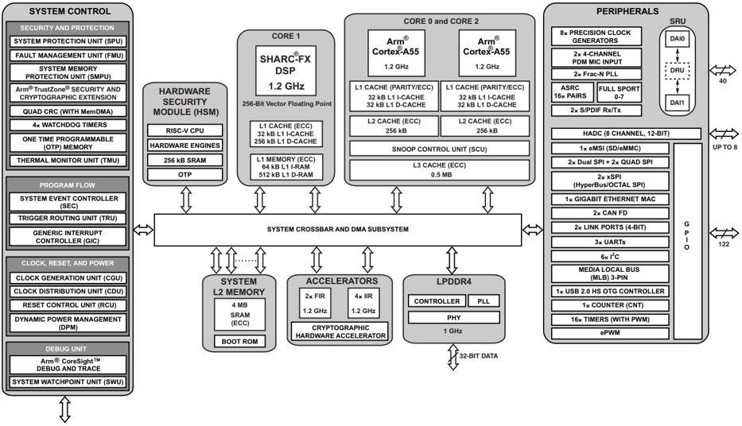
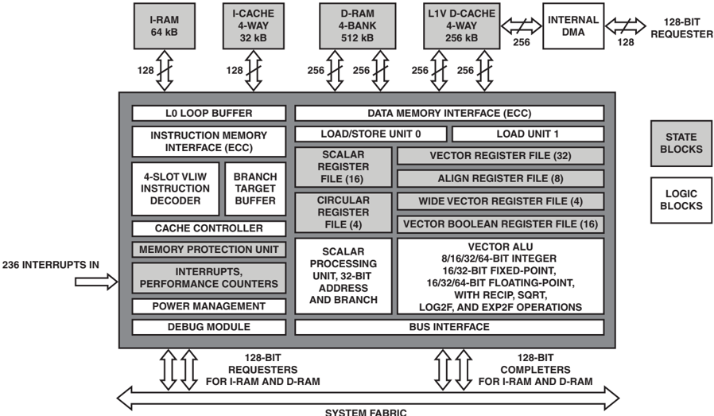
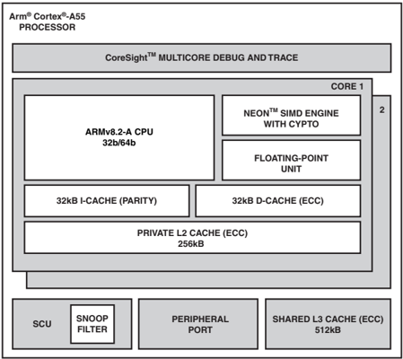
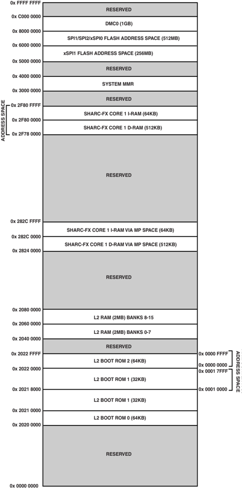
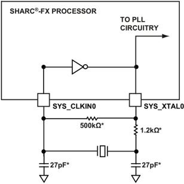
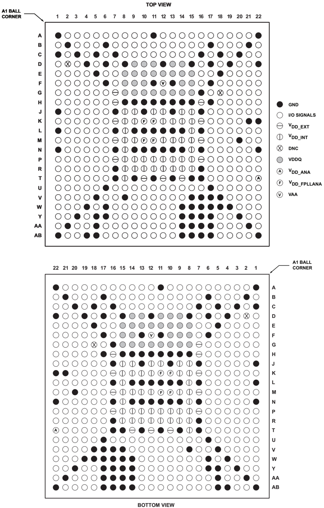
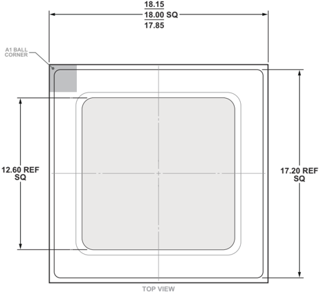
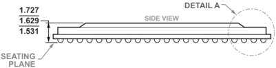
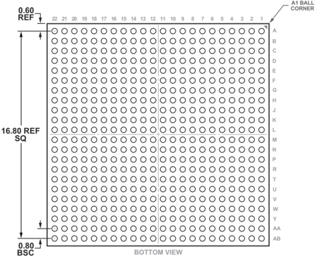
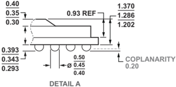

[DEVICES](https://www.analog.com/)

## Preliminary Technical Data

## SYSTEM FEATURES

SHARC-FX high performance floating-point core 256-bit vector size

Peak core performance at 1.2 GHz: 28.8 GFLOPS, 9.6 GMAC (32-bit float), 19.2 GMAC (16-bit fixed)

64/512 kB L1 instruction/data RAM with ECC protection

32/256 kB L1 instruction/data cache with ECC protection

Dual Arm Cortex-A55 cores

Up to 1200 MHz/3360 DMIPS with advanced SIMD and floating-point support per core

32 kB L1 instruction cache with parity/32 kB L1 data cache with ECC per core

256 kB L2 cache with ECC per core

Shared Snoop Control Unit (SCU) and 0.5 MB L3 cache with ECC

Up to 32 Mb (4 MB) on-chip L2 SRAM with ECC protection Level 3 (L3) 16/32-bit interface to LPDDR4 SDRAM devices

## High Performance SHARC-FX DSP Core With Arm-Based Connectivity/Security

## ADSP-21844/ADSP-21846/ADSP-SC844/ADSP-SC846

## On-board accelerators

2 FIR engines (up to 1.2 GHz, 4 taps per cycle each) 4 IIR engines (up to 1.2 GHz, 6 cycles per biquad each) Security

Hardware Security Module (HSM) supporting EVITA-FULL Cryptographic hardware accelerators and fast secure boot Key peripherals

Gigabit Ethernet, Dual xSPI/CAN-FD, eMMC, HADC, I 2 C, ASRC/SPORT

## PACKAGE

18 mm × 18 mm, 484-ball BGA\_ED (0.8 mm pitch), RoHS compliant, with LPDDR4 interface

## APPLICATIONS

Automotive: audio for head units and amplifiers, ANC/RNC, digital cockpit, ICC, AEC/Mic beamforming Consumer: speakers, sound bars, AVRs, conferencing systems, mixing consoles, microphone arrays

Figure 1. ADSP-SC846 (Full-Featured Model) Processor Block Diagram

SHARC is a registered trademark of Analog Devices, Inc.

Information  furnished  by  Analog  Devices  is  believed  to  be  accurate  and  reliable. However,  no  responsibility  is  assumed  by  Analog  Devices  for  its  use,  nor  for  any infringements of patents or other rights of third parties that may result from its use. Specifications subject to change without notice. No license is granted by implication or otherwise under any patent or patent rights of Analog Devices. Trademarks and registered trademarks are the property of their respective owners.

## ADSP-21844/ADSP-21846/ADSP-SC844/ADSP-SC846

## TABLE OF CONTENTS

| System Features . . . . . . . . . . . . . . . . . . . . . . . . . . . . . . . . . . . . . . . .             | . 1   |
|-------------------------------------------------------------------------------------------------------------|-------|
| Package . . . . . . . . . . . . . . . . . . . . . . . . . . . . . . . . . . . . . . . . . . . . . . . . . . | . 1   |
| Applications . . . . . . . . . . . . . . . . . . . . . . . . . . . . . . . . . . . . . . . . . . . .        | . 1   |
| Table of Contents . . . . . . . . . . . . . . . . . . . . . . . . . . . . . . . . . . . . . .               | . 2   |
| Revision History . . . . . . . . . . . . . . . . . . . . . . . . . . . . . . . . . . . . . . .              | . 2   |
| General Description . . . . . . . . . . . . . . . . . . . . . . . . . . . . . . . . . .                     | . 3   |
| SHARC-FX Processor Core . . . . . . . . . . . . . . . . . . . . . .                                         | . 5   |
| Dual ARM Cortex-A55 Processor (ADSP-SC84x Only) . . . . . . . . . . . . . . . . . . . . . . . . . . . .     | . 6   |
| System Infrastructure . . . . . . . . . . . . . . . . . . . . . . . . . . . . . .                           | . 7   |
| System Memory Map . . . . . . . . . . . . . . . . . . . . . . . . . . . . . .                               | . 7   |
| Security Features . . . . . . . . . . . . . . . . . . . . . . . . . . . . . . . . . . .                     | 10    |
| Security Features Disclaimer . . . . . . . . . . . . . . . . . . . . .                                      | 11    |
| Safety Features . . . . . . . . . . . . . . . . . . . . . . . . . . . . . . . . . . . . . .                 | 11    |
| Processor Peripherals . . . . . . . . . . . . . . . . . . . . . . . . . . . . . .                           | 12    |
| System Acceleration . . . . . . . . . . . . . . . . . . . . . . . . . . . . . . .                           | 17    |
| System Design . . . . . . . . . . . . . . . . . . . . . . . . . . . . . . . . . . . . . . .                 | 17    |
| System Debug . . . . . . . . . . . . . . . . . . . . . . . . . . . . . . . . . . . . . . .                  | 19    |
| REVISION HISTORY                                                                                            |       |
| Added Planned Automotive Production Products                                                                | 65    |
| Added Planned Production Products . . . . . . . . . . . . .                                                 | 65    |
| Added Pre Release Products . . . . . . . . . . . . . . . . . . . . . . . .                                  | 66    |

## Preliminary Technical Data

Development Tools ..............................................  19

Additional Information  ........................................  20

Related Signal Chains  ...........................................  20

ADSP-2184x/ADSP-SC84x Detailed Signal

Descriptions .......................................................  22

484-Ball BGA\_ED Signal Descriptions .........................  27

GPIO Multiplexing for 484-Ball BGA\_ED Package ......... 36

ADSP-2184x/ADSP-SC84x Designer Quick Reference  .... 41

ADSP-2184x/ADSP-SC84x 484-Ball BGA\_ED Ball

Assignments  ......................................................  57

Numerical by Ball Number  ....................................  57

Alphabetical by Pin Name  .....................................  60

Outline Dimensions ................................................  64

Surface-Mount Design ..........................................  64

Planned Automotive Production Products ....................  65

Planned Production Products ....................................  65

Pre Release Products  ...............................................  66

## Preliminary Technical Data

## ADSP-21844/ADSP-21846/ADSP-SC844/ADSP-SC846

## GENERAL DESCRIPTION

The ADSP-2184x/ADSP-SC84x digital signal processors (DSPs) are members of the SHARC ® -FX family of products. The SHARC-FX core uses a single-instruction, multiple-data (SIMD) vector floating-point architecture and can issue up to four instructions per cycle in most combinations. The SHARCFX core inside the ADSP-2184x/ADSP-SC84x processors offers processing speeds of up to 1.2 GHz coupled with up to 4 MB of L2 memory for low latency applications. For applications seeking enhanced connectivity options such as Ethernet, the ADSPSC84x includes high performance dual Arm ® Cortex ® -A55 cores in addition to the SHARC-FX core. All members of the SHARC-FX family have on-board IIR and FIR accelerators, as well as an efficient auto-vectorizing compiler for C/C++ programming.

The SHARC-FX core supports scalar and vector operations on all data types in vectors up to 256 bits, including integer, fixedpoint, floating-point, complex 16-bit/32-bit fixed-point and complex 32-bit/64-bit floating-point.

Table 1. DSP Core Comparison: SHARC+ vs. SHARC-FX

| Feature                          | SHARC+                                                         | SHARC-FX                                                                           |
|----------------------------------|----------------------------------------------------------------|------------------------------------------------------------------------------------|
| Float32 Operations Per Cycle     | 2 multiply and 2 add                                           | 8 fused multiply-add and 8 add                                                     |
| 1K Complex FFT Benchmark         | 11,000 cycles                                                  | 2,500 cycles                                                                       |
| Instruction Format               | One to four operations, 16 to 48 bits                          | One to four operations, 16 to 128 bits                                             |
| L1 Memory                        | 640 kB (4-bank shared by data RAM, instruction RAM, and cache) | 512 kB data RAM, 256 kB data cache, 64 kB instruction RAM, 32 kB instruction cache |
| Float64 Operations Per Cycle     | 2 every 6 cycles                                               | 4 each cycle                                                                       |
| Single Sample Biquad Performance | 2 channels and 2 stages every 8 cycles                         | 8 channels and 2 stages every 8 cycles                                             |
| Logf/expf Scalar Benchmark       | 50 cycles                                                      | 4 cycles                                                                           |

Eight float32 multiply/accumulate operations are allowed per cycle, with no constraints on alignment. The SHARC-FX core also features large register sets (32 data registers), thus reducing the need for stack save and restore. The peripherals and system architecture of the ADSP-2184x/ADSP-SC84x processors are compatible with previous SHARC processors, allowing for easy application porting.

By integrating a set of industry-leading system peripherals and memory, this family of processors is the platform of choice for applications that require leading-edge signal processing in one integrated package. These applications span a wide array of markets, including automotive, professional audio, and industrial-based applications that require high floating-point performance.

Table 1 provides a comparison between the SHARC+ and SHARC-FX core.

Table 2 provides comparison information for features that vary across the standard processors.

## ADSP-21844/ADSP-21846/ADSP-SC844/ADSP-SC846

## Table 2. Processor Features

|                                                 | DSP Only         | DSP Only         | Enhanced Connectivity   | Enhanced Connectivity   |
|-------------------------------------------------|------------------|------------------|-------------------------|-------------------------|
| Processor Feature 1                             | ADSP-21844       | ADSP-21846       | ADSP-SC844              | ADSP-SC846              |
| SHARC-FX DSP Core (MHz, Maximum) 2              | 600, 800         | 1000, 1200       | 600, 800                | 1000, 1200              |
| L1 D-RAM/ I-RAM (kB)                            | 512/64           | 512/64           | 512/64                  | 512/64                  |
| L1 D-Cache/I-Cache (kB)                         | 256/32           | 256/32           | 256/32                  | 256/32                  |
| Arm Cortex-A55 Dual Core Cluster (MHz, Maximum) | N/A              | N/A              | 1200                    | 1200                    |
| L1 D-Cache/I-Cache (kB)                         | N/A              | N/A              | 32/32                   | 32/32                   |
| L2 Cache (kB)                                   | N/A              | N/A              | 256                     | 256                     |
| L3 Cache (kB)                                   | N/A              | N/A              | 512                     | 512                     |
| System Memory                                   |                  |                  |                         |                         |
| L2 SRAM (kB)                                    | 2048             | 4096             | 2048                    | 4096                    |
| LPDDR4 Controller (16/32-Bit)                   | 1                | 1                | 1                       | 1                       |
| Hardware Accelerators                           |                  |                  |                         |                         |
| HSM                                             | Yes              | Yes              | Yes                     | Yes                     |
| FIR/IIR                                         | 2/4              | 2/4              | 2/4                     | 2/4                     |
| Security Crypto Engine                          | Yes              | Yes              | Yes                     | Yes                     |
| DAI (Includes SRU and DRU)                      | 2                | 2                | 2                       | 2                       |
| Full SPORTs                                     | 8 (4 per DAI)    | 8 (4 per DAI)    | 8 (4 per DAI)           | 8 (4 per DAI)           |
| S/PDIF Receive/Transmit                         | 2 (1 per DAI)    | 2 (1 per DAI)    | 2 (1 per DAI)           | 2 (1 per DAI)           |
| Stereo ASRCs                                    | 16 (8 per DAI)   | 16 (8 per DAI)   | 16 (8 per DAI)          | 16 (8 per DAI)          |
| PCGs                                            | 8 (4 per DAI)    | 8 (4 per DAI)    | 8 (4 per DAI)           | 8 (4 per DAI)           |
| 4-Channel PDM MIC Input                         | 2 (1 per DAI)    | 2 (1 per DAI)    | 2 (1 per DAI)           | 2 (1 per DAI)           |
| Buffers                                         | 40 (20 per DAI)  | 40 (20 per DAI)  | 40 (20 per DAI)         | 40 (20 per DAI)         |
| Multiplexed Peripherals                         |                  |                  |                         |                         |
| Media Local Bus (MLB) 3-Pin 3                   | 1                | 1                | 1                       | 1                       |
| eMSI (SD/eMMC)                                  | 1                | 1                | 1                       | 1                       |
| Link Port (4-bit)                               | 2                | 2                | 2                       | 2                       |
| General-Purpose Counter                         | 1                | 1                | 1                       | 1                       |
| Watchdog Timer                                  | 4                | 4                | 4                       | 4                       |
| I 2 C (TWI)                                     | 6                | 6                | 6                       | 6                       |
| General-Purpose Timer                           | 16               | 16               | 16                      | 16                      |
| xSPI with Octal and HyperBus Support            | 2                | 2                | 2                       | 2                       |
| Quad-Data Bit SPI                               | 2                | 2                | 2                       | 2                       |
| Dual-Data Bit SPI                               | 2                | 2                | 2                       | 2                       |
| UART                                            | 3                | 3                | 3                       | 3                       |
| USB 2.0 HS OTG Controller                       | N/A              | N/A              | 1                       | 1                       |
| 10/100/1000 EMAC Std/AVB + Timer IEEE 1588      | N/A              | N/A              | 1                       | 1                       |
| CAN FD 3                                        | N/A              | N/A              | 2                       | 2                       |
| ePWM                                            | 8 outputs        | 8 outputs        | 8 outputs               | 8 outputs               |
| HADC (12-Bit)                                   | 8-channel        | 8-channel        | 8-channel               | 8-channel               |
| GPIO Ports                                      | Port A to Port I | Port A to Port I | Port A to Port I        | Port A to Port I        |
| GPIO + DAI Pins                                 | 134 + 40         | 134 + 40         | 134 + 40                | 134 + 40                |
| Package Options                                 | 484-ball BGA_ED  | 484-ball BGA_ED  | 484-ball BGA_ED         | 484-ball BGA_ED         |

## Preliminary Technical Data

## ADSP-21844/ADSP-21846/ADSP-SC844/ADSP-SC846

## SHARC-FX PROCESSOR CORE

SHARC-FX is a DSP core (Figure 2) developed jointly by Analog Devices and Cadence, leveraging Cadence's Xtensa ® core technology. It is a follow-on to the SHARC and SHARC+ DSP cores from Analog Devices. The SHARC-FX core is not ISA compatible with the SHARC and SHARC+ DSP cores.

The following sections describe the key features of the SHARCFX core inside the ADSP-2184x/ADSP-SC84x processors.

## 4-Way VLIW

The 4-way VLIW issues one to four operations per cycle in an instruction that is 16 to 128 bits wide. In every cycle, a load or store or scalar ALU op, a second load or second ALU op, a vector ALU op, or a vector ALU or multiply/accumulate op can be executed.

## 256-Bit SIMD

This wide SIMD unit can be broken up into lanes that are 8, 16, 32, or 64 bits wide. For example, the unit can execute eight 32bit multiply-accumulates per cycle. Each lane of a vector is enabled or disabled by a boolean register for conditional operations. An entire vector is permuted for small table lookups. Support is also added for fast histograms.

## DSP Features

The SHARC-FX core supports loop counters, circular addressing, and fixed-point arithmetic with 20-, 40-, and 80-bit accumulators, binary-point shifts and rounding, and saturation.

## Fixed- and Floating-Point Data Types

The SHARC-FX core handles all major data types:

- 8-, 16-, 32-, and 64-bit integers
- 8-, 16-, and 32-bit fixed-point, both real and complex
- 32- and 64-bit floating-point, both real and complex.

## L1 Data Cache and RAM

The SHARC-FX core includes a 256 kB data cache, a 512 kB data RAM, a 32 kB instruction cache, and a 64 kB instruction RAM. The caches are write-back or write-through, use 64B lines and are four-way associative with LRU replacement. All memories are protected with ECC. Figure 4 shows the ADSP2184x/ADSP-SC84x memory map.

## Memory Protection Unit (MPU)

Although memory is physically addressed, an MPU of the ADSP-2184x/ADSP-SC84x controls the access and the caching behavior for up to 32 variable-sized address ranges.

SYSTEM FABRIC

Figure 2. SHARC-FX Processor Block Diagram

## ADSP-21844/ADSP-21846/ADSP-SC844/ADSP-SC846

## Advanced Arithmetic

The SHARC-FX core supports high accuracy, floating-point arithmetic via a fused multiply-add and also has seeds for accurate square root and reciprocal. The processor core executes efficient but imprecise checking for floating-point errors and can also break on fixed-point saturation. The log2f and exp2f operations are executed in one cycle, and these operations are used for single-cycle reciprocal, square-root, divide, and power at less accuracy. The compiler recognizes vector versions of standard functions like sinf and sqrtf operations and can automatically vectorize loops containing them.

## Built-In Interrupt Controller

A 221-input vectored interrupt controller is available to the ADSP-2184x/ADSP-SC84x processor. Each input can be active high or low, edge or level, and can have one of 15 priority levels.

## Built-In Direct Memory Access Engine (iDMA)

A fast, low-latency DMA controller for moving blocks to and from the Data RAM is available.

## CoreSight Debugging

The ADSP-2184x/ADSP-SC84x uses the Arm ® CoreSight TM SoC-600 debug standard, with breakpoints, watchpoints, and PC tracing. It can also count a wide range of events such as cache misses and pipeline stalls for performance analysis. When used with a third-party emulator, the emulator must support CoreSight SoC-600.

## DUAL ARM CORTEX-A55 PROCESSOR (ADSP-SC84x ONLY)

ADSP-SC84x processors include high performance dual Cortex-A55 processors. The Arm Cortex-A55 processor (Figure 3) is a mid-range, low-power core that implements the Armv8-A architecture with support for the Armv8.1-A extension, the Armv8.2-A extension, and the reliability, availability, and serviceability (RAS) extension. The core is implemented inside the DynamIQ shared unit (DSU) as a little core.

Each Arm Cortex-A55 core includes the following features:

- Core Features
- Full implementation of the Arm8.2-A A64, A32, and T32 instruction sets
- Both AArch32 and AArch64 execution states at all exception levels (EL0 to EL3)
- In-order pipeline with direct and indirect branch prediction
- Separate L1 data and instruction side memory systems with a memory management unit (MMU)
- Support for Arm TrustZone ® technology
- Extension-data engine unit that implements the advanced SIMD and floating-point architecture support
- Extension-cryptographic extension

## Preliminary Technical Data

- Generic interrupt controller (GIC) CPU interface to connect to an external distributor
- Generic timers interface that supports a 64-bit count input from an external system counter
- Cache Features
- L1 instruction cache unit (32 KB), L1 data cache unit (32 KB), and unified private L2 cache unit (256 KB)
- L1 and L2 cache protection in the form of error correction code (ECC) or parity on all RAM instances
- Debug Features
- Reliability, availability, and serviceability (RAS) extension
- Armv8.2-A debug logic
- Performance monitoring unit (PMU)
- Embedded trace macrocell (ETM) that supports instruction trace only
- Shared Features between dual Cortex-A55 processors
- L3 cache (512 KB)
- Snoop Control Unit (SCU)

Figure 3. Arm Cortex-A55 Processor Block Diagram

## Generic Interrupt Controller (GIC), GIC-600

The generic interrupt controller (GIC) is a centralized resource for supporting and managing interrupts. The GIC consists of three interfaces-the distributor interface (GICD), the redistributor interface (GICR), and the central processing unit (CPU) interface. The distributor and the redistributor interfaces configure interrupts. The CPU interface handles interrupts.

## Preliminary Technical Data

## ADSP-21844/ADSP-21846/ADSP-SC844/ADSP-SC846

## GIC Distributor Interface (GICD)

The distributor performs interrupt prioritization and distribution of shared peripheral interrupts (SPIs) and software generated interrupts (SGIs) to the redistributors and CPU interfaces that are connected to the processors in the system. The distributor provides the routing configuration for SPIs and holds all the associated routing and priority information for private peripheral interrupts (SPIs).

## GIC Redistributor Interface (GICR)

The redistributor provides the configuration settings for SGIs and PPIs. The redistributor holds the control, prioritization, and pending information for all SGIs and PPIs. It also presents the pending interrupt with the highest priority to the CPU interface.

## GIC CPU Interface

The GIC CPU interface block performs priority masking and preemption handling for a connected processor in the system. The GIC supports 16 SGIs, 9 PPIs, and 420 SPIs.

## GIC Performance Monitoring Unit (GIC PMU)

The GIC contains a performance monitoring unit (PMU) for counting key GIC events from the distributor. Redistributor events are not tracked by the PMU. The delivery of PPI and SGI interrupts are counted by recording calls to the core interrupt service routine. The PMU has five counters with snapshot capability and overflow interrupt.

## Cryptographic Extension

The Cortex-A55 core cryptographic extension supports the Armv8-A cryptographic extension. The cryptographic extension adds new A64, A32, and T32 instructions to advanced SIMD that accelerate:

- Advanced encryption standard (AES) encryption and decryption
- Secure hash algorithm (SHA) functions SHA-1, SHA-224, and SHA-256
- Finite field arithmetic used in algorithms such as Galois/Counter mode and elliptic curve cryptography

## SYSTEM MEMORY MAP

## Table 3. SHARC-FX L1 DRAM and IRAM Space

| Memory                     | SHARC-FX Private Addressing Space   | Arm Cortex-A55 Addressing Space   | System Addressing Space   |
|----------------------------|-------------------------------------|-----------------------------------|---------------------------|
| L1 Data RAM (512 KB)       | 0x2F780000-0x2F7FFFFF               | 0x28240000-0x282BFFFF             | 0x28240000-0x282BFFFF     |
| L1 Instruction RAM (64 KB) | 0x2F800000-0x2F80FFFF               | 0x282C0000-0x282CFFFF             | 0x282C0000-0x282CFFFF     |

## SYSTEM INFRASTRUCTURE

The following sections describe the system infrastructure of the ADSP-2184x/ADSP-SC84x processors.

## System L2 Memory

A system L2 SRAM memory of up to 32 Mb (4 MB) is available to the SHARC-FX core, both Arm Cortex-A55 cores, and the system DMA channels (see Table 4). The L2 SRAM block is subdivided into up to 16 banks to support concurrent access to the L2 memory ports. Memory accesses to the L2 memory space are multicycle accesses by the SHARC-FX core.

The memory space is used for various situations including:

- Accelerator and peripheral sources and destination memory to avoid accessing data in the external memory
- A location for DMA descriptors
- Storage for additional data for the SHARC-FX core to avoid external memory latencies and reduce external memory bandwidth
- Storage for data cached by the SHARC-FX core
- Inter-core communication and passing of data between the SHARC -FX and Arm Cortex-A55 cores of the processor

See the System Memory Protection Unit (SMPU) section for options in limiting access by specific cores and DMA requesters.

## One Time Programmable Memory (OTP)

The processors feature 4 kB of one time programmable (OTP) memory that is memory-map accessible. This memory can be programmed with custom keys and supports secure boot and secure operation.

## I/O Memory Space

Mapped I/Os include SPI1/SPI2/xSPI0/xSPI1 memory address space (see Table 5).

## ADSP-21844/ADSP-21846/ADSP-SC844/ADSP-SC846

## Table 4. SHARC-FX and Arm Cortex-A55 L2 Memory Addressing Map

| Memory          | SHARC-FX Addressing   | Arm Cortex-A55 Addressing   | System Addressing     |
|-----------------|-----------------------|-----------------------------|-----------------------|
| L2 Boot ROM0    | 0x20200000-0x2020FFFF | 0x20200000-0x2020FFFF       | 0x20200000-0x2020FFFF |
| L2 Boot ROM1    | 0x20210000-0x20217FFF | 0x20210000-0x20217FFF       | 0x20210000-0x20217FFF |
|                 | 0x20218000-0x2021FFFF | 0x00010000-0x00017FFF       | 0x20218000-0x2021FFFF |
| L2 Boot ROM2    | 0x20220000-0x2022FFFF | 0x00000000-0x0000FFFF       | 0x20220000-0x2022FFFF |
| L2 RAM (2 MB) 1 | 0x20400000-0x205FFFFF | 0x20400000-0x205FFFFF       | 0x20400000-0x205FFFFF |
| L2 RAM (2 MB) 1 | 0x20600000-0x207FFFFF | 0x20600000-0x207FFFFF       | 0x20600000-0x207FFFFF |

## Table 5. Memory Map of Mapped I/Os

| Memory                          | SHARC-FX Addressing   | Arm Cortex-A55 Addressing   | System Addressing     |
|---------------------------------|-----------------------|-----------------------------|-----------------------|
| xSPI1 Memory (256 MB)           | 0x50000000-0x5FFFFFFF | 0x50000000-0x5FFFFFFF       | 0x50000000-0x5FFFFFFF |
| SPI1/SPI2/xSPI0 Memory (512 MB) | 0x60000000-0x7FFFFFFF | 0x60000000-0x7FFFFFFF       | 0x60000000-0x7FFFFFFF |

## Table 6. DMC Memory Map

|             | SHARC-FX Addressing   | Arm Cortex-A55 Addressing   | System Addressing     |
|-------------|-----------------------|-----------------------------|-----------------------|
| DMC0 (1 GB) | 0x80000000-0xBFFFFFFF | 0x80000000-0xBFFFFFFF       | 0x80000000-0xBFFFFFFF |

## System Crossbars (SCBs)

The system crossbars (SCBs) are the fundamental building blocks of a switch fabric style for on-chip system bus interconnection. The SCBs connect system bus requesters to system bus completers, providing concurrent data transfer between multiple bus requesters and multiple bus completers. A hierarchical model-built from multiple SCBs-provides a power and area efficient system interconnection.

The SCBs provide the following features:

- Highly efficient, pipelined bus transfer protocol for sustained throughput
- Full-duplex bus operation for flexibility and reduced latency
- Concurrent bus transfer support to allow multiple bus requesters to access bus completers simultaneously
- Protection model (privileged/secure) support for selective bus interconnect protection

## Direct Memory Access (DMA)

The processor uses direct memory access (DMA) to transfer data within memory spaces or between a memory space and a peripheral. The processor can specify data transfer operations and return to normal processing while the fully integrated DMA controller carries out the data transfers independent of processor activity.

DMA transfers can occur between memory and a peripheral or between one memory and another memory. Each memory to memory DMA stream uses two channels: the source channel and the destination channel.

All DMA channels can transport data to and from all on-chip and off-chip memories. Programs can use two types of DMA transfers: descriptor-based or register-based. Register-based DMA allows the processors to program DMA control registers directly to initiate a DMA transfer. On completion, the DMA control registers automatically update with original setup values for continuous transfer. Descriptor-based DMA transfers require a set of parameters stored within memory to initiate a DMA sequence. Descriptor-based DMA transfers allow multiple DMA sequences to be chained together by programming a DMA channel to set up and start another DMA transfer automatically after the current sequence completes.

The DMA engine supports the following DMA operations:

- A single linear buffer that stops on completion
- A linear buffer with negative, positive, or zero stride length
- A circular autorefreshing buffer that interrupts when each buffer becomes full
- A similar circular buffer that interrupts on fractional buffers, such as at the halfway point
- A 1D DMA using a set of identical ping pong buffers defined by a linked ring of two-word descriptor sets, each containing a link pointer and an address
- A 1D DMA using a linked list of four-word descriptor sets containing a link pointer, an address, a length, and a configuration
- A 2D DMA using an array of one-word descriptor sets, specifying only the base DMA address
- A 2D DMA using a linked list of multiword descriptor sets, specifying all configurable parameters

## Preliminary Technical Data

## Preliminary Technical Data

## ADSP-21844/ADSP-21846/ADSP-SC844/ADSP-SC846

## Memory Direct Memory Access (MDMA)

ARM CORTEX A-55

Figure 4. ADSP-2184x/ADSP-SC84x Memory Map

The processor supports a total of eight MDMA channels for various memory direct memory access (MDMA) operations, including,

- Enhanced bandwidth MDMA channels with cyclic redundancy check (CRC) protection (32-bit bus width, run on SYSCLK)
- Enhanced bandwidth MDMA channel (32-bit bus width, runs on SYSCLK)
- Maximum bandwidth MDMA channel (64-bit bus width, runs on SYSCLK)

## Extended Memory DMA

Extended memory DMA supports various operating modes, such as delay line (which allows processor reads and writes to external delay line buffers and to the external memory), with limited core interaction and scatter/gather DMA (writes to and from noncontiguous memory blocks).

## Cyclic Redundancy Check (CRC) Protection

The cyclic redundancy check (CRC) protection modules allow system software to calculate the signature of code, data, or both in memory, the content of memory-mapped registers, or periodic communication message objects. Dedicated hardware circuitry compares the signature with precalculated values and triggers appropriate fault events.

For example, the system software initiates the signature calculation of the entire memory contents every 100 ms and compares this with expected, precalculated values. If a mismatch occurs, a fault condition is generated through the processor core or the trigger routing unit.

The CRC is a hardware module based on a CRC32 engine that computes the CRC value of the 32-bit data-words presented to it. The source channel of the memory to memory DMA (in memory scan mode) provides data. The data can be optionally forwarded to the destination channel (memory transfer mode). The main features of the CRC peripheral are as follows:

- Memory scan mode
- Memory transfer mode
- Data verify mode
- Data fill mode
- User-programmable CRC32 polynomial
- Bit and byte mirroring option (endianness)
- Fault and error interrupt mechanisms
- 1D and 2D fill block to initialize an array with constants
- 32-bit CRC signature of a block of memory or an MMR block

SHARC-FX

## ADSP-21844/ADSP-21846/ADSP-SC844/ADSP-SC846

## Event Handling

The processor provides event handling that supports both nesting and prioritization. Nesting allows multiple event service routines to be active simultaneously. Prioritization ensures that servicing a higher priority event takes precedence over servicing a lower priority event.

The processor provides support for four different types of events:

- An emulation event causes the processors to enter emulation mode, allowing command and control of the processors through the JTAG interface.
- A reset event resets the processors.
- An exception event is caused by errors during execution. Synchronous exceptions, such as illegal instruction or data misalignment, do not permit the instruction to complete. Imprecise exceptions, such as floating-point or saturation errors or some error correcting code (ECC) errors, are reported after the instruction has completed. Exceptions cause the program counter to change to the value held in the EPC special register and are not affected by the interrupt priority level or status.
- An interrupt event occurs asynchronously to program flow. The interrupts are caused by input signals, timers, and other peripherals, as well as by an explicit software instruction.

## System Event Controller (SEC)

The SHARC-FX core event controller receives some interrupts from the system event controller (SEC), but most go directly to its built-in interrupt controller. The SEC features include the following:

- Comprehensive system event source management, including interrupt enable, fault enable, priority, core mapping, and source grouping
- A distributed programming model where each system event source control and all status fields are independent of each other
- Determinism where all system events have the same propagation delay and provide unique identification of a specific system event source
- A completer control port that provides access to all SEC registers for configuration, status, and interrupt and fault services
- Global locking that supports a register level protection model to prevent writes to locked registers
- Fault management including fault action configuration, time out, external indication, and system reset

## Preliminary Technical Data

## Trigger Routing Unit (TRU)

The trigger routing unit (TRU) provides system level sequence control without core intervention. The TRU maps trigger generators to trigger receivers. Trigger receivers can be configured to respond to triggers in various ways. Common applications enabled by the TRU include,

- Automatically triggering the start of a DMA sequence after a sequence from another DMA channel completes
- Software triggering
- Synchronization of concurrent activities

## SECURITY FEATURES

The following sections describe the security features of the ADSP-2184x/ADSP-SC84x processors.

## Arm TrustZone

The ADSP-SC84x processors provide TrustZone technology that is integrated into the Arm Cortex-A55 processors. The TrustZone technology enables a secure state that is extended throughout the system fabric.

## Cryptographic Hardware Accelerators

The ADSP-2184x/ADSP-SC84x processors support standardsbased hardware accelerated encryption, decryption, authentication, and true random number generation.

Support for the hardware accelerated cryptographic ciphers includes the following:

- AES in ECB, CBC, ICM, and CTR modes with 128-bit, 192-bit, and 256-bit keys
- DES in ECB and CBC mode with 56-bit key
- 3DES in ECB and CBC mode with 3x 56-bit key
- ARC4 in stateful, stateless mode, up to 128-bit key

Support for the hardware accelerated hash functions includes the following:

- SHA-1
- SHA-2 with 224-bit and 256-bit digests
- HMAC transforms for SHA-1 and SHA-2
- MD5

Public key accelerator (PKA) is available to offload computation intensive public key cryptography operations.

Both a hardware-based nondeterministic random number generator and pseudorandom number generator are available.

Secure boot is also available with 224-bit and 256-bit elliptic curve digital signatures ensuring integrity and authenticity of the boot stream. Optionally, ensuring confidentiality through AES-128 encryption is available.

## Preliminary Technical Data

## ADSP-21844/ADSP-21846/ADSP-SC844/ADSP-SC846

Password protected secure debug is also available to allow only trusted users to access the system with debug tools.

## CAUTION

This product includes security features that can be used  to  protect  embedded  nonvolatile  memory contents  and  prevent  execution  of  unauthorized code.  When  security  is  enabled  on  this  device (either  by  the  ordering  party  or  the  subsequent receiving parties), the ability of Analog Devices to conduct  failure  analysis  on  returned  devices  is limited. Contact Analog Devices for details on the failure analysis limitations for this device.

A

## Hardware Security Module (HSM)

The hardware security module is a standalone security core with root of trust functionality. The HSM combines a secure 32-bit RISC-V CPU, dedicated secure memories, and local nonvolatile memory (OTP) with cryptographic hardware engines, such as true random number generator (TRNG), secure hash and HMAC engines, a symmetric cipher accelerator, a DPA-resistant asymmetric cipher accelerator, DPA-resistant key derivation, glitch detection, and a hardware firewall.

## System Protection Unit (SPU)

The system protection unit (SPU) guards against accidental or unwanted access to an MMR space of the peripheral by providing a write protection mechanism. The user can choose and configure the protected peripherals, as well as configure which of the system MMR requesters the peripherals are guarded against.

The SPU is also part of the security infrastructure. Along with providing write protection functionality, the SPU is employed to define which resources in the system are secure or nonsecure as well as block access to secure resources from nonsecure requesters.

## System Memory Protection Unit (SMPU)

The system memory protection unit (SMPU) provides memory protection against read and/or write transactions to defined regions of memory. There are SMPU units in the ADSP2184x/ADSP-SC84x processors for each memory space, except for SHARC-FX L1.

The SMPU is also part of the security infrastructure. It allows the user to protect against arbitrary read and/or write transactions and allows regions of memory to be defined as secure and prevent nonsecure requesters from accessing those memory regions.

## SECURITY FEATURES DISCLAIMER

Analog Devices does not guarantee that the Security Features described herein provide absolute security. ACCORDINGLY, ANALOG DEVICES HEREBY DISCLAIMS ANY AND ALL EXPRESS AND IMPLIED WARRANTIES THAT THE SECURITY FEATURES CANNOT BE BREACHED, COMPROMISED, OR OTHERWISE CIRCUMVENTED AND IN NO EVENT SHALL ANALOG DEVICES BE LIABLE FOR

ANY LOSS, DAMAGE, DESTRUCTION, OR RELEASE OF DATA, INFORMATION, PHYSICAL PROPERTY, OR INTELLECTUAL PROPERTY.

## SAFETY FEATURES

The ADSP-2184x/ADSP-SC84x processors are designed to provide robust and fail-safe operation. The following safety primitives are provided by the processors.

## Error Correcting Code (ECC) Protected L1 Memories

The SRAMs and caches in the SHARC-FX L1 memory space and the DTCM memories and caches in the Arm Cortex-A55 cores are protected by SECDEC. Single-bit errors are automatically corrected and written back. Multiple-bit errors are retried several times, and then cause exceptions. The cache tags and BTB on the SHARC-FX are protected the same way.

## Error Correcting Code (ECC) Protected L2 Memories

Error correcting code (ECC) corrects single event upsets. A single error correct/double error detect (SEC/DED) code protects the L2 memory. By default, ECC is enabled, but it can be disabled on a per bank basis. Single-bit errors correct transparently. If enabled, dual-bit errors can issue a system event or fault. ECC protection is fully transparent to the user, even if L2 memory is read or written by 8-bit or 16-bit entities.

## Parity and ECC Protected Peripheral Memories

Parity protection is added to the following peripheral memories:

- ASRC
- IIR
- FIR
- USB
- CRYPTO
- EMAC
- MLB
- TRACE
- eMSI

CAN FD memory is ECC protected.

## Cyclic Redundancy Check (CRC) Protected Memories

Whereas parity bit and ECC protection mainly protect against random soft errors in L1 and L2 memory cells, the CRC engines can protect against systematic errors (pointer errors) and static content (instruction code) of L1, L2, and even Level 3 (L3) memories (DDR3L). The processors feature two CRC engines that are embedded in the memory to memory DMA controllers.

CRC checksums can be calculated or compared automatically during memory transfers. Alternatively, single or multiple memory regions can be continuously scrubbed by a single DMA work unit as per DMA descriptor chain instructions. The CRC engine also protects data loaded during the boot process.

## ADSP-21844/ADSP-21846/ADSP-SC844/ADSP-SC846

## Signal Watchdogs

The 16 general-purpose (GP) timers feature modes to monitor off-chip signals. The watchdog period mode monitors whether external signals toggle with a period within an expected range.

The watchdog width mode monitors whether the pulse widths of external signals are within an expected range. Both modes help detect undesired toggling or lack of toggling of system level signals.

## System Event Controller (SEC)

Besides system events, the system event controller (SEC) further supports fault management, including fault action configuration as timeout, internal indication by system interrupt, or external indication through the SYS\_FAULT pin and system reset.

## Memory Error Controller (MEC)

The memory error controller (MEC) manages memory parity/ECC errors and warnings from the cores and peripherals and sends out interrupts and triggers.

## PROCESSOR PERIPHERALS

The following sections describe the peripherals of the ADSP2184x/ADSP-SC84x processors.

## Dynamic Memory Controller (DMC)

The 16-bit/32-bit, two-channel, dual-rank dynamic memory controller (DMC) interfaces to LPDDR4 (JESD209-4D), supporting up to 8 Gb along with inline ECC and PHY training support. See Table 6 for the DMC memory map.

The DMC can be used in 32-bit mode by combining both the channels or in 16-bit mode through the first channel using halfbus width support. (Independent/parallel usage of both the channels in 16-bit mode is not supported.)

There is an additional prefetch buffer (PFB) added to improve the performance for read accesses. When enabled on DDR, the prefetch buffer supports the optional predictive prefetch that improves performance for nonlinear access patterns. For noncontinuous (nonlinear) accesses (resulting in MISS), the prefetch buffer feature makes decisions on whether fetch and/or prefetch requests from the PFB to memory launch or give direct access for such read requests. The decision is based on the history of the read transactions received.

## Digital Audio Interface (DAI)

The processors support two identical digital audio interface (DAI) units. The DAI can connect various peripherals to any of the DAI pins.

The application code makes these connections using the signal routing unit (SRU), shown in Figure 1.

The SRU is a matrix routing unit (or group of multiplexers) that enables the peripherals provided by each DAI instance to interconnect under software control. This functionality allows easy use of the DAI associated peripherals for a wider variety of applications by using a larger set of algorithms than is possible with nonconfigurable signal paths.

## Preliminary Technical Data

The DAI includes the peripherals described in the following sections (SPORTs, ASRC, S/PDIF, PCG, and PDM). DAI Pin Buffer 20 and DAI Pin Buffer 19 can change the polarity of the input signals.

The DAI\_PINx pin buffers can also be used as GPIO pins. DAI input signals allow the triggering of interrupts on the rising edge, falling edge, or both.

See the Digital Audio Interface (DAI) chapter of the ADSP2184x/ADSP-SC84x SHARC-FX Processor Hardware Reference (TBD) for complete information on the use of the DAIs and SRUs.

## DAI Routing Unit (DRU)

The DAI routing unit (DRU) provides flexibility when routing signals across the two DAI units. All DAI0 SRU source signals are available as source signals for the DAI1 SRU, and all DAI1 SRU source signals are available as source signals for the DAI0 SRU.

## Serial Port (SPORT)

The processors feature eight synchronous serial ports (SPORTs), providing an inexpensive interface to a wide variety of digital and mixed-signal peripheral devices. These devices include Analog Devices AD19xx and ADAU19xx families of audio codecs, analog-to-digital converters (ADCs) and digitalto-analog converters (DACs). Two data lines, a clock, and a frame sync comprise a SPORT half. The data lines can be programmed to either transmit or receive data, and each data line has a dedicated DMA channel.

An individual SPORT module consists of two independently configurable SPORT halves with identical functionality. Two bidirectional data lines-primary (0) and secondary (1)-are available per SPORT half and are configurable as either transmitters or receivers. Therefore, each SPORT half permits two unidirectional streams into or out of the same SPORT. This bidirectional functionality provides greater flexibility for serial communications. For full-duplex configuration, one half SPORT provides two transmit data signals, and the other half SPORT provides two receive data signals. The frame sync and clock are shared.

Serial ports operate in the following six modes:

- Standard DSP serial mode
- Multichannel time division multiplexing (TDM) mode
- I 2 S mode
- Packed I 2 S mode
- Left justified mode
- Right justified mode

## Asynchronous Sample Rate Converter (ASRC)

The asynchronous sample rate converter (ASRC) contains 16 ASRC blocks. The ASRC provides up to 140 dB signal-tonoise ratio (SNR). The ASRC block performs synchronous or asynchronous sample rate conversion across independent stereo channels, without using internal processor resources. The ASRC blocks can also be configured to operate together to convert

## Preliminary Technical Data

## ADSP-21844/ADSP-21846/ADSP-SC844/ADSP-SC846

multichannel audio data without phase mismatches. Finally, the ASRC can clean up audio data from jittery clock sources such as the S/PDIF receiver.

DMA supported, asynchronous transfers of serial data. A UART port includes support for five to eight data bits as well as no parity, even parity, or odd parity.

## S/PDIF-Compatible Digital Audio Receiver/Transmitter

The Sony/Philips Digital Interface Format (S/PDIF) is a standard audio data transfer format that allows the transfer of digital audio signals from one device to another. There are two S/PDIF transmit/receive blocks on the processor. The digital audio interface carries three types of information: audio data, nonaudio data (compressed data), and timing information.

The S/PDIF interface supports one stereo channel or compressed audio streams. The S/PDIF transmitter and receiver are AES3 compliant and support the sample rate from 24 kHz to 192 kHz. The S/PDIF receiver supports professional jitter standards.

The S/PDIF receiver/transmitter has no separate DMA channels. It receives audio data in serial format and converts it into a biphase encoded signal. The serial data input to the receiver/ transmitter can be formatted as left justified, I 2 S, or right justified with word widths of 16, 18, 20, or 24 bits. The serial data, clock, and frame sync inputs to the S/PDIF receiver/transmitter are routed through the SRU. They can come from various sources, such as the SPORTs, external pins, and the precision clock generators (PCGs), and are controlled by the SRU control registers.

## Precision Clock Generators (PCG)

The precision clock generators (PCG) consist of eight units located in the two DAI blocks. The PCG can generate a pair of signals (clock and frame sync) derived from a clock input signal (CLKIN, SCLK0, or DAI pin buffer). Both units are identical in functionality and operate independently of each other. The two signals generated by each unit are normally used as a serial bit clock/frame sync pair.

## Pulse Density Modulation (PDM) Microphone Interface

The pulse density modulation (PDM) interface is used to convert digital PDM microphone data to I 2 S/TDM format. The microphone data in I 2 S/TDM format is then routed internally to the serial port/ASRC or externally via the DAI pins. The PDM microphone inputs include an internal decimation filter. Up to eight PDM microphones can be connected to the two dedicated digital microphone interfaces (one per DAI). Each PDM interface consists of one clock line and two data lines. Two microphones can share a single data line and be used along with a clock line to create a dual-input microphone port. Two dualinput lines can share a single clock line to support four microphone inputs.

## Universal Asynchronous Receiver/Transmitter (UART) Ports

The processors provide four full-duplex universal asynchronous receiver/transmitter (UART) ports, fully compatible with PC standard UARTs. Each UART port provides a simplified UART interface to other peripherals or hosts, supporting full-duplex, Optionally, an additional address bit can be transferred to interrupt only addressed nodes in multidrop bus (MDB) systems. A frame is terminated by a configurable number of stop bits.

The UART ports support automatic hardware flow control through the clear to send (CTS) input and request to send (RTS) output with programmable assertion first in, first out (FIFO) levels.

To help support the Local Interconnect Network (LIN) protocols, a special command causes the transmitter to queue a break command of programmable bit length into the transmit buffer. Similarly, the number of stop bits can be extended by a programmable interframe space.

## Serial Peripheral Interface (SPI) Ports

The processors have four industry-standard SPI-compatible ports that allow the processors to communicate with multiple SPI-compatible devices.

The baseline SPI peripheral is a synchronous, 4-wire interface consisting of two data pins, one device select pin, and a gated clock pin. The two data pins allow full-duplex operation to other SPI-compatible devices. An extra two (optional) data pins are provided to support quad-SPI operation on two instances. Enhanced modes of operation, such as flow control, fast mode, and dual-I/O mode (DIOM), are also supported. DMA mode allows for transferring several words with minimal CPU interaction.

With a range of configurable options, the SPI ports provide a glueless hardware interface with other SPI-compatible devices in controller mode, target mode, and multicontroller environments. The SPI peripheral includes programmable baud rates, clock phase, and clock polarity. The peripheral can operate in a multicontroller environment by interfacing with several other devices, acting as either a controller device or a target device. In a multicontroller environment, the SPI peripheral uses opendrain outputs to avoid data bus contention. The flow control features enable slow target devices to interface with fast controller devices by providing an SPI ready pin (SPI\_RDY), which flexibly controls the transfers.

The baud rate and clock phase and polarities of the SPI port are programmable. The port has integrated DMA channels for both transmit and receive data streams.

## xSPI with Octal and HyperBus Support

The octal serial peripheral interface port (xSPI/HyperBus) provides an increased external memory data bus width (up to eight bits in parallel). The xSPI port supports dual data rate (DDR) modes of operation, which enable the transfer of up to 16 bits of data each clock cycle. The xSPI port provides overall data throughput and performance improvement, including faster boot time.

## ADSP-21844/ADSP-21846/ADSP-SC844/ADSP-SC846

Features of the xSPI/HyperBus port include:

- Support for single-, dual-, quad-, or octal-I/O transfers
- Can be interfaced with octal flash, octal RAM, HyperFlash, and HyperRAM devices
- Can be interfaced with legacy flash devices including quad and SPINAND
- Auto command engine and minicontroller
- Built-in DMA support for high speed transfers
- Multi-threading support
- Support for execute in place (XIP): continuous mode
- Programmable page and block sizes
- Programmable write protected regions
- Programmable memory timing
- Support for DDR commands
- Support of PHY mode of operation for high-speed transfers
- Support of DQS for increased robustness of data sampling at higher speeds

## Link Port (LP)

Two 4-bit wide link ports (LPs) can connect to the link ports of other DSPs or peripherals. Link ports are bidirectional and have two or four data lines, an acknowledge line, and a clock line. The data lines can operate in dual data rate (DDR) mode.

Link ports can operate in reduced pin mode, thereby reducing the number of pins required to interface between two processors. For example, two processors can be connected using the link port in 2-bit DDR mode.

## Enhance Mobile Storage Interface (eMSI)

The enhanced mobile storage interface (eMSI) controller acts as the host interface for embedded multimedia cards (eMMC)/ secure digital memory (SD) cards. The eMSI controller has the following features:

- Support for a single eMMC device
- Support for 1-bit, 4-bit, and 8-bit eMMC modes
- Support for 1.8 V I/O eMMC protocols, including eMMC5.1
- 21-signal external interface with clock, command, data strobe, and up to 8 data lines and additional side-band signals
- Integrated DMA controller
- Integrated PHY for reliable operation across frequencies
- Support for HS200 and H400 speed modes for eMMC and SDR104 for SD cards
- Large 8 KB FIFO for seamless transfers to high speed

## Preliminary Technical Data

## Ethernet Media Access Controller (EMAC)

The processor features an ethernet media access controller (EMAC): 10/100/1000 AVB Ethernet with precision time protocol (IEEE 1588).

The processors can directly connect to a network through embedded fast EMAC that supports 10Base-T (10 Mb/sec), 100Base-T (100 Mb/sec) and 1000Base-T (1 Gb/sec) operations.

Some standard features of the EMAC are as follows:

- Support of MII/RMII/RGMII protocols for external PHYs
- Full-duplex and half-duplex modes
- Media access management (in half-duplex operation)
- Flow control
- Station management, including the generation of MDC/MDIO frames for read/write access to PHY registers

Some advanced features of the EMAC include the following:

- Automatic checksum computation of IP header and IP payload fields of receive frames
- Independent 32-bit descriptor driven receive and transmit DMA channels
- Frame status delivery to memory through DMA, including frame completion semaphores for efficient buffer queue management in software
- Transmit DMA support for separate descriptors for MAC header and payload fields to eliminate buffer copy operations
- Convenient frame alignment modes
- 47 MAC management statistics counters with selectable clear on read behavior and programmable interrupts on half maximum value
- Advanced power management
- Magic packet detection and wakeup frame filtering
- Support for 802.3Q tagged VLAN frames
- Programmable MDC clock rate and preamble suppression

## Audio Video Bridging (AVB) Support

The 10/100/1000 EMAC supports the following audio video bridging (AVB) features:

- Separate channels or queues for AV data transfer in 100 Mbps and 1000 Mbps modes
- IEEE 802.1-Qav specified credit-based shaper (CBS) algorithm for the additional transmit channels
- Configuring up to seven additional channels on the transmit and receive paths for AV traffic. Channel 0 is available by default and carries the legacy best effort Ethernet traffic on the transmit side.
- Separate DMA, transmit and receive FIFO for AVB latency class
- Programmable control to route received VLAN tagged nonAV packets to channels or queues

## Preliminary Technical Data

## ADSP-21844/ADSP-21846/ADSP-SC844/ADSP-SC846

## Precision Time Protocol (PTP) IEEE 1588 Support

The IEEE 1588 standard is a precision clock synchronization protocol for networked measurement and control systems. The processors include hardware support for IEEE 1588 with an integrated precision time protocol synchronization engine (PTP\_TSYNC).

This engine provides hardware assisted time stamping to improve the accuracy of clock synchronization between PTP nodes. The main features of the engine include the following:

- Support for both IEEE 1588-2002 and IEEE 1588-2008 protocol standards
- Hardware assisted time stamping capable of up to 12.5 ns resolution
- Lock adjustment
- Automatic detection of IPv4 and IPv6 packets, as well as PTP messages
- Multiple input clock sources (SCLK0, RGMII, RMII, MII clock, and external clock)
- Programmable pulse per second (PPS) output
- Auxiliary snapshot to time stamp external events

## Controller Area Network with Flexible Data-Rate (CAN FD)

There are two controller area network (CAN) modules. A CAN controller implements the CAN with flexible data-rate (CAN FD) and the CAN 2.0B protocol supporting both standard and extended message frames and long payloads up to 64 bytes, transferred at rates of up to 8 Mbps. This protocol is an asynchronous communications protocol used in both industrial and automotive control systems. The CAN protocol is well suited for control applications due to the capability to communicate reliably over a network. This is because the protocol incorporates CRC checking, message error tracking, and fault node confinement.

The CAN FD controller offers the following features:

- Flexible mailboxes configurable to store 0 to 8, 16, 32, or 64 bytes
- Dedicated receiver masks for each mailbox
- Flexible message buffers up to 64 buffers of 8 bytes length each, configurable as receive or transmit
- Programmable transmission priority scheme
- Transceiver delay compensation when transmitting CAN FD messages at faster data rates
- Memory read accesses error detection and correction

An additional crystal is not required to supply the CAN clock because it is derived from a system clock through a programmable divider.

## Pulse Width Modulator (PWM) Units

The pulse width modulator (PWM) module is a flexible and programmable waveform generator. With minimal CPU intervention, the PWM generates complex waveforms for motor control, pulse coded modulation (PCM), DAC conversions, power switching, and power conversion. The PWM module has three PWM pairs with the following features:

- 16-bit center-based PWM generation unit
- Programmable PWM pulse width
- Single update mode with an option for asymmetric duty
- Programmable dead time and switching frequency
- Programmable dead time per channel
- Twos-complement implementation which permits smooth transition to full on and full off states
- Dedicated asynchronous PWM shutdown signal (PWM0\_TRIP)
- Support for synchronization using SYNC signal (PWM0\_SYNC)

## Timers

The processors include several timers that are described in the following sections.

## General-Purpose (GP) Timers (TIMER)

There is one general-purpose (GP) timer unit, providing 16 GP programmable timers. Each timer has an external pin that can be configured as PWM or timer output, as an input to clock the timer, or as a mechanism for measuring pulse widths and periods of external events. These timers can be synchronized to an external clock input on the TM\_TMR[n] pins, an external TM\_CLK input pin, or to the internal SCLK0.

These timer units can be used in conjunction with the UARTs to measure the width of the pulses in the data stream to provide a software autobaud detect function for the respective serial channels.

The GP timers can generate interrupts to the processor core, providing periodic events for synchronization to either the system clock or to external signals. Timer events can also trigger other peripherals via the TRU (for instance, to signal a fault). Each timer can also be started and stopped by any trigger generator without core intervention.

## Watchdog Timer (WDT)

Four on-chip software watchdog timers (WDT) are used by the Arm Cortex A-55 cores and/or the SHARC-FX core. A software watchdog can improve system availability by forcing the processors to a known state, via a general-purpose interrupt, or a fault, if the timer expires before being reset by software.

The programmer initializes the count value of the timer, enables the appropriate interrupt, then enables the timer. Thereafter, the software must reload the counter before it counts down to zero from the programmed value, protecting the system from remaining in an unknown state where software that normally resets the timer stops running due to an external noise condition or software error.

## ADSP-21844/ADSP-21846/ADSP-SC844/ADSP-SC846

## General-Purpose Counters (CNT)

A 32-bit general-purpose counter (CNT) is provided that can operate in general-purpose up/down count modes and can sense 2-bit quadrature or binary codes as typically emitted by industrial drives or manual thumbwheels. Count direction is controlled by a level-sensitive input pin or by two edge detectors.

A third counter input can provide flexible zero marker support and can input the push button signal of thumbwheel devices. All three CNT0 pins have a programmable debouncing circuit.

Internal signals forwarded to a GP timer enable the timer to measure the intervals between count events. Boundary registers enable auto-zero operation or simple system warning by interrupts when programmed count values are exceeded.

## Housekeeping Analog-to-Digital Converter (HADC)

The housekeeping analog-to-digital converter (HADC) provides a general-purpose, multichannel, successive approximation ADC. The following baseline HADC features apply to all models:

- 12-bit ADC core with built in sample and hold
- Throughput rates up to 1 MSPS
- Single external reference with analog inputs between 0 V and 1.8 V
- Selectable ADC clock frequency including the ability to program a prescaler
- Adaptable conversion type; allows single or continuous conversion with option of autoscan
- Four single-ended input channels
- Autosequencing capability with up to four autoconversions in a single session. Each conversion can be programmed to select one to four input channels.
- Four data registers (individually addressable) to store conversion values

For the ADSP-2184x/ADSP-SC84x processors, 16 data registers (individually addressable) extend the baseline features listed above by storing conversion values.

## USB 2.0 High Speed (HS) On the Go (OTG) Controller

The USB supports high speed/full speed/low speed (HS/FS/LS) USB 2.0 on the go (OTG) and UTMI+ low pin interface (USBC).

The USB 2.0 OTG dual-role device controller provides a low cost connectivity solution in industrial applications, as well as consumer mobile devices such as cell phones, digital still cameras, and MP3 players. The USB 2.0 controller allows these devices to transfer data using a point to point USB connection without the need for a PC host. The module can operate in a traditional USB peripheral only mode as well as the host mode presented in the OTG supplement to the USB 2.0 specification.

The USB controller does not have an integrated on-chip PHY and must connect to an external PHY on the board through an USBC 8-bit interface supported by the USB controller.

## Preliminary Technical Data

## Media Local Bus (MediaLB)

The automotive model has a Microchip MediaLB (MLB) device interface that allows the processors to function as a media local bus device. It includes support for 3-pin media local bus protocols. The MLB 3-pin configuration supports speeds up to 1024 × FS. The MLB also supports up to 64 logical channels with up to 468 bytes of data per MLB frame.

The MLB interface supports MOST25, MOST50, and MOST150 data rates and operates in device mode only.

## 2-Wire Controller Interface (TWI)

The processors include six 2-wire interface (TWI) modules that provide a simple exchange method of control data between multiple devices. The TWI module is compatible with the widely used I 2 C bus standard. The TWI module offers the capabilities of simultaneous controller and target operation and support for both 7-bit addressing and multimedia data arbitration. The TWI interface utilizes two pins for transferring clock (TWI\_SCL) and data (TWI\_SDA) and supports the protocol at speeds up to 400 kbps. The TWI interface pins are compatible with 1.8 V logic levels.

Additionally, the TWI module is fully compatible with serial camera control bus (SCCB) functionality for easier control of various CMOS camera sensor devices.

## General-Purpose I/O (GPIO)

Each general-purpose port pin can be individually controlled by manipulating the port control, status, and interrupt registers:

- The GPIO direction control register specifies the direction of each individual GPIO pin as input or output.
- GPIO control and status registers have a write-one-tomodify mechanism that allows any combination of individual GPIO pins to be modified in a single instruction, without affecting the level of any other GPIO pins.
- GPIO interrupt mask registers allow each individual GPIO pin to function as an interrupt to the processors. GPIO pins defined as inputs can be configured to generate hardware interrupts, whereas output pins can be triggered by software interrupts.
- GPIO interrupt sensitivity registers specify whether individual pins are level or edge sensitive and specify, if edge sensitive, whether the rising edge or both the rising and falling edges of the signal are significant.

## Pin Interrupts

Every port pin on the processors can request interrupts in either an edge sensitive or a level sensitive manner with programmable polarity. Interrupt functionality is decoupled from GPIO operation. Three system level interrupt channels (PINT0-PINT2) are reserved for this purpose. Each of these interrupt channels can manage up to 32 interrupt pins. The assignment from pin to interrupt is not performed on a pin by pin basis. Rather, groups of eight pins (half ports) are flexibly assigned to interrupt channels.

## Preliminary Technical Data

## ADSP-21844/ADSP-21846/ADSP-SC844/ADSP-SC846

Every pin interrupt channel features a special set of 32-bit memory-mapped registers that enable half port assignment and interrupt management. This functionality includes masking, identification, and clearing of requests. These registers also enable access to the respective pin states and use of the interrupt latches, regardless of whether the interrupt is masked. Most control registers feature multiple MMR address entries to write one to set or write one to clear them individually.

## Fractional PLL (Frac-N PLL)

The processors generate precise and low-jitter audio clock frequency using the fractional PLL module. The audio clock can be synchronized with an input reference clock.

Frac-N PLLs can be used to generate clock with frequency values which are fractional multiples of CLKIN frequency. For example, an audio controller clock of frequency 24.576 MHz can be generated with CLKIN frequency of 25 MHz.

Frac-N PLL consists of a digital filter/controller, also called DPLL, which can be combined with Frac-N PLL to create a dual-loop PLL. In this mode, DPLL provides fractional and integer parts of divider values to the Frac-N PLL block. Output clock of Frac-N PLL is fed back to DPLL for phase-alignment with the external reference clock. For example, 1 KHz PPS output from the EMAC block can be used as reference to generate 24.576 MHz audio clock phase-aligned to the PPS output.

The reference clock of the DPLL can be fed via any one of the sources-any DAI pin, GPIO pin PA\_15, or ETH\_PTPPPS[03]. The output of the Frac-N PLL can be routed externally to the chip via a DAI pin or routed internally to a DAI peripheral (for example, SPORT, ASRC, and so on).

One of the areas of application of Frac-N PLL can be networked applications requiring time synchronization, thereby removing the need for external PLL.

## SYSTEM ACCELERATION

The following sections describe the system acceleration blocks of the ADSP-2184x/ADSP-SC84x processors.

## Finite Impulse Response (FIR) Accelerator

The finite impulse response (FIR) accelerator consists of a 1024 word coefficient memory, a 1024 word deep delay line for the data, and four multiplier-accumulator (MAC) units. A controller manages the accelerator. The FIR accelerator runs at the SHARC-FX core clock frequency. The FIR accelerator can access all memory spaces and can run concurrently with the other accelerators on the processor.

Note that there are two FIR accelerators.

## Infinite Impulse Response (IIR) Accelerator

The infinite impulse response (IIR) accelerator consists of a 1440 word coefficient memory for storage of biquad coefficients, a data memory for storing the intermediate data, and one MAC unit. A controller manages the accelerator. The IIR accelerator runs at the SHARC-FX core clock frequency. The IIR accelerator can access all memory spaces and run concurrently with the other accelerators on the processor.

Note that there are four IIR accelerators. Two of the IIR accelerators support coefficient slewing mechanism in the hardware.

## SYSTEM DESIGN

The following sections provide an introduction to system design features and power supply issues.

## Clock Management

The processors provide three operating modes, each with a different performance and power profile. Control of clocking to each of the processor peripherals reduces power consumption.

## Reset Control Unit (RCU)

Reset is the initial state of the whole processor, or the core, and is the result of a hardware or software triggered event. In this state, all control registers are set to default values and functional units are idle. Exiting a full system reset begins with the core ready to boot.

The reset control unit (RCU) controls how all the functional units enter and exit reset. Differences in functional requirements and clocking constraints define how reset signals are generated. Programs must guarantee that None of the reset functions put the system into an undefined state or cause resources to stall. This requirement is particularly important when the core resets (programs must ensure that there is no pending system activity involving the core when it is reset).

From a system perspective, reset is defined by both the reset target and the reset source.

The reset target is defined as the following:

- System reset-all functional units except the RCU are set to default states.
- Hardware reset-all functional units are set to default states without exception. History is lost.
- Core only reset-affects the core only. When in reset state, the core is not accessible by any bus requester.

The reset source is defined as the following:

- System reset-can be triggered by software (writing to the RCU\_CTL register) or by another functional unit, such as the dynamic power management (DPM) unit or any of the SEC, TRU, or emulator inputs.
- Hardware reset-the SYS\_HWRST input signal asserts active (pulled down).
- Trigger request (peripheral).

## Clock Generation Unit (CGU)

The ADSP-2184x/ADSP-SC84x processors support two independent PLLs. Each PLL is part of a clock generation unit (CGU).

Frequencies generated by each CGU are derived from a common multiplier with different divider values available for each output.

The CGU generates all on-chip clocks and synchronization signals. Multiplication factors are programmed to define the PLLCLK frequency.

## ADSP-21844/ADSP-21846/ADSP-SC844/ADSP-SC846

## Preliminary Technical Data

Programmable values divide the PLLCLK frequency to generate the core clock (CCLK), the system clocks, the LPDDR4 clock (DCLK), and the output clock (OCLK). For more information on clocking, see the ADSP-2184x/ADSP-SC84x SHARC-FX Processor Hardware Reference (TBD).

Writing to the CGU control registers does not affect the behavior of the PLL immediately. Registers are first programmed with a new value and the PLL logic executes the changes to ensure smooth transitions from the current conditions to the new conditions.

## System Crystal Oscillator

The processor can be clocked by an external crystal (see Figure 5), a sine wave input, or a buffered, shaped clock derived from an external clock oscillator. If using an external clock, it must be compatible with the VIHCLKIN and VILCLKIN specifications and must not be halted, changed, or operated below the specified frequency during normal operation (see the Preliminary Operating Conditions (TBD) section). This signal is connected to the SYS\_CLKIN0 pin of the processor. When using an external clock, the SYS\_XTAL0 pin must be left unconnected. Alternatively, because the processor includes an on-chip oscillator circuit, an external crystal can be used.

NOTE: VALUES MARKED WITH * MUST BE CUSTOMIZED, DEPENDING ON THE CRYSTAL AND LAYOUT. ANALYZE CAREFULLY. VALID FREQUENCY RANGE IS 20 MHz TO 30 MHz FOR SYS\_CLKIN0.

Figure 5. External Crystal Connection

For fundamental frequency operation, use the circuit shown in Figure 5. A parallel resonant, fundamental frequency, microprocessor grade crystal is connected across the SYS\_CLKIN0 pin and the SYS\_XTAL0 pin.

The two capacitors and the series resistor, shown in Figure 5, fine tune phase and amplitude of the sine frequency. The capacitor and resistor values shown in Figure 5 are typical values only. The capacitor values are dependent upon the load capacitance recommendations of the crystal manufacturer and the physical layout of the printed circuit board (PCB). The resistor value depends on the drive level specified by the crystal manufacturer. The user must verify the customized values based on careful investigations on multiple devices over the required temperature range.

## Clock Distribution Unit (CDU)

The two clock generation units each provide outputs that feed a clock distribution unit (CDU). The clock outputs CLKO0-CLKO12 are connected to various targets. For more information, refer to the ADSP-2184x/ADSP-SC84x SHARCFX Processor Hardware Reference (TBD).

## Clock Out/External Clock

The SYS\_CLKOUT output pin has programmable options to output divided down versions of the on-chip clocks. By default, the SYS\_CLKOUT pin drives a buffered version of the SYS\_ CLKIN0 input. Refer to the ADSP-2184x/ADSP-SC84x SHARC-FX Processor Hardware Reference (TBD) to change the default mapping of clocks.

## Booting

The processors have several mechanisms for automatically loading internal and external memory after a reset. The boot mode is defined by the SYS\_BMODE[n] input pins. There are two categories of boot modes. In flash boot modes, the processors actively load data from serial memories. In external host boot modes, the processors receive data over a serial interface from an external host device.

The boot modes are shown in Table 7. These modes are implemented by the SYS\_BMODE[n] bits of the reset configuration register and are sampled during power-on resets and software initiated resets.

Table 7. Boot Modes

| SYS_BMODE[3:0] Setting   | Boot Mode                     |
|--------------------------|-------------------------------|
| 0000                     | No boot                       |
| 0001                     | SPI flash (SPI1)              |
| 0010                     | SPI host (SPI2)               |
| 0011                     | UART host (UART0)             |
| 0100                     | Extended link port host (LP0) |
| 0101                     | xSPI flash (xSPI0)            |
| 0110                     | eMSI boot (eMMC)              |
| 0111                     | xSPI flash (xSPI1)            |
| 1000                     | Link port host (LP0)          |
| 1001-1111                | Reserved                      |

## Thermal Monitoring Unit (TMU)

The thermal monitoring unit (TMU) provides on-chip temperature measurement for applications that require substantial power consumption. The TMU is integrated into the processor die and digital infrastructure using an MMR-based system access to measure the die temperature variations in real-time.

## Preliminary Technical Data

TMU features include the following:

- On-chip temperature sensing
- Programmable over temperature and under temperature limits
- Programmable conversion rate
- Averaging feature available

## Power Supplies

The processors have separate power supply connections for

- Internal (VDD\_INT)
- External (VDD\_EXT)
- HADC/TMU (VDD\_ANA)
- LPDDR4 (VDDQ)
- PLL (VDD\_PLL)
- Fractional PLL (FPLLANA\_VDDHV)

All power supplies must meet the specifications provided in the Preliminary Operating Conditions (TBD) section. All external supply pins must be connected to the same power supply.

## Power Management

As shown in Table 8, the processors support six different power domains, which maximizes flexibility while maintaining compliance with industry standards and conventions.

The power dissipated by a processor is largely a function of the clock frequency and the square of the operating voltage. For example, reducing the clock frequency by 25% results in a 25% reduction in dynamic power dissipation.

## Table 8. Power Domains

| Power Domain                           | V DD Range   |
|----------------------------------------|--------------|
| All Internal Logic                     | V DD_INT     |
| LPDDR4                                 | V DD_DMC     |
| HADC/TMU                               | V DD_ANA     |
| SYSCLKIN0                              | V DD_EXT     |
| PLL0/1                                 | V DD_PLL     |
| All Other I/O (Includes SYS, JTAG, and | V DD_EXT     |
| Ports Pins)                            |              |

## Power-On Reset Requirements

SYS\_XTAL0 oscillations (SYS\_CLKIN0) start when power is applied to the VDD\_EXT pins. The rising edge of SYS\_HWRST initiates the PLL locking sequence. The rising edge of SYS\_HWRST must occur after all voltage supplies and SYS\_CLKIN0 oscillations are valid. For further details and information, see the Power-Up Reset Timing (TBD) section.

## Target Board JTAG Emulator Connector

The Analog Devices DSP tools product line of JTAG emulators uses the IEEE 1149.1 JTAG test access port of the processors to monitor and control the target board processor during emulation. The Analog Devices DSP tools product line of JTAG

## ADSP-21844/ADSP-21846/ADSP-SC844/ADSP-SC846

emulators provides emulation at full processor speed, allowing inspection and modification of memory, registers, and processor stacks. The processor JTAG interface ensures the emulator does not affect target system loading or timing.

For information on JTAG emulator operation, see the appropriate emulator hardware user's guide at SHARC Processors Software and Tools.

## SYSTEM DEBUG

The processors include various features that allow easy system debug. These are described in the following sections.

## System Watchpoint Unit (SWU)

The system watchpoint unit (SWU) is a single module that connects to a single system bus and provides transaction monitoring. One SWU is attached to the bus going to each system completer. The SWU provides ports for all system bus address channel signals. Each SWU contains four match groups of registers with associated hardware. These four SWU match groups operate independently but share common event (for example, interrupt and trigger) outputs.

## Debug Access Port (DAP)

The debug access port (DAP) provides IEEE 1149.1 JTAG interface support through the JTAG debug. The DAP provides an optional instrumentation trace for both the core and system. It provides a trace stream that conforms to MIPI System Trace Protocol version 2 (STPv2) .

## DEVELOPMENT TOOLS

Analog Devices supports its processors with a complete line of software and hardware development tools, including an integrated development environment, evaluation products, emulators, and a variety of software add-ins.

## Integrated Development Environments (IDEs)

For C/C++ software writing and editing, code generation, and debug support, Analog Devices offers the CrossCore ® Embedded Studio (CCES) integrated development environment (IDE). CCES contains support/help information for porting existing SHARC+ applications to the SHARC-FX platform.

CCES is based on the Eclipse framework. Supporting most Analog Devices processor families, CCES is the IDE of choice for processors, including multicore devices. CCES is available for Windows and Linux platforms.

CCES supports available middleware such as real-time operating systems, algorithmic software modules, and evaluation hardware board support packages (BSP). For more information, visit www.analog.com/cces.

## EZ-KIT Evaluation System

For processor evaluation, Analog Devices provides EZ-KIT ® evaluation systems, which are comprised of a System on Module (SOM) board and a SOM carrier board.

## ADSP-21844/ADSP-21846/ADSP-SC844/ADSP-SC846

## Preliminary Technical Data

The SOM boards (EV-SC846-SOM or EV-21846-SOM) are small and low-cost, featuring the audio processor, SDRAM and QSPI flash memories, FTDI USB-to-UART, and USB power. SOM boards also include a JTAG debug connection such that they can be used standalone for debug/development using either the ADZS-ICE-2000, ADZS-ICE-1500, or ADZS-ICE-1000 in-circuit emulator (ICE).

The SOM carrier board (EV-SOMCRR2-EZKIT) comes with a power supply and features high-speed connectors for the SOM, a comprehensive set of peripherals, and an on-board emulator. In addition, the EV-SOMCRR2-EZKIT carrier board features two SOM connectors, allowing support for dual-processor evaluation. The USB controller on the carrier board connects to the USB port of the user's PC, enabling CCES to emulate the on-board processor in-circuit. This permits users to download, execute, and debug programs, as well as in-circuit program the on-board flash memory device to store user-specific boot code, thus enabling standalone operation.

Each EZ-KIT purchased includes an evaluation license for CCES. The CCES evaluation license type restricts CCES features to specific evaluation systems. With the full CCES license type (sold separately), engineers can develop software for any of the CCES-supported evaluation boards (including the SOM when used standalone or when connected to a different carrier board) or any custom system designed around supported Analog Devices processors. The full CCES license type also enables higher-performance debug capabilities via JTAG using an ICE.

For further information, see:

- www.analog.com/cces
- www.analog.com/EV-SC846-SOM (TBD)
- www.analog.com/EV-21846-SOM (TBD)
- www.analog.com/EV-SOMCRR2-EZKIT (TBD)

## Software Add-Ins for CCES

Analog Devices offers software add-ins which seamlessly integrate with CCES to extend the capabilities and reduce development time. Add-ins include BSPs for evaluation hardware, various middleware packages, FreeRTOS configuration, and algorithmic modules. Documentation, help, configuration dialogs, and coding examples present in these add-ins are viewable through the CCES IDE upon add-in installation.

## Board Support Packages (BSPs) for Evaluation Hardware

Software support for the EZ-KIT evaluation systems is provided by software add-ins called board support packages (BSPs). The BSPs contain the required drivers, pertinent release notes, and select example code for the given evaluation hardware. A download link for a specific BSP is located on the web page for the associated SOM product.

## Middleware Packages

Analog Devices offers FreeRTOS real-time operating system for its SHARC-FX and Arm Cortex-A cores. A port of Yocto Linux is provided for the Arm Cortex-A cores. For more information, see the Operating Systems and Middleware page.

## Algorithmic Modules

To speed development, Analog Devices offers add-ins that perform popular audio and video processing algorithms. These are available for use with CCES. For more information, visit the Software page in the Resource Library.

## Graphical Programming Using SigmaStudio+

®

SigmaStudio + is a next generation graphical programming and tuning tool for audio signal processing for the ADSP2184x/ADSP-SC84x processors. The tool supports in excess of 250 optimized audio algorithms such as filters, dynamic processors, and mixers. Individual algorithms can be dragged onto a canvas and then interconnected to form an audio signal chain which can then be downloaded onto the processor with the click of a button. All modules within the audio signal chain can be tuned in run time. The tool has a modern user interface that provides a rich user experience and supports several advanced features such as system design and scripting support.

The tool also supports custom module creation by which custom IPs/algorithms may be seamlessly integrated into the SigmaStudio+ environment, thereby allowing them to be used as modules within the audio signal chain. For more information, visit SigmaStudio+.

## Designing an Emulator-Compatible DSP Board (Target)

For embedded system test and debug, Analog Devices provides a family of emulators. On each JTAG DSP, Analog Devices supplies an IEEE 1149.1 JTAG test access port (TAP). In-circuit emulation is facilitated by use of this JTAG interface. The emulator accesses the internal features of the processor via the TAP, allowing the developer to load code, set breakpoints, and view variables, memory, and registers.

The processor must be halted to send data and commands, but after an operation is completed by the emulator, the DSP system is set to run at full speed with no impact on system timing. The emulators require the target board to include a header that supports connection of the JTAG port of the DSP to the emulator.

For details on target board design issues including mechanical layout, single processor connections, signal buffering, signal termination, and emulator pod logic, see Analog Devices JTAG Emulation Technical Reference (EE-68).

## ADDITIONAL INFORMATION

This data sheet provides a general overview of the ADSP2184x/ADSP-SC84x architecture and functionality. For detailed information on the core architecture and instruction set, refer to the SHARC-FX core documentation.

## RELATED SIGNAL CHAINS

A signal chain is a series of signal conditioning electronic components that receive input (data acquired from sampling either real-time phenomena or from stored data) in tandem, with the output of one portion of the chain supplying input to the next. Signal chains are often used in signal processing applications to gather and process data or to apply system controls based on analysis of real-time phenomena.

## Preliminary Technical Data

## ADSP-21844/ADSP-21846/ADSP-SC844/ADSP-SC846

Analog Devices eases signal processing system development by providing signal processing components that are designed to work together. See Reference Designs.

The application signal chains page at Circuits from the Lab ® provides the following:

- Graphical circuit block diagram presentation of signal chains for a variety of circuit types and applications
- Drill down links for components in each chain to selection guides and application information
- Reference designs applying best practice design techniques

## ADSP-21844/ADSP-21846/ADSP-SC844/ADSP-SC846

## ADSP-2184x/ADSP-SC84x DETAILED SIGNAL DESCRIPTIONS

Table 9 provides a detailed description of signals that map to pins on the package.

Table 9. ADSP-2184x/ADSP-SC84x Detailed Signal Descriptions

| Signal Name 1             | Direction   | Description                                                                                                                                                                                                                                                                                                            |
|---------------------------|-------------|------------------------------------------------------------------------------------------------------------------------------------------------------------------------------------------------------------------------------------------------------------------------------------------------------------------------|
| C1_FLG[n]                 | Output      | SHARC-FX Core Flag n.                                                                                                                                                                                                                                                                                                  |
| CANFD_RX                  | Input       | Receive. Typically an external CAN transceiver RX output.                                                                                                                                                                                                                                                              |
| CANFD_TX                  | Output      | Transmit. Typically an external CAN transceiver TX input.                                                                                                                                                                                                                                                              |
| CNT_DG                    | Input       | Count Down and Gate. Depending on the mode of operation this input acts either as a count down signal or a gate signal. Count Down-this input causes the GP counter to decrement. Gate-stops the GP counter from incrementing or decrementing.                                                                         |
| CNT_UD                    | Input       | Count Up and Direction. Depending on the mode of operation this input acts either as a count up signal or a direction signal. Count Up-this input causes the GP counter to increment. Direction-selects whether the GP counter is incrementing or decrementing.                                                        |
| CNT_ZM                    | Input       | Count Zero Marker. Input that connects to the zero marker output of a rotary device or detects the pressing of a pushbutton.                                                                                                                                                                                           |
| DAI_PIN[nn]               | InOut       | Pin n. The digital applications interface (DAI0) connects various peripherals to any of the DAI0_PINxx pins. Programs make these connections using the signal routing unit (SRU/DRU). DRU allows routing of any signal across the DAIs.                                                                                |
| EMSI_CD                   | Input       | Card Detect. Connects to a pull-up resistor and to the card detect output of an SD socket. If an eMMC device is connected, connect this input to ground.                                                                                                                                                               |
| EMSI_CLK                  | Output      | Clock. The clock signal applied to the connected device from the MSI.                                                                                                                                                                                                                                                  |
| EMSI_CMD                  | InOut       | Command. Used to send commands to and receive responses from the connected device.                                                                                                                                                                                                                                     |
| EMSI_DS                   | Input       | Data Strobe .                                                                                                                                                                                                                                                                                                          |
| EMSI_D[n]                 | InOut       | Data. Bidirectional data bus.                                                                                                                                                                                                                                                                                          |
| EMSI_HOST_REG_VOLT_STABLE | Input       | Host Regulator Voltage Stable. Checks whether the host regulator voltage is stable.                                                                                                                                                                                                                                    |
| EMSI_LED_CONTROL          | Output      | LED Control. Cautions the user not to remove the card while the SD card is being accessed.                                                                                                                                                                                                                             |
| EMSI_RST                  | Output      | Reset. eMMC device reset signal.                                                                                                                                                                                                                                                                                       |
| EMSI_SD_VDD1_ON           | Output      | Switch on VDD1/VDD. Switch on VDD1/VDD bus power for SD/eMMC card.                                                                                                                                                                                                                                                     |
| EMSI_SD_VDD1_SEL0         | Output      | VDD1 Voltage Level. Select on VDD1 voltage level for SD card.                                                                                                                                                                                                                                                          |
| EMSI_SD_VDD1_SEL1         | Output      | VDD1 Voltage Level. Select on VDD1 voltage level for SD card.                                                                                                                                                                                                                                                          |
| EMSI_SD_VDD1_SEL2         | Output      | VDD1 Voltage Level. Select on VDD1 voltage level for SD card.                                                                                                                                                                                                                                                          |
| EMSI_UHS1_SWVOLT_EN       | Output      | Voltage Change. Changes signal voltage from 3.3 V to 1.8 V for UHS-I. This signal controls the external voltage regulator for the I/O cell. When high, the switching voltage changes from 3.3 V to 1.8 V.                                                                                                              |
| EMSI_WP                   | Input       | Write Protect. Only applicable for the SD card and is driven directly from write protect physical switch of the SD card socket. However, for an eMMC device, this is a don't care and must be tied HIGH to comply with SDHCI, as the eMMC device does not have a write protect physical switch similar to the SD card. |
| ETH_COL                   | Input       | MII Collision Detect. Collision detect input signal valid only in MII.                                                                                                                                                                                                                                                 |
| ETH_CRS                   | Input       | MII Carrier Sense. Asserted by the PHY when either the transmit or receive medium is not idle. De-asserted when both are idle. This signal is not used in RMII/RGMII modes.                                                                                                                                            |
| ETH_MDC                   | Output      | Management Channel Clock. Clocks the MDC input of the PHY for RMII/RGMII.                                                                                                                                                                                                                                              |
|                           |             | PHY Interrupt. This signal can be connected to the interrupt output signal from the PHY.                                                                                                                                                                                                                               |
| ETH_PHY_INT               | Input       | PHY interrupt inside the EMAC module is generated when a rising edge is detected on this pin.                                                                                                                                                                                                                          |

## ADSP-21844/ADSP-21846/ADSP-SC844/ADSP-SC846 Preliminary Technical Data

Table 9. ADSP-2184x/ADSP-SC84x Detailed Signal Descriptions (Continued)

| Signal Name 1        | Direction   | Description                                                                                                                                                                                                                                                                                                                                                                                               |
|----------------------|-------------|-----------------------------------------------------------------------------------------------------------------------------------------------------------------------------------------------------------------------------------------------------------------------------------------------------------------------------------------------------------------------------------------------------------|
| ETH_PTPAUX_MCG_IN[n] | Input       | PTP Auxiliary/Media Clock Generation Trigger Input. Assert this signal to take an auxiliary snapshot of the time and store it in the auxiliary time stamp FIFO or capture the presentation time by sampling at positive, negative, or both edges of the trigger input when operating in media clock generation mode. Note that the PTP auxiliary and media clock generation modes are mutually exclusive. |
| ETH_PTPCLKIN[n]      | Input       | PTP Clock Input. Optional external PTP clock input.                                                                                                                                                                                                                                                                                                                                                       |
| ETH_PTPPPS[n]        | Output      | PTP Pulse Per Second Output. When the advanced time stamp feature enables, this signal is asserted based on the PPS mode selected. Otherwise, this signal is asserted every time the seconds counter is incremented.                                                                                                                                                                                      |
| ETH_RXCLK_REFCLK     | InOut       | RXCLK (GigE) or REFCLK (10/100).                                                                                                                                                                                                                                                                                                                                                                          |
| ETH_RXCTL_RXDV       | InOut       | Receive control signal                                                                                                                                                                                                                                                                                                                                                                                    |
| ETH_RXD[n]           | Input       | Receive Data n. Receive data bus.                                                                                                                                                                                                                                                                                                                                                                         |
| ETH_RXERR            | Input       | Receive Error.                                                                                                                                                                                                                                                                                                                                                                                            |
| ETH_TXCLK            | Output      | Transmit Clock.                                                                                                                                                                                                                                                                                                                                                                                           |
| ETH_TXCTL_TXEN       | InOut       | TXCTL (GigE) or TXEN (10/100).                                                                                                                                                                                                                                                                                                                                                                            |
| ETH_TXD[n]           | Output      | Transmit Data n. Transmit data bus.                                                                                                                                                                                                                                                                                                                                                                       |
| FRACNPLL_FLOCK       | Output      | Fract PLL Lock.                                                                                                                                                                                                                                                                                                                                                                                           |
| FRACNPLL_PTP_CLK     | Input       | External EMAC PTP Reference Clock.                                                                                                                                                                                                                                                                                                                                                                        |
| HADC_EOC_DOUT        | Output      | End of Conversion/Serial Data Out. Transitions high for one cycle of the HADC internal clock at the end of every conversion. Alternatively, HADC serial data out can be seen by setting the appropriate bit in HADC_CTL.                                                                                                                                                                                  |
| HADC_VIN[n]          | Input       | Analog Input at Channel n. Analog voltage inputs for digital conversion.                                                                                                                                                                                                                                                                                                                                  |
| HADC_VREFN           | Input       | Ground Reference for ADC. Connect to an external voltage reference that meets data sheet specifications.                                                                                                                                                                                                                                                                                                  |
| HADC_VREFP           | Input       | External Reference for ADC. Connect to an external voltage reference that meets data sheet specifications.                                                                                                                                                                                                                                                                                                |
| JTG1_TCK             | Input       | JTAG1 Clock. JTAG1 test access port clock.                                                                                                                                                                                                                                                                                                                                                                |
| JTG1_TDI             | Input       | JTAG1 Serial Data In. JTAG1 test access port data input.                                                                                                                                                                                                                                                                                                                                                  |
| JTG1_TDO             | Output      | JTAG 1Serial Data Out. JTAG1 test access port data output.                                                                                                                                                                                                                                                                                                                                                |
| JTG1_TMS             | Input       | JTAG1 Mode Select. JTAG1 test access port mode select.                                                                                                                                                                                                                                                                                                                                                    |
| JTG1_TRST            | Input       | JTAG1 Reset. JTAG1 test access port reset.                                                                                                                                                                                                                                                                                                                                                                |
| JTG_TCK              | Input       | JTAG Clock. JTAG test access port clock.                                                                                                                                                                                                                                                                                                                                                                  |
| JTG_TDI              | Input       | JTAG Serial Data In. JTAG test access port data input.                                                                                                                                                                                                                                                                                                                                                    |
| JTG_TDO              | Output      | JTAG Serial Data Out. JTAG test access port data output.                                                                                                                                                                                                                                                                                                                                                  |
| JTG_TMS              | Input       | JTAG Mode Select. JTAG test access port mode select.                                                                                                                                                                                                                                                                                                                                                      |
| JTG_TRST             | Input       | JTAG Reset. JTAG test access port reset.                                                                                                                                                                                                                                                                                                                                                                  |
| LPDDR_CA[n]_A        | Output      | LPDDR4 Command/Address Input Channel A. CA signals provide the command and address inputs according to the Command Truth table.                                                                                                                                                                                                                                                                           |
| LPDDR_CA[n]_B        | Output      | LPDDR4 Command/Address Input Channel B. CA signals provide the command and address inputs according to the Command Truth table.                                                                                                                                                                                                                                                                           |
| LPDDR_CKE[n]_A       | Output      | LPDDR4 Clock Enable Channel A. Active high clock enables. Connects to the CKE input of the dynamic memory.                                                                                                                                                                                                                                                                                                |
| LPDDR_CKE[n]_B       | Output      | LPDDR4 Clock Enable Channel B. Active high clock enables. Connects to the CKE input of the dynamic memory.                                                                                                                                                                                                                                                                                                |
| LPDDR_CK_c_A         | Output      | LPDDR4 Clock_c Channel A. Complement of LPDDR_CK_t_A.                                                                                                                                                                                                                                                                                                                                                     |
| LPDDR_CK_c_B         | Output      | LPDDR4 Clock_c Channel B. Complement of LPDDR_CK_t_B.                                                                                                                                                                                                                                                                                                                                                     |
| LPDDR_CK_t_A         | Output      | LPDDR4 Clock_t Channel A. Outputs CLK to external dynamic memory for channel A.                                                                                                                                                                                                                                                                                                                           |
| LPDDR_CK_t_B         | Output      | LPDDR4 Clock_t Channel B. Outputs CLK to external dynamic memory for channel B.                                                                                                                                                                                                                                                                                                                           |

## ADSP-21844/ADSP-21846/ADSP-SC844/ADSP-SC846

Table 9. ADSP-2184x/ADSP-SC84x Detailed Signal Descriptions (Continued)

| Signal Name 1    | Direction   | Description                                                                                                                                                                             |
|------------------|-------------|-----------------------------------------------------------------------------------------------------------------------------------------------------------------------------------------|
| LPDDR_CS[n]_A    | Output      | LPDDR4 Chip Select Channel A. Commands are recognized by the memory only when this signal is asserted.                                                                                  |
| LPDDR_CS[n]_B    | Output      | LPDDR4 Chip Select Channel B. Commands are recognized by the memory only when this signal is asserted.                                                                                  |
| LPDDR_DMI[n]_A   | Output      | LPDDR4 Data Mask Inversion Channel A. DMI is a bidirectional signal which is driven HIGH when the data on the data bus is inverted, or driven LOW when the data is in its normal state. |
| LPDDR_DMI[n]_B   | Output      | LPDDR4 Data Mask Inversion Channel B. DMI is a bidirectional signal which is driven HIGH when the data on the data bus is inverted, or driven LOW when the data is in its normal state. |
| LPDDR_DQS[n]_c_A | InOut       | LPDDR4 Data Strobe_c Channel A. Complement of LPDDR_DQS[n]_t_A.                                                                                                                         |
| LPDDR_DQS[n]_c_B | InOut       | LPDDR4 Data Strobe_c Channel B. Complement of LPDDR_DQS[n]_t_B.                                                                                                                         |
| LPDDR_DQS[n]_t_A | InOut       | LPDDR4 Data Strobe_t Channel A. Data strobe. Output with write data. Input with read data.                                                                                              |
| LPDDR_DQS[n]_t_B | InOut       | LPDDR4 Data Strobe_t Channel B. Data strobe. Output with write data. Input with read data.                                                                                              |
| LPDDR_DQ[n]_A    | InOut       | LPDDR4 Data Input/Output Channel A. Bidirectional data bus.                                                                                                                             |
| LPDDR_DQ[n]_B    | InOut       | LPDDR4 Data Input/Output Channel B. Bidirectional data bus.                                                                                                                             |
| LPDDR_RESET_N    | Output      | LPDDR4 Reset. Reset to LPDDR only.                                                                                                                                                      |
| LPDDR_ZQ         | InOut       | External Calibration Resistor Connection.                                                                                                                                               |
| LP_ACK           | InOut       | Acknowledge. Provides handshaking. When the link port is configured as a receiver, ACK is an output. When the link port is configured as a transmitter, ACK is an input.                |
| LP_CLK           | InOut       | Clock. When the link port is configured as a receiver, CLK is an input. When the link port is configured as a transmitter, CLK is an output.                                            |
| LP_D[n]          | InOut       | Data n. Data bus. Input when receiving, output when transmitting.                                                                                                                       |
| MLB_CLK          | InOut       | Single Ended Clock.                                                                                                                                                                     |
| MLB_DAT          | InOut       | Single Ended Data.                                                                                                                                                                      |
| MLB_SIG          | InOut       | Single Ended Signal.                                                                                                                                                                    |
| PWM_AH           | Output      | Channel A High Side. High-side drive signal.                                                                                                                                            |
| PWM_AL           | Output      | Channel A Low Side. Low-side drive signal.                                                                                                                                              |
| PWM_BH           | Output      | Channel B High Side. High-side drive signal.                                                                                                                                            |
| PWM_BL           | Output      | Channel B Low Side. Low-side drive signal.                                                                                                                                              |
| PWM_CH           | Output      | Channel C High Side. High-side drive signal.                                                                                                                                            |
| PWM_CL           | Output      | Channel C Low Side. Low-side drive signal.                                                                                                                                              |
| PWM_DH           | Output      | Channel D High Side. High-side drive signal.                                                                                                                                            |
| PWM_DL           | Output      | Channel D Low Side. Low-side drive signal.                                                                                                                                              |
| PWM_SYNC         | InOut       | PWMTMR Grouped. This input is for an externally generated sync signal. If the sync signal is internally generated no connection is necessary.                                           |
| PWM_TRIP[n]      | Input       | Shutdown Input n. When asserted the selected PWM channel outputs are shut down immediately.                                                                                             |
| P_[nn]           | InOut       | Position n. General-purpose input/output. See the GP Ports chapter of the ADSP- 2184x/ADSP-SC84x SHARC-FX Processor Hardware Reference (TBD) for more details.                          |
| SPI_CLK          | InOut       | Clock. Input in target mode, output in controller mode.                                                                                                                                 |
| SPI_D2           | InOut       | Data 2. Transfers serial data in quad mode. Open-drain when ODM mode is enabled.                                                                                                        |
| SPI_D3           | InOut       | Data 3. Transfers serial data in quad mode. Open-drain when ODM mode is enabled.                                                                                                        |
| SPI_CITO         | InOut       | Controller In, Target Out. Transfers serial data. Operates in the same direction as SPI_COTI in dual and quad modes. Open-drain when ODM mode is enabled.                               |
| SPI_COTI         | InOut       | Controller Out, Target In. Transfers serial data. Operates in the same direction as SPI_CITO in dual and quad modes. Open-drain when ODM mode is enabled.                               |

## Preliminary Technical Data

## ADSP-21844/ADSP-21846/ADSP-SC844/ADSP-SC846 Preliminary Technical Data

## Table 9. ADSP-2184x/ADSP-SC84x Detailed Signal Descriptions (Continued)

| Signal Name 1   | Direction   | Description                                                                                                                                                                                 |
|-----------------|-------------|---------------------------------------------------------------------------------------------------------------------------------------------------------------------------------------------|
| SPI_RDY         | InOut       | Ready. Optional flow signal. Output in target mode, input in controller mode.                                                                                                               |
| SPI_SEL[n]      | Output      | Target Select Output n. Used in controller mode to enable the desired target.                                                                                                               |
| SPI_TS          | Input       | Target Select Input. Target mode-acts as the target select input. Controller mode-optionally serves as an error detection input for the SPI when there are multiple controllers.            |
| SYS_BMODE[n]    | Input       | Boot Mode Control n. Selects the boot mode of the processor.                                                                                                                                |
| SYS_CLKIN0      | Input       | Clock/Crystal Input.                                                                                                                                                                        |
| SYS_CLKOUT      | Output      | Processor Clock Output. Outputs internal clocks. Clocks may be divided down. See the CGU chapter of the ADSP-2184x/ADSP-SC84x SHARC-FX Processor Hardware Reference (TBD) for more details. |
| SYS_FAULT       | InOut       | Active-High Fault Output. Indicates internal faults or senses external faults depending on the operating mode.                                                                              |
| SYS_FAULT       | InOut       | Active-Low Fault Output. Indicates internal faults or senses external faults depending on the operating mode.                                                                               |
| SYS_HWRST       | Input       | Processor Hardware Reset Control. Resets the device when asserted.                                                                                                                          |
| SYS_RESOUT      | Output      | Reset Output. Indicates that the device is in the reset state.                                                                                                                              |
| SYS_XTAL0       | Output      | Crystal Output.                                                                                                                                                                             |
| TM_ACI[nn]      | Input       | Alternate Capture Input n. Provides an additional input for WIDCAP, WATCHDOG, and PININT modes.                                                                                             |
| TM_ACLK[nn]     | Input       | Alternate Clock n. Provides an additional time base for an individual timer.                                                                                                                |
| TM_CLK          | Input       | Clock. Provides an additional global time base for all GP timers.                                                                                                                           |
| TM_TMR[nn]      | InOut       | Timer n. The main input/output signal for each timer.                                                                                                                                       |
| TRACE_CLK       | InOut       | Trace Clock. Clock output.                                                                                                                                                                  |
| TRACE_D[n]      | InOut       | Trace Data n. Unidirectional data bus.                                                                                                                                                      |
| TWI_SCL         | InOut       | Serial Clock. Clock output when requester, clock input when completer.                                                                                                                      |
| TWI_SDA         | InOut       | Serial Data. Receives or transmits data.                                                                                                                                                    |
| UART_CTS        | Input       | Clear to Send. Flow control signal.                                                                                                                                                         |
| UART_RTS        | Output      | Request to Send. Flow control signal.                                                                                                                                                       |
| UART_RX         | Input       | Receive. Receive input. Typically connects to a transceiver that meets the electrical requirements of the device being communicated with.                                                   |
| UART_TX         | Output      | Transmit. Transmit output. Typically connects to a transceiver that meets the electrical requirements of the device being communicated with.                                                |
| USB_CLK         | Input       | USB Clock.                                                                                                                                                                                  |
| USB_DATA[n]     | InOut       | USB Data.                                                                                                                                                                                   |
| USB_DIR         | Input       | USB Data Direction Control. Controls the direction of the data bus.                                                                                                                         |
| USB_NXT         | Input       | USB Next Data Control.                                                                                                                                                                      |
| USB_STOP        | Output      | USB Stop Output Control.                                                                                                                                                                    |
| xSPI_CLK        | InOut       | Clock. Input in target mode, output in controller mode.                                                                                                                                     |
| xSPI_CLK        | InOut       | Inverted Clock. Input in target mode, output in controller mode.                                                                                                                            |
| xSPI_DQS_RWDS   | InOut       | Read/Write Data Strobe. Used as strobe for write and sampling clock for read.                                                                                                               |
| xSPI_D2         | InOut       | Data 2. Transfers serial data in quad mode.                                                                                                                                                 |
| xSPI_D3         | InOut       | Data 3. Transfers serial data in quad mode.                                                                                                                                                 |
| xSPI_D4         | InOut       | Data 4. Transfers serial data in octal mode.                                                                                                                                                |
| xSPI_D5         | InOut       | Data 5. Transfers serial data in octal mode.                                                                                                                                                |
| xSPI_D6         | InOut       | Data 6. Transfers serial data in octal mode.                                                                                                                                                |
| xSPI_D7         | InOut       | Data 7. Transfers serial data in octal mode.                                                                                                                                                |
| xSPI_CITO       | InOut       | Controller In, Target Out. Transfers serial data. Operates in the same direction as SPI_COTI in dual, quad and octal modes.                                                                 |

## ADSP-21844/ADSP-21846/ADSP-SC844/ADSP-SC846

## Table 9. ADSP-2184x/ADSP-SC84x Detailed Signal Descriptions (Continued)

| Signal Name 1   | Direction   | Description                                                                                                                 |
|-----------------|-------------|-----------------------------------------------------------------------------------------------------------------------------|
| xSPI_COTI       | InOut       | Controller Out, Target In. Transfers serial data. Operates in the same direction as SPI_CITO in dual, quad and octal modes. |
| xSPI_SEL[n]     | Output      | Target Select Output n. Used in controller mode to enable the desired target.                                               |

## ADSP-21844/ADSP-21846/ADSP-SC844/ADSP-SC846

## 484-BALL BGA\_ED SIGNAL DESCRIPTIONS

The processor pin definitions are shown in Table 10 for the 484-ball BGA\_ED package. The columns in this table provide the following information:

- The signal name column includes the signal name for every pin and the GPIO multiplexed pin function, where applicable.
- The description column provides a descriptive name for each signal.
- The port column shows whether or not a signal is multiplexed with other signals on a GPIO port pin.
- The pin name column identifies the name of the package pin (at power on reset) on which the signal is located (if a single function pin) or is multiplexed (if a GPIO pin).
- The DAI pins and their associated signal routing units (SRUs) connect inputs and outputs of the DAI peripherals (SPORT, ASRC, S/PDIF, and PCG). See the Digital Audio Interface (DAI) chapter of the ADSP-2184x/ADSP-SC84x SHARC-FX Processor Hardware Reference (TBD) for complete information on the use of the DAI and SRUs.

Table 10. ADSP-2184x/ADSP-SC84x 484-Ball BGA\_ED Signal Descriptions

| Signal Name   | Description                 | Port      | Pin Name   |
|---------------|-----------------------------|-----------|------------|
| C1_FLG0       | SHARC-FX Core Flag 0        | A         | PA_02      |
| C1_FLG1       | SHARC-FX Core Flag 1        | A         | PA_03      |
| C1_FLG2       | SHARC-FX Core Flag 2        | A         | PA_06      |
| C1_FLG3       | SHARC-FX Core Flag 3        | A         | PA_07      |
| CANFD0_RX     | CANFD0 Receive              | D         | PD_06      |
| CANFD0_TX     | CANFD0 Transmit             | D         | PD_07      |
| CANFD1_RX     | CANFD1 Receive              | D         | PD_08      |
| CANFD1_TX     | CANFD1 Transmit             | D         | PD_09      |
| CNT0_DG       | CNT0 Count Down and Gate    | B         | PB_14      |
| CNT0_UD       | CNT0 Count up and Direction | B         | PB_12      |
| CNT0_ZM       | CNT0 Zero Marker            | B         | PB_13      |
| DAI0_PIN01    | DAI0 Pin 1                  | Not Muxed | DAI0_PIN01 |
| DAI0_PIN02    | DAI0 Pin 2                  | Not Muxed | DAI0_PIN02 |
| DAI0_PIN03    | DAI0 Pin 3                  | Not Muxed | DAI0_PIN03 |
| DAI0_PIN04    | DAI0 Pin 4                  | Not Muxed | DAI0_PIN04 |
| DAI0_PIN05    | DAI0 Pin 5                  | Not Muxed | DAI0_PIN05 |
| DAI0_PIN06    | DAI0 Pin 6                  | Not Muxed | DAI0_PIN06 |
| DAI0_PIN07    | DAI0 Pin 7                  | Not Muxed | DAI0_PIN07 |
| DAI0_PIN08    | DAI0 Pin 8                  | Not Muxed | DAI0_PIN08 |
| DAI0_PIN09    | DAI0 Pin 9                  | Not Muxed | DAI0_PIN09 |
| DAI0_PIN10    | DAI0 Pin 10                 | Not Muxed | DAI0_PIN10 |
| DAI0_PIN11    | DAI0 Pin 11                 | Not Muxed | DAI0_PIN11 |
| DAI0_PIN12    | DAI0 Pin 12                 | Not Muxed | DAI0_PIN12 |
| DAI0_PIN13    | DAI0 Pin 13                 | Not Muxed | DAI0_PIN13 |
| DAI0_PIN14    | DAI0 Pin 14                 | Not Muxed | DAI0_PIN14 |
| DAI0_PIN15    | DAI0 Pin 15                 | Not Muxed | DAI0_PIN15 |
| DAI0_PIN16    | DAI0 Pin 16                 | Not Muxed | DAI0_PIN16 |
| DAI0_PIN17    | DAI0 Pin 17                 | Not Muxed | DAI0_PIN17 |
| DAI0_PIN18    | DAI0 Pin 18                 | Not Muxed | DAI0_PIN18 |
| DAI0_PIN19    | DAI0 Pin 19                 | Not Muxed | DAI0_PIN19 |
| DAI0_PIN20    | DAI0 Pin 20                 | Not Muxed | DAI0_PIN20 |
| DAI1_PIN01    | DAI1 Pin 1                  | Not Muxed | DAI1_PIN01 |
| DAI1_PIN02    | DAI1 Pin 2                  | Not Muxed | DAI1_PIN02 |
| DAI1_PIN03    | DAI1 Pin 3                  | Not Muxed | DAI1_PIN03 |
| DAI1_PIN04    | DAI1 Pin 4                  | Not Muxed | DAI1_PIN04 |
| DAI1_PIN05    | DAI1 Pin 5                  | Not Muxed | DAI1_PIN05 |

## ADSP-21844/ADSP-21846/ADSP-SC844/ADSP-SC846

Table 10. ADSP-2184x/ADSP-SC84x 484-Ball BGA\_ED Signal Descriptions (Continued)

| Signal Name                | Description                                                | Port      | Pin Name   |
|----------------------------|------------------------------------------------------------|-----------|------------|
| DAI1_PIN06                 | DAI1 Pin 6                                                 | Not Muxed | DAI1_PIN06 |
| DAI1_PIN07                 | DAI1 Pin 7                                                 | Not Muxed | DAI1_PIN07 |
| DAI1_PIN08                 | DAI1 Pin 8                                                 | Not Muxed | DAI1_PIN08 |
| DAI1_PIN09                 | DAI1 Pin 9                                                 | Not Muxed | DAI1_PIN09 |
| DAI1_PIN10                 | DAI1 Pin 10                                                | Not Muxed | DAI1_PIN10 |
| DAI1_PIN11                 | DAI1 Pin 11                                                | Not Muxed | DAI1_PIN11 |
| DAI1_PIN12                 | DAI1 Pin 12                                                | Not Muxed | DAI1_PIN12 |
| DAI1_PIN13                 | DAI1 Pin 13                                                | Not Muxed | DAI1_PIN13 |
| DAI1_PIN14                 | DAI1 Pin 14                                                | Not Muxed | DAI1_PIN14 |
| DAI1_PIN15                 | DAI1 Pin 15                                                | Not Muxed | DAI1_PIN15 |
| DAI1_PIN16                 | DAI1 Pin 16                                                | Not Muxed | DAI1_PIN16 |
| DAI1_PIN17                 | DAI1 Pin 17                                                | Not Muxed | DAI1_PIN17 |
| DAI1_PIN18                 | DAI1 Pin 18                                                | Not Muxed | DAI1_PIN18 |
| DAI1_PIN19                 | DAI1 Pin 19                                                | Not Muxed | DAI1_PIN19 |
| DAI1_PIN20                 | DAI1 Pin 20                                                | Not Muxed | DAI1_PIN20 |
| EMSI0_CD                   | EMSI0 Card Detect                                          | F         | PF_03      |
| EMSI0_CLK                  | EMSI0 Clock                                                | Not Muxed | EMSI0_CLK  |
| EMSI0_CMD                  | EMSI0 Command                                              | Not Muxed | EMSI0_CMD  |
| EMSI0_D0                   | EMSI0 Data 0                                               | Not Muxed | EMSI0_D0   |
| EMSI0_D1                   | EMSI0 Data 1                                               | Not Muxed | EMSI0_D1   |
| EMSI0_D2                   | EMSI0 Data 2                                               | Not Muxed | EMSI0_D2   |
| EMSI0_D3                   | EMSI0 Data 3                                               | Not Muxed | EMSI0_D3   |
| EMSI0_D4                   | EMSI0 Data 4                                               | Not Muxed | EMSI0_D4   |
| EMSI0_D5                   | EMSI0 Data 5                                               | Not Muxed | EMSI0_D5   |
| EMSI0_D6                   | EMSI0 Data 6                                               | Not Muxed | EMSI0_D6   |
| EMSI0_D7                   | EMSI0 Data 7                                               | Not Muxed | EMSI0_D7   |
| EMSI0_DS                   | EMSI0 Data Strobe                                          | Not Muxed | EMSI0_DS   |
| EMSI0_HOST_REG_VOLT_STABLE | EMSI0 Host Regulator Voltage Stable                        | A         | PA_07      |
| EMSI0_LED_CONTROL          | EMSI0 LED Control                                          | E         | PE_06      |
| EMSI0_RST                  | EMSI0 Reset                                                | Not Muxed | EMSI0_RST  |
| EMSI0_SD_VDD1_ON           | EMSI0 Switch on VDD1/VDD                                   | D         | PD_04      |
| EMSI0_SD_VDD1_SEL0         | EMSI0 VDD1 Voltage level                                   | C         | PC_06      |
| EMSI0_SD_VDD1_SEL1         | EMSI0 VDD1 Voltage level                                   | C         | PC_07      |
| EMSI0_SD_VDD1_SEL2         | EMSI0 VDD1 Voltage level                                   | C         | PC_14      |
| EMSI0_UHS1_SWVOLT_EN       | EMSI0 Voltage Change                                       | D         | PD_05      |
| EMSI0_WP                   | EMSI0 Write Protect                                        | B         | PB_09      |
| ETH0_COL                   | EMAC0 MII Collision Detect                                 | H         | PH_00      |
| ETH0_CRS                   | EMAC0 MII Carrier Sense                                    | G         | PG_14      |
| ETH0_MDC                   | EMAC0 Management Channel Clock                             | G         | PG_00      |
| ETH0_MDIO                  | EMAC0 Management Channel Serial Data                       | G         | PG_01      |
| ETH0_PHYINT                | EMAC0 PHY Interrupt                                        | H         | PH_01      |
| ETH0_PTPAUX_MCG_IN0        | EMAC0 PTP Auxiliary/Media Clock Generation Trigger Input 0 | H         | PH_03      |
| ETH0_PTPAUX_MCG_IN1        | EMAC0 PTP Auxiliary/Media Clock Generation Trigger Input 1 | A         | PA_02      |
| ETH0_PTPAUX_MCG_IN2        | EMAC0 PTP Auxiliary/Media Clock Generation Trigger Input 2 | A         | PA_03      |
| ETH0_PTPAUX_MCG_IN3        | EMAC0 PTP Auxiliary/Media Clock Generation Trigger Input 3 | B         | PB_09      |
| ETH0_PTPCLKIN0             | EMAC0 PTP Clock Input                                      | H         | PH_02      |
| ETH0_PTPPPS0               | EMAC0 PTP Pulse-Per-Second Output 0 1                      | H         | PH_05      |
| ETH0_PTPPPS1               | EMAC0 PTP Pulse-Per-Second Output                          | H         | PH_04      |

## ADSP-21844/ADSP-21846/ADSP-SC844/ADSP-SC846 Preliminary Technical Data

## Table 10. ADSP-2184x/ADSP-SC84x 484-Ball BGA\_ED Signal Descriptions (Continued)

| Signal Name       | Description                           | Port      | Pin Name    |
|-------------------|---------------------------------------|-----------|-------------|
| ETH0_PTPPPS2      | EMAC0 PTP Pulse-Per-Second Output 2   | C         | PC_06       |
| ETH0_PTPPPS3      | EMAC0 PTP Pulse-Per-Second Output 3   | C         | PC_07       |
| ETH0_RXCLK_REFCLK | EMAC0 RXCLK (GigE) or REFCLK (10/100) | G         | PG_04       |
| ETH0_RXCTL_RXDV   | EMAC0 Receive Control Signal          | G         | PG_05       |
| ETH0_RXD0         | EMAC0 Receive Data 0                  | G         | PG_02       |
| ETH0_RXD1         | EMAC0 Receive Data 1                  | G         | PG_03       |
| ETH0_RXD2         | EMAC0 Receive Data 2                  | G         | PG_08       |
| ETH0_RXD3         | EMAC0 Receive Data 3                  | G         | PG_09       |
| ETH0_RXERR        | EMAC0 Receive Error                   | G         | PG_15       |
| ETH0_TXCLK        | EMAC0 Transmit Clock                  | G         | PG_11       |
| ETH0_TXCTL_TXEN   | EMAC0 TXCTL (GigE) or TXEN (10/100)   | G         | PG_10       |
| ETH0_TXD0         | EMAC0 Transmit Data 0                 | G         | PG_06       |
| ETH0_TXD1         | EMAC0 Transmit Data 1                 | G         | PG_07       |
| ETH0_TXD2         | EMAC0 Transmit Data 2                 | G         | PG_12       |
| ETH0_TXD3         | EMAC0 Transmit Data 3                 | G         | PG_13       |
| FRACNPLL2_FLOCK   | FRACNPLL2 Frac PLL Lock               | A         | PA_00       |
| FRACNPLL2_PTP_CLK | FRACNPLL2 PTP Reference Clock         | E         | PE_11       |
| FRACNPLL3_FLOCK   | FRACNPLL3 Frac PLL Lock               | A         | PA_01       |
| FRACNPLL3_PTP_CLK | FRACNPLL3 PTP Reference Clock         | F         | PF_04       |
| HADC0_EOC_DOUT    | HADC0 End of Conversion               | A         | PA_14       |
| HADC0_VIN0        | HADC0 Analog Input at Channel 0       | Not Muxed | HADC0_VIN0  |
| HADC0_VIN1        | HADC0 Analog Input at Channel 1       | Not Muxed | HADC0_VIN1  |
| HADC0_VIN2        | HADC0 Analog Input at Channel 2       | Not Muxed | HADC0_VIN2  |
| HADC0_VIN3        | HADC0 Analog Input at Channel 3       | Not Muxed | HADC0_VIN3  |
| HADC0_VIN4        | HADC0 Analog Input at Channel 4       | Not Muxed | HADC0_VIN4  |
| HADC0_VIN5        | HADC0 Analog Input at Channel 5       | Not Muxed | HADC0_VIN5  |
| HADC0_VIN6        | HADC0 Analog Input at Channel 6       | Not Muxed | HADC0_VIN6  |
| HADC0_VIN7        | HADC0 Analog Input at Channel 7       | Not Muxed | HADC0_VIN7  |
| HADC0_VREFN       | HADC0 Ground Reference for ADC        | Not Muxed | HADC0_VREFN |
| HADC0_VREFP       | HADC0 External Reference for ADC      | Not Muxed | HADC0_VREFP |
| JTG1_TCK          | JTAG1 Clock                           | Not Muxed | JTG1_TCK    |
| JTG1_TDI          | JTAG1 Serial Data In                  | Not Muxed | JTG1_TDI    |
| JTG1_TDO          | JTAG1 Serial Data Out                 | Not Muxed | JTG1_TDO    |
| JTG1_TMS          | JTAG1 Mode Select                     | Not Muxed | JTG1_TMS    |
| JTG1_TRST         | JTAG1 Reset                           | Not Muxed | JTG_TRST    |
| JTG_TCK           | JTAG Clock                            | Not Muxed | JTG_TCK     |
| JTG_TDI           | JTAG Serial Data In                   | Not Muxed | JTG_TDI     |
| JTG_TDO           | JTAG Serial Data Out                  | Not Muxed | JTG_TDO     |
| JTG_TMS           | JTAG Mode Select                      | Not Muxed | JTG_TMS     |
| JTG_TRST          | JTAG Reset                            | Not Muxed | JTG_TRST    |
| LP0_ACK           | LP0 Acknowledge                       | F         | PF_05       |
| LP0_CLK           | LP0 Clock                             | F         | PF_04       |
| LP0_D0            | LP0 Data 0                            | F         | PF_06       |
| LP0_D1            | LP0 Data 1                            | F         | PF_07       |
| LP0_D2            | LP0 Data 2                            | F         | PF_08       |
| LP0_D3            | LP0 Data 3 LP1 Acknowledge            | F F       | PF_09 PF_11 |
| LP1_ACK LP1_CLK   | LP1 Clock                             | F         | PF_10       |

## ADSP-21844/ADSP-21846/ADSP-SC844/ADSP-SC846

Table 10. ADSP-2184x/ADSP-SC84x 484-Ball BGA\_ED Signal Descriptions (Continued)

| Signal Name              | Description                                                                | Port                | Pin Name                 |
|--------------------------|----------------------------------------------------------------------------|---------------------|--------------------------|
| LP1_D0                   | LP1 Data 0                                                                 | F                   | PF_12                    |
| LP1_D1                   | LP1 Data 1                                                                 | F                   | PF_13                    |
| LP1_D2                   | LP1 Data 2                                                                 | F                   | PF_14                    |
| LP1_D3                   | LP1 Data 3                                                                 | F                   | PF_15                    |
| LPDDR_CA0_A              | LPDDR4 Command/Address 0 Channel A                                         | Not Muxed           | LPDDR_CA0_A              |
| LPDDR_CA0_B              | LPDDR4 Command/Address 0 Channel B                                         | Not Muxed           | LPDDR_CA0_B              |
| LPDDR_CA1_A              | LPDDR4 Command/Address 1 Channel A                                         | Not Muxed           | LPDDR_CA1_A              |
| LPDDR_CA1_B              | LPDDR4 Command/Address 1 Channel B                                         | Not Muxed           | LPDDR_CA1_B              |
| LPDDR_CA2_A              | LPDDR4 Command/Address 2 Channel A                                         | Not Muxed           | LPDDR_CA2_A              |
| LPDDR_CA2_B              | LPDDR4 Command/Address 2 Channel B                                         | Not Muxed           | LPDDR_CA2_B              |
| LPDDR_CA3_A              | LPDDR4 Command/Address 3 Channel A                                         | Not Muxed           | LPDDR_CA3_A              |
| LPDDR_CA3_B              | LPDDR4 Command/Address 3 Channel B                                         | Not Muxed           | LPDDR_CA3_B              |
| LPDDR_CA4_A              | LPDDR4 Command/Address 4 Channel A                                         | Not Muxed           | LPDDR_CA4_A              |
| LPDDR_CA4_B              | LPDDR4 Command/Address 4Channel B                                          | Not Muxed           | LPDDR_CA4_B              |
| LPDDR_CA5_A              | LPDDR4 Command/Address 5 Channel A                                         | Not Muxed           | LPDDR_CA5_A              |
| LPDDR_CA5_B              | LPDDR4 Command/Address 5 Channel B                                         | Not Muxed           | LPDDR_CA5_B              |
| LPDDR_CKE0_A             | LPDDR4 Clock Enable 0 Channel A                                            | Not Muxed           | LPDDR_CKE0_A             |
| LPDDR_CKE0_B             | LPDDR4 Clock Enable 0 Channel B                                            | Not Muxed           | LPDDR_CKE0_B             |
| LPDDR_CKE1_A             | LPDDR4 Clock Enable 1 Channel A                                            | Not Muxed           | LPDDR_CKE1_A             |
| LPDDR_CKE1_B             | LPDDR4 Clock Enable 1 Channel B                                            | Not Muxed           | LPDDR_CKE1_B             |
| LPDDR_CK_c_A             | LPDDR4 Clock_c Channel A                                                   | Not Muxed           | LPDDR_CK_c_A             |
| LPDDR_CK_c_B             | LPDDR4 Clock_c Channel B                                                   | Not Muxed           | LPDDR_CK_c_B             |
| LPDDR_CK_t_A             | LPDDR4 Clock_t Channel A                                                   | Not Muxed           | LPDDR_CK_t_A             |
| LPDDR_CK_t_B             | LPDDR4 Clock_t Channel B                                                   | Not Muxed           | LPDDR_CK_t_B             |
| LPDDR_CS0_A              | LPDDR4 Chip Select 0 Channel A                                             | Not Muxed           | LPDDR_CS0_A              |
| LPDDR_CS0_B              | LPDDR4 Chip Select 0 Channel B                                             | Not Muxed           | LPDDR_CS0_B              |
| LPDDR_CS1_A              | LPDDR4 Chip Select 1 Channel A                                             | Not Muxed           | LPDDR_CS1_A              |
| LPDDR_CS1_B              | LPDDR4 Chip Select 1 Channel B                                             | Not Muxed           | LPDDR_CS1_B              |
| LPDDR_DMI0_A             | LPDDR4 Data Mask Inversion 0 Channel A                                     | Not Muxed           | LPDDR_DMI0_A             |
| LPDDR_DMI0_B             | LPDDR4 Data Mask Inversion 0 Channel B                                     | Not Muxed           | LPDDR_DMI0_B             |
| LPDDR_DMI1_A             | LPDDR4 Data Mask Inversion 1 Channel A                                     | Not Muxed           | LPDDR_DMI1_A             |
| LPDDR_DMI1_B             | LPDDR4 Data Mask Inversion 1 Channel B                                     | Not Muxed           | LPDDR_DMI1_B             |
| LPDDR_DQ0_A              | LPDDR4 Data Input/Output 0 Channel A                                       | Not Muxed           | LPDDR_DQ0_A              |
| LPDDR_DQ0_B              | LPDDR4 Data Input/Output 0 Channel B                                       | Not Muxed           | LPDDR_DQ0_B              |
| LPDDR_DQ10_A             | LPDDR4 Data Input/Output 10 Channel A                                      | Not Muxed           | LPDDR_DQ10_A             |
| LPDDR_DQ10_B             | LPDDR4 Data Input/Output 10 Channel B                                      | Not Muxed           | LPDDR_DQ10_B             |
| LPDDR_DQ11_A             | LPDDR4 Data Input/Output 11 Channel A                                      | Not Muxed           | LPDDR_DQ11_A             |
| LPDDR_DQ11_B             | LPDDR4 Data Input/Output 11 Channel B                                      | Not Muxed           | LPDDR_DQ11_B             |
| LPDDR_DQ12_A             | LPDDR4 Data Input/Output 12 Channel A                                      | Not Muxed           | LPDDR_DQ12_A             |
| LPDDR_DQ12_B             | LPDDR4 Data Input/Output 12 Channel B                                      | Not Muxed           | LPDDR_DQ12_B             |
| LPDDR_DQ13_A             | LPDDR4 Data Input/Output 13 Channel A                                      | Not Muxed           | LPDDR_DQ13_A             |
| LPDDR_DQ13_B             | LPDDR4 Data Input/Output 13 Channel B                                      | Not Muxed           | LPDDR_DQ13_B             |
| LPDDR_DQ14_A             | LPDDR4 Data Input/Output 14 Channel A                                      | Not Muxed           | LPDDR_DQ14_A             |
| LPDDR_DQ14_B             | LPDDR4 Data Input/Output 14 Channel B                                      | Not Muxed           | LPDDR_DQ14_B             |
| LPDDR_DQ15_A             | LPDDR4 Data Input/Output 15 Channel A                                      | Not Muxed           | LPDDR_DQ15_A             |
| LPDDR_DQ15_B LPDDR_DQ1_A | LPDDR4 Data Input/Output 15 Channel B LPDDR4 Data Input/Output 1 Channel A | Not Muxed Not Muxed | LPDDR_DQ15_B LPDDR_DQ1_A |
| LPDDR_DQ1_B              | LPDDR4 Data Input/Output 1 Channel B                                       | Not Muxed           | LPDDR_DQ1_B              |

## ADSP-21844/ADSP-21846/ADSP-SC844/ADSP-SC846 Preliminary Technical Data

Table 10. ADSP-2184x/ADSP-SC84x 484-Ball BGA\_ED Signal Descriptions (Continued)

| Signal Name    | Description                                    | Port      | Pin Name       |
|----------------|------------------------------------------------|-----------|----------------|
| LPDDR_DQ2_A    | LPDDR4 Data Input/Output 2 Channel A           | Not Muxed | LPDDR_DQ2_A    |
| LPDDR_DQ2_B    | LPDDR4 Data Input/Output 2 Channel B           | Not Muxed | LPDDR_DQ2_B    |
| LPDDR_DQ3_A    | LPDDR4 Data Input/Output 3 Channel A           | Not Muxed | LPDDR_DQ3_A    |
| LPDDR_DQ3_B    | LPDDR4 Data Input/Output 3 Channel B           | Not Muxed | LPDDR_DQ3_B    |
| LPDDR_DQ4_A    | LPDDR4 Data Input/Output 4 Channel A           | Not Muxed | LPDDR_DQ4_A    |
| LPDDR_DQ4_B    | LPDDR4 Data Input/Output 4 Channel B           | Not Muxed | LPDDR_DQ4_B    |
| LPDDR_DQ5_A    | LPDDR4 Data Input/Output 5 Channel A           | Not Muxed | LPDDR_DQ5_A    |
| LPDDR_DQ5_B    | LPDDR4 Data Input/Output 5 Channel B           | Not Muxed | LPDDR_DQ5_B    |
| LPDDR_DQ6_A    | LPDDR4 Data Input/Output 6 Channel A           | Not Muxed | LPDDR_DQ6_A    |
| LPDDR_DQ6_B    | LPDDR4 Data Input/Output 6 Channel B           | Not Muxed | LPDDR_DQ6_B    |
| LPDDR_DQ7_A    | LPDDR4 Data Input/Output 7 Channel A           | Not Muxed | LPDDR_DQ7_A    |
| LPDDR_DQ7_B    | LPDDR4 Data Input/Output 7 Channel B           | Not Muxed | LPDDR_DQ7_B    |
| LPDDR_DQ8_A    | LPDDR4 Data Input/Output 8 Channel A           | Not Muxed | LPDDR_DQ8_A    |
| LPDDR_DQ8_B    | LPDDR4 Data Input/Output 8 Channel B           | Not Muxed | LPDDR_DQ8_B    |
| LPDDR_DQ9_A    | LPDDR4 Data Input/Output 9 Channel A           | Not Muxed | LPDDR_DQ9_A    |
| LPDDR_DQ9_B    | LPDDR4 Data Input/Output 9 Channel B           | Not Muxed | LPDDR_DQ9_B    |
| LPDDR_DQS0_c_A | LPDDR4 Data Strobe_c 0 Channel A               | Not Muxed | LPDDR_DQS0_c_A |
| LPDDR_DQS0_c_B | LPDDR4 Data Strobe_c 0 Channel B               | Not Muxed | LPDDR_DQS0_c_B |
| LPDDR_DQS0_t_A | LPDDR4 Data Strobe_t 0 Channel A               | Not Muxed | LPDDR_DQS0_t_A |
| LPDDR_DQS0_t_B | LPDDR4 Data Strobe_t 0 Channel B               | Not Muxed | LPDDR_DQS0_t_B |
| LPDDR_DQS1_c_A | LPDDR4 Data Strobe_c 1 Channel A               | Not Muxed | LPDDR_DQS1_c_A |
| LPDDR_DQS1_c_B | LPDDR4 Data Strobe_c 1 Channel B               | Not Muxed | LPDDR_DQS1_c_B |
| LPDDR_DQS1_t_A | LPDDR4 Data Strobe_t 1 Channel A               | Not Muxed | LPDDR_DQS1_t_A |
| LPDDR_DQS1_t_B | LPDDR4 Data Strobe_t 1 Channel B               | Not Muxed | LPDDR_DQS1_t_B |
| LPDDR_RESET_N  | LPDDR4 Reset                                   | Not Muxed | LPDDR_RESET_N  |
| LPDDR_ZQ       | LPDDR External Calibration Resistor Connection | Not Muxed | LPDDR_ZQ       |
| MLB0_CLK       | MLB0 Single-Ended Clock                        | B         | PB_06          |
| MLB0_DAT       | MLB0 Single-Ended Data                         | B         | PB_04          |
| MLB0_SIG       | MLB0 Single-Ended Signal                       | B         | PB_05          |
| PWM0_AH        | PWM0 Channel A High Side                       | A         | PA_08          |
| PWM0_AL        | PWM0 Channel A Low Side                        | A         | PA_09          |
| PWM0_BH        | PWM0 Channel B High Side                       | A         | PA_10          |
| PWM0_BL        | PWM0 Channel B Low Side                        | A         | PA_11          |
| PWM0_CH        | PWM0 Channel C High Side                       | A         | PA_12          |
| PWM0_CL        | PWM0 Channel C Low Side                        | A         | PA_13          |
| PWM0_DH        | PWM0 Channel D High Side                       | B         | PB_12          |
| PWM0_DL        | PWM0 Channel D Low Side                        | B         | PB_13          |
| PWM0_SYNC      | PWM0 SYNC                                      | B         | PB_14          |
| PWM0_TRIP0     | PWM0 Shutdown Input 0                          | B         | PB_15          |
| SPI0_CITO      | SPI0 Controller In, Target Out                 | C         | PC_10          |
| SPI0_CLK       | SPI0 Clock                                     | C         | PC_09          |
| SPI0_COTI      | SPI0 Controller Out, Target In                 | C         | PC_11          |
| SPI0_RDY       | SPI0 Ready                                     | C         | PC_13          |
| SPI0_SEL1      | SPI0 Target Select Output 1                    | C         | PC_12          |
| SPI0_SEL2      | SPI0 Target Select Output 2                    | C         | PC_14          |
| SPI0_SEL3      | SPI0 Target Select Output 3                    | B         | PB_00          |
| SPI0_TS        | SPI0 Target Select Input                       | C         | PC_12          |

## ADSP-21844/ADSP-21846/ADSP-SC844/ADSP-SC846

Table 10. ADSP-2184x/ADSP-SC84x 484-Ball BGA\_ED Signal Descriptions (Continued)

| Signal Name   | Description                       | Port      | Pin Name   |
|---------------|-----------------------------------|-----------|------------|
| SPI1_CITO     | SPI1 Controller In, Target Out    | D         | PD_00      |
| SPI1_CLK      | SPI1 Clock                        | C         | PC_15      |
| SPI1_COTI     | SPI1 Controller Out, Target In    | D         | PD_01      |
| SPI1_D2       | SPI1 Data 2                       | B         | PB_10      |
| SPI1_D3       | SPI1 Data 3                       | B         | PB_11      |
| SPI1_RDY      | SPI1 Ready                        | D         | PD_03      |
| SPI1_SEL1     | SPI1 Target Select Output 1       | D         | PD_02      |
| SPI1_SEL2     | SPI1 Target Select Output 2       | D         | PD_04      |
| SPI1_SEL3     | SPI1 Target Select Output 3       | D         | PD_05      |
| SPI1_SEL4     | SPI1 Target Select Output 4       | B         | PB_08      |
| SPI1_TS       | SPI1 Target Select Input          | D         | PD_02      |
| SPI2_CITO     | SPI2 Controller In, Target Out    | C         | PC_00      |
| SPI2_CLK      | SPI2 Clock                        | C         | PC_04      |
| SPI2_COTI     | SPI2 Controller Out, Target In    | C         | PC_01      |
| SPI2_D2       | SPI2 Data 2                       | C         | PC_02      |
| SPI2_D3       | SPI2 Data 3                       | C         | PC_03      |
| SPI2_RDY      | SPI2 Ready                        | C         | PC_08      |
| SPI2_SEL1     | SPI2 Target Select Output 1       | C         | PC_05      |
| SPI2_SEL2     | SPI2 Target Select Output 2       | C         | PC_06      |
| SPI2_SEL3     | SPI2 Target Select Output 3       | C         | PC_07      |
| SPI2_SEL4     | SPI2 Target Select Output 4       | B         | PB_07      |
| SPI2_TS       | SPI2 Target Select Input          | C         | PC_05      |
| SPI5_CITO     | SPI5 Controller In, Target Out    | B         | PB_13      |
| SPI5_CLK      | SPI5 Clock                        | B         | PB_12      |
| SPI5_COTI     | SPI5 Controller Out, Target In    | B         | PB_14      |
| SPI5_RDY      | SPI5 Ready                        | A         | PA_06      |
| SPI5_SEL1     | SPI5 Target Select Output 1       | B         | PB_15      |
| SPI5_SEL2     | SPI5 Target Select Output 2       | B         | PB_02      |
| SPI5_SEL3     | SPI5 Target Select Output 3       | B         | PB_03      |
| SPI5_SEL4     | SPI5 Target Select Output 4       | A         | PA_15      |
| SPI5_TS       | SPI5 Target Select Input          | B         | PB_15      |
| SYS_BMODE0    | Boot Mode Control 0               | Not Muxed | SYS_BMODE0 |
| SYS_BMODE1    | Boot Mode Control 1               | Not Muxed | SYS_BMODE1 |
| SYS_BMODE2    | Boot Mode Control 2               | Not Muxed | SYS_BMODE2 |
| SYS_BMODE3    | Boot Mode Control 3               | Not Muxed | SYS_BMODE3 |
| SYS_CLKIN0    | Clock/Crystal Input               | Not Muxed | SYS_CLKIN0 |
| SYS_CLKOUT    | Processor Clock Output            | Not Muxed | SYS_CLKOUT |
| SYS_FAULT     | Active-High Fault Output          | Not Muxed | SYS_FAULT  |
| SYS_FAULT     | Active-Low Fault Output           | Not Muxed | SYS_FAULT  |
| SYS_HWRST     | Processor Hardware Reset Control  | Not Muxed | SYS_HWRST  |
| SYS_RESOUT    | Reset Output                      | Not Muxed | SYS_RESOUT |
| SYS_XTAL0     | Crystal Output                    | Not Muxed | SYS_XTAL0  |
| TM0_ACI00     | TIMER0 Alternate Capture Input 0  | A         | PA_01      |
| TM0_ACI01     | TIMER0 Alternate Capture Input 1  | A         | PA_04      |
| TM0_ACI02     | TIMER0 Alternate Capture Input 2  | D         | PD_06      |
| TM0_ACI03     | TIMER0 Alternate Capture Input 3  | H         | PH_06      |
| TM0_ACI04     | TIMER0 Alternate Capture Input 4  | D         | PD_08      |
| TM0_ACI10     | TIMER0 Alternate Capture Input 10 | A         | PA_06      |

## ADSP-21844/ADSP-21846/ADSP-SC844/ADSP-SC846 Preliminary Technical Data

## Table 10. ADSP-2184x/ADSP-SC84x 484-Ball BGA\_ED Signal Descriptions (Continued)

| Signal Name   | Description                       | Port   | Pin Name   |
|---------------|-----------------------------------|--------|------------|
| TM0_ACI11     | TIMER0 Alternate Capture Input 11 | A      | PA_07      |
| TM0_ACI12     | TIMER0 Alternate Capture Input 12 | E      | PE_00      |
| TM0_ACI13     | TIMER0 Alternate Capture Input 13 | F      | PF_06      |
| TM0_ACLK01    | TIMER0 Alternate Clock 1          | C      | PC_04      |
| TM0_ACLK02    | TIMER0 Alternate Clock 2          | C      | PC_09      |
| TM0_ACLK03    | TIMER0 Alternate Clock 3          | C      | PC_15      |
| TM0_ACLK04    | TIMER0 Alternate Clock 4          | D      | PD_14      |
| TM0_ACLK10    | TIMER0 Alternate Clock 10         | G      | PG_11      |
| TM0_ACLK11    | TIMER0 Alternate Clock 11         | H      | PH_02      |
| TM0_ACLK12    | TIMER0 Alternate Clock 12         | H      | PH_03      |
| TM0_ACLK13    | TIMER0 Alternate Clock 13         | C      | PC_07      |
| TM0_ACLK14    | TIMER0 Alternate Clock 14         | E      | PE_06      |
| TM0_ACLK15    | TIMER0 Alternate Clock 15         | F      | PF_03      |
| TM0_CLK       | TIMER0 Clock                      | B      | PB_06      |
| TM0_TMR00     | TIMER0 Timer 0                    | B      | PB_07      |
| TM0_TMR01     | TIMER0 Timer 1                    | B      | PB_08      |
| TM0_TMR02     | TIMER0 Timer 2                    | B      | PB_09      |
| TM0_TMR03     | TIMER0 Timer 3                    | B      | PB_10      |
| TM0_TMR04     | TIMER0 Timer 4                    | B      | PB_11      |
| TM0_TMR05     | TIMER0 Timer 5                    | B      | PB_12      |
| TM0_TMR06     | TIMER0 Timer 6                    | B      | PB_13      |
| TM0_TMR07     | TIMER0 Timer 7                    | B      | PB_14      |
| TM0_TMR08     | TIMER0 Timer 8                    | B      | PB_15      |
| TM0_TMR09     | TIMER0 Timer 9                    | A      | PA_14      |
| TM0_TMR10     | TIMER0 Timer 10                   | A      | PA_15      |
| TM0_TMR11     | TIMER0 Timer 11                   | B      | PB_04      |
| TM0_TMR12     | TIMER0 Timer 12                   | B      | PB_05      |
| TM0_TMR13     | TIMER0 Timer 13                   | B      | PB_06      |
| TM0_TMR14     | TIMER0 Timer 14                   | B      | PB_00      |
| TM0_TMR15     | TIMER0 Timer 15                   | B      | PB_01      |
| TRACE0_CLK    | TRACE0 Trace Clock                | C      | PC_15      |
| TRACE0_D0     | TRACE0 Trace Data 0               | D      | PD_00      |
| TRACE0_D1     | TRACE0 Trace Data 1               | D      | PD_01      |
| TRACE0_D2     | TRACE0 Trace Data 2               | D      | PD_02      |
| TRACE0_D3     | TRACE0 Trace Data 3               | D      | PD_03      |
| TRACE0_D4     | TRACE0 Trace Data 4               | B      | PB_12      |
| TRACE0_D5     | TRACE0 Trace Data 5               | B      | PB_13      |
| TRACE0_D6     | TRACE0 Trace Data 6               | B      | PB_14      |
| TRACE0_D7     | TRACE0 Trace Data 7               | B      | PB_15      |
| TWI0_SCL      | TWI0 Serial Clock                 | A      | PA_08      |
| TWI0_SDA      | TWI0 Serial Data                  | A      | PA_09      |
| TWI1_SCL      | TWI1 Serial Clock                 | A      | PA_10      |
| TWI1_SDA      | TWI1 Serial Data                  | A      | PA_11      |
| TWI2_SCL      | TWI2 Serial Clock                 | A      | PA_12      |
| TWI2_SDA      | TWI2 Serial Data                  | A      | PA_13      |
| TWI3_SCL      | TWI3 Serial Clock                 | A      | PA_14      |
| TWI4_SCL      | TWI4 Serial Clock                 | B      | PB_00      |

## ADSP-21844/ADSP-21846/ADSP-SC844/ADSP-SC846

Table 10. ADSP-2184x/ADSP-SC84x 484-Ball BGA\_ED Signal Descriptions (Continued)

| Signal Name       | Description                     | Port   | Pin Name    |
|-------------------|---------------------------------|--------|-------------|
| TWI4_SDA          | TWI4 Serial Data                | B      | PB_01       |
| TWI5_SCL          | TWI5 Serial Clock               | B      | PB_02       |
| TWI5_SDA          | TWI5 Serial Data                | B      | PB_03       |
| UART0_CTS         | UART0 Clear to Send             | A      | PA_03       |
| UART0_RTS         | UART0 Request to Send           | A      | PA_02       |
| UART0_RX          | UART0 Receive                   | A      | PA_01       |
| UART0_TX          | UART0 Transmit                  | A      | PA_00       |
| UART1_CTS         | UART1 Clear to Send             | A      | PA_07       |
| UART1_RTS         | UART1 Request to Send           | A      | PA_06       |
| UART1_RX          | UART1 Receive                   | A      | PA_04       |
| UART1_TX          | UART1 Transmit                  | A      | PA_05       |
| UART2_CTS         | UART2 Clear to Send             | H      | PH_09       |
| UART2_RTS         | UART2 Request to Send           | H      | PH_08       |
| UART2_RX          | UART2 Receive                   | H      | PH_06       |
| UART2_TX          | UART2 Transmit                  | H      | PH_07       |
| USB_CLK           | USB Clock                       | I      | PI_05       |
| USB_DATA0         | USB Data 0                      | I      | PI_04       |
| USB_DATA1         | USB Data 1                      | I      | PI_03       |
| USB_DATA2         | USB Data 2                      | I      | PI_02       |
| USB_DATA3         | USB Data 3                      | I      | PI_01       |
| USB_DATA4         | USB Data 4                      | H      | PH_14       |
| USB_DATA5         | USB Data 5                      | H      | PH_13       |
| USB_DATA6         | USB Data 6                      | H      | PH_12       |
| USB_DATA7         | USB Data 7                      | H      | PH_11       |
| USB_DIR           | USB Data Direction Control      | I      | PI_00       |
| USB_NXT           | USB Next Data Control           | H      | PH_15       |
| USB_STOP          | USB Stop Output Control         | H      | PH_10       |
| XSPI0_CITO        | XSPI0 Controller In, Target Out | D      | PD_10       |
| XSPI0_CLK         | XSPI0 Clock                     | D      | PD_14       |
| XSPI0_CLK         | XSPI0 Inverted Clock            | D      | PD_15       |
| XSPI0_COTI        | XSPI0 Controller Out, Target In | D      | PD_11       |
| XSPI0_D2          | XSPI0 Data 2                    | D      | PD_12       |
| XSPI0_D3          | XSPI0 Data 3                    | D      | PD_13       |
| XSPI0_D4          | XSPI0 Data 4                    | E      | PE_00       |
| XSPI0_D5          | XSPI0 Data 5                    | E      | PE_01       |
| XSPI0_D6          | XSPI0 Data 6                    | E      | PE_02       |
| XSPI0_D7          | XSPI0 Data 7                    | E      | PE_03       |
| XSPI0_DQS_RWDS    | XSPI0 Read/Write Data Strobe    | E      | PE_04       |
| XSPI0_SEL1        | XSPI0 Target Select Output 1    | E      | PE_05       |
| XSPI0_SEL2        | XSPI0 Target Select Output 2    | E      | PE_06       |
| XSPI1_CITO        | XSPI1 Controller In, Target Out | E      | PE_07       |
| XSPI1_CLK         | XSPI1 Clock                     | E      | PE_11       |
| XSPI1_CLK         | XSPI1 Inverted Clock            | E      | PE_12       |
| XSPI1_COTI        | XSPI1 Controller Out, Target In | E      | PE_08       |
| XSPI1_D2          | XSPI1 Data 2                    | E      | PE_09       |
| XSPI1_D3 XSPI1_D4 | XSPI1 Data 3 XSPI1 Data 4       | E E    | PE_10 PE_13 |
| XSPI1_D5          | XSPI1 Data 5                    | E      | PE_14       |

## ADSP-21844/ADSP-21846/ADSP-SC844/ADSP-SC846

## Table 10. ADSP-2184x/ADSP-SC84x 484-Ball BGA\_ED Signal Descriptions (Continued)

| Signal Name    | Description                  | Port   | Pin Name   |
|----------------|------------------------------|--------|------------|
| XSPI1_D6       | XSPI1 Data 6                 | E      | PE_15      |
| XSPI1_D7       | XSPI1 Data 7                 | F      | PF_00      |
| XSPI1_DQS_RWDS | XSPI1 Read/Write Data Strobe | F      | PF_01      |
| XSPI1_SEL1     | XSPI1 Target Select Output 1 | F      | PF_02      |
| XSPI1_SEL2     | XSPI1 Target Select Output 2 | F      | PF_03      |

## ADSP-21844/ADSP-21846/ADSP-SC844/ADSP-SC846

## GPIO MULTIPLEXING FOR 484-BALL BGA\_ED PACKAGE

Table 11 through Table 19 identify the pin functions that are multiplexed on the GPIO pins of the 484-ball BGA\_ED package for the ADSP-2184x/ADSP-SC84x processors.

Table 11. ADSP-2184x/ADSP-SC84x Signal Multiplexing for Port A 1

| Signal Name   | Multiplexed Function 0                                                      | Multiplexed Function 1              | Multiplexed Function 2                                                                                  | Multiplexed Function 3   | Multiplexed Function Input Tap   |
|---------------|-----------------------------------------------------------------------------|-------------------------------------|---------------------------------------------------------------------------------------------------------|--------------------------|----------------------------------|
| PA_00         | UART0_TX UART0_RX UART0_RTS UART0_CTS UART1_RX UART1_TX UART1_RTS UART1_CTS | SPI5_RDY EMSI0_HOST_REG_VOLT_STABLE | FRACNPLL2_FLOCK FRACNPLL3_FLOCK C1_FLG0 C1_FLG1 C1_FLG2 C1_FLG3 PWM0_AH PWM0_AL PWM0_BH PWM0_BL PWM0_CH |                          | TM0_ACI00 TM0_ACI01 TM0_ACI10    |
| PA_01         |                                                                             | SPI5_RDY EMSI0_HOST_REG_VOLT_STABLE |                                                                                                         |                          |                                  |
| PA_02         |                                                                             | SPI5_RDY EMSI0_HOST_REG_VOLT_STABLE |                                                                                                         |                          | ETH0_PTPAUX_MCG_IN1              |
| PA_03         |                                                                             | SPI5_RDY EMSI0_HOST_REG_VOLT_STABLE |                                                                                                         |                          | ETH0_PTPAUX_MCG_IN2              |
| PA_04         |                                                                             | SPI5_RDY EMSI0_HOST_REG_VOLT_STABLE |                                                                                                         |                          |                                  |
| PA_05         |                                                                             | SPI5_RDY EMSI0_HOST_REG_VOLT_STABLE |                                                                                                         |                          |                                  |
| PA_06         |                                                                             | SPI5_RDY EMSI0_HOST_REG_VOLT_STABLE |                                                                                                         |                          |                                  |
| PA_07         |                                                                             | SPI5_RDY EMSI0_HOST_REG_VOLT_STABLE |                                                                                                         |                          | TM0_ACI11                        |
| PA_08         | TWI0_SCL                                                                    | SPI5_RDY EMSI0_HOST_REG_VOLT_STABLE |                                                                                                         |                          |                                  |
| PA_09         | TWI0_SDA                                                                    | SPI5_RDY EMSI0_HOST_REG_VOLT_STABLE |                                                                                                         |                          |                                  |
| PA_10         | TWI1_SCL                                                                    | SPI5_RDY EMSI0_HOST_REG_VOLT_STABLE |                                                                                                         |                          |                                  |
| PA_11         | TWI1_SDA                                                                    | SPI5_RDY EMSI0_HOST_REG_VOLT_STABLE |                                                                                                         |                          |                                  |
| PA_12         | TWI2_SCL                                                                    | SPI5_RDY EMSI0_HOST_REG_VOLT_STABLE |                                                                                                         |                          |                                  |
| PA_13         | TWI2_SDA                                                                    | SPI5_RDY EMSI0_HOST_REG_VOLT_STABLE | PWM0_CL                                                                                                 |                          |                                  |
| PA_14         | TWI3_SCL                                                                    | TM0_TMR09                           | HADC0_EOC_DOUT                                                                                          |                          |                                  |
| PA_15         | TWI3_SDA                                                                    | TM0_TMR10                           | SPI15_SEL4                                                                                              |                          |                                  |

Table 12. ADSP-2184x/ADSP-SC84x Signal Multiplexing for Port B 1

| Signal Name   | Multiplexed Function 0   | Multiplexed Function 1   | Multiplexed Function 2   | Multiplexed Function 3   | Multiplexed Function Input Tap   |
|---------------|--------------------------|--------------------------|--------------------------|--------------------------|----------------------------------|
| PB_00         | TWI4_SCL                 | TM0_TMR14                | SPI0_SEL3                |                          |                                  |
| PB_01         | TWI4_SDA                 | TM0_TMR15                | SPI0_SEL4                |                          |                                  |
| PB_02         | TWI5_SCL                 |                          | SPI5_SEL2                |                          |                                  |
| PB_03         | TWI5_SDA                 |                          | SPI5_SEL3                |                          |                                  |
| PB_04         | MLB0_DAT                 |                          | TM0_TMR11                |                          |                                  |
| PB_05         | MLB0_SIG                 |                          | TM0_TMR12                |                          |                                  |
| PB_06         | MLB0_CLK                 |                          | TM0_TMR13                |                          | TM0_CLK                          |
| PB_07         | TM0_TMR00                |                          | SPI2_SEL4                |                          | FRACNPLL2_PTP_CLK                |
| PB_08         | TM0_TMR01                |                          | SPI1_SEL4                |                          | FRACNPLL3_PTP_CLK                |
| PB_09         | TM0_TMR02                |                          | EMSI0_WP                 |                          | ETH0_PTPAUX_MCG_IN3              |
| PB_10         | TM0_TMR03                |                          | SPI1_D2                  |                          |                                  |
| PB_11         | TM0_TMR04                |                          | SPI1_D3                  |                          |                                  |
| PB_12         | TM0_TMR05                | SPI5_CLK                 | PWM0_DH                  | TRACE0_D4                | CNT0_UD                          |
| PB_13         | TM0_TMR06                | SPI5_CITO                | PWM0_DL                  | TRACE0_D5                | CNT0_ZM                          |
| PB_14         | TM0_TMR07                | SPI5_COTI                | PWM0_SYNC                | TRACE0_D6                | CNT0_DG                          |
| PB_15         | TM0_TMR08                | SPI5_SEL1                | PWM0_TRIP0               | TRACE0_D7                | SPI5_TS                          |

## ADSP-21844/ADSP-21846/ADSP-SC844/ADSP-SC846

Table 13. ADSP-2184x/ADSP-SC84x Signal Multiplexing for Port C 1

| Signal Name                                                 | Multiplexed Function 0                                                                       | Multiplexed Function 1    | Multiplexed Function 2                | Multiplexed Function 3   | Multiplexed Function Input Tap           |
|-------------------------------------------------------------|----------------------------------------------------------------------------------------------|---------------------------|---------------------------------------|--------------------------|------------------------------------------|
| PC_00 PC_01 PC_02 PC_03 PC_04 PC_05 PC_06 PC_07 PC_08 PC_09 | SPI2_CITO SPI2_COTI SPI2_D2 SPI2_D3 SPI2_CLK SPI2_SEL1 SPI2_SEL2 SPI2_SEL3 SPI2_RDY SPI0_CLK | ETH0_PTPPPS2 ETH0_PTPPPS3 | EMSI0_SD_VDD1_SEL0 EMSI0_SD_VDD1_SEL1 |                          | TM0_ACLK01 SPI2_TS TM0_ACLK13 TM0_ACLK02 |

## Table 14. ADSP-2184x/ADSP-SC84x Signal Multiplexing for Port D 1

| Signal Name                                                             | Multiplexed Function 0                                                                                                   | Multiplexed Function 1   | Multiplexed Function 2                                   | Multiplexed Function 3   | Multiplexed Function Input Tap   |
|-------------------------------------------------------------------------|--------------------------------------------------------------------------------------------------------------------------|--------------------------|----------------------------------------------------------|--------------------------|----------------------------------|
| PD_00 PD_01 PD_02 PD_03 PD_04 PD_05 PD_06 PD_07 PD_08 PD_09 PD_10 PD_11 | SPI1_CITO SPI1_COTI SPI1_SEL1 SPI1_RDY SPI1_SEL2 SPI1_SEL3 CANFD0_RX CANFD0_TX CANFD1_RX CANFD1_TX XSPI0_CITO XSPI0_COTI | EMSI0_UHS1_SWVOLT_EN     | TRACE0_D0 TRACE0_D1 TRACE0_D2 TRACE0_D3 EMSI0_SD_VDD1_ON |                          | SPI1_TS TM0_ACI02 TM0_ACI04      |

## ADSP-21844/ADSP-21846/ADSP-SC844/ADSP-SC846

## Table 15. ADSP-2184x/ADSP-SC84x Signal Multiplexing for Port E 1

| Signal Name                                                                                     | Multiplexed Function 0                                                                                                                                          | Multiplexed Function 1   | Multiplexed Function 2   | Multiplexed Function 3   | Multiplexed Function Input Tap         |
|-------------------------------------------------------------------------------------------------|-----------------------------------------------------------------------------------------------------------------------------------------------------------------|--------------------------|--------------------------|--------------------------|----------------------------------------|
| PE_00 PE_01 PE_02 PE_03 PE_04 PE_05 PE_06 PE_07 PE_08 PE_09 PE_10 PE_11 PE_12 PE_13 PE_14 PE_15 | XSPI0_D4 XSPI0_D5 XSPI0_D6 XSPI0_D7 XSPI0_DQS_RWDS XSPI0_SEL1 XSPI0_SEL2 XSPI1_CITO XSPI1_COTI XSPI1_D2 XSPI1_D3 XSPI1_CLK XSPI1_CLK XSPI1_D4 XSPI1_D5 XSPI1_D6 | EMSI0_LED_CONTROL        |                          |                          | TM0_ACI12 TM0_ACLK14 FRACNPLL2_PTP_CLK |

## Table 16. ADSP-2184x/ADSP-SC84x Signal Multiplexing for Port F 1

| Signal Name   | Multiplexed Function 0   | Multiplexed Function 1   | Multiplexed Function 2   | Multiplexed Function 3   | Multiplexed Function Input Tap   |
|---------------|--------------------------|--------------------------|--------------------------|--------------------------|----------------------------------|
| PF_00         | XSPI1_D7 XSPI1_DQS_RWDS  |                          |                          |                          |                                  |
| PF_01         |                          |                          |                          |                          |                                  |
| PF_02         | XSPI1_SEL1               |                          |                          |                          |                                  |
| PF_03         | XSPI1_SEL2               | EMSI0_CD                 |                          |                          | TM0_ACLK15                       |
| PF_04         | LP0_CLK                  |                          |                          |                          | FRACNPLL3_PTP_CLK                |
| PF_05         | LP0_ACK                  |                          |                          |                          |                                  |
| PF_06         | LP0_D0                   |                          |                          |                          | TM0_ACI13                        |
| PF_07         | LP0_D1                   |                          |                          |                          |                                  |
| PF_08         | LP0_D2                   |                          |                          |                          |                                  |
| PF_09         | LP0_D3                   |                          |                          |                          |                                  |
| PF_10         | LP1_CLK                  |                          |                          |                          |                                  |
| PF_11         | LP1_ACK                  |                          |                          |                          |                                  |
| PF_12         | LP1_D0                   |                          |                          |                          |                                  |
| PF_13         | LP1_D1                   |                          |                          |                          |                                  |
| PF_14         | LP1_D2                   |                          |                          |                          |                                  |
| PF_15         | LP1_D3                   |                          |                          |                          |                                  |

## Preliminary Technical Data

## ADSP-21844/ADSP-21846/ADSP-SC844/ADSP-SC846

Table 17. ADSP-2184x/ADSP-SC84x Signal Multiplexing for Port G 1

| Signal Name   | Multiplexed Function 0                                                                                         | Multiplexed Function 1   | Multiplexed Function 2   | Multiplexed Function 3   | Multiplexed Function Input Tap   |
|---------------|----------------------------------------------------------------------------------------------------------------|--------------------------|--------------------------|--------------------------|----------------------------------|
| PG_00         | ETH0_MDC ETH0_MDIO ETH0_RXD0 ETH0_RXD1 ETH0_RXCTL_RXDV ETH0_TXD0 ETH0_TXD1 ETH0_RXD2 ETH0_RXD3 ETH0_TXCTL_TXEN |                          |                          |                          |                                  |
| PG_01         |                                                                                                                |                          |                          |                          |                                  |
| PG_02         |                                                                                                                |                          |                          |                          |                                  |
| PG_03         |                                                                                                                |                          |                          |                          |                                  |
| PG_04         | ETH0_RXCLK_REFCLK                                                                                              |                          |                          |                          |                                  |
| PG_05         |                                                                                                                |                          |                          |                          |                                  |
| PG_06         |                                                                                                                |                          |                          |                          |                                  |
| PG_07         |                                                                                                                |                          |                          |                          |                                  |
| PG_08         |                                                                                                                |                          |                          |                          |                                  |
| PG_09         |                                                                                                                |                          |                          |                          |                                  |
| PG_10         |                                                                                                                |                          |                          |                          |                                  |
| PG_11         | ETH0_TXCLK                                                                                                     |                          |                          |                          | TM0_ACLK10                       |
| PG_12         | ETH0_TXD2                                                                                                      |                          |                          |                          |                                  |
| PG_13         | ETH0_TXD3                                                                                                      |                          |                          |                          |                                  |
| PG_14         | ETH0_CRS                                                                                                       |                          |                          |                          |                                  |
| PG_15         | ETH0_RXERR                                                                                                     |                          |                          |                          |                                  |

## Table 18. ADSP-2184x/ADSP-SC84x Signal Multiplexing for Port H 1

| Signal Name                                                             | Multiplexed Function 0                                                                                                                     | Multiplexed Function 1   | Multiplexed Function 2   | Multiplexed Function 3   | Multiplexed Function Input Tap   |
|-------------------------------------------------------------------------|--------------------------------------------------------------------------------------------------------------------------------------------|--------------------------|--------------------------|--------------------------|----------------------------------|
| PH_00 PH_01 PH_02 PH_03 PH_04 PH_05 PH_06 PH_07 PH_08 PH_09 PH_10 PH_11 | ETH0_COL ETH0_PHYINT ETH0_PTPCLKIN0 ETH0_PTPAUX_MCG_IN0 ETH0_PTPPPS1 ETH0_PTPPPS0 UART2_RX UART2_TX UART2_RTS UART2_CTS USB_STOP USB_DATA7 |                          |                          |                          | TM0_ACLK11 TM0_ACLK12 TM0_ACI03  |

## ADSP-21844/ADSP-21846/ADSP-SC844/ADSP-SC846

Table 19. ADSP-2184x/ADSP-SC84x Signal Multiplexing for Port I 1

| Signal Name   | Multiplexed Function 0   | Multiplexed Function 1   | Multiplexed Function 2   | Multiplexed Function 3   | Multiplexed Function Input Tap   |
|---------------|--------------------------|--------------------------|--------------------------|--------------------------|----------------------------------|
| PI_00         | USB_DIR                  |                          |                          |                          |                                  |
| PI_01         | USB_DATA3                |                          |                          |                          |                                  |
| PI_02         | USB_DATA2                |                          |                          |                          |                                  |
| PI_03         | USB_DATA1                |                          |                          |                          |                                  |
| PI_04         | USB_DATA0                |                          |                          |                          |                                  |
| PI_05         | USB_CLK                  |                          |                          |                          |                                  |

## Table 20. ADSP-2184x/ADSP-SC84x Internal Timer Signal Routing

| Timer Input Signal   | Internal Source   |
|----------------------|-------------------|
| TM0_ACLK0            | SYS_CLKIN0        |
| TM0_ACI5             | DAI0_PB04         |
| TM0_ACLK5            | DAI0_PB03         |
| TM0_ACI6             | DAI1_PB04         |
| TM0_ACLK6            | DAI1_PB03         |
| TM0_ACI7             | CNT0_TO           |
| TM0_ACLK7            | SYS_CLKIN0        |
| TM0_ACI8             | DAI0_PB06         |
| TM0_ACLK8            | DAI0_PB05         |
| TM0_ACI9             | DAI1_PB06         |
| TM0_ACLK9            | DAI1_PB05         |
| TM0_ACI14            | DAI0 Group C      |
| TM0_ACI15            | DAI1 Group C      |

## ADSP-21844/ADSP-21846/ADSP-SC844/ADSP-SC846 Preliminary Technical Data

## ADSP-2184x/ADSP-SC84x DESIGNER QUICK REFERENCE

Table 21 provides a quick reference summary of pin related information for circuit board design. The columns in this table provide the following information:

- The signal name column includes the signal name for every pin and the GPIO multiplexed pin function, where applicable.
- The type column identifies the I/O type or supply type of the pin. The abbreviations used in this column are analog (a), supply (s), ground (g) and Input, Output, and InOut.
- The driver type column identifies the driver type used by the corresponding pin. The driver types are defined in the Output Drive Currents (TBD) section of this data sheet.
- The internal termination column specifies the termination present after the processor is powered up (both during reset and after reset).
- The reset termination column specifies the termination present when the processor is in the reset state.
- The reset drive column specifies the active drive on the signal when the processor is in the reset state.
- The power domain column specifies the power supply domain in which the signal resides.
- The description and notes column identifies any special requirements or characteristics for a signal. These recommendations apply whether or not the hardware block associated with the signal is featured on the product. If no special requirements are listed, the signal can be left unconnected if it is not used. For multiplexed GPIO pins, this column identifies the functions available on the pin.

Table 21. ADSP-2184x/ADSP-SC84x Designer Quick Reference

| Signal Name   | Type   | Driver Type   | Internal Termination             | Reset Termination   | Reset Drive   | Power Domain   | Description and Notes               |
|---------------|--------|---------------|----------------------------------|---------------------|---------------|----------------|-------------------------------------|
| DAI0_PIN01    | InOut  | A             | Programmable pull-up/pull-down 1 | None                | None          | VDD_EXT        | Desc: DAI0 Pin 1 Notes: See note 2  |
| DAI0_PIN02    | InOut  | A             | Programmable pull-up/pull-down 1 | None                | None          | VDD_EXT        | Desc: DAI0 Pin 2 Notes: See note 2  |
| DAI0_PIN03    | InOut  | A             | Programmable pull-up/pull-down 1 | None                | None          | VDD_EXT        | Desc: DAI0 Pin 3 Notes: See note 2  |
| DAI0_PIN04    | InOut  | A             | Programmable pull-up/pull-down 1 | None                | None          | VDD_EXT        | Desc: DAI0 Pin 4 Notes: See note 2  |
| DAI0_PIN05    | InOut  | A             | Programmable pull-up/pull-down 1 | None                | None          | VDD_EXT        | Desc: DAI0 Pin 5 Notes: See note 2  |
| DAI0_PIN06    | InOut  | A             | Programmable pull-up/pull-down 1 | None                | None          | VDD_EXT        | Desc: DAI0 Pin 6 Notes: See note 2  |
| DAI0_PIN07    | InOut  | A             | Programmable pull-up/pull-down 1 | None                | None          | VDD_EXT        | Desc: DAI0 Pin 7 Notes: See note 2  |
| DAI0_PIN08    | InOut  | A             | Programmable pull-up/pull-down 1 | None                | None          | VDD_EXT        | Desc: DAI0 Pin 8 Notes: See note 2  |
| DAI0_PIN09    | InOut  | A             | Programmable pull-up/pull-down 1 | None                | None          | VDD_EXT        | Desc: DAI0 Pin 9 Notes: See note 2  |
| DAI0_PIN10    | InOut  | A             | Programmable pull-up/pull-down 1 | None                | None          | VDD_EXT        | Desc: DAI0 Pin 10 Notes: See note 2 |
| DAI0_PIN11    | InOut  | A             | Programmable pull-up/pull-down 1 | None                | None          | VDD_EXT        | Desc: DAI0 Pin 11 Notes: See note 2 |
| DAI0_PIN12    | InOut  | A             | Programmable pull-up/pull-down 1 | None                | None          | VDD_EXT        | Desc: DAI0 Pin 12 Notes: See note 2 |
| DAI0_PIN13    | InOut  | A             | Programmable pull-up/pull-down 1 | None                | None          | VDD_EXT        | Desc: DAI0 Pin 13 Notes: See note 2 |
| DAI0_PIN14    | InOut  | A             | Programmable pull-up/pull-down 1 | None                | None          | VDD_EXT        | Desc: DAI0 Pin 14 Notes: See note 2 |
| DAI0_PIN15    | InOut  | A             | Programmable pull-up/pull-down 1 | None                | None          | VDD_EXT        | Desc: DAI0 Pin 15 Notes: See note 2 |

## ADSP-21844/ADSP-21846/ADSP-SC844/ADSP-SC846

Table 21. ADSP-2184x/ADSP-SC84x Designer Quick Reference (Continued)

| Signal Name   | Type   | Driver Type   | Internal Termination             | Reset Termination   | Reset Drive   | Power Domain   | Description and Notes               |
|---------------|--------|---------------|----------------------------------|---------------------|---------------|----------------|-------------------------------------|
| DAI0_PIN16    | InOut  | A             | Programmable pull-up/pull-down 1 | None                | None          | VDD_EXT        | Desc: DAI0 Pin 16 Notes: See note 2 |
| DAI0_PIN17    | InOut  | A             | Programmable pull-up/pull-down 1 | None                | None          | VDD_EXT        | Desc: DAI0 Pin 17 Notes: See note 2 |
| DAI0_PIN18    | InOut  | A             | Programmable pull-up/pull-down 1 | None                | None          | VDD_EXT        | Desc: DAI0 Pin 18 Notes: See note 2 |
| DAI0_PIN19    | InOut  | A             | Programmable pull-up/pull-down 1 | None                | None          | VDD_EXT        | Desc: DAI0 Pin 19 Notes: See note 2 |
| DAI0_PIN20    | InOut  | A             | Programmable pull-up/pull-down 1 | None                | None          | VDD_EXT        | Desc: DAI0 Pin 20 Notes: See note 2 |
| DAI1_PIN01    | InOut  | A             | Programmable pull-up/pull-down 1 | None                | None          | VDD_EXT        | Desc: DAI1 Pin 1 Notes: See note 2  |
| DAI1_PIN02    | InOut  | A             | Programmable pull-up/pull-down 1 | None                | None          | VDD_EXT        | Desc: DAI1 Pin 2 Notes: See note 2  |
| DAI1_PIN03    | InOut  | A             | Programmable pull-up/pull-down 1 | None                | None          | VDD_EXT        | Desc: DAI1 Pin 3 Notes: See note 2  |
| DAI1_PIN04    | InOut  | A             | Programmable pull-up/pull-down 1 | None                | None          | VDD_EXT        | Desc: DAI1 Pin 4 Notes: See note 2  |
| DAI1_PIN05    | InOut  | A             | Programmable pull-up/pull-down 1 | None                | None          | VDD_EXT        | Desc: DAI1 Pin 5 Notes: See note 2  |
| DAI1_PIN06    | InOut  | A             | Programmable pull-up/pull-down 1 | None                | None          | VDD_EXT        | Desc: DAI1 Pin 6 Notes: See note 2  |
| DAI1_PIN07    | InOut  | A             | Programmable pull-up/pull-down 1 | None                | None          | VDD_EXT        | Desc: DAI1 Pin 7 Notes: See note 2  |
| DAI1_PIN08    | InOut  | A             | Programmable pull-up/pull-down 1 | None                | None          | VDD_EXT        | Desc: DAI1 Pin 8 Notes: See note 2  |
| DAI1_PIN09    | InOut  | A             | Programmable pull-up/pull-down 1 | None                | None          | VDD_EXT        | Desc: DAI1 Pin 9 Notes: See note 2  |
| DAI1_PIN10    | InOut  | A             | Programmable pull-up/pull-down 1 | None                | None          | VDD_EXT        | Desc: DAI1 Pin 10 Notes: See note 2 |
| DAI1_PIN11    | InOut  | A             | Programmable pull-up/pull-down 1 | None                | None          | VDD_EXT        | Desc: DAI1 Pin 11 Notes: See note 2 |
| DAI1_PIN12    | InOut  | A             | Programmable pull-up/pull-down 1 | None                | None          | VDD_EXT        | Desc: DAI1 Pin 12 Notes: See note 2 |
| DAI1_PIN13    | InOut  | A             | Programmable pull-up/pull-down 1 | None                | None          | VDD_EXT        | Desc: DAI1 Pin 13 Notes: See note 2 |
| DAI1_PIN14    | InOut  | A             | Programmable pull-up/pull-down 1 | None                | None          | VDD_EXT        | Desc: DAI1 Pin 14 Notes: See note 2 |
| DAI1_PIN15    | InOut  | A             | Programmable pull-up/pull-down 1 | None                | None          | VDD_EXT        | Desc: DAI1 Pin 15 Notes: See note 2 |
| DAI1_PIN16    | InOut  | A             | Programmable pull-up/pull-down 1 | None                | None          | VDD_EXT        | Desc: DAI1 Pin 16 Notes: See note 2 |
| DAI1_PIN17    | InOut  | A             | Programmable pull-up/pull-down 1 | None                | None          | VDD_EXT        | Desc: DAI1 Pin 17 Notes: See note 2 |
| DAI1_PIN18    | InOut  | A             | Programmable pull-up/pull-down 1 | None                | None          | VDD_EXT        | Desc: DAI1 Pin 18 Notes: See note 2 |

## ADSP-21844/ADSP-21846/ADSP-SC844/ADSP-SC846 Preliminary Technical Data

Table 21. ADSP-2184x/ADSP-SC84x Designer Quick Reference (Continued)

| Signal Name   | Type   | Driver Type   | Internal Termination             | Reset Termination   | Reset Drive   | Power Domain   | Description and Notes                                                                    |
|---------------|--------|---------------|----------------------------------|---------------------|---------------|----------------|------------------------------------------------------------------------------------------|
| DAI1_PIN19    | InOut  | A             | Programmable pull-up/pull-down 1 | None                | None          | VDD_EXT        | Desc: DAI1 Pin 19 Notes: See note 2                                                      |
| DAI1_PIN20    | InOut  | A             | Programmable pull-up/pull-down 1 | None                | None          | VDD_EXT        | Desc: DAI1 Pin 20 Notes: See note 2                                                      |
| EMSI0_CLK     | Output | F             | Programmable pull-up/pull-down 1 | None                | None          | VDD_EXT        | Desc: EMSI0 Clock Notes: See note 2                                                      |
| EMSI0_CMD     | InOut  | F             | Programmable pull-up/pull-down 1 | None                | None          | VDD_EXT        | Desc: EMSI0 Command Notes: See note 2                                                    |
| EMSI0_D0      | InOut  | F             | Programmable pull-up/pull-down 1 | None                | None          | VDD_EXT        | Desc: EMSI0 Data 0 Notes: See note 2                                                     |
| EMSI0_D1      | InOut  | F             | Programmable pull-up/pull-down 1 | None                | None          | VDD_EXT        | Desc: EMSI0 Data 1 Notes: See note 2                                                     |
| EMSI0_D2      | InOut  | F             | Programmable pull-up/pull-down 1 | None                | None          | VDD_EXT        | Desc: EMSI0 Data 2 Notes: See note 2                                                     |
| EMSI0_D3      | InOut  | F             | Programmable pull-up/pull-down 1 | None                | None          | VDD_EXT        | Desc: EMSI0 Data 3 Notes: See note 2                                                     |
| EMSI0_D4      | InOut  | F             | Programmable pull-up/pull-down 1 | None                | None          | VDD_EXT        | Desc: EMSI0 Data 4 Notes: See note 2                                                     |
| EMSI0_D5      | InOut  | F             | Programmable pull-up/pull-down 1 | None                | None          | VDD_EXT        | Desc: EMSI0 Data 5 Notes: See note 2                                                     |
| EMSI0_D6      | InOut  | F             | Programmable pull-up/pull-down 1 | None                | None          | VDD_EXT        | Desc: EMSI0 Data 6 Notes: See note 2                                                     |
| EMSI0_D7      | InOut  | F             | Programmable pull-up/pull-down 1 | None                | None          | VDD_EXT        | Desc: EMSI0 Data 7 Notes: See note 2                                                     |
| EMSI0_DS      | Input  | F             | Programmable pull-up/pull-down 1 | None                | None          | VDD_EXT        | Desc: EMSI0 Data Strobe Notes: See note 2                                                |
| EMSI0_RST     | Output | F             | Programmable pull-up/pull-down 1 | None                | None          | VDD_EXT        | Desc: EMSI0 Reset Notes: See note 2                                                      |
| GND           | g      |               | None                             | None                | None          |                | Desc: Ground Notes: No notes                                                             |
| HADC0_VIN0    | a      | NA            | None                             | None                | None          | VDD_ANA        | Desc: HADC0 Analog Input at Channel 0 Notes: Connect to GND if HADC and TMU are not used |
| HADC0_VIN1    | a      | NA            | None                             | None                | None          | VDD_ANA        | Desc: HADC0 Analog Input at Channel 1 Notes: Connect to GND if HADC and TMU are not used |
| HADC0_VIN2    | a      | NA            | None                             | None                | None          | VDD_ANA        | Desc: HADC0 Analog Input at Channel 2 Notes: Connect to GND if HADC and TMU are not used |
| HADC0_VIN3    | a      | NA            | None                             | None                | None          | VDD_ANA        | Desc: HADC0 Analog Input at Channel 3 Notes: Connect to GND if HADC and TMU are not used |
| HADC0_VIN4    | a      | NA            | None                             | None                | None          | VDD_ANA        | Desc: HADC0 Analog Input at Channel 4 Notes: Connect to GND if HADC and TMU are          |
| HADC0_VIN5    | a      | NA            | None                             | None                | None          | VDD_ANA        | Desc: HADC0 Analog Input at Channel 5 Notes: Connect to GND if HADC and TMU are not used |

## ADSP-21844/ADSP-21846/ADSP-SC844/ADSP-SC846

Table 21. ADSP-2184x/ADSP-SC84x Designer Quick Reference (Continued)

| Signal Name   | Type   | Driver Type   | Internal Termination             | Reset Termination                                      | Reset Drive   | Power Domain   | Description and Notes                                                                         |
|---------------|--------|---------------|----------------------------------|--------------------------------------------------------|---------------|----------------|-----------------------------------------------------------------------------------------------|
| HADC0_VIN6    | a      | NA            | None                             | None                                                   | None          | VDD_ANA        | Desc: HADC0 Analog Input at Channel 6 Notes: Connect to GND if HADC and TMU are not used      |
| HADC0_VIN7    | a      | NA            | None                             | None                                                   | None          | VDD_ANA        | Desc: HADC0 Analog Input at Channel 7 Notes: Connect to GND if HADC and TMU are not used      |
| HADC0_VREFN   | s      | NA            | None                             | None                                                   | None          | VDD_ANA        | Desc: HADC0 Ground Reference for ADC Notes: Connect to GND if HADC and TMU are not used       |
| HADC0_VREFP   | s      | NA            | None                             | None                                                   | None          | VDD_ANA        | Desc: HADC0 External Reference for ADC Notes: Connect to VDD_REF if HADC and TMU are not used |
| JTG1_TCK      | Input  |               | Pull-up                          | Pull-up                                                | None          | VDD_EXT        | Desc: JTAG1 Clock Notes: No notes                                                             |
| JTG1_TDI      | Input  |               | Pull-up                          | Pull-up                                                | None          | VDD_EXT        | Desc: JTAG1 Serial Data In Notes: No notes                                                    |
| JTG1_TDO      | Output | A             | None                             | High-Z when JTG_TRST is low, not affected by SYS_HWRST | None          | VDD_EXT        | Desc: JTAG1 Serial Data Out Notes: No notes                                                   |
| JTG1_TMS      | InOut  | A             | Pull-up                          | Pull-up                                                | None          | VDD_EXT        | Desc: JTAG1 Mode Select Notes: No notes                                                       |
| JTG_TCK       | Input  |               | Pull-up                          | Pull-up                                                | None          | VDD_EXT        | Desc: JTAG Clock Notes: No notes                                                              |
| JTG_TDI       | Input  |               | Pull-up                          | Pull-up                                                | None          | VDD_EXT        | Desc: JTAG Serial Data In Notes: No notes                                                     |
| JTG_TDO       | Output | A             | None                             | High-Z when JTG_TRST is low, not affected by SYS_HWRST | None          | VDD_EXT        | Desc: JTAG Serial Data Out Notes: No notes                                                    |
| JTG_TMS       | InOut  | A             | Pull-up                          | Pull-up                                                | None          | VDD_EXT        | Desc: JTAG Mode Select Notes: No notes                                                        |
| JTG_TRST      | Input  |               | Pull-down                        | Pull-down                                              | None          | VDD_EXT        | Desc: JTAG Reset Notes: No notes                                                              |
| JTG1_TRST     | Input  |               | Pull-down                        | Pull-down                                              | None          | VDD_EXT        | Desc: JTAG1 Reset Notes: No notes                                                             |
| LPDDR_CA0_A   | Output | C             | Programmable pull-up/pull-down 1 | High-Z                                                 | None          | VDDQ           | Desc: LPDDR4 Command/Address Input Channel A Notes: See note 2                                |
| LPDDR_CA0_B   | Output | C             | Programmable pull-up/pull-down 1 | High-Z                                                 | None          | VDDQ           | Desc: LPDDR4 Command/Address Input Channel B Notes: See note 2                                |
| LPDDR_CA1_A   | Output | C             | Programmable pull-up/pull-down 1 | High-Z                                                 | None          | VDDQ           | Desc: LPDDR4 Command/Address Input Channel A Notes: See note 2                                |

## Preliminary Technical Data

## ADSP-21844/ADSP-21846/ADSP-SC844/ADSP-SC846 Preliminary Technical Data

Table 21. ADSP-2184x/ADSP-SC84x Designer Quick Reference (Continued)

| Signal Name   | Type   | Driver Type   | Internal Termination             | Reset Termination   | Reset Drive   | Power Domain   | Description and Notes                                          |
|---------------|--------|---------------|----------------------------------|---------------------|---------------|----------------|----------------------------------------------------------------|
| LPDDR_CA1_B   | Output | C             | Programmable pull-up/pull-down 1 | High-Z              | None          | VDDQ           | Desc: LPDDR4 Command/Address Input Channel B Notes: See note 2 |
| LPDDR_CA2_A   | Output | C             | Programmable pull-up/pull-down 1 | High-Z              | None          | VDDQ           | Desc: LPDDR4 Command/Address Input Channel A Notes: See note 2 |
| LPDDR_CA2_B   | Output | C             | Programmable pull-up/pull-down 1 | High-Z              | None          | VDDQ           | Desc: LPDDR4 Command/Address Input Channel B Notes: See note 2 |
| LPDDR_CA3_A   | Output | C             | Programmable pull-up/pull-down 1 | High-Z              | None          | VDDQ           | Desc: LPDDR4 Command/Address Input Channel A Notes: See note 2 |
| LPDDR_CA3_B   | Output | C             | Programmable pull-up/pull-down 1 | High-Z              | None          | VDDQ           | Desc: LPDDR4 Command/Address Input Channel B Notes: See note 2 |
| LPDDR_CA4_A   | Output | C             | Programmable pull-up/pull-down 1 | High-Z              | None          | VDDQ           | Desc: LPDDR4 Command/Address Input Channel A Notes: See note 2 |
| LPDDR_CA4_B   | Output | C             | Programmable pull-up/pull-down 1 | High-Z              | None          | VDDQ           | Desc: LPDDR4 Command/Address Input Channel B Notes: See note 2 |
| LPDDR_CA5_A   | Output | C             | Programmable pull-up/pull-down 1 | High-Z              | None          | VDDQ           | Desc: LPDDR4 Command/Address Input Channel A Notes: See note 2 |
| LPDDR_CA5_B   | Output | C             | Programmable pull-up/pull-down 1 | High-Z              | None          | VDDQ           | Desc: LPDDR4 Command/Address Input Channel B Notes: See note 2 |
| LPDDR_CKE0_A  | Output | E             | Programmable pull-up/pull-down 1 | High-Z              | None          | VDDQ           | Desc: LPDDR4 Clock Enable Channel A Notes: See note 2          |
| LPDDR_CKE0_B  | Output | E             | Programmable pull-up/pull-down 1 | High-Z              | None          | VDDQ           | Desc: LPDDR4 Clock Enable Channel B Notes: See note 2          |
| LPDDR_CKE1_A  | Output | E             | Programmable pull-up/pull-down 1 | High-Z              | None          | VDDQ           | Desc: LPDDR4 Clock Enable Channel A Notes: See note 2          |
| LPDDR_CKE1_B  | Output | E             | Programmable pull-up/pull-down 1 | High-Z              | None          | VDDQ           | Desc: LPDDR4 Clock Enable Channel B Notes: See note 2          |
| LPDDR_CK_c_A  | Output | D             | Programmable pull-up/pull-down 1 | High-Z              | None          | VDDQ           | Desc: LPDDR4 Clock_c Channel A Notes: See note 2               |
| LPDDR_CK_c_B  | Output | D             | Programmable pull-up/pull-down 1 | High-Z              | None          | VDDQ           | Desc: LPDDR4 Clock_c Channel B Notes: See note 2               |
| LPDDR_CK_t_A  | Output | D             | Programmable pull-up/pull-down 1 | High-Z              | None          | VDDQ           | Desc: LPDDR4 Clock_t Channel A Notes: See note 2               |
| LPDDR_CK_t_B  | Output | D             | Programmable pull-up/pull-down 1 | High-Z              | None          | VDDQ           | Desc: LPDDR4 Clock_t Channel B Notes: See note 2               |
| LPDDR_CS0_A   | Output | C             | Programmable pull-up/pull-down 1 | High-Z              | None          | VDDQ           | Desc: LPDDR4 Chip Select Channel A Notes: See note 2           |
| LPDDR_CS0_B   | Output | C             | Programmable pull-up/pull-down 1 | High-Z              | None          | VDDQ           | Desc: LPDDR4 Chip Select Channel B Notes: See note 2           |
| LPDDR_CS1_A   | Output | C             | Programmable pull-up/pull-down 1 | High-Z              | None          | VDDQ           | Desc: LPDDR4 Chip Select Channel A Notes: See note 2           |

## ADSP-21844/ADSP-21846/ADSP-SC844/ADSP-SC846 Preliminary Technical Data

Table 21. ADSP-2184x/ADSP-SC84x Designer Quick Reference (Continued)

| Signal Name   | Type   | Driver Type   | Internal Termination             | Reset Termination   | Reset Drive   | Power Domain   | Description and Notes                                        |
|---------------|--------|---------------|----------------------------------|---------------------|---------------|----------------|--------------------------------------------------------------|
| LPDDR_CS1_B   | Output | C             | Programmable pull-up/pull-down 1 | High-Z              | None          | VDDQ           | Desc: LPDDR4 Chip Select Channel B Notes: See note 2         |
| LPDDR_DMI0_A  | Output | B             | Programmable pull-up/pull-down 1 | High-Z              | None          | VDDQ           | Desc: LPDDR4 Data Mask Inversion Channel A Notes: See note 2 |
| LPDDR_DMI0_B  | Output | B             | Programmable pull-up/pull-down 1 | High-Z              | None          | VDDQ           | Desc: LPDDR4 Data Mask Inversion Channel B Notes: See note 2 |
| LPDDR_DMI1_A  | Output | B             | Programmable pull-up/pull-down 1 | High-Z              | None          | VDDQ           | Desc: LPDDR4 Data Mask Inversion Channel A Notes: See note 2 |
| LPDDR_DMI1_B  | Output | B             | Programmable pull-up/pull-down 1 | High-Z              | None          | VDDQ           | Desc: LPDDR4 Data Mask Inversion Channel B Notes: See note 2 |
| LPDDR_DQ0_A   | InOut  | B             | Programmable pull-up/pull-down 1 | High-Z              | None          | VDDQ           | Desc: LPDDR4 Data Input/Output Channel A Notes: See note 22  |
| LPDDR_DQ0_B   | InOut  | B             | Programmable pull-up/pull-down 1 | High-Z              | None          | VDDQ           | Desc: LPDDR4 Data Input/Output Channel B Notes: See note 2   |
| LPDDR_DQ10_A  | InOut  | B             | Programmable pull-up/pull-down 1 | High-Z              | None          | VDDQ           | Desc: LPDDR4 Data Input/Output Channel A Notes: See note 2   |
| LPDDR_DQ10_B  | InOut  | B             | Programmable pull-up/pull-down 1 | High-Z              | None          | VDDQ           | Desc: LPDDR4 Data Input/Output Channel B Notes: See note 2   |
| LPDDR_DQ11_A  | InOut  | B             | Programmable pull-up/pull-down 1 | High-Z              | None          | VDDQ           | Desc: LPDDR4 Data Input/Output Channel A Notes: See note 2   |
| LPDDR_DQ11_B  | InOut  | B             | Programmable pull-up/pull-down 1 | High-Z              | None          | VDDQ           | Desc: LPDDR4 Data Input/Output Channel B Notes: See note 2   |
| LPDDR_DQ12_A  | InOut  | B             | Programmable pull-up/pull-down 1 | High-Z              | None          | VDDQ           | Desc: LPDDR4 Data Input/Output Channel A Notes: See note 2   |
| LPDDR_DQ12_B  | InOut  | B             | Programmable pull-up/pull-down 1 | High-Z              | None          | VDDQ           | Desc: LPDDR4 Data Input/Output Channel B Notes: See note 2   |
| LPDDR_DQ13_A  | InOut  | B             | Programmable pull-up/pull-down 1 | High-Z              | None          | VDDQ           | Desc: LPDDR4 Data Input/Output Channel A Notes: See note 2   |
| LPDDR_DQ13_B  | InOut  | B             | Programmable pull-up/pull-down 1 | High-Z              | None          | VDDQ           | Desc: LPDDR4 Data Input/Output Channel B Notes: See note 2   |
| LPDDR_DQ14_A  | InOut  | B             | Programmable pull-up/pull-down 1 | High-Z              | None          | VDDQ           | Desc: LPDDR4 Data Input/Output Channel A Notes: See note 2   |
| LPDDR_DQ14_B  | InOut  | B             | Programmable pull-up/pull-down 1 | High-Z              | None          | VDDQ           | Desc: LPDDR4 Data Input/Output Channel B Notes: See note 2   |
| LPDDR_DQ15_A  | InOut  | B             | Programmable pull-up/pull-down 1 | High-Z              | None          | VDDQ           | Desc: LPDDR4 Data Input/Output Channel A Notes: See note 2   |
| LPDDR_DQ15_B  | InOut  | B             | Programmable pull-up/pull-down 1 | High-Z              | None          | VDDQ           | Desc: LPDDR4 Data Input/Output Channel B Notes: See note 2   |
| LPDDR_DQ1_A   | InOut  | B             | Programmable pull-up/pull-down 1 | High-Z              | None          | VDDQ           | Desc: LPDDR4 Data Input/Output Channel A Notes: See note 2   |
| LPDDR_DQ1_B   | InOut  | B             | Programmable pull-up/pull-down 1 | High-Z              | None          | VDDQ           | Desc: LPDDR4 Data Input/Output Channel B Notes: See note 2   |
| LPDDR_DQ2_A   | InOut  | B             | Programmable pull-up/pull-down 1 | High-Z              | None          | VDDQ           | Desc: LPDDR4 Data Input/Output Channel A Notes: See note 2   |
| LPDDR_DQ2_B   | InOut  | B             | Programmable pull-up/pull-down 1 | High-Z              | None          | VDDQ           | Desc: LPDDR4 Data Input/Output Channel B Notes: See note 2   |

## ADSP-21844/ADSP-21846/ADSP-SC844/ADSP-SC846 Preliminary Technical Data

Table 21. ADSP-2184x/ADSP-SC84x Designer Quick Reference (Continued)

| Signal Name    | Type   | Driver Type   | Internal Termination              | Reset Termination   | Reset Drive   | Power Domain   | Description and Notes                                      |
|----------------|--------|---------------|-----------------------------------|---------------------|---------------|----------------|------------------------------------------------------------|
| LPDDR_DQ3_A    | InOut  | B             | Programmable pull-up/pull-down 1  | High-Z              | None          | VDDQ           | Desc: LPDDR4 Data Input/Output Channel A Notes: See note 2 |
| LPDDR_DQ3_B    | InOut  | B             | Programmable pull-up/pull-down 1  | High-Z              | None          | VDDQ           | Desc: LPDDR4 Data Input/Output Channel B Notes: See note 2 |
| LPDDR_DQ4_A    | InOut  | B             | Programmable pull-up/pull-down 1  | High-Z              | None          | VDDQ           | Desc: LPDDR4 Data Input/Output Channel A Notes: See note 2 |
| LPDDR_DQ4_B    | InOut  | B             | Programmable pull- up/pull-down 1 | High-Z              | None          | VDDQ           | Desc: LPDDR4 Data Input/Output Channel B Notes: See note 2 |
| LPDDR_DQ5_A    | InOut  | B             | Programmable pull-up/pull-down 1  | High-Z              | None          | VDDQ           | Desc: LPDDR4 Data Input/Output Channel A Notes: See note 2 |
| LPDDR_DQ5_B    | InOut  | B             | Programmable pull-up/pull-down 1  | High-Z              | None          | VDDQ           | Desc: LPDDR4 Data Input/Output Channel B Notes: See note 2 |
| LPDDR_DQ6_A    | InOut  | B             | Programmable pull-up/pull-down 1  | High-Z              | None          | VDDQ           | Desc: LPDDR4 Data Input/Output Channel A Notes: See note 2 |
| LPDDR_DQ6_B    | InOut  | B             | Programmable pull-up/pull-down 1  | High-Z              | None          | VDDQ           | Desc: LPDDR4 Data Input/Output Channel B Notes: See note 2 |
| LPDDR_DQ7_A    | InOut  | B             | Programmable pull-up/pull-down 1  | High-Z              | None          | VDDQ           | Desc: LPDDR4 Data Input/Output Channel A Notes: See note 2 |
| LPDDR_DQ7_B    | InOut  | B             | Programmable pull-up/pull-down 1  | High-Z              | None          | VDDQ           | Desc: LPDDR4 Data Input/Output Channel B Notes: See note 2 |
| LPDDR_DQ8_A    | InOut  | B             | Programmable pull-up/pull-down 1  | High-Z              | None          | VDDQ           | Desc: LPDDR4 Data Input/Output Channel A Notes: See note 2 |
| LPDDR_DQ8_B    | InOut  | B             | Programmable pull-up/pull-down 1  | High-Z              | None          | VDDQ           | Desc: LPDDR4 Data Input/Output Channel B Notes: See note 2 |
| LPDDR_DQ9_A    | InOut  | B             | Programmable pull-up/pull-down 1  | High-Z              | None          | VDDQ           | Desc: LPDDR4 Data Input/Output Channel A Notes: See note 2 |
| LPDDR_DQ9_B    | InOut  | B             | Programmable pull-up/pull-down 1  | High-Z              | None          | VDDQ           | Desc: LPDDR4 Data Input/Output Channel B Notes: See note 2 |
| LPDDR_DQS0_c_A | InOut  | B             | Programmable pull-up/pull-down 1  | High-Z              | None          | VDDQ           | Desc: LPDDR4 Data Strobe_c Channel A Notes: See note 2     |
| LPDDR_DQS0_c_B | InOut  | B             | Programmable pull-up/pull-down 1  | High-Z              | None          | VDDQ           | Desc: LPDDR4 Data Strobe_c Channel B Notes: See note 2     |
| LPDDR_DQS0_t_A | InOut  | B             | Programmable pull-up/pull-down 1  | High-Z              | None          | VDDQ           | Desc: LPDDR4 Data Strobe_t Channel A Notes: See note 2     |
| LPDDR_DQS0_t_B | InOut  | B             | Programmable pull-up/pull-down 1  | High-Z              | None          | VDDQ           | Desc: LPDDR4 Data Strobe_t Channel B Notes: See note 2     |
| LPDDR_DQS1_c_A | InOut  | B             | Programmable pull-up/pull-down 1  | High-Z              | None          | VDDQ           | Desc: LPDDR4 Data Strobe_c Channel A Notes: See note 2     |
| LPDDR_DQS1_c_B | InOut  | B             | Programmable pull-up/pull-down 1  | High-Z              | None          | VDDQ           | Desc: LPDDR4 Data Strobe_c Channel B Notes: See note 2     |
| LPDDR_DQS1_t_A | InOut  | B             | Programmable pull-up/pull-down 1  | High-Z              | None          | VDDQ           | Desc: LPDDR4 Data Strobe_t Channel A Notes: See note 2     |
| LPDDR_DQS1_t_B | InOut  | B             | Programmable pull-up/pull-down 1  | High-Z              | None          | VDDQ           | Desc: LPDDR4 Data Strobe_t Channel B Notes: See note 2     |
| LPDDR_RESET_N  | Output | B             | Programmable pull-up/pull-down 1  | High-Z              | None          | VDDQ           | Desc: LPDDR4 Reset Notes: See note 2                       |

## ADSP-21844/ADSP-21846/ADSP-SC844/ADSP-SC846

Table 21. ADSP-2184x/ADSP-SC84x Designer Quick Reference (Continued)

| Signal Name   | Type   | Driver Type   | Internal Termination             | Reset Termination   | Reset Drive   | Power Domain   | Description and Notes                                                                                                                                                            |
|---------------|--------|---------------|----------------------------------|---------------------|---------------|----------------|----------------------------------------------------------------------------------------------------------------------------------------------------------------------------------|
| LPDDR_ZQ      | a      | B             | Programmable pull-up/pull-down 1 | High-Z              | None          | VDDQ           | Desc: LPDDR External Calibration Resistor Connection Notes: See note 2                                                                                                           |
| PA_00         | InOut  | A             | Programmable pull-up/pull-down 1 | None                | None          | VDD_EXT        | Desc: PORTA Position 0 &#124; FRACNPLL2 Frac Pll Lock &#124; UART0 Transmit Notes: See note 2                                                                                    |
| PA_01         | InOut  | A             | Programmable pull-up/pull-down 1 | None                | None          | VDD_EXT        | Desc: PORTA Position1 &#124; FRACNPLL3 Frac Pll Lock &#124; UART0 Receive &#124; TIMER0 Alternate Input 0 Notes: See note 2                                                      |
| PA_02         | InOut  | A             | Programmable pull-up/pull-down 1 | None                | None          | VDD_EXT        | Desc: PORTA Position 2 &#124; SHARC-FX Core Flag 0 &#124; UART0 Request To Send &#124; EMAC0 PTP Auxiliary/Media Clock Generation Trigger Input Notes: See note 2                |
| PA_03         | InOut  | A             | Programmable pull-up/pull-down 1 | None                | None          | VDD_EXT        | Desc: PORTA Position 3 &#124; SHARC-FX Core Flag 1 &#124; UART0 Clear To Send &#124; EMAC0 PTP Auxiliary/Media Clock Generation Trigger Input Notes: See note 2                  |
| PA_04         | InOut  | A             | Programmable pull-up/pull-down 1 | None                | None          | VDD_EXT        | Desc: PORTA Position 4 &#124; UART1 Receive &#124; TIMER0 Alternate Clock Input 1 Notes: See note 2                                                                              |
| PA_05         | InOut  | A             | Programmable pull-up/pull-down 1 | None                | None          | VDD_EXT        | Desc: PORTA Position 5 &#124; UART1 Transmit Notes: See note 2                                                                                                                   |
| PA_06         | InOut  | A             | Programmable pull-up/pull-down 1 | None                | None          | VDD_EXT        | Desc: PORTA Position 6 &#124; SPI5 Ready &#124; SHARC-FX Core Flag 2 &#124; UART1 Request To Send &#124; TIMER0 Alternate Capture Input 10 Notes: See note 2                     |
| PA_07         | InOut  | A             | Programmable pull-up/pull-down 1 | None                | None          | VDD_EXT        | Desc: PORTA Position 7 &#124; EMSI0 Host Regulator Volt Stable &#124; SHARC-FX Core Flag 3 &#124; UART1 Clear To Send &#124; TIMER0 Alternate Capture Input 11 Notes: See note 2 |
| PA_08         | InOut  | A             | Programmable pull-up/pull-down 1 | None                | None          | VDD_EXT        | Desc: PORTA Position 8 &#124; PWM0 Channel A High Side &#124; TWI0 Clock Notes: See note 2                                                                                       |
| PA_09         | InOut  | A             | Programmable pull-up/pull-down 1 | None                | None          | VDD_EXT        | Desc: PORTA Position 9 &#124; PWM0 Channel A Low Side &#124; TWI0 Data Notes: See note 2                                                                                         |
| PA_10         | InOut  | A             | Programmable pull-up/pull-down 1 | None                | None          | VDD_EXT        | Desc: PORTA Position 10 &#124; PWM0 Channel B High Side &#124; TWI1 Clock Notes: See note 2                                                                                      |
| PA_11         | InOut  | A             | Programmable pull-up/pull-down 1 | None                | None          | VDD_EXT        | Desc: PORTA Position 11 &#124; PWM0 Channel B Low Side &#124; TWI1 Data Notes: See note 2                                                                                        |
| PA_12         | InOut  | A             | Programmable pull-up/pull-down 1 | None                | None          | VDD_EXT        | Desc: PORTA Position 12 &#124; PWM0 Channel C High Side &#124; TWI2 Clock 2                                                                                                      |
| PA_13         | InOut  | A             | Programmable pull-up/pull-down 1 | None                | None          | VDD_EXT        | Desc: PORTA Position 13 &#124; PWM0 Channel C Low Side &#124; TWI2 Data Notes: See note 2                                                                                        |

## Preliminary Technical Data

## ADSP-21844/ADSP-21846/ADSP-SC844/ADSP-SC846 Preliminary Technical Data

Table 21. ADSP-2184x/ADSP-SC84x Designer Quick Reference (Continued)

| Signal Name   | Type   | Driver Type   | Internal Termination             | Reset Termination   | Reset Drive   | Power Domain   | Description and Notes                                                                                                                                                                                          |
|---------------|--------|---------------|----------------------------------|---------------------|---------------|----------------|----------------------------------------------------------------------------------------------------------------------------------------------------------------------------------------------------------------|
| PA_14         | InOut  | A             | Programmable pull-up/pull-down 1 | None                | None          | VDD_EXT        | Desc: PORTA Position 14 &#124; HADC0 End of Conversion &#124; TIMER0 Timer 9 &#124; TWI3 Clock Notes: See note 2                                                                                               |
| PA_15         | InOut  | A             | Programmable pull-up/pull-down 1 | None                | None          | VDD_EXT        | Desc: PORTA Position 15 &#124; SPI5 Target Select Output 4 &#124; TIMER0 Timer 10 &#124; TWI3 Data Notes: See note 2                                                                                           |
| PB_00         | InOut  | A             | Programmable pull-up/pull-down 1 | None                | None          | VDD_EXT        | Desc: PORTB Position 0 &#124; SPI0 Target Select Output 3 &#124; TIMER0 Timer n &#124; TWI4 Clock Notes: See note 2                                                                                            |
| PB_01         | InOut  | A             | Programmable pull-up/pull-down 1 | None                | None          | VDD_EXT        | Desc: PORTB Position 1 &#124; SPI0 Target Select Output 4 &#124; TIMER0 Timer 15 &#124; TWI4 Data Notes: See note 2                                                                                            |
| PB_02         | InOut  | A             | Programmable pull-up/pull-down 1 | None                | None          | VDD_EXT        | Desc: PORTB Position 2 &#124; SPI5 Target Select Output 2 &#124; TWI5 Clock Notes: See note 2                                                                                                                  |
| PB_03         | InOut  | A             | Programmable pull-up/pull-down 1 | None                | None          | VDD_EXT        | Desc: PORTB Position 3 &#124; SPI5 Target Select Output 3 &#124; TWI5 Data Notes: See note 2                                                                                                                   |
| PB_04         | InOut  | A             | Programmable pull-up/pull-down 1 | None                | None          | VDD_EXT        | Desc: PORTB Position 4 &#124; MLB0 Single-Ended Data &#124; TIMER0 Timer 11 Notes: See note 2                                                                                                                  |
| PB_05         | InOut  | A             | Programmable pull-up/pull-down 1 | None                | None          | VDD_EXT        | Desc: PORTB Position 5 &#124; MLB0 Single-Ended Signal &#124; TIMER0 Timer 12 Notes: See note 2                                                                                                                |
| PB_06         | InOut  | A             | Programmable pull-up/pull-down 1 | None                | None          | VDD_EXT        | Desc: PORTB Position 6 &#124; MLB0 Single-Ended Clock &#124; TIMER0 Timer 13 &#124; TIMER0 Clock Notes: See note 2                                                                                             |
| PB_07         | InOut  | A             | Programmable pull-up/pull-down 1 | None                | None          | VDD_EXT        | Desc: PORTB Position 7 &#124; SPI2 Target Select Output 4 &#124; TIMER0 Timer 0 &#124; FRACNPLL2 PTP Clock Notes: See note 2                                                                                   |
| PB_08         | InOut  | A             | Programmable pull-up/pull-down 1 | None                | None          | VDD_EXT        | Desc: PORTB Position 8 &#124; SPI1 Target Select Output 4 &#124; TIMER0 Timer 1 &#124; FRACNPLL3 PTP Clock 2                                                                                                   |
| PB_09         | InOut  | A             | Programmable pull-up/pull-down 1 | None                | None          | VDD_EXT        | Notes: See note Desc: PORTB Position 9 &#124; EMSI0 Write Protect &#124; SPI2 Target Select Output 7 &#124; TIMER0 Timer 2 &#124; EMAC0 PTP Auxiliary/Media Clock Generation Trigger Input 3 Notes: See note 2 |
| PB_10         | InOut  | A             | Programmable pull-up/pull-down 1 | None                | None          | VDD_EXT        | Desc: PORTB Position 10 &#124; SPI1 Data 2 &#124; TIMER0 Timer 3 Notes: See note 2                                                                                                                             |
| PB_11         | InOut  | A             | Programmable pull-up/pull-down 1 | None                | None          | VDD_EXT        | Desc: PORTB Position 11 &#124; SPI1 Data 3 &#124; TIMER0 Timer 4 Notes: See note 2                                                                                                                             |
| PB_12         | InOut  | A             | Programmable pull-up/pull-down 1 | None                | None          | VDD_EXT        | Desc: PORTB Position 12 &#124; PWM0 Channel D High Side &#124; SPI5 Clock &#124; TIMER0 Timer 5 &#124; TRACE0 Data 4 &#124; CNT0 Count up and Direction Notes: See note 2                                      |

## ADSP-21844/ADSP-21846/ADSP-SC844/ADSP-SC846

Table 21. ADSP-2184x/ADSP-SC84x Designer Quick Reference (Continued)

| Signal Name   | Type   | Driver Type   | Internal Termination             | Reset Termination   | Reset Drive   | Power Domain   | Description and Notes                                                                                                                                                                    |
|---------------|--------|---------------|----------------------------------|---------------------|---------------|----------------|------------------------------------------------------------------------------------------------------------------------------------------------------------------------------------------|
| PB_13         | InOut  | A             | Programmable pull-up/pull-down 1 | None                | None          | VDD_EXT        | Desc: PORTB Position 13 &#124; PWM0 Channel D Low Side &#124; SPI5 Controller In, Target Out &#124; TIMER0 Timer 6 &#124; TRACE0 Data 5 &#124; CNT0 Zero Marker Notes: See note 2        |
| PB_14         | InOut  | A             | Programmable pull-up/pull-down 1 | None                | None          | VDD_EXT        | Desc: PORTB Position 14 &#124; PWM0 Sync&#124; SPI5 Controller Out, Target In &#124; TIMER0 Timer 7 &#124; TRACE0 Data 6 &#124; CNT0 Count Down and Gate 2                               |
| PB_15         | InOut  | A             | Programmable pull-up/pull-down 1 | None                | None          | VDD_EXT        | Desc: PORTB Position 15 &#124; PWM0 Shutdown Input 0 &#124; SPI5 Target Select Output 1 &#124; TIMER0 Timer 8 &#124; TRACE0 Data 7 &#124; SPI5 Target Select Input Notes: See note 2     |
| PC_00         | InOut  | A             | Programmable pull-up/pull-down 1 | None                | None          | VDD_EXT        | Desc: PORTC Position 0 &#124; SPI2 Controller In, Target Out Notes: See note 2                                                                                                           |
| PC_01         | InOut  | A             | Programmable pull-up/pull-down 1 | None                | None          | VDD_EXT        | Desc: PORTC Position 1 &#124; SPI2 Controller Out, Target In Notes: See note 2                                                                                                           |
| PC_02         | InOut  | A             | Programmable pull-up/pull-down 1 | None                | None          | VDD_EXT        | Desc: PORTC Position 2 &#124; SPI2 Data 2 Notes: See note 2                                                                                                                              |
| PC_03         | InOut  | A             | Programmable pull-up/pull-down 1 | None                | None          | VDD_EXT        | Desc: PORTC Position 3 &#124; SPI2 Data 3 Notes: See note 2                                                                                                                              |
| PC_04         | InOut  | A             | Programmable pull-up/pull-down 1 | None                | None          | VDD_EXT        | Desc: PORTC Position 4 &#124; SPI2 Clock Notes: See note 2                                                                                                                               |
| PC_05         | InOut  | A             | Programmable pull-up/pull-down 1 | None                | None          | VDD_EXT        | Desc: PORTC Position 5 &#124; SPI2 Target Select Output 1 &#124; SPI2 Target Select Input Notes: See note 2                                                                              |
| PC_06         | InOut  | A             | Programmable pull-up/pull-down 1 | None                | None          | VDD_EXT        | Desc: PORTC Position 6 &#124; EMAC0 PTP Pulse-Per- Second Output 2 &#124; EMSI0 VDD1 Voltage level &#124; SPI2 Target Select Output 2 2                                                  |
| PC_07         | InOut  | A             | Programmable pull-up/pull-down 1 | None                | None          | VDD_EXT        | Desc: PORTC Position 7 &#124; EMAC0 PTP Pulse-Per- Second Output 3 &#124; EMSI0 VDD1 Voltage level &#124; SPI2 Target Select Output 3 &#124; TIMER0 Alternate Clock 13 Notes: See note 2 |
| PC_08         | InOut  | A             | Programmable pull-up/pull-down 1 | None                | None          | VDD_EXT        | Desc: PORTC Position 8 &#124; SPI2 Ready Notes: See note 2                                                                                                                               |
| PC_09         | InOut  | A             | Programmable pull-up/pull-down 1 | None                | None          | VDD_EXT        | Desc: PORTC Position 9 &#124; SPI0 Clock &#124; TIMER0 Alternate Clock 2 Notes: See note 2                                                                                               |
| PC_10         | InOut  | A             | Programmable pull-up/pull-down 1 | None                | None          | VDD_EXT        | Desc: PORTC Position 10 &#124; SPI0 Controller In, Target Out &#124; 2                                                                                                                   |
| PC_11         | InOut  | A             | Programmable pull-up/pull-down 1 | None                | None          | VDD_EXT        | Desc: PORTC Position 11 &#124; SPI0 Controller Out, Target In Notes: See note 2                                                                                                          |

## Preliminary Technical Data

## ADSP-21844/ADSP-21846/ADSP-SC844/ADSP-SC846 Preliminary Technical Data

Table 21. ADSP-2184x/ADSP-SC84x Designer Quick Reference (Continued)

| Signal Name   | Type   | Driver Type   | Internal Termination             | Reset Termination   | Reset Drive   | Power Domain   | Description and Notes                                                                                                            |
|---------------|--------|---------------|----------------------------------|---------------------|---------------|----------------|----------------------------------------------------------------------------------------------------------------------------------|
| PC_12         | InOut  | A             | Programmable pull-up/pull-down 1 | None                | None          | VDD_EXT        | Desc: PORTC Position 12 &#124; SPI0 Target Select Output 1 &#124; SPI0 Target Select Input Notes: See note 2                     |
| PC_13         | InOut  | A             | Programmable pull-up/pull-down 1 | None                | None          | VDD_EXT        | Desc: PORTC Position 13 &#124; SPI0 Ready Notes: See note 2                                                                      |
| PC_14         | InOut  | A             | Programmable pull-up/pull-down 1 | None                | None          | VDD_EXT        | Desc: PORTC Position 14 &#124; EMSI0 VDD1 Voltage level &#124; SPI0 Target Select Output 2 Notes: See note 2                     |
| PC_15         | InOut  | A             | Programmable pull-up/pull-down 1 | None                | None          | VDD_EXT        | Desc: PORTC Position 15 &#124; SPI1 Clock &#124; TRACE0 Clock &#124; TIMER0 Alternate Clock 3 Notes: See note 2                  |
| PD_00         | InOut  | A             | Programmable pull-up/pull-down 1 | None                | None          | VDD_EXT        | Desc: PORTD Position 0 &#124; SPI1 Controller In, Target Out &#124; TRACE0 Data 0 Notes: See note 2                              |
| PD_01         | InOut  | A             | Programmable pull-up/pull-down 1 | None                | None          | VDD_EXT        | Desc: PORTD Position 1 &#124; SPI1 Controller Out, Target In &#124; TRACE0 Data 1 Notes: See note 2                              |
| PD_02         | InOut  | A             | Programmable pull-up/pull-down 1 | None                | None          | VDD_EXT        | Desc: PORTD Position 2 &#124; SPI1 Target Select Output 1 &#124; TRACE0 Data 2 &#124; SPI1 Target Select Input Notes: See note 2 |
| PD_03         | InOut  | A             | Programmable pull-up/pull-down 1 | None                | None          | VDD_EXT        | Desc: PORTD Position 3 &#124; SPI1 Ready &#124; SPI1 Ready &#124; TRACE0 Data 3 &#124; TRACE0 Trace Data 3 Notes: See note 2     |
| PD_04         | InOut  | A             | Programmable pull-up/pull-down 1 | None                | None          | VDD_EXT        | Desc: PORTD Position 4 &#124; EMSI0 Switch on VDD1/VDD &#124; SPI1 Target Select Output 2 Notes: See note 2                      |
| PD_05         | InOut  | A             | Programmable pull-up/pull-down 1 | None                | None          | VDD_EXT        | Desc: PORTD Position 5 &#124; EMSI0 voltage change &#124; SPI1 Target Select Output 3 Notes: See note 2                          |
| PD_06         | InOut  | A             | Programmable pull-up/pull-down 1 | None                | None          | VDD_EXT        | Desc: PORTD Position 6 &#124; CANFD0 Receive &#124; TIMER0 Alternate Clock Input 2 Notes: See note 2                             |
| PD_07         | InOut  | A             | Programmable pull-up/pull-down 1 | None                | None          | VDD_EXT        | Desc: PORTD Position 7 &#124; CANFD0 Transmit Notes: See note 2                                                                  |
| PD_08         | InOut  | A             | Programmable pull-up/pull-down 1 | None                | None          | VDD_EXT        | Desc: PORTD Position 8 &#124; CANFD1 Receive &#124; TIMER0 Alternate Input 4 Notes: See note 2                                   |
| PD_09         | InOut  | A             | Programmable pull-up/pull-down 1 | None                | None          | VDD_EXT        | Desc: PORTD Position 9 &#124; CANFD1 Transmit Notes: See note 2                                                                  |
| PD_10         | InOut  | A             | Programmable pull-up/pull-down 1 | None                | None          | VDD_EXT        | Desc: PORTD Position 10 &#124; XSPI0 Controller In, Target Out Notes: See note 2                                                 |
| PD_11         | InOut  | A             | Programmable pull-up/pull-down 1 | None                | None          | VDD_EXT        | Desc: PORTD Position 11 &#124; XSPI0 Controller Out, Target In 2                                                                 |
| PD_12         | InOut  | A             | Programmable pull-up/pull-down 1 | None                | None          | VDD_EXT        | Desc: PORTD Position 12 &#124; XSPI0 Data 2 Notes: See note 2                                                                    |

## ADSP-21844/ADSP-21846/ADSP-SC844/ADSP-SC846

Table 21. ADSP-2184x/ADSP-SC84x Designer Quick Reference (Continued)

| Signal Name   | Type   | Driver Type   | Internal Termination             | Reset Termination   | Reset Drive   | Power Domain   | Description and Notes                                                                                                                  |
|---------------|--------|---------------|----------------------------------|---------------------|---------------|----------------|----------------------------------------------------------------------------------------------------------------------------------------|
| PD_13         | InOut  | A             | Programmable pull-up/pull-down 1 | None                | None          | VDD_EXT        | Desc: PORTD Position 13 &#124; XSPI0 Data 3 Notes: See note 2                                                                          |
| PD_14         | InOut  | A             | Programmable pull-up/pull-down 1 | None                | None          | VDD_EXT        | Desc: PORTD Position 14 &#124; XSPI0 Clock &#124; TIMER0 Alternate Clock 4 2                                                           |
| PD_15         | InOut  | A             | Programmable pull-up/pull-down 1 | None                | None          | VDD_EXT        | Desc: PORTD Position 15 &#124; XSPI0 Inverted Clock Notes: See note 2                                                                  |
| PE_00         | InOut  | A             | Programmable pull-up/pull-down 1 | None                | None          | VDD_EXT        | Desc: PORTE Position 0 &#124; XSPI0 Data 4 &#124; TIMER0 Alternate Capture Input 12 Notes: See note 2                                  |
| PE_01         | InOut  | A             | Programmable pull-up/pull-down 1 | None                | None          | VDD_EXT        | Desc: PORTE Position 1 &#124; XSPI0 Data 5 Notes: See note 2                                                                           |
| PE_02         | InOut  | A             | Programmable pull-up/pull-down 1 | None                | None          | VDD_EXT        | Desc: PORTE Position 2 &#124; XSPI0 Data 6 Notes: See note 2                                                                           |
| PE_03         | InOut  | A             | Programmable pull-up/pull-down 1 | None                | None          | VDD_EXT        | Desc: PORTE Position 3 &#124; XSPI0 Data 7 Notes: See note 2                                                                           |
| PE_04         | InOut  | A             | Programmable pull-up/pull-down 1 | None                | None          | VDD_EXT        | Desc: PORTE Position 4 &#124; XSPI0 Read/Write Data Strobe Notes: See note 2                                                           |
| PE_05         | InOut  | A             | Programmable pull-up/pull-down 1 | None                | None          | VDD_EXT        | Desc: PORTE Position 5 &#124; XSPI0 Target Select Output 1 Notes: See note 2                                                           |
| PE_06         | InOut  | A             | Programmable pull-up/pull-down 1 | None                | None          | VDD_EXT        | Desc: PORTE Position 6 &#124; EMSI0 LED Control &#124; XSPI0 Target Select Output 2 &#124; TIMER0 Alternate Clock 14 Notes: See note 2 |
| PE_07         | InOut  | A             | Programmable pull-up/pull-down 1 | None                | None          | VDD_EXT        | Desc: PORTE Position 7 &#124; XSPI1 Controller In, Target Out Notes: See note 2                                                        |
| PE_08         | InOut  | A             | Programmable pull-up/pull-down 1 | None                | None          | VDD_EXT        | Desc: PORTE Position 8 &#124; XSPI1 Controller Out, Target In Notes: See note 2                                                        |
| PE_09         | InOut  | A             | Programmable pull-up/pull-down 1 | None                | None          | VDD_EXT        | Desc: PORTE Position 9 &#124; XSPI1 Data 2 Notes: See note 2                                                                           |
| PE_10         | InOut  | A             | Programmable pull-up/pull-down 1 | None                | None          | VDD_EXT        | Desc: PORTE Position 10 &#124; XSPI1 Data 3 Notes: See note 2                                                                          |
| PE_11         | InOut  | A             | Programmable pull-up/pull-down 1 | None                | None          | VDD_EXT        | Desc: PORTE Position 11 &#124; XSPI1 Clock &#124; FRACNPLL2 PTP Clock Notes: See note 2                                                |
| PE_12         | InOut  | A             | Programmable pull-up/pull-down 1 | None                | None          | VDD_EXT        | Desc: PORTE Position 12 &#124; XSPI1 Inverted Clock Notes: See note 2                                                                  |
| PE_13         | InOut  | A             | Programmable pull-up/pull-down 1 | None                | None          | VDD_EXT        | Desc: PORTE Position 13 &#124; XSPI1 Data 4 Notes: See note 2                                                                          |
| PE_14         | InOut  | A             | Programmable pull-up/pull-down 1 | None                | None          | VDD_EXT        | Desc: PORTE Position 14 &#124; XSPI1 Data 5 Notes: See note 2                                                                          |
| PE_15         | InOut  | A             | Programmable pull-up/pull-down 1 | None                | None          | VDD_EXT        | Desc: PORTE Position 15 &#124; XSPI1 Data 6 Notes: See note 2                                                                          |
| PF_00         | InOut  | A             | Programmable pull-up/pull-down 1 | None                | None          | VDD_EXT        | Desc: PORTF Position 0 &#124; XSPI1 Data 7 Notes: See note 2                                                                           |

## Preliminary Technical Data

## ADSP-21844/ADSP-21846/ADSP-SC844/ADSP-SC846 Preliminary Technical Data

Table 21. ADSP-2184x/ADSP-SC84x Designer Quick Reference (Continued)

| Signal Name   | Type   | Driver Type   | Internal Termination             | Reset Termination   | Reset Drive   | Power Domain   | Description and Notes                                                                                                  |
|---------------|--------|---------------|----------------------------------|---------------------|---------------|----------------|------------------------------------------------------------------------------------------------------------------------|
| PF_01         | InOut  | A             | Programmable pull-up/pull-down 1 | None                | None          | VDD_EXT        | Desc: PORTF Position 1 &#124; XSPI1 Read/Write Data Strobe Notes: See note 2                                           |
| PF_02         | InOut  | A             | Programmable pull-up/pull-down 1 | None                | None          | VDD_EXT        | Desc: PORTF Position 2 &#124; XSPI1 Target Select Output 1 Notes: See note 2                                           |
| PF_03         | InOut  | A             | Programmable pull-up/pull-down 1 | None                | None          | VDD_EXT        | Desc: PORTF Position 3 &#124; EMSI0 Card Detect &#124; XSPI1 Target Select Output 2 &#124; TIMER0 Alternate Clock 13 2 |
| PF_04         | InOut  | A             | Programmable pull-up/pull-down 1 | None                | None          | VDD_EXT        | Desc: PORTF Position 4 &#124; LP0 Clock &#124; FRACNPLL3 PTP Clock Notes: See note 2                                   |
| PF_05         | InOut  | A             | Programmable pull-up/pull-down 1 | None                | None          | VDD_EXT        | Desc: PORTF Position 5 &#124; LP0 Acknowledge Notes: See note 2                                                        |
| PF_06         | InOut  | A             | Programmable pull-up/pull-down 1 | None                | None          | VDD_EXT        | Desc: PORTF Position 6 &#124; LP0 Data 0 &#124; TIMER0 Alternate Capture Input 13 Notes: See note 2                    |
| PF_07         | InOut  | A             | Programmable pull-up/pull-down 1 | None                | None          | VDD_EXT        | Desc: PORTF Position 7 &#124; LP0 Data 1 Notes: See note 2                                                             |
| PF_08         | InOut  | A             | Programmable pull-up/pull-down 1 | None                | None          | VDD_EXT        | Desc: PORTF Position 8 &#124; LP0 Data 2 Notes: See note 2                                                             |
| PF_09         | InOut  | A             | Programmable pull-up/pull-down 1 | None                | None          | VDD_EXT        | Desc: PORTF Position 9 &#124; LP0 Data 3 Notes: See note 2                                                             |
| PF_10         | InOut  | A             | Programmable pull-up/pull-down 1 | None                | None          | VDD_EXT        | Desc: PORTF Position 10 &#124; LP1 Clock Notes: See note 2                                                             |
| PF_11         | InOut  | A             | Programmable pull-up/pull-down 1 | None                | None          | VDD_EXT        | Desc: PORTF Position 11 &#124; LP1 Acknowledge Notes: See note 2                                                       |
| PF_12         | InOut  | A             | Programmable pull-up/pull-down 1 | None                | None          | VDD_EXT        | Desc: PORTF Position 12 &#124; LP1 Data 0 Notes: See note 2                                                            |
| PF_13         | InOut  | A             | Programmable pull-up/pull-down 1 | None                | None          | VDD_EXT        | Desc: PORTF Position 13 &#124; LP1 Data 1 Notes: See note 2                                                            |
| PF_14         | InOut  | A             | Programmable pull-up/pull-down 1 | None                | None          | VDD_EXT        | Desc: PORTF Position 14 &#124; LP1 Data 2 Notes: See note 2                                                            |
| PF_15         | InOut  | A             | Programmable pull-up/pull-down 1 | None                | None          | VDD_EXT        | Desc: PORTF Position 15 &#124; LP1 Data 3 Notes: See note 2                                                            |
| PG_00         | InOut  | A             | Programmable pull-up/pull-down 1 | None                | None          | VDD_EXT        | Desc: PORTG Position 0 &#124; EMAC0 Management Channel Clock Notes: See note 2                                         |
| PG_01         | InOut  | A             | Programmable pull-up/pull-down 1 | None                | None          | VDD_EXT        | Desc: PORTG Position 1 &#124; EMAC0 Management Channel Serial Data Notes: See note 2                                   |
| PG_02         | InOut  | A             | Programmable pull-up/pull-down 1 | None                | None          | VDD_EXT        | Desc: PORTG Position 2 &#124; EMAC0 Receive Data 0 Notes: See note 2                                                   |
| PG_03         | InOut  | A             | Programmable pull-up/pull-down 1 | None                | None          | VDD_EXT        | Desc: PORTG Position 3 &#124; EMAC0 Receive Data 1 Notes: See note 2                                                   |
| PG_04         | InOut  | A             | Programmable pull-up/pull-down 1 | None                | None          | VDD_EXT        | Desc: PORTG Position 4 &#124; EMAC0 RXCLK (GigE) or REFCLK (10/100) Notes: See note 2                                  |

## ADSP-21844/ADSP-21846/ADSP-SC844/ADSP-SC846

Table 21. ADSP-2184x/ADSP-SC84x Designer Quick Reference (Continued)

| Signal Name   | Type   | Driver Type   | Internal Termination             | Reset Termination   | Reset Drive   | Power Domain   | Description and Notes                                                                                                                       |
|---------------|--------|---------------|----------------------------------|---------------------|---------------|----------------|---------------------------------------------------------------------------------------------------------------------------------------------|
| PG_05         | InOut  | A             | Programmable pull-up/pull-down 1 | None                | None          | VDD_EXT        | Desc: PORTG Position 5 &#124; EMAC0 Receive control signal Notes: See note 2                                                                |
| PG_06         | InOut  | A             | Programmable pull-up/pull-down 1 | None                | None          | VDD_EXT        | Desc: PORTG Position 6 &#124; EMAC0 Transmit Data 0 Notes: See note 2                                                                       |
| PG_07         | InOut  | A             | Programmable pull-up/pull-down 1 | None                | None          | VDD_EXT        | Desc: PORTG Position 7 &#124; EMAC0 Transmit Data 1 Notes: See note 2                                                                       |
| PG_08         | InOut  | A             | Programmable pull-up/pull-down 1 | None                | None          | VDD_EXT        | Desc: PORTG Position 8 &#124; EMAC0 Receive Data 2 Notes: See note 2                                                                        |
| PG_09         | InOut  | A             | Programmable pull-up/pull-down 1 | None                | None          | VDD_EXT        | Desc: PORTG Position 9 &#124; EMAC0 Receive Data 3 Notes: See note 2                                                                        |
| PG_10         | InOut  | A             | Programmable pull-up/pull-down 1 | None                | None          | VDD_EXT        | Desc: PORTG Position 10 &#124; EMAC0 TXCTL (GigE) or TXEN (10/100) Notes: See note 2                                                        |
| PG_11         | InOut  | A             | Programmable pull-up/pull-down 1 | None                | None          | VDD_EXT        | Desc: PORTG Position 11 &#124; EMAC0 Transmit Clock &#124; TIMER0 Alternate Clock 10 Notes: See note 2                                      |
| PG_12         | InOut  | A             | Programmable pull-up/pull-down 1 | None                | None          | VDD_EXT        | Desc: PORTG Position 12 &#124; EMAC0 Transmit Data 2 Notes: See note 2                                                                      |
| PG_13         | InOut  | A             | Programmable pull-up/pull-down 1 | None                | None          | VDD_EXT        | Desc: PORTG Position 13 &#124; EMAC0 Transmit Data 3 2                                                                                      |
| PG_14         | InOut  | A             | Programmable pull-up/pull-down 1 | None                | None          | VDD_EXT        | Desc: PORTG Position 14 &#124; EMAC0 MII Carrier Sense Notes: See note 2                                                                    |
| PG_15         | InOut  | A             | Programmable pull-up/pull-down 1 | None                | None          | VDD_EXT        | Desc: PORTG Position 15 &#124; EMAC0 Receive Error Notes: See note 2                                                                        |
| PH_00         | InOut  | A             | Programmable pull-up/pull-down 1 | None                | None          | VDD_EXT        | Desc: PORTH Position 0 &#124; EMAC0 MII Collision detect Notes: See note 2                                                                  |
| PH_01         | InOut  | A             | Programmable pull-up/pull-down 1 | None                | None          | VDD_EXT        | Desc: PORTH Position 1 &#124; EMAC0 PHY Interrupt Notes: See note 2                                                                         |
| PH_02         | InOut  | A             | Programmable pull-up/pull-down 1 | None                | None          | VDD_EXT        | Desc: PORTH Position 2 &#124; EMAC0 PTP Clock Input 0 &#124; TIMER0 Alternate Clock 11 Notes: See note 2                                    |
| PH_03         | InOut  | A             | Programmable pull-up/pull-down 1 | None                | None          | VDD_EXT        | Desc: PORTH Position 3 &#124; EMAC0 PTP Auxiliary/Media Clock Generation Trigger Input 0 &#124; TIMER0 Alternate Clock 12 Notes: See note 2 |
| PH_04         | InOut  | A             | Programmable pull-up/pull-down 1 | None                | None          | VDD_EXT        | Desc: PORTH Position 4 &#124; EMAC0 PTP Pulse-Per- Second Output 1 Notes: See note 2                                                        |
| PH_05         | InOut  | A             | Programmable pull-up/pull-down 1 | None                | None          | VDD_EXT        | Desc: PORTH Position 5 &#124; EMAC0 PTP Pulse-Per- Second Output 0 Notes: See note 2                                                        |
| PH_06         | InOut  | A             | Programmable pull-up/pull-down 1 | None                | None          | VDD_EXT        | Desc: PORTH Position 6 &#124; UART2 Receive &#124; TIMER0 Alternate Clock Input 3 Notes: See note 2                                         |

## Preliminary Technical Data

## ADSP-21844/ADSP-21846/ADSP-SC844/ADSP-SC846 Preliminary Technical Data

Table 21. ADSP-2184x/ADSP-SC84x Designer Quick Reference (Continued)

| Signal Name   | Type   | Driver Type   | Internal Termination             | Reset Termination   | Reset Drive   | Power Domain   | Description and Notes                                                    |
|---------------|--------|---------------|----------------------------------|---------------------|---------------|----------------|--------------------------------------------------------------------------|
| PH_07         | InOut  | A             | Programmable pull-up/pull-down 1 | None                | None          | VDD_EXT        | Desc: PORTH Position 7 &#124; UART2 Transmit Notes: See note 2           |
| PH_08         | InOut  | A             | Programmable pull-up/pull-down 1 | None                | None          | VDD_EXT        | Desc: PORTH Position 8 &#124; UART2 Request To Send 2                    |
| PH_09         | InOut  | A             | Programmable pull-up/pull-down 1 | None                | None          | VDD_EXT        | Desc: PORTH Position 9 &#124; UART2 Clear To Send Notes: See note 2      |
| PH_10         | InOut  | A             | Programmable pull-up/pull-down 1 | None                | None          | VDD_EXT        | Desc: PORTH Position 10 &#124; USB Stop Output Control Notes: See note 2 |
| PH_11         | InOut  | A             | Programmable pull-up/pull-down 1 | None                | None          | VDD_EXT        | Desc: PORTH Position 11 &#124; USB Data 7 Notes: See note 2              |
| PH_12         | InOut  | A             | Programmable pull-up/pull-down 1 | None                | None          | VDD_EXT        | Desc: PORTH Position 12 &#124; USB Data 6 Notes: See note 2              |
| PH_13         | InOut  | A             | Programmable pull-up/pull-down 1 | None                | None          | VDD_EXT        | Desc: PORTH Position 13 &#124; USB Data 5 Notes: See note 2              |
| PH_14         | InOut  | A             | Programmable pull-up/pull-down 1 | None                | None          | VDD_EXT        | Desc: PORTH Position 14 &#124; USB Data 4 Notes: See note 2              |
| PH_15         | InOut  | A             | Programmable pull-up/pull-down 1 | None                | None          | VDD_EXT        | Desc: PORTH Position 15 &#124; USB Next Data control Notes: See note 2   |
| PI_00         | InOut  | A             | Programmable pull-up/pull-down 1 | None                | None          | VDD_EXT        | Desc: PORTI Position 0 &#124; USB Data Bus Control Notes: See note 2     |
| PI_01         | InOut  | A             | Programmable pull-up/pull-down 1 | None                | None          | VDD_EXT        | Desc: PORTI Position 1 &#124; USB Data 3 Notes: See note 2               |
| PI_02         | InOut  | A             | Programmable pull-up/pull-down 1 | None                | None          | VDD_EXT        | Desc: PORTI Position 2 &#124; USB Data 2 Notes: See note 2               |
| PI_03         | InOut  | A             | Programmable pull-up/pull-down 1 | None                | None          | VDD_EXT        | Desc: PORTI Position 3 &#124; USB Data 1 Notes: See note 2               |
| PI_04         | InOut  | A             | Programmable pull-up/pull-down 1 | None                | None          | VDD_EXT        | Desc: PORTI Position 4 &#124; USB Data 0 Notes: See note 2               |
| PI_05         | InOut  | A             | Programmable pull-up/pull-down 1 | None                | None          | VDD_EXT        | Desc: PORTI Position 5 &#124; USB Clock Notes: See note 2                |
| SYS_BMODE0    | Input  | NA            | None                             | None                | None          | VDD_EXT        | Desc: Boot Mode Control 0 Notes: Cannot be left unconnected              |
| SYS_BMODE1    | Input  | NA            | None                             | None                | None          | VDD_EXT        | Desc: Boot Mode Control 1 Notes: Cannot be left unconnected              |
| SYS_BMODE2    | Input  | NA            | None                             | None                | None          | VDD_EXT        | Desc: Boot Mode Control 2 Notes: Cannot be left unconnected              |
| SYS_BMODE3    | Input  | NA            | None                             | None                | None          | VDD_EXT        | Desc: Boot Mode Control 3 Notes: Cannot be left unconnected              |
| SYS_CLKIN0    | a      | NA            | None                             | None                | None          | VDD_EXT        | Desc: Clock/Crystal Input Notes: Cannot be left unconnected              |
| SYS_CLKOUT    | Output | A             | None                             | None                | None          | VDD_EXT        | Desc: Processor Clock Output Notes: No notes                             |
| SYS_FAULT     | InOut  | A             | None                             | None                | None          | VDD_EXT        | Desc: Active-High Fault Output Notes: No notes                           |

## ADSP-21844/ADSP-21846/ADSP-SC844/ADSP-SC846

Table 21. ADSP-2184x/ADSP-SC84x Designer Quick Reference (Continued)

| Signal Name   | Type   | Driver Type   | Internal Termination   | Reset Termination   | Reset Drive   | Power Domain   | Description and Notes                                                                                                                                                                   |
|---------------|--------|---------------|------------------------|---------------------|---------------|----------------|-----------------------------------------------------------------------------------------------------------------------------------------------------------------------------------------|
| SYS_FAULT     | InOut  | A             | None                   | None                | None          | VDD_EXT        | Desc: Active-Low Fault Output Notes: No notes                                                                                                                                           |
| SYS_HWRST     | Input  | NA            | None                   | None                | None          | VDD_EXT        | Desc: Processor Hardware Reset Control Notes: Cannot be left unconnected                                                                                                                |
| SYS_RESOUT    | Output | A             | None                   | None                | L             | VDD_EXT        | Desc: Reset Output Notes: No notes                                                                                                                                                      |
| SYS_XTAL0     | a      | NA            | None                   | None                | None          | VDD_EXT        | Desc: Crystal Output Notes: Leave unconnected if an oscillator provides SYS_CLKIN0                                                                                                      |
| VAA           | s      |               | None                   | None                | None          |                | Desc: LPDDR4 PLL Supply Voltage Notes: VDD_EXT can be used to source VAA. For lower noise on VAA, filtering on VDD_EXT is recommended before connecting to VAA.                         |
| VDD_ANA       | s      |               | None                   | None                | None          |                | Desc: Analog VDD Notes: For lower noise on VDD_ANA, filtering on VDD_EXT is recommended before connecting to VDD_ANA.                                                                   |
| VDD_EXT       | s      |               | None                   | None                | None          |                | Desc: External Voltage Domain Notes: No notes                                                                                                                                           |
| VDD_FPLLANA   | s      |               | None                   | None                | None          |                | Desc: Analog VDD for Frac-N PLL Notes: VDD_EXT can be used to source VDD_FPLLANA. For lower noise on VDD_FPLLANA, filtering on VDD_EXT is recommended before connecting to VDD_FPLLANA. |
| VDD_INT       | s      |               | None                   | None                | None          |                | Desc: Internal Voltage Domain Notes: No notes                                                                                                                                           |
| VDDQ          | s      |               | None                   | None                | None          |                | Desc: VDDQ Notes: No notes                                                                                                                                                              |

## Preliminary Technical Data

## ADSP-21844/ADSP-21846/ADSP-SC844/ADSP-SC846

## ADSP-2184x/ADSP-SC84x 484-BALL BGA\_ED BALL ASSIGNMENTS

The ADSP-2184x/ADSP-SC84x 484-Ball BGA\_ED Ball Assignments (Numerical by Ball Number) table lists the 484-ball BGA\_ED package by ball number.

The ADSP-2184x/ADSP-SC84x 484-Ball BGA\_ED Ball Assignments (Alphabetical by Pin Name) table lists the 484-ball BGA\_ED package by pin name.

## ADSP-2184x/ADSP-SC84x 484-BALL BGA\_ED BALL ASSIGNMENTS (NUMERICAL BY BALL NUMBER)

| Ball No.   | Pin Name       | Ball No.   | Pin Name     | Ball No.   | Pin Name     | Ball No.   | Pin Name     |
|------------|----------------|------------|--------------|------------|--------------|------------|--------------|
| A01        | GND            | B20        | LPDDR_DQ9_A  | D17        | GND          | F14        | VDDQ         |
| A02        | LPDDR_DMI1_B   | B21        | GND          | D18        | LPDDR_DQ3_A  | F15        | VDDQ         |
| A03        | LPDDR_DQS1_c_B | B22        | LPDDR_DQ8_A  | D19        | GND          | F16        | LPDDR_DQ6_A  |
| A04        | LPDDR_DQS1_t_B | C01        | GND          | D20        | LPDDR_DQ12_A | F17        | GND          |
| A05        | LPDDR_CS0_B    | C02        | LPDDR_DQ3_B  | D21        | SYS_BMODE2   | F18        | LPDDR_DQ5_A  |
| A06        | LPDDR_CK_c_B   | C03        | GND          | D22        | GND          | F19        | SYS_BMODE0   |
| A07        | LPDDR_CK_t_B   | C04        | LPDDR_DQ1_B  | E01        | JTG_TRST     | F20        | SYS_BMODE3   |
| A08        | LPDDR_CS1_B    | C05        | GND          | E02        | JTG_TDI      | F21        | PD_14        |
| A09        | LPDDR_DQS0_c_B | C06        | LPDDR_DQ2_B  | E03        | JTG_TMS      | F22        | PD_15        |
| A10        | LPDDR_DQS0_t_B | C07        | GND          | E04        | LPDDR_DQ11_B | G01        | PF_11        |
| A11        | GND            | C08        | LPDDR_CKE1_B | E05        | GND          | G02        | PF_04        |
| A12        | LPDDR_DQS1_t_A | C09        | LPDDR_CA3_B  | E06        | LPDDR_DQ15_B | G03        | PF_10        |
| A13        | LPDDR_DQS1_c_A | C10        | LPDDR_CA1_B  | E07        | LPDDR_CKE0_B | G04        | PF_14        |
| A14        | LPDDR_CS1_A    | C11        | LPDDR_CA2_B  | E08        | VDDQ         | G05        | JTG1_TRST    |
| A15        | LPDDR_CK_c_A   | C12        | LPDDR_CA2_A  | E09        | VDDQ         | G06        | LPDDR_DQ10_B |
| A16        | LPDDR_CK_t_A   | C13        | LPDDR_CA4_A  | E10        | VDDQ         | G07        | VDD_EXT      |
| A17        | LPDDR_CS0_A    | C14        | LPDDR_CA0_A  | E11        | VDDQ         | G08        | VDDQ         |
| A18        | LPDDR_DQS0_c_A | C15        | LPDDR_CKE1_A | E12        | VDDQ         | G09        | VDDQ         |
| A19        | LPDDR_DQS0_t_A | C16        | GND          | E13        | VDDQ         | G10        | VDDQ         |
| A20        | LPDDR_DMI0_A   | C17        | LPDDR_DQ0_A  | E14        | VDDQ         | G11        | VDDQ         |
| A21        | LPDDR_DQ13_A   | C18        | GND          | E15        | VDDQ         | G12        | VDDQ         |
| A22        | GND            | C19        | LPDDR_DQ15_A | E16        | LPDDR_CKE0_A | G13        | VDDQ         |
| B01        | LPDDR_DQ4_B    | C20        | GND          | E17        | LPDDR_DQ4_A  | G14        | VDDQ         |
| B02        | GND            | C21        | LPDDR_DQ11_A | E18        | GND          | G15        | VDDQ         |
| B03        | LPDDR_DQ7_B    | C22        | SYS_FAULT    | E19        | LPDDR_DQ1_A  | G16        | GND          |
| B04        | LPDDR_RESET_N  | D01        | LPDDR_DQ9_B  | E20        | SYS_RESOUT   | G17        | LPDDR_DQ7_A  |
| B05        | LPDDR_DQ5_B    | D02        | DNC          | E21        | PD_11        | G18        | DNC          |
| B06        | GND            | D03        | LPDDR_DQ14_B | E22        | PD_10        | G19        | SYS_FAULT    |
| B07        | LPDDR_DQ6_B    | D04        | GND          | F01        | PF_09        | G20        | PD_13        |
| B08        | LPDDR_DMI0_B   | D05        | LPDDR_DQ12_B | F02        | JTG_TCK      | G21        | PE_00        |
| B09        | LPDDR_CA5_B    | D06        | GND          | F03        | JTG1_TDO     | G22        | PE_03        |
| B10        | LPDDR_CA0_B    | D07        | LPDDR_DQ0_B  | F04        | JTG_TDO      | H01        | PF_05        |
| B11        | LPDDR_CA4_B    | D08        | GND          | F05        | LPDDR_DQ8_B  | H02        | PF_07        |
| B12        | LPDDR_CA1_A    | D09        | VDDQ         | F06        | GND          | H03        | PF_06        |
| B13        | LPDDR_CA5_A    | D10        | VDDQ         | F07        | LPDDR_DQ13_B | H04        | PF_15        |
| B14        | LPDDR_CA3_A    | D11        | VDDQ         | F08        | VDDQ         | H05        | JTG1_TDI     |
| B15        | LPDDR_DMI1_A   | D12        | GND          | F09        | VDDQ         | H06        | JTG1_TMS     |
| B16        | LPDDR_DQ14_A   | D13        | VDDQ         | F10        | VDDQ         | H07        | VDD_EXT      |
| B17        | GND            | D14        | VDDQ         | F11        | GND          | H08        | GND          |
| B18        | LPDDR_DQ10_A   | D15        | GND          | F12        | VAA          | H09        | GND          |
| B19        | LPDDR_ZQ       | D16        | LPDDR_DQ2_A  | F13        | GND          | H10        | GND          |

## ADSP-21844/ADSP-21846/ADSP-SC844/ADSP-SC846

## Preliminary Technical Data

| Ball No.   | Pin Name    | Ball No.   | Pin Name        | Ball No.   | Pin Name    | Ball No.   | Pin Name    |
|------------|-------------|------------|-----------------|------------|-------------|------------|-------------|
| H11        | GND         | K15        | VDD_INT         | M19        | PF_02       | R01        | PA_12       |
| H12        | GND         | K16        | VDD_EXT         | M20        | GND         | R02        | PA_05       |
| H13        | GND         | K17        | PE_06           | M21        | HADC0_VIN3  | R03        | PA_09       |
| H14        | GND         | K18        | PE_09           | M22        | HADC0_VIN7  | R04        | PA_04       |
| H15        | GND         | K19        | PE_05           | N01        | GND         | R05        | PA_07       |
| H16        | VDD_EXT     | K20        | PF_00           | N02        | PA_15       | R06        | PC_03       |
| H17        | GND         | K21        | GND             | N03        | PB_05       | R07        | GND         |
| H18        | SYS_BMODE1  | K22        | GND             | N04        | PB_01       | R08        | VDD_INT     |
| H19        | PD_12       | L01        | GND             | N05        | PB_00       | R09        | VDD_INT     |
| H20        | PE_04       | L02        | PB_11           | N06        | PB_07       | R10        | VDD_INT     |
| H21        | PE_07       | L03        | PB_08           | N07        | GND         | R11        | VDD_INT     |
| H22        | PE_08       | L04        | PB_14           | N08        | VDD_INT     | R12        | VDD_INT     |
| J01        | GND         | L05        | PB_15           | N09        | GND         | R13        | VDD_INT     |
| J02        | PH_06       | L06        | PB_03           | N10        | GND         | R14        | VDD_INT     |
| J03        | PH_07       | L07        | GND             | N11        | GND         | R15        | VDD_INT     |
| J04        | PF_08       | L08        | VDD_INT         | N12        | GND         | R16        | GND         |
| J05        | PF_13       | L09        | GND             | N13        | GND         | R17        | DAI0_PIN12  |
| J06        | JTG1_TCK    | L10        | GND             | N14        | GND         | R18        | DAI0_PIN07  |
| J07        | GND         | L11        | GND             | N15        | VDD_INT     | R19        | DAI0_PIN13  |
| J08        | VDD_INT     | L12        | GND             | N16        | GND         | R20        | DAI0_PIN10  |
| J09        | VDD_INT     | L13        | GND             | N17        | DAI0_PIN01  | R21        | HADC0_VIN4  |
| J10        | GND         | L14        | GND             | N18        | DAI0_PIN02  | R22        | HADC0_VREFP |
| J11        | VDD_INT     | L15        | VDD_INT         | N19        | DAI0_PIN05  | T01        | PA_01       |
| J12        | VDD_INT     | L16        | GND             | N20        | DAI0_PIN04  | T02        | PC_07       |
| J13        | GND         | L17        | SYS_CLKOUT      | N21        | HADC0_VIN6  | T03        | PA_03       |
| J14        | VDD_INT     | L18        | PE_13           | N22        | GND         | T04        | PD_09       |
| J15        | VDD_INT     | L19        | PE_10           | P01        | PA_14       | T05        | PA_00       |
| J16        | GND         | L20        | PF_03           | P02        | PA_10       | T06        | PD_02       |
| J17        | SYS_HWRST   | L21        | HADC0_VIN2      | P03        | PA_11       | T07        | GND         |
| J18        | PE_02       | L22        | HADC0_VIN0      | P04        | PA_13       | T08        | VDD_INT     |
| J19        | PE_01       | M01        | SYS_XTAL0       | P05        | PA_08       | T09        | GND         |
| J20        | PE_11       | M02        | PB_02           | P06        | PA_06       | T10        | VDD_EXT     |
| J21        | PE_12       | M03        | PB_09           | P07        | VDD_EXT     | T11        | GND         |
| J22        | PE_15       | M04        | PB_06           | P08        | VDD_INT     | T12        | VDD_EXT     |
| K01        | SYS_CLKIN0  | M05        | PB_04           | P09        | VDD_INT     | T13        | GND         |
| K02        | PB_13       | M06        | PB_12           | P10        | VDD_INT     | T14        | VDD_EXT     |
| K03        | PB_10       | M07        | VDD_EXT         | P11        | VDD_INT     | T15        | GND         |
| K04        | PH_08       | M08        | VDD_INT         | P12        | VDD_INT     | T16        | GND         |
| K05        | PF_12       | M09        | VDD_INT         | P13        | VDD_INT     | T17        | DAI1_PIN03  |
| K06        | PH_09       | M10        | VDD_FPLLANA     | P14        | VDD_INT     | T18        | DAI0_PIN08  |
| K07        | VDD_EXT     | M11        | VDD_FPLLANA     | P15        | VDD_INT     | T19        | DAI0_PIN14  |
| K08        | VDD_INT     | M12        | VDD_INT         | P16        | VDD_EXT     | T20        | DAI0_PIN15  |
| K09        | VDD_INT     | M13        | VDD_INT         | P17        | DAI0_PIN06  | T21        | HADC0_VIN1  |
| K10        | VDD_FPLLANA | M14        | VDD_INT         | P18        | DAI0_PIN09  | T22 U01    | VDD_ANA     |
| K11        | VDD_FPLLANA | M15        | VDD_INT VDD_EXT | P20        | DAI0_PIN11  | U02        | PD_06       |
| K12        | VDD_INT     | M16        |                 | P19        | DAI0_PIN03  |            | PD_08       |
| K14        | VDD_INT     | M18        | PE_14           | P22        | HADC0_VREFN | U04        | PD_07       |

## Preliminary Technical Data

## ADSP-21844/ADSP-21846/ADSP-SC844/ADSP-SC846

| Ball No.   | Pin Name   | Ball No.   | Pin Name    | Ball No.                         | Pin Name                         |
|------------|------------|------------|-------------|----------------------------------|----------------------------------|
| U05        | PC_00      | W09        | PH_05       | AA13                             | PG_03                            |
| U06        | GND        | W10        | PH_00       | AA14                             | GND                              |
| U07        | EMSI0_CMD  | W11        | PG_13       | AA15                             | GND                              |
| U08        | EMSI0_CLK  | W12        | PG_04       | AA16                             | GND                              |
| U09        | EMSI0_D1   | W13        | PG_00       | AA17                             | GND                              |
| U10        | EMSI0_D0   | W14        | GND         | AA18                             | DAI1_PIN20                       |
| U11        | EMSI0_D3   | W15        | GND         | AA19                             | DAI1_PIN19                       |
| U12        | EMSI0_D7   | W16        | GND         | AA20                             | DAI1_PIN14                       |
| U13        | EMSI0_D5   | W17        | GND         | AA21                             | GND                              |
| U14        | EMSI0_DS   | W18        | GND         | AA22                             | DAI1_PIN06                       |
| U15        | EMSI0_RST  | W19        | GND         | AB01                             | GND                              |
| U16        | EMSI0_D6   | W20        | DAI1_PIN12  | AB02                             | PC_13                            |
| U17        | GND        | W21        | DAI1_PIN07  | AB03                             | PC_12                            |
| U18        | DAI0_PIN19 | W22        | DAI1_PIN05  | AB04                             | GND                              |
| U19        | DAI1_PIN16 | Y01        | PC_05       | AB05                             | GND                              |
| U20        | DAI0_PIN16 | Y02        | PD_01       | AB06                             | PH_13                            |
| U21        | DAI0_PIN17 | Y03        | GND         | AB07                             | PH_10                            |
| U22        | DAI1_PIN01 | Y04        | PC_10       | AB08                             | PH_15                            |
| V01        | PC_06      | Y05        | GND         | AB09                             | PH_12                            |
| V02        | PC_04      | Y06        | GND         | AB10                             | PH_04                            |
| V03        | PC_08      | Y07        | PI_03       | AB11                             | PG_12                            |
| V04        | PC_01      | Y08        | PI_02       | AB12                             | PG_09                            |
| V05        | GND        | Y09        | PH_03       | AB13                             | PG_08                            |
| V06        | PC_09      | Y10        | PH_02       | AB14                             | GND                              |
| V07        | PC_11      | Y11        | PG_10       | AB15                             | GND                              |
| V08        | GND        | Y12        | PG_06       | AB16                             | GND                              |
| V09        | PH_01      | Y13        | PG_02       | AB17                             | GND                              |
| V10        | PG_14      | Y14        | GND         | AB18                             | DAI1_PIN18                       |
| V11        | EMSI0_D2   | Y15        | GND         | AB19                             | DAI1_PIN17                       |
| V12        | EMSI0_D4   | Y16        | GND         | AB20                             | DAI1_PIN11                       |
| V13        | PG_05      | Y17        | GND         | AB21                             | DAI1_PIN10                       |
| V14        | PG_01      | Y18        | DAI1_PIN09  | AB22                             | GND                              |
| V15        | GND        | Y19        | DAI1_PIN15  | DNC = Do not make any electrical | DNC = Do not make any electrical |
| V16        | GND        | Y20        | GND         | connection to this ball.         | connection to this ball.         |
| V17        | GND        | Y21        | DAI1_PIN08  |                                  |                                  |
| V18        | GND        | Y22        | DAI1_PIN04  |                                  |                                  |
| V19        | DAI1_PIN13 | AA01       | PD_04       |                                  |                                  |
| V20        | DAI0_PIN20 | AA02       | GND         |                                  |                                  |
| V21        | DAI1_PIN02 | AA03       | PC_14       |                                  |                                  |
| V22        | DAI0_PIN18 | AA04       | PD_00       |                                  |                                  |
| W01        | PC_02      | AA05       | GND         |                                  |                                  |
| W02        | PD_03      | AA06       | PH_14       |                                  |                                  |
| W03        | PC_15      | AA07       | PI_00       |                                  |                                  |
| W04        | GND        | AA08       | PI_01       |                                  |                                  |
| W05        | PD_05      | AA09       | PH_11       |                                  |                                  |
| W06 W07    | GND PI_04  | AA10 AA11  | PG_15 PG_11 |                                  |                                  |
| W08        | PI_05      | AA12       | PG_07       |                                  |                                  |

## ADSP-21844/ADSP-21846/ADSP-SC844/ADSP-SC846

## ADSP-2184x/ADSP-SC84x 484-BALL BGA\_ED BALL ASSIGNMENTS (ALPHABETICAL BY PIN NAME)

| Pin Name           | Ball No.   | Pin Name   | Ball No.   | Pin Name   | Ball No.   | Pin Name          | Ball No.   |
|--------------------|------------|------------|------------|------------|------------|-------------------|------------|
| DAI0_PIN01         | N17        | EMSI0_D2   | V11        | GND        | E18        | GND               | T11        |
| DAI0_PIN02         | N18        | EMSI0_D3   | U11        | GND        | F06        | GND               | T13        |
| DAI0_PIN03         | P20        | EMSI0_D4   | V12        | GND        | F11        | GND               | T15        |
| DAI0_PIN04         | N20        | EMSI0_D5   | U13        | GND        | F13        | GND               | T16        |
| DAI0_PIN05         | N19        | EMSI0_D6   | U16        | GND        | F17        | GND               | U06        |
| DAI0_PIN06         | P17        | EMSI0_D7   | U12        | GND        | G16        | GND               | U17        |
| DAI0_PIN07         | R18        | EMSI0_DS   | U14        | GND        | H08        | GND               | V05        |
| DAI0_PIN08         | T18        | EMSI0_RST  | U15        | GND        | H09        | GND               | V08        |
| DAI0_PIN09         | P18        | GND        | A01        | GND        | H10        | GND               | V15        |
| DAI0_PIN10         | R20        | GND        | A11        | GND        | H11        | GND               | V16        |
| DAI0_PIN11         | P19        | GND        | A22        | GND        | H12        | GND               | V17        |
| DAI0_PIN12         | R17        | GND        | AA02       | GND        | H13        | GND               | V18        |
| DAI0_PIN13         | R19        | GND        | AA05       | GND        | H14        | GND               | W04        |
| DAI0_PIN14         | T19        | GND        | AA14       | GND        | H15        | GND               | W06        |
| DAI0_PIN15         | T20        | GND        | AA15       | GND        | H17        | GND               | W14        |
| DAI0_PIN16         | U20        | GND        | AA16       | GND        | J01        | GND               | W15        |
| DAI0_PIN17         | U21        | GND        | AA17       | GND        | J07        | GND               | W16        |
| DAI0_PIN18         | V22        | GND        | AA21       | GND        | J10        | GND               | W17        |
| DAI0_PIN19         | U18        | GND        | AB01       | GND        | J13        | GND               | W18        |
| DAI0_PIN20         | V20        | GND        | AB04       | GND        | J16        | GND               | W19        |
| DAI1_PIN01         | U22        | GND        | AB05       | GND        | K21        | GND               | Y03        |
| DAI1_PIN02         | V21        | GND        | AB14       | GND        | K22        | GND               | Y05        |
| DAI1_PIN03         | T17        | GND        | AB15       | GND        | L01        | GND               | Y06        |
| DAI1_PIN04         | Y22        | GND        | AB16       | GND        | L07        | GND               | Y14        |
| DAI1_PIN05         | W22        | GND        | AB17       | GND        | L09        | GND               | Y15        |
| DAI1_PIN06         | AA22       | GND        | AB22       | GND        | L10        | GND               | Y16        |
| DAI1_PIN07         | W21        | GND        | B02        | GND        | L11        | GND               | Y17        |
| DAI1_PIN08         | Y21        | GND        | B06        | GND        | L12        | GND               | Y20        |
| DAI1_PIN09         | Y18        | GND        | B17        | GND        | L13        | HADC0_VIN0        | L22        |
| DAI1_PIN10         | AB21       | GND        | B21        | GND        | L14        | HADC0_VIN1        | T21        |
| DAI1_PIN11         | AB20       | GND        | C01        | GND        | L16        | HADC0_VIN2        | L21        |
| DAI1_PIN12         | W20        | GND        | C03        | GND        | M20        | HADC0_VIN3        | M21        |
| DAI1_PIN13         | V19        | GND        | C05        | GND        | N01        | HADC0_VIN4        | R21        |
| DAI1_PIN14         | AA20       | GND        | C07        | GND        | N07        | HADC0_VIN5        | P21        |
| DAI1_PIN15         | Y19        | GND        | C16        | GND        | N09        | HADC0_VIN6        | N21        |
| DAI1_PIN16         | U19        | GND        | C18        | GND        | N10        | HADC0_VIN7        | M22        |
| DAI1_PIN17         | AB19       | GND        | C20        | GND        | N11        | HADC0_VREFN       | P22        |
| DAI1_PIN18         | AB18       | GND        | D04        | GND        | N12        | HADC0_VREFP       | R22        |
| DAI1_PIN19         | AA19       | GND        | D06        | GND        | N13        | JTG_TCK           | F02        |
| DAI1_PIN20         | AA18       | GND        | D08        | GND        | N14        | JTG_TDI           | E02        |
| DNC                | D02        | GND        | D12        | GND        | N16        | JTG_TDO           | F04        |
| DNC                | G18        | GND        | D15        | GND        | N22        | JTG_TMS           | E03        |
| EMSI0_CLK          | U08        | GND        | D17        | GND        | R07        | JTG_TRST          | E01        |
| EMSI0_CMD EMSI0_D0 | U07 U10    | GND GND    | D19 D22    | GND GND    | R16 T07    | JTG1_TCK JTG1_TDI | J06 H05    |
| EMSI0_D1           | U09        | GND        | E05        | GND        | T09        | JTG1_TDO          | F03        |

## Preliminary Technical Data

## ADSP-21844/ADSP-21846/ADSP-SC844/ADSP-SC846

| Pin Name     | Ball No.   | Pin Name       | Ball No.   | Pin Name   | Ball No.   | Pin Name   | Ball No.   |
|--------------|------------|----------------|------------|------------|------------|------------|------------|
| JTG1_TMS     | H06        | LPDDR_DQ3_A    | D18        | PB_08      | L03        | PE_08      | H22        |
| JTG1_TRST    | G05        | LPDDR_DQ3_B    | C02        | PB_09      | M03        | PE_09      | K18        |
| LPDDR_CA0_A  | C14        | LPDDR_DQ4_A    | E17        | PB_10      | K03        | PE_10      | L19        |
| LPDDR_CA0_B  | B10        | LPDDR_DQ4_B    | B01        | PB_11      | L02        | PE_11      | J20        |
| LPDDR_CA1_A  | B12        | LPDDR_DQ5_A    | F18        | PB_12      | M06        | PE_12      | J21        |
| LPDDR_CA1_B  | C10        | LPDDR_DQ5_B    | B05        | PB_13      | K02        | PE_13      | L18        |
| LPDDR_CA2_A  | C12        | LPDDR_DQ6_A    | F16        | PB_14      | L04        | PE_14      | M18        |
| LPDDR_CA2_B  | C11        | LPDDR_DQ6_B    | B07        | PB_15      | L05        | PE_15      | J22        |
| LPDDR_CA3_A  | B14        | LPDDR_DQ7_A    | G17        | PC_00      | U05        | PF_00      | K20        |
| LPDDR_CA3_B  | C09        | LPDDR_DQ7_B    | B03        | PC_01      | V04        | PF_01      | M17        |
| LPDDR_CA4_A  | C13        | LPDDR_DQ8_A    | B22        | PC_02      | W01        | PF_02      | M19        |
| LPDDR_CA4_B  | B11        | LPDDR_DQ8_B    | F05        | PC_03      | R06        | PF_03      | L20        |
| LPDDR_CA5_A  | B13        | LPDDR_DQ9_A    | B20        | PC_04      | V02        | PF_04      | G02        |
| LPDDR_CA5_B  | B09        | LPDDR_DQ9_B    | D01        | PC_05      | Y01        | PF_05      | H01        |
| LPDDR_CK_c_A | A15        | LPDDR_DQS0_c_A | A18        | PC_06      | V01        | PF_06      | H03        |
| LPDDR_CK_c_B | A06        | LPDDR_DQS0_c_B | A09        | PC_07      | T02        | PF_07      | H02        |
| LPDDR_CK_t_A | A16        | LPDDR_DQS0_t_A | A19        | PC_08      | V03        | PF_08      | J04        |
| LPDDR_CK_t_B | A07        | LPDDR_DQS0_t_B | A10        | PC_09      | V06        | PF_09      | F01        |
| LPDDR_CKE0_A | E16        | LPDDR_DQS1_c_A | A13        | PC_10      | Y04        | PF_10      | G03        |
| LPDDR_CKE0_B | E07        | LPDDR_DQS1_c_B | A03        | PC_11      | V07        | PF_11      | G01        |
| LPDDR_CKE1_A | C15        | LPDDR_DQS1_t_A | A12        | PC_12      | AB03       | PF_12      | K05        |
| LPDDR_CKE1_B | C08        | LPDDR_DQS1_t_B | A04        | PC_13      | AB02       | PF_13      | J05        |
| LPDDR_CS0_A  | A17        | LPDDR_RESET_N  | B04        | PC_14      | AA03       | PF_14      | G04        |
| LPDDR_CS0_B  | A05        | LPDDR_ZQ       | B19        | PC_15      | W03        | PF_15      | H04        |
| LPDDR_CS1_A  | A14        | PA_00          | T05        | PD_00      | AA04       | PG_00      | W13        |
| LPDDR_CS1_B  | A08        | PA_01          | T01        | PD_01      | Y02        | PG_01      | V14        |
| LPDDR_DMI0_A | A20        | PA_02          | U03        | PD_02      | T06        | PG_02      | Y13        |
| LPDDR_DMI0_B | B08        | PA_03          | T03        | PD_03      | W02        | PG_03      | AA13       |
| LPDDR_DMI1_A | B15        | PA_04          | R04        | PD_04      | AA01       | PG_04      | W12        |
| LPDDR_DMI1_B | A02        | PA_05          | R02        | PD_05      | W05        | PG_05      | V13        |
| LPDDR_DQ0_A  | C17        | PA_06          | P06        | PD_06      | U02        | PG_06      | Y12        |
| LPDDR_DQ0_B  | D07        | PA_07          | R05        | PD_07      | U04        | PG_07      | AA12       |
| LPDDR_DQ1_A  | E19        | PA_08          | P05        | PD_08      | U01        | PG_08      | AB13       |
| LPDDR_DQ1_B  | C04        | PA_09          | R03        | PD_09      | T04        | PG_09      | AB12       |
| LPDDR_DQ10_A | B18        | PA_10          | P02        | PD_10      | E22        | PG_10      | Y11        |
| LPDDR_DQ10_B | G06        | PA_11          | P03        | PD_11      | E21        | PG_11      | AA11       |
| LPDDR_DQ11_A | C21        | PA_12          | R01        | PD_12      | H19        | PG_12      | AB11       |
| LPDDR_DQ11_B | E04        | PA_13          | P04        | PD_13      | G20        | PG_13      | W11        |
| LPDDR_DQ12_A | D20        | PA_14          | P01        | PD_14      | F21        | PG_14      | V10        |
| LPDDR_DQ12_B | D05        | PA_15          | N02        | PD_15      | F22        | PG_15      | AA10       |
| LPDDR_DQ13_A | A21        | PB_00          | N05        | PE_00      | G21        | PH_00      | W10        |
| LPDDR_DQ13_B | F07        | PB_01          | N04        | PE_01      | J19        | PH_01      | V09        |
| LPDDR_DQ14_A | B16        | PB_02          | M02        | PE_02      | J18        | PH_02      | Y10        |
| LPDDR_DQ14_B | D03        | PB_03          | L06        | PE_03      | G22        | PH_03      | Y09        |
| LPDDR_DQ15_A | C19        | PB_04          | M05        | PE_04      | H20        | PH_04      | AB10       |
| LPDDR_DQ15_B | E06        | PB_05          | N03        | PE_05      | K19        | PH_05      | W09        |
| LPDDR_DQ2_A  | D16        | PB_06          | M04        | PE_06      | K17        | PH_06      | J02        |
| LPDDR_DQ2_B  | C06        | PB_07          | N06        | PE_07      | H21        | PH_07      | J03        |

## ADSP-21844/ADSP-21846/ADSP-SC844/ADSP-SC846

## Preliminary Technical Data

| Pin Name        | Ball No.   | Pin Name   | Ball No.   | Pin Name                         | Ball No.                         |
|-----------------|------------|------------|------------|----------------------------------|----------------------------------|
| PH_08           | K04        | VDD_INT    | J15        | VDDQ                             | F09                              |
| PH_09           | K06        | VDD_INT    | K08        | VDDQ                             | F10                              |
| PH_10           | AB07       | VDD_INT    | K09        | VDDQ                             | F14                              |
| PH_11           | AA09       | VDD_INT    | K12        | VDDQ                             | F15                              |
| PH_12           | AB09       | VDD_INT    | K13        | VDDQ                             | G08                              |
| PH_13           | AB06       | VDD_INT    | K14        | VDDQ                             | G09                              |
| PH_14           | AA06       | VDD_INT    | K15        | VDDQ                             | G10                              |
| PH_15           | AB08       | VDD_INT    | L08        | VDDQ                             | G11                              |
| PI_00           | AA07       | VDD_INT    | L15        | VDDQ                             | G12                              |
| PI_01           | AA08       | VDD_INT    | M08        | VDDQ                             | G13                              |
| PI_02           | Y08        | VDD_INT    | M09        | VDDQ                             | G14                              |
| PI_03           | Y07        | VDD_INT    | M12        | VDDQ                             | G15                              |
| PI_04           | W07        | VDD_INT    | M13        | DNC = Do not make any electrical | DNC = Do not make any electrical |
| PI_05           | W08        | VDD_INT    | M14        | connection to this ball.         | connection to this ball.         |
| SYS_BMODE0      | F19        | VDD_INT    | M15        |                                  |                                  |
| SYS_BMODE1      | H18        | VDD_INT    | N08        |                                  |                                  |
| SYS_BMODE2      | D21        | VDD_INT    | N15        |                                  |                                  |
| SYS_BMODE3      | F20        | VDD_INT    | P08        |                                  |                                  |
| SYS_CLKIN0      | K01        | VDD_INT    | P09        |                                  |                                  |
| SYS_CLKOUT      | L17        | VDD_INT    | P10        |                                  |                                  |
| SYS_FAULT       | C22        | VDD_INT    | P11        |                                  |                                  |
| SYS_FAULT       | G19        | VDD_INT    | P12        |                                  |                                  |
| SYS_HWRST       | J17        | VDD_INT    | P13        |                                  |                                  |
| SYS_RESOUT      | E20        | VDD_INT    | P14        |                                  |                                  |
| SYS_XTAL0       | M01        | VDD_INT    | P15        |                                  |                                  |
| VAA             | F12        | VDD_INT    | R08        |                                  |                                  |
| VDD_ANA         | T22        | VDD_INT    | R09        |                                  |                                  |
| VDD_EXT         | G07        | VDD_INT    | R10        |                                  |                                  |
| VDD_EXT         | H07        | VDD_INT    | R11        |                                  |                                  |
| VDD_EXT         | H16        | VDD_INT    | R12        |                                  |                                  |
| VDD_EXT         | K07        | VDD_INT    | R13        |                                  |                                  |
| VDD_EXT         | K16        | VDD_INT    | R14        |                                  |                                  |
| VDD_EXT         | M07        | VDD_INT    | R15        |                                  |                                  |
| VDD_EXT         | M16        | VDD_INT    | T08        |                                  |                                  |
| VDD_EXT         | P07        | VDDQ       | D09        |                                  |                                  |
| VDD_EXT         | P16        | VDDQ       | D10        |                                  |                                  |
| VDD_EXT         | T10        | VDDQ       | D11        |                                  |                                  |
| VDD_EXT         | T12        | VDDQ       | D13        |                                  |                                  |
| VDD_EXT         | T14        | VDDQ       | D14        |                                  |                                  |
| VDD_FPLLANA     | K10        | VDDQ       | E08        |                                  |                                  |
| VDD_FPLLANA     | K11        | VDDQ       | E09        |                                  |                                  |
| VDD_FPLLANA     | M10        | VDDQ       | E10        |                                  |                                  |
| VDD_FPLLANA     | M11        | VDDQ       | E11        |                                  |                                  |
| VDD_INT         | J08        | VDDQ       | E12        |                                  |                                  |
| VDD_INT         | J09        | VDDQ VDDQ  | E13        |                                  |                                  |
| VDD_INT VDD_INT | J11 J12    | VDDQ       | E14        |                                  |                                  |
|                 | J14        | VDDQ       | E15        |                                  |                                  |
| VDD_INT         |            |            | F08        |                                  |                                  |

## ADSP-21844/ADSP-21846/ADSP-SC844/ADSP-SC846

Figure 6. ADSP-2184x/ADSP-SC84x 484-Ball BGA\_ED Configuration

## ADSP-21844/ADSP-21846/ADSP-SC844/ADSP-SC846

## OUTLINE DIMENSIONS

Dimensions for the 18 mm × 18 mm 484-ball BGA\_ED package in Figure 7 are shown in millimeters.

Figure 7. 484-Ball Ball Grid Array, Thermally Enhanced [BGA\_ED]

(BP-484-1)

Dimensions shown in millimeters

## SURFACE-MOUNT DESIGN

Table 22 is provided as an aid to PCB design. For industry-standard design recommendations, refer to IPC-7351, Generic Requirements for Surface-Mount Design and Land Pattern Standard .

Table 22. BGA Data for Use with Surface-Mount Design

| Package   | Package Ball Attach Type   | Package Solder Mask Opening   | Package Ball Pad Size   |
|-----------|----------------------------|-------------------------------|-------------------------|
| BP-484-1  | Solder Mask Defined        | 0.4 mm Diameter               | 0.5 mm Diameter         |

## ADSP-21844/ADSP-21846/ADSP-SC844/ADSP-SC846

## PLANNED AUTOMOTIVE PRODUCTION PRODUCTS

| Model 1, 2                                           | DSP Processor Instruction Rate (Max)   | Arm Cortex-M33 Instruction Rate (Max) 3   | L2 SRAM   | Temperature Range 4   | Package Description                                                                        | Package Option                      |
|------------------------------------------------------|----------------------------------------|-------------------------------------------|-----------|-----------------------|--------------------------------------------------------------------------------------------|-------------------------------------|
| ADSP-21844WCBPZ8 ADSP-21844WCBPZ8RL ADSP-21844WCBPZ6 | 800 MHz                                | N/A                                       | 2 MB      | -40°C to +125°C       | 484-Ball BGA 484-Ball BGA 484-Ball BGA 484-Ball BGA 484-Ball BGA 484-Ball BGA 484-Ball BGA | BP-484-1 BP-484-1 BP-484-1 BP-484-1 |
|                                                      | 800 MHz                                | N/A                                       | 2 MB      | -40°C to +125°C       |                                                                                            |                                     |
|                                                      | 600 MHz                                | N/A                                       | 2 MB      | -40°C to +125°C       |                                                                                            |                                     |
| ADSP-21844WCBPZ6RL                                   | 600 MHz                                | N/A                                       | 2 MB      | -40°C to +125°C       |                                                                                            |                                     |
| ADSP-21846WCBPZ12                                    | 1.2 GHz                                | N/A                                       | 4 MB      | -40°C to +125°C       |                                                                                            | BP-484-1                            |
| ADSP21846WCBPZ12RL                                   | 1.2 GHz                                | N/A                                       | 4 MB      | -40°C to +125°C       |                                                                                            | BP-484-1                            |
| ADSP-21846WCBPZ10                                    | 1 GHz                                  | N/A                                       | 4 MB      | -40°C to +125°C       |                                                                                            | BP-484-1                            |
| ADSP21846WCBPZ10RL                                   | 1 GHz                                  | N/A                                       | 4 MB      | -40°C to +125°C       | 484-Ball BGA                                                                               | BP-484-1                            |
| ADSP-SC844WCBPZ8                                     | 800 MHz                                | 1.2 GHz                                   | 2 MB      | -40°C to +125°C       | 484-Ball BGA                                                                               | BP-484-1                            |
| ADSP-SC844WCBPZ8RL                                   | 800 MHz                                | 1.2 GHz                                   | 2 MB      | -40°C to +125°C       | 484-Ball BGA                                                                               | BP-484-1                            |
| ADSP-SC844WCBPZ6                                     | 600 MHz                                | 1.2 GHz                                   | 2 MB      | -40°C to +125°C       | 484-Ball BGA                                                                               | BP-484-1                            |
| ADSP-SC844WCBPZ6RL                                   | 600 MHz                                | 1.2 GHz                                   | 2 MB      | -40°C to +125°C       | 484-Ball BGA                                                                               | BP-484-1                            |
| ADSP-SC846WCBPZ12                                    | 1.2 GHz                                | 1.2 GHz                                   | 4 MB      | -40°C to +125°C       | 484-Ball BGA                                                                               | BP-484-1                            |
| ADSPSC846WCBPZ12RL                                   | 1.2 GHz                                | 1.2 GHz                                   | 4 MB      | -40°C to +125°C       | 484-Ball BGA                                                                               | BP-484-1                            |
| ADSP-SC846WCBPZ10                                    | 1 GHz                                  | 1.2 GHz                                   | 4 MB      | -40°C to +125°C       | 484-Ball BGA                                                                               | BP-484-1                            |
| ADSPSC846WCBPZ10RL                                   | 1 GHz                                  | 1.2 GHz                                   | 4 MB      | -40°C to +125°C       | 484-Ball BGA                                                                               | BP-484-1                            |

## PLANNED PRODUCTION PRODUCTS

| Model 1          | DSP Processor Instruction Rate (Max)   | Arm Cortex-M33 Instruction Rate (Max) 2   | L2 SRAM   | Temperature Range 3   | Package Description   | Package Option   |
|------------------|----------------------------------------|-------------------------------------------|-----------|-----------------------|-----------------------|------------------|
| ADSP-21844KBPZ8  | 800 MHz                                | N/A                                       | 2 MB      | 0°C to 125°C          | 484-Ball BGA_ED       | BP-484-1         |
| ADSP-21844KBPZ6  | 600 MHz                                | N/A                                       | 2 MB      | 0°C to 125°C          | 484-Ball BGA_ED       | BP-484-1         |
| ADSP-21846KBPZ12 | 1.2 GHz                                | N/A                                       | 4 MB      | 0°C to 125°C          | 484-Ball BGA_ED       | BP-484-1         |
| ADSP-21846KBPZ10 | 1 GHz                                  | N/A                                       | 4 MB      | 0°C to 125°C          | 484-Ball BGA_ED       | BP-484-1         |
| ADSP-SC844KBPZ8  | 800 MHz                                | 1.2 GHz                                   | 2 MB      | 0°C to 125°C          | 484-Ball BGA_ED       | BP-484-1         |
| ADSP-SC844KBPZ6  | 600 MHz                                | 1.2 GHz                                   | 2 MB      | 0°C to 125°C          | 484-Ball BGA_ED       | BP-484-1         |
| ADSP-SC846KBPZ12 | 1.2 GHz                                | 1.2 GHz                                   | 4 MB      | 0°C to 125°C          | 484-Ball BGA_ED       | BP-484-1         |
| ADSP-SC846KBPZ10 | 1 GHz                                  | 1.2 GHz                                   | 4 MB      | 0°C to 125°C          | 484-Ball BGA_ED       | BP-484-1         |

## ADSP-21844/ADSP-21846/ADSP-SC844/ADSP-SC846

## PRE RELEASE PRODUCTS

| Model 1           | DSP Processor Instruction Rate (Max)   | Arm Cortex-A55 Instruction Rate (Max) 2   | L2 SRAM   | Temperature Range 3   | Package Description   | Package Option   |
|-------------------|----------------------------------------|-------------------------------------------|-----------|-----------------------|-----------------------|------------------|
| ADSP-21846-BPZENG | 1.2 GHz                                | N/A                                       | 4 MB      | TBD                   | 484-Ball BGA_ED       | BP-484-1         |
| ADSP-SC846-BPZENG | 1.2 GHz                                | 1.2 GHz                                   | 4 MB      | TBD                   | 484-Ball BGA_ED       | BP-484-1         |

I 2 C refers to a communications protocol originally developed by Philips Semiconductors (now NXP Semiconductors).

© 2026  Analog  Devices,  Inc.  All  rights  reserved.  Trademarks  and registered trademarks are the property of their respective owners.

[www.analog g.c0m](https://www.analog.com/)