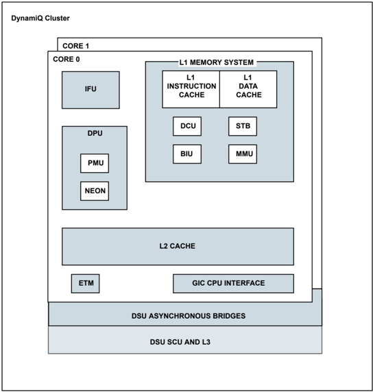

## 1   Arm Cortex-A55 Subsystem

The ADSP-SC844/SC846 processor includes a dual Arm® Cortex-A55® core. The Cortex-A55 core is a midrange, low-power core that implements the Armv8-A architecture with support for the Armv8.1-A extension, the Armv8.2-A extension and the reliability, availability, and serviceability (RAS) extension. Each core has a Level 1 (L1) memory system, and private Level 2 (L2) cache. The cores are implemented inside the DynamIQ Shared Unit (DSU) as a little core.

The dual Cortex-A55 sub-system in the ADSP-SC844/SC846 processor includes a data engine unit that implements the advanced SIMD and floating-point architecture support, cryptographic extension, generic interrupt controller, performance monitoring unit, and a generic timer. The Cortex-A55 also includes support for a L1-cache sub-system and a full-fledged memory management unit. The dual Cortex-A55 implements the Armv8 architecture and runs 64-bit Arm instructions in AArch64 execution state and 32-bit Arm and 32-bit Thumb instructions in AArch32 execution state.

This document describes the Arm Cortex-A55 core and memory architecture used on the ADSP-SC844/SC846 processor but does not provide detailed programming information for the Arm processor. For more information about programming the Arm processor, visit the Arm Information Center:

- ARM Documentation

The applicable documentation for programming the Arm Cortex-A55 processor include:

- Arm Cortex-A55 Core Technical Reference Manual, Revision: r2p0
- Arm Cortex-A Series Programmer's Guide for ARMv8-A, Version: 1.0
- ARM CoreLink NIC-400 Network Interconnect Technical Reference Manual
- Arm Architecture Reference Manual Armv8, for Armv8-A architecture profile
- Arm DynamIQ™ Shared Unit Technical Reference Manual, Revision: r4p1
- ARM NEON™ Programmer's Guide
- Arm Cortex®-A55 Core Advanced SIMD and Floating-point Support Technical Reference Manual
- Arm Generic Interrupt Controller Architecture Specification GIC architecture version 3.0 and 4.0

## Cortex-A55 Features

The Arm Cortex-A55 subsystem has the following features.

## Core Features

- Full implementation of the Arm8.2-A A64, A32, and T32 instruction sets
- Both the AArch32 and AArch64 execution states at all exception levels (EL0 to EL3)
- In-order pipeline with direct and indirect branch prediction
- Separate L1 data and instruction side memory systems with a memory management unit (MMU)
- Support for Arm TrustZone® technology
- Data engine unit that implements the advanced SIMD and floating-point architecture support
- Cryptographic extension: This architectural extension is only available if the data engine is present
- Generic interrupt controller (GIC) CPU interface to connect to an external distributor
- Generic timers interface that support a 64-bit count input from an external system counter

## Cache Features

- Unified private L2 cache
- L1 and L2 cache protection in the form of error correction code (ECC) or parity on all RAM instances
- Shared L3 cache

## Debug Features

- Reliability, availability, and serviceability (RAS) extension
- Arm8.2-A debug logic
- Performance monitoring unit (PMU)
- Embedded trace macrocell (ETM) that supports instruction trace only

## Functional Description

The following sections provide information on the function of the subsystem.

## Cortex-A55 Block Diagram

The A55 Dual Core Subsystem Block Diagram shows the primary blocks of the dual Cortex-A55 subsystem. The cluster consists of the cores and the DynamIQ Shared Unit (DSU), which connects the cores to an external memory system.

Figure 1-1: A55 Dual Core Subsystem Block Diagram

## Instruction Fetch Unit (IFU)

The IFU fetches instructions from the instruction cache or from external memory and predicts the outcome of branches in the instruction stream. It passes the instructions to the Data Processing Unit (DPU) for processing.

## Data Processing Unit (DPU)

The DPU decodes and executes instructions. It executes instructions that require data transfer to or from the memory system by interfacing to the Data Cache Unit (DCU). The DPU includes the PMU, the Advanced SIMD and floating-point support, and the Cryptographic Extension.

## Performance Monitor Unit (PMU)

The Cortex-A55 core includes performance monitors that can be configured to gather various statistics on the operation of the core and its memory system during runtime. These provide useful information about the behavior of the code that can be used for debug and code profiling. The PMU provides six counters. Each counter can count any of the events available in the core.

See the Performance Monitor Unit (PMU) section below for details of the PMU register set and events.

## Advanced SIMD and Floating-point support

Advanced SIMD is a media and signal processing architecture that adds instructions primarily for audio, video, 3D graphics, image, and speech processing. The floating-point architecture provides support for single-precision and double-precision floating-point operations.

The Cortex-A55 core supports the Advanced SIMD and scalar floating-point instructions in the A64 instruction set and the Advanced SIMD and floating-point instructions in the A32 and T32 instruction sets. The A64 instruction set offers additional Advanced SIMD instructions, including double-precision floating-point vector operations.

The Cortex-A55 floating-point implementation:

- Does not generate floating-point exceptions
- Implements all scalar operations in hardware with support for all combinations of:
- Rounding modes
- Flush-to-zero
- Default Not a Number (NaN) modes

The Advanced SIMD architecture, its associated implementation, and supporting software, are also referred to as NEON TM  technology.

See the Arm® Cortex®-A55 Core Advanced SIMD and Floating-point Support Technical Reference Manual for details of the instruction and register set.

## Cryptographic Extension

The Cortex-A55 core Cryptographic Extension supports the Armv8-A cryptographic extension. The cryptographic extension adds new A64, A32, and T32 instructions to advanced SIMD that accelerate:

- Advanced Encryption Standard (AES) encryption and decryption
- The Secure Hash Algorithm (SHA) functions SHA-1, SHA-224, and SHA-256
- Finite field arithmetic used in algorithms such as Galois/Counter mode and elliptic curve cryptography

See the Arm® Architecture Reference Manual Armv8 , for Armv8-A architecture profile for details of the instruction and register set.

## Memory Management Unit (MMU)

The MMU is responsible for translating addresses of code and data from the virtual view of memory to the physical addresses in the real system. The translation is carried out by the MMU hardware and is transparent to the application. In addition, the MMU controls such things as memory access permissions, memory ordering and cache policies for each region of memory.

The MMU enables tasks or applications to be written in a way that requires them to have no knowledge of the physical memory-map of the system, or about other programs that might be running simultaneously. This enables

you to use the same virtual memory address space for each program. It also lets you work with a contiguous virtual memory map, even if the physical memory is fragmented. This virtual address space is separate from the actual physical map of memory in the system. Applications are written, compiled, and linked to run in the virtual memory space. Virtual addresses are those used by you, and the compiler and linker, when placing code in memory. Physical addresses are those used by the actual hardware system.

The three main functions of the MMU are:

Page table entries support:

- Control the translation table walk hardware that accesses translation tables in main memory
- Translate virtual addresses (VAs) to physical addresses (PAs)
- Provide fine-grained memory system control through a set of virtual-to-physical address mappings and memory attributes that are held in translation tables

Each stage of address translation uses a set of address translations and associated memory properties that are held in memory-mapped tables called translation tables. Translation table entries can be cached into a T ranslation Lookaside Buffer (TLB). The following table describes the components included in the MMU.

Table 1-1: TLBs and TLB Caches in the MMU

| Component          | Description                         |
|--------------------|-------------------------------------|
| Instruction L1 TLB | 15 entries, fully associative       |
| Data L1 TLB        | 16 entries, fully associative       |
| L2 TLB             | 1024 entries, 4-way set associative |
| Walk cache RAM     | 64 entries, 4-way set associative   |
| IPA cache RAM      | 64 entries, 4-way set associative   |

The Cortex-A55 core supports a 40-bit physical address range, which allows 1TB of physical memory to be addressed.

The Cortex-A55 core implements a two-level TLB structure.

## L1 TLB

The first level of caching for the translation table information is an L1 TLB. It is implemented on both the instruction and data sides. The Cortex-A55 L1 instruction TLB supports 4 KB, 16 KB, 64 KB, and 2 MB pages. The Cortex-A55 L1 data TLB supports 4 KB pages only. Any other page sizes are fractured after the L2 TLB and the appropriate page size are sent to the L1 TLB. All TLB-related maintenance operations result in flushing both the instruction and data L1 TLBs.

## L2 TLB

A unified L2 TLB handles the misses from the L1 instruction and data TLBs using a 4-way, set-associative, 1024-entry cache. In implementations with core cache protection, parity bits protect the TLB RAMs by detecting any single-bit error. If an error is detected, the entry is invalidated and fetched again.

## IPA Cache RAM

The Intermediate Physical Address (IPA) cache RAM holds mappings between the IPAs and Physical Addresses (PAs). Only non-secure EL1 and EL0 stage 2 translations use the IPA cache. When a stage 2 translation completes, the cache is updated. The IPA cache is checked whenever a stage 2 translation is required. Like the L2 TLB, the IPA cache RAM can hold entries for different sizes.

## Walk Cache RAM

The walk cache RAM holds the result of a stage 1 translation up to, but not including the last level.

NOTE: Virtual memory translation tables are typically created by operating systems and are often dynamically managed by the memory management layer. However, even a bare metal system can enable the MMU. For this, a flat mapping technique is used, where all virtual memory addresses are programmed exactly as the physical memory addresses in the system.

## L1 Memory System

The dual Cortex-A55 processor L1 memory system consists of separate instruction and data caches that run at Arm core clock speed. The L1 instruction cache size is 32 KB and data cache size is 32 KB.

## L1 Instruction-side Memory System

The L1 instruction-side memory system provides an instruction stream to the DPU. Its key features are:

- 64-byte instruction side cache line length
- 4-way set associative L1 instruction cache
- 128-bit read interface to the L2 memory system

The Cortex-A55 core uses extensive branch prediction to improve Instructions Per Clock (IPC) and power efficiency.

## L1 Data-side Memory System

The L1 data-side memory system responds to load and store requests from the DPU. It also responds to SCU snoop requests from other cores, or external controllers. Its key features are:

- 64-byte data side cache line length
- 4-way set associative L1 data cache
- A read buffer that services both the Data Cache Unit (DCU), and the Instruction Fetch Unit (IFU)
- A 64-bit read path from the data L1 memory system to the data path
- A 128-bit write path from the data path to the L1 memory system
- Merging store buffer capability which writes to all types of memory (device, normal cacheable and normal non-cacheable)

- A data side prefetch engine that detects patterns of strides with multiple streams are allowed in parallel, capable of detecting both constant and patterns of strides

## L2 Memory System

The dual Cortex-A55 L2 memory system is required to interface the Cortex-A55 cores to the L3 memory system. The main features of the L2 memory system are:

- Strictly exclusive with L1 data cache
- Pseudo-inclusive with L1 instruction cache
- Private per-core unified L2 cache
- 40-bit physical address space
- Physically indexed, physically tagged

The L2 memory subsystem consists of:

- A 4-way, set-associative L2 cache with a size of 256 KB. Cache lines have a fixed length of 64 bytes.
- Optional ECC protection for tag, data, and L2 data buffer RAM structures

The shared L3 memory system consists of:

- Unified 16-way set-associative L3 cache of 512 KB
- Partial L3 cache power-down support
- Optional cache protection in the form of error correcting code (ECC) on L3 cache
- L3 memory system operating at Arm core clock

## Reliability, Availability, and Serviceability (RAS)

The Cortex-A55 core implements the RAS extension to the Armv8 -A architecture which provides mechanisms for the standardized reporting of errors generated by cache protection mechanisms. When configured with core cache protection, the Cortex-A55 core can detect and correct a 1-bit error in any RAM and detect 2-bit errors in some RAMs.

See the Arm Cortex-A55 Core Technical Reference Manual for more information on RAS.

## Generic Interrupt Controller (GIC)

The GIC-600 is an Arm architecture compliant System-on-Chip (SoC) peripheral. It is a high-performance, area-optimized interrupt controller. The GIC implements the Arm generic interrupt controller architecture. The GIC takes interrupts asserted at the system level and signals them to each connected processor as appropriate. The GIC has the following features.

- Registers for managing interrupt sources, interrupt behavior, and interrupt routing to one or more processors

- Support for the Arm architecture security extensions
- The ability to enable, disable, and generate processor interrupts from hardware (peripheral) interrupt sources
- The ability to generate software interrupts
- Support for interrupt masking and prioritization

Refer to the GIC Overview section for more information on the processor-specific configuration of the GIC.

The GIC-600 contains a performance monitoring unit (PMU) for counting key GIC events from the distributor.

Refer to the GIC Performance Monitoring Unit (GIC PMU) section for more information.

## A55 Core in DynamIQ Shared Unit (DSU)

The ADSP-SC844/SC846 processor implements a dual A55 cores (LITTLE core) with L1 and L2 cache inside the DynamIQ cluster, which has a shared-L3 cache and snoop control unit (SCU) with snoop filter. Both A55 cores are configured to run synchronously with the DSU.

See the Arm DynamIQ™ Shared Unit Technical Reference Manual for further details on DSU.

## System Control

The system registers control and provide status information for the functions that the core implements. The main functions of the system registers are:

- Overall system control and configuration
- MMU configuration and management
- Cache configuration and management
- System performance monitoring
- GIC configuration and management

The system registers are accessible in the AArch64 and AArch32 execution states.

## Generic Timer

The generic timer can schedule events and trigger interrupts that are based on an incrementing counter value. It generates timer events as active-low interrupt outputs and event streams. The timer contains:

- An EL1 non-secure physical timer
- An EL2 hypervisor physical timer
- An EL3 secure physical timer
- A virtual timer
- A hypervisor virtual timer

The Cortex-A55 core does not include the system counter. This resides in the SoC. The system counter value is distributed to the core with a 64-bit bus.

See the Arm DynamIQ Shared Unit Technical Reference Manual and the Arm Architecture Reference Manual Armv8 , for Armv8-A architecture profile for more information on the generic timer.

## Generic Timer Interrupts

Timers can be configured to generate an interrupt. The active-low, level sensitive timer interrupt signals are routed to the GIC as a private peripheral interrupt (PPI).

## A55 Configurations

The Core Configuration and DSU Configuration tables describe the Cortex A55 and processor configurations.

Table 1-2: Core Configuration

| Core Feature                                                                         | Comment      |
|--------------------------------------------------------------------------------------|--------------|
| L1 instruction cache size                                                            | 32 KB        |
| L1 data cache size                                                                   | 32 KB        |
| L2 cache                                                                             | Included     |
| L2 cache size                                                                        | 256 KB       |
| ECC or parity core cache protection                                                  | Included     |
| Advanced SIMD and floating-point support (including Dot Product instruction support) | Included     |
| Cryptographic Extension                                                              | Included     |
| CoreSight Embedded Logic Analyzer (ELA)                                              | False        |
| CoreSight ELA RAM address size                                                       | N/A          |
| Page Based Hardware Attributes (PBHA) support                                        | Not included |

Table 1-3: DSU Configuration

| Core Feature       | Comment   |
|--------------------|-----------|
| NUM_BIG_CORES      | 0         |
| NUM_LITTLE_CORES   | 2         |
| NUM_OTHER_CORES    | 0         |
| BIG_CORE_TYPE      | N/A       |
| LITTLE_CORE_TYPE   | Ananke    |
| OTHER_CORE_TYPE    | N/A       |
| MODULE             | N/A       |
| MODULE_DEBUG_BLOCK | N/A       |

Table 1-3: DSU Configuration (Continued)

| Core Feature         |   Comment |
|----------------------|-----------|
| ACE                  |      True |
| REQUESTER_DATA_WIDTH |       128 |
| ACP                  |     False |
| PERIPH_PORT          |      True |
| SCU_CACHE_PROTECTION |      True |
| L3_CACHE             |      True |

## DynamIQ Shared Unit Interfaces

This section describes the DSU interface signals.

## Clock and Clock Enable Signals

The Clock Signals and Clock Enable Signals tables describe the clock and clock enable signals.

Table 1-4: Clock Signals

| Signal Name   | Description                                                                                              | Connection   |
|---------------|----------------------------------------------------------------------------------------------------------|--------------|
| SCLK          | Clock for the SCU/L3 and the AMBA interface                                                              | CLKO1        |
| PCLK          | Clock for the debug peripheral interface and the timers, power management, and other miscellaneous logic | SYSCLK       |
| ATCLK         | Clock for the ATB trace interface                                                                        | SYSCLK       |
| GICCLK        | Clock for the GIC interface                                                                              | SYSCLK       |

The Default Configuration table describe the default configuration of the dual Cortex-A55.

Table 1-5: Default Configuration

| Configuration                                                                                             | Status        |
|-----------------------------------------------------------------------------------------------------------|---------------|
| Default Execution Mode in EL3                                                                             | AArch64       |
| Endianness configuration, controls the reset value of the SCTLR_EL3/SCTLR EE bit                          | Little Endian |
| Enable Thumb exceptions, controls the reset value of the SCTLR.TE bit                                     | Enabled       |
| Value read in ClusterID Affinity Level-2 field, MPIDR bits [23:16]                                        | 8'h0          |
| Value read in ClusterID Affinity Level-3 field, MPIDR bits [39:32]                                        | 8'h0          |
| Disables the Cryptographic Extensions                                                                     | False         |
| Globally disables the CPU interface logic and routes the external interrupt signals directly to the cores | False         |

## GIC Signals

This section describes the GIC default configuration.

Table 1-6: GIC Default Configuration (Interrupts)

| Signal Name   | Description                                                | Connection   |
|---------------|------------------------------------------------------------|--------------|
| FIQ           | Active-low, level-sensitive fast interrupt request         | Disabled     |
| IRQ           | Active-low, level-sensitive interrupt request              | Disabled     |
| VFIQ          | Active-low, level-sensitive virtual fast interrupt request | Disabled     |
| VIRQ          | Active-low, level-sensitive virtual interrupt request      | Disabled     |
| IRIT I/F      | Distributor to GIC CPU Interface messages                  | From GIC     |
| ICC I/F       | GIC CPU Interface to distributor messages                  | To GIC       |

## WFE Wakeup Event Signals

This section describes the wakeup event signals

Table 1-7: WFE Wakeup Event Signals

| Signal Name   | Description                                                                                                                                                            | TRU Reques- ter/Completer ID   |
|---------------|------------------------------------------------------------------------------------------------------------------------------------------------------------------------|--------------------------------|
| EVENTIREQ     | Event input request for core wake-up from WFE state. It must remain asserted until EVENTIACK is asserted and must not be re-asserted until EVENTIACK is low.           | TRU Completer 116              |
| EVENTIACK     | Event input request acknowledge. It is not asserted until EVENTIREQ is high, and then remains asserted until after EVENTIREQ goes low.                                 | TRU Requester 69               |
| EVENTOREQ     | Event output request for core wake-up, triggered by SEV instruction. It is only asserted when EVENTOACK is low, and then remains high until after EVENTOACK goes high. | TRU Requester 70               |
| EVENTOACK     | Event output request acknowledge. It must not be asserted until EVENTOREQ is high, and then must remain asserted until after EVENTOREQ goes low.                       | TRU Completer 117              |

## Error Signals

This section describes the error signals

Table 1-8: Error Signals

| Signal Name                           | Description                                                                                                                                                                                                                                       |
|---------------------------------------|---------------------------------------------------------------------------------------------------------------------------------------------------------------------------------------------------------------------------------------------------|
| ERRIRQ[0] A55_SCU_ERR (A55 SCU Error) | Active-low, level-sensitive error indicator for an ECC error that causes potential data corruption or loss of coherency in L3 and snoop filter RAMs or ACE write transactions with a write response condition. It is output from the SCLK domain. |

Table 1-8: Error Signals (Continued)

| Signal Name                                | Description                                                                                                                                                                                                             |
|--------------------------------------------|-------------------------------------------------------------------------------------------------------------------------------------------------------------------------------------------------------------------------|
| ERRIRQ[2:1] A55_L1L2_ERR (A55 L1,L2 Error) | Active-low, level-sensitive error indicator for an ECC error that causes potential data corruption or loss of coherency for the L1 and L2 caches in the respective core. The bits are output from the PERIPHCLK domain. |

NOTE: The bit[1] is for core 0 and bit[2] for core 1

## Debug Block APB Interface Signals (Debug)

The interface between the debug block and the DSU consists of a pair of APB interfaces, one in each direction. The following table shows the signals between the cluster APB controller and the debug block APB target.

Table 1-9: Debug Block APB Interface Signals (Debug)

| Signal Name   | Description                                                                     |
|---------------|---------------------------------------------------------------------------------|
| COMMIRQ       | Active-low, level-sensitive comms channel receive or transmit interrupt request |
| DBGEN         | Invasive debug enable                                                           |
| NIDEN         | Non-invasive debug enable                                                       |
| SPIDEN        | Secure privilege invasive debug enable                                          |
| SPNIDEN       | Secure privilege non-invasive debug enable                                      |

## Performance Monitor Unit (PMU)

The Cortex-A55 core includes performance monitors that can be configured to gather various statistics on the operation of the core and its memory system during runtime. These provide useful information about the behavior of the code that can used for debug and code profiling. The PMU provides six counters. Each counter can count any of the events available in the core.

For complete register information refer to the Arm Cortex-A55 Core Technical Reference Manual and the Arm Cortex-A Series Programmer's Guide for ARMv8-A .

## Functional Description

This section describes the functionality of the PMU. The PMU includes the following interfaces and counters:

- Events from all other units from across the design are provided to the PMU
- The PMU registers can be programmed using the system registers or the external peripheral interface
- The PMU has 32-bit counters that increment when they are enabled, based on events, and a 64-bit cycle counter
- The Cortex-A55 core supports access to the performance monitor registers from the internal system register interface and a memory-mapped interface

## PMU Events

The PMU event counters can gather various statistics on the operation of the core and its memory system, like cycle count, cache miss/hit, memory read/write, load and prefetch instructions. For the all the PMU events, please refer to Arm Cortex-A55 Core Technical Reference Manual .

## PMU Interrupts

The Cortex-A55 core asserts the nPMUIRQ signal when the PMU generates an interrupt. The active-low, level sensitive PMU interrupt signal is routed to the GIC as a private peripheral interrupt.

|   Interrupt ID | Name    | Description           | Sensitivity   |
|----------------|---------|-----------------------|---------------|
|             16 | PMU_IRQ | PMU interrupt request | Level         |