## 9   L2 System Memory

L2 system memories have significant bandwidth for core accesses, but it is important to note that L2 responds slower to core accesses than L1 memories. L2 SRAM is the ideal storage for multiple processor cores to share data and instruction resources, such as semaphores, shared buffers, and code libraries. Due to sophisticated data integrity protection and write protection, L2 SRAM is also ideal for data and instructions critical for safe operation of the application.

## L2 System Memory Features

The L2 system memory features include:

- Operation at SYSCLK frequency
- ECC protection of SRAM area
- ECC memory refresh

There are three instance of L2 system memory: L2CTL0, L2CTL1 and LCTL2.

- L2CTL0 contains 2M byte of RAM grouped into eight banks, 256K bytes each and 192K bytes of boot ROM.
- L2CTL1 contains 2M byte of RAM grouped into eight banks, 256K bytes each.
- SHARC core data ports can access L2 memory through direct path.

## L2 System Memory Functional Description

The L2 system memory manages all of the L2 SRAM and ROM memory banks. The system memory interface arbitrates competing accesses, write protection, and ensures SRAM data integrity. The L2 system memory domain is a unified instruction and data memory. It can hold any mixture of code and data required by the system design.

The following sections provide a functional description of the L2 system memory.

## ADSP-2184x L2CTL Register List

The L2 memory controller (L2CTL) includes the controls to manage each L2 memory bank independently. A set of registers governs L2CTL operations. For more information on L2CTL functionality, see the L2CTL register descriptions.

Table 9-1: ADSP-2184x L2CTL Register List

| Name           | Description                    |
|----------------|--------------------------------|
| L2CTL_CTL      | Control Register               |
| L2CTL_EADDR0   | Error Type 0 Address Register  |
| L2CTL_EADDR1   | Error Type 1 Address Register  |
| L2CTL_EADDR2   | Error Type 2 Address Register  |
| L2CTL_EADDR3   | Error Type 3 Address Register  |
| L2CTL_EADDR4   | Error Type 4 Address Register  |
| L2CTL_ERRADDR0 | ECC Error Address 0 Register   |
| L2CTL_ERRADDR1 | ECC Error Address 1 Register   |
| L2CTL_ERRADDR2 | ECC Error Address 2 Register   |
| L2CTL_ERRADDR3 | ECC Error Address 3 Register   |
| L2CTL_ERRADDR4 | ECC Error Address 4 Register   |
| L2CTL_ERRADDR5 | ECC Error Address 5 Register   |
| L2CTL_ERRADDR6 | ECC Error Address 6 Register   |
| L2CTL_ERRADDR7 | ECC Error Address 7 Register   |
| L2CTL_ERRADDR8 | ECC Error Address 8 Register   |
| L2CTL_ET0      | Error Type 0 Register          |
| L2CTL_ET1      | Error Type 1 Register          |
| L2CTL_ET2      | Error Type 2 Register          |
| L2CTL_ET3      | Error Type 3 Register          |
| L2CTL_ET4      | Error Type 4 Register          |
| L2CTL_INIT     | Initialization Register        |
| L2CTL_ISTAT    | Initialization Status Register |
| L2CTL_PCTL     | Power Control Register         |
| L2CTL_REVID    | Revision ID Register           |
| L2CTL_RPCR0    | Read Priority Count Register   |
| L2CTL_RPCR1    | Read Priority Count Register   |
| L2CTL_SADR     | Scrub Start Address Register   |

Table 9-1: ADSP-2184x L2CTL Register List (Continued)

| Name         | Description                   |
|--------------|-------------------------------|
| L2CTL_SCNT   | Scrub Count Register          |
| L2CTL_SCTL   | Scrub Control Register        |
| L2CTL_STAT   | Status Register               |
| L2CTL_STAT_1 | L2 Port Error Status Register |
| L2CTL_WPCR0  | Write Priority Count Register |
| L2CTL_WPCR1  | Write Priority Count Register |

## ADSP-2184x L2CTL Interrupt List

Table 9-2: ADSP-2184x L2CTL Interrupt List

|   Interrupt ID | Name           | Description                      | Sensitivity   | DMA Channel   |
|----------------|----------------|----------------------------------|---------------|---------------|
|            143 | L2CTL0_ECC_ERR | L2CTL0 ECC Error                 | Level         |               |
|            145 | L2CTL0_EVT     | L2CTL0 Scrub/Initialization Done | Level         |               |
|            146 | L2CTL1_ECC_ERR | L2CTL1 ECC Error                 | Level         |               |
|            148 | L2CTL1_EVT     | L2CTL1 Scrub/Initialization Done | Level         |               |

## ADSP-2184x L2CTL Trigger List

Table 9-3: ADSP-2184x L2CTL Trigger List Generators

|   Trigger ID | Name       | Description            | Sensitivity   |
|--------------|------------|------------------------|---------------|
|           64 | L2CTL0_EVT | L2CTL0 L2 Memory Event | Level         |
|           65 | L2CTL1_EVT | L2CTL1 L2 Memory Event | Level         |

Table 9-4: ADSP-2184x L2CTL Trigger List Receivers

| Trigger ID   | Name   | Description   | Sensitivity   |
|--------------|--------|---------------|---------------|
| None         | None   | None          | None          |

## L2 System Memory Block Diagram

The ADSP-2184x/ADSP-SC84x Complete L2 System Memory Block Diagram shows the complete L2 system memory, including the memory block instances L2CTL0, L2CTL1 and L2CTL2. The L2CTL0 block contains boot ROM code for Arm and eight banks of L2 RAM containing 256 Kbytes each. The Arm reset ISR (location 0x00000000) is mapped to this block.

Figure 9-1: ADSP-2184x Complete L2 System Block Diagram

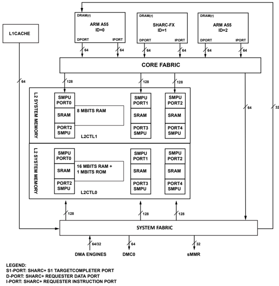

## L2 System Memory Architectural Concepts

The following sections describe the architecture features of the L2 system memory.

## Access Characteristics

The L2 system memory interface converts all 8-bit, 16-bit, 32-bit, and 64-bit accesses to 128-bit accesses. Additionally, it converts 8-bit, 16-bit, 32-bit, and 64-bit bursts to an equivalent internal 128-bit access. For example, the L2 system memory interface converts a 128-bit address-aligned burst of 8-bit accesses of burst length 16 to a single 128-bit access.

## Read/Write Latency and Throughput

The L2 memory design is optimized for burst accesses at the crossbar interface. The L2 system memory buffers and converts write data of 8/16/32/64-bit to an equivalent 128-bit access. This conversion creates modulo-32-bit writes if the starting addresses are 32-bit aligned. A single 8-bit or 16-bit access, or a non-32-bit address-aligned 8-bit or 16-bit burst access to an ECC-enabled bank creates an extra latency of two SYSCLK cycles. No extra latency is seen if the ECC is disabled.

NOTE: Continuous 8/16-bit core access to an ECC-enabled L2 bank is not recommended from a throughput perspective.

## L2 Memory Controller Block Diagram (Instance)

As shown in the L2 System Memory Block Diagram , the L2 controller has five ports that interface to system crossbars. Port 0, port 1, and port 2 are 128-bit interfaces dedicated to core and MDMA3 traffic. Port 3 and port 4 are 128-bit interfaces that connect through DMA. For L2 SRAM, all ports (0/1/2/3/4) have a read channel and a write channel; for L2 ROM, all ports (0/1/2/3/4) have read channels only. The SRAM is organized in multiple banks; each bank has 256K Bytes. The 192KB ROM is divided into three banks of 64KB.

Within each bank, data is organized into words, with each word comprising 128 bits of data and 28 bits of ECC checksum. ROM memory is not protected by the ECC scheme. When the L2 controller accesses RAM and ROM cells, it always reads and writes whole 128-bit words. Despite this, the L2 controller supports 8-, 16-, 32-, and 64-bit reads and writes from cores and system by applying respective data masks.

Figure 9-2: L2 System Memory Block Diagram

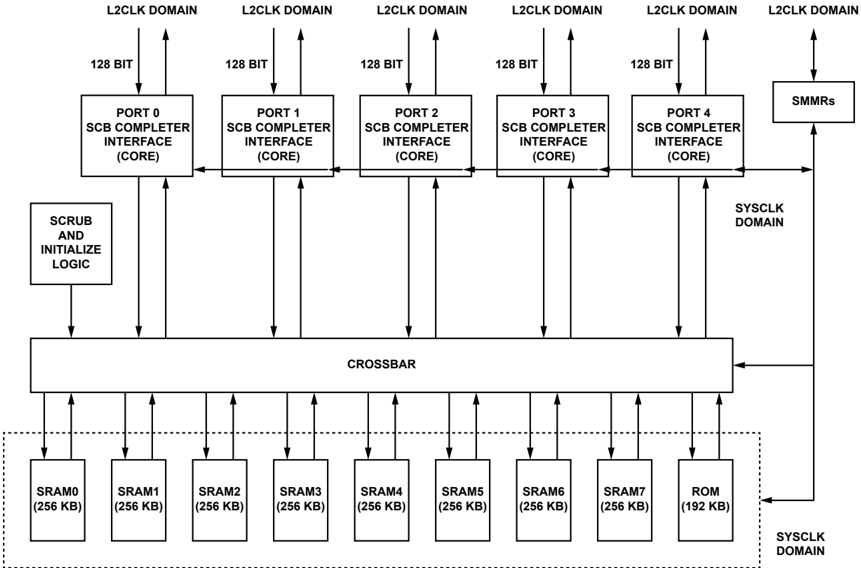

## Arbitration and Priority

Each bank of L2 RAM or ROM has an arbiter which receives requests from the five crossbar ports.

Each arbiter follows a fixed priority scheme for giving grants when more than one channel requests the same bank. The arbiter also supports priority elevation through urgent priority requests.

NOTE: Attempting a write access to both L2 ROM spaces returns an error.

The Fixed Priority table shows the priority for fixed priority mode (with urgent priority disabled) for each SCB channel.

If two cores (or the 64-bit Max BW DMA) simultaneously try to access L2 for the same instance (both read or both write), even to different banks, software allows only one controller access at a time. One access port can support one read and write at the same time. However, if one core issues a write and the other issues a read, then access can proceed simultaneously. There is no extra latency inside L2, when the accesses are to different banks (assuming pending DMA traffic is also to a non-conflicting bank).

When a core and DMA both access the same bank via the same port (both read or both writes), the best access rate that DMA can achieve is one 128-bit access in every three SYSCLK cycles during the conflict period. This access rate is achieved by programming the read priority count register ( L2CTL\_RPCR0.RPC0 ) bit and the write priority count register ( L2CTL\_WPCR0.WPC0 ) to 0, while programming the L2CTL\_RPCR0.RPC1 and the L2CTL\_WPCR0.WPC1 bits to 1.

The arbiters also support priority elevation for a particular channel that has been starved of grants for many SYSCLK cycles. If a channel does not get a grant for N cycles after its request, then that channel can elevate the priority of its request by issuing an urgent priority request. This request causes that channel to become the highest priority controller for the next grant cycle (pipelined arbitration for urgent priority). The number of cycles N , after which the priority is elevated, can be programmed for each channel separately using the ( L2CTL\_RPCR0 ) and ( L2CTL\_WPCR0 ) registers.

Programming the bits in the ( L2CTL\_RPCR0 ) and ( L2CTL\_WPCR0 ) registers appropriately achieves the best grant rate for DMA. This grant rate of one in three SYSCLK cycles during the conflict period is achievable under the following conflict conditions:

- An access conflict between the core and DMA to the same memory bank in the fixed priority arbitration scheme with core activity always prioritized over DMA activity
- An access conflict within the pipelined implementation of urgent priority

To disable urgent priority requests, set the L2CTL\_CTL.DISURP bit. This bit disables the urgent priority requests for all port channels. Each channel can also be prevented from raising the urgent priority request through the priority count register for the specific channel. However, there is no support for disabling urgent priority for a specific memory bank arbiter.

The Fixed Priority With Priority Elevation table provides the various priority levels for the L2 system memory.

Table 9-5: Fixed Priority With Priority Elevation

| Channel                             | Priority Level   |
|-------------------------------------|------------------|
| L2 Scrub/Initialization Request     | 21 (highest)     |
| Port 0 Read Channel Urgent Request  | 20               |
| Port 0 Write Channel Urgent Request | 19               |
| Port 1 Read Channel Urgent Request  | 18               |
| Port 1 Write Channel Urgent Request | 17               |
| Port 2 Read Channel Urgent Request  | 16               |

Table 9-5: Fixed Priority With Priority Elevation (Continued)

| Channel                             | Priority Level   |
|-------------------------------------|------------------|
| Port 2 Write Channel Urgent Request | 15               |
| Port 3 Read Channel Urgent Request  | 14               |
| Port 3 Write Channel Urgent Request | 13               |
| Port 4 Read Channel Urgent Request  | 12               |
| Port 4 Write Channel Urgent Request | 11               |
| Port 0 Read Channel Normal Request  | 10               |
| Port 0 Write Channel Normal Request | 9                |
| Port 1 Read Channel Normal Request  | 8                |
| Port 1 Write Channel Normal Request | 7                |
| Port 2 Read Channel Normal Request  | 6                |
| Port 2 Write Channel Normal Request | 5                |
| Port 3 Read Channel Normal Request  | 4                |
| Port 3 Write Channel Normal Request | 3                |
| Port 4 Read Channel Normal Request  | 2                |
| Port 4 Write Channel Normal Request | 1 (lowest)       |

## Data Integrity

The following sections provide information on how the L2 system memory ensures data integrity.

## ECC Algorithm

Hsaio encoding calculates the ECC syndrome. A 7-bit syndrome is generated during write operation and stored as a 7-bit parity field along with the 32 data bits. Each data bit contributes to three parity bits according. Each parity bit represents the XOR value of 13 or 14 data bits according to the following mapping:

Figure 9-3: Hsaio Parity Bit Mapping

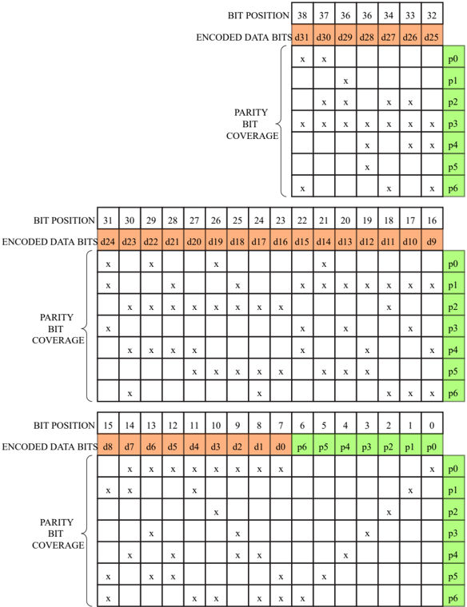

During read operation, the parity bits become part of the syndrome equation. The new syndrome bits are now the XOR values of the 13 or 14 data bits plus the respective stored parity bit. If any of the seven syndrome bits is set, an error situation is detected. An OR gate cross of the 7 bits reports the error, without specifying the type of the error.

If a single parity bit failed, the new 7-bit syndrome has 1 bit that is set. If a single data bit failed, the new syndrome has 3 bits that are set, because all three related parity bits fail. So, an XOR gate cross of all seven syndrome bits detects a single-bit error, indicating that an odd number of syndrome bits is set.

Figure 9-4: Hsiao Error Reports

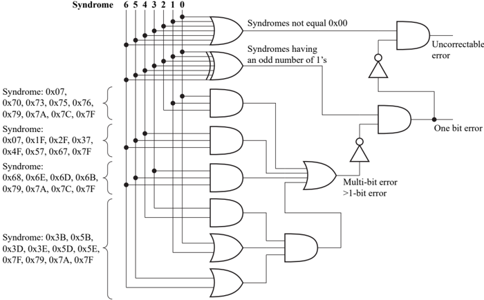

The XOR gate detects single-bit errors and does not flag any dual-bit error. But the gate does flag 50% of the other multi-bit errors undesirably. Extra logic is implemented to increase the detection rate of multi-bit errors to 68.7% as shown in the figure.

If a single-bit error is detected, the failing bit can be localized and corrected. If all three syndrome bits corresponding to a specific data bit are 1, a data error is assumed. The respective data bit is toggled on its way to the system bus.

## ECC Hardware Control

After reset, ECC protection is enabled. The boot code initializes all L2 SRAM data and checksum cells. ECC protection adds some cycle penalty when 8-bit and 16-bit values write L2 memory. Disable ECC protection for individual SRAM banks by setting the L2CTL\_CTL.BK0EDIS through L2CTL\_CTL.BK7EDIS disable bits. Due to caching mechanisms of the processor cores and data bursting of the DMA channels, 8-bit and 16-bit write accesses are uncommon. Typically, only two-dimensional DMA operations or un-cached 8-bit and 16-bit store instruction can trigger these writes.

## ECC Error Management

The L2 system memory flags 2-bit and multi-bit errors to the system by:

- Raising the ECC\_ERR interrupt
- Reporting a read error to the system bus
- Setting the sticky L2CTL\_STAT.ECCERR7 -L2CTL\_STAT.ECCERR0 status flag
- Latching the address of the failing operation into the respective L2CTL\_ERRADDR7 -L2CTL\_ERRADDR0 register.

There is one error status bit and one error address register per L2 SRAM bank.

Typically, ECC\_ERR events are declared as system faults in the system event controller (SEC). Whether these faults are reported, the interrupt service routine can consult the L2CTL\_STAT register and the L2CTL\_ERRADDR0 through L2CTL\_ERRADDR7 registers to determine whether:

- The data at the failing L2 address was critical enough to require an immediate reboot of the system
- The data at the failing L2 address was less critical or can be restored

The L2CTL\_STAT.ECCERR0 through L2CTL\_STAT.ECCERR7 flags are cleared with a W1C operation.

## Memory Refresh

If data in L2 SRAM contains single-bit errors, the data is corrected on its way to the system buses. The corrected value is not written back to the SRAM location. To prevent any risk of accumulation of single-bit errors over time and to minimize likelihood of multi-bit errors, the L2 system memory provides a special memory refresh mechanism.

If there are dual-bit or multi-bit errors, the ECC\_ERR interrupt is raised, and data is not written back to memory.

- The L2CTL\_SADR register with the start address of the scrub
- The L2CTL\_SCNT register with the total number of 128-bit addresses to be scrubbed starting from the L2CTL\_SADR address

Program the number of cycles between each scrub using the L2CTL\_SCTL register. During the scrub, the L2 system memory issues a read, followed by a write-back operation if there is a single-bit ECC error. Once the L2 system memory completes scrubbing the programmed memory region, it generates an interrupt and starts again from the L2CTL\_SADR address unless the L2CTL\_SCTL.SEN bit is disabled. If the L2CTL\_SCTL.SEN bit is cleared before completing the programmed address range, the scrub stops after completing any already issued scrub access. The scrub read/writes always start from the full 128-bit equivalent of the address written into the L2CTL\_SADR register. A 128-bit value is always read, and the 128-bit value is written back. The scrub access has the highest priority. Programs can configure 8-bit, 16-bit, or 32-bit addresses in the L2CTL\_SADR register. The lower 4 bits of this register are treated as do-not-care values because the internal memory array is always accessed when using 128 bits.

Memory refresh operation is meaningless when the L2CTL\_CTL.BK0EDIS through L2CTL\_CTL.BK7EDIS disable bits are set.

## Power Modes

Each L2 memory bank supports low-power modes.

If the bank is not in use, put each L2 system memory bank into the following low-power modes to save power.

## Deep Sleep Mode

Set the L2CTL\_PCTL.BK7DS through L2CTL\_PCTL.BK0DS control bits to enter this mode. This mode preserves the memory contents.

## Shut Down Mode

Set the L2CTL\_PCTL.BK7SD through L2CTL\_PCTL.BK0SD control bits to enter this mode. The memory banks do not retain the data (existing data is lost).

NOTE: It may take up to 11 SYSCLK cycles to deactivate the power mode after writing to the L2CTL\_PCTL register. Therefore, L2 access must be issued after this delay.

Access to a memory bank in shut down or deep sleep mode may result in an unpredictable behavior. Ensure that initialization/refresh and memory access to such banks are not issued.

There is no deep sleep or shut down mode for ROM memories.

## L2 System Memory Event Control

The following sections describe event control features of the L2 system memory, such as error response.

## ECC Error Interrupt

A bus error is signaled under any of the following conditions.

- A write access to ROM address space
- A read/write access to reserved address space
- An ECC multi-bit error in an ECC-enabled bank. A non-modulo, 32-bit write to an ECC-enabled bank can also potentially create a bus error response due to an ECC multi-bit error. This response is because the L2 system memory implements a 32-bit ECC, and therefore a non-modulo, 32-bit write results in a read. This read can create multi-bit errors even if the memory was initialized.

Bus error notifications are stored in the L2CTL\_STAT register, and the addresses that generated the error on a given port are stored in the L2CTL\_EADDR0 / L2CTL\_EADDR1 register of that port. The details of the error are stored in the L2CTL\_ET0 / L2CTL\_ET1 register of the port.

## ADSP-2184x L2CTL Register Descriptions

L2 Memory Controller (L2CTL) contains the following registers.

Table 9-6: ADSP-2184x L2CTL Register List

| Name         | Description                   |
|--------------|-------------------------------|
| L2CTL_CTL    | Control Register              |
| L2CTL_EADDR0 | Error Type 0 Address Register |
| L2CTL_EADDR1 | Error Type 1 Address Register |
| L2CTL_EADDR2 | Error Type 2 Address Register |
| L2CTL_EADDR3 | Error Type 3 Address Register |

Table 9-6: ADSP-2184x L2CTL Register List (Continued)

| Name           | Description                    |
|----------------|--------------------------------|
| L2CTL_EADDR4   | Error Type 4 Address Register  |
| L2CTL_ERRADDR0 | ECC Error Address 0 Register   |
| L2CTL_ERRADDR1 | ECC Error Address 1 Register   |
| L2CTL_ERRADDR2 | ECC Error Address 2 Register   |
| L2CTL_ERRADDR3 | ECC Error Address 3 Register   |
| L2CTL_ERRADDR4 | ECC Error Address 4 Register   |
| L2CTL_ERRADDR5 | ECC Error Address 5 Register   |
| L2CTL_ERRADDR6 | ECC Error Address 6 Register   |
| L2CTL_ERRADDR7 | ECC Error Address 7 Register   |
| L2CTL_ERRADDR8 | ECC Error Address 8 Register   |
| L2CTL_ET0      | Error Type 0 Register          |
| L2CTL_ET1      | Error Type 1 Register          |
| L2CTL_ET2      | Error Type 2 Register          |
| L2CTL_ET3      | Error Type 3 Register          |
| L2CTL_ET4      | Error Type 4 Register          |
| L2CTL_INIT     | Initialization Register        |
| L2CTL_ISTAT    | Initialization Status Register |
| L2CTL_PCTL     | Power Control Register         |
| L2CTL_REVID    | Revision ID Register           |
| L2CTL_RPCR0    | Read Priority Count Register   |
| L2CTL_RPCR1    | Read Priority Count Register   |
| L2CTL_SADR     | Scrub Start Address Register   |
| L2CTL_SCNT     | Scrub Count Register           |
| L2CTL_SCTL     | Scrub Control Register         |
| L2CTL_STAT     | Status Register                |
| L2CTL_STAT_1   | L2 Port Error Status Register  |
| L2CTL_WPCR0    | Write Priority Count Register  |
| L2CTL_WPCR1    | Write Priority Count Register  |

## Control Register

The L2CTL\_CTL register includes a write protection bit, enables L2 banks, and selects mapping of banks (as ECC RAM or data RAM).

Figure 9-5: L2CTL\_CTL Register Diagram

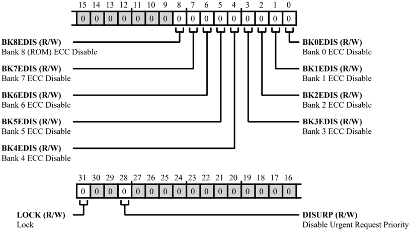

Table 9-7: L2CTL\_CTL Register Fields

| Bit No. (Access)   | Bit Name   | Description/Enumeration                                                                                                                                     |
|--------------------|------------|-------------------------------------------------------------------------------------------------------------------------------------------------------------|
| 31 (R/W)           | LOCK       | Lock. If the global lock bit is set ( SPU_CTL.GLCK bit =1) and the L2CTL_CTL.LOCK bit is set, the L2CTL_CTL register is read only (locked). 0 Unlock 1 Lock |
| 28 (R/W)           | DISURP     | Disable Urgent Request Priority. The L2CTL_CTL.DISURP disables urgent request priority mode for all L2 banks. 0 Enable URP 1 Disable URP                    |

Table 9-7: L2CTL\_CTL Register Fields (Continued)

| Bit No. (Access)   | Bit Name   | Description/Enumeration                                                                                                                                                    |
|--------------------|------------|----------------------------------------------------------------------------------------------------------------------------------------------------------------------------|
| 8 (R/W)            | BK8EDIS    | Bank 8 (ROM) ECC Disable. The L2CTL_CTL.BK8EDIS bit disables L2 bank 8 (ROM) ECC operation. ECC operation should be enabled or disable before the start of L2 bank access. |
| 8 (R/W)            | BK8EDIS    | 0 Enable ECC                                                                                                                                                               |
| 8 (R/W)            | BK8EDIS    | 1 Disable ECC                                                                                                                                                              |
| 7 (R/W)            | BK7EDIS    | Bank 7 ECC Disable. The L2CTL_CTL.BK7EDIS bit disables L2 bank 7 ECC operation. ECC operation should be enabled or disable before the start of L2 bank access.             |
| 7 (R/W)            | BK7EDIS    | 0 Enable ECC                                                                                                                                                               |
| 7 (R/W)            | BK7EDIS    | 1 Disable ECC                                                                                                                                                              |
| 6 (R/W)            | BK6EDIS    | Bank 6 ECC Disable. The L2CTL_CTL.BK6EDIS bit disables L2 bank 6 ECC operation. ECC operation should be enabled or disable before the start of L2 bank access.             |
| 6 (R/W)            | BK6EDIS    | 0 Enable ECC                                                                                                                                                               |
| 5 (R/W)            | BK5EDIS    | Bank 5 ECC Disable. The L2CTL_CTL.BK5EDIS bit disables L2 bank 5 ECC operation. ECC operation should be enabled or disable before the start of L2 bank access.             |
| 5 (R/W)            | BK5EDIS    | 0 Enable ECC                                                                                                                                                               |
| 5 (R/W)            | BK5EDIS    | 1 Disable ECC                                                                                                                                                              |
| 4 (R/W)            | BK4EDIS    | Bank 4 ECC Disable. The L2CTL_CTL.BK4EDIS bit disables L2 bank 4 ECC operation. ECC operation should be enabled or disable before the start of L2 bank access.             |
| 4 (R/W)            | BK4EDIS    | 0 Enable ECC                                                                                                                                                               |
| 4 (R/W)            | BK4EDIS    | 1 Disable ECC                                                                                                                                                              |
| 3 (R/W)            | BK3EDIS    | Bank 3 ECC Disable. The L2CTL_CTL.BK3EDIS bit disables L2 bank 3 ECC operation. ECC operation should be enabled or disable before the start of L2 bank access.             |
| 3 (R/W)            | BK3EDIS    | 0 Enable ECC                                                                                                                                                               |
| 3 (R/W)            | BK3EDIS    | 1 Disable ECC                                                                                                                                                              |

Table 9-7: L2CTL\_CTL Register Fields (Continued)

| Bit No. (Access)   | Bit Name   | Description/Enumeration                                                                                                                                                     |
|--------------------|------------|-----------------------------------------------------------------------------------------------------------------------------------------------------------------------------|
| 2 (R/W)            | BK2EDIS    | Bank 2 ECC Disable. The L2CTL_CTL.BK2EDIS bit disables L2 bank 2 ECC operation. ECC operation should be enabled or disable before the start of L2 bank access.              |
| 1 (R/W)            | BK1EDIS    | Bank 1 ECC Disable. The L2CTL_CTL.BK1EDIS bit disables L2 bank 1 ECC operation. ECC operation should be enabled or disable before the start of L2 bank access.              |
| 0 (R/W)            | BK0EDIS    | Bank 0 ECC Disable. The L2CTL_CTL.BK0EDIS bit disables L2 bank 0 ECC operation. ECC operation should be enabled or disable before the start of L2 bank access. 0 Enable ECC |
| 0 (R/W)            |            |                                                                                                                                                                             |

## Error Type 0 Address Register

The L2CTL\_EADDR0 register holds the address that created an access error on the L2 port 0 bus interface. This register is be updated only if the corresponding error status bit ( L2CTL\_STAT.ERR0 ) is cleared. After the status bit is set for an error, further errors do not update the L2CTL\_EADDR0 register until a W1C clears the corresponding status bit. If read and write access errors occur simultaneously, the register captures the write access error address.

Figure 9-6: L2CTL\_EADDR0 Register Diagram

Table 9-8: L2CTL\_EADDR0 Register Fields

| Bit No. (Access)   | Bit Name   | Description/Enumeration                                             |
|--------------------|------------|---------------------------------------------------------------------|
| 31:0               | VALUE      | ERRADDR Value.                                                      |
| (R/NW)             |            | The L2CTL_EADDR0.VALUE bits hold the address causing the bus error. |

## Error Type 1 Address Register

The L2CTL\_EADDR1 register holds the address that created an access error on the L2 port 1 bus interface. This register is be updated only if the corresponding error status bit ( L2CTL\_STAT.ERR1 ) is cleared. After the status bit is set for an error, further errors do not update the L2CTL\_EADDR1 register until a W1C clears the corresponding status bit. If read and write access errors occur simultaneously, the register captures the write access error address.

Figure 9-7: L2CTL\_EADDR1 Register Diagram

Table 9-9: L2CTL\_EADDR1 Register Fields

| Bit No. (Access)   | Bit Name   | Description/Enumeration                                             |
|--------------------|------------|---------------------------------------------------------------------|
| 31:0               | VALUE      | ERRADDR Value.                                                      |
| (R/NW)             |            | The L2CTL_EADDR1.VALUE bits hold the address causing the bus error. |

## Error Type 2 Address Register

The L2CTL\_EADDR2 register holds the address that created an access error on the L2 port 2 bus interface (cores). This register is be updated only if the corresponding error status bit ( L2CTL\_STAT\_1.ERR2 ) is cleared. After the status bit is set for an error, further errors do not update the L2CTL\_EADDR2 register until a W1C clears the corresponding status bit. If read and write access errors occur simultaneously, the register captures the write access error address.

Figure 9-8: L2CTL\_EADDR2 Register Diagram

Table 9-10: L2CTL\_EADDR2 Register Fields

| Bit No. (Access)   | Bit Name   | Description/Enumeration                                             |
|--------------------|------------|---------------------------------------------------------------------|
| 31:0               | VALUE      | ERRADDR Value.                                                      |
| (R/NW)             |            | The L2CTL_EADDR2.VALUE bits hold the address causing the bus error. |

## Error Type 3 Address Register

The L2CTL\_EADDR3 register holds the address that created an access error on the L2 port 3 bus interface (DMA). This register is be updated only if the corresponding error status bit ( L2CTL\_STAT\_1.ERR3 ) is cleared. After the status bit is set for an error, further errors do not update the L2CTL\_EADDR3 register until a W1C clears the corresponding status bit. If read and write access errors occur simultaneously, the register captures the write access error address.

Figure 9-9: L2CTL\_EADDR3 Register Diagram

Table 9-11: L2CTL\_EADDR3 Register Fields

| Bit No. (Access)   | Bit Name   | Description/Enumeration                                             |
|--------------------|------------|---------------------------------------------------------------------|
| 31:0               | VALUE      | ERRADDR Value.                                                      |
| (R/NW)             |            | The L2CTL_EADDR3.VALUE bits hold the address causing the bus error. |

## Error Type 4 Address Register

The L2CTL\_EADDR4 register holds the address that created an access error on the L2 port 4 bus interface (DMA). This register is be updated only if the corresponding error status bit ( L2CTL\_STAT\_1.ERR4 ) is cleared. After the status bit is set for an error, further errors do not update the L2CTL\_EADDR4 register until a W1C clears the corresponding status bit. If read and write access errors occur simultaneously, the register captures the write access error address.

Figure 9-10: L2CTL\_EADDR4 Register Diagram

Table 9-12: L2CTL\_EADDR4 Register Fields

| Bit No. (Access)   | Bit Name   | Description/Enumeration                                             |
|--------------------|------------|---------------------------------------------------------------------|
| 31:0               | VALUE      | ERRADDR Value.                                                      |
| (R/NW)             |            | The L2CTL_EADDR4.VALUE bits hold the address causing the bus error. |

## ECC Error Address 0 Register

The L2CTL\_ERRADDR0 register holds the address containing an ECC multi-bit error for the corresponding bank. The L2CTL updates this register only if the bank's status bit ( L2CTL\_STAT.ECCERR0 ) is cleared. After the bank's status bit is set for an error, further errors in the same bank are not detected until a W1C clears the status bit.

Figure 9-11: L2CTL\_ERRADDR0 Register Diagram

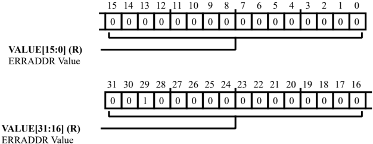

Table 9-13: L2CTL\_ERRADDR0 Register Fields

| Bit No. (Access)   | Bit Name   | Description/Enumeration                                                                             |
|--------------------|------------|-----------------------------------------------------------------------------------------------------|
| 31:0 (R/NW)        | VALUE      | ERRADDR Value. The L2CTL_ERRADDR0.VALUE bits hold the address containing the ECC double- bit error. |

## ECC Error Address 1 Register

The L2CTL\_ERRADDR1 register holds the address containing an ECC multi-bit error for the corresponding bank. The L2CTL updates this register only if the bank's status bit ( L2CTL\_STAT.ECCERR1 ) is cleared. After the bank's status bit is set for an error, further errors in the same bank are not detected until a W1C clears the status bit.

Figure 9-12: L2CTL\_ERRADDR1 Register Diagram

Table 9-14: L2CTL\_ERRADDR1 Register Fields

| Bit No. (Access)   | Bit Name   | Description/Enumeration                                                                             |
|--------------------|------------|-----------------------------------------------------------------------------------------------------|
| 31:0 (R/NW)        | VALUE      | ERRADDR Value. The L2CTL_ERRADDR1.VALUE bits hold the address containing the ECC double- bit error. |

## ECC Error Address 2 Register

The L2CTL\_ERRADDR2 register holds the address containing an ECC multi-bit error for the corresponding bank. The L2CTL updates this register only if the bank's status bit ( L2CTL\_STAT.ECCERR2 ) is cleared. After the bank's status bit is set for an error, further errors in the same bank are not detected until a W1C clears the status bit.

Figure 9-13: L2CTL\_ERRADDR2 Register Diagram

Table 9-15: L2CTL\_ERRADDR2 Register Fields

| Bit No. (Access)   | Bit Name   | Description/Enumeration                                                                             |
|--------------------|------------|-----------------------------------------------------------------------------------------------------|
| 31:0 (R/NW)        | VALUE      | ERRADDR Value. The L2CTL_ERRADDR2.VALUE bits hold the address containing the ECC double- bit error. |

## ECC Error Address 3 Register

The L2CTL\_ERRADDR3 register holds the address containing an ECC multi-bit error for the corresponding bank. The L2CTL updates this register only if the bank's status bit ( L2CTL\_STAT.ECCERR3 ) is cleared. After the bank's status bit is set for an error, further errors in the same bank are not detected until a W1C clears the status bit.

Figure 9-14: L2CTL\_ERRADDR3 Register Diagram

Table 9-16: L2CTL\_ERRADDR3 Register Fields

| Bit No. (Access)   | Bit Name   | Description/Enumeration                                                                             |
|--------------------|------------|-----------------------------------------------------------------------------------------------------|
| 31:0 (R/NW)        | VALUE      | ERRADDR Value. The L2CTL_ERRADDR3.VALUE bits hold the address containing the ECC double- bit error. |

## ECC Error Address 4 Register

The L2CTL\_ERRADDR4 register holds the address containing an ECC multi-bit error for the corresponding bank. The L2CTL updates this register only if the bank's status bit ( L2CTL\_STAT.ECCERR4 ) is cleared. After the bank's status bit is set for an error, further errors in the same bank are not detected until a W1C clears the status bit.

Figure 9-15: L2CTL\_ERRADDR4 Register Diagram

Table 9-17: L2CTL\_ERRADDR4 Register Fields

| Bit No. (Access)   | Bit Name   | Description/Enumeration                                                                             |
|--------------------|------------|-----------------------------------------------------------------------------------------------------|
| 31:0 (R/NW)        | VALUE      | ERRADDR Value. The L2CTL_ERRADDR4.VALUE bits hold the address containing the ECC double- bit error. |

## ECC Error Address 5 Register

The L2CTL\_ERRADDR5 register holds the address containing an ECC multi-bit error for the corresponding bank. The L2CTL updates this register only if the bank's status bit ( L2CTL\_STAT.ECCERR5 ) is cleared. After the bank's status bit is set for an error, further errors in the same bank are not detected until a W1C clears the status bit.

Figure 9-16: L2CTL\_ERRADDR5 Register Diagram

Table 9-18: L2CTL\_ERRADDR5 Register Fields

| Bit No. (Access)   | Bit Name   | Description/Enumeration                                                                             |
|--------------------|------------|-----------------------------------------------------------------------------------------------------|
| 31:0 (R/NW)        | VALUE      | ERRADDR Value. The L2CTL_ERRADDR5.VALUE bits hold the address containing the ECC double- bit error. |

## ECC Error Address 6 Register

The L2CTL\_ERRADDR6 register holds the address containing an ECC multi-bit error for the corresponding bank. The L2CTL updates this register only if the bank's status bit ( L2CTL\_STAT.ECCERR6 ) is cleared. After the bank's status bit is set for an error, further errors in the same bank are not detected until a W1C clears the status bit.

Figure 9-17: L2CTL\_ERRADDR6 Register Diagram

Table 9-19: L2CTL\_ERRADDR6 Register Fields

| Bit No. (Access)   | Bit Name   | Description/Enumeration                                                                             |
|--------------------|------------|-----------------------------------------------------------------------------------------------------|
| 31:0 (R/NW)        | VALUE      | ERRADDR Value. The L2CTL_ERRADDR6.VALUE bits hold the address containing the ECC double- bit error. |

## ECC Error Address 7 Register

The L2CTL\_ERRADDR7 register holds the address containing an ECC multi-bit error for the corresponding bank. The L2CTL updates this register only if the bank's status bit ( L2CTL\_STAT.ECCERR7 ) is cleared. After the bank's status bit is set for an error, further errors in the same bank are not detected until a W1C clears the status bit.

Figure 9-18: L2CTL\_ERRADDR7 Register Diagram

Table 9-20: L2CTL\_ERRADDR7 Register Fields

| Bit No. (Access)   | Bit Name   | Description/Enumeration                                                                             |
|--------------------|------------|-----------------------------------------------------------------------------------------------------|
| 31:0 (R/NW)        | VALUE      | ERRADDR Value. The L2CTL_ERRADDR7.VALUE bits hold the address containing the ECC double- bit error. |

## ECC Error Address 8 Register

The L2CTL\_ERRADDR8 register holds the address containing an ECC multi-bit error for the corresponding bank. The L2CTL updates this register only if the bank's status bit ( L2CTL\_STAT.ECCERR8 ) is cleared. After the bank's status bit is set for an error, further errors in the same bank are not detected until a W1C clears the status bit.

Figure 9-19: L2CTL\_ERRADDR8 Register Diagram

Table 9-21: L2CTL\_ERRADDR8 Register Fields

| Bit No. (Access)   | Bit Name   | Description/Enumeration                                                                             |
|--------------------|------------|-----------------------------------------------------------------------------------------------------|
| 31:0 (R/NW)        | VALUE      | ERRADDR Value. The L2CTL_ERRADDR8.VALUE bits hold the address containing the ECC double- bit error. |

## Error Type 0 Register

The L2CTL\_ET0 register holds information about the error transaction that has occurred on the bus for the corresponding L2 bus port 0. This register is updated only if the corresponding error status bit L2CTL\_STAT.ERR0 is cleared. After the status bit is set for an error, further errors do not update the L2CTL\_ET0 register until a W1C clears the corresponding status bit. If read and write access errors occur simultaneously, the L2CTL\_ET0 captures the write access error, keeping in sync with the error address register ( L2CTL\_EADDR0 ).

Figure 9-20: L2CTL\_ET0 Register Diagram

Table 9-22: L2CTL\_ET0 Register Fields

| Bit No. (Access)   | Bit Name   | Description/Enumeration                                                                                                        |
|--------------------|------------|--------------------------------------------------------------------------------------------------------------------------------|
| 20:8 (R/NW)        | ID         | Error ID. The L2CTL_ET0.ID bits hold the bus requester ID of the access that caused an error.                                  |
| 4 (R/NW)           | RDWR       | Read/Write Error. The L2CTL_ET0.RDWR bit indicates whether a read or write access caused an error. 0 Read Access created Error |
| 3 (R/NW)           | ECCERR     | ECC Error. The L2CTL_ET0.ECCERR bit indicates whether the access had an ECC double-bit error.                                  |
| 2 (R/NW)           | ACCERR     | Access Error. The L2CTL_ET0.ACCERR bit indicates whether the access went to a restricted bank.                                 |

Table 9-22: L2CTL\_ET0 Register Fields (Continued)

| Bit No. (Access)   | Bit Name   | Description/Enumeration                                                      |
|--------------------|------------|------------------------------------------------------------------------------|
| 0                  | ROMERR     | ROMError.                                                                    |
| (R/NW)             |            | The L2CTL_ET0.ROMERR bit indicates whether a write access went to a ROMarea. |

## Error Type 1 Register

The L2CTL\_ET1 register holds information about the error transaction that has occurred on the bus for the corresponding L2 bus port 1. This register is updated only if the corresponding error status bit L2CTL\_STAT.ERR1 is cleared. After the status bit is set for an error, further errors do not update the L2CTL\_ET1 register until a W1C clears the corresponding status bit. If read and write access errors occur simultaneously, the L2CTL\_ET1 captures the write access error, keeping in sync with the error address register ( L2CTL\_EADDR1 ).

Figure 9-21: L2CTL\_ET1 Register Diagram

Table 9-23: L2CTL\_ET1 Register Fields

| Bit No. (Access)   | Bit Name   | Description/Enumeration                                                                                                        |
|--------------------|------------|--------------------------------------------------------------------------------------------------------------------------------|
| 20:8 (R/NW)        | ID         | Error ID. The L2CTL_ET1.ID bits hold the bus requester ID of the access that caused an error.                                  |
| 4 (R/NW)           | RDWR       | Read/Write Error. The L2CTL_ET1.RDWR bit indicates whether a read or write access caused an error. 0 Read access created error |
| 3 (R/NW)           | ECCERR     | ECC Error. If the L2CTL_ET1.ECCERR bit =1, the access had an ECC double-bit error.                                             |
| 2 (R/NW)           | ACCERR     | Access Error. If the L2CTL_ET1.ACCERR bit =1, the access went to a restricted bank.                                            |
| 0 (R/NW)           | ROMERR     | ROMError. If the L2CTL_ET1.ROMERR bit =1, a write access went to a ROMarea.                                                    |

## Error Type 2 Register

The L2CTL\_ET2 register holds information about the error transaction that has occurred on the bus for the corresponding L2 bus port 2 (cores). This register is updated only if the corresponding error status bit L2CTL\_STAT\_1.ERR2 is cleared. After the status bit is set for an error, further errors do not update the L2CTL\_ET2 register until a W1C clears the corresponding status bit. If read and write access errors occur simultaneously, the L2CTL\_ET2 captures the write access error, keeping in sync with the error address register ( L2CTL\_EADDR2 ).

Figure 9-22: L2CTL\_ET2 Register Diagram

Table 9-24: L2CTL\_ET2 Register Fields

| Bit No. (Access)   | Bit Name   | Description/Enumeration                                                                            |
|--------------------|------------|----------------------------------------------------------------------------------------------------|
| 20:8 (R/NW)        | ID         | Error ID. The L2CTL_ET2.ID bits hold the bus requester ID of the access that caused an error.      |
| 4 (R/NW)           | RDWR       | Read/Write Error. The L2CTL_ET2.RDWR bit indicates whether a read or write access caused an error. |
| 3 (R/NW)           | ECCERR     | ECC Error. The L2CTL_ET2.ECCERR bit indicates whether the access had an ECC double-bit error.      |
| 2 (R/NW)           | ACCERR     | Access Error. If the L2CTL_ET2.ACCERR bit =1, the access went to a restricted bank.                |
| 0 (R/NW)           | ROMERR     | ROMError. If the L2CTL_ET2.ROMERR bit =1, a write access went to a ROMarea.                        |

## Error Type 3 Register

The L2CTL\_ET3 register holds information about the error transaction that has occurred on the bus for the corresponding L2 bus port 3 (DMA). This register is updated only if the corresponding error status bit L2CTL\_STAT\_1.ERR3 is cleared. After the status bit is set for an error, further errors do not update the L2CTL\_ET3 register until a W1C clears the corresponding status bit. If read and write access errors occur simultaneously, the L2CTL\_ET3 captures the write access error, keeping in sync with the error address register ( L2CTL\_EADDR3 ).

Figure 9-23: L2CTL\_ET3 Register Diagram

Table 9-25: L2CTL\_ET3 Register Fields

| Bit No. (Access)   | Bit Name   | Description/Enumeration                                                                            |
|--------------------|------------|----------------------------------------------------------------------------------------------------|
| 20:8 (R/NW)        | ID         | Error ID. The L2CTL_ET3.ID bits hold the bus requester ID of the access that caused an error.      |
| 4 (R/NW)           | RDWR       | Read/Write Error. The L2CTL_ET3.RDWR bit indicates whether a read or write access caused an error. |
| 3 (R/NW)           | ECCERR     | ECC Error. The L2CTL_ET3.ECCERR bit indicates whether the access had an ECC double-bit error.      |
| 2 (R/NW)           | ACCERR     | Access Error. If the L2CTL_ET3.ACCERR bit =1, the access went to a restricted bank.                |
| 0 (R/NW)           | ROMERR     | ROMError. If the L2CTL_ET3.ROMERR bit =1, a write access went to a ROMarea.                        |

## Error Type 4 Register

The L2CTL\_ET4 register holds information about the error transaction that has occurred on the bus for the corresponding L2 bus port 4 (DMA). This register is updated only if the corresponding error status bit L2CTL\_STAT\_1.ERR4 is cleared. After the status bit is set for an error, further errors do not update the L2CTL\_ET4 register until a W1C clears the corresponding status bit. If read and write access errors occur simultaneously, the L2CTL\_ET4 captures the write access error, keeping in sync with the error address register ( L2CTL\_EADDR4 ).

Figure 9-24: L2CTL\_ET4 Register Diagram

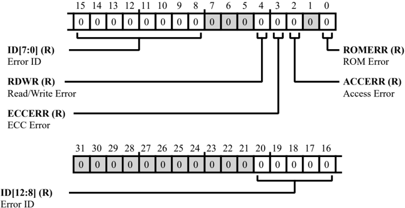

Table 9-26: L2CTL\_ET4 Register Fields

| Bit No. (Access)   | Bit Name   | Description/Enumeration                                                                            |
|--------------------|------------|----------------------------------------------------------------------------------------------------|
| 20:8 (R/NW)        | ID         | Error ID. The L2CTL_ET4.ID bits hold the bus requester ID of the access that caused an error.      |
| 4 (R/NW)           | RDWR       | Read/Write Error. The L2CTL_ET4.RDWR bit indicates whether a read or write access caused an error. |
| 3 (R/NW)           | ECCERR     | ECC Error. The L2CTL_ET4.ECCERR bit indicates whether the access had an ECC double-bit error.      |
| 2 (R/NW)           | ACCERR     | Access Error. If the L2CTL_ET4.ACCERR bit =1, the access went to a restricted bank.                |
| 0 (R/NW)           | ROMERR     | ROMError. If the L2CTL_ET4.ROMERR bit =1, a write access went to a ROMarea.                        |

## Initialization Register

The L2CTL\_INIT register initializes memory banks with 128'b0 and ECC bits corresponding to 128'b0. Any writes to the bits in this register while initialization is occurring to any of the banks is ignored. All bits are W1A (Write 1 for Action).

Figure 9-25: L2CTL\_INIT Register Diagram

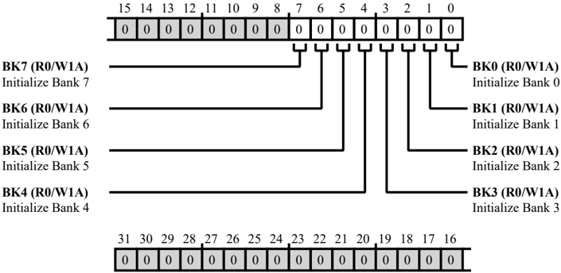

Table 9-27: L2CTL\_INIT Register Fields

| Bit No. (Access)   | Bit Name   | Description/Enumeration                                                                                                                                                                               |
|--------------------|------------|-------------------------------------------------------------------------------------------------------------------------------------------------------------------------------------------------------|
| 7 (R0/W1A)         | BK7        | Initialize Bank 7. The write-1 to the L2CTL_INIT.BK7 bit initializes bank 7 with 128b0 and ECC bits corresponding to 128b0. Any write to this bit during the initialization of the banks is ignored.  |
| 6 (R0/W1A)         | BK6        | Initialize Bank 6. The write-1 to the L2CTL_INIT.BK6 bit initializes bank 6 with 128b0 and ECC bits corresponding to 128b0. Any write to this bit during the initialization of the banks is ignored.  |
| 5 (R0/W1A)         | BK5        | Initialize Bank 5. The write -1 to the L2CTL_INIT.BK5 bit initializes bank 5 with 128b0 and ECC bits corresponding to 128b0. Any write to this bit during the initialization of the banks is ignored. |
| 4 (R0/W1A)         | BK4        | Initialize Bank 4. The write-1 to the L2CTL_INIT.BK4 bit initializes bank 4 with 128b0 and ECC bits corresponding to 128b0. Any write to this bit during the initialization of the banks is ignored.  |

Table 9-27: L2CTL\_INIT Register Fields (Continued)

| Bit No. (Access)   | Bit Name   | Description/Enumeration                                                                                                                                                                              |
|--------------------|------------|------------------------------------------------------------------------------------------------------------------------------------------------------------------------------------------------------|
| 3 (R0/W1A)         | BK3        | Initialize Bank 3. The write-1 to the L2CTL_INIT.BK3 bit initializes bank 3 with 128b0 and ECC bits corresponding to 128b0. Any write to this bit during the initialization of the banks is ignored. |
| 2 (R0/W1A)         | BK2        | Initialize Bank 2. The write-1 to the L2CTL_INIT.BK2 bit initializes bank 2 with 128b0 and ECC bits corresponding to 128b0. Any write to this bit during the initialization of the banks is ignored. |
| 1 (R0/W1A)         | BK1        | Initialize Bank 1. The write-1 to the L2CTL_INIT.BK1 bit initializes bank 1 with 128b0 and ECC bits corresponding to 128b0. Any write to this bit during the initialization of the banks is ignored. |
| 0 (R0/W1A)         | BK0        | Initialize Bank 0. The write-1 to the L2CTL_INIT.BK0 bit initializes bank 0 with 128b0 and ECC bits corresponding to 128b0. Any write to this bit during the initialization of the banks is ignored. |

## Initialization Status Register

The L2CTL\_ISTAT register holds the status of the RAM bank initialization. If set, the corresponding bank is initialized.

Figure 9-26: L2CTL\_ISTAT Register Diagram

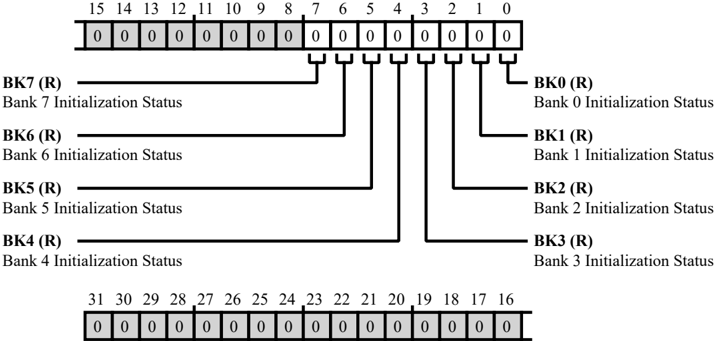

Table 9-28: L2CTL\_ISTAT Register Fields

| Bit No. (Access)   | Bit Name   | Description/Enumeration                                                                                                                                                                |
|--------------------|------------|----------------------------------------------------------------------------------------------------------------------------------------------------------------------------------------|
| 7 (R/NW)           | BK7        | Bank 7 Initialization Status. The L2CTL_ISTAT.BK7 bits hold the bank 7 initialization status. A W1A on a BKxINIT bit clears this bit and the bit is set when initialization completes. |
| 6 (R/NW)           | BK6        | Bank 6 Initialization Status. The L2CTL_ISTAT.BK6 bits hold the bank 6 initialization status. A W1A on a BKxINIT bit clears this bit and the bit is set when initialization completes. |
| 5 (R/NW)           | BK5        | Bank 5 Initialization Status. The L2CTL_ISTAT.BK5 bits hold the bank 5 initialization status. A W1A on a BKxINIT bit clears this bit and the bit is set when initialization completes. |
| 4 (R/NW)           | BK4        | Bank 4 Initialization Status. The L2CTL_ISTAT.BK4 bits hold the bank 4 initialization status. A W1A on a BKxINIT bit clears this bit and the bit is set when initialization completes. |
| 3 (R/NW)           | BK3        | Bank 3 Initialization Status. The L2CTL_ISTAT.BK3 bits hold the bank 3 initialization status. A W1A on a BKxINIT bit clears this bit and the bit is set when initialization completes. |
| 2 (R/NW)           | BK2        | Bank 2 Initialization Status. The L2CTL_ISTAT.BK2 bits hold the bank 2 initialization status. A W1A on a BKxINIT bit clears this bit and the bit is set when initialization completes. |

Table 9-28: L2CTL\_ISTAT Register Fields (Continued)

| Bit No. (Access)   | Bit Name   | Description/Enumeration                                                                                                                                                                |
|--------------------|------------|----------------------------------------------------------------------------------------------------------------------------------------------------------------------------------------|
| 1 (R/NW)           | BK1        | Bank 1 Initialization Status. The L2CTL_ISTAT.BK1 bits hold the bank 1 initialization status. A W1A on a BKxINIT bit clears this bit and the bit is set when initialization completes. |
| 0 (R/NW)           | BK0        | Bank 0 Initialization Status. The L2CTL_ISTAT.BK0 bits hold the bank 0 initialization status. A W1A on a BKxINIT bit clears this bit and the bit is set when initialization completes. |

## Power Control Register

The L2CTL\_PCTL register has the various control settings for selectively enabling the deep sleep and shut down power saving features.

NOTE: The corresponding L2 bank should not be accessed if the power control feature is enabled for that bank. An access to a bank in deep sleep/shut down may create unpredictable behavior.

Figure 9-27: L2CTL\_PCTL Register Diagram

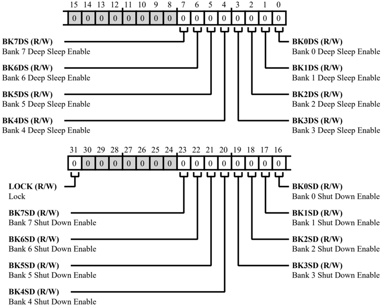

Table 9-29: L2CTL\_PCTL Register Fields

| Bit No. (Access)   | Bit Name   | Description/Enumeration                                                                                                                                |
|--------------------|------------|--------------------------------------------------------------------------------------------------------------------------------------------------------|
| 31 (R/W)           | LOCK       | Lock. If the global lock bit is set ( SPU_CTL.GLCK bit =1) and the L2CTL_PCTL.LOCK bit is set, the L2CTL_PCTL register is read only (locked). 0 Unlock |
| 23 (R/W)           | BK7SD      | Bank 7 Shut Down Enable. The L2CTL_PCTL.BK7SD bits enables bank 7 shut down.                                                                           |

Table 9-29: L2CTL\_PCTL Register Fields (Continued)

| Bit No. (Access)   | Bit Name   | Description/Enumeration                                                        |
|--------------------|------------|--------------------------------------------------------------------------------|
| 22 (R/W)           | BK6SD      | Bank 6 Shut Down Enable. The L2CTL_PCTL.BK6SD bits enables bank 6 shut down.   |
| 21 (R/W)           | BK5SD      | Bank 5 Shut Down Enable. The L2CTL_PCTL.BK5SD bits enables bank 5 shut down.   |
| 20 (R/W)           | BK4SD      | Bank 4 Shut Down Enable. The L2CTL_PCTL.BK4SD bits enables bank 4 shut down.   |
| 19 (R/W)           | BK3SD      | Bank 3 Shut Down Enable. The L2CTL_PCTL.BK3SD bits enables bank 3 shut down.   |
| 18 (R/W)           | BK2SD      | Bank 2 Shut Down Enable. The L2CTL_PCTL.BK2SD bits enables bank 2 shut down.   |
| 17 (R/W)           | BK1SD      | Bank 1 Shut Down Enable. The L2CTL_PCTL.BK1SD bits enables bank 1 shut down.   |
| 16 (R/W)           | BK0SD      | Bank 0 Shut Down Enable. The L2CTL_PCTL.BK0SD bits enables bank 0 shut down.   |
| 7 (R/W)            | BK7DS      | Bank 7 Deep Sleep Enable. The L2CTL_PCTL.BK7DS bits enables bank 7 deep sleep. |
| 6 (R/W)            | BK6DS      | Bank 6 Deep Sleep Enable. The L2CTL_PCTL.BK6DS bits enables bank 6 deep sleep. |
| 5 (R/W)            | BK5DS      | Bank 5 Deep Sleep Enable. The L2CTL_PCTL.BK5DS bits enables bank 5 deep sleep. |
| 4 (R/W)            | BK4DS      | Bank 4 Deep Sleep Enable. The L2CTL_PCTL.BK4DS bits enables bank 4 deep sleep. |
| 3 (R/W)            | BK3DS      | Bank 3 Deep Sleep Enable. The L2CTL_PCTL.BK3DS bits enables bank 3 deep sleep. |
| 2 (R/W)            | BK2DS      | Bank 2 Deep Sleep Enable. The L2CTL_PCTL.BK2DS bits enables bank 2 deep sleep. |
| 1 (R/W)            | BK1DS      | Bank 1 Deep Sleep Enable. The L2CTL_PCTL.BK1DS bits enables bank 1 deep sleep. |
| 0 (R/W)            | BK0DS      | Bank 0 Deep Sleep Enable. The L2CTL_PCTL.BK0DS bits enables bank 0 deep sleep. |

## Revision ID Register

The L2CTL\_REVID register provides the L2 Revision ID.

Figure 9-28: L2CTL\_REVID Register Diagram

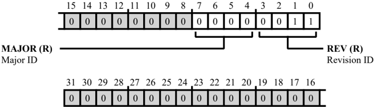

Table 9-30: L2CTL\_REVID Register Fields

| Bit No. (Access)   | Bit Name   | Description/Enumeration                               |
|--------------------|------------|-------------------------------------------------------|
| 7:4                | MAJOR      | Major ID.                                             |
| (R/NW)             |            | The L2CTL_REVID.MAJOR bit indicates L2 Major ID.      |
| 3:0                | REV        | Revision ID.                                          |
| (R/NW)             |            | The L2CTL_REVID.REV bit indicates the L2 Revision ID. |

## Read Priority Count Register

The L2CTL\_RPCR0 register stores the count value to be used for priority elevation for bus read channels of Port0 to Port3. If a bus channel is not granted access from the bank arbiter, the channel waits for the programmed number (stored in RPCx) of SYSCLK cycles, before the request is elevated to a high priority request. If a priority count value is programmed as zero for a channel, that channel does not raise the urgent priority request. Default value wait cycle for each channel is 15.

This is a read/write register, but a new value in the corresponding field must be written only when there are no outstanding transactions on the corresponding bus read channel. A best practice is to program this register before initiating an L2 access.

Figure 9-29: L2CTL\_RPCR0 Register Diagram

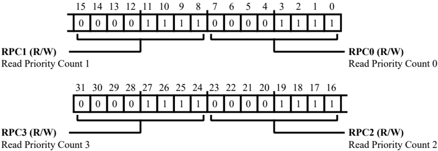

Table 9-31: L2CTL\_RPCR0 Register Fields

| Bit No. (Access)   | Bit Name   | Description/Enumeration                                                                             |
|--------------------|------------|-----------------------------------------------------------------------------------------------------|
| 31:24 (R/W)        | RPC3       | Read Priority Count 3. The L2CTL_RPCR0.RPC3 bits hold the priority count for L2 bus read channel 3. |
| 23:16 (R/W)        | RPC2       | Read Priority Count 2. The L2CTL_RPCR0.RPC2 bits hold the priority count for L2 bus read channel 2. |
| 15:8 (R/W)         | RPC1       | Read Priority Count 1. The L2CTL_RPCR0.RPC1 bits hold the priority count for L2 bus read channel 1. |
| 7:0 (R/W)          | RPC0       | Read Priority Count 0. The L2CTL_RPCR0.RPC0 bits hold the priority count for L2 bus read channel 0. |

## Read Priority Count Register

The L2CTL\_RPCR1 register stores the count value to be used for priority elevation for bus read channel 4. If a bus channel is not granted access from the bank arbiter, the channel waits for the programmed number (stored in RPC4) of SYSCLK cycles, before the request is elevated to a high priority request. If a priority count value is programmed as zero for a channel, that channel does not raise the urgent priority request. Default value of RPC4 is 15.

This is a read/write register, but a new value in the corresponding field must be written only when there are no outstanding transactions on the corresponding bus read channel. A best practice is to program this register before initiating an L2 access.

Figure 9-30: L2CTL\_RPCR1 Register Diagram

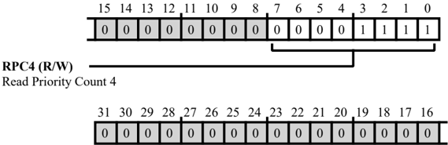

Table 9-32: L2CTL\_RPCR1 Register Fields

| Bit No. (Access)   | Bit Name   | Description/Enumeration                                                      |
|--------------------|------------|------------------------------------------------------------------------------|
| 7:0                | RPC4       | Read Priority Count 4.                                                       |
| (R/W)              |            | The L2CTL_RPCR1.RPC4 bits hold the priority count for L2 bus read channel 4. |

## Scrub Start Address Register

The L2CTL\_SADR register stores the scrub start address value. Writes to this register can be prevented by setting the L2CTL\_SCTL.LOCK bit and the global lock.

Figure 9-31: L2CTL\_SADR Register Diagram

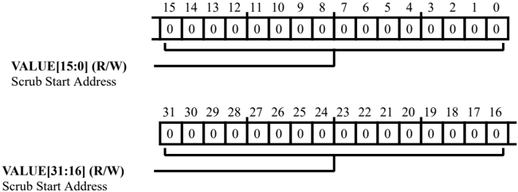

Table 9-33: L2CTL\_SADR Register Fields

| Bit No. (Access)   | Bit Name   | Description/Enumeration                                                                                                                               |
|--------------------|------------|-------------------------------------------------------------------------------------------------------------------------------------------------------|
| 31:0               | VALUE      | Scrub Start Address.                                                                                                                                  |
| (R/W)              |            | The L2CTL_SADR.VALUE bits hold the scrub start address. The writes to this register can be prevented by setting the L2_SCTL.LOCK and the global lock. |

## Scrub Count Register

The L2CTL\_SCNT register determines the number of 128-bit locations scrubbed starting from the start address ( L2CTL\_SADR register). Writes to the L2CTL\_SCNT register can be prevented by setting the L2CTL\_CTL.LOCK bit and the global lock.

Figure 9-32: L2CTL\_SCNT Register Diagram

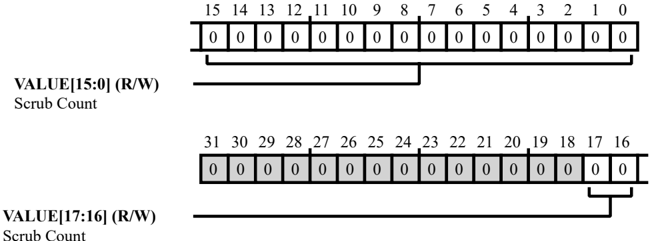

Table 9-34: L2CTL\_SCNT Register Fields

| Bit No. (Access)   | Bit Name   | Description/Enumeration                                                                                                                                                                                                      |
|--------------------|------------|------------------------------------------------------------------------------------------------------------------------------------------------------------------------------------------------------------------------------|
| 17:0 (R/W)         | VALUE      | Scrub Count. The L2CTL_SCNT.VALUE bits determines the number of 128-bit locations scrub- bed starting from the start address. Ensure value programmed is less than the total addressable 128-bit L2 RAM locations available. |

## Scrub Control Register

The L2CTL\_SCTL register holds the automatic scrub related controls. This is a read/write register. Memory scrub can be performed by programming the L2CTL\_SADR (scrub start address) register with the start address of the scrub and the L2CTL\_SCNT register with the total number of 128 -bit addresses to be scrubbed starting from the L2CTL\_SADR register. The number of cycles between each scrub can be programmed with the L2CTL\_SCTL.SRT bit.

During the scrub the controller issues a read followed by write back if there is a single bit ECC error. Once the L2 controller completes scrubbing the memory region mentioned using the L2CTL\_SADR and the L2CTL\_SCNT registers, an interrupt is generated and scrubbing re-starts from the start unless the scrub enable bit is disabled in the control register. If scrub enable is cleared before completing the address range used in the L2CTL\_SADR and L2CTL\_SCNT registers, the scrub stops after completing any already issued scrub access.

The scrub read/writes always start from the full 128-bit equivalent of the address written into the L2CTL\_SADR register. A 128-bit value is always read and the 128-bit value is written back. The scrub access has the highest priority. Programs can configure 8-, 16-, or 32-bit addresses in the L2CTL\_SADR register but the lower 3 bits are treated as don't care because the internal memory array is always accessed in a 128-bit mode.

Figure 9-33: L2CTL\_SCTL Register Diagram

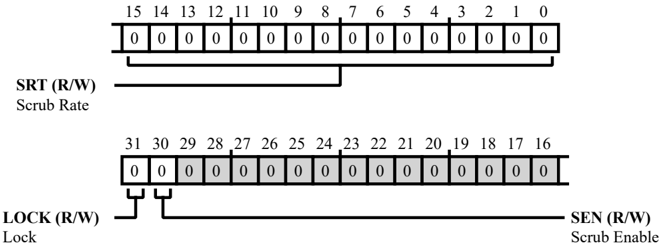

Table 9-35: L2CTL\_SCTL Register Fields

| Bit No. (Access)   | Bit Name   | Description/Enumeration                                                                                                                       |
|--------------------|------------|-----------------------------------------------------------------------------------------------------------------------------------------------|
| 31 (R/W)           | LOCK       | Lock. If the global lock bit is set ( SPU_CTL.GLCK bit =1) and the L2CTL_SCTL.LOCK bit is set, the L2CTL_SCTL register is read only (locked). |
| 30 (R/W)           | SEN        | Scrub Enable. The L2CTL_SCTL.SEN bits enable automatic scrub.                                                                                 |

Table 9-35: L2CTL\_SCTL Register Fields (Continued)

| Bit No. (Access)   | Bit Name   | Description/Enumeration                                                                                              |
|--------------------|------------|----------------------------------------------------------------------------------------------------------------------|
| 15:0 (R/W)         | SRT        | Scrub Rate. The L2CTL_SCTL.SRT bits determines the number of clock cycles that elapsed between two automatic scrubs. |

## Status Register

The L2CTL\_STAT register indicates ECC error status, refresh register status, and bus error status of Port0 and Port1.

Figure 9-34: L2CTL\_STAT Register Diagram

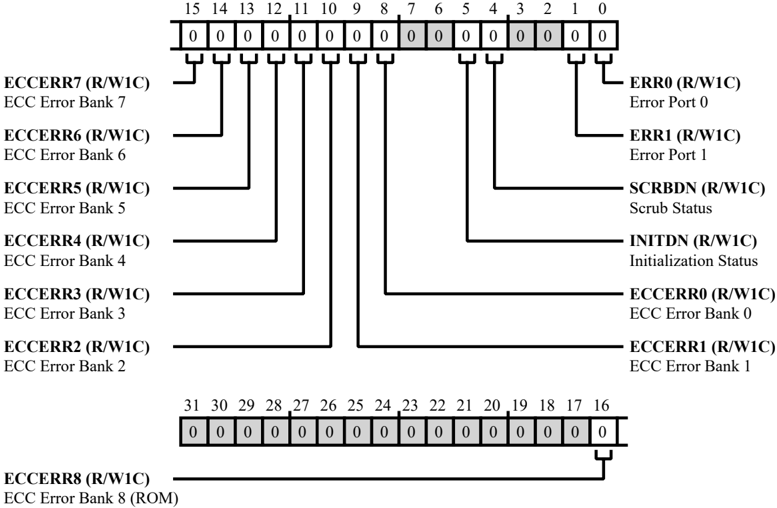

Table 9-36: L2CTL\_STAT Register Fields

| Bit No. (Access)   | Bit Name   | Description/Enumeration                                                                                                                           |
|--------------------|------------|---------------------------------------------------------------------------------------------------------------------------------------------------|
| 16 (R/W1C)         | ECCERR8    | ECC Error Bank 8 (ROM). The L2CTL_STAT.ECCERR8 bit indicates that an ECC double-bit error occurred inside L2 bank 8 (ROM). 0 No Status            |
| 15 (R/W1C)         | ECCERR7    | ECC Error Bank 7. The L2CTL_STAT.ECCERR7 bit indicates that an ECC double-bit error occurred inside L2 bank 7. 0 No Status 1 ECC Double Bit Error |

Table 9-36: L2CTL\_STAT Register Fields (Continued)

| Bit No. (Access)   | Bit Name   | Description/Enumeration                                                                                        |
|--------------------|------------|----------------------------------------------------------------------------------------------------------------|
| 14 (R/W1C)         | ECCERR6    | ECC Error Bank 6. The L2CTL_STAT.ECCERR6 bit indicates that an ECC double-bit error occurred inside L2 bank 6. |
| 14 (R/W1C)         | ECCERR6    | 0 No Status                                                                                                    |
| 14 (R/W1C)         | ECCERR6    | 1 ECC Double Bit Error                                                                                         |
| 13 (R/W1C)         | ECCERR5    | ECC Error Bank 5. The L2CTL_STAT.ECCERR5 bit indicates that an ECC double-bit error occurred inside L2 bank 5. |
| 13 (R/W1C)         | ECCERR5    | 0 No Status                                                                                                    |
| 13 (R/W1C)         | ECCERR5    | 1 ECC Double Bit Error                                                                                         |
| 12 (R/W1C)         | ECCERR4    | ECC Error Bank 4. The L2CTL_STAT.ECCERR4 bit indicates that an ECC double-bit error occurred inside L2 bank 4. |
| 12 (R/W1C)         | ECCERR4    | 0 No Status                                                                                                    |
| 12 (R/W1C)         | ECCERR4    | 1 ECC Double Bit Error                                                                                         |
| 11 (R/W1C)         | ECCERR3    | ECC Error Bank 3. The L2CTL_STAT.ECCERR3 bit indicates that an ECC double-bit error occurred inside L2 bank 3. |
| 11 (R/W1C)         | ECCERR3    | 0 No Status                                                                                                    |
| 11 (R/W1C)         | ECCERR3    | 1 ECC Double Bit Error                                                                                         |
| 10 (R/W1C)         | ECCERR2    | ECC Error Bank 2. The L2CTL_STAT.ECCERR2 bit indicates that an ECC double-bit error occurred inside L2 bank 2. |
| 10 (R/W1C)         | ECCERR2    | 0 No Status                                                                                                    |
| 10 (R/W1C)         | ECCERR2    | 1 ECC Double Bit Error                                                                                         |
| 9 (R/W1C)          | ECCERR1    | ECC Error Bank 1. The L2CTL_STAT.ECCERR1 bit indicates that an ECC double-bit error occurred inside L2 bank 1. |
| 9 (R/W1C)          | ECCERR1    | 0 No Status                                                                                                    |
| 9 (R/W1C)          | ECCERR1    | 1 ECC Double Bit Error                                                                                         |

Table 9-36: L2CTL\_STAT Register Fields (Continued)

| Bit No. (Access)   | Bit Name   | Description/Enumeration                                                                                          |
|--------------------|------------|------------------------------------------------------------------------------------------------------------------|
| 8 (R/W1C)          | ECCERR0    | ECC Error Bank 0. The L2CTL_STAT.ECCERR0 bit indicates that an ECC double-bit error occurred inside L2 bank 0.   |
| 8 (R/W1C)          | ECCERR0    | 0 No Status                                                                                                      |
| 8 (R/W1C)          | ECCERR0    | 1 ECC Double Bit Error                                                                                           |
| 5 (R/W1C)          | INITDN     | Initialization Status. The L2CTL_STAT.INITDN bit indicates whether initialization has been completed.            |
| 5 (R/W1C)          | INITDN     | 0 Initialization Not Complete                                                                                    |
| 5 (R/W1C)          | INITDN     | 1 Initialization Completed                                                                                       |
| 4 (R/W1C)          | SCRBDN     | Scrub Status. The L2CTL_STAT.SCRBDN bit indicates whether a round of memory scrub has completed.                 |
| 4 (R/W1C)          | SCRBDN     | 0 Scrub Not Complete                                                                                             |
| 4 (R/W1C)          | SCRBDN     | 1 Scrub Completed                                                                                                |
| 1 (R/W1C)          | ERR1       | Error Port 1. The L2CTL_STAT.ERR1 indicates whether the L2CTL has detected a bus access error on L2s bus port 1. |
| 1 (R/W1C)          | ERR1       | 0 No Error                                                                                                       |
| 1 (R/W1C)          | ERR1       | 1 Bus Access Error                                                                                               |
| 0 (R/W1C)          | ERR0       | Error Port 0. The L2CTL_STAT.ERR0 indicates whether the L2CTL has detected a bus access error on L2s bus port 0. |
| 0 (R/W1C)          | ERR0       | 0 No Error                                                                                                       |
| 0 (R/W1C)          | ERR0       | 1 Bus Access Error                                                                                               |

## L2 Port Error Status Register

The L2CTL\_STAT\_1 register stores the AXI Error Status from Port2 onwards. The register bits are sticky - once set it has to be explicitly reset by writing a 1 to that particular bit.

Figure 9-35: L2CTL\_STAT\_1 Register Diagram

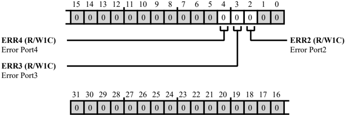

Table 9-37: L2CTL\_STAT\_1 Register Fields

| Bit No. (Access)   | Bit Name   | Description/Enumeration                                                                                           |
|--------------------|------------|-------------------------------------------------------------------------------------------------------------------|
| 4 (R/W1C)          | ERR4       | Error Port4. The L2CTL_STAT_1.ERR4 indicates whether the L2CTL has detected a bus access error on L2s bus port 4. |
| 3 (R/W1C)          | ERR3       | Error Port3. The L2CTL_STAT_1.ERR3 indicates whether the L2CTL has detected a bus access error on L2s bus port 3. |
| 2 (R/W1C)          | ERR2       | Error Port2. The L2CTL_STAT_1.ERR2 indicates whether the L2CTL has detected a bus access error on L2s bus port 2. |

## Write Priority Count Register

The L2CTL\_WPCR0 register stores the count value to be used for priority elevation for bus write channels. If a bus channel is not granted access from the bank arbiter, the channel waits for the programmed number of SYSCLK cycles, before the request is elevated to a high priority request. If a priority count value is programmed as zero for a channel, that channel does not raise the urgent priority request.

This is a read/write register, but a new value in the corresponding field must be written only when there are no outstanding transactions on the corresponding bus write channel. A best practice is to program this register before initiating an L2 access.

Figure 9-36: L2CTL\_WPCR0 Register Diagram

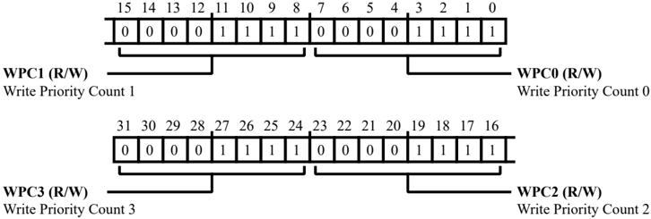

Table 9-38: L2CTL\_WPCR0 Register Fields

| Bit No. (Access)   | Bit Name   | Description/Enumeration                                                                               |
|--------------------|------------|-------------------------------------------------------------------------------------------------------|
| 31:24 (R/W)        | WPC3       | Write Priority Count 3. The L2CTL_WPCR0.WPC3 bits hold the priority count for L2 bus write channel 3. |
| 23:16 (R/W)        | WPC2       | Write Priority Count 2. The L2CTL_WPCR0.WPC2 bits hold the priority count for L2 bus write channel 2. |
| 15:8 (R/W)         | WPC1       | Write Priority Count 1. The L2CTL_WPCR0.WPC1 bits hold the priority count for L2 bus write channel 1. |
| 7:0 (R/W)          | WPC0       | Write Priority Count 0. The L2CTL_WPCR0.WPC0 bits hold the priority count for L2 bus write channel 0. |

## Write Priority Count Register

The L2CTL\_WPCR1 register stores the count value to be used for priority elevation for bus write channels. If a bus channel is not granted access from the bank arbiter, the channel waits for the programmed number of SYSCLK cycles, before the request is elevated to a high priority request. If a priority count value is programmed as zero for a channel, that channel does not raise the urgent priority request.

This is a read/write register, but a new value in the corresponding field must be written only when there are no outstanding transactions on the corresponding bus write channel. A best practice is to program this register before initiating an L2 access.

Figure 9-37: L2CTL\_WPCR1 Register Diagram

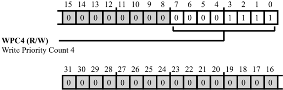

Table 9-39: L2CTL\_WPCR1 Register Fields

| Bit No. (Access)   | Bit Name   | Description/Enumeration                                                       |
|--------------------|------------|-------------------------------------------------------------------------------|
| 7:0                | WPC4       | Write Priority Count 4.                                                       |
| (R/W)              |            | The L2CTL_WPCR1.WPC4 bits hold the priority count for L2 bus write channel 4. |