## 49   ADSP-2184x MISCREG Register Descriptions

Misc registers for module are for integration purpose (MISCREG) contains the following registers.

Table 49-1: ADSP-2184x MISCREG Register List

| Name                         | Description                                          |
|------------------------------|------------------------------------------------------|
| MISCREG_CAN_SYSCTL           | CANFD Low Power Selection Mode                       |
| MISCREG_CLK_MUX_SEL          | Miscellaneous Clock Multiplexer Selection Register   |
| MISCREG_CLK_MUX_SEL1         | Miscellaneous Clock Multiplexer Selection 1 Register |
| MISCREG_ECO_REG1             | LPDDR Miscellaneous Register                         |
| MISCREG_ECO_REG9             | EMAC Error Register                                  |
| MISCREG_EMAC_MISC_REG        | EMAC Miscellaneous Register                          |
| MISCREG_EMAC_MISC_REG2       | EMAC Miscellaneous Register 2                        |
| MISCREG_EMMC_MISC_REG        | EMMCMISC Register                                    |
| MISCREG_MINI_CGU0            | MINI CGU0 MISC Register                              |
| MISCREG_MINI_CGU1            | MINI CGU0 MISC Register                              |
| MISCREG_SH0_PFB_RANGE_SELECT | SH0 Prefetch Range Selection Register                |
| MISCREG_SH1_PFB_RANGE_SELECT | SH1 Prefetch Range Selection Register                |
| MISCREG_SHARC_BRIDGE_REMAP   | SPORT Direct Interrupt Enable for SH0 and SH1        |
| MISCREG_XSPI1_CTL0           | XSPI1 Boot/Init Control Register 0                   |
| MISCREG_XSPI1_CTL1           | XSPI1 Boot/Init Control Register 1                   |
| MISCREG_XSPI1_CTL2           | XSPI1 Boot/Init Control Register 2                   |
| MISCREG_XSPI1_CTL3           | XSPI1 Boot/Init Control Register 3                   |
| MISCREG_XSPI1_CTL4           | XSPI1 Boot/Init Control Register 4                   |
| MISCREG_XSPI1_CTL5           | XSPI1 Boot/Init Control Register 5                   |
| MISCREG_XSPI1_CTL6           | XSPI1 Boot/Init Control Register 6                   |

Table 49-1: ADSP-2184x MISCREG Register List (Continued)

| Name                 | Description                            |
|----------------------|----------------------------------------|
| MISCREG_XSPI1_CTL7   | XSPI1 Boot/Init Control Register 7     |
| MISCREG_XSPI1_CTL8   | XSPI1 Boot/Init Control Register 8     |
| MISCREG_XSPI1_RSTCTL | XSPI1 Boot/Init Reset Control Register |
| MISCREG_XSPI1_STAT0  | XSPI1 Boot/Init Status Register        |
| MISCREG_XSPI_CTL0    | XSPI Boot/Init Control Register 0      |
| MISCREG_XSPI_CTL1    | XSPI Boot/Init Control Register 1      |
| MISCREG_XSPI_CTL2    | XSPI Boot/Init Control Register 2      |
| MISCREG_XSPI_CTL3    | XSPI Boot/Init Control Register 3      |
| MISCREG_XSPI_CTL4    | XSPI Boot/Init Control Register 4      |
| MISCREG_XSPI_CTL5    | XSPI Boot/Init Control Register 5      |
| MISCREG_XSPI_CTL6    | XSPI Boot/Init Control Register 6      |
| MISCREG_XSPI_CTL7    | XSPI Boot/Init Control Register 7      |
| MISCREG_XSPI_CTL8    | XSPI Boot/Init Control Register 8      |
| MISCREG_XSPI_RSTCTL  | XSPI Boot/Init Reset Control Register  |
| MISCREG_XSPI_STAT0   | XSPI Boot/Init Status Register         |

## CANFD Low Power Selection Mode

The MISCREG\_CAN\_SYSCTL register contains the control bits for the different low power modes supported in the CANFD module.

Figure 49-1: MISCREG\_CAN\_SYSCTL Register Diagram

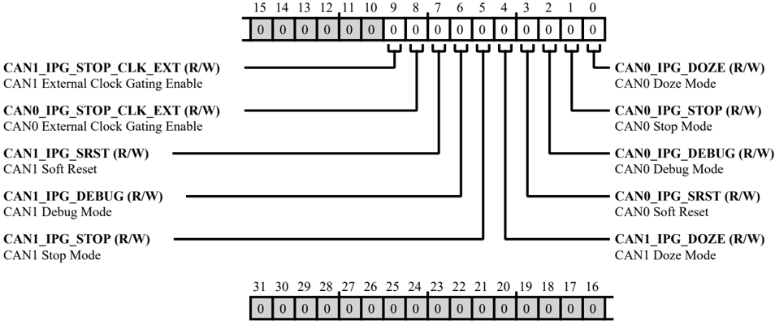

Table 49-2: MISCREG\_CAN\_SYSCTL Register Fields

| Bit No. (Access)   | Bit Name               | Description/Enumeration                                                                                                                                  |
|--------------------|------------------------|----------------------------------------------------------------------------------------------------------------------------------------------------------|
| 9 (R/W)            | CAN1_IPG_STOP_CLK_ EXT | CAN1 External Clock Gating Enable. When set (=1), the MISCREG_CAN_SYSCTL.CAN1_IPG_STOP_CLK_EXT bit enables external clock gating for stop mode for CAN1. |
| 8 (R/W)            | CAN0_IPG_STOP_CLK_ EXT | CAN0 External Clock Gating Enable. When set (=1), the MISCREG_CAN_SYSCTL.CAN0_IPG_STOP_CLK_EXT bit enables external clock gating for stop mode for CAN0. |
| 7 (R/W)            | CAN1_IPG_SRST          | CAN1 Soft Reset. When set (=1), the MISCREG_CAN_SYSCTL.CAN1_IPG_SRST bit enables a soft reset request to CAN1.                                           |
| 6 (R/W)            | CAN1_IPG_DEBUG         | CAN1 Debug Mode. When set (=1), the MISCREG_CAN_SYSCTL.CAN1_IPG_DEBUG bit enables a debug mode request to CAN1.                                          |
| 5 (R/W)            | CAN1_IPG_STOP          | CAN1 Stop Mode. When set (=1), the MISCREG_CAN_SYSCTL.CAN1_IPG_STOP bit enables a stop mode request to CAN1.                                             |

Table 49-2: MISCREG\_CAN\_SYSCTL Register Fields (Continued)

| Bit No. (Access)   | Bit Name       | Description/Enumeration                                                                                         |
|--------------------|----------------|-----------------------------------------------------------------------------------------------------------------|
| 4 (R/W)            | CAN1_IPG_DOZE  | CAN1 Doze Mode. When set (=1), the MISCREG_CAN_SYSCTL.CAN1_IPG_DOZE bit enables a doze mode request to CAN1.    |
| 3 (R/W)            | CAN0_IPG_SRST  | CAN0 Soft Reset. When set (=1), the MISCREG_CAN_SYSCTL.CAN0_IPG_SRST bit enables a soft reset request to CAN0.  |
| 2 (R/W)            | CAN0_IPG_DEBUG | CAN0 Debug Mode. When set (=1), the MISCREG_CAN_SYSCTL.CAN0_IPG_DEBUG bit enables a debug mode request to CAN0. |
| 1 (R/W)            | CAN0_IPG_STOP  | CAN0 Stop Mode. When set (=1), the MISCREG_CAN_SYSCTL.CAN0_IPG_STOP bit enables a stop mode request to CAN0.    |
| 0 (R/W)            | CAN0_IPG_DOZE  | CAN0 Doze Mode. When set (=1), the MISCREG_CAN_SYSCTL.CAN0_IPG_DOZE bit enables a doze mode request to CAN0.    |

## Miscellaneous Clock Multiplexer Selection Register

The MISCREG\_CLK\_MUX\_SEL register contain the clock multiplex selections.

Figure 49-2: MISCREG\_CLK\_MUX\_SEL Register Diagram

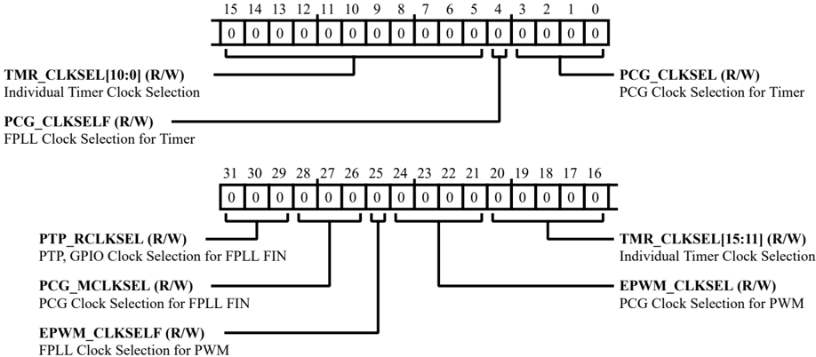

Table 49-3: MISCREG\_CLK\_MUX\_SEL Register Fields

| Bit No. (Access)   | Bit Name    | Description/Enumeration                                                                                                                                                                                                                                    |
|--------------------|-------------|------------------------------------------------------------------------------------------------------------------------------------------------------------------------------------------------------------------------------------------------------------|
| 31:29 (R/W)        | PTP_RCLKSEL | PTP, GPIO Clock Selection for FPLL FIN. The MISCREG_CLK_MUX_SEL.PTP_RCLKSEL bit field indicates the PTP GPIO clock selection for FPLL FIN. 3'b000 - Ext Sync over PA[15] 3'b001 - ETH0 PTPPPS[0] ... 3'b101 - ETH0 PTPPPS[3] 3'b110 - N/A ... 3'b111 - N/A |

Table 49-3: MISCREG\_CLK\_MUX\_SEL Register Fields (Continued)

| Bit No. (Access)   | Bit Name     | Description/Enumeration                                                                                                                                                                                                                                                                                                                                                                                 | Description/Enumeration                                                                                                                                                                                                                                                                                                                                                                                 |
|--------------------|--------------|---------------------------------------------------------------------------------------------------------------------------------------------------------------------------------------------------------------------------------------------------------------------------------------------------------------------------------------------------------------------------------------------------------|---------------------------------------------------------------------------------------------------------------------------------------------------------------------------------------------------------------------------------------------------------------------------------------------------------------------------------------------------------------------------------------------------------|
| 28:26 (R/W)        | PCG_MCLKSEL  | PCG Clock Selection for FPLL FIN. The MISCREG_CLK_MUX_SEL.PCG_MCLKSEL bit field indicates the PCG clock selection for FPLL FIN. 3'b000 - Ext Clk over DAI0- PCGA 3'b001 - Ext Clk over DAI0- PCGB 3'b010 - Ext Clk over DAI0- PCGE 3'b011 - Ext Clk over DAI0- PCGF 3'b100 - Ext Clk over DAI1- PCGC 3'b101 - Ext Clk over DAI1- PCGD 3'b110 - Ext Clk over DAI1- PCGG 3'b111 - Ext Clk over DAI1- PCGH | PCG Clock Selection for FPLL FIN. The MISCREG_CLK_MUX_SEL.PCG_MCLKSEL bit field indicates the PCG clock selection for FPLL FIN. 3'b000 - Ext Clk over DAI0- PCGA 3'b001 - Ext Clk over DAI0- PCGB 3'b010 - Ext Clk over DAI0- PCGE 3'b011 - Ext Clk over DAI0- PCGF 3'b100 - Ext Clk over DAI1- PCGC 3'b101 - Ext Clk over DAI1- PCGD 3'b110 - Ext Clk over DAI1- PCGG 3'b111 - Ext Clk over DAI1- PCGH |
| 25 (R/W)           | EPWM_CLKSELF | FPLL Clock Selection for PWM. The MISCREG_CLK_MUX_SEL.EPWM_CLKSELF bit field indicates the FPLL clock selection for PWM.                                                                                                                                                                                                                                                                                | FPLL Clock Selection for PWM. The MISCREG_CLK_MUX_SEL.EPWM_CLKSELF bit field indicates the FPLL clock selection for PWM.                                                                                                                                                                                                                                                                                |
| 25 (R/W)           | EPWM_CLKSELF | 0                                                                                                                                                                                                                                                                                                                                                                                                       | FPLL Output Clock                                                                                                                                                                                                                                                                                                                                                                                       |
| 25 (R/W)           | EPWM_CLKSELF | 1                                                                                                                                                                                                                                                                                                                                                                                                       | Muxed PCG Clock                                                                                                                                                                                                                                                                                                                                                                                         |

Table 49-3: MISCREG\_CLK\_MUX\_SEL Register Fields (Continued)

| Bit No. (Access)   | Bit Name    | Description/Enumeration                                                                                                                                                                                                                                                                                                                                                                                                                                                                                                                                                                                                                                                              | Description/Enumeration                                                                                                                                                                                                                                                                                                                                                                                                                                                                                                                                                                                                                                                              |
|--------------------|-------------|--------------------------------------------------------------------------------------------------------------------------------------------------------------------------------------------------------------------------------------------------------------------------------------------------------------------------------------------------------------------------------------------------------------------------------------------------------------------------------------------------------------------------------------------------------------------------------------------------------------------------------------------------------------------------------------|--------------------------------------------------------------------------------------------------------------------------------------------------------------------------------------------------------------------------------------------------------------------------------------------------------------------------------------------------------------------------------------------------------------------------------------------------------------------------------------------------------------------------------------------------------------------------------------------------------------------------------------------------------------------------------------|
| 24:21 (R/W)        | EPWM_CLKSEL | PCG Clock Selection for PWM. The MISCREG_CLK_MUX_SEL.EPWM_CLKSEL bit field indicates the PCG clock selection for PWM. 4'b0000 - Clock from DAI0- PCGA 4'b0001 - Clock from DAI0- PCGB 4'b0010 - Clock from DAI0- PCGE 4'b0011 - Clock from DAI0- PCGF 4'b0100 - Inverted Clock from DAI0- PCGA 4'b0101 - Inverted Clock from DAI0- PCGB 4'b0110 - Inverted Clock from DAI0- PCGE 4'b0111 - Inverted Clock from DAI0- PCGF 4'b1000 - Clock from DAI1- PCGC 4'b1001 - Clock from DAI1- PCGD 4'b1010 - Clock from DAI1- PCGG 4'b1011 - Clock from DAI1- PCGH 4'b1100 - Inverted Clock from DAI1- PCGC 4'b1101 - Inverted Clock from DAI1- PCGD 4'b1110 - Inverted Clock from DAI1- PCGG | PCG Clock Selection for PWM. The MISCREG_CLK_MUX_SEL.EPWM_CLKSEL bit field indicates the PCG clock selection for PWM. 4'b0000 - Clock from DAI0- PCGA 4'b0001 - Clock from DAI0- PCGB 4'b0010 - Clock from DAI0- PCGE 4'b0011 - Clock from DAI0- PCGF 4'b0100 - Inverted Clock from DAI0- PCGA 4'b0101 - Inverted Clock from DAI0- PCGB 4'b0110 - Inverted Clock from DAI0- PCGE 4'b0111 - Inverted Clock from DAI0- PCGF 4'b1000 - Clock from DAI1- PCGC 4'b1001 - Clock from DAI1- PCGD 4'b1010 - Clock from DAI1- PCGG 4'b1011 - Clock from DAI1- PCGH 4'b1100 - Inverted Clock from DAI1- PCGC 4'b1101 - Inverted Clock from DAI1- PCGD 4'b1110 - Inverted Clock from DAI1- PCGG |
| 20:5 (R/W)         | TMR_CLKSEL  | Individual Timer Clock Selection. The MISCREG_CLK_MUX_SEL.TMR_CLKSEL bit field indicates the input clock for Timer(n) between TM0_ACLK(0) and FPLL output clock or Muxed PCG clock (1), where n = 0 to 15.                                                                                                                                                                                                                                                                                                                                                                                                                                                                           | Individual Timer Clock Selection. The MISCREG_CLK_MUX_SEL.TMR_CLKSEL bit field indicates the input clock for Timer(n) between TM0_ACLK(0) and FPLL output clock or Muxed PCG clock (1), where n = 0 to 15.                                                                                                                                                                                                                                                                                                                                                                                                                                                                           |
| 4 (R/W)            | PCG_CLKSELF | FPLL Clock Selection for Timer. The MISCREG_CLK_MUX_SEL.PCG_CLKSELF bit field indicates the FPLL clock selection for the timer.                                                                                                                                                                                                                                                                                                                                                                                                                                                                                                                                                      | FPLL Clock Selection for Timer. The MISCREG_CLK_MUX_SEL.PCG_CLKSELF bit field indicates the FPLL clock selection for the timer.                                                                                                                                                                                                                                                                                                                                                                                                                                                                                                                                                      |
| 4 (R/W)            | PCG_CLKSELF | 0 1                                                                                                                                                                                                                                                                                                                                                                                                                                                                                                                                                                                                                                                                                  | Muxed PCG clock FPLL Output Clock                                                                                                                                                                                                                                                                                                                                                                                                                                                                                                                                                                                                                                                    |

Table 49-3: MISCREG\_CLK\_MUX\_SEL Register Fields (Continued)

| Bit No. (Access)   | Bit Name   | Description/Enumeration                                                                                                                                                                                                                                                                                                                                                                                                                                                                                                                                                                                                                                                                                                              |
|--------------------|------------|--------------------------------------------------------------------------------------------------------------------------------------------------------------------------------------------------------------------------------------------------------------------------------------------------------------------------------------------------------------------------------------------------------------------------------------------------------------------------------------------------------------------------------------------------------------------------------------------------------------------------------------------------------------------------------------------------------------------------------------|
| 3:0 (R/W)          | PCG_CLKSEL | PCG Clock Selection for Timer. The MISCREG_CLK_MUX_SEL.PCG_CLKSEL bit field indicates the PCG clock selection for the timer. 4'b0000 - Clock from DAI0- PCGA 4'b0001 - Clock from DAI0- PCGB 4'b0010 - Clock from DAI0- PCGE 4'b0011 - Clock from DAI0- PCGF 4'b0100 - Inverted Clock from DAI0- PCGA 4'b0101 - Inverted Clock from DAI0- PCGB 4'b0110 - Inverted Clock from DAI0- PCGE 4'b0111 - Inverted Clock from DAI0- PCGF 4'b1000 - Clock from DAI1- PCGC 4'b1001 - Clock from DAI1- PCGD 4'b1010 - Clock from DAI1- PCGG 4'b1011 - Clock from DAI1- PCGH 4'b1100 - Inverted Clock from DAI1- PCGC 4'b1101 - Inverted Clock from DAI1- PCGD 4'b1110 - Inverted Clock from DAI1- PCGG 4'b1111 - Inverted Clock from DAI1- PCGH |

## Miscellaneous Clock Multiplexer Selection 1 Register

The MISCREG\_CLK\_MUX\_SEL1 register contain the clock multiplex selections.

Figure 49-3: MISCREG\_CLK\_MUX\_SEL1 Register Diagram

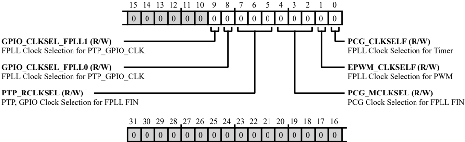

Table 49-4: MISCREG\_CLK\_MUX\_SEL1 Register Fields

| Bit No. (Access)   | Bit Name          | Description/Enumeration                                                                                                                                                                                                                                                                                   |
|--------------------|-------------------|-----------------------------------------------------------------------------------------------------------------------------------------------------------------------------------------------------------------------------------------------------------------------------------------------------------|
| 9 (R/W)            | GPIO_CLKSEL_FPLL1 | FPLL Clock Selection for PTP_GPIO_CLK. 1'b0 - Muxed PCG clock 1'b1 - FPLL output clock                                                                                                                                                                                                                    |
| 8 (R/W)            | GPIO_CLKSEL_FPLL0 | FPLL Clock Selection for PTP_GPIO_CLK. 1'b0 - Muxed PCG clock 1'b1 - FPLL output clock                                                                                                                                                                                                                    |
| 7:5 (R/W)          | PTP_RCLKSEL       | PTP, GPIO Clock Selection for FPLL FIN. 3'b000 - Ext Sync over PA[15] 3'b001 - ETH0 PTPPPS[0] ... 3'b101 - ETH0 PTPPPS[3] 3'b110 - N/A ... 3'b111 - N/A                                                                                                                                                   |
| 4:2 (R/W)          | PCG_MCLKSEL       | PCG Clock Selection for FPLL FIN. 3'b000 - Ext Clk over DAI0- PCGA 3'b001 - Ext Clk over DAI0- PCGB 3'b010 - Ext Clk over DAI0- PCGE 3'b011 - Ext Clk over DAI0- PCGF 3'b100 - Ext Clk over DAI1- PCGC 3'b101 - Ext Clk over DAI1- PCGD 3'b110 - Ext Clk over DAI1- PCGG 3'b111 - Ext Clk over DAI1- PCGH |
| 1 (R/W)            | EPWM_CLKSELF      | FPLL Clock Selection for PWM. 1'b0 - FPLL output clock 1'b1 - Muxed PCG clock                                                                                                                                                                                                                             |
| 0 (R/W)            | PCG_CLKSELF       | FPLL Clock Selection for Timer. 1'b0 - Muxed PCG clock 1'b1 - FPLL output clock                                                                                                                                                                                                                           |

## LPDDR Miscellaneous Register

Figure 49-4: MISCREG\_ECO\_REG1 Register Diagram

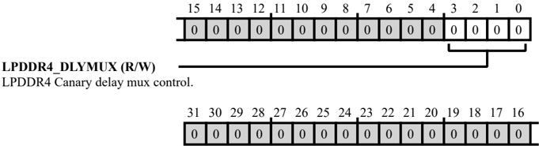

Table 49-5: MISCREG\_ECO\_REG1 Register Fields

| Bit No. (Access)   | Bit Name      | Description/Enumeration           |
|--------------------|---------------|-----------------------------------|
| 3:0 (R/W)          | LPDDR4_DLYMUX | LPDDR4 Canary delay mux control.. |

## EMAC Error Register

The MISCREG\_ECO\_REG9 register contains eight Tx channels, eight Rx channels, and DMA errors for the EMAC.

Figure 49-5: MISCREG\_ECO\_REG9 Register Diagram

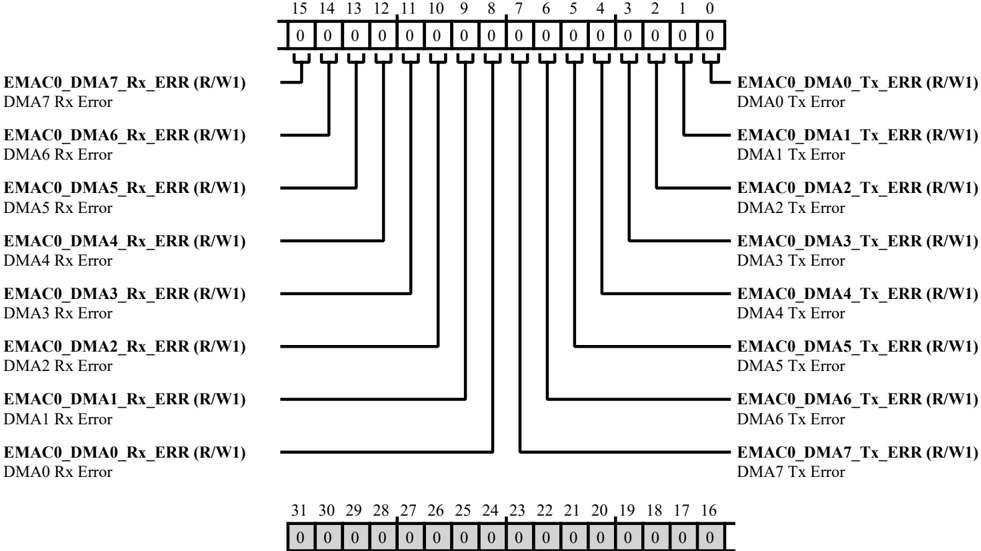

Table 49-6: MISCREG\_ECO\_REG9 Register Fields

| Bit No. (Access)   | Bit Name          | Description/Enumeration                                                              |
|--------------------|-------------------|--------------------------------------------------------------------------------------|
| 15 (R/W1)          | EMAC0_DMA7_RX_ERR | DMA7 Rx Error. DMAreceived a 2nd start (stop) trigger before a stop (start) trigger. |
| 14 (R/W1)          | EMAC0_DMA6_RX_ERR | DMA6 Rx Error. DMAreceived a 2nd start (stop) trigger before a stop (start) trigger. |
| 13 (R/W1)          | EMAC0_DMA5_RX_ERR | DMA5 Rx Error. DMAreceived a 2nd start (stop) trigger before a stop (start) trigger. |
| 12 (R/W1)          | EMAC0_DMA4_RX_ERR | DMA4 Rx Error. DMAreceived a 2nd start (stop) trigger before a stop (start) trigger. |
| 11 (R/W1)          | EMAC0_DMA3_RX_ERR | DMA3 Rx Error. DMAreceived a 2nd start (stop) trigger before a stop (start) trigger. |

Table 49-6: MISCREG\_ECO\_REG9 Register Fields (Continued)

| Bit No. (Access)   | Bit Name          | Description/Enumeration                                                              |
|--------------------|-------------------|--------------------------------------------------------------------------------------|
| 10 (R/W1)          | EMAC0_DMA2_RX_ERR | DMA2 Rx Error. DMAreceived a 2nd start (stop) trigger before a stop (start) trigger. |
| 9 (R/W1)           | EMAC0_DMA1_RX_ERR | DMA1 Rx Error. DMAreceived a 2nd start (stop) trigger before a stop (start) trigger. |
| 8 (R/W1)           | EMAC0_DMA0_RX_ERR | DMA0 Rx Error. DMAreceived a 2nd start (stop) trigger before a stop (start) trigger. |
| 7 (R/W1)           | EMAC0_DMA7_TX_ERR | DMA7 Tx Error. DMAreceived a 2nd start (stop) trigger before a stop (start) trigger. |
| 6 (R/W1)           | EMAC0_DMA6_TX_ERR | DMA6 Tx Error. DMAreceived a 2nd start (stop) trigger before a stop (start) trigger. |
| 5 (R/W1)           | EMAC0_DMA5_TX_ERR | DMA5 Tx Error. DMAreceived a 2nd start (stop) trigger before a stop (start) trigger. |
| 4 (R/W1)           | EMAC0_DMA4_TX_ERR | DMA4 Tx Error. DMAreceived a 2nd start (stop) trigger before a stop (start) trigger. |
| 3 (R/W1)           | EMAC0_DMA3_TX_ERR | DMA3 Tx Error. DMAreceived a 2nd start (stop) trigger before a stop (start) trigger. |
| 2 (R/W1)           | EMAC0_DMA2_TX_ERR | DMA2 Tx Error. DMAreceived a 2nd start (stop) trigger before a stop (start) trigger. |
| 1 (R/W1)           | EMAC0_DMA1_TX_ERR | DMA1 Tx Error. DMAreceived a 2nd start (stop) trigger before a stop (start) trigger. |
| 0 (R/W1)           | EMAC0_DMA0_TX_ERR | DMA0 Tx Error. DMAreceived a 2nd start (stop) trigger before a stop (start) trigger. |

## EMAC Miscellaneous Register

Figure 49-6: MISCREG\_EMAC\_MISC\_REG Register Diagram

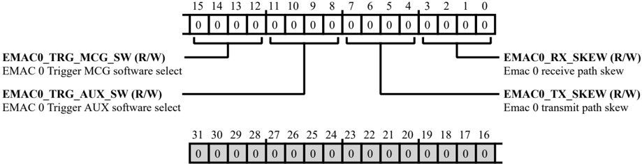

Table 49-7: MISCREG\_EMAC\_MISC\_REG Register Fields

| Bit No. (Access)   | Bit Name         | Description/Enumeration             |
|--------------------|------------------|-------------------------------------|
| 15:12 (R/W)        | EMAC0_TRG_MCG_SW | EMAC 0 Trigger MCGsoftware select.  |
| 11:8 (R/W)         | EMAC0_TRG_AUX_SW | EMAC 0 Trigger AUX software select. |
| 7:4 (R/W)          | EMAC0_TX_SKEW    | Emac 0 transmit path skew.          |
| 3:0 (R/W)          | EMAC0_RX_SKEW    | Emac 0 receive path skew.           |

## EMAC Miscellaneous Register 2

Figure 49-7: MISCREG\_EMAC\_MISC\_REG2 Register Diagram

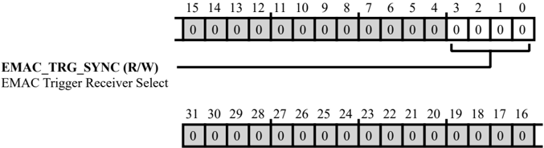

Table 49-8: MISCREG\_EMAC\_MISC\_REG2 Register Fields

| Bit No. (Access)   | Bit Name      | Description/Enumeration       |
|--------------------|---------------|-------------------------------|
| 3:0 (R/W)          | EMAC_TRG_SYNC | EMAC Trigger Receiver Select. |

## EMMC MISC Register

Figure 49-8: MISCREG\_EMMC\_MISC\_REG Register Diagram

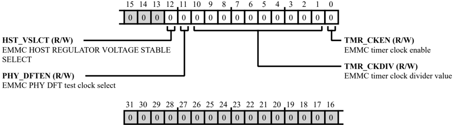

Table 49-9: MISCREG\_EMMC\_MISC\_REG Register Fields

| Bit No. (Access)   | Bit Name   | Description/Enumeration                  |
|--------------------|------------|------------------------------------------|
| 12 (R/W)           | HST_VSLCT  | EMMCHOSTREGULATOR VOLTAGE STABLE SELECT. |
| 11 (R/W)           | PHY_DFTEN  | EMMCPHY DFT test clock select.           |
| 10:1 (R/W)         | TMR_CKDIV  | EMMCtimer clock divider value.           |
| 0 (R/W)            | TMR_CKEN   | EMMCtimer clock enable.                  |

## MINI CGU0 MISC Register

Figure 49-9: MISCREG\_MINI\_CGU0 Register Diagram

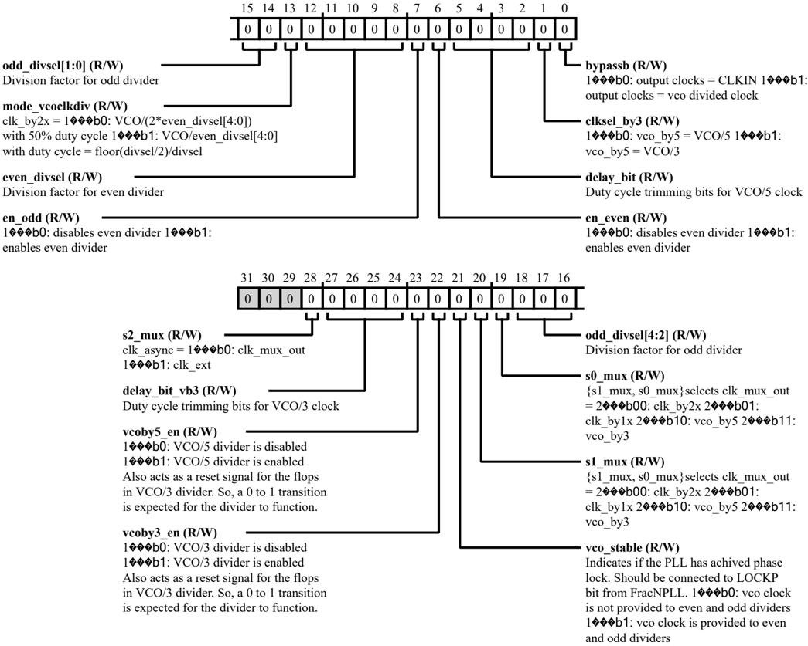

Table 49-10: MISCREG\_MINI\_CGU0 Register Fields

| Bit No. (Access)   | Bit Name      | Description/Enumeration                    |
|--------------------|---------------|--------------------------------------------|
| 28 (R/W)           | S2_MUX        | clk_async = 1b0: clk_mux_out 1b1: clk_ext. |
| 27:24 (R/W)        | DELAY_BIT_VB3 | Duty cycle trimming bits for VCO/3 clock.  |

Table 49-10: MISCREG\_MINI\_CGU0 Register Fields (Continued)

| Bit No. (Access)   | Bit Name       | Description/Enumeration                                                                                                                                                                                   |
|--------------------|----------------|-----------------------------------------------------------------------------------------------------------------------------------------------------------------------------------------------------------|
| 23 (R/W)           | VCOBY5_EN      | 1b0: VCO/5 divider is disabled 1b1: VCO/5 divider is enabled Also acts as a reset signal for the flops in VCO/3 divider. So, a 0 to 1 transition is expected for the divider to function..                |
| 22 (R/W)           | VCOBY3_EN      | 1b0: VCO/3 divider is disabled 1b1: VCO/3 divider is enabled Also acts as a reset signal for the flops in VCO/3 divider. So, a 0 to 1 transition is expected for the divider to function..                |
| 21 (R/W)           | VCO_STABLE     | Indicates if the PLL has achived phase lock. Should be connected to LOCKP bit from FracNPLL. 1b0: vco clock is not provided to even and odd dividers 1b1: vco clock is provided to even and odd dividers. |
| 20 (R/W)           | S1_MUX         | {s1_mux, s0_mux}selects clk_mux_out = 2b00: clk_by2x 2b01: clk_by1x 2b10: vco_by5 2b11: vco_by3.                                                                                                          |
| 19 (R/W)           | S0_MUX         | {s1_mux, s0_mux}selects clk_mux_out = 2b00: clk_by2x 2b01: clk_by1x 2b10: vco_by5 2b11: vco_by3.                                                                                                          |
| 18:14 (R/W)        | ODD_DIVSEL     | Division factor for odd divider.                                                                                                                                                                          |
| 13 (R/W)           | MODE_VCOCLKDIV | clk_by2x = 1b0: VCO/(2*even_divsel[4:0]) with 50% duty cycle 1b1: VCO/even_div- sel[4:0] with duty cycle = floor(divsel/2)/divsel.                                                                        |
| 12:8 (R/W)         | EVEN_DIVSEL    | Division factor for even divider.                                                                                                                                                                         |
| 7 (R/W)            | EN_ODD         | 1b0: disables even divider 1b1: enables even divider.                                                                                                                                                     |
| 6 (R/W)            | EN_EVEN        | 1b0: disables even divider 1b1: enables even divider.                                                                                                                                                     |
| 5:2 (R/W)          | DELAY_BIT      | Duty cycle trimming bits for VCO/5 clock.                                                                                                                                                                 |
| 1 (R/W)            | CLKSEL_BY3     | 1b0: vco_by5 = VCO/5 1b1: vco_by5 = VCO/3.                                                                                                                                                                |
| 0 (R/W)            | BYPASSB        | 1b0: output clocks = CLKIN 1b1: output clocks = vco divided clock.                                                                                                                                        |

## MINI CGU0 MISC Register

Figure 49-10: MISCREG\_MINI\_CGU1 Register Diagram

Table 49-11: MISCREG\_MINI\_CGU1 Register Fields

| Bit No. (Access)   | Bit Name      | Description/Enumeration                    |
|--------------------|---------------|--------------------------------------------|
| 28 (R/W)           | S2_MUX        | clk_async = 1b0: clk_mux_out 1b1: clk_ext. |
| 27:24 (R/W)        | DELAY_BIT_VB3 | Duty cycle trimming bits for VCO/3 clock.  |

Table 49-11: MISCREG\_MINI\_CGU1 Register Fields (Continued)

| Bit No. (Access)   | Bit Name       | Description/Enumeration                                                                                                                                                                                   |
|--------------------|----------------|-----------------------------------------------------------------------------------------------------------------------------------------------------------------------------------------------------------|
| 23 (R/W)           | VCOBY5_EN      | 1b0: VCO/5 divider is disabled 1b1: VCO/5 divider is enabled Also acts as a reset signal for the flops in VCO/3 divider. So, a 0 to 1 transition is expected for the divider to function..                |
| 22 (R/W)           | VCOBY3_EN      | 1b0: VCO/3 divider is disabled 1b1: VCO/3 divider is enabled Also acts as a reset signal for the flops in VCO/3 divider. So, a 0 to 1 transition is expected for the divider to function..                |
| 21 (R/W)           | VCO_STABLE     | Indicates if the PLL has achived phase lock. Should be connected to LOCKP bit from FracNPLL. 1b0: vco clock is not provided to even and odd dividers 1b1: vco clock is provided to even and odd dividers. |
| 20 (R/W)           | S1_MUX         | {s1_mux, s0_mux}selects clk_mux_out = 2b00: clk_by2x 2b01: clk_by1x 2b10: vco_by5 2b11: vco_by3.                                                                                                          |
| 19 (R/W)           | S0_MUX         | {s1_mux, s0_mux}selects clk_mux_out = 2b00: clk_by2x 2b01: clk_by1x 2b10: vco_by5 2b11: vco_by3.                                                                                                          |
| 18:14 (R/W)        | ODD_DIVSEL     | Division factor for odd divider.                                                                                                                                                                          |
| 13 (R/W)           | MODE_VCOCLKDIV | clk_by2x = 1b0: VCO/(2*even_divsel[4:0]) with 50% duty cycle 1b1: VCO/even_div- sel[4:0] with duty cycle = floor(divsel/2)/divsel.                                                                        |
| 12:8 (R/W)         | EVEN_DIVSEL    | Division factor for even divider.                                                                                                                                                                         |
| 7 (R/W)            | EN_ODD         | 1b0: disables even divider 1b1: enables even divider.                                                                                                                                                     |
| 6 (R/W)            | EN_EVEN        | 1b0: disables even divider 1b1: enables even divider.                                                                                                                                                     |
| 5:2 (R/W)          | DELAY_BIT      | Duty cycle trimming bits for VCO/5 clock.                                                                                                                                                                 |
| 1 (R/W)            | CLKSEL_BY3     | 1b0: vco_by5 = VCO/5 1b1: vco_by5 = VCO/3.                                                                                                                                                                |
| 0 (R/W)            | BYPASSB        | 1b0: output clocks = CLKIN 1b1: output clocks = vco divided clock.                                                                                                                                        |

## SH0 Prefetch Range Selection Register

In the MISCREG\_SH0\_PFB\_RANGE\_SELECT register, each bit field controls if the corresponding address range will be prefetched. When an address range is set it is prefetched and when it is zero there is no prefetch.

The MISCREG\_SH0\_PFB\_RANGE\_SELECT [31:16] bits control the range selection for the instruction cache, and MISCREG\_SH0\_PFB\_RANGE\_SELECT [15:0] bits control the range selection for the data cache.

Figure 49-11: MISCREG\_SH0\_PFB\_RANGE\_SELECT Register Diagram

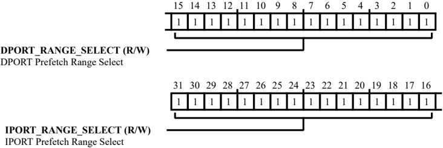

Table 49-12: MISCREG\_SH0\_PFB\_RANGE\_SELECT Register Fields

| Bit No. (Access)   | Bit Name             | Description/Enumeration                                                                                                                      |
|--------------------|----------------------|----------------------------------------------------------------------------------------------------------------------------------------------|
| 31:16 (R/W)        | IPORT_RANGE_SELECT   | IPORT Prefetch Range Select. The MISCREG_SH0_PFB_RANGE_SELECT.IPORT_RANGE_SELECT bit field indicates the prefetch range selection for IPORT. |
| 15:0 (R/W)         | DPORT_RANGE_SE- LECT | DPORT Prefetch Range Select. The MISCREG_SH0_PFB_RANGE_SELECT.DPORT_RANGE_SELECT bit field indicates the prefetch range selection for DPORT. |

## SH1 Prefetch Range Selection Register

Each bit field controls if the corresponding address range will be prefetched. When an address range is set it is prefetched an when it is zero there is no prefetch.

The MISCREG\_SH1\_PFB\_RANGE\_SELECT [31:16] bits control the range selection for the instruction cache, and MISCREG\_SH1\_PFB\_RANGE\_SELECT [15:0] bits control the range selection for the data cache.

Figure 49-12: MISCREG\_SH1\_PFB\_RANGE\_SELECT Register Diagram

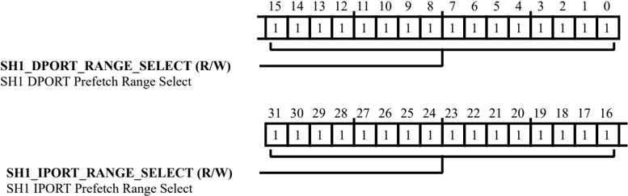

Table 49-13: MISCREG\_SH1\_PFB\_RANGE\_SELECT Register Fields

| Bit No. (Access)   | Bit Name                 | Description/Enumeration                                                                                                                              |
|--------------------|--------------------------|------------------------------------------------------------------------------------------------------------------------------------------------------|
| 31:16 (R/W)        | SH1_IPORT_RANGE_SE- LECT | SH1 IPORT Prefetch Range Select. The MISCREG_SH1_PFB_RANGE_SELECT.SH1_IPORT_RANGE_SELECT bit field indicates the prefetch range selection for IPORT. |
| 15:0 (R/W)         | SH1_DPORT_RANGE_SE LECT  | SH1 DPORT Prefetch Range Select. The MISCREG_SH1_PFB_RANGE_SELECT.SH1_DPORT_RANGE_SELECT bit field indicates the prefetch range selection for DPORT. |

## SPORT Direct Interrupt Enable for SH0 and SH1

The bits in the MISCREG\_SHARC\_BRIDGE\_REMAP register control the direct connection of SPORT interrupts to the SHARC core.

Figure 49-13: MISCREG\_SHARC\_BRIDGE\_REMAP Register Diagram

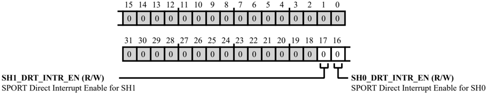

Table 49-14: MISCREG\_SHARC\_BRIDGE\_REMAP Register Fields

| Bit No. (Access)   | Bit Name        | Description/Enumeration                                                                                                                                                                                                                                                                          |
|--------------------|-----------------|--------------------------------------------------------------------------------------------------------------------------------------------------------------------------------------------------------------------------------------------------------------------------------------------------|
| 17 (R/W)           | SH1_DRT_INTR_EN | SPORT Direct Interrupt Enable for SH1. If the MISCREG_SHARC_BRIDGE_REMAP.SH1_DRT_INTR_EN bit is set a direct connection is enabled for SH1. Do not set the MISCREG_SHARC_BRIDGE_REMAP.SH1_DRT_INTR_EN bit when IIR1 of the SH1 is in use. If this bit is zero the direct connection is disabled. |
| 16 (R/W)           | SH0_DRT_INTR_EN | SPORT Direct Interrupt Enable for SH0. If the MISCREG_SHARC_BRIDGE_REMAP.SH0_DRT_INTR_EN bit is set a direct connection is enabled for SH0. Do not set the MISCREG_SHARC_BRIDGE_REMAP.SH0_DRT_INTR_EN bit when IIR1 of the SH0 is in use. If this bit is zero the direct connection is disabled. |

## XSPI1 Boot/Init Control Register 0

Figure 49-14: MISCREG\_XSPI1\_CTL0 Register Diagram

Table 49-15: MISCREG\_XSPI1\_CTL0 Register Fields

| Bit No. (Access)   | Bit Name            | Description/Enumeration                                          |
|--------------------|---------------------|------------------------------------------------------------------|
| 22 (R/W)           | SQ_CRC_UL_CHNK_CH K | Drives discovery_seq_crc_ual_chunk_chk port of xSPI controller.. |
| 21 (R/W)           | SQ_CRC_UL_CHNK_EN   | Drives discovery_seq_crc_ual_chunk_en port of xSPI controller..  |
| 20:18 (R/W)        | SQ_CRC_CHNK_SZ      | Drives discovery_seq_crc_chunk_size port of xSPI controller..    |
| 17 (R/W)           | SQ_CRC_OE           | Drives discovery_seq_crc_oe port of xSPI controller..            |

Table 49-15: MISCREG\_XSPI1\_CTL0 Register Fields (Continued)

| Bit No. (Access)   | Bit Name    | Description/Enumeration                                    |
|--------------------|-------------|------------------------------------------------------------|
| 16 (R/W)           | SQ_CRC_VRNT | Drives discovery_seq_crc_variant port of xSPI controller.. |
| 15 (R/W)           | SQ_CRC_EN   | Drives discovery_seq_crc_en port of xSPI controller..      |
| 14:12 (R/W)        | BNK         | Drives discovery_bank port of xSPI controller..            |
| 11 (R/W)           | ABNM        | Drives discovery_abnum port of xSPI controller..           |
| 10 (R/W)           | DMMY_CNT    | Drives discovery_dummy_cnt port of xSPI controller..       |
| 9:8 (R/W)          | CMD_TYP     | Drives discovery_cmd_type port of xSPI controller..        |
| 7 (R/W)            | EXTP_EN     | Drives discovery_extop_en port of xSPI controller..        |
| 6 (R/W)            | EXTP_VL     | Drives discovery_extop_val port of xSPI controller..       |
| 5:2 (R/W)          | NM_LNS      | Drives discovery_num_lines port of xSPI controller..       |
| 1 (R/W)            | INHBT       | Drives discovery_inhibit port of xSPI controller..         |
| 0 (R/W)            | BT_EN       | Samples boot_en port of xSPI PHY.                          |

## XSPI1 Boot/Init Control Register 1

controller. Drives init\_rb\_valid\_time port of xSPI

Figure 49-15: MISCREG\_XSPI1\_CTL1 Register Diagram

Table 49-16: MISCREG\_XSPI1\_CTL1 Register Fields

| Bit No. (Access)   | Bit Name   | Description/Enumeration                             |
|--------------------|------------|-----------------------------------------------------|
| 31:0               | RB_VLD_TM  | Drives init_rb_valid_time port of xSPI controller.. |
| (R/W)              |            |                                                     |

## XSPI1 Boot/Init Control Register 2

Figure 49-16: MISCREG\_XSPI1\_CTL2 Register Diagram

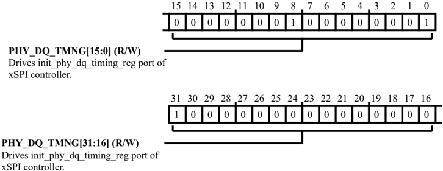

Table 49-17: MISCREG\_XSPI1\_CTL2 Register Fields

| Bit No. (Access)   | Bit Name    | Description/Enumeration                                 |
|--------------------|-------------|---------------------------------------------------------|
| 31:0 (R/W)         | PHY_DQ_TMNG | Drives init_phy_dq_timing_reg port of xSPI controller.. |

## XSPI1 Boot/Init Control Register 3

Figure 49-17: MISCREG\_XSPI1\_CTL3 Register Diagram

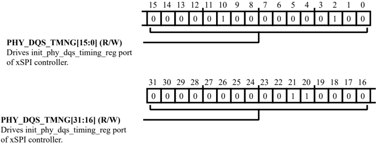

Table 49-18: MISCREG\_XSPI1\_CTL3 Register Fields

| Bit No. (Access)   | Bit Name     | Description/Enumeration                                  |
|--------------------|--------------|----------------------------------------------------------|
| 31:0 (R/W)         | PHY_DQS_TMNG | Drives init_phy_dqs_timing_reg port of xSPI controller.. |

## XSPI1 Boot/Init Control Register 4

Figure 49-18: MISCREG\_XSPI1\_CTL4 Register Diagram

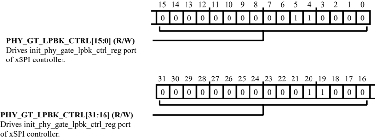

Table 49-19: MISCREG\_XSPI1\_CTL4 Register Fields

| Bit No. (Access)   | Bit Name         | Description/Enumeration                                      |
|--------------------|------------------|--------------------------------------------------------------|
| 31:0 (R/W)         | PHY_GT_LPBK_CTRL | Drives init_phy_gate_lpbk_ctrl_reg port of xSPI controller.. |

## XSPI1 Boot/Init Control Register 5

Figure 49-19: MISCREG\_XSPI1\_CTL5 Register Diagram

Table 49-20: MISCREG\_XSPI1\_CTL5 Register Fields

| Bit No. (Access)   | Bit Name         | Description/Enumeration                                   |
|--------------------|------------------|-----------------------------------------------------------|
| 31:0 (R/W)         | PHY_DLL_REQ_CTRL | Drives init_phy_dll_req_ctrl_reg Port of xSPI Controller. |

## XSPI1 Boot/Init Control Register 6

Figure 49-20: MISCREG\_XSPI1\_CTL6 Register Diagram

Table 49-21: MISCREG\_XSPI1\_CTL6 Register Fields

| Bit No. (Access)   | Bit Name          | Description/Enumeration                                    |
|--------------------|-------------------|------------------------------------------------------------|
| 31:0 (R/W)         | PHY_DLL_COMP_CTRL | Drives init_phy_dll_comp_ctrl_reg Port of xSPI Controller. |

## XSPI1 Boot/Init Control Register 7

Figure 49-21: MISCREG\_XSPI1\_CTL7 Register Diagram

Table 49-22: MISCREG\_XSPI1\_CTL7 Register Fields

| Bit No. (Access)   | Bit Name              | Description/Enumeration                                       |
|--------------------|-----------------------|---------------------------------------------------------------|
| 4 (R/W)            | SDR_EDG_ACTV          | Drives init_sdr_edge_active port of xSPI controller..         |
| 3 (R/W)            | DQS_LST_DT_DRP_EN     | Drives init_dqs_last_data_drop_en port of xSPI controller..   |
| 2 (R/W)            | RST_DQ3_ENBL          | Drives init_rst_dq3_enable port of xSPI controller..          |
| 1 (R/W)            | SW_CTRLD_HW_RST_O PTN | Drives init_sw_ctrled_hw_rst_option port of xSPI controller.. |
| 0 (R/W)            | WP_ENBL               | Drives init_wp_enable port of xSPI controller..               |

## XSPI1 Boot/Init Control Register 8

Figure 49-22: MISCREG\_XSPI1\_CTL8 Register Diagram

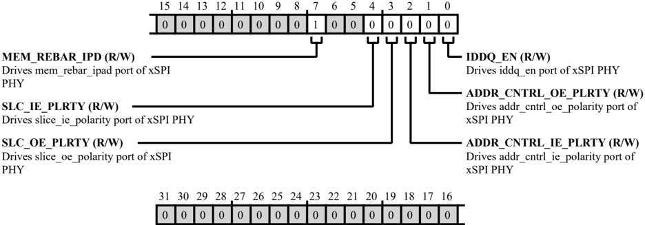

Table 49-23: MISCREG\_XSPI1\_CTL8 Register Fields

| Bit No. (Access)   | Bit Name             | Description/Enumeration                         |
|--------------------|----------------------|-------------------------------------------------|
| 7 (R/W)            | MEM_REBAR_IPD        | Drives mem_rebar_ipad port of xSPI PHY.         |
| 4 (R/W)            | SLC_IE_PLRTY         | Drives slice_ie_polarity port of xSPI PHY.      |
| 3 (R/W)            | SLC_OE_PLRTY         | Drives slice_oe_polarity port of xSPI PHY.      |
| 2 (R/W)            | ADDR_CNTRL_IE_PLRT Y | Drives addr_cntrl_ie_polarity port of xSPI PHY. |
| 1 (R/W)            | ADDR_CNTRL_OE_PLR TY | Drives addr_cntrl_oe_polarity port of xSPI PHY. |
| 0 (R/W)            | IDDQ_EN              | Drives iddq_en port of xSPI PHY.                |

## XSPI1 Boot/Init Reset Control Register

Figure 49-23: MISCREG\_XSPI1\_RSTCTL Register Diagram

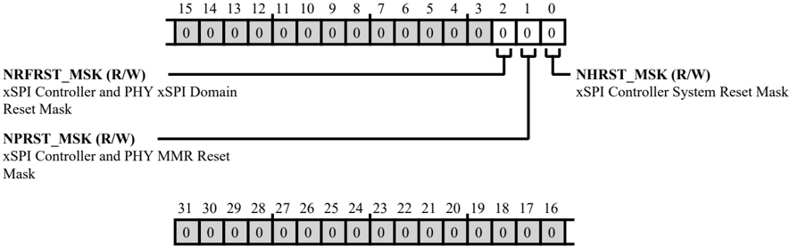

Table 49-24: MISCREG\_XSPI1\_RSTCTL Register Fields

| Bit No. (Access)   | Bit Name   | Description/Enumeration                         |
|--------------------|------------|-------------------------------------------------|
| 2 (R/W)            | NRFRST_MSK | xSPI Controller and PHY xSPI Domain Reset Mask. |
| 1 (R/W)            | NPRST_MSK  | xSPI Controller and PHY MMRReset Mask.          |
| 0 (R/W)            | NHRST_MSK  | xSPI Controller System Reset Mask.              |

## XSPI1 Boot/Init Status Register

Figure 49-24: MISCREG\_XSPI1\_STAT0 Register Diagram

Table 49-25: MISCREG\_XSPI1\_STAT0 Register Fields

| Bit No. (Access)   | Bit Name   | Description/Enumeration                      |
|--------------------|------------|----------------------------------------------|
| 5 (R/W)            | CTRL_BSY   | Samples ctrl_busy port of xSPI controller..  |
| 4:3 (R/W)          | INIT_FL    | Samples init_fail port of xSPI controller..  |
| 2 (R/W)            | INIT_CMP   | Samples init_comp port of xSPI controller..  |
| 1 (R/W)            | BT_ERRR    | Samples boot_error port of xSPI controller.. |
| 0 (R/W)            | BT_CMP     | Samples boot_comp port of xSPI controller..  |

## XSPI Boot/Init Control Register 0

Figure 49-25: MISCREG\_XSPI\_CTL0 Register Diagram

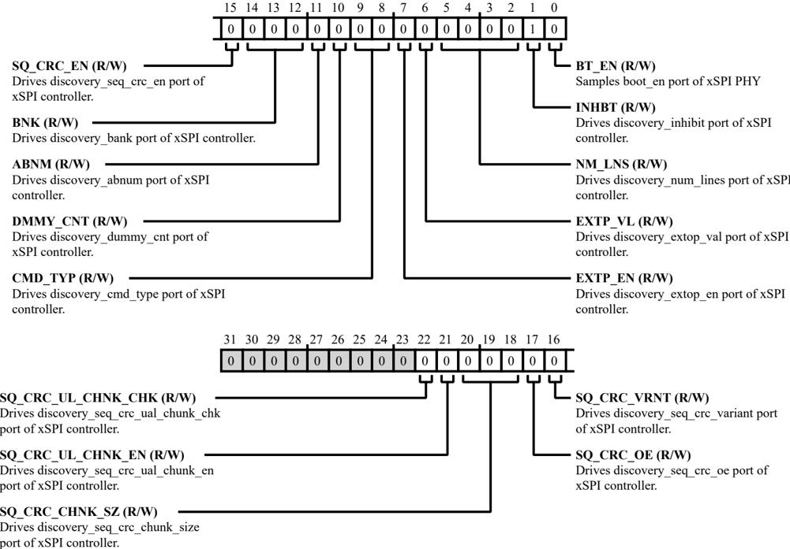

Table 49-26: MISCREG\_XSPI\_CTL0 Register Fields

| Bit No. (Access)   | Bit Name            | Description/Enumeration                                          |
|--------------------|---------------------|------------------------------------------------------------------|
| 22 (R/W)           | SQ_CRC_UL_CHNK_CH K | Drives discovery_seq_crc_ual_chunk_chk port of xSPI controller.. |
| 21 (R/W)           | SQ_CRC_UL_CHNK_EN   | Drives discovery_seq_crc_ual_chunk_en port of xSPI controller..  |
| 20:18 (R/W)        | SQ_CRC_CHNK_SZ      | Drives discovery_seq_crc_chunk_size port of xSPI controller..    |
| 17 (R/W)           | SQ_CRC_OE           | Drives discovery_seq_crc_oe port of xSPI controller..            |

Table 49-26: MISCREG\_XSPI\_CTL0 Register Fields (Continued)

| Bit No. (Access)   | Bit Name    | Description/Enumeration                                    |
|--------------------|-------------|------------------------------------------------------------|
| 16 (R/W)           | SQ_CRC_VRNT | Drives discovery_seq_crc_variant port of xSPI controller.. |
| 15 (R/W)           | SQ_CRC_EN   | Drives discovery_seq_crc_en port of xSPI controller..      |
| 14:12 (R/W)        | BNK         | Drives discovery_bank port of xSPI controller..            |
| 11 (R/W)           | ABNM        | Drives discovery_abnum port of xSPI controller..           |
| 10 (R/W)           | DMMY_CNT    | Drives discovery_dummy_cnt port of xSPI controller..       |
| 9:8 (R/W)          | CMD_TYP     | Drives discovery_cmd_type port of xSPI controller..        |
| 7 (R/W)            | EXTP_EN     | Drives discovery_extop_en port of xSPI controller..        |
| 6 (R/W)            | EXTP_VL     | Drives discovery_extop_val port of xSPI controller..       |
| 5:2 (R/W)          | NM_LNS      | Drives discovery_num_lines port of xSPI controller..       |
| 1 (R/W)            | INHBT       | Drives discovery_inhibit port of xSPI controller..         |
| 0 (R/W)            | BT_EN       | Samples boot_en port of xSPI PHY.                          |

## XSPI Boot/Init Control Register 1

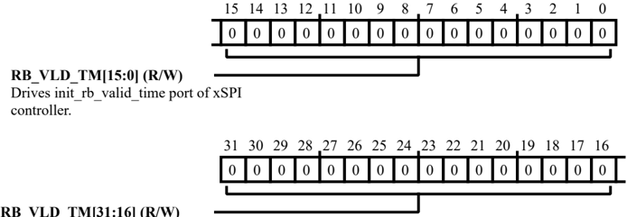

controller. Drives init\_rb\_valid\_time port of xSPI

Figure 49-26: MISCREG\_XSPI\_CTL1 Register Diagram

Table 49-27: MISCREG\_XSPI\_CTL1 Register Fields

| Bit No. (Access)   | Bit Name   | Description/Enumeration                             |
|--------------------|------------|-----------------------------------------------------|
| 31:0               | RB_VLD_TM  | Drives init_rb_valid_time port of xSPI controller.. |
| (R/W)              |            |                                                     |

## XSPI Boot/Init Control Register 2

Figure 49-27: MISCREG\_XSPI\_CTL2 Register Diagram

Table 49-28: MISCREG\_XSPI\_CTL2 Register Fields

| Bit No. (Access)   | Bit Name    | Description/Enumeration                                 |
|--------------------|-------------|---------------------------------------------------------|
| 31:0 (R/W)         | PHY_DQ_TMNG | Drives init_phy_dq_timing_reg port of xSPI controller.. |

## XSPI Boot/Init Control Register 3

Figure 49-28: MISCREG\_XSPI\_CTL3 Register Diagram

Table 49-29: MISCREG\_XSPI\_CTL3 Register Fields

| Bit No. (Access)   | Bit Name     | Description/Enumeration                                  |
|--------------------|--------------|----------------------------------------------------------|
| 31:0 (R/W)         | PHY_DQS_TMNG | Drives init_phy_dqs_timing_reg port of xSPI controller.. |

## XSPI Boot/Init Control Register 4

Figure 49-29: MISCREG\_XSPI\_CTL4 Register Diagram

Table 49-30: MISCREG\_XSPI\_CTL4 Register Fields

| Bit No. (Access)   | Bit Name         | Description/Enumeration                                      |
|--------------------|------------------|--------------------------------------------------------------|
| 31:0 (R/W)         | PHY_GT_LPBK_CTRL | Drives init_phy_gate_lpbk_ctrl_reg port of xSPI controller.. |

## XSPI Boot/Init Control Register 5

Figure 49-30: MISCREG\_XSPI\_CTL5 Register Diagram

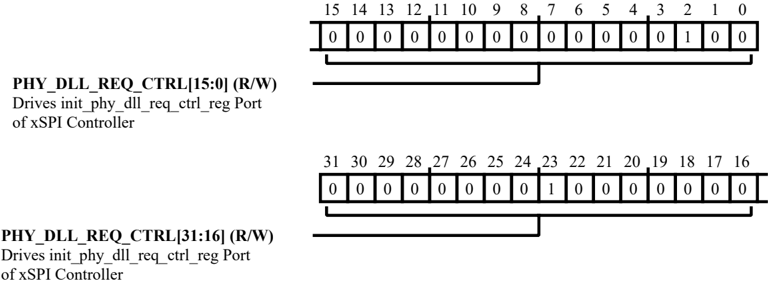

Table 49-31: MISCREG\_XSPI\_CTL5 Register Fields

| Bit No. (Access)   | Bit Name         | Description/Enumeration                                   |
|--------------------|------------------|-----------------------------------------------------------|
| 31:0 (R/W)         | PHY_DLL_REQ_CTRL | Drives init_phy_dll_req_ctrl_reg Port of xSPI Controller. |

## XSPI Boot/Init Control Register 6

Figure 49-31: MISCREG\_XSPI\_CTL6 Register Diagram

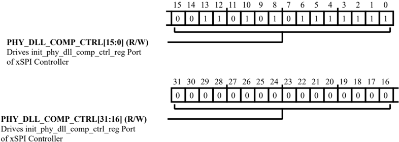

Table 49-32: MISCREG\_XSPI\_CTL6 Register Fields

| Bit No. (Access)   | Bit Name          | Description/Enumeration                                    |
|--------------------|-------------------|------------------------------------------------------------|
| 31:0 (R/W)         | PHY_DLL_COMP_CTRL | Drives init_phy_dll_comp_ctrl_reg Port of xSPI Controller. |

## XSPI Boot/Init Control Register 7

Figure 49-32: MISCREG\_XSPI\_CTL7 Register Diagram

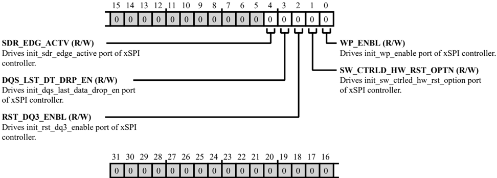

Table 49-33: MISCREG\_XSPI\_CTL7 Register Fields

| Bit No. (Access)   | Bit Name              | Description/Enumeration                                       |
|--------------------|-----------------------|---------------------------------------------------------------|
| 4 (R/W)            | SDR_EDG_ACTV          | Drives init_sdr_edge_active port of xSPI controller..         |
| 3 (R/W)            | DQS_LST_DT_DRP_EN     | Drives init_dqs_last_data_drop_en port of xSPI controller..   |
| 2 (R/W)            | RST_DQ3_ENBL          | Drives init_rst_dq3_enable port of xSPI controller..          |
| 1 (R/W)            | SW_CTRLD_HW_RST_O PTN | Drives init_sw_ctrled_hw_rst_option port of xSPI controller.. |
| 0 (R/W)            | WP_ENBL               | Drives init_wp_enable port of xSPI controller..               |

## XSPI Boot/Init Control Register 8

Figure 49-33: MISCREG\_XSPI\_CTL8 Register Diagram

Table 49-34: MISCREG\_XSPI\_CTL8 Register Fields

| Bit No. (Access)   | Bit Name             | Description/Enumeration                         |
|--------------------|----------------------|-------------------------------------------------|
| 7 (R/W)            | MEM_REBAR_IPD        | Drives mem_rebar_ipad port of xSPI PHY.         |
| 4 (R/W)            | SLC_IE_PLRTY         | Drives slice_ie_polarity port of xSPI PHY.      |
| 3 (R/W)            | SLC_OE_PLRTY         | Drives slice_oe_polarity port of xSPI PHY.      |
| 2 (R/W)            | ADDR_CNTRL_IE_PLRT Y | Drives addr_cntrl_ie_polarity port of xSPI PHY. |
| 1 (R/W)            | ADDR_CNTRL_OE_PLR TY | Drives addr_cntrl_oe_polarity port of xSPI PHY. |
| 0 (R/W)            | IDDQ_EN              | Drives iddq_en port of xSPI PHY.                |

## XSPI Boot/Init Reset Control Register

Figure 49-34: MISCREG\_XSPI\_RSTCTL Register Diagram

Table 49-35: MISCREG\_XSPI\_RSTCTL Register Fields

| Bit No. (Access)   | Bit Name   | Description/Enumeration                         |
|--------------------|------------|-------------------------------------------------|
| 2 (R/W)            | NRFRST_MSK | xSPI Controller and PHY xSPI Domain Reset Mask. |
| 1 (R/W)            | NPRST_MSK  | xSPI Controller and PHY MMRReset Mask.          |
| 0 (R/W)            | NHRST_MSK  | xSPI Controller System Reset Mask.              |

## XSPI Boot/Init Status Register

Figure 49-35: MISCREG\_XSPI\_STAT0 Register Diagram

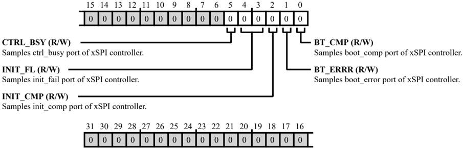

Table 49-36: MISCREG\_XSPI\_STAT0 Register Fields

| Bit No. (Access)   | Bit Name   | Description/Enumeration                      |
|--------------------|------------|----------------------------------------------|
| 5 (R/W)            | CTRL_BSY   | Samples ctrl_busy port of xSPI controller..  |
| 4:3 (R/W)          | INIT_FL    | Samples init_fail port of xSPI controller..  |
| 2 (R/W)            | INIT_CMP   | Samples init_comp port of xSPI controller..  |
| 1 (R/W)            | BT_ERRR    | Samples boot_error port of xSPI controller.. |
| 0 (R/W)            | BT_CMP     | Samples boot_comp port of xSPI controller..  |